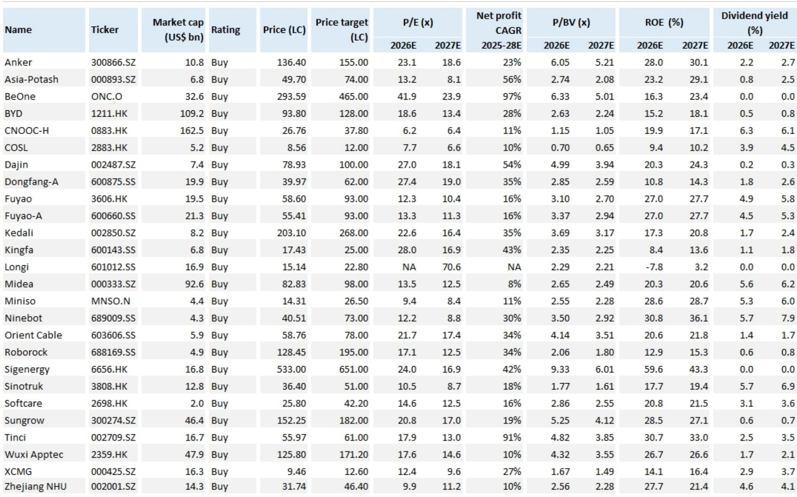
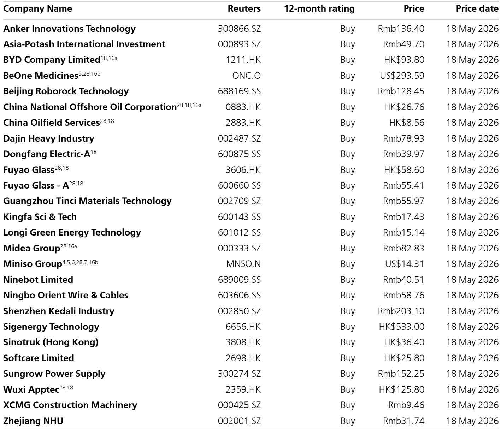
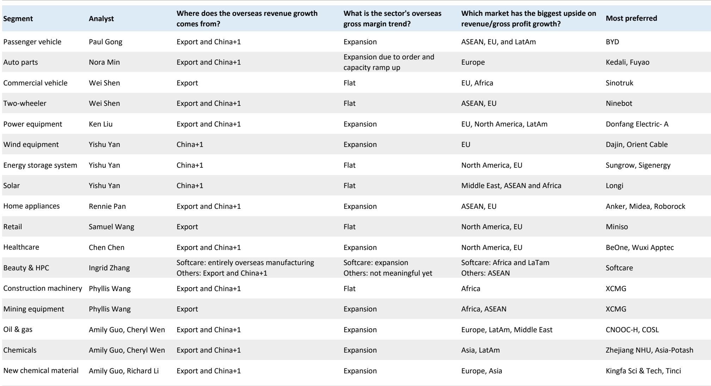

# 中国出海企业的真实价值不在营收占比，而在利润结构的重构

市场对“中国企业走出去”的讨论，大多停留在对营收规模的线性外推上。但某外资投行最新一份研报的核心贡献，在于它把问题从“能赚多少海外收入”，升级到了“海外收入如何系统性改变中国企业的利润结构”。这份报告给出的核心判断是：到2030年，非金融A股公司的海外收入占比将从2025年的19%提升至25%。这本身并不令人意外。真正值得关注的，是报告通过敏感性分析揭示出的二阶效应：在海外毛利率保持稳定、国内营收复合增速5%的假设下，A股整体的毛利润到2030年有望比2025年增长35%。换句话说，海外业务正在从“增量补充”变成“利润放大器”。

这一判断之所以重要，是因为它改变了投资者评估中国企业的坐标系。过去几年，市场对中国制造业的担忧集中于国内价格战、产能过剩和利润率压缩。而这份报告提供的框架表明，出海不仅是在消化过剩产能，更是在重构企业的定价权和盈利质量。当海外收入占比从五分之一提升到四分之一，其边际贡献可能远超简单的比例增长。

以下，我们基于这份报告的数据框架和分析逻辑，拆解出海趋势背后的结构性变化，并指出报告尚未完全回答的关键问题。

## 1. 海外收入占比提升的背后，是供应链韧性的重新定价

报告指出，2024年到2025年，非金融A股公司的海外收入占比从17%提升到了19%，一年内扩大了2个百分点。这一速度本身就是一个信号。但更值得深究的是驱动因素。报告明确提到，中东冲突对全球供应链的冲击，反而可能成为中国企业的结构性利好——原因在于，中国企业在疫情期间证明了其供应链的韧性。

这是一个容易被忽视的洞察。传统的出海叙事强调成本优势和制造能力，但报告隐含的逻辑是：在全球供应链频繁断裂的背景下，中国企业正在获得一种“可靠性溢价”。客户不再仅仅因为便宜而采购中国产品，而是因为只有中国企业能够稳定交货。这种信任一旦建立，就会转化为更高的客户粘性和定价权。

报告没有展开的是，这种“可靠性溢价”能在多大程度上转化为可持续的毛利率优势。从行业数据来看，2025年海外毛利率扩张最为显著的行业是制药（从45%升至51%），而多数制造业的海外毛利率仍在20%-30%区间。这意味着，不同行业在海外市场的议价能力差异巨大，投资者需要区分哪些是真正的结构性改善，哪些只是短期订单红利。

## 2. 出口与“中国+1”是两条并行但权重不同的增长路径

报告将出海动因分为两类：出口驱动和“中国+1”（即海外建厂）。在覆盖的17个细分行业中，分析师认为14个以出口为主。这一比例说明，尽管海外建厂是热门话题，但至少在可预见的五年内，传统出口仍是海外收入增长的主力。

但两者的利润结构完全不同。出口模式下，中国企业仍以国内产能供应全球，毛利率受制于国内制造成本和运费波动。而“中国+1”模式下，海外工厂的产能利用率爬坡期可能压低短期利润率，但一旦达到盈亏平衡点，毛利率往往能显著高于国内。报告提到，多数子行业的海外毛利率有望扩张，主要驱动因素是更高的售价和更高的海外产能利用率。这暗示，那些已经完成海外产能布局的企业，可能正在进入利润释放期。

从区域分布看，欧洲和东盟被分析师视为海外收入增长的主要贡献区域，而非洲被列为下一个关键增长极，理由是2026-27年宏观环境改善预期和大宗商品价格有利。这一判断值得投资者提前布局，但报告也承认，非洲市场的营商环境、汇率风险和物流基础设施仍存在较大不确定性，这里需要持续跟踪验证。

## 3. 电力与汽车供应链是出海最激进的赛道，但估值已经部分反映预期

报告明确指出，电力设备和汽车供应链的海外营收增速最为激进。分析师预测，中国风电设备和新型化工材料企业在2025-2030年间的海外营收复合增长率将超过25%，且海外毛利率同步扩张。

以风电设备为例，报告将欧盟视为主要增量市场。欧洲海上风电装机目标激进，但本土产能不足，中国风电企业凭借成本优势和交付能力正在填补这一缺口。同样，汽车供应链（尤其是动力电池和零部件）的出海逻辑已经广为人知，但报告提供的量化框架让投资者可以估算：如果海外毛利率扩张1个百分点，对整体毛利润的影响有多大。

不过，报告列出的首选标的中，许多已经享受了较高的市场估值溢价。例如，某储能系统公司的2026年预期市盈率达到24倍，某新能源车龙头的预期市盈率也在18倍以上。对于这些标的，出海逻辑的兑现程度将成为估值能否维持的关键。报告没有直接回答的问题是：当前股价中已经计入了多少出海预期？如果海外毛利率扩张不及预期，估值修正的风险有多大？

## 4. 毛利润的35%增长假设，隐含了哪些尚未验证的前提？

报告最引人注目的结论之一是：在海外收入占比25%、海外毛利率稳定、国内营收复合增速5%的假设下，A股整体毛利润到2030年可增长35%。这一数字极具吸引力，但投资者需要拆解背后的假设条件。

第一个假设是海外毛利率稳定。从历史数据看，2025年海外毛利率确实在多数行业有所扩张，但这一趋势能否持续五年？随着更多中国企业进入海外市场，竞争加剧可能压缩毛利率。报告提到海外毛利率扩张的驱动力是“更高的售价”，但这一假设需要验证：中国企业在海外市场是否真的能够持续收取溢价，还是说当前的高毛利率只是供需错配的短期现象？

第二个假设是国内营收5%的复合增速。在国内宏观经济面临结构性转型的背景下，这一增速是否过于乐观？如果国内营收增速低于预期，海外收入的相对贡献会更大，但整体毛利润的绝对增长可能不及预测。

第三个隐含假设是贸易摩擦不会显著升级。报告虽然将中东冲突视为利好，但并未深入讨论欧美对中国制造业的贸易壁垒升级风险。如果主要市场对中国商品加征关税或实施配额限制，海外毛利率和营收增速都将面临压力。

这些假设并非不成立，但投资者需要保持清醒：这份报告的35%毛利润增长是一个“基准情形”，而非必然结果。真正的投资机会，可能存在于那些即使在这些假设部分失效时仍能保持韧性的企业。

## 5. 报告尚未完全回答的关键问题：中国企业的海外定价权能持续多久？

这是整份报告最值得追问的问题。报告提供了详实的数据证明中国企业在海外市场的毛利率正在改善，但没有深入分析这种改善的来源。是产品差异化带来的定价权，还是单纯的产能稀缺溢价？如果是后者，随着海外产能的逐步投放，毛利率扩张的趋势可能难以持续。

以汽车零部件为例，报告提到海外毛利率扩张的原因是“订单和产能爬坡”。这本质上是一个规模效应驱动的短期现象。一旦产能利用率达到高点，毛利率的进一步改善就需要依靠产品升级或品牌溢价。中国企业在这些方面是否具备可持续的竞争优势，报告没有给出明确答案。

同样，在新能源领域，中国企业的成本优势确实显著，但欧美本土企业正在加速追赶，且政策层面可能通过补贴和关税来保护本土产业。中国企业的海外毛利率能否在2027-2030年期间保持扩张，存在较大的不确定性。

这些问题并非报告的缺陷，而是任何前瞻性分析都必须面对的不确定性。对于投资者而言，真正有价值的问题不是“出海是不是好趋势”，而是“哪些企业能在出海过程中构建起可持续的竞争壁垒”。

---

这份报告提供了中国出海主题最系统的量化框架，但正如我们所指出的，关键假设的验证和行业间的差异化才是投资决策的核心。我们已经在星球内上传了完整的原始报告PDF，包括所有子行业的海外营收预测、毛利率敏感性分析以及首选标的的估值对比表。

如果你对以下问题感兴趣，欢迎来星球微信群里继续讨论：哪些行业的海外毛利率扩张最有可能被证伪？非洲市场的真实风险与回报如何量化？当前估值中已经计入了多少出海预期？

Personal reading notes and learning share only. Not investment advice.

