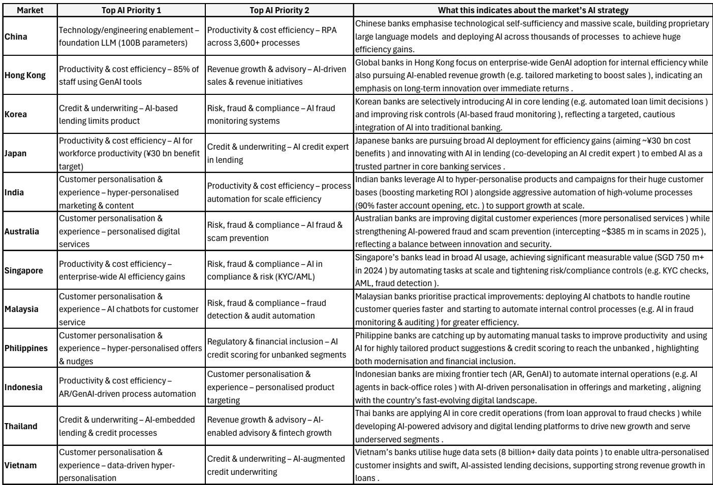
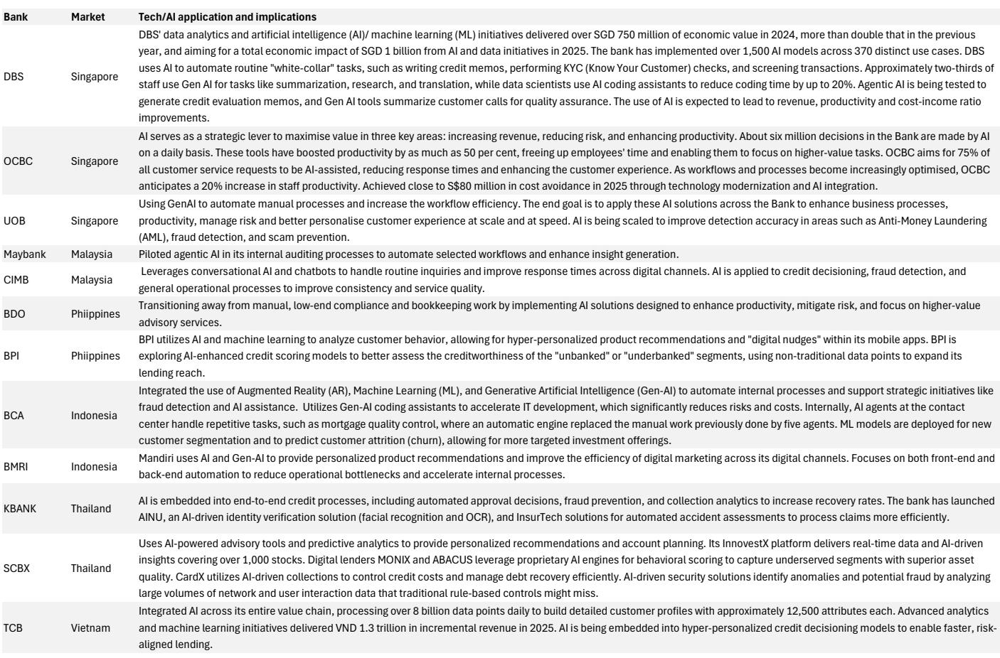
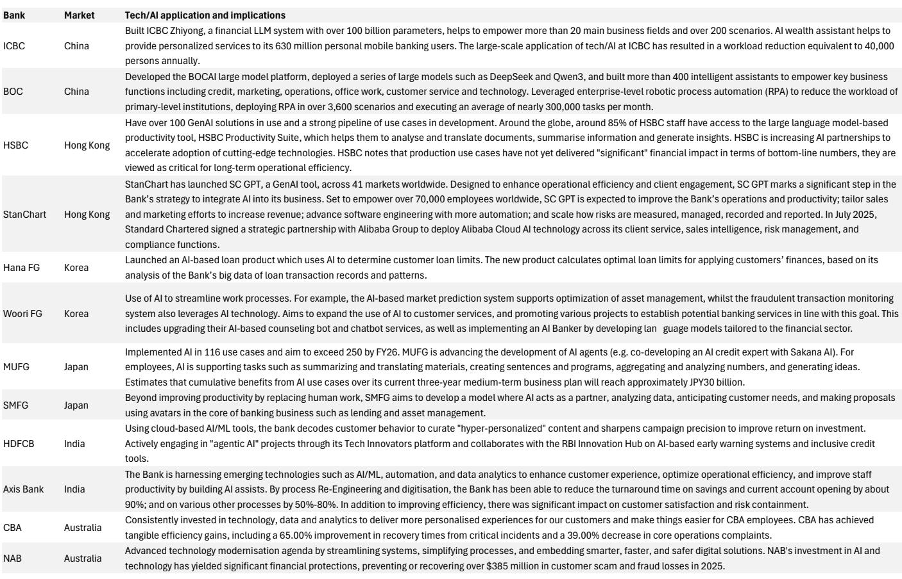

# 亚洲银行真正的拐点不是AI，而是成本效率红利已近尾声

过去二十年，亚洲银行用成本纪律撑起了利润，但这一模式正在逼近极限。某外资投行最新发布的亚洲银行业深度报告揭示了一个容易被忽视的事实：传统效率杠杆的边际回报正在递减，而AI作为下一个结构性效率引擎，其定价远未被市场消化。这不是一篇关于“AI将如何颠覆银行”的乐观叙事，而是一份关于“当旧杠杆失效后，什么将真正决定银行估值分化”的冷静推演。

## 1. 二十年成本压缩只覆盖了三分之二的收入缺口，新兴市场反而做得更好

亚洲银行面临的结构性收入压力是真实的、持久的，而非周期性的。报告数据显示，过去20年间，亚洲银行的净利息收入与资产之比平均下降了45个基点，而手续费收入与资产之比也下降了约15个基点。两者叠加，总营收与资产之比累计下降了约60个基点。人口老龄化正在拖累存款积累和贷款增长，压缩净息差，而转向非利息收入的努力在监管约束、市场结构特征和竞争强度下收效有限。

面对这一趋势，银行几乎将所有希望押注在成本端。过去20年，亚洲银行的运营支出与资产之比平均下降了约40个基点。但关键在于，这些成本节约只补偿了收入下降的三分之二左右，并未完全兜住底线利润。

更反直觉的是区域分化：新兴市场银行平均而言通过成本削减超额覆盖了收入压力，而发达市场银行仅能抵消约一半的收入下滑。这意味着，传统上被认为“效率更低”的新兴市场银行，反而在成本纪律上表现得更出色。这也解释了为什么两类银行的成本收入比在过去20年间趋于收敛——目前两者已处于大致相当的水平。这一发现挑战了市场对亚洲银行效率格局的普遍认知。

## 2. 传统效率杠杆正在逼近天花板，技术投入并未带来系统性的成本节约

上一轮成本改善的来源是什么？报告拆解了三个主要驱动力：人员成本、分支网络优化和银行整合。但每一个都在逼近极限。

人员成本约占银行总运营支出的一半，但在发达市场，这一杠杆的贡献已经非常有限。分支网络虽然在绝大多数亚洲市场经历了显著缩减，但有趣的是，银行总员工数在许多国家仍在上升。这背后是人员结构从客户面向技术、数据和后台职能的转移——人没少，只是换了工种。

与此同时，技术支出持续攀升。亚洲银行目前平均将收入的4%至5%投入技术，新加坡、澳大利亚和台湾等市场的投入比例更高。然而，过去五年的技术投入并未带来运营效率的系统性跃升。报告指出，许多增加技术支出的银行，其总运营支出与资产之比并未出现下降。

这意味着，上一轮成本改善的核心驱动力——整合、关店、压薪——已经接近成熟，而技术投入虽然必要，却尚未兑现为可量化的成本节约。传统效率红利的边际回报正在递减。

## 3. AI的短期影响被高估，但中期结构性潜力被低估

这正是AI进入视野的背景。报告认为，AI是亚洲银行中期最有可能驱动结构性成本效率的杠杆，但近期的损益表影响将十分有限。

当前AI在亚洲银行的部署仍然狭窄且碎片化，主要集中在客户服务、合规监控、信用评估和内部生产力工具等用例。与过去每一波技术投资类似，近期的财务收益往往表现为产能释放、风险降低或成本规避，而非显性的成本削减。在许多情况下，生产力提升被重新投入到数字化、数据基础设施或合规要求中。因此，AI对近期损益表的一致性和实质性提升证据仍然混杂。

但中期视角不同。报告指出，运营和人力成本约占银行总成本基础的60%至70%。如果端到端的AI集成能够成功实现，它有望将收入增长与人员编制和物理基础设施脱钩——让数字化赋能的劳动力以极低的边际成本扩展规模。这是一个真正具有变革潜力的结构性效率杠杆。

然而，实现这些收益的能力将在不同市场和机构之间出现显著分化。决定因素包括规模、技术文化、数据基础设施、劳动力灵活性和竞争紧迫性。AI就绪度将成为估值分化的潜在驱动因素——而这一变量目前几乎未被市场定价。

## 4. 市场定价的盲区：AI就绪度尚未被纳入估值差异

这是报告最具洞察力的判断之一：尽管AI的影响将高度不均衡，但市场目前并未对不同银行、不同市场的AI就绪度做出定价区分。无论是行业层面、市场层面还是银行层面，AI期权价值几乎未被反映在估值中。

这意味着，当前市场对亚洲银行的定价仍然基于传统框架——成本收入比、资产回报率、资本充足率等——而这些指标已经无法捕捉即将到来的结构性分化。当AI就绪度开始转化为可持续的成本优势或收入增长时，那些准备更充分的银行将获得估值溢价，而准备不足的银行可能面临估值折价。

这种分化不会立即发生，因为AI的部署是渐进的，损益表影响是滞后的。但报告的隐含判断是：当市场最终开始定价AI就绪度时，调整可能是剧烈且非线性的。投资者现在需要建立评估框架，而不是等到数据出现后再反应。

## 5. 报告尚未完全回答的关键问题：AI就绪度如何量化，以及哪些银行真正具备先发优势

报告在提出AI就绪度作为估值分化驱动因素的同时，也留下了几个关键问题。

第一，AI就绪度如何量化？报告提到了规模、技术文化、数据基础设施、劳动力灵活性和竞争紧迫性等维度，但没有给出一个可操作的评分体系。不同维度的权重如何分配？哪些是必要条件，哪些是充分条件？这里仍需验证。

第二，先发优势是否可持续？在技术投资的历史中，早期采用者并不总是最终赢家。银行能否将AI能力转化为持久的竞争壁垒，还是最终所有参与者都会达到类似的效率水平？报告倾向于认为AI就绪度会驱动估值分化，但这一假设的前提是能力差距能够持续，而非被技术扩散所抹平。

第三，监管和劳动力市场摩擦的潜在影响。报告提到了劳动力灵活性作为关键变量，但没有深入分析不同市场的监管环境如何影响AI部署的速度和规模。在一些劳动力保护较强的市场，AI驱动的效率提升可能面临更大的社会和政治阻力。

这些未解问题恰恰是进一步研究的方向。如果你对亚洲银行的AI就绪度评估框架、具体银行的横向比较，以及不同市场结构性条件的详细分析感兴趣，欢迎来星球微信群里继续讨论。完整的报告解读包含更多原始图表、跨市场对比数据，以及我们对关键银行AI就绪度的初步评估框架。

---

Personal reading notes and learning share only. Not investment advice.

