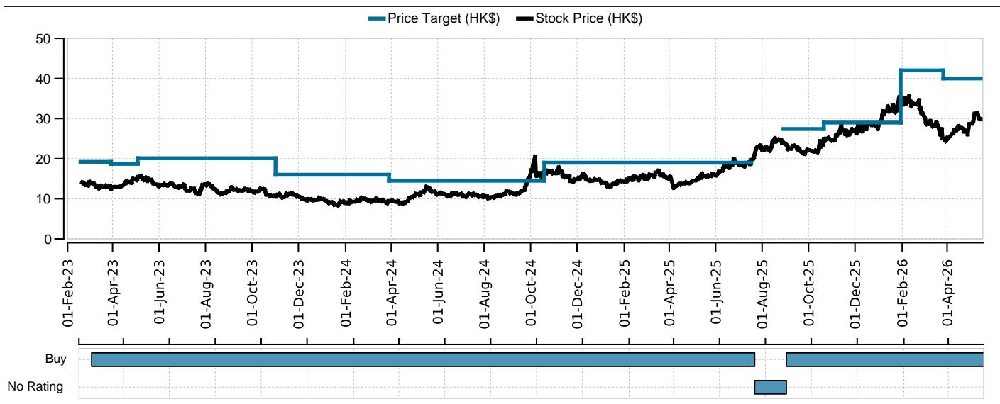
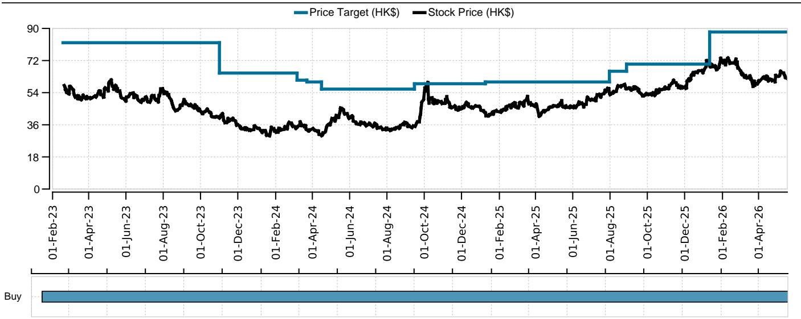
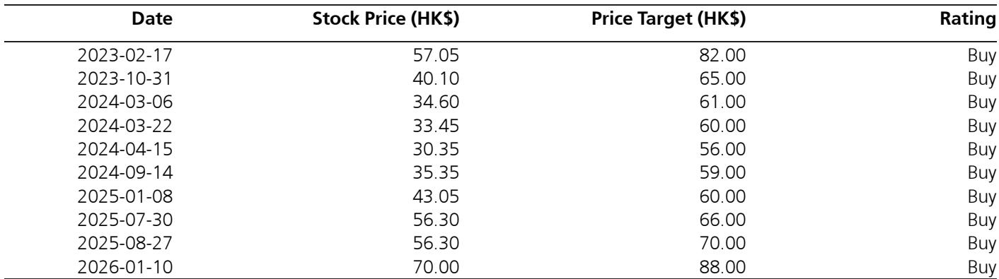

# China’s Insurers Are Quietly Building Equity Exposure, But the Real Test Lies in How They Navigate a Regulatory Pivot and a Narrowing Margin of Safety

The narrative around China’s insurance sector has long been one of caution: low interest rates compressing investment yields, regulatory uncertainty weighing on distribution, and a volatile equity market punishing balance sheets. Yet the data for the first quarter of 2026 tells a more nuanced story. Despite a weak stock market, the industry’s total assets under management grew by 2.5% quarter-over-quarter to RMB 39.4 trillion, and equity emerged as the fastest-growing asset class. This is not a sector retreating into defensive postures. It is a sector making calculated, strategic moves—bottom-fishing in equities, extending duration in bonds, and quietly repositioning its product mix toward participating products.

The question for serious investors is not whether the sector is recovering. It is whether the recovery is sustainable, and more importantly, which players are best positioned for the structural shifts ahead. The answer depends on three interconnected forces: the trajectory of premium growth as regulatory changes take effect, the true earnings sensitivity of insurers to equity market rebounds, and the strategic implications of a leadership transition at the National Financial Regulatory Administration.

This is not a time for broad sector bets. It is a time for discerning stock selection, grounded in an understanding of how each company’s asset-liability structure, distribution strategy, and regulatory exposure will play out over the next two to three quarters. The report from a global investment bank provides the raw data. The real insight comes from interpreting what that data means for the decisions investors need to make today.

## Equity Allocation Rose Despite Market Headwinds, Revealing a Strategic Pivot That Will Define Earnings Outcomes in 2026

The headline number is straightforward: insurance fund equity exposure increased by 0.1 percentage points quarter-over-quarter to 16% of AUM, with long-term equity stake investments rising to 7.8%. But the strategic significance runs deeper. This increase was not driven by passive index tracking or mechanical rebalancing. It reflects two deliberate actions: a bottom-fishing move into undervalued equities, and a shift in product mix toward participating (PAR) products, which inherently require higher equity allocation to meet policyholder return expectations.

The so-what here is critical. Insurers are not just buying stocks because they are optimistic about the market. They are buying because the structural economics of their liability side are forcing them to. With bond yields compressing and traditional non-standard debt assets maturing without replacement, the old model of funding guaranteed returns through high-yielding alternatives is no longer viable. PAR products shift some of the investment risk back to policyholders, but they also require insurers to maintain a credible equity exposure to deliver competitive returns. This is a strategic pivot, not a tactical trade.

The implication for investors is clear: companies with higher equity allocation and a greater proportion of equities classified as fair value through profit or loss will see the most dramatic earnings swings from equity market movements. China Life, with 72% of its equity holdings in FVTPL versus a peer average of 57%, is the most leveraged to an equity rebound. But that leverage cuts both ways. A market downturn in the second half of 2026 would hit its earnings hardest. The sector’s equity build is a bet that the market will cooperate. Investors need to decide whether they share that conviction.

## Premium Growth Moderation Is Not a Red Flag, But It Masks a Deeper Structural Shift That Will Reshape Competitive Dynamics

The moderation in first-year regular premium growth in the second quarter to date is exactly what the data would predict. Deposit maturities and migrations were concentrated in the first quarter, the comparable base becomes tougher from June, and the industry is preparing for the implementation of Circular 65 in July. None of this is a surprise. What matters is how individual companies are navigating these cross-currents.

CPIC’s outperformance in FYRP growth is notable, driven by a change in bancassurance product strategy and a catch-up effort relative to peers. China Life is faring better than most in sales, though margin expansion is expected to narrow. Ping An is facing growth pressure, reflecting a more disciplined approach to commission consistency following regulatory scrutiny. These are not just quarterly variances. They are signals of how each company is positioning itself for the post-Circular 65 environment.

Circular 65 demands a more granular approach to expense reporting and cost allocation. On the surface, this is a compliance exercise. In practice, it will reduce the effectiveness of sales incentives that have historically driven bancassurance volume. The insurers that have already built efficient, low-cost distribution channels—or that have diversified away from bancassurance dependency—will be less affected. Those that rely heavily on incentive-driven bank sales face a more difficult adjustment.

The open question that the report does not fully answer is how the change in NFRA leadership will affect the level of enforcement. A strict interpretation of Circular 65 could cause a sharper-than-expected slowdown in bancassurance sales in the second half. A lenient interpretation might allow for a softer landing. Investors need to monitor not just the regulation itself, but the signals from the new leadership about enforcement priorities.

## The Market’s Recent Underperformance of Insurance Stocks Is a Contrarian Signal, But Only for Those Who Understand the Rotation Dynamics

The divergence is striking. The equity market has rebounded in the second quarter, raising expectations for strong earnings recovery, particularly for life insurers. Yet China life insurance stocks fell by 5.3% in Hong Kong and 8.7% in A-shares over the past week, underperforming the broader indices by 2.5 and 6.3 percentage points respectively. This is not a sector being lifted by the rising tide. It is a sector being sold into strength.

Investor feedback points to three concerns. First, the comparable base for value of new business becomes significantly tougher from June, given the buying spree before the pricing interest rate cut at the end of August 2025. Second, A-share life names have underperformed H-shares by 20 percentage points year-to-date, driven by reduced exposure from the “national team” and a strong rotation toward tech stocks in the A-share market. Third, there is evidence that insurance funds themselves are increasing holdings of insurance H-shares, creating an interesting circular dynamic where the sector’s own cash flows are supporting its stock prices.

The so-what for investors is that the current underperformance is not necessarily a sign of fundamental deterioration. It is a reflection of sector rotation and positioning adjustments. The tech rally in A-shares has been extraordinary—CSI Tech 50 up 8.8%, STAR 50 up 27%—while Hang Seng Tech is down 12%. Capital is flowing into growth stories, and insurance is being left behind. But this creates a potential entry point for investors who believe the equity rebound will persist and that earnings recovery will eventually force a re-rating.

The unresolved analytical question is whether the “national team” reduction in A-share insurance exposure is a temporary tactical adjustment or a more permanent strategic shift. If it is the latter, A-share insurance stocks may continue to underperform H-shares, making the H-share listings of China Life and Ping An the more attractive vehicles for capturing the sector’s upside.

## The Earnings Sensitivity Framework: How to Distinguish Between High-Beta Trades and Structural Compounders

For investors trying to make sense of the sector, the most useful framework is not a simple comparison of price-to-earnings ratios or book values. It is an earnings sensitivity analysis that captures three dimensions: equity market exposure, interest rate duration, and regulatory risk.

On equity exposure, the key metric is the proportion of equity holdings classified as FVTPL. China Life leads at 72%, followed by NCI at 80% and Taiping at 65%. Ping An is at 43%, with a much larger portion in FVOCI. This means that for a given percentage move in the equity market, China Life’s earnings will swing more than Ping An’s. In a rising market, that is an advantage. In a downturn, it is a liability.

On interest rate sensitivity, the picture is more uniform. All insurers expect rates to remain low through 2026. The strategic response has been to extend bond duration, with bond allocation rising to 51% of AUM, up 0.1 percentage points quarter-over-quarter. The risk is that if rates rise unexpectedly, the mark-to-market losses on these long-duration bonds could offset equity gains. The report does not model this scenario, but it is a material tail risk.

On regulatory risk, the key differentiator is distribution channel dependency. Ping An’s disciplined approach to commissions positions it well for a post-Circular 65 environment, even if it sacrifices near-term growth. CPIC’s product strategy shift suggests it is adapting. China Life’s above-average FYRP growth gives it some buffer, but its margin expansion is expected to narrow.

The decision framework for investors should be: if you believe the equity market will sustain its rebound through the second half of 2026, China Life offers the highest beta and the most earnings leverage. If you are more cautious and value stability, Ping An’s diversified earnings base, attractive dividend yield of 5.3%, and reasonable valuation of 6.1 times P/OPAT make it a more defensive choice. The report favors both, but the investor must make the call based on their own market view.

## What the Report Does Not Yet Answer: The Three Unresolved Variables That Will Determine the Sector’s Trajectory

A rigorous analysis must acknowledge what is not yet known. The report identifies three critical uncertainties that will shape outcomes in the second half of 2026.

First, the level of enforcement of Circular 65. The regulation is clear, but the new NFRA leadership has not yet signaled how aggressively it will enforce the expense reporting requirements. A strict interpretation could reduce bancassurance sales incentives by more than the market currently expects, creating downside risk for volume-dependent players.

Second, the sustainability of the equity market rebound. The report’s earnings sensitivity analysis assumes “a stable equity market performance in the rest of the quarter.” That is a significant assumption. If the market reverses, the earnings recovery story collapses, and the sector’s recent underperformance could accelerate.

Third, the impact of “national team” positioning on A-share insurance stocks. The 20 percentage point underperformance of A-shares versus H-shares year-to-date is not fully explained by fundamentals. If the national team continues to reduce exposure, A-share insurance stocks could remain under pressure regardless of earnings outcomes.

These are not gaps in the report. They are the inherent uncertainties of any forward-looking analysis. The best investors can do is identify the key variables, assign probabilities, and position accordingly. The report provides the data. The judgment is up to the reader.

## The Strategic Takeaway for Portfolio Construction: This Is a Stock-Picker’s Market, Not a Sector Trade

The temptation in a sector like Chinese insurance is to treat it as a macro trade: bet on the equity market, bet on interest rates, and buy the sector as a whole. The data from this report argues against that approach. The dispersion in equity sensitivity, distribution strategy, and regulatory exposure is too wide.

China Life offers high beta and high earnings leverage, but with corresponding downside risk. Ping An offers stability, dividend yield, and a more diversified earnings base, but with lower near-term growth. CPIC is executing a product strategy pivot that could yield results in the second half. The market is already pricing some of these differences, but not all of them.

For a serious business audience, the actionable insight is this: build a position around the stocks that fit your market view and risk tolerance. Do not buy the sector. Buy the specific companies whose asset-liability structures and distribution strategies align with your scenario for the next two to three quarters.

The full report contains the original charts and detailed data that support this analysis, including the breakdown of equity classification by company, the trajectory of premium growth by quarter, and the historical trend in asset allocation. These charts are essential for any investor building a position in the sector.

Join the community to read the full report and review the original charts.

*This article is for learning and discussion only and does not constitute investment advice.*

Personal reading notes and learning share only. Not investment advice.

