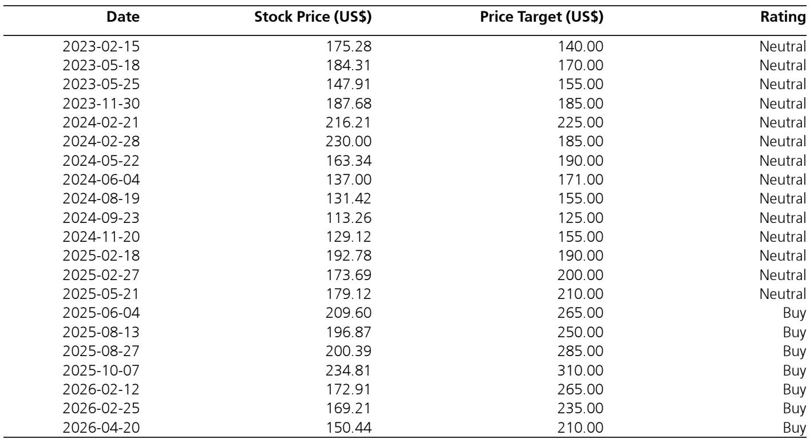
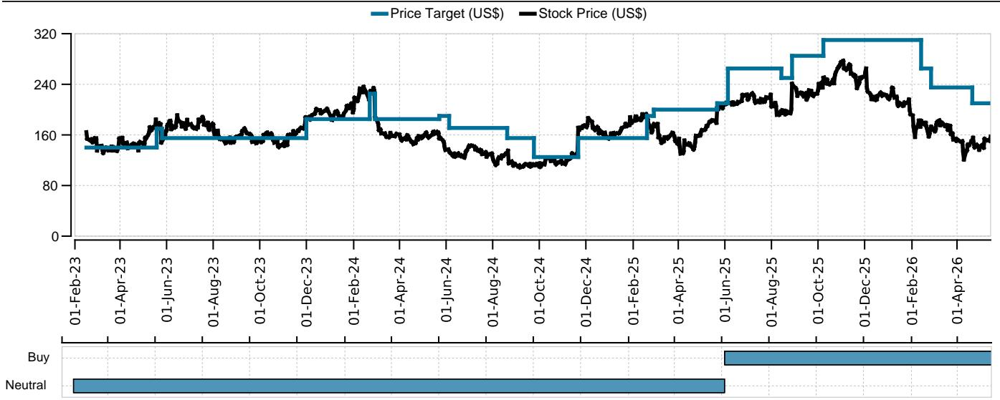
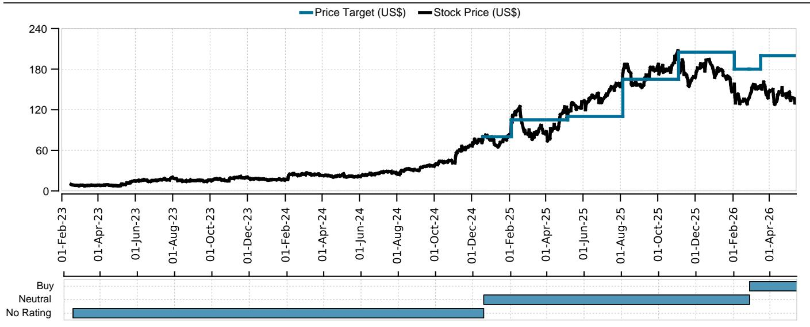

# 市场真正低估的不是AI需求，而是IT预算的全面收缩

过去两个月，某外资投行软件团队与约25位企业IT高管和采购负责人进行了一对一对话。这些对话揭示了一个被当前AI热潮掩盖的残酷事实：2026年，企业IT预算的整体增长正在显著放缓，而SaaS和应用软件厂商将是承受最大压力的群体。

这不是一个关于“AI会不会改变一切”的长期叙事讨论。这是一个关于未来一到两个季度财报季中，哪些公司的收入数字会低于预期、哪些会超预期的短期判断。报告的核心发现是：近80%的受访者表示2026年IT支出增长将保持稳定甚至下滑，只有约20%认为增长依然健康。

更值得关注的是，这股压力并非来自宏观经济的单一变量，而是AI投资挤出效应、地缘政治不确定性、以及客户自身业务增速放缓三重因素的叠加。对于软件行业的投资者和从业者而言，理解这个“预算收缩中的结构性转移”比争论AI的长期影响要紧迫得多。

## 1. 这轮IT预算收缩正在从“观望”变成“行动”

报告中最具冲击力的信息来自企业客户的实际行动，而非意向调查。多位IT高管明确表示，他们正在将预算规划周期从长期转向短期，以应对不确定性。

一位大型企业的IT负责人直言：“地缘政治压力、通胀、油价、关税开始影响我们，不确定性迫使我们思考成本削减。以前我们寻求长期成本节约，现在我们在寻求短期成本削减，以便能够快速反应。”

这种心态转变的后果是直接的：合同期限缩短、谈判周期拉长、供应商面临更大的定价压力。报告指出，客户正在通过优化或削减席位、设置严格的使用量护栏、以及延长交易谈判周期来应对软件供应商的定价模式变化。

对于软件公司而言，这意味着即便客户没有完全砍掉预算，收入的能见度也在下降，而销售成本在上升。这可能是未来几个季度中，许多SaaS公司业绩miss的根源。

## 2. AI正在成为预算的“黑洞”，而非“增量”

市场普遍认为AI会带来新的IT预算增量。但报告中的客户反馈显示，情况远比这复杂。AI投资确实在快速增长，但大部分资金来自于对其他预算项目的挤压，而非纯粹的增量投入。

一位客户清晰地描述了这一机制：“AI投资要求我们在其他领域加倍实施成本削减策略，以资助这些解决方案。” 另一位客户则更直接：“这不是净零变化，它取决于两个因素：你的企业有多前瞻，以及你需要从现有支出中重新分配多少。”

这意味着，AI的崛起正在加速非AI软件供应商的预算萎缩。报告指出，SaaS和应用软件是“最频繁被降级优先级的预算项目”，企业希望控制增量支出、席位增长和附加模块购买。

对于投资者而言，这解释了为什么尽管AI主题火热，但许多传统软件公司的股价依然承压。不是市场不理解AI的价值，而是市场正在定价AI对传统软件预算的挤出效应。

## 3. 网络安全和数据基础设施的“意外韧性”背后有逻辑

在整体预算收缩的背景下，网络安全和数据投资却展现出惊人的韧性。报告显示，网络安全几乎与AI一样频繁地被列为优先支出项目。

一位客户的解释揭示了背后的逻辑：“数据隐私和防止数据泄露是必须的，这些在AI时代变得更加重要。我们没有压力去减少数据管理和安全支出，因为它们至关重要。”

这形成了一个有趣的三角关系：AI投资需要高质量数据，而数据质量的提升又需要数据管理工具；同时，AI应用也带来了新的安全风险，推动网络安全支出。数据、安全和AI三者之间形成了相互强化的支出循环。

对于软件公司而言，这意味着那些同时覆盖数据、安全和AI三大领域的平台型公司，将比单一产品的SaaS厂商拥有更强的预算防御能力。报告特别提到了Palantir和Snowflake作为这一框架下的受益者，但这并不意味着所有数据类公司都能自动受益——关键在于是否能够将数据能力与AI应用场景有效连接。

## 4. 定价权的转移：从“席位”到“使用量”的艰难过渡

报告揭示了一个正在发生的结构性变化：软件定价模式正在从传统的“按席位收费”转向“席位加使用量”的混合模式。但这一过渡并非一帆风顺。

客户对定价的抵制正在上升，尤其是针对按席位收费的应用软件公司。一位合作伙伴总结道：“企业软件继续处于同样的挤压位置。客户想要支出，但采取非常谨慎的态度。除了ServiceNow，我关注的任何企业软件厂商都没有出现我称之为增长的情况。”

这意味着，定价模式的转变不仅仅是收入确认方式的改变，更是议价权从供应商向客户的转移。在预算紧张的环境下，客户有更强的动力去优化使用量、减少冗余席位、并利用竞争性谈判压低价格。

对于软件公司而言，能否成功实现从“卖席位”到“卖价值”的转型，将决定它们在当前环境下的增长能力。那些能够清晰量化客户ROI、并提供灵活定价选项的公司，将比那些固守传统模式的厂商更具优势。

## 5. 报告尚未完全回答的关键问题：AI投资的真实回报期

尽管报告提供了大量关于预算转移的实证证据，但它也留下了一个关键问题：企业AI投资的真实回报期有多长？

多位客户提到，他们正在“测试”AI工具，进行A/B测试来衡量生产力提升。一位客户表示：“如果它产生了更多生产力，我们就会在组织内更多地方推广。” 这种谨慎的、渐进式的采用方式暗示，AI投资的规模化落地可能比市场预期的要慢。

报告没有深入探讨的是：如果AI投资的回报周期超过预期，企业是否会进一步削减其他软件预算来维持AI支出？或者，当AI投资的ROI无法在短期内兑现时，企业是否会重新评估AI优先级？这些问题的答案将决定当前预算转移的可持续性。

另一个未被充分探讨的风险是：AI投资的“挤出效应”是否会在某个临界点触发反向反馈循环——即AI投资导致传统软件收入下滑，进而影响软件行业的整体创新能力和就业，最终反过来影响AI工具的需求。这是一个需要持续跟踪的二阶效应。

## 6. 投资者的观察框架：从“增长”转向“预算份额”

基于报告的洞察，投资者需要调整对软件公司的评估框架。在整体预算增长放缓的环境下，关键问题不再是“这家公司的市场有多大”，而是“它能在预算分配中占据多大的份额”。

具体而言，有四个维度值得重点关注：第一，公司的支出是否与AI、数据、安全或云基础设施这些优先领域直接相关；第二，公司的定价模式是否具有灵活性，能否适应从席位到使用量的过渡；第三，客户集中度和粘性，特别是是否拥有能够抵御预算削减的“关键任务”产品；第四，公司的销售效率，在预算审批周期延长的环境下，销售团队的转化能力将成为关键差异化因素。

报告的建议框架——看好AI、数据、基础设施和安全类股票，对SaaS和应用软件保持谨慎——已经在股价中有所反映。但关键在于，这种分化是否还有进一步扩大的空间。如果预算收缩持续，那些被降级的软件公司可能面临更大的估值压力，而受益于预算转移的公司则可能获得超越市场的表现。

---

这份报告的价值不在于它提供了多少新数据，而在于它将这些分散的客户反馈整合成了一个清晰的框架：2026年软件行业的真正风险不是AI颠覆，而是预算的全面收缩和结构性转移。对于从业者而言，理解这个框架比预测下一个AI爆点更为紧迫。

报告中的客户原话和具体数据点提供了更丰富的细节，包括哪些行业受影响最大、哪些公司被客户点名提及、以及不同定价模式下的客户反应差异。这些内容在我们的完整解读中有更系统的梳理。

欢迎来星球微信群里继续讨论：在预算收缩的环境下，哪些细分领域可能成为“预算避风港”？AI投资的真实回报周期如何跟踪？以及，这份报告没有完全回答的另一个问题——当AI投资从“实验期”进入“规模化期”，对软件预算的影响会如何演变？

Personal reading notes and learning share only. Not investment advice.

