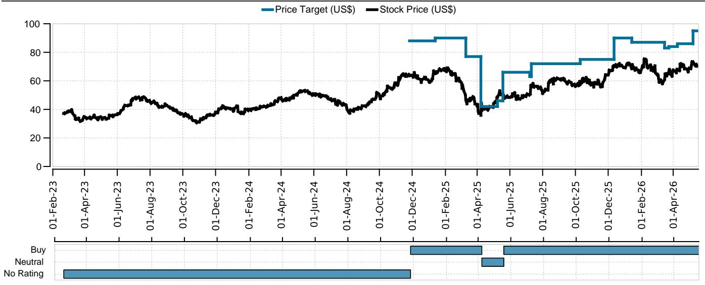
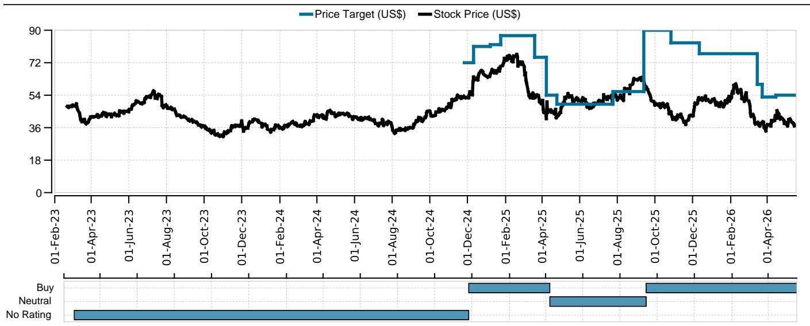
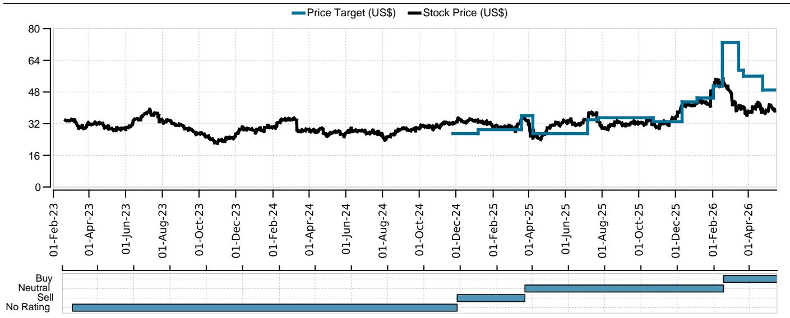

# 美国航空需求并未崩塌，但真正的结构性信号藏在消费行为的缓慢迁移中

过去几周，燃油价格上涨、地缘政治不确定性加剧，市场对航空出行需求的担忧再次升温。每当类似压力出现，一个经典问题就会被重新摆上桌面：消费者会不会减少飞行？这一次，答案比简单的“是”或“否”要复杂得多。

某外资投行最新发布的消费者旅行意愿调查报告，为我们提供了一个难得的观察窗口。这份基于2026年3月至4月初对约1,754名美国消费者的调研显示：整体旅行意愿仅出现轻微同比回落，休闲出行意愿从83.1%微降至82.8%，商务出行意愿从35.0%降至32.6%。从表面看，这似乎是一个“需求韧性仍在”的故事。但如果我们只停留在这一层结论，就可能错过这份报告真正想要传达的信号。

市场真正低估的不是需求是否还在，而是需求结构正在发生的缓慢但不可逆的重塑。消费者并没有停止旅行，但他们正在以不同的方式选择目的地、评估航空公司、分配预算。这些变化对航空公司竞争格局的长期含义，远比短期需求波动的幅度更重要。

## 1. 休闲出行的“量”基本稳定，但“价”的增长斜率正在变平

报告中最容易被忽视的数据，不是总体意愿的同比变化，而是支出意愿的分布迁移。48%的受访者计划在未来12个月增加休闲旅行支出，这一比例与去年49%的水平相比仅下降1个百分点，看起来几乎可以忽略不计。但问题在于，增加支出的“幅度”正在收窄。

具体来看，计划增加支出10%以内的受访者比例从21%上升到22%，上升了1.2个百分点；而计划增加11%至40%的群体则从23%下降到22%，下降了1.5个百分点。同时，计划增加40%以上的“高支出”群体也从5%下降到4%。这意味着，消费者仍然愿意为旅行花钱，但“愿意花更多”的冲动正在被“愿意花更多但只多花一点点”的理性所取代。

这种变化对航空公司的定价能力是一个微妙信号。当消费者从“我要多花30%去一趟欧洲”转向“我多花10%去一个近一些的地方”，航空公司的单位乘客收入（RASM）增长就会面临天花板。报告没有直接给出这个判断，但从支出意愿分布的数据来看，这几乎是必然的推论。

## 2. 商务出行正在走出谷底，但恢复的形态与疫情前不同

商务出行的数据同样值得拆解。32.6%的商务出行意愿虽然同比下降，但相比2024年3月的31.7%仍然有所提升。更重要的是，计划在商务旅行上“不花一分钱”的受访者比例从30%大幅下降至27%，而计划增加支出10%以内的群体从13%上升至16%。

这些数字叠加在一起，指向一个结论：商务出行正在温和恢复，但恢复的方式更偏向“必要但有限”的差旅，而非高成本的长期商务行程。那些计划增加40%以上支出的“高消费”群体比例反而从5%下降到3%，进一步印证了这一判断。

对于航空公司而言，这意味着商务舱和高端经济舱的需求可能不会像疫情初期预期的那样出现报复性反弹。企业差旅预算管理更加精细化，高频次、高成本的商务旅行模式正在被“更少但更关键”的差旅所替代。这一趋势对以商务客为主的全服务航空公司（如达美航空、美国联合航空）的收益结构，构成了一个需要长期关注的风险。

## 3. 价格仍是第一位的，但品牌忠诚度正在结构性上升

在影响消费者购票决策的因素中，价格以77%的提及率毫无悬念地排在首位。但真正值得关注的变化，是“航空公司品牌”的权重在过去三年中上升了6个百分点，达到49%。“座位等级”的权重更是上升了9个百分点。

这两组数字放在一起，揭示了一个看似矛盾但合乎逻辑的消费者心理：消费者对价格敏感，但他们同时也在对“品牌能提供什么”变得更加敏感。他们不愿意为品牌溢价支付不合理的高价，但他们愿意在同等价格下选择自己信任的航空公司，并且愿意为更舒适的座位等级支付额外的费用。

这一变化对大型全服务航空公司是明确的利好。达美航空和美国联合航空在品牌建设、常旅客计划、高端产品线上持续投入，正在收获回报。报告中的航空公司意愿数据也印证了这一点：受访者中愿意在达美航空“飞行更多或与去年持平”的比例从56%上升至57%，而美联航虽然从60%微降至59%，但绝对水平仍然处于行业前列。

品牌忠诚度的结构性上升，意味着航空公司之间的竞争正在从纯粹的“价格战”转向“价格+品牌+体验”的多维竞争。这种竞争格局的演变，对低成本航空公司的压力是隐性的，但长期影响可能比任何一次燃油价格波动都更加深远。

## 4. 跨大西洋旅行意愿回落，但结构性替代趋势正在形成

欧洲一直是美国航空公司最赚钱的国际航线之一。报告显示，计划在未来12个月内前往欧洲休闲旅行的美国受访者比例从42%下降至36%，同比下降6个百分点。这看起来是一个负面信号，但需要放在更长的历史维度中看待。

即便是36%的水平，仍然显著高于2024年3月的32.5%，更远高于2019年的26.2%。也就是说，跨大西洋旅行的热度只是从“异常高”回落到了“仍然很高”的水平。这一点在航空公司的近期业绩指引中也得到了印证。

与此同时，计划前往加勒比地区的受访者比例从18.7%上升至23.4%，同比上升4.7个百分点。这种目的地切换，反映出消费者在更高票价环境下的替代行为：如果去欧洲的机票太贵，那就去一个近一些、便宜一些的地方。这种替代效应对达美航空和美联航等拥有强大跨大西洋网络的航空公司是一个需要警惕的信号——他们需要证明，即便欧洲需求从高点回落，其航线网络的整体利用率仍然可以维持。

## 5. 报告尚未完全回答的关键问题：AI对旅行预订的长期影响究竟有多大？

报告首次调查了AI助手在旅行预订中的应用情况。约12%的美国受访者表示曾使用AI助手进行旅行预订，其中44%对AI工具“相当信任”，17%“非常信任”，31%表示“不太信任”或“完全不信任”。

这些数据本身并不惊人，但它们的长期含义可能远超当前数字所暗示的。如果AI助手的使用率和信任度持续上升，航空公司的分销渠道将面临结构性重塑。目前，航空公司的直销渠道和在线旅行社（OTA）是主要的预订来源。AI助手作为新的中间层，可能改变消费者的比价方式和决策路径。更重要的是，AI助手的推荐算法可能会进一步强化品牌集中度——如果AI倾向于推荐大型全服务航空公司的航班，中小型航空公司的获客成本将被动上升。

报告没有深入讨论这一影响，但这是一个值得所有行业参与者提前思考的问题。AI在旅行预订中的渗透率目前仍处于早期阶段，但其增长轨迹和信任度的提升速度，将是未来几年航空业竞争格局中最不确定的变量之一。

---

以上是对这份研报核心逻辑的解读。还有一些关键问题，报告本身没有完全展开：比如消费者对高燃油价格的敏感度阈值在哪里？航空公司的运力调整策略如何与消费者意愿变化互动？品牌忠诚度的结构性上升是否足以支撑更高的票价？这些问题的答案，可能需要结合更多数据源和行业动态才能拼出完整的图景。

如果你对这些未解问题感兴趣，欢迎来星球微信群里继续讨论。我们会定期分享更多行业研报的深度拆解和交叉验证，帮助你建立自己的分析框架，而不是依赖单一报告做判断。

Personal reading notes and learning share only. Not investment advice.

