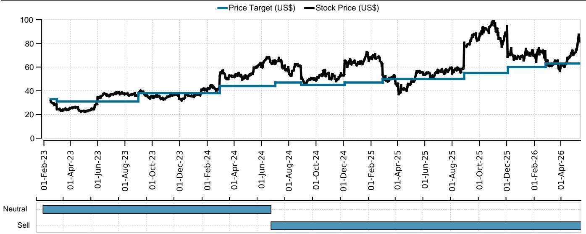
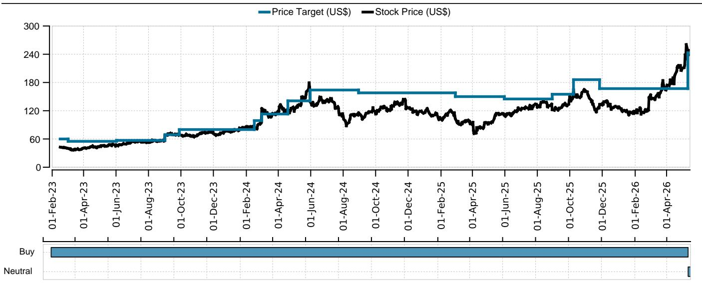
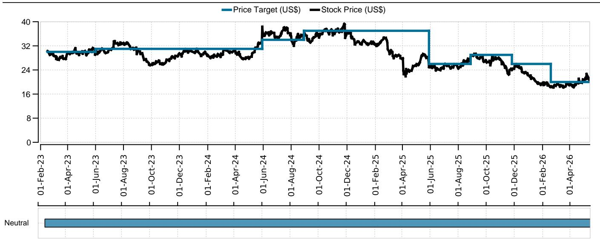

# 企业硬件股的真正风险不在四月财报，而在下半年需求被高成本提前透支

市场正在为四月季度企业硬件股的业绩做定价，但真正的博弈点不在这一份成绩单。某外资投行最新发布的研报明确指出，AI需求依然强劲，PC、服务器和存储领域存在客户为规避内存成本上涨而提前采购的迹象。这意味着四月季度的数字大概率会符合预期甚至略超预期。然而，研报的核心警告在于：内存成本急剧攀升正在改变下游OEM的定价行为，进而可能在下半年引发需求破坏。这轮财报季，真正值得关注的不是过去三个月的表现，而是管理层对下半年的指引是否会因为成本传导而出现实质性下修。

这份研报覆盖了HP Inc、Everpure、Dell Tech和NetApp四家公司。分析师在四月季度预期上给出的判断高度一致——“in-line to slight beats”。但真正有区分度的洞察出现在对下半年和下一财年的展望上：HP Inc可能正式下调FY26 EPS指引，NetApp的FY27 EPS指引区间可能低于市场共识，Everpure的毛利率展望存在系统性风险。这些判断背后有一个共同的驱动因素——内存成本。

以下是从这份研报中提炼出的五个核心洞察，它们共同指向一个判断：市场对AI需求的定价可能已经充分，但对成本端传导至利润率和需求的反噬效应，仍然低估。

## 1. 四月财报季的“安全垫”来自客户提前采购，而非真实需求扩张

研报判断四月季度业绩整体符合预期或略超预期，其核心支撑不是终端需求的自然增长，而是客户为规避内存成本上涨而采取的提前采购行为。这种“pull-forward”效应在PC、服务器和存储领域均有体现。

以Everpure为例，研报预计四月季度收入存在约4000万美元的提前采购，相当于约5个百分点的同比增长。CDW在三月季度也有约1亿美元的提前采购，横跨PC、服务器和存储。这种行为的本质是成本预期驱动的时间转移，而非需求总量的扩张。

这意味着四月季度的业绩质量需要打折扣。如果剔除提前采购，实际需求增速可能低于报表数字。对于投资者而言，超出预期的EPS如果主要来自收入前置，那么这种“超预期”就不具备可持续性，反而可能透支下半年。

## 2. 内存成本正在从毛利率的“侵蚀者”变为需求端的“破坏者”

研报对内存价格的判断非常明确：DDR DRAM合约价格在二季度环比上涨约60%，同比上涨379%；NAND flash合约价格环比上涨60%，同比上涨278%。三季度NAND价格预计继续环比上涨10%。

成本上涨的第一层冲击是毛利率。研报特别指出，Everpure的产品毛利率预计为65.5%，而H2面临下修风险。NetApp的产品毛利率预计持平，导致FY27 EPS指引低于市场共识。HP Inc的PC业务毛利率可能低于长期指引区间。

但更关键的是第二层冲击：OEM为了管理毛利率而大幅提价，可能引发需求破坏。研报明确指出，PC面临“demand destruction”风险，原因是ASP大幅上涨。供应商将报价有效期从60-90天缩短至30天甚至更短，这一行为本身就说明成本波动已经超出正常经营范畴。当客户发现采购成本在数周内就可能出现两位数的变化，推迟采购或削减配置就成为理性选择。

## 3. HP Inc的EPS指引下修风险被市场低估，投资者预期已经低于官方指引

研报对HP Inc的判断是最为悲观的。分析师预计四月季度收入136亿美元、EPS 0.70美元，均略低于市场共识。但真正的问题是FY26 EPS指引。

HP Inc目前的官方指引是2.90-3.20美元，但研报基于内存成本冲击和潜在的需求破坏，预计管理层会将指引中值下调至2.90美元以下。更值得注意的是，研报通过投资者交流发现，市场对EPS的实际预期已经降至2.70-2.80美元区间，远低于官方指引和Visible Alpha共识的2.83美元。

这意味着即使HP Inc只是将指引区间下限从2.90美元下调至2.80美元，对于已经将预期压至2.70-2.80美元的投资者而言，冲击可能有限。但如果管理层坚持维持2.90-3.20美元不变，反而可能被视为积极信号。这里的关键变量是：管理层是否有足够的信心认为PC毛利率能在下半年触底回升。研报的判断倾向于否。

HP Inc的估值已经反映了部分悲观预期。目前股价对应约7倍CY27 EPS，相对标普500的估值折价达到66%，接近十年最宽水平。但研报认为，在内存成本压力缓解之前，这一估值折价难以收窄。

## 4. Dell Tech的AI服务器收入是“明牌”，核心CSG和ISG需求才是真正的胜负手

在所有覆盖标的中，Dell Tech的四月季度预期最强。研报预计AI服务器收入确认和PC收入小幅超预期，将推动EPS达到约3.05美元，高于公司指引中值2.90美元和市场共识2.94美元。

但研报同时指出，市场已经定价了这一超预期。投资者对AI服务器的预期已经相当充分，因此财报后股价能否上涨，取决于管理层对核心CSG和ISG（不含AI）下半年需求的评论。如果企业级PC和传统服务器需求因成本上涨而走弱，即使AI服务器持续强劲，整体EPS也可能面临压力。

这一判断隐含了一个重要框架：AI服务器的收入增长对EPS的拉动作用正在递减。研报明确指出“lower AI operating margin limits the EPS upside”。AI服务器虽然是高增长业务，但利润率低于传统业务。当AI服务器在收入中的占比持续提升时，整体运营利润率反而可能承压。这是市场在追捧AI叙事时容易忽略的结构性矛盾。

## 5. NetApp的FY27 EPS指引可能成为导火索，毛利率走平意味着增长质量存疑

NetApp的情况介于HP Inc和Dell Tech之间。研报预计四月季度收入符合预期，EPS略高于预期，原因是成本控制较好。但真正的风险在FY27指引。

研报预计NetApp的FY27 EPS指引区间为8.25-8.55美元，低于Visible Alpha共识的8.59美元。核心原因是产品毛利率预计走平，虽然公有云业务的毛利率结构较好，但不足以抵消内存成本对产品毛利率的拖累。

这里需要关注一个细节：NetApp在存储领域的行业需求仍然强劲。研报引用的VAR调查显示，48%的受访者认为存储需求“强劲”，44%认为“非常强劲”，均较上次调查有所提升。但Everpure的需求强度却从76%下降至66%。这意味着不同厂商之间的需求分化正在出现。NetApp能否在成本压力下维持需求韧性，是FY27指引能否兑现的关键。

## 报告尚未完全回答的关键问题：内存成本何时见顶，以及OEM定价行为是否会形成负反馈循环

这份研报的价值在于清晰地指出了成本传导的路径：内存价格上涨 -> OEM毛利率承压 -> OEM提价 -> 需求破坏 -> 收入与利润双杀。但研报没有完全回答的问题是：这一传导链条会在哪个环节出现断裂。

内存价格本身受供需影响，AI需求对HBM和高端DRAM的挤占是当前价格上涨的核心驱动力。如果AI资本开支增速放缓，或者内存供应商的产能扩张速度超出预期，内存价格可能在2026年下半年或2027年见顶。但研报的定价模型显示，NAND价格预计到2027年四季度才趋于平稳，这意味着成本压力至少还要持续四个季度。

另一个未解问题是：OEM提价对需求的影响程度。研报提到了“demand destruction”的风险，但没有给出量化的弹性估计。如果PC和服务器需求的价格弹性较高，5-10%的提价可能就会导致需求明显萎缩；如果弹性较低，OEM反而可能通过提价完全转嫁成本。这一假设的不同取值，会直接改变对HP Inc和Dell Tech下半年EPS的判断。

这些未解问题恰恰是深入阅读完整报告的价值所在。研报中包含了详细的VAR调查数据、内存价格预测模型、以及各公司的分业务线财务预测，这些细节可以帮助投资者独立判断成本传导的时间表和幅度。

---

欢迎来星球微信群里继续讨论：内存成本周期处于什么位置？OEM定价行为的二阶影响如何量化？哪些公司在成本冲击下反而可能获得市场份额？这些问题在完整报告中有更细致的拆解和数据支撑。

Personal reading notes and learning share only. Not investment advice.

