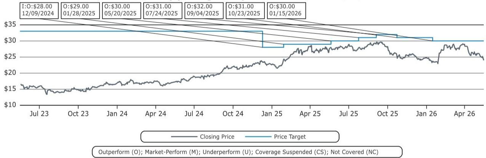
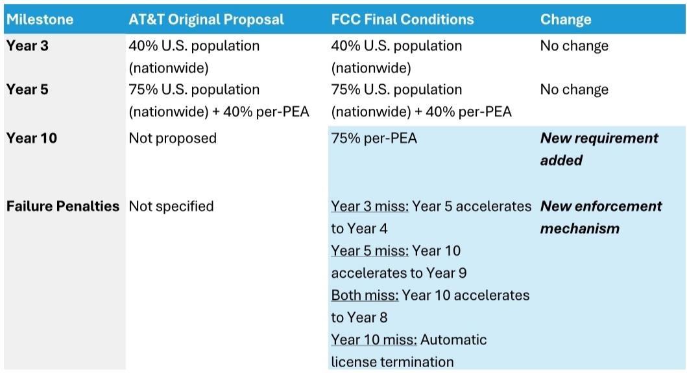

# The FCC Just Reshaped the U.S. Tower Industry, and the Winners Are Not Who You Think

The conventional wisdom that spectrum policy is a zero-sum game between satellite and terrestrial infrastructure is about to be upended. In a single ruling, the Federal Communications Commission has simultaneously tightened buildout requirements on AT&T, created an unprecedented escrow fund for Dish's creditors, and opened the door for direct-to-device satellite competition. The market has largely shrugged, treating this as a neutral event for tower companies. That interpretation is too narrow. The FCC's three-part decision actually creates a structural floor for tower revenues while introducing a new source of long-term demand that the market has not yet priced in. The real story is not about the immediate impact on existing contracts, but about how the FCC is systematically re-engineering the incentives for spectrum deployment in ways that favor infrastructure owners over the long cycle.

The timing matters. The tower industry has been under significant pressure, with shares of the three major players down roughly 40 percent from their highs. Dish's abandonment of its 5G network buildout created a roughly $3-4 billion hole in tower company revenues, and the market has been waiting for the other shoe to drop on spectrum policy. What the FCC delivered is not a clean resolution, but it is a more favorable outcome than the industry had reason to expect. The escrow fund is small relative to total claims, the buildout requirements are real but manageable, and the D2D framework is a long-term positive masquerading as a short-term threat. Investors who focus only on the near-term accounting will miss the strategic shift underway.

This article unpacks the three components of the FCC ruling, explains why each is more positive than the headline suggests, and identifies the unresolved questions that will determine whether tower companies emerge as structural winners or merely avoid catastrophe.

## The FCC's Escrow Fund Is a Novel Precedent That Creates a Floor, Not a Ceiling, for Tower Recoveries

The $2.4 billion escrow fund is the most attention-grabbing element of the ruling, and it is also the most misunderstood. On its surface, the numbers look discouraging: tower companies and other infrastructure providers claim they are owed between $7 billion and $10 billion from Dish's abandoned network. A $2.4 billion fund covers only a fraction of that exposure. The natural conclusion is that tower companies will take a significant haircut.

That conclusion is premature. The escrow fund is not a settlement; it is a mechanism. The critical feature is the trade-off it forces: filing a claim with the fund waives all further legal rights against EchoStar entities. This means tower companies face a strategic choice between accepting a pro-rata share of $2.4 billion or continuing to pursue full judgments through arbitration or litigation. The FCC has effectively created a minimum recovery floor while preserving the upside from alternative legal paths.

The strategic calculus for each tower company will depend on the size and nature of their Dish exposure. Companies with larger claims may rationally choose to pursue arbitration, betting that the legal system will deliver a higher recovery than the escrow fund can provide. Companies with smaller claims or weaker legal positions may find the certainty of the fund more attractive. The key insight is that the escrow fund does not cap recoveries; it establishes a baseline below which no rational claimant should fall.

There is a deeper implication for the industry structure. By making vendor disputes part of spectrum transaction review for the first time, the FCC has set a precedent that could reshape how future spectrum deals are structured. Infrastructure providers now have a stronger bargaining position in negotiations, knowing that the FCC may intervene to protect their interests in large transactions. This is a meaningful shift in the balance of power between spectrum holders and infrastructure owners, and it should modestly reduce the risk premium that towers carry in their valuations.

## AT&T's Stricter Buildout Requirements Will Force Rural Deployment That Benefits Tower Companies More Than AT&T

The FCC's approval of AT&T's spectrum acquisition came with conditions that are significantly more aggressive than what AT&T proposed. The critical addition is a Year 10 requirement mandating 75 percent coverage per partial economic area on a license-by-license basis, combined with automatic acceleration penalties and automatic license termination for non-compliance. This is the FCC's most aggressive buildout enforcement mechanism for secondary market spectrum transactions in recent memory.

The immediate market reaction has been to treat this as neutral, since AT&T had already deployed approximately 80 percent of the spectrum by the end of 2026 through software upgrades. That view understates the long-term implications. The per-PEA requirement is designed to prevent AT&T from cherry-picking high-density urban markets while ignoring rural areas. This means AT&T will be forced to deploy incrementally more infrastructure in precisely the geographic areas where tower companies have the most excess capacity and the highest marginal returns from new tenancy.

For tower companies, this is a structural positive. Rural tower sites typically have lower utilization rates than urban sites, so incremental tenancy additions in these markets generate disproportionately high incremental returns. The fixed costs of the tower are already sunk; additional tenants require only marginal capital expenditure. The FCC's buildout requirements effectively compel AT&T to fill this excess capacity over a 10-year window, providing a long-duration revenue stream that the market has not fully incorporated into tower valuations.

The automatic acceleration penalties add another layer of value. If AT&T misses interim milestones, the final deadline moves forward by up to two years. This creates a powerful incentive for AT&T to over-invest early in the buildout cycle, which could pull forward tower revenues that might otherwise have been deferred. The combination of mandatory rural deployment and acceleration risk means tower companies are likely to see a more front-loaded and geographically diversified revenue stream than the market currently expects.

## The D2D Framework Is a Long-Term Positive for Towers Disguised as a Competitive Threat

The most counterintuitive element of the FCC ruling is the direct-to-device satellite framework. An initial reading suggests this is negative for tower companies: if satellites can provide 5G-comparable connectivity without ground infrastructure, why would carriers continue to pay for tower leases?

The answer lies in the physics of satellite communications and the economics of network architecture. The FCC's performance metrics require downlink signal quality of at least -4.6 dB SINR, uplink throughput of at least 0.5 Mbps, and spectral efficiency of at least 0.32 bits/second/Hz per beam, all measured at 70 percent service availability. These are stringent requirements that cannot be met indoors or in dense urban environments where buildings block satellite signals. D2D is fundamentally an outdoor, open-sky technology.

This creates a natural complementarity rather than a substitution. Satellite-based connectivity can serve rural and remote areas where terrestrial infrastructure is uneconomical, but it cannot replace the dense tower networks required for urban and suburban capacity. The FCC's framework effectively acknowledges this by replacing traditional population-coverage metrics with geographic area coverage thresholds. The goal is to extend connectivity to underserved areas, not to displace existing infrastructure in served areas.

The strategic implication for tower companies is that D2D opens the possibility of a new wireless entrant in the U.S. market. Any space-based entrant that wants to offer a competitive service will need either a terrestrial MVNO agreement or a coverage deployment of low-band spectrum, both of which require tower infrastructure. The FCC's facilitation of D2D competition could ultimately increase the number of potential tower tenants, even if the direct satellite service itself does not generate tower demand.

The time horizon matters here. D2D technology is still in its early stages, and the FCC has provided a 9-year buildout window for the initial performance milestones. Over the next 2-3 years, the impact on tower demand will be negligible. Over a 5-10 year horizon, the most likely outcome is that D2D creates incremental demand from new entrants rather than cannibalizing existing tower revenues. The market's reflexive negative reaction to anything that sounds like satellite competition is likely overdone.

## What the Report Does Not Fully Answer: The Escrow Trade-Off and the D2D Adoption Curve

The report provides a thorough analysis of the FCC's three-part ruling, but it leaves two critical questions unresolved. First, how will the tower companies actually choose between the escrow fund and continued arbitration? The report notes that filing a claim waives all legal rights, but it does not model the expected value of each path under different assumptions about recovery rates, legal costs, and timing. The optimal strategy will depend on factors that are specific to each company's contract terms, geographic exposure, and risk appetite. This is a decision that will be made behind closed doors, and the market will only learn the outcome after the fact.

Second, the D2D adoption curve remains highly uncertain. The report argues that D2D will not compete with terrestrial networks in urban areas, but it does not address the possibility of technological breakthroughs that could change this calculus. If satellite technology improves faster than expected, or if new spectrum bands become available, the competitive dynamics could shift. The report's conclusion that D2D is positive for towers relies on the assumption that the technology's limitations are structural rather than temporary. That assumption is reasonable but not guaranteed.

These open questions create a natural information asymmetry that favors investors who do the deeper analytical work. The escrow decision will be a binary event for each tower company's near-term cash flows, and the D2D trajectory will determine the long-term growth profile of the industry. The report provides the framework for analyzing these questions, but it cannot provide the answers without access to proprietary data and company-specific insights.

## A Decision Framework for Tower Investors in the New Regulatory Environment

The FCC ruling creates a clear set of analytical priorities for investors evaluating tower companies. The first priority is to assess each company's Dish exposure and legal strategy. Companies with larger, more concentrated Dish claims have more to gain from pursuing arbitration, while companies with smaller or more diversified exposure may prefer the certainty of the escrow fund. The market is currently pricing in a worst-case scenario for Dish recoveries, so any upside from the escrow fund or legal victories will be disproportionately positive for the affected stocks.

The second priority is to evaluate the rural deployment opportunity. The FCC's buildout requirements will force AT&T to invest in rural infrastructure over a 10-year window. Tower companies with higher rural exposure relative to their urban footprint will benefit disproportionately. This is a structural factor that should persist regardless of the broader economic cycle, making it a reliable source of long-term revenue growth.

The third priority is to monitor the D2D adoption curve. The key indicators will be the pace of satellite launches, the performance of initial D2D services, and the entry of new competitors into the U.S. wireless market. If D2D adoption follows the report's base case of limited urban competition, the tower industry will benefit from incremental demand without cannibalization. If D2D technology improves faster than expected, the risk profile changes. This is a factor that requires ongoing monitoring rather than a one-time assessment.

The final priority is to understand the balance of power between tower companies and their tenants. The FCC's escrow precedent strengthens tower companies' bargaining position in future spectrum transactions, while the buildout requirements create a structural floor for rural deployment. These factors should gradually reduce the risk premium that investors assign to tower stocks, particularly for companies that demonstrate the ability to navigate the escrow trade-off successfully.

## The Full Report Contains the Charts and Data That Make These Arguments Actionable

The analysis in this article is based on a detailed research report that includes the specific buildout timelines, escrow fund mechanics, and D2D performance metrics that underpin the strategic conclusions. The charts in the full report show the exact milestones AT&T must meet, the structure of the escrow fund's three-tier claim system, and the geographic coverage thresholds for D2D spectrum licenses. These details are essential for investors who want to model the financial impact on individual tower companies and make informed portfolio decisions.

The report also includes the analysts' specific ratings and price targets for the major tower companies, along with the valuation methodologies and risk factors that support those conclusions. For investors who want to move beyond the strategic framework and into specific investment decisions, the full report provides the necessary data and analysis.

Join the community to read the full report and review the original charts.

*This article is for learning and discussion only and does not constitute investment advice.*

Personal reading notes and learning share only. Not investment advice.

