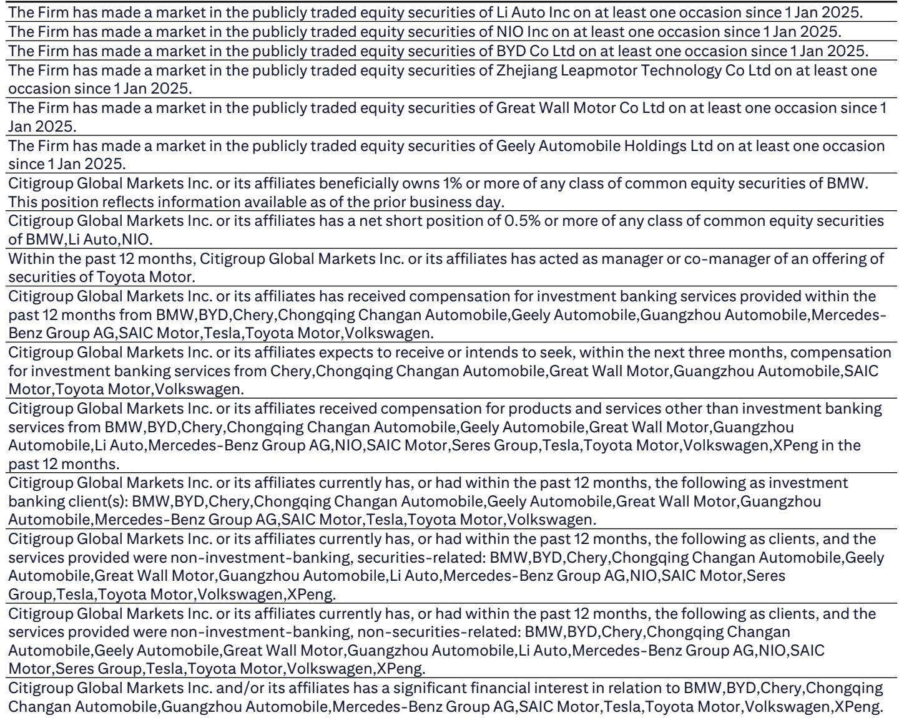
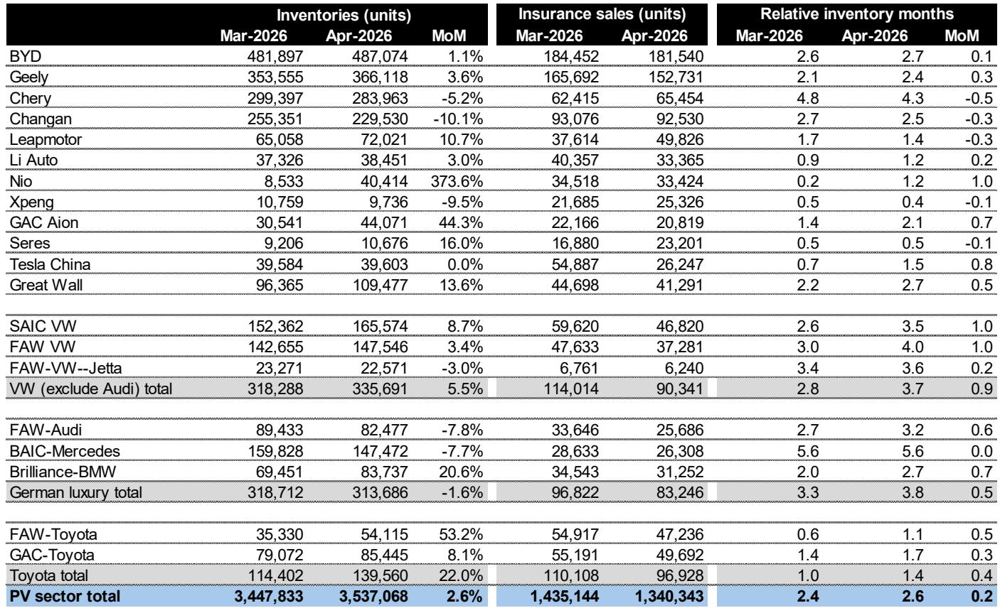
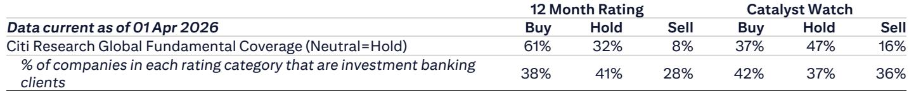

# 库存周期正在成为比价格战更精准的选股信号

市场对2026年中国汽车行业的关注，长期集中在价格战烈度、智能驾驶渗透率和出海节奏这三个维度上。但一份来自某外资投行的4月末库存追踪报告，揭示了一个被多数投资者低估的短期变量：库存周期正在分化，而这种分化直接指向未来两个季度的利润拐点。

报告的核心判断并不复杂，但其含义远比表面数字深远。截至4月底，中国乘用车行业总库存环比上升2.6%，库存月数从2.4个月攀升至2.6个月。但在这条行业平均线之下，不同品牌之间的库存状况差异之大，已经足以让投资者重新审视“谁会在二季度承受利润压力，谁又能安然度过”。

真正重要的不是行业整体库存水平，而是个体之间的结构性分化。蔚来在4月底积累了约4万辆新车库存，为其5月交付提供了充足弹药；而理想汽车的库存月数已升至1.2个月，报告明确警告去库存行动将侵蚀其二季度利润率，并可能部分波及三季度。与此同时，大众集团和德系豪华品牌的库存月数分别达到了3.7个月和3.8个月——这已经不是“压力”，而是“警报”。

这份报告最有价值的贡献，不在于给出了一个静态的库存数字，而在于它揭示了库存周期如何成为企业利润的先行指标。当行业整体零售可能遭遇5月环比下滑时，高库存品牌将被迫在6月进行半年度清库，届时价格压力将进一步放大。反之，库存控制得当的品牌，将在这一轮出清中占据定价主动。

以下是我们从这份报告中提炼出的五个层次判断。

## 1. 蔚来的库存积累不是风险，而是5月交付的保障信号

在大多数投资者眼中，库存上升往往意味着滞销压力。但蔚来4月底库存从3月的8,533辆跃升至40,414辆，环比增幅高达373.6%，这一数字需要放在特定语境中理解。

报告将这一库存积累定性为“积极因素”——蔚来在4月底积累了足够的新车型库存，以满足5月的交付需求。这背后反映的是蔚来的生产节奏与交付节奏之间的主动安排，而非被动积压。从库存月数看，蔚来从3月的0.2个月上升至1.2个月，仍然处于行业健康区间内。

相比之下，理想汽车4月库存为38,451辆，环比微增3.0%，但库存月数从0.9个月升至1.2个月。问题在于，理想的保险销量从3月的40,357辆降至33,365辆，环比下降17.3%。销量下滑叠加库存微增，意味着理想的库存周转速度正在放缓。报告明确指出，任何去库存行为都将损害其二季度利润率。

这里的关键区别在于：蔚来的库存积累是主动的、有交付计划支撑的；理想的库存积累则是被动的、伴随销量走弱而来的。前者是弹药储备，后者是积压风险。

## 2. 零跑消化初期订单后库存改善，证明其交付节奏趋于平滑

零跑汽车4月库存为72,021辆，环比增长10.7%，但库存月数从1.7个月降至1.4个月。这一看似矛盾的指标组合，恰好说明其交付周期正在趋于平滑。

报告指出，零跑库存环比下降是由于消化了初期订单。这意味着零跑在经历了新车型上市后的订单集中爆发期后，生产和交付已经进入稳定节奏。库存月数的下降，表明其库存周转效率在提升，而非库存绝对水平的下降。

这一点对于理解零跑的短期利润前景至关重要。库存周转效率的提升，意味着资金占用成本下降、折旧风险降低，同时也减少了被迫降价清库的可能性。在行业整体库存压力上升的背景下，零跑是为数不多库存月数环比下降的品牌之一。

从投资视角看，库存月数下降的品牌，在二季度面临的价格压力相对可控；而库存月数上升的品牌，则需要警惕6月半年度清库带来的利润冲击。

## 3. 大众与德系豪华品牌的库存已进入危险区间，半年度清库压力最大

如果说蔚来和理想的库存问题属于“可控分化”，那么大众集团和德系豪华品牌的库存状况已经进入了需要高度警惕的区间。

大众集团（不含奥迪）4月库存月数从2.8个月飙升至3.7个月，绝对库存也环比增长5.5%。更值得关注的是，大众的保险销量从3月的114,014辆降至90,341辆，环比下降20.8%。销量骤降而库存攀升，意味着经销商库存压力正在急剧恶化。

德系豪华品牌的情况同样不容乐观。奥迪、宝马、奔驰合计库存虽然环比微降1.6%，但由于4月销量疲弱，库存月数从3.3个月攀升至3.8个月。其中，北京奔驰的库存月数高达5.6个月——这意味着即使不再生产，现有库存也需要近半年才能消化。

报告没有直接给出这些品牌将如何应对的结论，但逻辑链条已经足够清晰：当库存月数超过3个月，且5月零售可能环比下滑时，经销商在6月的半年度清库行动几乎是必然的。这将直接冲击合资品牌和豪华品牌的终端价格体系，并可能传导至上游供应链利润。

对于投资者而言，这意味着合资品牌和德系豪华品牌在二季度的盈利压力，可能比市场预期的更为严峻。而这一压力的释放节点，大概率在6月。

## 4. 丰田和比亚迪的库存微增尚在可控范围，但需警惕5月零售走弱

丰田4月总库存从114,402辆升至139,560辆，环比增长22.0%，库存月数从1.0个月升至1.4个月。比亚迪库存从481,897辆微增至487,074辆，库存月数从2.6个月升至2.7个月。吉利库存从353,555辆升至366,118辆，库存月数从2.1个月升至2.4个月。

这三家品牌的库存上升幅度和绝对水平，目前都处于行业可接受范围内。但报告提出的一个关键假设值得注意：如果5月中国乘用车零售环比下滑，偏离正常的季节性规律，那么相对较高的库存水平将进一步引发6月的利润率压力。

这个假设并非空穴来风。4月行业总保险销量为1,340,343辆，环比3月的1,435,144辆下降了6.6%。如果5月延续这一趋势，那么即使是目前库存水平相对健康的品牌，也可能面临被动累库的风险。

比亚迪和吉利的优势在于，它们的规模效应和供应链控制力，使其在价格战中拥有更大的缓冲空间。但丰田的情况略有不同——其库存月数从1.0升至1.4的幅度虽然不大，但绝对库存环比增长22%，说明其销售端可能出现了一定程度的放缓。

## 5. 报告尚未完全回答的关键问题：库存压力是否已经反映在股价中

这份报告的价值在于提供了高颗粒度的月度库存数据，但它也留下了一些尚未完全解答的问题。

第一个问题：市场对库存压力的定价是否充分？以理想汽车为例，其库存月数从0.9升至1.2，报告明确警告去库存将侵蚀利润率。但理想在港股和美股的表现是否已经充分反映了这一预期？从过去几个月的股价走势看，市场似乎更关注其销量和毛利率指引，而对库存周期这一先行指标关注不足。

第二个问题：合资品牌的高库存是否会引发更广泛的产业链传导？大众和德系豪华品牌的库存压力，不仅影响这些品牌自身的利润，还会传导至其零部件供应商和经销商体系。报告没有展开讨论这一二阶效应，但这是投资者需要自行推演的关键环节。

第三个问题：蔚来的库存积累是否能够顺利转化为5月交付？4万辆库存是一个积极信号，但前提是这些库存能够被市场消化。如果5月需求不及预期，蔚来的库存月数可能迅速恶化。这是一个需要在5月交付数据公布后才能验证的假设。

这些未解问题，恰恰是深度研究能够产生超额收益的空间所在。

## 6. 投资者需要建立自己的库存-利润观察框架

基于这份报告的逻辑，我们建议读者建立一个简单的观察框架，用于跟踪库存周期对个股利润的影响。

第一步，关注库存月数的绝对水平和变化方向。库存月数在1.5个月以下且环比下降的品牌，短期内利润风险较低；库存月数超过2.5个月且环比上升的品牌，需要警惕二季度末的清库压力。

第二步，将库存数据与保险销量趋势结合分析。库存上升伴随销量下降，是危险信号；库存上升伴随销量稳定或上升，则可能是主动备货。

第三步，关注5月和6月的零售数据。如果5月零售环比走弱，高库存品牌将面临更大的价格压力。6月的半年度清库将是验证库存风险是否会转化为实际利润冲击的关键窗口。

第四步，评估品牌的价格弹性。规模大、成本控制强的品牌，在价格战中拥有更大的缓冲空间；而规模小、产品线单一的品牌，库存压力更容易转化为利润率下滑。

这个框架的价值不在于给出精确的预测，而在于帮助投资者在季度财报发布之前，提前识别哪些公司可能面临利润低于预期的风险。

---

上述分析基于某外资投行4月末库存追踪报告的公开数据。报告中还包含了更多品牌的具体库存数据、历史对比以及分析师对二季度利润影响的量化估算。这些内容因篇幅限制未能完全展开。

如果你对蔚来和理想的库存分化如何影响二季度利润弹性、合资品牌高库存是否会引发行业性价格战、或者如何利用库存数据构建个股对冲策略感兴趣，欢迎来星球微信群里继续讨论。我们会基于完整报告的数据和图表，进一步拆解这些未解问题背后的投资逻辑。

Personal reading notes and learning share only. Not investment advice.

