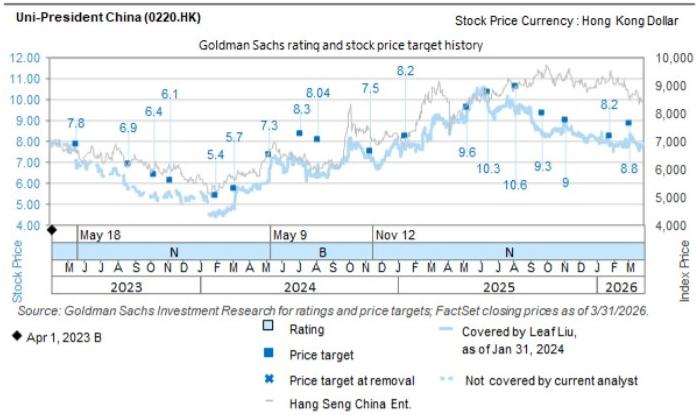

# China Consumer Staples: Chengdu Trip: Spirits target 2H26 recovery but visibility low; value retailer store openings on-track; PoS optimization a

We visited Spirits companies and Chengdu retail markets this week to check on-the-ground consumption sentiment in Sichuan. Key takeaways:

1) Spirits players are looking for sell-in and profitability improvement in 2H26 supported by an easier base despite uneven 2QTD retail demand recovery and still low visibility on demand recovery. We visited two Sichuan-based upper mid end spirits companies and found mixed 2Q trends with one seeing positive growth during the Labor Day holiday and sales stabilizing in 2QTD while the other continues de-stocking efforts. Companies noted that residential banquet demand generally remains subdued with continued trading-down in Sichuan, where companies are stepping up investments to varying degrees to support volumes through price concessions for banquets. On the bright side, both companies noted they have reduced channel inventory to healthier levels and are targeting slight YoY topline recovery for full-year 2026 alongside improving profitability/OCF through tighter cost control/operating leverage/disciplined production.

2) F&B Value Retailers channel check in Sichuan/Southwest China: Our channel checks on value retailers in Sichuan/Southwest China highlighted what appears to be a high-growth triopoly landscape led by a dominant local chain (“Yummy Snacks”) and trailed by Wanchen and Busy Ming. Per our channel checks, all the players show store format skewed to discounter supermarket in this region but with different mix of daily essential SKUs (non snack & beverage). In terms of competition, our checks suggest the local chain has very high store density in Chengdu/Sichuan including sub-urban areas (our county level market visit in Pi County surrounding Chengdu City suggested a store distance at only 300\~400m with 6 Yummy Snack stores in the area). Our checks indicated that Wanchen now has c. 1.4k stores in the southwest region after adding 300\~400 new openings year to date in 2026, mainly fueled by deeper town-level penetration with c.30k population per town (currently only 1/2\~1/3 penetrated in Sichuan) and gaining market share mainly from fragmented traditional trade (particularly local, non-chain supermarkets with lower turnover and weaker product offerings) in the low-tier areas. Meanwhile, checks note that unit economics of this national brand remain robust with \~20% GPM and HSD% operating margins in Sichuan, with lower-tier county/town regions enjoying higher margins from cheaper rents despite lower per-store GMV. While per-store average monthly GMV has diluted since 2024 amid rapid roll-out, value retailers players adopted more disciplined site selection and competition strategies into 2025/26.

3) UPC investor day market visit - PoS optimization is a key growth lever: Our

# Leaf Liu

+852-3966-4169 | leaf.liu@gs.com
GS (Asia) L.L.C.

# Christina Liu

+852-2978-6983 | christina.liu@gs.com
GS (Asia) L.L.C.

# Valerie Zhou

+852-2978-0820 | valerie.zhou@gs.com
GS (Asia) L.L.C.

meeting with UPC's regional management in Chengdu highlighted strong execution in Southwest China, where the company now directly covers 300k+ of the total 500k+ PoS with the rest reached by 1k+ distributors. PoS optimization has been the key focus in recent two years, with new high-potential outlets generating 2-3x sales vs. average and initiatives to refine consumption scenarios driving 30%+ sales uplift in the selected urban-rural hub we visited, with deeper penetration into restaurants/sports/leisure venues and non-F&B retail channels (e.g. pharmacies). In terms of POS competition, we saw broad-based expansion in coolers and smart vending machines, with 1k+ units already deployed and further upside from deeper cooperation with local CVS chains. In F&B value retail, UPC maintains pricing discipline, with differentiated products offering, and pricing floors set at 90% of suggested RSP for core SKUs and 70% for others.

The authors would like to thank Lily Qi for her contribution to this report.

# Market/Sales Site Visit Takeaways

# F&B Value Retailer Channel Checks

We performed channel checks to assess the footprint of F&B value retailers in Sichuan and the expansion outlook for Wanchen in Southwest China region (“the brand”). Store format of discounter supermarkets appear relatively more popular in Sichuan especially for the local chain Yummy Snacks. Key takeaways include:

Industry outlook: The brand continues to see meaningful room for expansion, backed by: 1) consolidating traditional trade: especially market share gain from small, predominantly non-chain supermarkets in lower-tier regions, while value retailers offer more affordable offerings with higher quality; 2) still-low penetration at the town level. Currently value retailers are moving into towns with $< 50k$ populations. The brand still sees whitespace in township (i.e. with c. 30k populations), while the brand has so far only penetrated $1/3 \sim 1/2$ of these towns. 3) incremental demand creation: value retailers stimulates additional snack and beverage consumption, with rich product offerings. Some stores opened near university campus have demonstrated new whitespaces for store locations.

Store UE for the brand in southwest region remains healthy, and lower-tier regions benefit from a lower rent-to-sales ratio: For some high performing stores in urban areas, store-level GPM generally stands at c.23% net of subsidies, against a cost structure comprised of rent at c.6% of sales, labor at c.6%, and utilities at c.2%, implying HSD% store-level OPM. Average monthly GMV per store for the brand was generally at c.Rmb320k\~330k in 2025 in Southwest China but UE is benefiting from lower opex cost.

Competitive landscape in Southwest region: Southwest China features a high-growth triopoly landscape led by a dominant local chain and trailed by two national players (including the brand), with the brand at c.1.4k stores vs. the local brand (as the largest player in Southwest) at c.2k+ stores in Sichuan. Our market visit showed us that the local chain has very high store density in Chengdu/Sichuan including sub-urban areas (our county level market visit in Pi County surrounding Chengdu City showed a store distance at only 300\~400m with 6 Yummy Snack stores in the area). In terms of product offering, this local incumbent is differentiated by a stronger emphasis on the discount

supermarket format, with more meaningful exposure to daily essentials alongside snacks and beverages, as well as a higher mix of white-label products and more localized sourcing. Improving balance between per-store GMV vs. unit expansion: Our channel checks noted that after 2\~3 years of radical store expansion by elevated new-store subsidies with focus more on quantity over quality especially in 2023-24, competition has turned more rational since 2H24 with subsidy intensity easing, site selection becoming more disciplined, and KPIs for BD teams skewing to success ratio, which has supported a broad-based recovery in per-store GMV since 2H25, with the improvement likely extending into 2026.

Current trends in Southwest region: 1) More refined operation and localized sourcing: with store density increases and procurement scale reaching critical mass, local sourcing has become more viable, driving a higher local procurement ratio catering to local customer preferences/taste. 2) New stores are now predominantly discount supermarkets: More than $80\%$ of recent openings still fall into this category, first-mover advantage for local incumbents and stronger consumer association with the format. 3) Category expansion is extending into cold-chain frozen foods: Operators are selectively adding frozen products (now small, at LSD% of GMV), particularly hotpot-related convenience foods given their relatively higher margin profile.

Retail Pricing comparison: We visited several stores of the dominant local chain in Chengdu's urban-rural fringe and a smaller local operator in a commercial district. Our checks suggest that pricing for key beverage SKUs from Nongfu/Eastroc/Alienergy/Mizone/UPC, as well as purified water SKUs from Nongfu/Wahaha, are broadly comparable across the two stores. By contrast, Tingyi's sweetened tea and C'estbon water were 10\~20% cheaper at the leading local chain. Pricing differences were more pronounced in noodles: the leading local player offered better value on certain top SKUs from tier-1 brands, for example, at a 10% discount to suggested RSP for a core UPC SKU, vs. only c.5% at the smaller local brand's store. Less prominent brands were priced even more aggressively, at up to 40% lower in the leading brand's store vs. in the smaller local brand's store. That said, we note different target customer profiles between stores located in the urban-rural fringe and those nearer the CBD.

# Beverage Market/Point of Sales site visit We visited a core commercial district in central Chengdu and observed UPC's execution for POS optimization/performance improvement in the region. In

Southwest regions, UPC has already directly covered $60\% + / \mathrm{or} 300\mathrm{k}+$ of the c.500k+ retail PoS and part of the rest covered by $1\mathrm{k}+$ distributors. In Sichuan, UPC has directly covered close to 130k traditional PoS.

# Key observations:

We see broad-based stepped-up investment in coolers and smart vending machines across leading beverage brands in Southwest China. Per the company, UPC has deployed 1k+ smart vending machines across Southwest China, and the local team remains confident in sustaining rapid growth this year.

According to UPC's Southwest regional manager, meaningful whitespace remains for further expansion in the Southwest region, with the region delivering DD% top-line growth in 1Q26. First, the company sees multiple levers to improve per-POS productivity: 1) Ongoing optimization of the PoS base should lift overall average sales per PoS, as developed higher-potential new PoS can generate 2-3x per-PoS sales vs. previous avg. level. 2) Further scenario development can also enhance PoS productivity: In one urban-rural fringe commercial hub that we visited, monthly sales increased by $30\%+$ after refining/expanding relevant consumption scenarios. Penetration of both coolers and smart vending machines into restaurants and sports/leisure venues (e.g. billiard halls and internet cafés) also continues to improve, with some locations operated through direct partnerships with professional smart-vending machine operators. Meanwhile, new PoS development remains another key growth driver. 1) Expanding cooperation with fast-growing CVS chains including local chains such as Hongqi Chain (c.3.5k stores in Sichuan), and Wudongfeng (c.1.7k stores), as well as national brand Meiyijia (c.1.5k-1.6k stores). 2) Smart vending machines are also creating new PoS by increasingly being deployed outside traditional food-and-beverage retail outlets, such as pharmacies and optical stores, where they have been well received as an ancillary revenue stream for merchants. 3) Both noodles and beverages have already penetrated most leading national and local F&B value retail chains, with the companies maintaining tight pricing discipline by requiring retail prices to remain at no less than $90\%$ of suggested retail price for core SKUs and $70\%$ for other SKUs.

\- Shelf-date differences across brands in local CVS / POSs in Chengdu (note that regional checks may not be representative of nationwide situation): We observed a noticeable difference in production-dates across brands in the PoS we visited in Chengdu. In the CVS/smart vending machines that we visited, CR Beverage products appeared relatively older, with some batches carrying February production dates; in contrast, UPC's green tea and sugar-free tea/Eastroc's Bushuila and Special Drink, were mostly from late-March to April batches. Nongfu's Oriental Leaf appeared even fresher, with most products from April batches.

# Spirits company mgmt meeting takeaways – Disciplined on supply side, but meaningful demand recovery still not in sight

We visited two upper-mid-end spirits companies in Sichuan. On the pricing/volume side, both companies are cautious on the effectiveness of price cuts to drive volume pick-up. Instead, the mgmt of company A mentioned consumer promotions (QR code scan) to boost bottle-open rate while company B is focused on brand power/channel promotions esp. on banquets. Both companies are also cutting production volume/supply with controlled cellar capacity utilization, and will focus on operating efficiency gains to support profitability in 2026.

# Company A

Brand performance and 2026 outlook: 2Q26 still saw pressured topline (esp. in Apr/Labor Day) although lapping on gradually easing comp. While the company is expected to resume profitability in 2Q26 vs. a net loss in 2Q25, partially driven by operating efficiency improvements and expense control since 2H25. Mgmt also noted weak Labor Day banquet demand from their sales team. 2026 outlook: Under narrowing industry-wide decline, the company is looking for a flattish to slightly higher 2026 revenue vs. 2025 (c.Rmb3bn) with a more favorable set-up for 3Q26/4Q26 (easy comp from nationwide shipment control in Jul-Sep 2025) post a relatively tough 1H26. The company had a nation-wide shipment suspension in 3Q25 to digest channel inventory and support pricing system, and expect sales growth to resume positive in 3Q26 with pricing system gradually stabilized especially for its Rmb200\~300 range core SKU.

Channel inventory and cash flow: The company's distributor inventories are c.3 months vs. targeted 2 months since Jun 25, better than some other upper mid end brands at 4-5 months with weaker branding power. Operating cash flow turned negative in 2025 on extending distributor payments, transferring bill receivables to banks for factoring arrangements, and continued raw material throughput and expenses related to production base.

More disciplined supply side: The company has suspended construction of some projects under its capacity plan set a few years ago, and has started production control of base liquor, to lower inventory level, control supply and improve OCF.

By region/product update: In North China, Hebei/Shandong/Inner Mongolia remained resilient with still positive growth driven by strong distributors' channel competence and Rmb200-300 price range products. In South China, Jiangsu/Zhejiang slowed down and Henan/Hunan faced higher pressure. New products launched since Sep 2025 had some growth on a relatively small scale.

# Company B

Brand performance and 2026 outlook: The company had returned to positive sales growth in 1Q26, and also saw stabilizing and even slightly recovering sales with a mild growth during Labor Day Holiday (vs. $60 - 70\%$ decline in the same period last year due to very low gifting demand) for 2Q26. Mgmt commented that key to watch will be 3Q/4Q growth recovery although they don't expect a significant rebound from 2H25's low base and expect the demand level to remain lower vs. 2024 level. On th profitability side, the company looks for NPM improvement from the trough level in 2025 driven by operating efficiency improvements (i.e. in employee streamlining), and narrowing net OCF outflow in 2026 (vs. negative OCF in 2025-end) with further improvements in 2027.

By region/product performance: Mgmt highlighted stable performance in Shandong/North East China and home-market (Sichuan) saw bottoming-out signs while East/North China are still in adjustment. Core products sell-through remained stable in 1Q26, mainly driven by banquet occasions (sell through declined if excl. banquet).

More disciplined supply side: The company's inventory build-up has slowed down since 4Q25 as the company started production control of base liquor and production line staff streamlining, to lower inventory level, control supply and improve OCF.

Industry comments: However, the company noted a still weak industry-wide retail demand, with weak sell-through and bottle-open rate for residential banquet, and competitors making significant investment in banquet to boost volume which is still disrupting the pricing system in traditional trade (i.e. distributors reselling products at lower prices to wholesale market with the subsidies/discounts granted to banquet

scenarios by spirits brands). The company also hasn't seen a meaningful recovery in commercial consumption scenario or wholesale channels.

# Price Target Risks and Methodology - Uni-President China

Valuation methodology: We are Neutral rated on UPC. Our 12-m TP of HK\$8.2 is based on a 15X 2027E avg. P/E discounted back to end-2026 using a 7.8% CoE.

Key upside risks: 1) More favorable raw material price movements; 2)

Better-than-expected performance of convenience food driven by demand recovery or new product launch; 3) Better-than-expected competition in instant noodles/beverage.

Key downside risks: 1) Higher-than-expected raw material cost pressures; 2) more intense competition in instant noodles/beverage; 3) food quality issue.

# Disclosure Appendix

# Reg AC

We, Leaf Liu, Christina Liu and Valerie Zhou, hereby certify that all of the views expressed in this report accurately reflect our personal views about the subject company or companies and its or their securities. We also certify that no part of our compensation was, is or will be, directly or indirectly, related to the specific recommendations or views expressed in this report.

Unless otherwise stated, the individuals listed on the cover page of this report are analysts in GS' Global Investment Research division.

Contributing Authors: Leaf Liu GS (Asia) L.L.C., Christina Liu GS (Asia) L.L.C., Valerie Zhou GS (Asia) L.L.C..

Unless otherwise stated, the individuals listed in the Contributing Authors disclosure of this report are analysts in GS' Global Investment Research division.

# GS Factor Profile

The GS Factor Profile provides investment context for a stock by comparing key attributes to the market (i.e. our universe of rated stocks) and its sector peers. The four key attributes depicted are: Growth, Financial Returns, Multiple (e.g. valuation) and Integrated (a composite of Growth, Financial Returns and Multiple). Growth, Financial Returns and Multiple are calculated by using normalized ranks for specific metrics for each stock. The normalized ranks for the metrics are then averaged and converted into percentiles for the relevant attribute. The precise calculation of each metric may vary depending on the fiscal year, industry and region, but the standard approach is as follows:

Growth is based on a stock's forward-looking sales growth, EBITDA growth and EPS growth (for financial stocks, only EPS and sales growth), with a higher percentile indicating a higher growth company. Financial Returns is based on a stock's forward-looking ROE, ROCE and CROCI (for financial stocks, only ROE), with a higher percentile indicating a company with higher financial returns. Multiple is based on a stock's forward-looking P/E, P/B, price/dividend (P/D), EV/EBITDA, EV/FCF and EV/Debt Adjusted Cash Flow (DACF) (for financial stocks, only P/E, P/B and P/D), with a higher percentile indicating a stock trading at a higher multiple. The Integrated percentile is calculated as the average of the Growth percentile, Financial Returns percentile and (100% - Multiple percentile).

Financial Returns and Multiple use the GS analyst forecasts at the fiscal year-end at least three quarters in the future. Growth uses inputs for the fiscal year at least seven quarters in the future compared with the year at least three quarters in the future (on a per-share basis for all metrics).

For a more detailed description of how we calculate the GS Factor Profile, please contact your GS representative.

# M&A Rank

Across our global coverage, we examine stocks using an M&A framework, considering both qualitative factors and quantitative factors (which may vary across sectors and regions) to incorporate the potential that certain companies could be acquired. We then assign a M&A rank as a means of scoring companies under our rated coverage from 1 to 3, with 1 representing high (30%-50%) probability of the company becoming an acquisition target, 2 representing medium (15%-30%) probability and 3 representing low (0%-15%) probability. For companies ranked 1 or 2, in line with our standard departmental guidelines we incorporate an M&A component into our target price. M&A rank of 3 is considered immaterial and therefore does not factor into our price target, and may or may not be discussed in research.

# Quantum

Quantum is GS' proprietary database providing access to detailed financial statement histories, forecasts and ratios. It can be used for in-depth analysis of a single company, or to make comparisons between companies in different sectors and markets.

# Disclosures

The rating(s) for Uni-President China is/are relative to the other companies in its/their coverage universe: Anhui Gujing Distillery Co., Budweiser APAC, Busy Ming Group, China Feihe Ltd., China Resources Beer, China Resources Beverage, Chongqing Brewery, Eastroc Beverage (A), Foshan Haitian Flavouring & Food (A), Foshan Haitian Flavouring & Food (H), Fujian Wanchen Food, Fuling Zhacai, Jiangsu King's Luck Brewery, Jiangsu Yanghe, Jiugui Liquor, Jonjee Hi-Tech, Kweichow Moutai, Luzhou Laojiao, Mengniu Dairy, Nongfu Spring, Qianhe Condiment and Food, Shanghai Bairun, Shanxi Xinghuacun Fen Wine, Sichuan Swellfun Co., Sichuan Teway Food Group, Tingyi, Tsingtao Brewery (A), Tsingtao Brewery (H), Uni-President China, Wuliangye Yibin, Yihai International Holding, Yili Industrial, ZJLD

# Company-specific regulatory disclosures

The following disclosures relate to relationships between The GS Group, Inc. (with its affiliates, “GS”) and companies covered by GS Global Investment Research and referred to in this research.

GS expects to receive or intends to seek compensation for investment banking services in the next 3 months: Uni-President China (HK\$8.12)

GS had an investment banking services client relationship during the past 12 months with: Uni-President China (HK\$8.12)

There are no company-specific disclosures for: Jinzai Food Group (Rmb10.94)

# Distribution of ratings/investment banking relationships

GS Investment Research global Equity coverage universe

<table><tr><td rowspan="2"></td><td colspan="3">Rating Distribution</td><td colspan="3">Investment Banking Relationships</td></tr><tr><td>Buy</td><td>Hold</td><td>Sell</td><td>Buy</td><td>Hold</td><td>Sell</td></tr><tr><td>Global</td><td>50%</td><td>34%</td><td>16%</td><td>65%</td><td>60%</td><td>45%</td></tr></table>

As of April 1, 2026, GS Global Investment Research had investment ratings on 3,074 equity securities. GS assigns stocks as Buys and Sells on various regional Investment Lists; stocks not so assigned are deemed Neutral. Such assignments equate to Buy, Hold and Sell for the purposes of the above disclosure required by the FINRA Rules. See 'Ratings, Coverage universe and related definitions' below. The Investment Banking Relationships chart reflects the percentage of subject companies within each rating category for whom GS has provided investment banking services within the previous twelve months.

Price target and rating history chart(s)   

line

| Date       | Stock Price | Index Price | Rating | Price target | Price target at removal | Not covered by current analyst |
|------------|-------------|-------------|--------|--------------|---------------------------|-------------------------------|
| May 18     | 7.8         | 7.8         | N      | 6.9          | 6.4                       | -                             |
| May 9      | 5.4         | 5.4         | B      | 7.3          | 8.3                       | -                             |
| Nov 12     | 8.2         | 8.2         | N      | 9.6          | 10.3                      | -                             |
| Nov 12     | 10.6        | 10.6        | N      | 9.3          | 9                         | -                             |
| Nov 12     | 8.8         | 8.8         | N      | 8.2          | -                         | -                             |

The price targets shown should be considered in the context of all prior published GS, which may or may not have included price targets, as well as developments relating to the company, its industry and financial markets.

Target price history table(s) Uni-President China (0220.HK) 

<table><tr><td>Date of report</td><td>Target price (HK$)</td><td>Closing price (HK$)</td></tr><tr><td>07-May-26</td><td>8.20</td><td>7.41</td></tr><tr><td>04-Mar-26</td><td>8.80</td><td>7.98</td></tr><tr><td>27-Jan-26</td><td>8.20</td><td>7.89</td></tr><tr><td>06-Nov-25</td><td>9.00</td><td>8.95</td></tr><tr><td>27-Sep-25</td><td>9.30</td><td>8.40</td></tr><tr><td>06-Aug-25</td><td>10.60</td><td>9.25</td></tr><tr><td>16-Jun-25</td><td>10.30</td><td>9.92</td></tr><tr><td>08-May-25</td><td>9.60</td><td>8.98</td></tr><tr><td>16-Jan-25</td><td>8.20</td><td>7.60</td></tr><tr><td>12-Nov-24</td><td>7.50</td><td>7.22</td></tr><tr><td>08-Aug-24</td><td>8.04</td><td>6.25</td></tr><tr><td>07-Jul-24</td><td>8.30</td><td>7.17</td></tr><tr><td>09-May-24</td><td>7.30</td><td>6.12</td></tr><tr><td>06-Mar-24</td><td>5.70</td><td>4.91</td></tr><tr><td>31-Jan-24</td><td>5.40</td><td>4.38</td></tr><tr><td>09-Nov-23</td><td>6.10</td><td>5.46</td></tr><tr><td>10-Oct-23</td><td>6.40</td><td>5.43</td></tr><tr><td>23-Aug-23</td><td>6.90</td><td>5.73</td></tr><tr><td>18-May-23</td><td>7.80</td><td>7.09</td></tr></table>

Price targets shown in table(s) are unadjusted for corporate actions.

# Regulatory disclosures

# Disclosures required by United States laws and regulations

See company-specific regulatory disclosures above for any of the following disclosures required as to companies referred to in this report: manager or co-manager in a pending transaction; $1\%$ or other ownership; compensation for certain services; types of client relationships; managed/co-managed public offerings in prior periods; directorships; for equity securities, market making and/or specialist role. GS trades or may trade as a principal in debt securities (or in related derivatives) of issuers discussed in this report.

The following are additional required disclosures: Ownership and material conflicts of interest: GS policy prohibits its analysts, professionals reporting to analysts and members of their households from owning securities of any company in the analyst's area of coverage. Analyst compensation: Analysts are paid in part based on the profitability of GS, which includes investment banking revenues. Analyst as officer or director: GS policy generally prohibits its analysts, persons reporting to analysts or members of their households from serving as an officer, director or advisor of any company in the analyst's area of coverage. Non-U.S. Analysts: Non-U.S. analysts may not be associated persons of GS & Co. LLC and therefore may not be subject to FINRA Rule 2241 or FINRA Rule 2242 restrictions on communications with a subject company, public appearances and trading in securities covered by the analysts.

Distribution of ratings: See the distribution of ratings disclosure above. Price chart: See the price chart, with changes of ratings and price targets in prior periods, above, or, if electronic format or if with respect to multiple companies which are the subject of this report, on the GS website at https://www.gs.com/research/hedge.html.

# Additional disclosures required under the laws and regulations of jurisdictions other than the United States

The following disclosures are those required by the jurisdiction indicated, except to the extent already made above pursuant to United States laws and regulations. Australia: GS Australia Pty Ltd and its affiliates are not authorised deposit-taking institutions (as that term is defined in the Banking Act 1959 (Cth)) in Australia and do not provide banking services, nor carry on a banking business, in Australia. This research, and any access to it, is intended only for “wholesale clients” within the meaning of the Australian Corporations Act, unless otherwise agreed by GS. In producing research reports, members of Global Investment Research of GS Australia may attend site visits and other meetings hosted by the companies and other entities which are the subject of its research reports. In some instances the costs of such site visits or meetings may be met in part or in whole by the issuers concerned if GS Australia considers it is appropriate and reasonable in the specific circumstances relating to the site visit or meeting. To the extent that the contents of this document contains any financial product advice, it is general advice only and has been prepared by GS without taking into account a client’s objectives, financial situation or needs. A client should, before acting on any such advice, consider the appropriateness of the advice having regard to the client’s own objectives, financial situation and needs. A copy of certain GS Australia and New Zealand disclosure of interests and a copy of GS’ Australian Sell-Side Research Independence Policy Statement are available at: https://www.goldmansachs.com/disclosures/australia-new-zealand/index.html. Brazil: Disclosure information in relation to CVM Resolution n. 20 is available at https://www.gs.com/worldwide/brazil/area/gir/index.html. Where applicable, the Brazil-registered analyst primarily responsible for the content of this research report, as defined in Article 20 of CVM Resolution n. 20, is the first author named at the beginning of this report, unless indicated otherwise at the end of the text. Canada: This information is being provided to you for information purposes only and is not, and under no circumstances should be construed as, an advertisement, offering or solicitation by GS & Co. LLC for purchasers of securities in Canada to trade in any Canadian security. GS & Co. LLC is not registered as a dealer in any jurisdiction in Canada under applicable Canadian securities laws and generally is not permitted to trade in Canadian securities and may be prohibited from selling certain securities and products in certain jurisdictions in Canada. If you wish to trade in any Canadian securities or other products in Canada please contact GS Canada Inc., an affiliate of The GS Group Inc., or another registered Canadian dealer. Hong Kong: Further information on the securities of covered companies referred to in this research may be obtained on request from GS (Asia) L.L.C. India: Further information on the subject company or companies referred to in this research may be obtained from GS (India) Securities Private Limited, Research Analyst – SEBI Registration Number INH000001493, 10th Floor, Ascent-Worli, Sudam Kalu Ahire Marg, Worli, Mumbai-400 025, India, Corporate Identity Number U74140MH2006FTC160634, Phone +91 22 6616 9000, Fax +91 22 6616 9001. GS may beneficially own 1% or more of the securities (as such term is defined in clause 2 (h) the Indian Securities Contracts (Regulation) Act, 1956) of the subject company or companies referred to in this research report. Investment in securities market are subject to market risks. Read all the related documents carefully before investing. Registration granted by SEBI and certification from NISM in no way guarantee performance of the intermediary or provide any assurance of returns to investors. GS (India) Securities Private Limited compliance officer and investor grievance contact details can be found at: https://www.goldmansachs.com/worldwide/india/documents/Grievance-Redressal-and-Escalation-Matrix.pdf, and a copy of the annual audit compliance report can be found at this link: https://publishing.gs.com/content/site/india-annual-compliance-report.html. Japan: See below. Korea: This research, and any access to it, is intended only for “professional investors” within the meaning of the Financial Services and Capital Markets Act, unless otherwise agreed by GS. Further information on the subject company or companies referred to in this research may be obtained from GS (Asia) L.L.C., Seoul Branch. New Zealand: GS New Zealand Limited and its affiliates are neither “registered banks” nor “deposit takers” (as defined in the Reserve Bank of New Zealand Act 1989) in New Zealand. This research, and any access to it, is intended for “wholesale clients” (as defined in the Financial Advisers Act 2008) unless otherwise agreed by GS. A copy of certain GS Australia and New Zealand disclosure of interests is available at: https://www.goldmansachs.com/disclosures/australia-new-zealand/index.html. Russia: Research reports distributed in the Russian Federation are not advertising as defined in the Russian legislation, but are information and analysis not having product promotion as their main purpose and do not provide appraisal within the meaning of the Russian legislation on appraisal activity. Research reports do not constitute a personalized investment recommendation as defined in Russian laws and regulations, are not addressed to a specific client, and are prepared without analyzing the financial circumstances, investment profiles or risk profiles of clients. GS assumes no responsibility for any investment decisions that may be taken by a client or any other person based on this research report. Singapore: GS (Singapore) Pte. (Company Number: 198602165W), which is regulated by the Monetary Authority of Singapore, accepts legal responsibility for this research, and should be contacted with respect to any matters arising from, or in connection with, this research. Taiwan: This material is for reference only and must not be reprinted without permission. Investors should carefully consider their own investment risk. Investment results are the responsibility of the individual investor. United Kingdom: Persons who would be categorized as retail clients in the United Kingdom, as such term is defined in the rules of the Financial Conduct Authority, should read this research in conjunction with prior GS on the covered companies referred to herein and should refer to the risk warnings that have been sent to them by GS International. A copy of these risks warnings, and a glossary of certain financial terms used in this report, are available from GS International on request.

European Union and United Kingdom: Disclosure information in relation to Article 6 (2) of the European Commission Delegated Regulation (EU) (2016/958) supplementing Regulation (EU) No 596/2014 of the European Parliament and of the Council (including as that Delegated Regulation is implemented into United Kingdom domestic law and regulation following the United Kingdom's departure from the European Union and the European Economic Area) with regard to regulatory technical standards for the technical arrangements for objective presentation of investment recommendations or other information recommending or suggesting an investment strategy and for disclosure of particular interests or indications of conflicts of interest is available at https://www.gs.com/disclosures/europeanpolicy.html which states the European Policy for Managing Conflicts of Interest in Connection with Investment Research.

Japan: GS Japan Co., Ltd. is a Financial Instrument Dealer registered with the Kanto Financial Bureau under registration number Kinsho 69, and a member of Japan Securities Dealers Association, Financial Futures Association of Japan Type II Financial Instruments Firms Association, and Investment Management Association of Japan. Sales and purchase of equities are subject to commission pre-determined with clients plus consumption tax. See company-specific disclosures as to any applicable disclosures required by Japanese stock exchanges, the Japanese Securities Dealers Association or the Japanese Securities Finance Company.

# Ratings, coverage universe and related definitions

Buy (B), Neutral (N), Sell (S) Analysts recommend stocks as Buys or Sells for inclusion on various regional Investment Lists. Being assigned a Buy or Sell on an Investment List is determined by a stock's total return potential relative to its coverage universe. Any stock not assigned as a Buy or a Sell on an Investment List with an active rating (i.e., a stock that is not Rating Suspended, Not Rated, Early-Stage Biotech, Coverage Suspended or Not Covered), is deemed Neutral. Each region manages Regional Conviction Lists, which are selected from Buy rated stocks on the respective region's Investment Lists and represent investment recommendations focused on the size of the total return potential and/or the likelihood of the realization of the return across their respective areas of coverage. The addition or removal of stocks from such Conviction Lists are managed by the Investment Review Committee or other designated committee in each respective region and do not represent a change in the analysts' investment rating for such stocks.

Total return potential represents the upside or downside differential between the current share price and the price target, including all paid or anticipated dividends, expected during the time horizon associated with the price target. Price targets are required for all covered stocks. The total return potential, price target and associated time horizon are stated in each report adding or reiterating an Investment List membership.

Coverage Universe: A list of all stocks in each coverage universe is available by primary analyst, stock and coverage universe at https://www.gs.com/research/hedge.html.

Not Rated (NR). The investment rating, target price and earnings estimates (where relevant) are removed pursuant to GS policy when GS is acting in an advisory capacity in a merger or in a strategic transaction involving this company, when there are legal, regulatory or policy constraints due to GS' involvement in a transaction, and in certain other circumstances. Early-Stage Biotech (ES). An investment rating and a target price are not assigned pursuant to GS policy when this company has neither a drug, treatment or medical device that has passed a Phase II clinical trial nor a license to distribute a post-Phase II drug, treatment or medical device. Rating Suspended (RS). GS has suspended the investment rating and price target for this stock, because there is not a sufficient fundamental basis for determining an investment rating or target price. The previous investment rating and target price, if any, are no longer in effect for this stock and should not be relied upon. Coverage Suspended (CS). GS has suspended coverage of this company. Not Covered (NC). GS does not cover this company.

# Global product; distributing entities

GS Global Investment Research produces and distributes research products for clients of GS on a global basis. Analysts based in GS offices around the world produce research on industries and companies, and research on macroeconomics, currencies, commodities and portfolio strategy. This research is disseminated in Australia by GS Australia Pty Ltd (ABN 21 006 797 897); in Brazil by GS do Brasil Corretora de Títulos e Valores Mobiliários S.A.; Public Communication Channel GS Brazil: 0800 727 5764 and / or contatogoldmanbrasil@gs.com. Available Weekdays (except holidays), from 9am to 6pm. Canal de Comunicação com o Público GS Brasil: 0800 727 5764 e/ou contatogoldmanbrasil@gs.com. Horário de funcionamento: segunda-feira à sexta-feira (exceto feriados), das 9h às 18h; in Canada by GS & Co. LLC; in Hong Kong by GS (Asia) L.L.C.; in India by GS (India) Securities Private Ltd.; in Japan by GS Japan Co., Ltd.; in the Republic of Korea by GS (Asia) L.L.C., Seoul Branch; in New Zealand by GS New Zealand Limited; in Russia by OOO GS; in Singapore by GS (Singapore) Pte. (Company Number: 198602165W); and in the United States of America by GS & Co. LLC. GS International has approved this research in connection with its distribution in the United Kingdom.

GS International (“GSI”), authorised by the Prudential Regulation Authority (“PRA”) and regulated by the Financial Conduct Authority (“FCA”) and the PRA, has approved this research in connection with its distribution in the United Kingdom.

European Economic Area: GS Bank Europe SE (“GSBE”) is a credit institution incorporated in Germany and, within the Single Supervisory Mechanism, subject to direct prudential supervision by the European Central Bank and in other respects supervised by German Federal Financial Supervisory Authority (Bundesanstalt für Finanzdienstleistungsaufsicht, BaFin) and Deutsche Bundesbank and disseminates research within the European Economic Area.

# General disclosures

This research is for our clients only. Other than disclosures relating to GS, this research is based on current public information that we consider reliable, but we do not represent it is accurate or complete, and it should not be relied on as such. The information, opinions, estimates and forecasts contained herein are as of the date hereof and are subject to change without prior notification. We seek to update our research as appropriate, but various regulations may prevent us from doing so. Other than certain industry reports published on a periodic basis, the large majority of reports are published at irregular intervals as appropriate in the analyst's judgment.

GS conducts a global full-service, integrated investment banking, investment management, and brokerage business. We have investment banking and other business relationships with a substantial percentage of the companies covered by Global Investment Research. GS & Co. LLC, the United States broker dealer, is a member of SIPC (https://www.sipc.org).

Our salespeople, traders, and other professionals may provide oral or written market commentary or trading strategies to our clients and principal trading desks that reflect opinions that are contrary to the opinions expressed in this research. Our asset management area, principal trading desks and investing businesses may make investment decisions that are inconsistent with the recommendations or views expressed in this research.

The analysts named in this report may have from time to time discussed with our clients, including GS salespersons and traders, or may discuss in this report, trading strategies that reference catalysts or events that may have a near-term impact on the market price of the equity securities discussed in this report, which impact may be directionally counter to the analyst's published price target expectations for such stocks. Any such trading strategies are distinct from and do not affect the analyst's fundamental equity rating for such stocks, which rating reflects a stock's return potential relative to its coverage universe as described herein.

We and our affiliates, officers, directors, and employees will from time to time have long or short positions in, act as principal in, and buy or sell, the securities or derivatives, if any, referred to in this research, unless otherwise prohibited by regulation or GS policy.

The views attributed to third party presenters at GS arranged conferences, including individuals from other parts of GS, do not necessarily reflect those of Global Investment Research and are not an official view of GS.

Any third party referenced herein, including any salespeople, traders and other professionals or members of their household, may have positions in the products mentioned that are inconsistent with the views expressed by analysts named in this report.

This research is not an offer to sell or the solicitation of an offer to buy any security in any jurisdiction where such an offer or solicitation would be illegal. It does not constitute a personal recommendation or take into account the particular investment objectives, financial situations, or needs of individual clients. Clients should consider whether any advice or recommendation in this research is suitable for their particular circumstances and, if appropriate, seek professional advice, including tax advice. The price and value of investments referred to in this research and the income from them may fluctuate. Past performance is not a guide to future performance, future returns are not guaranteed, and a loss of original capital may occur. Fluctuations in exchange rates could have adverse effects on the value or price of, or income derived from, certain investments.

Certain transactions, including those involving futures, options, and other derivatives, give rise to substantial risk and are not suitable for all investors. Investors should review current options and futures disclosure documents which are available from GS sales representatives or at https://www.theocc.com/about/publications/character-risks.jsp and https://www.goldmansachs.com/disclosures/cftc\_fcm\_disclosures. Transaction costs may be significant in option strategies calling for multiple purchase and sales of options such as spreads. Supporting documentation will be supplied upon request.

Differing Levels of Service provided by Global Investment Research: The level and types of services provided to you by GS Global Investment Research may vary as compared to that provided to internal and other external clients of GS, depending on various factors including your individual preferences as to the frequency and manner of receiving communication, your risk profile and investment focus and perspective (e.g., marketwide, sector specific, long term, short term), the size and scope of your overall client relationship with GS, and legal and regulatory constraints. As an example, certain clients may request to receive notifications when research on specific securities is published, and certain clients may request that specific data underlying analysts' fundamental analysis available on our internal client websites be delivered to them electronically through data feeds or otherwise. No change to an analyst's fundamental research views (e.g., ratings, price targets, or material changes to earnings estimates for equity securities), will be communicated to any client prior to inclusion of such information in a research report broadly disseminated through electronic publication to our internal client websites or through other means, as necessary, to all clients who are entitled to receive such reports.

All research reports are disseminated and available to all clients simultaneously through electronic publication to our internal client websites. Not all research content is redistributed to our clients or available to third-party aggregators, nor is GS responsible for the redistribution of our research by third party aggregators. For research, models or other data related to one or more securities, markets or asset classes (including related services) that may be available to you, please contact your GS representative or go to https://research.gs.com.

Disclosure information is also available at https://www.gs.com/research/hedge.html or from Research Compliance, 200 West Street, New York, NY 10282.

# © 2026 GS.

You are permitted to store, display, analyze, modify, reformat, and print the information made available to you via this service only for your own use. You may not resell or reverse engineer this information to calculate or develop any index for disclosure and/or marketing or create any other derivative works or commercial product(s), data or offering(s) without the express written consent of GS. You are not permitted to publish, transmit, or otherwise reproduce this information, in whole or in part, in any format to any third party without the express written consent of GS. This foregoing restriction includes, without limitation, using, extracting, downloading or retrieving this information, in whole or in part, to train or finetune a machine learning or artificial intelligence system, or to provide or reproduce this information, in whole or in part, as a prompt or input to any such system.