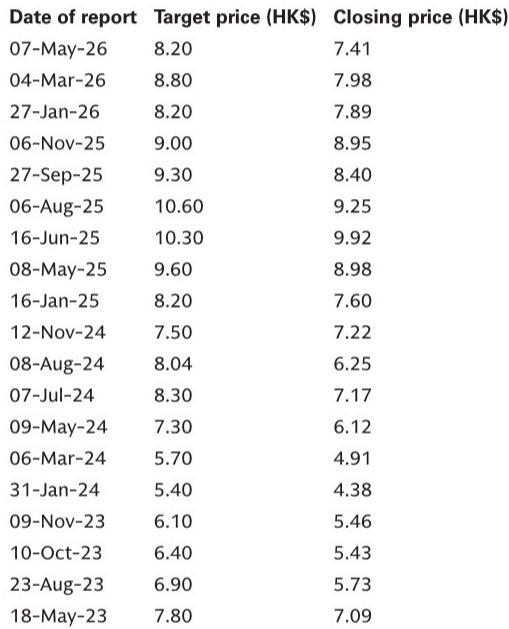
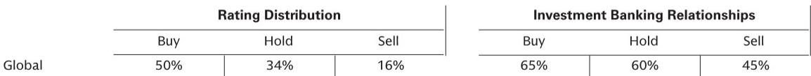

# 白酒的底在供给侧，但需求侧的春天还没来

这份来自某外资投行的成都实地调研报告，提供了一个难得的窗口：在行业普遍等待需求复苏时，真正的结构性变化正在供给端发生。但这份变化能否撑起估值，还需要回答几个关键问题。

白酒行业已经经历了近三年的调整。市场习惯于用“需求何时见底”来锚定投资时机。但这份调研报告传递出一个更微妙的信号：对于真正有定价权的企业，底可能已经过了——但这个底不是需求底，而是供给底。

报告覆盖了川内两家次高端白酒公司、一家全国性饮料企业以及西南地区的零食折扣店渠道。三个看似不相关的行业，却指向同一个核心判断：在需求复苏仍缺乏可见度的当下，企业能否通过供给侧纪律、渠道效率和竞争格局的改善，重新定义自己的盈利底线，才是决定下一轮周期中谁能够率先走出来的关键。

这不是一个关于“V型反弹”的故事。这是一场关于“谁能在低增长环境中把规模转化为议价权”的淘汰赛。

## 1. 白酒公司正在做一件过去十年很少做的事：主动减产

报告中最值得关注的信号，是两家川酒公司在供给端的主动收缩。公司A已经暂停了部分产能建设项目的施工，并开始控制基酒产量。公司B从2025年四季度起放缓了库存累积节奏，同样启动了基酒生产控制和产线人员精简。

这在过去十年白酒的上行周期中几乎不可想象。产能扩张曾是品牌势能的象征，而今天，控制产量成为改善现金流和支撑价格体系的必要手段。

报告明确指出，公司A在2025年经营性现金流已转为负值，原因包括延长经销商账期、将应收票据进行保理融资，以及持续的原材料和生产基地支出。公司B也在2025年经历了经营性现金流净流出，预计2026年才能收窄。

这意味着，行业不再是通过压货来维持报表增长。供给侧的纪律正在从被动去库存转向主动的生产控制。对于投资者而言，这需要重新评估企业的“产能价值”——过去被视为增长引擎的产能，现在可能变成现金流的拖累，除非企业有能力和意愿去主动管理它。

但这里有一个尚未回答的问题：这种供给收缩是周期性的还是结构性的？如果需求在2026年下半年如预期般温和复苏，企业是否会重新开动产能？报告并未给出明确答案，而这恰恰是判断估值修复空间的关键。

## 2. 渠道库存已降至健康水位，但“健康”不等于“强劲”

两家公司均表示，渠道库存已降至更健康的水平。公司A的经销商库存约3个月，目标为2个月，优于其他品牌力较弱的次高端品牌（4-5个月）。公司B在2026年一季度也实现了销售正增长。

这是一个积极信号。渠道库存的消化是行业走出底部的必要条件。但报告同时指出，零售端的实际动销和开瓶率仍然疲弱。公司A在五一期间的宴席需求表现平淡，公司B虽然五一期间实现了温和增长，但管理层明确表示，3、4季度的增长才是关键观察窗口，且不预期需求水平能恢复到2024年。

这意味着，渠道去库存更多是企业主动控货的结果，而非终端需求的自然拉动。库存水位下降，为后续补库提供了空间，但补库能否兑现，取决于终端需求是否真正回暖。如果需求持续疲弱，健康的库存水位只能防止价格进一步崩塌，并不能驱动增长。

因此，投资者需要区分“库存周期底”和“需求周期底”。前者已经出现，后者仍不确定。对于白酒板块的定价而言，这意味着估值修复的空间可能有限——除非需求端的信号变得更加清晰。

## 3. 宴席场景的竞争正在侵蚀行业定价体系

报告揭示了一个值得警惕的趋势：为了在宴席市场争夺销量，白酒企业正在加大投入，通过价格折让来换取动销。但这一策略正在产生副作用——经销商将宴席场景获得的补贴和折扣，以更低价格转售到批发市场，从而破坏了传统渠道的价格体系。

这是一个典型的“囚徒困境”：单个企业的理性行为（补贴宴席以保销量）导致了行业整体的非理性结果（价格体系紊乱）。公司B的管理层也承认，尚未看到商务消费场景或批发渠道的实质性回暖。

这意味着，即使行业整体库存健康，但价格体系的修复可能需要更长时间。对于次高端品牌而言，200-300元价格带的核心产品能否稳住价格，将直接决定其盈利能力的恢复速度。报告提到，公司A的核心产品价格体系正在逐步稳定，但这仍需要后续几个季度的验证。

对于投资者而言，关注点不应仅仅是销量增速，更应该是“在不破坏价格体系的前提下实现增长”的能力。这需要企业有足够的品牌力和渠道管控力，而这正是行业分化的开始。

## 4. 零食折扣店的竞争正在从“铺量”转向“精耕”

报告对西南地区零食折扣店的渠道调研，提供了一个与白酒行业截然不同的竞争图景。这里是一个高增长的“三寡头”格局：一家本地龙头（“零食很忙”）和两家全国性品牌（万辰、好想来）。

关键变化在于竞争逻辑的转变：经过2023-2024年以补贴换规模的激进扩张后，行业从2024年下半年开始变得更加理性。补贴强度减弱，选址更加严格，BD团队的KPI转向成功率，而非开店数量。结果是从2025年下半年开始，单店GMV出现了广泛回升。

这一转变对投资者有双重含义。第一，它意味着零食折扣店行业的竞争格局正在改善，头部企业的单位经济模型（UE）有望企稳甚至提升。报告显示，万辰在西南地区的门店层面毛利率约20%，运营利润率在中高个位数，且低线城市的利润率更高（租金更低）。

第二，它暗示了这类“渠道型”企业的估值逻辑可能需要重新审视。市场此前担忧的是无节制的扩张会侵蚀单店模型，但如果竞争趋于理性，行业的可投资性将显著提升。尤其值得注意的是，报告提到万辰在西南地区的门店数量已达约1400家，但乡镇层面的渗透率仅为1/3到1/2，仍有扩张空间。

但这里同样存在未解问题：随着门店密度继续增加，单店GMV能否维持回升趋势？本地龙头的差异化策略（更多白牌产品、更本地化的采购）是否会构成可持续的护城河？报告提供了观察框架，但并未给出确定答案。

## 5. 饮料行业的增长杠杆已经从铺货转向“单点产出”

报告对统一企业中国（UPC）在西南地区的调研，展示了另一条增长路径：在覆盖足够多的销售点（PoS）之后，增长的主要驱动力正在从“铺更多点”转向“让每个点卖得更多”。

UPC在西南地区已直接覆盖超过30万个零售PoS，占总数的60%以上。但管理层的关注点已经从覆盖率转向了单点产出。具体措施包括：优化PoS组合，新开发的高潜力网点单点产出是平均水平的2-3倍；通过场景细化提升产出，在调研的一个城乡结合部商圈，通过细化和扩展消费场景，月销售额提升了30%以上。

此外，冷柜和智能售货机的投放也在加速。UPC已在西南部署超过1000台智能售货机，并正在向餐厅、体育休闲场所甚至药店等非传统零售渠道渗透。

这些细节揭示了一个重要洞察：在消费品行业，当渠道覆盖率接近天花板时，增长的质量取决于企业能否从“渠道覆盖”转向“渠道运营”。这需要企业具备精细化的数据能力和终端执行能力，而不仅仅是品牌投放和分销网络。

对于投资者而言，UPC在西南地区的表现，提供了一个观察“运营驱动增长”是否可持续的窗口。但报告中的另一处细节也值得注意：在成都的便利店和售货机中，不同品牌产品的生产日期存在明显差异——华润饮料的产品相对较旧，而UPC和东鹏饮料的产品更新鲜。这暗示了不同品牌在供应链和渠道周转效率上的差异，而这可能成为下一阶段竞争的分水岭。

## 6. 报告尚未完全回答的关键问题：需求何时以及如何回来？

尽管报告提供了大量关于供给侧改善的证据，但对于需求侧的判断仍然谨慎。两家白酒公司都将2026年下半年视为可能的复苏窗口，原因之一是2025年下半年的低基数。但管理层明确表示，需求复苏的可见度仍然很低。

这引出一个更深层次的问题：如果需求复苏仅来自基数效应，而非结构性改善，那么企业的盈利修复可能是一次性的，而非可持续的。对于白酒行业而言，商务消费场景的恢复才是真正的“需求底”，而报告并未提供这方面的积极信号。

对于零食折扣店和饮料行业而言，需求侧的风险相对较小，因为这些行业更多受益于消费降级和渠道变革。但竞争格局的改善能否持续，仍取决于行业参与者能否保持理性。

因此，这份报告最大的价值，不在于给出一个明确的投资结论，而在于提供了一套观察框架：在需求不确定的环境下，供给侧的变化（产能纪律、库存健康度、竞争理性）才是更可追踪的前瞻指标。

对于希望深入理解这些变化的读者，我们建议关注以下几个尚未完全解答的问题：白酒企业的主动减产能否持续，还是会随着需求回暖而逆转？零食折扣店行业的竞争理性是结构性转变还是阶段性缓和？饮料企业的单点产出提升能否对冲渠道覆盖的边际递减？这些问题的答案，将决定当前估值水平是否具有吸引力。

欢迎来星球微信群里继续讨论这些未解问题。我们将持续跟踪这些关键变量的变化，并在后续的研报解读中提供更深度的分析。

Personal reading notes and learning share only. Not investment advice.

