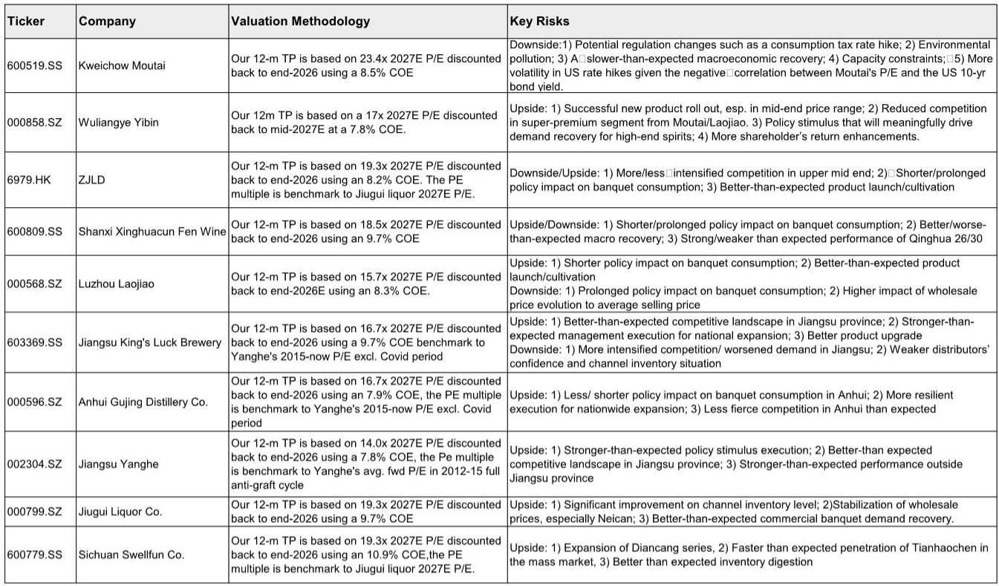
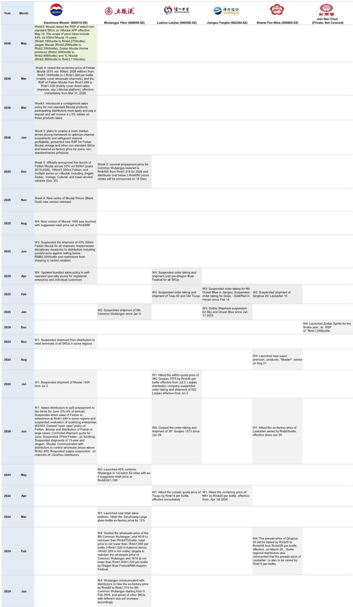
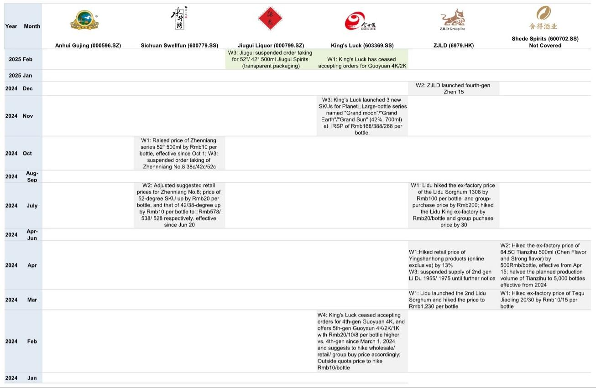

# 市场真正低估的不是需求，而是供给侧的主动收缩

白酒行业的叙事正在发生一次静默的切换。过去两年，几乎所有关于高端白酒的讨论都围绕着一个问题：需求到底行不行。商务宴请停滞，政务需求收缩，居民消费意愿谨慎——这些事实没有错，但它们正在遮蔽一个更重要的结构性变化。

根据某外资投行最新发布的华东渠道跟踪报告，飞天茅台批发价在5月上半月继续小幅上行，原箱价格从1665元/瓶升至1680元/瓶，散瓶从1630元升至1640元。同期，普五和国窖1573批发价保持平稳。单看这个价格走势，市场很容易将其解读为“需求还行”。但报告真正值得关注的信号不在这里。

真正值得关注的是三个被市场低估的供给侧变量：i茅台在淡季主动收窄供给、非标产品的渠道政策调整、以及厂家对渠道利润的重新分配。这些动作叠加在一起，指向一个更深的判断——高端白酒的定价权正在从“需求拉动”向“供给管控”迁移。这不是一个短期的淡季现象，它可能重新定义这一轮白酒周期的定价逻辑。

以下是我们从这份报告中提炼出的五个核心洞察。

## 1. 飞天茅台的价格韧性，更多来自渠道库存极低和供给主动收紧，而非需求强劲

报告显示，华东某省的经销商库存已从4月的20-25天降至约15天，部分区域的产品到货后10天内即完成销售。1-5月配额已经执行完毕，5月预付款已完成，6月预付款将在未来一周内启动。从全年目标完成度来看，目前已完成约48%，5-6月配额合计约占全年目标的个位数中段到高段。

这些数字单独看，确实说明渠道流转健康。但把库存水平和i茅台的供给动作放在一起看，结论会更清晰。

报告特别指出，5月i茅台的供给量环比一季度缩减了约40%。这不是一个随机的季节性调整。4月i茅台月活用户已经降至1000万，日活约110万，供给收缩的幅度明显大于用户活跃度的下滑幅度。同时，原箱产品的投放量被压低，取而代之的是散瓶（2-4瓶）的供应。这一调整的直接效果是：原箱与散瓶之间的价差得以维持，甚至小幅走阔。

这意味着什么？茅台的管理层正在用一种更精细化的方式管理市场预期。淡季主动收量，不是为了对冲需求下滑，而是为了在需求自然走弱的窗口期，维持价格体系的稳定。这不是被动的防守，而是主动的供给侧管理。

## 2. 非标产品正在成为价格体系的新锚点，但消费场景的集中度仍是隐忧

报告跟踪了四款非标飞天茅台的批发价格变化。过去两周，精品茅台/茅台15年/1升飞天分别上涨40元、50元、80元/瓶，生肖下跌20元/瓶。同时，茅台在5月16日对i茅台上的多款非标产品进行了提价：茅台15年建议零售价从4199元提至4279元，精品茅台从2299元提至2359元，1升飞天从2989元提至3119元。

这里有一个容易被忽略的结构性问题。报告明确指出，非标飞天70%以上的消费场景绑定于商务宴请。而商务宴请的需求，根据同一份报告的渠道反馈，目前“几乎停滞”。政务需求也在显著下降。唯一增长的是居民宴席场景，同比增长了十几个百分点，但这部分需求的体量和价格敏感度，与商务宴请完全不在一个量级。

所以，非标产品的提价，本质上不是在“需求强劲”的基础上加价，而是在“商务场景需求不济”的背景下，通过供给管控和渠道政策来维护价格带。如果商务宴请需求持续低迷，非标产品的价格能否维持当前水平，是一个需要持续验证的问题。报告没有给出这个问题的答案，但它提供了足够的线索让读者自己去追问。

## 3. 五粮液的股东回报承诺，正在重塑市场对“确定性”的定价

在五粮液的年度股东大会上，管理层释放了几个明确的信号：2026年收入目标为双位数增长；长期战略聚焦核心品牌，1618、39度五粮液和五粮春各自目标百亿销售规模；12个月内完成80-100亿元的股份回购并全部注销；2025年年度分红超过200亿元，将在两个月内完成；同时计划制定2027-2029年的新一轮股东回报计划。

如果只看收入目标，双位数增长在当前消费环境下并不容易。但市场真正需要重新定价的，可能是五粮液作为“分红+回购”组合的确定性。200亿元以上的年度分红，加上80-100亿元的回购注销，合计回报规模已经接近300亿元。以当前市值计算，这个回报率的吸引力正在变得不可忽视。

报告没有直接讨论这一点，但逻辑链条是清晰的：当行业增速放缓，市场对增长故事的估值溢价会收窄，而对现金流回报的估值权重会上升。五粮液的这一系列动作，本质上是在主动适应这个估值框架的切换。它不是在告诉市场“我的增长有多快”，而是在说“我的回报有多确定”。

## 4. 渠道政策的调整方向，从“压货”转向“保利”，这是一个需要持续验证的关键假设

报告梳理了2024年以来主要白酒企业的渠道政策变化，一个清晰的趋势正在浮现：厂家正在从追求出货量转向维护渠道利润。

茅台在3月推出了非标产品的寄售政策，经销商需申请并缴纳保证金，可获得约5%的返利。茅台1935（精品版）成为酱香型白酒中首个采用寄售模式的产品，定价998元/瓶，经销商可获得阶梯式激励。五粮液在2025年12月将普五的名义预付款从1019元降至900元，经销商实际成本降至约850元以下。

这些调整的共同逻辑是：与其让渠道价格倒挂、经销商利润被压缩，不如主动降低渠道成本，用更小的量换取更健康的价。这个逻辑在理论上是成立的，但它有一个前提尚未被完全验证——当行业进入真正的下行周期时，厂家是否有足够的议价能力和品牌力，持续执行“保利”策略而不被渠道反噬。

报告提到了茅台正在推进的市场化改革，包括更高的渠道佣金（建议零售价提升部分的5%用于渠道激励）。但这个改革的成效，需要至少一个完整的中秋、春节旺季来检验。当前的数据窗口（5月淡季）不足以做出结论性判断。

## 5. 报告尚未完全回答的关键问题：供给管控能否对冲需求的结构性下移

这是整份报告最核心的未解问题，也是读者在阅读完整报告时需要重点追问的方向。

从供给端看，茅台的库存水平和供给管控能力确实处于近年来的最优状态。15天的渠道库存，意味着即使需求出现阶段性下滑，价格体系也有足够的缓冲。i茅台的供给调节能力，也让厂家有了前所未有的工具来管理市场预期。

但从需求端看，商务宴请的停滞不是一个周期性现象，它更可能是结构性的。政务需求的持续收缩也是长期趋势。居民宴席的增长虽然可喜，但体量不足以完全替代前两者的缺口。

供给管控可以在一到两个季度内维持价格稳定，但如果需求的结构性下移持续，供给侧的腾挪空间终究是有限的。报告提供了非常细致的渠道数据来支撑“供给端健康”的判断，但对于需求端的结构性变化，更多是描述而非分析。这正是读者需要从完整报告中寻找答案的方向——当供给侧的子弹打完之后，行业的定价逻辑会如何演变？

---

以上五个洞察，只是我们从这份报告中提炼出的部分判断。完整的报告还包含了更细致的区域渠道数据、非标产品的价格弹性分析、以及主要酒企的产品矩阵和渠道政策时间线。这些信息对于判断下一阶段的价格走势和竞争格局，有不可替代的价值。

如果你对白酒行业有持续跟踪的需求，或者想和我们一起讨论这些未解问题的推演方向，欢迎来星球微信群里继续讨论。我们会在群里分享完整报告的原始图表和我们的逐段解读，也会定期组织对关键问题的深度讨论。

Personal reading notes and learning share only. Not investment advice.

