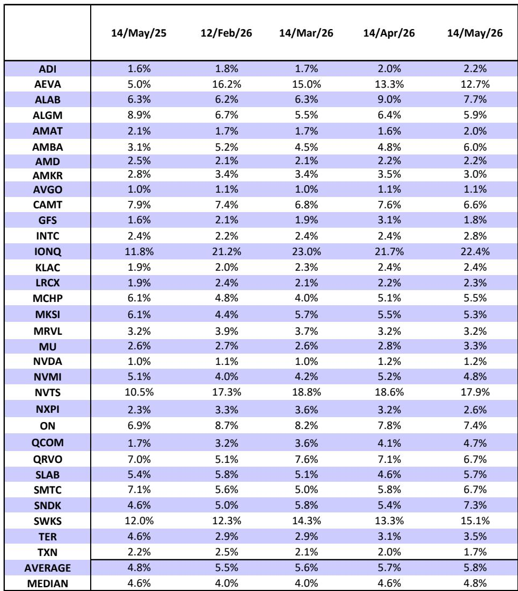
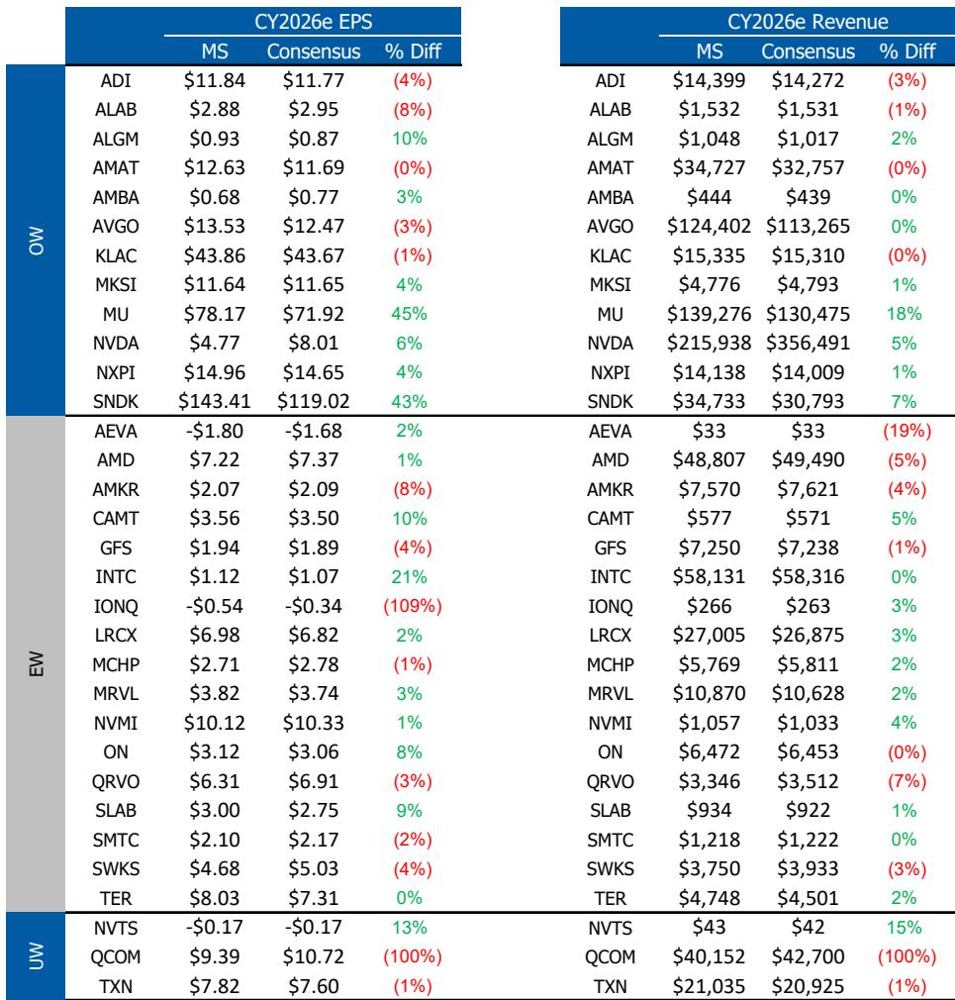
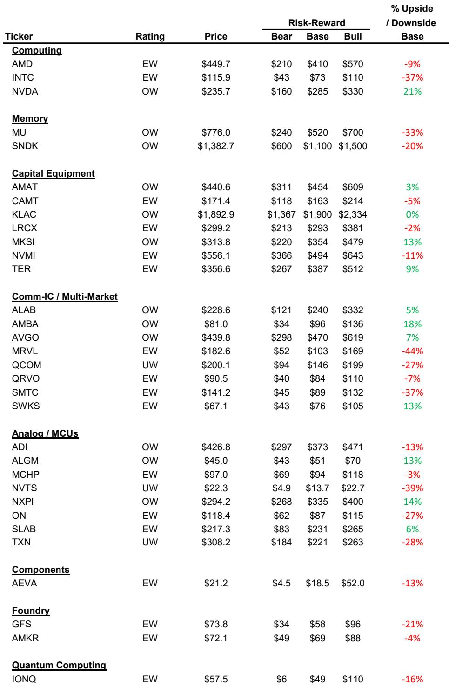

# Nvidia's Coming Earnings Will Test Whether the Market Has Priced In Too Little—or Too Much—of the AI Future

The most consequential earnings call in the semiconductor industry is approaching, and the stakes extend far beyond a single company's quarterly results. Nvidia enters its report with the weight of an entire investment thesis resting on its ability to reaffirm a vision of datacenter revenue approaching one trillion dollars over the next two years. The market, meanwhile, is effectively pricing in a future where that vision fails—where margin compression, share loss, or a slowdown in AI spending erodes nearly all long-term free cash flow growth. This disconnect between what Nvidia's management is likely to say and what the stock price already discounts creates the central tension for investors. The question is not whether Nvidia will beat expectations. It almost certainly will. The question is whether beating expectations will be enough to shift the deeply embedded skepticism about what comes after Blackwell and Rubin.

A global investment bank report now positions Nvidia as its top pick in semiconductors, raising both estimates and price target ahead of this earnings release. The logic is straightforward but worth examining carefully: the report argues that consensus estimates for datacenter revenue over the next two years are too low, that Nvidia's proactive supply commitments create a competitive moat against rising input costs, and that the market's current valuation embeds an implausibly pessimistic view of the company's long-term earnings power. But the report also acknowledges what Nvidia cannot accomplish on a single earnings call. The most important debates—market share versus custom ASICs, gross margin trajectory, and the ramp of the Vera Rubin architecture—will not be settled in one quarter. This creates an analytical challenge: how to position for an event that will likely deliver positive near-term surprises while the structural uncertainties remain unresolved.

## The Market Is Pricing Nvidia as If Its Best Years Are Already Behind It, and That Assumption Is About to Be Tested

The most striking calculation in the report is a simple present value exercise. If Nvidia's commentary about reaching one trillion dollars in cumulative Blackwell and Rubin revenue over calendar years 2025 through 2027 is credible, then earnings per share exiting 2027 should be in the range of four dollars per quarter, or a sixteen-dollar annual run rate. Discounting that perpetuity at an 8 percent cost of capital with a 1 percent terminal growth rate yields a present value of roughly $229 per share. The stock currently trades around $225. This means the market is assigning essentially no value to any earnings growth beyond what is already visible today. Investors are implicitly betting that margin compression, market share erosion, or a structural slowdown in AI capital spending will prevent Nvidia from converting its revenue trajectory into sustained free cash flow.

This is not a neutral assumption. It is an aggressive bet against the company's own narrative, and it creates a asymmetric risk-reward profile for the upcoming earnings report. If Nvidia delivers the beat-and-raise pattern that the report expects—approximately three billion dollars above consensus on the April quarter and a guide four billion dollars above for July—the immediate reaction may be positive. But the more important effect will be on the longer-term estimates. The report raises its own CY26-CY27 datacenter revenue estimate to $884 billion, well above the consensus figure of $785 billion. If Nvidia's earnings call provides visibility into that trajectory, consensus estimates will have to move higher. And if estimates move higher while the stock price remains anchored by skepticism, the rerating the report anticipates becomes more plausible.

## Nvidia's Supply Chain Strategy Creates a Structural Advantage Over Competitors That the Market Underappreciates

One of the most underdiscussed elements of the Nvidia thesis is the scale of its supply commitments. The company reported $95 billion in purchase commitments and $21 billion in inventories as of its most recent 10-K filing. The report interprets this as covering the cost of goods sold for approximately 18 months of shipments at current gross margin levels, assuming those commitments represent 75 percent gross margin COGS on roughly $464 billion in revenue. This front-footedness is not merely a logistical achievement. It is a competitive weapon.

The reason matters for the share debate. Custom ASIC competitors and merchant silicon rivals face a fundamentally different cost structure. They have not locked in supply at the same scale or on the same terms. As input costs rise—driven by powered shell availability, leading-edge wafer capacity constraints, and DRAM shortages—these competitors will face a choice: absorb the margin compression or raise prices. Nvidia, having secured its supply chain early, is better positioned to manage those headwinds. The report models Nvidia's gross margins declining to 72.7 percent by FY28, down from current levels near 75 percent. That is a meaningful compression, but it is a controlled one. Competitors without comparable supply commitments may see steeper declines or may be forced to pass costs through to customers in a way that undermines their value proposition.

This dynamic has a second-order implication that investors should consider. If Nvidia's supply chain advantage allows it to maintain pricing discipline while competitors face upward cost pressure, the market share debate may resolve itself not through direct competition but through cost structure. The companies that can deliver the best total cost of ownership at scale will win, and Nvidia's supply chain position gives it a structural advantage in that calculation.

## The Vera Rubin Ramp Will Be the Most Important Catalyst for Reshaping the Long-Term Debate, Not This Quarter's Earnings Beat

The report is clear about what this earnings call can and cannot accomplish. Nvidia can reaffirm its visibility into the one-trillion-dollar revenue trajectory. It can discuss supply constraints and how it plans to manage them. It can provide early color on new products like Groq and standalone CPUs. But it cannot definitively prove that its market share will hold against custom ASIC competition, because that debate requires time and data that do not exist yet. The most important catalyst for shifting the long-term narrative is not the April quarter results. It is the volume ramp of Vera Rubin later this year.

The report indicates that Vera Rubin is tracking to schedule, with normal startup challenges that may push some racks a few weeks beyond initial estimates but no structural disruptions. This is critical because Rubin represents the next architectural generation, and its success will determine whether Nvidia can maintain its performance leadership through the next phase of AI infrastructure buildout. If Rubin ramps smoothly and demand remains strong through the second half of the year, the market will have to reassess its assumptions about competitive displacement. If there are delays or quality issues, the skepticism will intensify.

Investors should watch the earnings call for signals about Rubin readiness, but they should also recognize that the full picture will not emerge until shipments begin in volume. This creates a timing question: do you position ahead of the earnings call based on the favorable risk-reward calculus, or do you wait for the Rubin ramp to provide confirmation? The report's answer is clear in its price target increase, but the analytical framework it provides leaves room for readers to make their own judgment.

## The Report Leaves Unanswered Questions About the Durability of AI Demand and the Shape of the Competitive Landscape Beyond 2027

No research report can resolve every uncertainty, and this one is admirably honest about what it does not know. The most significant open question is whether the current wave of AI infrastructure spending represents a structural shift in enterprise computing or a cyclical investment bubble that will eventually normalize. The report assumes continued growth through CY27, but it does not model what happens after that. If AI demand proves to be more cyclical than structural, the one-trillion-dollar revenue trajectory may represent a peak rather than a plateau.

A second unanswered question concerns the competitive dynamics beyond the current generation. The report is optimistic about Nvidia's total cost of ownership advantage, but it does not fully address the possibility that custom ASICs from hyperscale customers could erode Nvidia's market share in specific workloads over time. The report acknowledges that this debate is difficult to disprove while compute remains in short supply. But supply constraints will not last forever. When they ease, the competitive landscape may look different, and Nvidia's ability to maintain its pricing power and margin structure will face a more rigorous test.

Finally, the report raises the question of how Nvidia's new product categories—Groq and standalone CPUs—will contribute to revenue. These are early-stage initiatives with uncertain trajectories. The earnings call may provide some color, but the full picture will take years to develop. Investors who want to understand the long-term thesis will need to track these products closely, but they should not expect clarity from a single quarterly report.

## How to Frame Your Own Investment Decision Around This Earnings Event

For readers trying to translate this analysis into a decision framework, three questions should guide your thinking.

First, what is your time horizon? If you are investing with a multi-year view, the present value calculation in the report is compelling. At current prices, the market is assigning very little value to growth beyond what is already visible. If Nvidia executes on its product roadmap and maintains its competitive position, the stock offers significant upside. If you are trading around the earnings event, the calculus is different. The beat-and-raise pattern is widely expected, and the stock may already reflect some of that optimism. The upside may come from a shift in long-term estimates rather than a surprise in quarterly numbers.

Second, how do you assess the margin trajectory? The report models gross margins declining to 72.7 percent by FY28, which is below current consensus. If you believe margins will hold up better than that, the stock is even more attractive. If you believe the decline will be steeper, the valuation case weakens. The key variable is whether Nvidia's supply chain commitments provide enough buffer to manage cost inflation without sacrificing pricing power.

Third, what is your view on the competitive landscape? The report is optimistic about Nvidia's position, but it acknowledges that the share debate is unresolved. If you believe custom ASICs will capture meaningful share in the datacenter over the next three years, the bull case for Nvidia is less compelling. If you believe Nvidia's total cost of ownership advantage will sustain its dominance, the current valuation looks like an opportunity.

The earnings call will provide data points for all three questions, but it will not provide definitive answers. That is the nature of investing in a company that is simultaneously the most visible beneficiary of a technological revolution and the subject of intense debate about how long that revolution will last.

Join the community to read the full report and review the original charts.

*This article is for learning and discussion only and does not constitute investment advice.*

Personal reading notes and learning share only. Not investment advice.

