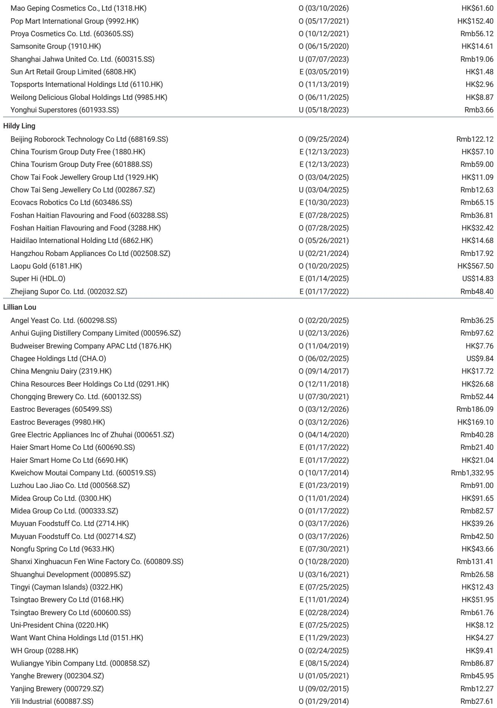
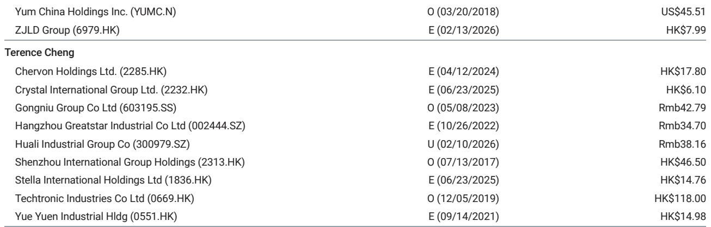
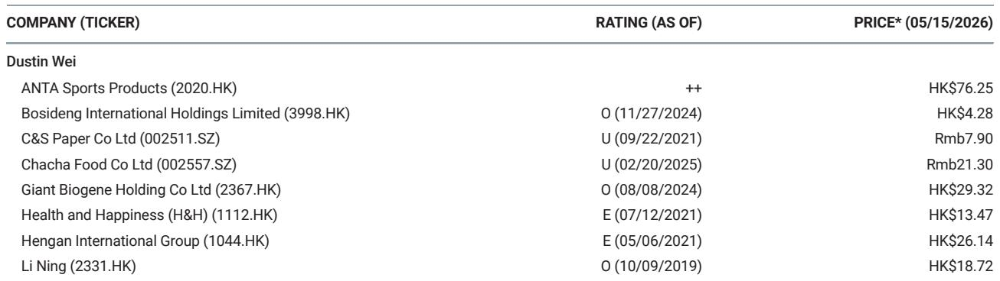

# China's Consumption Recovery Is Real but Narrow: The Winners Are Shifting from Price Wars to Structural Differentiation

The narrative of a broad Chinese consumption recovery is misleading. What recent field research across dairy, restaurants, beverages, gold jewelry, and consumer goods reveals is not a uniform rebound but a starkly bifurcated market where only a handful of categories and companies are demonstrating genuine pricing power and volume resilience. The controlling insight from this latest consumer trip is that the recovery is real, but it is narrow, and the companies best positioned are those that have already moved beyond competing on price alone. For investors, this means the days of betting on a rising tide lifting all consumer stocks are over. The new regime demands precision: identifying which subsectors have structurally improved their competitive dynamics and which companies are using operational efficiency, not discounting, to protect margins.

Why now? Because the second quarter of 2026 is proving to be a critical inflection point. Cost pressures are becoming more visible across beverages and packaged foods, while gold price volatility is reshaping demand patterns in jewelry. At the same time, leading players in dairy and quick-service restaurants are signaling that their deliberate strategies of mix improvement and cost control are beginning to pay off in relative performance. The data from April and May offers the first clean read on whether the cautious optimism of early 2026 was justified or premature. The answer, based on this trip, is cautiously affirmative, but only for a select group.

This article synthesizes the key findings from a recent research trip covering over a dozen companies across seven consumer sub-sectors. It does not merely summarize the data; it interprets the strategic patterns beneath the numbers and draws out the second-order implications for how investors should think about positioning in Chinese consumer equities. The argument is straightforward: the recovery is selective, the margin story is shifting from raw material tailwinds to operational execution, and the next leg of outperformance will belong to companies that can demonstrate market share gains without sacrificing profitability.

## Dairy Has Become the Surprising Anchor of Resilience, Driven by Structural Market Share Gains and a Recovering Raw Milk Cycle

The most striking finding from the trip is the relative strength of the dairy sector. While many consumer categories are still wrestling with sluggish demand and pricing pressure, both major dairy players reported healthy liquid milk momentum extending into April. This is not a cyclical fluke. It reflects a structural shift: smaller players are being squeezed out as raw milk prices stabilize, and the two giants are capturing that market share. Mengniu reported that its premium Milk Deluxe line delivered double-digit growth in the first quarter, with that momentum largely continuing into April. Basic milk grew at a mid- to high-single-digit pace. Yili, meanwhile, is maintaining a roughly 5% sales growth target for 2026, with UHT milk positive, infant milk formula growing at mid- to high-single digits with share gains, and adult milk powder expanding at double-digit rates.

The strategic implication here is profound. Dairy is often viewed as a commoditized, low-growth category. Yet in the current environment, it is outperforming many higher-growth, higher-expectation segments like freshly brewed beverages. The reason is twofold. First, the raw milk cycle has turned. Bulk raw milk prices have stabilized, removing a major headwind for gross margins. Second, the competitive landscape is consolidating. As smaller players struggle with cost pressures and scale disadvantages, Mengniu and Yili are gaining share without having to slash prices. This is a textbook example of how a mature industry can generate above-consensus returns when the competitive structure improves.

The so-what for investors is clear: dairy is no longer a defensive, low-beta placeholder. It is becoming a source of active alpha, provided one owns the right names. Both companies are targeting flat to slightly improving operating margins in 2026, not through price increases, but through product mix and operating efficiency. Mengniu, for instance, sees limited gross margin upside this year but is targeting flat year-on-year operating margins through efficiency gains, with capital expenditure staying below 2 billion renminbi and dividends stable or higher. This is a capital-return story as much as a growth story.

## Cost Pressure Is Shifting from a Tailwind to a Headwind for Beverages, Making Operational Differentiation the Key Margin Battleground

If dairy is the positive surprise, beverages are the emerging concern. The report notes that cost pressure will become more visible from late in the second quarter into the third quarter for the beverage category. This is a critical warning for anyone expecting a smooth margin recovery across the consumer space. The primary driver is PET resin prices. Tingyi, the instant noodle and beverage giant, expects to begin sourcing PET at market prices from June, with elevated prices persisting through the third quarter. This will compress margins precisely during the peak summer sales season.

The strategic response from leading beverage companies is revealing. Instead of competing on price to defend volume, they are shifting toward product and service differentiation. This is a meaningful change from the price wars that dominated the category in previous years. Tingyi itself is targeting only low-single-digit sales growth for 2026, with both noodles and beverages growing within that range. Tea products are expected to outperform, while water remains under pressure. The company is managing this by targeting a 100% payout ratio, effectively signaling that it sees limited reinvestment opportunities at attractive returns.

The second-order implication is that the beverage category is entering a phase where margin protection will be more important than volume growth. Companies that can pass through cost increases or offset them with mix improvement will outperform those that rely on discounting to maintain shelf space. This favors incumbents with strong brand equity and distribution networks. It also suggests that the freshly brewed beverage segment, which is still experiencing pressure from a high base and milder delivery platform subsidies, may face a more prolonged recovery than the packaged beverage players. The competition in freshly brewed is now more about product innovation than price, but that does not necessarily translate into margin expansion in the near term.

## Gold and Jewelry Demand Is Stabilizing, but the Real Story Is the Competitive Shift Toward Premiumization and Craftsmanship

The gold and jewelry segment offers a different kind of insight. Demand growth improved sequentially in May as gold prices stabilized following the volatility of the first quarter. This is encouraging, but it is not the most important finding. What matters more is the structural shift in competition. Traditional brands are targeting the high-end segment, expanding into luxury malls, and competing for skilled original equipment manufacturer craftsmen. This is a race to the top, not a race to the bottom.

Laopu Gold, which reported that its second-quarter demand momentum is still slightly below expectations, is seeing much stronger margin expansion. This divergence between volume and margin is a powerful signal. It suggests that the company is successfully executing a premiumization strategy, trading some volume growth for higher per-unit profitability. Shanghai Yuyuan Tourist Mart, meanwhile, is acting as a landlord and introducing more heritage gold brands at its retail properties, while upgrading its own brand Laomiao with higher-end product offerings and store formats. It is also closing low-end stores to focus on the high-end spectrum.

The strategic lesson here is that in a category where the underlying commodity price is volatile, the ability to differentiate through brand, craftsmanship, and retail experience becomes the primary driver of shareholder value. Companies that can convince consumers to pay a premium for design and heritage, rather than just gold weight, will be able to decouple their margins from the underlying gold price. This is a long-term competitive advantage that is difficult to replicate. For investors, the question is not whether gold demand will recover, but which brands have the pricing power to sustain margin expansion even if volume growth disappoints.

## The Report Leaves Key Questions Unanswered: How Sustainable Is the Dairy Recovery, and Can QSR Margin Improvement Be Sustained Beyond 2026?

No research trip can answer every question, and this one leaves several important gaps that should give investors pause. The first is the sustainability of the dairy recovery. Both Mengniu and Yili are targeting liquid milk to resume growth in 2026, but this depends on the assumption that raw milk prices remain stable and that smaller players continue to exit. If raw milk prices were to spike again, or if a new wave of capacity comes online, the margin tailwind could reverse. The report does not model what happens if the competitive consolidation slows or if demand softens again in the second half of the year.

The second open question is about Yum China. The report notes that quarter-to-date same-store sales growth is in line with expectations, with sequential improvement expected in the second quarter versus the first. Year-on-year margin pressure should ease from the second quarter onward, and the company expects year-on-year restaurant margin improvement in 2026. But the report also notes that delivery will continue to grow at a slower pace than in previous quarters. The question is whether the margin improvement is structural or merely a function of lapping a high cost base. If same-store sales growth does not accelerate meaningfully, the margin gains could be temporary.

Finally, the report does not fully explore the implications of the shift from price competition to product differentiation across multiple categories. Is this a genuine structural change in corporate strategy, or is it a cyclical response to weak demand? If demand recovers strongly, will companies revert to price wars? The answer has profound implications for long-term margin forecasts. Investors need to monitor whether this strategic shift is backed by actual changes in capital allocation, R&D spending, and brand investment, or whether it is simply a talking point in management meetings.

## A Decision Framework for Navigating the Selective Recovery: Focus on Market Share Momentum, Margin Trajectory, and Capital Return Discipline

For readers trying to translate these findings into a practical investment approach, three filters are essential. The first is market share momentum. In a low-growth environment, the only way to generate above-average revenue growth is to take share from competitors. The dairy companies are doing this. Laopu Gold is doing this in the premium segment. Investors should favor companies that can demonstrate share gains without resorting to price cuts.

The second filter is margin trajectory. The days of relying on raw material tailwinds are fading. The next phase of margin expansion will come from operational efficiency, product mix, and cost control. Companies that are investing in automation, supply chain optimization, and premium product development are better positioned than those that are simply cutting costs across the board. The report highlights that Mengniu is targeting flat operating margins through efficiency, not pricing power. That is a realistic and credible strategy.

The third filter is capital return discipline. In a selective recovery, not all cash flow should be reinvested. Companies that are returning capital to shareholders through dividends and buybacks, while maintaining prudent capital expenditure, are signaling confidence in their business models and offering a floor on returns. Tingyi's 100% payout ratio target and Mengniu's commitment to stable or higher dividends are examples of this discipline. Investors should be wary of companies that continue to invest heavily in capacity expansion in a market where demand growth is uncertain.

These three filters are mutually exclusive and collectively exhaustive. They cover the revenue side, the cost side, and the capital allocation side of the equation. Applying them systematically to the Chinese consumer universe will help investors separate the companies that are genuinely benefiting from structural change from those that are merely riding a temporary cyclical wave.

## The Full Report Contains the Original Charts and Detailed Company-Level Data That Support These Conclusions

The analysis above is based on a comprehensive research trip that covered over a dozen companies across seven sub-sectors. The full report includes detailed charts on same-store sales trends, margin trajectories, raw material cost forecasts, and market share dynamics that are essential for building conviction in these investment themes. It also includes specific management commentary that provides context for the strategic shifts described in this article.

Join the community to read the full report and review the original charts.

*This article is for learning and discussion only and does not constitute investment advice.*

Personal reading notes and learning share only. Not investment advice.

