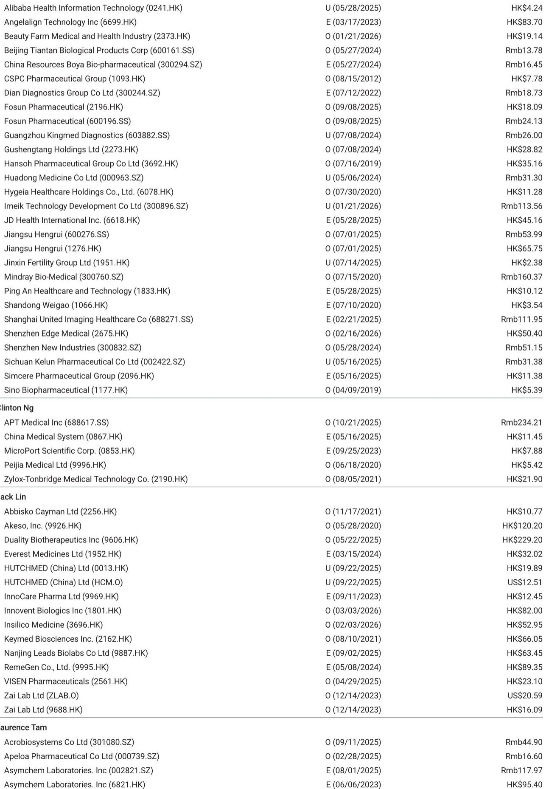
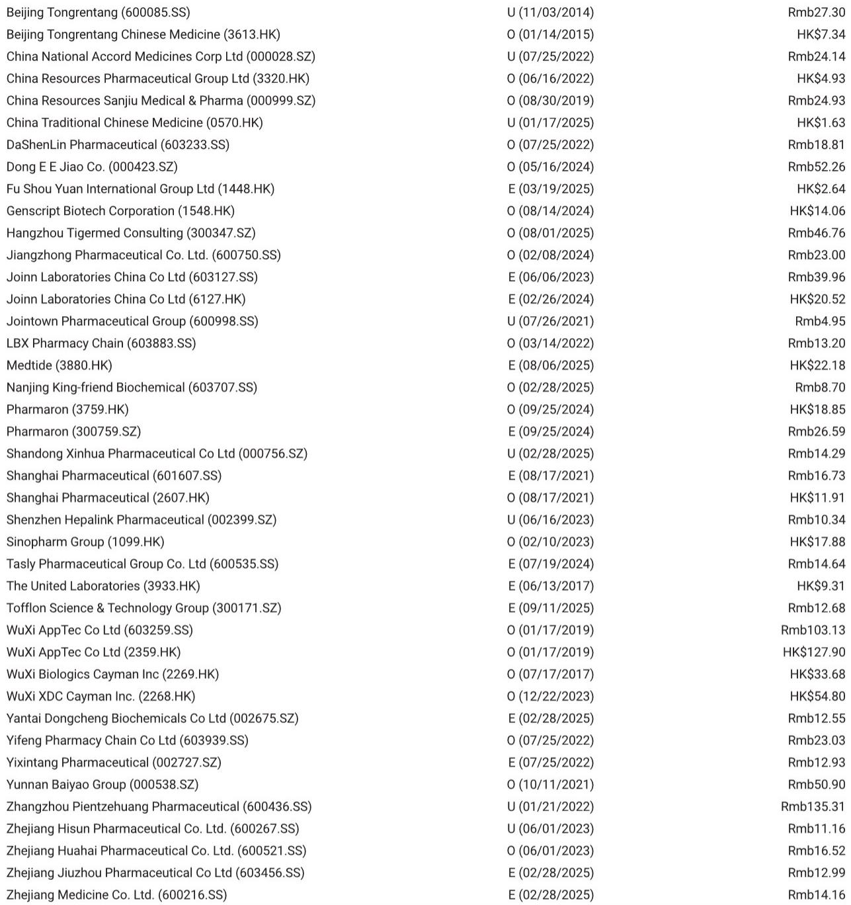
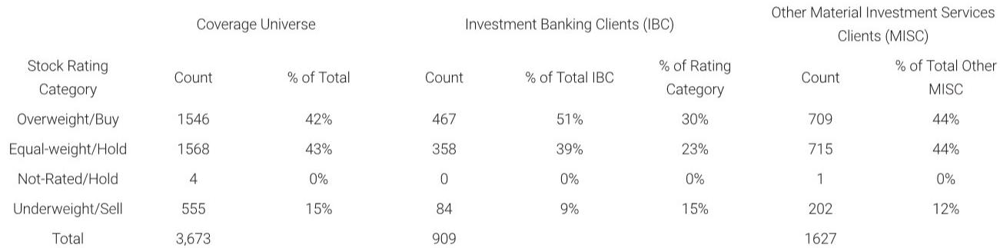

# The Next Phase of China Biopharma is Not About Cheap Copies — It’s About Platform Validation

The dominant narrative around China’s pharmaceutical sector has long been one of cost arbitrage: cheaper manufacturing, faster clinical enrollment, and regulatory shortcuts. That story is becoming obsolete. A recent trip to three leading Chinese biopharma companies — Hengrui, Hansoh, and Henlius — reveals a more consequential shift. These companies are no longer simply producing biosimilars or me-too drugs for the domestic market. They are building platform technologies that global pharma is now willing to pay for, not as a discount option, but as a strategic partner.

The controlling idea is this: China’s innovative biopharma segment has crossed a credibility threshold. The evidence is not in aggregate revenue numbers or pipeline counts. It is in the nature of the deals being struck, the regulatory milestones being achieved abroad, and the quiet confidence with which management teams discuss their next-generation assets. The implications for investors, partners, and competitors are structural, not cyclical.

Why now matters. Three forces are converging. First, the BMS deal with Hengrui — which extended beyond specific assets into platform-level co-development — signals that global biopharma now sees Chinese innovation as complementary rather than substitutive. Second, the upcoming ASCO data readouts and EU approvals for assets like Hansoh’s Ameile provide real-world validation of Chinese clinical data quality. Third, the new domestic sales rep regulations, while disruptive in the short term, are accelerating a natural selection process that favors companies with genuine clinical differentiation and compliant commercial infrastructure.

The question is no longer whether China biopharma can innovate. The question is which companies have the discipline to execute across the full value chain — from early discovery to global registration — and which will be left behind as the industry consolidates around platform winners.

## The BMS Deal Was Not an Outlier — It Is a Leading Indicator of How Global Pharma Will Engage Chinese Platforms

The most significant signal from the trip came from Hengrui’s description of its collaboration with BMS. Management framed the deal not as a one-off licensing transaction, but as a process that revealed a deeper structural shift in global pharma’s perception of Chinese R&D. Discussions expanded materially beyond the initial specific assets to broader platform technologies, and to co-development agreements for next-generation programs. This is a fundamentally different engagement model from the traditional out-licensing of a single molecule.

What matters here is not the deal value, but the deal architecture. The four out-licensed programs are generally close to IND-enabling stages, while the five earlier next-gen programs may take longer to move to the clinic. This suggests that BMS was willing to invest in platform optionality, not just near-term pipeline fill. For investors, this changes the valuation framework. A company like Hengrui should no longer be valued solely on its current product sales or near-term pipeline. Its platform capabilities — including AI-enabled drug discovery, pan-RAS inhibition, and next-generation ADC design — represent a portfolio of real options that global pharma is beginning to price in.

Hengrui also reiterated that the BMS deal will not affect its potential collaborations with other global biopharma companies. This is a critical point. If the deal were a one-off, it would be a positive but contained event. If it opens the door to multiple platform-level partnerships, it becomes a transformative structural catalyst. The fact that management emphasized sustained biopharma interest in its pipeline portfolio, partly supported by AI-enabled drug discovery, suggests that the deal is indeed a leading indicator of a broader trend.

The second-order implication is that Chinese biopharma companies with genuine platform breadth — not just a single promising asset — will increasingly be treated as strategic partners rather than vendors. This changes the competitive dynamics of the entire sector. Companies that have invested in platform technologies over the past five years are now entering a period of potential value realization. Companies that have only assembled portfolios of licensed-in assets or incremental improvements may find themselves structurally disadvantaged.

## The New Sales Rep Regulations Are a Darwinian Filter That Will Separate Durable Innovators from Transient Players

The feedback from all three companies on the new sales rep management guidelines was revealing in its nuance. The conventional market reaction has been to view these regulations as a headwind for the entire sector. The reality is more complex and more strategic.

Hengrui, which has already implemented the guidelines with internal controls in place, expects limited impact. Management even views the policy shift as a long-term positive, arguing that it will further differentiate drugs with proven clinical value and benefit established biopharma with comprehensive and compliant sales management capabilities. This is not spin. It is a logical consequence of the regulation’s design. If the rules make it harder to push marginal drugs through aggressive sales tactics, then drugs with clear clinical differentiation will naturally gain share.

Hansoh’s guidance, which reiterates double-digit growth for 2026 with stable SG&A ratios, suggests that the company’s product portfolio is resilient to the regulatory change. Its flagship products — Ameile, Xinyue, Hengmu, and Xinfu — are established brands with strong clinical evidence. They do not rely on sales rep intensity to maintain market position.

Henlius, however, acknowledged near-term disruption, particularly restrictions on hospital access in lower-tier hospitals. This is the critical nuance. The impact of the regulations is not uniform. It will be most acute for companies that rely on broad, undifferentiated sales forces to push legacy products into smaller hospitals. For companies with strong clinical data and established hospital relationships, the impact is manageable. Over time, the regulations will accelerate market share consolidation toward companies with proven products and compliant infrastructure.

The strategic implication for investors is clear. When evaluating Chinese pharma companies, the quality of the commercial organization and the compliance infrastructure should be weighted as heavily as pipeline strength. The days of using sales force size as a proxy for market access are over. The new metric is sales force quality and the ability to generate demand through clinical evidence rather than promotional activity.

## The ASCO and ADA Data Catalysts Are Not Just Event Risks — They Are Credibility Checkpoints for Global Ambitions

The upcoming ASCO abstract release on May 21, followed by late-breaking abstracts through May 29 to June 2, and the ADA Conference from June 5 to June 8, represent more than standard catalyst events. They are credibility checkpoints for the thesis that Chinese clinical data can meet global standards.

Henlius’s HLX43 (PD-L1 ADC) update in NSCLC is the most consequential data point to watch. The updated Phase 1/2 data will include separate PFS data for squamous, non-squamous, and EGFR wild-type and mutant subgroups, from a near-200 patient dataset. Safety data with longer follow-up is also key to watch, given that safety had been a debate area in prior datasets. If the data are clean and the efficacy signals are consistent across subgroups, it would significantly de-risk the global development program for HLX43, including the US Phase 2 study that has already enrolled over 40 patients.

For Hansoh, the full Phase 3 data for HS-20094 (GLP-1/GIP) is expected to follow robust topline results. Management highlighted the favorable GI tolerability profile as a key differentiator. In a competitive landscape where tolerability is becoming the primary battleground, this could be a meaningful advantage. The broader implication is that Chinese companies are now generating data that is competitive not just on cost, but on clinical quality.

The proposed ban on using China data to support US IND filings, which was flagged in the report, does not appear to be a near-term concern for most of these companies. Their global development strategies are versatile enough to accommodate the regulatory uncertainty. But it does raise a longer-term question: if the regulatory environment in the US becomes more restrictive, will Chinese companies need to accelerate their European and Asian strategies? The answer is likely yes, and the EU approval of Hansoh’s Ameile is an early sign that this pivot is feasible.

## The Biosimilar and Generic Transition Is a Cash Flow Story, Not a Growth Story — The Real Value Is in Innovation Platforms

One of the most underappreciated aspects of the trip was the clarity with which management teams discussed the transition from legacy businesses to innovation platforms. This is not a new narrative, but the specificity of the numbers provides a useful framework for valuation.

Henlius reiterated its target to reach $1 billion in overseas biosimilar revenue by 2030, primarily driven by the US and Japan markets. The economics are striking: a ~30% revenue sharing of end-market sales on a blended basis, with Henlius bearing COGS (which are fairly low) while the partner bears all sales and marketing expenses. Management expects most of this revenue to pass through directly into profit. For a company that is also advancing a deep pipeline of novel assets, the biosimilar business provides a rare combination of high-margin cash flow and strategic optionality.

Hansoh’s guidance is similarly instructive. Generic drug sales are expected to decline modestly to ~Rmb2.1-2.2 billion in 2026 before stabilizing at ~Rmb2 billion. This is a predictable, manageable decline. The real growth engine is the innovation pipeline, where the company expects at least one more new BD deal in 2026 and key product launches like GLP-1/GIP and B7H3 ADC from 2027 onward.

The framework for investors should be to separate the cash flow story from the growth story. The biosimilar and generic businesses provide visibility and capital. The innovation platforms provide optionality and upside. Companies that manage this transition well — maintaining cash flow discipline while investing aggressively in R&D — will be rewarded with a valuation multiple that reflects both stability and growth.

## What the Report Does Not Fully Answer: The Sustainability of Global BD Interest and the Limits of Platform Optionality

The report provides rich detail on current BD discussions and pipeline progress, but it leaves several meaningful open questions. The most important is whether the current wave of global pharma interest in Chinese platforms is sustainable or cyclical. The BMS deal with Hengrui is a powerful data point, but it is one data point. If the next six months produce two or three more platform-level deals of similar magnitude, the thesis is confirmed. If not, the market may need to recalibrate expectations.

A second open question is the timing and magnitude of revenue contribution from next-generation assets. Hansoh’s GLP-1/GIP and B7H3 ADC are not expected to launch until 2027. Hengrui’s pan-RAS inhibitors are still in early clinical stages. The valuation of these platforms depends on assumptions about clinical success rates, competitive dynamics, and pricing that are inherently uncertain. The report provides a solid foundation for analysis, but the range of outcomes remains wide.

A third question is the impact of biosimilar VBP in China. The Anhui-led biosimilar VBP timeline remains unclear, with industry estimates suggesting 2027 implementation is more likely. If VBP compresses biosimilar margins faster than expected, it could reduce the cash flow that companies like Henlius are using to fund innovation. The report flags this risk but does not resolve it.

These open questions are not weaknesses in the analysis. They are the natural boundaries of any forward-looking research. The value of the report is that it provides a structured framework for monitoring these uncertainties as they resolve.

## A Decision Framework for Investors: Three Questions to Ask About Every China Biopharma Investment

Based on the insights from this trip, a practical decision framework emerges. Investors evaluating Chinese biopharma companies should ask three questions.

First, does the company have a genuine platform technology that global pharma would want to partner on, or is it a single-asset story? The BMS deal with Hengrui and the GSK partnership with Hansoh demonstrate that platform breadth is now a prerequisite for serious global engagement. Companies without platform depth will find it increasingly difficult to attract high-value partnerships.

Second, is the company’s commercial infrastructure resilient to regulatory tightening? The new sales rep regulations will create winners and losers. Companies with established compliance systems, strong clinical evidence, and deep hospital relationships will gain share. Companies that have relied on sales force size and promotional intensity will struggle.

Third, does the company have a clear path to cash flow sustainability that supports its R&D investment? The transition from legacy businesses to innovation platforms requires capital. Companies that manage this transition well will have a structural advantage. Companies that burn cash without a clear path to profitability will face increasing scrutiny.

The answers to these questions will determine which companies emerge as long-term winners and which remain structurally challenged. The report provides the raw material for this analysis. The judgment is up to the individual investor.

## Join the Community to Read the Full Report and Review the Original Charts

The analysis above is based on a detailed trip report covering three leading Chinese biopharma companies. The full report includes granular pipeline updates, financial projections, and management commentary that could not be fully captured here. It also includes the original charts and data visualizations that support the key arguments. For investors who want to go deeper into the specific assets, deal structures, and competitive dynamics, the full report is essential reading. Join the community to access the complete analysis and stay ahead of the next wave of China biopharma innovation.

*This article is for learning and discussion only and does not constitute investment advice.*

Personal reading notes and learning share only. Not investment advice.

