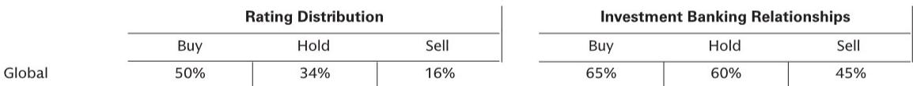
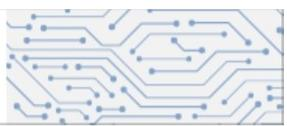

# 边缘AI芯片的真正拐点，不是算力竞赛，而是推理效率的重新定价

当市场还在为AI大模型的参数规模和训练算力争论不休时，一个更根本的结构性变化正在边缘侧悄然发生。某外资投行最新发布的研报，通过一场与国内AI推理SoC龙头公司董事长的深度对话，揭示了一个被多数投资者低估的趋势：边缘AI芯片的竞争焦点，正在从“谁能跑更大的模型”转向“谁能以最低功耗和最低延迟完成推理”。

这份研报的核心判断并非关于某家公司的短期业绩，而是关于整个AI芯片生态系统的底层逻辑变化。当大模型从云端走向终端，从训练走向推理，从通用走向场景化，芯片的评判标准正在被重新定义。这不是一个渐进式的产品迭代，而是一个可能重塑产业链价值分配的结构性拐点。

## 1. 市场真正低估的不是需求规模，而是推理效率对芯片架构的倒逼

大多数投资者关注AI芯片时，习惯于用“算力”这个单一维度来衡量竞争力。但这份研报揭示了一个更微妙的现实：在边缘AI和智能驾驶场景中，算力过剩而效率不足的问题正在成为新的瓶颈。

这家公司的核心产品——基于自研混合精度NPU的AI推理SoC，其设计哲学与英伟达等通用GPU路线有本质区别。通用GPU追求的是“什么都能算”，而边缘推理芯片追求的是“特定任务算得最快、最省电”。这种差异在数据中心场景中或许不明显，但在智能汽车和边缘设备中，直接决定了产品能否量产、能否被客户接受。

研报中提到，该公司通过自研的Axera Neutron混合精度NPU，突破了数据和内存瓶颈，采用了更简洁的数据表示方式，降低了权重和特征值的冗余。翻译成行业语言就是：在L2+智能驾驶和边缘AI推理中，芯片不需要用32位浮点数去计算每一次推理，用8位甚至更低的精度就能完成任务，同时功耗降低数倍。

这就是“推理效率”的重新定价——它不是简单的算力堆叠，而是算力与功耗、延迟、成本之间的最优解。对于汽车OEM和Tier-1客户来说，这意味着更低的散热要求、更长的电池续航和更低的BOM成本。这个价值维度，在当前市场对AI芯片的估值框架中，几乎没有被充分定价。

## 2. L2+智能驾驶的渗透率曲线，正在成为AI推理SoC最大的需求引擎

研报中一个关键信息是，该公司对L2+智能驾驶渗透率上升持乐观态度。这背后不是简单的乐观预期，而是一个可量化的产业逻辑：当智能驾驶从L2向L2+演进，单车所需的AI推理算力将从个位数TOPS跃升至数十TOPS，同时必须满足车规级的功耗、成本和可靠性要求。

该公司已经量产的M55H和M76H SoC，分别对应高速NOA和城市ICA场景。这两个场景恰好是当前中国智能驾驶市场最活跃的落地领域。与L4级自动驾驶的“万里挑一”不同，L2+的渗透率提升是“千家万户”级别的确定性需求。每多一辆搭载L2+功能的量产车，就意味着多一颗甚至多颗AI推理SoC的出货。

更值得注意的是，该公司下一代M97 SoC已于2025年10月完成流片，2026年2月成功回片。这个时间节点非常关键——它意味着在2026年下半年到2027年，中国智能驾驶芯片市场将迎来一轮密集的产品迭代和客户导入周期。对于投资者而言，需要关注的不是某一家公司的流片进度，而是整个供应链的产能分配和客户争夺格局。

## 3. 边缘AI的“Agent化”趋势，正在开启一个比智能驾驶更大的市场

如果说智能驾驶是AI推理SoC的第一个确定性增长极，那么边缘AI的Agent化可能是第二个，而且规模可能更大。

研报特别提到，该公司管理层对工业Agent和AI个人Agent带来的边缘计算机会持积极态度。这个判断与当前AI行业的一个核心趋势高度吻合：AI应用正在从“问答式交互”转向“自主执行式Agent”。无论是工厂里的自动化检测设备，还是个人终端上的智能助手，都需要在本地完成实时推理，而不是每次都把数据上传到云端。

这个趋势对芯片架构的影响是深远的。云端推理可以容忍数毫秒的延迟和数十瓦的功耗，但边缘Agent必须在毫秒级完成推理，且功耗通常限制在几瓦甚至更低。这就回到了第一点讨论的“推理效率”问题——只有那些在架构层面为边缘场景优化的芯片，才能真正抓住这轮Agent化浪潮。

该公司正在开发的下一代边缘LLM AI推理芯片，具备更高的工作频率和更高的算力。这暗示着边缘AI芯片的竞争正在从“能跑小模型”升级到“能跑大模型但功耗不变”。如果这个目标能够实现，那么边缘AI芯片的市场天花板将被大幅抬升。

## 4. 自研NPU是护城河，但护城河的深度仍需验证

该公司最核心的技术资产是自研的Axera Neutron混合精度NPU。在AI芯片领域，自研NPU意味着公司可以针对特定场景进行硬件级别的优化，而不是像通用SoC厂商那样依赖第三方IP。这种垂直整合能力，理论上可以带来更好的性能功耗比和更灵活的客户定制空间。

但这里有一个报告尚未完全回答的关键问题：自研NPU的护城河到底有多深？具体来说，需要验证三个维度：第一，这家公司的NPU架构是否具备足够的可扩展性，能否覆盖从智能驾驶到边缘AI的多个场景而不需要大幅重设计；第二，其软件工具链的成熟度能否降低客户的应用迁移成本；第三，当竞争对手也开始推出类似架构的混合精度NPU时，这家公司的先发优势能否转化为持续的客户粘性。

研报没有深入讨论这些细节，而这些恰恰是判断公司长期竞争力的核心。对于投资者而言，目前看到的更多是产品层面的进展，而非生态层面的壁垒。在AI芯片这个领域，产品可以被追赶，但生态一旦建立就很难被颠覆。这家公司目前还在“产品验证”阶段，距离“生态锁定”还有相当距离。

## 5. 一个尚未被充分讨论的风险：客户集中度与产品迭代节奏的错配

从研报披露的信息来看，该公司目前的主要客户集中在智能汽车OEM和Tier-1厂商。这既是优势也是风险。优势在于智能驾驶是当前增长最确定的场景，风险在于汽车客户的导入周期长、验证流程复杂，且一旦选定供应商后更换成本高。

这里存在一个隐含的节奏错配风险：公司的产品迭代速度（从M55H到M76H再到M97）可能快于客户的车型迭代周期。如果客户在某一代产品上完成定点，但下一代产品推出时客户还没有新的车型需求，公司就可能面临“有产品无市场”的阶段性困境。这种节奏错配在半导体行业并不罕见，但对于一家处于成长期的公司来说，可能会放大业绩的波动性。

此外，研报中提到的边缘AI产品线（8830和8850系列）目前披露的信息较少，其客户结构和商业化进度仍是一个盲区。如果边缘AI业务的客户集中度同样偏高，那么公司的整体风险敞口将被进一步放大。

## 6. 投资者需要建立一个新的观察框架：从“算力竞赛”转向“效率定价”

基于以上分析，对于关注AI芯片赛道的投资者而言，传统的“算力对比”框架已经不够用了。更有效的观察框架应该包含以下四个维度：

第一，推理效率的量化指标。不能只看TOPS，还要看每瓦TOPS、每美元TOPS、以及端到端推理延迟。这些指标直接决定了芯片在真实场景中的竞争力。

第二，客户结构的健康度。需要跟踪公司客户数量是否在增长、客户集中度是否在下降、以及新客户导入的节奏是否与产品迭代匹配。

第三，软件生态的成熟度。自研NPU的价值最终取决于软件工具链是否好用，开发者是否愿意基于这个平台做应用开发。这是一个需要时间积累的慢变量。

第四，产品线的场景覆盖广度。从智能驾驶到边缘AI，从工业到消费电子，覆盖场景越广，公司的抗周期能力越强。当前这家公司在这方面的进展值得持续观察。

---

这份研报提供了一个难得的窗口，让我们看到一家正在快速成长的中国AI推理SoC公司如何回应产业变革。但正如报告所暗示的，很多关键问题——护城河的深度、客户结构的稳定性、边缘AI的商业化节奏——都还需要更多数据来验证。

如果你对上述讨论中提到的“推理效率定价”框架、L2+渗透率对芯片需求的量化测算、或者边缘AI Agent化的具体落地节奏感兴趣，欢迎来我们的星球微信群里继续讨论。我们会定期分享对这类产业链深度研报的拆解，以及那些在公开报告中看不到的二阶推演。

Personal reading notes and learning share only. Not investment advice.

