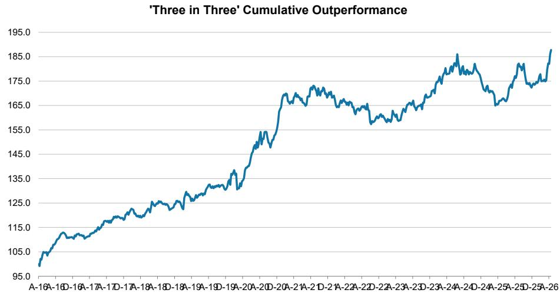
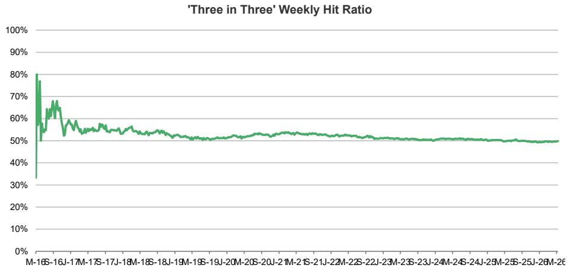
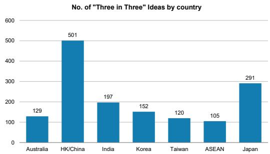
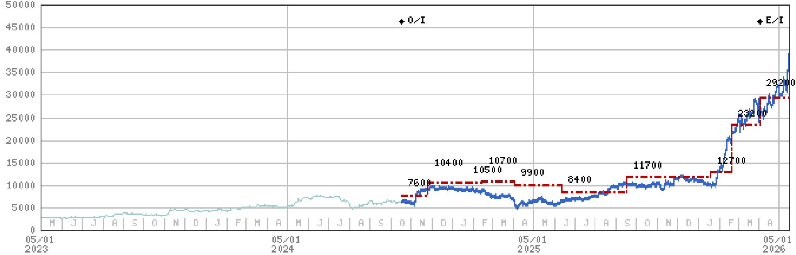

# Asia | Asia Pacific

# Three Actionable Ideas

BHP Group – OW | Jardine Matheson – OW | Asia Vital Components – OW

OW – BHP Group (BHP.AX): Rising data centre build gives BHP good beta exposure, given future growth. Yet we also see alpha opportunities in iron ore, copper and further asset crystallisation beyond current guidance. Together, these could lift valuation and returns vs. consensus.

OW – Jardine Matheson (JARD.SI): We initiate coverage of JMH with an Overweight rating and PT of US\$90. A new CEO, Hongkong Land's successful transformation template and potential asset recycling could drive a further re-rating. Stub value at negative US\$6/share remains compelling.

OW – Asia Vital Components (3017.TW): AVC's dedication in offering thermal and mechanical solutions should allow it to capture rising liquid cooling adoption across various hyperscaler customers as well as extended design in peripheral components and affiliated rack SKUs. Stay OW.

# Links to reports:

BHP Group Ltd: Rising data centre build favours BHP's commodity mix – but there's plenty of alpha too (13 May 2026)

Jardine Matheson Holdings Limited: Unlocking Value from a Diversified Asian Portfolio (14 May 2026)

Asia Vital Components Co. Ltd.: 1Q Operating Profit – 3% Beat; 2026 Growth Outlook Intact (14 May 2026)

Exhibit 1: Performance summary 

<table><tr><td>As of May 12</td><td>Absolute</td><td>Relative*</td></tr><tr><td>No. of ideas</td><td colspan="2">1494</td></tr><tr><td>Cumulative Outperformance (bps)</td><td colspan="2">8,777</td></tr><tr><td>Avg holding period total return</td><td>4.1%</td><td>1.8%</td></tr><tr><td>Avg 12M total return**</td><td>9.6%</td><td>5.2%</td></tr><tr><td>No. of positive returns</td><td>808</td><td>745</td></tr><tr><td>Hit ratio</td><td>54%</td><td>50%</td></tr></table>

Source: MS, DataStream Refinitiv, Bloomberg. Performance data as at May 12, 2026. Cumulative outperformance: against local benchmarks. Holding period total return measures performance when idea was effective. \*\*Avg. 12M total return measures performance of all ideas (closed and active) from May 12, 2025, to May 12, 2026, and does not adjust for buy/sell direction. \* Relative performance = idea outperformance against local benchmarks. Hit ratio = number of ideas with positive returns as percentage of the total number of ideas. Performance calculation does not consider transaction costs or other costs. Figures are not audited. Past performance is not a guarantee of future results.

MS ASIA LIMITED+

# Samuel Lee, CFA

Equity Strategist

Samuel.Sw.Lee@morganstanley.com +852 2239-1862

# Hozefa Topiwalla

Equity Strategist

Hozefa.Topiwalla@morganstanley.com +852 2848-6595

text_image

Three in Three - Asia
Click Here For Collection >

Latest closing prices as of May 15, 2026: BHP Group (BHP.AX): A\$60.46; Jardine Matheson (JARD.SI): US\$73.22; Asia Vital Components (3017.TW): NT\$2,455.00.

MS does and seeks to do business with companies covered in MS. As a result, investors should be aware that the firm may have a conflict of interest that could affect the objectivity of MS. Investors should consider MS as only a single factor in making their investment decision.

# For analyst certification and other important disclosures, refer to the Disclosure Section, located at the end of this report.

+= Analysts employed by non-U.S. affiliates are not registered with FINRA, may not be associated persons of the member and may not be subject to FINRA restrictions on communications with a subject company, public appearances and trading securities held by a research analyst account.

# Three Actionable Ideas

Exhibit 2: Cumulative outperformance   

line

| Date     | Value |
| -------- | ----- |
| A-16A    | 95.0  |
| A-16D    | 105.0 |
| A-16E    | 110.0 |
| A-17A    | 115.0 |
| A-17D    | 120.0 |
| A-17A    | 125.0 |
| A-18A    | 130.0 |
| A-18D    | 135.0 |
| A-19A    | 140.0 |
| A-19D    | 145.0 |
| A-20A    | 150.0 |
| A-20D    | 155.0 |
| A-21A    | 160.0 |
| A-21D    | 165.0 |
| A-22A    | 170.0 |
| A-22D    | 175.0 |
| A-23A    | 180.0 |
| A-23D    | 185.0 |
| A-24A    | 190.0 |
| A-24D    | 185.0 |
| A-25A    | 180.0 |
| A-25D    | 175.0 |
| A-26A    | 185.0 |

Source: MS, Datastream, Refinitiv, Bloomberg. The performance calculation does not consider transaction costs or other costs. These figures are not audited. Past performance is not a guarantee of future results.

Exhibit 3: Weekly hit ratio   

line

| Date       | Weekly Hit Ratio |
| ---------- | ---------------- |
| M-16       | 80%              |
| S-16       | 70%              |
| J-17       | 65%              |
| M-17       | 60%              |
| S-17       | 55%              |
| J-18       | 50%              |
| M-18       | 50%              |
| S-18       | 50%              |
| J-19       | 50%              |
| M-19       | 50%              |
| S-19       | 50%              |
| J-20       | 50%              |
| M-20       | 50%              |
| S-20       | 50%              |
| J-21       | 50%              |
| M-21       | 50%              |
| S-21       | 50%              |
| J-22       | 50%              |
| M-22       | 50%              |
| S-22       | 50%              |
| J-23       | 50%              |
| M-23       | 50%              |
| S-23       | 50%              |
| J-24       | 50%              |
| M-24       | 50%              |
| S-24       | 50%              |
| J-25       | 50%              |
| M-25       | 50%              |
| S-25       | 50%              |
| J-26       | 50%              |
| M-26       | 50%              |

Source: MS, Datastream, Refinitiv, Bloomberg. The performance calculation does not consider transaction costs or other costs. These figures are not audited. Past performance is not a guarantee of future results. The hit ratio as of any particular Tuesday does not account for ideas started on the same day for which holding period was 0 days.

Three Actionable Ideas are not and should not be considered a portfolio: Each investment idea is chosen based on its own merit and without any consideration of the other investment ideas chosen. Specifically, there has been no effort to mitigate the risks of investing in any collective group of "Three Actionable Ideas". Concepts important to a balanced portfolio, such as negative correlation and diversification, have not been considered. Treating "Three Actionable Ideas" ideas as a portfolio will subject you to the risk of losing all or a substantial portion of your investments.

The information contained herein has been prepared solely for informational purposes and is not a solicitation of any offer to buy or sell any security or other financial instrument or to participate in any trading strategy. Products and trades of this type may not be appropriate for every investor. Please consult with your legal and tax advisors before making any investment decision. Please contact your MS sales representative for more details.

Exhibit 4: Three Actionable Ideas – Still in effect 

<table><tr><td>No.</td><td>Ticker</td><td>Direction</td><td>Stock Rating*</td><td>Start</td><td>End</td><td>Idea</td><td>Last px**</td><td>Benchmark Index</td><td>Abs perf</td><td>Rel perf</td></tr><tr><td>1</td><td>7011.T</td><td>Buy</td><td>OW</td><td>12-May-26</td><td>11-Aug-26</td><td>Mitsubishi Heavy Industries</td><td>4300</td><td>Topix</td><td>0.0%</td><td>0.0%</td></tr><tr><td>2</td><td>402340.KS</td><td>Buy</td><td>OW</td><td>12-May-26</td><td>11-Aug-26</td><td>SK Square Co Ltd.</td><td>1126000</td><td>Korea Se Composite (Kospi)</td><td>0.0%</td><td>0.0%</td></tr><tr><td>3</td><td>6669.TW</td><td>Buy</td><td>OW</td><td>12-May-26</td><td>11-Aug-26</td><td>Wiwynn Corp</td><td>5790</td><td>Taiwan Se Weighed Taiex</td><td>0.0%</td><td>0.0%</td></tr><tr><td>4</td><td>688008.SS</td><td>Buy</td><td>OW</td><td>5-May-26</td><td>4-Aug-26</td><td>Montage Technology Co Ltd</td><td>240.7</td><td>Shanghai Se Composite</td><td>38.9%</td><td>36.4%</td></tr><tr><td>5</td><td>AXBK.NS</td><td>Buy</td><td>OW</td><td>5-May-26</td><td>4-Aug-26</td><td>Axis Bank</td><td>1260.1</td><td>Bse Sensex</td><td>0.0%</td><td>3.2%</td></tr><tr><td>6</td><td>006400.KS</td><td>Buy</td><td>OW</td><td>5-May-26</td><td>4-Aug-26</td><td>Samsung SDI</td><td>629000</td><td>Korea Se Composite (Kospi)</td><td>-10.8%</td><td>-21.0%</td></tr><tr><td>7</td><td>6674.T</td><td>Buy</td><td>OW</td><td>28-Apr-26</td><td>28-Jul-26</td><td>GS Yuasa Corporation</td><td>6710</td><td>Topix</td><td>8.9%</td><td>6.2%</td></tr><tr><td>8</td><td>0100.HK</td><td>Buy</td><td>OW</td><td>28-Apr-26</td><td>28-Jul-26</td><td>MiniMax</td><td>690.5</td><td>Hang Seng China Enterprises</td><td>-4.6%</td><td>-7.5%</td></tr><tr><td>9</td><td>603986.SS</td><td>Buy</td><td>OW</td><td>28-Apr-26</td><td>28-Jul-26</td><td>GigaDevice Semiconductor Beijing Inc</td><td>353.55</td><td>Shanghai Se Composite</td><td>15.0%</td><td>11.6%</td></tr><tr><td>10</td><td>2318.HK</td><td>Buy</td><td>OW</td><td>21-Apr-26</td><td>21-Jul-26</td><td>Ping An Insurance Group Co of China Ltd</td><td>65</td><td>Hang Seng China Enterprises</td><td>5.8%</td><td>6.3%</td></tr><tr><td>11</td><td>4901.T</td><td>Buy</td><td>OW</td><td>21-Apr-26</td><td>21-Jul-26</td><td>FUJIFILM Holdings</td><td>3300</td><td>Topix</td><td>6.3%</td><td>3.6%</td></tr><tr><td>12</td><td>BILI.O</td><td>Buy</td><td>OW</td><td>21-Apr-26</td><td>21-Jul-26</td><td>Bilibili Inc</td><td>21.42</td><td>Hang Seng China Enterprises</td><td>-8.3%</td><td>-7.8%</td></tr><tr><td>13</td><td>3659.T</td><td>Buy</td><td>OW</td><td>14-Apr-26</td><td>14-Jul-26</td><td>Nexon</td><td>2566.5</td><td>Topix</td><td>-3.4%</td><td>-6.5%</td></tr><tr><td>14</td><td>1211.HK</td><td>Buy</td><td>OW</td><td>14-Apr-26</td><td>14-Jul-26</td><td>BYD Company Limited</td><td>99.85</td><td>Hang Seng China Enterprises</td><td>-8.7%</td><td>-11.4%</td></tr><tr><td>15</td><td>3690.HK</td><td>Buy</td><td>OW</td><td>14-Apr-26</td><td>14-Jul-26</td><td>Meituan</td><td>84.15</td><td>Hang Seng China Enterprises</td><td>-1.1%</td><td>-3.7%</td></tr><tr><td>16</td><td>2338.HK</td><td>Buy</td><td>OW</td><td>7-Apr-26</td><td>7-Jul-26</td><td>WeiChai Power</td><td>39.62</td><td>Hang Seng China Enterprises</td><td>36.2%</td><td>30.9%</td></tr><tr><td>17</td><td>009150.KS</td><td>Buy</td><td>OW</td><td>7-Apr-26</td><td>7-Jul-26</td><td>Samsung Electro-Mechanics</td><td>958000</td><td>Korea Se Composite (Kospi)</td><td>109.6%</td><td>70.5%</td></tr><tr><td>18</td><td>8593.T</td><td>Buy</td><td>OW</td><td>7-Apr-26</td><td>7-Jul-26</td><td>Mitsubishi HC Capital</td><td>1440</td><td>Topix</td><td>-2.9%</td><td>-8.9%</td></tr><tr><td>19</td><td>GMG.AX</td><td>Buy</td><td>OW</td><td>31-Mar-26</td><td>30-Jun-26</td><td>Goodman Group</td><td>30.87</td><td>S&amp;P/Asx All Australian 200</td><td>21.0%</td><td>18.4%</td></tr><tr><td>20</td><td>QBE.AX</td><td>Buy</td><td>OW</td><td>31-Mar-26</td><td>30-Jun-26</td><td>QBE Insurance Group</td><td>22.25</td><td>S&amp;P/Asx All Australian 200</td><td>5.4%</td><td>2.8%</td></tr><tr><td>21</td><td>PTTGC.BK</td><td>Buy</td><td>OW</td><td>31-Mar-26</td><td>30-Jun-26</td><td>PTT Global Chemicals</td><td>39.25</td><td>Bangkok S.E.T.</td><td>7.5%</td><td>3.7%</td></tr><tr><td>22</td><td>300750.SZ</td><td>Buy</td><td>OW</td><td>24-Mar-26</td><td>23-Jun-26</td><td>Contemporary Amperex Technology Co. Ltd.</td><td>431.25</td><td>Shanghai Se Composite</td><td>10.4%</td><td>1.8%</td></tr><tr><td>23</td><td>6762.T</td><td>Buy</td><td>OW</td><td>24-Mar-26</td><td>23-Jun-26</td><td>TDK</td><td>2961</td><td>Topix</td><td>46.8%</td><td>36.9%</td></tr><tr><td>24</td><td>028260.KS</td><td>Buy</td><td>OW</td><td>24-Mar-26</td><td>23-Jun-26</td><td>Samsung C&amp;T</td><td>435000</td><td>Korea Se Composite (Kospi)</td><td>54.5%</td><td>16.4%</td></tr><tr><td>25</td><td>BABA.N</td><td>Buy</td><td>OW</td><td>17-Mar-26</td><td>16-Jun-26</td><td>Alibaba Group Holding</td><td>134.78</td><td>Hang Seng China Enterprises</td><td>-1.3%</td><td>-2.2%</td></tr><tr><td>26</td><td>4005.T</td><td>Buy</td><td>OW</td><td>17-Mar-26</td><td>16-Jun-26</td><td>Sumitomo Chemical</td><td>523.4</td><td>Topix</td><td>9.6%</td><td>1.8%</td></tr><tr><td>27</td><td>2345.TW</td><td>Buy</td><td>OW</td><td>17-Mar-26</td><td>16-Jun-26</td><td>Accton Technology Corporation</td><td>2525</td><td>Taiwan Se Weighed Taiex</td><td>73.5%</td><td>49.6%</td></tr><tr><td>28</td><td>4004.T</td><td>Buy</td><td>OW</td><td>10-Mar-26</td><td>9-Jun-26</td><td>Resonac Holdings</td><td>17815</td><td>Topix</td><td>65.0%</td><td>58.2%</td></tr><tr><td>29</td><td>055550.KS</td><td>Buy</td><td>OW</td><td>10-Mar-26</td><td>9-Jun-26</td><td>Shinhan Financial Group</td><td>96700</td><td>Korea Se Composite (Kospi)</td><td>9.2%</td><td>-29.6%</td></tr><tr><td>30</td><td>6981.T</td><td>Buy</td><td>OW</td><td>10-Mar-26</td><td>9-Jun-26</td><td>Murata Manufacturing</td><td>6078</td><td>Topix</td><td>67.2%</td><td>60.4%</td></tr><tr><td>31</td><td>300502.SZ</td><td>Buy</td><td>OW</td><td>3-Mar-26</td><td>2-Jun-26</td><td>Eoptolink Technology Inc Ltd</td><td>592.52</td><td>Shanghai Se Composite</td><td>55.0%</td><td>52.8%</td></tr><tr><td>32</td><td>6758.T</td><td>Buy</td><td>OW</td><td>3-Mar-26</td><td>2-Jun-26</td><td>Sony Group</td><td>3484</td><td>Topix</td><td>3.8%</td><td>0.2%</td></tr><tr><td>33</td><td>2360.TW</td><td>Buy</td><td>OW</td><td>3-Mar-26</td><td>2-Jun-26</td><td>Chroma Ate Inc.</td><td>2440</td><td>Taiwan Se Weighed Taiex</td><td>74.9%</td><td>52.6%</td></tr><tr><td>34</td><td>TLS.AX</td><td>Buy</td><td>OW</td><td>24-Feb-26</td><td>26-May-26</td><td>Telstra Corporation</td><td>5.26</td><td>S&amp;P/Asx All Australian 200</td><td>1.0%</td><td>3.5%</td></tr><tr><td>35</td><td>7550.T</td><td>Buy</td><td>OW</td><td>24-Feb-26</td><td>26-May-26</td><td>Zensho Holdings</td><td>8989</td><td>Topix</td><td>-8.7%</td><td>-11.2%</td></tr><tr><td>36</td><td>090430.KS</td><td>Buy</td><td>OW</td><td>17-Feb-26</td><td>19-May-26</td><td>Amorepacific</td><td>123200</td><td>Korea Se Composite (Kospi)</td><td>-22.8%</td><td>-62.5%</td></tr><tr><td>37</td><td>0753.HK</td><td>Buy</td><td>OW</td><td>17-Feb-26</td><td>19-May-26</td><td>Air China Limited</td><td>5.08</td><td>Hang Seng China Enterprises</td><td>-29.3%</td><td>-27.6%</td></tr><tr><td>38</td><td>KPLM.SI</td><td>Buy</td><td>OW</td><td>17-Feb-26</td><td>19-May-26</td><td>Keppel Ltd</td><td>10.78</td><td>Straits Times Index L</td><td>-13.8%</td><td>-16.0%</td></tr></table>

Source: MS, Datastream, Refinitiv, Bloomberg.   
Note: Performance data as at last price date May 12, 2026. \*Stock ratings refer to that when the idea was introduced unless the coverage is dropped or rating is removed from consideration because under MS policy and/or applicable regulations. NC - Currently not covered by MS. 12M performance refers to average total return of the ideas from May 12, 2025 to May 12, 2026, and does not adjust for buy/sell direction. These figures are not audited. Past performance is no guarantee of future results. Results shown exclude brokerage commissions and transaction costs. Certain historical Three Actionable Ideas have been removed because under MS policy and/or applicable regulations, MS may be precluded from issuing such information with respect to this company at this time. ++ = Stock Rating, Price Target or Estimates are not available or have been removed due to applicable law and/or MS policy. Please note that all important disclosures including personal holding disclosures and MS disclosures for stocks under coverage appear on the MS public website at www.morganstanley.com/researchdisclosures. For non-covered (NC) stocks please refer to Important US Regulatory Disclosures on Subject Companies and Other Important Disclosures located at the back of this report. Please refer to this section for more details.

Exhibit 5: Three Actionable Ideas – Closed in last 13 weeks 

<table><tr><td>No.</td><td>Ticker</td><td>Direction</td><td>Stock Rating*</td><td>Start</td><td>End</td><td>Idea</td><td>Last px**</td><td>Benchmark Index</td><td>Abs perf</td><td>Rel perf</td></tr><tr><td>39</td><td>STEG.SI</td><td>Buy</td><td>OW</td><td>10-Feb-26</td><td>12-May-26</td><td>ST Engineering</td><td>10.64</td><td>Straits Times Index L</td><td>6.1%</td><td>4.4%</td></tr><tr><td>40</td><td>FUTU.O</td><td>Buy</td><td>OW</td><td>10-Feb-26</td><td>12-May-26</td><td>Futu Holdings Ltd</td><td>137.03</td><td>Hang Seng China Enterprises</td><td>-12.1%</td><td>-8.5%</td></tr><tr><td>41</td><td>PREG.NS</td><td>Buy</td><td>OW</td><td>10-Feb-26</td><td>12-May-26</td><td>Prestige Estates Projects Ltd</td><td>1380.8</td><td>Bse Sensex</td><td>-13.3%</td><td>-1.8%</td></tr><tr><td>42</td><td>7182.T</td><td>Buy</td><td>OW</td><td>3-Feb-26</td><td>5-May-26</td><td>Japan Post Bank</td><td>2841.5</td><td>Topix</td><td>-2.4%</td><td>-5.7%</td></tr><tr><td>43</td><td>2449.TW</td><td>Buy</td><td>OW</td><td>3-Feb-26</td><td>5-May-26</td><td>King Yuan Electronics Co Ltd</td><td>301</td><td>Taiwan Se Weighed Taiex</td><td>20.6%</td><td>-6.3%</td></tr><tr><td>44</td><td>6361.T</td><td>Buy</td><td>OW</td><td>27-Jan-26</td><td>28-Apr-26</td><td>Ebara</td><td>5841</td><td>Topix</td><td>10.0%</td><td>3.1%</td></tr><tr><td>45</td><td>7936.T</td><td>Buy</td><td>OW</td><td>27-Jan-26</td><td>28-Apr-26</td><td>Asics</td><td>4896</td><td>Topix</td><td>18.0%</td><td>11.1%</td></tr><tr><td>46</td><td>2308.TW</td><td>Buy</td><td>OW</td><td>27-Jan-26</td><td>28-Apr-26</td><td>Delta Electronics Inc.</td><td>2195</td><td>Taiwan Se Weighed Taiex</td><td>70.0%</td><td>47.5%</td></tr><tr><td>47</td><td>SHMF.NS</td><td>Buy</td><td>OW</td><td>20-Jan-26</td><td>21-Apr-26</td><td>Shriram Finance Ltd.</td><td>930.45</td><td>Bse Sensex</td><td>5.9%</td><td>9.3%</td></tr><tr><td>48</td><td>4502.T</td><td>Buy</td><td>OW</td><td>20-Jan-26</td><td>21-Apr-26</td><td>Takeda Pharmaceutical</td><td>5168</td><td>Topix</td><td>10.3%</td><td>5.3%</td></tr><tr><td>49</td><td>068270.KS</td><td>Buy</td><td>OW</td><td>20-Jan-26</td><td>21-Apr-26</td><td>Celltrion Inc</td><td>193300</td><td>Korea Se Composite (Kospi)</td><td>-1.9%</td><td>-33.5%</td></tr><tr><td>50</td><td>0016.HK</td><td>Buy</td><td>OW</td><td>13-Jan-26</td><td>14-Apr-26</td><td>Sun Hung Kai Properties</td><td>139.8</td><td>Hang Seng</td><td>28.1%</td><td>31.3%</td></tr><tr><td>51</td><td>005930.KS</td><td>Buy</td><td>OW</td><td>13-Jan-26</td><td>14-Apr-26</td><td>Samsung Electronics</td><td>279000</td><td>Korea Se Composite (Kospi)</td><td>50.4%</td><td>22.4%</td></tr><tr><td>52</td><td>2317.TW</td><td>Buy</td><td>OW</td><td>13-Jan-26</td><td>14-Apr-26</td><td>Hon Hai Precision</td><td>250</td><td>Taiwan Se Weighed Taiex</td><td>-8.4%</td><td>-26.8%</td></tr><tr><td>53</td><td>6787.T</td><td>Buy</td><td>OW</td><td>24-Feb-26</td><td>7-Apr-26</td><td>Meiko Electronics</td><td>30750</td><td>Topix</td><td>14.5%</td><td>17.8%</td></tr><tr><td>54</td><td>PLNG.NS</td><td>Buy</td><td>OW</td><td>3-Feb-26</td><td>24-Mar-26</td><td>Petronet LNG</td><td>271.15</td><td>Bse Sensex</td><td>-18.7%</td><td>-7.2%</td></tr><tr><td>55</td><td>BRTI.NS</td><td>Buy</td><td>OW</td><td>23-Dec-25</td><td>24-Mar-26</td><td>Bharti Airtel Ltd</td><td>1756.8</td><td>Bse Sensex</td><td>-15.1%</td><td>-1.8%</td></tr><tr><td>56</td><td>7182.T</td><td>Buy</td><td>OW</td><td>23-Dec-25</td><td>24-Mar-26</td><td>Japan Post Bank</td><td>2841.5</td><td>Topix</td><td>21.3%</td><td>17.2%</td></tr><tr><td>57</td><td>5274.TWO</td><td>Buy</td><td>OW</td><td>23-Dec-25</td><td>24-Mar-26</td><td>Aspeed Technology</td><td>18005</td><td>Taiwan Se Weighed Taiex</td><td>58.8%</td><td>43.4%</td></tr><tr><td>58</td><td>3402.T</td><td>Buy</td><td>OW</td><td>16-Dec-25</td><td>17-Mar-26</td><td>Toray Industries</td><td>1145.5</td><td>Topix</td><td>7.0%</td><td>-0.7%</td></tr><tr><td>59</td><td>INGL.NS</td><td>Buy</td><td>OW</td><td>16-Dec-25</td><td>17-Mar-26</td><td>InterGlobe Aviation</td><td>4201.7</td><td>Bse Sensex</td><td>-13.8%</td><td>-3.7%</td></tr><tr><td>60</td><td>2345.TW</td><td>Buy</td><td>OW</td><td>16-Dec-25</td><td>17-Mar-26</td><td>Accton Technology Corporation</td><td>2525</td><td>Taiwan Se Weighed Taiex</td><td>25.4%</td><td>2.3%</td></tr><tr><td>61</td><td>2318.HK</td><td>Buy</td><td>OW</td><td>9-Dec-25</td><td>10-Mar-26</td><td>Ping An Insurance Group Co of China Ltd</td><td>65</td><td>Hang Seng China Enterprises</td><td>4.4%</td><td>6.9%</td></tr><tr><td>62</td><td>6752.T</td><td>Buy</td><td>OW</td><td>9-Dec-25</td><td>10-Mar-26</td><td>Panasonic Holdings</td><td>3405</td><td>Topix</td><td>32.3%</td><td>23.9%</td></tr><tr><td>63</td><td>2344.TW</td><td>Buy</td><td>OW</td><td>9-Dec-25</td><td>10-Mar-26</td><td>Winbond Electronics Corp</td><td>121.5</td><td>Taiwan Se Weighed Taiex</td><td>48.0%</td><td>31.5%</td></tr><tr><td>64</td><td>BABA.N</td><td>Buy</td><td>OW</td><td>2-Dec-25</td><td>3-Mar-26</td><td>Alibaba Group Holding</td><td>134.78</td><td>Hang Seng China Enterprises</td><td>-15.9%</td><td>-10.0%</td></tr><tr><td>65</td><td>6981.T</td><td>Buy</td><td>OW</td><td>2-Dec-25</td><td>3-Mar-26</td><td>Murata Manufacturing</td><td>6078</td><td>Topix</td><td>14.0%</td><td>0.9%</td></tr><tr><td>66</td><td>2454.TW</td><td>Buy</td><td>OW</td><td>2-Dec-25</td><td>3-Mar-26</td><td>MediaTek</td><td>3700</td><td>Taiwan Se Weighed Taiex</td><td>30.8%</td><td>6.0%</td></tr><tr><td>67</td><td>SCG.AX</td><td>Buy</td><td>OW</td><td>25-Nov-25</td><td>24-Feb-26</td><td>Scentre Group</td><td>3.62</td><td>S&amp;P/Asx All Australian 200</td><td>-7.5%</td><td>-13.6%</td></tr><tr><td>68</td><td>2600.HK</td><td>Buy</td><td>OW</td><td>25-Nov-25</td><td>24-Feb-26</td><td>Aluminum Corp. of China Ltd.</td><td>11.42</td><td>Hang Seng China Enterprises</td><td>23.9%</td><td>25.1%</td></tr><tr><td>69</td><td>SGXL.SI</td><td>Buy</td><td>OW</td><td>25-Nov-25</td><td>24-Feb-26</td><td>Singapore Exchange Ltd</td><td>21.1</td><td>Straits Times Index L</td><td>10.5%</td><td>-1.7%</td></tr><tr><td>70</td><td>601138.SS</td><td>Buy</td><td>OW</td><td>18-Nov-25</td><td>17-Feb-26</td><td>Foxconn Industrial Internet Co. Ltd.</td><td>64.4</td><td>Shanghai Se Composite</td><td>-15.0%</td><td>-19.0%</td></tr><tr><td>71</td><td>BJFN.NS</td><td>Buy</td><td>OW</td><td>18-Nov-25</td><td>17-Feb-26</td><td>Bajaj Finance Limited</td><td>904.2</td><td>Bse Sensex</td><td>0.1%</td><td>1.4%</td></tr><tr><td>72</td><td>3659.T</td><td>Buy</td><td>OW</td><td>18-Nov-25</td><td>17-Feb-26</td><td>Nexon</td><td>2566.5</td><td>Topix</td><td>-12.2%</td><td>-28.1%</td></tr><tr><td>73</td><td>CSL.AX</td><td>Buy</td><td>OW</td><td>11-Nov-25</td><td>10-Feb-26</td><td>CSL Ltd</td><td>98.55</td><td>S&amp;P/Asx All Australian 200</td><td>-3.2%</td><td>-3.8%</td></tr><tr><td>74</td><td>1109.HK</td><td>Buy</td><td>OW</td><td>11-Nov-25</td><td>10-Feb-26</td><td>China Resources Land Ltd.</td><td>38.12</td><td>Hang Seng China Enterprises</td><td>8.3%</td><td>10.1%</td></tr><tr><td>75</td><td>GRAB.O</td><td>Buy</td><td>OW</td><td>11-Nov-25</td><td>10-Feb-26</td><td>Grab Holdings Ltd</td><td>3.64</td><td>Straits Times Index L</td><td>-26.7%</td><td>-36.6%</td></tr></table>

Source: MS, Datastream, Refinitiv, Bloomberg.   
Note: Performance data as at last price date May 12, 2026. \*Stock ratings refer to that when the idea was introduced unless the coverage is dropped or rating is removed from consideration because under MS policy and/or applicable regulations. NC - Currently not covered by MS. 12M performance refers to average total return of the ideas from May 12, 2025 to May 12, 2026, and does not adjust for buy/sell direction. These figures are not audited. Past performance is no guarantee of future results. Results shown exclude brokerage commissions and transaction costs. Certain historical Three Actionable Ideas have been removed because under MS policy and/or applicable regulations, MS may be precluded from issuing such information with respect to this company at this time. ++ = Stock Rating, Price Target or Estimates are not available or have been removed due to applicable law and/or MS policy. Please note that all important disclosures including personal holding disclosures and MS disclosures for stocks under coverage appear on the MS public website at www.morganstanley.com/researchdisclosures. For non-covered (NC) stocks please refer to Important US Regulatory Disclosures on Subject Companies and Other Important Disclosures located at the back of this report.

# Ideas by market

Hong Kong and China accounted for the most ideas in the region, followed by Japan.   
Taiwan generated the best holding period relative return on average at 3.0%, while Korea had the lowest average holding period relative return at -0.7%   
55% of ideas contributed by Taiwan generated positive relative returns. Korea had the lowest hit ratio at 43%.

Exhibit 6: Number of ideas, by market   

bar

No. of "Three in Three" Ideas by country
| Country | Number of "Three in Three" Ideas |
| :--- | :--- |
| Australia | 129 |
| HK/China | 501 |
| India | 197 |
| Korea | 152 |
| Taiwan | 120 |
| ASEAN | 105 |
| Japan | 291 |

Source: MS.

Exhibit 7: Idea performance, by market 

<table><tr><td rowspan="2"></td><td rowspan="2">No. of ideas</td><td colspan="2">Avg hold prd return</td><td rowspan="2">No. +ve outperf</td><td rowspan="2">Hit ratio</td><td colspan="2">12M return</td></tr><tr><td>Absolute</td><td>Relative</td><td>Absolute</td><td>Relative</td></tr><tr><td>Australia</td><td>129</td><td>2.4%</td><td>1.1%</td><td>64</td><td>50%</td><td>1.1%</td><td>-2.3%</td></tr><tr><td>HK/China</td><td>501</td><td>3.3%</td><td>2.4%</td><td>252</td><td>50%</td><td>-6.2%</td><td>-0.2%</td></tr><tr><td>India</td><td>197</td><td>4.7%</td><td>2.2%</td><td>104</td><td>53%</td><td>5.7%</td><td>3.5%</td></tr><tr><td>Korea</td><td>152</td><td>3.2%</td><td>-0.7%</td><td>66</td><td>43%</td><td>9.6%</td><td>-8.5%</td></tr><tr><td>Taiwan</td><td>120</td><td>7.5%</td><td>3.0%</td><td>66</td><td>55%</td><td>44.1%</td><td>24.9%</td></tr><tr><td>ASEAN</td><td>105</td><td>3.5%</td><td>1.4%</td><td>53</td><td>50%</td><td>9.3%</td><td>1.0%</td></tr><tr><td>Japan</td><td>291</td><td>4.9%</td><td>2.0%</td><td>141</td><td>48%</td><td>29.5%</td><td>19.3%</td></tr></table>

Source: MS, Datastream, Refinitiv, Bloomberg. Performance data as of May 12, 2026. 12M performance refers to average total return of the ideas from May 12, 2025 to May 12, 2026, and does not adjust for buy/sell direction. These figures are not audited. Past performance is no guarantee of future results. Results shown exclude brokerage commissions and transaction costs.

# Ideas Closed Before 13 Weeks

\- Meiko Electronics (6787.T, ¥27,020), added on February 24, 2026, closed on April 7, 2026, as the rating changed from OW to EW.

# Notes

Please contact Samuel Lee (samuel.sw.lee@morganstanley.com) for the full list of Three Actionable Ideas and their performance.

# FAQ on "Three Actionable Ideas"

1. What is "Three Actionable Ideas"?

"Three Actionable Ideas" is a weekly report published every Monday, highlighting the three most actionable, high-conviction calls from Asian research (including Japan) in the previous week.

2. Why is it relevant?

The "Three Actionable Ideas" framework aims to pinpoint high-conviction research ideas to identify actionable opportunities for investors to capture alpha.

3. How robust are the selection process and criteria?

The ideas are selected by the Research Product team after canvassing feedback from the broader "Three Actionable Ideas" group, which includes members of the Equity Sales, Cross Product, and Content teams.

4. How is analyst conviction tested?

Members of the Research Product team have been closely involved with the creation of the selected reports, giving them additional insight on the analysts' thought process. To show conviction, analysts must explain how their call is differentiated and identify immediate catalysts in a well-researched report.

5. Why is it done on a weekly basis?

By selecting three key ideas to be published and featured in an email each week, investors will know when and where to find a regular update on some of our strongest ideas.

6. How is investor feedback incorporated in the selection process?

Our "Three Actionable Ideas" team includes relevant Equity Sales and Cross Product team members who are constantly interacting with regional and global investors to glean important feedback on how the various investment ideas are being perceived in the market. The final decision on which ideas to include is made by the Research Product team.

7. What are the measurement criteria and process, and how can I track them?

Performance is based on total return in local currency. The cut-off day for weekly performance is

Tuesday.

For each thematic idea represented by an investable basket, we select two stocks from the investable basket that are the most liquid and with the largest market caps, assigning an equal weighting to each stock, i.e., each of the two stocks inside a thematic idea carries half the weight of a single stock "Three Actionable Ideas" idea.   
Each idea is on a relative basis, with the local benchmark being the major stock exchange index according to the country of main operation.   
Each idea is effective for 13 weeks. After an idea has been introduced, if our stock analyst changes rating within the 13 weeks, the idea is assumed to be closed on the next Tuesday.   
Outperformance is determined by stock performance over local benchmark performance, adjusting for direction (i.e., buy for Overweight-rated stocks, sell for Underweight-rated stocks).   
The Cumulative Outperformance tracker has an assumed starting point of 100 on April 26, 2016. Average weekly outperformance is calculated for all ideas. Tracker level grows(/declines) by average weekly out(/under)performance every week.   
Separately, outperformance for the period from the start date to every Tuesday (or idea close date, whichever is earlier) for each idea is calculated. The hit ratio is defined as number of ideas with positive returns as a percentage of the total number of ideas. We track the hit ratio on a weekly basis.   
In both metrics, costs such as brokerage commissions, transaction costs, trading costs, etc., are not considered.

# 8. How I can access these ideas?

You can subscribe to the "Three Actionable Ideas" report, which is published in the morning every Monday.

# 9. What is the difference between Insight reports and actionable ideas?

Insights have a medium-term investment horizon (12-18 months) and break new ground on key investment themes and debates. They offer deep, proprietary analysis on macro and stock issues.   
Actionable ideas are effective for around three months by default, backed by in-depth reports (but not limited to Insight reports).

The backbone is similar, and Insight reports could be included in the actionable idea.

# Valuation Methodology and Risks

# Meiko Electronics (6787.T)

Our price target is ¥29,200, based on a DCF valuation (risk-free rate 2.2%; beta 1.5; risk premium 3.7%; WACC 4.9%). Beyond our 3-year base earnings models, we also build forecasts for F3/29–30 into our DCF-based valuation. Our assumption from F3/31 onward is that the firm maintains FCF/share of ¥2,300.

Our price target equates to 30.0x our F3/27e EPS of ¥974.1. Our forex rate assumption for the next quarter and thereafter is ¥150/\$.

# Risks to Upside

Manifested growth in buildup PCBs mainly for automotive products/low orbit satellite communications; expansion of customer base for high-end smartphone applications; and rapider growth in demand for chip package substrates.

# Risks to Downside

Earlier launch of ASEAN capacity by Taiwanese peers; another downturn in auto production; a rise in material costs; fiercer competition from rivals in automotive PCBs.

# Disclosure Section

The information and opinions in MS were prepared or are disseminated by MS Asia Limited (which accepts the responsibility for its contents) and/or MS Asia (Singapore) Pte. (Registration number 199206298Z) and/or MS Asia (Singapore) Securities Pte Ltd (Registration number 200008434H), regulated by the Monetary Authority of Singapore (which accepts legal responsibility for its contents and should be contacted with respect to any matters arising from, or in connection with, MS), and/or MS Taiwan Limited and/or MS & Co International plc, Seoul Branch, and/or MS Australia Limited (A.B.N. 67 003 734 576, holder of Australian financial services license No. 233742, which accepts responsibility for its contents), and/or MS Wealth Management Australia Pty Ltd (A.B.N. 19 009 145 555, holder of Australian financial services license No. 240813, which accepts responsibility for its contents), and/or MS India Company Private Limited having Corporate Identification No (CIN) U22990MH1998PTC115305, regulated by the Securities and Exchange Board of India ("SEBI") and holder of licenses as a Research Analyst (SEBI Registration No. INH000001105); Stock Broker (SEBI Stock Broker Registration No. INZ000244438), Merchant Banker (SEBI Registration No. INM000011203), and depository participant with National Securities Depository Limited (SEBI Registration No. IN-DP-NSDL-567-2021) having registered office at Altimus, Level 39 & 40, Pandurang Budhkar Marg, Worli, Mumbai 400018, India; Telephone no. +91-22-61181000; Compliance Officer Details: Mr. Tejarshi Hardas, Tel. No.: +91-22-61181000 or Email: tejarshi.hardas@morganstanley.com; Grievance officer details: Mr. Tejarshi Hardas, Tel. No.: +91-22-61181000 or Email: msic-compliance@morganstanley.com which accepts the responsibility for its contents and should be contacted with respect to any matters arising from, or in connection with, MS, and their affiliates (collectively, "MS"). MS India Company Private Limited (MSICPL) may use AI tools in providing research services. All recommendations contained herein are made by the duly qualified research analysts.

For important disclosures, stock price charts and equity rating histories regarding companies that are the subject of this report, please see the MS Disclosure Website at www.morganstanley.com/eqr/disclosures/webapp/generalresearch, or contact your investment representative or MS at 1585 Broadway, (Attention: Research Management), New York, NY, 10036 USA.

For valuation methodology and risks associated with any recommendation, rating or price target referenced in this research report, please contact the Client Support Team as follows: US/Canada +1800 303-2495; Hong Kong +852 2848-5999; Latin America +1718 754-5444 (U.S.); London +44 (0)20-7425-8169; Singapore +65 6834-6860; Sydney +61(0)2-9770-1505; Tokyo +81(0)3-6836-9000. Alternatively you may contact your investment representative or MS at 1585 Broadway, (Attention: Research Management), New York, NY 10036 USA.

# Analyst Certification

The following analysts hereby certify that their views about the companies and their securities discussed in this report are accurately expressed and that they have not received and will not receive direct or indirect compensation in exchange for expressing specific recommendations or views in this report: Samuel Lee, CFA; Hozefa Topiwalla.

# Global Research Conflict Management Policy

MS has been published in accordance with our conflict management policy, which is available at www.morganstanley.com/institutional/research/conflictpolicies. A Portuguese version of the policy can be found at www.morganstanley.com.br

# Important Regulatory Disclosures on Subject Companies

As of April 30, 2026, MS beneficially owned 1% or more of a class of common equity securities of the following companies covered in MS: Meiko Electronics.

In the next 3 months, MS expects to receive or intends to seek compensation for investment banking services from Meiko Electronics.

Within the last 12 months, MS has provided or is providing investment banking services to, or has an investment banking client relationship with, the following company: Meiko Electronics.

The equity research analysts or strategists principally responsible for the preparation of MS have received compensation based upon various factors, including quality of research, investor client feedback, stock picking, competitive factors, firm revenues and overall investment banking revenues. Equity Research analysts' or strategists' compensation is not linked to investment banking or capital markets transactions performed by MS or the profitability or revenues of particular trading desks.

MS and its affiliates do business that relates to companies/instruments covered in MS, including market making, providing liquidity, fund management, commercial banking, extension of credit, investment services and investment banking. MS sells to and buys from customers the securities/instruments of companies covered in MS on a principal basis. MS may have a position in the debt of the Company or instruments discussed in this report. MS trades or may trade as principal in the debt securities (or in related derivatives) that are the subject of the debt research report.

Certain disclosures listed above are also for compliance with applicable regulations in non-US jurisdictions.

# STOCK RATINGS

MS uses a relative rating system using terms such as Overweight, Equal-weight, Not-Rated or Underweight (see definitions below). MS does not assign ratings of Buy, Hold or Sell to the stocks we cover. Overweight, Equal-weight, Not-Rated and Underweight are not the equivalent of buy, hold and sell. Investors should carefully read the definitions of all ratings used in MS. In addition, since MS contains more complete information concerning the analyst's views, investors should carefully read MS, in its entirety, and not infer the contents from the rating alone. In any case, ratings (or research) should not be used or relied upon as investment advice. An investor's decision to buy or sell a stock should depend on individual circumstances (such as the investor's existing holdings) and other considerations.

# Global Stock Ratings Distribution

(as of April 30, 2026)

The Stock Ratings described below apply to MS's Fundamental Equity Research and do not apply to Debt Research produced by the Firm.

For disclosure purposes only (in accordance with FINRA requirements), we include the category headings of Buy, Hold, and Sell alongside our ratings of Overweight, Equal-weight, Not-Rated and Underweight. MS does not assign ratings of Buy, Hold or Sell to the stocks we cover. Overweight, Equal-weight, Not-Rated and Underweight are not the equivalent of buy, hold, and sell but represent recommended relative weightings (see definitions below). To satisfy regulatory requirements, we correspond Overweight, our most positive stock rating, with a buy recommendation; we correspond Equal-weight and Not-Rated to hold and Underweight to sell recommendations, respectively.

<table><tr><td></td><td colspan="2">Coverage Universe</td><td colspan="3">Investment Banking Clients (IBC)</td><td colspan="2">Other Material Investment Services Clients (MISC)</td></tr><tr><td>Stock Rating Category</td><td>Count</td><td>% of Total</td><td>Count</td><td>% of Total IBC</td><td>% of Rating Category</td><td>Count</td><td>% of Total Other MISC</td></tr><tr><td>Overweight/Buy</td><td>1546</td><td>42%</td><td>467</td><td>51%</td><td>30%</td><td>709</td><td>44%</td></tr><tr><td>Equal-weight/Hold</td><td>1568</td><td>43%</td><td>358</td><td>39%</td><td>23%</td><td>715</td><td>44%</td></tr><tr><td>Not-Rated/Hold</td><td>4</td><td>0%</td><td>0</td><td>0%</td><td>0%</td><td>1</td><td>0%</td></tr><tr><td>Underweight/Sell</td><td>555</td><td>15%</td><td>84</td><td>9%</td><td>15%</td><td>202</td><td>12%</td></tr><tr><td>Total</td><td>3,673</td><td></td><td>909</td><td></td><td></td><td>1627</td><td></td></tr></table>

Data include common stock and ADRs currently assigned ratings. Investment Banking Clients are companies from whom MS received investment banking compensation in the last 12 months. Due to rounding off of decimals, the percentages provided in the "% of total" column may not add up to exactly 100 percent.

# Analyst Stock Ratings

Overweight (O). The stock's total return is expected to exceed the average total return of the analyst's industry (or industry team's) coverage universe, on a risk-adjusted basis, over the next 12-18 months.

Equal-weight (E). The stock's total return is expected to be in line with the average total return of the analyst's industry (or industry team's) coverage universe, on a risk-adjusted basis, over the next 12-18 months.

Not-Rated (NR). Currently the analyst does not have adequate conviction about the stock's total return relative to the average total return of the analyst's industry (or industry team's) coverage universe, on a risk-adjusted basis, over the next 12-18 months. Underweight (U). The stock's total return is expected to be below the average total return of the analyst's industry (or industry team's) coverage universe, on a risk-adjusted basis, over the next 12-18 months.

Unless otherwise specified, the time frame for price targets included in MS is 12 to 18 months.

# Analyst Industry Views

Attractive (A): The analyst expects the performance of his or her industry coverage universe over the next 12-18 months to be attractive vs. the relevant broad market benchmark, as indicated below.

In-Line (I): The analyst expects the performance of his or her industry coverage universe over the next 12-18 months to be in line with the relevant broad market benchmark, as indicated below.

Cautious (C): The analyst views the performance of his or her industry coverage universe over the next 12-18 months with caution vs. the relevant broad market benchmark, as indicated below.

Benchmarks for each region are as follows: North America - S&P 500; Latin America - relevant MSCI country index or MSCI Latin America Index; Europe - MSCI Europe; Japan - TOPIX; Asia - relevant MSCI country index or MSCI sub-regional index or MSCI AC Asia Pacific ex Japan Index.

# Stock Price, Price Target and Rating History (See Rating Definitions)

Meiko Electronics (6787.T) - As of 05/15/26 GMT in JPY   
Industry : Electronic Components   

line

| Date       | Value  |
| ---------- | ------ |
| 05/01 2024 | 7600   |
| 05/01 2025 | 8400   |
| 05/01 2026 | 29200  |

Stock Rating History: 10/18/24 : 0/I; 4/3/26 : E/I   
Price Target History: 10/18/24 : 7600; 11/25/24 : 10400; 1/22/25 : 10500; 2/13/25 : 10700; 4/4/25 : 9900; 6/13/25 : 8400;   
9/17/25 : 11700; 1/19/26 : 12700; 2/20/26 : 23200; 4/3/26 : 29200   
Source: MS Date Format : MM/DD/YYYY Price Target No Price Target Assigned (NA)   
Stock Price (Not Covered by Current Analyst) Stock Price (Covered by Current Analyst)   
Stock and Industry Ratings (abbreviations below) appear as \* Stock Rating/Industry View   
Stock Ratings: Overweight (O) Equal-weight (E) Underweight (U) Not-Rated (NR) No Rating Available (NA)   
Industry View: Attractive (A) In-line (I) Cautious (C) No Rating (NR)   
Effective January 13, 2014, the stocks covered by MS Asia Pacific will be rated relative to the analyst's industry (or industry team's) coverage.   
Effective January 13, 2014, the industry view benchmarks for MS Asia Pacific are as follows: relevant MSCI country index or MSCI sub-regional index or MSCI AC Asia Pacific ex Japan Index.

# Important Disclosures for MS Smith Barney LLC Customers

Important disclosures regarding any material conflict of interest that can reasonably be expected to have influenced MS Smith Barney LLC's choice of a third-party research provider or the subject company of a third-party research report, are available on the MS Wealth Management disclosure website at www.morganstanley.com/online/researchdisclosures. For MS specific disclosures, you may refer to https://www.morganstanley.com/eqr/disclosures/webapp/generalresearch.

Each MS report is reviewed and approved on behalf of MS Smith Barney LLC. This review and approval is conducted by the same person who reviews the research report on behalf of MS. This could create a conflict of interest.

# Other Important Disclosures

MS policy is to update research reports as and when the Research Analyst and Research Management deem appropriate, based on developments with the issuer, the sector, or the market that may have a material impact on the research views or opinions stated therein. In addition, certain Research publications are intended to be updated on a regular periodic basis (weekly/monthly/quarterly/annual) and will ordinarily be updated with that frequency, unless the Research Analyst and Research Management determine that a different publication schedule is appropriate based on current conditions.

MS is not acting as a municipal advisor and the opinions or views contained herein are not intended to be, and do not constitute, advice within the meaning of Section 975 of the Dodd-Frank Wall Street Reform and Consumer Protection Act. MS produces an equity research product called a "Tactical Idea." Views contained in a "Tactical Idea" on a particular stock may be contrary to the recommendations or views expressed in research on the same stock. This may be the result of differing time horizons, methodologies, market events, or other factors. For all research available on a particular stock, please contact your sales representative or go to Matrix at http://www.morganstanley.com/matrix.

MS is provided to our clients through our proprietary research portal on Matrix and also distributed electronically by MS to clients. Certain, but not all, MS products are also made available to clients through third-party vendors or redistributed to clients through alternate electronic means as a convenience. For access to all available MS, please contact your sales representative or go to Matrix at http://www.morganstanley.com/matrix.Any access and/or use of MS is subject to MS's Terms of Use (http://www.morganstanley.com/terms.html). By accessing and/or using MS, you are indicating that you have read and agree to be bound by our Terms of Use (http://www.morganstanley.com/terms.html). In addition you consent to MS processing your personal data and using cookies in accordance with our Privacy Policy and our Global Cookies Policy (http://www.morganstanley.com/privacy\_pledge.html), including for the purposes of setting your preferences and to collect readership data so that we can deliver better and more personalized service and products to you. To find out more information about how MS processes personal data, how we use cookies and how to reject cookies see our Privacy Policy and our Global Cookies Policy (http://www.morganstanley.com/privacy\_pledge.html). Please use the provided link to review the Terms and Conditions and Most Important Terms and Conditions for MS India Company Private Limited (https://www.morganstanley.com/assets/pdfs/about-us-global-offices/india/Terms\_and\_conditions.pdf) and the following link to review the audit report (https://ny.matrix.ms.com/eqr/research/webapp/researchdocs/MSICPL\_Morgan\_Stanley\_Research\_Audit\_Report.pdf).

If you do not agree to our Terms of Use and/or if you do not wish to provide your consent to MS processing your personal data or using cookies please do not access our research.

MS does not provide individually tailored investment advice. MS has been prepared without regard to the circumstances and objectives of those who receive it. MS recommends that investors independently evaluate particular investments and strategies, and encourages investors to seek the advice of a financial adviser. The appropriateness of an investment or strategy will depend on an investor's circumstances and objectives. The securities, instruments, or strategies discussed in MS may not be suitable for all investors, and certain investors may not be eligible to purchase or participate in some or all of them. MS is not an offer to buy or sell or the solicitation of an offer to buy or sell any security/instrument or to participate in any particular trading strategy. The value of and income from your investments may vary because of changes in interest rates, foreign exchange rates, default rates, prepayment rates, securities/instruments prices, market indexes, operational or financial conditions of companies or other factors. There may be time limitations on the exercise of options or other rights in securities/instruments transactions. Past performance is not necessarily a guide to future performance. Estimates of future performance are based on assumptions that may not be realized. If provided, and unless otherwise stated, the closing price on the cover page is that of the primary exchange for the subject company's securities/instruments.

The fixed income research analysts, strategists or economists principally responsible for the preparation of MS have received compensation based upon various factors, including quality, accuracy and value of research, firm profitability or revenues (which include fixed income trading and capital markets profitability or revenues), client feedback and competitive factors. Fixed Income Research analysts', strategists' or economists' compensation is not linked to investment banking or capital markets transactions performed by MS or the profitability or revenues of particular trading desks.

The "Important Regulatory Disclosures on Subject Companies" section in MS lists all companies mentioned where MS owns 1% or more of a class of common equity securities of the companies. For all other companies mentioned in MS, MS may have an investment of less than 1% in securities/instruments or derivatives of securities/instruments of companies and may trade them in ways different from those discussed in MS. Employees of MS not involved in the preparation of MS may have investments in securities/instruments or derivatives of securities/instruments of companies mentioned and may trade them in ways different from those discussed in MS. Derivatives may be issued by MS or associated persons.

With the exception of information regarding MS, MS is based on public information. MS makes every effort to use reliable, comprehensive information, but we make no representation that it is accurate or complete. We have no obligation to tell you when opinions or information in MS change apart from when we intend to discontinue equity research coverage of a subject company. Facts and views presented in MS have not been reviewed by, and may not reflect information known to, professionals in other MS business areas, including investment banking personnel.

MS personnel may participate in company events such as site visits and are generally prohibited from accepting payment by the company of associated expenses unless pre-approved by authorized members of Research management. MS may make investment decisions that are inconsistent with the recommendations or views in this report.

To our readers based in Taiwan or trading in Taiwan securities/instruments: Information on securities/instruments that trade in Taiwan is distributed by MS Taiwan Limited ("MSTL"). Such information is for your reference only. The reader should independently evaluate the investment risks and is solely responsible for their investment decisions. MS may not be distributed to the public media or quoted or used by the public media without the express written consent of MS. Any non-customer reader within the scope of Article 7-1 of the Taiwan Stock Exchange Recommendation Regulations accessing and/or receiving MS is not permitted to provide MS to any third party (including but not limited to related parties, affiliated companies and any other third parties) or engage in any activities regarding MS which may create or give the appearance of creating a conflict of interest. Information on securities/instruments that do not trade in Taiwan is for informational purposes only and is not to be construed as a recommendation or a solicitation to trade in such securities/instruments. MSTL may not execute transactions for clients in these securities/instruments.

Certain information in MS was sourced by employees of the Shanghai Representative Office of MS Asia Limited for the use of MS Asia Limited.

MS is not incorporated under PRC law and the research in relation to this report is conducted outside the PRC. MS does not constitute an offer to sell or the solicitation of an offer to buy any securities in the PRC. PRC investors shall have the relevant qualifications to invest in such securities and shall be responsible for obtaining all relevant approvals, licenses, verifications and/or registrations from the relevant governmental authorities themselves. Neither this report nor any part of it is intended as, or shall constitute, provision of any consultancy or advisory service of securities investment as defined under PRC law. Such information is provided for your reference only.

MS is disseminated in Brazil by MS C.T.V.M. S.A. located at Av. Brigadeiro Faria Lima, 3600, 6th floor, São Paulo - SP, Brazil; and is regulated by the Comissão de Valores Mobiliários; in Mexico by MS México, Casa de Bolsa, S.A. de C.V which is regulated by Comision Nacional Bancaria y de Valores. Paseo de los Tamarindos 90, Torre 1, Col. Bosques de las Lomas Floor 29, 05120 Mexico City; in Japan by MS MUFG Securities Co., Ltd. and, for Commodities related research reports only, MS Capital Group Japan Co., Ltd; in Hong Kong by MS Asia Limited (which accepts responsibility for its contents) and by MS Bank Asia Limited; in Singapore by MS Asia (Singapore) Pte. (Registration number 199206298Z) and/or MS Asia (Singapore) Securities Pte Ltd (Registration number 200008434H), regulated by the Monetary Authority of Singapore (which accepts legal responsibility for its contents and should be contacted with respect to any matters arising from, or in connection with, MS) and by MS Bank Asia Limited, Singapore Branch (Registration number T14FC0118); in Australia to "wholesale clients" within the meaning of the Australian Corporations Act by MS Australia Limited A.B.N. 67 003 734 576, holder of Australian financial services license No. 23374-2, which accepts responsibility for its contents; in Australia to "wholesale clients" and "retail clients" within the meaning of the Australian Corporations Act by MS Wealth Management Australia Pty Ltd (A.B.N. 19 009 145 555, holder of Australian financial services license No. 240813, which accepts responsibility for its contents; in Korea by MS & Co International plc, Seoul Branch; in India by MS India Company Private Limited having Corporate Identification No (CIN) U22990MH1998PTC115305, regulated by the Securities and Exchange Board of India ("SEBI") and holder of licenses as a Research Analyst (SEBI Registration No. INH000001105); Stock Broker (SEBI Stock Broker Registration No. INZ000244438), Merchant Banker (SEBI Registration No. INM000011203), and depository participant with National Securities Depository Limited (SEBI Registration No. IN-DP-NSDL-567-2021) having registered office at Altimus, Level 39 & 40, Pandurang Budhkar Marg, Worli, Mumbai 400018, India; Telephone no. +91-22-61181000; Compliance Officer Details: Mr. Tejarshi Hardas, Tel. No.: +91-22-61181000 or Email: tejarshi.hardas@morganstanley.com; Grievance officer details: Mr. Tejarshi Hardas, Tel. No.: +91-22-61181000 or Email: msic-compliance@morganstanley.com. MS India Company Private Limited (MSICPL) may use AI tools in providing research services. All recommendations contained herein are made by the duly qualified research analysts; in Canada by MS Canada Limited; in Germany and the European Economic Area where required by MS Europe S.E., authorised and regulated by Bundesanstalt fuer Finanzdienstleistungsaufsicht (BaFin) under the reference number 149169; in the US by MS & Co. LLC, which accepts responsibility for its contents. MS & Co. International plc, authorized by the Prudential Regulation Authority and regulated by the Financial Conduct Authority and the Prudential Regulation Authority, disseminates in the UK research that it has prepared, and research which has been prepared by any of its affiliates, only to persons who (i) are investment professionals falling within Article 19(5) of the Financial Services and Markets Act 2000 (Financial Promotion) Order 2005 (as amended, the "Order"); (ii) are persons who are high net worth entities falling within Article 49(2)(a) to (d) of the Order; or (iii) are persons to whom an invitation or inducement to engage in investment activity (within the meaning of section 21 of the Financial Services and Markets Act 2000, as amended) may otherwise lawfully be communicated or caused to be communicated. RMB MS Proprietary Limited is a member of the JSE Limited and A2X (Pty) Ltd. RMB MS Proprietary Limited is a joint venture owned equally by MS International Holdings Inc. and RMB Investment Advisory (Proprietary) Limited, which is wholly owned by FirstRand Limited. The information in MS is being disseminated by MS Saudi Arabia, regulated by the Capital Market Authority in the Kingdom of Saudi Arabia, and is directed at Sophisticated investors only.

The information in MS is being communicated by MS & Co. International plc (DIFC Branch), regulated by the Dubai Financial Services Authority (the DFSA) or by MS & Co. International plc (ADGM Branch), regulated by the Financial Services Regulatory Authority Abu Dhabi (the FSRA), and is directed at Professional Clients only, as defined by the DFSA or the FSRA, respectively. The financial products or financial services to which this research relates will only be made available to a customer who we are satisfied meets the regulatory criteria of a Professional Client. A distribution of the different MS Research ratings or recommendations, in percentage terms for Investments in each sector covered, is available upon request from your sales representative.

The information in MS is being communicated by MS & Co. International plc (QFC Branch), regulated by the Qatar Financial Centre Regulatory Authority (the QFCRA), and is directed at business customers and market counterparties only and is not intended for Retail Customers as defined by the QFCRA.

As required by the Capital Markets Board of Turkey, investment information, comments and recommendations stated here, are not within the scope of investment advisory activity. Investment advisory service is provided exclusively to persons based on their risk and income preferences by the authorized firms. Comments and recommendations stated here are general in nature. These opinions may not fit to your financial status, risk and return preferences. For this reason, to make an investment decision by relying solely to this information stated here may not bring about outcomes that fit your expectations.

The trademarks and service marks contained in MS are the property of their respective owners. Third-party data providers make no warranties or representations relating to the accuracy, completeness, or timeliness of the data they provide and shall not have liability for any damages relating to such data. The Global Industry Classification Standard (GICS) was developed by and is the exclusive property of MSCI and S&P.

MS, or any portion thereof may not be reprinted, sold or redistributed without the written consent of MS.

Indicators and trackers referenced in MS may not be used as, or treated as, a benchmark under Regulation EU 2016/1011, or any other similar framework.

The issuers and/or fixed income products recommended or discussed in certain fixed income research reports may not be continuously followed. Accordingly, investors should regard those fixed income research reports as providing stand-alone analysis and should not expect continuing analysis or additional reports relating to such issuers and/or individual fixed income products.

MS may hold, from time to time, material financial and commercial interests regarding the company subject to the Research report.

Registration granted by SEBI and certification from the National Institute of Securities Markets (NISM) in no way guarantee performance of the intermediary or provide any assurance of returns to investors. Investment in securities market are subject to market risks. Read all the related documents carefully before investing.

© 2026 MS