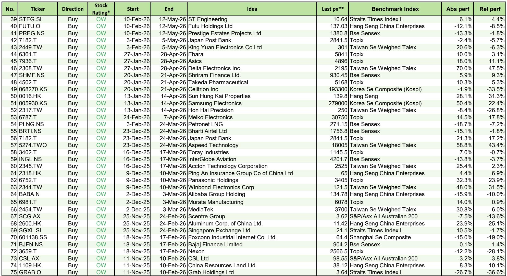
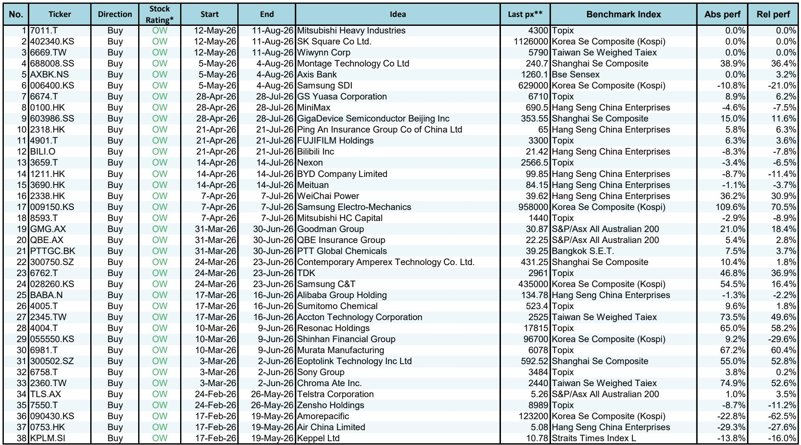

# 市场真正低估的不是AI需求，而是供给端的再定价能力

这份研报最值得关注的判断，并非AI算力需求仍在增长——这已是共识。真正的新信号在于：市场对供给端结构变化的定价远未充分。某外资投行在最新一期“Three Actionable Ideas”中，同时上调了必和必拓、怡和控股和亚洲散热组件三家公司的评级。表面看，这三家公司分属资源、综合企业和电子零部件，毫无交集。但仔细拆解，它们共同指向一个被低估的变量：在AI驱动的需求浪潮中，真正能获得超额收益的，是那些有能力在供给端重塑竞争格局的企业，而非单纯受益于需求增长的公司。

报告发布时，这三只股票均处于“Overweight”评级，且各自面临不同的市场误解。必和必拓被视为纯资源周期股，但其数据中心建设带来的铜和铁矿石需求增量，正在改变其商品组合的定价逻辑。怡和控股长期被市场折价交易，但新任CEO和香港置地的成功转型模板，暗示资产重组可能带来价值重估。亚洲散热组件则受益于液冷技术在超大规模数据中心中的渗透加速，但其竞争优势不仅在于散热方案本身，更在于向周边组件和机架SKU的扩展能力。

这三家公司共同揭示了一个更深的主题：当市场将注意力集中在AI需求侧的爆发力时，供给侧的再定价机会——无论是矿产资源的资产变现、综合企业的资产重组，还是零部件的技术扩展——正在被系统性低估。以下从三个维度拆解这一判断。

## 1. 数据中心建设对资源品的需求，正在改变必和必拓的商品组合定价逻辑

市场对必和必拓的传统认知是：一家以铁矿石为核心的大宗商品生产商，其业绩高度依赖中国房地产和基建周期。但这份研报提出了一个不同的视角：数据中心建设的加速，正在为必和必拓的商品组合注入新的结构性增长动力。

报告明确指出，数据中心建设对铜和铁矿石的需求增量，不是周期性波动，而是结构性增量。铜是数据中心电力基础设施的关键材料，从变压器到连接器，铜的消耗密度显著高于传统商业建筑。铁矿石则用于数据中心建筑结构和冷却系统的钢材生产。当市场还在争论AI算力需求何时见顶时，数据中心建设的物理基础设施需求已经转化为对上游资源品的实际订单。

更关键的是，报告认为必和必拓存在“alpha机会”——即超越市场beta的个股超额收益来源。这些机会不仅来自数据中心驱动的需求增长，更来自铁矿石和铜的资产变现潜力。报告提到“further asset crystallisation beyond current guidance”，暗示公司可能通过剥离或变现部分资产来释放价值，而这一点尚未被市场充分定价。

这意味着什么？对于资源品投资者而言，传统的估值框架——仅看铁矿石价格和产量——已经不足以捕捉必和必拓的全部价值。数据中心建设正在重塑其商品组合的定价逻辑，而资产变现则可能成为股价的额外催化剂。如果市场继续以“纯资源周期股”的框架来估值，那么必和必拓的供给端再定价空间可能被系统性低估。

## 2. 怡和控股的“负资产”折价，正在被新任CEO和资产重组模板挑战

怡和控股是亚洲市场上最典型的“折价综合企业”之一。市场长期给予其“stub value”——即剔除主要子公司市值后的剩余价值——为负值。报告指出，这一stub value目前约为每股负6美元，意味着市场认为怡和控股的核心资产价值低于其子公司的市值之和，这通常被视为市场对管理层配置能力的质疑。

但报告提出了三个可能改变这一局面的因素。第一，新任CEO的任命。新管理层通常被市场视为变革的催化剂，尤其是当前任管理层的资本配置策略已被市场惩罚多年。第二，香港置地的成功转型模板。香港置地是怡和控股旗下的重要子公司，其近年来的资产重组和业务聚焦策略已被证明有效。如果这一模板被复制到怡和控股的其他业务板块，整体估值有望得到修复。第三，潜在的资产回收（asset recycling）机会。报告提到“potential asset recycling could drive a further re-rating”，暗示公司可能通过出售非核心资产或分拆上市来释放价值。

这里的关键洞察是：怡和控股的问题不在于资产质量，而在于资本配置效率。市场对综合企业的折价，本质上是对管理层能否有效配置资本的怀疑。而当新任CEO、成功转型模板和资产回收策略三者同时出现时，这种折价可能开始收敛。对于价值投资者而言，这是一个典型的“催化剂驱动的价值重估”机会。

但报告也留下了一个未完全回答的问题：资产回收的具体路径和时间表是什么？新任CEO的策略细节尚未完全披露，香港置地的成功经验能否在不同业务板块间复制，仍需验证。这正是我们后续需要持续跟踪的关键变量。

## 3. 亚洲散热组件的竞争优势，不仅在于液冷技术，更在于向周边组件扩展的能力

在AI数据中心的热管理领域，液冷技术正在从选项变为标配。随着GPU功率密度持续提升，传统风冷方案已无法满足散热需求，液冷方案的市场渗透率正在加速。亚洲散热组件（Asia Vital Components）正是这一趋势的核心受益者。

但报告对亚洲散热组件的推荐，并非简单的“液冷概念股”逻辑。报告强调，该公司的竞争优势在于“offering thermal and mechanical solutions”以及“extended design in peripheral components and affiliated rack SKUs”。这意味着，亚洲散热组件不仅提供液冷散热方案本身，还将其设计能力扩展到了周边组件和机架级SKU。这种从“单一组件”到“系统级解决方案”的扩展，显著提升了其客户粘性和单客户价值量。

对于超大规模数据中心客户而言，热管理方案的集成度越高，切换成本就越大。如果一家供应商能从散热组件扩展到周边组件和机架SKU，它实际上在构建一个更深的竞争壁垒。报告提到“capture rising liquid cooling adoption across various hyperscaler customers”，说明其客户基础正在从单一超大规模云厂商向多个客户扩展，这进一步降低了客户集中度风险。

这一判断对电子零部件投资者的含义是：在AI供应链中，不应仅关注GPU、光模块等“明星环节”，热管理等看似边缘的组件同样可能产生高壁垒的赢家。关键在于，这家公司是否具备从组件向系统级解决方案扩展的能力。

## 4. 报告尚未完全回答的关键问题：资产变现的路径和液冷渗透率的天花板

尽管这三只股票的逻辑清晰，但报告也留下了一些尚未完全展开的问题。这些问题既是风险点，也是后续跟踪的焦点。

对于必和必拓，资产变现的具体路径仍不明确。报告提到“beyond current guidance”，但并未详细说明哪些资产可能被剥离、以何种方式剥离、以及剥离后的资本分配计划。如果资产变现的规模或时间不及预期，其估值重估的逻辑可能被削弱。

对于怡和控股，新任CEO的策略细节尚未完全披露。香港置地的成功模板能否在不同业务板块间复制，取决于各板块的业务性质和竞争格局。例如，香港置地的地产业务与怡和控股的零售、汽车等业务在资本密集度和运营模式上有显著差异。资产回收的具体时间表也尚未明确。

对于亚洲散热组件，液冷技术的渗透率天花板是一个关键变量。如果液冷方案的市场渗透率在达到某个临界点后增速放缓，或者竞争对手推出更具性价比的替代方案，其竞争优势可能被侵蚀。此外，向周边组件和机架SKU的扩展，是否会导致其与现有客户形成竞争关系，也是一个需要关注的风险。

这些未解问题，正是我们需要持续跟踪和讨论的核心。它们不否定报告的基本判断，但提醒我们，任何投资逻辑都需要在动态中验证。

## 5. 一个观察框架：如何识别供给端再定价的机会

基于以上分析，我们可以提炼出一个识别供给端再定价机会的观察框架。这个框架不是简单的投资清单，而是一个结构性思考工具，帮助读者在类似案例中发现被市场低估的机会。

第一，寻找“需求结构变化”与“供给端定价”之间的错配。当市场仍以旧框架（如资源周期股、综合企业折价、组件供应商）来定价时，如果需求结构正在发生不可逆的变化（如数据中心建设、液冷渗透），那么供给端的定价逻辑可能被系统性低估。

第二，关注“资产变现”或“资本配置效率”的潜在催化剂。无论是必和必拓的资产结晶、怡和控股的资产回收，还是亚洲散热组件的技术扩展，本质上都是资本配置效率的提升。当一家公司拥有被低估的资产或能力，且管理层有动力或压力去释放这些价值时，供给端再定价的机会就出现了。

第三，验证“竞争优势的可扩展性”。亚洲散热组件从散热组件扩展到周边组件和机架SKU，怡和控股从香港置地的成功模板扩展到其他业务板块，必和必拓从铁矿石扩展到铜和资产变现——这些扩展路径的可行性，决定了供给端再定价的空间上限。

第四，关注“市场共识的滞后性”。当市场仍以旧框架定价时，供给端的变化往往被忽视。这种滞后性正是超额收益的来源。但需要警惕的是，滞后性不等于错误——只有当供给端的变化确实能转化为盈利增长或估值重估时，机会才成立。

这三个案例的共同启示是：在AI驱动的结构性变化中，最被低估的往往不是需求侧的爆发力，而是供给侧在资产、技术和资本配置方面的再定价能力。当市场还在争论AI算力需求何时见顶时，聪明的资金已经开始布局那些能够重新定义供给格局的公司。

这些未解问题——资产变现的具体路径、新任CEO的策略细节、液冷渗透率的天花板——正是我们后续在社群中持续讨论和跟踪的重点。欢迎来星球微信群里继续讨论，共同验证这些判断在动态市场中的演变。

Personal reading notes and learning share only. Not investment advice.

