# High Frequency Monitor Inflation scare

# Global equities moderated on inflation concerns

Global equity markets fell -0.6% last week as optimism surrounding earnings and the AI theme was offset by concerns about rising inflation. Last week, the best performing region was the US (+0.2%) while Emerging Markets lagged (-2.5%). Among global sectors, Energy (+4.2%) and Tech Hardware (+2.0%) were the best performers, while Utilities (-3.0%), Materials (-3.0%) and Real Estate (-2.9%) fell the most. The global earnings cycle remains strong and the Global News Pulse is improving, but an increasing risk is that rising inflation prompts central banks to raise rates.

# Best performing themes: Space, Renewable Energy

Last week, among the 12 themes we monitor, the best performers were Space (+4.3%) and Renewable Energy (+1.5%). In contrast, Nuclear Energy (-7.2%), Gold (-6.8%), and Luxury Lifestyle (-5.4%) performed worst. Triple Momentum remains strongest for Gold, Rare Earths, and Robotics, and weakest for Luxury Lifestyle and SaaS.

# Triple Momentum: Semis, Energy, Tech Hardware

By global sector, Triple Momentum remains strongest for Semis, Energy, and Tech Hardware. Among large and liquid stocks globally (min \$20bn market cap and \$20mn ADTV), the Triple Momentum Rank is highest for Bloom Energy, Renesas Electronics, Samsung SDI, SEMCO, Murata, Shinhan Financial, STMicroelectronics, Intel, and AMD.

Chart 1: Triple Momentum for Global Themes (earnings, price, news)   
Triple Momentum strongest for Gold and Rare Earths, weakest for SaaS and Luxury Lifestyle   
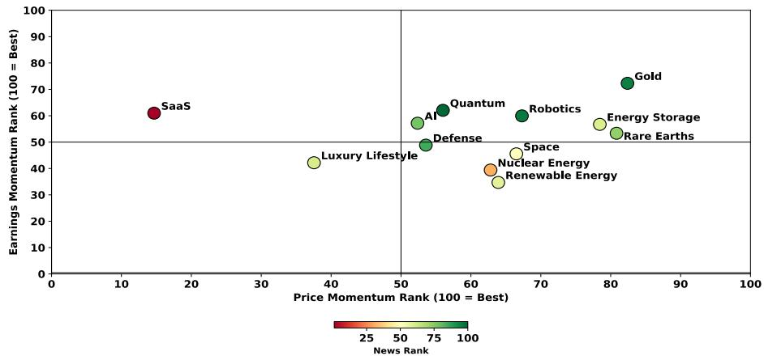

scatter

| Company           | Price Momentum Rank (100 = Best) | Earnings Momentum Rank (100 = Best) |
| ----------------- | -------------------------------- | ------------------------------------ |
| SaaS              | 15                               | 60                                   |
| Luxury Lifestyle  | 38                               | 42                                   |
| AI                | 52                               | 57                                   |
| Defense           | 53                               | 49                                   |
| Quantum           | 56                               | 62                                   |
| Space             | 66                               | 46                                   |
| Renewable Energy  | 63                               | 35                                   |
| Robotics          | 67                               | 60                                   |
| Space             | 67                               | 46                                   |
| Energy Storage    | 78                               | 57                                   |
| Rare Earths       | 81                               | 53                                   |
| Gold              | 83                               | 73                                   |

Source : BofA Global Quantitative Strategy, MSCI, IBES, RavenPack

BofA GLOBAL RESEARCH

Trading ideas and investment strategies discussed herein may give rise to significant risk and are not suitable for all investors. Investors should have experience in relevant markets and the financial resources to absorb any losses arising from applying these ideas or strategies.

>> Employed by a non-US affiliate of BofAS and is not registered/qualified as a research analyst under the FINRA rules.

Refer to "Other Important Disclosures" for information on certain BofA entities that take responsibility for the information herein in particular jurisdictions.

BofA does and seeks to do business with issuers covered in its research reports. As a result, investors should be aware that the firm may have a conflict of interest that could affect the objectivity of this report. Investors should consider this report as only a single factor in making their investment decision.

# 18 May 2026

Quant Strategy

Global

Nigel Tupper >>

Quant Strategist

BofA (Australia)

+61 2 9226 5735

nigel.tupper@bofa.com

Amar Vashi >>

Quant Strategist

BofA (Australia)

amar.vashi@bofa.com

Sumuhan Shanmugalingam >>

Quant Strategist

BofA (Australia)

sumuhan.shanmugalingam@bofa.com

Unless otherwise noted all links on the front page of this report refer to sections in this research report.

Market Performance

Style Performance

Earnings Revision Ratio

Earnings Revision Ratio by Style

NewsAlpha

Word Cloud

Tactical Indicators

Volatility

Rates

Triple Momentum

Themes

# Contents

Notice to Readers: 3

Market Performance 4

Market Breadth 6

Style Performance 7

Global Wave and Earnings 8

Earnings Revision Ratio 9

Quantessential Styles: Earnings Revision Ratio 11

NewsAlpha 12

Tactical Indicators 15

Commodities 17

Volatility 18

Fed 19

Rates 20

Valuation 23

Revenue Exposure 24

Triple Momentum 25

Global Regions: Triple Momentum Charts 29

Global Sectors: Triple Momentum Charts 32

Countries: Triple Momentum Charts 40

Themes 43

Performance by Theme 43

Ranking by Triple Momentum 44

What's Improving / Deteriorating? 45

Global Stocks (Most Important) by Theme 47

Asia Stocks (Most Important) by Theme 49

Country Exposure to Themes 51

# Notice to Readers:

The various screens identified in this report are intended to be indicative metrics only and may not be used for reference purposes or as a measure of performance for any financial instrument or contract, or otherwise relied upon by third parties for any other purpose, without the prior written consent of BofA Global Research. These screens were not created to act as a benchmark.

The Global News Pulse (and the regional and sectors versions of it) is intended to be an indicative metric only and may not be used for reference purposes or as a measure of performance for any financial instrument or contract, or otherwise relied upon by third parties for any other purpose, without the prior written consent of BofA Global Research. This News Pulse was not created to act as a benchmark.

Please refer to the “Global Quant Publications” page for a summary of all our published reports which details methodology on each of the analysis included in this report.

# Market Performance

Chart 2: Global Regions Performance: Last Week   
Best performing region last week was the USA   
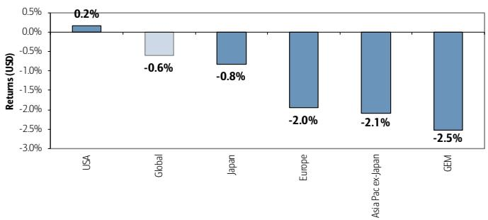

bar

| Region | Returns (USD) |
| :--- | :--- |
| USA | 0.2 |
| Global | -0.6 |
| Japan | -0.8 |
| Europe | -2.0 |
| Asia Pac ex-Japan | -2.1 |
| GEM | -2.5 |

Source : BofA Global Quantitative Strategy, MSCI   
BofA GLOBAL RESEARCH

Chart 4: Global Regions Performance: MTD   
Asia Pac ex-Japan is the best performing region this month   
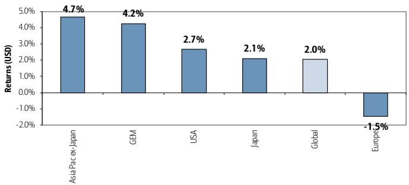

bar

| Category | Returns (USD) |
| :--- | :--- |
| Asia Pacific ex Japan | 4.7% |
| GEM | 4.2% |
| USA | 2.7% |
| Japan | 2.1% |
| Global | 2.0% |
| Europe | -1.5% |

Source : BofA Global Quantitative Strategy, MSCI   
BofA GLOBAL RESEARCH

Chart 6: Global Regions Performance: YTD   
Asia Pac ex-Japan is the best performing region this year   
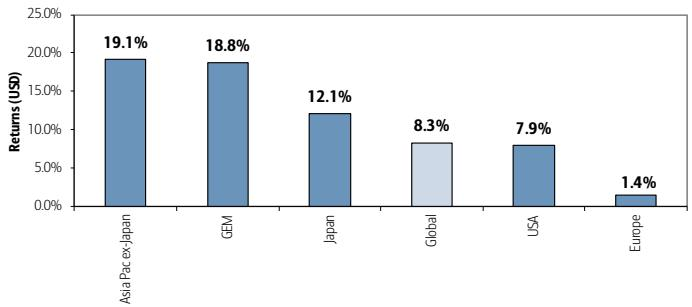

bar

| Category | Returns (USD) (%) |
| :--- | :--- |
| Asia Pac ex-Japan | 19.1 |
| GEM | 18.8 |
| Japan | 12.1 |
| Global | 8.3 |
| USA | 7.9 |
| Europe | 1.4 |

Source : BofA Global Quantitative Strategy, MSCI   
BofA GLOBAL RESEARCH

Chart 3: Global Sectors Performance: Last Week   
Best performing sector last week was Energy   
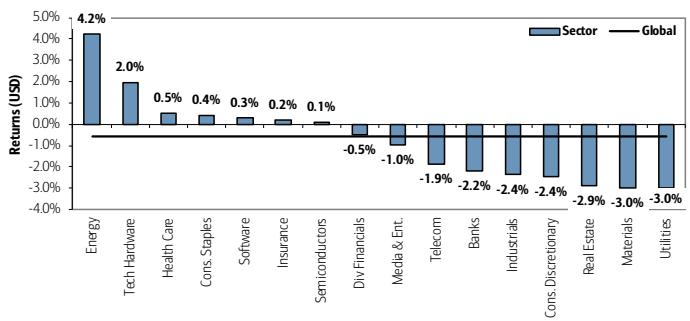

bar

| Sector             | Returns (USD) |
| ------------------ | ------------- |
| Energy             | 4.2%          |
| Tech Hardware      | 2.0%          |
| Health Care        | 0.5%          |
| Cons. Staples      | 0.4%          |
| Software           | 0.3%          |
| Insurance          | 0.2%          |
| Semiconductors     | 0.1%          |
| Div/Financials     | -0.5%         |
| Media & Ent.       | -1.0%         |
| Telecom            | -1.9%         |
| Banks              | -2.2%         |
| Industrials        | -2.4%         |
| Cons. Discretionary| -2.4%         |
| Real Estate        | -2.9%         |
| Materials          | -3.0%         |
| Utilities          | -3.0%         |

Source : BofA Global Quantitative Strategy, MSCI   
BofA GLOBAL RESEARCH

Chart 5: Global Sectors Performance: MTD   
Semiconductors is the best performing sector this month   
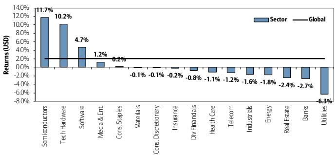

bar

| Sector           | Returns (USD) |
| ---------------- | ------------- |
| Semiconductors   | 11.7%         |
| Tech Hardware    | 10.2%         |
| Software         | 4.7%          |
| Media & Ent      | 1.2%          |
| Cons Staples    | 0.2%          |
| Materials        | -0.1%         |
| Cons Discretionary | -0.1%       |
| Insurance        | -0.2%         |
| Div Financials   | -0.8%         |
| Health Care      | -1.1%         |
| Telecom          | -1.2%         |
| Industrials      | -1.6%         |
| Energy           | -1.8%         |
| Real Estate      | -2.4%         |
| Banks            | -2.7%         |
| Utilities        | -6.3%         |

Source : BofA Global Quantitative Strategy, MSCI   
BofA GLOBAL RESEARCH

Chart 7: Global Sectors Performance: YTD   
Semiconductors is the best performing sector this year   
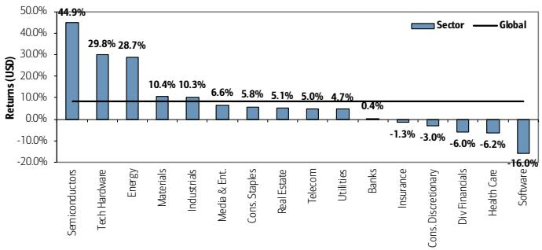

bar

| Sector             | Returns (USD) |
| ------------------ | ------------- |
| Semiconductors     | 44.9%         |
| Tech Hardware      | 29.8%         |
| Energy             | 28.7%         |
| Materials          | 10.4%         |
| Industrials        | 10.3%         |
| Media & Ent.       | 6.6%          |
| Cons. Staples      | 5.8%          |
| Real Estate        | 5.1%          |
| Telecom            | 5.0%          |
| Utilities          | 4.7%          |
| Banks              | 0.4%          |
| Insurance          | -1.3%         |
| Cons. Discretionary| -3.0%         |
| Div Financials     | -6.0%         |
| Health Care        | -6.2%         |
| Software           | -16.0%        |

Source : BofA Global Quantitative Strategy, MSCI   
BofA GLOBAL RESEARCH

Table 1: Global Region Country Sector Performance: Last week

Best performing sector last week was Energy

<table><tr><td></td><td>Energy</td><td>Materials</td><td>Industrials</td><td>Cons. Discretionary</td><td>Cons. Staples</td><td>Health Care</td><td>Banks</td><td>Div Financials</td><td>Insurance</td><td>Software</td><td>Tech Hardware</td><td>Semiconductors</td><td>Telecom</td><td>Media &amp; Ent.</td><td>Utilities</td><td>Real Estate</td><td>Country</td></tr><tr><td>Canada</td><td>4.6%</td><td>-4.7%</td><td>-3.0%</td><td>-4.3%</td><td>-1.3%</td><td>n/a</td><td>0.3%</td><td>-3.1%</td><td>-1.2%</td><td>-1.0%</td><td>-4.2%</td><td>n/a</td><td>-4.1%</td><td>n/a</td><td>-1.1%</td><td>-3.6%</td><td>-1.1%</td></tr><tr><td>USA</td><td>6.6%</td><td>-2.3%</td><td>-1.0%</td><td>-3.1%</td><td>1.3%</td><td>1.1%</td><td>-2.3%</td><td>0.2%</td><td>1.1%</td><td>0.8%</td><td>3.1%</td><td>0.5%</td><td>-2.8%</td><td>-0.7%</td><td>-2.2%</td><td>-2.7%</td><td>0.2%</td></tr><tr><td>Belgium</td><td>n/a</td><td>n/a</td><td>n/a</td><td>-7.1%</td><td>1.0%</td><td>1.0%</td><td>-4.0%</td><td>-4.2%</td><td>0.5%</td><td>n/a</td><td>n/a</td><td>n/a</td><td>n/a</td><td>n/a</td><td>-6.3%</td><td>n/a</td><td>-0.1%</td></tr><tr><td>Finland</td><td>3.1%</td><td>-2.3%</td><td>-1.3%</td><td>n/a</td><td>-2.7%</td><td>-2.0%</td><td>-2.2%</td><td>n/a</td><td>0.0%</td><td>n/a</td><td>7.4%</td><td>n/a</td><td>-0.3%</td><td>n/a</td><td>-2.6%</td><td>n/a</td><td>0.9%</td></tr><tr><td>France</td><td>2.4%</td><td>-0.7%</td><td>-5.4%</td><td>-4.6%</td><td>-3.1%</td><td>-0.4%</td><td>-3.9%</td><td>-1.2%</td><td>-5.7%</td><td>-2.2%</td><td>n/a</td><td>6.4%</td><td>0.9%</td><td>-6.3%</td><td>-4.1%</td><td>-5.6%</td><td>-3.2%</td></tr><tr><td>Germany</td><td>n/a</td><td>-2.3%</td><td>-4.8%</td><td>-1.7%</td><td>-2.1%</td><td>-1.2%</td><td>1.6%</td><td>-1.8%</td><td>-2.2%</td><td>-2.7%</td><td>n/a</td><td>4.4%</td><td>-0.2%</td><td>0.4%</td><td>-4.2%</td><td>-4.1%</td><td>-2.5%</td></tr><tr><td>Italy</td><td>2.3%</td><td>-7.5%</td><td>-3.3%</td><td>-5.2%</td><td>-5.1%</td><td>1.7%</td><td>-1.3%</td><td>-0.1%</td><td>-1.9%</td><td>n/a</td><td>n/a</td><td>n/a</td><td>-0.1%</td><td>n/a</td><td>-3.3%</td><td>n/a</td><td>-2.0%</td></tr><tr><td>Netherlands</td><td>n/a</td><td>-3.3%</td><td>-4.4%</td><td>-5.8%</td><td>-1.5%</td><td>-6.7%</td><td>-0.1%</td><td>-6.1%</td><td>0.9%</td><td>24.2%</td><td>n/a</td><td>-2.2%</td><td>-0.5%</td><td>2.5%</td><td>n/a</td><td>n/a</td><td>-1.4%</td></tr><tr><td>Norway</td><td>4.9%</td><td>0.4%</td><td>-6.5%</td><td>n/a</td><td>0.8%</td><td>n/a</td><td>-0.9%</td><td>n/a</td><td>-0.4%</td><td>n/a</td><td>n/a</td><td>n/a</td><td>2.6%</td><td>n/a</td><td>n/a</td><td>n/a</td><td>0.9%</td></tr><tr><td>Spain</td><td>1.1%</td><td>n/a</td><td>-4.2%</td><td>-4.1%</td><td>n/a</td><td>0.4%</td><td>-2.6%</td><td>n/a</td><td>-0.4%</td><td>-3.0%</td><td>n/a</td><td>n/a</td><td>-1.0%</td><td>n/a</td><td>-2.3%</td><td>n/a</td><td>-2.6%</td></tr><tr><td>Sweden</td><td>n/a</td><td>-3.1%</td><td>-5.4%</td><td>-3.0%</td><td>-1.9%</td><td>-1.0%</td><td>-2.7%</td><td>-3.7%</td><td>n/a</td><td>n/a</td><td>2.5%</td><td>n/a</td><td>-1.4%</td><td>4.6%</td><td>n/a</td><td>-3.8%</td><td>-3.1%</td></tr><tr><td>Switzerland</td><td>n/a</td><td>-4.0%</td><td>-1.5%</td><td>-3.1%</td><td>-0.7%</td><td>0.5%</td><td>1.9%</td><td>1.1%</td><td>0.5%</td><td>n/a</td><td>-4.4%</td><td>n/a</td><td>-0.2%</td><td>n/a</td><td>-2.1%</td><td>-2.1%</td><td>-0.4%</td></tr><tr><td>UK</td><td>0.9%</td><td>-1.9%</td><td>-4.9%</td><td>0.5%</td><td>0.8%</td><td>-0.4%</td><td>-3.3%</td><td>-6.7%</td><td>-0.6%</td><td>-3.1%</td><td>-3.4%</td><td>n/a</td><td>-8.0%</td><td>-5.6%</td><td>-9.5%</td><td>-6.0%</td><td>-2.3%</td></tr><tr><td>Australia</td><td>2.9%</td><td>1.7%</td><td>-1.4%</td><td>0.5%</td><td>-3.9%</td><td>-12.9%</td><td>-7.8%</td><td>-0.3%</td><td>3.5%</td><td>-7.8%</td><td>n/a</td><td>n/a</td><td>0.1%</td><td>-5.5%</td><td>0.3%</td><td>1.1%</td><td>-2.8%</td></tr><tr><td>Hong Kong</td><td>n/a</td><td>n/a</td><td>-1.3%</td><td>-0.5%</td><td>-4.0%</td><td>n/a</td><td>1.5%</td><td>-2.4%</td><td>1.1%</td><td>n/a</td><td>n/a</td><td>n/a</td><td>0.6%</td><td>n/a</td><td>1.1%</td><td>0.2%</td><td>-0.2%</td></tr><tr><td>Japan</td><td>4.4%</td><td>-5.0%</td><td>-1.0%</td><td>2.7%</td><td>0.6%</td><td>-0.3%</td><td>2.3%</td><td>3.1%</td><td>6.6%</td><td>-5.4%</td><td>-2.2%</td><td>-7.7%</td><td>-2.9%</td><td>-7.5%</td><td>-1.6%</td><td>-7.4%</td><td>-0.8%</td></tr><tr><td>Singapore</td><td>n/a</td><td>n/a</td><td>-2.9%</td><td>1.7%</td><td>1.2%</td><td>n/a</td><td>2.1%</td><td>0.1%</td><td>n/a</td><td>n/a</td><td>n/a</td><td>n/a</td><td>1.8%</td><td>n/a</td><td>-4.4%</td><td>-2.4%</td><td>0.8%</td></tr><tr><td>China</td><td>-0.1%</td><td>-7.7%</td><td>-0.8%</td><td>-3.1%</td><td>-2.7%</td><td>-4.8%</td><td>0.2%</td><td>-3.1%</td><td>-4.3%</td><td>-7.8%</td><td>-0.2%</td><td>0.8%</td><td>-0.5%</td><td>-3.8%</td><td>0.6%</td><td>0.0%</td><td>-2.7%</td></tr><tr><td>India</td><td>-6.3%</td><td>-1.4%</td><td>-5.1%</td><td>-5.9%</td><td>-1.9%</td><td>0.1%</td><td>-3.5%</td><td>-6.1%</td><td>-1.9%</td><td>-7.0%</td><td>n/a</td><td>-7.9%</td><td>3.1%</td><td>-6.6%</td><td>-5.3%</td><td>-9.3%</td><td>-4.1%</td></tr><tr><td>Korea</td><td>-8.7%</td><td>-13.5%</td><td>-9.9%</td><td>13.1%</td><td>-3.9%</td><td>-4.5%</td><td>-6.2%</td><td>-10.3%</td><td>4.0%</td><td>5.5%</td><td>-1.5%</td><td>5.4%</td><td>6.0%</td><td>-5.7%</td><td>-13.8%</td><td>n/a</td><td>-1.0%</td></tr><tr><td>Taiwan</td><td>n/a</td><td>-4.5%</td><td>-10.3%</td><td>-4.4%</td><td>1.5%</td><td>6.6%</td><td>-2.2%</td><td>-4.1%</td><td>-2.6%</td><td>n/a</td><td>-1.4%</td><td>n/a</td><td>1.5%</td><td>-2.4%</td><td>n/a</td><td>n/a</td><td>-1.9%</td></tr><tr><td>Brazil</td><td>-2.3%</td><td>-2.2%</td><td>-10.6%</td><td>-5.8%</td><td>-9.2%</td><td>-12.1%</td><td>-8.8%</td><td>-9.9%</td><td>-5.9%</td><td>-14.5%</td><td>n/a</td><td>n/a</td><td>-9.6%</td><td>n/a</td><td>-10.0%</td><td>n/a</td><td>-7.2%</td></tr><tr><td>Mexico</td><td>n/a</td><td>-3.9%</td><td>-4.0%</td><td>n/a</td><td>-2.2%</td><td>n/a</td><td>-5.2%</td><td>n/a</td><td>n/a</td><td>n/a</td><td>n/a</td><td>n/a</td><td>-1.9%</td><td>n/a</td><td>n/a</td><td>n/a</td><td>-3.3%</td></tr><tr><td>South Africa</td><td>n/a</td><td>-9.5%</td><td>-1.8%</td><td>-4.2%</td><td>-1.0%</td><td>n/a</td><td>-2.3%</td><td>-2.8%</td><td>-3.5%</td><td>n/a</td><td>n/a</td><td>n/a</td><td>-1.3%</td><td>n/a</td><td>n/a</td><td>n/a</td><td>-5.5%</td></tr><tr><td>Global Sector</td><td>4.2%</td><td>-3.0%</td><td>-2.4%</td><td>-2.4%</td><td>0.4%</td><td>0.5%</td><td>-2.2%</td><td>-0.5%</td><td>0.2%</td><td>0.3%</td><td>2.0%</td><td>0.1%</td><td>-1.9%</td><td>-1.0%</td><td>-3.0%</td><td>-2.9%</td><td>-0.6%</td></tr><tr><td>Europe Sector</td><td>1.6%</td><td>-2.0%</td><td>-4.4%</td><td>-3.3%</td><td>-0.5%</td><td>0.1%</td><td>-2.5%</td><td>-2.4%</td><td>-1.3%</td><td>1.0%</td><td>3.0%</td><td>-1.0%</td><td>-1.4%</td><td>0.8%</td><td>-4.0%</td><td>-4.6%</td><td>-2.0%</td></tr><tr><td>APxJ Sector</td><td>-2.9%</td><td>-2.2%</td><td>-5.7%</td><td>-1.4%</td><td>-2.4%</td><td>-4.8%</td><td>-3.2%</td><td>-3.7%</td><td>-0.8%</td><td>-6.9%</td><td>-1.3%</td><td>-0.2%</td><td>1.9%</td><td>-3.9%</td><td>-2.1%</td><td>-0.6%</td><td>-2.1%</td></tr><tr><td>GEM Sector</td><td>-3.0%</td><td>-5.6%</td><td>-6.7%</td><td>-1.8%</td><td>-2.4%</td><td>-2.9%</td><td>-2.9%</td><td>-5.9%</td><td>-2.8%</td><td>-6.6%</td><td>-1.3%</td><td>-0.2%</td><td>0.2%</td><td>-3.9%</td><td>-4.8%</td><td>-3.5%</td><td>-2.5%</td></tr></table>

Source : BofA Global Quantitative Strategy, MSCI

BofA GLOBAL RESEARCH

# Market Breadth

Chart 8: MSCI AC World Market Cap vs. Equal weighted index performance - last week/MTD/YTD   
Last week, ACWI index returned -0.6%, while Equal Weighted index returned -2.2%   
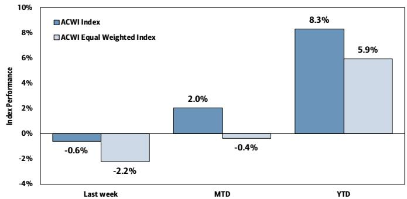

bar

| Period | ACWI Index (%) | ACWI Equal Weighted Index (%) |
| :--- | :--- | :--- |
| Last week | -0.6 | -2.2 |
| MTD | 2.0 | -0.4 |
| YTD | 8.3 | 5.9 |

Source : BofA Global Quantitative Strategy, MSCI   
BofA GLOBAL RESEARCH

Chart 10: Market Breadth - last week/MTD/YTD   
Last week, 33% of the stocks outperformed the index   
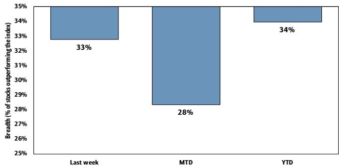

bar

| Category | Breadth (% of stocks outperforming the index) |
| :--- | :--- |
| Last week | 33% |
| MTD | 28% |
| YTD | 34% |

Source : BofA Global Quantitative Strategy, MSCI   
BofA GLOBAL RESEARCH

Chart 9: MSCI AC World Market Cap vs. Equal weighted index performance - last 12 months   
Last 12 months, ACWI index returned 22.5%, while Equal Weighted index returned 15.2%   
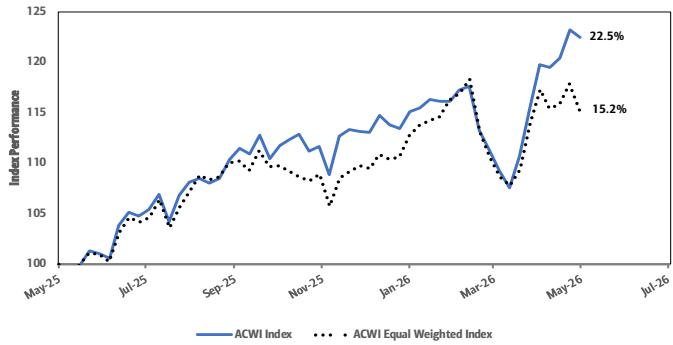

line

| Date   | ACWI Index | ACWI Equal Weighted Index |
|--------|------------|---------------------------|
| May-26 | 22.5%      | 15.2%                     |

Source : BofA Global Quantitative Strategy, MSCI   
BofA GLOBAL RESEARCH

Chart 11: Market Breadth - last 12 months   
Last 12 months, 33% stocks outperformed the index   
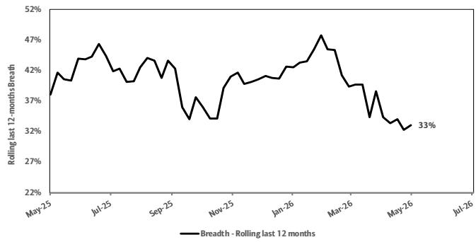

line

| Date    | Rolling last 12 months |
|---------|--------------------------|
| Jul-26  | 33%                      |

Source : BofA Global Quantitative Strategy, MSCI   
BofA GLOBAL RESEARCH

# Style Performance

Chart 12: Global Quantessential Style Rel Performance: Last Week
Last week the best performing style was Momentum   
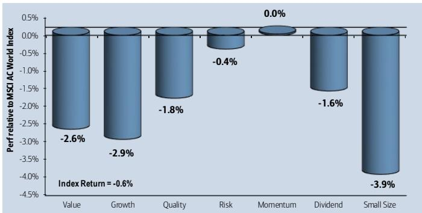

bar

| Metric | Performance relative to MSCI AC World Index (%) |
|---|---|
| Value | -2.6 |
| Growth | -2.9 |
| Quality | -1.8 |
| Risk | -0.4 |
| Momentum | 0.0 |
| Dividend | -1.6 |
| Small Size | -3.9 |
Index Return = -0.6%

Source : BofA Global Quantitative Strategy, MSCI, IBES, S&P, Worldscope, Bloomberg   
BofA GLOBAL RESEARCH

Chart 14: Global Quantessential Style Relative Performance: MTD
Momentum is the best performing style this month   
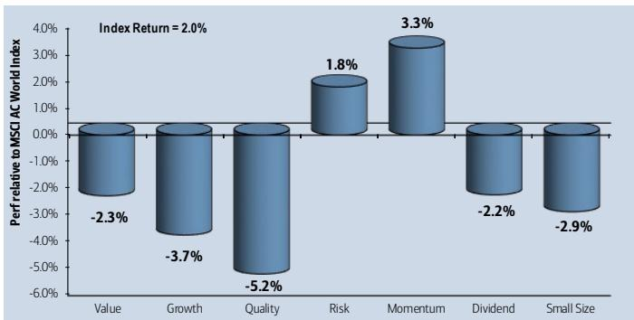

bar

| Metric | Performance relative to MSCI AC World Index (%) |
|---|---|
| Value | -2.3 |
| Growth | -3.7 |
| Quality | -5.2 |
| Risk | 1.8 |
| Momentum | 3.3 |
| Dividend | -2.2 |
| Small Size | -2.9 |
Index Return = 2.0%

Source : BofA Global Quantitative Strategy, MSCI, IBES, S&P, Worldscope, Bloomberg   
BofA GLOBAL RESEARCH

Chart 16: Global Quantessential Style Relative Performance: YTD Momentum is the best performing style this year   
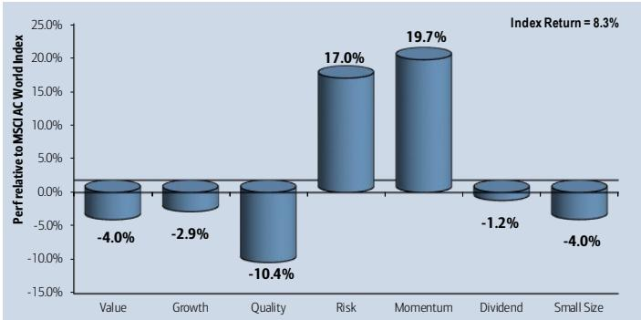

bar

| Category | Performance relative to MSCI AC World Index (%) |
| :--- | :--- |
| Value | -4.0 |
| Growth | -2.9 |
| Quality | -10.4 |
| Risk | 17.0 |
| Momentum | 19.7 |
| Dividend | -1.2 |
| Small Size | -4.0 |
Index Return = 8.3%

Source : BofA Global Quantitative Strategy, MSCI, IBES, S&P, Worldscope, Bloomberg   
BofA GLOBAL RESEARCH

Chart 13: Asia Pac Quantessential Style Rel Performance: Last Week
Last week the best performing style was Quality   
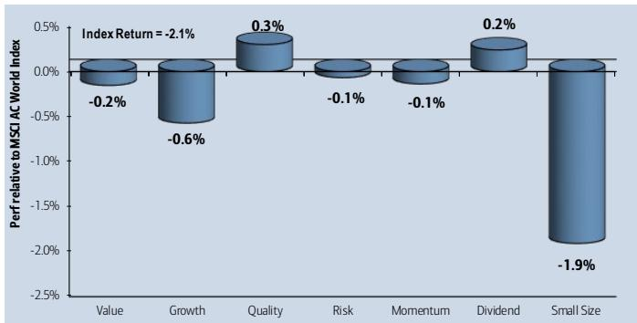

bar

| Category | Performance relative to MSCI AC World Index (%) |
| :--- | :--- |
| Value | -0.2 |
| Growth | -0.6 |
| Quality | 0.3 |
| Risk | -0.1 |
| Momentum | -0.1 |
| Dividend | 0.2 |
| Small Size | -1.9 |
Index Return = -2.1%

Source : BofA Global Quantitative Strategy, MSCI, IBES, S&P, Worldscope, Bloomberg   
BofA GLOBAL RESEARCH

Chart 15: Asia Pac Quantessential Style Relative Performance: MTD
MTD: Dividend has performed the best   
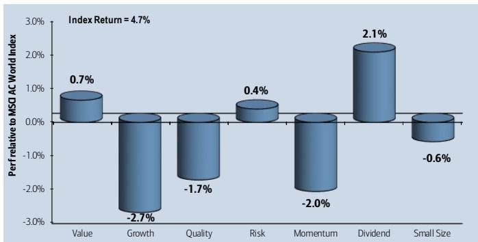

bar

| Metric | Performance relative to MSQ AC World Index (%) |
|---|---|
| Value | 0.7 |
| Growth | -2.7 |
| Quality | -1.7 |
| Risk | 0.4 |
| Momentum | -2.0 |
| Dividend | 2.1 |
| Small Size | -0.6 |
Index Return = 4.7%

Source : BofA Global Quantitative Strategy, MSCI, IBES, S&P, Worldscope, Bloomberg   
BofA GLOBAL RESEARCH

Chart 17: Asia Pac Quantessential Style Relative Performance: YTD
Small Size is the best performing style this year   
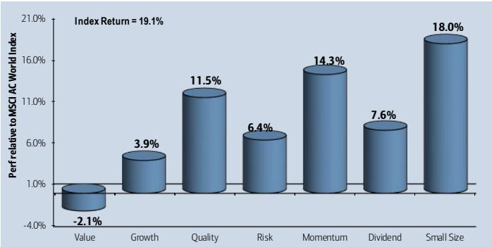

bar

| Category | Performance relative to MSCI AC World Index (%) |
| :--- | :--- |
| Value | -2.1 |
| Growth | 3.9 |
| Quality | 11.5 |
| Risk | 6.4 |
| Momentum | 14.3 |
| Dividend | 7.6 |
| Small Size | 18.0 |
Index Return = 19.1%

Source : BofA Global Quantitative Strategy, MSCI, IBES, S&P, Worldscope, Bloomberg   
BofA GLOBAL RESEARCH

# Global Wave and Earnings

Chart 18: Global Wave is an amalgamation of seven components (1988 to latest)   
The Global Wave troughed in Feb-26, and providing positive signal   
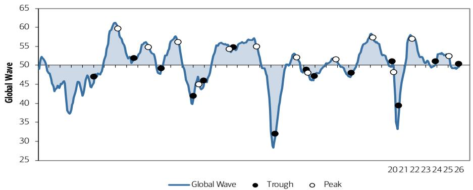

line

| Date       | Global Wave | Trough | Peak |
| ---------- | ----------- | ------ | ---- |
| 2021-01-01 | 52          | -      | -    |
| 2021-01-02 | 47          | -      | -    |
| 2021-01-03 | 61          | -      | 60   |
| 2021-01-04 | 55          | -      | -    |
| 2021-01-05 | 58          | -      | -    |
| 2021-01-06 | 56          | -      | -    |
| 2021-01-07 | 49          | -      | -    |
| 2021-01-08 | 45          | -      | -    |
| 2021-01-09 | 47          | -      | -    |
| 2021-01-10 | 43          | -      | -    |
| 2021-01-11 | 46          | -      | -    |
| 2021-01-12 | 54          | -      | -    |
| 2021-01-13 | 55          | -      | -    |
| 2021-01-14 | 57          | -      | -    |
| 2021-01-15 | 56          | -      | -    |
| 2021-01-16 | 54          | -      | -    |
| 2021-01-17 | 53          | -      | -    |
| 2021-01-18 | 55          | -      | -    |
| 2021-01-19 | 57          | -      | -    |
| 2021-01-20 | 58          | -      | -    |
| 2021-01-21 | 59          | -      | -    |
| 2021-01-22 | 57          | -      | -    |
| 2021-01-23 | 56          | -      | -    |
| 2021-01-24 | 55          | -      | -    |
| 2021-01-25 | 54          | -      | -    |
| 2021-01-26 | 53          | -      | -    |
| 2021-01-27 | 52          | -      | -    |
| 2021-01-28 | 51          | -      | -    |
| 2021-01-29 | 50          | -      | -    |
| 2021-01-30 | 49          | -      | -    |
| 2021-01-31 | 48          | -      | -    |
| 2021-02-01 | 47          | -      | -    |
| 2021-02-02 | 46          | -      | -    |
| 2021-02-03 | 45          | -      | -    |
| 2021-02-04 | 44          | -      | -    |
| 2021-02-05 | 43          | -      | -    |
| 2021-02-06 | 42          | -      | -    |
| 2021-02-07 | 41          | -      | -    |
| 2021-02-08 | 40          | -      | -    |
| 2021-02-09 | 39          | -      | -    |
| 2021-03-01 | 38          | -      | -    |
| 2021-03-02 | 37          | -      | -    |
| 2021-03-03 | 36          | -      | -    |
| 2021-03-04 | 35          | -      | -    |
| 2021-03-05 | 34          | -      | -    |
| 2021-03-06 | 33          | -      | -    |
| 2021-03-07 | 32          | -      | -    |
| 2021-03-08 | 31          | -      | -    |
| 2021-03-09 | 30          | -      | -    |
| 2021-03-10 | 29          | -      | -    |
| 2021-03-11 | 28          | -      | -    |
| 2021-03-12 | 27          | -      | -    |
| 2021-03-13 | 26          | -      | -    |
| 2021-03-14 | 25          | -      | -    |
| 2021-03-15 | 24          | -      | -    |
| 2021-03-16 | 23          | -      | -    |
| 2021-03-17 | 22          | -      | -    |
| 2021-03-18 | 21          | -      | -    |
| 2021-03-19 | 20          | -      | -    |
| 2021-03-20 | 19          | -      | -    |
| 2021-03-21 | 18          | -      | -    |
| 2021-03-22 | 17          | -      | -    |
| 2021-03-23 | 16          | -      | -    |
| 2021-03-24 | 15          | -      | -    |
| 2021-03-25 | 14          | -      | -    |
| 2021-03-26 | 13          | -      | -    |
| 2021-03-27+<fcel>58          +57        +56        +55        +54        +53        +56        +55        +54        +57        +58        +56        +57        +58        +59        +67        +68        +69        +77        +78        +79        +87        +97         +98        +99         +98        +97         +98        +99         +98        +97         +98        +98        +97         +98        +98        +97         +98        +98        +97         +98        +98        +97         +98        +98        +97         +98        +98        +97         +98        +98        +97         +98        +98        +97         +98        +98       +98        +98        +97         +98        +98        +97         +98        +98        +97         +98        +98        +97         +98        +98        +97         +98        +98        +97         +98        +98        +97         +98        +98        +97         +98       +98        +98        +97         +98        +98        +97         +98        +98        +97         +98        +98        +97         +98        +98        +97         +98        +98        +97         +98        +98        +97         +98        +98        +97

Source : BofA Global Quantitative Strategy, MSCI, IBES, Haver, Bloomberg, OECD, IMF, ICE Bond Indices, National Statistics Database   
The sentiment indicator identified as Global Wave above is intended to be an indicative metric only and may not be used for reference purposes or as a measure of performance for any financial instrument or contract, or otherwise relied upon by third parties for other purpose, without the prior written consent of BofA Global Research. This sentiment indicator was not created to act as a benchmark.

BofA GLOBAL RESEARCH

Chart 19: Global Wave and Global Prospective EPS   
Global earnings forecasts tend to rise during an upturn   
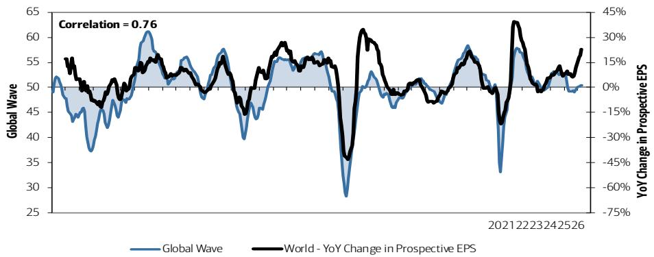

line

| Date       | Global Wave | World - YoY Change in Prospective EPS |
| ---------- | ----------- | ------------------------------------- |
| 2021-02-26 | 50          | 0%                                    |

Source : BofA Global Quantitative Strategy, MSCI, IBES, Haver, Bloomberg, OECD, IMF, ICE Bond Indices, National Statistics Database

BofA GLOBAL RESEARCH

Chart 20: Global Prospective EPS and MSCI AC World YoY Change (1988 to latest)   
Global prospective EPS has improved by 23% in last 12m   
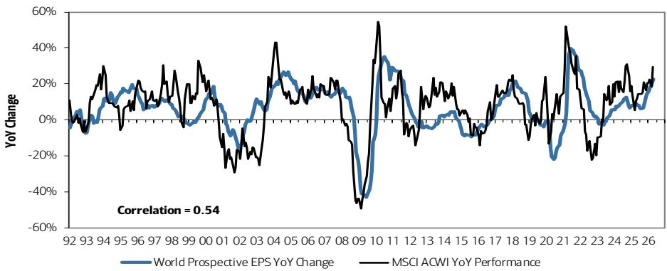

line

| Year | World Prospective EPS YoY Change | MSCI ACWI YoY Performance |
|------|----------------------------------|---------------------------|
| 92   | ~0%                              | ~0%                       |
| 93   | ~-5%                             | ~-5%                      |
| 94   | ~10%                             | ~10%                      |
| 95   | ~15%                             | ~15%                      |
| 96   | ~20%                             | ~20%                      |
| 97   | ~15%                             | ~15%                      |
| 98   | ~10%                             | ~10%                      |
| 99   | ~5%                              | ~5%                       |
| 00   | ~0%                              | ~0%                       |
| 01   | ~-5%                             | ~-5%                      |
| 02   | ~-10%                            | ~-10%                     |
| 03   | ~-15%                            | ~-15%                     |
| 04   | ~-20%                            | ~-20%                     |
| 05   | ~-15%                            | ~-15%                     |
| 06   | ~-10%                            | ~-10%                     |
| 07   | ~-5%                             | ~-5%                      |
| 08   | ~0%                              | ~0%                       |
| 09   | ~-40%                            | ~-40%                     |
| 10   | ~35%                             | ~35%                      |
| 11   | ~30%                             | ~30%                      |
| 12   | ~25%                             | ~25%                      |
| 13   | ~20%                             | ~20%                      |
| 14   | ~15%                             | ~15%                      |
| 15   | ~10%                             | ~10%                      |
| 16   | ~5%                              | ~5%                       |
| 17   | ~0%                              | ~0%                       |
| 18   | ~5%                              | ~5%                       |
| 19   | ~10%                             | ~10%                      |
| 20   | ~15%                             | ~15%                      |
| 21   | ~20%                             | ~20%                      |
| 22   | ~35%                             | ~35%                      |
| 23   | ~20%                             | ~20%                      |
| 24   | ~15%                             | ~15%                      |
| 25   | ~10%                             | ~10%                      |
| 26   | ~5%                              | ~5%                       |

Source : BofA Global Quantitative Strategy, MSCI, IBES

BofA GLOBAL RESEARCH

# Earnings Revision Ratio

Chart 21: Global Earnings Revision Ratio - Weekly (2010 to latest)   
Earnings revisions improved for World last week and remains above long-term average   
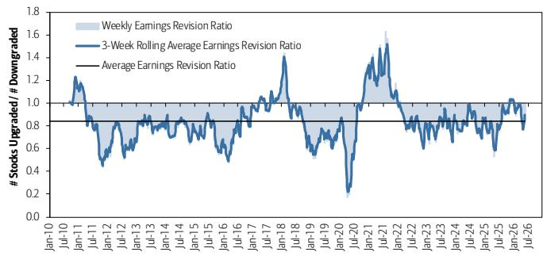

line

| Date    | Weekly Earnings Revision Ratio | 3-Week Rolling Average Earnings Revision Ratio | Average Earnings Revision Ratio |
|---------|----------------------------------|--------------------------------------------------|--------------------------------|
| Jan-10  | ~1.0                             | ~1.0                                             | ~1.0                           |
| Jul-10  | ~1.0                             | ~1.2                                             | ~1.0                           |
| Jan-11  | ~1.0                             | ~0.5                                             | ~1.0                           |
| Jul-11  | ~1.0                             | ~0.8                                             | ~1.0                           |
| Jan-12  | ~1.0                             | ~0.7                                             | ~1.0                           |
| Jul-12  | ~1.0                             | ~0.9                                             | ~1.0                           |
| Jan-13  | ~1.0                             | ~0.8                                             | ~1.0                           |
| Jul-13  | ~1.0                             | ~0.9                                             | ~1.0                           |
| Jan-14  | ~1.0                             | ~0.8                                             | ~1.0                           |
| Jul-14  | ~1.0                             | ~0.9                                             | ~1.0                           |
| Jan-15  | ~1.0                             | ~0.8                                             | ~1.0                           |
| Jul-15  | ~1.0                             | ~0.9                                             | ~1.0                           |
| Jan-16  | ~1.0                             | ~0.8                                             | ~1.0                           |
| Jul-16  | ~1.0                             | ~0.9                                             | ~1.0                           |
| Jan-17  | ~1.0                             | ~0.8                                             | ~1.0                           |
| Jul-17  | ~1.0                             | ~1.4                                             | ~1.0                           |
| Jan-18  | ~1.0                             | ~0.9                                             | ~1.0                           |
| Jul-18  | ~1.0                             | ~0.8                                             | ~1.0                           |
| Jan-19  | ~1.0                             | ~0.9                                             | ~1.0                           |
| Jul-19  | ~1.0                             | ~0.8                                             | ~1.0                           |
| Jan-20  | ~1.0                             | ~0.2                                             | ~1.0                           |
| Jul-20  | ~1.0                             | ~1.4                                             | ~1.0                           |
| Jan-21  | ~1.0                             | ~1.6                                             | ~1.0                           |
| Jul-21  | ~1.0                             | ~1.5                                             | ~1.0                           |
| Jan-22  | ~1.0                             | ~0.9                                             | ~1.0                           |
| Jul-22  | ~1.0                             | ~0.8                                             | ~1.0                           |
| Jan-23  | ~1.0                             | ~0.9                                             | ~1.0                           |
| Jul-23  | ~1.0                             | ~0.8                                             | ~1.0                           |
| Jan-24  | ~1.0                             | ~0.9                                             | ~1.0                           |
| Jul-24  | ~1.0                             | ~0.8                                             | ~1.0                           |
| Jan-25  | ~1.0                             | ~0.9                                             | ~1.0                           |
| Jul-25  | ~1.0                             | ~0.8                                             | ~1.0                           |
| Jan-26  | ~1.0                             | ~0.9                                             | ~1.0                           |
| Jul-26  | ~1.0                             | ~0.8                                             | ~1.0                           |

Source : BofA Global Quantitative Strategy, MSCI, IBES   
BofA GLOBAL RESEARCH

Chart 23: Global Regions Earnings Revision Ratio - Weekly   
The USA has the strongest ERR   
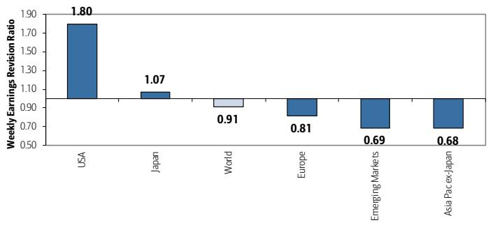

bar

| Region | Weekly Earnings Revision Ratio |
| :--- | :--- |
| USA | 1.80 |
| Japan | 1.07 |
| World | 0.91 |
| Europe | 0.81 |
| Emerging Markets | 0.69 |
| Asia Pac ex Japan | 0.68 |

Source : BofA Global Quantitative Strategy, MSCI, IBES   
BofA GLOBAL RESEARCH

Chart 25: Global Sectors Earnings Revision Ratio - Weekly   
Earnings Revision Ratio is strongest in Energy sector globally   
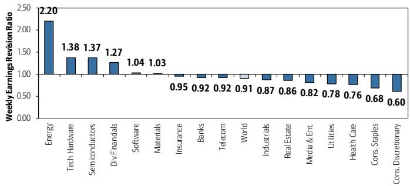

bar

| Sector              | Weekly Earnings/Revision Ratio |
| ------------------- | -------------------------------- |
| Energy              | 2.20                             |
| Tech Hardware       | 1.38                             |
| Semiconductors      | 1.37                             |
| Div Financials      | 1.27                             |
| Software            | 1.04                             |
| Materials           | 1.03                             |
| Insurance           | 0.95                             |
| Banks               | 0.92                             |
| Telecom             | 0.92                             |
| World               | 0.91                             |
| Industrials         | 0.87                             |
| Real Estate         | 0.86                             |
| Media & Ent.        | 0.82                             |
| Utilities           | 0.78                             |
| Health Care         | 0.76                             |
| Cons. Staples       | 0.68                             |
| Cons. Discretionary | 0.60                             |

Source : BofA Global Quantitative Strategy, MSCI, IBES   
BofA GLOBAL RESEARCH

Chart 22: Asia Pac Earnings Revision Ratio - Weekly (2010 to latest)   
Earnings revisions improved in Asia Pac ex-Japan last week but remains below long term average   
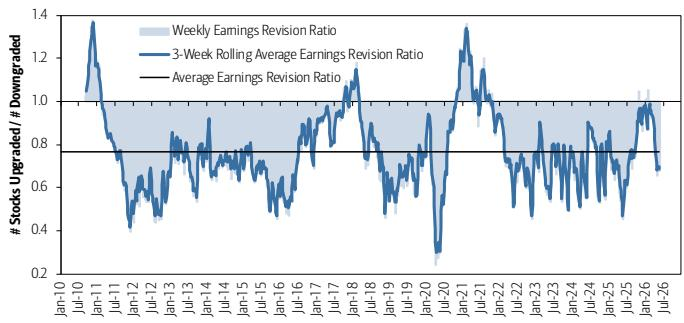

line

| Date    | Weekly Earnings Revision Ratio | 3-Week Rolling Average Earnings Revision Ratio | Average Earnings Revision Ratio |
|---------|----------------------------------|--------------------------------------------------|--------------------------------|
| Jan-10  | 1.0                              | 1.0                                              | 1.0                            |
| Jul-10  | 1.3                              | 1.3                                              | 1.3                            |
| Jan-11  | 0.8                              | 0.8                                              | 0.8                            |
| Jul-11  | 0.6                              | 0.6                                              | 0.6                            |
| Jan-12  | 0.5                              | 0.5                                              | 0.5                            |
| Jul-12  | 0.7                              | 0.7                                              | 0.7                            |
| Jan-13  | 0.8                              | 0.8                                              | 0.8                            |
| Jul-13  | 0.9                              | 0.9                                              | 0.9                            |
| Jan-14  | 1.0                              | 1.0                                              | 1.0                            |
| Jul-14  | 1.1                              | 1.1                                              | 1.1                            |
| Jan-15  | 1.0                              | 1.0                                              | 1.0                            |
| Jul-15  | 0.9                              | 0.9                                              | 0.9                            |
| Jan-16  | 0.8                              | 0.8                                              | 0.8                            |
| Jul-16  | 0.7                              | 0.7                                              | 0.7                            |
| Jan-17  | 0.6                              | 0.6                                              | 0.6                            |
| Jul-17  | 0.5                              | 0.5                                              | 0.5                            |
| Jan-18  | 0.4                              | 0.4                                              | 0.4                            |
| Jul-18  | 0.3                              | 0.3                                              | 0.3                            |
| Jan-19  | 0.2                              | 0.2                                              | 0.2                            |
| Jul-19  | 0.3                              | 0.3                                              | 0.3                            |
| Jan-20  | 0.4                              | 0.4                                              | 0.4                            |
| Jul-20  | 0.5                              | 0.5                                              | 0.5                            |
| Jan-21  | 0.6                              | 0.6                                              | 0.6                            |
| Jul-21  | 0.7                              | 0.7                                              | 0.7                            |
| Jan-22  | 0.8                              | 0.8                                              | 0.8                            |
| Jul-22  | 0.9                              | 0.9                                              | 0.9                            |
| Jan-23  | 1.0                              | 1.0                                              | 1.0                            |
| Jul-23  | 1.1                              | 1.1                                              | 1.1                            |
| Jan-24  | 1.2                              | 1.2                                              | 1.2                            |
| Jul-24  | 1.3                              | 1.3                                              | 1.3                            |
| Jan-25  | 1.4                              | 1.4                                              | 1.4                            |
| Jul-25  | 1.3                              | 1.3                                              | 1.3                            |
| Jan-26  | 1.2                              | 1.2                                              | 1.2                            |
| Jul-26  | 1.1                              | 1.1                                              | 1.1                            |

Source : BofA Global Quantitative Strategy, MSCI, IBES   
BofA GLOBAL RESEARCH

Chart 24: Asia Pac Countries Earnings Revision Ratio - Weekly   
Earnings Revision Ratio is strongest in Taiwan   
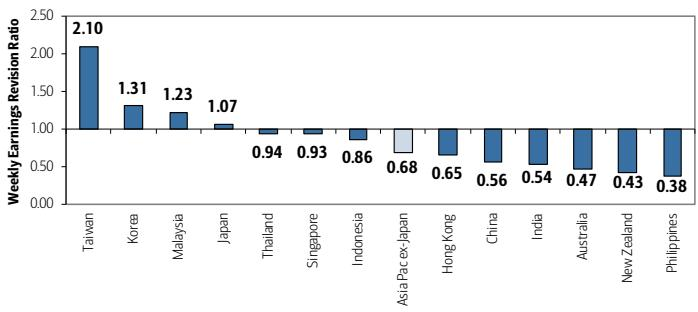

bar

| Country/Region | Weekly Earnings Revision Ratio |
| :--- | :--- |
| Taiwan | 2.10 |
| Korea | 1.31 |
| Malaysia | 1.23 |
| Japan | 1.07 |
| Thailand | 0.94 |
| Singapore | 0.93 |
| Indonesia | 0.86 |
| Asia Pac ex-Japan | 0.68 |
| Hong Kong | 0.65 |
| China | 0.56 |
| India | 0.54 |
| Australia | 0.47 |
| New Zealand | 0.43 |
| Philippines | 0.38 |

Source : BofA Global Quantitative Strategy, MSCI, IBES   
BofA GLOBAL RESEARCH

Chart 26: Asia Pac Sectors Earnings Revision Ratio - Weekly   
Earnings Revision Ratio is strongest in Energy sector   
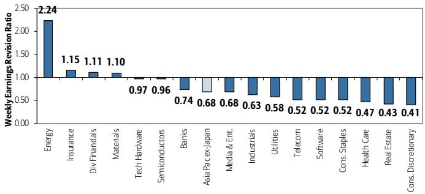

bar

| Sector | Weekly Earnings Revision Ratio |
| --- | --- |
| Energy | 2.24 |
| Insurance | 1.15 |
| Div.Financials | 1.11 |
| Materials | 1.10 |
| Tech Hardware | 0.97 |
| Semiconductors | 0.96 |
| Banks | 0.74 |
| Asia Pacific ex Japan | 0.68 |
| Media & Ent. | 0.68 |
| Industrials | 0.63 |
| Utilities | 0.58 |
| Telecom | 0.52 |
| Software | 0.52 |
| Cons. Staples | 0.52 |
| Health Care | 0.47 |
| Real Estate | 0.43 |
| Cons. Discretionary | 0.41 |

Source : BofA Global Quantitative Strategy, MSCI, IBES   
BofA GLOBAL RESEARCH

Table 2: Global Region/Sector/Style - Earnings Revision Ratio

Earnings revisions improved for World last week and remains above long-term average

<table><tr><td>Regions/Sectors</td><td>Feb-26</td><td>Mar-26</td><td>Apr-26</td><td>May-26 - Wk1</td><td>May-26 - Wk2</td><td>May-26 - Wk3</td><td>May-26 - Wk4</td></tr><tr><td>World</td><td>0.97</td><td>0.98</td><td>0.76</td><td>0.76</td><td>0.89</td><td>0.89</td><td>0.91</td></tr><tr><td>USA</td><td>1.07</td><td>1.13</td><td>0.77</td><td>0.92</td><td>1.30</td><td>1.66</td><td>1.80</td></tr><tr><td>Europe</td><td>0.70</td><td>0.75</td><td>0.66</td><td>0.63</td><td>0.80</td><td>0.82</td><td>0.81</td></tr><tr><td>Japan</td><td>1.38</td><td>1.63</td><td>1.15</td><td>1.20</td><td>1.13</td><td>1.11</td><td>1.07</td></tr><tr><td>Asia Pac ex-Japan</td><td>0.94</td><td>0.90</td><td>0.69</td><td>0.65</td><td>0.73</td><td>0.67</td><td>0.68</td></tr><tr><td>Emerging Markets</td><td>0.91</td><td>0.85</td><td>0.70</td><td>0.66</td><td>0.77</td><td>0.68</td><td>0.69</td></tr><tr><td>Global - Banks</td><td>1.74</td><td>1.19</td><td>0.80</td><td>0.80</td><td>1.13</td><td>1.01</td><td>0.92</td></tr><tr><td>Global - Cons. Discretionary</td><td>0.82</td><td>0.63</td><td>0.44</td><td>0.45</td><td>0.53</td><td>0.59</td><td>0.60</td></tr><tr><td>Global - Cons. Staples</td><td>0.76</td><td>0.81</td><td>0.54</td><td>0.51</td><td>0.67</td><td>0.65</td><td>0.68</td></tr><tr><td>Global - Div Financials</td><td>1.19</td><td>1.43</td><td>0.79</td><td>0.81</td><td>0.92</td><td>1.06</td><td>1.27</td></tr><tr><td>Global - Energy</td><td>0.61</td><td>1.98</td><td>2.88</td><td>2.82</td><td>1.80</td><td>2.13</td><td>2.20</td></tr><tr><td>Global - Health Care</td><td>0.79</td><td>0.72</td><td>0.68</td><td>0.64</td><td>0.80</td><td>0.78</td><td>0.76</td></tr><tr><td>Global - Industrials</td><td>1.00</td><td>0.93</td><td>0.71</td><td>0.70</td><td>0.84</td><td>0.86</td><td>0.87</td></tr><tr><td>Global - Insurance</td><td>1.09</td><td>1.33</td><td>1.03</td><td>0.90</td><td>0.79</td><td>0.91</td><td>0.95</td></tr><tr><td>Global - Materials</td><td>1.00</td><td>1.16</td><td>1.01</td><td>1.04</td><td>1.09</td><td>0.98</td><td>1.03</td></tr><tr><td>Global - Media &amp; Ent.</td><td>0.65</td><td>1.11</td><td>0.72</td><td>0.71</td><td>0.94</td><td>0.79</td><td>0.82</td></tr><tr><td>Global - Real Estate</td><td>0.79</td><td>0.93</td><td>0.53</td><td>0.60</td><td>0.84</td><td>0.88</td><td>0.86</td></tr><tr><td>Global - Semiconductors</td><td>1.33</td><td>1.31</td><td>0.90</td><td>1.13</td><td>1.61</td><td>1.46</td><td>1.37</td></tr><tr><td>Global - Software</td><td>1.45</td><td>1.24</td><td>0.93</td><td>0.76</td><td>0.89</td><td>1.04</td><td>1.04</td></tr><tr><td>Global - Tech Hardware</td><td>1.48</td><td>1.52</td><td>1.38</td><td>1.40</td><td>1.39</td><td>1.19</td><td>1.38</td></tr><tr><td>Global - Telecom</td><td>0.79</td><td>0.62</td><td>0.60</td><td>0.65</td><td>0.98</td><td>0.96</td><td>0.92</td></tr><tr><td>Global - Utilities</td><td>0.94</td><td>0.83</td><td>0.82</td><td>0.80</td><td>0.88</td><td>0.85</td><td>0.78</td></tr><tr><td>Global - Value</td><td>0.78</td><td>0.98</td><td>0.68</td><td>0.61</td><td>0.78</td><td>0.68</td><td>0.78</td></tr><tr><td>Global - Growth</td><td>1.84</td><td>1.57</td><td>1.06</td><td>1.20</td><td>1.57</td><td>2.00</td><td>1.77</td></tr><tr><td>Global - Quality</td><td>1.18</td><td>1.15</td><td>0.82</td><td>0.83</td><td>1.29</td><td>1.35</td><td>1.73</td></tr><tr><td>Global - Risk</td><td>1.71</td><td>1.49</td><td>1.21</td><td>1.18</td><td>1.55</td><td>1.72</td><td>1.81</td></tr><tr><td>Global - Momentum</td><td>2.40</td><td>2.05</td><td>1.57</td><td>2.00</td><td>2.17</td><td>2.30</td><td>2.19</td></tr><tr><td>Global - Dividend</td><td>0.95</td><td>1.02</td><td>0.88</td><td>0.77</td><td>1.13</td><td>0.95</td><td>0.98</td></tr><tr><td>Global - Small Size</td><td>0.97</td><td>0.90</td><td>0.74</td><td>0.69</td><td>0.88</td><td>0.87</td><td>1.03</td></tr></table>

Source : BofA Global Quantitative Strategy, MSCI, IBES   
The first three columns show monthly Earnings Revision Ratio for global regions, sectors, and styles. It uses IBES consensus earnings estimates and is a Ratio of the number of stocks for which consensus earnings estimates have been upgraded to number downgraded each month. The weekly data shows the trend in earnings expectations and is the same Ratio calculated over month-to-date time-period.

BofA GLOBAL RESEARCH

# Quantessential Styles: Earnings Revision Ratio

Chart 27: Global Value Earnings Revision Ratio - Weekly (2011 to latest)   
Earnings trend improved in Value in the last three weeks   
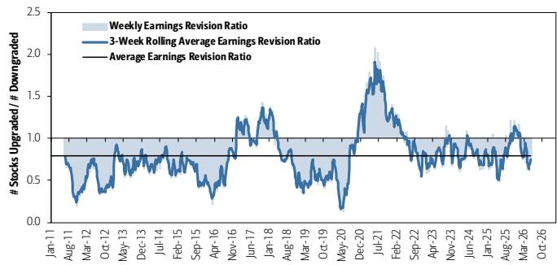

line

| Date    | Weekly Earnings Revision Ratio | 3-Week Rolling Average Earnings Revision Ratio | Average Earnings Revision Ratio |
|---------|----------------------------------|--------------------------------------------------|---------------------------------|
| Jan-11  | ~0.9                             | ~0.8                                             | ~0.9                            |
| Aug-11  | ~0.9                             | ~0.7                                             | ~0.9                            |
| Mar-12  | ~0.9                             | ~0.6                                             | ~0.9                            |
| Oct-12  | ~0.9                             | ~0.7                                             | ~0.9                            |
| May-13  | ~0.9                             | ~0.8                                             | ~0.9                            |
| Dec-13  | ~0.9                             | ~0.7                                             | ~0.9                            |
| Jul-14  | ~0.9                             | ~0.8                                             | ~0.9                            |
| Feb-15  | ~0.9                             | ~0.7                                             | ~0.9                            |
| Sep-15  | ~0.9                             | ~0.6                                             | ~0.9                            |
| Apr-16  | ~0.9                             | ~0.5                                             | ~0.9                            |
| Nov-16  | ~0.9                             | ~0.7                                             | ~0.9                            |
| Jun-17  | ~1.0                             | ~0.8                                             | ~0.9                            |
| Jan-18  | ~1.0                             | ~0.9                                             | ~0.9                            |
| Aug-18  | ~1.0                             | ~1.0                                             | ~0.9                            |
| Mar-19  | ~1.0                             | ~0.8                                             | ~0.9                            |
| Oct-19  | ~1.0                             | ~0.7                                             | ~0.9                            |
| May-20  | ~1.0                             | ~0.6                                             | ~0.9                            |
| Dec-20  | ~1.5                             | ~1.8                                             | ~1.5                            |
| Jul-21  | ~2.0                             | ~2.2                                             | ~2.0                            |
| Feb-22  | ~1.5                             | ~1.8                                             | ~1.5                            |
| Sep-22  | ~1.5                             | ~1.7                                             | ~1.5                            |
| Apr-23  | ~1.5                             | ~1.6                                             | ~1.5                            |
| Nov-23  | ~1.5                             | ~1.5                                             | ~1.5                            |
| Jun-24  | ~1.5                             | ~1.4                                             | ~1.5                            |
| Jan-25  | ~1.5                             | ~1.3                                             | ~1.5                            |
| Aug-25  | ~1.5                             | ~1.2                                             | ~1.5                            |
| Mar-26  | ~1.5                             | ~1.1                                             | ~1.5                            |
| Oct-26  | ~1.5                             | ~1.0                                             | ~1.5                            |

Source : BofA Global Quantitative Strategy, MSCI, IBES, S&P, Worldscope, Bloomberg   
BofA GLOBAL RESEARCH

Chart 29: Global Quality Earnings Revision Ratio - Weekly (2011 to latest)   
Earnings revisions improved in Quality last week   
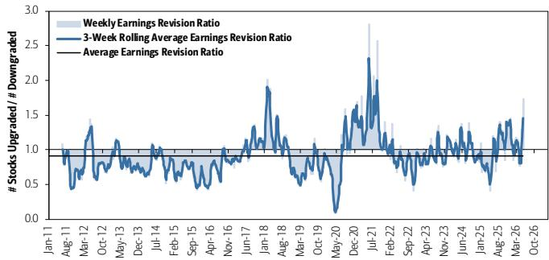

line

| Date    | Weekly Earnings Revision Ratio | 3-Week Rolling Average Earnings Revision Ratio | Average Earnings Revision Ratio |
|---------|----------------------------------|--------------------------------------------------|--------------------------------|
| Jan-11  | 1.0                              | 1.0                                              | 1.0                            |
| Aug-11  | 1.0                              | 1.0                                              | 1.0                            |
| Mar-12  | 1.0                              | 1.0                                              | 1.0                            |
| Oct-12  | 1.0                              | 1.0                                              | 1.0                            |
| May-13  | 1.0                              | 1.0                                              | 1.0                            |
| Dec-13  | 1.0                              | 1.0                                              | 1.0                            |
| Jul-14  | 1.0                              | 1.0                                              | 1.0                            |
| Feb-15  | 1.0                              | 1.0                                              | 1.0                            |
| Sep-15  | 1.0                              | 1.0                                              | 1.0                            |
| Apr-16  | 1.0                              | 1.0                                              | 1.0                            |
| Nov-16  | 1.0                              | 1.0                                              | 1.0                            |
| Jun-17  | 1.0                              | 1.0                                              | 1.0                            |
| Jan-18  | 1.0                              | 1.0                                              | 1.0                            |
| Aug-18  | 1.0                              | 1.0                                              | 1.0                            |
| Mar-19  | 1.0                              | 1.0                                              | 1.0                            |
| Oct-19  | 1.0                              | 1.0                                              | 1.0                            |
| May-20  | 1.0                              | 1.0                                              | 1.0                            |
| Dec-20  | 1.0                              | 1.0                                              | 1.0                            |
| Jul-21  | 2.5                              | 2.5                                              | 2.5                            |
| Feb-22  | 2.5                              | 2.5                                              | 2.5                            |
| Sep-22  | 2.5                              | 2.5                                              | 2.5                            |
| Apr-23  | 2.5                              | 2.5                                              | 2.5                            |
| Nov-23  | 2.5                              | 2.5                                              | 2.5                            |
| Jun-24  | 2.5                              | 2.5                                              | 2.5                            |
| Jan-25  | 2.5                              | 2.5                                              | 2.5                            |
| Aug-25  | 2.5                              | 2.5                                              | 2.5                            |
| Mar-26  | 2.5                              | 2.5                                              | 2.5                            |
| Oct-26  | 2.5                              | 2.5                                              | 2.5                            |

Source : BofA Global Quantitative Strategy, MSCI, IBES, S&P, Worldscope, Bloomberg   
BofA GLOBAL RESEARCH

Chart 28: Global Growth Earnings Revision Ratio - Weekly (2011 to latest)   
Earnings revision moderated in Growth last week but remains above average   
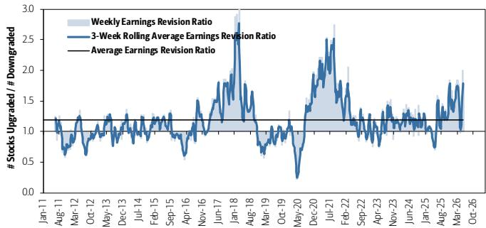

line

| Date     | Weekly Earnings Revision Ratio | 3-Week Rolling Average Earnings Revision Ratio | Average Earnings Revision Ratio |
|----------|----------------------------------|--------------------------------------------------|---------------------------------|
| Jan-11   | ~1.0                             | ~1.0                                             | ~1.0                            |
| Aug-11   | ~1.0                             | ~1.0                                             | ~1.0                            |
| Mar-12   | ~1.0                             | ~1.0                                             | ~1.0                            |
| Oct-12   | ~1.0                             | ~1.0                                             | ~1.0                            |
| May-13   | ~1.0                             | ~1.0                                             | ~1.0                            |
| Dec-13   | ~1.0                             | ~1.0                                             | ~1.0                            |
| Jul-14   | ~1.0                             | ~1.0                                             | ~1.0                            |
| Feb-15   | ~1.0                             | ~1.0                                             | ~1.0                            |
| Sep-15   | ~1.0                             | ~1.0                                             | ~1.0                            |
| Apr-16   | ~1.0                             | ~1.0                                             | ~1.0                            |
| Nov-16   | ~1.0                             | ~1.0                                             | ~1.0                            |
| Jun-17   | ~1.0                             | ~1.0                                             | ~1.0                            |
| Jan-18   | ~2.5                             | ~2.5                                             | ~2.5                            |
| Aug-18   | ~2.5                             | ~2.5                                             | ~2.5                            |
| Mar-19   | ~2.5                             | ~2.5                                             | ~2.5                            |
| Oct-19   | ~2.5                             | ~2.5                                             | ~2.5                            |
| May-20   | ~2.5                             | ~2.5                                             | ~2.5                            |
| Dec-20   | ~2.5                             | ~2.5                                             | ~2.5                            |
| Jul-21   | ~2.5                             | ~2.5                                             | ~2.5                            |
| Feb-22   | ~2.5                             | ~2.5                                             | ~2.5                            |
| Sep-22   | ~2.5                             | ~2.5                                             | ~2.5                            |
| Apr-23   | ~2.5                             | ~2.5                                             | ~2.5                            |
| Nov-23   | ~2.5                             | ~2.5                                             | ~2.5                            |
| Jun-24   | ~2.5                             | ~2.5                                             | ~2.5                            |
| Jan-25   | ~2.5                             | ~2.5                                             | ~2.5                            |
| Aug-25   | ~2.5                             | ~2.5                                             | ~2.5                            |
| Mar-26   | ~2.5                             | ~2.5                                             | ~2.5                            |
| Oct-26   | ~2.5                             | ~2.5                                             | ~2.5                            |

Source : BofA Global Quantitative Strategy, MSCI, IBES, S&P, Worldscope, Bloomberg   
BofA GLOBAL RESEARCH

Chart 30: Global Risk Earnings Revision Ratio - Weekly (2011 to latest)   
Earnings revisions improved for Risk last week and remains above long-term average   
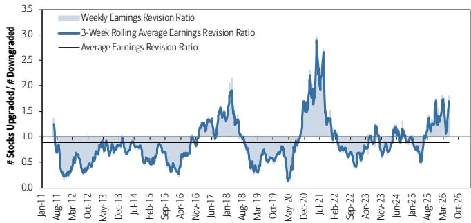

line

| Date    | Weekly Earnings Revision Ratio | 3-Week Rolling Average Earnings Revision Ratio | Average Earnings Revision Ratio |
|---------|----------------------------------|--------------------------------------------------|--------------------------------|
| Jan-11  | ~1.0                             | ~1.0                                             | 1.0                            |
| Aug-11  | ~0.5                             | ~0.5                                             | 1.0                            |
| Mar-12  | ~0.8                             | ~0.8                                             | 1.0                            |
| Oct-12  | ~0.7                             | ~0.7                                             | 1.0                            |
| May-13  | ~0.9                             | ~0.9                                             | 1.0                            |
| Dec-13  | ~0.8                             | ~0.8                                             | 1.0                            |
| Jul-14  | ~0.7                             | ~0.7                                             | 1.0                            |
| Feb-15  | ~0.6                             | ~0.6                                             | 1.0                            |
| Sep-15  | ~0.5                             | ~0.5                                             | 1.0                            |
| Apr-16  | ~0.4                             | ~0.4                                             | 1.0                            |
| Nov-16  | ~0.6                             | ~0.6                                             | 1.0                            |
| Jun-17  | ~0.8                             | ~0.8                                             | 1.0                            |
| Jan-18  | ~1.2                             | ~1.2                                             | 1.0                            |
| Aug-18  | ~0.9                             | ~0.9                                             | 1.0                            |
| Mar-19  | ~0.7                             | ~0.7                                             | 1.0                            |
| Oct-19  | ~0.5                             | ~0.5                                             | 1.0                            |
| May-20  | ~0.3                             | ~0.3                                             | 1.0                            |
| Dec-20  | ~2.2                             | ~2.2                                             | 1.0                            |
| Jul-21  | ~2.8                             | ~2.8                                             | 1.0                            |
| Feb-22  | ~1.5                             | ~1.5                                             | 1.0                            |
| Sep-22  | ~0.8                             | ~0.8                                             | 1.0                            |
| Apr-23  | ~0.9                             | ~0.9                                             | 1.0                            |
| Nov-23  | ~1.0                             | ~1.0                                             | 1.0                            |
| Jun-24  | ~1.2                             | ~1.2                                             | 1.0                            |
| Jan-25  | ~0.6                             | ~0.6                                             | 1.0                            |
| Aug-25  | ~1.5                             | ~1.5                                             | 1.0                            |
| Mar-26  | ~1.8                             | ~1.8                                             | 1.0                            |
| Oct-26  | ~1.6                             | ~1.6                                             | 1.0                            |

Source : BofA Global Quantitative Strategy, MSCI, IBES, S&P, Worldscope, Bloomberg   
BofA GLOBAL RESEARCH

Chart 31: Global Momentum Earnings Revision Ratio - Weekly (2011 to latest)   
Earning revisions fell in Momentum last week but remains above 1.0   
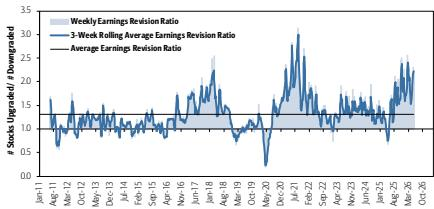  
Source : BofA Global Quantitative Strategy, MSCI, IBES, S&P, Worldscope, Bloomberg   
BofA GLOBAL RESEARCH

Chart 32: Global Dividend Earnings Revision Ratio - Weekly (2011 to latest)   
Earnings revisions improved in Dividend last week   
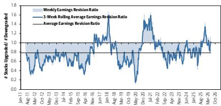  
Source : BofA Global Quantitative Strategy, MSCI, IBES, S&P, Worldscope, Bloomberg   
BofA GLOBAL RESEARCH

Chart 33: Global Small Size Earnings Revision Ratio - Weekly (2011 to latest)   
Earnings revisions improved for Small Size last week and remains above long-term average   
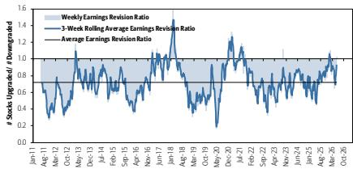  
Source : BofA Global Quantitative Strategy, MSCI, IBES, S&P, Worldscope, Bloomberg   
BofA GLOBAL RESEARCH

# NewsAlpha

Chart 34: Global News Pulse (last 30 days) since 2019   
Global News Pulse improved last week   
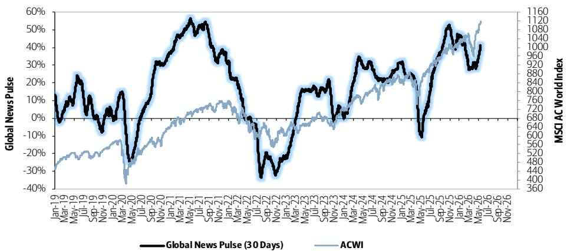

line

| Date    | Global News Pulse (30 Days) | MSCI AC World Index |
|---------|-----------------------------|---------------------|
| Jan-19  | ~0%                         | ~360                |
| Mar-19  | ~25%                        | ~480                |
| May-19  | ~10%                        | ~560                |
| Jul-19  | ~5%                         | ~640                |
| Sep-19  | ~15%                        | ~720                |
| Nov-19  | ~10%                        | ~800                |
| Jan-20  | ~-30%                       | ~920                |
| Mar-20  | ~-25%                       | ~1040               |
| May-20  | ~-30%                       | ~1120               |
| Jul-20  | ~-20%                       | ~1160               |
| Sep-20  | ~30%                        | ~1160               |
| Nov-20  | ~45%                        | ~1160               |
| Jan-21  | ~55%                        | ~1160               |
| Mar-21  | ~55%                        | ~1160               |
| May-21  | ~55%                        | ~1160               |
| Jul-21  | ~55%                        | ~1160               |
| Sep-21  | ~55%                        | ~1160               |
| Nov-21  | ~55%                        | ~1160               |
| Jan-22  | ~55%                        | ~1160               |
| Mar-22  | ~55%                        | ~1160               |
| May-22  | ~55%                        | ~1160               |
| Jul-22  | ~55%                        | ~1160               |
| Sep-22  | ~55%                        | ~1160               |
| Nov-22  | ~55%                        | ~1160               |
| Jan-23  | ~55%                        | ~1160               |
| Mar-23  | ~55%                        | ~1160               |
| May-23  | ~55%                        | ~1160               |
| Jul-23  | ~55%                        | ~1160               |
| Sep-23  | ~55%                        | ~1160               |
| Nov-23  | ~55%                        | ~1160               |
| Jan-24  | ~55%                        | ~1160               |
| Mar-24  | ~55%                        | ~1160               |
| May-24  | ~55%                        | ~1160               |
| Jul-24  | ~55%                        | ~1160               |
| Sep-24  | ~55%                        | ~1160               |
| Nov-24  | ~55%                        | ~1160               |
| Jan-25  | ~55%                        | ~1160               |
| Mar-25  | ~55%                        | ~1160               |
| May-25  | ~55%                        | ~1160               |
| Jul-25  | ~55%                        | ~1160               |
| Sep-25  | ~55%                        | ~1160               |
| Nov-25  | ~55%                        | ~1160               |
| Jan-26  | ~55%                        | ~1160               |
| Mar-26  | ~55%                        | ~1160               |
| May-26  | ~55%                        | ~1160               |
| Jul-26  | ~55%                        | ~1160               |
| Sep-26  | ~55%                        | ~1160               |
| Nov-26  | ~55%                        | ~1160               |

Source : BofA Global Quantitative Strategy, MSCI, Ravenpack   
BofA GLOBAL RESEARCH

Chart 35: Global News Pulse (180-days) and Global News Pulse (last 30 days) since 2004   
Global News Pulse, based on the last 30 days, has improved MTD   
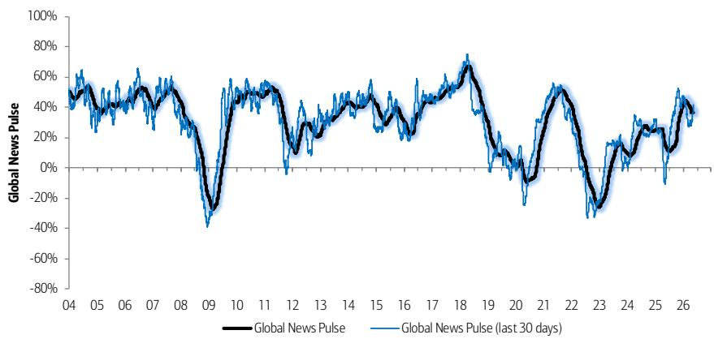

line

| Year | Global News Pulse | Global News Pulse (last 30 days) |
|------|-------------------|----------------------------------|
| 04   | ~50%              | ~50%                             |
| 05   | ~45%              | ~45%                             |
| 06   | ~50%              | ~50%                             |
| 07   | ~55%              | ~55%                             |
| 08   | ~40%              | ~40%                             |
| 09   | ~-30%             | ~-30%                            |
| 10   | ~50%              | ~50%                             |
| 11   | ~55%              | ~55%                             |
| 12   | ~30%              | ~30%                             |
| 13   | ~40%              | ~40%                             |
| 14   | ~45%              | ~45%                             |
| 15   | ~40%              | ~40%                             |
| 16   | ~35%              | ~35%                             |
| 17   | ~45%              | ~45%                             |
| 18   | ~70%              | ~70%                             |
| 19   | ~60%              | ~60%                             |
| 20   | ~-20%             | ~-20%                            |
| 21   | ~50%              | ~50%                             |
| 22   | ~-30%             | ~-30%                            |
| 23   | ~-20%             | ~-20%                            |
| 24   | ~20%              | ~20%                             |
| 25   | ~30%              | ~30%                             |
| 26   | ~40%              | ~40%                             |

Source : BofA Global Quantitative Strategy, MSCI, Ravenpack   
BofA GLOBAL RESEARCH

Chart 36: Global News Pulse and YoY Change in MSCI AC World Index since 2004   
News trend improved month to date   
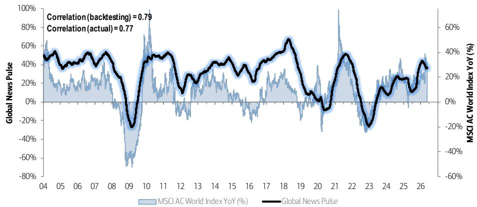

line

| Year | Global News Pulse YoY (%) | MSCI AC World Index YoY (%) |
|------|---------------------------|------------------------------|
| 04   | ~50%                      | ~40%                         |
| 05   | ~45%                      | ~35%                         |
| 06   | ~40%                      | ~30%                         |
| 07   | ~35%                      | ~25%                         |
| 08   | ~30%                      | ~20%                         |
| 09   | ~-60%                     | ~-40%                        |
| 10   | ~80%                      | ~60%                         |
| 11   | ~50%                      | ~40%                         |
| 12   | ~40%                      | ~30%                         |
| 13   | ~30%                      | ~20%                         |
| 14   | ~25%                      | ~15%                         |
| 15   | ~20%                      | ~10%                         |
| 16   | ~15%                      | ~5%                          |
| 17   | ~20%                      | ~0%                          |
| 18   | ~60%                      | ~40%                         |
| 19   | ~50%                      | ~30%                         |
| 20   | ~30%                      | ~15%                         |
| 21   | ~50%                      | ~40%                         |
| 22   | ~40%                      | ~30%                         |
| 23   | ~-30%                     | ~-20%                        |
| 24   | ~20%                      | ~15%                         |
| 25   | ~30%                      | ~25%                         |
| 26   | ~40%                      | ~35%                         |

Source : BofA Global Quantitative Strategy, MSCI, Ravenpack   
BofA GLOBAL RESEARCH

Chart 37: Global Regions: Latest News Pulse   
GEM has the strongest News Pulse, while Europe has the lowest Pulse   
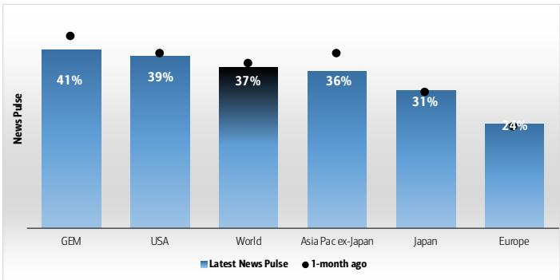

bar

| Region           | Latest News Pulse |
| ---------------- | ------------------ |
| GEM              | 41%                |
| USA              | 39%                |
| World            | 37%                |
| Asia Pac ex-Japan| 36%                |
| Japan            | 31%                |
| Europe           | 24%                |

Source : BofA Global Quantitative Strategy, MSCI, Ravenpack   
BofA GLOBAL RESEARCH

Chart 39: Inflation News Pulse vs. Global CPI (since 2004)   
Inflation News Pulse leads Global CPI by 68 days with correlation of 71%   
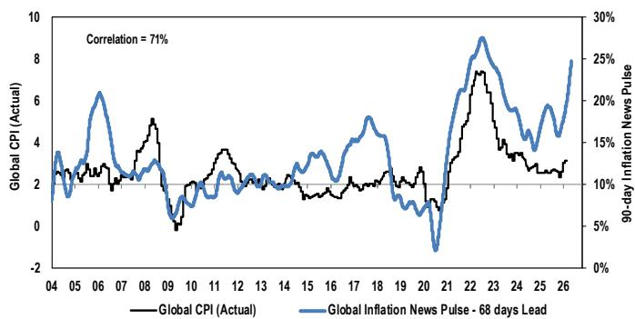

line

| Year | Global CPI (Actual) | Global Inflation News Pulse - 68 days Lead |
|------|---------------------|---------------------------------------------|
| 04   | ~3.5                | ~10                                         |
| 05   | ~3.0                | ~12                                         |
| 06   | ~6.5                | ~15                                         |
| 07   | ~3.0                | ~10                                         |
| 08   | ~5.0                | ~12                                         |
| 09   | ~0.5                | ~5                                          |
| 10   | ~2.0                | ~10                                         |
| 11   | ~3.5                | ~12                                         |
| 12   | ~3.0                | ~10                                         |
| 13   | ~2.5                | ~12                                         |
| 14   | ~2.0                | ~10                                         |
| 15   | ~2.5                | ~12                                         |
| 16   | ~3.0                | ~15                                         |
| 17   | ~4.0                | ~18                                         |
| 18   | ~5.0                | ~20                                         |
| 19   | ~3.0                | ~15                                         |
| 20   | ~-1.0               | ~5                                          |
| 21   | ~7.0                | ~25                                         |
| 22   | ~8.0                | ~28                                         |
| 23   | ~7.5                | ~25                                         |
| 24   | ~4.0                | ~15                                         |
| 25   | ~3.0                | ~18                                         |
| 26   | ~3.5                | ~25                                         |

Source : BofA Global Quantitative Strategy, MSCI, Ravenpack   
BofA GLOBAL RESEARCH

Chart 38: Global Sectors: Latest News Pulse   
Energy has the strongest News Pulse, while Comm. Serv has the lowest Pulse   
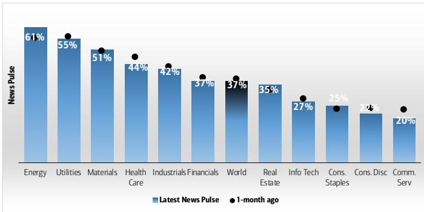

bar

| Sector          | Latest News Pulse |
| --------------- | ------------------ |
| Energy          | 61%                |
| Utilities       | 55%                |
| Materials       | 51%                |
| Health Care     | 44%                |
| Industrials     | 42%                |
| Financials      | 37%                |
| World           | 37%                |
| Real Estate     | 35%                |
| Info Tech       | 27%                |
| Cons. Staples   | 25%                |
| Cons. Disc      | 22%                |
| Comm. Serv      | 20%                |

Source : BofA Global Quantitative Strategy, MSCI, Ravenpack   
BofA GLOBAL RESEARCH

Chart 40: Inflation News Pulse vs. USA CPI (since 2004)   
Inflation News Pulse leads USA CPI by 15 days with correlation of 72%   
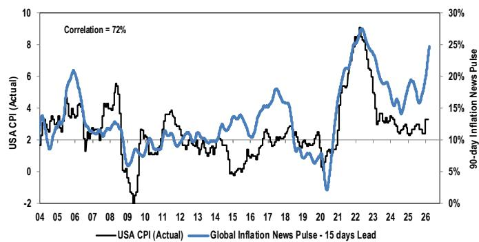

line

| Year | USA CPI (Actual) | Global Inflation News Pulse - 15 days Lead |
|------|------------------|---------------------------------------------|
| 04   | ~3.5             | ~10%                                        |
| 05   | ~3.0             | ~15%                                        |
| 06   | ~4.0             | ~20%                                        |
| 07   | ~2.5             | ~10%                                        |
| 08   | ~5.0             | ~15%                                        |
| 09   | ~-2.0            | ~5%                                         |
| 10   | ~2.0             | ~10%                                        |
| 11   | ~3.5             | ~15%                                        |
| 12   | ~3.0             | ~10%                                        |
| 13   | ~2.5             | ~15%                                        |
| 14   | ~2.0             | ~10%                                        |
| 15   | ~1.5             | ~15%                                        |
| 16   | ~2.0             | ~20%                                        |
| 17   | ~3.0             | ~25%                                        |
| 18   | ~2.5             | ~20%                                        |
| 19   | ~2.0             | ~15%                                        |
| 20   | ~-1.0            | ~5%                                         |
| 21   | ~6.0             | ~25%                                        |
| 22   | ~9.0             | ~30%                                        |
| 23   | ~8.0             | ~25%                                        |
| 24   | ~4.0             | ~15%                                        |
| 25   | ~3.0             | ~20%                                        |
| 26   | ~3.5             | ~25%                                        |

Source : BofA Global Quantitative Strategy, MSCI, Ravenpack   
BofA GLOBAL RESEARCH

Chart 41: Top News Mentions (last 30 days) across Company, Organization, People, Place, Product   
News was dominated by Apple, Alphabet, Meta, Ford F-Series, ChatGPT, and Nintendo Switch   
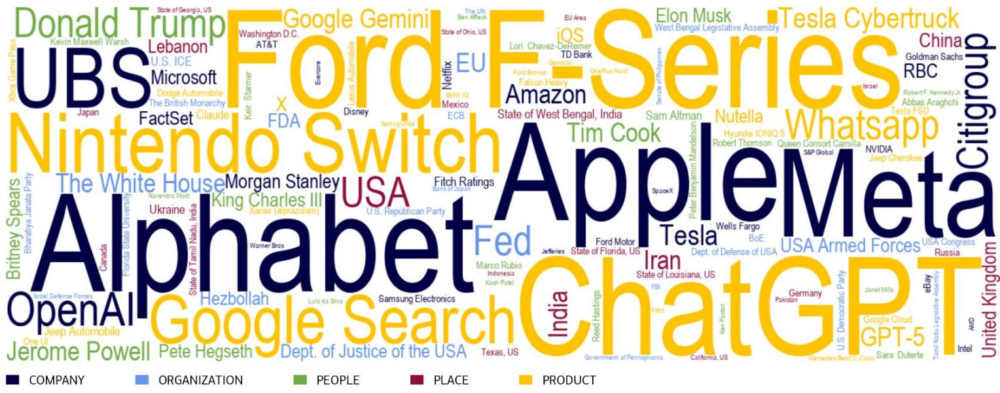

word_cloud

| Company | Company Name | Category | Description |
|---------|---------------|----------|-------------|
| Alphabet Meta | AppleGPT | Product | State of Georgia, US |
| Alphabet Meta | Alphabet | Organization | State of Georgia, US |
| Alphabet Meta | Alphabet | People | USA |
| Alphabet Meta | Alphabet | Place | USA |
| Alphabet Meta | Alphabet | Organization | USA |
| Alphabet Meta | Alphabet | People | USA |
| Alphabet Meta | Alphabet | People | USA |
| Alphabet Meta | Alphabet | People | USA |
| Alphabet Meta | Alphabet | People | USA |
| Alphabet Meta | Alphabet | People | USA |
| Alphabet Meta | Alphabet | People | USA |
| Alphabet Meta | Alphabet | People | USA |
| Alphabet Meta | Alphabet | People | USA |
| Alphabet Meta | Alphabet | People | USA |
| Alphabet Meta | Alphabet | People | USA |
| Alphabet Meta | Alphabet | Enterprise | State of Georgia, US |
| Alphabet Meta | Alphabet | Enterprise | State of Georgia, US |
| Alphabet Meta | Alphabet | Enterprise | State of Georgia, US |
| Alphabet Meta | Alphabet | Enterprise | State of Georgia, US |
| Alphabet Meta | Alphabet | Enterprise | State of Georgia, US |
| Alphabet Meta | Alphabet | Enterprise | State of Georgia, US |
| Alphabet Meta | Alphabet | Enterprise | State of Georgia, US |
| Alphabet Meta | Alphabet | Enterprise | State of Georgia, US |
|
| Alphabet Meta | Alphabet | Enterprise | State of Georgia, US |
| Alphabet Meta | Alphabet | Enterprise | State of Georgia, US |
| Alphabet Meta | Alphabet | Enterprise | State of Georgia, US |
| Alphabet Meta | Alphabet | Enterprise | State of Georgia, US |
| Alphabet Meta | Alphabet | Enterprise | State of Georgia, US |
| Alphabet Meta | Alphabet | Enterprise | State of Georgia, US |
| Alphabet Meta | Alphabet | Enterprise | State of Georgia, US |
| AppleGPT - Microsoft (USA) - Google (Gemini) - Ford F Series - Intel (Citi Group) - Amazon - Tesla (Cybertruck) - Tesla (Cybertruck) - Tesla (Cybertruck) - Tesla (Cybertruck) - Tesla (Cybertruck) - Tesla (Cybertruck) - Tesla (Cybertruck) - Tesla (Cybertruck) - Tesla (Cybertruck) - Tesla (Cybertruck) - Tesla (Cybertruck) - Tesla (Cybertruck) - Tesla (Cybertruck) - Tesla (Cybertruck) - Tesla (Cybertruck) - China (GS) - RBC - Israel - Robert F. Kennedy Jr. - Abbas Araghchi - Tesla FSD - Tesla FSD - Tesla FSD - Tesla FSD - Tesla FSD - Tesla FSD - Tesla FSD - Tesla FSD - Tesla FSD - Tesla FSD - Tesla FSD - Tesla FSD - Tesla FSD - Tesla FSD - Tesla FSD - Tesla FSD - Tesla FSD - Tesla FSD - Tesla FSD - Tesla FSD - Tesla FSD - Tesla FSD - Tesla FSD - Tesla FSD - Tesla FSD - Tesla FSC - Tesla FSC - Tesla FSC - Tesla FSC - Tesla FSC - Tesla FSC - Tesla FSC - Tesla FSC - Tesla FSC - Tesla FSC - Tesla FSC - Tesla FSC - Tesla FSC - Tesla FSC - Tesla FSC - Tesla FSC - Tesla FSC - Tesla FSC - Tesla FSC - Tesla FSC - Tesla FSC - Tesla FSC - Tesla FSC - Tesla FSC - Tesla FSC - Tesla FSc - Tesla FSC - Tesla FSC - Tesla FSC - Tesla FSC - Tesla FSC - Tesla FSC - Tesla FSC - Tesla FSC - Tesla FSC - Tesla FSC - Tesla FSC - Tesla FSC - Tesla FSC - Tesla FSC - Tesla FSC - Tesla FSC - Tesla FSC - TeslaFSC - TeslaFSC - TeslaFSC - TeslaFSC - TeslaFSC - TeslaFSC - TeslaFSC - TeslaFSC - TeslaFSC - TeslaFSC - TeslaFSC - TeslaFSC - TeslaFSC - TeslaFSC - TeslaFSC - TeslaFSC - TeslaFSC - TeslaFSC - TeslaFSC - TeslaFSC - TeslaFSC - TeslaFSC - TeslaFSC - TeslaFSC - TeslaFSC - TeslaTFC- TESPA (Chrysler-DeRemer) / TESPA (Chrysler-DeRemer) / TESPA (Chrysler-DeRemer) / TESPA (Chrysler-DeRemer) / TESPA (Chrysler-DeRemer) / TESPA (Chrysler-DeRemer) / TESPA (Chrysler-DeRemer) / TESPA (Chrysler-DeRemer) / TESPA (Chrysler-DeRemer) / TESPA(Chrysler-DeRemer) / TESPA(Chrysler-DeRemer) / TESPA(Chrysler-DeRemer) / TESPA(Chrysler-DeRemer) / TESPA(Chrysler-DeRemer) / TESPA(Chrysler-DeRemer) / TESPA(Chrysler-DeRemer) / TESPA(Chrysler-DeRemer) / TESPA(Chrysler-Deferred) / TESPA(Chrysler-Deferred) / TESPA(Chrysler-Deferred) / TESPA(Chrysler-Deferred) / TESPA(Chrysler-Deferred) / TESPA(Chrysler-Deferred) / TESPA(Chrysler-Deferred) / TESPA(Chrysler-Deferred) / TESPA(Chrysler-Deferred) / TESPA(Chrysler-Deferred) / TESPA(Chrysler-Commercial) / TESPA(Chrysler-Commercial) / TESPA(Chrysler-Commercial) / TESPA(Chrysler-Commercial) / TESPA(Chrysler-Commercial) / TESPA(Chrysler-Commercial) / TESPA(Chrysler-Commercial) / TESPA(Chrysler-Commercial) / TESPA(Chrysler-Commercial) / TESPA(Chrysler-Commercial) / TESPA(Chrysler-Consumer Goods & Apparel) / TESPA(Chrysler-Consumer Goods & Apparel) / TESPA(Chrysler-Consumer Goods & Apparel) / TESPA(Chrysler-Consumer Goods & Apparel) / TESPA(Chrysler-Consumer Goods & Apparel) / TESPA(Chrysler-Consumer Goods & Apparel) / TESPA(Chrysler-Consumer Goods & Apparel) / TESPA(Chrysler-Consumer Goods & Apparel) / TESPA(Chrysler-Centerline Products & Equipment) / TESPA(Chrysler-Centerline Products & Equipment) / TESPA(Chrysler-Centerline Products & Equipment) / TESPA(Chrysler-Centerline Products & Equipment) / TESPA(Chrysler-Centerline Products & Equipment) / TESPA(Chrysler-Centerline Products & Equipment) / TESPA(Chrysler-Centerline Products & Equipment) / TESPA(Chrysler-Centerline Products & Equipment) // Other Companies are listed in the legend. The company is a large group of companies. The company is an organization or enterprise. Note: Legend indicates company type, organization type, people type, place type, and product type.

Source : BofA Global Quantitative Strategy, RavenPack   
BofA GLOBAL RESEARCH

Chart 42: Current News Pulse by Global Countries   
News aggregate is highest in Mexico and Taiwan   
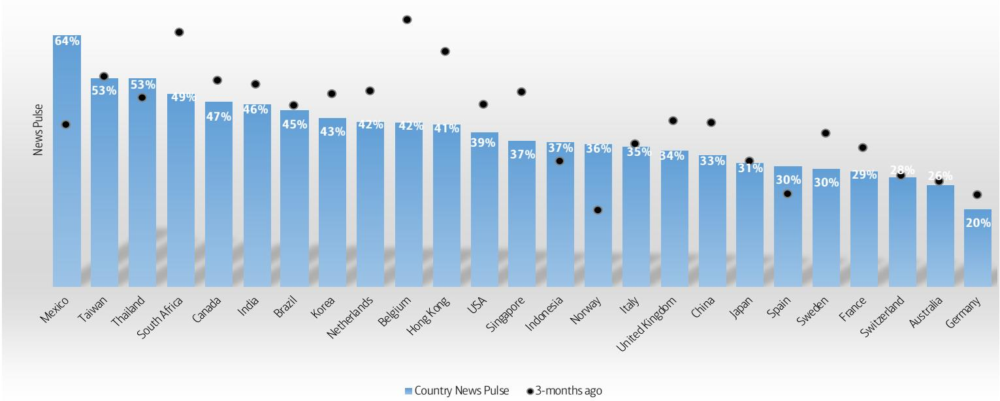

bar_line

| Country | Country News Pulse (%) | 3-months ago (dots) |
| :--- | :--- | :--- |
| Mexico | 64 | 10 |
| Taiwan | 53 | 12 |
| Thailand | 53 | 9 |
| South Africa | 49 | 15 |
| Canada | 47 | 13 |
| India | 46 | 12 |
| Brazil | 45 | 11 |
| Korea | 43 | 10 |
| Netherlands | 42 | 11 |
| Belgium | 42 | 18 |
| Hong Kong | 41 | 14 |
| USA | 39 | 10 |
| Singapore | 37 | 12 |
| Indonesia | 37 | 8 |
| Norway | 36 | 3 |
| Italy | 35 | 10 |
| United Kingdom | 34 | 12 |
| China | 33 | 11 |
| Japan | 31 | 9 |
| Spain | 30 | 6 |
| Sweden | 30 | 10 |
| France | 29 | 9 |
| Switzerland | 28 | 8 |
| Australia | 26 | 7 |
| Germany | 20 | 6 |

Source : BofA Global Quantitative Strategy, MSCI, ExShare, RavenPack   
BofA GLOBAL RESEARCH

# Tactical Indicators

Chart 43: Trough signals by the Market Trough Monitor vs. MSCI AC World (since 1996)   
The most recent trough signal from the Market Trough Monitor was triggered on 01-Oct-24   
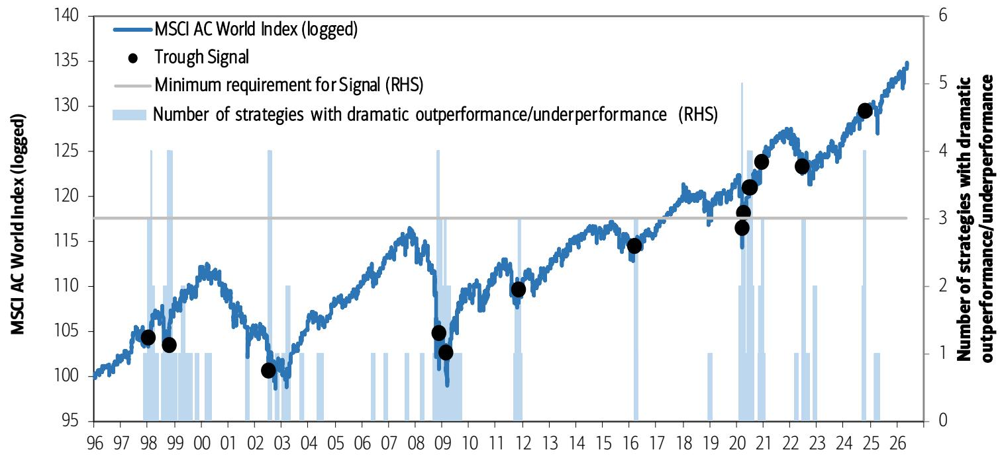

bar_line

| Year | MSCI AC World Index (logged) | Number of strategies with dramatic outperformance/underperformance |
|------|------------------------------|---------------------------------------------------------------|
| 98   | 105                          | 1.0                                                           |
| 99   | 104                          | 1.0                                                           |
| 00   | 112                          | 1.0                                                           |
| 01   | 108                          | 1.0                                                           |
| 02   | 105                          | 1.0                                                           |
| 03   | 100                          | 1.0                                                           |
| 04   | 107                          | 1.0                                                           |
| 05   | 109                          | 1.0                                                           |
| 06   | 111                          | 1.0                                                           |
| 07   | 113                          | 1.0                                                           |
| 08   | 116                          | 1.0                                                           |
| 09   | 105                          | 1.0                                                           |
| 10   | 108                          | 1.0                                                           |
| 11   | 112                          | 1.0                                                           |
| 12   | 110                          | 1.0                                                           |
| 13   | 113                          | 1.0                                                           |
| 14   | 115                          | 1.0                                                           |
| 15   | 117                          | 1.0                                                           |
| 16   | 115                          | 1.0                                                           |
| 17   | 120                          | 1.0                                                           |
| 18   | 122                          | 1.0                                                           |
| 19   | 124                          | 1.0                                                           |
| 20   | 126                          | 1.0                                                           |
| 21   | 128                          | 1.0                                                           |
| 22   | 127                          | 1.0                                                           |
| 23   | 125                          | 1.0                                                           |
| 24   | 128                          | 1.0                                                           |
| 25   | 130                          | 1.0                                                           |
| 26   | 135                          | 1.0                                                           |

Source : BofA Global Quantitative Strategy, MSCI, Ravenpack, IBES, Worldscope, Exshare, S&P, Bloomberg   
The Market Trough Monitor identified in this report is intended to be an indicative metric only and may not be used for reference purposes or as a measure of performance for any financial instrument or contract, or otherwise relied upon by third parties for any other purpose, without the prior written consent of BofA Global Research. The Monitor was not created as a benchmark.

BofA GLOBAL RESEARCH

# Chart 44: MSCI AC World performance before & after trough signals from Market Trough Monitor

ACWI averaged 28% in 12 months after the Market Trough Monitor triggered a trough signal

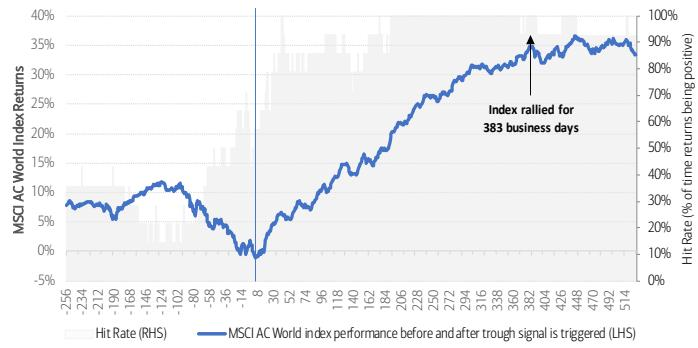

line

| Date       | MSCI AC World Index Returns | Hit Rate (% of time returns being positive) |
| ---------- | ---------------------------- | ------------------------------------------ |
| 383 business days | 383                          | 90%                                        |

Source : BofA Global Quantitative Strategy, MSCI, Ravenpack, IBES, Worldscope, Exshare, S&P,   
Bloomberg   
Historical analysis is for the period from Jan-96 to Nov-23.

BofA GLOBAL RESEARCH

Table 3: Trough signals from the Market Trough Monitor and subsequent MSCI AC World performance

After MTS triggered, MSCI AC World Index averaged 28% returns in the subsequent 12 months

<table><tr><td>Signal Dates</td><td>Subs 1-month MSCI AC World Index returns</td><td>Subs 3-months MSCI AC World Index returns</td><td>Subs 6-months MSCI AC World Index returns</td><td>Subs 1-year MSCI AC World Index returns</td></tr><tr><td>1-Oct-24</td><td>-1.6%</td><td>-0.5%</td><td>-4.5%</td><td>17.8%</td></tr><tr><td>24-Jun-22</td><td>-0.1%</td><td>-8.5%</td><td>-1.2%</td><td>10.3%</td></tr><tr><td>10-Dec-20</td><td>4.3%</td><td>6.9%</td><td>14.3%</td><td>17.6%</td></tr><tr><td>10-Jul-20</td><td>4.1%</td><td>9.2%</td><td>21.8%</td><td>33.6%</td></tr><tr><td>8-Jun-20</td><td>-0.6%</td><td>3.5%</td><td>16.0%</td><td>32.3%</td></tr><tr><td>15-Apr-20</td><td>2.3%</td><td>16.9%</td><td>24.8%</td><td>49.1%</td></tr><tr><td>12-Mar-20</td><td>8.8%</td><td>20.6%</td><td>33.6%</td><td>58.3%</td></tr><tr><td>7-Mar-16</td><td>1.6%</td><td>5.4%</td><td>9.5%</td><td>15.0%</td></tr><tr><td>9-Nov-11</td><td>-0.1%</td><td>8.7%</td><td>4.4%</td><td>6.7%</td></tr><tr><td>13-Feb-09</td><td>-6.5%</td><td>13.8%</td><td>27.3%</td><td>39.5%</td></tr><tr><td>10-Nov-08</td><td>-4.3%</td><td>-9.4%</td><td>0.1%</td><td>27.1%</td></tr><tr><td>22-Jul-02</td><td>9.7%</td><td>1.1%</td><td>1.0%</td><td>15.0%</td></tr><tr><td>8-Oct-98</td><td>15.8%</td><td>30.3%</td><td>36.0%</td><td>35.3%</td></tr><tr><td>22-Jan-98</td><td>7.5%</td><td>14.4%</td><td>15.2%</td><td>20.5%</td></tr><tr><td>Average</td><td>2.9%</td><td>8.0%</td><td>14.2%</td><td>27.0%</td></tr><tr><td>Hit Rate (Pos Returns)</td><td>57%</td><td>79%</td><td>86%</td><td>100%</td></tr></table>

Source : BofA Global Quantitative Strategy, MSCI, Ravenpack, IBES, Worldscope, Exshare, S&P, Bloomberg   
Historical analysis is for the period from Jan-96 to Nov-23.

BofA GLOBAL RESEARCH

Chart 45: Copper (Spot), weekly last 2 years   
Copper price fell (-0.1%)   
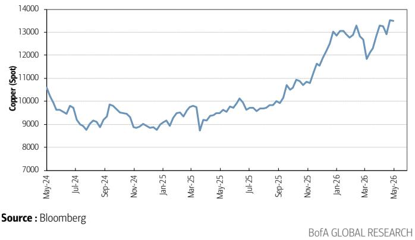

line

| Date   | Copper (Spot) |
|--------|---------------|
| May-24 | 10500         |
| Jul-24 | 9500          |
| Sep-24 | 9800          |
| Nov-24 | 9000          |
| Jan-25 | 8800          |
| Mar-25 | 9800          |
| May-25 | 9500          |
| Jul-25 | 10000         |
| Sep-25 | 10500         |
| Nov-25 | 11000         |
| Jan-26 | 13000         |
| Mar-26 | 12000         |
| May-26 | 13500         |

Chart 47: US Initial jobless claims, weekly last 2 years

US initial jobless claims increased by +12,000 to 211,000   
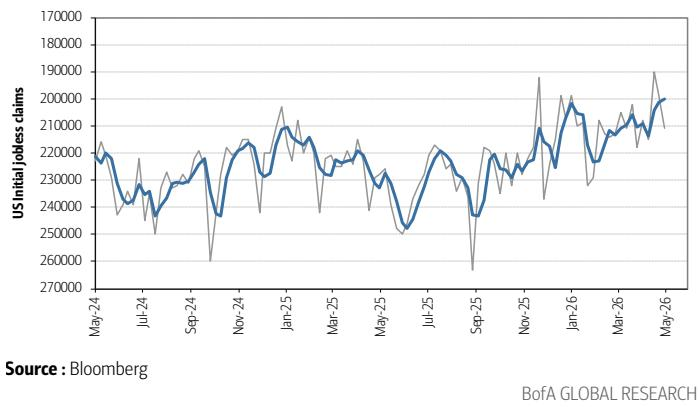

line

| Date   | US Initial Jobless Claims |
|--------|----------------------------|
| May-24 | 220000                     |
| Jul-24 | 230000                     |
| Sep-24 | 240000                     |
| Nov-24 | 250000                     |
| Jan-25 | 260000                     |
| Mar-25 | 240000                     |
| May-25 | 230000                     |
| Jul-25 | 250000                     |
| Sep-25 | 260000                     |
| Nov-25 | 240000                     |
| Jan-26 | 230000                     |
| Mar-26 | 250000                     |
| May-26 | 260000                     |

Chart 49: Global Credit Spreads, weekly 2 years

Global credit spreads narrowed (-5 bps)   
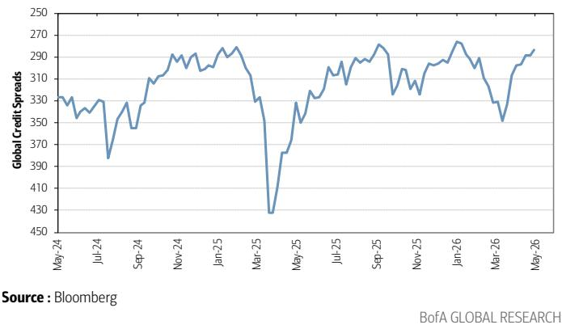

line

| Date   | Global Credit Spreads |
|--------|------------------------|
| May-24 | 330                    |
| Jul-24 | 390                    |
| Sep-24 | 350                    |
| Nov-24 | 310                    |
| Jan-25 | 290                    |
| Mar-25 | 430                    |
| May-25 | 370                    |
| Jul-25 | 310                    |
| Sep-25 | 290                    |
| Nov-25 | 310                    |
| Jan-26 | 270                    |
| Mar-26 | 350                    |
| May-26 | 310                    |

Chart 46: AUD-USD cross rate, weekly last 2 years   
AUD depreciated (-1.3%)   
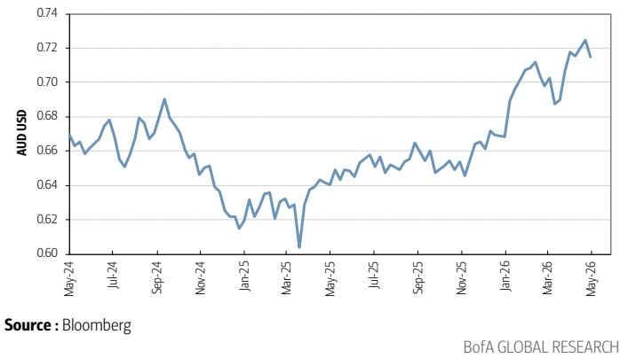

line

| Date   | AUD USD |
|--------|---------|
| May-24 | 0.67    |
| Jul-24 | 0.68    |
| Sep-24 | 0.69    |
| Nov-24 | 0.65    |
| Jan-25 | 0.63    |
| Mar-25 | 0.61    |
| May-25 | 0.64    |
| Jul-25 | 0.65    |
| Sep-25 | 0.66    |
| Nov-25 | 0.65    |
| Jan-26 | 0.68    |
| Mar-26 | 0.71    |
| May-26 | 0.73    |

Chart 48: VIX (inverted), weekly last 2 years

VIX moved from 17.2 to 18.4   
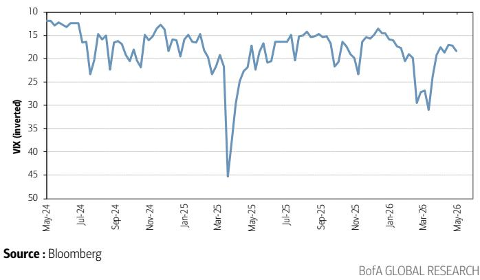

line

| Date   | VIX (inverted) |
|--------|----------------|
| May-24 | 10             |
| Jul-24 | 15             |
| Sep-24 | 10             |
| Nov-24 | 15             |
| Jan-25 | 10             |
| Mar-25 | 45             |
| May-25 | 20             |
| Jul-25 | 15             |
| Sep-25 | 15             |
| Nov-25 | 10             |
| Jan-26 | 15             |
| Mar-26 | 30             |
| May-26 | 15             |

Chart 50: Global Cycle Sensitives, weekly returns 2 year

Global Cycle Sensitives underperformed (-2.2%)   
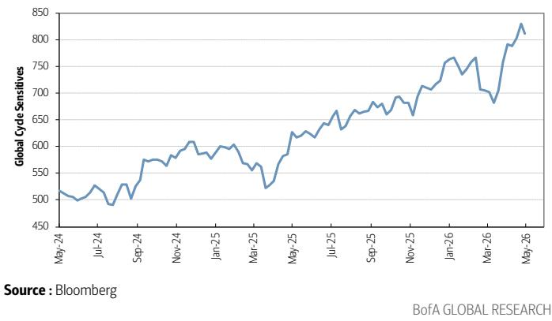

line

| Date   | Global Cycle Sensitives |
|--------|--------------------------|
| May-24 | 500                      |
| Jul-24 | 520                      |
| Sep-24 | 580                      |
| Nov-24 | 600                      |
| Jan-25 | 590                      |
| Mar-25 | 530                      |
| May-25 | 620                      |
| Jul-25 | 660                      |
| Sep-25 | 680                      |
| Nov-25 | 700                      |
| Jan-26 | 760                      |
| Mar-26 | 700                      |
| May-26 | 830                      |

# Commodities

Chart 51: Hard Commodities - Last week change   
Crude Oil increased the most last week   
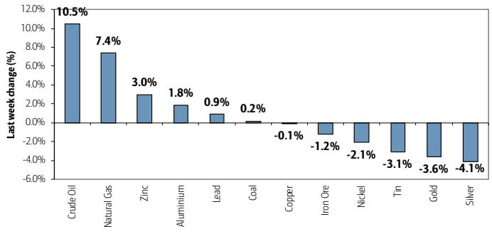

bar

| Commodity | Last week change (%) |
| :--- | :--- |
| Crude Oil | 10.5 |
| Natural Gas | 7.4 |
| Zinc | 3.0 |
| Aluminium | 1.8 |
| Lead | 0.9 |
| Coal | 0.2 |
| Copper | -0.1 |
| Iron Ore | -1.2 |
| Nickel | -2.1 |
| Tin | -3.1 |
| Gold | -3.6 |
| Silver | -4.1 |

Source : Bloomberg   
BofA GLOBAL RESEARCH

Chart 53: Hard Commodities - MTD change   
Nickel fell the most MTD   
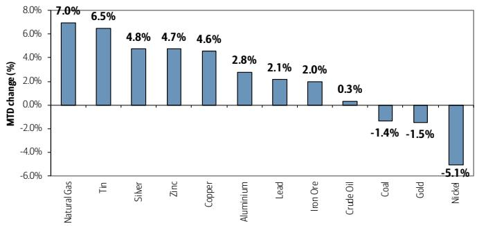

bar

| Commodity | MTD change (%) |
| :--- | :--- |
| Natural Gas | 7.0 |
| Tin | 6.5 |
| Silver | 4.8 |
| Zinc | 4.7 |
| Copper | 4.6 |
| Aluminium | 2.8 |
| Lead | 2.1 |
| Iron Ore | 2.0 |
| Crude Oil | 0.3 |
| Coal | -1.4 |
| Gold | -1.5 |
| Nickel | -5.1 |

Source : Bloomberg   
BofA GLOBAL RESEARCH

Chart 55: Hard Commodities - YTD change   
Natural Gas fell the most YTD   
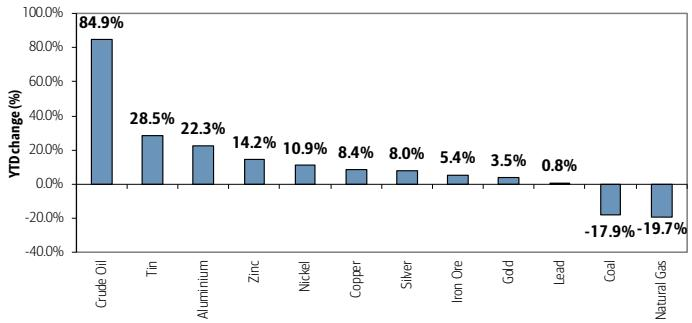

bar

| Commodity | YTD change (%) |
| :--- | :--- |
| Crude Oil | 84.9 |
| Tin | 28.5 |
| Aluminium | 22.3 |
| Zinc | 14.2 |
| Nickel | 10.9 |
| Copper | 8.4 |
| Silver | 8.0 |
| Iron Ore | 5.4 |
| Gold | 3.5 |
| Lead | 0.8 |
| Coal | -17.9 |
| Natural Gas | -19.7 |

Source : Bloomberg   
BofA GLOBAL RESEARCH

Chart 52: Soft Commodities - Last week change   
Rice increased the most last week   
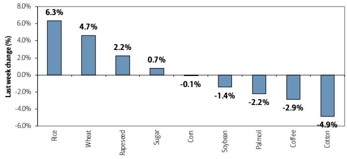

bar

| Commodity | Last week change (%) |
| :--- | :--- |
| Rice | 6.3 |
| Wheat | 4.7 |
| Rapeseed | 2.2 |
| Sugar | 0.7 |
| Corn | -0.1 |
| Soybean | -1.4 |
| Palmoil | -2.2 |
| Coffee | -2.9 |
| Cotton | -4.9 |

Source : Bloomberg   
BofA GLOBAL RESEARCH

Chart 54: Soft Commodities - MTD change   
Rice increased the most MTD   
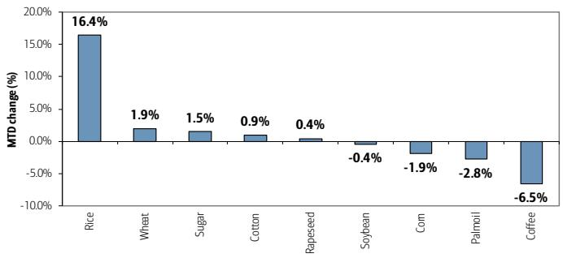

bar

| Commodity | MTD change (%) |
| :--- | :--- |
| Rice | 16.4 |
| Wheat | 1.9 |
| Sugar | 1.5 |
| Cotton | 0.9 |
| Rapeseed | 0.4 |
| Soybean | -0.4 |
| Corn | -1.9 |
| Palmoil | -2.8 |
| Coffee | -6.5 |

Source : Bloomberg   
BofA GLOBAL RESEARCH

Chart 56: Soft Commodities - YTD change   
Rice increased the most YTD   
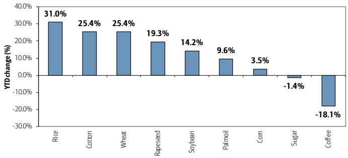

bar

| Commodity | YTD change (%) |
| :--- | :--- |
| Rice | 31.0 |
| Cotton | 25.4 |
| Wheat | 25.4 |
| Rapeseed | 19.3 |
| Soybean | 14.2 |
| Palm Oil | 9.6 |
| Corn | 3.5 |
| Sugar | -1.4 |
| Coffee | -18.1 |

Source : Bloomberg   
BofA GLOBAL RESEARCH

# Volatility

Chart 57: USA Volatility (VIX Index) - Inverted (last 2-years)   
VIX Index moved from 17.2 to 18.4   
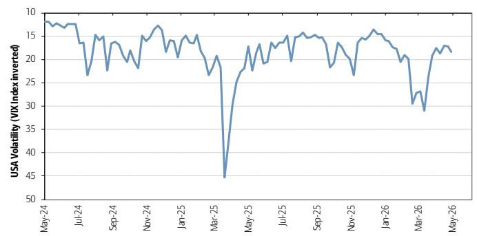

line

| Date   | USA Volatility (VIX Index inverted) |
|--------|-------------------------------------|
| May-24 | 10                                  |
| Jul-24 | 15                                  |
| Sep-24 | 18                                  |
| Nov-24 | 16                                  |
| Jan-25 | 14                                  |
| Mar-25 | 45                                  |
| May-25 | 20                                  |
| Jul-25 | 15                                  |
| Sep-25 | 16                                  |
| Nov-25 | 14                                  |
| Jan-26 | 16                                  |
| Mar-26 | 30                                  |
| May-26 | 12                                  |

Source : Bloomberg   
BofA GLOBAL RESEARCH

Chart 59: Japan Volatility (VNKY Index) - Inverted (last 2-years)   
VNKY Index moved from 34.2 to 29.7   
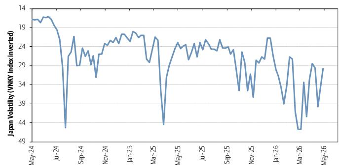

line

| Date   | Japan Volatility (VNKY Index inverted) |
|--------|----------------------------------------|
| May-24 | 13.5                                   |
| Jul-24 | 13.8                                   |
| Sep-24 | 28.0                                   |
| Nov-24 | 24.0                                   |
| Jan-25 | 27.0                                   |
| Mar-25 | 25.0                                   |
| May-25 | 24.0                                   |
| Jul-25 | 26.0                                   |
| Sep-25 | 24.0                                   |
| Nov-25 | 28.0                                   |
| Jan-26 | 25.0                                   |
| Mar-26 | 30.0                                   |
| May-26 | 29.0                                   |

Source : Bloomberg   
BofA GLOBAL RESEARCH

Chart 61: Hong Kong Volatility (VHSI Index) - Inverted (last 2-years)   
VHSI Index moved from 21.6 to 21.0   
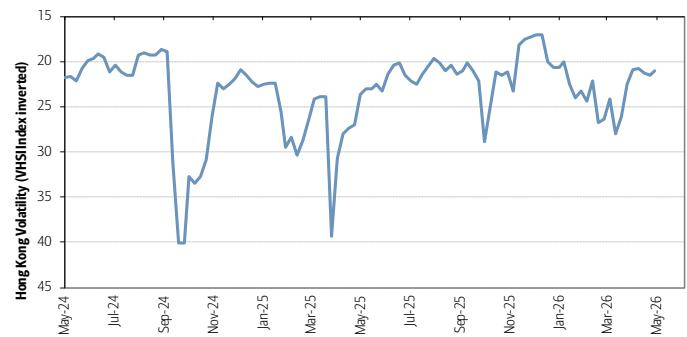

line

| Date   | Hong Kong Volatility (VHSI Index inverted) |
|--------|-------------------------------------------|
| May-24 | 18.0                                      |
| Jul-24 | 20.0                                      |
| Sep-24 | 21.0                                      |
| Nov-24 | 37.0                                      |
| Jan-25 | 27.0                                      |
| Mar-25 | 40.0                                      |
| May-25 | 26.0                                      |
| Jul-25 | 29.0                                      |
| Sep-25 | 31.0                                      |
| Nov-25 | 28.0                                      |
| Jan-26 | 23.0                                      |
| Mar-26 | 25.0                                      |
| May-26 | 19.0                                      |

Source : Bloomberg   
BofA GLOBAL RESEARCH

Chart 58: Europe Volatility (V2X Index) - Inverted (last 2-years)   
V2X Index moved from 22.4 to 22.3   
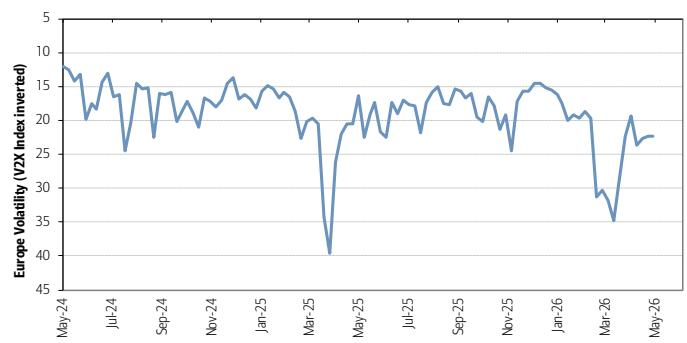

line

| Date   | Europe Volatility (V2X Index inverted) |
|--------|------------------------------------------|
| May-24 | 17.0                                     |
| Jul-24 | 15.0                                     |
| Sep-24 | 14.0                                     |
| Nov-24 | 16.0                                     |
| Jan-25 | 15.0                                     |
| Mar-25 | 18.0                                     |
| May-25 | 40.0                                     |
| Jul-25 | 14.0                                     |
| Sep-25 | 15.0                                     |
| Nov-25 | 16.0                                     |
| Jan-26 | 15.0                                     |
| Mar-26 | 35.0                                     |
| May-26 | 27.0                                     |

Source : Bloomberg   
BofA GLOBAL RESEARCH

Chart 60: Emerging Markets Volatility (VXEEM Index) - Inverted (last 2-years)   
VXEEM Index moved from 27.0 to 32.6   
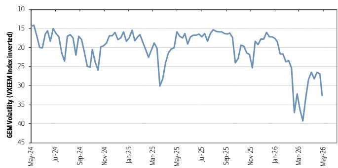

line

| Date   | GEM Volatility (VXEM Index inverted) |
|--------|--------------------------------------|
| May-24 | 15                                   |
| Jul-24 | 14                                   |
| Sep-24 | 13                                   |
| Nov-24 | 14                                   |
| Jan-25 | 13                                   |
| Mar-25 | 30                                   |
| May-25 | 14                                   |
| Jul-25 | 14                                   |
| Sep-25 | 14                                   |
| Nov-25 | 13                                   |
| Jan-26 | 14                                   |
| Mar-26 | 40                                   |
| May-26 | 38                                   |

Source : Bloomberg   
BofA GLOBAL RESEARCH

Chart 62: Korea Volatility (VKOSPI Index) - Inverted (last 2-years)   
VKOSPI Index moved from 60.5 to 74.7   
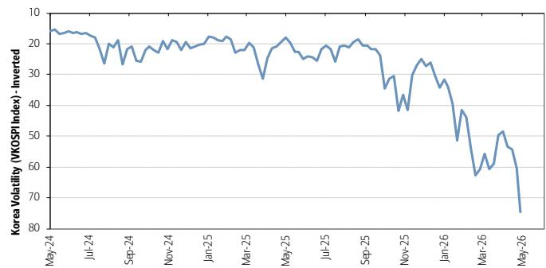

line

| Date   | Korea Volatility (VKOSPI Index) - Inverted |
|--------|---------------------------------------------|
| May-24 | 20                                          |
| Jul-24 | 20                                          |
| Sep-24 | 15                                          |
| Nov-24 | 18                                          |
| Jan-25 | 20                                          |
| Mar-25 | 18                                          |
| May-25 | 20                                          |
| Jul-25 | 18                                          |
| Sep-25 | 20                                          |
| Nov-25 | 30                                          |
| Jan-26 | 40                                          |
| Mar-26 | 50                                          |
| May-26 | 70                                          |

Source : Bloomberg   
BofA GLOBAL RESEARCH

# Fed

Chart 63: Market Implied Fed rate path   
17 bps of hikes expected till the end of 2026   
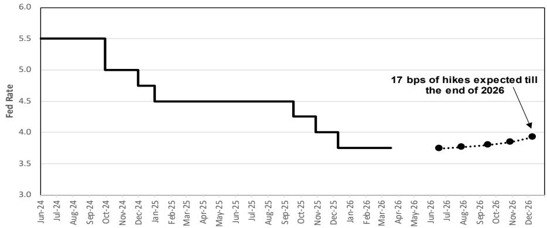

line

| Date     | Fed Rate |
| -------- | -------- |
| Jun-24   | 5.5      |
| Jul-24   | 5.5      |
| Aug-24   | 5.0      |
| Sep-24   | 4.8      |
| Oct-24   | 4.5      |
| Nov-24   | 4.5      |
| Dec-24   | 4.5      |
| Jan-25   | 4.5      |
| Feb-25   | 4.5      |
| Mar-25   | 4.5      |
| Apr-25   | 4.5      |
| May-25   | 4.5      |
| Jun-25   | 4.5      |
| Jul-25   | 4.5      |
| Aug-25   | 4.5      |
| Sep-25   | 4.0      |
| Oct-25   | 4.0      |
| Nov-25   | 3.8      |
| Dec-25   | 3.8      |
| Jan-26   | 3.8      |
| Feb-26   | 3.8      |
| Mar-26   | 3.8      |
| Apr-26   | 3.8      |
| May-26   | 3.8      |
| Jun-26   | 3.8      |
| Jul-26   | 3.8      |
| Aug-26   | 3.8      |
| Sep-26   | 3.8      |
| Oct-26   | 3.8      |
| Nov-26   | 3.8      |
| Dec-26   | 3.9      |

Source : Bloomberg   
BofA GLOBAL RESEARCH

Chart 64: US Federal Reserve Total Assets (in US\$ bn) since 2003   
Last week, Fed Reserve's balance sheet expanded by US\$29bn   
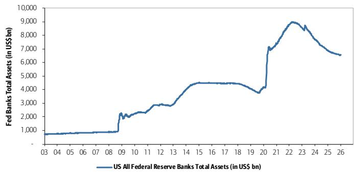

line

| Year | Fed Banks Total Assets (in US$ bn) |
| ---- | ---------------------------------- |
| 03   | 800                                |
| 04   | 850                                |
| 05   | 900                                |
| 06   | 950                                |
| 07   | 1000                               |
| 08   | 1050                               |
| 09   | 2200                               |
| 10   | 2500                               |
| 11   | 2800                               |
| 12   | 3000                               |
| 13   | 3500                               |
| 14   | 4200                               |
| 15   | 4500                               |
| 16   | 4500                               |
| 17   | 4500                               |
| 18   | 4500                               |
| 19   | 4200                               |
| 20   | 3800                               |
| 21   | 7000                               |
| 22   | 9000                               |
| 23   | 8500                               |
| 24   | 7500                               |
| 25   | 7000                               |
| 26   | 6500                               |

Source : Bloomberg   
BofA GLOBAL RESEARCH

Chart 65: US Federal Reserve Assets Expansion / Reduction (US\$ bn) - last we months   
Last month, Fed expanded the balance sheet by US\$ 25bn   
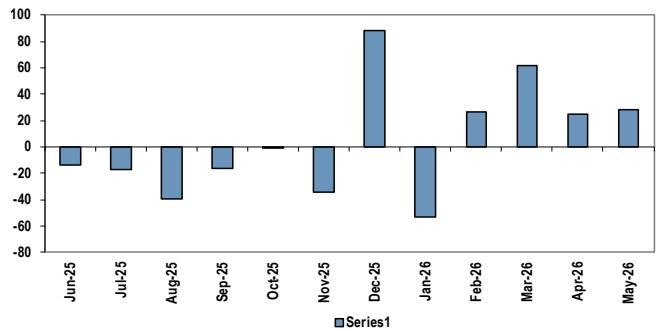

bar

| Month | Series1 |
|---|---|
| Jun-25 | -10 |
| Jul-25 | -15 |
| Aug-25 | -40 |
| Sep-25 | -10 |
| Oct-25 | -5 |
| Nov-25 | -35 |
| Dec-25 | 85 |
| Jan-26 | -55 |
| Feb-26 | 25 |
| Mar-26 | 60 |
| Apr-26 | 20 |
| May-26 | 25 |

Source : Bloomberg   
BofA GLOBAL RESEARCH

# Rates

Chart 66: USA 10-year Bond Yield since Jan-20   
US 10-year yield up by 24 bps to 4.59%   
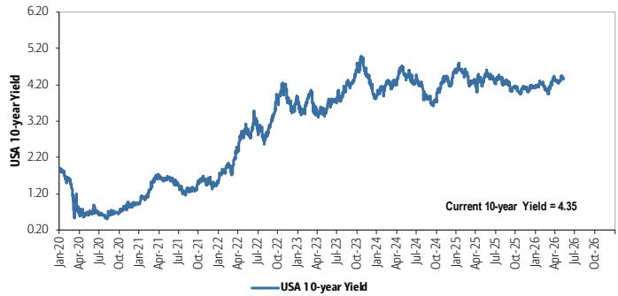

line

| Date    | USA 10-year Yield |
|---------|-------------------|
| Jan-20  | 1.8               |
| Apr-20  | 0.8               |
| Jul-20  | 0.9               |
| Oct-20  | 1.0               |
| Jan-21  | 1.2               |
| Apr-21  | 1.4               |
| Jul-21  | 1.3               |
| Oct-21  | 1.5               |
| Jan-22  | 1.7               |
| Apr-22  | 2.5               |
| Jul-22  | 3.0               |
| Oct-22  | 3.5               |
| Jan-23  | 3.8               |
| Apr-23  | 4.0               |
| Jul-23  | 4.2               |
| Oct-23  | 4.5               |
| Jan-24  | 4.8               |
| Apr-24  | 4.6               |
| Jul-24  | 4.4               |
| Oct-24  | 4.3               |
| Jan-25  | 4.5               |
| Apr-25  | 4.4               |
| Jul-25  | 4.3               |
| Oct-25  | 4.2               |
| Jan-26  | 4.1               |
| Apr-26  | 4.0               |
| Jul-26  | 4.1               |
| Oct-26  | 4.35              |

Source : Bloomberg   
BofA GLOBAL RESEARCH

Chart 68: Global 10-year Bond Yield since Jan-20   
Current 10-yr Global GDP weighted bond yield is 4.47%   
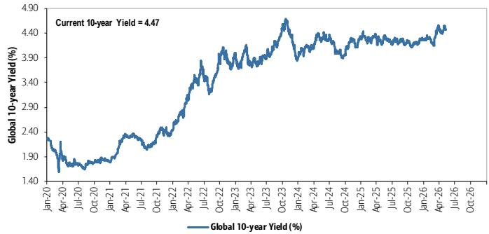

line

| Date    | Global 10-year Yield (%) |
|---------|--------------------------|
| Current | 4.47                     |

Source : BofA Global Quantitative Strategy, Bloomberg   
BofA GLOBAL RESEARCH

Chart 67: USA 90-day Bank Bill since Jan-20   
US 90-day yield fell by -1 bps to 3.66%   
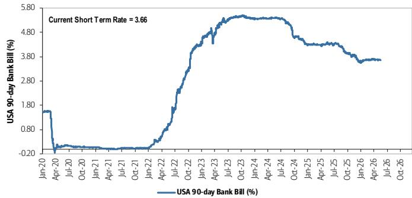

line

| Date    | USA 90-day Bank Bill (%) |
|---------|--------------------------|
| Jan-20  | 1.8                      |
| Apr-20  | -0.2                     |
| Jul-20  | -0.2                     |
| Oct-20  | -0.2                     |
| Jan-21  | -0.2                     |
| Apr-21  | -0.2                     |
| Jul-21  | -0.2                     |
| Oct-21  | -0.2                     |
| Jan-22  | -0.2                     |
| Apr-22  | 0.8                      |
| Jul-22  | 2.8                      |
| Oct-22  | 4.0                      |
| Jan-23  | 4.5                      |
| Apr-23  | 4.8                      |
| Jul-23  | 4.9                      |
| Oct-23  | 4.9                      |
| Jan-24  | 4.9                      |
| Apr-24  | 4.8                      |
| Jul-24  | 4.7                      |
| Oct-24  | 4.5                      |
| Jan-25  | 4.3                      |
| Apr-25  | 4.2                      |
| Jul-25  | 4.1                      |
| Oct-25  | 4.0                      |
| Jan-26  | 3.8                      |
| Apr-26  | 3.7                      |
| Jul-26  | 3.6                      |
| Oct-26  | 3.6                    |

Source : Bloomberg   
BofA GLOBAL RESEARCH

Chart 69: Global 90-day Bank Bill since Jan-20   
Current 90d Global GDP weighted bond yield is 2.91%   
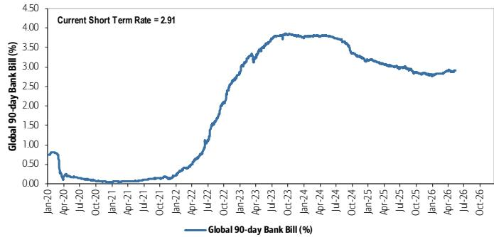

line

| Date     | Global 90-day Bank Bill (%) |
| -------- | --------------------------- |
| Jan-20   | 0.8                         |
| Apr-20   | 0.1                         |
| Jul-20   | 0.0                         |
| Oct-20   | 0.0                         |
| Jan-21   | 0.0                         |
| Apr-21   | 0.0                         |
| Jul-21   | 0.0                         |
| Oct-21   | 0.0                         |
| Jan-22   | 0.1                         |
| Apr-22   | 0.5                         |
| Jul-22   | 1.5                         |
| Oct-22   | 2.5                         |
| Jan-23   | 3.5                         |
| Apr-23   | 3.8                         |
| Jul-23   | 3.9                         |
| Oct-23   | 3.8                         |
| Jan-24   | 3.7                         |
| Apr-24   | 3.6                         |
| Jul-24   | 3.5                         |
| Oct-24   | 3.3                         |
| Jan-25   | 3.1                         |
| Apr-25   | 3.0                         |
| Jul-25   | 2.9                         |
| Oct-25   | 2.8                         |
| Jan-26   | 2.7                         |
| Apr-26   | 2.8                         |
| Jul-26   | 2.9                         |
| Oct-26   | 2.9                         |

Source : BofA Global Quantitative Strategy, Bloomberg   
BofA GLOBAL RESEARCH

Chart 70: China 10-year Bond Yield since Jan-20   
Current China 10-year Yield = 1.76%   
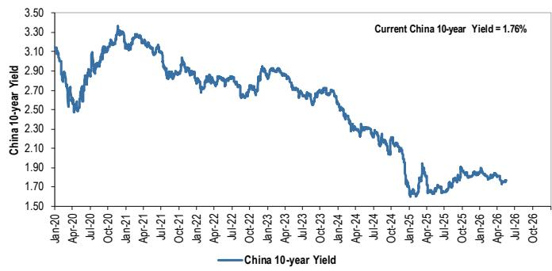

line

| Date    | China 10-year Yield |
|---------|---------------------|
| Jan-20  | 3.10                |
| Apr-20  | 2.50                |
| Jul-20  | 3.00                |
| Oct-20  | 3.30                |
| Jan-21  | 3.20                |
| Apr-21  | 3.10                |
| Jul-21  | 2.90                |
| Oct-21  | 2.80                |
| Jan-22  | 2.70                |
| Apr-22  | 2.80                |
| Jul-22  | 2.70                |
| Oct-22  | 2.90                |
| Jan-23  | 2.80                |
| Apr-23  | 2.70                |
| Jul-23  | 2.60                |
| Oct-23  | 2.70                |
| Jan-24  | 2.50                |
| Apr-24  | 2.30                |
| Jul-24  | 2.10                |
| Oct-24  | 1.70                |
| Jan-25  | 1.60                |
| Apr-25  | 1.70                |
| Jul-25  | 1.80                |
| Oct-25  | 1.90                |
| Jan-26  | 1.80                |
| Apr-26  | 1.75                |
| Jul-26  | 1.70                |
| Oct-26  | 1.76                |

Source : Bloomberg   
BofA GLOBAL RESEARCH

Chart 72: Asia Pac ex-Japan 10-year Bond Yield since Jan-20   
Current 10-year Asia Pac GDP weighted bond yield is 3.11%   
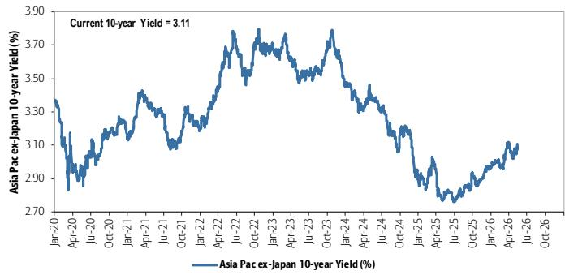

line

| Date    | Asia Pac ex-Japan 10-year Yield (%) |
|---------|-------------------------------------|
| Current | 3.11                                |

Source : BofA Global Quantitative Strategy, Bloomberg   
BofA GLOBAL RESEARCH

Chart 71: China 90-day Bank Bill since Jan-20   
Current China 90-day Rate = 1.21%   
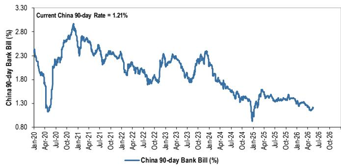

line

| Date    | China 90-day Bank Bill (%) |
|---------|-----------------------------|
| Jan-20  | 2.3                         |
| Apr-20  | 1.3                         |
| Jul-20  | 2.8                         |
| Oct-20  | 2.7                         |
| Jan-21  | 2.5                         |
| Apr-21  | 2.4                         |
| Jul-21  | 2.3                         |
| Oct-21  | 2.2                         |
| Jan-22  | 2.1                         |
| Apr-22  | 1.9                         |
| Jul-22  | 1.8                         |
| Oct-22  | 2.0                         |
| Jan-23  | 2.1                         |
| Apr-23  | 1.9                         |
| Jul-23  | 1.8                         |
| Oct-23  | 2.3                         |
| Jan-24  | 1.8                         |
| Apr-24  | 1.6                         |
| Jul-24  | 1.5                         |
| Oct-24  | 1.3                         |
| Jan-25  | 0.8                         |
| Apr-25  | 1.5                         |
| Jul-25  | 1.4                         |
| Oct-25  | 1.3                         |
| Jan-26  | 1.3                         |
| Apr-26  | 1.2                         |
| Jul-26  | 1.1                         |
| Oct-26  | 1.0                         |

Source : Bloomberg   
BofA GLOBAL RESEARCH

Chart 73: Asia Pac ex-Japan 90-day Bank Bill since Jan-20   
Current 90d Asia Pac GDP weighted bond yield is 2.26%   
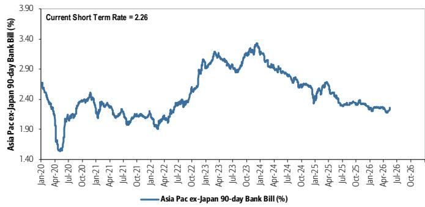

line

| Date    | Asia Pac ex-Japan 90-day Bank Bill (%) |
|---------|----------------------------------------|
| Jan-20  | 2.5                                    |
| Apr-20  | 1.4                                    |
| Jul-20  | 2.4                                    |
| Oct-20  | 2.3                                    |
| Jan-21  | 2.4                                    |
| Apr-21  | 2.3                                    |
| Jul-21  | 2.2                                    |
| Oct-21  | 2.1                                    |
| Jan-22  | 1.9                                    |
| Apr-22  | 2.0                                    |
| Jul-22  | 2.1                                    |
| Oct-22  | 2.3                                    |
| Jan-23  | 2.5                                    |
| Apr-23  | 2.7                                    |
| Jul-23  | 2.8                                    |
| Oct-23  | 3.0                                    |
| Jan-24  | 3.1                                    |
| Apr-24  | 2.9                                    |
| Jul-24  | 2.8                                    |
| Oct-24  | 2.6                                    |
| Jan-25  | 2.4                                    |
| Apr-25  | 2.5                                    |
| Jul-25  | 2.4                                    |
| Oct-25  | 2.3                                    |
| Jan-26  | 2.2                                    |
| Apr-26  | 2.1                                    |
| Jul-26  | 2.0                                    |
| Oct-26  | 1.9                                    |

Source : BofA Global Quantitative Strategy, Bloomberg   
BofA GLOBAL RESEARCH

Table 4: USA Yield Curve slope and subsequent Global Regions & Sectors relative returns (median 12m)

When the US yield curve slope was near current levels, the subsequent 12m return of ACWI has been 12.2%

<table><tr><td>Global Sector</td><td>-0.50% - 0.25%</td><td>-0.25% - 0.00%</td><td>0.00% - 0.25%</td><td>0.25% - 0.50%</td><td>0.50% - 0.75%</td><td>0.75% - 1.00%</td><td>1.00% - 1.25%</td><td>1.25% - 1.50%</td><td>1.50% - 1.75%</td><td>1.75% - 2.00%</td><td>2.00% - 2.25%</td><td>2.25% - 2.50%</td><td>2.50% - 2.75%</td><td>2.75% - 3.00%</td></tr><tr><td>Semiconductors</td><td>1.9%</td><td>-2.9%</td><td>21.4%</td><td>7.6%</td><td>18.6%</td><td>10.5%</td><td>12.5%</td><td>4.8%</td><td>2.6%</td><td>0.9%</td><td>13.7%</td><td>11.0%</td><td>7.5%</td><td>2.0%</td></tr><tr><td>Health Care</td><td>-9.5%</td><td>-6.2%</td><td>0.7%</td><td>9.5%</td><td>13.5%</td><td>1.6%</td><td>3.6%</td><td>7.2%</td><td>5.4%</td><td>1.1%</td><td>-8.1%</td><td>-3.1%</td><td>5.0%</td><td>-11.0%</td></tr><tr><td>Energy</td><td>-7.2%</td><td>12.5%</td><td>-3.6%</td><td>-2.8%</td><td>10.9%</td><td>0.3%</td><td>3.5%</td><td>-2.5%</td><td>-3.7%</td><td>-3.0%</td><td>-5.0%</td><td>-3.0%</td><td>-6.8%</td><td>1.9%</td></tr><tr><td>Software</td><td>-2.5%</td><td>3.3%</td><td>17.4%</td><td>16.5%</td><td>8.6%</td><td>13.3%</td><td>9.0%</td><td>10.5%</td><td>14.2%</td><td>4.3%</td><td>1.0%</td><td>1.2%</td><td>6.9%</td><td>-1.8%</td></tr><tr><td>Cons. Staples</td><td>-2.9%</td><td>4.4%</td><td>-0.8%</td><td>1.7%</td><td>4.3%</td><td>-6.5%</td><td>9.0%</td><td>5.8%</td><td>3.2%</td><td>3.2%</td><td>-4.4%</td><td>-2.6%</td><td>4.3%</td><td>-4.0%</td></tr><tr><td>Tech Hardware</td><td>-1.3%</td><td>1.6%</td><td>17.9%</td><td>5.0%</td><td>3.0%</td><td>8.4%</td><td>6.2%</td><td>1.2%</td><td>-4.5%</td><td>1.6%</td><td>10.9%</td><td>2.7%</td><td>6.3%</td><td>-0.5%</td></tr><tr><td>Banks</td><td>11.8%</td><td>-3.7%</td><td>-10.5%</td><td>-3.7%</td><td>1.4%</td><td>4.1%</td><td>1.9%</td><td>-0.9%</td><td>-4.4%</td><td>3.0%</td><td>3.5%</td><td>-1.1%</td><td>-10.0%</td><td>-9.5%</td></tr><tr><td>Insurance</td><td>10.9%</td><td>-0.1%</td><td>-3.6%</td><td>0.1%</td><td>1.3%</td><td>-4.7%</td><td>1.1%</td><td>2.1%</td><td>1.5%</td><td>-6.1%</td><td>-1.1%</td><td>-2.2%</td><td>-5.9%</td><td>-7.8%</td></tr><tr><td>Div Financials</td><td>12.2%</td><td>-2.3%</td><td>-1.6%</td><td>1.0%</td><td>-0.1%</td><td>3.8%</td><td>-1.4%</td><td>0.2%</td><td>1.4%</td><td>0.4%</td><td>4.0%</td><td>-7.5%</td><td>-12.3%</td><td>-8.5%</td></tr><tr><td>Real Estate</td><td>-3.0%</td><td>-3.7%</td><td>-10.4%</td><td>-9.9%</td><td>-4.0%</td><td>-8.2%</td><td>-3.5%</td><td>-3.1%</td><td>5.9%</td><td>0.3%</td><td>4.2%</td><td>4.5%</td><td>4.1%</td><td>2.9%</td></tr><tr><td>Media &amp; Ent.</td><td>8.6%</td><td>-1.7%</td><td>5.1%</td><td>8.9%</td><td>-4.1%</td><td>-4.8%</td><td>-14.3%</td><td>0.6%</td><td>1.2%</td><td>2.0%</td><td>1.7%</td><td>1.8%</td><td>4.4%</td><td>6.7%</td></tr><tr><td>Cons. Discretionary</td><td>0.3%</td><td>-1.2%</td><td>-0.6%</td><td>-1.0%</td><td>-4.6%</td><td>-1.7%</td><td>-4.1%</td><td>3.5%</td><td>2.2%</td><td>3.9%</td><td>3.5%</td><td>1.6%</td><td>4.8%</td><td>6.0%</td></tr><tr><td>Industrials</td><td>3.4%</td><td>2.8%</td><td>-1.4%</td><td>-1.8%</td><td>-4.6%</td><td>-1.8%</td><td>-1.2%</td><td>1.1%</td><td>1.2%</td><td>-0.7%</td><td>1.4%</td><td>4.0%</td><td>-0.8%</td><td>5.4%</td></tr><tr><td>Utilities</td><td>3.2%</td><td>4.3%</td><td>-0.7%</td><td>-5.7%</td><td>-6.9%</td><td>-5.2%</td><td>-3.0%</td><td>-1.9%</td><td>-6.3%</td><td>-3.2%</td><td>-3.2%</td><td>-2.7%</td><td>-7.4%</td><td>-13.9%</td></tr><tr><td>Materials</td><td>-8.8%</td><td>11.4%</td><td>-5.4%</td><td>-8.1%</td><td>-8.1%</td><td>-1.0%</td><td>0.7%</td><td>-3.6%</td><td>-3.8%</td><td>2.1%</td><td>1.0%</td><td>4.0%</td><td>-11.5%</td><td>6.6%</td></tr><tr><td>Telecom</td><td>-9.3%</td><td>11.5%</td><td>1.0%</td><td>-2.1%</td><td>-9.7%</td><td>-14.2%</td><td>-7.8%</td><td>-3.7%</td><td>-4.4%</td><td>-2.4%</td><td>-3.1%</td><td>-1.9%</td><td>-0.6%</td><td>-2.1%</td></tr><tr><td>World</td><td>10.2%</td><td>10.3%</td><td>11.3%</td><td>12.5%</td><td>12.2%</td><td>11.3%</td><td>5.1%</td><td>2.8%</td><td>7.5%</td><td>2.0%</td><td>11.2%</td><td>11.8%</td><td>3.6%</td><td>14.5%</td></tr><tr><td>USA</td><td>12.6%</td><td>10.8%</td><td>11.9%</td><td>16.3%</td><td>24.5%</td><td>15.4%</td><td>10.1%</td><td>7.5%</td><td>2.7%</td><td>3.6%</td><td>9.1%</td><td>11.2%</td><td>9.1%</td><td>16.9%</td></tr><tr><td>Europe</td><td>6.7%</td><td>12.3%</td><td>7.9%</td><td>16.1%</td><td>17.8%</td><td>7.6%</td><td>6.1%</td><td>5.1%</td><td>7.8%</td><td>0.0%</td><td>15.2%</td><td>12.8%</td><td>-7.0%</td><td>10.5%</td></tr><tr><td>Japan</td><td>3.2%</td><td>-2.1%</td><td>1.9%</td><td>0.9%</td><td>-10.7%</td><td>7.6%</td><td>-7.7%</td><td>-5.4%</td><td>4.8%</td><td>-0.5%</td><td>17.2%</td><td>10.0%</td><td>-1.0%</td><td>5.4%</td></tr><tr><td>GEM</td><td>6.4%</td><td>21.5%</td><td>4.6%</td><td>5.0%</td><td>2.4%</td><td>19.4%</td><td>2.5%</td><td>0.3%</td><td>-3.9%</td><td>5.1%</td><td>20.6%</td><td>17.5%</td><td>5.2%</td><td>17.1%</td></tr><tr><td>Asia Pac ex-Japan</td><td>7.8%</td><td>15.6%</td><td>4.1%</td><td>6.5%</td><td>-2.0%</td><td>14.4%</td><td>4.2%</td><td>4.9%</td><td>0.4%</td><td>8.5%</td><td>17.8%</td><td>15.4%</td><td>5.7%</td><td>16.2%</td></tr></table>

Source : BofA Global Quantitative Strategy, MSCI, Bloomberg

BofA GLOBAL RESEARCH

# Valuation

Chart 74: Global Price-to-Book trailing (since 1988)   
The latest Global Price-to-Book ratio is 3.79   
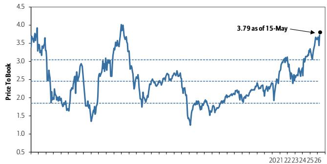

line

| Date       | Price To Book |
| ---------- | ------------- |
| 15-May     | 3.79          |

Source : BofA Global Quantitative Strategy, MSCI, IBES, Worldscope   
BofA GLOBAL RESEARCH

Chart 76: Global Price-to-Book trailing and MSCI AC World subsequent 12m returns   
For current PB level, MSCI ACWI returns 0% in the subsequent 12m on average   
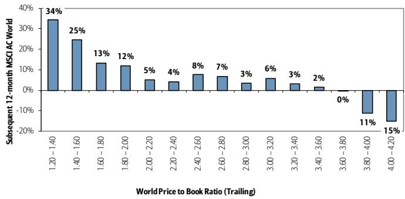

bar

| World Price to Book Ratio (Trailing) | Subsequent 12-month MSCIAC World (%) |
|---|---|
| 1.20 - 1.40 | 34 |
| 1.40 - 1.60 | 25 |
| 1.60 - 1.80 | 13 |
| 1.80 - 2.00 | 12 |
| 2.00 - 2.20 | 5 |
| 2.20 - 2.40 | 4 |
| 2.40 - 2.60 | 8 |
| 2.60 - 2.80 | 7 |
| 2.80 - 3.00 | 3 |
| 3.00 - 3.20 | 6 |
| 3.20 - 3.40 | 3 |
| 3.40 - 3.60 | 2 |
| 3.60 - 3.80 | 0 |
| 3.80 - 4.00 | -11 |
| 4.00 - 4.20 | -15 |

Source : BofA Global Quantitative Strategy, MSCI, IBES, Worldscope   
BofA GLOBAL RESEARCH

Chart 78: Price-to-Book: Global Regions   
In terms of PB, the USA is the most expensive region   
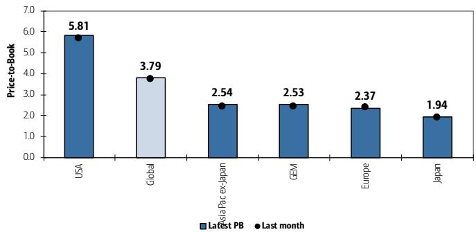

bar

| Region           | Latest PB | Last month |
| ---------------- | --------- | ---------- |
| USA              | 5.81      | 5.81       |
| Global           | 3.79      | 3.79       |
| Asia Pac ex Japan| 2.54      | 2.54       |
| GEM              | 2.53      | 2.53       |
| Europe           | 2.37      | 2.37       |
| Japan            | 1.94      | 1.94       |

Source : BofA Global Quantitative Strategy, MSCI, IBES, Worldscope   
BofA GLOBAL RESEARCH

Chart 75: Global Prospective PE (since 1988)   
The latest Global Prospective PE is 19.2   
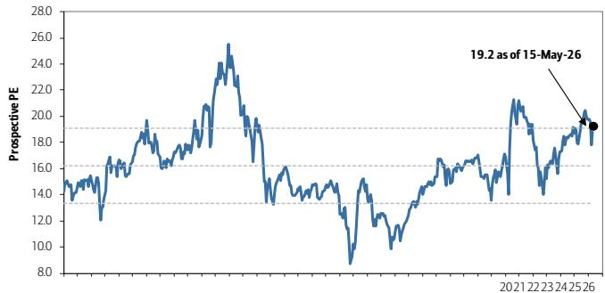

line

| Date       | Prospective PE |
| ---------- | -------------- |
| 15-May-26  | 19.2           |

Source : BofA Global Quantitative Strategy, MSCI, IBES, Worldscope   
BofA GLOBAL RESEARCH

Chart 77: Global Prospective PE and MSCI AC World subsequent 12m returns   
For current PE level, MSCI ACWI returns -1% in the subsequent 12m on average   
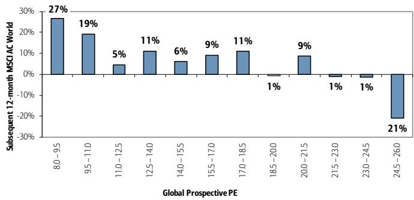

bar

| Global Prospective PE | Subsequent 12-month MSCI AC World (%) |
|---|---|
| 80 - 95 | 27 |
| 95 - 110 | 19 |
| 110 - 125 | 5 |
| 125 - 140 | 11 |
| 140 - 155 | 6 |
| 155 - 170 | 9 |
| 170 - 185 | 11 |
| 185 - 200 | 1 |
| 200 - 215 | 9 |
| 215 - 230 | 1 |
| 230 - 245 | 1 |
| 245 - 260 | 21 |

Source : BofA Global Quantitative Strategy, MSCI, IBES, Worldscope   
BofA GLOBAL RESEARCH

Chart 79: Global Prospective PE: Global Regions   
In terms of PE, GEM is the most inexpensive region   
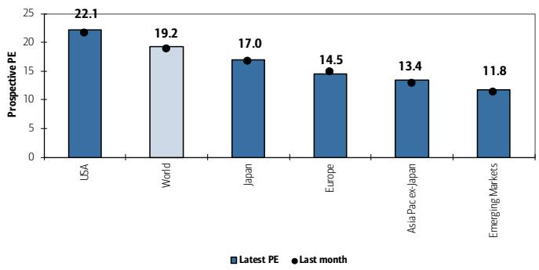

bar

| Region           | Latest PE | Last month |
| ---------------- | --------- | ---------- |
| USA              | 22.1      | 22.1       |
| World            | 19.2      | 19.2       |
| Japan            | 17.0      | 17.0       |
| Europe           | 14.5      | 14.5       |
| Asia Pac ex Japan| 13.4      | 13.4       |
| Emerging Markets | 11.8      | 11.8       |

Source : BofA Global Quantitative Strategy, MSCI, IBES, Worldscope   
BofA GLOBAL RESEARCH

# Revenue Exposure

# Chart 80: Global regions to the USA - Performance YTD

Year-to-date, Europe to USA stocks have underperformed the most by -5.2%

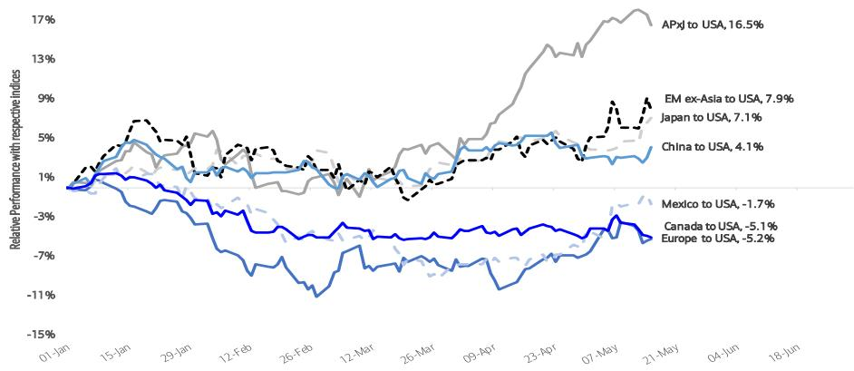

line

| Region | Relative Performance |
| --- | --- |
| APx to USA | 16.5% |
| EM ex-Asia to USA | 7.9% |
| Japan to USA | 7.1% |
| China to USA | 4.1% |
| Mexico to USA | -1.7% |
| Canada to USA | -5.1% |
| Europe to USA | -5.2% |

Source : BofA Global Quantitative Strategy, MSCI, Bloomberg, FactSet   
Performance relative to respective regional MSCI Indices.

BofA GLOBAL RESEARCH

# Chart 81: Global regions to China - Performance YTD

Year-to-date, EM ex-Asia to China stocks have underperformed the most by -4.2%

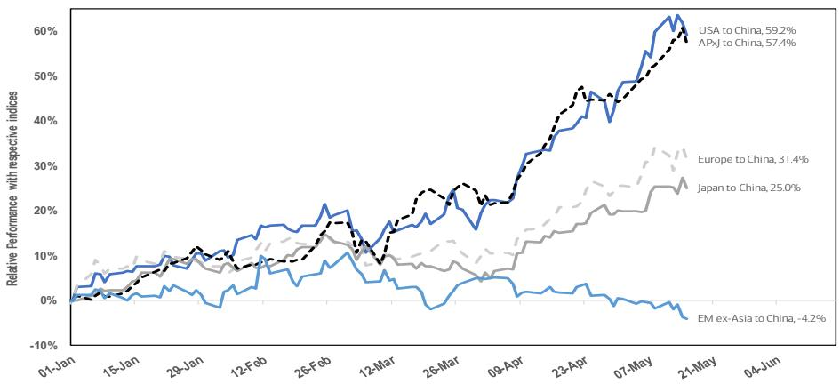

line

| Date     | USA to China | APX to China | Europe to China | Japan to China | EM ex-Asia to China |
|----------|--------------|--------------|-----------------|----------------|---------------------|
| 01-Jan   | ~0%          | ~0%          | ~0%             | ~0%            | ~0%                 |
| 15-Jan   | ~5%          | ~5%          | ~5%             | ~5%            | ~0%                 |
| 29-Jan   | ~10%         | ~10%         | ~10%            | ~10%           | ~0%                 |
| 12-Feb   | ~15%         | ~15%         | ~15%            | ~15%           | ~0%                 |
| 26-Feb   | ~20%         | ~20%         | ~20%            | ~20%           | ~0%                 |
| 12-Mar   | ~15%         | ~15%         | ~15%            | ~15%           | ~0%                 |
| 26-Mar   | ~25%         | ~25%         | ~25%            | ~25%           | ~0%                 |
| 09-Apr   | ~30%         | ~30%         | ~30%            | ~30%           | ~0%                 |
| 23-Apr   | ~45%         | ~45%         | ~45%            | ~45%           | ~0%                 |
| 07-May   | ~55%         | ~55%         | ~55%            | ~55%           | ~0%                 |
| 21-May   | ~60%         | ~60%         | ~60%            | ~60%           | ~0%                 |
| 04-Jun   | ~60%         | ~60%         | ~60%            | ~60%           | -4.2%               |

Source : BofA Global Quantitative Strategy, MSCI, Bloomberg, FactSet   
Performance relative to respective regional MSCI Indices.

BofA GLOBAL RESEARCH

# Triple Momentum

Table 5: Global Region-Sectors - Triple Momentum

Triple Momentum is currently strongest for Semiconductors, Energy, and Tech Hardware

<table><tr><td>Average Triple Momentum Rank</td><td>Banks</td><td>Cons. Discretionary</td><td>Cons. Staples</td><td>Div Financials</td><td>Energy</td><td>Health Care</td><td>Industrials</td><td>Insurance</td><td>Materials</td><td>Media &amp; Ent.</td><td>Real Estate</td><td>Semiconductors</td><td>Software</td><td>Tech Hardware</td><td>Telecom</td><td>Utilities</td><td>Region</td></tr><tr><td>Canada</td><td>87</td><td>48</td><td>42</td><td>78</td><td>58</td><td></td><td>45</td><td>65</td><td>79</td><td></td><td>35</td><td></td><td>24</td><td>95</td><td>35</td><td>45</td><td>62</td></tr><tr><td>USA</td><td>65</td><td>45</td><td>44</td><td>39</td><td>76</td><td>46</td><td>50</td><td>42</td><td>63</td><td>36</td><td>48</td><td>70</td><td>30</td><td>62</td><td>50</td><td>50</td><td>49</td></tr><tr><td>Belgium</td><td>73</td><td>10</td><td>54</td><td>25</td><td></td><td>79</td><td></td><td>60</td><td>48</td><td></td><td></td><td></td><td></td><td></td><td></td><td>52</td><td>53</td></tr><tr><td>Denmark</td><td>92</td><td>21</td><td>76</td><td></td><td></td><td>36</td><td>71</td><td>37</td><td>42</td><td></td><td></td><td></td><td></td><td></td><td></td><td>80</td><td>54</td></tr><tr><td>Finland</td><td>66</td><td></td><td>75</td><td></td><td>99</td><td>56</td><td>56</td><td>2</td><td>31</td><td></td><td></td><td></td><td></td><td>96</td><td>6</td><td>52</td><td>52</td></tr><tr><td>France</td><td>64</td><td>20</td><td>32</td><td>73</td><td>68</td><td>46</td><td>44</td><td>51</td><td>34</td><td>70</td><td>43</td><td>100</td><td>41</td><td></td><td></td><td>58</td><td>47</td></tr><tr><td>Germany</td><td>65</td><td>18</td><td>18</td><td>66</td><td></td><td>34</td><td>45</td><td>32</td><td>38</td><td>11</td><td>23</td><td>95</td><td>25</td><td></td><td>43</td><td>67</td><td>36</td></tr><tr><td>Italy</td><td>62</td><td>44</td><td>36</td><td>67</td><td>97</td><td>60</td><td>66</td><td>73</td><td>55</td><td></td><td></td><td></td><td>27</td><td></td><td>72</td><td>40</td><td>58</td></tr><tr><td>Netherlands</td><td>94</td><td>19</td><td>54</td><td>20</td><td></td><td>56</td><td>14</td><td></td><td>27</td><td>22</td><td></td><td>75</td><td></td><td></td><td>30</td><td></td><td>43</td></tr><tr><td>Spain</td><td>62</td><td>53</td><td></td><td></td><td>98</td><td>21</td><td>53</td><td>74</td><td></td><td></td><td></td><td></td><td>83</td><td></td><td>30</td><td>65</td><td>59</td></tr><tr><td>Sweden</td><td>65</td><td>32</td><td>7</td><td>51</td><td></td><td>91</td><td>56</td><td></td><td>14</td><td>5</td><td>8</td><td></td><td></td><td>41</td><td>88</td><td></td><td>48</td></tr><tr><td>Switzerland</td><td></td><td>56</td><td>27</td><td>64</td><td></td><td>46</td><td>57</td><td>43</td><td>14</td><td></td><td>18</td><td>4</td><td>78</td><td>68</td><td>46</td><td></td><td>45</td></tr><tr><td>UK</td><td>79</td><td>39</td><td>31</td><td>42</td><td>60</td><td>50</td><td>56</td><td>51</td><td>65</td><td>9</td><td>26</td><td>67</td><td>33</td><td>62</td><td>83</td><td>48</td><td>50</td></tr><tr><td>Australia</td><td>20</td><td>18</td><td>29</td><td>66</td><td>39</td><td>20</td><td>36</td><td>47</td><td>68</td><td>28</td><td>27</td><td></td><td>28</td><td></td><td>65</td><td>46</td><td>46</td></tr><tr><td>Hong Kong</td><td>91</td><td>30</td><td>51</td><td>50</td><td>78</td><td>53</td><td>52</td><td>44</td><td></td><td>4</td><td>44</td><td>35</td><td></td><td>88</td><td></td><td>26</td><td>45</td></tr><tr><td>Japan</td><td>71</td><td>44</td><td>48</td><td>86</td><td>89</td><td>43</td><td>66</td><td>65</td><td>47</td><td>45</td><td>53</td><td>78</td><td>44</td><td>69</td><td>43</td><td>38</td><td>57</td></tr><tr><td>Singapore</td><td>61</td><td>14</td><td>62</td><td>62</td><td></td><td></td><td>44</td><td></td><td></td><td></td><td>67</td><td></td><td></td><td></td><td>53</td><td>9</td><td>51</td></tr><tr><td>China</td><td>60</td><td>37</td><td>35</td><td>61</td><td>60</td><td>49</td><td>55</td><td>47</td><td>79</td><td>36</td><td>30</td><td>48</td><td>41</td><td>42</td><td>33</td><td>28</td><td>48</td></tr><tr><td>India</td><td>45</td><td>35</td><td>27</td><td>50</td><td>37</td><td>45</td><td>43</td><td>28</td><td>40</td><td>11</td><td>30</td><td>45</td><td>37</td><td></td><td>40</td><td>41</td><td>40</td></tr><tr><td>Korea</td><td>58</td><td>63</td><td>74</td><td>88</td><td>96</td><td>58</td><td>66</td><td>75</td><td>70</td><td>40</td><td></td><td></td><td>8</td><td>78</td><td>36</td><td>22</td><td>64</td></tr><tr><td>Taiwan</td><td>70</td><td></td><td>5</td><td>67</td><td></td><td>64</td><td>54</td><td>69</td><td>38</td><td></td><td></td><td>67</td><td></td><td>70</td><td>65</td><td></td><td>63</td></tr><tr><td>Brazil</td><td>57</td><td>97</td><td>45</td><td>52</td><td>85</td><td>59</td><td>47</td><td>14</td><td>44</td><td></td><td></td><td></td><td></td><td></td><td>59</td><td>61</td><td>57</td></tr><tr><td>Mexico</td><td>45</td><td></td><td>48</td><td></td><td></td><td></td><td>52</td><td></td><td>89</td><td></td><td>44</td><td></td><td></td><td></td><td>75</td><td></td><td>57</td></tr><tr><td>Poland</td><td>83</td><td></td><td>15</td><td></td><td>97</td><td></td><td>23</td><td>19</td><td>93</td><td>65</td><td></td><td></td><td></td><td></td><td></td><td>19</td><td>52</td></tr><tr><td>South Africa</td><td>79</td><td>65</td><td>44</td><td>80</td><td></td><td></td><td>42</td><td>34</td><td>83</td><td></td><td>29</td><td></td><td></td><td></td><td>55</td><td></td><td>70</td></tr><tr><td>Asia Pac ex-Japan</td><td>51</td><td>38</td><td>38</td><td>58</td><td>54</td><td>44</td><td>52</td><td>47</td><td>63</td><td>32</td><td>37</td><td>58</td><td>35</td><td>64</td><td>48</td><td>34</td><td>49</td></tr><tr><td>Emerging ex-Asia</td><td>58</td><td>50</td><td>40</td><td>66</td><td>63</td><td>40</td><td>44</td><td>41</td><td>69</td><td>65</td><td>55</td><td></td><td>47</td><td></td><td>57</td><td>53</td><td>55</td></tr><tr><td>Europe</td><td>71</td><td>31</td><td>36</td><td>50</td><td>80</td><td>47</td><td>52</td><td>51</td><td>44</td><td>26</td><td>28</td><td>76</td><td>36</td><td>70</td><td>57</td><td>54</td><td>49</td></tr><tr><td>Japan</td><td>71</td><td>44</td><td>48</td><td>86</td><td>89</td><td>43</td><td>66</td><td>65</td><td>47</td><td>45</td><td>53</td><td>78</td><td>44</td><td>69</td><td>43</td><td>38</td><td>57</td></tr><tr><td>United States</td><td>65</td><td>45</td><td>44</td><td>39</td><td>76</td><td>46</td><td>50</td><td>42</td><td>63</td><td>36</td><td>48</td><td>70</td><td>30</td><td>62</td><td>50</td><td>50</td><td>49</td></tr><tr><td>Global</td><td>60</td><td>40</td><td>40</td><td>50</td><td>66</td><td>45</td><td>52</td><td>49</td><td>63</td><td>35</td><td>42</td><td>68</td><td>33</td><td>65</td><td>51</td><td>45</td><td></td></tr></table>

Source : BofA Global Quantitative Strategy, MSCI, IBES, FactSet, RavenPack   
BofA GLOBAL RESEARCH

# Chart 82: Global Sectors - Average Triple Momentum Rank

Triple Momentum is currently strongest for Semiconductors, Energy, and Tech Hardware

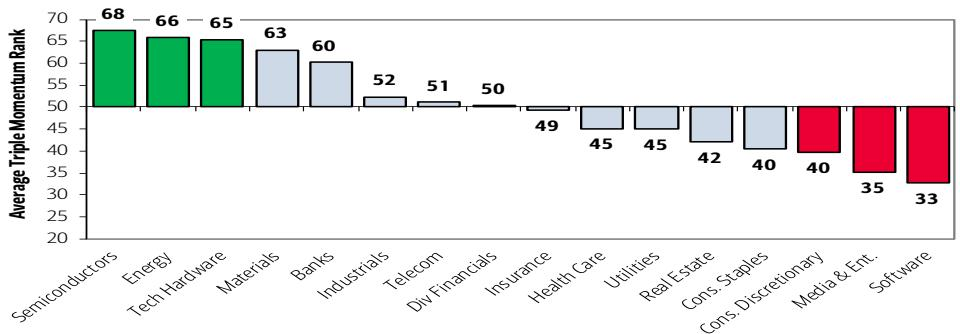

bar

| Sector | Average Triple Momentum Rank |
| :--- | :--- |
| Semiconductors | 68 |
| Energy | 66 |
| Tech Hardware | 65 |
| Materials | 63 |
| Banks | 60 |
| Industrials | 52 |
| Telecom | 51 |
| Div Financials | 50 |
| Insurance | 49 |
| Health Care | 45 |
| Utilities | 45 |
| Real Estate | 42 |
| Cons. Staples | 40 |
| Cons. Discretionary | 40 |
| Media & Ent. | 35 |
| Software | 33 |

Source : BofA Global Quantitative Strategy, MSCI, IBES, FactSet, RavenPack   
BofA GLOBAL RESEARCH

Chart 83: Regional-Sectors with the highest average (green) and lowest average (red) Triple Momentum Rank   
Triple Momentum highest for Japan - Energy and lowest for Europe - Real Estate   
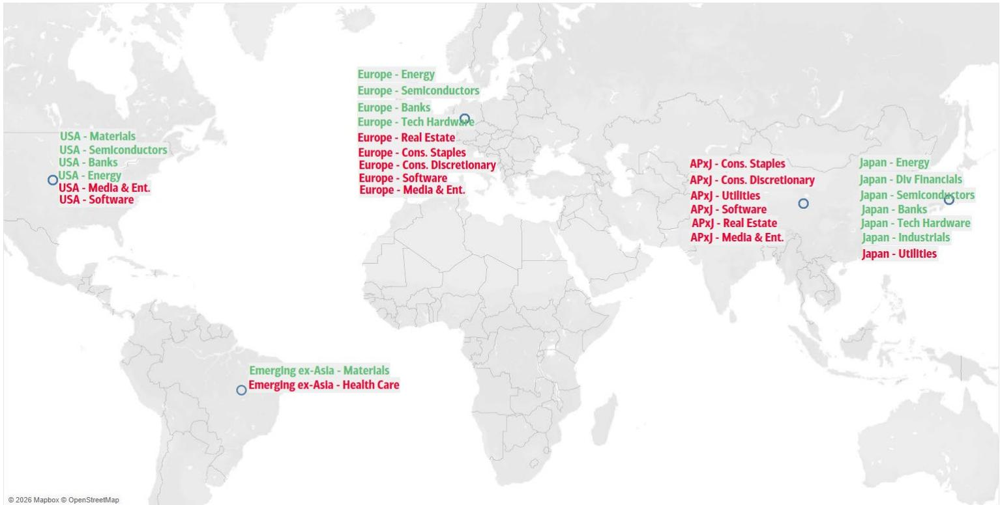

text_image

USA - Materials
USA - Semiconductors
USA - Banks
USA - Energy
USA - Media & Ent.
USA - Software

Europe - Energy
Europe - Semiconductors
Europe - Banks
Europe - Tech Hardware
Europe - Real Estate
Europe - Cons. Staples
Europe - Cons. Discretionary
Europe - Software
Europe - Media & Ent.

APxJ - Cons. Staples
APxJ - Cons. Discretionary
APxJ - Utilities
APxJ - Software
APxJ - Real Estate
APxJ - Media & Ent.

Japan - Energy
Japan - Div Financials
Japan - Semiconductors
Japan - Banks
Japan - Tech Hardware
Japan - Industrials
Japan - Utilities

Emerging ex-Asia - Materials
Emerging ex-Asia - Health Care

© 2026 Mapbox © OpenStreetMap

Source : BofA Global Quantitative Strategy, MSCI, IBES, FactSet, RavenPack

BofA GLOBAL RESEARCH

# Chart 84: Asia Pac ex-Japan Country-Sectors with the highest average (green) and lowest average (red) Triple Momentum Rank (Only country-sectors with minimum 3 stocks with Triple Momentum are included)

Triple Momentum highest for Korea - Energy and lowest for Indonesia - Banks

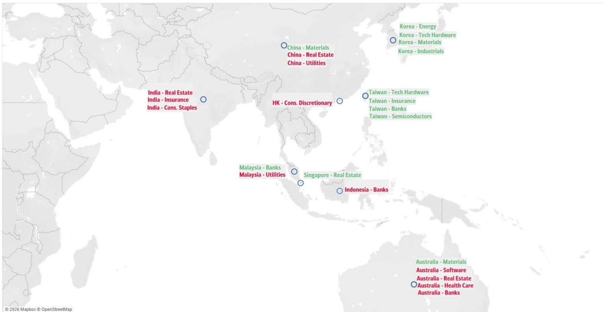

text_image

China - Materials
China - Real Estate
China - Utilities
Korea - Energy
Korea - Tech Hardware
Korea - Materials
Korea - Industrials
India - Real Estate
India - Insurance
India - Cons. Staples
HK - Cons. Discretionary
Taiwan - Tech Hardware
Taiwan - Insurance
Taiwan - Banks
Taiwan - Semiconductors
Malaysia - Banks
Malaysia - Utilities
Singapore - Real Estate
Indonesia - Banks
Australia - Materials
Australia - Software
Australia - Real Estate
Australia - Health Care
Australia - Banks
© 2026 Mapbox © OpenStreetMap

Source : BofA Global Quantitative Strategy, MSCI, IBES, FactSet, RavenPack

BofA GLOBAL RESEARCH

# Chart 85: Global Top & Bottom stocks by Triple Momentum rank (MCap > \$20bn & ADTV > \$20mn)

Triple Momentum is most positive for Bloom Energy, Renesas Electronics and Samsung SDI, and most negative for Oriental Land, Sampo and Kweichow Moutai-A

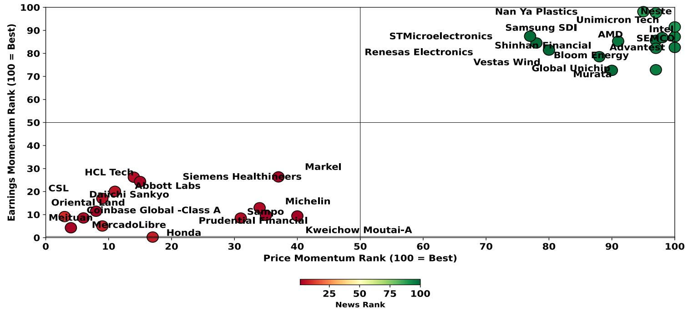  
Source : BofA Global Quantitative Strategy, MSCI, IBES, FactSet, RavenPack

BofA GLOBAL RESEARCH

# Chart 86: Asia Pac ex-Japan Top & Bottom stocks by Triple Momentum rank (MCap > \$10bn & ADTV > \$10mn)

Triple Momentum is most positive for LG Innotek, King Slide and Samsung SDI, and most negative for Kweichow Moutai-A, Meituan and Hyundai Motor India

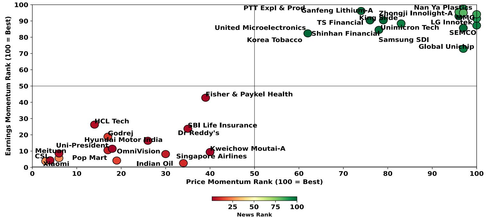

scatter

| Company | Price Momentum Rank (100 = Best) | Earnings Momentum Rank (100 = Best) |
| --- | --- | --- |
| PTT Expl & Prod | 98 | 95 |
| Ganfeng Lithium-A | 74 | 96 |
| King Bride | 76 | 91 |
| Zhongji Innolight-A | 97 | 93 |
| Nan Ya Plastics | 96 | 94 |
| MMQ | 99 | 92 |
| LG Innotek | 98 | 88 |
| SEMCO | 97 | 87 |
| Unimicron Tech | 83 | 89 |
| Samsung SDI | 78 | 85 |
| Global Unichip | 97 | 73 |
| United Microelectronics | 62 | 83 |
| Korea Tobacco | 62 | 82 |
| Fisher & Paykel Health | 39 | 43 |
| HCL Tech | 14 | 27 |
| SBI Life Insurance | 36 | 24 |
| DP Reddy's | 35 | 23 |
| Hyundai Motor India | 26 | 16 |
| Kia Motors | 18 | 11 |
| OmniVision | 30 | 8 |
| Singapore Airlines | 34 | 3 |
| Kweichow Moutai-A | 40 | 10 |
| Indian Oil | 30 | 8 |
| Pop Mart | 19 | 5 |
| Uni-President | 17 | 10 |
| Meituan | 6 | 7 |
| CSI | 4 | 5 |
| Xiaomi | 3 | 4 |
| HCL Tech | 14 | 27 |
| Godrej | 17 | 19 |
| Hyundai Motor India | 26 | 16 |
| Meituan | 6 | 10 |
| Samsung SDI | 78 | 85 |
| Pink River Motor India | 26 | 16 |
| Hyundai Motor India | 18 | 11 |
| Meituan | 6 | 7 |
| Samsung SDI | 78 | 85 |
| Pink River Motor India | 26 | 16 |
| Meituan | 6 | 7 |
| Samsung SDI | 78 | 85 |
| Pink River Motor India | 26 | 16 |
| Meituan | 6 | 7 |
| Samsung SDI | 78 | 85 |
| Pink River Motor India | 26 | 16 |
| Meituan | 6 | 7 |
| Samsung SDI | 78 | 80 |
| Pink River Motor India | 26 | 16 |
| Meituan | 6 | 7 |
| Samsung SDI | 78 | 80 |
| Pink River Motor India | 26 | 16 |
| Meituan | 6 | 7 |
| Samsung SDI | 78 | 80 |
| Pink River Motor India | 26 | 16 |
| Meituan | 6 | - |
| Samsung SDI | - | - |
| Pink River Motor India | - | - |
| Meituan | - | - |
| Samsung SDI | - | - |
| Pink River Motor India | - | - |
| Meituan | - | - |
| Samsung SDI | - | - |
| Pink River Motor India | - | - |
| Meituan | - | - |
| Samsung SDI | - | - |
| Pink River Motor India | - | - |
| Meituan | - | - |
| Samsung SDI | - | - |
| Pink River Automotive Industry (Nan Ya Plastics) | - | - |
| Pink Automotive Industry (Nan Ya Plastics) | - | - |
| Pink Automotive Industry (Nan Ya Plastics) | - | - |
| Pink Automotive Industry (Nan Ya Plastics) | - | - |
| Pink Automotive Industry (Nan Ya Plastics) | - | - |
| Pink Automotive Industry (Nan Ya Plastics) | - | - |
| Pink Automotive Industry (Nan Ya Plastics) | - | - |
| Pink Automotive Industry (Non-Nan Ya Plastics) | - | - |
| Pink Automotive Industry (Non-Nan Ya Plastics) | - | - |
| Pink Automotive Industry (Non-Nan Ya Plastics) | - | - |
| Pink Automotive Industry (Non-Nan Ya Plastics) | - | - |
| Pink Automotive Industry (Non-Nan Ya Plastics) | - | - |
| Pink Automotive Industry (Non-Nan Ya Plastics) | - | - |
| Pink Automotive Industry(Non-Nan Ya Plastics) | - | - |
| Pink Automotive Industry(Non-Nan Ya Plastics) | - | - |
| Pink Automotive Industry(Non-Nan Ya Plastics) | - | - |
| Pink Automotive Industry(Non-Nan Ya Plastics) | - | - |
| Pink Automotive Industry(Non-Nan Ya Plastics) | - | - |
| Pink Automotive Industry(Non-Nan Ya Plastics) | - | - |
| Pink Automobiles (Nan Ya Plastics) / Non-Nan Ya Plastics (MMQ) / Non-Nan Ya Plastics (LG Innotek) / Non-Nan Ya Plastics (SEMCO) / Non-Nan Ya Plastics (PPTT Expl & Prod) / Non-Nan Ya Plastics (Ganfeng Lithium-A, King Bride, Shinhan Financial, Unimicron Tech, Samsung SDI, Global Unichip) / Non-Nan Ya Plastics (Zhangji Innolight-A, Shinhan Financial, Unimicron Tech, Samsung SDI, Global Unichip) / Non-Nan Ya Plastics (Zhangji Innolight-A, Shinhan Financial, Unimicron Tech, Samsung SDI, Global Unichip) / Non-Nan Ya Plastics (Zhangji Innolight-A, Shinhan Financial, Unimicron Tech, Samsung SDI, Global Unichip) / Non-Nan Ya Plastic (Zhangji Innolight-A, Shinhan Financial, Unimicron Tech, Samsung SDI, Global Unichip) / Non-Nan Ya Plastics (Zhangji Innolight-A, Shinhan Financial, Unimicron Tech, Samsung SDI, Global Unichip) / Non-Nan Ya Plastics (Zhangji Innolight-A, Shinhan Financial, Unimicron Tech, Samsung SDI, Global Unichep) / Non-Nan Ya Plastics (Zhangji Innolight-A, Shinhan Financial, Unimicron Tech, Samsung SDI, Global Unichip) / Non-Nan Ya Plastics (Zhangji Innolight-A, Shinhan Financial, Unimicron Tech, Samsung SDI, Global Unichip) / Non-Nan Ya Plastics (Zhangji Innolight-A, Shinhan Financial, Unimicron Tech/Global Unichip) / Non-Nan Ya Plastics (Zhangji Innolight-A, Shinhan Financial, Unimicron Tech/Global Unichip) / Non-Nan Ya Plastics (Zhangji Innolight-A, Shinhan Financial, Unimicron Tech/Global Unichip) / Non-Nan Ya Plastics (Zhangji Innolight-A, Shinhan Financial, Unimicron Tech/Global Unichip).

Source : BofA Global Quantitative Strategy, MSCI, IBES, FactSet, RavenPack

BofA GLOBAL RESEARCH

# Global Regions: Triple Momentum Charts

Chart 87: Global: Earnings Momentum (vertical axis), Price Momentum (horizontal axis), News Momentum (colour)   
Triple Momentum is most positive for Intel, AMD and Caterpillar   
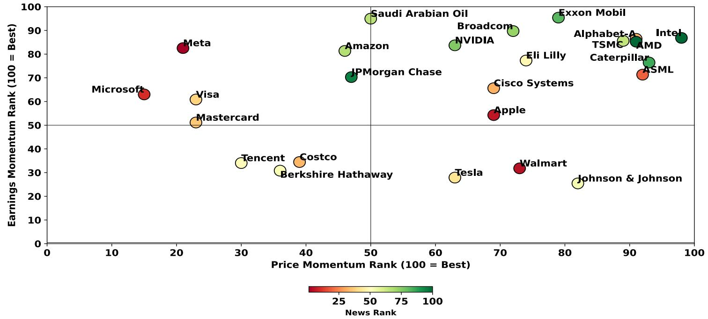  
Source : BofA Global Quantitative Strategy, MSCI, IBES, FactSet, RavenPack

BofA GLOBAL RESEARCH

Chart 88: USA: Earnings Momentum (vertical axis), Price Momentum (horizontal axis), News Momentum (colour)   
Triple Momentum is most positive for Intel, AMD and Caterpillar   
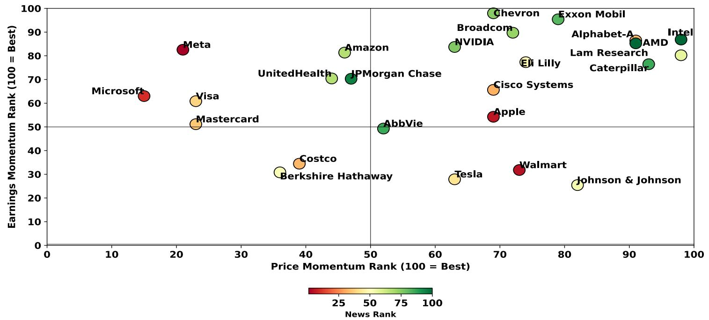

scatter

| Company           | Price Momentum Rank (100 = Best) | Earnings Momentum Rank (100 = Best) |
| ----------------- | --------------------------------- | ------------------------------------- |
| Meta              | 20                                | 83                                    |
| Microsoft         | 15                                | 63                                    |
| Visa              | 23                                | 61                                    |
| Mastercard        | 24                                | 51                                    |
| Berkshire Hathaway| 37                                | 31                                    |
| Costco            | 39                                | 35                                    |
| AbbVie            | 52                                | 50                                    |
| Amazon            | 46                                | 82                                    |
| UnitedHealth      | 44                                | 71                                    |
| JPM Chase    | 47                                | 71                                    |
| Tesla             | 63                                | 28                                    |
| Walmart           | 73                                | 32                                    |
| Tesla             | 69                                | 54                                    |
| Cisco Systems     | 69                                | 66                                    |
| Apple             | 69                                | 54                                    |
| AbbVie            | 52                                | 50                                    |
| Amazon            | 46                                | 82                                    |
| Microsoft         | 15                                | 63                                    |
| Tesla             | 63                                | 28                                    |
| Walmart           | 73                                | 32                                    |
| Tesla             | 69                                | 54                                    |
| Cisco Systems     | 69                                | 66                                    |
| NVIDIA            | 63                                | 84                                    |
| Amazon            | 46                                | 82                                    |
| Alphabet-A        | 91                                | 86                                    |
| AMD               | 91                                | 86                                    |
| Exxon Mobil        | 79                                | 96                                    |
| Chevron           | 70                                | 98                                    |
| Broadcom          | 72                                | 90                                    |
| Eli Lilly          | 74                                | 77                                    |
| Lamb Research     | 91                                | 86                                    |
| Caterpillar       | 93                                | 76                                    |
| Intel             | 98                                | 87                                    |
| Johnson & Johnson  | 82                                | 26                                    |
| Walmart           | 73                                | 32                                    |
| Cisco Systems     | 70                                | 66                                    |
| Apple             | 69                                | 54                                    |
| Tesla             | 63                                | 28                                    |
| Bloomberg         | 72                                | 90                                    |
| Amazon            | 46                                | 82                                    |
| Alphabet-A        | 91                                | 86                                    |
| Amerisource        | 91                                | 86                                    |
| Tesla             | 63                                | 28                                    |
| Walmart           | 73                                | 32                                    |
| Cisco Systems     | 70                                | 66                                    |
| Apple             | 69                                | 54                                    |
| Bloomberg         | 72                                | 90                                    |
| Amerisource        | 70                                | 66                                    |
| Tesla             | 63                                | 28                                    |
| Walmart           | 73                                | 32                                    |
| Cisco Systems     | 70                                | 66                                    |
| Apple             | 69                                | 54                                    |
| Bloomberg         | 72                                | 90                                    |
| Amerisource        | 70                                | 66                                    |
| Tesla             | 63                                | -                                     |
| Walmart           | -                                 | -                                     |
| Cisco Systems     | -                                 | -                                     |
| Apple             | -                                 | -                                     |
| Bloomberg         | -                                 | -                                     |
| Amerisource        | -                                 | -                                     |
| Tesla             | -                                 | -                                     |
| Walmart           | -                                 | -                                     |
| Cisco Systems     | -                                 | -                                     |
| Apple             | -                                 | -                                     |
| Bloomberg         | -                                 | -                                     |
| Amerisource        | -                                 | -                                     |
| Tesla             | -                                 | -                                     |
| Walmart           | -                                 | -                                     |
| Cisco Systems     | -                                 | -                                     |
| Apple             | -                                 | -                                     |
| Google            | -                                 | -                                     |
| IBM               | -                                 | -                                     |
| Google            | -                                 | -                                     |
| IBM               | -                                 | -                                     |
| Google            | -                                 | -                                     |
| IBM               | -                                 | -                                     |
| Google            | -                                 | -                                     |
| IBM               | -                                 | -                                     |
| Google            | -                                 | -                                     |
| IBM               | -                                 | -                                     |
| Google            | -                                 | -                                     |
| IBM                                                                               | -                                 | -                                     |
| Google            | -                                 | -                                     |
| IBM                                                                               | -                                 | -                                     |
| Google            | -                                 | -                                     |
| IBM                                                                               | -                                 | -                                     |
| Google            | -                                 | -                                     |
| IBM                                                                               | -                                 | -                                     |
| Google            | -                                 | -                                     |
| IBM                                                                               | -                                 | -                                     |
| Google            | -                                 | -                                     |
| IBM               | -                                 | -                                     |
| Google            | -                                 | -                                     |
| IBM                                                                               | -                                 | -                                     |
| Google            | -                                 | -                                     |
| IBM                                                                               | -                                 | -                                     |
| Google            | -                                 | -                                     |
| IBM                                                                               | -                                 | -                                     |
| Google            | -                                 | -                                     |
| IBM               | -                                 | -                                     |
| Google            | -                                 | -                                     |
| IBM               | -                                 | -                                     |
| Google            | -                                 | -                                     |
| IBM                                                                               | -                                 | -                                     |
| Google            | -                                 | -                                     |
| IBM                                                                               | -                                 | -                                     |
| Google            | -                                 | -                                     |
| IBM               | -                                 | -                                     |
| Google            | -                                 | -                                     |
| IBM                                                                               | -                                 | -                                     |
| Google            | -                                 | -                                     |
| IBM               | -                                 | -                                     |
| Google            | -                                 | -                                     |
| IBM                                                                               | -                                 | -                                     |
| Google            | -                                 | -                                     |
| IBM                                                                               | -                                 | -                                     |
| Google            | -                                 | -                                     |
| IBM               | -                                 | -                                     |
| Google            | -                                 | -                                     |
| IBM               | -                                 | -                                     |
| Google            | -                                 | -                                     |
| IBM               | -                                 | -                                     |
| Google            | -                                 | -                                     |
| IBM                                                                               | -                                 | -                                     |
| Google            | -                                 | -                                     |
| IBM               | -                                 | -                                     |
| Google            | -                                 | -                                     |
| IBM                                                                               | -                                 | -                                     |
| Google            | -                                 | -                                     |
| IBM               | -                                 | -                                     |
| Google            | -                                 | -                                     |
| IBM               | -                                 | -                                     |
| Google            | -                                 | -                                     |
| IBM                                                                               | -                                 | -                                     |
| Google            | -                                 | -                                     |
| IBM               | -                                 | -                                     |
| Google            | -                                 | -                                     |
| IBM               | -                                 | -                                     |
| Google            | -                                 | -                                     |
| IBM               }

Source : BofA Global Quantitative Strategy, MSCI, IBES, FactSet, RavenPack

BofA GLOBAL RESEARCH

Chart 89: Europe: Earnings Momentum (vertical axis), Price Momentum (horizontal axis), News Momentum (colour)   
Triple Momentum is most positive for TotalEnergies, UBS and AstraZeneca   
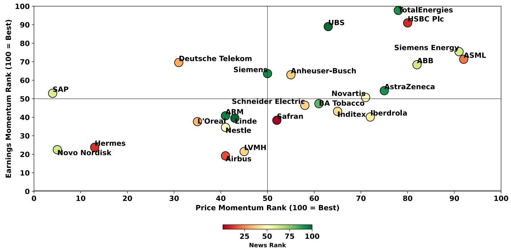  
Source : BofA Global Quantitative Strategy, MSCI, IBES, FactSet, RavenPack   
BofA GLOBAL RESEARCH

Chart 90: Japan: Earnings Momentum (vertical axis), Price Momentum (horizontal axis), News Momentum (colour)   
Triple Momentum is most positive for Murata, Advantest and Fujikura   
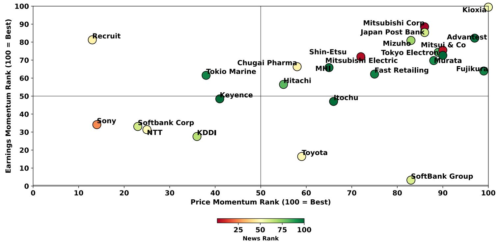

scatter

| Company           | Price Momentum Rank (100 = Best) | Earnings Momentum Rank (100 = Best) |
| ----------------- | -------------------------------- | ------------------------------------ |
| Kioxia            | 100                              | 100                                  |
| Advantest         | ~98                              | ~85                                  |
| Mitsubishi Corp   | ~87                              | ~90                                  |
| Japan Post Bank   | ~86                              | ~85                                  |
| Mizuho            | ~83                              | ~80                                  |
| Mitsui & Co       | ~90                              | ~75                                  |
| Murata            | ~88                              | ~70                                  |
| Tokyo Electron    | ~89                              | ~75                                  |
| Fast Retailing    | ~75                              | ~65                                  |
| MHI               | ~65                              | ~65                                  |
| Shin-Etsu         | ~72                              | ~70                                  |
| Mitsubishi Electric| ~70                              | ~65                                  |
| Hitachi           | ~55                              | ~55                                  |
| KDDI              | ~36                              | ~28                                  |
| Chugai Pharma     | ~48                              | ~65                                  |
| Keyence           | ~41                              | ~48                                  |
| Sony              | ~14                              | ~34                                  |
| NTT               | ~25                              | ~30                                  |
| Softbank Corp     | ~23                              | ~33                                  |
| Toyota            | ~59                              | ~16                                  |
| Fujikura          | ~98                              | ~65                                  |
| SoftBank Group    | ~83                              | ~4                                   |

Source : BofA Global Quantitative Strategy, MSCI, IBES, FactSet, RavenPack   
BofA GLOBAL RESEARCH

Chart 91: Asia Pac ex-Japan: Earnings Momentum (vertical axis), Price Momentum (horizontal axis), News Momentum (colour)   
Triple Momentum is most positive for Zhongji Innolight-A, Delta Electronics and Cambricon Tech   
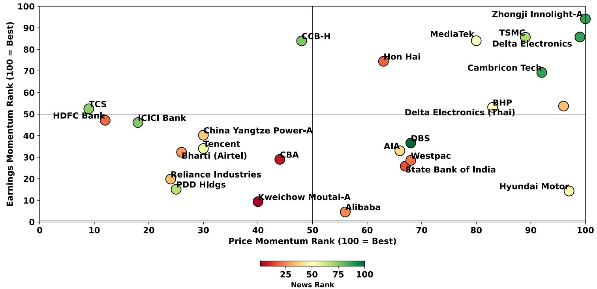

scatter

| Company | Price Momentum Rank (100 = Best) | Earnings Momentum Rank (100 = Best) | News Rank |
| --- | --- | --- | --- |
| Zhongji Innolight-A | 100 | 95 | 100 |
| TSMC | 90 | 85 | 75 |
| Delta Electronics | 90 | 85 | 75 |
| MediaTek | 80 | 83 | 75 |
| Cambricon Tech | 92 | 69 | 75 |
| BHP | 83 | 54 | 75 |
| Delta Electronics (Thai) | 96 | 54 | 75 |
| Hon Hai | 63 | 75 | 75 |
| CCB-H | 48 | 84 | 75 |
| China Yangtze Power-A | 30 | 40 | 75 |
| Tencent | 30 | 34 | 75 |
| CBA | 44 | 29 | 75 |
| AIA | 66 | 33 | 75 |
| DBS | 68 | 36 | 75 |
| Westpac | 68 | 28 | 75 |
| State Bank of India | 67 | 26 | 75 |
| Hyundai Motor | 97 | 14 | 75 |
| Kweichow Moutai-A | 40 | 10 | 75 |
| PDD Hldgs | 25 | 16 | 75 |
| Reliance Industries | 24 | 20 | 75 |
| ICICI Bank | 18 | 46 | 75 |
| HDC Bank | 12 | 48 | 75 |
| TCS | 9 | 52 | 75 |
| HDFC Bank | 8 | 52 | 75 |
| Alibaba | 56 | 5 | 75 |
| BHP (Thailand) | 83 | 54 | 75 |
| DSB (India) | 68 | 36 | 75 |
| State Bank of India (China) | 68 | 28 | 75 |
| CBA (China) | 30 | 34 | 75 |
| Bhatti (Airtel) (China) | 26 | 32 | 75 |
| Kweichow Moutai-A (China) | 40 | 10 | 75 |
| Kweichow Moutai-A (Australia) (China) | 40 | 10 | 75 |
| Kweichow Moutai-A (Australia) (Australia) (China) | 40 | 10 | 75 |
| Kweichow Moutai-A (Australia) (Australia) (Australia) (China) | 40 | 10 | 75 |
| Kweichow Moutai-A (Australia) (Australia) (Australia) (China) | 40 | 10 | 75 |
| Kweichow Moutai-A (Australia) (Australia) (Australia) (China) | 40 | 10 | 75 |
| Kweichow Moutai-A ((Australia) - China) | 40 | 10 | 75 |
| Kweichow Moutai-A ((Australia) - Australia) - Australia (China) | 40 | 10 | 75 |
| Kweichow Moutai-A ((Australia) - South Africa) - Australia (China) | 40 | 10 | 75 |
| Kweichow Moutai-A ((Australia) - South Africa) - South Africa (China) | 40 | 10 | 75 |
| Kweichow Moutai-A ((Australia) - South Africa) - South Africa (China) | 40 | 10 | 75 |
| Kweichow Moutai-A ((Australia) - South Africa) - South Africa (China) | 40 | 10 | 75 |
| Kweichow Moutai-A ((Australia) - Australia) - Australia (China) | 40 | 10 | 75 |
| Kweichow Moutai-A ((Australia) - Australia) - Australia (China) | 40 | 10 | 75 |
| Kweichow Moutai-A ((Australia) - South Africa) - Australia (China) | 40 | 10 | 75 |
| Kweichow Moutai-A ((Australia) - South Africa) - Australia (China) | 40 | 10 | 75 |
| Kweichow Moutai-A ((Australia) - South Africa) - Australia (China) | 40 | 10 | 75 |
| Kweichow Moutai-A ((Australia) – South Africa) - Australia (China) | 40 | 10 | 75 |
| Kweichow Moutai-A ((Australia) – South Africa) - Australia (China) | 40 | 10 | 75 |
| Kweichow Moutai-A ((Australia) – South Africa) - Australia (China) | 40 | 10 | 75 |
| Kweichow Moutai-A ((South Africa) - South Africa) - Australia (China) | 40 | 10 | 75 |
| Kweichow Moutai-A ((South Africa) - South Africa) - Australia (China) | 40 | 10 | 75 |
| Kweichow Moutai-A ((South Africa) - South Africa) - Australia (China) | 40 | 10 | 75 |
| Kweichow Moutai-Ana (South Africa) - Australia (China) - Australia (USA) - USA-Brazilian Federation (USA-Brazilian Federation), USA-Brazilian Federation (USA-Brazilian Federation), USA-Brazilian Federation (USA-Brazilian Federation), USA-Brazilian Federation (USA-Brazilian Federation), USA-Brazilian Federation (USA-Brazilian Federation), USA-Brazilian Federation (USA-Brazilian Federation), USA-Brazilian Federation (USA-Brazilian Federation), USA-Brazilian Federation (USA-Brazilian Federation), USA-Brazilian Federation (USA-Brazilian Federation), USA-BrazilIAN Federation (USA-Brazilian Federation), USA-Brazilian Federation (USA-Brazilian Federation), USA-Brazilian Federation (USA-Brazilian Federation), USA-Brazilian Federation (USA-Brazilian Federation), USA-Brazilian Federation (USA-Brazilian Federation), USA-Brazilian Federation (USA-Brazilian Federation), USA-Brazilian Federation (USA-Brazilian Federation), USA-Brazilian Federation (USA-Brazilian Federation), USA-Brazilian Federation (USA-Greece/Southeast Asia-Pacific, Europe/Southeast Asia-Pacific, North America/Southeast Asia-Pacific, North America/Southeast Asia-Pacific, North America/Southeast Asia-Pacific, North America/Southeast Asia-Pacific, North America/Southeast Asia-Pacific, North America/Southeast Asia-Pacific, North America/Southeast Asia-Pacific, North America/Southeast Asia-Pacific, North America/Southeast Asia-Pacific, North America/Southeast Asia-Pacific, North America/Southeast Asia-Pacific, North America/Southeast Asia-Pacific, North America/Southeast Asian Pacifico, North America/Southeast Asia Pacifico, North America/Southeast Asia Pacifico, North America/Southeast Asia Pacifico, North America/Southeast Asia Pacifico, North America/Southeast Asia Pacifico, North America/Southeast Asia Pacifico, North America/Southeast Asia Pacifico, North America/Southeast Asia Pacifico, North America/Southeast Asia Pacifico, North America/Southeast Asia Pacifico, North America/Southeast Asia Pacifico, North America/Southeast Asia/Pacificotimes, North America/Southeast Asia/Pacificotimes, North America/Southeast Asia/Pacificotimes, North America/Southeast Asia/Pacificotimes, North America/Southeast Asia/Pacificotimes, North America/Southeast Asia/Pacificotimes, North America/Southeast Asia/Pacificotimes, North America/Southeast Asia/Pacificotimes, North America/Southeast Asia/Pacificotimes, North America/Southeast Asia/Pacificotimes<nl>

Source : BofA Global Quantitative Strategy, MSCI, IBES, FactSet, RavenPack   
BofA GLOBAL RESEARCH

Chart 92: Emerging ex-Asia: Earnings Momentum (vertical axis), Price Momentum (horizontal axis), News Momentum (colour)   
Triple Momentum is most positive for Nebius, ORLEN and Aselsan   
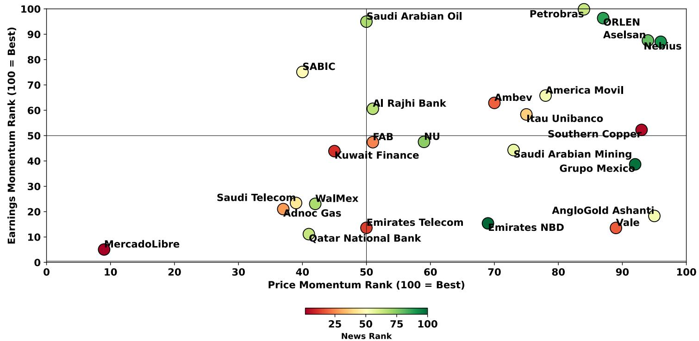

scatter

| Company | Price Momentum Rank (100 = Best) | Earnings Momentum Rank (100 = Best) |
| --- | --- | --- |
| MercadoLibre | 9 | 6 |
| SABIC | 40 | 75 |
| Saudi Arabian Oil | 50 | 95 |
| Al Rajhi Bank | 51 | 61 |
| FAB | 50 | 48 |
| Kuwait Finance | 45 | 44 |
| Saudi Telecom | 38 | 22 |
| WalMex | 42 | 23 |
| Adnoc Gas | 37 | 21 |
| Qatar National Bank | 41 | 11 |
| Emirates Telecom | 50 | 14 |
| Petrobras | 84 | 99 |
| Ambev | 70 | 63 |
| Itau Unibanco | 75 | 58 |
| Southern Copper | 93 | 52 |
| Saudi Arabian Mining | 73 | 44 |
| Grupo Mexico | 92 | 38 |
| Emirates NBD | 69 | 15 |
| AngloGold Ashanti | 96 | 18 |
| Vale | 89 | 14 |
| Aselsan | 94 | 88 |
| NEblus | 96 | 87 |
| ORENN | 87 | 96 |
| America Movil | 78 | 66 |
| Saudi Arabian Oil | 50 | 95 |
| Nu | 59 | 48 |
| MercadoLibre | 9 | 6 |

Source : BofA Global Quantitative Strategy, MSCI, IBES, FactSet, RavenPack   
BofA GLOBAL RESEARCH

# Global Sectors: Triple Momentum Charts

Chart 93: Banks: Earnings Momentum (vertical axis), Price Momentum (horizontal axis), News Momentum (colour)   
Triple Momentum is most positive for CaixaBank, ING and Citi   
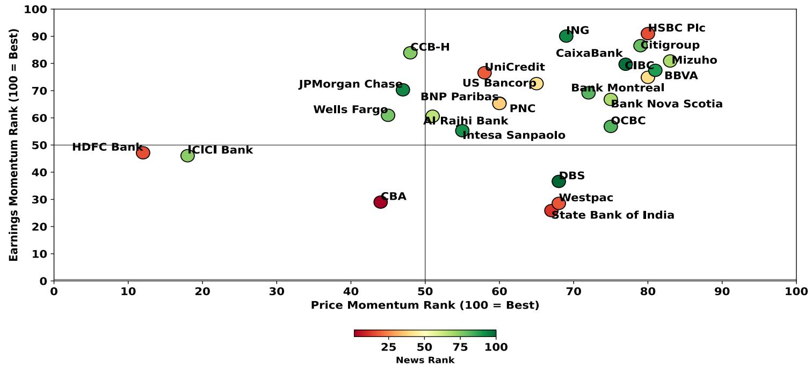

scatter

| Company | Price Momentum Rank (100 = Best) | Earnings Momentum Rank (100 = Best) |
| --- | --- | --- |
| HDFC Bank | 12 | 47 |
| ICICI Bank | 18 | 46 |
| JPM Chase | 47 | 70 |
| Wells Fargo | 45 | 61 |
| CBA | 44 | 29 |
| CCB-H | 48 | 84 |
| US Bancorp | 58 | 76 |
| BNPP | 60 | 65 |
| Al Rajhi Bank | 51 | 60 |
| Intesa Sanpaolo | 55 | 55 |
| PNC | 60 | 73 |
| Bank Nova Scotia | 72 | 66 |
| Bank Montreal | 72 | 69 |
| CIBC | 77 | 80 |
| CAixaBank | 78 | 80 |
| ING | 69 | 90 |
| HSBC Plc | 80 | 91 |
| Citi | 79 | 87 |
| Mizuho | 83 | 81 |
| BBVA | 81 | 77 |
| Bank Nova Scotia | 75 | 66 |
| OCBC | 75 | 57 |
| DBS | 68 | 37 |
| Westpac | 68 | 28 |
| State Bank of India | 68 | 26 |

Source : BofA Global Quantitative Strategy, MSCI, IBES, FactSet, RavenPack

BofA GLOBAL RESEARCH

Chart 94: Consumer Discretionary: Earnings Momentum (vertical axis), Price Momentum (horizontal axis), News Momentum (colour)   
Triple Momentum is most positive for Fast Retailing   
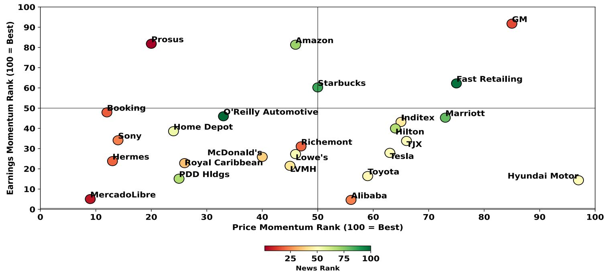

scatter

| Company           | Price Momentum Rank (100 = Best) | Earnings Momentum Rank (100 = Best) |
| ----------------- | -------------------------------- | ------------------------------------ |
| GM                | 85                               | 92                                   |
| Fast Retailing    | 75                               | 63                                   |
| Marriott          | 73                               | 46                                   |
| Inditex           | 65                               | 43                                   |
| Hilton            | 64                               | 41                                   |
| TJX               | 66                               | 34                                   |
| Tesla             | 63                               | 28                                   |
| Toyota            | 59                               | 17                                   |
| Alibaba           | 56                               | 5                                    |
| Amazon            | 50                               | 82                                   |
| Starbucks         | 50                               | 61                                   |
| O'Reilly Automotive| 33                               | 46                                   |
| Home Depot        | 24                               | 39                                   |
| Richmond         | 47                               | 31                                   |
| LVMH              | 45                               | 21                                   |
| LVMH              | 46                               | 27                                   |
| McDonald's        | 40                               | 26                                   |
| Royal Caribbean   | 26                               | 23                                   |
| Sony              | 14                               | 35                                   |
| Booking           | 12                               | 48                                   |
| Hermes            | 13                               | 24                                   |
| PDD Hldgs         | 25                               | 16                                   |
| MercadoLibre      | 9                                | 6                                    |

Source : BofA Global Quantitative Strategy, MSCI, IBES, FactSet, RavenPack

BofA GLOBAL RESEARCH

Chart 95: Consumer Staples: Earnings Momentum (vertical axis), Price Momentum (horizontal axis), News Momentum (colour)   
Triple Momentum is most positive for Target   
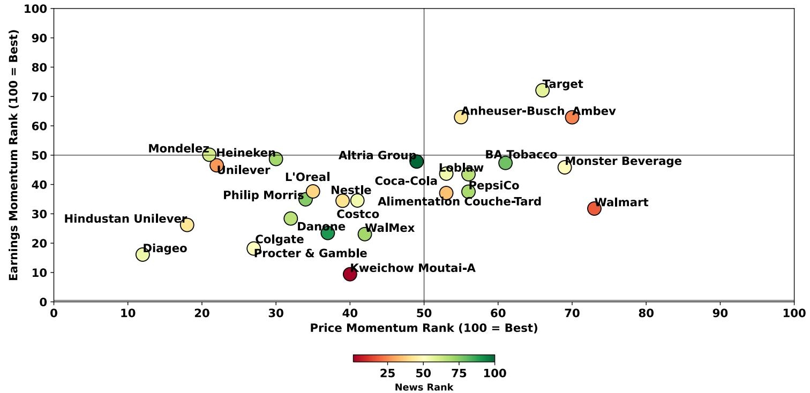

scatter

| Brand               | Price Momentum Rank (100 = Best) | Earnings Momentum Rank (100 = Best) |
| ------------------- | --------------------------------- | ------------------------------------- |
| Target              | 67                                | 73                                    |
| Anheuser-Busch      | 55                                | 64                                    |
| Ambev               | 70                                | 63                                    |
| WalMex              | 42                                | 23                                    |
| Walmart             | 73                                | 32                                    |
| Altria Group        | 49                                | 48                                    |
| Coca-Cola           | 53                                | 44                                    |
| PepsiCo            | 57                                | 38                                    |
| Bouche-Tard         | 61                                | 47                                    |
| Loblaw              | 56                                | 43                                    |
| Alimentation        | 54                                | 37                                    |
| Costco              | 41                                | 34                                    |
| Nestle              | 39                                | 35                                    |
| Danone              | 37                                | 23                                    |
| Colgate             | 28                                | 19                                    |
| Procter & Gamble    | 32                                | 28                                    |
| Kweichow            | 40                                | 10                                    |
| Moutai-A            | 40                                | 10                                    |
| Hindsian Unilever   | 18                                | 26                                    |
| Diageo              | 12                                | 16                                    |
| Heineken            | 22                                | 50                                    |
| Unilever            | 22                                | 47                                    |
| Mondelez            | 21                                | 50                                    |
| L'Oreal             | 35                                | 38                                    |
| Philip Morris       | 34                                | 35                                    |
| Nestle              | 39                                | 34                                    |
| WalMex              | 42                                | 23                                    |
| Unilever            | 22                                | 47                                    |
| Mondelez            | 21                                | 50                                    |
| The chart includes a color scale labeled 'News Rank' ranging from 25 to 100. The labels are 'Target', 'Ambev', 'Walmart', etc. The data points are labeled with company names and their corresponding values. There is no explicit numerical data provided in the image.

Source : BofA Global Quantitative Strategy, MSCI, IBES, FactSet, RavenPack   
BofA GLOBAL RESEARCH

Chart 96: Diversified Financials: Earnings Momentum (vertical axis), Price Momentum (horizontal axis), News Momentum (colour)   
Triple Momentum is most positive for BNY Mellon and UBS   
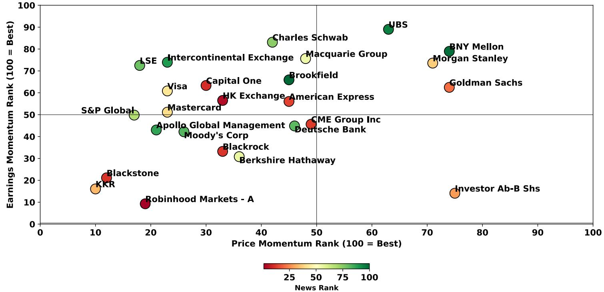

scatter

| Company | Price Momentum Rank (100 = Best) | Earnings Momentum Rank (100 = Best) |
| --- | --- | --- |
| LSE | 18 | 73 |
| Intercontinental Exchange | 23 | 74 |
| Visa | 23 | 61 |
| Mastercard | 23 | 51 |
| Capital One | 30 | 64 |
| HK Exchange | 33 | 57 |
| S&P Global | 17 | 50 |
| Apollo Global Management | 21 | 43 |
| Moody's Corp | 26 | 42 |
| Blackrock | 33 | 33 |
| Berkshire Hathaway | 36 | 31 |
| Charles Schwab | 42 | 83 |
| MQ Group | 48 | 76 |
| Brookfield | 45 | 66 |
| UBS | 63 | 90 |
| BNY Mellon | 74 | 79 |
| MS | 71 | 74 |
| GS | 74 | 63 |
| CME Group Inc | 49 | 46 |
| DB | 46 | 45 |
| Robinhood Markets - A | 19 | 9 |
| KKR | 10 | 16 |
| Blackstone | 12 | 21 |
| Investor Ab-B Shs | 75 | 14 |

Source : BofA Global Quantitative Strategy, MSCI, IBES, FactSet, RavenPack   
BofA GLOBAL RESEARCH

Chart 97: Energy: Earnings Momentum (vertical axis), Price Momentum (horizontal axis), News Momentum (colour)   
Triple Momentum is most positive for ENI, Marathon Petrol and Equinor   
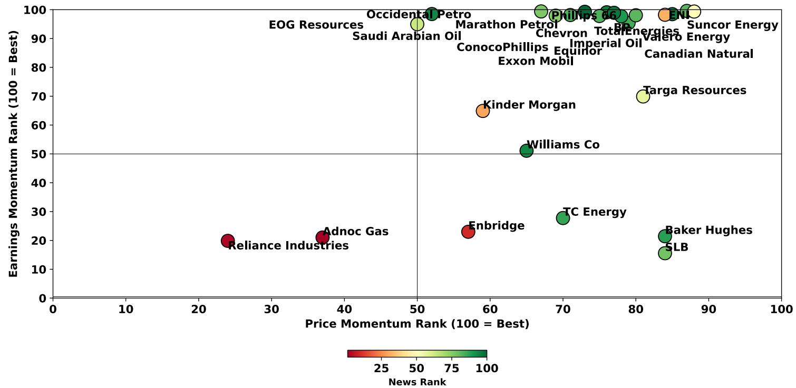

scatter

| Company | Earnings Momentum Rank (100 = Best) | Price Momentum Rank (100 = Best) | News Rank |
| --- | --- | --- | --- |
| EOG Resources | 95 | 48 | 50 |
| Saudi Arabian Oil | 93 | 47 | 50 |
| Occidental Petro | 98 | 51 | 50 |
| Ecuadorian Petroleum & Gas | 97 | 68 | 50 |
| Marathon Petrol | 96 | 67 | 50 |
| Chevron | 98 | 70 | 50 |
| TotalEnergies | 97 | 75 | 50 |
| Imperial Oil | 96 | 78 | 50 |
| Valero Energy | 95 | 80 | 50 |
| ConocoPhillips | 88 | 60 | 50 |
| Equinor | 87 | 65 | 50 |
| Exxon Mobil | 86 | 62 | 50 |
| Targa Resources | 70 | 81 | 50 |
| Kinder Morgan | 65 | 59 | 50 |
| Williams Co | 51 | 64 | 50 |
| Enbridge | 23 | 57 | 50 |
| TC Energy | 28 | 70 | 50 |
| Baker Hughes | 21 | 84 | 50 |
| SLB | 16 | 83 | 50 |
| Suncor Energy | 99 | 88 | 50 |
| Canadian Natural | - | - | 50 |
| Reliance Industries | 20 | 24 | 50 |
| Adnoc Gas | 21 | 37 | 50 |
| Reliance Industries (Reliance Industries) | - | - | 25 |
The chart displays a scatter plot with color-coded ranks from top-left to bottom-right. The x-axis represents Price Momentum Rank (100 = Best), and the y-axis represents Earnings Momentum Rank (100 = Best). Each point corresponds to a company or product, with color intensity indicating News Rank (25–100). The data points are labeled with company names and their corresponding rank values.

Source : BofA Global Quantitative Strategy, MSCI, IBES, FactSet, RavenPack   
BofA GLOBAL RESEARCH

Chart 98: Health Care: Earnings Momentum (vertical axis), Price Momentum (horizontal axis), News Momentum (colour)   
Triple Momentum is most positive for CVS Health Corp, AstraZeneca and Merck   
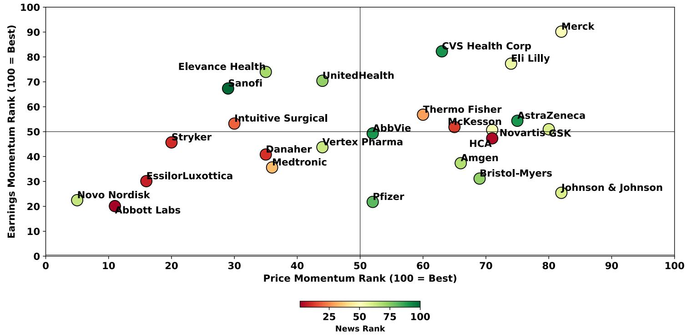

scatter

| Company             | Price Momentum Rank (100 = Best) | Earnings Momentum Rank (100 = Best) |
|---------------------|----------------------------------|--------------------------------------|
| Merck               | 82                               | 90                                   |
| CVS Health Corp     | 63                               | 82                                   |
| Eli Lilly           | 74                               | 78                                   |
| AstraZeneca        | 75                               | 55                                   |
| Novartis GSK        | 80                               | 50                                   |
| Amgen               | 66                               | 37                                   |
| Bristol-Myers       | 69                               | 31                                   |
| Pharma              | 52                               | 50                                   |
| AbbVie              | 52                               | 49                                   |
| Medtronic           | 36                               | 36                                   |
| Danaher             | 35                               | 41                                   |
| Intuitive Surgical  | 30                               | 53                                   |
| Sanofi              | 29                               | 68                                   |
| Elevance Health     | 35                               | 74                                   |
| Stryker             | 20                               | 46                                   |
| Novo Nordisk        | 11                               | 20                                   |
| EssilorLuxottica    | 16                               | 30                                   |
| Abbott Labs         | 11                               | 20                                   |
| Pfizer              | 52                               | 22                                   |

Source : BofA Global Quantitative Strategy, MSCI, IBES, FactSet, RavenPack   
BofA GLOBAL RESEARCH

Chart 99: Industrials: Earnings Momentum (vertical axis), Price Momentum (horizontal axis), News Momentum (colour)   
Triple Momentum is most positive for GE Vernova, Caterpillar and Quanta Services   
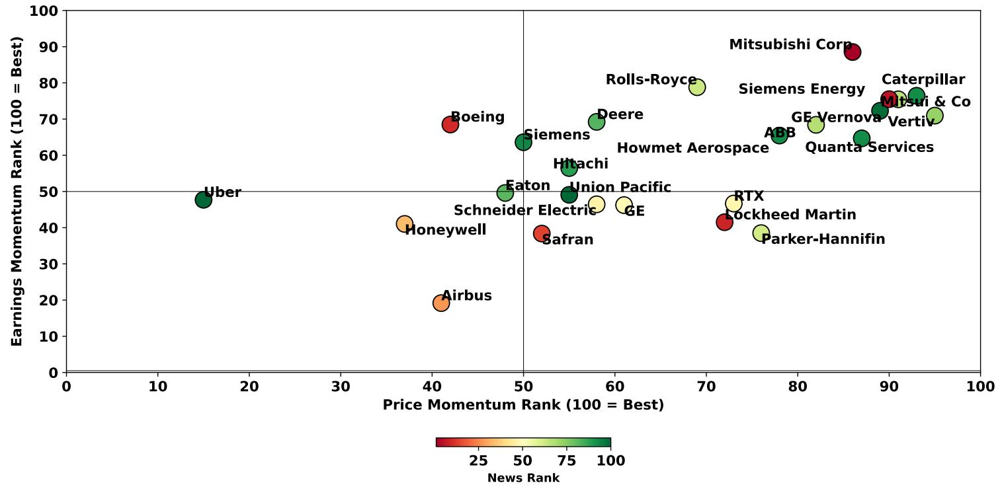

scatter

| Company             | Price Momentum Rank (100 = Best) | Earnings Momentum Rank (100 = Best) |
|---------------------|-----------------------------------|--------------------------------------|
| Mitsubishi Corp     | 87                                | 89                                   |
| Caterpillar         | 92                                | 76                                   |
| Siemens Energy      | 90                                | 73                                   |
| Mitsui & Co         | 91                                | 74                                   |
| Vertiv              | 95                                | 71                                   |
| GE Vernova          | 82                                | 69                                   |
| ABB                 | 78                                | 65                                   |
| Quanta Services     | 87                                | 64                                   |
| Rolls-Royce         | 69                                | 79                                   |
| Deere               | 58                                | 69                                   |
| Siemens             | 50                                | 64                                   |
| Boeing              | 42                                | 69                                   |
| Eaton               | 48                                | 50                                   |
| Hitachi             | 55                                | 57                                   |
| Union Pacific       | 58                                | 47                                   |
| Schneider Electric  | 55                                | 49                                   |
| GE                  | 61                                | 46                                   |
| Safran              | 52                                | 38                                   |
| RTX                 | 73                                | 47                                   |
| Lockheed Martin      | 72                                | 42                                   |
| Parker-Hannifin     | 76                                | 38                                   |
| Airbus              | 41                                | 20                                   |
| Honeywell           | 37                                | 41                                   |
| Uber                | 15                                | 48                                   |

Source : BofA Global Quantitative Strategy, MSCI, IBES, FactSet, RavenPack   
BofA GLOBAL RESEARCH

Chart 100: Insurance: Earnings Momentum (vertical axis), Price Momentum (horizontal axis), News Momentum (colour)   
Triple Momentum is most positive for Great-West Life, Travelers Cos and MS&AD Insurance   
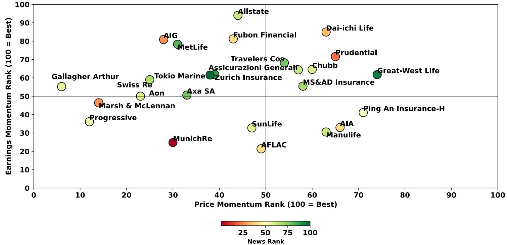

scatter

| Company | Price Momentum Rank (100 = Best) | Earnings Momentum Rank (100 = Best) |
| --- | --- | --- |
| Allstate | 45 | 95 |
| AIG | 28 | 81 |
| Fubon Financial | 43 | 82 |
| Dai-ichi Life | 63 | 85 |
| Prudential | 65 | 72 |
| Chubb | 60 | 65 |
| Great-West Life | 74 | 62 |
| Travelers Cos. | 54 | 68 |
| Zurich Insurance | 57 | 64 |
| MS&AD Insurance | 58 | 55 |
| Ann SA | 33 | 51 |
| Tokyo Marine | 38 | 62 |
| Accurazioni Generali | 39 | 61 |
| Swiss Re | 25 | 59 |
| Aon | 23 | 50 |
| Progressive | 12 | 36 |
| MunichRe | 30 | 25 |
| SunLife | 47 | 33 |
| AFLAC | 49 | 21 |
| Manulife | 66 | 31 |
| Ring An Insurance-H | 71 | 41 |
| Dallagher Arthur | 6 | 55 |
| Marsh & McLennan | 14 | 46 |
| Gallagher Arthur | 6 | 55 |

Source : BofA Global Quantitative Strategy, MSCI, IBES, FactSet, RavenPack   
BofA GLOBAL RESEARCH

Chart 101: Materials: Earnings Momentum (vertical axis), Price Momentum (horizontal axis), News Momentum (colour)   
Triple Momentum is most positive for Nucor, Corteva and Glencore   
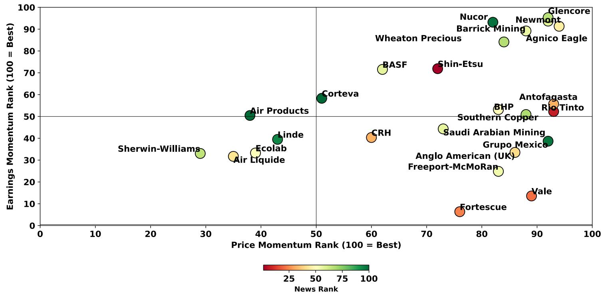

scatter

| Company | Price Momentum Rank (100 = Best) | Earnings Momentum Rank (100 = Best) |
| --- | --- | --- |
| Glencore | 93 | 96 |
| Newmont | 92 | 94 |
| Agnico Eagle | 94 | 91 |
| Nucor | 82 | 93 |
| Barrick Mining | 83 | 89 |
| Wheaton Precious | 84 | 84 |
| BASF | 62 | 72 |
| Shin-Etsu | 72 | 72 |
| Corteva | 51 | 59 |
| BHP | 83 | 53 |
| Antofagasta | 93 | 56 |
| Rio Tinto | 93 | 53 |
| Southern Copper | 88 | 51 |
| Saudi Arabian Mining | 73 | 44 |
| Grupo Mexico | 86 | 38 |
| Anglo American (UK) | 86 | 34 |
| Freeport-McMoRan | 83 | 25 |
| CRH | 60 | 41 |
| Air Products | 38 | 51 |
| Linde | 43 | 40 |
| Ecolab | 39 | 34 |
| Air Liquide | 35 | 32 |
| Sherwin-Williams | 29 | 33 |
| Fortescue | 76 | 6 |
| Vale | 89 | 14 |

Source : BofA Global Quantitative Strategy, MSCI, IBES, FactSet, RavenPack   
BofA GLOBAL RESEARCH

Chart 102: Media & Entertainment: Earnings Momentum (vertical axis), Price Momentum (horizontal axis), News Momentum (colour)   
None of the stocks are in the Top-Right Quadrant with Positive News   
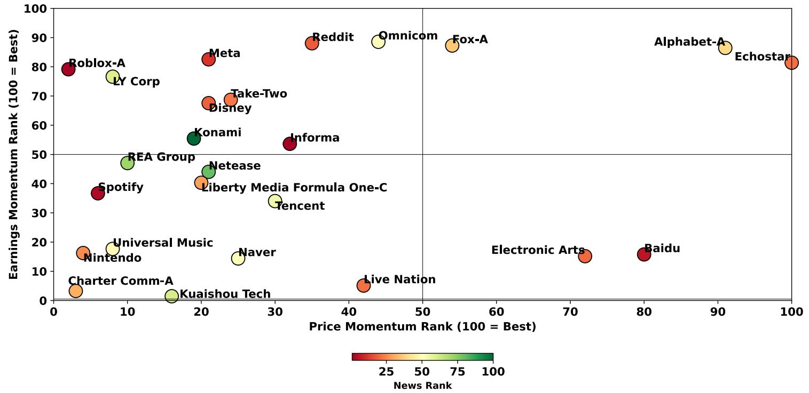

scatter

| Company             | Price Momentum Rank (100 = Best) | Earnings Momentum Rank (100 = Best) |
|---------------------|-----------------------------------|--------------------------------------|
| Roblox-A            | ~3                                | ~80                                  |
| LY Corp             | ~8                                | ~76                                  |
| Meta                | ~21                               | ~83                                  |
| Take-Two            | ~24                               | ~69                                  |
| Disney              | ~21                               | ~67                                  |
| Konami              | ~19                               | ~56                                  |
| Informa             | ~32                               | ~54                                  |
| REA Group           | ~10                               | ~47                                  |
| Netease             | ~21                               | ~44                                  |
| Liberty Media Formula One-C | ~30                              | ~34                                  |
| Tencent             | ~30                               | ~34                                  |
| Naver               | ~25                               | ~15                                  |
| Universal Music     | ~8                                | ~18                                  |
| Naim                | ~5                                | ~16                                  |
| Charter Comm-A      | ~4                                | ~4                                   |
| Kuaishou Tech       | ~16                               | ~2                                   |
| Live Nation         | ~42                               | ~6                                   |
| Electronic Arts     | ~72                               | ~15                                  |
| Baidu               | ~80                               | ~16                                  |
| Alphabet-A         | ~91                               | ~87                                  |
| Echostar            | ~100                              | ~81                                  |

Source : BofA Global Quantitative Strategy, MSCI, IBES, FactSet, RavenPack   
BofA GLOBAL RESEARCH

Chart 103: Real Estate: Earnings Momentum (vertical axis), Price Momentum (horizontal axis), News Momentum (colour)   
Triple Momentum is most positive for Welltower and Equinix   
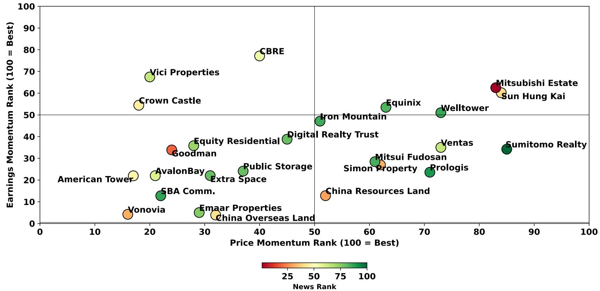

scatter

| Company | Price Momentum Rank (100 = Best) | Earnings Momentum Rank (100 = Best) |
| --- | --- | --- |
| CBRE | 40 | 78 |
| Vici Properties | 20 | 68 |
| Crown Castle | 18 | 55 |
| American Tower | 17 | 22 |
| SBA Comm. | 22 | 13 |
| Emaar Properties | 30 | 5 |
| Public Storage | 37 | 24 |
| Extra Space | 32 | 4 |
| Equinix | 63 | 54 |
| Digital Realty Trust | 45 | 39 |
| Iron Mountain | 51 | 47 |
| Mitsubishi Estate | 83 | 62 |
| Sun Hung Kai | 84 | 60 |
| Vestas | 73 | 35 |
| Prologis | 71 | 24 |
| Mitsui Fudosan | 61 | 28 |
| China Resources Land | 52 | 13 |
| Common Stock Exchange | 21 | 22 |
| Goldman | 24 | 34 |
| Public Storage & Advertising | 29 | 22 |
| Vonovia | 16 | 4 |
| Other Companies listed in the lower-left quadrant are not explicitly labeled. The chart uses a color gradient from red (lower rank) to green (higher rank).

Source : BofA Global Quantitative Strategy, MSCI, IBES, FactSet, RavenPack   
BofA GLOBAL RESEARCH

Chart 104: Semiconductors: Earnings Momentum (vertical axis), Price Momentum (horizontal axis), News Momentum (colour)   
Triple Momentum is most positive for STMicroelectronics, Intel and AMD   
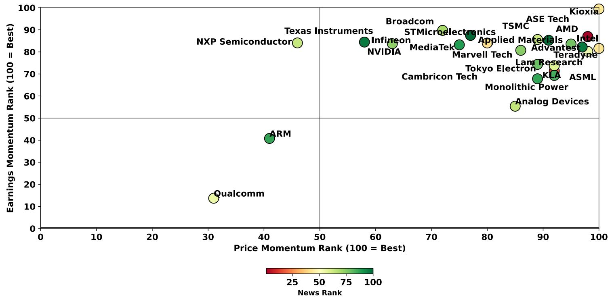

scatter

| Company             | Price Momentum Rank (100 = Best) | Earnings Momentum Rank (100 = Best) |
|---------------------|-----------------------------------|--------------------------------------|
| NXP Semiconductor    | 45                                | 85                                   |
| Texas Instruments   | 45                                | 85                                   |
| Infineon            | 60                                | 85                                   |
| NVIDIA              | 60                                | 85                                   |
| Broadcom            | 70                                | 90                                   |
| STMicroelectronics  | 70                                | 90                                   |
| MediaTek            | 70                                | 85                                   |
| Medtronic           | 70                                | 85                                   |
| Marvell Tech        | 70                                | 85                                   |
| Applied Materials   | 80                                | 85                                   |
| TSMC                | 80                                | 85                                   |
| ASE Tech            | 80                                | 90                                   |
| AMD                 | 80                                | 90                                   |
| Intel               | 80                                | 90                                   |
| Antaresis           | 80                                | 90                                   |
| Teradyne            | 80                                | 90                                   |
| Lam Research        | 80                                | 90                                   |
| Tokyo Electron      | 80                                | 90                                   |
| KLA                 | 80                                | 90                                   |
| ASML                | 80                                | 90                                   |
| Monolithic Power    | 80                                | 90                                   |
| Analog Devices      | 80                                | 90                                   |
| ARM                 | 40                                | 40                                   |
| Qualcomm            | 30                                | 15                                   |
| Kioxia              | 100                               | 100                                  |

Source : BofA Global Quantitative Strategy, MSCI, IBES, FactSet, RavenPack   
BofA GLOBAL RESEARCH

Chart 105: Software: Earnings Momentum (vertical axis), Price Momentum (horizontal axis), News Momentum (colour)   
Triple Momentum is most positive for Nebius   
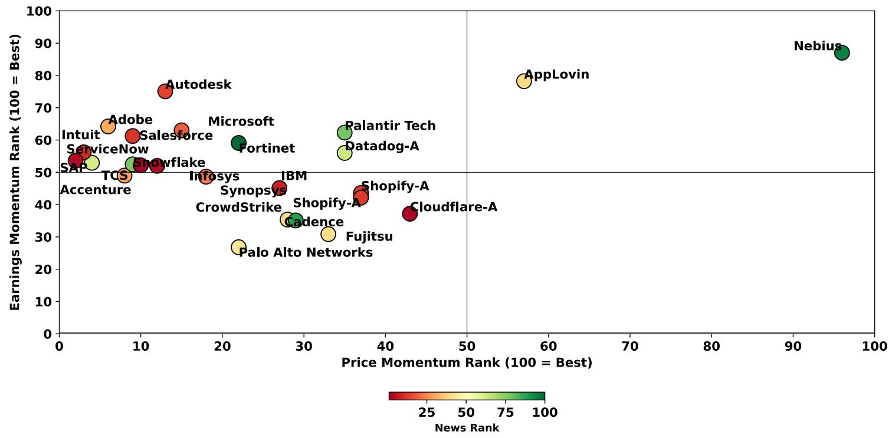

scatter

| Company           | Price Momentum Rank (100 = Best) | Earnings Momentum Rank (100 = Best) |
| ----------------- | --------------------------------- | ------------------------------------- |
| Autodesk          | 13                                | 75                                    |
| Microsoft         | 14                                | 62                                    |
| Adobe             | 6                                 | 65                                    |
| Salesforce        | 15                                | 62                                    |
| SAP               | 2                                 | 55                                    |
| ServiceNow        | 9                                 | 52                                    |
| Snowflake         | 11                                | 52                                    |
| TCS               | 8                                 | 50                                    |
| Accenture         | 4                                 | 53                                    |
| Portinet          | 22                                | 59                                    |
| Infosys           | 18                                | 49                                    |
| IBM               | 27                                | 46                                    |
| Synopsys          | 27                                | 45                                    |
| CrowdStrike       | 28                                | 36                                    |
| Shopify-A         | 37                                | 43                                    |
| Shopify-A         | 37                                | 42                                    |
| Cadence           | 29                                | 35                                    |
| Palo Alto Networks| 22                                | 27                                    |
| Fujitsu           | 33                                | 31                                    |
| AppLovin          | 57                                | 78                                    |
| Palantir Tech     | 35                                | 62                                    |
| Datadog-A         | 35                                | 56                                    |
| Cloudflare-A      | 43                                | 38                                    |
| Nebius            | 96                                | 87                                    |

Source : BofA Global Quantitative Strategy, MSCI, IBES, FactSet, RavenPack   
BofA GLOBAL RESEARCH

Chart 106: Tech Hardware: Earnings Momentum (vertical axis), Price Momentum (horizontal axis), News Momentum (colour)   
Triple Momentum is most positive for SEMCO, Murata and Zhongji Innolight-A   
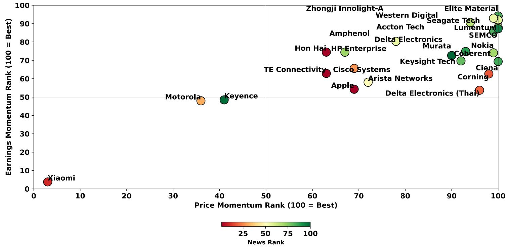

scatter

| Company | Price Momentum Rank (100 = Best) | Earnings Momentum Rank (100 = Best) | News Rank |
| --- | --- | --- | --- |
| Xiaomi | 3 | 5 | 25 |
| Motorola | 36 | 48 | 50 |
| Keyence | 41 | 49 | 75 |
| Tesla Connectivity | 63 | 63 | 25 |
| Apple | 69 | 54 | 25 |
| Cisco Systems | 69 | 65 | 50 |
| HP Enterprise | 67 | 74 | 50 |
| Amphenol | 63 | 74 | 25 |
| Delta Electronics (Thailand) | 96 | 53 | 50 |
| Arista Networks | 72 | 58 | 25 |
| Corning | 98 | 63 | 25 |
| Ciena | 98 | 63 | 25 |
| Keysight Tech | 92 | 70 | 50 |
| Murata | 90 | 73 | 25 |
| Nokia | 94 | 74 | 50 |
| Coherent | 93 | 74 | 25 |
| Delta Electronics | 97 | 53 | 25 |
| Semco | 100 | 88 | 100 |
| Lumentum | 100 | 88 | 100 |
| Seagate Tech | 100 | 92 | 100 |
| Western Digital | 100 | 92 | 100 |
| Accton Tech | 98 | 88 | 100 |
| Delta Electronics (Thailand) | 97 | 53 | 25 |
| Zhongji Innolight-A | 100 | 92 | 100 |
| Elite Material | 100 | 92 | 100 |
| Amazon Communications (Thailand) | 100 | 92 | 100 |
| Samsung Electronics (Thailand) | 100 | 92 | 100 |
| Sony Technologies (Thailand) | 100 | 92 | 100 |
| Sony Technologies (Thailand) | 100 | 92 | 100 |
| Sony Technologies (Thailand) | 100 | 92 | 100 |
| Sony Technologies (Thailand) | 100 | 92 | 100 |
| Sony Technologies (Thailand) | 100 | 100 | 100 |
| Sony Technologies (Thailand) | 100 | 100 | 100 |
| Sony Technologies (Thailand) | 100 | 100 | 100 |
| Sony Technologies (Thailand) | 100 | 100 | 100 |
| Sony Technologies (Thailand) | 100 | 100 | 100 |
| Tesla Technologies (Thailand) - Sony Technologies (Thailand) - Sony Technologies (Thailand) - Sony Technologies (Thailand) - Sony Technologies (Thailand) - Sony Technologies (Thailand) - Sony Technologies (Thailand) - Sony Technologies (Thailand) - Sony Technologies (Thailand) - Sony Technologies (Thailand) - Sony Technologies (Thailand) - Sony Technologies (Thailand) - Sony Technologies (Thailand) - Sony Technologies (Thailand) - Sony Technologies (Thailand) - Sony Technologies(Thailand) - Sony Technologies(Thailand) - Sony Technologies(Thailand) - Sony Technologies(Thailand) - Sony Technologies(Thailand) - Sony Technologies(Thailand) - Sony Technologies(Thailand) - Sony Technologies(Thailand) - Sony Technologies(Thailand) - Sony Technologies(Thailand) - Sony Technologies(Thailand) - Sony Technologies(Thailand) - Sony Technologies(Thailand) - Sony Technologies(Thailand) - Sony Technologies(Thobao) - Sony Technologies(Thobao) - Sony Technologies(Thobao) - Sony Technologies(Thobao) - Sony Technologies(Thobao) - Sony Technologies(Thobao) - Sony Technologies(Thobao) - Sony Technologies(Thobao) - Sony Technologies(Thobao) - Sony Technologies(Thobao) - Sony Technologies(Thobao) - Sony Technologies(Thobao) - Sony Technologies(Thobao) - Sony Technologies(Thobao) - Sony Technologies(Thobao) / Sony Technologies(Thobao) / Sony Technologies(Thobao) / Sony Technologies(Thobao) / Sony Technologies(Thobao) / Sony Technologies(Thobao) / Sony Technologies(Thobao) / Sony Technologies(Thobao) / Sony Technologies(Thobao) / Sony Technologies(Thobao) / Sony Technologies(Thobao) / Sony Technologies(Thobao) / Sony Technologies(Thobao) / Sony Technologies(Thobao) / Sony Technologies(Thobao) / Sony technologies/Thobao/Thobao/Thobao/Thobao/Thobao/Thobao/Thobao/Thobao/Thobao/Thobao/Thobao/Thobao/Thobao/Thobao/Thobao/Thobao/Thobao/Thobao/Thobao/Thobao/Thobao/Thobao/Thobao/Thobao/Thobao/Thobao/Thobao/Thobao/Thobao/Thobao/Thobao/Thobao/Thobao/Thobao/Cenina / Sony Technologies(Thailand) / Sony Technologies(Thailand) / Sony Technologies(Thailand) / Sony Technologies(Thailand) / Sony Technologies(Thailand) / Sony Technologies(Thailand) / Sony Technologies(Thailand) / Sony Technologies(Thailand) / Sony Technologies(Thailand) / Sony Technologies(Thailand) / Sony Technologies(Thailand) / Sony Technologies(Thailand) / Sony Technologies(Thailand)

Source : BofA Global Quantitative Strategy, MSCI, IBES, FactSet, RavenPack   
BofA GLOBAL RESEARCH

Chart 107: Telecom: Earnings Momentum (vertical axis), Price Momentum (horizontal axis), News Momentum (colour)   
Triple Momentum is most positive for Adv Info Serv, Vodafone and Verizon   
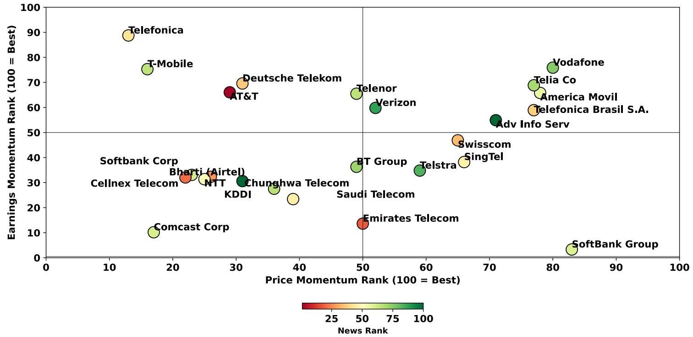

scatter

| Company | Price Momentum Rank (100 = Best) | Earnings Momentum Rank (100 = Best) | News Rank |
| --- | --- | --- | --- |
| Telefonica | 13 | 89 | 100 |
| T-Mobile | 16 | 75 | 75 |
| AT&T | 29 | 66 | 25 |
| Deutsche Telekom | 31 | 70 | 50 |
| Verizon | 52 | 60 | 50 |
| Telenor | 49 | 65 | 50 |
| Adv Info Serv | 71 | 55 | 75 |
| Vodafone | 80 | 76 | 100 |
| Telia Co | 77 | 69 | 75 |
| America Movil | 78 | 66 | 75 |
| Telefonica Brasil S.A. | 77 | 59 | 75 |
| Swisscom | 65 | 46 | 75 |
| SingTel | 66 | 38 | 75 |
| BT Group | 49 | 36 | 75 |
| Telstra | 59 | 34 | 75 |
| Saudi Telecom | 50 | 14 | 75 |
| Chunghwa Telecom | 36 | 27 | 75 |
| KDDI | 31 | 30 | 75 |
| NTT | 25 | 31 | 75 |
| Cellnex Telecom | 22 | 32 | 75 |
| Bharti (Airtel) | 23 | 32 | 75 |
| Softbank Corp | 22 | 32 | 75 |
| Comcast Corp | 17 | 10 | 75 |
| Emirates Telecom | 50 | 14 | 75 |
| SoftBank Group | 83 | 4 | 100 |

Source : BofA Global Quantitative Strategy, MSCI, IBES, FactSet, RavenPack   
BofA GLOBAL RESEARCH

Chart 108: Utilities: Earnings Momentum (vertical axis), Price Momentum (horizontal axis), News Momentum (colour)   
Triple Momentum is most positive for PG&E, Endesa and E.ON   
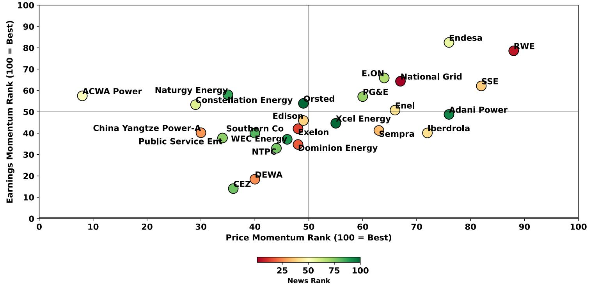

scatter

| Company             | Price Momentum Rank (100 = Best) | Earnings Momentum Rank (100 = Best) |
|---------------------|----------------------------------|--------------------------------------|
| ACWA Power          | 8                                | 58                                   |
| Naturgy Energy      | 30                               | 57                                   |
| Constellation Energy| 35                               | 54                                   |
| Edison              | 49                               | 46                                   |
| China Yangtze Power-A | 30                             | 40                                   |
| Public Service Ent   | 35                               | 38                                   |
| Southern Co         | 40                               | 39                                   |
| WEC Energy          | 45                               | 37                                   |
| NTPC                | 43                               | 33                                   |
| DEWA                | 40                               | 19                                   |
| CEZ                 | 36                               | 14                                   |
| Orsted              | 49                               | 54                                   |
| Edison              | 49                               | 42                                   |
| Exelon              | 48                               | 35                                   |
| Dominion Energy     | 47                               | 34                                   |
| PG&E                | 60                               | 57                                   |
| Ycel Energy         | 55                               | 45                                   |
| National Grid       | 67                               | 65                                   |
| Enel                | 66                               | 51                                   |
| Sempra              | 63                               | 41                                   |
| Iberdrola           | 72                               | 40                                   |
| Endesa              | 76                               | 82                                   |
| Adani Power         | 76                               | 49                                   |
| SSE                 | 82                               | 62                                   |
| RWE                 | 88                               | 79                                   |

Source : BofA Global Quantitative Strategy, MSCI, IBES, FactSet, RavenPack   
BofA GLOBAL RESEARCH

# Countries: Triple Momentum Charts

Chart 109: Australia largest 25 stocks by market cap: Earnings Momentum (vertical axis), Price Momentum (horizontal axis), News Momentum (colour)

Triple Momentum is most positive for Rio Tinto and Evolution Mining

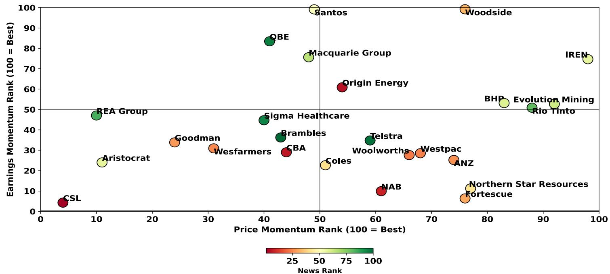

scatter

| Company               | Price Momentum Rank (100 = Best) | Earnings Momentum Rank (100 = Best) |
|-----------------------|----------------------------------|--------------------------------------|
| CSL                   | 5                                | 5                                    |
| REA Group             | 10                               | 48                                   |
| Goodman               | 25                               | 35                                   |
| Aristocrat            | 12                               | 25                                   |
| Bosnani              | 32                               | 30                                   |
| Wefarmers             | 32                               | 30                                   |
| Sigma Healthcare      | 40                               | 45                                   |
| Brambles              | 43                               | 37                                   |
| CBA                   | 44                               | 30                                   |
| Coles                 | 52                               | 23                                   |
| Telstra               | 59                               | 35                                   |
| Woolworths            | 66                               | 28                                   |
| Westpac               | 68                               | 29                                   |
| ANZ                   | 74                               | 25                                   |
| NAB                   | 61                               | 10                                   |
| Northern Star Resources | 77                             | 10                                   |
| Fortescue             | 77                               | 8                                    |
| BHP                   | 83                               | 53                                   |
| Evolution Mining      | 88                               | 50                                   |
| Rio Tinto             | 92                               | 53                                   |
| MQ Group       | 48                               | 76                                   |
| Origin Energy         | 54                               | 61                                   |
| Santos                | 49                               | 99                                   |
| Woodside              | 77                               | 99                                   |
| IREN                  | 98                               | 75                                   |

Source : BofA Global Quantitative Strategy, MSCI, IBES, FactSet, RavenPack

BofA GLOBAL RESEARCH

Chart 110: Australia stocks 26-50 by market cap: Earnings Momentum (vertical axis), Price Momentum (horizontal axis), News Momentum (colour)
Triple Momentum is most positive for Lynas Rare Earths

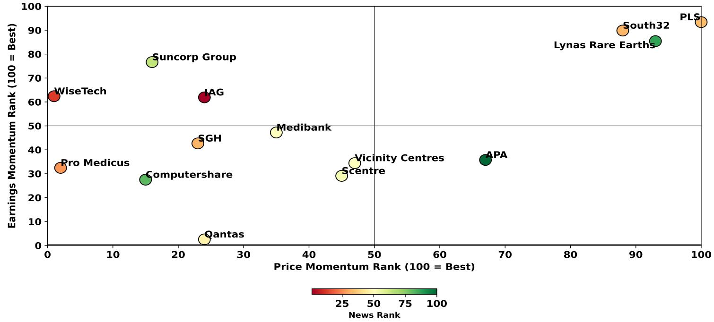

scatter

| Company             | Price Momentum Rank (100 = Best) | Earnings Momentum Rank (100 = Best) |
|---------------------|-----------------------------------|--------------------------------------|
| PLS                 | 100                               | 95                                   |
| South32             | 88                                | 90                                   |
| Lynas Rare Earths   | 93                                | 85                                   |
| APA                 | 67                                | 35                                   |
| Scentre              | 45                                | 30                                   |
| Vicinity Centres    | 47                                | 35                                   |
| Medibank            | 35                                | 48                                   |
| SGH                 | 23                                | 43                                   |
| IAG                 | 24                                | 62                                   |
| Suncorp Group       | 16                                | 77                                   |
| Pro Medicus         | 2                                 | 33                                   |
| Qantas               | 24                                | 3                                    |
| Computershare       | 15                                | 28                                   |
| WiseTech            | 1                                 | 62                                   |

Source : BofA Global Quantitative Strategy, MSCI, IBES, FactSet, RavenPack

BofA GLOBAL RESEARCH

Chart 111: China: Earnings Momentum (vertical axis), Price Momentum (horizontal axis), News Momentum (colour)   
Triple Momentum is most positive for Zhongji Innolight-A, Cambricon Tech and CITIC   
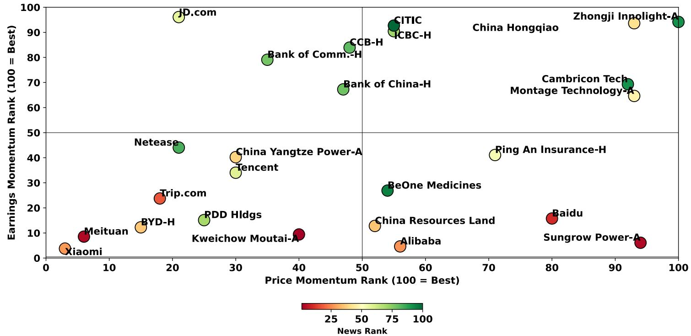

scatter

| Company | Price Momentum Rank (100 = Best) | Earnings Momentum Rank (100 = Best) |
| --- | --- | --- |
| JD.com | 21 | 96 |
| Bank of Comm.-H | 35 | 80 |
| CCB-H | 48 | 84 |
| Bank of China-H | 47 | 68 |
| CITIC | 55 | 92 |
| ICBC-H | 56 | 90 |
| Zhangji Innolight-A | 99 | 94 |
| China Hongqiao | 93 | 93 |
| Cambricon Tech Montage Technology-A | 93 | 68 |
| Ring An Insurance-H | 71 | 41 |
| BeOne Medicines | 54 | 27 |
| China Resources Land | 52 | 13 |
| Alibaba | 56 | 5 |
| Baidu | 80 | 16 |
| Sungrow Power-A | 94 | 6 |
| Kweichow Moutai-A | 40 | 10 |
| Trip.com | 18 | 24 |
| Tencent | 30 | 35 |
| China Yangtze Power-A | 30 | 40 |
| Netease | 21 | 44 |
| Meituan | 6 | 9 |
| BYD-H | 15 | 12 |
| PDD Hldgs | 25 | 15 |
| Xiaomi | 3 | 4 |

Source : BofA Global Quantitative Strategy, MSCI, IBES, FactSet, RavenPack   
BofA GLOBAL RESEARCH

Chart 112: India: Earnings Momentum (vertical axis), Price Momentum (horizontal axis), News Momentum (colour)   
Triple Momentum is most positive for JSW Steel   
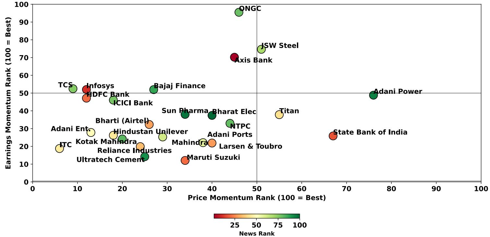  
Source : BofA Global Quantitative Strategy, MSCI, IBES, FactSet, RavenPack   
BofA GLOBAL RESEARCH

Chart 113: Korea: Earnings Momentum (vertical axis), Price Momentum (horizontal axis), News Momentum (colour)   
Triple Momentum is most positive for Samsung SDI, SEMCO and Shinhan Financial   
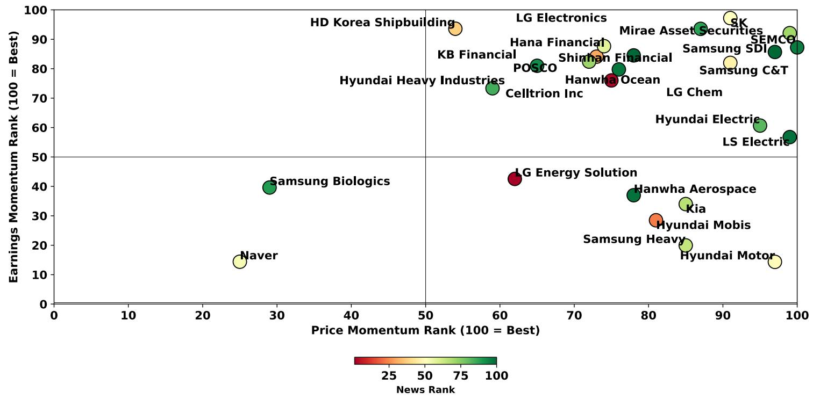

scatter

| Company | Price Momentum Rank (100 = Best) | Earnings Momentum Rank (100 = Best) |
| --- | --- | --- |
| HD Korea Shipbuilding | 53 | 94 |
| LG Electronics | 74 | 88 |
| KB Financial | 65 | 80 |
| Hana Financial | 73 | 84 |
| POSCO | 65 | 80 |
| Celltrion Inc | 59 | 73 |
| Hanwha Ocean | 75 | 76 |
| LG Chem | 91 | 82 |
| Samsung SDI | 97 | 86 |
| LG Energy Solution | 62 | 43 |
| Samsung Biologics | 29 | 40 |
| Naver | 25 | 15 |
| Hyundai Heavy Industries | 59 | 73 |
| Hanwha Aerospace | 78 | 37 |
| Kia | 85 | 34 |
| Hyundai Mobis | 81 | 29 |
| Samsung Heavy | 85 | 20 |
| Hyundai Motor | 97 | 15 |
| LG Assets Securities | 87 | 93 |
| SEMCOR | 99 | 91 |
| Samsung C&T | 91 | 82 |
| LG Electric | 95 | 61 |
LS Electric | 99 | 57 |

Source : BofA Global Quantitative Strategy, MSCI, IBES, FactSet, RavenPack   
BofA GLOBAL RESEARCH

Chart 114: Taiwan: Earnings Momentum (vertical axis), Price Momentum (horizontal axis), News Momentum (colour)   
Triple Momentum is most positive for TS Financial, Global Unichip and Nan Ya Plastics   
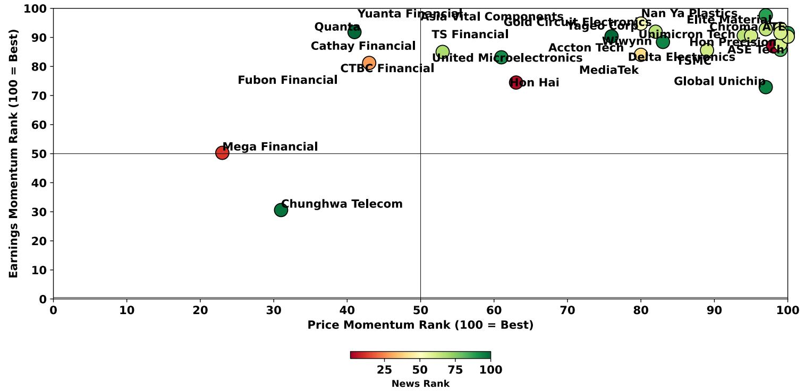

scatter

| Company             | Price Momentum Rank (100 = Best) | Earnings Momentum Rank (100 = Best) |
|---------------------|----------------------------------|--------------------------------------|
| Quanta              | 41                               | 92                                   |
| Cathay Financial    | 43                               | 82                                   |
| CTBC Financial      | 43                               | 81                                   |
| Fubon Financial     | 31                               | 75                                   |
| Mega Financial      | 23                               | 50                                   |
| Chunghwa Telecom    | 31                               | 31                                   |
| Yuanta Financial    | 41                               | 92                                   |
| Tesla Vital Components | 52                             | 86                                   |
| TS Financial        | 53                               | 85                                   |
| United Microelectronics | 61                            | 83                                   |
| Gold Circuit Electronics | 61                          | 83                                   |
| Yageo Corp.         | 76                               | 90                                   |
| Accton Tech         | 76                               | 84                                   |
| MediaTek            | 76                               | 84                                   |
| Delta Electronics   | 80                               | 85                                   |
| Nan Ya Plastics     | 82                               | 92                                   |
| Elite Material      | 82                               | 92                                   |
| Unimicron Tech       | 82                               | 92                                   |
| Nom Corporation      | 82                               | 92                                   |
| Hon Precision       | 89                               | 86                                   |
| ASE Tech            | 99                               | 86                                   |
| FSME                | 89                               | 86                                   |
| Global Unichip      | 97                               | 73                                   |
| Global Unichip      | 97                               | 73                                   |
| Global Unichip      | 97                               | 73                                   |
| Global Unichip      | 97                               | 73                                   |
| Global Unichip      | 97                               | 73                                   |
| Global Unichip      | 97                               | 73                                   |
| Global Unichip      | 97                               | -                                    |
| Global Unichip      | 97                               | -                                    |
| Global Unichip      | 97                               | -                                    |
| Global Unichip      | 97                               | -                                    |
| Global Unichip      | 97                               | -                                    |
| Global Unichip      | 97                               | -                                    |
| Global Unichip      | 97                               | -                                    |
| Global Unichip      | 100                              | -                                    |
| Global Unichip      | 100                              | -                                    |
| Global Unichip      | 100                              | -                                    |
| Global Unichip      | 100                              | -                                    |
| Global Unichip      | 100                              | -                                    |
| Global Unichip      | 100                              | -                                    |
| Global Unichip      | 100                              | -                                    |

Source : BofA Global Quantitative Strategy, MSCI, IBES, FactSet, RavenPack   
BofA GLOBAL RESEARCH

# Themes

# Performance by Theme

Table 6: Global Themes Performance Matrix

Last week, the best performing global themes have been Space, and Renewable Energy

<table><tr><td>Performance</td><td>1 week</td><td>1 month</td><td>3 months</td><td>6 months</td><td>YTD</td><td>12 months</td></tr><tr><td>Artificial Intelligence</td><td>-1.0%</td><td>13.8%</td><td>21%</td><td>36%</td><td>31%</td><td>90%</td></tr><tr><td>Robotics</td><td>-0.6%</td><td>11.4%</td><td>10%</td><td>41%</td><td>35%</td><td>73%</td></tr><tr><td>Defense</td><td>-4.5%</td><td>-8.5%</td><td>-6%</td><td>12%</td><td>6%</td><td>43%</td></tr><tr><td>Space</td><td>4.3%</td><td>12.9%</td><td>51%</td><td>117%</td><td>79%</td><td>195%</td></tr><tr><td>Energy Storage</td><td>-2.2%</td><td>9.6%</td><td>17%</td><td>32%</td><td>30%</td><td>132%</td></tr><tr><td>Nuclear Energy</td><td>-7.2%</td><td>-8.8%</td><td>-8%</td><td>11%</td><td>7%</td><td>61%</td></tr><tr><td>Renewable Energy</td><td>1.5%</td><td>8.8%</td><td>12%</td><td>22%</td><td>26%</td><td>82%</td></tr><tr><td>Luxury Lifestyle</td><td>-5.4%</td><td>-5.9%</td><td>-14%</td><td>-10%</td><td>-11%</td><td>-3%</td></tr><tr><td>Gold</td><td>-6.8%</td><td>-9.4%</td><td>-12%</td><td>18%</td><td>4%</td><td>92%</td></tr><tr><td>Rare Earths</td><td>-3.2%</td><td>6.0%</td><td>6%</td><td>27%</td><td>34%</td><td>165%</td></tr><tr><td>SaaS</td><td>-3.6%</td><td>6.1%</td><td>1%</td><td>-25%</td><td>-23%</td><td>-26%</td></tr><tr><td>Quantum Computing</td><td>-0.3%</td><td>12.1%</td><td>25%</td><td>40%</td><td>32%</td><td>94%</td></tr></table>

Source : BofA Global Quantitative Strategy, MSCI, IBES, RavenPack

BofA GLOBAL RESEARCH

Chart 115: Global Themes Performance: YTD

Best performing theme YTD was Space

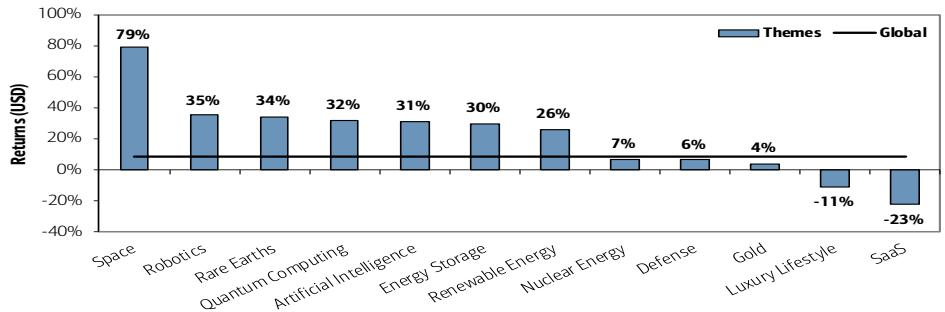

bar

| Theme               | Returns (USD) |
| ------------------- | ------------- |
| Space               | 79%           |
| Robotics            | 35%           |
| Rare Earths         | 34%           |
| Quantum Computing  | 32%           |
| Artificial Intelligence | 31%          |
| Energy Storage      | 30%           |
| Renewable Energy    | 26%           |
| Nuclear Energy      | 7%            |
| Defense             | 6%            |
| Gold                | 4%            |
| Luxury Lifestyle    | -11%          |
| SaaS                | -23%          |

Source : BofA Global Quantitative Strategy, MSCI

BofA GLOBAL RESEARCH

Chart 116: Global Themes Performance: Last 12 months

Last 12 months: Space performed the best

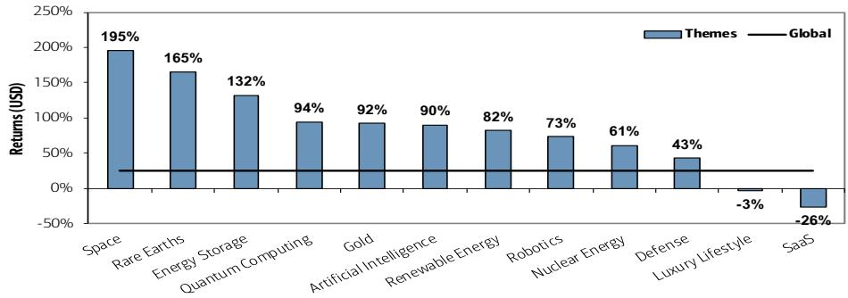

bar

| Theme               | Returns (USD) |
| ------------------- | ------------- |
| Space               | 195%          |
| Rare Earths         | 165%          |
| Energy Storage      | 132%          |
| Quantum Computing   | 94%           |
| Gold                | 92%           |
| Artificial Intelligence | 90%        |
| Renewable Energy    | 82%           |
| Robotics            | 73%           |
| Nuclear Energy      | 61%           |
| Defense             | 43%           |
| Luxury Lifestyle    | -3%           |
| SaaS                | -26%          |

Source : BofA Global Quantitative Strategy, MSCI

BofA GLOBAL RESEARCH

# Ranking by Triple Momentum

Chart 117: Average Triple Momentum Rank of Global Themes   
Triple Momentum is currently stronger for Gold and Rare Earths, and weakest for SaaS and Luxury Lifestyle   
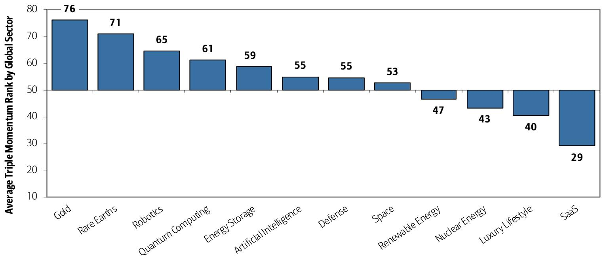

bar

| Sector | Average Triple Momentum Rank |
| :--- | :--- |
| Gold | 76 |
| Rare Earths | 71 |
| Robotics | 65 |
| Quantum Computing | 61 |
| Energy Storage | 59 |
| Artificial Intelligence | 55 |
| Defense | 55 |
| Space | 53 |
| Renewable Energy | 47 |
| Nuclear Energy | 43 |
| Luxury Lifestyle | 40 |
| SaaS | 29 |

Source : BofA Global Quantitative Strategy, MSCI, IBES, RavenPack

BofA GLOBAL RESEARCH

Chart 118: Triple Momentum for Global Themes   
Triple Momentum strongest for Gold and Rare Earths, weakest for SaaS and Luxury Lifestyle   
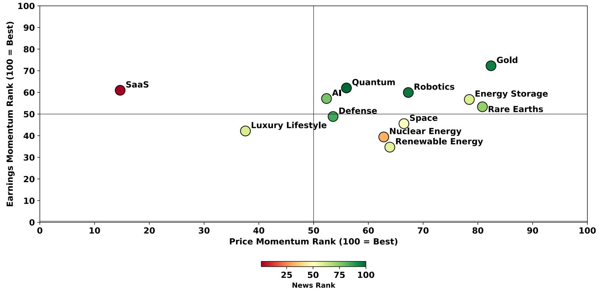

scatter

| Sector             | Price Momentum Rank (100 = Best) | Earnings Momentum Rank (100 = Best) |
| ------------------ | --------------------------------- | ------------------------------------- |
| SaaS               | 15                                | 61                                    |
| AI                 | 52                                | 57                                    |
| Quantum            | 56                                | 62                                    |
| Defense            | 54                                | 49                                    |
| Space              | 67                                | 46                                    |
| Renewable Energy   | 64                                | 35                                    |
| Energy Storage     | 78                                | 57                                    |
| Rare Earths        | 81                                | 53                                    |
| Gold               | 83                                | 73                                    |
| Quantum            | 67                                | 60                                    |

Source : BofA Global Quantitative Strategy, MSCI, IBES, RavenPack

BofA GLOBAL RESEARCH

# What's Improving / Deteriorating?

Chart 119: Artificial Intelligence: Triple Momentum Trend   
Triple momentum is currently above average for Artificial Intelligence   
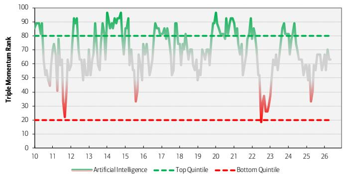

line

| Time | Artificial Intelligence | Top Quintile | Bottom Quintile |
|------|--------------------------|--------------|-----------------|
| 10   | ~90                      | ~85          | 20              |
| 11   | ~70                      | ~85          | 20              |
| 12   | ~60                      | ~90          | 20              |
| 13   | ~70                      | ~85          | 20              |
| 14   | ~80                      | ~90          | 20              |
| 15   | ~70                      | ~95          | 20              |
| 16   | ~60                      | ~85          | 20              |
| 17   | ~70                      | ~85          | 20              |
| 18   | ~60                      | ~85          | 20              |
| 19   | ~70                      | ~85          | 20              |
| 20   | ~80                      | ~90          | 20              |
| 21   | ~70                      | ~85          | 20              |
| 22   | ~60                      | ~85          | 20              |
| 23   | ~70                      | ~85          | 20              |
| 24   | ~60                      | ~85          | 20              |
| 25   | ~70                      | ~85          | 20              |
| 26   | ~60                      | ~85          | 20              |

Source : BofA Global Quantitative Strategy, MSCI, IBES, RavenPack   
BofA GLOBAL RESEARCH

Chart 121: Defense: Triple Momentum Trend   
Triple momentum is currently above average for Defense   
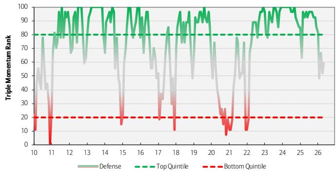

line

| Step | Defense | Top Quintile | Bottom Quintile |
|------|---------|--------------|-----------------|
| 10   | 55      | 80           | 20              |
| 11   | 70      | 80           | 20              |
| 12   | 65      | 95           | 20              |
| 13   | 60      | 95           | 20              |
| 14   | 55      | 95           | 20              |
| 15   | 40      | 95           | 20              |
| 16   | 70      | 95           | 20              |
| 17   | 50      | 95           | 20              |
| 18   | 30      | 95           | 20              |
| 19   | 45      | 95           | 20              |
| 20   | 75      | 95           | 20              |
| 21   | 50      | 95           | 20              |
| 22   | 75      | 95           | 20              |
| 23   | 60      | 95           | 20              |
| 24   | 65      | 95           | 20              |
| 25   | 60      | 95           | 20              |
| 26   | 55      | 95           | 20              |

Source : BofA Global Quantitative Strategy, MSCI, IBES, RavenPack   
BofA GLOBAL RESEARCH

Chart 123: Energy Storage: Triple Momentum Trend   
Triple momentum is currently above average for Energy Storage   
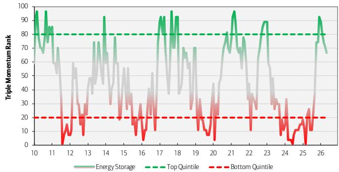

line

| Time Point | Energy Storage | Top Quintile | Bottom Quintile |
| ---------- | -------------- | ------------ | --------------- |
| 10         | ~95            | ~80          | ~20             |
| 11         | ~85            | ~80          | ~20             |
| 12         | ~55            | ~80          | ~20             |
| 13         | ~75            | ~80          | ~20             |
| 14         | ~75            | ~90          | ~20             |
| 15         | ~55            | ~80          | ~20             |
| 16         | ~40            | ~80          | ~20             |
| 17         | ~50            | ~90          | ~20             |
| 18         | ~70            | ~90          | ~20             |
| 19         | ~70            | ~80          | ~20             |
| 20         | ~45            | ~80          | ~20             |
| 21         | ~70            | ~95          | ~20             |
| 22         | ~35            | ~85          | ~20             |
| 23         | ~45            | ~90          | ~20             |
| 24         | ~30            | ~85          | ~20             |
| 25         | ~25            | ~90          | ~20             |
| 26         | ~75            | ~90          | ~20             |

Source : BofA Global Quantitative Strategy, MSCI, IBES, RavenPack   
BofA GLOBAL RESEARCH

Chart 120: Robotics: Triple Momentum Trend   
For Robotics, Triple Momentum is in the top quintile   
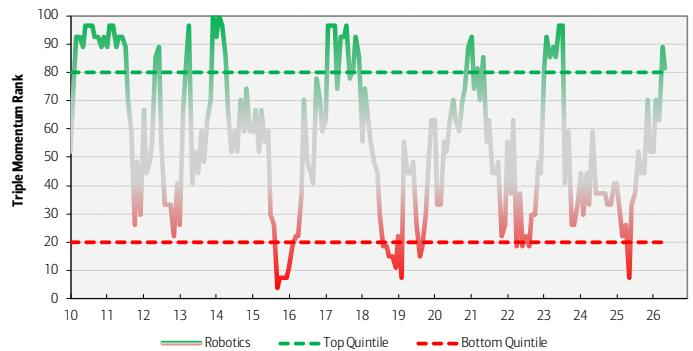

line

| Step | Robotics | Top Quintile | Bottom Quintile |
|------|----------|--------------|-----------------|
| 10   | 95       | 80           | 20              |
| 11   | 90       | 80           | 20              |
| 12   | 65       | 80           | 20              |
| 13   | 40       | 80           | 20              |
| 14   | 70       | 80           | 20              |
| 15   | 60       | 80           | 20              |
| 16   | 70       | 80           | 20              |
| 17   | 75       | 80           | 20              |
| 18   | 70       | 80           | 20              |
| 19   | 55       | 80           | 20              |
| 20   | 65       | 80           | 20              |
| 21   | 70       | 80           | 20              |
| 22   | 60       | 80           | 20              |
| 23   | 55       | 80           | 20              |
| 24   | 60       | 80           | 20              |
| 25   | 50       | 80           | 20              |
| 26   | 70       | 80           | 20              |

Source : BofA Global Quantitative Strategy, MSCI, IBES, RavenPack   
BofA GLOBAL RESEARCH

Chart 122: Space: Triple Momentum Trend   
Triple momentum is currently above average for Space   
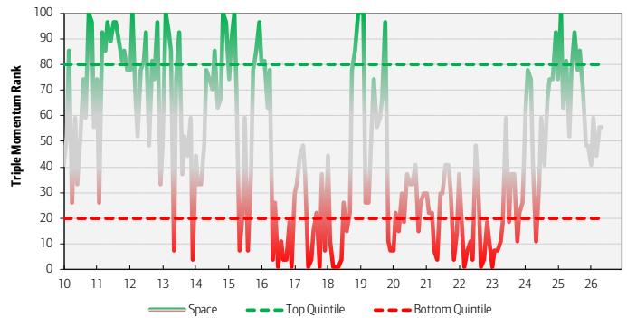

line

| Year | Space | Top Quintile | Bottom Quintile |
|------|-------|--------------|-----------------|
| 10   | 60    | 85           | 20              |
| 11   | 75    | 95           | 20              |
| 12   | 50    | 90           | 20              |
| 13   | 35    | 95           | 20              |
| 14   | 55    | 80           | 20              |
| 15   | 60    | 95           | 20              |
| 16   | 70    | 80           | 20              |
| 17   | 45    | 85           | 20              |
| 18   | 30    | 90           | 20              |
| 19   | 75    | 95           | 20              |
| 20   | 55    | 85           | 20              |
| 21   | 40    | 80           | 20              |
| 22   | 35    | 85           | 20              |
| 23   | 60    | 90           | 20              |
| 24   | 75    | 85           | 20              |
| 25   | 60    | 95           | 20              |
| 26   | 55    | 85           | 20              |

Source : BofA Global Quantitative Strategy, MSCI, IBES, RavenPack   
BofA GLOBAL RESEARCH

Chart 124: Nuclear Energy: Triple Momentum Trend   
Triple Momentum is currently below average for Nuclear Energy   
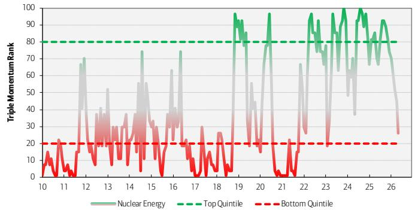

line

| Year | Nuclear Energy | Top Quintile | Bottom Quintile |
|------|----------------|--------------|-----------------|
| 10   | 0              | 80           | 20              |
| 11   | 20             | 80           | 20              |
| 12   | 70             | 80           | 20              |
| 13   | 50             | 80           | 20              |
| 14   | 30             | 80           | 20              |
| 15   | 75             | 80           | 20              |
| 16   | 60             | 80           | 20              |
| 17   | 30             | 80           | 20              |
| 18   | 25             | 80           | 20              |
| 19   | 95             | 80           | 20              |
| 20   | 55             | 80           | 20              |
| 21   | 25             | 80           | 20              |
| 22   | 65             | 80           | 20              |
| 23   | 75             | 80           | 20              |
| 24   | 95             | 80           | 20              |
| 25   | 85             | 80           | 20              |
| 26   | 25             | 80           | 20              |

Source : BofA Global Quantitative Strategy, MSCI, IBES, RavenPack   
BofA GLOBAL RESEARCH

Chart 125: Renewable Energy: Triple Momentum Trend   
Triple Momentum is currently below average for Renewable Energy   
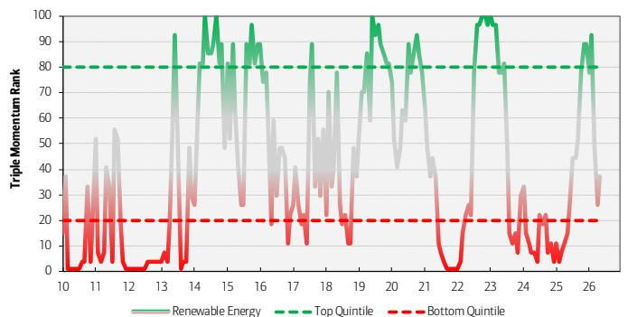

line

| Time | Renewable Energy | Top Quintile | Bottom Quintile |
|------|------------------|--------------|-----------------|
| 10   | 35               | 80           | 20              |
| 11   | 50               | 80           | 20              |
| 12   | 55               | 80           | 20              |
| 13   | 45               | 80           | 20              |
| 14   | 90               | 80           | 20              |
| 15   | 95               | 80           | 20              |
| 16   | 85               | 80           | 20              |
| 17   | 45               | 80           | 20              |
| 18   | 50               | 80           | 20              |
| 19   | 75               | 80           | 20              |
| 20   | 60               | 80           | 20              |
| 21   | 40               | 80           | 20              |
| 22   | 25               | 80           | 20              |
| 23   | 95               | 80           | 20              |
| 24   | 30               | 80           | 20              |
| 25   | 45               | 80           | 20              |
| 26   | 30               | 80           | 20              |

Source : BofA Global Quantitative Strategy, MSCI, IBES, RavenPack   
BofA GLOBAL RESEARCH

Chart 127: Gold: Triple Momentum Trend   
For Gold, Triple Momentum is in the top quintile   
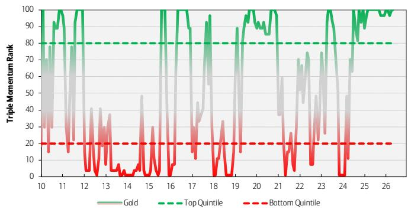

line

| Time | Gold | Top Quintile | Bottom Quintile |
|------|------|--------------|-----------------|
| 10   | 70   | 100          | 20              |
| 11   | 30   | 95           | 20              |
| 12   | 40   | 100          | 20              |
| 13   | 35   | 90           | 20              |
| 14   | 45   | 85           | 20              |
| 15   | 50   | 95           | 20              |
| 16   | 30   | 100          | 20              |
| 17   | 40   | 95           | 20              |
| 18   | 35   | 90           | 20              |
| 19   | 45   | 85           | 20              |
| 20   | 60   | 95           | 20              |
| 21   | 35   | 90           | 20              |
| 22   | 45   | 85           | 20              |
| 23   | 70   | 95           | 20              |
| 24   | 45   | 85           | 20              |
| 25   | 60   | 95           | 20              |
| 26   | 70   | 90           | 20              |

Source : BofA Global Quantitative Strategy, MSCI, IBES, RavenPack   
BofA GLOBAL RESEARCH

Chart 129: SaaS: Triple Momentum Trend   
For SaaS, Triple Momentum is in the bottom quintile   
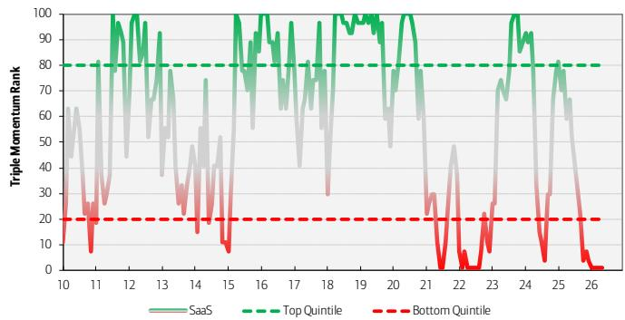

line

| Time | SaaS | Top Quintile | Bottom Quintile |
|------|------|--------------|-----------------|
| 10   | 60   | 80           | 20              |
| 11   | 30   | 80           | 20              |
| 12   | 90   | 80           | 20              |
| 13   | 70   | 80           | 20              |
| 14   | 50   | 80           | 20              |
| 15   | 70   | 80           | 20              |
| 16   | 90   | 80           | 20              |
| 17   | 60   | 80           | 20              |
| 18   | 70   | 80           | 20              |
| 19   | 90   | 80           | 20              |
| 20   | 60   | 80           | 20              |
| 21   | 30   | 80           | 20              |
| 22   | 50   | 80           | 20              |
| 23   | 70   | 80           | 20              |
| 24   | 90   | 80           | 20              |
| 25   | 60   | 80           | 20              |
| 26   | 10   | 80           | 20              |

Source : BofA Global Quantitative Strategy, MSCI, IBES, RavenPack   
BofA GLOBAL RESEARCH

Chart 126: Luxury Lifestyle: Triple Momentum Trend   
For Luxury Lifestyle, Triple Momentum is in the bottom quintile   
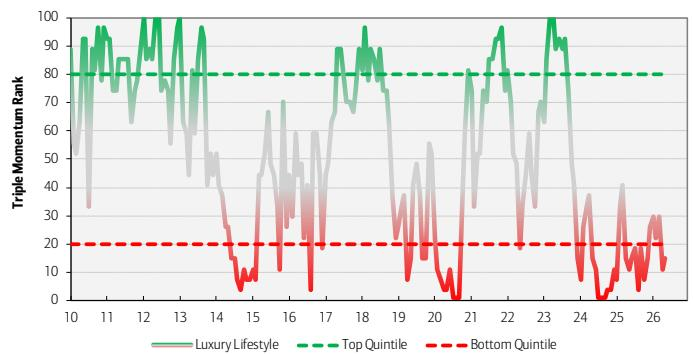

line

| Year | Luxury Lifestyle | Top Quintile | Bottom Quintile |
|------|------------------|--------------|-----------------|
| 10   | ~50              | ~90          | 20              |
| 11   | ~85              | ~95          | 20              |
| 12   | ~75              | ~95          | 20              |
| 13   | ~95              | ~95          | 20              |
| 14   | ~50              | ~90          | 20              |
| 15   | ~40              | ~85          | 20              |
| 16   | ~60              | ~85          | 20              |
| 17   | ~70              | ~90          | 20              |
| 18   | ~80              | ~95          | 20              |
| 19   | ~60              | ~85          | 20              |
| 20   | ~50              | ~80          | 20              |
| 21   | ~30              | ~80          | 20              |
| 22   | ~70              | ~95          | 20              |
| 23   | ~60              | ~95          | 20              |
| 24   | ~35              | ~90          | 20              |
| 25   | ~40              | ~85          | 20              |
| 26   | ~30              | ~85          | 20              |

Source : BofA Global Quantitative Strategy, MSCI, IBES, RavenPack   
BofA GLOBAL RESEARCH

Chart 128: Rare Earths: Triple Momentum Trend   
For Rare Earths, Triple Momentum is in the top quintile   
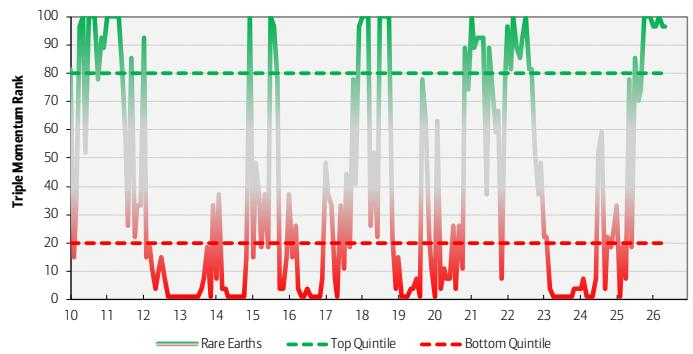

line

| Year | Rare Earths | Top Quintile | Bottom Quintile |
|------|-------------|--------------|-----------------|
| 10   | 50          | 95           | 20              |
| 11   | 80          | 95           | 20              |
| 12   | 30          | 90           | 20              |
| 13   | 0           | 80           | 20              |
| 14   | 35          | 95           | 20              |
| 15   | 45          | 95           | 20              |
| 16   | 30          | 95           | 20              |
| 17   | 45          | 95           | 20              |
| 18   | 50          | 95           | 20              |
| 19   | 75          | 95           | 20              |
| 20   | 60          | 95           | 20              |
| 21   | 80          | 95           | 20              |
| 22   | 90          | 95           | 20              |
| 23   | 40          | 95           | 20              |
| 24   | 60          | 95           | 20              |
| 25   | 80          | 95           | 20              |
| 26   | 95          | 95           | 20              |

Source : BofA Global Quantitative Strategy, MSCI, IBES, RavenPack   
BofA GLOBAL RESEARCH

Chart 130: Quantum Computing: Triple Momentum Trend   
Triple momentum is currently above average for Quantum Computing   
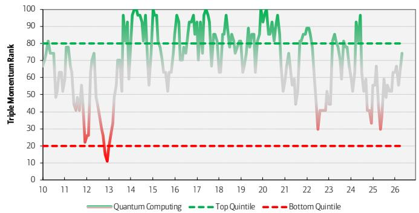

line

| Year | Quantum Computing | Top Quintile | Bottom Quintile |
|------|-------------------|--------------|-----------------|
| 10   | ~80               | 80           | 20              |
| 11   | ~75               | 80           | 20              |
| 12   | ~45               | 80           | 20              |
| 13   | ~70               | 80           | 20              |
| 14   | ~95               | 80           | 20              |
| 15   | ~90               | 80           | 20              |
| 16   | ~70               | 80           | 20              |
| 17   | ~95               | 80           | 20              |
| 18   | ~90               | 80           | 20              |
| 19   | ~85               | 80           | 20              |
| 20   | ~95               | 80           | 20              |
| 21   | ~75               | 80           | 20              |
| 22   | ~85               | 80           | 20              |
| 23   | ~50               | 80           | 20              |
| 24   | ~95               | 80           | 20              |
| 25   | ~65               | 80           | 20              |
| 26   | ~75               | 80           | 20              |

Source : BofA Global Quantitative Strategy, MSCI, IBES, RavenPack   
BofA GLOBAL RESEARCH

# Global Stocks (Most Important) by Theme

Table 7: Global: Most Important Stocks within each Theme ranked by Triple Momentum (earnings, price, news)

The table ranks the Most Important Global stocks within each Theme

<table><tr><td>Theme</td><td>Company Name</td><td>BBG Code</td><td>Country</td><td>Sector</td><td>TM Rank</td><td>Relative Weight %</td><td>Fund Ownership %</td><td>Equity Flow - Last 12 Months (US$ mn)</td><td>PE Ratio</td><td>Last 12-months return (USD)</td></tr><tr><td rowspan="6">AI</td><td>Broadcom</td><td>AVGO US</td><td>USA</td><td>Semis</td><td>91</td><td>0.014%</td><td>70%</td><td>-21391</td><td>29</td><td>83%</td></tr><tr><td>TSMC</td><td>2330 TT</td><td>Taiwan</td><td>Semis</td><td>86</td><td>1.251%</td><td>92%</td><td>-6568</td><td>22</td><td>118%</td></tr><tr><td>Vertiv</td><td>VRT US</td><td>USA</td><td>Industrials</td><td>85</td><td>-0.088%</td><td>29%</td><td>1281</td><td>55</td><td>252%</td></tr><tr><td>AppLovin</td><td>APP US</td><td>USA</td><td>Software</td><td>64</td><td>0.018%</td><td>34%</td><td>6272</td><td>29</td><td>37%</td></tr><tr><td>Palantir Tech</td><td>PLTR US</td><td>USA</td><td>Software</td><td>59</td><td>-0.301%</td><td>33%</td><td>1583</td><td>90</td><td>5%</td></tr><tr><td>Meta</td><td>META US</td><td>USA</td><td>Media</td><td>24</td><td>0.243%</td><td>68%</td><td>-37306</td><td>20</td><td>-5%</td></tr><tr><td rowspan="6">Robotics</td><td>Delta Electronics</td><td>2308 TT</td><td>Taiwan</td><td>TechHardware</td><td>97</td><td>0.005%</td><td>39%</td><td>-1569</td><td>49</td><td>436%</td></tr><tr><td>Deere</td><td>DE US</td><td>USA</td><td>Industrials</td><td>89</td><td>0.042%</td><td>31%</td><td>1244</td><td>28</td><td>9%</td></tr><tr><td>ABB</td><td>ABBN SW</td><td>Switzerland</td><td>Industrials</td><td>79</td><td>-0.104%</td><td>32%</td><td>-1137</td><td>30</td><td>83%</td></tr><tr><td>Siemens</td><td>SIE GR</td><td>Germany</td><td>Industrials</td><td>76</td><td>-0.028%</td><td>47%</td><td>-198</td><td>22</td><td>22%</td></tr><tr><td>Tesla</td><td>TSLA US</td><td>USA</td><td>ConsDisc</td><td>48</td><td>-0.673%</td><td>46%</td><td>6740</td><td>192</td><td>23%</td></tr><tr><td>Intuitive Surgical</td><td>ISRG US</td><td>USA</td><td>HealthCare</td><td>24</td><td>-0.013%</td><td>40%</td><td>-6846</td><td>40</td><td>-25%</td></tr><tr><td rowspan="6">Defense</td><td>L3Harris Tech</td><td>LHX US</td><td>USA</td><td>Industrials</td><td>64</td><td>0.001%</td><td>19%</td><td>323</td><td>25</td><td>34%</td></tr><tr><td>BAE</td><td>BA/ LN</td><td>UK</td><td>Industrials</td><td>62</td><td>0.062%</td><td>27%</td><td>-2680</td><td>21</td><td>6%</td></tr><tr><td>RTX</td><td>RTX US</td><td>USA</td><td>Industrials</td><td>57</td><td>0.038%</td><td>29%</td><td>82</td><td>24</td><td>26%</td></tr><tr><td>Northrop Grumman</td><td>NOC US</td><td>USA</td><td>Industrials</td><td>41</td><td>0.046%</td><td>20%</td><td>1480</td><td>19</td><td>15%</td></tr><tr><td>Rheinmetall</td><td>RHM GR</td><td>Germany</td><td>Industrials</td><td>40</td><td>-0.035%</td><td>26%</td><td>3247</td><td>25</td><td>-31%</td></tr><tr><td>Lockheed Martin</td><td>LMT US</td><td>USA</td><td>Industrials</td><td>27</td><td>-0.077%</td><td>14%</td><td>-729</td><td>17</td><td>11%</td></tr><tr><td rowspan="6">Space</td><td>Rocket Lab</td><td>RKLB US</td><td>USA</td><td>Industrials</td><td>72</td><td>-0.051%</td><td>16%</td><td>2209</td><td>-</td><td>395%</td></tr><tr><td>Echostar</td><td>SATS US</td><td>USA</td><td>Media</td><td>71</td><td>-0.025%</td><td>12%</td><td>572</td><td>-</td><td>499%</td></tr><tr><td>Viasat</td><td>VSAT US</td><td>USA</td><td>TechHardware</td><td>71</td><td>-0.012%</td><td>26%</td><td>523</td><td>-</td><td>513%</td></tr><tr><td>Planet Labs</td><td>PL US</td><td>USA</td><td>Industrials</td><td>67</td><td>-0.015%</td><td>14%</td><td>2361</td><td>-</td><td>970%</td></tr><tr><td>Globalstar</td><td>GSAT US</td><td>USA</td><td>Telecom</td><td>44</td><td>-0.015%</td><td>18%</td><td>122</td><td>-</td><td>339%</td></tr><tr><td>Intuitive Machines</td><td>LUNR US</td><td>USA</td><td>Industrials</td><td>24</td><td>-0.024%</td><td>7%</td><td>495</td><td>6344</td><td>186%</td></tr><tr><td rowspan="6">Energy Storage</td><td>Samsung SDI</td><td>006400 KS</td><td>South Korea</td><td>TechHardware</td><td>100</td><td>-0.037%</td><td>10%</td><td>-145</td><td>99</td><td>236%</td></tr><tr><td>Albemarle</td><td>ALB US</td><td>USA</td><td>Materials</td><td>99</td><td>0.005%</td><td>20%</td><td>-1800</td><td>21</td><td>199%</td></tr><tr><td>Panasonic</td><td>6752 JP</td><td>Japan</td><td>ConsDisc</td><td>85</td><td>-0.018%</td><td>19%</td><td>959</td><td>17</td><td>90%</td></tr><tr><td>Eaton</td><td>ETN US</td><td>USA</td><td>Industrials</td><td>60</td><td>-0.011%</td><td>34%</td><td>-5212</td><td>29</td><td>22%</td></tr><tr><td>LG Chem</td><td>051910 KS</td><td>South Korea</td><td>Materials</td><td>35</td><td>-0.003%</td><td>16%</td><td>244</td><td>24</td><td>72%</td></tr><tr><td>BYD-H</td><td>1211 HK</td><td>China</td><td>ConsDisc</td><td>16</td><td>-0.030%</td><td>26%</td><td>2167</td><td>17</td><td>-31%</td></tr><tr><td rowspan="6">Nuclear Energy</td><td>GE Vernova</td><td>GEV US</td><td>USA</td><td>Industrials</td><td>96</td><td>-0.019%</td><td>37%</td><td>-6559</td><td>62</td><td>146%</td></tr><tr><td>MHI</td><td>7011 JP</td><td>Japan</td><td>Industrials</td><td>93</td><td>-0.033%</td><td>21%</td><td>-590</td><td>36</td><td>37%</td></tr><tr><td>Rolls-Royce</td><td>RR/ LN</td><td>UK</td><td>Industrials</td><td>76</td><td>0.043%</td><td>29%</td><td>-107</td><td>29</td><td>40%</td></tr><tr><td>Cameco</td><td>CCO CN</td><td>Canada</td><td>Energy</td><td>66</td><td>0.024%</td><td>22%</td><td>-931</td><td>77</td><td>109%</td></tr><tr><td>Constellation Energy</td><td>CEG US</td><td>USA</td><td>Utilities</td><td>53</td><td>-0.011%</td><td>25%</td><td>-3922</td><td>22</td><td>-6%</td></tr><tr><td>Oklo</td><td>OKLO US</td><td>USA</td><td>Utilities</td><td>7</td><td>-0.028%</td><td>8%</td><td>1783</td><td>-</td><td>66%</td></tr><tr><td rowspan="6">Renewable Energy</td><td>Bloom Energy</td><td>BE US</td><td>USA</td><td>Industrials</td><td>100</td><td>-0.022%</td><td>22%</td><td>485</td><td>142</td><td>1292%</td></tr><tr><td>Adani Green Energy</td><td>ADANIGR IN</td><td>India</td><td>Utilities</td><td>66</td><td>-0.024%</td><td>28%</td><td>125</td><td>63</td><td>27%</td></tr><tr><td>Iberdrola</td><td>IBE SM</td><td>Spain</td><td>Utilities</td><td>57</td><td>-0.024%</td><td>34%</td><td>4639</td><td>19</td><td>28%</td></tr><tr><td>Nextpower-A</td><td>NXT US</td><td>USA</td><td>Industrials</td><td>53</td><td>0.035%</td><td>49%</td><td>1543</td><td>30</td><td>134%</td></tr><tr><td>First Solar</td><td>FSLR US</td><td>USA</td><td>Semis</td><td>27</td><td>-0.012%</td><td>16%</td><td>134</td><td>12</td><td>25%</td></tr><tr><td>Sungrow Power-A</td><td>300274 CH</td><td>China</td><td>Industrials</td><td>19</td><td>0.012%</td><td>21%</td><td>-6</td><td>18</td><td>152%</td></tr></table>

Source : BofA Global Quantitative Strategy, MSCI, IBES, RavenPack

BofA GLOBAL RESEARCH

Table 8: Global: Most Important Stocks within each Theme ranked by Triple Momentum (earnings, price, news) - continued The table ranks the Most Important Global stocks within each Theme 

<table><tr><td>Theme</td><td>Company Name</td><td>BBG Code</td><td>Country</td><td>Sector</td><td>TM Rank</td><td>Relative Weight %</td><td>Fund Ownership %</td><td>Equity Flow - Last 12 Months (US$ mn)</td><td>PE Ratio</td><td>Last 12-months return (USD)</td></tr><tr><td rowspan="6">Luxury Lifestyle</td><td>LVMH</td><td>MC FP</td><td>France</td><td>ConsDisc</td><td>34</td><td>-0.009%</td><td>45%</td><td>-1597</td><td>19</td><td>-7%</td></tr><tr><td>L&#x27;Oreal</td><td>OR FP</td><td>France</td><td>ConsStaples</td><td>32</td><td>0.025%</td><td>42%</td><td>1590</td><td>26</td><td>-2%</td></tr><tr><td>Royal Caribbean</td><td>RCL US</td><td>USA</td><td>ConsDisc</td><td>21</td><td>0.064%</td><td>23%</td><td>3715</td><td>14</td><td>4%</td></tr><tr><td>Richemont</td><td>CFR SW</td><td>Switzerland</td><td>ConsDisc</td><td>12</td><td>0.025%</td><td>37%</td><td>898</td><td>24</td><td>7%</td></tr><tr><td>Ferrari</td><td>RACE IM</td><td>Italy</td><td>ConsDisc</td><td>11</td><td>0.003%</td><td>27%</td><td>-1884</td><td>28</td><td>-34%</td></tr><tr><td>Hermes</td><td>RMS FP</td><td>France</td><td>ConsDisc</td><td>9</td><td>-0.008%</td><td>31%</td><td>-232</td><td>33</td><td>-36%</td></tr><tr><td rowspan="6">Gold</td><td>Greatland Gold</td><td>GGP LN</td><td>UK</td><td>Materials</td><td>96</td><td>-0.006%</td><td>33%</td><td>416</td><td>13</td><td>204%</td></tr><tr><td>Wheaton Precious</td><td>WPM CN</td><td>Canada</td><td>Materials</td><td>85</td><td>0.060%</td><td>24%</td><td>-1120</td><td>25</td><td>66%</td></tr><tr><td>Newmont</td><td>NEM US</td><td>USA</td><td>Materials</td><td>85</td><td>-0.059%</td><td>28%</td><td>-314</td><td>10</td><td>119%</td></tr><tr><td>Agnico Eagle</td><td>AEM CN</td><td>Canada</td><td>Materials</td><td>83</td><td>0.087%</td><td>32%</td><td>3080</td><td>13</td><td>70%</td></tr><tr><td>Barrick Mining</td><td>ABX CN</td><td>Canada</td><td>Materials</td><td>83</td><td>-</td><td>-</td><td>-</td><td>10</td><td>127%</td></tr><tr><td>AngloGold Ashanti</td><td>AU US</td><td>South Africa</td><td>Materials</td><td>63</td><td>-</td><td>-</td><td>-</td><td>9</td><td>128%</td></tr><tr><td rowspan="6">Rare Earths</td><td>Lynas Rare Earths</td><td>LYC AU</td><td>Australia</td><td>Materials</td><td>87</td><td>-0.009%</td><td>10%</td><td>577</td><td>28</td><td>169%</td></tr><tr><td>Critical Metals</td><td>CRML US</td><td>Austria</td><td>Materials</td><td>81</td><td>-0.009%</td><td>4%</td><td>39</td><td>-</td><td>661%</td></tr><tr><td>China North Rare Earth-A</td><td>600111 CH</td><td>China</td><td>Materials</td><td>78</td><td>-0.012%</td><td>2%</td><td>226</td><td>47</td><td>131%</td></tr><tr><td>MP Materials</td><td>MP US</td><td>USA</td><td>Materials</td><td>63</td><td>-</td><td>-</td><td>-</td><td>95</td><td>187%</td></tr><tr><td>Energy Fuels</td><td>UUUU US</td><td>Canada</td><td>Energy</td><td>48</td><td>-</td><td>-</td><td>-</td><td>-</td><td>313%</td></tr><tr><td>USA Rare Earth</td><td>USAR US</td><td>USA</td><td>Materials</td><td>24</td><td>-0.049%</td><td>5%</td><td>-</td><td>-</td><td>158%</td></tr><tr><td rowspan="6">SaaS</td><td>SAP</td><td>SAP GR</td><td>Germany</td><td>Software</td><td>38</td><td>0.015%</td><td>55%</td><td>-10070</td><td>19</td><td>-43%</td></tr><tr><td>CrowdStrike</td><td>CRWD US</td><td>USA</td><td>Software</td><td>32</td><td>-0.074%</td><td>26%</td><td>-542</td><td>115</td><td>38%</td></tr><tr><td>Zoom</td><td>ZM US</td><td>USA</td><td>Software</td><td>32</td><td>0.009%</td><td>23%</td><td>-235</td><td>17</td><td>19%</td></tr><tr><td>Adobe</td><td>ADBE US</td><td>USA</td><td>Software</td><td>27</td><td>-0.058%</td><td>32%</td><td>-3163</td><td>10</td><td>-39%</td></tr><tr><td>Salesforce</td><td>CRM US</td><td>USA</td><td>Software</td><td>18</td><td>-0.008%</td><td>40%</td><td>-5614</td><td>13</td><td>-40%</td></tr><tr><td>Shopify-A</td><td>SHOP US</td><td>Canada</td><td>Software</td><td>12</td><td>0.198%</td><td>48%</td><td>-1982</td><td>51</td><td>-9%</td></tr><tr><td rowspan="3">Quantum Computing</td><td>Quantum Computing</td><td>QUBT US</td><td>USA</td><td>TechHardware</td><td>40</td><td>-0.021%</td><td>7%</td><td>286</td><td>-</td><td>14%</td></tr><tr><td>Rigetti Computing</td><td>RGTI US</td><td>USA</td><td>Semis</td><td>15</td><td>-0.008%</td><td>0%</td><td>-</td><td>-</td><td>55%</td></tr><tr><td>IBM</td><td>IBM US</td><td>USA</td><td>Software</td><td>11</td><td>-0.145%</td><td>29%</td><td>5462</td><td>17</td><td>-18%</td></tr></table>

Source : BofA Global Quantitative Strategy, MSCI, IBES, RavenPack

BofA GLOBAL RESEARCH

# Asia Stocks (Most Important) by Theme

Table 9: Asia Pac: Most Important Stocks within each Theme ranked by Triple Momentum (earnings, price, news)

The table ranks the Most Important Asia Pac stocks within each Theme

<table><tr><td>Theme</td><td>Company Name</td><td>BBG Code</td><td>Country</td><td>Sector</td><td>TM Rank</td><td>Relative Weight %</td><td>Fund Ownership %</td><td>Equity Flow - Last 12 Months (US$ mn)</td><td>PE Ratio</td><td>Last 12-months return (USD)</td></tr><tr><td rowspan="6">AI</td><td>Advantest</td><td>6857 JP</td><td>Japan</td><td>Semis</td><td>99</td><td>-0.063%</td><td>27%</td><td>-2436</td><td>41</td><td>227%</td></tr><tr><td>Zhongji Innolight-A</td><td>300308 CH</td><td>China</td><td>TechHardware</td><td>98</td><td>0.034%</td><td>21%</td><td>1054</td><td>37</td><td>1082%</td></tr><tr><td>TSMC</td><td>2330 TT</td><td>Taiwan</td><td>Semis</td><td>86</td><td>1.251%</td><td>92%</td><td>-6568</td><td>22</td><td>118%</td></tr><tr><td>Tencent</td><td>700 HK</td><td>China</td><td>Media</td><td>40</td><td>0.068%</td><td>72%</td><td>-2834</td><td>13</td><td>-12%</td></tr><tr><td>PDD Hldgs</td><td>PDD US</td><td>China</td><td>ConsDisc</td><td>37</td><td>-0.071%</td><td>29%</td><td>-1549</td><td>8</td><td>-19%</td></tr><tr><td>Alibaba</td><td>9988 HK</td><td>China</td><td>ConsDisc</td><td>22</td><td>0.001%</td><td>66%</td><td>333</td><td>18</td><td>2%</td></tr><tr><td rowspan="6">Robotics</td><td>Delta Electronics</td><td>2308 TT</td><td>Taiwan</td><td>TechHardware</td><td>97</td><td>0.005%</td><td>39%</td><td>-1569</td><td>49</td><td>436%</td></tr><tr><td>Mitsubishi Electric</td><td>6503 JP</td><td>Japan</td><td>Industrials</td><td>95</td><td>0.011%</td><td>25%</td><td>473</td><td>28</td><td>108%</td></tr><tr><td>SMC</td><td>6273 JP</td><td>Japan</td><td>Industrials</td><td>80</td><td>0.014%</td><td>16%</td><td>-455</td><td>24</td><td>17%</td></tr><tr><td>Keyence</td><td>6861 JP</td><td>Japan</td><td>TechHardware</td><td>77</td><td>0.047%</td><td>37%</td><td>829</td><td>39</td><td>12%</td></tr><tr><td>Kawasaki Heavy</td><td>7012 JP</td><td>Japan</td><td>Industrials</td><td>77</td><td>-0.001%</td><td>11%</td><td>843</td><td>24</td><td>59%</td></tr><tr><td>FANUC</td><td>6954 JP</td><td>Japan</td><td>Industrials</td><td>69</td><td>-0.006%</td><td>21%</td><td>-375</td><td>41</td><td>92%</td></tr><tr><td rowspan="6">Defense</td><td>IHI</td><td>7013 JP</td><td>Japan</td><td>Industrials</td><td>99</td><td>0.010%</td><td>14%</td><td>1523</td><td>20</td><td>33%</td></tr><tr><td>MHI</td><td>7011 JP</td><td>Japan</td><td>Industrials</td><td>93</td><td>-0.033%</td><td>21%</td><td>-590</td><td>36</td><td>37%</td></tr><tr><td>Hyundai Rotem</td><td>064350 KS</td><td>South Korea</td><td>Industrials</td><td>83</td><td>-0.013%</td><td>14%</td><td>255</td><td>20</td><td>68%</td></tr><tr><td>Hanwha Aerospace</td><td>012450 KS</td><td>South Korea</td><td>Industrials</td><td>83</td><td>0.011%</td><td>17%</td><td>1159</td><td>24</td><td>39%</td></tr><tr><td>Kawasaki Heavy</td><td>7012 JP</td><td>Japan</td><td>Industrials</td><td>77</td><td>-0.001%</td><td>11%</td><td>843</td><td>24</td><td>59%</td></tr><tr><td>Bharat Elec</td><td>BHE IN</td><td>India</td><td>Industrials</td><td>72</td><td>-0.036%</td><td>19%</td><td>137</td><td>43</td><td>8%</td></tr><tr><td rowspan="3">Space</td><td>SKY Perfect JSAT</td><td>9412 JP</td><td>Japan</td><td>Media</td><td>79</td><td>0.001%</td><td>26%</td><td>14</td><td>46</td><td>230%</td></tr><tr><td>QPS</td><td>464A JP</td><td>Japan</td><td>Industrials</td><td>68</td><td>-0.003%</td><td>11%</td><td>0</td><td>38</td><td>-</td></tr><tr><td>Electro Optic Systems</td><td>EOS AU</td><td>Australia</td><td>Industrials</td><td>31</td><td>0.000%</td><td>32%</td><td>34</td><td>-</td><td>682%</td></tr><tr><td rowspan="6">Energy Storage</td><td>Samsung SDI</td><td>006400 KS</td><td>South Korea</td><td>TechHardware</td><td>100</td><td>-0.037%</td><td>10%</td><td>-145</td><td>99</td><td>236%</td></tr><tr><td>Panasonic</td><td>6752 JP</td><td>Japan</td><td>ConsDisc</td><td>85</td><td>-0.018%</td><td>19%</td><td>959</td><td>17</td><td>90%</td></tr><tr><td>PLS</td><td>PLS AU</td><td>Australia</td><td>Materials</td><td>76</td><td>-0.023%</td><td>37%</td><td>109</td><td>30</td><td>317%</td></tr><tr><td>Liontown</td><td>LTR AU</td><td>Australia</td><td>Materials</td><td>51</td><td>-0.005%</td><td>18%</td><td>49</td><td>26</td><td>232%</td></tr><tr><td>Toyota</td><td>7203 JP</td><td>Japan</td><td>ConsDisc</td><td>40</td><td>-0.144%</td><td>29%</td><td>2094</td><td>9</td><td>7%</td></tr><tr><td>BYD-H</td><td>1211 HK</td><td>China</td><td>ConsDisc</td><td>16</td><td>-0.030%</td><td>26%</td><td>2167</td><td>17</td><td>-31%</td></tr><tr><td rowspan="6">Nuclear Energy</td><td>MHI</td><td>7011 JP</td><td>Japan</td><td>Industrials</td><td>93</td><td>-0.033%</td><td>21%</td><td>-590</td><td>36</td><td>37%</td></tr><tr><td>KEPCO Eng</td><td>052690 KS</td><td>South Korea</td><td>Industrials</td><td>83</td><td>-0.003%</td><td>29%</td><td>27</td><td>78</td><td>127%</td></tr><tr><td>CGN Mining</td><td>1164 HK</td><td>HK</td><td>Energy</td><td>78</td><td>0.000%</td><td>31%</td><td>10</td><td>23</td><td>122%</td></tr><tr><td>Paladin Energy</td><td>PDN AU</td><td>Australia</td><td>Energy</td><td>56</td><td>0.003%</td><td>32%</td><td>-40</td><td>31</td><td>86%</td></tr><tr><td>Kansai Electric</td><td>9503 JP</td><td>Japan</td><td>Utilities</td><td>32</td><td>-0.012%</td><td>11%</td><td>486</td><td>9</td><td>26%</td></tr><tr><td>KEPCO</td><td>015760 KS</td><td>South Korea</td><td>Utilities</td><td>22</td><td>-0.007%</td><td>12%</td><td>289</td><td>2</td><td>36%</td></tr><tr><td rowspan="6">Renewable Energy</td><td>Hanwha Solutions</td><td>009830 KS</td><td>South Korea</td><td>Materials</td><td>99</td><td>-0.003%</td><td>31%</td><td>34</td><td>34</td><td>2%</td></tr><tr><td>Adani Green Energy</td><td>ADANIGR IN</td><td>India</td><td>Utilities</td><td>66</td><td>-0.024%</td><td>28%</td><td>125</td><td>63</td><td>27%</td></tr><tr><td>Suzlon Energy</td><td>SUEL IN</td><td>India</td><td>Industrials</td><td>37</td><td>-0.032%</td><td>8%</td><td>173</td><td>27</td><td>-22%</td></tr><tr><td>China Yangtze Power-A</td><td>600900 CH</td><td>China</td><td>Utilities</td><td>30</td><td>-0.032%</td><td>9%</td><td>556</td><td>18</td><td>-6%</td></tr><tr><td>GCL Tech</td><td>3800 HK</td><td>China</td><td>Semis</td><td>29</td><td>-0.005%</td><td>5%</td><td>99</td><td>24</td><td>2%</td></tr><tr><td>Sungrow Power-A</td><td>300274 CH</td><td>China</td><td>Industrials</td><td>19</td><td>0.012%</td><td>21%</td><td>-6</td><td>18</td><td>152%</td></tr></table>

Source : BofA Global Quantitative Strategy, MSCI, IBES, RavenPack

BofA GLOBAL RESEARCH

Table 10: Asia Pac: Most Important Stocks within each Theme ranked by Triple Momentum (earnings, price, news) - continued The table ranks the Most Important Asia Pac stocks within each Theme 

<table><tr><td>Theme</td><td>Company Name</td><td>BBG Code</td><td>Country</td><td>Sector</td><td>TM Rank</td><td>Relative Weight %</td><td>Fund Ownership %</td><td>Equity Flow - Last 12 Months (US$ mn)</td><td>PE Ratio</td><td>Last 12-months return (USD)</td></tr><tr><td rowspan="6">Luxury Lifestyle</td><td>Shiseido</td><td>4911 JP</td><td>Japan</td><td>ConsStaples</td><td>91</td><td>0.000%</td><td>9%</td><td>50</td><td>26</td><td>12%</td></tr><tr><td>Sands China</td><td>1928 HK</td><td>HK</td><td>ConsDisc</td><td>38</td><td>0.002%</td><td>10%</td><td>-89</td><td>13</td><td>1%</td></tr><tr><td>Galaxy Entertainment</td><td>27 HK</td><td>HK</td><td>ConsDisc</td><td>35</td><td>0.012%</td><td>14%</td><td>-111</td><td>12</td><td>4%</td></tr><tr><td>Prada</td><td>1913 HK</td><td>HK</td><td>ConsDisc</td><td>29</td><td>0.018%</td><td>59%</td><td>-378</td><td>12</td><td>-33%</td></tr><tr><td>Chow Tai Fook</td><td>1929 HK</td><td>HK</td><td>ConsDisc</td><td>23</td><td>-0.002%</td><td>10%</td><td>128</td><td>11</td><td>3%</td></tr><tr><td>Shangri-La</td><td>69 HK</td><td>HK</td><td>ConsDisc</td><td>19</td><td>0.002%</td><td>35%</td><td>-37</td><td>13</td><td>-1%</td></tr><tr><td rowspan="6">Gold</td><td>Zijin Mining-H</td><td>2899 HK</td><td>China</td><td>Materials</td><td>96</td><td>0.002%</td><td>31%</td><td>138</td><td>10</td><td>102%</td></tr><tr><td>Capricorn Metals</td><td>CMM AU</td><td>Australia</td><td>Materials</td><td>82</td><td>0.003%</td><td>54%</td><td>108</td><td>15</td><td>81%</td></tr><tr><td>Evolution Mining</td><td>EVN AU</td><td>Australia</td><td>Materials</td><td>74</td><td>-0.013%</td><td>13%</td><td>284</td><td>12</td><td>84%</td></tr><tr><td>Laopu Gold-H</td><td>6181 HK</td><td>China</td><td>ConsDisc</td><td>67</td><td>0.000%</td><td>7%</td><td>775</td><td>10</td><td>-17%</td></tr><tr><td>Titan</td><td>TTAN IN</td><td>India</td><td>ConsDisc</td><td>42</td><td>-0.043%</td><td>16%</td><td>61</td><td>59</td><td>2%</td></tr><tr><td>Northern Star Resources</td><td>NST AU</td><td>Australia</td><td>Materials</td><td>37</td><td>-0.008%</td><td>16%</td><td>912</td><td>11</td><td>27%</td></tr><tr><td rowspan="6">Rare Earths</td><td>Arafura Rare Earths</td><td>ARU AU</td><td>Australia</td><td>Materials</td><td>97</td><td>-0.001%</td><td>31%</td><td>16</td><td>-</td><td>107%</td></tr><tr><td>Xiamen Tungsten-A</td><td>600549 CH</td><td>China</td><td>Materials</td><td>87</td><td>-0.002%</td><td>5%</td><td>31</td><td>32</td><td>183%</td></tr><tr><td>Lynas Rare Earths</td><td>LYC AU</td><td>Australia</td><td>Materials</td><td>87</td><td>-0.009%</td><td>10%</td><td>577</td><td>28</td><td>169%</td></tr><tr><td>Shenghe Resources-A</td><td>600392 CH</td><td>China</td><td>Materials</td><td>85</td><td>-0.003%</td><td>12%</td><td>44</td><td>32</td><td>103%</td></tr><tr><td>China North Rare Earth-A</td><td>600111 CH</td><td>China</td><td>Materials</td><td>78</td><td>-0.012%</td><td>2%</td><td>226</td><td>47</td><td>131%</td></tr><tr><td>Brazilian Rare Earths</td><td>BRE AU</td><td>Australia</td><td>Materials</td><td>53</td><td>0.005%</td><td>17%</td><td>7</td><td>-</td><td>217%</td></tr><tr><td rowspan="3">SaaS</td><td>Xero</td><td>XRO AU</td><td>New Zealand</td><td>Software</td><td>26</td><td>-</td><td>-</td><td>-</td><td>61</td><td>-51%</td></tr><tr><td>WiseTech</td><td>WTC AU</td><td>Australia</td><td>Software</td><td>16</td><td>-0.003%</td><td>9%</td><td>12</td><td>26</td><td>-59%</td></tr><tr><td>Technology One</td><td>TNE AU</td><td>Australia</td><td>Software</td><td>8</td><td>0.004%</td><td>46%</td><td>19</td><td>51</td><td>-3%</td></tr><tr><td rowspan="3">Quantum Computing</td><td>Hitachi</td><td>6501 JP</td><td>Japan</td><td>Industrials</td><td>88</td><td>0.012%</td><td>39%</td><td>259</td><td>23</td><td>14%</td></tr><tr><td>NEC</td><td>6701 JP</td><td>Japan</td><td>Software</td><td>59</td><td>-0.008%</td><td>22%</td><td>1048</td><td>18</td><td>1%</td></tr><tr><td>Fujitsu</td><td>6702 JP</td><td>Japan</td><td>Software</td><td>32</td><td>-0.002%</td><td>20%</td><td>1255</td><td>18</td><td>-11%</td></tr></table>

Source : BofA Global Quantitative Strategy, MSCI, IBES, RavenPack

BofA GLOBAL RESEARCH

# Country Exposure to Themes

Table 11: Theme Market-Cap as a proportion of the Country/Region MSCI Index

Total market-cap share of the stocks in each theme as a percentage of the total market cap of the respective MSCI Index

<table><tr><td>Theme market-cap percentage of Index</td><td>Artificial Intelligence</td><td>Robotics</td><td>Defense</td><td>Space</td><td>Energy Storage</td><td>Nuclear Energy</td><td>Renewable Energy</td><td>Luxury Lifestyle</td><td>Gold</td><td>Rare Earths</td><td>SaaS</td><td>Quantum Computing</td></tr><tr><td>USA</td><td>46.9%</td><td>3.3%</td><td>3.2%</td><td>0.3%</td><td>2.7%</td><td>1.2%</td><td>0.3%</td><td>0.3%</td><td>1.1%</td><td>0.0%</td><td>2.1%</td><td>30.0%</td></tr><tr><td>Europe</td><td>8.9%</td><td>3.9%</td><td>5.1%</td><td>0.1%</td><td>0.5%</td><td>0.9%</td><td>1.8%</td><td>8.2%</td><td>0.1%</td><td>0.0%</td><td>1.5%</td><td>2.9%</td></tr><tr><td>Asia Pac</td><td>25.6%</td><td>2.5%</td><td>2.0%</td><td>0.1%</td><td>4.2%</td><td>0.8%</td><td>1.4%</td><td>1.5%</td><td>1.4%</td><td>0.4%</td><td>0.1%</td><td>1.4%</td></tr><tr><td>Australia</td><td>0.7%</td><td>0.0%</td><td>0.3%</td><td>0.1%</td><td>1.2%</td><td>0.5%</td><td>0.0%</td><td>0.0%</td><td>6.1%</td><td>1.2%</td><td>1.0%</td><td>0.0%</td></tr><tr><td>China</td><td>53.0%</td><td>0.2%</td><td>2.8%</td><td>0.0%</td><td>4.7%</td><td>0.8%</td><td>6.7%</td><td>6.2%</td><td>2.3%</td><td>1.5%</td><td>0.0%</td><td>0.0%</td></tr><tr><td>India</td><td>7.2%</td><td>0.0%</td><td>2.7%</td><td>0.0%</td><td>0.0%</td><td>0.0%</td><td>1.0%</td><td>0.1%</td><td>1.7%</td><td>0.0%</td><td>0.0%</td><td>0.0%</td></tr><tr><td>Japan</td><td>11.4%</td><td>6.4%</td><td>2.2%</td><td>0.2%</td><td>7.5%</td><td>2.0%</td><td>0.0%</td><td>0.1%</td><td>0.0%</td><td>0.0%</td><td>0.0%</td><td>5.5%</td></tr><tr><td>South Korea</td><td>6.5%</td><td>0.1%</td><td>3.8%</td><td>0.0%</td><td>5.3%</td><td>0.8%</td><td>0.2%</td><td>0.0%</td><td>0.0%</td><td>0.0%</td><td>0.0%</td><td>0.0%</td></tr><tr><td>Taiwan</td><td>86.2%</td><td>6.5%</td><td>0.0%</td><td>0.0%</td><td>6.1%</td><td>0.0%</td><td>0.0%</td><td>0.0%</td><td>0.0%</td><td>0.0%</td><td>0.0%</td><td>0.0%</td></tr><tr><td>ASEAN</td><td>0.8%</td><td>0.0%</td><td>4.9%</td><td>0.0%</td><td>0.0%</td><td>0.0%</td><td>0.0%</td><td>0.0%</td><td>4.8%</td><td>0.0%</td><td>0.0%</td><td>0.0%</td></tr><tr><td>Malaysia</td><td>0.0%</td><td>0.0%</td><td>0.0%</td><td>0.0%</td><td>0.0%</td><td>0.0%</td><td>0.0%</td><td>0.0%</td><td>0.0%</td><td>0.0%</td><td>0.0%</td><td>0.0%</td></tr><tr><td>Thailand</td><td>0.0%</td><td>0.0%</td><td>0.0%</td><td>0.0%</td><td>0.0%</td><td>0.0%</td><td>0.0%</td><td>0.0%</td><td>0.2%</td><td>0.0%</td><td>0.0%</td><td>0.0%</td></tr><tr><td>Singapore</td><td>0.8%</td><td>0.0%</td><td>4.9%</td><td>0.0%</td><td>0.0%</td><td>0.0%</td><td>0.0%</td><td>0.0%</td><td>0.0%</td><td>0.0%</td><td>0.0%</td><td>0.0%</td></tr><tr><td>Indonesia</td><td>0.0%</td><td>0.0%</td><td>0.0%</td><td>0.0%</td><td>0.0%</td><td>0.0%</td><td>0.0%</td><td>0.0%</td><td>4.6%</td><td>0.0%</td><td>0.0%</td><td>0.0%</td></tr><tr><td>Philippines</td><td>0.0%</td><td>0.0%</td><td>0.0%</td><td>0.0%</td><td>0.0%</td><td>0.0%</td><td>0.0%</td><td>0.0%</td><td>0.0%</td><td>0.0%</td><td>0.0%</td><td>0.0%</td></tr></table>

Source : BofA Global Quantitative Strategy, MSCI, IBES, RavenPack   
The themes are not mutually exclusive so a stock can be included in multiple themes. The calculation includes the total market of each stock in a theme rather than a proportion of the market cap that is associated with the particular theme.

BofA GLOBAL RESEARCH

Chart 131: Global AI: Triple Momentum for the Most Important Stocks   
Triple Momentum is most positive for Intel, AMD and Applied Materials   
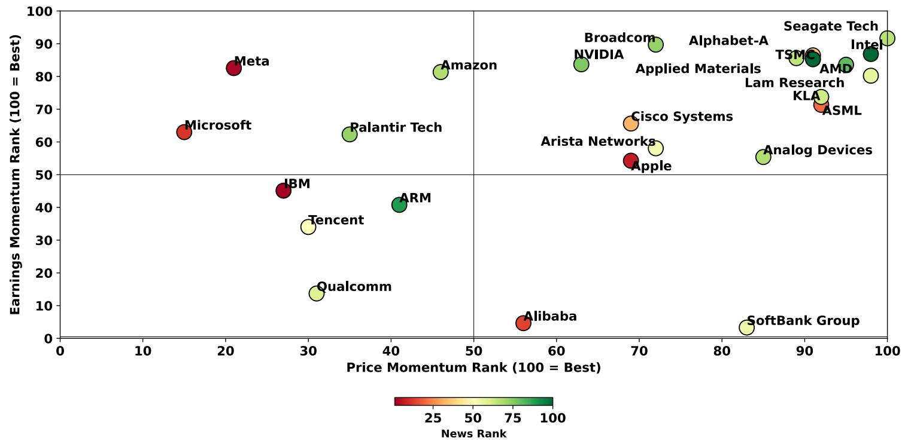

scatter

| Company           | Price Momentum Rank (100 = Best) | Earnings Momentum Rank (100 = Best) |
| ----------------- | --------------------------------- | ------------------------------------- |
| Meta              | 21                                | 83                                    |
| Microsoft         | 15                                | 63                                    |
| IBM               | 27                                | 45                                    |
| Tencent           | 30                                | 34                                    |
| Qualcomm          | 31                                | 14                                    |
| ARM               | 41                                | 41                                    |
| Amazon            | 46                                | 82                                    |
| Broadcom          | 63                                | 84                                    |
| NVIDIA            | 63                                | 85                                    |
| Apple             | 69                                | 54                                    |
| Cisco Systems     | 69                                | 66                                    |
| Arista Networks   | 72                                | 58                                    |
| KLA               | 92                                | 73                                    |
| Analog Devices    | 85                                | 55                                    |
| Alphabet-A        | 72                                | 90                                    |
| Applied Materials | 72                                | 85                                    |
| TSM               | 90                                | 86                                    |
| AMD               | 95                                | 83                                    |
| KLA               | 92                                | 72                                    |
| ASML              | 92                                | 71                                    |
| Intel             | 98                                | 87                                    |
| Seagate Tech      | 100                               | 92                                    |
| SoftBank Group    | 83                                | 4                                     |
| Alibaba           | 56                                | 5                                     |

Source : BofA Global Quantitative Strategy, MSCI, IBES, RavenPack   
BofA GLOBAL RESEARCH

Chart 132: Asia Pac AI: Triple Momentum for the Most Important Stocks   
Triple Momentum is most positive for Renesas Electronics, SEMCO and Advantest   
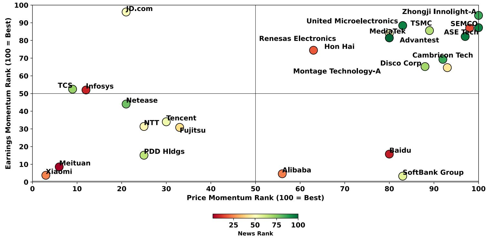

scatter

| Company               | Price Momentum Rank (100 = Best) | Earnings Momentum Rank (100 = Best) |
|-----------------------|-----------------------------------|--------------------------------------|
| JD.com                | ~20                               | ~97                                  |
| TCS                   | ~10                               | ~53                                  |
| Infosys               | ~12                               | ~52                                  |
| Meituan               | ~6                                | ~9                                   |
| Xiaomi                | ~4                                | ~4                                   |
| NTT                   | ~25                               | ~32                                  |
| Tencent               | ~30                               | ~34                                  |
| PDD Hldgs             | ~25                               | ~15                                  |
| Netease               | ~21                               | ~44                                  |
| Hon Hai               | ~63                               | ~74                                  |
| TSMC                  | ~88                               | ~88                                  |
| United Microelectronics| ~85                               | ~88                                  |
| Mediatek              | ~80                               | ~82                                  |
| Advantest             | ~88                               | ~86                                  |
| Renesas Electronics   | ~63                               | ~74                                  |
| Montage Technology-A  | ~63                               | ~65                                  |
| Cambricon Tech        | ~92                               | ~68                                  |
| Telecomm      | ~98                               | ~87                                  |
| ASE Tech              | ~97                               | ~83                                  |
| Zhongji Innolight-A   | ~100                              | ~94                                  |
| Baidu                 | ~80                               | ~16                                  |
| SoftBank Group        | ~83                               | ~4                                   |
| Alibaba               | ~57                               | ~6                                   |
| Tencent               | ~30                               | ~34                                  |
| Fujitsu               | ~33                               | ~31                                  |
| TCS                   | ~9                                | ~53                                  |

Source : BofA Global Quantitative Strategy, MSCI, IBES, RavenPack   
BofA GLOBAL RESEARCH

Chart 133: Global Robotics: Triple Momentum for the Most Important Stocks   
Triple Momentum is most positive for Airtac, Autostore and Delta Electronics   
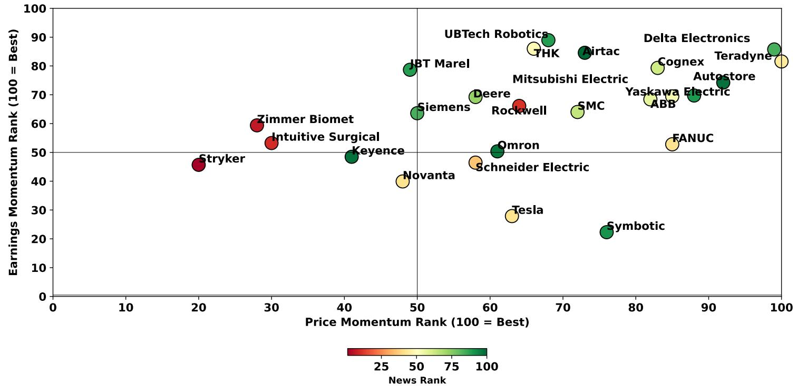

scatter

| Company               | Price Momentum Rank (100 = Best) | Earnings Momentum Rank (100 = Best) |
|-----------------------|----------------------------------|--------------------------------------|
| Stryker               | 20                               | 46                                   |
| Zimmer Biomet         | 28                               | 60                                   |
| Intuitive Surgical     | 30                               | 54                                   |
| Keyence               | 41                               | 49                                   |
| Novanta               | 48                               | 40                                   |
| Schneider Electric    | 58                               | 47                                   |
| Rockwell              | 64                               | 66                                   |
| Siemens               | 50                               | 64                                   |
| Omon                  | 61                               | 51                                   |
| Tesla                 | 63                               | 28                                   |
| Symbotic              | 76                               | 23                                   |
| Chandra Electric      | 61                               | 51                                   |
| Schneider Electric    | 58                               | 47                                   |
| Deere                 | 58                               | 70                                   |
| IBM Tarel             | 49                               | 79                                   |
| UBTech Robotics      | 68                               | 89                                   |
| THK                   | 66                               | 86                                   |
| Mitsubishi Electric   | 72                               | 64                                   |
| Airtac                | 73                               | 85                                   |
| SMC                   | 72                               | 64                                   |
| Amgeni                | 72                               | 64                                   |
| Delta Electronics     | 83                               | 80                                   |
| Autostore             | 92                               | 74                                   |
| Cognex                | 83                               | 80                                   |
| Yaskawa               | 82                               | 69                                   |
| ABB                   | 82                               | 69                                   |
| FANUC                 | 85                               | 53                                   |
| Teradyne              | 99                               | 85                                   |
| Autotrace             | 92                               | 74                                   |
| Delta Electronics     | 99                               | 85                                   |
| Teradyne              | 100                              | 82                                   |

Source : BofA Global Quantitative Strategy, MSCI, IBES, RavenPack   
BofA GLOBAL RESEARCH

Chart 134: Asia Pac Robotics: Triple Momentum for the Most Important Stocks   
Triple Momentum is most positive for Airtac, Delta Electronics and Mitsubishi Electric   
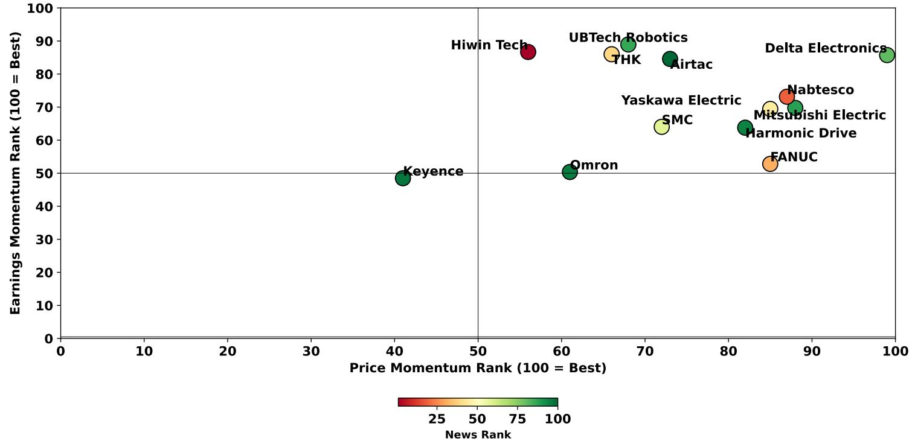

scatter

| Company             | Price Momentum Rank (100 = Best) | Earnings Momentum Rank (100 = Best) |
|---------------------|----------------------------------|--------------------------------------|
| Hiwin Tech          | 56                               | 87                                   |
| UBTech Robotics    | 68                               | 89                                   |
| THK                 | 66                               | 86                                   |
| Airtac              | 73                               | 84                                   |
| Yaskawa Electric    | 72                               | 64                                   |
| SMC                 | 72                               | 64                                   |
| Nabtesco            | 87                               | 73                                   |
| Mitsubishi Electric | 88                               | 70                                   |
| Harmonic Drive       | 82                               | 64                                   |
| FANUC               | 85                               | 53                                   |
| Keyence             | 41                               | 49                                   |

Source : BofA Global Quantitative Strategy, MSCI, IBES, RavenPack   
BofA GLOBAL RESEARCH

Chart 135: Global Defense: Triple Momentum for the Most Important Stocks   
Triple Momentum is most positive for Aselsan, MHI and Rolls-Royce   
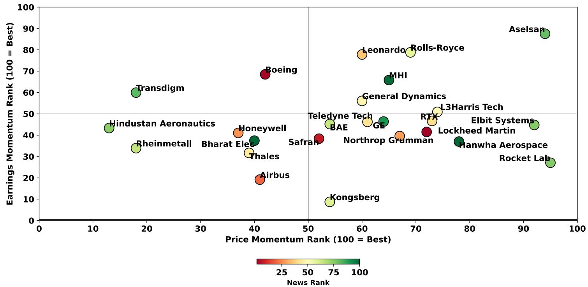

scatter

| Company             | Price Momentum Rank (100 = Best) | Earnings Momentum Rank (100 = Best) |
|---------------------|----------------------------------|--------------------------------------|
| Aselsan             | ~94                              | ~88                                  |
| Rollis-Royce        | ~69                              | ~79                                  |
| Leonardo            | ~60                              | ~78                                  |
| MHI                 | ~65                              | ~66                                  |
| General Dynamics    | ~60                              | ~56                                  |
| L3Harris Tech       | ~74                              | ~51                                  |
| RTX                 | ~73                              | ~47                                  |
| Elbit Systems       | ~92                              | ~45                                  |
| Lockheed Martin      | ~78                              | ~42                                  |
| Hanwha Aerospace     | ~78                              | ~37                                  |
| Rocket Lab          | ~95                              | ~27                                  |
| Kongsberg           | ~54                              | ~9                                   |
| Airbus              | ~41                              | ~20                                  |
| Thales              | ~39                              | ~32                                  |
| Bharat Elec         | ~38                              | ~37                                  |
| Honeywell           | ~37                              | ~41                                  |
| BAE                 | ~54                              | ~45                                  |
| Teledyne Tech       | ~61                              | ~46                                  |
| GE                  | ~64                              | ~46                                  |
| Northrop Grumman    | ~67                              | ~40                                  |
| Safran              | ~52                              | ~38                                  |
| Hindustan Aeronautics| ~13                              | ~44                                  |
| Rheinmetall         | ~18                              | ~34                                  |
| Boeing              | ~42                              | ~69                                  |
| Transdigm           | ~18                              | ~60                                  |

Source : BofA Global Quantitative Strategy, MSCI, IBES, RavenPack   
BofA GLOBAL RESEARCH

Chart 136: Asia Pac Defense: Triple Momentum for the Most Important Stocks   
Triple Momentum is most positive for IHI, MHI and Kawasaki Heavy   
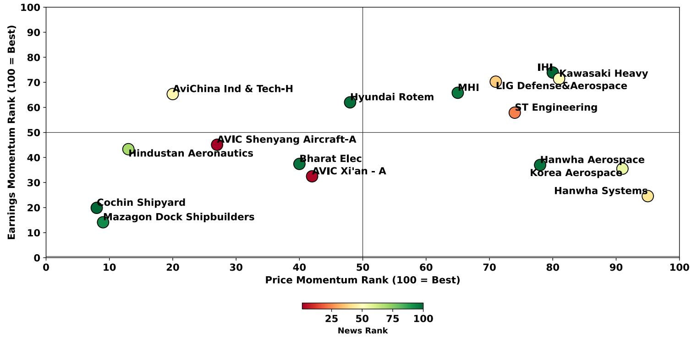

scatter

| Company | Price Momentum Rank (100 = Best) | Earnings Momentum Rank (100 = Best) |
| --- | --- | --- |
| AviChina Ind & Tech-H | 20 | 65 |
| Hyundai Rotem | 48 | 62 |
| MHI | 65 | 66 |
| LIG Defense&Aerospace | 71 | 70 |
| ST Engineering | 74 | 58 |
| KAWasaki Heavy | 80 | 74 |
| IHI | 80 | 73 |
| Hanwha Aerospace | 78 | 37 |
| Korea Aerospace | 91 | 35 |
| Hanwha Systems | 95 | 24 |
| AVIC Shenyang Aircraft-A | 27 | 45 |
| Hindustan Aeronautics | 13 | 43 |
| Bharat Elec | 40 | 37 |
| AVIC Xi'an - A | 42 | 33 |
| Cochin Shipyard | 8 | 20 |
| Mazagon Dock Shipbuilders | 9 | 14 |

Source : BofA Global Quantitative Strategy, MSCI, IBES, RavenPack   
BofA GLOBAL RESEARCH

Chart 137: Global Space: Triple Momentum for the Most Important Stocks
Triple Momentum is most positive for Gilat Satellite Networks and SKY Perfect JSAT   
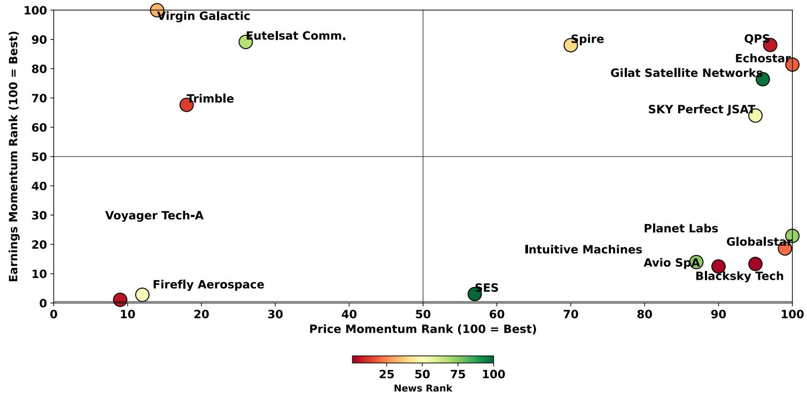

scatter

| Company             | Price Momentum Rank (100 = Best) | Earnings Momentum Rank (100 = Best) |
|---------------------|----------------------------------|--------------------------------------|
| Virgin Galactic     | 14                               | 100                                  |
| Eutelsat Comm.      | 26                               | 90                                   |
| Trimble             | 18                               | 68                                   |
| SES                 | 57                               | 3                                    |
| Spire               | 70                               | 88                                   |
| QPS                 | 97                               | 88                                   |
| Echostar            | 99                               | 82                                   |
| Gilat Satellite Networks | 96              | 76                                   |
| Sky Perfect JSAT    | 95                               | 64                                   |
| Planet Labs         | 99                               | 22                                   |
| Globalstar          | 99                               | 19                                   |
| Avio SpA            | 87                               | 14                                   |
| Intuitive Machines   | 87                               | 14                                   |
| Blacksky Tech       | 90                               | 12                                   |
| Firefly Aerospace    | 11                               | 3                                    |

Source : BofA Global Quantitative Strategy, MSCI, IBES, RavenPack   
BofA GLOBAL RESEARCH

Chart 138: Asia Pac Space: Triple Momentum for the Most Important Stocks
Triple Momentum is most positive for SKY Perfect JSAT   
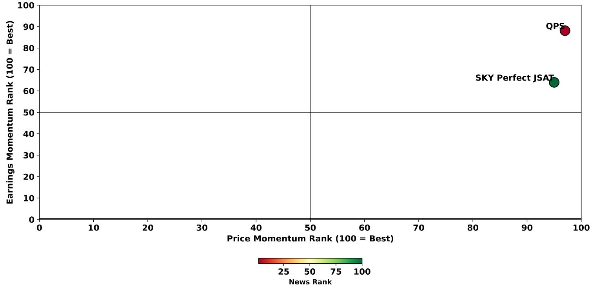

scatter

| Company           | Price Momentum Rank (100 = Best) | Earnings Momentum Rank (100 = Best) |
| ----------------- | -------------------------------- | ------------------------------------ |
| QPS               | 97                               | 88                                   |
| SKY Perfect JSAT  | 95                               | 64                                   |

Source : BofA Global Quantitative Strategy, MSCI, IBES, RavenPack   
BofA GLOBAL RESEARCH

Chart 139: Global Energy Storage: Triple Momentum for the Most Important Stocks   
Triple Momentum is most positive for Samsung SDI, NGK and Albemarle   
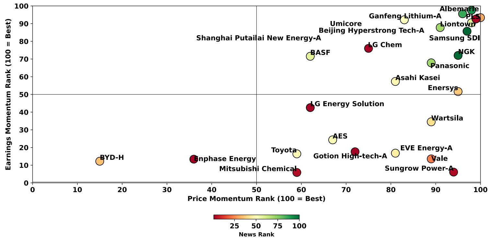

scatter

| Company | Price Momentum Rank (100 = Best) | Earnings Momentum Rank (100 = Best) |
| --- | --- | --- |
| ALBEMARLE | 98 | 97 |
| PLS | 99 | 93 |
| Liontown | 97 | 90 |
| Samsung SDI | 96 | 86 |
| LG Chem | 75 | 76 |
| Umicore | 74 | 88 |
| Beijing Hyperstrong Tech-A | 73 | 89 |
| Ganfeng Lithium-A | 83 | 92 |
| NGK | 95 | 72 |
| Panasonic | 89 | 68 |
| Asahi Kasei | 81 | 58 |
| Enersys | 94 | 52 |
| Wartsila | 89 | 35 |
| LG Energy Solution | 62 | 43 |
| AES | 67 | 24 |
| Gotion High-tech-A | 72 | 18 |
| Toyota | 59 | 16 |
| Inphase Energy | 36 | 14 |
| Mitsubishi Chemical | 59 | 6 |
| BYD-H | 15 | 12 |
| Sungrow Power-A | 94 | 6 |
| EVE Energy-A | 81 | 17 |
| Yale | 89 | 14 |
| Samsung | 90 | 88 |
| LG Chem | 75 | 76 |
| BASF | 62 | 72 |
| Shanghai Putailai New Energy-A | 62 | 72 |
| Synthaya Electric | 95 | 52 |
| Shenzhen Electric Power-A | 95 | 52 |
The chart displays company names as data points with a color scale from red (lower rank) to green (higher rank). The x-axis represents Price Momentum Rank (100 = Best), and the y-axis represents Earnings Momentum Rank (100 = Best). The color bar indicates News Rank from 25 to 100.

Source : BofA Global Quantitative Strategy, MSCI, IBES, RavenPack   
BofA GLOBAL RESEARCH

Chart 140: Asia Pac Energy Storage: Triple Momentum for the Most Important Stocks   
Triple Momentum is most positive for CALB, Samsung SDI and GS Yuasa   
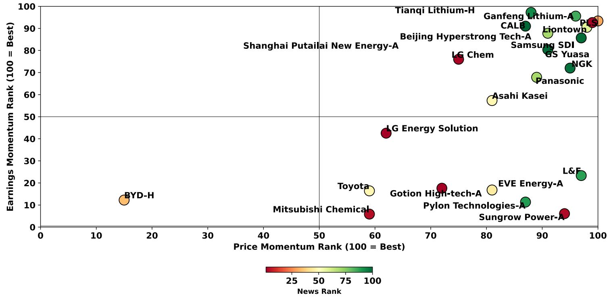  
Source : BofA Global Quantitative Strategy, MSCI, IBES, RavenPack   
BofA GLOBAL RESEARCH

Chart 141: Global Nuclear Energy: Triple Momentum for the Most Important Stocks   
Triple Momentum is most positive for GE Vernova and Talen Energy   
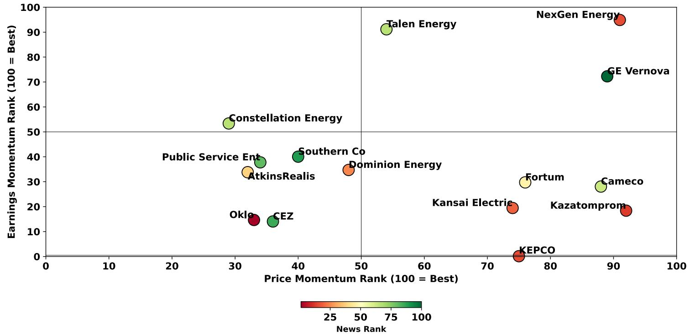

scatter

| Company           | Price Momentum Rank (100 = Best) | Earnings Momentum Rank (100 = Best) |
| ----------------- | -------------------------------- | ------------------------------------ |
| Constellation Energy | 29                             | 53                                   |
| Public Service Ent | 33                             | 38                                   |
| AtkinsRealis      | 32                             | 34                                   |
| Southern Co       | 40                             | 40                                   |
| Oklo              | 33                             | 15                                   |
| CEZ               | 36                             | 14                                   |
| Talen Energy      | 54                             | 91                                   |
| Dominion Energy   | 48                             | 35                                   |
| Fortum            | 76                             | 30                                   |
| Kansai Electric   | 74                             | 20                                   |
| KEPCO             | 75                             | 1                                    |
| NEXGen Energy     | 91                             | 95                                   |
| GE Vernova        | 89                             | 72                                   |
| Cameco            | 88                             | 28                                   |
| Kazatomprom       | 92                             | 18                                   |

Source : BofA Global Quantitative Strategy, MSCI, IBES, RavenPack   
BofA GLOBAL RESEARCH

Chart 142: Asia Pac Nuclear Energy: Triple Momentum for the Most Important Stocks   
None of the stocks are in the Top-Right Quadrant with Positive News   
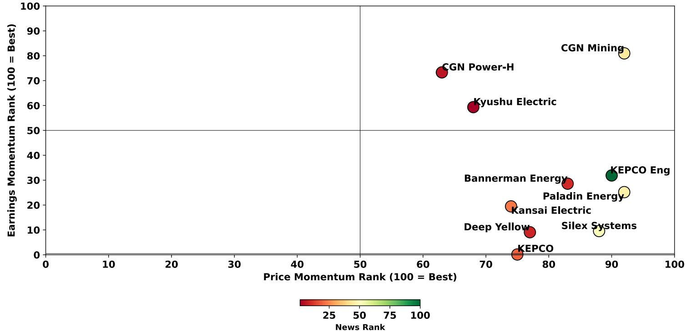

scatter

| Company           | Price Momentum Rank (100 = Best) | Earnings Momentum Rank (100 = Best) |
| ----------------- | -------------------------------- | ------------------------------------ |
| CGN Mining        | 92                               | 81                                   |
| CGN Power-H       | 64                               | 74                                   |
| Kyushu Electric   | 68                               | 60                                   |
| Bannerman Energy  | 83                               | 28                                   |
| Kansai Electric   | 74                               | 19                                   |
| Deep Yellow       | 77                               | 9                                    |
| KEPCO             | 75                               | 1                                    |
| KEPCO Eng         | 90                               | 32                                   |
| Paladin Energy    | 92                               | 25                                   |
| Silex Systems     | 88                               | 10                                   |

Source : BofA Global Quantitative Strategy, MSCI, IBES, RavenPack   
BofA GLOBAL RESEARCH

Chart 143: Global Renewable Energy: Triple Momentum for the Most Important Stocks   
Triple Momentum is most positive for Bloom Energy, Hanwha Solutions and Vestas Wind   
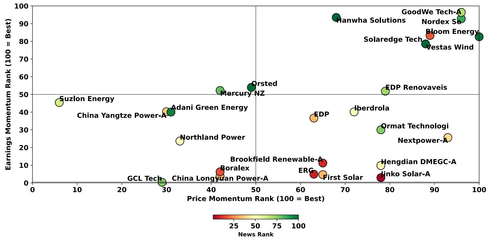  
Source : BofA Global Quantitative Strategy, MSCI, IBES, RavenPack

BofA GLOBAL RESEARCH

Chart 144: Asia Pac Renewable Energy: Triple Momentum for the Most Important Stocks   
Triple Momentum is most positive for Hanwha Solutions and GoodWe Tech-A   
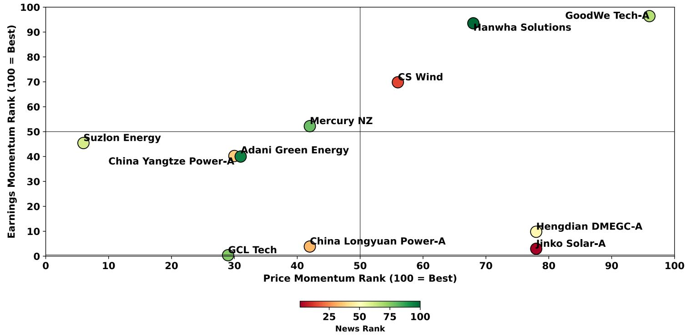

scatter

| Company               | Price Momentum Rank (100 = Best) | Earnings Momentum Rank (100 = Best) |
|-----------------------|-----------------------------------|--------------------------------------|
| GoodWe Tech-A         | 96                                | 97                                   |
| Hanwha Solutions      | 68                                | 93                                   |
| CS Wind               | 56                                | 70                                   |
| Mercury NZ            | 42                                | 52                                   |
| Suzlon Energy          | 6                                 | 46                                   |
| China Yangtze Power-A | 30                                | 40                                   |
| Adani Green Energy     | 31                                | 40                                   |
| GCL Tech              | 29                                | 1                                    |
| China Longyuan Power-A| 42                                | 5                                    |
| Hengdian DMEGC-A      | 78                                | 10                                   |
| Jinko Solar-A         | 78                                | 3                                    |

Source : BofA Global Quantitative Strategy, MSCI, IBES, RavenPack

BofA GLOBAL RESEARCH

Chart 145: Global Luxury Lifestyle: Triple Momentum for the Most Important Stocks   
Triple Momentum is most positive for Toll Brothers, Tapestry and Viking   
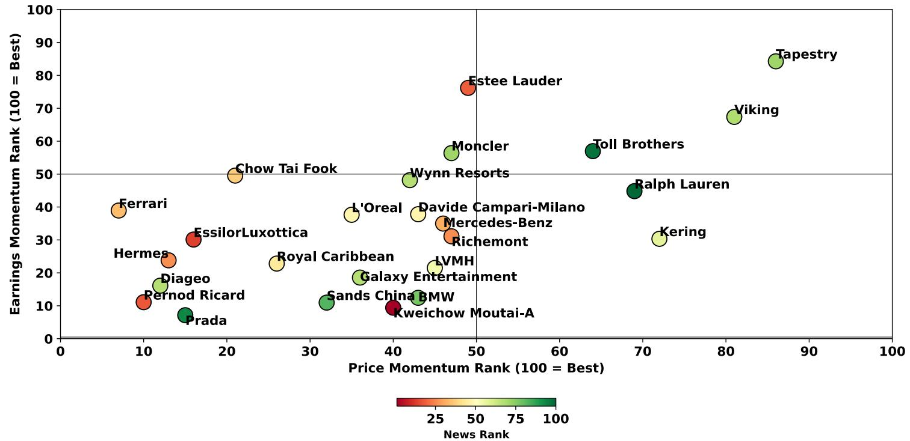

scatter

| Brand             | Price Momentum Rank (100 = Best) | Earnings Momentum Rank (100 = Best) |
| ----------------- | -------------------------------- | ------------------------------------ |
| Tapestry          | 86                               | 84                                   |
| Viking            | 81                               | 68                                   |
| Toll Brothers     | 64                               | 57                                   |
| Ralph Lauren      | 69                               | 45                                   |
| Kering            | 72                               | 31                                   |
| Moncler           | 48                               | 57                                   |
| Estee Lauder      | 49                               | 76                                   |
| Wynn Resorts      | 42                               | 48                                   |
| Davide Campari-Milano | 43                          | 37                                   |
| Mercedes-Benz     | 47                               | 35                                   |
| Richemont         | 47                               | 31                                   |
| L'Oréal           | 35                               | 38                                   |
| Royal Caribbean   | 26                               | 23                                   |
| Galaxy Entertainment | 45                           | 19                                   |
| Sands China       | 32                               | 11                                   |
| BMW               | 40                               | 13                                   |
| Kweichow Moutai-A  | 40                               | 10                                   |
| EssilorLuxottica  | 16                               | 30                                   |
| Ferrari           | 7                                | 39                                   |
| Hermes            | 12                               | 24                                   |
| Diageo            | 12                               | 16                                   |
| Pernod Ricard     | 10                               | 11                                   |
| Prada             | 15                               | 7                                    |

Source : BofA Global Quantitative Strategy, MSCI, IBES, RavenPack   
BofA GLOBAL RESEARCH

Chart 146: Asia Pac Luxury Lifestyle: Triple Momentum for the Most Important Stocks   
Triple Momentum is most positive for Shiseido and   
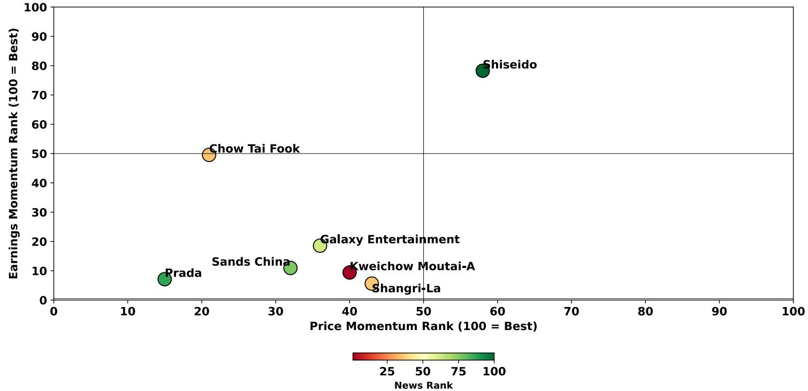

scatter

| Company           | Price Momentum Rank (100 = Best) | Earnings Momentum Rank (100 = Best) |
| ----------------- | -------------------------------- | ------------------------------------ |
| Shiseido          | 58                               | 79                                   |
| Chow Tai Fook     | 21                               | 50                                   |
| Prada             | 15                               | 7                                    |
| Sands China       | 32                               | 11                                   |
| Galaxy Entertainment | 36                             | 19                                   |
| Kweichow Moutai-A  | 40                               | 10                                   |
| Shangri-La        | 43                               | 6                                    |

Source : BofA Global Quantitative Strategy, MSCI, IBES, RavenPack   
BofA GLOBAL RESEARCH

Chart 147: Global Gold: Triple Momentum for the Most Important Stocks   
Triple Momentum is most positive for Equinox Gold, Alamos Gold and Industrias Penoles   
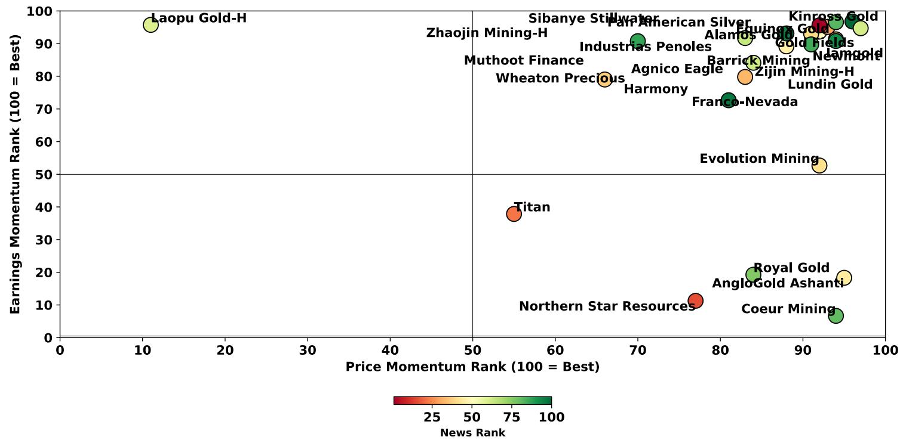

scatter

| Company | Price Momentum Rank (100 = Best) | Earnings Momentum Rank (100 = Best) | News Rank |
| --- | --- | --- | --- |
| Laopu Gold-H | 11 | 96 | 75 |
| Zhaojin Mining-H | 48 | 93 | 75 |
| Muthoot Finance | 52 | 80 | 75 |
| Wheaton Precious | 66 | 79 | 75 |
| Sibanye Stillwater | 68 | 91 | 75 |
| Par American Silver | 70 | 91 | 75 |
| Industrias Penoles | 70 | 91 | 75 |
| Agnico Eagle | 72 | 80 | 75 |
| Harmony | 74 | 73 | 75 |
| France-Nevada | 81 | 72 | 75 |
| Alamos Gold | 83 | 92 | 75 |
| Barrick Mining | 83 | 80 | 75 |
| Zijin Mining-H | 83 | 80 | 75 |
| Lundin Gold | 88 | 90 | 75 |
| Kinross Gold | 92 | 95 | 75 |
| Evolution Mining | 92 | 53 | 75 |
| Titan | 55 | 38 | 75 |
| Northern Star Resources | 77 | 11 | 75 |
| Royal Gold | 84 | 19 | 75 |
| AngloGold Ashanti | 84 | 19 | 75 |
| Coeur Mining | 94 | 6 | 75 |
| Kinross Gold | 94 | 96 | 75 |
| Gold Fields | 92 | 91 | 75 |
| New Gold | 94 | 94 | 75 |
| Western Gold | 96 | 96 | 75 |
| Northern Star Resources | 77 | 11 | 75 |
| AngolaGold Ashanti | 94 | 18 | 75 |
| Coeur Mining | 94 | 6 | 75 |
| Western Gold Mining Group (Nasdaq) | 92 | 94 | 75 |
| Western Gold Mining Group (Nasdaq) (Nasdaq) (Nasdaq) (Nasdaq) (Nasdaq) (Nasdaq) (Nasdaq) (Nasdaq) (Nasdaq) (Nasdaq) (Nasdaq) (Nasdaq) (Nasdaq) (Nasdaq) (Nasdaq) (Nasdaq) (Nasdaq) (Nasdaq) (Nasdaq) (Nasdaq) (Nasdaq).

Source : BofA Global Quantitative Strategy, MSCI, IBES, RavenPack   
BofA GLOBAL RESEARCH

Chart 148: Asia Pac Gold: Triple Momentum for the Most Important Stocks   
Triple Momentum is most positive for Perseus Mining, Zijin Mining-H and Muthoot Finance   
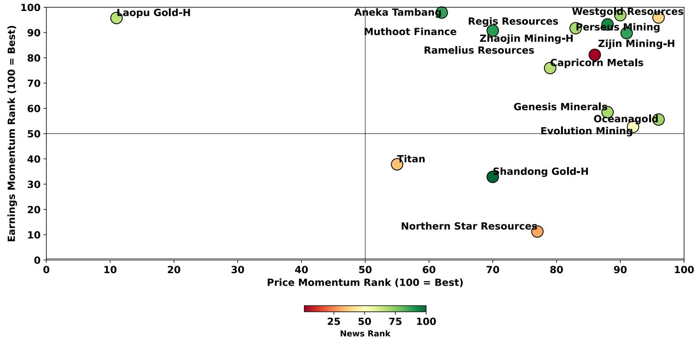

scatter

| Company               | Price Momentum Rank (100 = Best) | Earnings Momentum Rank (100 = Best) |
|-----------------------|----------------------------------|--------------------------------------|
| Laopu Gold-H         | 10                               | 97                                   |
| Aneka Tambang        | 62                               | 98                                   |
| Muthoot Finance       | 60                               | 90                                   |
| Regis Resources       | 70                               | 91                                   |
| Zhaojin Mining-H      | 68                               | 89                                   |
| Ramelius Resources   | 68                               | 88                                   |
| Capricorn Metals      | 79                               | 76                                   |
| Westgold Resources   | 90                               | 96                                   |
| Perseus Mining       | 83                               | 92                                   |
| Zijin Mining-H        | 91                               | 90                                   |
| Genesis Minerals     | 88                               | 58                                   |
| Oceanagold            | 92                               | 54                                   |
| Evolution Mining      | 92                               | 52                                   |
| Titan                 | 55                               | 38                                   |
| Shandong Gold-H      | 70                               | 33                                   |
| Northern Star Resources | 77                               | 11                                   |

Source : BofA Global Quantitative Strategy, MSCI, IBES, RavenPack   
BofA GLOBAL RESEARCH

Chart 149: Global Rare Earths: Triple Momentum for the Most Important Stocks   
Triple Momentum is most positive for Arafura Rare Earths, Xiamen Tungsten-A and Lynas Rare Earths   
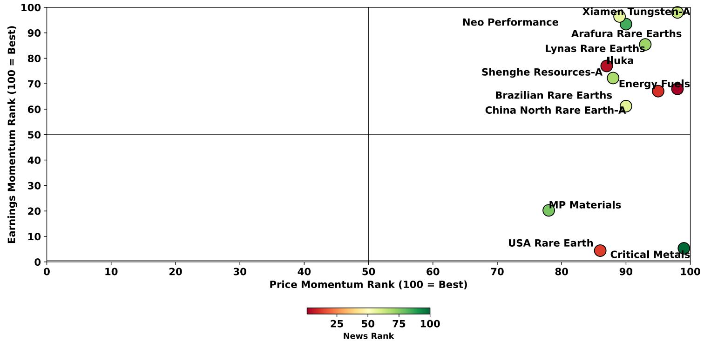

scatter

| Company | Price Momentum Rank (100 = Best) | Earnings Momentum Rank (100 = Best) | News Rank |
| --- | --- | --- | --- |
| Xiamen Tungsten-A | 98 | 97 | 50 |
| Arafura Rare Earths | 90 | 93 | 60 |
| Lynas Rare Earths | 92 | 85 | 70 |
| Shenghe Resources-A | 87 | 77 | 40 |
| Iuka | 88 | 76 | 30 |
| Energy Fuels | 95 | 67 | 45 |
| Brazilian Rare Earths | 89 | 72 | 35 |
| China North Rare Earth-A | 90 | 61 | 55 |
| MP Materials | 78 | 21 | 65 |
| USA Rare Earth | 86 | 4 | 25 |
| Critical Metals | 99 | 5 | 100 |

Source : BofA Global Quantitative Strategy, MSCI, IBES, RavenPack   
BofA GLOBAL RESEARCH

Chart 150: Asia Pac Rare Earths: Triple Momentum for the Most Important Stocks   
Triple Momentum is most positive for Xiamen Tungsten-A, Lynas Rare Earths and Shenghe Resources-A   
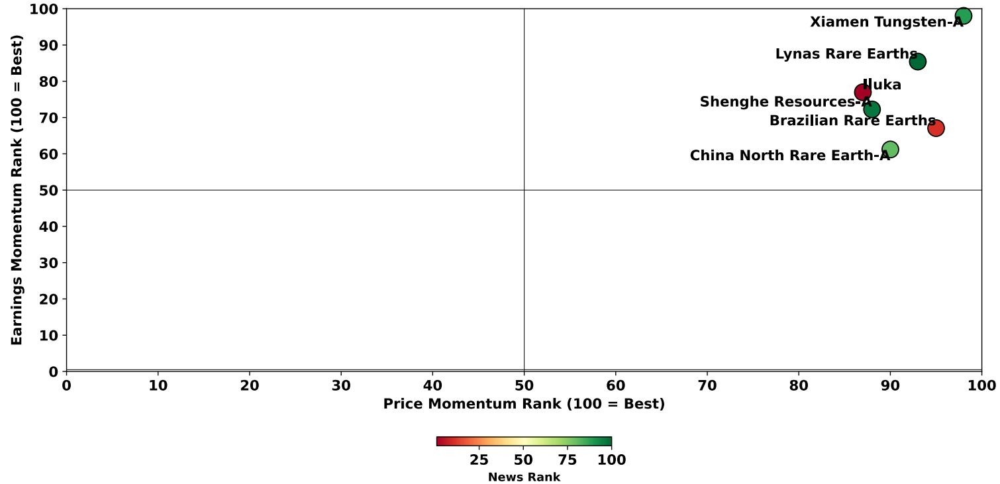

scatter

| Company                  | Price Momentum Rank (100 = Best) | Earnings Momentum Rank (100 = Best) |
| ------------------------ | --------------------------------- | ------------------------------------- |
| Xiamen Tungsten-A        | 98                                | 98                                    |
| Lynas Rare Earths        | 93                                | 85                                    |
| Shenghe Resources-A      | 87                                | 77                                    |
| Brazilian Rare Earths    | 95                                | 67                                    |
| China North Rare Earth-A | 90                                | 61                                    |

Source : BofA Global Quantitative Strategy, MSCI, IBES, RavenPack   
BofA GLOBAL RESEARCH

Chart 151: Global SaaS: Triple Momentum for the Most Important Stocks   
Triple Momentum is most positive for Twilio-A   
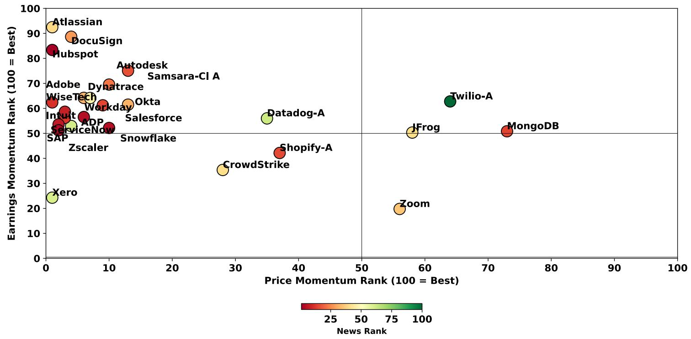

scatter

| Company       | Price Momentum Rank (100 = Best) | Earnings Momentum Rank (100 = Best) |
| ------------- | --------------------------------- | ------------------------------------- |
| Atlassian     | ~3                                | ~92                                   |
| DocuSign      | ~4                                | ~88                                   |
| Hubspot       | ~2                                | ~83                                   |
| Autodesk      | ~12                               | ~75                                   |
| Samsara-CI A  | ~13                               | ~70                                   |
| Adobe         | ~6                                | ~65                                   |
| Dynatrace     | ~10                               | ~68                                   |
| Workday       | ~9                                | ~62                                   |
| Okta          | ~13                               | ~62                                   |
| Salesforce    | ~10                               | ~58                                   |
| Snowflake     | ~10                               | ~52                                   |
| SAP           | ~3                                | ~52                                   |
| Zscaler       | ~4                                | ~50                                   |
| App           | ~3                                | ~55                                   |
| ServiceNow    | ~4                                | ~52                                   |
| Xero          | ~1                                | ~25                                   |
| CrowdStrike   | ~28                               | ~35                                   |
| Shopify-A     | ~37                               | ~42                                   |
| JFrog         | ~58                               | ~50                                   |
| Twilio-A      | ~64                               | ~63                                   |
| MongoDB        | ~73                               | ~51                                   |
| Zoom          | ~56                               | ~20                                   |

Source : BofA Global Quantitative Strategy, MSCI, IBES, RavenPack   
BofA GLOBAL RESEARCH

Chart 152: Asia Pac SaaS: Triple Momentum for the Most Important Stocks   
None of the stocks are in the Top-Right Quadrant with Positive News   
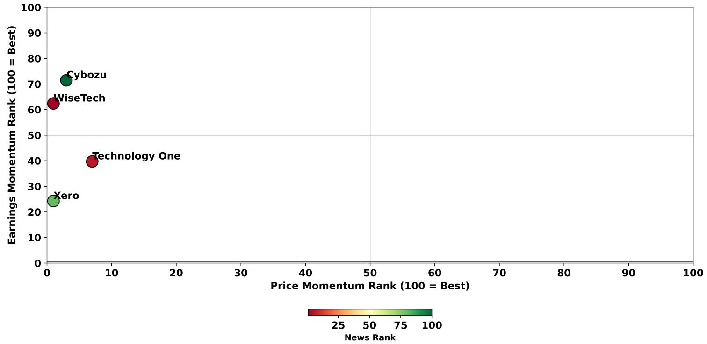

scatter

| Company      | Price Momentum Rank (100 = Best) | Earnings Momentum Rank (100 = Best) |
| ------------ | --------------------------------- | ------------------------------------- |
| Cybozu       | 3                                 | 72                                    |
| WiseTech     | 1                                 | 63                                    |
| Technology One| 7                                 | 40                                    |
| Xero         | 1                                 | 25                                    |

Source : BofA Global Quantitative Strategy, MSCI, IBES, RavenPack   
BofA GLOBAL RESEARCH

Chart 153: Global Quantum Computing: Triple Momentum for the Most Important Stocks   
Triple Momentum is most positive for Hitachi and Formfactor   
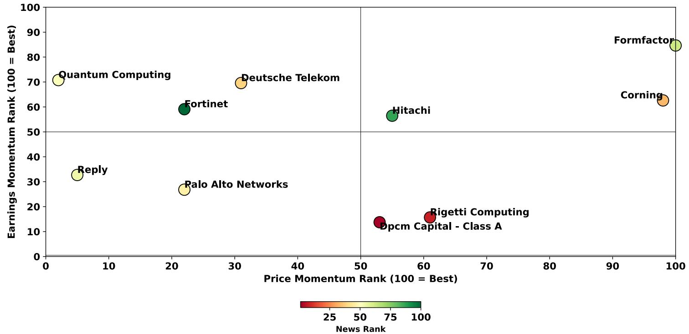

scatter

| Company                  | Price Momentum Rank (100 = Best) | Earnings Momentum Rank (100 = Best) |
| ------------------------ | --------------------------------- | ------------------------------------ |
| Quantum Computing        | ~3                                | ~71                                  |
| Fortinet                 | ~22                               | ~60                                  |
| Deutsche Telekom         | ~31                               | ~70                                  |
| Palo Alto Networks       | ~22                               | ~27                                  |
| Hitachi                  | ~55                               | ~57                                  |
| Corning                  | ~98                               | ~63                                  |
| Formfactor               | 100                               | ~85                                  |
| Dpcm Capital - Class A   | ~53                               | ~14                                  |
| Rigalet Computing        | ~61                               | ~16                                  |

Source : BofA Global Quantitative Strategy, MSCI, IBES, RavenPack   
BofA GLOBAL RESEARCH

Chart 154: Asia Pac Quantum Computing: Triple Momentum for the Most Important Stocks   
Triple Momentum is most positive for Hitachi   
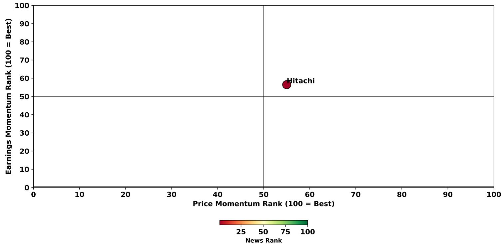

scatter

| Name   | Price Momentum Rank (100 = Best) | Earnings Momentum Rank (100 = Best) |
|--------|-----------------------------------|--------------------------------------|
| Hitachi| 55                                | 57                                   |

Source : BofA Global Quantitative Strategy, MSCI, IBES, RavenPack   
BofA GLOBAL RESEARCH

# Special Disclosures

BofA is currently advising FIBRA MQ Mexico on the potential sale of the company to FIBRA Prologis, announced Feb 25 2026.

BofA is serving as financial advisor to Sempra on the sale of a 45% equity interest in Sempra Infrastructure Partners, LP to affiliates of Kohlberg Kravis Roberts & Co. L.P. (KKR) announced September 23, 2025

BofA is currently acting as Financial Advisor to Aligned Data Centers in connection with its proposed sale by MQ Asset Management to Global Infrastructure Partners, which was announced on October 15, 2025.

BofA is currently acting as financial advisor to Flex Ltd in connection with its proposed spinoff of its Power and Cloud portfolio, which was announced on May 5, 2026. The proposed transaction is subject to approval by shareholders of Flex. This research report is not intended to provide voting advice, serve as an endorsement of the proposed transaction, or result in the procurement, withholding or revocation of a proxy.

BofA is currently acting as joint Financial Advisor to Diageo PLC in connection with the proposed disposal of its majority ownership in public subsidiary East African Breweries PLC to Asahi Group Holdings Ltd, which was announced on December 17, 2025.

# Disclosures

# Important Disclosures

FUNDAMENTAL EQUITY OPINION KEY: Opinions include a Volatility Risk Rating, an Investment Rating and an Income Rating. VOLATILITY RISK RATINGS, indicators of potential price fluctuation, are: A - Low, B - Medium and C - High. INVESTMENT RATINGS reflect the analyst's assessment of both a stock's absolute total return potential as well as its attractiveness for investment relative to other stocks within its Coverage Cluster (defined below). Our investment ratings are: 1 - Buy stocks are expected to have a total return of at least 10% and are the most attractive stocks in the coverage cluster; 2 - Neutral stocks are expected to remain flat or increase in value and are less attractive than Buy rated stocks and 3 - Underperform stocks are the least attractive stocks in a coverage cluster. An investment rating of 6 (No Rating) indicates that a stock is no longer trading on the basis of fundamentals. Analysts assign investment ratings considering, among other things, the 0-12 month total return expectation for a stock and the firm's guidelines for ratings dispersions (shown in the table below). The current price objective for a stock should be referenced to better understand the total return expectation at any given time. The price objective reflects the analyst's view of the potential price appreciation (depreciation).

<table><tr><td>Investment rating</td><td>Total return expectation (within 12-month period of date of initial rating)</td><td>Ratings dispersion guidelines for coverage cluster $^{R1}$ </td></tr><tr><td>Buy</td><td>≥ 10%</td><td>≤ 70%</td></tr><tr><td>Neutral</td><td>≥ 0%</td><td>≤ 30%</td></tr><tr><td>Underperform</td><td>N/A</td><td>≥ 20%</td></tr></table>

$^{R1}$ Ratings dispersions may vary from time to time where BofA Global Research believes it better reflects the investment prospects of stocks in a Coverage Cluster.

INCOME RATINGS, indicators of potential cash dividends, are: 7 - same/higher (dividend considered to be secure), 8 - same/lower (dividend not considered to be secure) and 9 - pays no cash dividend. Coverage Cluster is comprised of stocks covered by a single analyst or two or more analysts sharing a common industry, sector, region or other classification(s). A stock's coverage cluster is included in the most recent BofA Global Research report referencing the stock.

Due to the nature of quantitative analysis, the issuers or securities recommended or discussed in this report are not continuously followed. Accordingly, investors must regard this report as providing stand-alone analysis and should not expect continuing analysis or additional reports relating to such issuers and/or securities.

BofA Global Research personnel (including the analyst(s) responsible for this report) receive compensation based upon, among other factors, the overall profitability of BofA Corporation, including profits derived from investment banking. The analyst(s) responsible for this report may also receive compensation based upon, among other factors, the overall profitability of the Bank's sales and trading businesses relating to the class of securities or financial instruments for which such analyst is responsible.

# Other Important Disclosures

Prices are indicative and for information purposes only. Except as otherwise stated in the report, for any recommendation in relation to an equity security, the price referenced is the publicly traded price of the security as of close of business on the day prior to the date of the report or, if the report is published during intraday trading, the price referenced is indicative of the traded price as of the date and time of the report and in relation to a debt security (including equity preferred and CDS), prices are indicative as of the date and time of the report and are from various sources including BofA trading desks.

The date and time of completion of the production of any recommendation in this report shall be the date and time of dissemination of this report as recorded in the report timestamp.

Recipients who are not institutional investors or market professionals should seek the advice of their independent financial advisor before considering information in this report in connection with any investment decision, or for a necessary explanation of its contents.

Officers of BofAS or one or more of its affiliates (other than research analysts) may have a financial interest in securities of the issuer(s) or in related investments.

Refer to BofA Global Research policies relating to conflicts of interest.

"BofA" includes BofA, Inc. ("BofAS") and its affiliates. Investors should contact their BofA representative or Merrill Global Wealth Management financial advisor if they have questions concerning this report or concerning the appropriateness of any investment idea described herein for such investor. "BofA" is a global brand for BofA Global Research.

# Information relating to Non-US affiliates of BofA and Distribution of Affiliate Research Reports:

BofAS and/or BofA, Pierce, Fenner & Smith Incorporated ("MLPF&S") may in the future distribute, information of the following non-US affiliates in the US (short name: legal name, regulator): BofA (South Africa): BofA South Africa (Pty) Ltd., regulated by the Financial Sector Conduct Authority; MLI (UK): BofA International, regulated by the Financial Conduct Authority (FCA) and the Prudential Regulation Authority (PRA); BofASE (France): BofA Europe SA is authorized by the Autorité de Contrôle Prudentiel et de Résolution (ACPR) and regulated by the ACPR and the Autorité des Marchés Financiers (AMF). BofA Europe SA ("BofASE") with registered address at 51, rue La Boétie, 75008 Paris is registered under no 842 602 690 RCS Paris. In accordance with the provisions of French Code Monétaire et Financier (Monetary and Financial Code), BofASE is an établissement de crédit et d'investissement (credit and investment institution) that is authorised and supervised by the European Central Bank and the Autorité de Contrôle Prudentiel et de Résolution (ACPR) and regulated by the ACPR and the Autorité des Marchés Financiers. BofASE's share capital can be found at www.bofaml.com/BofASEdisclaimer; BofA Europe (Milan): BofA Europe Designated Activity Company, Milan Branch, regulated by the Bank of Italy, the European Central Bank (ECB) and the Central Bank of Ireland (CBI); BofA Europe (Frankfurt): BofA Europe Designated Activity Company, Frankfurt Branch regulated by BaFin, the ECB and the CBI; BofA Europe (Zurich): BofA Europe Designated Activity Company, Zurich Branch, regulated by the Swiss Financial Market Supervisory Authority FINMA, the ECB and CBI; BofA Europe (Madrid): BofA Europe Designated Activity Company, Sucursal en España, regulated by the Bank of Spain, the ECB and the CBI; BofA (Australia): BofA Equities (Australia) Limited, regulated by the Australian Securities and Investments Commission; BofA (Hong Kong): BofA (Asia Pacific) Limited, regulated by the Hong Kong Securities and Futures Commission (HKSFC); BofA (Singapore): BofA (Singapore) Pte Ltd, regulated by the Monetary Authority of Singapore (MAS); BofA (Canada): BofA Canada Inc, regulated by the Canadian Investment Regulatory Organization; BofA (Mexico): BofA Mexico, SA de CV, Casa de Bolsa, regulated by the Comisión Nacional Bancaria y de Valores; BofAS Japan: BofA Japan Co., Ltd., regulated by the Financial Services Agency; BofA (Seoul): BofA International, LLC Seoul Branch, regulated by the Financial Supervisory Service; BofA (Taiwan): BofA (Taiwan) Ltd., regulated by the Securities and Futures Bureau; BofAS India: BofA India Limited, regulated by the Securities and Exchange Board of India (SEBI); BofA (Israel): BofA Israel Limited, regulated by Israel Securities Authority; BofA (DIFC): BofA International (DIFC Branch), regulated by the Dubai Financial Services Authority (DFSA); BofA (Brazil): BofA S.A. Corretora de Títulos e Valores Mobiliários, regulated by Comissão de Valores Mobiliários; BofA KSA Company: BofA Kingdom of Saudi Arabia Company, regulated by the Capital Market Authority. This information: has been approved for publication and is distributed in the United Kingdom (UK) to professional clients and eligible counterparties (as each is defined in the rules of the FCA and the PRA) by MLI (UK), which is authorized by the PRA and regulated by the FCA and the PRA - details about the extent of our regulation by the FCA and PRA are available from us on request; has been approved for publication and is distributed in the European Economic Area (EEA) by BofASE (France), which is authorized by the ACPR and regulated by the ACPR and the AMF; has been considered and distributed in Japan by BofAS Japan, a registered securities dealer under the Financial Instruments and Exchange Act in Japan, or its permitted affiliates; is issued and distributed in Hong Kong by BofA (Hong Kong) which is regulated by HKSFC; is issued and distributed in Taiwan by BofA (Taiwan); is issued and distributed in India by BofAS India; and is issued and distributed in Singapore to institutional investors and/or accredited investors (each as defined under the Financial Advisers Regulations) by BofA (Singapore) (Company Registration No 198602883D). BofA (Singapore) is regulated by MAS. BofA Equities (Australia) Limited (ABN 65 006 276 795), AFS License 235132 (MLEA) distributes this information in Australia only to 'Wholesale' clients as defined by s.761G of the Corporations Act 2001. With the exception of BofA N.A., Australia Branch, neither MLEA nor any of its affiliates involved in preparing this information is an Authorised Deposit-Taking Institution under the Banking Act 1959 nor regulated by the Australian Prudential Regulation Authority. No approval is required for publication or distribution of this information in Brazil and its local distribution is by BofA (Brazil) in accordance with applicable regulations. BofA (DIFC) is authorized and regulated by the DFSA. Information prepared and issued by BofA (DIFC) is done so in accordance with the requirements of the DFSA conduct of business rules. BofA Europe (Frankfurt) distributes this information in Germany and is regulated by BaFin, the ECB and the CBI. BofA entities, including BofA Europe and BofASE (France), may outsource/delegate the marketing and/or provision of certain research services or aspects of research services to other branches or members of the BofA group. You may be contacted by a different BofA entity acting for and on behalf of your service provider where permitted by applicable law. This does not change your service provider. Please refer to the Electronic Communications Disclaimers for further information.

This information has been prepared and issued by BofAS and/or one or more of its non-US affiliates. The author(s) of this information may not be licensed to carry on regulated activities in your jurisdiction and, if not licensed, do not hold themselves out as being able to do so. BofAS and/or MLPF&S is the distributor of this information in the US and accepts full responsibility for information distributed to BofAS and/or MLPF&S clients in the US by its non-US affiliates. Any US person receiving this information and wishing to effect any transaction in any security discussed herein should do so through BofAS and/or MLPF&S and not such foreign affiliates. Hong Kong recipients of this information should contact BofA (Asia Pacific) Limited in respect of any matters relating to dealing in securities or provision of specific advice on securities or any other matters arising from, or in connection with, this information. Singapore recipients of this information should contact BofA (Singapore) Pte Ltd in respect of any matters arising from, or in connection with, this information. For clients that are not accredited investors, expert investors or institutional investors BofA (Singapore) Pte Ltd accepts full responsibility for the contents of this information distributed to such clients in Singapore.

# General Investment Related Disclosures:

Taiwan Readers: Neither the information nor any opinion expressed herein constitutes an offer or a solicitation of an offer to transact in any securities or other financial instrument. No part of this report may be used or reproduced or quoted in any manner whatsoever in Taiwan by the press or any other person without the express written consent of BofA.

This document provides general information only, and has been prepared for, and is intended for general distribution to, BofA clients. Neither the information nor any opinion expressed constitutes an offer or an invitation to make an offer, to buy or sell any securities or other financial instrument or any derivative related to such securities or instruments (e.g., options, futures, warrants, and contracts for differences). This document is not intended to provide personal investment advice and it does not take into account the specific investment objectives, financial situation and the particular needs of, and is not directed to, any specific person(s). This document and its content do not constitute, and should not be considered to constitute, investment advice for purposes of ERISA, the US tax code, the Investment Advisers Act or otherwise. Investors should seek financial advice regarding the appropriateness of investing in financial instruments and implementing investment strategies discussed or recommended in this document and should understand that statements regarding future prospects may not be realized. Any decision to purchase or subscribe for securities in any offering must be based solely on existing public information on such security or the information in the prospectus or other offering document issued in connection with such offering, and not on this document.

Securities and other financial instruments referred to herein, or recommended, offered or sold by BofA, are not insured by the Federal Deposit Insurance Corporation and are not deposits or other obligations of any insured depository institution (including, BofA, N.A.). Investments in general and, derivatives, in particular, involve numerous risks, including, among others, market risk, counterparty default risk and liquidity risk. No security, financial instrument or derivative is suitable for all investors. Digital assets are extremely speculative, volatile and are largely unregulated. In some cases, securities and other financial instruments may be difficult to value or sell and reliable information about the value or risks related to the security or financial instrument may be difficult to obtain. Investors should note that income from such securities and other financial instruments, if any, may fluctuate and that price or value of such securities and instruments may rise or fall and, in some cases, investors may lose their entire principal investment. Past performance is not necessarily a guide to future performance. Levels and basis for taxation may change.

This report may contain a short-term trading idea or recommendation, which highlights a specific near-term catalyst or event impacting the issuer or the market that is anticipated to have a short-term price impact on the equity securities of the issuer. Short-term trading ideas and recommendations are different from and do not affect a stock's fundamental equity rating, which reflects both a longer term total return expectation and attractiveness for investment relative to other stocks within its Coverage Cluster. Short-term trading ideas and recommendations may be more or less positive than a stock's fundamental equity rating.

BofA is aware that the implementation of the ideas expressed in this report may depend upon an investor's ability to "short" securities or other financial instruments and that such action may be limited by regulations prohibiting or restricting "shortselling" in many jurisdictions. Investors are urged to seek advice regarding the applicability of such regulations prior to executing any short idea contained in this report.

Foreign currency rates of exchange may adversely affect the value, price or income of any security or financial instrument mentioned herein. Investors in such securities and instruments, including ADRs, effectively assume currency risk.

BofAS or one of its affiliates is a regular issuer of traded financial instruments linked to securities that may have been recommended in this report. BofAS or one of its affiliates may, at any time, hold a trading position (long or short) in the securities and financial instruments discussed in this report.

BofA, through business units other than BofA Global Research, may have issued and may in the future issue trading ideas or recommendations that are inconsistent with, and reach different conclusions from, the information presented herein. Such ideas or recommendations may reflect different time frames, assumptions, views and analytical methods of the persons who prepared them, and BofA is under no obligation to ensure that such other trading ideas or recommendations are brought to the attention of any recipient of this information. In the event that the recipient received this information pursuant to a contract between the recipient and BofAS for the provision of research services for a separate fee, and in connection therewith BofAS may be deemed to be acting as an investment adviser, such status relates, if at all, solely to the person with whom BofAS has contracted directly and does not extend beyond the delivery of this report (unless otherwise agreed specifically in writing by BofAS). If such recipient uses the services of BofAS in connection with the sale or purchase of a security referred to herein, BofAS may act as principal for its own account or as agent for another person. BofAS is and continues to act solely as a broker-dealer in connection with the execution of any transactions, including transactions in any securities referred to herein.

# Copyright and General Information:

Copyright 2026 BofA Corporation. All rights reserved. iQdatabase® is a registered service mark of BofA Corporation. This information is prepared for the use of BofA clients and may not be redistributed, retransmitted or disclosed, in whole or in part, or in any form or manner, without the express written consent of BofA. This document and its content is provided solely for informational purposes and cannot be used for training or developing artificial intelligence (AI) models or as an input in any AI application (collectively, an AI tool). Any attempt to utilize this document or any of its content in connection with an AI tool without explicit written permission from BofA Global Research is strictly prohibited. BofA Global Research utilizes AI, including machine learning and other technologies, to enhance the services we provide to our clients. These technologies assist our analysts in various aspects of their work, including but not limited to data analysis, content extraction, content creation, data aggregation and summarization and identifying relevant information from diverse sources. All AI-driven processes are subject to review by BofA Global Research employees. BofA Global Research information is distributed simultaneously to internal and client websites and other portals by BofA and is not publicly-available material. Any unauthorized use or disclosure is prohibited. Receipt and review of this information constitutes your agreement not to redistribute, retransmit, or disclose to others the contents, opinions, conclusion, or information contained herein (including any investment recommendations, estimates or price targets) without first obtaining express permission from an authorized officer of BofA.

Materials prepared by BofA Global Research personnel are based on public information. Facts and views presented in this material have not been reviewed by, and may not reflect information known to, professionals in other business areas of BofA, including investment banking personnel. BofA has established information barriers between BofA Global Research and certain business groups. As a result, BofA does not disclose certain client relationships with, or compensation received from, such issuers. To the extent this material discusses any legal proceeding or issues, it has not been prepared as nor is it intended to express any legal conclusion, opinion or advice. Investors should consult their own legal advisers as to issues of law relating to the subject matter of this material. BofA Global Research personnel's knowledge of legal proceedings in which any BofA entity and/or its directors, officers and employees may be plaintiffs, defendants, co-defendants or co-plaintiffs with or involving issuers mentioned in this material is based on public information. Facts and views presented in this material that relate to any such proceedings have not been reviewed by, discussed with, and may not reflect information known to, professionals in other business areas of BofA in connection with the legal proceedings or matters relevant to such proceedings.

This information has been prepared independently of any issuer of securities mentioned herein and not in connection with any proposed offering of securities or as agent of any issuer of any securities. None of BofAS any of its affiliates or their research analysts has any authority whatsoever to make any representation or warranty on behalf of the issuer(s). BofA Global Research policy prohibits research personnel from disclosing a recommendation, investment rating, or investment thesis for review by an issuer prior to the publication of a research report containing such rating, recommendation or investment thesis.

Any information relating to sustainability in this material is limited as discussed herein and is not intended to provide a comprehensive view on any sustainability claim with respect to any issuer or security.

Any information relating to the tax status of financial instruments discussed herein is not intended to provide tax advice or to be used by anyone to provide tax advice. Investors are urged to seek tax advice based on their particular circumstances from an independent tax professional.

The information herein (other than disclosure information relating to BofA and its affiliates) was obtained from various sources and we do not guarantee its accuracy. This information may contain links to third-party websites. BofA is not responsible for the content of any third-party website or any linked content contained in a third-party website. Content contained on such third-party websites is not part of this information and is not incorporated by reference. The inclusion of a link does not imply any endorsement by or any affiliation with BofA. Access to any third-party website is at your own risk, and you should always review the terms and privacy policies at third-party websites before submitting any personal information to them. BofA is not responsible for such terms and privacy policies and expressly disclaims any liability for them.

All opinions, projections and estimates constitute the judgment of the author as of the date of publication and are subject to change without notice. Prices also are subject to change without notice. BofA is under no obligation to update this information and BofA ability to publish information on the subject issuer(s) in the future is subject to applicable quiet periods. You should therefore assume that BofA will not update any fact, circumstance or opinion contained herein.

Certain outstanding reports or investment opinions relating to securities, financial instruments and/or issuers may no longer be current. Always refer to the most recent research report relating to an issuer prior to making an investment decision.

In some cases, an issuer may be classified as Restricted or may be Under Review or Extended Review. In each case, investors should consider any investment opinion relating to such issuer (or its security and/or financial instruments) to be suspended or withdrawn and should not rely on the analyses and investment opinion(s) pertaining to such issuer (or its securities and/or financial instruments) nor should the analyses or opinion(s) be considered a solicitation of any kind. Sales persons and financial advisors affiliated with BofAS or any of its affiliates may not solicit purchases of securities or financial instruments that are Restricted or Under Review and may only solicit securities under Extended Review in accordance with firm policies.

Neither BofA nor any officer or employee of BofA accepts any liability whatsoever for any direct, indirect or consequential damages or losses arising from any use of this information.