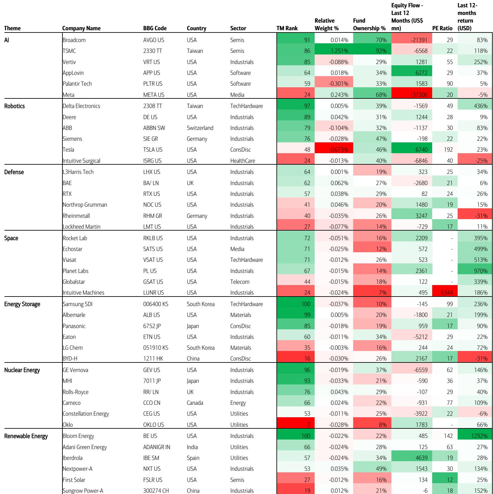
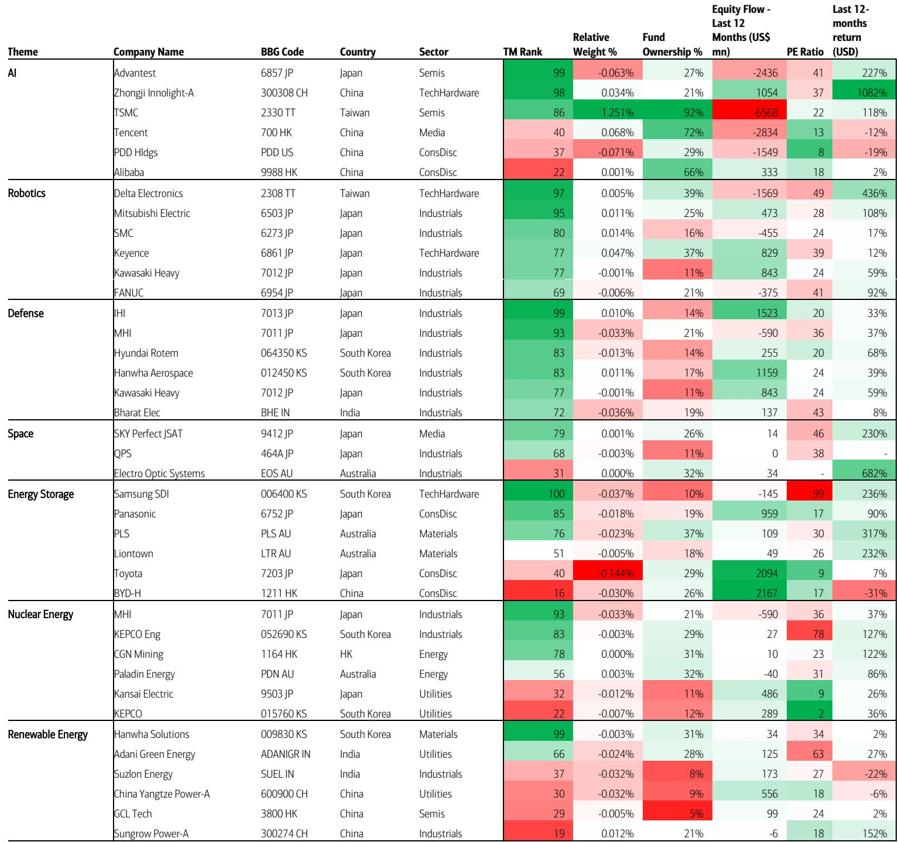
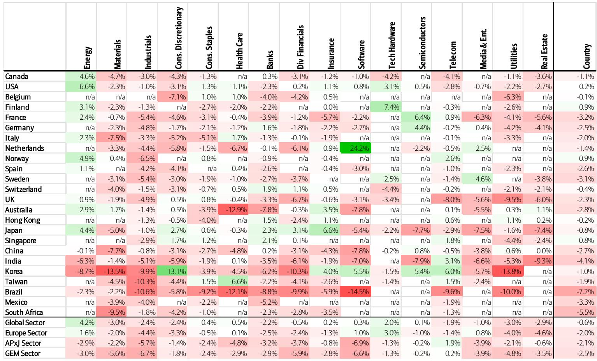

# 市场真正在交易的不是AI，而是通胀预期重新定价

过去一周，全球股市下跌0.6%。表面看是AI主题的获利回吐，但更值得关注的信号是：通胀预期正在取代盈利增长，成为资产定价的主导变量。某外资投行最新高频监控报告显示，能源板块单周上涨4.2%，而公用事业、房地产、材料等利率敏感型板块跌幅均超过2.9%。这不是一个简单的板块轮动，而是市场在重新学习一个被遗忘的法则——当通胀预期抬头时，估值逻辑会从远期现金流折现切换到当期盈利保护。

这份报告的核心判断是：全球盈利周期仍在改善，新闻情绪面也在好转，但一个被低估的风险正在累积——通胀上行可能迫使央行重新加息。市场当前定价中隐含的“软着陆”叙事，可能低估了这一尾部风险。

以下是我们从这份报告中提炼出的五个关键洞察，以及它们对资产配置的含义。

## 1. 通胀恐慌正在取代AI叙事，成为短期市场的核心矛盾

报告明确指出，全球股市上周下跌的直接原因是“通胀担忧”。这不是一个孤立事件。从板块表现看，能源（+4.2%）和科技硬件（+2.0%）是仅有的两个正收益板块，而公用事业（-3.0%）、材料（-3.0%）、房地产（-2.9%）全线下跌。这种分化逻辑清晰：能源受益于通胀预期上升，科技硬件受益于AI资本开支周期，而利率敏感型资产则在重新定价加息风险。

更值得注意的是区域表现。美国市场（+0.2%）是唯一正收益的发达市场，而新兴市场（-2.5%）和亚太除日本（-2.1%）跌幅最大。这暗示通胀恐慌对新兴市场的冲击更大——这些市场的外资流入对全球利率预期高度敏感。如果通胀数据进一步超预期，新兴市场可能面临更大的资金外流压力。

报告还提到，全球盈利周期仍然强劲，新闻情绪面也在改善。但“一个日益增长的风险是，通胀上行可能迫使央行加息”。这句话值得反复咀嚼：市场当前定价的是“加息结束”甚至“降息预期”，但报告提示的恰恰是反向情景。如果这个情景成为现实，当前所有基于流动性宽松的资产定价都需要重估。

## 2. 三重动量模型揭示：黄金和稀土正在取代AI，成为动量最强的主题

报告中最有价值的分析工具是三重动量模型（Triple Momentum），它同时衡量价格动量、盈利动量和新闻动量。根据最新数据，在三动量排名中，黄金和稀土位居前列，而SaaS和奢侈品生活方式垫底。这组数据背后有两个重要含义。

第一，黄金和稀土的高动量并非短期投机行为。黄金的价格动量排名83（百分位），盈利动量排名73，两者均处于高位。这意味着黄金的上涨有基本面支撑——通胀预期上升和实际利率下行预期共同推动了黄金配置需求。稀土的高动量则更多来自供给端约束和地缘政治溢价。

第二，SaaS（价格动量15，盈利动量60）和奢侈品生活方式（价格动量38，盈利动量42）的疲软值得警惕。SaaS的盈利动量并不差（60），但价格动量极低（15），说明市场已经提前定价了估值收缩。这可能是利率预期上升对高估值成长股的压制。奢侈品生活方式的双低则反映出全球消费需求，尤其是中国需求，可能正在放缓。

报告还列出了三动量排名最高的大市值股票，包括Bloom Energy、瑞萨电子、三星SDI、村田制作所、英特尔、AMD等。这些公司分布在能源、半导体和电子元器件领域，与板块层面的动量信号高度一致。

## 3. 市场宽度在恶化，指数表现掩盖了大部分股票的弱势

报告中的市场宽度数据值得单独讨论。ACWI指数上周下跌0.6%，但等权重ACWI下跌了2.2%。这意味着指数层面的跌幅被少数大市值股票掩盖，而大多数中小市值股票的实际跌幅远大于指数表现。这种分化在历史上往往出现在市场转折点附近。

从月度数据看，半导体（+11.7%）和科技硬件（+10.2%）是本月表现最好的板块，而公用事业（-6.3%）和银行（-2.7%）表现最差。这组数据与上周的板块表现形成反差：半导体月度涨幅最大，但上周几乎持平（+0.1%）。这说明半导体板块的上涨动能正在衰减，获利了结压力在增加。

市场宽度恶化和板块动能衰减同时出现，通常意味着市场正在寻找新的方向。如果通胀担忧持续升温，资金可能从拥挤的AI交易中撤出，转向能源和黄金等通胀受益资产。

## 4. 报告尚未完全回答的关键问题：通胀是暂时的还是结构性的？

这是整份报告最值得追问的问题，也是报告本身没有完全展开的部分。报告识别了通胀风险，但没有对通胀的性质做出判断。这是暂时的供给冲击，还是结构性的需求驱动？两种情景对应的资产配置方向截然不同。

如果是供给冲击导致的暂时性通胀，那么央行可能不会过度反应，市场很快会回到AI叙事主导的状态。但如果是需求驱动的结构性通胀——尤其是劳动力成本上升和去全球化带来的供应链成本上升——那么利率中枢可能永久性抬升，高估值成长股的估值逻辑将面临根本性挑战。

报告中的能源板块强势和材料板块弱势同时出现，可能暗示市场对通胀的理解仍不清晰。能源上涨反映的是短期价格预期，而材料下跌可能反映的是对需求放缓的担忧。这种矛盾只有在更长时间的数据验证后才能解决。

## 5. 一个实用的观察框架：关注央行表态与通胀数据的互动

对于读者来说，与其试图预测通胀走势，不如建立一个观察央行反应函数的框架。报告的核心提示是，央行可能被迫加息。这意味着我们需要关注两个关键变量。

第一，核心通胀数据是否连续超预期。如果连续两个月核心CPI环比增速超过0.3%，央行转向的可能性将显著上升。第二，央行官员的表态是否从“数据依赖”转向“前置加息”。如果出现这种转变，市场将重新定价利率路径。

基于报告的数据，当前最值得关注的资产是能源和黄金。能源板块在三动量模型中排名靠前，且有通胀预期作为催化剂。黄金的动量结构健康，且受益于实际利率下行的长期趋势。而SaaS和奢侈品生活方式等板块，在三动量模型中排名垫底，短期可能继续承压。

报告还提示了一个重要的时间窗口：全球盈利周期仍然强劲，这意味着如果通胀风险得到控制，市场仍有上行空间。但关键在于通胀数据能否在未来4-6周内出现改善。如果通胀压力持续，当前市场定价的软着陆叙事将被修正，资产价格将经历一轮重新定价。

---

以上判断均基于这份报告的公开数据和分析框架。但报告中还有很多值得深挖的细节没有展开，比如各国各板块的三动量具体排名、个股层面的动量信号、以及新闻情绪面的量化分解。这些信息对于判断具体标的的买卖时机至关重要。

如果你对上述任何一个方向感兴趣，或者想看到我们对这份报告更完整的解读（包括原始图表和量化信号），欢迎来星球微信群里继续讨论。我们会定期分享类似的高质量研报解读，帮助读者在信息过载中抓住真正重要的信号。

Personal reading notes and learning share only. Not investment advice.

