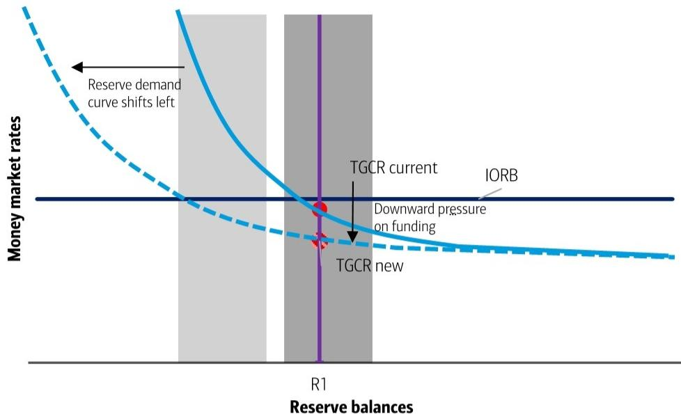
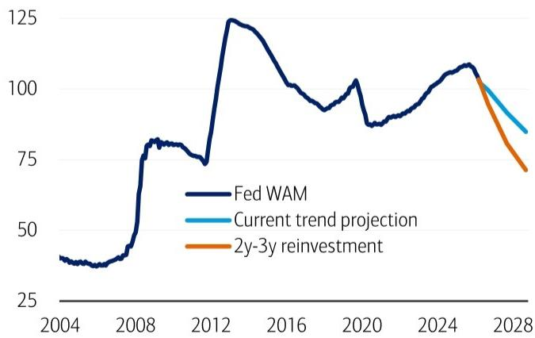

# Key takeaways

- Warsh is Fed B/S critic; he won't change much. Focus on (1) size (2) composition   
- Size = big drop unlikely. Composition = Fed UST WAM shorter but won't matter much   
- Blue sky: bank SRP at IOR + reporting changes = reserve buffer drop. Blue sky may be more impactful vs conventional views

# By Mark Cabana & Katie Craig

Exhibit 1: Fed balance sheet liabilities (\$tn)   
Currency, reserves, and TGA make up the largest shares of the Fed's liabilities   

bar_stacked

| Year | Currency | Reserves | TGA | Foreign RRP | ON RRP | Other |
|---|---|---|---|---|---|---|
| 2008 | 0.7 | 0.1 | 0.0 | 0.0 | 0.0 | 0.0 |
| 2010 | 0.8 | 1.5 | 0.0 | 0.0 | 0.0 | 1.0 |
| 2012 | 0.9 | 2.0 | 0.0 | 0.0 | 0.0 | 1.5 |
| 2014 | 1.0 | 3.0 | 0.5 | 0.5 | 0.5 | 2.5 |
| 2016 | 1.1 | 3.5 | 1.0 | 1.0 | 1.0 | 3.0 |
| 2018 | 1.2 | 3.5 | 1.5 | 1.5 | 1.5 | 3.5 |
| 2020 | 1.3 | 3.5 | 2.0 | 2.0 | 2.0 | 4.0 |
| 2022 | 1.4 | 4.5 | 2.5 | 2.5 | 3.5 | 5.0 |
| 2024 | 1.5 | 4.5 | 2.5 | 2.5 | 3.5 | 4.5 |
| 2026 | 1.6 | 4.5 | 2.5 | 2.5 | 3.5 | 4.5 |

Source: Bloomberg   
BofA GLOBAL RESEARCH

# Warsh & Fed balance sheet: all hat, almost no cattle

Kevin Warsh is now Senate confirmed as the new Fed Chair. A frequent client Q: "what will Warsh do on the Fed balance sheet?" Our A: "not much". We elaborate below.

Clients should focus on 2 aspects of Fed sheet: (1) size (2) composition. Size likely won't change much, composition will. We expect neither to matter much for markets.

Size: after Fed sheet normalized in Q4 '25, total size now determined by liabilities (Exhibit 1). The Fed has 3 big liabilities: (1) currency (2) TGA (3) reserves. Warsh will likely only be able to marginally move needle on reserve demand via liquidity de-reg.

Composition: Warsh will keep letting MBS reinvest in UST bills. He will likely accelerate Fed UST WAM reduction. UST unlikely to offset WAM impact, so market impact = nil.

Most important Q: Warsh reserve regime preference: ample or scarce? Our A: ample.

Blue sky: we propose new Fed regime with bank SRP=IOR. It could move needle.

Bottom line: Warsh impact on Fed B/S will be small & have minimal impact on markets.

Trading ideas and investment strategies discussed herein may give rise to significant risk and are not suitable for all investors. Investors should have experience in relevant markets and the financial resources to absorb any losses arising from applying these ideas or strategies.

BofA does and seeks to do business with issuers covered in its research reports. As a result, investors should be aware that the firm may have a conflict of interest that could affect the objectivity of this report. Investors should consider this report as only a single factor in making their investment decision.

# 18 May 2026

Rates and Currencies Research Global

# Global Rates & Currencies Research MLI (UK)

# Mark Cabana, CFA

Rates Strategist

BofAS

+1 646 743 7013

mark.cabana@bofa.com

# Katie Craig

Rates Strategist

BofAS

+1 646 743 7016

katie.craig@bofa.com

# Oliver Levingston

FX and Rates Strategist

BofA (Hong Kong)

+852 3508 4631

oliver.levingston@bofa.com

See Team Page for List of Analysts

# Liquid Insight

Recent Publications

14-May-26 Global government bond supply update: same same, but different

13-May-26 Fading the USD Vibe-cession

12-May-26 Occam's razor applies in rates

11-May-26 US rates: hike risk underpriced

7-May-26 April jobs: Fed hike pricing in the balance

6-May-26 German 2027 draft budget – regular procedures, irregular budgets 06 May 2026

5-May-26 Dollar on mute

4-May-26 ECB balance sheet update

30-Apr-26 RBA preview: Front-loading as the path of least resistance

29-Apr-26 ECB preview: on hold, but not for long

BofA GLOBAL RESEARCH

# Warsh & Fed B/S: size & composition

Incoming Fed Chair Warsh is a longstanding critic of the Fed balance sheet. We expect he would quickly establish “working groups” to examine ways to shrink Fed sheet. Warsh will try to impact 2 parts of Fed B/S: (1) size (2) composition. Market impact likely small.

# Fed balance sheet size

Central bank balance sheet sizes, once right sized, are determined by their liabilities. The Fed right sized its sheet via QT until money markets reflected tightness in Q4 '25.

To reduce sheet further the Fed needs to shrink one of its key 3 liabilities: (1) currency (2) TGA (3) reserves. We offer thoughts (TL;DR: reserves are the only shot; Exhibit 2).

Exhibit 2: Fed balance sheet composition (\$bn)   
Fed assets = mostly UST assets, Fed liabilities = mostly reserves + currency 

<table><tr><td colspan="4">Assets</td><td colspan="6">Liabilities</td></tr><tr><td>Total</td><td>USTs</td><td>Agy MBS</td><td>Other</td><td>Reserves</td><td>Currency</td><td>UST Cash Balance</td><td>Foreign RRP</td><td>ON RRP</td><td>Other</td></tr><tr><td>6779.9</td><td>4450.2</td><td>1981.1</td><td>348.6</td><td>3117.4</td><td>2458.0</td><td>807.4</td><td>322.6</td><td>3.7</td><td>70.7</td></tr><tr><td>%</td><td>66%</td><td>29%</td><td>5%</td><td>46%</td><td>36%</td><td>12%</td><td>5%</td><td>0%</td><td>1%</td></tr></table>

Source: Bloomberg   
BofA GLOBAL RESEARCH

Currency: central banks believe currency is an “exogenous” liability. Exogenous liabilities are beyond the central banks control. To reduce currency the Fed could tax or eliminate currency / large denomination bills (ECB cut EUR500 notes). It won’t happen in the US.

TGA: UST cash balance could be reduced. UST has signaled minimal interest or desire to reduce TGA (TGA expected to rise: end Q2 \$900b, end Q3 \$950b). UST could consider marginal adjustments, such as excess cash investment in repo or TT&L (see: TGA repo investment & TT&L). TGA repo may happen but impact small. TT&L very unlikely.

Reserves: lower reserves are Warsh best shot to reduce sheet. There are 2 conventional ways for Warsh to reduce reserves (1) bank unfriendly (2) bank friendly.

Bank unfriendly: Warsh can tell banks that reserves are capped or tiered (tier = some reserves not fully paid IOR). Reserve caps or tiers would make banks sub-optimally liquid. Sub-optimally liquid banks likely less willing to take risk (i.e. less market making, less loan growth willingness). Less bank risk = slower economy. Warsh unlikely to do it.

Bank friendly: Warsh likely to pursue bank friendly ways to reduce reserve demand via de-reg. This will include allowing banks to pre-pledge collateral to Fed discount window for instant monetization. Pre-pledging collateral will expand bank HQLA. More HQLA = fewer reserves needed. We estimate reserve drop of \$200-500b (\~10% total) & slow.

Bank friendly approach will shift the “reserve demand curve”. Lower reserve demand will first put downward pressure on funding (Exhibit 3). Fed can later grow sheet slower / reduce sheet to normalize funding (Exhibit 4). Importantly, bank de-reg reserve demand drop will not tighten fin conditions (FCI). If no FCI tightening, no need for rate cuts.

Other: foreign repo pool adjustment is possible but small peas. Warsh could lower or cap foreign RRP rate to push cash out of Fed into repo or bills. We have long argued this would diminish USD reserve currency status & hurt national interest (see: RRP & national interest). Warsh may see smaller sheet > national interest. We advise otherwise.

Warsh will also likely have a high bar to intervene in disorderly markets. His initial intuition is likely to remain out of markets but could be forced to act depending on extent of market dysfunction (he did support Fed emergency actions post GFC). Warsh market invention bar will be high but not insurmountable depending on shock extent.

Size summary: Warsh likely to find Fed B/S reduction hard via conventional means. Best shot is via bank liquidity de-reg, impact modest & slow. Liquidity de-reg & initial funding ease will not justify Fed rate cuts. Blue sky may be more impactful or Fed B/S reduction.

Exhibit 3: Stylized Fed reserve demand and supply curves if reserve demand curve shifts left. If reserve demand curve shifts left due to de-reg, it will place downward pressure on funding rates   

line

| Reserve balances | Money market rates |
| ---------------- | ------------------ |
| R1               | TGCR current      |
| R1               | TGCR new           |
| R1               | Downward pressure on funding |
| R1               | IORB               |

Source: BofA Global Research. Note: Dark gray shaded area signifies "ample" reserves in current reserve demand environment, light gray in new reserve demand environment.   
BofA GLOBAL RESEARCH   
If funding rates decline, the Fed can reduce the supply of reserves and bring money market rates back up to IORB but maintain "ample" reserves

Exhibit 4: Stylized Fed reserve demand and supply curves if reserve demand curve shifts left and Fed reduces supply of reserves

line

| Reserve balances | Money market rates |
| ---------------- | ------------------ |
| R2               | TGCR new           |
| R1               | TGCR current       |
| IORB             | Fed reduces supply of reserves (upper) |

Source: BofA Global Research. Note: Dark gray shaded area signifies "ample" reserves in current reserve demand environment, light gray in new reserve demand environment.   
BofA GLOBAL RESEARCH

# Fed balance sheet composition

Warsh will also likely further adjust the composition of Fed assets in two ways (1) return to mostly Treasury portfolio (2) shorten WAM of Fed's UST holdings. Both are happening now. Warsh likely to speed WAM shortening, but it won't impact markets b/c mechanics.

Mostly UST portfolio: Fed is slowly reducing their \$2tn in MBS at a pace of \$10-\$20b/m by allowing maturing and prepaid MBS to roll-off & reinvest in T-bills. Fed unlikely to sell MBS (unless they were bought directly by Fannie or Freddie, which we see as low likelihood). Fed MBS roll-off practice to remain & is well priced by markets.

WAM: Fed is shortening WAM by purchasing T-bills via RMPs and MBS reinvestment (Exhibit 5). Warsh can speed Fed UST WAM reduction by shifting maturing coupon reinvestments into shorter-dated tenors (we assume 2-3y coupons in Exhibit 5). Warsh WAM shortening highly unlikely to see Fed asset sales. Market impact = small.

Market impact will be small due to WAM shortening mechanics. Recall, Fed UST coupon maturities are currently reinvested at auction into new-issue USTs. Fed reinvestment is proportional to UST auction amounts, thereby investing in-line with UST market. The Fed matches maturing USTs with USTs that settle on same day (i.e. mid-month maturities invested in 3/10/30Y USTs, end-month maturities invested in 2/5/7Y USTs).

Warsh will likely change this process by reinvesting in the shortest tenor new issue UST coupons. For example, in a mid-month settlement Fed will no longer rollover into 3/10/30Y issues but instead reinvest in all 3Y notes (example in Exhibit 6). Importantly, Fed reinvestments are an “add on” at auction. “Add on” means that the total size & composition of UST debt outstanding is increased by size of the Fed reinvestment.

The Fed's "add on" into 2 or 3Y notes will shorten WAM of total UST market. The key Q then becomes: will the US Treasury offset the mechanical UST WAM shortening from Fed reinvestments? Our A: no. If we are right, Fed WAM shortening has zero impact on UST market or fin conditions. No FCI impact = no reason for Warsh to cut rates.

Composition summary: Fed B/S composition changes are unlikely to matter for markets. The MBS maturity & reinvest practice already in place & priced. Fed shortening of their UST WAM will not have a market impact unless Bessent surprisingly offsets.

Exhibit 5: Fed WAM and WAM projection scenarios (months)   
Fed WAM has already started to decline due to RMPs and MBS reinvestments into T-bills but shifting coupon reinvestments into short-dated tenors would speed up this decline   

line

| Year | Fed WAM | Current trend projection | 2y-3y reinvestment |
|------|---------|--------------------------|-------------------|
| 2004 | ~35     | -                        | -                 |
| 2008 | ~80     | -                        | -                 |
| 2012 | ~75     | -                        | -                 |
| 2016 | ~100    | -                        | -                 |
| 2020 | ~90     | -                        | -                 |
| 2024 | ~105    | ~100                     | ~100              |
| 2028 | -       | ~85                      | ~75               |

Source: BofA Global Research, FRBNY   
BofA GLOBAL RESEARCH

Exhibit 6: Stylized example of Fed reinvestment practice (\$bn)   
Fed current invests pro rata across curve, we expect this will be shortened 

<table><tr><td colspan="3">Current Practice</td><td colspan="3">Future Possible Practice</td></tr><tr><td colspan="3">UST Auction Size</td><td colspan="3">UST Auction Size</td></tr><tr><td>3Y</td><td>10Y</td><td>30Y</td><td>3Y</td><td>10Y</td><td>30Y</td></tr><tr><td>50</td><td>25</td><td>25</td><td>50</td><td>25</td><td>25</td></tr><tr><td colspan="3">Fed Maturing</td><td colspan="3">Fed Maturing</td></tr><tr><td></td><td>10</td><td></td><td></td><td>10</td><td></td></tr><tr><td colspan="3">Fed UST Auction Add On</td><td colspan="3">Fed UST Auction Add On</td></tr><tr><td>3Y</td><td>10Y</td><td>30Y</td><td>3Y</td><td>10Y</td><td>30Y</td></tr><tr><td>5</td><td>2.5</td><td>2.5</td><td>10</td><td>0</td><td>0</td></tr><tr><td colspan="3">UST Size Outstanding</td><td colspan="3">UST Size Outstanding</td></tr><tr><td>3Y</td><td>10Y</td><td>30Y</td><td>3Y</td><td>10Y</td><td>30Y</td></tr><tr><td>55</td><td>27.5</td><td>27.5</td><td>60</td><td>25</td><td>25</td></tr></table>

Source: BofA Global Research   
BofA GLOBAL RESEARCH

# Warsh big Q: ample or scarce? Our A: ample, all the way

Most important Warsh B/S Q (to us): does Warsh support ample or scarce reserves? Our A: ample. Recall, Fed definitions of ample & scarce, for a given move in reserves: ample = limited money market movement; scarce = large money market movement.

We strongly believe Warsh would support ample; if not, he would likely be forced to support it. Ample benefit = easy to implement, ensures banking system flush with cash, limits money market volatility, & supports modestly easier financial conditions. Ample cost = slightly larger balance sheet. Scarce benefits & costs are opposite of ample.

We expect Warsh will support ample because it underpins easy financial conditions. We believe Trump cares much more about easy financial conditions than size of Fed B/S. Warsh expected to have open ear for Trump policy preferences.

Warsh will likely be forced to accept ample by rest of Fed. The Fed formally adopted an ample reserve regime in 2019 and all members of Fed leadership support. Some are quite vocal & colorful in support. Specifically, Fed Governor Waller reportedly said in a NABE Feb '26 speech: "You don't want banks searching under sofa cushions for money every night... That is incredibly inefficient and stupid." Quote last word stands out to us.

Ample vs scarce summary: Warsh very likely to support ample.

# Blue sky: set bank SRP = IOR to reduce reserve buffer

Warsh will likely be looking for other ideas to reduce the balance sheet. We offer a novel approach, which Dallas Fed President Logan has previously referenced: bank SRP = IOR.

Our idea: bank SRP = IOR. Banks could borrow cash from the Fed using UST or agency collateral at a level equal to their deposit rate. We see bank SRP open throughout the day, like discount window (no discrete operation times). It would allow banks to monetize UST or agency paper at a market rate & hold less reserve buffer. Banks likely willing to use SRP at IOR b/c more cost efficient v today & less stigma b/c at market. The Bank of England currently operates policy in this way (see: Global plumbing primer).

To be most effective the Fed could further reduce stigma by changing reporting. Specifically, the Fed could remove the weekly reporting practice that shows regional Fed district reserve distribution. When Fed liquidity tools are tapped the street uses the weekly regional Fed reserve distribution data to narrow in on firms that may be in trouble. Removing this reporting requirement would make bank SRP=IOR more effective.

Bank reserve buffer can be reduced via (1) bank SRP=IOR (2) stigma reduction. Reserve buffer is dropped b/c banks have more attractive terms to monetize USTs or agency paper. Monetizing via always open SRP also improves intraday liquidity options. Reduced reserve demand can then allow Warsh to shrink Fed sheet.

Note: we see an important distinction between bank SRP & dealer SRP. Our comments above are focused on bank SRP, i.e. commercial bank SRP access. We expect dealer SRP to be treated differently. We would expect dealer SRP at 5-10bp above bank SRP & IOR. Dealer SRP > bank SRP b/c (1) banks tend not to lend in repo unless 5-10bp > IOR (2) dealer SRP > IOR would allow more room for free repo market trading.

Blue sky summary: bank reserve demand can be reduced by (1) bank SRP=IOR (2) Fed reporting change to reduce stigma. It's not widely discussed now, we think it will be.

Bottom line: Warsh B/S bark worse than bite. Warsh unlikely to meaningfully reduce Fed B/S size; he will adjust Fed B/S composition but it shouldn't impact markets. Warsh will likely support ample. Blue sky ideas are possible: bank SPR=IOR could be effective.

# Acronym list:

TGA: Treasury general account

SRP: standing repo

IOR: interest on reserves

TL;DR: too long, don't read

HQLA: high quality liquid assets

RRP: reverse repo

# Notable Rates and FX Research

- Global Macro Year Ahead 2026 – Attitude determines altitude, 23 November 2025   
• Global Rates Year Ahead 2026 – When carry met rally, 25 November 2025   
• G10 FX Year Ahead 2026 – the (USD) long and short of it, 25 November 2025   
• 2025 reflections Liquid Cross Border Flows, 8 December 2025

# Rates, FX & EM trades for 2026

For a complete list of our open trade recommendations as well as our trade recommendations closed over the past 12 months, see the reports below:

Global FX weekly: Breaking bonds 15 May 2026

Global Rates Weekly: NACHO rates 15 May 2026

# Disclosures

# Important Disclosures

BofA Global Research personnel (including the analyst(s) responsible for this report) receive compensation based upon, among other factors, the overall profitability of BofA Corporation, including profits derived from investment banking. The analyst(s) responsible for this report may also receive compensation based upon, among other factors, the overall profitability of the Bank's sales and trading businesses relating to the class of securities or financial instruments for which such analyst is responsible. BofA fixed income analysts regularly interact with sales and trading desk personnel in connection with their research, including to ascertain pricing and liquidity in the fixed income markets.

# Other Important Disclosures

Prices are indicative and for information purposes only. Except as otherwise stated in the report, for any recommendation in relation to an equity security, the price referenced is the publicly traded price of the security as of close of business on the day prior to the date of the report or, if the report is published during intraday trading, the price referenced is indicative of the traded price as of the date and time of the report and in relation to a debt security (including equity preferred and CDS), prices are indicative as of the date and time of the report and are from various sources including BofA trading desks.

The date and time of completion of the production of any recommendation in this report shall be the date and time of dissemination of this report as recorded in the report timestamp.

This report may refer to fixed income securities or other financial instruments that may not be offered or sold in one or more states or jurisdictions, or to certain categories of investors, including retail investors. Readers of this report are advised that any discussion, recommendation or other mention of such instruments is not a solicitation or offer to transact in such instruments. Investors should contact their BofA representative or Merrill Global Wealth Management financial advisor for information relating to such instruments. Rule 144A securities may be offered or sold only to persons in the U.S. who are Qualified Institutional Buyers within the meaning of Rule 144A under the Securities Act of 1933, as amended. SECURITIES OR OTHER FINANCIAL INSTRUMENTS DISCUSSED HEREIN MAY BE RATED BELOW INVESTMENT GRADE AND SHOULD THEREFORE ONLY BE CONSIDERED FOR INCLUSION IN ACCOUNTS QUALIFIED FOR SPECULATIVE INVESTMENT.

Recipients who are not institutional investors or market professionals should seek the advice of their independent financial advisor before considering information in this report in connection with any investment decision, or for a necessary explanation of its contents.

The securities or other financial instruments discussed in this report may be traded over-the-counter. Retail sales and/or distribution of this report may be made only in states where these instruments are exempt from registration or have been qualified for sale.

Officers of BofAS or one or more of its affiliates (other than research analysts) may have a financial interest in securities of the issuer(s) or in related investments.

This report, and the securities or other financial instruments discussed herein, may not be eligible for distribution or sale in all countries or to certain categories of investors, including retail investors.

Refer to BofA Global Research policies relating to conflicts of interest.

"BofA" includes BofA, Inc. ("BofAS") and its affiliates. Investors should contact their BofA representative or Merrill Global Wealth Management financial advisor if they have questions concerning this report or concerning the appropriateness of any investment idea described herein for such investor. "BofA" is a global brand for BofA Global Research.

# Information relating to Non-US affiliates of BofA and Distribution of Affiliate Research Reports:

BofAS and/or BofA, Pierce, Fenner & Smith Incorporated ("MLPF&S") may in the future distribute, information of the following non-US affiliates in the US (short name: legal name, regulator): BofA (South Africa): BofA South Africa (Pty) Ltd., regulated by the Financial Sector Conduct Authority; MLI (UK): BofA International, regulated by the Financial Conduct Authority (FCA) and the Prudential Regulation Authority (PRA); BofASE (France): BofA Europe SA is authorized by the Autorité de Contrôle Prudentiel et de Résolution (ACPR) and regulated by the ACPR and the Autorité des Marchés Financiers (AMF). BofA Europe SA ("BofASE") with registered address at 51, rue La Boétie, 75008 Paris is registered under no 842 602 690 RCS Paris. In accordance with the provisions of French Code Monétaire et Financier (Monetary and Financial Code), BofASE is an établissement de crédit et d'investissement (credit and investment institution) that is authorised and supervised by the European Central Bank and the Autorité de Contrôle Prudentiel et de Résolution (ACPR) and regulated by the ACPR and the Autorité des Marchés Financiers. BofASE's share capital can be found at www.bofaml.com/BofASEdisclaimer; BofA Europe (Milan): BofA Europe Designated Activity Company, Milan Branch, regulated by the Bank of Italy, the European Central Bank (ECB) and the Central Bank of Ireland (CBI); BofA Europe (Frankfurt): BofA Europe Designated Activity Company, Frankfurt Branch regulated by BaFin, the ECB and the CBI; BofA Europe (Zurich): BofA Europe Designated Activity Company, Zurich Branch, regulated by the Swiss Financial Market Supervisory Authority FINMA, the ECB and CBI; BofA Europe (Madrid): BofA Europe Designated Activity Company, Sucursal en España, regulated by the Bank of Spain, the ECB and the CBI; BofA (Australia): BofA Equities (Australia) Limited, regulated by the Australian Securities and Investments Commission; BofA (Hong Kong): BofA (Asia Pacific) Limited, regulated by the Hong Kong Securities and Futures Commission (HKSFC); BofA (Singapore): BofA (Singapore) Pte Ltd, regulated by the Monetary Authority of Singapore (MAS); BofA (Canada): BofA Canada Inc, regulated by the Canadian Investment Regulatory Organization; BofA (Mexico): BofA Mexico, SA de CV, Casa de Bolsa, regulated by the Comisión Nacional Bancaria y de Valores; BofAS Japan: BofA Japan Co., Ltd., regulated by the Financial Services Agency; BofA (Seoul): BofA International, LLC Seoul Branch, regulated by the Financial Supervisory Service; BofA (Taiwan): BofA (Taiwan) Ltd., regulated by the Securities and Futures Bureau; BofAS India: BofA India Limited, regulated by the Securities and Exchange Board of India (SEBI); BofA (Israel): BofA Israel Limited, regulated by Israel Securities Authority; BofA (DIFC): BofA International (DIFC Branch), regulated by the Dubai Financial Services Authority (DFSA); BofA (Brazil): BofA S.A. Corretora de Títulos e Valores Mobiliários, regulated by Comissão de Valores Mobiliários; BofA KSA Company: BofA Kingdom of Saudi Arabia Company, regulated by the Capital Market Authority. This information: has been approved for publication and is distributed in the United Kingdom (UK) to professional clients and eligible counterparties (as each is defined in the rules of the FCA and the PRA) by MLI (UK), which is authorized by the PRA and regulated by the FCA and the PRA - details about the extent of our regulation by the FCA and PRA are available from us on request; has been approved for publication and is distributed in the European Economic Area (EEA) by BofASE (France), which is authorized by the ACPR and regulated by the ACPR and the AMF; has been considered and distributed in Japan by BofAS Japan, a registered securities dealer under the Financial Instruments and Exchange Act in Japan, or its permitted affiliates; is issued and distributed in Hong Kong by BofA (Hong Kong) which is regulated by HKSFC; is issued and distributed in Taiwan by BofA (Taiwan); is issued and distributed in India by BofAS India; and is issued and distributed in Singapore to institutional investors and/or accredited investors (each as defined under the Financial Advisers Regulations) by BofA (Singapore) (Company Registration No 198602883D). BofA (Singapore) is regulated by MAS. BofA Equities (Australia) Limited (ABN 65 006 276 795), AFS License 235132 (MLEA) distributes this information in Australia only to 'Wholesale' clients as defined by s.761G of the Corporations Act 2001. With the exception of BofA N.A., Australia Branch, neither MLEA nor any of its affiliates involved in preparing this information is an Authorised Deposit-Taking Institution under the Banking Act 1959 nor regulated by the Australian Prudential Regulation Authority. No approval is required for publication or distribution of this information in Brazil and its local distribution is by BofA (Brazil) in accordance with applicable regulations. BofA (DIFC) is authorized and regulated by the DFSA. Information prepared and issued by BofA (DIFC) is done so in accordance with the requirements of the DFSA conduct of business rules. BofA Europe (Frankfurt) distributes this information in Germany and is regulated by BaFin, the ECB and the CBI. BofA entities, including BofA Europe and BofASE (France), may outsource/delegate the marketing and/or provision of certain research services or aspects of research services to other branches or members of the BofA group. You may be contacted by a different BofA entity acting for and on behalf of your service provider where permitted by applicable law. This does not change your service provider. Please refer to the Electronic Communications Disclaimers for further information.

This information has been prepared and issued by BofAS and/or one or more of its non-US affiliates. The author(s) of this information may not be licensed to carry on regulated activities in your jurisdiction and, if not licensed, do not hold themselves out as being able to do so. BofAS and/or MLPF&S is the distributor of this information in the US and accepts full responsibility for information distributed to BofAS and/or MLPF&S clients in the US by its non-US affiliates. Any US person receiving this information and wishing to effect any transaction in any security

discussed herein should do so through BofAS and/or MLPF&S and not such foreign affiliates. Hong Kong recipients of this information should contact BofA (Asia Pacific) Limited in respect of any matters relating to dealing in securities or provision of specific advice on securities or any other matters arising from, or in connection with, this information. Singapore recipients of this information should contact BofA (Singapore) Pte Ltd in respect of any matters arising from, or in connection with, this information. For clients that are not accredited investors, expert investors or institutional investors BofA (Singapore) Pte Ltd accepts full responsibility for the contents of this information distributed to such clients in Singapore.

# General Investment Related Disclosures:

Taiwan Readers: Neither the information nor any opinion expressed herein constitutes an offer or a solicitation of an offer to transact in any securities or other financial instrument. No part of this report may be used or reproduced or quoted in any manner whatsoever in Taiwan by the press or any other person without the express written consent of BofA.

This document provides general information only, and has been prepared for, and is intended for general distribution to, BofA clients. Neither the information nor any opinion expressed constitutes an offer or an invitation to make an offer, to buy or sell any securities or other financial instrument or any derivative related to such securities or instruments (e.g., options, futures, warrants, and contracts for differences). This document is not intended to provide personal investment advice and it does not take into account the specific investment objectives, financial situation and the particular needs of, and is not directed to, any specific person(s). This document and its content do not constitute, and should not be considered to constitute, investment advice for purposes of ERISA, the US tax code, the Investment Advisers Act or otherwise. Investors should seek financial advice regarding the appropriateness of investing in financial instruments and implementing investment strategies discussed or recommended in this document and should understand that statements regarding future prospects may not be realized. Any decision to purchase or subscribe for securities in any offering must be based solely on existing public information on such security or the information in the prospectus or other offering document issued in connection with such offering, and not on this document.

Securities and other financial instruments referred to herein, or recommended, offered or sold by BofA, are not insured by the Federal Deposit Insurance Corporation and are not deposits or other obligations of any insured depository institution (including, BofA, N.A.). Investments in general and, derivatives, in particular, involve numerous risks, including, among others, market risk, counterparty default risk and liquidity risk. No security, financial instrument or derivative is suitable for all investors. Digital assets are extremely speculative, volatile and are largely unregulated. In some cases, securities and other financial instruments may be difficult to value or sell and reliable information about the value or risks related to the security or financial instrument may be difficult to obtain. Investors should note that income from such securities and other financial instruments, if any, may fluctuate and that price or value of such securities and instruments may rise or fall and, in some cases, investors may lose their entire principal investment. Past performance is not necessarily a guide to future performance. Levels and basis for taxation may change.

Futures and options are not appropriate for all investors. Such financial instruments may expire worthless. Before investing in futures or options, clients must receive the appropriate risk disclosure documents. Investment strategies explained in this report may not be appropriate at all times. Costs of such strategies do not include commission or margin expenses.

BofA is aware that the implementation of the ideas expressed in this report may depend upon an investor's ability to "short" securities or other financial instruments and that such action may be limited by regulations prohibiting or restricting "shortselling" in many jurisdictions. Investors are urged to seek advice regarding the applicability of such regulations prior to executing any short idea contained in this report.

This report may contain a trading idea or recommendation which highlights a specific identified near-term catalyst or event impacting a security, issuer, industry sector or the market generally that presents a transaction opportunity, but does not have any impact on the analyst's particular "Overweight" or "Underweight" rating (which is based on a three month trade horizon). Trading ideas and recommendations may differ directionally from the analyst's rating on a security or issuer because they reflect the impact of a near-term catalyst or event.

Foreign currency rates of exchange may adversely affect the value, price or income of any security or financial instrument mentioned in this report. Investors in such securities and instruments effectively assume currency risk.

BofAS or one of its affiliates is a regular issuer of traded financial instruments linked to securities that may have been recommended in this report. BofAS or one of its affiliates may, at any time, hold a trading position (long or short) in the securities and financial instruments discussed in this report.

BofA, through business units other than BofA Global Research, may have issued and may in the future issue trading ideas or recommendations that are inconsistent with, and reach different conclusions from, the information presented herein. Such ideas or recommendations may reflect different time frames, assumptions, views and analytical methods of the persons who prepared them, and BofA is under no obligation to ensure that such other trading ideas or recommendations are brought to the attention of any recipient of this information. In the event that the recipient received this information pursuant to a contract between the recipient and BofAS for the provision of research services for a separate fee, and in connection therewith BofAS may be deemed to be acting as an investment adviser, such status relates, if at all, solely to the person with whom BofAS has contracted directly and does not extend beyond the delivery of this report (unless otherwise agreed specifically in writing by BofAS). If such recipient uses the services of BofAS in connection with the sale or purchase of a security referred to herein, BofAS may act as principal for its own account or as agent for another person. BofAS is and continues to act solely as a broker-dealer in connection with the execution of any transactions, including transactions in any securities referred to herein.

# Copyright and General Information:

Copyright 2026 BofA Corporation. All rights reserved. iQdatabase® is a registered service mark of BofA Corporation. This information is prepared for the use of BofA clients and may not be redistributed, retransmitted or disclosed, in whole or in part, or in any form or manner, without the express written consent of BofA. This document and its content is provided solely for informational purposes and cannot be used for training or developing artificial intelligence (AI) models or as an input in any AI application (collectively, an AI tool). Any attempt to utilize this document or any of its content in connection with an AI tool without explicit written permission from BofA Global Research is strictly prohibited. BofA Global Research utilizes AI, including machine learning and other technologies, to enhance the services we provide to our clients. These technologies assist our analysts in various aspects of their work, including but not limited to data analysis, content extraction, content creation, data aggregation and summarization and identifying relevant information from diverse sources. All AI-driven processes are subject to review by BofA Global Research employees. BofA Global Research information is distributed simultaneously to internal and client websites and other portals by BofA and is not publicly-available material. Any unauthorized use or disclosure is prohibited. Receipt and review of this information constitutes your agreement not to redistribute, retransmit, or disclose to others the contents, opinions, conclusion, or information contained herein (including any investment recommendations, estimates or price targets) without first obtaining express permission from an authorized officer of BofA.

Materials prepared by BofA Global Research personnel are based on public information. Facts and views presented in this material have not been reviewed by, and may not reflect information known to, professionals in other business areas of BofA, including investment banking personnel. BofA has established information barriers between BofA Global Research and certain business groups. As a result, BofA does not disclose certain client relationships with, or compensation received from, such issuers. To the extent this material discusses any legal proceeding or issues, it has not been prepared as nor is it intended to express any legal conclusion, opinion or advice. Investors should consult their own legal advisers as to issues of law relating to the subject matter of this material. BofA Global Research personnel's knowledge of legal proceedings in which any BofA entity and/or its directors, officers and employees may be plaintiffs, defendants, co-defendants or co-plaintiffs with or involving issuers mentioned in this material is based on public information. Facts and views presented in this material that relate to any such proceedings have not been reviewed by, discussed with, and may not reflect information known to, professionals in other business areas of BofA in connection with the legal proceedings or matters relevant to such proceedings.

This information has been prepared independently of any issuer of securities mentioned herein and not in connection with any proposed offering of securities or as agent of any issuer of any securities. None of BofAS any of its affiliates or their research analysts has any authority whatsoever to make any representation or warranty on behalf of the issuer(s). BofA Global Research policy prohibits research personnel from disclosing a recommendation, investment rating, or investment thesis for review by an issuer prior to the publication of a research report containing such rating, recommendation or investment thesis.

Any information relating to sustainability in this material is limited as discussed herein and is not intended to provide a comprehensive view on any sustainability claim with respect to any issuer or security.

Any information relating to the tax status of financial instruments discussed herein is not intended to provide tax advice or to be used by anyone to provide tax advice. Investors are urged to seek tax advice based on their particular circumstances from an independent tax professional.

The information herein (other than disclosure information relating to BofA and its affiliates) was obtained from various sources and we do not guarantee its accuracy. This information may contain links to third-party websites. BofA is not responsible for the content of any third-party website or any linked content contained in a third-party website. Content contained on such third-party websites is not part of this information and is not incorporated by reference. The inclusion of a link does not imply any endorsement by or any affiliation with BofA. Access to any third-party website is at your own risk, and you should always review the terms and privacy policies at third-party websites before submitting any personal information to them. BofA is not responsible for such terms and privacy policies and expressly disclaims any liability for them.

All opinions, projections and estimates constitute the judgment of the author as of the date of publication and are subject to change without notice. Prices also are subject to change without notice. BofA is under no obligation to update this information and BofA ability to publish information on the subject issuer(s) in the future is subject to applicable quiet periods. You should therefore assume that BofA will not update any fact, circumstance or opinion contained herein.

Certain outstanding reports or investment opinions relating to securities, financial instruments and/or issuers may no longer be current. Always refer to the most recent research report relating to an issuer prior to making an investment decision.

In some cases, an issuer may be classified as Restricted or may be Under Review or Extended Review. In each case, investors should consider any investment opinion relating to such issuer (or its security and/or financial instruments) to be suspended or withdrawn and should not rely on the analyses and investment opinion(s) pertaining to such issuer (or its securities and/or financial instruments) nor should the analyses or opinion(s) be considered a solicitation of any kind. Sales persons and financial advisors affiliated with BofAS or any of its affiliates may not solicit purchases of securities or financial instruments that are Restricted or Under Review and may only solicit securities under Extended Review in accordance with firm policies.

Neither BofA nor any officer or employee of BofA accepts any liability whatsoever for any direct, indirect or consequential damages or losses arising from any use of this information.

# Research Analysts

# US

# Ralph Axel

Rates Strategist

BofAS

+1 646 743 7011

ralph.axel@bofa.com

# Paul Ciana, CMT

Technical Strategist

BofAS

+1 646 743 7014

paul.ciana@bofa.com

# John Shin

FX Strategist

BofAS

+1 646 855 2582

joong.s.shin@bofa.com

# Mark Cabana, CFA

Rates Strategist

BofAS

+1 646 743 7013

mark.cabana@bofa.com

# Bruno Braizinha, CFA

Rates Strategist

BofAS

+1 646 743 7012

bruno.braizinha@bofa.com

# Meghan Swiber, CFA

Rates Strategist

BofAS

+1 646 743 7020

meghan.swiber@bofa.com

# Europe

# Ralf Preusser, CFA

Rates Strategist

MLI (UK)

+44 20 7995 7331

ralf.preusser@bofa.com

# Ruben Segura-Cayuela

Europe Economist

BofA Europe (Madrid)

+34 91 514 3053

ruben.segura-cayuela@bofa.com

# Mark Capleton

Rates Strategist

MLI (UK)

+44 20 7995 6118

mark.capleton@bofa.com

# Sphia Salim

Rates Strategist

MLI (UK)

+44 20 7996 2227

sphia.salim@bofa.com

# Kamal Sharma

FX Strategist

MLI (UK)

+44 20 7996 4855

ksharma32@bofa.com

# Ronald Man

Rates Strategist

MLI (UK)

+44 20 7995 1143

ronald.man@bofa.com

# Michalis Rousakis

FX Strategist

MLI (UK)

+44 20 7995 0336

michalis.rousakis@bofa.com

# Pac Rim

# Adarsh Sinha

FX and Rates Strategist

MLI (UK)

+44 20 7995 9745

adarsh.sinha@bofa.com

# Janice Xue

Emerging Asia FI/FX Strategist

BofA (Hong Kong)

+852 3508 8587

janice.xue@bofa.com

# Shusuke Yamada, CFA

FX/Rates Strategist

BofAS Japan

+81 3 6225 8515

shusuke.yamada@bofa.com

Trading ideas and investment strategies discussed herein may give rise to significant risk and are not suitable for all investors. Investors should have experience in relevant markets and the financial resources to absorb any losses arising from applying these ideas or strategies.