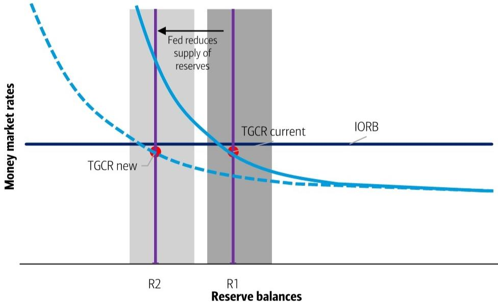
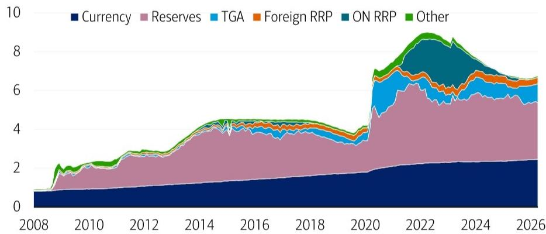

# Kevin Warsh Will Not Shrink the Fed Balance Sheet — And Markets Should Stop Expecting Him To

The most consequential question for U.S. monetary policy in 2026 is not about the federal funds rate. It is about whether the new Federal Reserve Chair, Kevin Warsh, will meaningfully reduce the size of the central bank's balance sheet. The answer, based on a rigorous examination of the mechanics, is a definitive no. Warsh's bark on the balance sheet will be far worse than his bite, and the market implications of his tenure will be far smaller than the political theater surrounding his appointment suggests.

This conclusion is not a matter of opinion about Warsh's personal views. It is a structural reality dictated by the Fed's liability structure, the constraints of the Treasury General Account, and the political economy of reserve scarcity. Investors who are positioning for a dramatic "QT 2.0" or a sharp tightening of financial conditions via balance sheet reduction are likely to be disappointed. The real action will be far more technical, far slower, and far less impactful on risk assets than conventional wisdom assumes.

The report parsed below, authored by a leading global rates strategy team, provides the analytical scaffolding for this view. It dissects the two dimensions of the Fed balance sheet — size and composition — and finds that Warsh has very few levers to pull. The most powerful lever, bank liquidity deregulation, will be modest in effect. The most innovative lever, setting the standing repo facility rate equal to interest on reserves, is a blue-sky idea that could eventually matter but is not on the near-term agenda. The bottom line: the Fed balance sheet is largely on autopilot, and Warsh will not change that.

## The Fed's Balance Sheet Size Is Determined by Liabilities, and Warsh Cannot Shrink the Three Big Ones

To understand why Warsh will struggle to reduce the balance sheet, one must start with a basic accounting identity. The Fed's balance sheet size, once normalized after quantitative tightening, is determined by its liabilities, not its assets. The Fed has three large, structurally determined liabilities: currency in circulation, the Treasury General Account, and bank reserves. Warsh can only shrink the balance sheet by shrinking one of these three.

Currency is an exogenous liability. Central banks around the world treat currency demand as outside their control. To reduce it, the Fed would need to tax cash, eliminate large denomination bills, or otherwise discourage its use. The ECB did this with the 500 euro note, but the political and practical hurdles in the United States are insurmountable. No incoming Chair, regardless of their views, will pick that fight.

The TGA is controlled by the Treasury, not the Fed. The Treasury has signaled that it expects the TGA to rise to $900 billion by the end of Q2 and $950 billion by the end of Q3. There is no indication of a desire to run it down. Marginal adjustments, such as investing excess cash in repo or expanding the Treasury Tax and Loan program, are possible but would have a trivial impact on the overall balance sheet. Warsh cannot force Treasury Secretary Bessent to reduce the TGA.

That leaves reserves. Reserves are the only liability Warsh can realistically target. But even here, the conventional tools are either politically toxic or economically dangerous. A "bank unfriendly" approach — capping reserves or tiering them so that some are not fully remunerated at IOR — would make banks sub-optimally liquid. Less liquid banks take less risk: less market making, less loan growth, less economic activity. Warsh is unlikely to pursue this path because it would tighten financial conditions at a time when the administration wants them easy.

The "bank friendly" approach is more plausible but slower. Warsh can pursue deregulation that allows banks to pre-pledge collateral to the Fed's discount window for instant monetization. This expands banks' high-quality liquid assets and reduces their demand for reserves. The report estimates this could reduce reserve demand by $200-500 billion, or roughly 10% of the total. But this is a slow, gradual process. It will not produce a sharp balance sheet contraction.

The implication for investors is clear: do not expect a rapid reduction in the Fed's balance sheet from its current size. The path of least resistance is a slow, modest decline driven by bank liquidity management, not a deliberate policy of shrinkage. This is a "muddle through" outcome, not a regime change.

## Composition Changes Will Not Matter for Markets Because the Treasury Will Not Offset Them

If Warsh cannot meaningfully shrink the balance sheet, can he at least change its composition? The answer is yes, but the market impact will be negligible. The two composition changes on the table are a continued shift from mortgage-backed securities to Treasuries and a shortening of the weighted average maturity of the Fed's Treasury holdings.

The MBS-to-Treasury shift is already happening. The Fed is allowing maturing and prepaid MBS to roll off at a pace of $10-20 billion per month and reinvesting the proceeds in Treasury bills. This process is well understood and fully priced by markets. Warsh will not accelerate it because outright MBS sales are unlikely. The political and market disruption of selling MBS into a potentially fragile housing market is not worth the marginal benefit of a smaller MBS portfolio.

The WAM shortening is more interesting but equally inconsequential for markets. The Fed currently reinvests maturing Treasury coupons proportionally across the curve, matching the maturity structure of the auction calendar. Warsh could change this by reinvesting all maturing proceeds into the shortest available coupon, say the 2-year or 3-year note. This would mechanically shorten the Fed's WAM and, because the Fed's reinvestment is an "add-on" at auction, it would also shorten the WAM of the total outstanding Treasury market.

The critical question is whether the Treasury would offset this by issuing more long-dated debt. The report's answer is no. If the Treasury does not offset, the market impact is zero. The reason is that the Fed's reinvestment is a mechanical add-on to existing auction sizes. It does not change the total supply of Treasuries; it only changes the maturity distribution. If the market is indifferent to the maturity distribution at the margin — and there is strong evidence that it is, given the massive size and liquidity of the Treasury market — then the WAM shortening has no impact on yields, spreads, or financial conditions.

The strategic takeaway is that composition changes are a distraction. They are technical adjustments that matter for the Fed's internal accounting but not for the real economy or asset prices. Investors should not confuse operational changes with policy shifts.

## The Most Important Decision Is Ample vs. Scarce Reserves, and Warsh Will Choose Ample

The report identifies the single most consequential choice Warsh will face: whether to run an ample reserves regime or a scarce reserves regime. Under ample reserves, the banking system holds a large buffer of reserves above the level needed to clear payments, and money market rates trade close to IOR. Under scarce reserves, the buffer is thin, and money market rates are volatile and sensitive to small changes in reserve supply.

Warsh will choose ample. The reasons are both ideological and political. Ideologically, Warsh is a critic of the Fed's balance sheet size, but he is not a critic of ample reserves. The Fed formally adopted an ample reserves regime in 2019, and all current Fed leadership supports it. One Fed Governor reportedly described scarce reserves as "incredibly inefficient and stupid." Warsh will not overturn a regime that has broad institutional support.

Politically, ample reserves underpin easy financial conditions. The Trump administration wants low rates, low volatility, and a banking system that is willing to take risk. Scarce reserves would produce the opposite: higher money market volatility, tighter bank lending standards, and a greater risk of a funding squeeze. Warsh, who is expected to be attuned to the administration's preferences, will not pursue a policy that tightens financial conditions.

The implication is that the Fed will maintain a large reserve buffer. This means that the balance sheet will remain large by historical standards, and that the Fed will not use reserve scarcity as a tool to tighten policy. The only way the balance sheet shrinks significantly is if reserve demand falls, not if the Fed forces reserves lower.

This is a subtle but important distinction. The Fed can reduce the supply of reserves, but if demand is also falling, the impact on money market rates is neutral. The report's stylized diagrams show this clearly: a leftward shift in the reserve demand curve puts downward pressure on funding rates, which the Fed can then offset by reducing reserve supply. The net effect is a smaller balance sheet but unchanged money market rates. This is the "blue sky" scenario, and it is the only path to meaningful balance sheet reduction.

## The Blue Sky Idea: Set the Standing Repo Facility Rate Equal to IOR

The report offers one genuinely novel idea that could change the trajectory of the Fed balance sheet: set the bank standing repo facility rate equal to IOR. This would allow banks to borrow cash from the Fed using Treasury or agency collateral at a rate equal to what they earn on reserves. If the SRP is always open and available intraday, banks would have a strong incentive to hold fewer reserves and instead monetize their collateral when needed.

This is not a radical idea. The Bank of England already operates its policy framework this way. The key is that banks would use the SRP not as a last resort but as a routine liquidity management tool. This would reduce the stigma associated with borrowing from the Fed and allow banks to operate with a smaller reserve buffer.

To make this work, the Fed would need to change its reporting practices. Currently, the weekly release of regional Fed district reserve data allows market participants to identify which banks are tapping Fed liquidity facilities. If this reporting were removed, banks would be more willing to use the SRP without fear of being singled out.

The impact could be significant. A lower reserve buffer means a smaller balance sheet, all else equal. But the report is careful to note that this is a "blue sky" idea — it is not on the near-term agenda, and it would require a deliberate policy shift by the FOMC. Warsh may explore it, but it will take time to implement.

The strategic question for investors is whether to position for this outcome. The answer is probably not yet. The blue sky idea is analytically interesting but operationally uncertain. It is a factor to monitor, not a basis for a trade.

## What the Report Does Not Fully Answer: The Interaction with Fiscal Policy and the Debt Ceiling

The report is comprehensive on the mechanics of the Fed balance sheet, but it leaves several important questions unanswered. The most significant is the interaction between Fed balance sheet policy and fiscal policy, particularly the debt ceiling.

If the Treasury is forced to run down the TGA to avoid a debt ceiling breach, the Fed's balance sheet will mechanically expand as the Treasury draws on its cash balance and banks accumulate reserves. This is not a policy choice by Warsh; it is an accounting identity. The report does not address how Warsh would respond to a debt ceiling crisis, or whether he would use the balance sheet to offset the fiscal disruption.

A second open question is the role of the foreign reverse repo facility. The report mentions that Warsh could lower or cap the foreign RRP rate to push cash out of the Fed and into private markets. But this could diminish the dollar's reserve currency status, and the report advises against it. The question is whether Warsh would prioritize a smaller balance sheet over the dollar's global role. The report does not give a definitive answer.

A third question is the threshold for market intervention. Warsh has a high bar for intervening in disorderly markets, but the report notes that he supported Fed emergency actions after the Global Financial Crisis. The question is where the line is drawn. Would Warsh intervene if the Treasury market experienced a flash crash? What about a repo market spike? The report leaves these questions open, which is appropriate given the uncertainty.

## A Decision Framework for Investors

For investors trying to navigate the Warsh era, the report provides a clear decision framework. The key variables are the reserve regime, the pace of MBS runoff, and the WAM shortening strategy. Each has a different implication for different asset classes.

First, the reserve regime. If Warsh maintains ample reserves, which is the base case, money market rates will remain stable and close to IOR. This is positive for short-dated Treasuries and negative for volatility products. It also supports bank lending and risk-taking, which is positive for credit and equities.

Second, the MBS runoff. The continued roll-off of MBS into Treasuries is a modest headwind for MBS spreads and a modest tailwind for Treasury supply. But the impact is small and already priced. The real question is whether the Fed ever sells MBS outright. The report suggests this is unlikely, which is positive for agency MBS.

Third, the WAM shortening. If the Fed reinvests maturing coupons into shorter tenors, the impact on the yield curve is minimal unless the Treasury offsets. The report argues the Treasury will not offset, so the curve impact is zero. This means that duration positioning should not be driven by Fed composition changes.

The bottom line is that the Warsh balance sheet agenda is a non-event for most investors. The real action is in the blue sky ideas and the debt ceiling dynamics, both of which are uncertain. The prudent approach is to assume that the Fed balance sheet will remain large, stable, and accommodative, and to adjust only if there is clear evidence of a regime change.

## Join the Community to Read the Full Report and Review the Original Charts

The analysis above is based on a detailed report from a leading global rates strategy team that dissects the Warsh balance sheet agenda with surgical precision. The report includes charts showing the evolution of Fed liabilities, the reserve demand curve, and the WAM projection scenarios. These visuals are essential for understanding the mechanics of the arguments.

To see the original charts and the full analytical framework, join the community and read the complete report. The report also includes a detailed acronym list and a discussion of the trading implications that were beyond the scope of this article. For serious rates investors, this is required reading.

*This article is for learning and discussion only and does not constitute investment advice.*

Personal reading notes and learning share only. Not investment advice.

