# US Rates Watch

# Long goodbye

# Longs find the exit

Longs have capitulated across the curve, leaving only limited residual out of the money exposure, while shorts now dominate and sit largely in the money. Global asset managers are also contending with potential Fed hikes & are adjusting positioning accordingly (see: Fed hikes enter the chat). CTAs are stretched short and increasingly so further out the curve. At the same time, active managers remain underweight USTs and overweight spreads, with IG and MBS outperformance reinforcing that tilt.

The key tension is in flows. Even as positioning washes out and longs exit, higher yields are drawing money back in. Fund inflows have accelerated—led by Agg, short-duration, and IG—while long-duration funds see outflows, signaling shift toward shorter WAM.

Foreign dynamics add another layer. Japanese investors remained net sellers through March, though extent of recent FX intervention selling is still unclear. For now, there is limited evidence of large, sustained official UST liquidation, but the risk remains if intervention flows scale further.

# Exhibit 1: Curve-o-meter

Rates to trade like positioning is modestly short & in flattener; residual out of the money longs continue to bias rates to selloff

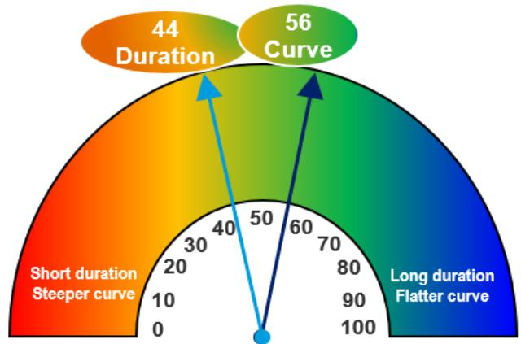

gauge

| Category                  | Value |
| ------------------------- | ----- |
| Short duration Steeper curve | 30    |
| Long duration Flatter curve   | 100   |

Source: BofA Global Research, Note: dial shows duration = average 5y percentiles of CTA positioning + net OTM position implied from futures positioning proxy + CFTC non-comm ex LF + fund regression duration beta. Curve = avg 5y percentiles of CTA betas + futures positioning proxy + fund regression curve beta

BofA GLOBAL RESEARCH

# Long capitulation

Our futures positioning proxy shows that out of the money longs were closed across the curve last week (Exhibit 11 and Exhibit 12). Long exposure has thinned across the curve, with only residual OTM longs in TU, TY, and WN. Shorts now dominate and sit largely ITM. Positioning still skews bearish, with net OTM longs keeping a selloff bias intact.

Report continued on subsequent pages...

Trading ideas and investment strategies discussed herein may give rise to significant risk and are not suitable for all investors. Investors should have experience in relevant markets and the financial resources to absorb any losses arising from applying these ideas or strategies.

BofA does and seeks to do business with issuers covered in its research reports. As a result, investors should be aware that the firm may have a conflict of interest that could affect the objectivity of this report. Investors should consider this report as only a single factor in making their investment decision.

Refer to important disclosures on page 24 to 26. Analyst Certification on page 24. 12975167

# 18 May 2026

Rates Research

United States

Meghan Swiber, CFA

Rates Strategist

BofAS

meghan.swiber@bofa.com

Eleanor Xiao

Rates Strategist

BofAS

eleanor.xiao@bofa.com

US Rates Research

BofAS

See Team Page for List of Analysts

CFTC: Commodities Futures Trading Commission

CTA: Commodity Trading Adviser

FV: Treasury 5Y contract

ITM: In the Money

MBS: Mortgage Backed Securities

OTM: Out of the Money

US: Treasury 20Y contract.

UST: Treasury Security

SF: SOFR Futures

TY: Treasury 10Y contract

TIC: Treasury International Capital

WN = Treasury 30Y contract

See Appendix on page 23 for a detailed list of abbreviations and acronyms.

# CTAs are at stretched shorts across the curve

Our systematic strategies team sees stretched CTA shorts shifting from the front end to the long end in recent weeks (Exhibit 2 & Exhibit 3, see Flows monitor). They note the next moves in positioning will be largely dependent on vol. Should futures continue to decline on lower vol, shorts could continue to grow, but if vol increases, they we would expect shorts to pull back.

Exhibit 2: 2y contract CTA positioning across different lookback models   
All lookback models suggest CTAs are short 2y   
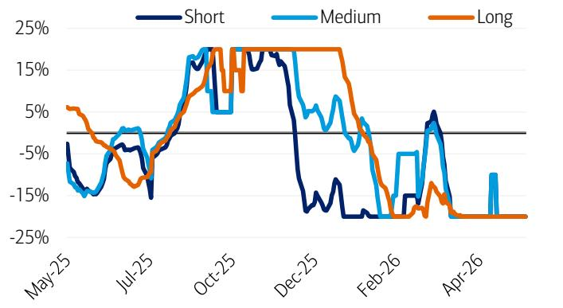

line

| Date   | Short | Medium | Long |
|--------|-------|--------|------|
| May-25 | -5%   | -10%   | 5%   |
| Jul-25 | -10%  | -5%    | -10% |
| Oct-25 | 15%   | 15%    | 15%  |
| Dec-25 | -15%  | 5%     | 15%  |
| Feb-26 | -20%  | -5%    | -10% |
| Apr-26 | -20%  | -10%   | -20% |

Source: BoFA Global Research   
BofA GLOBAL RESEARCH

Exhibit 3: 30y contract CTA positioning across different lookback models   
All lookback models suggest CTAs are short 30y   
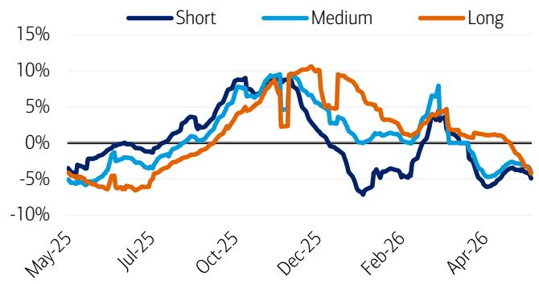

line

| Date   | Short | Medium | Long |
|--------|-------|--------|------|
| May-25 | -3%   | -4%    | -5%  |
| Jul-25 | -1%   | -2%    | -3%  |
| Oct-25 | 8%    | 7%     | 6%   |
| Dec-25 | 9%    | 10%    | 11%  |
| Feb-26 | -7%   | 0%     | 1%   |
| Apr-26 | -5%   | -3%    | -2%  |

Source: BofA Global Research   
BofA GLOBAL RESEARCH

# Asset managers also get shorter

Asset managers largely added to shorts or closed longs last week (Exhibit 9). Net shorts were increased across all points besides US & WN. New longs were only created at the long end of the curve, pointing to some flattener repositioning. Total flows over the last 4w also reflect net short positioning pivot (Exhibit 10).

# Active funds are OW spreads, UW USTs

Active benchmark Agg funds remain underweight (UW) USTs and overweight (OW) MBS & IG (Exhibit 43- Exhibit 48). They are also relatively neutral curve. Over the past month, the biggest change in positioning has been the growing IG overweight. Spread overweights have supported active performance with IG & MBS outperforming USTs since the start of April (Exhibit 42).

# Higher yields have driven inflows & WAM shortening

Positioning still looks broadly short, but fund flows have firmed as duration sold off (Exhibit 37). US FI funds took in \$18bn last week—2x the 12-week pace. Inflows were led by Agg, short gov, and IG, while long gov was the lone outflow, reinforcing a shift to shorter WAM alongside renewed hike pricing.

# Japanese private investors sell in March

MoF data released last week shows Japanese private investors sold \$14bn of USTs in March after \$18bn of sales in Feb, when rates were at low end of recent range. Much of the selling was driven by banks, though pensions & lifers were active sellers as well (Exhibit 35). In recent weeks however, foreign private bond holdings have been inflecting higher suggesting some dip buying (Exhibit 27).

# Potential of JPY intervention signs in Fed data

Recent suspected JPY intervention has raised questions on funding source and whether it drove UST sales. Our JPY strategists estimate \~\$72bn intervention flow—potentially largest since '22—with implied UST sales of \$40–50bn (see: Japan Rates and FX Watch).

Initial changes in foreign RRP & custodial flows showed little evidence of foreign sales the week before or after suspected intervention (as of April 30). Data released Thursday for the week ending May 13 showed a \$23bn decline from the week prior and a more modest \$10bn decline since week before potential intervention. Foreign RRP, a proxy for official sector cash, has been little changed (Exhibit 33 & Exhibit 34). Changes on net are significantly lower than potential intervention size. The widening in front-end swap spreads since April 29 is also inconsistent with market-moving official sales.

Funding of the intervention thus remains unclear. There was sharp official selling through March, likely contributing to weaker auction demand (see: Tail spin). Monday's TIC data should clarify which regions drove March sales.

If further JPY intervention requires sales, something closer to \~\$100bn would likely be more consequential for the UST market. That scale aligns with custodial declines at the start of the Iran conflict which likely contributed to the pullback in broader demand and may pose a headwind to long front-end spread positions.

# Week Ahead

Exhibit 4: On deck next week

Calendar of upcoming events

<table><tr><td></td><td colspan="3">US Data</td><td>Fed Speaker / Event</td><td colspan="3">Treasury Auction</td><td colspan="2">Treasury Settlements</td></tr><tr><td></td><td>Series</td><td>BofA</td><td>BB Consensus</td><td></td><td>Security</td><td>Amount ($bn)</td><td>Prior Δ</td><td>Security</td><td>($bn)</td></tr><tr><td rowspan="2">M, May 18</td><td rowspan="2">NAHB Housing Market Index</td><td rowspan="2">34</td><td rowspan="2">34</td><td rowspan="2"></td><td>13-Week Bills</td><td>89</td><td>0</td><td rowspan="2"></td><td rowspan="2"></td></tr><tr><td>26-Week Bills</td><td>77</td><td>0</td></tr><tr><td rowspan="2">T, May 19</td><td>ADP Weekly Employment Change</td><td>—</td><td>—</td><td>8:00 Fed&#x27;s Waller in Moderated Discussion</td><td rowspan="2">6-Week Bills</td><td rowspan="2">85</td><td rowspan="2">5</td><td rowspan="2">Bills</td><td rowspan="2">40</td></tr><tr><td>Pending Home Sales MoM</td><td>1.50%</td><td>1.60%</td><td>19:00 Fed&#x27;s Paulson Speaks on Economic Outlook</td></tr><tr><td>W, May 20</td><td>FOMC Meeting Minutes</td><td>—</td><td>—</td><td>9:15 Fed&#x27;s Barr Speaks on Consumer Financial Health</td><td>20-Year Bond</td><td>16</td><td></td><td></td><td></td></tr><tr><td rowspan="6">T, May 21</td><td>Initial Jobless Claims</td><td>207k</td><td>—</td><td rowspan="6"></td><td rowspan="6">9-Year 8-Month TIPS</td><td rowspan="6">19</td><td rowspan="6"></td><td rowspan="6">Bills</td><td rowspan="6">17</td></tr><tr><td>Philadelphia Fed Business Outlook</td><td>15</td><td>12</td></tr><tr><td>Housing Starts</td><td>1400k</td><td>1420k</td></tr><tr><td>Building Permits</td><td>1350k</td><td>1385k</td></tr><tr><td>S&amp;P Global US Manufacturing PMI</td><td>53.8</td><td>—</td></tr><tr><td>S&amp;P Global US Services PMI</td><td>51.5</td><td>—</td></tr><tr><td>F, May 22</td><td>U. of Mich. Sentiment</td><td>48</td><td>48.2</td><td>10:00 Fed&#x27;s Waller Speaks on Economic Outlook</td><td></td><td></td><td></td><td></td><td></td></tr></table>

Source: BofA Global Research, Bloomberg, US Treasury

BofA GLOBAL RESEARCH

# Positioning indicators

Exhibit 5: 5y percentile of 10 equivalent duration positioning (percentile: higher = longer)

Futures proxy shows longs are still out of the money, funds are underweight, our top down 10y momentum figure suggests modest CTA shorts

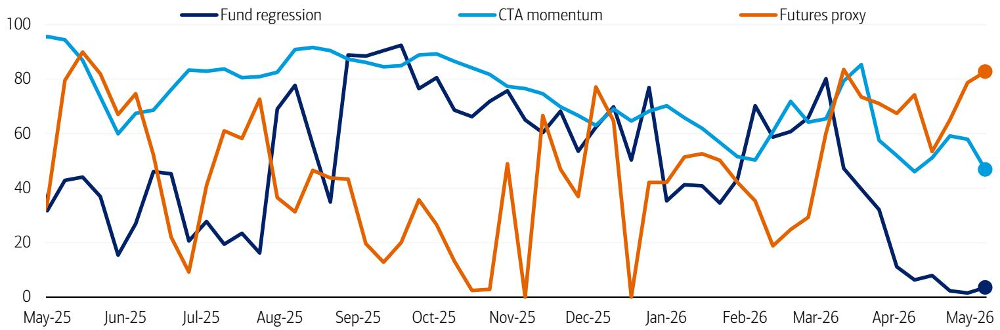

line

| Date   | Fund regression | CTA momentum | Futures proxy |
|--------|-----------------|--------------|---------------|
| May-25 | 30              | 95           | 80            |
| Jun-25 | 15              | 60           | 70            |
| Jul-25 | 25              | 80           | 10            |
| Aug-25 | 75              | 85           | 70            |
| Sep-25 | 90              | 85           | 40            |
| Oct-25 | 75              | 85           | 35            |
| Nov-25 | 60              | 75           | 0             |
| Dec-25 | 50              | 65           | 75            |
| Jan-26 | 40              | 70           | 40            |
| Feb-26 | 35              | 50           | 30            |
| Mar-26 | 80              | 65           | 80            |
| Apr-26 | 30              | 50           | 70            |
| May-26 | 0               | 45           | 80            |

Source: BofA Global Research, Bloomberg

BofA GLOBAL RESEARCH

Exhibit 6: 5y percentile of curve positioning (percentile: higher = longer back-end relative to front end)   
Futures proxy skewed flatter; fund regression still relatively neutral while CTAs regression implies steepener   
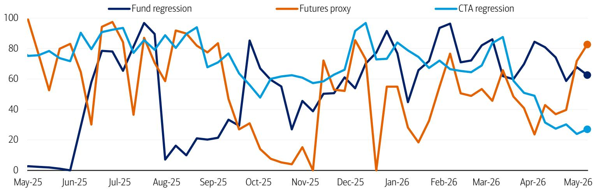

line

| Month   | Fund regression | Futures proxy | CTA regression |
|---------|-----------------|---------------|----------------|
| May-25  | 0               | 100           | 75             |
| Jun-25  | 0               | 80            | 70             |
| Jul-25  | 95              | 95            | 90             |
| Aug-25  | 10              | 60            | 85             |
| Sep-25  | 20              | 80            | 70             |
| Oct-25  | 30              | 30            | 60             |
| Nov-25  | 40              | 10            | 60             |
| Dec-25  | 50              | 70            | 70             |
| Jan-26  | 90              | 55            | 80             |
| Feb-26  | 95              | 75            | 70             |
| Mar-26  | 85              | 60            | 85             |
| Apr-26  | 80              | 40            | 60             |
| May-26  | 60              | 80            | 25             |

Source: BofA Global Research, Bloomberg   
BofA GLOBAL RESEARCH

Exhibit 7: Asset manager and leveraged fund positioning (10y equivalent, \$bn)   
Asset manager longs correspond with leveraged fund shorts   
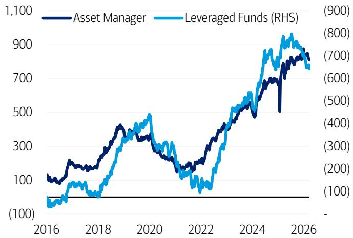

line

| Year | Asset Manager | Leveraged Funds (RHS) |
|------|---------------|------------------------|
| 2016 | ~100          | ~50                    |
| 2018 | ~300          | ~200                   |
| 2020 | ~450          | ~500                   |
| 2022 | ~250          | ~150                   |
| 2024 | ~700          | ~600                   |
| 2026 | ~850          | ~750                   |

Source: BofA Global Research, Bloomberg   
BofA GLOBAL RESEARCH

Exhibit 8: Asset manager futures positioning in 10y equivalents (\$bn)   
More longs in TU-TY vs UXY – WN but deviation is narrowing   
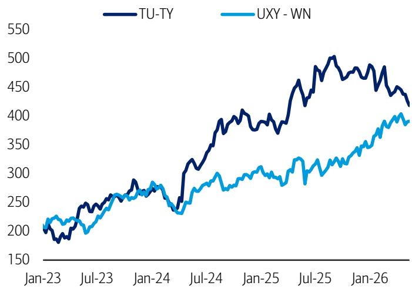

line

| Date   | TU-TY | UXY - WN |
|--------|-------|----------|
| Jan-23 | 200   | 210      |
| Jul-23 | 250   | 240      |
| Jan-24 | 280   | 270      |
| Jul-24 | 350   | 300      |
| Jan-25 | 400   | 320      |
| Jul-25 | 480   | 350      |
| Jan-26 | 420   | 390      |

Source: BofA Global Research, Bloomberg   
BofA GLOBAL RESEARCH

Exhibit 9: Decomposition of 1w change in asset manager open interest (10y equivalent, \$bn)   
More AM shorts created last week; significant new longs created at WN only   
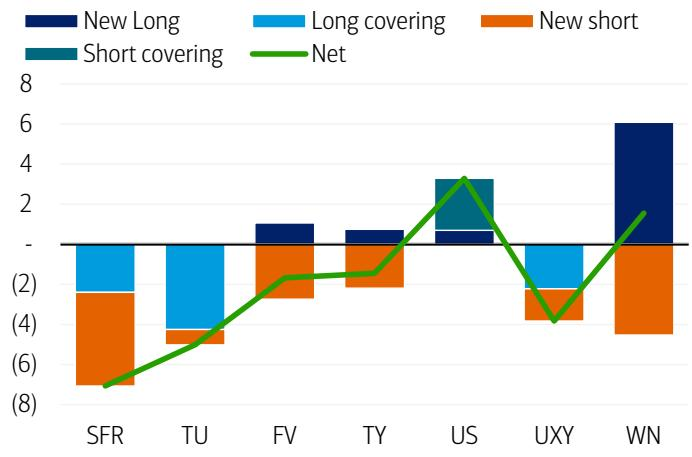

bar_line

| Category | New Long | Long covering | New short | Short covering | Net |
| -------- | -------- | ------------- | --------- | -------------- | --- |
| SFR      |          |               |           |                |     |
| TU       |          |               |           |                |     |
| FV       |          |               |           |                |     |
| TY       |          |               |           |                |     |
| US       |          |               |           |                  |     |
| UXY      |          |               |           |                |     |
| WN       |          |               |           |                |     |

Source: BofA Global Research, Bloomberg   
BofA GLOBAL RESEARCH

Exhibit 11: Proxies for futures positioning (\$mil '01, duration-weighted by contract)   
In the money positions are predominantly shorts with some long out of the money in TY and WN points of the curve   
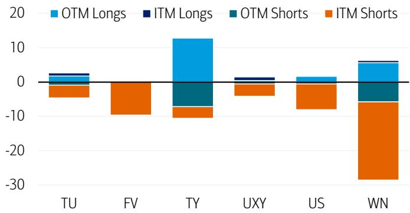

bar_stacked

| Category | OTM Longs | ITM Longs | OTM Shorts | ITM Shorts |
| :--- | :--- | :--- | :--- | :--- |
| TU | 1 | 1 | -2 | -3 |
| FV | 0 | 0 | -15 | -10 |
| TY | 12 | 0 | -8 | -9 |
| UXY | 0 | 1 | -2 | -4 |
| US | 1 | 0 | -7 | -6 |
| WN | 4 | 0 | -5 | -28 |

Source: BofA Global Research, Bloomberg; Note: see Appendix A.1. on how to read proxies for futures positioning   
BofA GLOBAL RESEARCH

Exhibit 13: CTA positioning in 10yT   
Momentum suggests longs reduced at 10y point; Betas imply shorter than momentum   
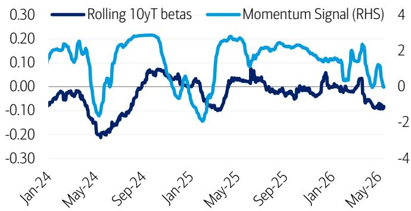

line

| Date   | Rolling 10yT betas | Momentum Signal (RHS) |
|--------|--------------------|----------------------|
| Jan-24 | -0.10              | 1.5                  |
| May-24 | -0.20              | -1.0                 |
| Sep-24 | 0.05               | 2.0                  |
| Jan-25 | 0.00               | -1.5                 |
| May-25 | -0.10              | 2.5                  |
| Sep-25 | 0.05               | 1.5                  |
| Jan-26 | 0.00               | 1.0                  |
| May-26 | -0.10              | 0.5                  |

Source: BofA Global Research   
BofA GLOBAL RESEARCH

Exhibit 10: Decomposition of 4w change in asset manager open interest (10y equivalent, \$bn)   
Last 4w positioning stays mixed with more new vs covered positions   
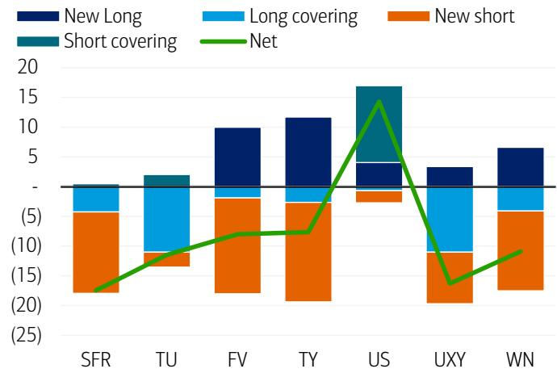

bar_stacked

| Region | New Long | Long covering | New short | Short covering | Net |
| :--- | :--- | :--- | :--- | :--- | :--- |
| SFR | 1 | 2 | 5 | -1 | -18 |
| TU | 0 | 7 | 9 | 1 | -8 |
| FV | 6 | 1 | 4 | 0 | -6 |
| TY | 7 | 1 | 3 | 0 | -6 |
| US | 3 | 0 | 2 | 8 | 14 |
| UXY | 3 | 6 | 10 | 0 | -15 |
| WN | 4 | 2 | 5 | 0 | -9 |

Source: BofA Global research, Bloomberg   
BofA GLOBAL RESEARCH

Exhibit 12: Analysis of proxies for futures positioning   
Futures proxy implies most of curve to selloff   
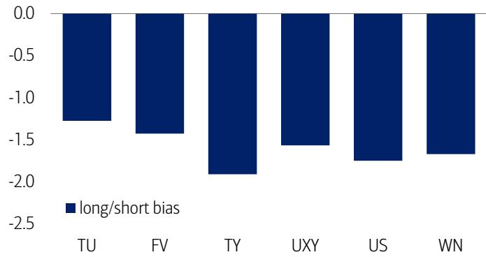

bar

| Category | long/short bias |
|---|---|
| TU | -1.3 |
| FV | -1.4 |
| TY | -1.9 |
| UXY | -1.5 |
| US | -1.7 |
| WN | -1.6 |

Source: BofA Global Research, Bloomberg. Note: reflects the average z-score of the return signal stack over the last 5 days vs past 3mo. Positive signal implies net OTM position is short & rates are biased to rally; similarly, negative signal implies net OTM position is long & a bias for rates to selloff   
BofA GLOBAL RESEARCH

Exhibit 14: CTA positioning in 2y vs 10y UST   
Top-down model shows CTAs are taking more underweight risk at 10y   
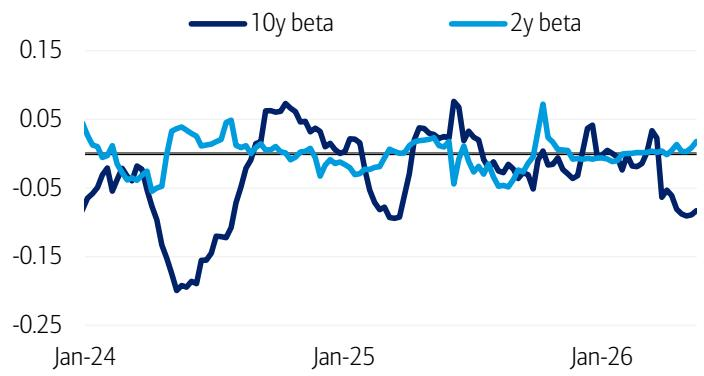

line

| Date   | 10y beta | 2y beta |
|--------|----------|---------|
| Jan-24 | -0.05    | 0.05    |
| Jan-25 | -0.15    | 0.03    |
| Jan-26 | -0.08    | 0.04    |

Source: BofA Global Research   
BofA GLOBAL RESEARCH

Exhibit 15: Changes in CTA 10yT beta   
Beta increased modestly on the week   
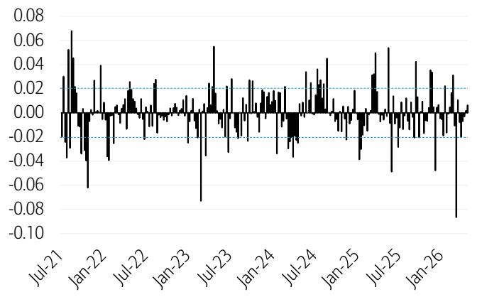

line

| Date   | Value  |
|--------|--------|
| Jul-21 | 0.07   |
| Jan-22 | -0.06  |
| Jul-22 | 0.02   |
| Jan-23 | -0.08  |
| Jul-23 | 0.05   |
| Jan-24 | -0.02  |
| Jul-24 | 0.04   |
| Jan-25 | -0.04  |
| Jul-25 | 0.05   |
| Jan-26 | -0.09  |

Source: BofA Global Research   
BofA GLOBAL RESEARCH

Exhibit 16: CTA 10y TSY beta and non-reportable positions   
Non-reportable and betas both suggest recent increase in shorts   
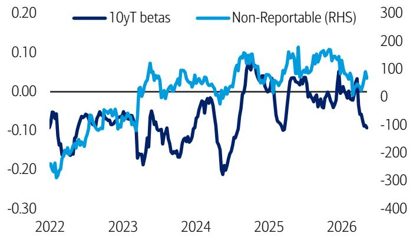

line

| Year | 10yT betas | Non-Reportable (RHS) |
|------|------------|----------------------|
| 2022 | -0.15      | -250                 |
| 2023 | -0.05      | 50                   |
| 2024 | -0.10      | 100                  |
| 2025 | 0.05       | 150                  |
| 2026 | -0.10      | 50                   |

Source: BofA Global Research, Bloomberg   
BofA GLOBAL RESEARCH

# Flow of funds

Exhibit 17: UST supply versus sources of demand (\$bn)   
Demand in Q4 was weaker relative to Q3 despite similar supply   
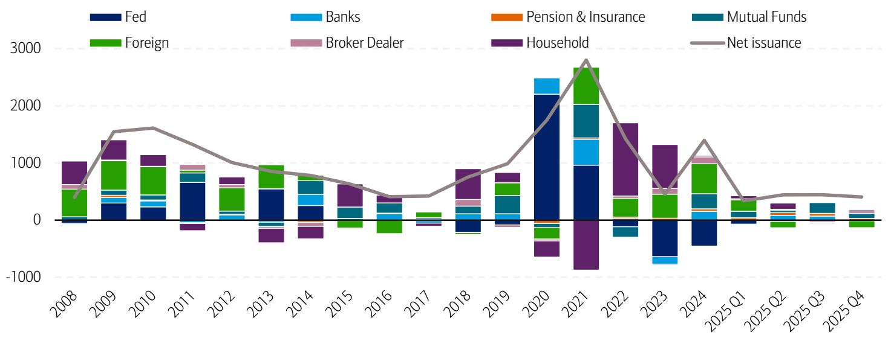

bar_stacked

| Year | Fed | Banks | Foreign | Housing | Mutual Funds | Broker Dealer | Net issuance |
| :--- | :--- | :--- | :--- | :--- | :--- | :--- | :--- |
| 2008 | -100 | 0 | 400 | 300 | 0 | 0 | 400 |
| 2009 | 300 | 100 | 600 | 100 | 0 | 0 | 1500 |
| 2010 | 200 | 100 | 500 | 100 | 0 | 0 | 1600 |
| 2011 | 600 | 100 | -200 | -100 | 100 | 100 | 1300 |
| 2012 | 100 | 100 | 300 | 100 | 100 | 100 | 1000 |
| 2013 | 500 | 100 | -200 | -300 | 100 | 100 | 900 |
| 2014 | 250 | 150 | -250 | -350 | 250 | 150 | 850 |
| 2015 | -50 | -50 | -250 | -350 | 250 | -50 | 750 |
| 2016 | -150 | -150 | -350 | -450 | 250 | -150 | 450 |
| 2017 | -50 | -50 | -150 | -550 | -55 | -55 | 450 |
| 2018 | -250 | -250 | -150 | -350 | -250 | -250 | 850 |
| 2019 | -150 | -150 | -250 | -350 | -250 | -150 | 950 |
| 2020 | 2250 | 350 | -150 | -450 | -150 | -450 | 1850 |
| 2021 | 950 | 450 | 650 | -850 | 450 | -850 | 2850 |
| 2022 | -350 | -350 | -350 | 450 | -350 | -350 | 1650 |
| 2023 | -650 | -650 | -450 | 450 | -450 | -450 | 450 |
| 2024 | -450 | -450 | 850 | 1250 | 350 | -125 | 1350 |
| 2025 Q1 | -150 | -150 | -350 | -350 | -350 | -350 | 350 |
| 2025 Q2 | -150 | -150 | -150 | -350 | -350 | -350 | 450 |
| 2025 Q3 | -150 | -150 | -150 | -350 | -350 | -350 | 450 |
| 2025 Q4 | -150 | -150 | -150 | -350 | -350 | -350 | 450 |
The chart displays the net issuance trend over time. The data is grouped by year (top) and quarter (bottom). The legend identifies categories: Fed, Banks, Foreign, Housing, Mutual Funds, Broker Dealer, and Net issuance. Values are estimated based on the provided data.

Source: BofA Global Research, Federal Reserve, Note: only reflects real money categories from flow of funds that generally invest in Treasury coupon securities. Net issuance is coupon supply excluding Fed flows, which are shown as negative for periods where Fed is reducing size of its balance sheet

BofA GLOBAL RESEARCH

Exhibit 18: Change in UST holdings (\$bn)   
Much of growth in household holdings likely driven by hedge funds   
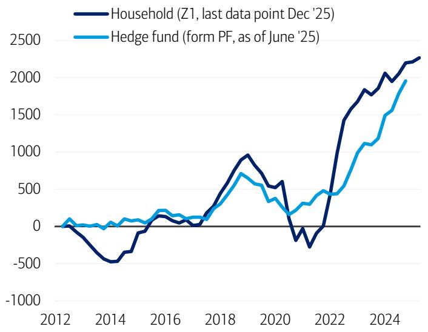

line

| Year | Household (Z1, last data point Dec '25) | Hedge fund (form PF, as of June '25) |
|------|----------------------------------------|--------------------------------------|
| 2012 | ~0                                     | ~0                                   |
| 2014 | ~-500                                  | ~0                                   |
| 2016 | ~100                                   | ~200                                 |
| 2018 | ~900                                   | ~700                                 |
| 2020 | ~500                                   | ~300                                 |
| 2022 | ~1500                                  | ~500                                 |
| 2024 | ~2200                                  | ~1800                                |

Source: BofA Global Research, Federal Reserve, Haver   
BofA GLOBAL RESEARCH

Exhibit 19: Hedge fund cash UST holdings vs leveraged HF shorts (\$bn)   
Form PF data shows growth in cash UST since 2022, short futures position picked up since drop in Q4 2024   
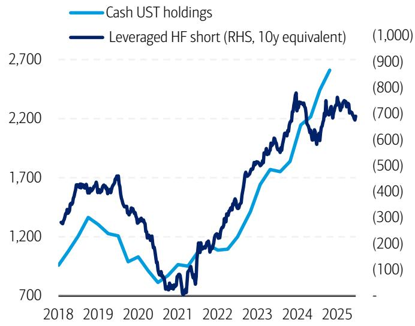

line

| Year | Cash UST holdings | Leveraged HF short (RHS, 10y equivalent) |
|------|---------------------|------------------------------------------|
| 2018 | ~1,100              | ~1,300                                   |
| 2019 | ~1,300              | ~1,700                                   |
| 2020 | ~1,100              | ~1,400                                   |
| 2021 | ~1,000              | ~700                                     |
| 2022 | ~1,100              | ~1,200                                   |
| 2023 | ~1,500              | ~1,700                                   |
| 2024 | ~2,000              | ~2,300                                   |
| 2025 | ~2,700              | ~2,200                                   |

Source: BofA Global Research, Federal Reserve, Haver   
BofA GLOBAL RESEARCH

# FX hedged pickup and foreign flows

Exhibit 20: FX hedged pickup of TSYs versus local alternatives implied by forwards   
Market pricing suggests relatively negative pickup for major foreign investor types   
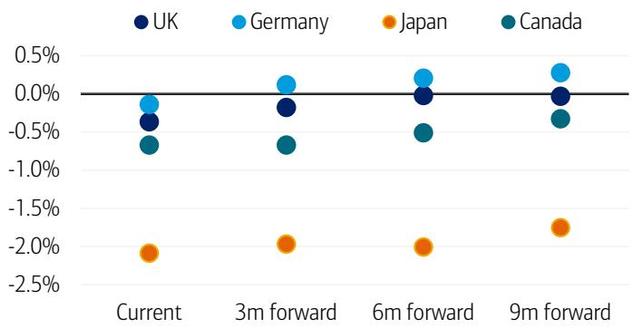  
Source: BofA Global Research, Bloomberg, Note: pickup vs 10y local alternative except Japan which is relative to 20y JGB using 3m forward FX hedge   
BofA GLOBAL RESEARCH

Exhibit 21: 10Y UST pickup to 20Y JGB, with 3m FX hedge (bps)   
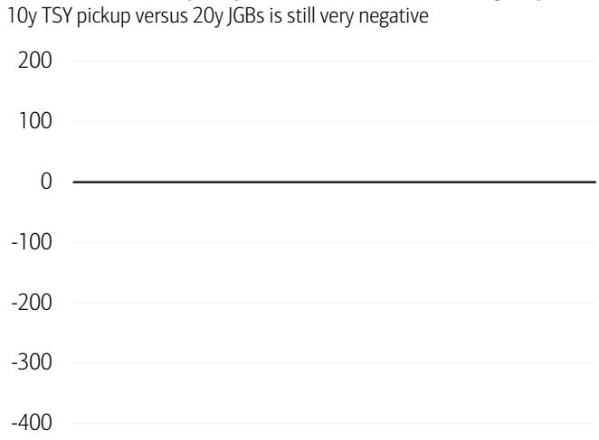

line

| Time | Value |
|------|-------|
| 10y TSY pickup versus 20y JGBs is still very negative | 0 |

Source: BofA Global Research, Bloomberg   
BofA GLOBAL RESEARCH

Exhibit 22: 10Y UST pickup to 10Y JGB, with 3m FX hedge (bps)   
10y TSY offers negative hedged pickup versus 10y JGBs   
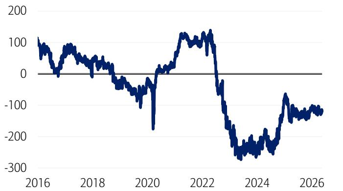

line

| Year | Value |
| ---- | ----- |
| 2016 | 100   |
| 2017 | 50    |
| 2018 | 0     |
| 2019 | -50   |
| 2020 | -150  |
| 2021 | 100   |
| 2022 | 150   |
| 2023 | -100  |
| 2024 | -250  |
| 2025 | -100  |
| 2026 | -50   |

Source: BofA Global Research, Bloomberg   
BofA GLOBAL RESEARCH

Exhibit 23: 10Y UST pickup to 10Y Bund, with 3m FX hedge (bps)   
10y TSY hedged pickup still negative versus 10y Bund   
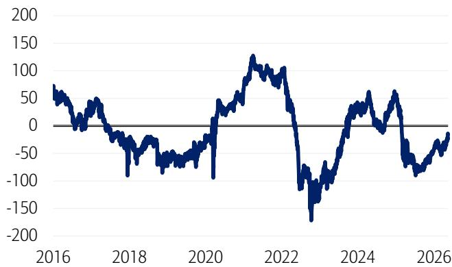

line

| Year | Value |
| ---- | ----- |
| 2016 | 70    |
| 2017 | 30    |
| 2018 | -50   |
| 2019 | -70   |
| 2020 | -100  |
| 2021 | 120   |
| 2022 | -150  |
| 2023 | -180  |
| 2024 | 50    |
| 2025 | -100  |
| 2026 | -50   |

Source: BofA Global Research, Bloomberg   
BofA GLOBAL RESEARCH

Exhibit 24: 10Y UST pickup to 10Y CAD govie, with 3m FX hedge (bps)   
10y TSY hedged pickup increasingly negative versus 10y CAD gov bond   
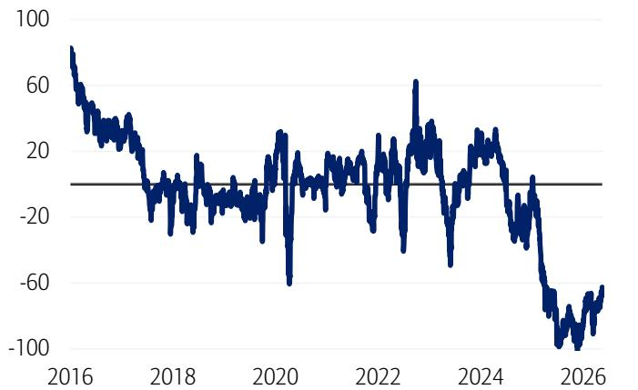

line

| Year | Value |
| ---- | ----- |
| 2016 | 90    |
| 2017 | 40    |
| 2018 | -10   |
| 2019 | -15   |
| 2020 | -60   |
| 2021 | -10   |
| 2022 | -50   |
| 2023 | 60    |
| 2024 | -50   |
| 2025 | -100  |
| 2026 | -60   |

Source: BofA Global Research, Bloomberg   
BofA GLOBAL RESEARCH

Exhibit 25: 10Y UST pickup to 10Y Gilt, with 3m FX hedge (bps)   
10y TSY offers negative pickup versus gilts   
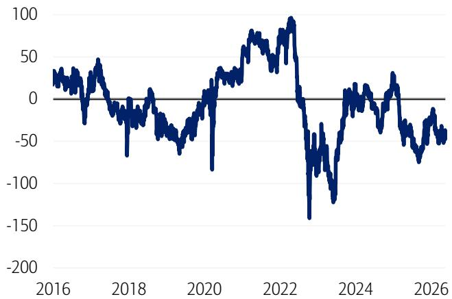

line

| Year | Value |
|------|-------|
| 2016 | ~30   |
| 2017 | ~40   |
| 2018 | ~-20  |
| 2019 | ~-40  |
| 2020 | ~-80  |
| 2021 | ~60   |
| 2022 | ~90   |
| 2023 | ~-150 |
| 2024 | ~-100 |
| 2025 | ~30   |
| 2026 | ~-40  |

Source: BofA Global Research, Bloomberg   
BofA GLOBAL RESEARCH

# Exhibit 26: 3m rolling JPY currency hedge

From the perspective of Japanese investors, pickup is negative across almost all compared regions; most notably US, Germany, and UK

<table><tr><td rowspan="2"></td><td colspan="2">May 14 &#x27;26</td><td colspan="2">As of 1 wk ago</td><td colspan="2">As of 1 mo ago</td><td colspan="2">As of 1 yr ago</td></tr><tr><td>Pickup to 10y JGB</td><td>Pickup to 20Y JGB</td><td>Pickup to 10y JGB</td><td>Pickup to 20Y JGB</td><td>Pickup to 10y JGB</td><td>Pickup to 20Y JGB</td><td>Pickup to 10y JGB</td><td>Pickup to 20Y JGB</td></tr><tr><td>10y UST</td><td>-1.16%</td><td>-2.09%</td><td>-1.16%</td><td>-2.05%</td><td>-1.21%</td><td>-2.07%</td><td>-1.15%</td><td>-2.07%</td></tr><tr><td>10y GER</td><td>-1.03%</td><td>-1.95%</td><td>-0.91%</td><td>-1.80%</td><td>-0.82%</td><td>-1.67%</td><td>-0.63%</td><td>-1.56%</td></tr><tr><td>10y FRA</td><td>-0.41%</td><td>-1.33%</td><td>-0.30%</td><td>-1.19%</td><td>-0.18%</td><td>-1.03%</td><td>0.04%</td><td>-0.89%</td></tr><tr><td>10y BEL</td><td>-0.49%</td><td>-1.41%</td><td>-0.37%</td><td>-1.26%</td><td>-0.26%</td><td>-1.11%</td><td>-0.10%</td><td>-1.02%</td></tr><tr><td>10y ITA</td><td>-0.30%</td><td>-1.22%</td><td>-0.19%</td><td>-1.08%</td><td>-0.05%</td><td>-0.90%</td><td>0.37%</td><td>-0.56%</td></tr><tr><td>10y SPA</td><td>-0.61%</td><td>-1.53%</td><td>-0.50%</td><td>-1.39%</td><td>-0.37%</td><td>-1.22%</td><td>-0.01%</td><td>-0.94%</td></tr><tr><td>10y UK</td><td>-0.80%</td><td>-1.72%</td><td>-0.75%</td><td>-1.64%</td><td>-0.78%</td><td>-1.63%</td><td>-0.82%</td><td>-1.74%</td></tr><tr><td>10y CAN</td><td>-0.53%</td><td>-1.46%</td><td>-0.51%</td><td>-1.40%</td><td>-0.45%</td><td>-1.30%</td><td>-0.51%</td><td>-1.43%</td></tr></table>

Source: BofA Global Research, Bloomberg   
BofA GLOBAL RESEARCH

Exhibit 27: Japan investment in foreign bonds, cumulative weekly (\$bn)
Long & medium term bonds holdings rose \$10bn on the week   
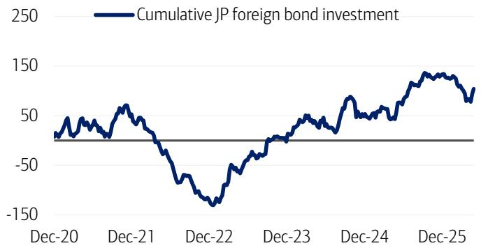

line

| Date    | Cumulative JP foreign bond investment |
|---------|----------------------------------------|
| Dec-20  | ~30                                    |
| Dec-21  | ~60                                    |
| Dec-22  | ~-130                                  |
| Dec-23  | ~-20                                   |
| Dec-24  | ~70                                    |
| Dec-25  | ~140                                   |

Source: BofA Global Research, Bloomberg   
BofA GLOBAL RESEARCH

Exhibit 29: Cumulative UST flows from foreign investors (\$bn)
UK has been large buyer since '21   
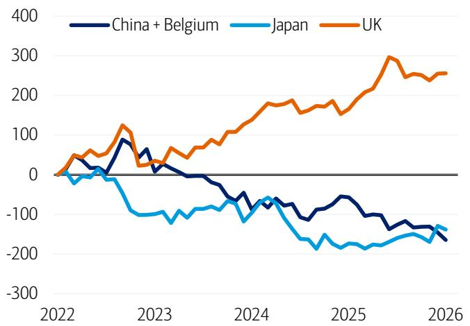

line

| Year | China + Belgium | Japan | UK |
|------|-----------------|-------|----|
| 2022 | ~0              | ~0    | ~0 |
| 2023 | ~-50            | ~-100 | ~50 |
| 2024 | ~-100           | ~-150 | ~150 |
| 2025 | ~-150           | ~-200 | ~250 |
| 2026 | ~-180           | ~-150 | ~250 |

Source: BofA Global Research, Bloomberg, TIC, note: references the valuation-adjusted flow
BofA GLOBAL RESEARCH

Exhibit 31: Cumulative UST flows from foreign investors (\$bn)
Foreign holdings increased in February   
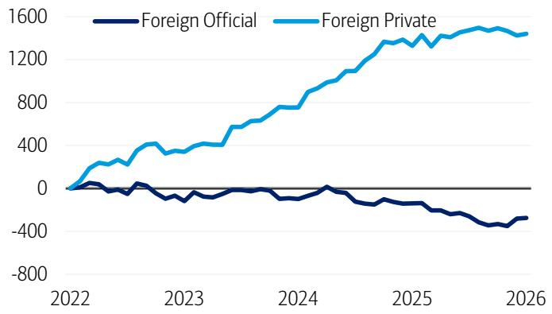

line

| Year | Foreign Official | Foreign Private |
|------|------------------|-----------------|
| 2022 | ~0               | ~0              |
| 2023 | ~-50             | ~400            |
| 2024 | ~-100            | ~800            |
| 2025 | ~-200            | ~1300           |
| 2026 | ~-300            | ~1400           |

BofA Global Research, Bloomberg, TIC, note: references the valuation-adjusted flow
BofA GLOBAL RESEARCH

Exhibit 28: Weekly UST custody holdings, foreign official (\$bn)
Custody holdings declined \$24bn on the week   
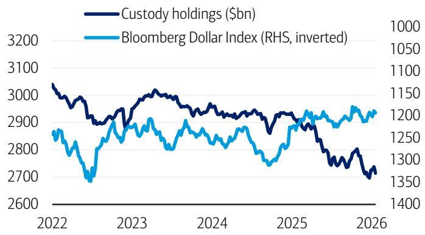

line

| Year | Custody holdings ($bn) | Bloomberg Dollar Index (RHS, inverted) |
|------|--------------------------|------------------------------------------|
| 2022 | ~3050                    | ~1250                                    |
| 2023 | ~2950                    | ~1200                                    |
| 2024 | ~2900                    | ~1250                                    |
| 2025 | ~2850                    | ~1300                                    |
| 2026 | ~2700                    | ~1350                                    |

Source: BofA Global Research, NY Fed   
BofA GLOBAL RESEARCH

Exhibit 30: Largest MoM changes in foreign TSY holdings (\$bn)
Japan, UK biggest buyers; Canada & China + Belgium biggest sellers   
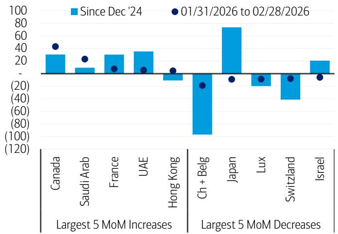

bar_line

| Country | Since Dec '24 (Largest 5 MoM Increases) | 01/31/2026 to 02/28/2026 (Largest 5 MoM Decreases) |
| :--- | :--- | :--- |
| Canada | 30 | 45 |
| Saudi Arab | -10 | 25 |
| France | 30 | -10 |
| UAE | 35 | -10 |
| Hong Kong | -15 | -10 |
| Ch + Belg | -90 | -20 |
| Japan | 75 | -15 |
| Lux | -15 | -15 |
| Switzerland | -40 | -15 |
| Israel | 20 | -15 |

Source: BofA Global Research, TIC, Note: adjusted for level of rates   
BofA GLOBAL RESEARCH

Exhibit 32: Cumulative change in Japanese investor holdings of USTs Higher foreign private buying vs combined private & official Japanese holdings of UST   
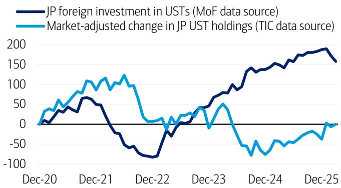

line

| Date   | JP foreign investment in USTs (MoF data source) | Market-adjusted change in JP UST holdings (TIC data source) |
|--------|--------------------------------------------------|---------------------------------------------------------------|
| Dec-20 | 0                                                | 0                                                             |
| Dec-21 | 60                                               | 100                                                           |
| Dec-22 | -100                                             | 0                                                             |
| Dec-23 | 40                                               | 50                                                            |
| Dec-24 | 150                                              | -80                                                           |
| Dec-25 | 180                                              | 0                                                             |

Source: BofA Global Research, Bloomberg, TIC   
BofA GLOBAL RESEARCH

Exhibit 33: Japanese deposits with other central banks and Fed foreign repo pool (\$bn)   
Vast majority of \$162bn in MoF deposits likely at Fed's foreign repo pool   
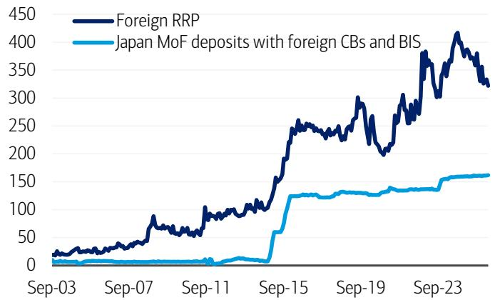

line

| Date   | Foreign RRP | Japan MoF deposits with foreign CBs and BIS |
|--------|-------------|-------------------------------------------|
| Sep-03 | ~20         | ~5                                        |
| Sep-07 | ~80         | ~5                                        |
| Sep-11 | ~100        | ~5                                        |
| Sep-15 | ~250        | ~120                                      |
| Sep-19 | ~300        | ~130                                      |
| Sep-23 | ~420        | ~160                                      |

Source: Japan MoF, Federal Reserve, Bloomberg   
BofA GLOBAL RESEARCH

Exhibit 35: Monthly change in Japanese investor foreign bond holdings (\$USD, bn)   
Mar saw selling from pensions, lifers, and banks   
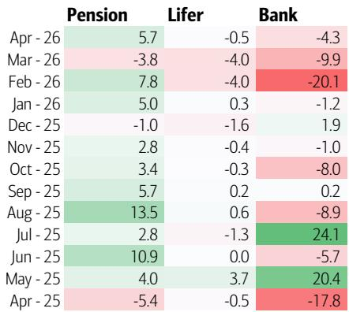

bar_stacked

| Month | Pension | Lifer | Bank |
| :--- | :--- | :--- | :--- |
| Apr - 26 | 5.7 | -0.5 | -4.3 |
| Mar - 26 | -3.8 | -4.0 | -9.9 |
| Feb - 26 | 7.8 | -4.0 | -20.1 |
| Jan - 26 | 5.0 | 0.3 | -1.2 |
| Dec - 25 | -1.0 | -1.6 | 1.9 |
| Nov - 25 | 2.8 | -0.4 | -1.0 |
| Oct - 25 | 3.4 | -0.3 | -8.0 |
| Sep - 25 | 5.7 | 0.2 | 0.2 |
| Aug - 25 | 13.5 | 0.6 | -8.9 |
| Jul - 25 | 2.8 | -1.3 | 24.1 |
| Jun - 25 | 10.9 | 0.0 | -5.7 |
| May - 25 | 4.0 | 3.7 | 20.4 |
| Apr - 25 | -5.4 | -0.5 | -17.8 |

Source: BofA Global Research, Japanese MoF   
BofA GLOBAL RESEARCH

Exhibit 34: Cumulative change in custody holdings and foreign RRP   
UST securities held in custody are typically negatively correlated with foreign RRP take-up but we have seen some divergence since July '25   
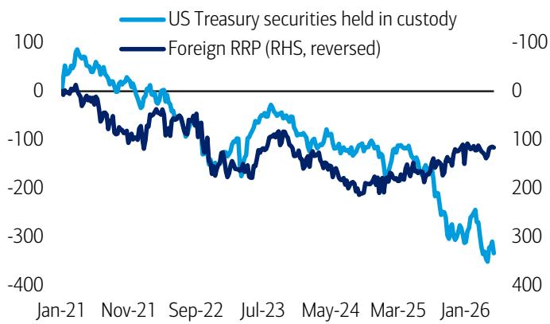

line

| Date   | US Treasury securities held in custody | Foreign RRP (RHS, reversed) |
|--------|----------------------------------------|------------------------------|
| Jan-21 | ~50                                    | ~0                           |
| Nov-21 | ~0                                     | ~-50                         |
| Sep-22 | ~-50                                   | ~-100                        |
| Jul-23 | ~-100                                  | ~-150                        |
| May-24 | ~-150                                  | ~-200                        |
| Mar-25 | ~-200                                  | ~-250                        |
| Jan-26 | ~-350                                  | ~-300                        |

Source: BofA Global Research, Federal Reserve   
BofA GLOBAL RESEARCH

Exhibit 36: Cumulative change in Japanese investor foreign bond holdings (\$USD, bn)   
Pension holdings have increased in recent months   
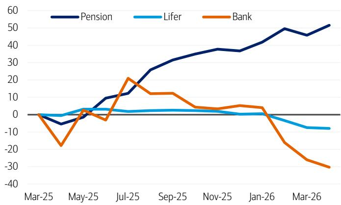

line

| Month   | Pension | Lifer | Bank |
|---------|---------|-------|------|
| Mar-25  | 0       | 0     | 0    |
| May-25  | -10     | 0     | -15  |
| Jul-25  | 10      | 0     | 20   |
| Sep-25  | 30      | 0     | 10   |
| Nov-25  | 35      | 0     | 0    |
| Jan-26  | 40      | 0     | 0    |
| Mar-26  | 50      | -10   | -30  |

Source: BofA Global Research, Japanese MoF   
BofA GLOBAL RESEARCH

# Fund flows and returns

Exhibit 37: US fixed income fund flows (\$million)   
US FI funds saw strong outsized inflows vs rolling 4w average, driven by mixed allocation, IG corp, and short-term gov't funds 

<table><tr><td></td><td>May 13 &#x27;26</td><td>Rolling 4w average</td><td>Rolling 8w average</td><td>Rolling 12w average</td><td>Rolling 52w average</td></tr><tr><td>Gov: short</td><td>3,286</td><td>893</td><td>2,034</td><td>2,590</td><td>1,518</td></tr><tr><td>Gov: intermediate</td><td>702</td><td>605</td><td>418</td><td>768</td><td>576</td></tr><tr><td>Gov: long</td><td>(54)</td><td>315</td><td>(79)</td><td>(15)</td><td>138</td></tr><tr><td>Corp: IG</td><td>3,213</td><td>1,150</td><td>877</td><td>952</td><td>1,107</td></tr><tr><td>Corp:HY</td><td>1,120</td><td>553</td><td>264</td><td>(401)</td><td>312</td></tr><tr><td>Corp: all quality</td><td>175</td><td>145</td><td>77</td><td>58</td><td>81</td></tr><tr><td>MBS</td><td>618</td><td>467</td><td>296</td><td>285</td><td>413</td></tr><tr><td>Inflation</td><td>617</td><td>594</td><td>454</td><td>352</td><td>298</td></tr><tr><td>Muni</td><td>1,895</td><td>1,656</td><td>953</td><td>1,127</td><td>1,236</td></tr><tr><td>Mixed allocation</td><td>6,408</td><td>5,889</td><td>3,001</td><td>3,840</td><td>5,481</td></tr><tr><td>All US FI</td><td>17,938</td><td>12,483</td><td>8,492</td><td>9,231</td><td>11,093</td></tr></table>

Source: BofA Global Research, EPFR   
BofA GLOBAL RESEARCH

Exhibit 38: Sovereign fund inflows by year (\$bn)   
2025 inflows rose steadily over the year; 2026 inflows greater than last year   
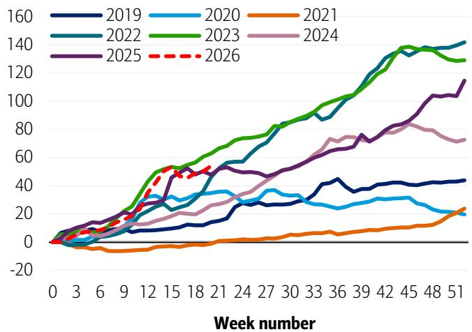

line

| Week number | 2019 | 2020 | 2021 | 2022 | 2023 | 2024 | 2025 | 2026 |
| ----------- | ---- | ---- | ---- | ---- | ---- | ---- | ---- | ---- |
| 0           | 0    | 0    | 0    | 0    | 0    | 0    | 0    | 0    |
| 3           | 0    | 0    | 0    | 0    | 0    | 0    | 0    | 0    |
| 6           | 0    | 0    | 0    | 0    | 0    | 0    | 0    | 0    |
| 9           | 0    | 0    | 0    | 0    | 0    | 0    | 0    | 0    |
| 12          | 0    | 0    | 0    | 0    | 0    | 0    | 0    | 0    |
| 15          | 0    | 0    | 0    | 0    | 0    | 0    | 0    | 0    |
| 18          | 0    | 0    | 0    | 0    | 0    | 0    | 0    | 0    |
| 21          | 0    | 0    | 0    | 0    | 0    | 0    | 0    | 0    |
| 24          | 0    | 0    | 0    | 0    | 0    | 0    | 0    | 0    |
| 27          | 0    | 0    | 0    | 0    | 0    | 0    | 0    | 0    |
| 30          | 0    | 0    | 0    | 0    | 0    | 0    | 0    | 0    |
| 33          | 0    | 0    | 0    | 0    | 0    | 0    | 0    | 0    |
| 36          | 0    | 0    | 0    | 0    | 0    | 0    | 0    | 0    |
| 39          | 0    | 0    | 0    | 0    | 0    | 0    | 0    | 0    |
| 42          | 0    | 0    | 0    | 0    | 0    | 0    | 0    | 0    |
| 45          | 0    | 0    | 0    | 0    | 0    | 0    | 0    | 0    |
| 48          | 0    | 0    | 0    | 0    | 0    | 0    | 0    | 0    |
| 51          | 0    | 0    | 0    | 0    | 0    | 0    | 0    | 0    |

BofA Global Research, EPFR   
BofA GLOBAL RESEARCH

Exhibit 39: Sovereign fund inflows by year (\$bn)   
Short-term inflows were strong at the start of 2025 but slowed since April   
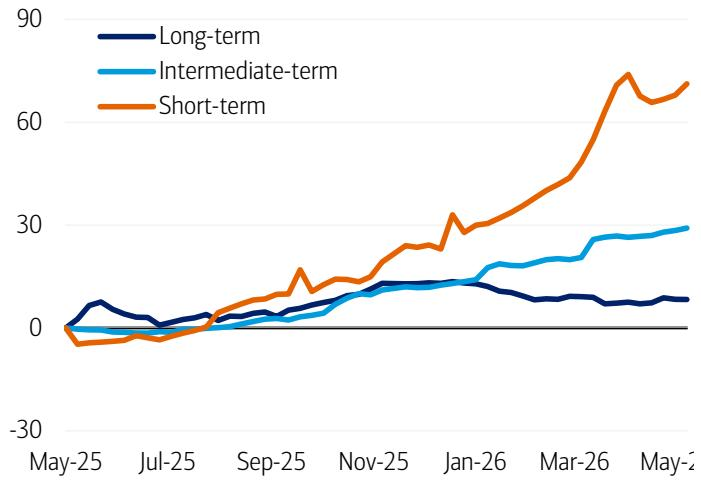

line

| Date   | Long-term | Intermediate-term | Short-term |
|--------|-----------|-------------------|------------|
| May-25 | 0         | 0                 | 0          |
| Jul-25 | 0         | 0                 | 0          |
| Sep-25 | 0         | 0                 | 10         |
| Nov-25 | 0         | 0                 | 20         |
| Jan-26 | 0         | 0                 | 30         |
| Mar-26 | 0         | 0                 | 50         |
| May-26 | 0         | 0                 | 70         |

BofA Global Research, EPFR   
BofA GLOBAL RESEARCH

# Exhibit 40: Total return FI fund performance vs benchmark

On the week, AUM weighted funds were in line with benchmark performance

<table><tr><td></td><td>AUM ($Bn)</td><td>May 14 &#x27;26</td><td>Vs. Agg</td><td>Last 4w</td><td>Vs. Agg</td></tr><tr><td>Vanguard Total Bond Market II Index Fund</td><td>372</td><td>-0.34%</td><td>-0.03%</td><td>-0.53%</td><td>-0.02%</td></tr><tr><td>Vanguard Total Bond Market Index Fund</td><td>236</td><td>-0.24%</td><td>0.08%</td><td>-0.53%</td><td>-0.01%</td></tr><tr><td>PIMCO Income fund</td><td>226</td><td>-0.45%</td><td>-0.14%</td><td>-0.60%</td><td>-0.09%</td></tr><tr><td>The Bond Fund of America</td><td>100</td><td>-0.36%</td><td>-0.05%</td><td>-0.56%</td><td>-0.05%</td></tr><tr><td>MetWest Total Return Bond Fund</td><td>29</td><td>-0.38%</td><td>-0.07%</td><td>-0.74%</td><td>-0.22%</td></tr><tr><td>PIMCO Total Return Fund</td><td>47</td><td>-0.48%</td><td>-0.16%</td><td>-0.66%</td><td>-0.14%</td></tr><tr><td>Dodge &amp; Cox Income Fund</td><td>108</td><td>-0.31%</td><td>0.00%</td><td>-0.62%</td><td>-0.11%</td></tr><tr><td>PGIM Total Return Bond Fund</td><td>53</td><td>-0.25%</td><td>0.07%</td><td>-0.49%</td><td>0.02%</td></tr><tr><td>BlackRock Strategic Income Opportunities Fund</td><td>48</td><td>0.19%</td><td>0.51%</td><td>0.57%</td><td>1.08%</td></tr><tr><td>Baird Aggregate Bond Fund</td><td>57</td><td>-0.30%</td><td>0.01%</td><td>-0.49%</td><td>0.02%</td></tr><tr><td>IPMorgan Core Bond Fund</td><td>52</td><td>-0.29%</td><td>0.02%</td><td>-0.61%</td><td>-0.09%</td></tr><tr><td>DoubleLine Total Return Bond Fund</td><td>31</td><td>-0.34%</td><td>-0.03%</td><td>-0.61%</td><td>-0.09%</td></tr><tr><td>Fidelity Series Investment Grade Bond Fund</td><td>37</td><td>-0.31%</td><td>0.00%</td><td>-0.56%</td><td>-0.05%</td></tr><tr><td>Fidelity Total Bond Fund</td><td>42</td><td>-0.23%</td><td>0.08%</td><td>-0.41%</td><td>0.11%</td></tr><tr><td>Western Asset Core Plus Bond Portfolio</td><td>4</td><td>-0.34%</td><td>-0.03%</td><td>-0.48%</td><td>0.03%</td></tr><tr><td>Baird Core Plus Bond Fund</td><td>45</td><td>-0.20%</td><td>0.12%</td><td>-0.35%</td><td>0.16%</td></tr><tr><td>John Hancock Bond Fund</td><td>23</td><td>-0.36%</td><td>-0.05%</td><td>-0.54%</td><td>-0.03%</td></tr><tr><td>TIAA-CREF Bond Index Fund</td><td>22</td><td>-0.34%</td><td>-0.02%</td><td>-0.62%</td><td>-0.11%</td></tr><tr><td>BlackRock Total Return Fund</td><td>18</td><td>-0.12%</td><td>0.20%</td><td>-0.26%</td><td>0.25%</td></tr><tr><td>IPMorgan Core Plus Bond Fund</td><td>25</td><td>-0.28%</td><td>0.04%</td><td>-0.37%</td><td>0.14%</td></tr><tr><td>Bridge Builder Core Bond Fund</td><td>28</td><td>-0.24%</td><td>0.07%</td><td>-0.54%</td><td>-0.03%</td></tr><tr><td>T Rowe Price New Income Fund</td><td>18</td><td>-0.17%</td><td>0.14%</td><td>-0.43%</td><td>0.08%</td></tr><tr><td>Western Asset Core Bond Fund</td><td>2</td><td>-0.38%</td><td>-0.07%</td><td>-0.50%</td><td>0.01%</td></tr><tr><td>CREF Bond Market Account</td><td>12</td><td>-0.27%</td><td>0.04%</td><td>-0.46%</td><td>0.05%</td></tr><tr><td>Fidelity Investment Grade Bond Fund</td><td>12</td><td>-0.20%</td><td>0.11%</td><td>-0.53%</td><td>-0.02%</td></tr><tr><td>DoubleLine Core Fixed Income Fund</td><td>7</td><td>-0.33%</td><td>-0.01%</td><td>-0.50%</td><td>0.01%</td></tr><tr><td>TCW Total Return Bond Fund</td><td>2</td><td>-0.39%</td><td>-0.07%</td><td>-0.64%</td><td>-0.13%</td></tr><tr><td>Janus Henderson Flexible Bond Fund</td><td>3</td><td>-0.37%</td><td>-0.06%</td><td>-0.53%</td><td>-0.02%</td></tr><tr><td>Weighted avg</td><td>1656</td><td>-0.31%</td><td>0.00%</td><td>-0.51%</td><td>0.00%</td></tr><tr><td>Agg</td><td></td><td>-0.31%</td><td></td><td>-0.51%</td><td></td></tr><tr><td>10y return</td><td></td><td>-0.96%</td><td></td><td>-1.70%</td><td></td></tr></table>

Source: BofA Global Research, Bloomberg, Note: Excess returns are fund total returns over Bloomberg BARC Agg Index   
BofA GLOBAL RESEARCH

Exhibit 41: Total return funds, excess return vs. 10y rate   
Weekly asset-weighted total returns for total return funds. Funds return in line with benchmark on the week   
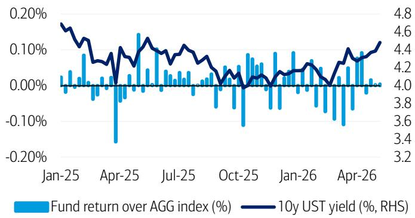

bar_line

| Date   | Fund return over AGG index (%) | 10y UST yield (%, RHS) |
|--------|--------------------------------|------------------------|
| Jan-25 | ~0.00%                         | ~4.8                   |
| Apr-25 | ~-0.20%                        | ~4.0                   |
| Jul-25 | ~0.00%                         | ~4.4                   |
| Oct-25 | ~-0.10%                        | ~4.2                   |
| Jan-26 | ~0.00%                         | ~4.4                   |
| Apr-26 | ~0.00%                         | ~4.6                   |

Source: BofA Global Research, Bloomberg, Note: Excess returns are fund total returns over Bloomberg BARC Agg index

BofA GLOBAL RESEARCH

Exhibit 43: UST beta from PCA regression (z-score)   
Betas suggest funds are underweight benchmark duration; lower beta = funds' underweight duration versus benchmark   
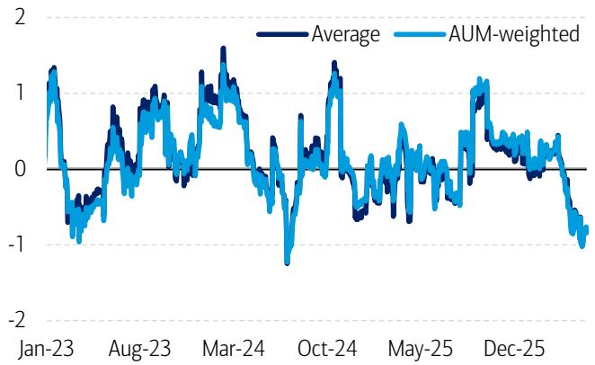

line

| Month   | Average | AUM-weighted |
|---------|---------|--------------|
| Jan-23  | 1.2     | 1.1          |
| Aug-23  | 0.8     | 0.7          |
| Mar-24  | 1.5     | 1.4          |
| Oct-24  | 1.3     | 1.2          |
| May-25  | 0.6     | 0.5          |
| Dec-25  | 0.3     | 0.2          |

Source: BofA Global Research, Bloomberg, Z-score calculated over fund beta differences vs Agg back to May 2015

BofA GLOBAL RESEARCH

Exhibit 45: Curve beta from PCA regression (z-score)   
Betas suggest funds are likely positioning for steepeners; higher beta = funds positioning for steepeners versus benchmark   
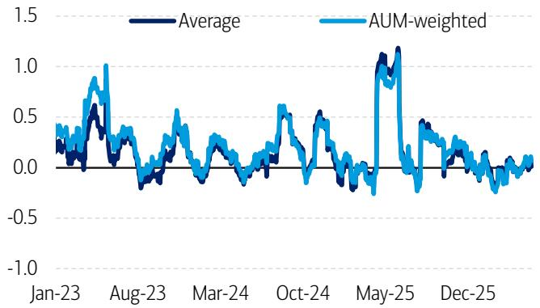

line

| Date   | Average | AUM-weighted |
|--------|---------|--------------|
| Jan-23 | 0.2     | 0.4          |
| Aug-23 | 0.6     | 1.0          |
| Mar-24 | 0.1     | 0.3          |
| Oct-24 | 0.5     | 0.6          |
| May-25 | 1.2     | 1.1          |
| Dec-25 | 0.1     | 0.2          |

Source: BofA Global Research, Bloomberg, Z-score calculated over fund beta differences vs Agg back to May 2015

BofA GLOBAL RESEARCH

Exhibit 42: Cumulative return of TR FI funds over benchmark vs 10yT   
Funds have modestly outperformed in recent months   
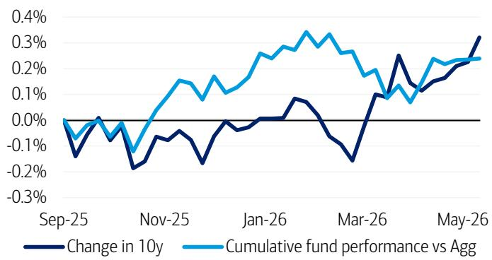

line

| Date   | Change in 10y | Cumulative fund performance vs Agg |
|--------|---------------|------------------------------------|
| Sep-25 | -0.1%         | 0.0%                               |
| Nov-25 | -0.2%         | 0.1%                               |
| Jan-26 | 0.0%          | 0.3%                               |
| Mar-26 | -0.2%         | 0.1%                               |
| May-26 | 0.3%          | 0.2%                               |

Source: BofA Global Research, Bloomberg, Note: Excess returns are fund total returns over Bloomberg BARC AGG index

BofA GLOBAL RESEARCH

Exhibit 44: WoW change in UST beta from PCA regression   
Funds' duration declined modestly on the week   
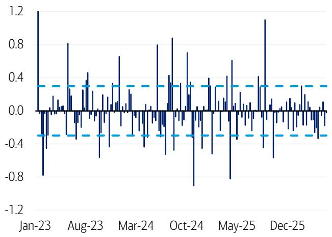

line

| Date    | Value |
|---------|-------|
| Jan-23  | 1.2   |
| Aug-23  | 0.8   |
| Mar-24  | 0.7   |
| Oct-24  | 0.8   |
| May-25  | 0.7   |
| Dec-25  | 1.2   |

Source: BofA Global Research, Bloomberg; WoW changes calculated from average fund beta

BofA GLOBAL RESEARCH

Exhibit 46: WoW change in curve beta from PCA regression   
Curve bias little changed on the week   
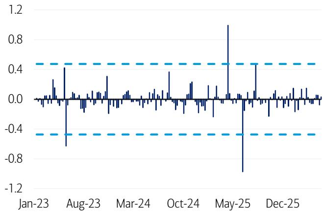

line

| Date    | Value |
|---------|-------|
| Jan-23  | 0.0   |
| Aug-23  | -0.7  |
| Mar-24  | 0.0   |
| Oct-24  | 0.4   |
| May-25  | 1.0   |
| Dec-25  | 0.0   |

Source: BofA Global Research, Bloomberg; WoW changes calculated from average fund beta

BofA GLOBAL RESEARCH

Exhibit 47: MBS beta from PCA regression (z-score)   
Betas suggest funds are overweight MBS; higher beta = funds overweight MBS versus benchmark   
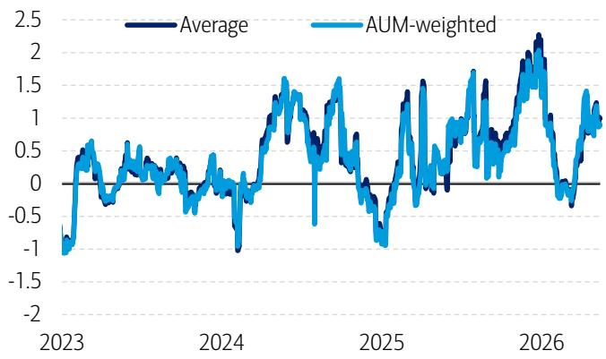

line

| Year | Average | AUM-weighted |
|------|---------|--------------|
| 2023 | -1.0    | -1.0         |
| 2024 | 0.0     | 0.0          |
| 2025 | 1.5     | 1.5          |
| 2026 | 2.0     | 2.0          |

Source: BofA Global Research, Bloomberg, Z-score calculated over fund beta differences vs Agg back to May 2015

BofA GLOBAL RESEARCH

Exhibit 48: IG beta from PCA regression (z-score)   
Betas suggest funds have added IG risk vs benchmark; lower beta = funds underweight IG versus benchmark   
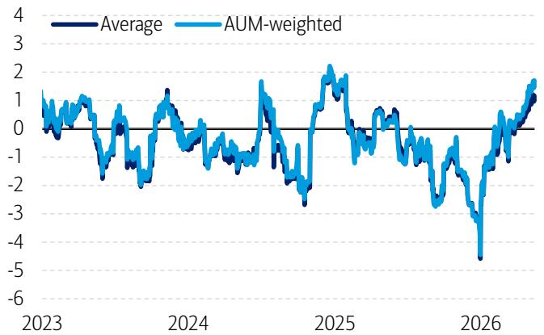

line

| Year | Average | AUM-weighted |
|------|---------|--------------|
| 2023 | ~0.5    | ~1.0         |
| 2024 | ~-1.0   | ~-0.5        |
| 2025 | ~-2.5   | ~2.0         |
| 2026 | ~-5.0   | ~-4.5        |

Source: BofA Global Research, Bloomberg, Z-score calculated over fund beta differences vs Agg

BofA GLOBAL RESEARCH

Exhibit 49: Bloomberg US Aggregate Bond Fund – Treasury share through time   
US Treasury's share at 46% on the week   
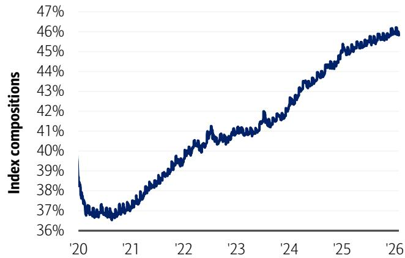

line

| Year | Index compositions |
| ---- | ------------------ |
| '20  | 39%                |
| '21  | 37%                |
| '22  | 40%                |
| '23  | 41%                |
| '24  | 43%                |
| '25  | 45%                |
| '26  | 46%                |

Source: BofA Global research, Bloomberg

BofA GLOBAL RESEARCH

Exhibit 50: Bloomberg US Aggregate Bond Fund – MBS and Corporate share through time   
US corporate and MBS shares have slowly trended lower   
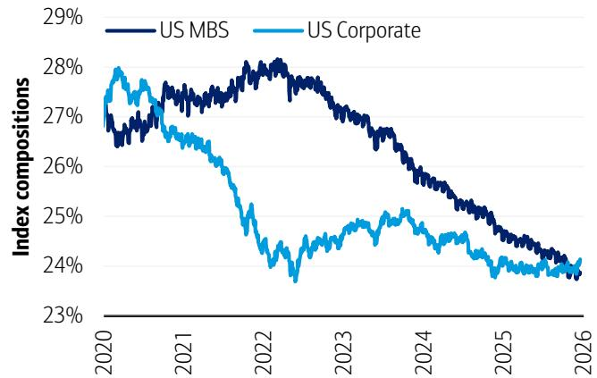

line

| Year | US MBS | US Corporate |
|------|--------|--------------|
| 2020 | 27%    | 28%          |
| 2021 | 27%    | 26%          |
| 2022 | 28%    | 24%          |
| 2023 | 27%    | 25%          |
| 2024 | 26%    | 25%          |
| 2025 | 25%    | 24%          |
| 2026 | 24%    | 24%          |

Source: BofA Global research, Bloomberg

BofA GLOBAL RESEARCH

# Bank balance sheets

Exhibit 51: Changes to bank balance sheet assets (\$bn)

Bank total assets increased in the week, driven by predominantly foreign activity as foreign cash net positive vs others

<table><tr><td colspan="2"></td><td>Current (May 06 &#x27;26)</td><td>1w change</td><td>Rolling 4w avg wkly chg</td><td>Rolling 8w avg wkly chg</td><td>Rolling 12w avg wkly chg</td><td>Rolling 52w avg wkly chg</td></tr><tr><td rowspan="6">All ($bn, NSA)</td><td>Total Assets</td><td>25341</td><td>35</td><td>5</td><td>33</td><td>39</td><td>26</td></tr><tr><td>Cash</td><td>3068</td><td>80</td><td>-24</td><td>0</td><td>5</td><td>-3</td></tr><tr><td>UST &amp; Agency</td><td>2007</td><td>-1</td><td>-1</td><td>-4</td><td>0</td><td>3</td></tr><tr><td>MBS</td><td>2731</td><td>10</td><td>0</td><td>0</td><td>1</td><td>1</td></tr><tr><td>Loans and Leases</td><td>13759</td><td>0</td><td>23</td><td>29</td><td>23</td><td>18</td></tr><tr><td>Other</td><td>3776</td><td>-53</td><td>8</td><td>8</td><td>9</td><td>7</td></tr><tr><td rowspan="6">Large Domestic ($bn, NSA)</td><td>Total Assets</td><td>15039</td><td>22</td><td>13</td><td>19</td><td>24</td><td>19</td></tr><tr><td>Cash</td><td>1383</td><td>21</td><td>-3</td><td>-6</td><td>0</td><td>1</td></tr><tr><td>UST &amp; Agency</td><td>1611</td><td>1</td><td>-1</td><td>-3</td><td>0</td><td>2</td></tr><tr><td>MBS</td><td>2013</td><td>-1</td><td>-1</td><td>-1</td><td>0</td><td>0</td></tr><tr><td>Loans and Leases</td><td>7739</td><td>4</td><td>16</td><td>19</td><td>14</td><td>11</td></tr><tr><td>Other</td><td>2293</td><td>-2</td><td>2</td><td>10</td><td>9</td><td>5</td></tr><tr><td rowspan="6">Small Domestic ($bn, NSA)</td><td>Total Assets</td><td>6819</td><td>-3</td><td>-6</td><td>2</td><td>5</td><td>6</td></tr><tr><td>Cash</td><td>481</td><td>-4</td><td>-10</td><td>-6</td><td>-1</td><td>0</td></tr><tr><td>UST &amp; Agency</td><td>248</td><td>-1</td><td>0</td><td>0</td><td>0</td><td>0</td></tr><tr><td>MBS</td><td>657</td><td>4</td><td>0</td><td>1</td><td>1</td><td>1</td></tr><tr><td>Loans and leases</td><td>4659</td><td>-1</td><td>4</td><td>5</td><td>5</td><td>4</td></tr><tr><td>Other</td><td>775</td><td>0</td><td>1</td><td>1</td><td>1</td><td>0</td></tr><tr><td rowspan="6">All Domestic ($bn, NSA)</td><td>Total Assets</td><td>21859</td><td>20</td><td>8</td><td>21</td><td>29</td><td>25</td></tr><tr><td>Cash</td><td>1864</td><td>16</td><td>-14</td><td>-11</td><td>-1</td><td>2</td></tr><tr><td>UST &amp; Agency</td><td>1859</td><td>0</td><td>-1</td><td>-2</td><td>0</td><td>2</td></tr><tr><td>MBS</td><td>2670</td><td>3</td><td>-1</td><td>0</td><td>1</td><td>1</td></tr><tr><td>Loans and leases</td><td>12398</td><td>3</td><td>20</td><td>24</td><td>19</td><td>15</td></tr><tr><td>Other</td><td>3068</td><td>-3</td><td>3</td><td>11</td><td>10</td><td>6</td></tr><tr><td rowspan="6">Foreign ($bn, NSA)</td><td>Total Assets</td><td>3482</td><td>15</td><td>-3</td><td>11</td><td>10</td><td>1</td></tr><tr><td>Cash</td><td>1205</td><td>64</td><td>-11</td><td>11</td><td>6</td><td>-4</td></tr><tr><td>UST &amp; Agency</td><td>147</td><td>-1</td><td>-1</td><td>-1</td><td>0</td><td>0</td></tr><tr><td>MBS</td><td>62</td><td>7</td><td>1</td><td>0</td><td>1</td><td>0</td></tr><tr><td>Loans and leases</td><td>1361</td><td>-4</td><td>2</td><td>5</td><td>4</td><td>3</td></tr><tr><td>Other</td><td>708</td><td>-50</td><td>5</td><td>-3</td><td>-1</td><td>1</td></tr></table>

Source: BofA Global Research, Federal Reserve, Bloomberg   
BofA GLOBAL RESEARCH

Exhibit 52: Select bank balance sheet liabilities (\$bn, NSA)

Week ending May 6 saw modest increase in large domestic deposits and foreign other borrowings

<table><tr><td colspan="2"></td><td>Current (May 06 &#x27;26)</td><td>1w change</td><td>Rolling 4w avg wkly chg</td><td>Rolling 8w avg wkly chg</td><td>Rolling 12w avg wkly chg</td><td>Rolling 52w avg wkly chg</td></tr><tr><td rowspan="5">Deposits ($bn, NSA)</td><td>All</td><td>19110</td><td>70</td><td>-29</td><td>18</td><td>30</td><td>21</td></tr><tr><td>Domestic</td><td>17632</td><td>63</td><td>-37</td><td>10</td><td>28</td><td>20</td></tr><tr><td>Large Domestic</td><td>12050</td><td>59</td><td>-24</td><td>10</td><td>25</td><td>15</td></tr><tr><td>Small Domestic</td><td>5582</td><td>4</td><td>-13</td><td>-1</td><td>3</td><td>5</td></tr><tr><td>Foreign</td><td>1478</td><td>7</td><td>8</td><td>9</td><td>2</td><td>1</td></tr><tr><td rowspan="5">Other borrowing ($bn, NSA)</td><td>All</td><td>2397</td><td>102</td><td>45</td><td>22</td><td>13</td><td>2</td></tr><tr><td>Domestic</td><td>1407</td><td>8</td><td>33</td><td>13</td><td>6</td><td>1</td></tr><tr><td>Large Domestic</td><td>1093</td><td>3</td><td>27</td><td>9</td><td>3</td><td>1</td></tr><tr><td>Small Domestic</td><td>315</td><td>5</td><td>6</td><td>3</td><td>2</td><td>0</td></tr><tr><td>Foreign</td><td>990</td><td>94</td><td>12</td><td>9</td><td>7</td><td>1</td></tr></table>

Source: BofA Global Research, Federal Reserve, Bloomberg   
BofA GLOBAL RESEARCH

Exhibit 53: YoY change in securities, loans, and deposits   
Securities growth usually only positive when deposit growth is positive   
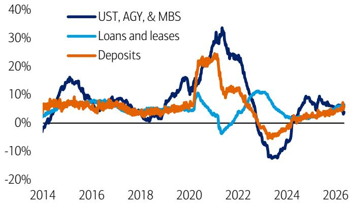

line

| Year | UST, AGY, & MBS | Loans and leases | Deposits |
|------|-----------------|------------------|----------|
| 2014 | ~0%             | ~0%              | ~5%      |
| 2016 | ~15%            | ~5%              | ~5%      |
| 2018 | ~0%             | ~0%              | ~0%      |
| 2020 | ~15%            | ~5%              | ~10%     |
| 2022 | ~35%            | ~0%              | ~25%     |
| 2024 | ~-15%           | ~5%              | ~0%      |
| 2026 | ~5%             | ~5%              | ~5%      |

Source: BofA Global Research, Bloomberg, Federal Reserve   
BofA GLOBAL RESEARCH

Exhibit 55: 3m5y curve (bps) & YoY securities growth   
Securities portfolios tend to grow when curve is upward sloping   
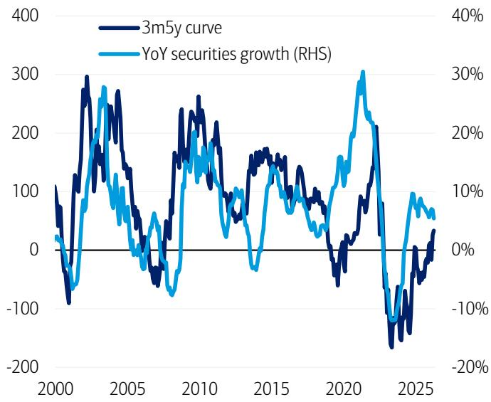

line

| Year | 3m5y curve | YoY securities growth (RHS) |
|------|------------|-----------------------------|
| 2000 | ~100       | ~0%                         |
| 2005 | ~280       | ~15%                        |
| 2010 | ~250       | ~10%                        |
| 2015 | ~150       | ~5%                         |
| 2020 | ~100       | ~15%                        |
| 2025 | ~30        | ~5%                         |

Source: BofA Global Research, Federal Reserve   
BofA GLOBAL RESEARCH

Exhibit 54: Domestic bank holdings of UST& Agy, MBS (\$bn)   
Domestic banks' UST & AGY holdings have seen a faster pace of increase in recent months while MBS has been relatively flat   
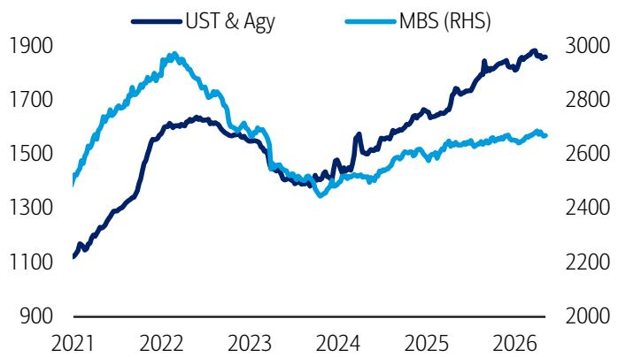

line

| Year | UST & Agy | MBS (RHS) |
|------|-----------|-----------|
| 2021 | 1100      | 2400      |
| 2022 | 1600      | 2800      |
| 2023 | 1500      | 2600      |
| 2024 | 1400      | 2500      |
| 2025 | 1700      | 2600      |
| 2026 | 1900      | 2700      |

Source: BofA Global Research, Bloomberg, Federal Reserve   
BofA GLOBAL RESEARCH

Exhibit 56: Cumulative change in domestic bank holdings of UST & Agency, MBS (\$bn)   
Domestic bank UST & AGY holdings are notably higher vs MBS since Feb '25   
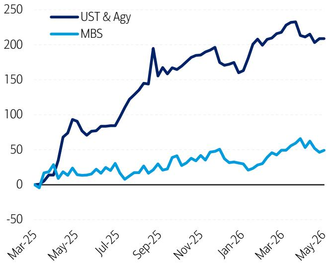

line

| Date   | UST & Agy | MBS  |
|--------|-----------|------|
| Mar-25 | 0         | 0    |
| May-25 | 90        | 10   |
| Jul-25 | 80        | 20   |
| Sep-25 | 190       | 30   |
| Nov-25 | 180       | 40   |
| Jan-26 | 160       | 30   |
| Mar-26 | 230       | 50   |
| May-26 | 210       | 45   |

Source: BofA Global Research, Bloomberg, Federal Reserve   
BofA GLOBAL RESEARCH

# Primary dealer balance sheet

Exhibit 57: Dealers WoW change in positions   
Holdings have increased notably at long end across cash & futures   
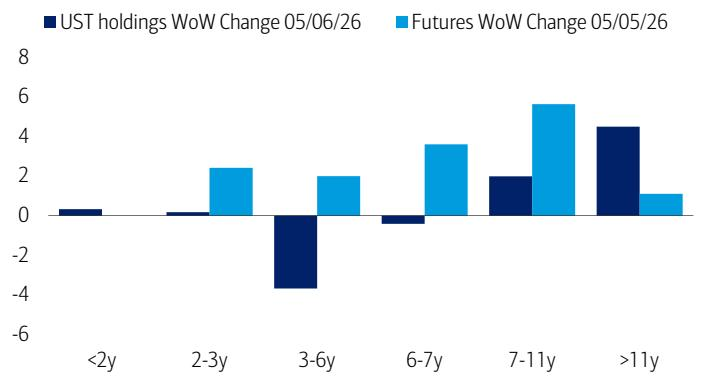

bar

| Category | UST holdings WoW Change 05/06/26 | Futures WoW Change 05/05/26 |
|---|---|---|
| <2y | 0.2 | 0.0 |
| 2-3y | -0.1 | 2.4 |
| 3-6y | -3.8 | 1.9 |
| 6-7y | -0.5 | 3.6 |
| 7-11y | 1.9 | 5.7 |
| >11y | 4.5 | 1.0 |

Source: BofA Global Research, NY Fed, CFTC   
BofA GLOBAL RESEARCH

Exhibit 58: Dealers change in positions over last 6 months   
Long-end futures holdings have increased meaningfully   
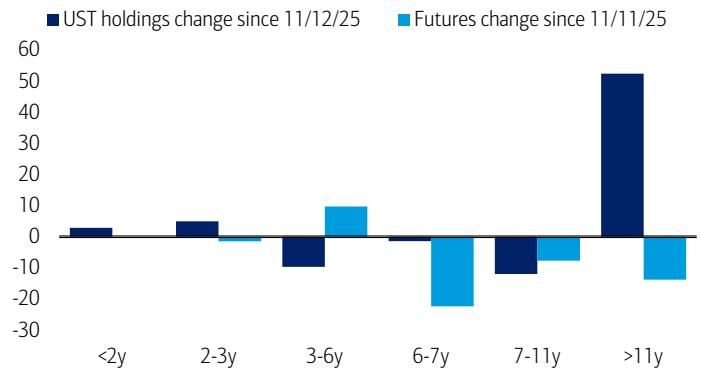

bar

| Maturity | UST holdings change since 11/12/25 | Futures change since 11/11/25 |
| -------- | ------------------------------------ | ----------------------------- |
| <2y      | 2                                    | -                             |
| 2-3y     | 4                                    | -1                            |
| 3-6y     | -8                                   | 9                             |
| 6-7y     | -1                                   | -22                           |
| 7-11y    | -10                                  | -4                            |
| >11y     | 52                                   | -14                           |

Source: BofA Global Research, NY Fed, CFTC   
BofA GLOBAL RESEARCH

Exhibit 59: Dealers total sector positions   
10y equivalent, \$bn, short futures positions coincide with long Treasury security holdings.   
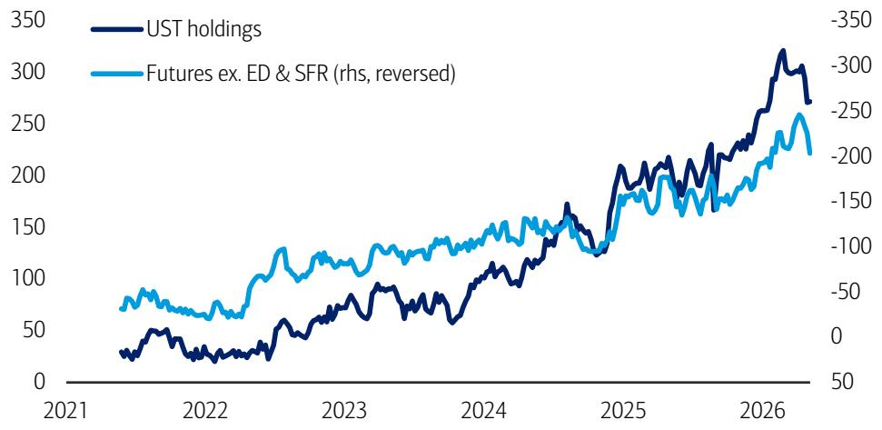

line

| Year | UST holdings | Futures ex. ED & SFR (rhs, reversed) |
|------|---------------|--------------------------------------|
| 2021 | ~30           | ~70                                  |
| 2022 | ~40           | ~80                                  |
| 2023 | ~90           | ~130                                 |
| 2024 | ~110          | ~150                                 |
| 2025 | ~200          | ~180                                 |
| 2026 | ~320          | ~250                                 |

Source: BofA Global Research, NY Fed, CFTC, Note: futures on RHS axis   
BofA GLOBAL RESEARCH

# Auction statistics

Exhibit 60: Auction summary statistics   
Z-score calculated on levels, Investment fund participation in auctions remains robust 

<table><tr><td colspan="2"></td><td>Primary Dealer</td><td>Indirect Bidder</td><td>Direct Bidder</td><td>Investment Fund</td><td>Foreign</td><td>Depository Institution</td></tr><tr><td rowspan="3">2y</td><td>Apr 30 &#x27;26</td><td>11.9%</td><td>56.5%</td><td>31.6%</td><td>72.9%</td><td>13.3%</td><td>0.0%</td></tr><tr><td>MoM Change</td><td>-12.2%</td><td>-2.9%</td><td>15.1%</td><td>8.7%</td><td>4.5%</td><td>0.0%</td></tr><tr><td>1Y Z-score</td><td>-0.1</td><td>-0.4</td><td>0.3</td><td>0.2</td><td>-0.1</td><td>-0.3</td></tr><tr><td rowspan="3">3y</td><td>Apr 15 &#x27;26</td><td>13.3%</td><td>74.8%</td><td>11.9%</td><td>73.8%</td><td>11.8%</td><td>0.0%</td></tr><tr><td>MoM Change</td><td>-6.2%</td><td>15.0%</td><td>-8.8%</td><td>10.1%</td><td>-2.2%</td><td>0.0%</td></tr><tr><td>1Y Z-score</td><td>-0.1</td><td>1.4</td><td>-1.4</td><td>0.6</td><td>-0.2</td><td>-0.7</td></tr><tr><td rowspan="3">5y</td><td>Apr 30 &#x27;26</td><td>12.7%</td><td>15.0%</td><td>72.3%</td><td>73.1%</td><td>12.0%</td><td>0.0%</td></tr><tr><td>MoM Change</td><td>-2.9%</td><td>-7.5%</td><td>10.4%</td><td>4.3%</td><td>-1.1%</td><td>0.0%</td></tr><tr><td>1Y Z-score</td><td>0.8</td><td>-1.7</td><td>1.5</td><td>0.3</td><td>-0.8</td><td>-0.3</td></tr><tr><td rowspan="3">7y</td><td>Apr 30 &#x27;26</td><td>11.6%</td><td>58.4%</td><td>30.0%</td><td>72.8%</td><td>13.2%</td><td>0.1%</td></tr><tr><td>MoM Change</td><td>-0.8%</td><td>-4.2%</td><td>5.0%</td><td>3.8%</td><td>-2.6%</td><td>0.1%</td></tr><tr><td>1Y Z-score</td><td>0.3</td><td>-0.8</td><td>0.7</td><td>0.4</td><td>-0.7</td><td>-0.2</td></tr><tr><td rowspan="3">10y</td><td>Apr 15 &#x27;26</td><td>10.8%</td><td>65.3%</td><td>23.9%</td><td>72.1%</td><td>14.8%</td><td>0.0%</td></tr><tr><td>MoM Change</td><td>-1.9%</td><td>-9.2%</td><td>11.1%</td><td>6.5%</td><td>-2.9%</td><td>-1.3%</td></tr><tr><td>1Y Z-score</td><td>0.2</td><td>-0.8</td><td>0.7</td><td>0.9</td><td>-1.1</td><td>-0.4</td></tr><tr><td rowspan="3">20y</td><td>Apr 30 &#x27;26</td><td>9.7%</td><td>67.4%</td><td>22.9%</td><td>74.7%</td><td>12.4%</td><td>0.0%</td></tr><tr><td>MoM Change</td><td>0.5%</td><td>-1.8%</td><td>1.3%</td><td>2.8%</td><td>-3.5%</td><td>0.0%</td></tr><tr><td>1Y Z-score</td><td>-0.6</td><td>0.6</td><td>-0.1</td><td>0.4</td><td>0.2</td><td>0.0</td></tr><tr><td rowspan="3">30y</td><td>Apr 15 &#x27;26</td><td>11.6%</td><td>64.1%</td><td>24.2%</td><td>74.6%</td><td>10.5%</td><td>0.0%</td></tr><tr><td>MoM Change</td><td>2.2%</td><td>0.7%</td><td>-3.0%</td><td>-2.5%</td><td>-1.0%</td><td>0.0%</td></tr><tr><td>1Y Z-score</td><td>0.0</td><td>0.0</td><td>0.0</td><td>0.7</td><td>-0.9</td><td>-0.3</td></tr></table>

Source: BofA Global Research, Treasury   
BofA GLOBAL RESEARCH

Exhibit 61: Primary dealer – average auction allotment   
Dealer participation remains low   
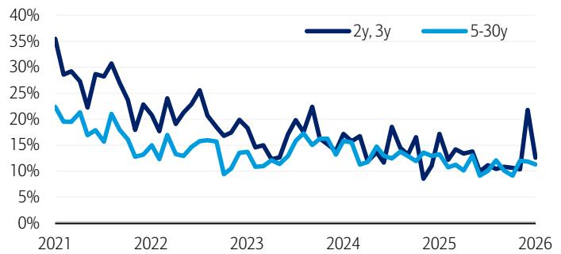

line

| Year | 2y, 3y | 5-30y |
|------|--------|-------|
| 2021 | ~35%   | ~20%  |
| 2022 | ~25%   | ~15%  |
| 2023 | ~15%   | ~10%  |
| 2024 | ~18%   | ~12%  |
| 2025 | ~10%   | ~8%   |
| 2026 | ~22%   | ~10%  |

BofA Global Research, Treasury   
BofA GLOBAL RESEARCH

Exhibit 63: Avg foreign investment at auction (all nominal coupons)   
Foreign participation increased modestly   
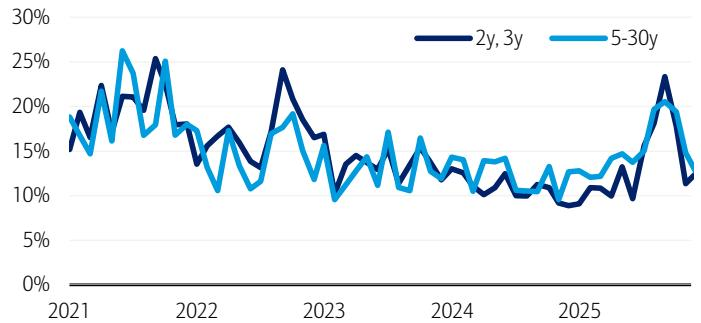

line

| Year | 2y, 3y | 5-30y |
|------|--------|-------|
| 2021 | ~18%   | ~16%  |
| 2022 | ~17%   | ~15%  |
| 2023 | ~24%   | ~19%  |
| 2024 | ~13%   | ~14%  |
| 2025 | ~10%   | ~13%  |

BofA Global Research, Treasury   
BofA GLOBAL RESEARCH

Exhibit 62: Investment fund – average auction allotment   
Fund participation remains elevated   
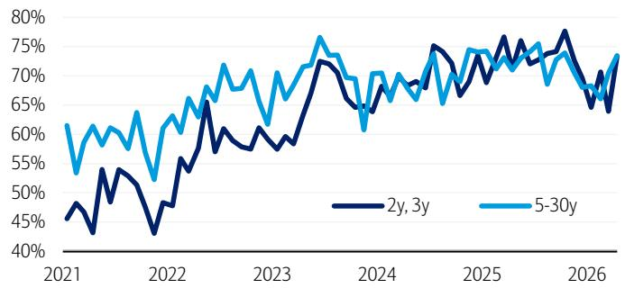

line

| Year | 2y, 3y | 5-30y |
|------|--------|-------|
| 2021 | 45%    | 60%   |
| 2022 | 40%    | 55%   |
| 2023 | 60%    | 70%   |
| 2024 | 65%    | 75%   |
| 2025 | 70%    | 75%   |
| 2026 | 65%    | 70%   |

BofA Global Research, Treasury   
BofA GLOBAL RESEARCH

Exhibit 64: Depository institutions – average auction allotment   
Depository participation is lower   
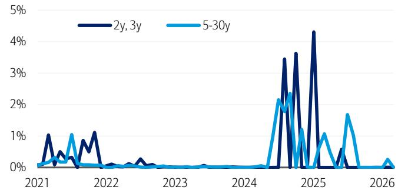

line

| Year | 2y, 3y | 5-30y |
|------|--------|-------|
| 2021 | ~1.0%  | ~0.1% |
| 2022 | ~1.1%  | ~0.1% |
| 2023 | ~0.1%  | ~0.1% |
| 2024 | ~0.1%  | ~0.1% |
| 2025 | ~4.3%  | ~1.7% |
| 2026 | ~0.1%  | ~0.1% |

BofA Global Research, Treasury   
BofA GLOBAL RESEARCH

# Pensions

Exhibit 65: DB private pension fixed income allocation from Flow of Funds and smaller Milliman subset   
Milliman funds have higher fixed income share of assets vs broader private DB pension funds according to FoF   
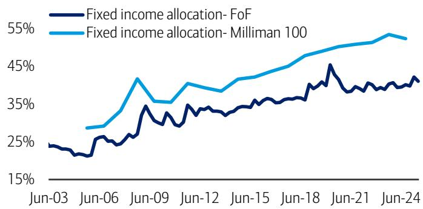

line

| Date   | Fixed income allocation- FoF | Fixed income allocation- Milliman 100 |
|--------|------------------------------|----------------------------------------|
| Jun-03 | ~22%                         | ~25%                                   |
| Jun-06 | ~25%                         | ~28%                                   |
| Jun-09 | ~30%                         | ~40%                                   |
| Jun-12 | ~32%                         | ~35%                                   |
| Jun-15 | ~34%                         | ~38%                                   |
| Jun-18 | ~36%                         | ~42%                                   |
| Jun-21 | ~45%                         | ~45%                                   |
| Jun-24 | ~40%                         | ~50%                                   |

Source: BofA Global Research, Milliman, Federal Reserve   
BofA GLOBAL RESEARCH

Exhibit 67: Milliman index and 12-month increase in USTs held in stripped form   
Stripping activity has moderated from end '24 peak while Milliman funds are still well funded   
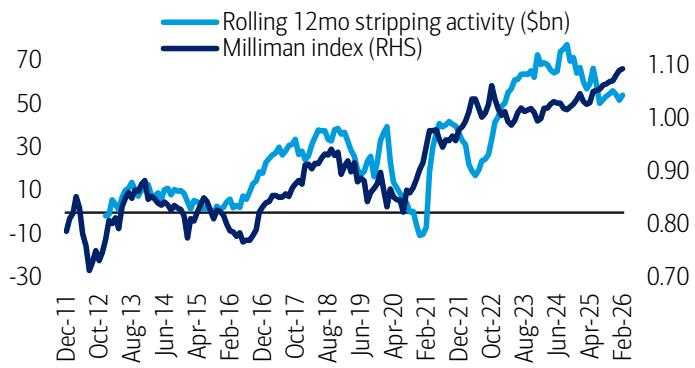

line

| Date    | Rolling 12mo stripping activity ($bn) | Milliman index (RHS) |
|---------|----------------------------------------|----------------------|
| Dec-11  | -10                                    | 0.80                 |
| Oct-12  | -5                                     | 0.70                 |
| Aug-13  | 10                                     | 0.85                 |
| Jun-14  | 5                                      | 0.90                 |
| Apr-15  | 10                                     | 0.85                 |
| Feb-16  | 5                                      | 0.80                 |
| Dec-16  | 10                                     | 0.85                 |
| Oct-17  | 20                                     | 0.90                 |
| Aug-18  | 30                                     | 0.95                 |
| Jun-19  | 25                                     | 0.90                 |
| Apr-20  | 35                                     | 0.85                 |
| Feb-21  | -10                                    | 0.80                 |
| Dec-21  | 30                                     | 0.90                 |
| Oct-22  | 40                                     | 1.00                 |
| Aug-23  | 50                                     | 1.05                 |
| Jun-24  | 60                                     | 1.10                 |
| Apr-25  | 55                                     | 1.05                 |
| Feb-26  | 50                                     | 1.10                 |

Source: BofA Global Research, Bloomberg   
BofA GLOBAL RESEARCH

Exhibit 69: UST holdings of private DB pensions and funded status   
When funded status is higher, pension funds buy more USTs   
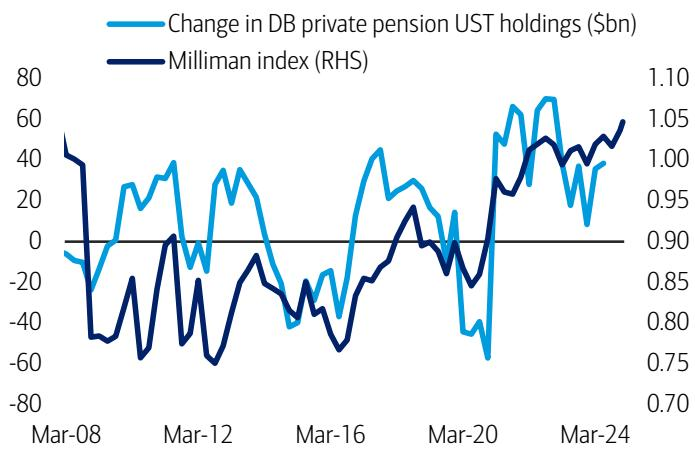

line

| Date   | Change in DB private pension UST holdings ($bn) | Milliman index (RHS) |
|--------|--------------------------------------------------|----------------------|
| Mar-08 | -20                                              | 1.10                 |
| Mar-12 | 30                                               | 0.90                 |
| Mar-16 | -40                                              | 0.85                 |
| Mar-20 | 60                                               | 0.95                 |
| Mar-24 | 40                                               | 1.05                 |

Source: BofA Global Research, Bloomberg, Federal Reserve   
BofA GLOBAL RESEARCH

Exhibit 66: 10y UST yield and Milliman pension funded index   
Funded status historically improves with an increase in interest rates   
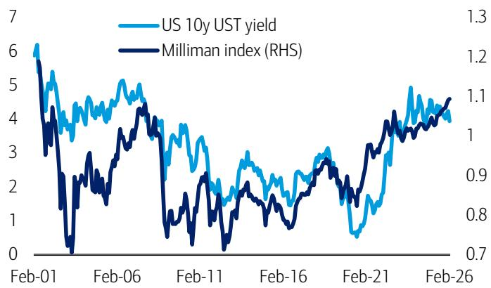

line

| Date   | US 10y UST yield | Milliman index (RHS) |
|--------|------------------|----------------------|
| Feb-01 | ~6.0             | ~1.2                 |
| Feb-06 | ~5.0             | ~0.8                 |
| Feb-11 | ~3.5             | ~0.7                 |
| Feb-16 | ~3.0             | ~0.9                 |
| Feb-21 | ~4.5             | ~1.0                 |
| Feb-26 | ~4.0             | ~1.1                 |

Source: BofA Global Research, Bloomberg   
BofA GLOBAL RESEARCH

Exhibit 68: Change in USTs held in stripped form (\$bn)   
UST stripping activity below average in April   
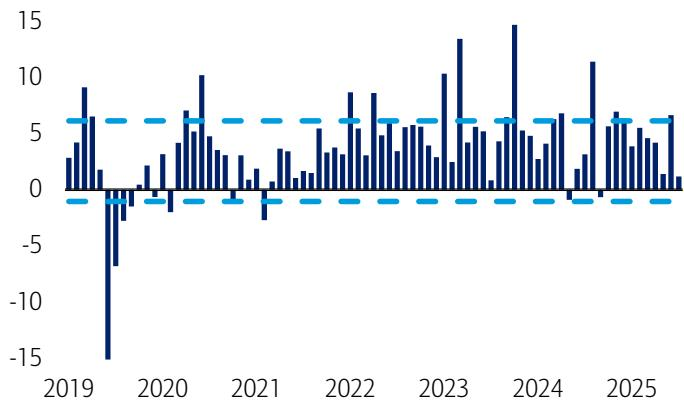

bar

| Year | Value |
|------|-------|
| 2019 | 3.0   |
| 2019 | 9.0   |
| 2019 | -14.0 |
| 2019 | -7.0  |
| 2019 | -1.0  |
| 2019 | 0.0   |
| 2019 | 1.0   |
| 2019 | 2.0   |
| 2019 | 3.0   |
| 2019 | 4.0   |
| 2019 | 5.0   |
| 2019 | 6.0   |
| 2019 | 7.0   |
| 2019 | 8.0   |
| 2019 | 9.0   |
| 2019 | 10.0  |
| 2019 | 11.0  |
| 2019 | 12.0  |
| 2019 | 13.0  |
| 2019 | 14.0  |
| 2019 | 15.0  |
| 2020 | -1.0  |
| 2020 | -2.0  |
| 2020 | -3.0  |
| 2020 | -4.0  |
| 2020 | -5.0  |
| 2020 | -6.0  |
| 2020 | -7.0  |
| 2020 | -8.0  |
| 2020 | -9.0  |
| 2020 | -10.0 |
| 2020 | -11.0 |
| 2020 | -12.0 |
| 2020 | -13.0 |
| 2021 | -1.0  |
| 2021 | -2.0  |
| 2021 | -3.0  |
| 2021 | -4.0  |
| 2021 | -5.0  |
| 2021 | -6.0  |
| 2021 | -7.0  |
| 2021 | -8.0  |
| 2021 | -9.0  |
| 2021 | -10.0 |
| 2021 | -11.0 |
| 2021 | -12.0 |
| 2022 | -1.0  |
| 2022 | -2.0  |
| 2022 | -3.0  |
| 2022 | -4.0  |
| 2022 | -5.0  |
| 2022 | -6.0  |
| 2022 | -7.0  |
| 2022 | -8.0  |
| 2022 | -9.0  |
| 2022 | -10.0 |
| 2022 | -11.0 |
| 2023 | -1.0  |
| 2023 | -2.0  |
| 2023 | -3.0  |
| 2023 | -4.0  |
| 2023 | -5.0  |
| 2023 | -6.0  |
| 2023 | -7.0  |
| 2023 | -8.0  |
| 2023 | -9.0  |
| 2023 | -10.0 |
| 2023 | -11.0 |
| 2024 | -1.0  |
| 2024 | -2.0  |
| 2024 | -3.0  |
| 2024 | -4.0  |
| 2024 | -5.0  |
| 2024 | -6.0  |
| 2024 | -7.0  |
| 2024 | -8.0  |
| 2024 | -9.0  |
| 2024 | -10.0 |
| 2024 | -11.0 |
| 2025 | -1.0  |
| 2025 | -2.0  |
| 2025 | -3.0  |
| 2025 | -4.0  |
| 2025 | -5.0  |
| 2025 | -6.0  |
| 2025 | -7.0  |
| 2025 | -8.0  |
| 2025 | -9.0  |
| 2025 | -10.0 |
|
| 2025 | -11.0 |

Source: BofA Global Research, Note: dashed line is 1stdev over last 15y   
BofA GLOBAL RESEARCH

# Appendix

# A.1. Reference for futures positioning proxy

# Exhibit 70: How to read futures positioning proxies (OI = open interest)

Change in direction in OI & rates give insights to change in positioning

Direction of OI 

<table><tr><td>OI up</td><td>Rates up</td><td>Shorts created</td></tr><tr><td>OI up</td><td>Rates down</td><td>Longs created</td></tr><tr><td>OI down</td><td>Rates up</td><td>Longs destroyed</td></tr><tr><td>OI down</td><td>Rates down</td><td>Shorts destroyed</td></tr></table>

Source: BofA Global Research   
BofA GLOBAL RESEARCH

Indicator

# A.2. Positioning signals versus history

Below we compare the signals from various positioning metrics historically. We find that the fund regression tends to move largely in a trend-like fashion: when positioning is stretched long, rates tend to rally in subsequent months. By contrast, our futures positioning proxy is more contrarian for duration: when the net out of the money position is long, rates tend to sell off in subsequent months. CTA betas don't show a strong relationship to future curve or duration moves.

# Exhibit 71: Summary of positioning indicator historical signals

Signal is based on qualitative assessment of historical rates & curve moves versus positioning indicator over 5y history

<table><tr><td></td><td>Duration</td><td>Curve</td></tr><tr><td>Fund regression</td><td>Follower</td><td>Follower</td></tr><tr><td>CTA beta</td><td>No signal</td><td>No signal</td></tr><tr><td>Futures proxy</td><td>Modest contrarian</td><td>No signal</td></tr><tr><td>CFTC asset manager</td><td>Follower</td><td>Modest contrarian</td></tr><tr><td>CFTC non-commercial</td><td>Modest contrarian</td><td>No signal</td></tr><tr><td>CFTC non-commercial ex-leveraged fund</td><td>Follower</td><td>Modest contrarian</td></tr></table>

Source: BofA Global Research   
BofA GLOBAL RESEARCH

Note: tables below compare the 10y rate move and 2s10s curve change in bps versus average using 5y history

# Exhibit 72: US Agg fund PCA: duration

Largely a trend following signal; when positioning is short rates generally increase over subsequent months

<table><tr><td></td><td>1m</td><td>2m</td><td>3m</td><td>4m</td><td>5m</td><td>6m</td></tr><tr><td colspan="7">Realized less average (bps)</td></tr><tr><td>&lt;10</td><td>-3</td><td>-4</td><td>2</td><td>16</td><td>24</td><td>23</td></tr><tr><td>10 to 20</td><td>19</td><td>37</td><td>43</td><td>36</td><td>35</td><td>41</td></tr><tr><td>20 to 30</td><td>16</td><td>25</td><td>26</td><td>33</td><td>34</td><td>27</td></tr><tr><td>30 to 40</td><td>12</td><td>15</td><td>22</td><td>27</td><td>28</td><td>28</td></tr><tr><td>40 to 50</td><td>-2</td><td>3</td><td>5</td><td>4</td><td>6</td><td>5</td></tr><tr><td>50 to 60</td><td>-9</td><td>-3</td><td>-5</td><td>1</td><td>8</td><td>17</td></tr><tr><td>60 to 70</td><td>-9</td><td>-15</td><td>-23</td><td>-36</td><td>-39</td><td>-26</td></tr><tr><td>70 to 80</td><td>-10</td><td>-23</td><td>-26</td><td>-39</td><td>-48</td><td>-48</td></tr><tr><td>80 to 90</td><td>-17</td><td>-28</td><td>-43</td><td>-58</td><td>-65</td><td>-88</td></tr><tr><td>90 to 100</td><td>3</td><td>-11</td><td>-11</td><td>-5</td><td>-9</td><td>-25</td></tr><tr><td colspan="7">z-score</td></tr><tr><td>&lt;10</td><td>-0.25</td><td>-0.26</td><td>-0.17</td><td>0.01</td><td>0.05</td><td>-0.07</td></tr><tr><td>10 to 20</td><td>0.48</td><td>0.68</td><td>0.61</td><td>0.35</td><td>0.21</td><td>0.20</td></tr><tr><td>20 to 30</td><td>0.39</td><td>0.42</td><td>0.28</td><td>0.30</td><td>0.20</td><td>-0.01</td></tr><tr><td>30 to 40</td><td>0.25</td><td>0.18</td><td>0.21</td><td>0.19</td><td>0.11</td><td>0.00</td></tr><tr><td>40 to 50</td><td>-0.23</td><td>-0.10</td><td>-0.12</td><td>-0.20</td><td>-0.24</td><td>-0.34</td></tr><tr><td>50 to 60</td><td>-0.46</td><td>-0.25</td><td>-0.30</td><td>-0.24</td><td>-0.21</td><td>-0.16</td></tr><tr><td>60 to 70</td><td>-0.48</td><td>-0.54</td><td>-0.65</td><td>-0.87</td><td>-0.92</td><td>-0.79</td></tr><tr><td>70 to 80</td><td>-0.50</td><td>-0.73</td><td>-0.72</td><td>-0.93</td><td>-1.07</td><td>-1.11</td></tr><tr><td>80 to 90</td><td>-0.74</td><td>-0.84</td><td>-1.05</td><td>-1.25</td><td>-1.32</td><td>-1.68</td></tr><tr><td>90 to 100</td><td>-0.04</td><td>-0.43</td><td>-0.43</td><td>-0.36</td><td>-0.46</td><td>-0.77</td></tr></table>

Source: BofA Global Research, Bloomberg; Note higher percentile = longer duration positioning.   
BofA GLOBAL RESEARCH

# Exhibit 74: CTA beta: duration

No clear signal; when CTAs are long & short no meaningful difference in how rates move

<table><tr><td rowspan="2"></td><td>1m</td><td>2m</td><td>3m</td><td>4m</td><td>5m</td><td>6m</td></tr><tr><td colspan="6">Realized less average (bps)</td></tr><tr><td>&lt;10</td><td>11</td><td>1</td><td>-16</td><td>-17</td><td>3</td><td>43</td></tr><tr><td>10 to 20</td><td>-5</td><td>-3</td><td>-12</td><td>-12</td><td>-5</td><td>8</td></tr><tr><td>20 to 30</td><td>-10</td><td>-8</td><td>-4</td><td>-3</td><td>-1</td><td>-5</td></tr><tr><td>30 to 40</td><td>3</td><td>14</td><td>20</td><td>27</td><td>16</td><td>10</td></tr><tr><td>40 to 50</td><td>4</td><td>0</td><td>12</td><td>10</td><td>5</td><td>-7</td></tr><tr><td>50 to 60</td><td>1</td><td>1</td><td>11</td><td>12</td><td>10</td><td>-2</td></tr><tr><td>60 to 70</td><td>7</td><td>17</td><td>16</td><td>3</td><td>-9</td><td>-21</td></tr><tr><td>70 to 80</td><td>-1</td><td>3</td><td>-2</td><td>-3</td><td>-5</td><td>-1</td></tr><tr><td>80 to 90</td><td>5</td><td>1</td><td>2</td><td>7</td><td>5</td><td>7</td></tr><tr><td>90 to 100</td><td>-13</td><td>-26</td><td>-25</td><td>-21</td><td>-17</td><td>-19</td></tr><tr><td colspan="7">z-score</td></tr><tr><td>&lt;10</td><td>0.20</td><td>-0.17</td><td>-0.57</td><td>-0.68</td><td>-0.42</td><td>0.12</td></tr><tr><td>10 to 20</td><td>-0.33</td><td>-0.26</td><td>-0.50</td><td>-0.59</td><td>-0.56</td><td>-0.44</td></tr><tr><td>20 to 30</td><td>-0.49</td><td>-0.36</td><td>-0.34</td><td>-0.42</td><td>-0.48</td><td>-0.65</td></tr><tr><td>30 to 40</td><td>-0.04</td><td>0.14</td><td>0.12</td><td>0.12</td><td>-0.20</td><td>-0.41</td></tr><tr><td>40 to 50</td><td>-0.04</td><td>-0.18</td><td>-0.03</td><td>-0.19</td><td>-0.39</td><td>-0.67</td></tr><tr><td>50 to 60</td><td>-0.14</td><td>-0.15</td><td>-0.05</td><td>-0.14</td><td>-0.29</td><td>-0.60</td></tr><tr><td>60 to 70</td><td>0.08</td><td>0.21</td><td>0.04</td><td>-0.32</td><td>-0.63</td><td>-0.90</td></tr><tr><td>70 to 80</td><td>-0.18</td><td>-0.11</td><td>-0.30</td><td>-0.42</td><td>-0.56</td><td>-0.58</td></tr><tr><td>80 to 90</td><td>0.00</td><td>-0.17</td><td>-0.22</td><td>-0.24</td><td>-0.38</td><td>-0.46</td></tr><tr><td>90 to 100</td><td>-0.61</td><td>-0.80</td><td>-0.75</td><td>-0.74</td><td>-0.75</td><td>-0.87</td></tr></table>

Source: BofA Global Research, Bloomberg; Note higher percentile = longer duration positioning.   
BofA GLOBAL RESEARCH

# Exhibit 73: US Agg funds PCA: curve

Largely a trend following signal; when positioning is in steepener curve generally steepens over subsequent months

<table><tr><td></td><td>1m</td><td>2m</td><td>3m</td><td>4m</td><td>5m</td><td>6m</td></tr><tr><td colspan="7">Realized less average (bps)</td></tr><tr><td>&lt;10</td><td>3</td><td>3</td><td>0</td><td>-5</td><td>2</td><td>9</td></tr><tr><td>10 to 20</td><td>-6</td><td>-3</td><td>-1</td><td>0</td><td>-3</td><td>3</td></tr><tr><td>20 to 30</td><td>-1</td><td>5</td><td>7</td><td>8</td><td>5</td><td>3</td></tr><tr><td>30 to 40</td><td>6</td><td>9</td><td>15</td><td>16</td><td>13</td><td>10</td></tr><tr><td>40 to 50</td><td>0</td><td>5</td><td>9</td><td>8</td><td>9</td><td>8</td></tr><tr><td>50 to 60</td><td>0</td><td>8</td><td>7</td><td>7</td><td>1</td><td>-7</td></tr><tr><td>60 to 70</td><td>2</td><td>4</td><td>4</td><td>2</td><td>6</td><td>13</td></tr><tr><td>70 to 80</td><td>-1</td><td>-9</td><td>-9</td><td>-4</td><td>-5</td><td>-11</td></tr><tr><td>80 to 90</td><td>-1</td><td>-10</td><td>-11</td><td>-8</td><td>-6</td><td>-9</td></tr><tr><td>90 to 100</td><td>-3</td><td>-13</td><td>-20</td><td>-25</td><td>-21</td><td>-16</td></tr><tr><td colspan="7">z-score</td></tr><tr><td>&lt;10</td><td>0.18</td><td>0.13</td><td>0.02</td><td>-0.09</td><td>0.11</td><td>0.25</td></tr><tr><td>10 to 20</td><td>-0.33</td><td>-0.09</td><td>-0.01</td><td>0.04</td><td>0.00</td><td>0.15</td></tr><tr><td>20 to 30</td><td>-0.04</td><td>0.20</td><td>0.23</td><td>0.25</td><td>0.17</td><td>0.15</td></tr><tr><td>30 to 40</td><td>0.33</td><td>0.35</td><td>0.48</td><td>0.45</td><td>0.34</td><td>0.28</td></tr><tr><td>40 to 50</td><td>0.01</td><td>0.19</td><td>0.29</td><td>0.25</td><td>0.26</td><td>0.23</td></tr><tr><td>50 to 60</td><td>0.02</td><td>0.29</td><td>0.24</td><td>0.23</td><td>0.09</td><td>-0.05</td></tr><tr><td>60 to 70</td><td>0.11</td><td>0.18</td><td>0.14</td><td>0.10</td><td>0.20</td><td>0.34</td></tr><tr><td>70 to 80</td><td>-0.05</td><td>-0.31</td><td>-0.23</td><td>-0.06</td><td>-0.06</td><td>-0.13</td></tr><tr><td>80 to 90</td><td>-0.06</td><td>-0.35</td><td>-0.31</td><td>-0.17</td><td>-0.06</td><td>-0.08</td></tr><tr><td>90 to 100</td><td>-0.14</td><td>-0.48</td><td>-0.57</td><td>-0.57</td><td>-0.40</td><td>-0.24</td></tr></table>

Source: BofA Global Research, Bloomberg; Note higher percentile = flatter curve positioning.   
BofA GLOBAL RESEARCH

# Exhibit 75: CTA beta: curve

No clear signal; when CTAs are in flatteners versus steepeners, no meaningful difference in how rates move

<table><tr><td></td><td>1m</td><td>2m</td><td>3m</td><td>4m</td><td>5m</td><td>6m</td></tr><tr><td colspan="7">Realized less average (bps)</td></tr><tr><td>&lt;10</td><td>0</td><td>8</td><td>10</td><td>7</td><td>-5</td><td>-27</td></tr><tr><td>10 to 20</td><td>-2</td><td>-6</td><td>-14</td><td>-27</td><td>-32</td><td>-33</td></tr><tr><td>20 to 30</td><td>8</td><td>0</td><td>-5</td><td>-10</td><td>-13</td><td>-17</td></tr><tr><td>30 to 40</td><td>-6</td><td>-3</td><td>-9</td><td>-11</td><td>-10</td><td>-12</td></tr><tr><td>40 to 50</td><td>-4</td><td>-6</td><td>-2</td><td>-6</td><td>-8</td><td>-7</td></tr><tr><td>50 to 60</td><td>1</td><td>-2</td><td>0</td><td>-4</td><td>-6</td><td>-6</td></tr><tr><td>60 to 70</td><td>-5</td><td>-12</td><td>-11</td><td>-12</td><td>-12</td><td>-8</td></tr><tr><td>70 to 80</td><td>0</td><td>-2</td><td>-6</td><td>2</td><td>3</td><td>9</td></tr><tr><td>80 to 90</td><td>3</td><td>4</td><td>7</td><td>22</td><td>29</td><td>33</td></tr><tr><td>90 to 100</td><td>6</td><td>18</td><td>29</td><td>38</td><td>51</td><td>58</td></tr><tr><td colspan="7">z-score</td></tr><tr><td>&lt;10</td><td>-0.01</td><td>0.29</td><td>0.32</td><td>0.24</td><td>-0.02</td><td>-0.40</td></tr><tr><td>10 to 20</td><td>-0.11</td><td>-0.21</td><td>-0.37</td><td>-0.61</td><td>-0.59</td><td>-0.52</td></tr><tr><td>20 to 30</td><td>0.46</td><td>0.03</td><td>-0.11</td><td>-0.18</td><td>-0.20</td><td>-0.20</td></tr><tr><td>30 to 40</td><td>-0.29</td><td>-0.10</td><td>-0.22</td><td>-0.21</td><td>-0.12</td><td>-0.11</td></tr><tr><td>40 to 50</td><td>-0.21</td><td>-0.19</td><td>-0.02</td><td>-0.09</td><td>-0.08</td><td>-0.02</td></tr><tr><td>50 to 60</td><td>0.08</td><td>-0.05</td><td>0.04</td><td>-0.03</td><td>-0.03</td><td>0.00</td></tr><tr><td>60 to 70</td><td>-0.27</td><td>-0.42</td><td>-0.26</td><td>-0.22</td><td>-0.17</td><td>-0.04</td></tr><tr><td>70 to 80</td><td>-0.01</td><td>-0.04</td><td>-0.13</td><td>0.11</td><td>0.16</td><td>0.29</td></tr><tr><td>80 to 90</td><td>0.18</td><td>0.16</td><td>0.25</td><td>0.60</td><td>0.73</td><td>0.77</td></tr><tr><td>90 to 100</td><td>0.35</td><td>0.68</td><td>0.89</td><td>0.99</td><td>1.20</td><td>1.25</td></tr></table>

Source: BofA Global Research, Bloomberg; Note higher percentile = flatter curve positioning.   
BofA GLOBAL RESEARCH

Exhibit 76: Futures positioning proxy: duration

Modest contrarian signal; when positioning is short, rates tend to decline

<table><tr><td></td><td>1m</td><td>2m</td><td>3m</td><td>4m</td><td>5m</td><td>6m</td></tr><tr><td colspan="7">Realized less average (bps)</td></tr><tr><td>&lt;10</td><td>-16</td><td>-17</td><td>-16</td><td>-15</td><td>-19</td><td>-18</td></tr><tr><td>10 to 20</td><td>-10</td><td>-10</td><td>-13</td><td>-10</td><td>-11</td><td>-14</td></tr><tr><td>20 to 30</td><td>-5</td><td>-7</td><td>-2</td><td>-11</td><td>-5</td><td>-2</td></tr><tr><td>30 to 40</td><td>5</td><td>1</td><td>0</td><td>5</td><td>13</td><td>17</td></tr><tr><td>40 to 50</td><td>8</td><td>8</td><td>3</td><td>5</td><td>10</td><td>15</td></tr><tr><td>50 to 60</td><td>7</td><td>9</td><td>5</td><td>3</td><td>2</td><td>9</td></tr><tr><td>60 to 70</td><td>3</td><td>1</td><td>9</td><td>15</td><td>16</td><td>10</td></tr><tr><td>70 to 80</td><td>4</td><td>9</td><td>14</td><td>18</td><td>14</td><td>6</td></tr><tr><td>80 to 90</td><td>-4</td><td>0</td><td>-2</td><td>-1</td><td>-4</td><td>-8</td></tr><tr><td>90 to 100</td><td>8</td><td>6</td><td>1</td><td>-12</td><td>-20</td><td>-20</td></tr><tr><td colspan="7">z-score</td></tr><tr><td>&lt;10</td><td>-0.70</td><td>-0.58</td><td>-0.52</td><td>-0.52</td><td>-0.63</td><td>-0.67</td></tr><tr><td>10 to 20</td><td>-0.51</td><td>-0.43</td><td>-0.48</td><td>-0.44</td><td>-0.50</td><td>-0.61</td></tr><tr><td>20 to 30</td><td>-0.35</td><td>-0.35</td><td>-0.26</td><td>-0.45</td><td>-0.41</td><td>-0.44</td></tr><tr><td>30 to 40</td><td>0.02</td><td>-0.15</td><td>-0.22</td><td>-0.18</td><td>-0.13</td><td>-0.16</td></tr><tr><td>40 to 50</td><td>0.11</td><td>0.00</td><td>-0.16</td><td>-0.18</td><td>-0.18</td><td>-0.19</td></tr><tr><td>50 to 60</td><td>0.06</td><td>0.02</td><td>-0.13</td><td>-0.21</td><td>-0.30</td><td>-0.28</td></tr><tr><td>60 to 70</td><td>-0.05</td><td>-0.15</td><td>-0.04</td><td>-0.01</td><td>-0.08</td><td>-0.26</td></tr><tr><td>70 to 80</td><td>-0.03</td><td>0.02</td><td>0.05</td><td>0.03</td><td>-0.10</td><td>-0.32</td></tr><tr><td>80 to 90</td><td>-0.30</td><td>-0.18</td><td>-0.25</td><td>-0.29</td><td>-0.39</td><td>-0.52</td></tr><tr><td>90 to 100</td><td>0.10</td><td>-0.04</td><td>-0.20</td><td>-0.47</td><td>-0.64</td><td>-0.70</td></tr></table>

Source: BofA Global Research, Bloomberg; Note higher percentile = longer duration positioning.   
BofA GLOBAL RESEARCH

# Exhibit 78: CFTC asset manager: duration

Modest trend following signal; when positioning is short rates tend to increase, though not when positioning is most stretched short (sub 10th percentile)

<table><tr><td></td><td>1m</td><td>2m</td><td>3m</td><td>4m</td><td>5m</td><td>6m</td></tr><tr><td colspan="7">Realized less average (bps)</td></tr><tr><td>&lt;10</td><td>-11</td><td>-16</td><td>-11</td><td>-13</td><td>-5</td><td>4</td></tr><tr><td>10 to 20</td><td>13</td><td>21</td><td>29</td><td>39</td><td>46</td><td>53</td></tr><tr><td>20 to 30</td><td>18</td><td>38</td><td>49</td><td>51</td><td>52</td><td>49</td></tr><tr><td>30 to 40</td><td>3</td><td>8</td><td>6</td><td>11</td><td>22</td><td>34</td></tr><tr><td>40 to 50</td><td>-6</td><td>-9</td><td>-4</td><td>4</td><td>-5</td><td>-18</td></tr><tr><td>50 to 60</td><td>-6</td><td>-24</td><td>-38</td><td>-57</td><td>-64</td><td>-73</td></tr><tr><td>60 to 70</td><td>-8</td><td>-8</td><td>-12</td><td>-9</td><td>-5</td><td>8</td></tr><tr><td>70 to 80</td><td>19</td><td>29</td><td>28</td><td>19</td><td>0</td><td>-21</td></tr><tr><td>80 to 90</td><td>-14</td><td>-17</td><td>-21</td><td>-26</td><td>-33</td><td>-37</td></tr><tr><td>90 to 100</td><td>-9</td><td>-28</td><td>-52</td><td>-58</td><td>-57</td><td>-</td></tr><tr><td colspan="7">z-score</td></tr><tr><td>&lt;10</td><td>-0.53</td><td>-0.54</td><td>-0.43</td><td>-0.50</td><td>-0.45</td><td>-0.40</td></tr><tr><td>10 to 20</td><td>0.30</td><td>0.31</td><td>0.35</td><td>0.39</td><td>0.36</td><td>0.34</td></tr><tr><td>20 to 30</td><td>0.46</td><td>0.69</td><td>0.72</td><td>0.59</td><td>0.45</td><td>0.28</td></tr><tr><td>30 to 40</td><td>-0.04</td><td>0.00</td><td>-0.10</td><td>-0.09</td><td>-0.03</td><td>0.06</td></tr><tr><td>40 to 50</td><td>-0.35</td><td>-0.37</td><td>-0.29</td><td>-0.22</td><td>-0.46</td><td>-0.73</td></tr><tr><td>50 to 60</td><td>-0.36</td><td>-0.72</td><td>-0.95</td><td>-1.25</td><td>-1.39</td><td>-1.56</td></tr><tr><td>60 to 70</td><td>-0.42</td><td>-0.37</td><td>-0.45</td><td>-0.43</td><td>-0.45</td><td>-0.33</td></tr><tr><td>70 to 80</td><td>0.51</td><td>0.48</td><td>0.33</td><td>0.04</td><td>-0.38</td><td>-0.77</td></tr><tr><td>80 to 90</td><td>-0.60</td><td>-0.57</td><td>-0.61</td><td>-0.72</td><td>-0.90</td><td>-1.01</td></tr><tr><td>90 to 100</td><td>-0.46</td><td>-0.82</td><td>-1.21</td><td>-1.28</td><td>-1.28</td><td>-</td></tr></table>

Source: BofA Global Research, Bloomberg; Note higher percentile = longer duration positioning.   
BofA GLOBAL RESEARCH

Exhibit 77: Futures positioning proxy: curve

No clear signal; when in flatteners versus steepeners, no meaningful difference in how rates move

<table><tr><td></td><td>1m</td><td>2m</td><td>3m</td><td>4m</td><td>5m</td><td>6m</td></tr><tr><td colspan="7">Realized less average (bps)</td></tr><tr><td>&lt;10</td><td>7</td><td>10</td><td>13</td><td>15</td><td>12</td><td>18</td></tr><tr><td>10 to 20</td><td>5</td><td>7</td><td>9</td><td>6</td><td>-1</td><td>-6</td></tr><tr><td>20 to 30</td><td>0</td><td>-2</td><td>-7</td><td>-2</td><td>4</td><td>-6</td></tr><tr><td>30 to 40</td><td>-4</td><td>-4</td><td>-6</td><td>-7</td><td>-6</td><td>-7</td></tr><tr><td>40 to 50</td><td>-6</td><td>-6</td><td>-5</td><td>-8</td><td>-8</td><td>0</td></tr><tr><td>50 to 60</td><td>-6</td><td>-10</td><td>-10</td><td>-4</td><td>-5</td><td>-6</td></tr><tr><td>60 to 70</td><td>-6</td><td>-11</td><td>-11</td><td>-11</td><td>-16</td><td>-12</td></tr><tr><td>70 to 80</td><td>-1</td><td>-3</td><td>-4</td><td>-3</td><td>-3</td><td>-2</td></tr><tr><td>80 to 90</td><td>5</td><td>7</td><td>8</td><td>4</td><td>9</td><td>9</td></tr><tr><td>90 to 100</td><td>7</td><td>14</td><td>15</td><td>14</td><td>17</td><td>15</td></tr><tr><td colspan="7">z-score</td></tr><tr><td>&lt;10</td><td>0.38</td><td>0.38</td><td>0.43</td><td>0.43</td><td>0.34</td><td>0.44</td></tr><tr><td>10 to 20</td><td>0.26</td><td>0.25</td><td>0.29</td><td>0.19</td><td>0.03</td><td>-0.03</td></tr><tr><td>20 to 30</td><td>0.00</td><td>-0.08</td><td>-0.18</td><td>-0.01</td><td>0.15</td><td>-0.03</td></tr><tr><td>30 to 40</td><td>-0.20</td><td>-0.12</td><td>-0.17</td><td>-0.13</td><td>-0.08</td><td>-0.06</td></tr><tr><td>40 to 50</td><td>-0.33</td><td>-0.23</td><td>-0.12</td><td>-0.15</td><td>-0.12</td><td>0.08</td></tr><tr><td>50 to 60</td><td>-0.30</td><td>-0.36</td><td>-0.26</td><td>-0.06</td><td>-0.05</td><td>-0.04</td></tr><tr><td>60 to 70</td><td>-0.34</td><td>-0.40</td><td>-0.29</td><td>-0.23</td><td>-0.29</td><td>-0.15</td></tr><tr><td>70 to 80</td><td>-0.07</td><td>-0.10</td><td>-0.09</td><td>-0.03</td><td>-0.01</td><td>0.03</td></tr><tr><td>80 to 90</td><td>0.25</td><td>0.26</td><td>0.27</td><td>0.14</td><td>0.26</td><td>0.26</td></tr><tr><td>90 to 100</td><td>0.35</td><td>0.52</td><td>0.49</td><td>0.41</td><td>0.45</td><td>0.38</td></tr></table>

Source: BofA Global Research, Bloomberg; Note higher percentile = flatter curve positioning.   
BofA GLOBAL RESEARCH

# Exhibit 79: CFTC asset manager: curve

Modest contrarian signal; when positioning is stretched in steepeners, curve tends to flatten

<table><tr><td></td><td>1m</td><td>2m</td><td>3m</td><td>4m</td><td>5m</td><td>6m</td></tr><tr><td colspan="7">Realized less average (bps)</td></tr><tr><td>&lt;10</td><td>-13</td><td>-18</td><td>-21</td><td>-31</td><td>-43</td><td>-49</td></tr><tr><td>10 to 20</td><td>-7</td><td>-18</td><td>-29</td><td>-38</td><td>-47</td><td>-57</td></tr><tr><td>20 to 30</td><td>7</td><td>10</td><td>11</td><td>14</td><td>19</td><td>21</td></tr><tr><td>30 to 40</td><td>9</td><td>16</td><td>19</td><td>24</td><td>32</td><td>34</td></tr><tr><td>40 to 50</td><td>5</td><td>3</td><td>9</td><td>14</td><td>18</td><td>21</td></tr><tr><td>50 to 60</td><td>-2</td><td>-1</td><td>9</td><td>15</td><td>7</td><td>-5</td></tr><tr><td>60 to 70</td><td>-3</td><td>-1</td><td>4</td><td>16</td><td>24</td><td>29</td></tr><tr><td>70 to 80</td><td>-3</td><td>-9</td><td>-13</td><td>-8</td><td>-5</td><td>3</td></tr><tr><td>80 to 90</td><td>-1</td><td>7</td><td>7</td><td>-4</td><td>0</td><td>6</td></tr><tr><td>90 to 100</td><td>8</td><td>9</td><td>5</td><td>3</td><td>6</td><td>9</td></tr><tr><td colspan="7">z-score</td></tr><tr><td>&lt;10</td><td>-0.65</td><td>-0.65</td><td>-0.60</td><td>-0.72</td><td>-0.87</td><td>-0.84</td></tr><tr><td>10 to 20</td><td>-0.38</td><td>-0.63</td><td>-0.83</td><td>-0.90</td><td>-0.95</td><td>-1.01</td></tr><tr><td>20 to 30</td><td>0.35</td><td>0.36</td><td>0.35</td><td>0.40</td><td>0.48</td><td>0.50</td></tr><tr><td>30 to 40</td><td>0.46</td><td>0.61</td><td>0.59</td><td>0.63</td><td>0.78</td><td>0.75</td></tr><tr><td>40 to 50</td><td>0.25</td><td>0.13</td><td>0.30</td><td>0.40</td><td>0.46</td><td>0.50</td></tr><tr><td>50 to 60</td><td>-0.11</td><td>-0.04</td><td>0.28</td><td>0.42</td><td>0.22</td><td>0.00</td></tr><tr><td>60 to 70</td><td>-0.17</td><td>-0.04</td><td>0.15</td><td>0.44</td><td>0.60</td><td>0.65</td></tr><tr><td>70 to 80</td><td>-0.16</td><td>-0.33</td><td>-0.35</td><td>-0.16</td><td>-0.05</td><td>0.15</td></tr><tr><td>80 to 90</td><td>-0.06</td><td>0.26</td><td>0.23</td><td>-0.05</td><td>0.07</td><td>0.21</td></tr><tr><td>90 to 100</td><td>0.43</td><td>0.34</td><td>0.18</td><td>0.12</td><td>0.20</td><td>0.28</td></tr></table>

Source: BofA Global Research, Bloomberg; Note higher percentile = flatter curve positioning.   
BofA GLOBAL RESEARCH

Exhibit 80: CFTC non-commercial: duration

Modest contrarian signal; when positioning is long, rates tend to increase more than when positioning is short

<table><tr><td></td><td>1m</td><td>2m</td><td>3m</td><td>4m</td><td>5m</td><td>6m</td></tr><tr><td colspan="7">Realized less average (bps)</td></tr><tr><td>&lt;10</td><td>-1</td><td>4</td><td>-6</td><td>-19</td><td>-30</td><td>-30</td></tr><tr><td>10 to 20</td><td>1</td><td>-4</td><td>6</td><td>8</td><td>-9</td><td>-29</td></tr><tr><td>20 to 30</td><td>1</td><td>-2</td><td>-2</td><td>14</td><td>30</td><td>23</td></tr><tr><td>30 to 40</td><td>-10</td><td>-15</td><td>-25</td><td>-40</td><td>-41</td><td>-25</td></tr><tr><td>40 to 50</td><td>-6</td><td>-29</td><td>-55</td><td>-61</td><td>-70</td><td>-77</td></tr><tr><td>50 to 60</td><td>3</td><td>14</td><td>24</td><td>17</td><td>17</td><td>20</td></tr><tr><td>60 to 70</td><td>8</td><td>18</td><td>27</td><td>36</td><td>48</td><td>46</td></tr><tr><td>70 to 80</td><td>1</td><td>9</td><td>21</td><td>35</td><td>38</td><td>37</td></tr><tr><td>80 to 90</td><td>7</td><td>11</td><td>18</td><td>22</td><td>25</td><td>32</td></tr><tr><td>90 to 100</td><td>-3</td><td>-5</td><td>-7</td><td>-14</td><td>-13</td><td>-12</td></tr><tr><td colspan="7">z-score</td></tr><tr><td>&lt;10</td><td>-0.17</td><td>-0.09</td><td>-0.33</td><td>-0.61</td><td>-0.84</td><td>-0.91</td></tr><tr><td>10 to 20</td><td>-0.10</td><td>-0.27</td><td>-0.10</td><td>-0.15</td><td>-0.51</td><td>-0.90</td></tr><tr><td>20 to 30</td><td>-0.10</td><td>-0.23</td><td>-0.25</td><td>-0.04</td><td>0.10</td><td>-0.12</td></tr><tr><td>30 to 40</td><td>-0.48</td><td>-0.52</td><td>-0.70</td><td>-0.97</td><td>-1.03</td><td>-0.83</td></tr><tr><td>40 to 50</td><td>-0.36</td><td>-0.85</td><td>-1.27</td><td>-1.32</td><td>-1.48</td><td>-1.62</td></tr><tr><td>50 to 60</td><td>-0.06</td><td>0.14</td><td>0.25</td><td>0.00</td><td>-0.10</td><td>-0.15</td></tr><tr><td>60 to 70</td><td>0.13</td><td>0.24</td><td>0.31</td><td>0.33</td><td>0.38</td><td>0.24</td></tr><tr><td>70 to 80</td><td>-0.10</td><td>0.04</td><td>0.19</td><td>0.32</td><td>0.22</td><td>0.11</td></tr><tr><td>80 to 90</td><td>0.08</td><td>0.07</td><td>0.14</td><td>0.09</td><td>0.02</td><td>0.03</td></tr><tr><td>90 to 100</td><td>-0.26</td><td>-0.28</td><td>-0.34</td><td>-0.52</td><td>-0.58</td><td>-0.63</td></tr></table>

Source: BofA Global Research, Bloomberg; Note higher percentile = longer duration positioning.   
BofA GLOBAL RESEARCH

Exhibit 82: CFTC non-commercial ex leveraged fund: duration

Trend following signal; when positioning is short, rates tend to increase; when positioning is long, rates tend to decline.

<table><tr><td></td><td>1m</td><td>2m</td><td>3m</td><td>4m</td><td>5m</td><td>6m</td></tr><tr><td colspan="7">Realized less average (bps)</td></tr><tr><td>&lt;10</td><td>-4</td><td>-2</td><td>7</td><td>5</td><td>19</td><td>26</td></tr><tr><td>10 to 20</td><td>8</td><td>20</td><td>31</td><td>41</td><td>41</td><td>54</td></tr><tr><td>20 to 30</td><td>11</td><td>17</td><td>19</td><td>30</td><td>37</td><td>33</td></tr><tr><td>30 to 40</td><td>18</td><td>29</td><td>35</td><td>35</td><td>30</td><td>18</td></tr><tr><td>40 to 50</td><td>-3</td><td>-6</td><td>0</td><td>3</td><td>9</td><td>14</td></tr><tr><td>50 to 60</td><td>-5</td><td>-4</td><td>-8</td><td>-8</td><td>-10</td><td>-2</td></tr><tr><td>60 to 70</td><td>2</td><td>5</td><td>8</td><td>7</td><td>-4</td><td>-18</td></tr><tr><td>70 to 80</td><td>-10</td><td>-24</td><td>-47</td><td>-51</td><td>-58</td><td>-62</td></tr><tr><td>80 to 90</td><td>-8</td><td>-15</td><td>-17</td><td>-41</td><td>-57</td><td>-63</td></tr><tr><td>90 to 100</td><td>-9</td><td>-28</td><td>-52</td><td>-58</td><td>-57</td><td>-</td></tr><tr><td colspan="7">z-score</td></tr><tr><td>&lt;10</td><td>-0.30</td><td>-0.23</td><td>-0.09</td><td>-0.20</td><td>-0.08</td><td>-0.07</td></tr><tr><td>10 to 20</td><td>0.12</td><td>0.28</td><td>0.38</td><td>0.42</td><td>0.27</td><td>0.36</td></tr><tr><td>20 to 30</td><td>0.22</td><td>0.22</td><td>0.16</td><td>0.24</td><td>0.21</td><td>0.04</td></tr><tr><td>30 to 40</td><td>0.46</td><td>0.49</td><td>0.46</td><td>0.31</td><td>0.10</td><td>-0.18</td></tr><tr><td>40 to 50</td><td>-0.25</td><td>-0.32</td><td>-0.22</td><td>-0.23</td><td>-0.23</td><td>-0.24</td></tr><tr><td>50 to 60</td><td>-0.30</td><td>-0.28</td><td>-0.37</td><td>-0.42</td><td>-0.54</td><td>-0.49</td></tr><tr><td>60 to 70</td><td>-0.09</td><td>-0.05</td><td>-0.06</td><td>-0.17</td><td>-0.44</td><td>-0.73</td></tr><tr><td>70 to 80</td><td>-0.48</td><td>-0.72</td><td>-1.13</td><td>-1.16</td><td>-1.28</td><td>-1.39</td></tr><tr><td>80 to 90</td><td>-0.43</td><td>-0.52</td><td>-0.55</td><td>-0.98</td><td>-1.27</td><td>-1.42</td></tr><tr><td>90 to 100</td><td>-0.46</td><td>-0.82</td><td>-1.21</td><td>-1.28</td><td>-1.28</td><td>-</td></tr></table>

Source: BofA Global Research, Bloomberg; Note higher percentile = longer duration positioning.   
BofA GLOBAL RESEARCH

Exhibit 81: CFTC non-commercial: curve

No clear signal; when in flatteners versus steepeners, no meaningful difference in how rates move

<table><tr><td></td><td>1m</td><td>2m</td><td>3m</td><td>4m</td><td>5m</td><td>6m</td></tr><tr><td colspan="7">Realized less average (bps)</td></tr><tr><td>&lt;10</td><td>6</td><td>9</td><td>4</td><td>3</td><td>5</td><td>20</td></tr><tr><td>10 to 20</td><td>1</td><td>-3</td><td>5</td><td>1</td><td>0</td><td>-3</td></tr><tr><td>20 to 30</td><td>-12</td><td>-13</td><td>-16</td><td>-9</td><td>-3</td><td>-15</td></tr><tr><td>30 to 40</td><td>-3</td><td>-8</td><td>3</td><td>1</td><td>0</td><td>3</td></tr><tr><td>40 to 50</td><td>-1</td><td>-4</td><td>-11</td><td>-8</td><td>-10</td><td>-3</td></tr><tr><td>50 to 60</td><td>-4</td><td>-11</td><td>-19</td><td>-22</td><td>-23</td><td>-21</td></tr><tr><td>60 to 70</td><td>1</td><td>2</td><td>-3</td><td>-9</td><td>-7</td><td>-5</td></tr><tr><td>70 to 80</td><td>6</td><td>12</td><td>15</td><td>13</td><td>15</td><td>11</td></tr><tr><td>80 to 90</td><td>4</td><td>7</td><td>5</td><td>8</td><td>9</td><td>10</td></tr><tr><td>90 to 100</td><td>3</td><td>11</td><td>26</td><td>37</td><td>32</td><td>17</td></tr><tr><td colspan="7">z-score</td></tr><tr><td>&lt;10</td><td>0.32</td><td>0.32</td><td>0.15</td><td>0.11</td><td>0.18</td><td>0.48</td></tr><tr><td>10 to 20</td><td>0.05</td><td>-0.09</td><td>0.16</td><td>0.06</td><td>0.07</td><td>0.05</td></tr><tr><td>20 to 30</td><td>-0.60</td><td>-0.45</td><td>-0.45</td><td>-0.19</td><td>0.01</td><td>-0.19</td></tr><tr><td>30 to 40</td><td>-0.15</td><td>-0.27</td><td>0.11</td><td>0.06</td><td>0.07</td><td>0.16</td></tr><tr><td>40 to 50</td><td>-0.06</td><td>-0.14</td><td>-0.31</td><td>-0.16</td><td>-0.14</td><td>0.04</td></tr><tr><td>50 to 60</td><td>-0.21</td><td>-0.39</td><td>-0.54</td><td>-0.50</td><td>-0.43</td><td>-0.31</td></tr><tr><td>60 to 70</td><td>0.05</td><td>0.06</td><td>-0.05</td><td>-0.19</td><td>-0.07</td><td>-0.01</td></tr><tr><td>70 to 80</td><td>0.30</td><td>0.46</td><td>0.46</td><td>0.36</td><td>0.41</td><td>0.32</td></tr><tr><td>80 to 90</td><td>0.18</td><td>0.27</td><td>0.16</td><td>0.24</td><td>0.27</td><td>0.30</td></tr><tr><td>90 to 100</td><td>0.15</td><td>0.41</td><td>0.79</td><td>0.96</td><td>0.77</td><td>0.42</td></tr></table>

Source: BofA Global Research, Bloomberg; Note higher percentile = flatter curve positioning.   
BofA GLOBAL RESEARCH

Exhibit 83: CFTC non-commercial ex leveraged fund: curve

Modest contrarian signal; when positioning is stretched in steepeners, curve tends to flatten

<table><tr><td></td><td>1m</td><td>2m</td><td>3m</td><td>4m</td><td>5m</td><td>6m</td></tr><tr><td colspan="7">Realized less average (bps)</td></tr><tr><td>&lt;10</td><td>-7</td><td>-18</td><td>-26</td><td>-33</td><td>-41</td><td>-48</td></tr><tr><td>10 to 20</td><td>-6</td><td>-6</td><td>-5</td><td>-15</td><td>-27</td><td>-33</td></tr><tr><td>20 to 30</td><td>8</td><td>12</td><td>2</td><td>-4</td><td>-5</td><td>-4</td></tr><tr><td>30 to 40</td><td>-1</td><td>4</td><td>8</td><td>11</td><td>18</td><td>16</td></tr><tr><td>40 to 50</td><td>4</td><td>2</td><td>9</td><td>23</td><td>30</td><td>32</td></tr><tr><td>50 to 60</td><td>-5</td><td>-13</td><td>-14</td><td>-16</td><td>-10</td><td>-8</td></tr><tr><td>60 to 70</td><td>-1</td><td>7</td><td>7</td><td>10</td><td>8</td><td>9</td></tr><tr><td>70 to 80</td><td>-3</td><td>-4</td><td>4</td><td>6</td><td>6</td><td>10</td></tr><tr><td>80 to 90</td><td>5</td><td>11</td><td>15</td><td>20</td><td>27</td><td>24</td></tr><tr><td>90 to 100</td><td>7</td><td>9</td><td>5</td><td>7</td><td>10</td><td>18</td></tr><tr><td colspan="7">z-score</td></tr><tr><td>&lt;10</td><td>-0.33</td><td>-0.63</td><td>-0.74</td><td>-0.78</td><td>-0.84</td><td>-0.82</td></tr><tr><td>10 to 20</td><td>-0.30</td><td>-0.21</td><td>-0.11</td><td>-0.34</td><td>-0.51</td><td>-0.53</td></tr><tr><td>20 to 30</td><td>0.41</td><td>0.46</td><td>0.09</td><td>-0.05</td><td>-0.04</td><td>0.03</td></tr><tr><td>30 to 40</td><td>-0.02</td><td>0.14</td><td>0.25</td><td>0.32</td><td>0.46</td><td>0.41</td></tr><tr><td>40 to 50</td><td>0.18</td><td>0.08</td><td>0.27</td><td>0.61</td><td>0.74</td><td>0.73</td></tr><tr><td>50 to 60</td><td>-0.26</td><td>-0.47</td><td>-0.40</td><td>-0.37</td><td>-0.15</td><td>-0.06</td></tr><tr><td>60 to 70</td><td>-0.07</td><td>0.25</td><td>0.24</td><td>0.30</td><td>0.26</td><td>0.27</td></tr><tr><td>70 to 80</td><td>-0.15</td><td>-0.16</td><td>0.15</td><td>0.20</td><td>0.20</td><td>0.30</td></tr><tr><td>80 to 90</td><td>0.28</td><td>0.42</td><td>0.47</td><td>0.53</td><td>0.66</td><td>0.56</td></tr><tr><td>90 to 100</td><td>0.38</td><td>0.34</td><td>0.18</td><td>0.20</td><td>0.30</td><td>0.45</td></tr></table>

Source: BofA Global Research, Bloomberg; Note higher percentile = flatter curve positioning.   
BofA GLOBAL RESEARCH

# Appendix: Abbreviations and Acronyms

Agy = Agency

avg = average

chg = change

CTA = Commodity trading advisor

DB = defined benefit

FoF = flow of funds

FV = Treasury 5Y contract

gov't = government

ITM = in the money

JGB = Japanese government bonds

LDI = liability driven investors

LT = long term

MoF= ministry of finance

OTM= out of the money

PCA = principal component analysis

PD = primary dealer

PPTS = percentage points

QT= quantitative tightening

RRP = reverse repo program

SFR = SOFR futures contract

TGA = Treasury General Account

TIC=Treasury International Capital

TU = Treasury 2Y futures contract

TY = Treasury 10Y contract

US = Treasury 20Y contract

UST= Treasury security

UXY = Treasury ultra 10Y contract

WN = Treasury 30Y contract

y = year

# Analyst Certification

I, Meghan Swiber, CFA, hereby certify that the views expressed in this research report accurately reflect my personal views about the subject securities and issuers. I also certify that no part of my compensation was, is, or will be, directly or indirectly, related to the specific recommendations or view expressed in this research report.

# Disclosures

# Important Disclosures

Due to the nature of the market for derivative securities, the issuers or securities recommended or discussed in this report are not continuously followed. Accordingly, investors must regard this report as providing stand-alone analysis and should not expect continuing analysis or additional reports relating to such issuers and/or securities.

Due to the nature of strategic analysis, the issuers or securities recommended or discussed in this report are not continuously followed. Accordingly, investors must regard this report as providing stand-alone analysis and should not expect continuing analysis or additional reports relating to such issuers and/or securities.

BofA Global Research personnel (including the analyst(s) responsible for this report) receive compensation based upon, among other factors, the overall profitability of BofA Corporation, including profits derived from investment banking. The analyst(s) responsible for this report may also receive compensation based upon, among other factors, the overall profitability of the Bank's sales and trading businesses relating to the class of securities or financial instruments for which such analyst is responsible.

BofA fixed income analysts regularly interact with sales and trading desk personnel in connection with their research, including to ascertain pricing and liquidity in the fixed income markets.

# Other Important Disclosures

Prices are indicative and for information purposes only. Except as otherwise stated in the report, for any recommendation in relation to an equity security, the price referenced is the publicly traded price of the security as of close of business on the day prior to the date of the report or, if the report is published during intraday trading, the price referenced is indicative of the traded price as of the date and time of the report and in relation to a debt security (including equity preferred and CDS), prices are indicative as of the date and time of the report and are from various sources including BofA trading desks.

The date and time of completion of the production of any recommendation in this report shall be the date and time of dissemination of this report as recorded in the report timestamp.

This report may refer to fixed income securities or other financial instruments that may not be offered or sold in one or more states or jurisdictions, or to certain categories of investors, including retail investors. Readers of this report are advised that any discussion, recommendation or other mention of such instruments is not a solicitation or offer to transact in such instruments. Investors should contact their BofA representative or Merrill Global Wealth Management financial advisor for information relating to such instruments.

Rule 144A securities may be offered or sold only to persons in the U.S. who are Qualified Institutional Buyers within the meaning of Rule 144A under the Securities Act of 1933, as amended. SECURITIES OR OTHER FINANCIAL INSTRUMENTS DISCUSSED HEREIN MAY BE RATED BELOW INVESTMENT GRADE AND SHOULD THEREFORE ONLY BE CONSIDERED FOR INCLUSION IN ACCOUNTS QUALIFIED FOR SPECULATIVE INVESTMENT.

Recipients who are not institutional investors or market professionals should seek the advice of their independent financial advisor before considering information in this report in connection with any investment decision, or for a necessary explanation of its contents.

The securities or other financial instruments discussed in this report may be traded over-the-counter. Retail sales and/or distribution of this report may be made only in states where these instruments are exempt from registration or have been qualified for sale.

Officers of BofAS or one or more of its affiliates (other than research analysts) may have a financial interest in securities of the issuer(s) or in related investments.

This report, and the securities or other financial instruments discussed herein, may not be eligible for distribution or sale in all countries or to certain categories of investors, including retail investors.

Refer to BofA Global Research policies relating to conflicts of interest.

"BofA" includes BofA, Inc. ("BofAS") and its affiliates. Investors should contact their BofA representative or Merrill Global Wealth Management financial advisor if they have questions concerning this report or concerning the appropriateness of any investment idea described herein for such investor. "BofA" is a global brand for BofA Global Research.

# Information relating to Non-US affiliates of BofA and Distribution of Affiliate Research Reports:

BofAS and/or BofA, Pierce, Fenner & Smith Incorporated ("MLPF&S") may in the future distribute, information of the following non-US affiliates in the US (short name: legal name, regulator): BofA (South Africa): BofA South Africa (Pty) Ltd., regulated by the Financial Sector Conduct Authority; MLI (UK): BofA International, regulated by the Financial Conduct Authority (FCA) and the Prudential Regulation Authority (PRA); BofASE (France): BofA Europe SA is authorized by the Autorité de Contrôle Prudentiel et de Résolution (ACPR) and regulated by the ACPR and the Autorité des Marchés Financiers (AMF). BofA Europe SA ("BofASE") with registered address at 51, rue La Boétie, 75008 Paris is registered under no 842 602 690 RCS Paris. In accordance with the provisions of French Code Monétaire et Financier (Monetary and Financial Code), BofASE is an établissement de crédit et d'investissement (credit and investment institution) that is authorised and supervised by the European Central Bank and the Autorité de Contrôle Prudentiel et de Résolution (ACPR) and regulated by the ACPR and the Autorité des Marchés Financiers. BofASE's share capital can be found at www.bofaml.com/BofASDisclaimer; BofA Europe (Milan): BofA Europe Designated Activity Company, Milan Branch, regulated by the Bank of Italy, the European Central Bank (ECB) and the Central Bank of Ireland (CBI); BofA Europe (Frankfurt): BofA Europe Designated Activity Company, Frankfurt Branch regulated by BaFin, the ECB and the CBI; BofA Europe (Zurich): BofA Europe Designated Activity Company, Zurich Branch, regulated by the Swiss Financial Market Supervisory Authority FINMA, the ECB and CBI; BofA Europe (Madrid): BofA Europe Designated Activity Company, Sucursal en España, regulated by the Bank of Spain, the ECB and the CBI; BofA (Australia): BofA Equities (Australia) Limited, regulated by the Australian Securities and Investments Commission; BofA (Hong Kong): BofA (Asia Pacific) Limited, regulated by the Hong Kong Securities and Futures Commission (HKSFC); BofA (Singapore): BofA (Singapore) Pte Ltd, regulated by the Monetary Authority of Singapore (MAS); BofA (Canada): BofA Canada Inc, regulated by the Canadian Investment Regulatory Organization; BofA (Mexico): BofA Mexico, SA de CV, Casa de Bolsa, regulated by the Comisión Nacional Bancaria y de Valores; BofAS Japan: BofA Japan Co., Ltd., regulated by the Financial Services Agency; BofA (Seoul): BofA International, LLC Seoul Branch, regulated by the Financial Supervisory Service; BofA (Taiwan): BofA (Taiwan) Ltd., regulated by the Securities and Futures Bureau; BofAS India: BofA India Limited, regulated by the Securities and Exchange Board of India (SEBI); BofA (Israel): BofA Israel Limited, regulated by Israel Securities Authority; BofA (DIFC): BofA International (DIFC Branch), regulated by the Dubai Financial Services Authority (DFSA); BofA (Brazil): BofA S.A. Corretora de Títulos e Valores Mobiliários, regulated by Comissão de Valores Mobiliários; BofA KSA Company: BofA Kingdom of Saudi Arabia Company, regulated by the Capital Market Authority. This information: has been approved for publication and is distributed in the United Kingdom (UK) to professional clients and eligible counterparties (as each is defined in the rules of the FCA and the PRA) by MLI (UK), which is authorized by the PRA and regulated by the FCA and the PRA - details about the extent of our regulation by the FCA and PRA are available from us on request; has been approved for publication and is distributed in the European Economic Area (EEA) by BofASE (France), which is authorized by the ACPR and regulated by the ACPR and the AMF; has been considered and distributed in Japan by BofAS Japan, a registered securities dealer under the Financial Instruments and Exchange Act in Japan, or its permitted affiliates; is issued and distributed in Hong Kong by BofA (Hong Kong) which is regulated by HKSFC; is issued and distributed in Taiwan by BofA (Taiwan); is issued and distributed in India by BofAS India; and is issued and distributed in Singapore to institutional investors and/or accredited investors (each as defined under the Financial Advisers Regulations) by BofA (Singapore) (Company Registration No 198602883D). BofA (Singapore) is regulated by MAS. BofA Equities (Australia) Limited (ABN 65 006 276 795), AFS License 235132 (MLEA) distributes this information in Australia only to 'Wholesale' clients as defined by s.761G of the Corporations Act 2001. With the exception of BofA N.A., Australia Branch, neither MLEA nor any of its affiliates involved in preparing this information is an Authorised Deposit-Taking Institution under the Banking Act 1959 nor regulated by the Australian Prudential Regulation Authority. No approval is required for publication or distribution of this information in Brazil and its local distribution is by BofA (Brazil) in accordance with applicable regulations. BofA (DIFC) is authorized and regulated by the DFSA. Information prepared and issued by BofA (DIFC) is done so in accordance with the requirements of the DFSA conduct of business rules. BofA Europe (Frankfurt) distributes this information in Germany and is regulated by BaFin, the ECB and the CBI. BofA entities, including BofA Europe and BofASE (France), may outsource/delegate the marketing and/or provision of certain research services or aspects of research services to other branches or members of the BofA group. You may be contacted by a different BofA entity acting for and on behalf of your service provider where permitted by applicable law. This does not change your service provider. Please refer to the Electronic Communications Disclaimers for further information.

This information has been prepared and issued by BofAS and/or one or more of its non-US affiliates. The author(s) of this information may not be licensed to carry on regulated activities in your jurisdiction and, if not licensed, do not hold themselves out as being able to do so. BofAS and/or MLPF&S is the distributor of this information in the US and accepts full responsibility for information distributed to BofAS and/or MLPF&S clients in the US by its non-US affiliates. Any US person receiving this information and wishing to effect any transaction in any security discussed herein should do so through BofAS and/or MLPF&S and not such foreign affiliates. Hong Kong recipients of this information should contact BofA (Asia Pacific) Limited in respect of any matters relating to dealing in securities or provision of specific advice on securities or any other matters arising from, or in connection with, this information. Singapore recipients of this information should contact BofA (Singapore) Pte Ltd in respect of any matters arising from, or in connection with, this information. For clients that are not accredited investors, expert investors or institutional investors BofA (Singapore) Pte Ltd accepts full responsibility for the contents of this information distributed to such clients in Singapore.

# General Investment Related Disclosures:

Taiwan Readers: Neither the information nor any opinion expressed herein constitutes an offer or a solicitation of an offer to transact in any securities or other financial instrument. No part of this report may be used or reproduced or quoted in any manner whatsoever in Taiwan by the press or any other person without the express written consent of BofA.

This document provides general information only, and has been prepared for, and is intended for general distribution to, BofA clients. Neither the information nor any opinion expressed constitutes an offer or an invitation to make an offer, to buy or sell any securities or other financial instrument or any derivative related to such securities or instruments (e.g., options, futures, warrants, and contracts for differences). This document is not intended to provide personal investment advice and it does not take into account the specific investment objectives, financial situation and the particular needs of, and is not directed to, any specific person(s). This document and its content do not constitute, and should not be considered to constitute, investment advice for purposes of ERISA, the US tax code, the Investment Advisers Act or otherwise. Investors should seek financial advice regarding the appropriateness of investing in financial instruments and implementing investment strategies discussed or recommended in this document and should understand that statements regarding future prospects may not be realized. Any decision to purchase or subscribe for securities in any offering must be based solely on existing public information on such security or the information in the prospectus or other offering document issued in connection with such offering, and not on this document.

Securities and other financial instruments referred to herein, or recommended, offered or sold by BofA, are not insured by the Federal Deposit Insurance Corporation and are not deposits or other obligations of any insured depository institution (including, BofA, N.A.). Investments in general and, derivatives, in particular, involve numerous risks, including, among others, market risk, counterparty default risk and liquidity risk. No security, financial instrument or derivative is suitable for all investors. Digital assets are extremely speculative, volatile and are largely unregulated. In some cases, securities and other financial instruments may be difficult to value or sell and reliable information about the value or risks related to the security or financial instrument may be difficult to obtain. Investors should note that income from such securities and other financial instruments, if any, may fluctuate and that price or value of such securities and instruments may rise or fall and, in some cases, investors may lose their entire principal investment. Past performance is not necessarily a guide to future performance. Levels and basis for taxation may change.

BofA is aware that the implementation of the ideas expressed in this report may depend upon an investor's ability to "short" securities or other financial instruments and that such action may be limited by regulations prohibiting or restricting "shortselling" in many jurisdictions. Investors are urged to seek advice regarding the applicability of such regulations prior to executing any short idea contained in this report.

This report may contain a trading idea or recommendation which highlights a specific identified near-term catalyst or event impacting a security, issuer, industry sector or the market generally that presents a transaction opportunity, but does not have any impact on the analyst's particular "Overweight" or "Underweight" rating (which is based on a three month trade horizon). Trading ideas and recommendations may differ directionally from the analyst's rating on a security or issuer because they reflect the impact of a near-term catalyst or event.

Foreign currency rates of exchange may adversely affect the value, price or income of any security or financial instrument mentioned in this report. Investors in such securities and instruments effectively assume currency risk.

BofAS or one of its affiliates is a regular issuer of traded financial instruments linked to securities that may have been recommended in this report. BofAS or one of its affiliates may, at any time, hold a trading position (long or short) in the securities and financial instruments discussed in this report.

BofA, through business units other than BofA Global Research, may have issued and may in the future issue trading ideas or recommendations that are inconsistent with, and reach different conclusions from, the information presented herein. Such ideas or recommendations may reflect different time frames, assumptions, views and analytical methods of the persons who prepared them, and BofA is under no obligation to ensure that such other trading ideas or recommendations are brought to the attention of any recipient of this information.

In the event that the recipient received this information pursuant to a contract between the recipient and BofAS for the provision of research services for a separate fee, and in connection therewith BofAS may be deemed to be acting as an investment adviser, such status relates, if at all, solely to the person with whom BofAS has contracted directly and does not extend beyond the delivery of this report (unless otherwise agreed specifically in writing by BofAS). If such recipient uses the services of BofAS in connection with the sale or purchase of a security referred to herein, BofAS may act as principal for its own account or as agent for another person. BofAS is and continues to act solely as a broker-dealer in connection with the execution of any transactions, including transactions in any securities referred to herein.

# Copyright and General Information:

Copyright 2026 BofA Corporation. All rights reserved. iQdatabase® is a registered service mark of BofA Corporation. This information is prepared for the use of BofA clients and may not be redistributed, retransmitted or disclosed, in whole or in part, or in any form or manner, without the express written consent of BofA. This document and its content is provided solely for informational purposes and cannot be used for training or developing artificial intelligence (AI) models or as an input in any AI application (collectively, an AI tool). Any attempt to utilize this document or any of its content in connection with an AI tool without explicit written permission from BofA Global Research is strictly prohibited. BofA Global Research utilizes AI, including machine learning and other technologies, to enhance the services we provide to our clients. These technologies assist our analysts in various aspects of their work, including but not limited to data analysis, content extraction, content creation, data aggregation and summarization and identifying relevant information from diverse sources. All AI-driven processes are subject to review by BofA Global Research employees. BofA Global Research information is distributed simultaneously to internal and client websites and other portals by BofA and is not publicly-available material. Any unauthorized use or disclosure is prohibited. Receipt and review of this information constitutes your agreement not to redistribute, retransmit, or disclose to others the contents, opinions, conclusion, or information contained herein (including any investment recommendations, estimates or price targets) without first obtaining express permission from an authorized officer of BofA.

Materials prepared by BofA Global Research personnel are based on public information. Facts and views presented in this material have not been reviewed by, and may not reflect information known to, professionals in other business areas of BofA, including investment banking personnel. BofA has established information barriers between BofA Global Research and certain business groups. As a result, BofA does not disclose certain client relationships with, or compensation received from, such issuers. To the extent this material discusses any legal proceeding or issues, it has not been prepared as nor is it intended to express any legal conclusion, opinion or advice. Investors should consult their own legal advisers as to issues of law relating to the subject matter of this material. BofA Global Research personnel's knowledge of legal proceedings in which any BofA entity and/or its directors, officers and employees may be plaintiffs, defendants, co-defendants or co-plaintiffs with or involving issuers mentioned in this material is based on public information. Facts and views presented in this material that relate to any such proceedings have not been reviewed by, discussed with, and may not reflect information known to, professionals in other business areas of BofA in connection with the legal proceedings or matters relevant to such proceedings.

This information has been prepared independently of any issuer of securities mentioned herein and not in connection with any proposed offering of securities or as agent of any issuer of any securities. None of BofAS any of its affiliates or their research analysts has any authority whatsoever to make any representation or warranty on behalf of the issuer(s). BofA Global Research policy prohibits research personnel from disclosing a recommendation, investment rating, or investment thesis for review by an issuer prior to the publication of a research report containing such rating, recommendation or investment thesis.

Any information relating to sustainability in this material is limited as discussed herein and is not intended to provide a comprehensive view on any sustainability claim with respect to any issuer or security.

Any information relating to the tax status of financial instruments discussed herein is not intended to provide tax advice or to be used by anyone to provide tax advice. Investors are urged to seek tax advice based on their particular circumstances from an independent tax professional.

The information herein (other than disclosure information relating to BofA and its affiliates) was obtained from various sources and we do not guarantee its accuracy. This information may contain links to third-party websites. BofA is not responsible for the content of any third-party website or any linked content contained in a third-party website. Content contained on such third-party websites is not part of this information and is not incorporated by reference. The inclusion of a link does not imply any endorsement by or any affiliation with BofA. Access to any third-party website is at your own risk, and you should always review the terms and privacy policies at third-party websites before submitting any personal information to them. BofA is not responsible for such terms and privacy policies and expressly disclaims any liability for them.

All opinions, projections and estimates constitute the judgment of the author as of the date of publication and are subject to change without notice. Prices also are subject to change without notice. BofA is under no obligation to update this information and BofA ability to publish information on the subject issuer(s) in the future is subject to applicable quiet periods. You should therefore assume that BofA will not update any fact, circumstance or opinion contained herein.

Certain outstanding reports or investment opinions relating to securities, financial instruments and/or issuers may no longer be current. Always refer to the most recent research report relating to an issuer prior to making an investment decision.

In some cases, an issuer may be classified as Restricted or may be Under Review or Extended Review. In each case, investors should consider any investment opinion relating to such issuer (or its security and/or financial instruments) to be suspended or withdrawn and should not rely on the analyses and investment opinion(s) pertaining to such issuer (or its securities and/or financial instruments) nor should the analyses or opinion(s) be considered a solicitation of any kind. Sales persons and financial advisors affiliated with BofAS or any of its affiliates may not solicit purchases of securities or financial instruments that are Restricted or Under Review and may only solicit securities under Extended Review in accordance with firm policies.

Neither BofA nor any officer or employee of BofA accepts any liability whatsoever for any direct, indirect or consequential damages or losses arising from any use of this information.

# Research Analysts

# US Rates Research

Ralph Axel

Rates Strategist

BofAS

ralph.axel@bofa.com

# Bruno Braizinha, CFA

Rates Strategist

BofAS

bruno.braizinha@bofa.com

# Mark Cabana, CFA

Rates Strategist

BofAS

mark.cabana@bofa.com

# Meghan Swiber, CFA

Rates Strategist

BofAS

meghan.swiber@bofa.com

# Katie Craig

Rates Strategist

BofAS

katie.craig@bofa.com

# Eleanor Xiao

Rates Strategist

BofAS

eleanor.xiao@bofa.com

Trading ideas and investment strategies discussed herein may give rise to significant risk and are not suitable for all investors. Investors should have experience in relevant markets and the financial resources to absorb any losses arising from applying these ideas or strategies.