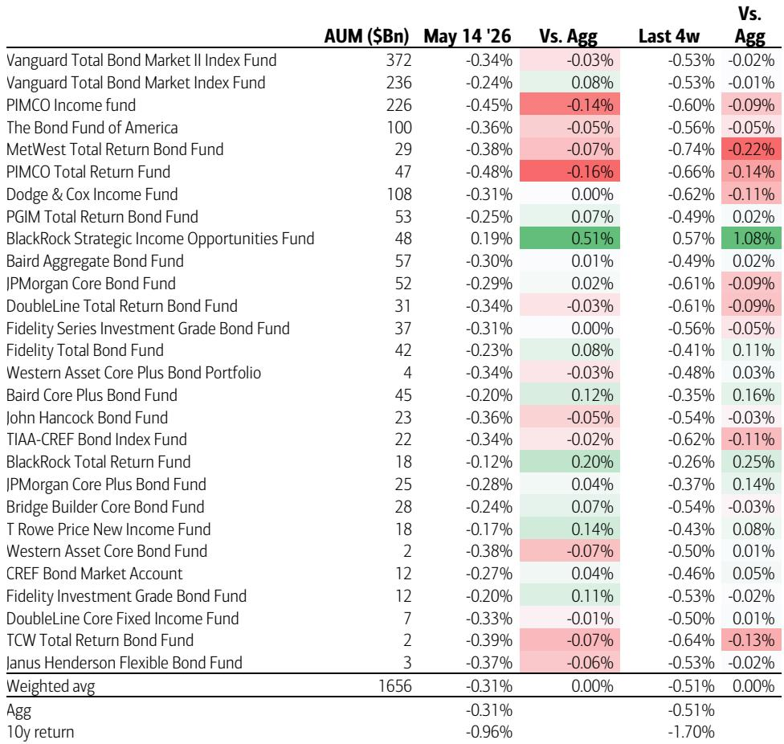
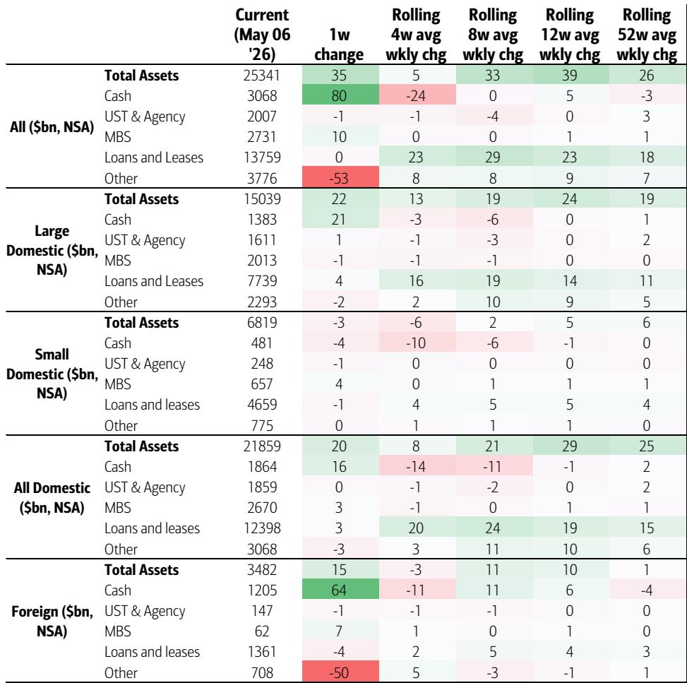
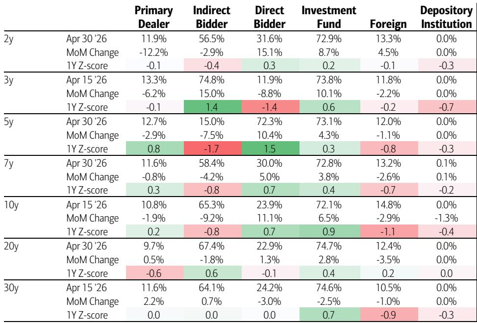

# 利率市场真正的拐点信号，不是降息时点，而是多头彻底离场

过去几周，全球利率市场经历了一轮罕见的仓位清洗。多头在曲线各个期限上几乎全面溃退，残存的虚值多头头寸已经所剩无几。与此同时，空头主导了市场，且大部分处于实值状态。

这份来自某外资投行利率策略团队的报告，核心判断并非关于美联储何时降息，而是指向一个更根本的结构性变化：市场参与者正在用仓位投票，宣告一个长达数年的多头叙事周期的终结。

报告数据显示，CTA（商品交易顾问）在曲线远端已经处于极端做空状态，而资管经理也在系统性降低久期敞口。更值得关注的是，即便收益率走高吸引了部分资金回流，流入的方向却是短期政府债和投资级信用债，而非长久期国债。这意味着市场正在主动压缩久期暴露，而非被动等待利率见顶。

对于资产配置决策者而言，这份报告揭示了一个容易被忽视的关键问题：当前利率市场的定价逻辑，已经从“交易降息预期”切换到了“交易供给和仓位结构”。谁先理解这个切换，谁就能在未来几个季度的波动中占据主动。

---

## 1. 多头的“长期告别”已经完成，残存仓位只会加剧卖压

报告中最具冲击力的数据来自期货持仓代理指标。截至上周，曲线各期限上的虚值多头头寸几乎被全部平仓。在TU、TY和WN合约中，仅剩少量残存的虚值多头，而空头不仅占据绝对主导，且大部分处于实值状态。

这意味着什么？传统的“多头止损-价格下跌-更多多头止损”的负反馈循环已经基本走完。但市场并非就此进入均衡。残存的虚值多头依然构成一个不对称的卖压来源：只要利率继续上行，这些头寸就会被迫平仓，进一步加剧卖压。

从量化角度看，报告构建的“曲线仪表盘”显示，当前利率市场的定价偏向于继续走陡，且久期方向偏空。这个综合指标并非单一来源，而是融合了CTA仓位、期货持仓代理、基金回归久期贝塔等多个维度的信息。当所有信号指向同一个方向时，其置信度远高于单一指标。

对于持有长久期资产的投资者，这意味着“抄底”的风险回报比依然不利。残存多头离场的压力尚未完全释放，而空头主导的市场格局下，任何反弹都可能被新的做空力量压制。

## 2. CTA的极端做空并非终点，波动率才是关键变量

报告专门分析了CTA在2年期和30年期国债期货上的仓位。数据显示，所有回溯模型都指向CTA在2年期合约上做空，而在30年期合约上，做空程度更为极端。

但报告同时提出了一个重要的条件判断：CTA下一步的仓位调整将高度依赖于波动率。如果期货价格继续在低波动环境下下跌，CTA的空头可能继续累积；但如果波动率上升，CTA会主动削减空头头寸。

这个判断对理解短期市场节奏至关重要。当前的低波动环境实际上在鼓励CTA加仓做空，形成一种“自我强化”的趋势。但一旦出现外部冲击——比如地缘政治事件、数据意外或日本央行干预——波动率飙升会触发CTA的系统性平仓，反而可能引发一轮剧烈反弹。

对于活跃交易者而言，这意味着当前做空国债的“拥挤交易”本身就是一个不稳定结构。做空方向正确，但仓位管理需要更加精细。报告隐含的建议是：与其追空，不如等待波动率上升后的反弹机会再做空。

## 3. 资管经理的主动调仓：从“被动等待降息”到“主动压缩久期”

如果说CTA的做空更多是趋势跟踪策略的机械反应，那么资管经理的仓位调整则反映了主动的资产配置决策。

报告显示，资管经理上周在各个期限上普遍增加了空头头寸或平仓了多头。唯一的例外是WN（超长期国债），这里出现了新的多头建立，但报告明确指出这更多是“陡峭化交易”的一部分——即做空短端、做多长端的曲线交易，而非对长久期资产的趋势性看多。

从更长周期看，过去四周的持仓变化也确认了这一“净空头转向”。更关键的是，主动管理的Agg基金目前处于低配美国国债、超配MBS和投资级信用债的状态。这种配置在过去一个月带来了明显的超额收益，因为MBS和IG的表现持续优于国债。

这背后有一个更深层的逻辑：在利率上行环境中，信用债和MBS的利差压缩可以提供一定的“缓冲”，而国债的纯久期暴露则直接承受利率上行的冲击。资管经理的调仓，本质上是将组合的“久期风险”替换为“信用风险”和“提前偿还风险”。这种替换是否可持续，取决于信用利差能否继续收窄——而这一点，报告并没有给出明确结论。

## 4. 资金流入的“真假信号”：收益率走高吸引的是钱，但不是长钱

报告揭示了一个看似矛盾的现象：尽管仓位普遍偏空，但美国固定收益基金上周录得了180亿美元的净流入，是过去12周平均速度的两倍。

然而，流入的结构揭示了真正的意图。流入主要集中在Agg基金、短期政府债基金和投资级信用债基金，而长期政府债基金是唯一的净流出类别。这意味着资金并非看好债券市场整体，而是在高利率环境下寻找“安全垫”——短久期产品既能享受较高的票息，又避免了长久期带来的价格波动风险。

这种“缩短加权平均久期”的行为模式，与美联储加息预期重新定价密切相关。报告提到，市场正在重新计入加息的可能性，而资管经理的调仓正是对这一预期的应对。如果加息预期继续升温，资金流入的方向将进一步向短端集中，长端国债将面临持续的卖压。

对于资产配置者，这个信号意味着：当前国债收益率虽然具有吸引力，但“抄底长端”的策略仍然缺乏资金面的支撑。真正的大规模资金回流长端，需要等到市场对利率路径的预期稳定下来。

## 5. 日本投资者的“抛售”与“干预”：一个尚未完全展开的关键风险

报告中最引人关注但信息最不完整的部分，是关于日本投资者的分析。

数据显示，日本私人投资者在3月份卖出了140亿美元的美国国债，2月份卖出了180亿美元。卖出主力是银行，但养老金和寿险公司也是活跃卖家。然而，最近几周外国私人债券持仓开始回升，暗示可能存在“逢低买入”的行为。

更复杂的问题是近期疑似日本央行干预日元汇率的资金来源。报告引用了日元策略团队的估算：干预规模约720亿美元，其中隐含的美国国债卖出规模在400至500亿美元之间。

但报告同时指出，从美联储的外国逆回购和托管流量数据来看，在疑似干预前后的一周内，几乎没有发现外国卖出的证据。直到5月13日当周的数据才显示230亿美元的下降，但累计变化仍然远低于潜在的干预规模。前端互换利差的走阔也与市场驱动的官方卖出不符。

这意味着什么？要么干预的资金来源并非美国国债卖出，要么数据存在滞后或统计口径差异。报告提到，如果未来需要更大规模的干预（接近1000亿美元），才可能对美国国债市场产生实质性影响——这个规模与此前伊朗冲突初期托管资产的下降幅度相当。

这个风险点目前处于“已知但未验证”的状态。日本投资者作为美国国债最大的外国持有群体，其行为变化对利率市场的影响不可忽视。而日元干预的融资方式，可能是未来几个月最需要关注的外部变量之一。

## 6. 报告尚未回答的关键问题：仓位清洗之后，谁会是下一个边际买家？

这份报告在仓位分析上非常详尽，但有一个关键问题留给了读者：当多头离场、空头主导之后，谁会是下一个推动利率下行的边际力量？

目前来看，可能的来源有三个，但每个都有明显的约束条件。

第一，CTA的平仓。如前所述，只有波动率上升才会触发CTA的空头回补。但波动率上升本身往往对应着风险事件，届时利率的走势可能并非单纯由仓位驱动。

第二，日本投资者的回归。日本私人投资者在3月份大幅卖出后，最近几周有逢低买入的迹象。但如果日元继续贬值，日本当局的干预需求可能迫使日本投资者继续卖出美国国债来筹集美元。

第三，美国国内资管经理的重新配置。目前资管经理整体低配国债，如果经济数据走弱或美联储转向鸽派，他们可能需要回补国债头寸。但报告显示，当前资管经理的久期暴露已经处于历史低位，回补的空间确实存在，但触发条件尚未成熟。

这三个潜在买家的共同特征是：他们都需要一个明确的催化剂才会行动。在没有催化剂的情况下，空头主导的市场格局可能自我维持。

这份报告的价值不仅在于提供了详尽的仓位数据，更在于揭示了当前利率市场定价逻辑的切换：市场已经从“定价降息预期”转向“定价供给和仓位结构”。在这个新框架下，传统的久期管理和资产配置策略可能需要重新审视。

报告中的一些关键假设——比如日本干预的影响、CTA平仓的触发条件、资管经理的久期回补时机——都还需要进一步的数据验证。这些未解问题，恰恰是深入讨论和持续跟踪的价值所在。

欢迎来星球微信群里继续讨论。我们会在后续的跟踪中，重点关注日本TIC数据、美联储托管流量变化以及CTA仓位的动态调整，帮助会员在第一时间理解这些变量如何影响利率市场的定价逻辑。

Personal reading notes and learning share only. Not investment advice.

