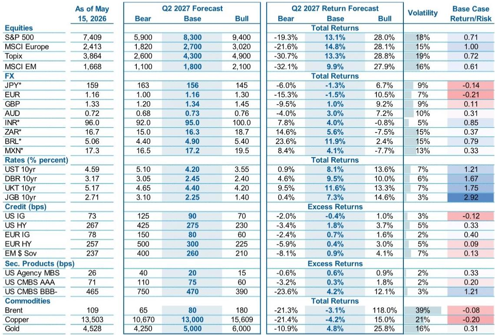
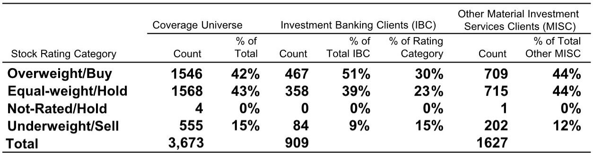
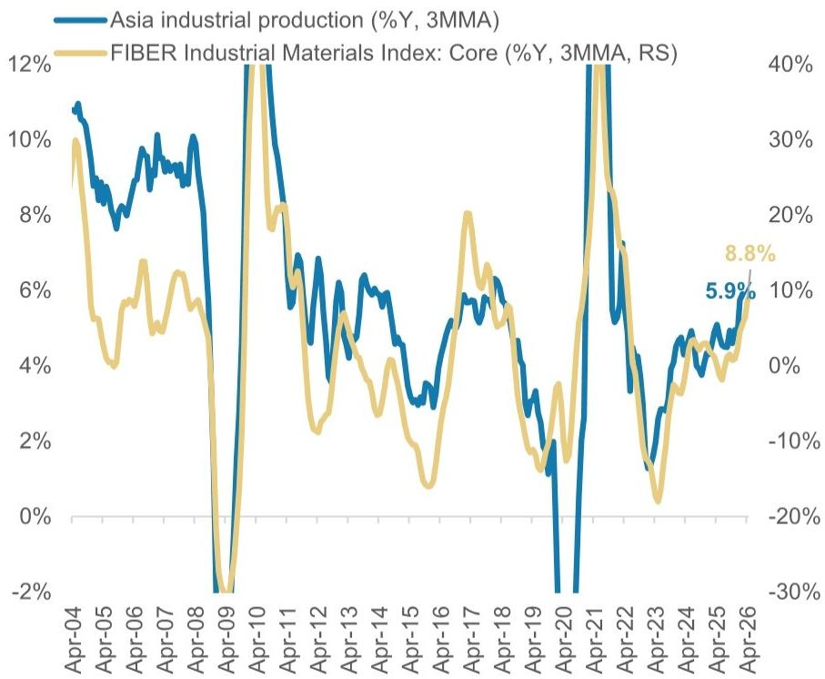

# The Industrial Super-Cycle Is Outpacing the Energy Shock: Why Asia's Growth Story Remains Intact Through 2027

The most underappreciated macro narrative for the second half of 2026 is not about recession risk, US fiscal dominance, or the next Fed move. It is about the structural decoupling of Asia's growth engine from the global energy shock that has dominated headlines. According to a comprehensive mid-year outlook from a global investment bank, Asia's real GDP growth is projected at 4.8 percent in 2026, with upward revisions of 40 basis points driven entirely by the strength of the industrial cycle. This growth is not fragile. It is not dependent on a benign energy environment. It is being propelled by a convergence of structural demand drivers—artificial intelligence infrastructure, energy transition spending, defense buildouts, and a broadening recovery in non-tech exports—that collectively outweigh the drag from elevated oil prices.

This is a critical moment for portfolio construction. The conventional wisdom holds that an energy shock is an automatic headwind for import-dependent Asian economies. That framework is outdated. Policymakers across the region have limited the passthrough from international oil price rises to domestic fuel prices to roughly one-quarter of the total move, insulating household and corporate balance sheets from the worst of the shock. Meanwhile, the industrial cycle is not merely recovering; it is accelerating. Global and Asian manufacturing PMIs have inflected higher again, with Asia's reading reaching 53.0 in April 2026. The capex super-cycle thesis is now being validated by hard data.

The implications for asset allocation are profound. If Asia can sustain 4.8 percent growth while the euro area struggles at 0.6 percent and the US hovers around 2.2 percent, the relative growth differential becomes a dominant driver of capital flows, currency movements, and sector performance. The question is no longer whether Asia can grow. The question is which parts of the Asian ecosystem are best positioned to capture the next leg of this cycle, and how investors should position for the second-order effects on rates, currencies, and credit.

## The Industrial Capex Super-Cycle Is Not a Forecast; It Is Already Visible in the Data

The most important shift in the macro landscape is that Asia's industrial recovery has moved from narrative to evidence. High-frequency data confirms that the industrial cycle is pulling ahead of the energy shock, not merely keeping pace. Asia's industrial production is growing at 5.9 percent year-on-year on a three-month moving average basis, while the core industrial materials index is expanding at 8.8 percent. These are not backward-looking artifacts of base effects; they reflect genuine acceleration in real economic activity.

What makes this cycle structurally different from previous recoveries is the breadth of its drivers. The report identifies four distinct demand forces that are simultaneously reinforcing each other. First, AI and AI-related infrastructure spending is creating a sustained demand wave for semiconductors, data center equipment, and advanced manufacturing capacity. Second, energy transition spending—including grid modernization, battery production, and renewable energy deployment—is adding a layer of capex that did not exist in previous cycles. Third, the global increase in defense spending, driven by geopolitical realignment, is creating new demand for industrial output across multiple Asian supply chains. Fourth, and most importantly, these three forces are generating positive spillovers into broader industrial capex, creating a virtuous cycle of investment begetting more investment.

The numbers are striking. Asia's gross fixed investment is projected to rise from approximately USD 11 trillion in 2025 to USD 16 trillion by 2030, excluding China's real estate capex which is in structural decline. Global ex-China capex growth is expected to improve from 3.6 percent year-on-year in 2025 to 3.8 percent in 2026 and 4.2 percent in 2027. These are not aggressive assumptions; they reflect the compounding effect of multiple structural demand drivers operating simultaneously.

The data on non-tech exports provides the clearest evidence that the recovery is broadening. April's early reporter data for China, Korea, Taiwan, and India shows non-tech exports growing at an annualized pace of 19 percent. This is not a narrow technology-led boom. It is a broad-based industrial expansion that is pulling in machinery, chemicals, metals, and other capital goods. The capex momentum is equally compelling, with Asia's capex growth reaching 27 percent year-on-year in March 2026, nearly double the global average.

The so-what for investors is straightforward. If the industrial cycle is self-reinforcing and broad-based, then the risk of a sudden stop is lower than consensus assumes. The more relevant risk is that the cycle overshoots, creating capacity constraints and inflationary pressures that force a policy response. But that is a second-half 2027 concern, not a 2026 concern.

## Monetary Divergence Is Widening: The Fed on Hold, Asia Gradually Tightening

The interest rate outlook for Asia is not a simple mirror of the Federal Reserve. The report's central scenario sees the Fed remaining on hold through 2026, with a 50-basis-point cut only materializing in the first half of 2027. This is notably more hawkish than market pricing, which currently embeds a probability-weighted path that is too dovish relative to the bank's economists' baseline.

In contrast, Asia is heading toward a gradual and modest rate hike cycle. The Bank of Japan, the Reserve Bank of Australia, and the Bank of Korea are among those with a tightening bias, while other Asian central banks are expected to remain broadly stable. By December 2026, the report projects Asia's nominal policy rate at 2.6 percent, rising to 2.8 percent by December 2027. The BOJ, RBA, and BOK are expected to be at 1.8 percent by end-2026 and 2.2 percent by end-2027.

This divergence creates a complex backdrop for fixed income investors. On one hand, the Fed on hold means US Treasury yields are unlikely to collapse, which caps the downside for global bond yields. On the other hand, Asia's tightening bias, however modest, means that local currency bonds in certain Asian markets may offer attractive carry relative to developed market alternatives. The key variable is inflation trajectory. If the industrial super-cycle generates more persistent domestic inflation than currently forecast, Asian central banks may need to accelerate their tightening cycles, which would create headwinds for duration positioning.

The report's framework suggests that the market-implied path for the fed funds rate is too hawkish, not too dovish. Current market pricing implies a zero probability of a recession, a 20 percent chance of an aggregate demand shock, and a 75 percent chance of a permanent oil premium. This is a remarkably benign set of assumptions. If any of these probabilities shift—particularly if recession risk rises or the oil premium proves transitory—the market pricing would need to adjust significantly, with implications for the dollar, EM currencies, and Asian rate markets.

## The Dollar Will Weaken in the Second Half of 2026, Then Rebound: A Tactical Opportunity for Asian Currency Investors

The foreign exchange outlook is one of the most actionable elements of the report. The dollar is expected to weaken in the second half of 2026, with the DXY index projected to reach 95 by the fourth quarter, before rebounding to 98.5 by mid-2027. This is not a call for a structural bear market in the dollar. It is a tactical call based on the interplay of rate differentials, hedging costs, and growth dynamics.

The logic is as follows. As central banks deliver on policy rate cuts—or at least signal a less hawkish stance—USD hedging costs for non-US investors should decline. European investors, in particular, have faced historically high costs to hedge USD exposure, which has discouraged capital flows into US assets. As those hedging costs cheapen, the marginal buyer of US assets may emerge, but the near-term effect is a reduction in dollar demand as the hedging premium erodes.

The report's forecast is more bearish on the dollar than consensus in the near term. The consensus and forwards are more constructive on the USD, which creates potential for a tactical surprise. The report specifically highlights that JPY-funded carry trades offer the best risk-reward, and that the consensus underestimates CHF strength. For Asian currency investors, this suggests that the most compelling trades may be in crosses rather than against the dollar directly.

The broader framework for emerging market currencies is constructive but nuanced. The report expects EM currencies to continue outperforming G3 currencies on a trade-weighted basis, but sees moderate gains against the USD through year-end. The preference is for CEEMEA and Latin America over Asia ex-Japan (AXJ). This is a critical distinction. While Asia's growth story is strong, the currency implications are mixed because many Asian central banks are intervening to manage volatility, and the region's export competitiveness benefits from a weaker dollar rather than a stronger local currency.

The question that remains unanswered is whether the dollar weakness in the second half of 2026 is the beginning of a multi-year trend or a tactical dip within a broader range. The report's forecast of a rebound in 2027 suggests the latter, but the structural drivers—fiscal deficits, reserve diversification, and the erosion of the dollar's yield advantage—could argue for a more sustained decline. This is one of the analytical tensions that the full report addresses but does not fully resolve.

## What the Report Does Not Fully Answer: The Interaction Between Fiscal Supply and Growth

One of the most intriguing sections of the report addresses the supply of government bonds. The central insight is that net issuance across the G7 is expected to decline in 2026 and 2027 relative to 2025. Gross coupon bond issuance net of redemptions is projected to fall from approximately USD 3.6 trillion in 2025 to USD 3.1 trillion in 2027. When central bank purchases are factored in, the net supply to the private sector is even more constrained.

This is a counterintuitive result given the widespread concern about fiscal sustainability and bond market vigilantes. The report argues that fiscal concerns may play idiosyncratic roles in driving bond yields higher in specific countries, but supply does not play a systemic role in driving global yields higher. The US remains the dominant source of net supply, but even US net issuance is expected to decline from USD 1.85 trillion in 2025 to USD 1.45 trillion in 2027.

The unresolved question is how this supply dynamic interacts with the growth story. If Asia's industrial super-cycle generates stronger-than-expected growth, tax revenues may improve, reducing fiscal deficits and bond supply further. But if growth disappoints, fiscal deficits may widen, increasing supply and putting upward pressure on yields. The report provides a baseline view but does not fully explore the feedback loops between the industrial cycle, fiscal outcomes, and bond market pricing.

For fixed income investors, this creates an analytical gap. The bullish case for bonds rests on declining net supply and a Fed on hold. The bearish case rests on inflation persistence and fiscal profligacy. The report's framework suggests that the balance of risks favors the bullish case, but the margin of error is narrow. Investors need to monitor high-frequency data on both growth and inflation to determine which scenario is materializing.

## A Decision Framework for Positioning Through the Second Half of 2026

The report's insights can be translated into a practical decision framework for portfolio construction. The framework has three layers: the macro regime, the asset class implications, and the implementation vehicles.

At the macro regime level, the key question is whether the industrial super-cycle is sustainable. The report provides three signposts to monitor. First, the trajectory of global and Asian manufacturing PMIs. If PMIs remain above 50 and continue to inflect higher, the cycle is intact. Second, the pace of non-tech export growth. If the broadening into non-tech sectors continues, the recovery is genuine. Third, the passthrough of energy costs into domestic inflation. If policymakers maintain their ability to limit passthrough, the energy shock remains contained.

At the asset class level, the implications are differentiated. For equities, the report suggests that Asia ex-Japan offers a favorable growth premium relative to developed markets, but the composition matters. Sectors exposed to AI infrastructure, energy transition, and defense spending are likely to outperform broad market indices. For fixed income, the preference is for local currency bonds in Asian markets with credible central banks and manageable inflation trajectories, while being underweight duration in markets where the tightening bias is strongest. For currencies, the tactical opportunity is to be short USD against a basket of Asian currencies in the second half of 2026, with a particular focus on JPY-funded carry trades.

At the implementation level, the report does not provide specific trade recommendations, but the framework suggests several open questions that investors should answer for themselves. Is the dollar weakness a tactical opportunity or a structural shift? Are Asian central banks credible in their inflation targeting, or will they be forced into more aggressive tightening? Is the industrial super-cycle creating asset bubbles that will eventually correct, or is it a genuine structural transformation?

These questions do not have easy answers, which is precisely why the full report is worth reading. The charts and data provide the empirical foundation for making these judgments, but the interpretation requires active engagement with the material.

## The Unresolved Analytical Tension: Growth Versus Inflation

The most important unresolved tension in the report is between the growth narrative and the inflation narrative. The industrial super-cycle is generating strong growth, but it is also generating demand for commodities, labor, and capital that could push inflation higher. The report's baseline assumes that the energy shock is transitory and that policymakers can manage the passthrough, but this assumption is not stress-tested.

If the industrial super-cycle proves more inflationary than expected, the implications are significant. Asian central banks would need to accelerate their tightening cycles, which would create headwinds for equity valuations and bond prices. The dollar could strengthen as rate differentials widen in favor of the US. The energy shock could compound these dynamics by pushing up input costs across the supply chain.

Conversely, if the industrial super-cycle is accompanied by productivity gains that offset inflationary pressures, the environment becomes much more benign. Growth would be higher, inflation would be contained, and central banks could maintain accommodative stances. This is the report's central scenario, but it is not the only plausible outcome.

Investors who want to navigate this tension need access to the granular data that underpins the report's analysis. The charts on manufacturing PMIs, export growth, capex momentum, and inflation passthrough are not decorative; they are the analytical foundation for the report's conclusions. Without engaging with this data, it is impossible to form an independent view on which scenario is most likely.

Join the community to read the full report and review the original charts.

*This article is for learning and discussion only and does not constitute investment advice.*

Personal reading notes and learning share only. Not investment advice.

