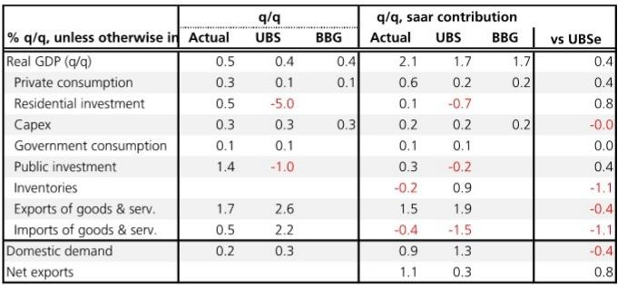
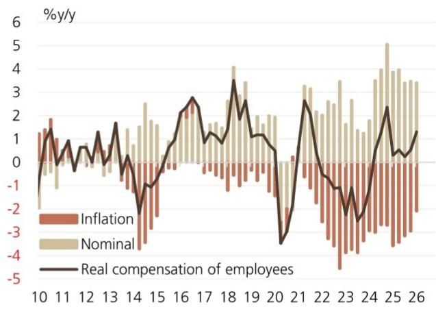

# Japan's Q1 GDP Confirms a Broad-Based Recovery, But the Real Test Is Whether It Can Survive the Coming Energy Shock

Japan’s first-quarter GDP print was undeniably strong. At 2.1% quarter-on-quarter seasonally adjusted annualized rate, the result beat both consensus and the most optimistic forecasts. More importantly, the growth was broad-based, with domestic demand and net exports contributing almost equally. For a market that has long viewed Japan’s recovery as fragile and consumption-led, this print signals something more durable: a genuine rotation into a self-sustaining cycle of wage growth, spending, and investment. But the data predates a critical shock—the closure of the Strait of Hormuz and the resulting surge in crude oil prices. The question for the Bank of Japan and for investors is whether this momentum is strong enough to absorb a terms-of-trade shock that looks different from the one Japan faced in 2022. The answer is not yet clear, but the contours of the decision framework are now visible.

The headline strength masks a deeper structural story. For the first time in several quarters, Japan is not relying on a single engine. Private consumption rose 0.3% quarter-on-quarter, beating expectations of 0.1%, and this was not driven by a one-off stimulus or a weak comparison base. It was supported by real wage growth, with real employee compensation running at 1.3% year-on-year since the fourth quarter of 2024. This is the kind of consumption that central bankers want to see: demand that is funded by income, not by savings drawdown or debt. Meanwhile, capital expenditure rose 0.5% quarter-on-quarter, underpinned by the AI investment boom. And exports, after two consecutive quarters of decline, rebounded sharply, led by autos and capital goods. The picture is one of synchronized, balanced expansion—rare for Japan and even rarer for any developed economy in the current global environment.

This is the moment the Bank of Japan has been waiting for. The path to normalization has been hindered by one false start after another: a consumption tax hike, a pandemic, supply chain disruptions, and then a cost-push inflation that eroded real incomes. Now, for the first time, the conditions for a virtuous cycle are in place. Inflation is stabilizing around 2%, wages are rising in real terms, corporate investment is picking up, and the export sector is regaining momentum. The BoJ can proceed with rate hikes from a position of strength, not necessity. But the window may be narrower than it appears.

## The First-Quarter Data Reveals a Rarely Seen Balance Between Domestic and External Demand, But the Composition Carries Hidden Risks

The headline contribution breakdown is instructive. Domestic demand contributed 1.0 percentage point to the 2.1% annualized growth, while net exports contributed 1.1 percentage points. This near-perfect balance is unusual for Japan, where growth has historically been either export-led or stimulus-driven. The fact that both engines are firing simultaneously suggests a more resilient economy than many give it credit for.

Within domestic demand, private consumption was the standout. The 0.3% quarterly increase may seem modest, but it exceeded expectations by a wide margin and was supported by a stabilization in the consumer inflation rate, as measured by the private consumption deflator, which fell from a peak of 3.2% to 2.0%. This means households are no longer losing purchasing power to inflation; they are gaining it. Real wage growth, driven by the strongest spring wage negotiations in decades, is finally translating into spending. The consumption breakdown shows that both goods and services contributed, with services rebounding after a period of weakness. This is not a sugar rush; it is a structural improvement in household finances.

Capital expenditure also deserves attention. The 0.5% quarterly rise, or 3.5% year-on-year, is consistent with a business environment where firms are confident enough to invest in capacity. The AI investment boom is a clear driver, but it is not the only one. The broader capex cycle is being supported by digitalization, automation, and the need to address labor shortages. Japan's corporate sector is sitting on record cash reserves, and the incentive to deploy that cash is growing as the cost of inaction—lost market share, inability to meet demand—rises.

On the external side, the rebound in exports was driven by a sharp recovery in the auto sector, which rose 6.5% quarter-on-quarter, and capital goods, which rose 4.5%. This is a welcome reversal after two quarters of decline, and it suggests that global demand for Japanese manufactured goods remains intact. However, service exports were flat, with inbound tourism spending actually declining 1.6% quarter-on-quarter. This is a notable divergence: the tourism boom that has supported Japan's service exports for two years may be plateauing. Whether this is a temporary pause or a structural shift depends on capacity constraints, yen dynamics, and global travel demand.

The risk in this composition is that the export rebound may be partly a catch-up effect, not a new trend. If global demand softens or if the energy shock dampens trading partner growth, the external contribution could reverse quickly. And while domestic demand looks solid, it is still consumption-led, and consumption is vulnerable to confidence shocks.

## The Energy Shock That Hit After the GDP Data Is Not a Repeat of 2022, and That Makes It More Dangerous

The report explicitly warns that the current terms-of-trade deterioration following the Strait of Hormuz closure is different from the one Japan experienced in 2022. This is not a trivial distinction. In 2022, the yen was depreciating sharply, which provided a natural hedge for Japanese exporters and for the corporate sector more broadly. A weaker yen meant that export revenues in yen terms rose even as global demand softened, cushioning the impact on profits and capital expenditure. This time, the yen is not weakening to the same extent. In fact, the BoJ's rate hikes have narrowed interest rate differentials, and the yen has been relatively stable. That means the corporate sector cannot rely on a currency buffer.

The second difference is household behavior. In 2022, Japanese households sustained consumption despite falling real purchasing power by drawing down savings. The savings rate, which had been elevated during the pandemic, provided a cushion. That cushion is now largely exhausted. The savings rate is at historic lows, and households have less room to absorb a new wave of price increases without cutting spending. This is a critical constraint. If energy prices push headline inflation back above 2%, and if the pass-through to consumer prices is rapid, the real wage gains that have supported consumption could evaporate quickly.

The BoJ's import and export price index for April has already confirmed a sharp worsening in the terms of trade, driven by a surge in import prices. This is a leading indicator of margin compression for domestic firms and higher costs for households. The question is not whether the energy shock will have an impact; it is how large and how persistent that impact will be. The report suggests that the economy entered this shock from a position of strength, which is a positive factor for the BoJ in proceeding with rate hikes. But strength at the point of impact does not guarantee resilience through the aftermath.

## What the Report Does Not Fully Answer: The Transmission Mechanism from Energy Prices to Domestic Demand and the BoJ's Reaction Function

The report is clear on the data and the risks, but it leaves several critical questions unresolved. The first is the precise transmission mechanism from higher oil prices to domestic demand. The report notes that elevated energy costs will weigh on corporate profits, constrain capex, and dampen household consumption. But the magnitude of each channel is uncertain. How much of the energy cost increase will be absorbed by corporate margins versus passed through to consumers? The answer depends on the competitive dynamics of each sector, the pricing power of firms, and the willingness of households to accept price increases after years of deflationary psychology.

The second unresolved question is the BoJ's reaction function. The report states that the economy's strength before the shock is a positive factor for rate hikes. But does that mean the BoJ will continue to hike even as the energy shock unfolds? The BoJ has historically been cautious, and its forward guidance has emphasized the need to see a virtuous cycle of wages and prices. If the energy shock causes a temporary spike in inflation without a corresponding increase in wages, the BoJ may pause or slow its normalization. Alternatively, if the BoJ views the shock as supply-driven and temporary, it may look through it and focus on the underlying demand momentum. The report does not take a definitive stance on this, and the range of plausible outcomes is wide.

The third gap is the sustainability of the export rebound. The report attributes the recovery to the auto and capital goods sectors, but it does not analyze the demand side. Is the rebound driven by restocking, by genuine end-demand, or by preemptive buying ahead of tariffs or supply disruptions? Each explanation has different implications for the second quarter and beyond. Without a clearer picture of global demand, it is difficult to assess whether net exports will continue to contribute positively or revert to being a drag.

## A Decision Framework for Investors: Three Scenarios for Japan's Growth Trajectory and the BoJ's Policy Path

For investors trying to navigate this environment, a scenario-based framework is more useful than a point forecast. The key variables are the persistence of the energy shock, the response of household consumption, and the BoJ's policy stance.

In the first scenario, the energy shock is short-lived. Oil prices spike but retreat within a quarter as supply disruptions are resolved. The terms-of-trade deterioration is temporary, and Japan's economy, already growing at a healthy pace, absorbs the shock without a significant slowdown. The BoJ continues its gradual normalization, raising rates once or twice more in 2026. This is the base case implied by the report's optimism about the pre-shock momentum, but it requires a benign resolution of geopolitical risks.

In the second scenario, the energy shock is persistent but moderate. Oil prices remain elevated for two to three quarters, compressing corporate margins and reducing household purchasing power. Consumption slows, but does not contract, as real wage growth provides a partial offset. The BoJ pauses after one more hike, waiting for clarity on the inflation and growth outlook. This scenario is consistent with the report's caution about the differences from 2022, particularly the lack of a yen buffer and the low savings rate.

In the third scenario, the energy shock is severe and prolonged. Oil prices remain high for an extended period, triggering a broader inflation spiral. The BoJ is forced to choose between fighting inflation with aggressive rate hikes, which would risk a recession, or accommodating the shock and allowing inflation to persist. This is the tail risk, and the report does not assign a probability to it, but the analysis of limited household buffers and the absence of a yen cushion makes it more plausible than in 2022.

Each scenario has different implications for asset allocation. In the base case, Japanese equities, particularly exporters and domestic cyclicals, remain attractive. In the moderate shock scenario, defensives and companies with pricing power outperform. In the tail risk scenario, the focus shifts to cash, short-duration bonds, and sectors with low energy exposure.

## The Unresolved Analytical Questions Create a Natural Invitation for Deeper Analysis

The most valuable insight from this report is not the GDP print itself, but the analytical distinction between the current energy shock and the one in 2022. The absence of a yen buffer and the depletion of household savings are structural differences that change the risk calculus. Yet the report leaves several questions unanswered: How much pricing power do Japanese firms have in the current environment? What is the elasticity of household consumption to energy price increases at current income levels? And how will the BoJ interpret a temporary inflation spike versus a persistent one?

These are not gaps in the analysis; they are the natural boundaries of what a single report can cover. For investors who want to build a robust position on Japan, the next step is to dig into the micro data: sector-level margin analysis, household balance sheets, and the BoJ's internal models for inflation forecasting. The charts in the original report—particularly the terms-of-trade data and the savings rate trajectory—provide a starting point, but the full picture requires a more granular examination.

Join the community to read the full report and review the original charts.

*This article is for learning and discussion only and does not constitute investment advice.*

Personal reading notes and learning share only. Not investment advice.

