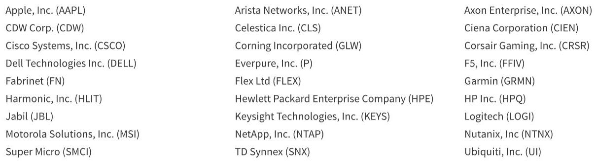

# The AI Infrastructure Bottleneck Has Shifted From Demand to Supply: The Real Winners Are Those Who Control the Physical Layer of Compute

The narrative that artificial intelligence demand is insatiable has become conventional wisdom. What is less understood, and what a recent deep-dive into the Asian IT hardware supply chain reveals, is that the binding constraint on AI growth has now decisively shifted from end-user demand to the physical capacity to build and assemble the infrastructure itself. The critical insight from these meetings is not that demand is strong—that is already priced in—but that the supply side is experiencing a structural, multi-year bottleneck that is reshaping the competitive landscape for every participant in the ecosystem. The companies that are positioned to win are not necessarily those with the most advanced chip designs, but those that control the manufacturing, assembly, and power delivery systems that make AI clusters possible.

This is not a cyclical upswing. The data points from the supply chain indicate a fundamental re-rating of what is physically possible to build. The conversations around capacity limitations, component shortages, and multi-sourcing are not signs of temporary friction; they are evidence of a long-term supply-constrained regime. For investors and strategists, this means the traditional playbook of betting on the highest-growth end market must be supplemented with a new framework: one that prioritizes operational scale, supply chain complexity management, and the ability to secure scarce components.

The report's findings are most striking in the compute segment, where the message is unambiguous: demand continues to outstrip supply, with no relief in sight. This is not a forecast of future growth; it is a statement about the present reality of production constraints. The implications are profound. In a world where supply is the bottleneck, pricing power accrues to the suppliers, and the ability to deliver becomes a competitive moat. The winners will be those who can navigate the complexities of multi-sourcing, secure power and cooling capacity, and manage the logistical challenges of building hyperscale AI clusters. The losers will be those who treat this as a normal inventory cycle.

The following analysis unpacks the key strategic takeaways from the supply chain data, identifies the critical questions that remain unanswered, and provides a decision framework for navigating this new environment.

## The TPU Supply Chain Is Doubling Faster Than Expected, and the EMS Vendors Are the Unheralded Beneficiaries

The most significant positive surprise from the supply chain meetings is the trajectory of the Tensor Processing Unit (TPU) ecosystem. Six months ago, the outlook was based on a doubling of capacity in early 2026. The current read suggests this plan is developing at or above that pace, with a potential further 50% raise in mid-2026. This is not a marginal adjustment; it is a dramatic acceleration of investment in custom silicon for AI workloads.

The strategic implication is that the custom ASIC market for AI is becoming a much larger and more sustainable opportunity than many models assume. The report highlights that most Electronic Manufacturing Services (EMS) vendors have a play here, but the nature of that involvement varies significantly. The key is to distinguish between those who are critical, irreplaceable suppliers and those who are secondary participants.

One company stands out as the main supplier to TPU and its variants, regardless of the silicon provider. This is a powerful position. It means the company is not betting on a single chip architecture; it is betting on the entire ecosystem of custom AI accelerators. The report models a more than doubling of TPU-related revenues for this supplier in 2026, from $1 billion to $2.8 billion. This is not a forecast of market share gains; it is a forecast of market expansion. The question is whether this growth can be sustained, and the supply chain data suggests it can, because the underlying demand for compute is so vast that even with multiple suppliers entering the market, the overall pie is growing fast enough to accommodate all.

For other EMS vendors, the picture is more nuanced. One supplier has traditionally been the second source for CPU manufacture and faces some concern about share loss. The strategic insight here is that even if revenues do not grow at the same rate as the rest of the ecosystem, this supplier is still involved and likely to supply lower-related products. This is a reminder that in a supply-constrained market, even secondary positions can be valuable. Another company makes the test equipment for the main provider of testing hardware, and steady growth in testing capacity is a positive signal. The takeaway is that the supply chain is not monolithic; there are multiple layers of opportunity, and the most obvious plays are not always the most profitable.

## The Trainium Ramp Is Solid but Not Transformative, and the Real Story Is the Emergence of New Rack-Level Assembly Opportunities

The supply chain sees solid unit growth for Trainium this year, with a reasonable estimate of 30% or more. This is a healthy trajectory, but it pales in comparison to the TPU ramp. The strategic question is whether Trainium can achieve broader adoption by other cloud players, which would be a significant catalyst. For now, the data suggests it remains a single-customer program, which limits its upside relative to the more diversified TPU ecosystem.

The most interesting development in the Trainium supply chain is the entry of a major EMS vendor into rack-level assembly in a more meaningful way. This is a structural shift. Historically, the hyperscaler had been vertically integrated for full rack assembly. The decision to outsource this to an EMS provider signals a recognition that scale requires external partners. This is a pattern that is likely to repeat across the industry. As AI clusters grow to tens of thousands of accelerators, the complexity of rack-level integration becomes a specialized skill that even the largest cloud providers may prefer to outsource.

The report notes that another company has seen an impressive ramp, even with a slight miss last quarter, and that increased production lines will lead to further revenue growth. Critically, there are no indications of a third source entering this market. This is a competitive advantage. In a supply-constrained world, being one of a limited number of qualified suppliers is a powerful position. The strategic takeaway is that the barriers to entry in this market are higher than they appear. It is not just about having manufacturing capacity; it is about having the certifications, relationships, and quality control systems that hyperscalers demand.

## The GPU Ecosystem Faces Potential Delays, but the Long-Term Ramp Remains Intact, and the Winners Are Those with Specific, Irreplaceable Roles

The report acknowledges that the supply chain mentions potential delays to both major GPU programs, but it also sees strong ramps at the end of this year. This is a classic tension in the AI hardware market: short-term noise versus long-term trajectory. The strategic question is which companies are best positioned to weather the delays and benefit from the eventual ramp.

The analysis points to several specific positions. One server vendor remains strongly positioned in GPU-based servers, benefiting from issues at a competitor and new capacity coming online. This is a market share story, not just a market growth story. Another company is well positioned to win scale-up Ethernet business as AI clusters ramp. This is a networking play, which is often overlooked in the excitement about compute. A third is a leading supplier of transceivers to the major GPU vendor, and the transition to 1.6T transceivers should reinvigorate growth. This is a component-level play that benefits from the relentless demand for higher bandwidth.

Another company is one of the manufacturers for the GPU vendor's switching equipment, which is often pulled through with compute. This is a derivative play that benefits from the overall growth of the ecosystem. A fifth company would be one of the suppliers to power systems and potentially racks for these deployments. This is a reminder that power is becoming a critical constraint. Finally, a networking company is well positioned for both the front and back ends of AMD clusters.

The strategic takeaway is that the GPU ecosystem is large and diverse enough to support multiple winners, but the winners are not random. They are companies that have carved out specific, irreplaceable roles in the supply chain. The question for investors is whether these roles are sustainable or whether they will be commoditized over time.

## The Cloud CPU Recovery Is a Major Positive Surprise That Benefits Asian ODMs, but the Networking and Power Segments Offer the Most Compelling Upside

One of the most striking findings from the supply chain meetings is the dramatic improvement in the outlook for general-purpose CPU. Compared to six months ago, unit discussions have moved from flat to up 20-40%, with higher average selling prices. This is a significant revision. The strategic implication is that the AI buildout is not just about accelerators; it is also driving a recovery in the broader server market. As companies invest in AI infrastructure, they also need to upgrade their general-purpose compute capacity to support the associated data processing and networking.

The report notes that a lot of this supply chain favors Asian ODMs over North American EMS. This is a competitive dynamic to watch. The increased builds should provide a more favorable backdrop for EMS and networking companies, but the distribution of benefits will not be uniform. The enterprise server market is expected to see flat to slightly growing units with higher ASPs, which is a stable but not exciting outlook.

The most compelling upside lies in the networking and power segments. Demand for switching is strong and tracking with increased compute spend. Scale-up Ethernet is in the early phases but seems like it could be a 2027 driver for the ecosystem. The report highlights several specific plays. One company is seen as the main beneficiary of the expanding switching TAM for white box solutions, despite a ramp from a major competitor. Another is the time beneficiary for switches from the major GPU vendor. A third company benefits from the inflection in Cloud CPU servers for front-end networking and from the lack of activity from newer cloud companies accelerating their white box strategies.

The power market is more fragmented but offers significant growth. The incremental power and cooling requirements per rack are growing, and the report suggests that in-line with compute could be a good proxy for growth. One company is the most exposed to power, with $2.1 billion in revenue growing 61%, and an announcement of almost 2x growth in the cloud/AI business. Another company has annual power revenues of approximately $600 million, growing 30% or more. The strategic takeaway is that power is becoming a gating factor for AI infrastructure, and the companies that can provide efficient power and cooling solutions will benefit disproportionately.

## The Device Segment Is a Cautionary Tale: Weak Demand and Memory Price Headwinds Create a Contrarian Opportunity for Selective Investors

While the AI infrastructure side of the report is overwhelmingly positive, the device segment offers a stark contrast. The PC supply chain is experiencing weak numbers, with expectations for units to be down 5-10% for the year. Smartphone expectations are similarly weak, with the new development of weakness creeping into the high-end Android market. iPhones continue to sell well in China, but the report questions the sustainability of this momentum.

The strategic takeaway is that the device segment is being much more impacted by increased memory prices, given more exposure and a consumer mix in the end market. This is a headwind that is not present in the infrastructure segment. For investors, this creates a divergence: the AI infrastructure story is strong, but the consumer electronics story is weak. The question is whether this weakness is temporary or structural. The report suggests that the ODM are expecting a rebound later in Q2, but this is a hope, not a certainty.

The video security market offers a more positive data point, with secular growth dynamics and increased ASPs. One company is seen as a share gainer. This is a reminder that even within the weak device segment, there are pockets of strength. The strategic implication is that the device segment requires a more selective approach than the infrastructure segment, where the tailwinds are more broadly distributed.

## The Report Leaves Critical Questions Unanswered: How Will the Supply Chain Manage the Transition to Next-Generation Architectures, and What Happens When Capacity Catches Up?

The report provides a wealth of data and analysis, but it also leaves several critical questions unanswered. The first is about the transition to next-generation architectures. The report mentions potential delays to both major GPU programs, but it does not fully explore the implications of these delays. If the next-generation chips are delayed, does that extend the life of current-generation products, or does it create a vacuum that custom ASICs can fill? The answer has significant implications for the competitive dynamics of the ecosystem.

The second unanswered question is about the sustainability of the supply-constrained environment. The report is bullish on the current trajectory, but it does not address what happens when capacity eventually catches up with demand. Will pricing pressure return? Will the multi-sourcing strategies that are currently a source of strength become a source of margin compression? The report's analysis is focused on the current cycle, but investors need to think about the next cycle as well.

The third question is about the role of Asian ODMs versus North American EMS companies. The report notes that the Cloud CPU recovery favors Asian ODMs, but it does not fully explore whether this is a structural shift or a temporary dynamic. As AI infrastructure becomes more standardized, will the advantage shift back to the larger, more diversified EMS companies? Or will the Asian ODMs continue to gain share? This is a critical question for anyone investing in the supply chain.

Finally, the report raises questions about the device segment. The weakness in the high-end Android market is a new development, and the report does not provide a clear explanation for it. Is it a function of macro weakness, competitive dynamics, or something else? The answer will determine whether this is a buying opportunity or a reason to be cautious.

## A Decision Framework for Navigating the AI Hardware Supply Chain: Focus on Capacity Constraints, Irreplaceability, and Power Exposure

For readers who want to translate the report's findings into a practical investment framework, three criteria stand out.

First, prioritize companies that face capacity constraints. In a supply-constrained world, the ability to deliver is a competitive advantage. Companies that are adding production lines, securing scarce components, and expanding their manufacturing footprint are likely to benefit disproportionately. The report highlights several companies that are doing exactly this, and these are the ones to watch.

Second, focus on irreplaceability. Companies that are the main supplier to a critical ecosystem, that have no third source entering their market, or that provide specialized components like test equipment or transceivers, have a moat that is difficult to replicate. The report's analysis of the TPU supply chain is a masterclass in identifying these irreplaceable positions.

Third, consider power exposure. The report makes it clear that power is a growing constraint on AI infrastructure. Companies that provide power systems, cooling solutions, and related equipment are benefiting from a structural trend that is independent of the specific chip architecture that wins. This is a diversifying play that offers upside even if the compute market becomes more competitive.

The framework is not foolproof, but it provides a structured way to think about the opportunities in the AI hardware supply chain. The companies that score highly on all three criteria are likely to be the best positioned for the next several years.

## Join the Community to Read the Full Report and Review the Original Charts

The analysis above is based on a deep reading of the supply chain data, but it is only a starting point. The full report contains detailed financial models, company-specific projections, and original charts that provide a richer picture of the competitive dynamics. The report also includes important disclosures and risk factors that are essential for any investment decision.

For those who want to go deeper, the full report is available to members of our research community. By joining, you will gain access not only to this report but to a library of strategic analysis that cuts through the noise and focuses on what matters. The community is designed for serious investors and strategists who want to stay ahead of the curve on the most important trends in technology and infrastructure.

Join the community to read the full report and review the original charts.

*This article is for learning and discussion only and does not constitute investment advice.*

Personal reading notes and learning share only. Not investment advice.

