# Global Equity Volatility Insights

# Underestimate FOMO at your own risk

# In bubble-builds, FOMO can trump macro

Renewed inflation concerns and rising long-end yields have slowed the breakneck US equity rally, but numerous signs point to equity resilience and concerns over further upside. As one example, a striking disconnect has emerged between steep put skew in rates vol and historically flat call skew across equity indices & sectors. We note that in bubble-like markets, FOMO can overwhelm rising yields & macro headwinds, as seen in the Dotcom bubble when Nasdaq surged with 30y yields. Near term, the clash between macro risks and a bubble-prone market is pushing risk into both tails, making options' asymmetry valuable. TLT put spreads offer historic \~8x max payouts to hedge a further yield rise, while QQQ call spreads and NDX-USDGBP hybrids offer cheap, limited-risk upside participation. Upcoming mega-cap tech IPOs will likely be another driver of tech enthusiasm, and we reiterate NDX over SPX in delta and vol to hedge growing concentration risk and rising bubble-era boom/bust dynamics (see 6-May-26 GEVI for more details).

# UK-specific risk creates opportunities in banks & hybrids

UK political risk is reasserting itself as a meaningful macro driver, with Labour leadership uncertainty and associated fiscal divergence feeding into Gilt yields, macro volatility and renewed Sterling weakness. This uncertainty creates attractive trading opportunities for UK vs other regional assets. For instance, as UK banks remain sensitive to domestic political and fiscal risk, a historically low SX7E/SX7P vol ratio combined with persistently high correlation cheapens SX7E calls contingent on limited SX7P upside. More broadly, Sterling-equity correlations are counter to scenarios in which equities continue to rally even as idiosyncratic UK risk weighs on GBP. Specifically, we like SX5E up, EURGBP up dual-digitals offering 13:1 max payouts and Al-upside geared NDX calls contingent on weaker GBPUSD at a 60% discount vs vanilla.

# China AI hardware: 7.1x payout call spreads on FTSE A50

AI hardware is starting to dominate the FTSE China A50 index (XIN9I) and the index doesn't include Hong Kong-listed "AI software" (e.g. Tencent and Alibaba). At 25%, IT is on track to overtake Financials as the largest sector in the A50 index, more than tripling its weight from a year ago. Indeed, recent performance is more in line with semiconductor stocks in the US than with common China Tech instruments such as the KWEB ETF and the Hang Seng Tech index. We like XIN9I 3m call spreads for a 7.1x max payout ratio as they leverage the most inverted call skew globally and offer good upside participation while limiting losses at 1.4%. With most AI-linked assets in Asia trading well above 50% vol, A50 vols remain in the low 20s.

# Also in the GEVI

Global cross-asset stress finished higher after Friday's moves reversed earlier easing

Trading ideas and investment strategies discussed herein may give rise to significant risk and are not suitable for all investors. Investors should have experience in relevant markets and the financial resources to absorb any losses arising from applying these ideas or strategies.

>> Employed by a non-US affiliate of BofAS and is not registered/qualified as a research analyst under the FINRA rules.

Refer to "Other Important Disclosures" for information on certain BofA entities that take responsibility for the information herein in particular jurisdictions.

BofA does and seeks to do business with issuers covered in its research reports. As a result, investors should be aware that the firm may have a conflict of interest that could affect the objectivity of this report. Investors should consider this report as only a single factor in making their investment decision.

Refer to important disclosures on page 27 to 30. Analyst Certification on page 27

# 19 May 2026

Equity Derivatives

Global

BofA

Data

Analytics

Global Equity Derivatives Rsch
BofAS

Lars Naeckter >>

Equity-Linked Analyst

BofA (DIFC)

Riddhi Prasad >>

Equity-Linked Analyst

MLI (UK)

Arjun Goyal

Equity-Linked Analyst

BofAS

Benjamin Bowler

Equity-Linked Analyst

BofAS

benjamin.bowler@bofa.com

Abhinandan Deb >>

Equity-Linked Analyst

MLI (UK)

Meriem Hafid >>

Research Analyst

BofASE (France)

Nitin Saksena

Equity-Linked Analyst

BofAS

Nicholas Dunne

Equity-Linked Analyst

BofAS

Vittoria Volta >>

Equity-Linked Analyst

BofASE (France)

See Team Page for List of Analysts

Exhibit 1: 3M volatility (weekly chg)

Level & changes (in parentheses) in vol pts

<table><tr><td></td><td>Implied</td><td>Realized</td></tr><tr><td>S&amp;P500</td><td>16.4 (0.5)</td><td>14.7 (0.0)</td></tr><tr><td>ESTX50</td><td>18.8 (0.5)</td><td>22.5 (0.6)</td></tr><tr><td>FTSE</td><td>14.5 (0.2)</td><td>16.6 (0.2)</td></tr><tr><td>DAX</td><td>19.1 (0.4)</td><td>22.7 (0.6)</td></tr><tr><td>NKY</td><td>28.1 (0.6)</td><td>33.2 (-0.7)</td></tr><tr><td>HSCEI</td><td>21.1 (0.1)</td><td>20.4 (-0.4)</td></tr><tr><td>KOSPI</td><td>58.6 (8.1)</td><td>63.3 (-0.1)</td></tr><tr><td>EEM US</td><td>27.2 (2.3)</td><td>30.4 (1.5)</td></tr><tr><td>XIN9I</td><td>19.5 (0.4)</td><td>14.0 (0.5)</td></tr></table>

Source: BofA Global Research

BofA GLOBAL RESEARCH

See list of acronyms at the end of the report

# BofA GFSI™ X-Asset Risk Landscape

# GFSI slightly increases after Friday's market moves

The GFSI mildly increased last week as it moved from -0.13 on 8-May-26 to -0.11 on 15-May-26. Stress actually decreased through Thursday, as equities moved higher and the index reached -0.18, its lowest level since 27-Jan. However, Friday's move higher in rates and oil, coupled with equity weakness, erased earlier stress easing, leaving the GFSI in its $33^{\text{rd}}$ percentile since 2000.

Commodities led stress higher with copper and crude implied vols among the top eight stress-gainers of the week (Exhibit 3 & Exhibit 4). In fact, copper implied vol recorded a $95^{\text{th}}$ percentile gain in stress while crude implied vol stress increased for the fourth consecutive week (Exhibit 6). Crude implied vol remained the most stressed GFSI subcomponent and is joined in bearish territory by gold implied vol, with stress in both more than half a standard deviation above median levels (Exhibit 2).

Although all three commodity implied vol subcomponents saw stress increase last week, rates vol was the largest stress gainer versus all cross-asset vols and spreads (Exhibit 7). Interest rate implied vol EUR and USD were the first and third largest stress-gainers, respectively, as they each posted stress gains in their top deciles versus history (Exhibit 3 & Exhibit 6). Meanwhile, FX and equity stress also increased while credit stress slightly declined. Commodities remain the GFSI's most stressed asset class while FX is the least stressed (Exhibit 4).

• The US was the only region to record a decline in stress last week   
(Exhibit 5). Stress decreased for the third consecutive week, as volume flow, the subcomponent that tracks bullish or bearish US stock volume, posted the largest decline in stress (Exhibit 3).   
- GBP/USD implied vol posted a 90 $^{th}$ percentile stress gain (Exhibit 6) as GBP was under pressure from risks of a change in UK leadership (see UK Watch: 15-May-26 for perspective from our UK econ, rates, and FX teams).

Exhibit 2: Latest\* stress across GFSI sub-components   
Crude implied vol is the most stressed while Govt-OIS EUR is the least stressed   
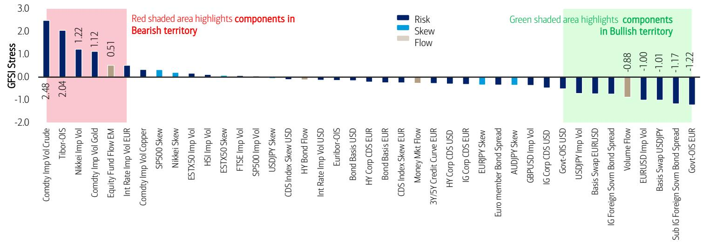

bar

| Component | GFSI Stress |
| --- | --- |
| Comdty Imp Vol Crude | 2.48 |
| Tibor-OIS | 2.04 |
| Nikkei Imp Vol | 1.22 |
| Comdty Imp Vol Gold | 1.12 |
| Equity Fund Flow EM | 0.51 |
| Int Rate Imp Vol EUR | 0.51 |
| Comdty Imp Vol Copper | 0.25 |
| SP500 Skew | 0.25 |
| Nikkei Skew | 0.15 |
| ESTX50 Imp Vol | 0.15 |
| HSI Imp Vol | 0.15 |
| ESTX50 Skew | 0.15 |
| FTSE Imp Vol | 0.15 |
| SP500 Imp Vol | 0.15 |
| USDJPY Skew | 0.15 |
| CDS Index Skew USD | 0.15 |
| HY Bond Flow | 0.15 |
| Int Rate Imp Vol USD | 0.15 |
| Euribor-OIS | 0.15 |
| Bond Basis USD | 0.15 |
| HY Corp CDS EUR | 0.15 |
| Bond Basis EUR | 0.15 |
| CDS Index Skew EUR | 0.15 |
| Money Mkt Flow | 0.15 |
| 3Y/5Y Credit Curve EUR | 0.15 |
| HY Corp CDS USD | 0.15 |
| IG Corp CDS EUR | 0.15 |
| EURJPY Skew | 0.15 |
| Euro member Bond Spread | 0.15 |
| AUDJPY Skew | 0.15 |
| GBPUSD Imp Vol | 0.15 |
| IG Corp CDS USD | 0.15 |
| Govt-OIS USD | 0.15 |
| USDJPY Imp Vol | -0.88 |
| Basis Swap EURUSD | -1.00 |
| IG Foreign Sovm Bond Spread | -1.01 |
| Volume Flow | -1.17 |
| EURUSD Imp Vol | -1.22 |
| Basis Swap USDJPY | -1.22 |
| Sub IG Foreign Sovm Bond Spread | -1.22 |
| Govt-OIS EUR | -1.22 |

Source: BofA Global Research. \*Latest as of 15-May-26. Disclaimer: The indicator identified above as BofA GFSI is intended to be an indicative metric only and may not be used for reference purposes or as a measure of performance for any financial instrument or contract, or otherwise relied upon by third parties for any other purpose, without the prior written consent of BofA Global Research. This indicator was not created to act as a benchmark.

BofA GLOBAL RESEARCH

Exhibit 3: Change\*\* in stress across GFSI sub-components   
Interest rate implied vol EUR was the largest stress riser over the last week while volume flow stress fell the most   
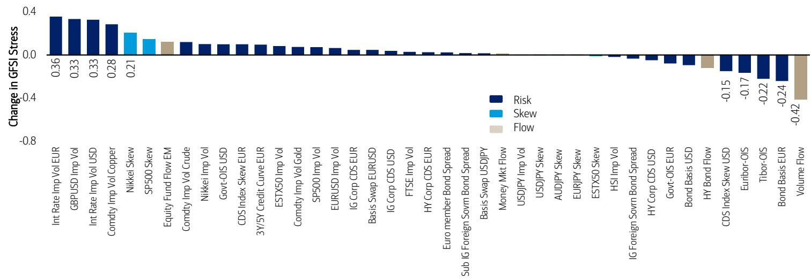

bar

| Entity | Change in GFSI Stress |
| :--- | :--- |
| Int Rate Imp Vol EUR | 0.36 |
| GBPUSD Imp Vol | 0.33 |
| Int Rate Imp Vol USD | 0.33 |
| Comdty Imp Vol Copper | 0.28 |
| Nikkei Skew | 0.21 |
| SP500 Skew | |
| Equity Fund Flow EM | |
| Comdty Imp Vol Crude | |
| Nikkei Imp Vol | |
| Govt-OIS USD | |
| CDS Index Skew EUR | |
| 3Y/5Y Credit Curve EUR | |
| ESTX50 Imp Vol | |
| Comdty Imp Vol Gold | |
| SP500 Imp Vol | |
| EURUSD Imp Vol | |
| IG Corp CDS EUR | |
| Basis Swap EURUSD | |
| IG Corp CDS USD | |
| FTSE Imp Vol | |
| HY Corp CDS EUR | |
| Euro member Bond Spread | |
| Sub IG Foreign Sovm Bond Spread | |
| Basis Swap USDJPY | |
| Money Mkt Flow | |
| USDJPY Imp Vol | |
| USDJPY Skew | |
| AUDJPY Skew | |
| EURJPY Skew | |
| ESTX50 Skew | |
| HSI Imp Vol | |
| IG Foreign Sovrn Bond Spread | |
| HY Corp CDS USD | |
| Govt-OIS EUR | |
| Bond Basis USD | |
| HY Bond Flow | -0.15 |
| CDS Index Skew USD | -0.17 |
| Euribor-OIS | -0.22 |
| Tibor-OIS | -0.24 |
| Bond Basis EUR | -0.42 |
| Volume Flow | |

Source: BofA Global Research. \*\*Latest as of 15-May-26. Change from 8-May-26 to 15-May-26.

BofA GLOBAL RESEARCH

The GFSI Risk Allocator (using Bull, Bear & Neutral weights of 2, 0, 1) suggested a 7.3% overweight position as of 15-May-26 (vs a 14.6% overweight position as of 8-May-26). The percentages of Bullish, Bearish, and Neutral GFSI components (as used in the Risk Allocator) as of 15-May-26 were 22.0%, 14.6%, and 63.4%, respectively.

Exhibit 4: Commodity stress increased the most last week   
On the other hand, credit stress decreased   
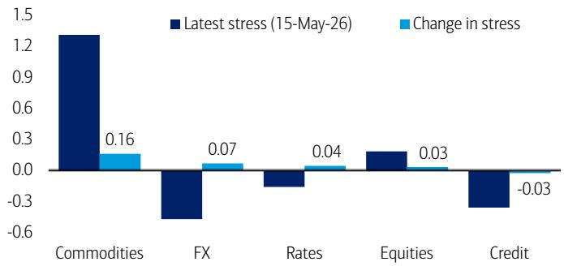

bar

| Category | Latest stress (15-May-26) | Change in stress |
| :--- | :--- | :--- |
| Commodities | 1.3 | 0.16 |
| FX | -0.45 | 0.07 |
| Rates | -0.15 | 0.04 |
| Equities | 0.2 | 0.03 |
| Credit | -0.35 | -0.03 |

Source: BofA Global Research. Change from 8-May-26 to 15-May-26.   
BofA GLOBAL RESEARCH

Exhibit 6: Top 10 biggest stress movers (vs history)   
Copper implied vol saw a historically large stress increase   
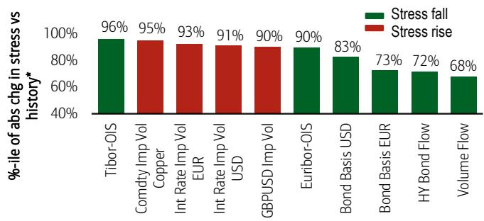

bar

%-ile of abschg in stress vs history*
| Category | Stress fall (%) | Stress rise (%) |
| :--- | :--- | :--- |
| Tibor-OIS | 96 | |
| Comdty Imp Vol Copper | 95 | |
| Int Rate Imp Vol EUR | 93 | |
| Int Rate Imp Vol USD | 91 | |
| GBPUSD Imp Vol | 90 | |
| Euribor-OIS | 90 | |
| Bond Basis USD | 83 | |
| Bond Basis EUR | 73 | |
| HY Bond Flow | 72 | |
| Volume Flow | 68 | |

Source: BofA Global Research. \* %-ile of 5-day moves in stress vs all historical 5-day moves (earliest 3-Jan-00). Bar colors represent rise (red) or fall (green) in stress. 5-day change (8-May-26 to 15-May-26).   
BofA GLOBAL RESEARCH

Exhibit 5: EM led regional stress higher last week   
In contrast, US stress declined   
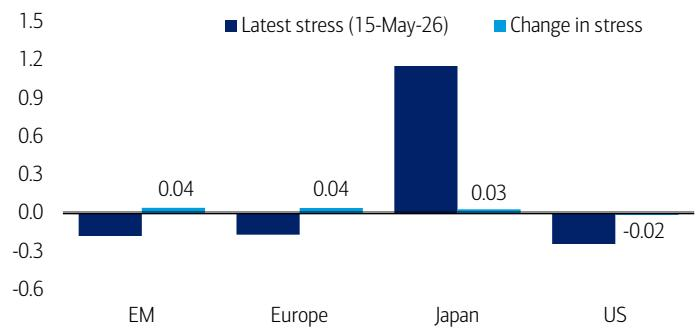

bar

| Region | Latest stress (15-May-26) | Change in stress |
| :--- | :--- | :--- |
| EM | -0.2 | 0.04 |
| Europe | -0.2 | 0.04 |
| Japan | 1.2 | 0.03 |
| US | -0.3 | -0.02 |

Source: BofA Global Research. Change from 8-May-26 to 15-May-26.   
BofA GLOBAL RESEARCH

Exhibit 7: Biggest stress movers in cross-asset vols and spreads   
Rates vol experienced the largest increase in stress last week   
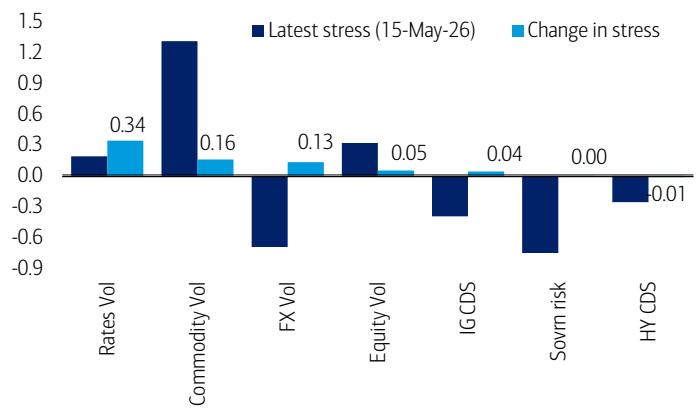

bar

| Category | Latest stress (15-May-26) | Change in stress |
| :--- | :--- | :--- |
| Rates Vol | 0.25 | 0.34 |
| Commodity Vol | 1.3 | 0.16 |
| FX Vol | -0.7 | 0.13 |
| Equity Vol | 0.3 | 0.05 |
| IG CDS | -0.35 | 0.04 |
| Sovm risk | -0.8 | 0.00 |
| HY CDS | -0.25 | -0.01 |

Source: BofA Global Research. Change from 8-May-26 to 15-May-26.   
BofA GLOBAL RESEARCH

# BofA Bubble Risk Indicator Landscape

# Global equity BRI rising, led by Kospi, Nikkei, US tech

The BofA Bubble Risk Indicator (BRI) is a price-based measure designed to detect bubble-like asset dynamics. Inspired by the way the first four moments describe a statistical distribution, the BRI distils an asset's returns, volatility, momentum, and fragility into a single bubble-risk reading on a 0 to 1 scale; 1 represents extreme bubble-like price action while 0 represents none. Historic asset bubbles have exhibited high BRI levels as they formed and peaked (see our 2026 Year Ahead for more details).

Exhibit 8: Bubble-like instability in global equities (MSCI World) broadly continues to rise, led by the BRIs of Kospi, Nikkei and US tech (though Mag7 still appears subdued); persistent geopolitical stress understandably keeps the energy-complex's BRIs high   
BofA Bubble Risk indicator (as of 15-May-26) across global equity indices, US equity sectors, commodities and crypto (bars: range of short- to long-term sub-indicators)   
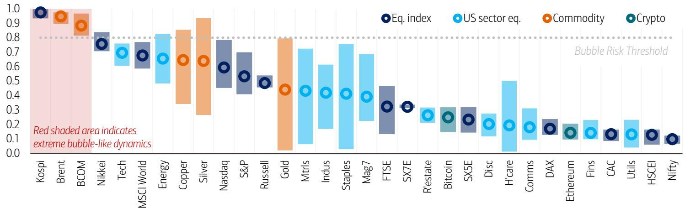

bar

| Company   | Eq. index | US sector eq. | Commodity | Crypto |
|-----------|-----------|---------------|-----------|--------|
| Kospi     | 0.98      | 0.98          | 0.98      | 0.98   |
| Brent     | 0.75      | 0.72          | 0.92      | 0.92   |
| BCOM      | 0.75      | 0.68          | 0.90      | 0.90   |
| Nikkei    | 0.75      | 0.62          | 0.88      | 0.88   |
| Tech      | 0.75      | 0.70          | 0.85      | 0.85   |
| MSCI World| 0.75      | 0.75          | 0.85      | 0.85   |
| Energy    | 0.75      | 0.82          | 0.85      | 0.85   |
| Copper    | 0.75      | 0.68          | 0.65      | 0.65   |
| Silver    | 0.75      | 0.85          | 0.92      | 0.92   |
| Nasdaq    | 0.75      | 0.78          | 0.65      | 0.65   |
| S&P       | 0.75      | 0.70          | 0.65      | 0.65   |
| Russell   | 0.75      | 0.45          | 0.45      | 0.45   |
| Gold      | 0.75      | 0.45          | 0.45      | 0.45   |
| Mtrls     | 0.75      | 0.72          | 0.45      | 0.45   |
| Indus     | 0.75      | 0.62          | 0.45      | 0.45   |
| Staples   | 0.75      | 0.75          | 0.45      | 0.45   |
| Mag7      | 0.75      | 0.68          | 0.45      | 0.45   |
| FTSE      | 0.32      | 0.45          | 0.32      | 0.32   |
| SX7E      | 0.32      | 0.32          | 0.32      | 0.32   |
| R'estate  | 0.32      | 0.32          | 0.32      | 0.32   |
| Bitcoin   | 0.32      | 0.32          | 0.32      | 0.32   |
| SX5E      | 0.32      | 0.32          | 0.32      | 0.32   |
| Disc      | 0.32      | 0.32          | 0.32      | 0.32   |
| H'care    | 0.32      | 0.50          | 0.32      | 0.32   |
| Comms     | 0.32      | 0.32          | 0.32      | 0.32   |
| DAX       | 0.32      | 0.32          | 0.32      | 0.32   |
| Ethereum  | 0.32      | 0.32          | 0.32      | 0.32   |
| Fins      | 0.32      | 0.32          | 0.32      | 0.32   |
| CAC       | 0.32      | 0.32          | 0.32      | 0.32   |
| Utils     | 0.32      | 0.32          | 0.32      | 0.32   |
| HSCEI     | 0.32      | 0.32          | 0.32      | 0.32   |
| Nifty     | 0.32      | 0.32          | 0.32      | 0.32   |

Source: BofA Global Research. Data as of 15-May-26. Underlying tickers: SPX, NDX, RTY, SX5E, SX7E, CAC, DAX, UKX, NKY, HSCEI, KOSPI2, NIFTY, MXWD, IXB, IXCPR, IXE, IXM, IXI, IXT, IXR, IXRE, IXU, IXV, IXY, BM7P, BCOM, CO1, XAU, XAG, HG1, XBTUSD, XETUSD. Disclaimer: The indicator identified as the BofA Bubble Risk Indicator is intended to be an indicative metric only and may not be used for reference purposes or as a measure of performance for any financial instrument or contract, or otherwise relied upon by third parties for any other purpose, without the prior written consent of BofA Global Research. This indicator was not created to act as a benchmark.

BofA GLOBAL RESEARCH

Exhibit 9: Taiwan, quantum and semis stocks are showing relatively high bubble-like dynamics among popular equity themes   
Highest BRI readings across popular equity themes (as of 15-May-26)   
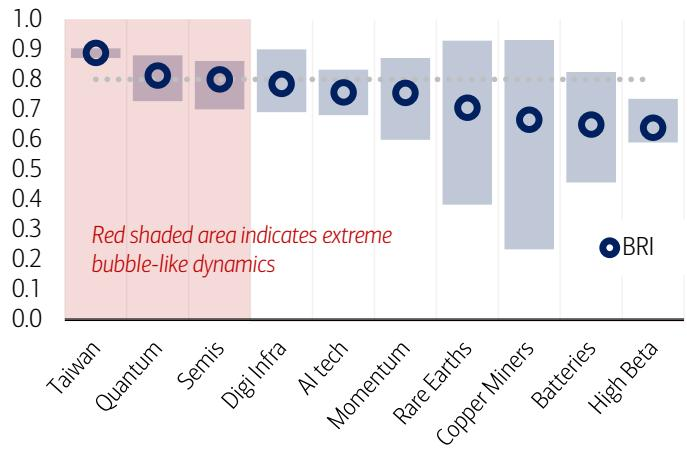

bar

| Category       | Value |
| -------------- | ----- |
| Taiwan         | 0.9   |
| Quantum        | 0.8   |
| Semis          | 0.8   |
| Digi Infra     | 0.8   |
| AI tech        | 0.75  |
| Momentum       | 0.75  |
| Rare Earths    | 0.7   |
| Copper Miners  | 0.65  |
| Batteries      | 0.65  |
| High Beta      | 0.65  |

Source: BofA Global Research. Data as of 15-May-26. Underlying tickers: M1CXBISD, BQTUMTR, ICESEMIT, SPDIGIUT, IAIQ, SP500MUT, MVREMXTR, SOLGLOCO, SOLLIT, SP5HBIT. See Disclaimer in Exhibit 8.

Exhibit 10: Solar & quality factor stocks have seen the biggest jump in their BRI over the past week among popular equity themes   
Largest 1w changes in BRI across popular equity themes (as of 15-May-26)   
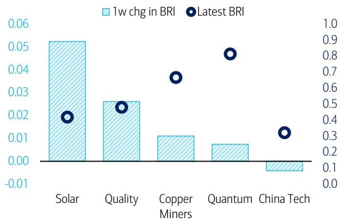

bar_line

| Category | 1w chg in BRI | Latest BRI |
|---|---|---|
| Solar | 0.052 | 0.4 |
| Quality | 0.026 | 0.5 |
| Copper Miners | 0.011 | 0.7 |
| Quantum | 0.007 | 0.8 |
| China Tech | -0.005 | 0.3 |

Source: BofA Global Research. Data as of 15-May-26. Underlying tickers: SUNIDX, M2USSNQ, SOLGLOCO, BQTUMTR, FCATCNR. See Disclaimer in Exhibit 8.

BofA GLOBAL RESEARCH

BofA GLOBAL RESEARCH

Exhibit 11: While the number of stocks exhibiting frothy price action has risen meaningfully, it remains localized vs Dotcom bubble peaks   
# of SPX stocks with BRIs above 0.8   
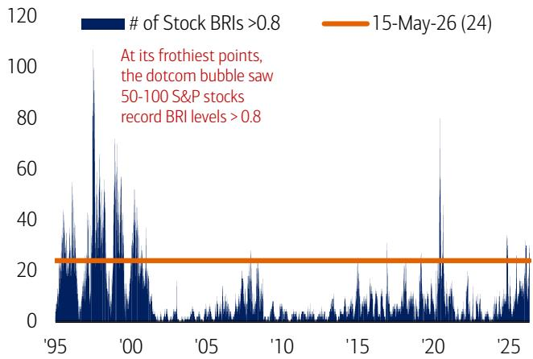

line

| Date       | # of Stock BRIs >0.8 |
| ---------- | --------------------- |
| 15-May-26  | 24                    |

Source: BofA Global Research. Data from 1-Jan-95 to 15-May-26. Stocks' BRI computed using data since SPX inclusion. See Disclaimer in Exhibit 8.   
BofA GLOBAL RESEARCH

Exhibit 12: The total index weight of SPX stocks exhibiting frothy behaviour has risen significantly over the past week   
Total weight of SPX stocks with BRIs above 0.8   
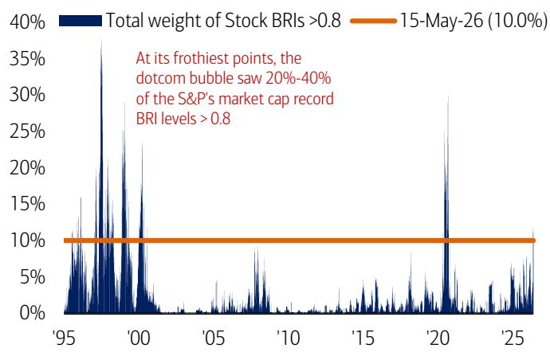

line

| Year | Total weight of Stock BRIs |
| ---- | -------------------------- |
| '95  | ~10%                       |
| '00  | ~35%                       |
| '05  | ~10%                       |
| '10  | ~10%                       |
| '15  | ~10%                       |
| '20  | ~30%                       |
| '25  | ~10%                       |

Source: BofA Global Research. Data from 1-Jan-95 to 15-May-26. Stocks' BRI computed using data since SPX inclusion. See Disclaimer in Exhibit 8.   
BofA GLOBAL RESEARCH

Exhibit 13: Tech stocks like CSCO, INTC, DELL and PANW rank highest in terms of their Bubble Risk Indicators amongst S&P 500 members, with 16/25 of the top BRI stocks being in the tech space   
S&P 500 member stocks with highest BRI reading (as of 15-May-26)   
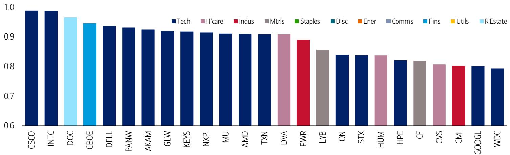

bar

| Company | Value |
| :--- | :--- |
| CSCO | 0.99 |
| INTC | 0.99 |
| DOC | 0.97 |
| CBOE | 0.95 |
| DELL | 0.94 |
| PANW | 0.93 |
| AKAM | 0.92 |
| GLW | 0.92 |
| KEYS | 0.92 |
| NXPI | 0.91 |
| MU | 0.91 |
| AMD | 0.91 |
| TXN | 0.91 |
| DVA | 0.91 |
| PWR | 0.89 |
| LYB | 0.86 |
| ON | 0.84 |
| STX | 0.84 |
| HUM | 0.84 |
| HPE | 0.82 |
| CF | 0.82 |
| CVS | 0.81 |
| CMI | 0.80 |
| GOOGL | 0.80 |
| WDC | 0.79 |

Source: BofA Global Research. Data as of 15-May-26. Note: Stocks' BRI computed using data since S&P 500 inclusion. See Disclaimer in Exhibit 8. Note that the BRI is a purely price-based metric intended to quantify the degree of bubble-like price action. It is not a fundamental view on the stock and should be used only as a complement to fundamental and positioning-based metrics.   
BofA GLOBAL RESEARCH

Exhibit 14: US momentum, EU semis and APAC AI beneficiaries are amongst the global themes showing bubble-like price action as per their high BRIs

Bubble Risk Indicator on selected BofA Custom Baskets\* (as of 15-May-26)

<table><tr><td>Basket</td><td>Ticker</td><td>BRI</td><td>Basket</td><td>Ticker</td><td>BRI</td><td>Basket</td><td>Ticker</td><td>BRI</td><td>Basket</td><td>Ticker</td><td>BRI</td></tr><tr><td>AMRS</td><td></td><td></td><td>US Cyclical Industrials ex AI</td><td>MLUICXAI</td><td>0.40</td><td>EU Steel</td><td>MLESTEEL</td><td>0.70</td><td>Japan Fiscal Impact</td><td>MLAPGEJP</td><td>0.72</td></tr><tr><td>US TMT Momentum Factor</td><td>MLUPTMMO</td><td>0.99</td><td>US Weak Balance Sheets</td><td>MLWEAK</td><td>0.40</td><td>European Reflation</td><td>MLD1REFL</td><td>0.67</td><td>China Robotics &amp; AI</td><td>MLAPCHAI</td><td>0.71</td></tr><tr><td>US Industrials Momentum Factor</td><td>MLUPINMO</td><td>0.94</td><td>US Small Cap Earners</td><td>MLSMEARN</td><td>0.35</td><td>EU Security DEIS</td><td>MLEUDEIS</td><td>0.65</td><td>China Little Giants</td><td>MLHKCHLG</td><td>0.71</td></tr><tr><td>US Momentum Factor</td><td>MLUPMOMO</td><td>0.89</td><td>US Consensus Value Shorts</td><td>MLDIMSVL</td><td>0.34</td><td>EU Cyclical Chems</td><td>MLECCHEM</td><td>0.59</td><td>Japan Industrials</td><td>MLAPJPN</td><td>0.70</td></tr><tr><td>US TMT Memory Basket</td><td>MLUMEMOR</td><td>0.87</td><td>Brazil Election Basket</td><td>MLBZELEC</td><td>0.33</td><td>EU Cyclicals</td><td>MLEUCYCL</td><td>0.59</td><td>China Property</td><td>MLCNPROP</td><td>0.68</td></tr><tr><td>US TMT Supply Shortage</td><td>MLUTMTSP</td><td>0.86</td><td>US Medicaid</td><td>MLELECHC</td><td>0.33</td><td>EU Renewable Utilities</td><td>MLEURNEW</td><td>0.57</td><td>Korea Defense</td><td>MLHKKRDF</td><td>0.68</td></tr><tr><td>US Exporters</td><td>MLUXPORT</td><td>0.85</td><td>US Defense Electronics</td><td>MLUDELEC</td><td>0.32</td><td>EU High USD Exposure</td><td>MLEUAMER</td><td>0.57</td><td>APAC Nuclear</td><td>MLHKNUCL</td><td>0.66</td></tr><tr><td>US Space Race</td><td>MLUSPACE</td><td>0.85</td><td>US Old Economy</td><td>MLOLDEC</td><td>0.32</td><td>EU Most Gas Exp</td><td>MLD1GASX</td><td>0.56</td><td>PY Winners Depreciation</td><td>MLHKPJFX</td><td>0.64</td></tr><tr><td>US Electric Grid Enablers</td><td>MLUGRID</td><td>0.83</td><td>US Soft Landing</td><td>MLSLAND</td><td>0.32</td><td>EU stocks China expo</td><td>MLD1CHEX</td><td>0.55</td><td>Australian Mining</td><td>MLHKAUMN</td><td>0.64</td></tr><tr><td>US Staples Momentum Factor</td><td>MLUPSTMO</td><td>0.82</td><td>US EU Exposed</td><td>MLUSEURO</td><td>0.32</td><td>EU Stagflation</td><td>MLEUSTAG</td><td>0.54</td><td>Japan Tariff Exposed</td><td>MLAPJPTR</td><td>0.63</td></tr><tr><td>US Materials Momentum Factor</td><td>MLUPMAMO</td><td>0.82</td><td>US Software</td><td>MLUSSOFT</td><td>0.31</td><td>EU Max Momo Top</td><td>MLEMOMOL</td><td>0.53</td><td>Japan Mgmt Transformation</td><td>MLAPJACA</td><td>0.60</td></tr><tr><td>US Data Center Builders</td><td>MLDATACB</td><td>0.82</td><td>US Nuclear Energy Exposed</td><td>MLUSNUCL</td><td>0.29</td><td>EU Ukraine Recovery</td><td>MLERBUKR</td><td>0.48</td><td>Japan High EM Exposure</td><td>MLHKHICH</td><td>0.60</td></tr><tr><td>US Al Beneficiaries</td><td>MLUSAI</td><td>0.77</td><td>US High Quality Yield</td><td>MLHQYLQ</td><td>0.29</td><td>EU Consensus Longs</td><td>MLD1LSEU</td><td>0.47</td><td>Japan Inflation</td><td>MLHKPJF</td><td>0.58</td></tr><tr><td>US Cyclicals Ex Commods</td><td>MLCYCLX</td><td>0.77</td><td>US Stagflation</td><td>MLSTGFL8</td><td>0.29</td><td>EU HY Debt</td><td>MLEUDEBT</td><td>0.47</td><td>China Al Supply Chain</td><td>MLAPAISC</td><td>0.57</td></tr><tr><td>US Managed Care</td><td>MLDIMNGC</td><td>0.77</td><td>US Boomers Spend</td><td>MLUBOOM</td><td>0.28</td><td>Industrial Manufacturing</td><td>MLEINMAN</td><td>0.44</td><td>APAC Oil exposed</td><td>MLAPOIL</td><td>0.56</td></tr><tr><td>US Hardware</td><td>MLUSHRDW</td><td>0.75</td><td>US Utility Growth Basket</td><td>MLUSGUTE</td><td>0.27</td><td>Gold Miners</td><td>MLD1GLDM</td><td>0.44</td><td>Japan Exporter to the US</td><td>MLAPJPEP</td><td>0.56</td></tr><tr><td>US AI Infrastructure</td><td>MLAINFR</td><td>0.75</td><td>US Discretionary Momentum Factor</td><td>MLUPCDMO</td><td>0.27</td><td>German Infrastructure</td><td>MLEGEINF</td><td>0.44</td><td>Korea Tourism</td><td>MLHKKRTM</td><td>0.55</td></tr><tr><td>US SMID Cap Semis</td><td>MLSEMISM</td><td>0.75</td><td>US Leisure Travel</td><td>MLDILEIS</td><td>0.25</td><td>EU Russia Exposed</td><td>MLEURUSS</td><td>0.42</td><td>APAC AI Infrastructure</td><td>MLAPAIIF</td><td>0.52</td></tr><tr><td>US Residual Volatility Factor</td><td>MLUPVOLA</td><td>0.73</td><td>US Domestic Revenue</td><td>MLDOMSTC</td><td>0.25</td><td>EU M&amp;A</td><td>MLEUMNAC</td><td>0.41</td><td>Japan Cyclicals</td><td>MLHKJPY</td><td>0.51</td></tr><tr><td>US Transports</td><td>MLUTRANS</td><td>0.73</td><td>US Defense Contractors</td><td>MLDEFCON</td><td>0.23</td><td>Italian Banks</td><td>MLEUITBK</td><td>0.39</td><td>APAC EV</td><td>MLHKAPRN</td><td>0.47</td></tr><tr><td>US LNG</td><td>MLUELNG</td><td>0.72</td><td>US SMID Cap Utilities</td><td>MLUSUTES</td><td>0.21</td><td>EU Exposed to US Consumer</td><td>MLEUSCON</td><td>0.39</td><td>Japan GPIF</td><td>MLHKGPf</td><td>0.43</td></tr><tr><td>US Renewables</td><td>MLUSRNEW</td><td>0.72</td><td>US Consumer Goods</td><td>MLGOODS</td><td>0.19</td><td>EU Short Cycle Industrial</td><td>MLEINSCY</td><td>0.39</td><td>Japan NISA</td><td>MLHKNISA</td><td>0.38</td></tr><tr><td>US Beta Factor</td><td>MLUPBETA</td><td>0.70</td><td>US Consumer Services</td><td>MLSERVE</td><td>0.18</td><td>French Domestics</td><td>MLD1FRAN</td><td>0.38</td><td>Japan Sanaenomics</td><td>MLAPJPSA</td><td>0.38</td></tr><tr><td>US Financials Momentum Factor</td><td>MLUPFINM</td><td>0.69</td><td>US Middle Income Spend</td><td>MLUMIDCG</td><td>0.18</td><td>UK Banks</td><td>MLD1UKBK</td><td>0.38</td><td>Korea Export ex Auto/Tech</td><td>MLKRREXP</td><td>0.35</td></tr><tr><td>US Value Factor</td><td>MLUPVALU</td><td>0.67</td><td>US Health Care Momentum Factor</td><td>MLUPHCMO</td><td>0.16</td><td>EU AI Adopters</td><td>MLEADOPT</td><td>0.35</td><td>APAC Shipping</td><td>MLAPSHIP</td><td>0.34</td></tr><tr><td>Canada Infrastructure &amp; Defense</td><td>MLCAINFR</td><td>0.66</td><td>US Bond Proxy</td><td>MLEBOND</td><td>0.15</td><td>EU Consensus Shorts</td><td>MLD1MSEU</td><td>0.35</td><td>APAC Coal</td><td>MLAPCOAL</td><td>0.33</td></tr><tr><td>US PMI Sensitive Industrials</td><td>MLUINDUS</td><td>0.66</td><td>US Regulated Utilities</td><td>MLUREGU</td><td>0.15</td><td>EU Capital Goods</td><td>MLD1CAPG</td><td>0.34</td><td>China High Dividend Yield</td><td>MLAPCHDV</td><td>0.32</td></tr><tr><td>US Power Supercycle</td><td>MLUSPOWR</td><td>0.65</td><td>US Consumer China Tariff Exposed</td><td>MLCTARIF</td><td>0.14</td><td>EU Tariff Exposed</td><td>MLETARIF</td><td>0.31</td><td>China SOEs</td><td>MLHKZSOE</td><td>0.31</td></tr><tr><td>US National Champions</td><td>MLUCHAMP</td><td>0.64</td><td>US Quality Factor</td><td>MLUPQUAL</td><td>0.14</td><td>EU Software</td><td>MLESOFTW</td><td>0.26</td><td>Greater China Robotic</td><td>MLAPHUMA</td><td>0.28</td></tr><tr><td>US Low Int Coverage</td><td>MLLINTC</td><td>0.61</td><td>US Strong Balance Sheets</td><td>MLSTRNG</td><td>0.14</td><td>UK M&amp;A Candidates</td><td>MLUKMNAC</td><td>0.25</td><td>APAC World Cup</td><td>MLAPWCUP</td><td>0.28</td></tr><tr><td>US Copper Exposed Basket</td><td>MLUSCOPP</td><td>0.61</td><td>US Wellness Basket</td><td>MLUWELL</td><td>0.13</td><td>EU Defensives</td><td>MLEUDEFS</td><td>0.24</td><td>Japan Defensives</td><td>MLHKJPDF</td><td>0.26</td></tr><tr><td>US Battery Ecosystem</td><td>MLUSBATT</td><td>0.60</td><td>US Higher Oil Price &#x27;At-Risk&#x27;</td><td>MLOILRSK</td><td>0.13</td><td>EU Sovereign Priority</td><td>MLEUSOVR</td><td>0.23</td><td>Japan Domestic Upcycle</td><td>MLAPJDUB</td><td>0.25</td></tr><tr><td>US Defense, Energy, Infra &amp; Security</td><td>MLUDEIS</td><td>0.59</td><td>US New Construction</td><td>MLNCONST</td><td>0.13</td><td>EU Max Momo Bottom</td><td>MLEMOMOS</td><td>0.21</td><td>APAC Airline</td><td>MLHKFLYA</td><td>0.23</td></tr><tr><td>US NeoCloud Basket</td><td>MLUNEOCL</td><td>0.58</td><td>US Growth Factor</td><td>MLUPGROW</td><td>0.12</td><td>EU European Domestics</td><td>MLEUDOMS</td><td>0.20</td><td>HK Dual listed H-shares</td><td>MLHKPREM</td><td>0.21</td></tr><tr><td>US Hard Assets, Low Obsolesce (HALO)</td><td>MLUHALO</td><td>0.58</td><td>US Consensus Large Cap Shorts</td><td>MLDISSRT</td><td>0.12</td><td>EU Defense Electronics</td><td>MLEDEFEL</td><td>0.19</td><td>China Anti Involution Basket</td><td>MLAPANTI</td><td>0.20</td></tr><tr><td>US Cyber Security Basket</td><td>MLCYBRS</td><td>0.57</td><td>US Defensive Industrials</td><td>MLUDINDU</td><td>0.12</td><td>Germany Domestic</td><td>MLEGEDOM</td><td>0.18</td><td>China Consumption Stimulus</td><td>MLAPCHST</td><td>0.19</td></tr><tr><td>US Consensus High Beta Shorts</td><td>MLDIHBHS</td><td>0.56</td><td>US Building Products</td><td>MLUBUILD</td><td>0.12</td><td>EU Cyclical Exp to US</td><td>MLECYCUS</td><td>0.18</td><td>APAC Petrochem</td><td>MLAPCHEM</td><td>0.19</td></tr><tr><td>Domestic Tax Policy</td><td>MLUTAXD</td><td>0.56</td><td>US True Defensives</td><td>MLTRUDEF</td><td>0.11</td><td>EU Travel Basket</td><td>MLD1TRAV</td><td>0.13</td><td>Japan Electric Power</td><td>MLJPTPEL</td><td>0.15</td></tr><tr><td>US Retail Signal</td><td>MLRETAIL</td><td>0.54</td><td>US Utility Defensive Yield</td><td>MLUSRUTE</td><td>0.11</td><td>EU Consumer Discretionary</td><td>MLEUCONS</td><td>0.13</td><td>China Tariff</td><td>MLHKRPW2</td><td>0.14</td></tr><tr><td>US Reshoring Basket</td><td>MLRSHORE</td><td>0.54</td><td>US Low Income Spend</td><td>MLSPREE</td><td>0.11</td><td>EU Autos</td><td>MLEUAUTO</td><td>0.12</td><td>China Internet</td><td>MLHKCHIH</td><td>0.07</td></tr><tr><td>US Crypto Exposed</td><td>MLDICRYP</td><td>0.53</td><td>US Generation Z Basket</td><td>MLUGENZ</td><td>0.11</td><td>UK Doms ex-Homebuilders</td><td>MLUKDOMX</td><td>0.09</td><td>China Consumer Old</td><td>MLHKCHCO</td><td>0.07</td></tr><tr><td>US Consensus Small Cap Shorts</td><td>MLDIRSRT</td><td>0.53</td><td>US Private Equity Funds</td><td>MLDIPTPE</td><td>0.08</td><td>EU Defense</td><td>MLD1DEFE</td><td>0.07</td><td>Macau Gaming</td><td>MLHKMCGM</td><td>0.05</td></tr><tr><td>US AI Adopters</td><td>MLUADOPT</td><td>0.52</td><td>US Energy Momentum Factor</td><td>MLUPENMO</td><td>0.07</td><td>EU Luxury</td><td>MLEULUXG</td><td>0.07</td><td>Japan Retail</td><td>MLAPJRE</td><td>0.05</td></tr><tr><td>US Consensus Growth Shorts</td><td>MLDIMSGR</td><td>0.50</td><td>US Independent Power Producers (IPPs)</td><td>MLUIPPS</td><td>0.07</td><td>UK Domestic Names</td><td>MLUKDOMS</td><td>0.07</td><td>Japan Defense</td><td>MLAPJDEF</td><td>0.05</td></tr><tr><td>US Quantum Computing</td><td>MLUQUANT</td><td>0.50</td><td>US High End Consumer</td><td>MLDIHEC</td><td>0.06</td><td>EU Defence Exposed</td><td>MLEINDEF</td><td>0.04</td><td>China National Brand</td><td>MLHKCBVM</td><td>0.04</td></tr><tr><td>US TMT Durable Compounders</td><td>MLUTMTDC</td><td>0.49</td><td>US Private Credit Proxy</td><td>MLPRCRED</td><td>0.05</td><td>UK Consumer</td><td>MLD1UKCS</td><td>0.03</td><td>Japan Wage Growth</td><td>MLHKJPWG</td><td>0.03</td></tr><tr><td>US Hard Landing</td><td>MLHLAND</td><td>0.49</td><td>US Alternative Managers</td><td>MLUALTS</td><td>0.05</td><td>UK Housebuilders</td><td>MLUKHOME</td><td>0.03</td><td>Japan Engagement</td><td>MLAPJPAT</td><td>0.03</td></tr><tr><td>US TMT Profitable Growth</td><td>MLUTMTPG</td><td>0.48</td><td>US Water Ecosystem</td><td>MLUH2O</td><td>0.04</td><td>APAC</td><td></td><td></td><td>China Consumer New</td><td>MLAPHKCN</td><td>0.03</td></tr><tr><td>US High Default Risk</td><td>MLUHDFLX</td><td>0.47</td><td>US TMT Defensives</td><td>MLUTMTDF</td><td>0.02</td><td>Axj Inflation</td><td>MLHKAXIF</td><td>0.95</td><td></td><td></td><td></td></tr><tr><td>US Golden Dome Basket</td><td>MLUGDOME</td><td>0.47</td><td>US Pharma Hyperscalers Basket</td><td>MLURXHYP</td><td>0.01</td><td>Korea Holdco</td><td>MLAPKRHO</td><td>0.94</td><td></td><td></td><td></td></tr><tr><td>US Boosters (Cyclicals)</td><td>MLBOOSTR</td><td>0.46</td><td>US GLP-1 Disruption Risk</td><td>MLXGLP1</td><td>0.00</td><td>APAC AI Beneficiaries</td><td>MLHKAPAI</td><td>0.93</td><td></td><td></td><td></td></tr><tr><td>US Commodities Complex</td><td>MLCOMMOD</td><td>0.45</td><td></td><td></td><td></td><td></td><td></td><td></td><td></td><td></td><td></td></tr><tr><td>US China Importers</td><td>MLCHIMPT</td><td>0.44</td><td></td><td></td><td></td><td></td><td></td><td></td><td></td><td></td><td></td></tr><tr><td>US Defense Technology</td><td>MLUDEFTC</td><td>0.44</td><td></td><td></td><td></td><td></td><td></td><td></td><td></td><td></td><td></td></tr><tr><td>US No Landing</td><td>MLNLAND</td><td>0.43</td><td></td><td></td><td></td><td></td><td></td><td></td><td></td><td></td><td></td></tr><tr><td>US Efficient Growth</td><td>MLUEGROW</td><td>0.42</td><td></td><td></td><td></td><td></td><td></td><td></td><td></td><td></td><td></td></tr><tr><td>US Foreign Revenue</td><td>MLFORER</td><td>0.42</td><td></td><td></td><td></td><td></td><td></td><td></td><td></td><td></td><td></td></tr><tr><td>US Refinance Risk</td><td>MLREFIN</td><td>0.42</td><td></td><td></td><td></td><td></td><td></td><td></td><td></td><td></td><td></td></tr><tr><td>US Long Term Debt Maturities</td><td>MLLTMATS</td><td>0.41</td><td></td><td></td><td></td><td></td><td></td><td></td><td></td><td></td><td></td></tr></table>

Source: BofA Global Research. Data as of 15-May-26. \*Disclaimer: These BofA baskets are proprietary baskets structured and maintained by the BofA trading desk. For more details on these baskets, please contact the team. See BRI disclaimer in Exhibit 8.

BofA GLOBAL RESEARCH

# Remember, in bubble-builds FOMO can trump macro

Renewed inflation concerns following hot CPI & PPI prints and UK fiscal turmoil have pushed bond yields sharply higher (US 30y yield > 5.1%) and paused the breakneck US equity rally. However, despite this renewed macro risk, US equities remain relatively resilient, still trading close to all-time highs.

# Dissonance in the pricing of risk between equity & rates

Through the volatility lens, equity option markets are similarly looking through macro risk, with the VIX still in the high teens. More strikingly, equity vol skews have now become historically flat, reflecting risks to the upside vs the downside and in stark contrast to the steep put skew in TLT vol (20 $^{+}$ Yr Treasury Bond ETF; Exhibit 15). This divergence is particularly notable given positive equity-bond correlation in recent weeks.

Exhibit 15: Unlike TLT skew, which has reached extreme steepness towards the put side, US equity vol skews are broadly looking through macro concerns, pricing in resilience and greater call side risks in the near-term   
1m 25d/ATMf put & call skew in US equity ETFs vs TLT (iShares 20 $^{+}$ Year Treasury Bond ETF)   
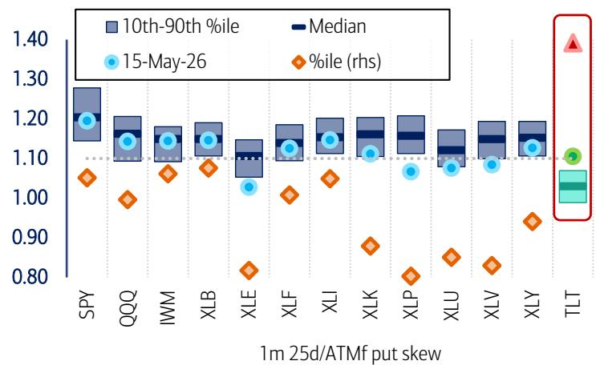

bar_line

|        | 1m 25d/ATMf put skew | 10th-90th %ile | Median | %ile (rhs) |
| ------ | --------------------- | -------------- | ------ | ---------- |
| SPY    | -                     | 1.20           | -      | 1.05       |
| QQQ    | -                     | 1.18           | -      | 1.00       |
| IWM    | -                     | 1.17           | -      | 1.06       |
| XLB    | -                     | 1.18           | -      | 1.07       |
| XLE    | -                     | 1.13           | -      | 0.82       |
| XLF    | -                     | 1.18           | -      | 1.01       |
| XLI    | -                     | 1.19           | -      | 1.05       |
| XLK    | -                     | 1.19           | -      | 0.87       |
| XLP    | -                     | 1.19           | -      | 0.80       |
| XLU    | -                     | 1.17           | -      | 0.85       |
| XLV    | -                     | 1.18           | -      | 0.83       |
| XLY    | -                     | 1.19           | -      | 0.93       |
| TLT    | -                     | 1.19           | -      | 1.38       |

Source: BofA Global Research. Data from 1-Jan-10 to 15-May-26.

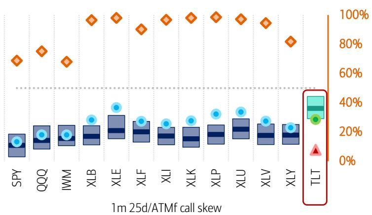

bar_line

| Company | Value |
|---------|-------|
| SPY     | ~10%  |
| QQQ     | ~20%  |
| IWM     | ~20%  |
| XLB     | ~30%  |
| XLE     | ~40%  |
| XLF     | ~30%  |
| XLI     | ~25%  |
| XLK     | ~25%  |
| XLP     | ~35%  |
| XLU     | ~35%  |
| XLV     | ~30%  |
| XLY     | ~25%  |

BofA GLOBAL RESEARCH

# What is driving US equity resilience to macro risk?

Given today's FOMO-driven, reflexive backdrop, the relative strength in US equities is not surprising to us. As noted in our 2025 Outlook (see The roaring 2020s?), fear of missing the upside in bubble-like regimes can overwhelm rising yields, as seen from the strong Nasdaq rally in the latter stages of the Dotcom bubble alongside rising 30y yields (Exhibit 16). The concurrent rise in equities and long-end yields over the past couple of years has been a more recent example, with strong tech earnings results only bolstering this trend in 2026. Today, 30y yields sit at one of the highest levels vs the past quarter century for periods when US equities were similarly close to all-time highs, rivalling 2007 and the latter stages of the Dotcom bubble (Exhibit 17).

Exhibit 16: Bubble-like regimes can withstand rising yields, as seen from the strong Nasdaq rally in the latter stages of the Dotcom bubble alongside higher 30y yields   
NDX & US 30y yields during the 1990s Dotcom bubble   
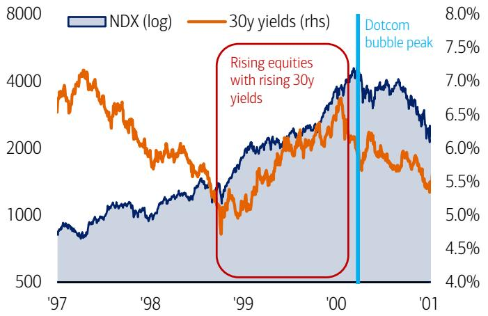

line

| Year | NDX (log) | 30y yields (rhs) |
|------|-----------|------------------|
| '97  | ~800      | ~4.5%            |
| '98  | ~1200     | ~6.0%            |
| '99  | ~2000     | ~5.5%            |
| '00  | ~4000     | ~6.5%            |
| '01  | ~2500     | ~5.5%            |

Source: BofA Global Research, Bloomberg. Data from 1-Jan-97 to 31-Dec-00.   
BofA GLOBAL RESEARCH

Exhibit 17: Equity resilience to high rates in today's bubble-prone market has resulted in elevated 30y yields today (now at '07 levels) vs other times the last 25 years when equities were near all-time highs US 30y yields when SPX is within $2\%$ of all-time highs   
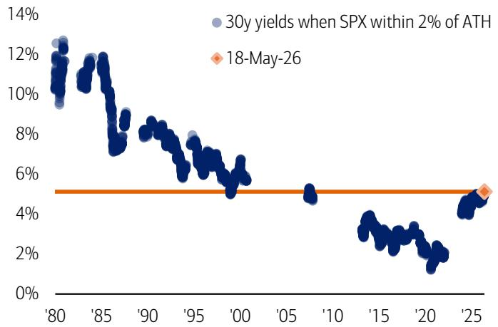

line

| Year | 30y yields when SPX within 2% of ATH |
| ---- | ------------------------------------ |
| '80  | ~12%                                 |
| '85  | ~10%                                 |
| '90  | ~8%                                  |
| '95  | ~7%                                  |
| '00  | ~6%                                  |
| '05  | ~5%                                  |
| '10  | ~4%                                  |
| '15  | ~3%                                  |
| '20  | ~2%                                  |
| '25  | ~5%                                  |

Source: BofA Global Research, Bloomberg. Data from 1-Jan-80 to 18-May-26.   
BofA GLOBAL RESEARCH

Beneath the surface, while index-level vol appears subdued (both implied & realized), single stock vol is still historically elevated, with ultra-low stock correlation acting as the dampener (Exhibit 18). This is another driver of US equity resilience as risk gets rotated away rather than aggregated at the index level thus far.

NVDA earnings later this week, with an implied move of $\sim 5.7\%$ (roughly in-line with the average of recent realized earnings moves), could serve as another catalyst for upside asymmetry to extend.

Exhibit 18: While equity index vol appears subdued, single stock vol is historically elevated (96 $^{th}$ %ile), with ultra-low correlation (5 $^{th}$ %ile) acting as the dampener   
S&P Top 50 1m single stock implied vol & implied correlation   
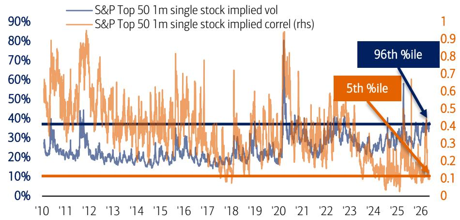

line

| Year | S&P Top 50 1m single stock implied vol | S&P Top 50 1m single stock implied correl (rhs) |
|------|----------------------------------------|--------------------------------------------------|
| '10  | ~35%                                   | ~60%                                             |
| '11  | ~30%                                   | ~75%                                             |
| '12  | ~40%                                   | ~85%                                             |
| '13  | ~25%                                   | ~65%                                             |
| '14  | ~20%                                   | ~55%                                             |
| '15  | ~25%                                   | ~70%                                             |
| '16  | ~30%                                   | ~65%                                             |
| '17  | ~25%                                   | ~70%                                             |
| '18  | ~30%                                   | ~65%                                             |
| '19  | ~35%                                   | ~70%                                             |
| '20  | ~40%                                   | ~85%                                             |
| '21  | ~35%                                   | ~65%                                             |
| '22  | ~30%                                   | ~55%                                             |
| '23  | ~35%                                   | ~45%                                             |
| '24  | ~30%                                   | ~35%                                             |
| '25  | ~35%                                   | ~20%                                             |
| '26  | ~35%                                   | ~10%                                             |

Source: BofA Global Research. Data from 1-Jan-10 to 15-May-26.   
BofA GLOBAL RESEARCH

# Navigating risks in both tails

As elevated macro risks collide with the fear of missing US equity upside, we continue to see risks in both right and left tails, an environment well suited to the asymmetry of options.

To hedge a further deterioration in macro sentiment, we particularly like TLT put spreads as a limited risk way to protect against further long-end bond weakness. Despite its recent uptick, rates vol remains largely subdued, which combined with steep TLT put skew creates an historic entry point for TLT put spreads (payout ratio in 99 $^{th}$ %ile since 2010; Exhibit 19).

Trade (TLT put spread): Buy TLT Jun 82-78 put spread for 51c indicatively (7.8x max payout ratio; 30d-8d strikes; ref. 83.65). Risk involves upfront premium paid.

To hedge a potential spillover of weakness into equities, we continue to like QQQ expanding put spreads, which help mitigate strike & timing risk in a market prone to upside asymmetry (see 12-May-26 GEVI for more details).

For the right tail, structures like near-dated QQQ call spreads continue to setup well for limited-risk upside participation given flat call skew. Additionally, to cheapen equity upside exposure via equity-FX correlation, we like NDX up, USDGBP up hybrids (see later section).

Exhibit 19: With rates vol remaining relatively subdued and TLT put skew steep, TLT put spreads are offering historically attractive payout ratios to hedge against a further rise in long-end yields   
TLT 1m 30d/10d put spread payout ratios   
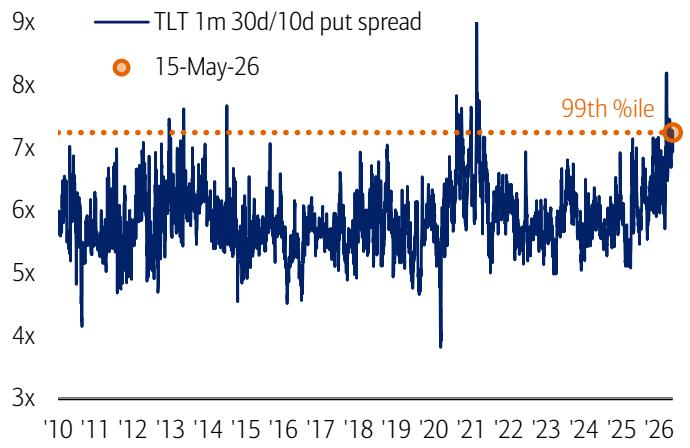

line

| Year | TLT 1m 30d/10d put spread |
|------|--------------------------|
| 2026 | 7.5x                     |

Source: BofA Global Research. Data from 1-Jan-10 to 15-May-26. Payout ratios based on indicative mid prices   
BofA GLOBAL RESEARCH

# Risk of continued UK political instability creates cross-asset opportunities

What: Position for continued UK political uncertainty via:

(i) SX7E Jul26 102% calls contingent on SX7P remaining at or below 102% for 0.77% qEUR (78% discount vs SX7E vanilla calls; 90% implied correl). Long SX7E vs short SX7P Jul26 40-delta (103% in each case) call switches offer a vanilla alternative for just 0.35% (refs: 257, 353 respectively)   
(ii) SX5E > 105%, EURGBP > 0.88 Jul26 dual digital for 7.69% (implied correlation offer -22%, refs: 5800 & 0.87 respectively, 13x max payout)   
(iii) NDX Sep26 107% calls contingent on GBPUSD <1.32 for 1.06% (60% discount vs vanilla, refs: 29125 and 1.335 respectively)

Risks: Losses involve the premium paid for contingent calls and dual-digitals. Call switches incur losses if the short call leg outperforms the long call leg.

# UK political turmoil triggers fiscal concerns

UK political risk has re-emerged within the first 2y of Starmer's premiership. Following heavy losses in local elections, and with party MPs calling for his resignation, the Prime Minister now faces a leadership challenge. Potential successors span a wide range of fiscal policy stances, and bond markets are beginning to price this uncertainty, against a backdrop of broader inflation-related macro risks. 10Y Gilt yields are near post GFC highs and recent sessions have seen historically large moves in yields, including a $99^{\text{th}}$ %ile 1-day sigma move on Friday (Exhibit 20).

Sterling typically acts as bellwether for UK political and fiscal instability. Recent price action is consistent with this pattern with GBP/USD dropping 1.75% from its May-26 highs. Our FX strategists recently highlighted how UK assets have been underpricing renewed political noise, and they expect GBP/USD to remain under pressure through May and June (see The rates redress, 18-May-26). This is further supported in the latest FX Quant Insight, 18-May-26, where our strategists note that Quant signals remain bearish GBP too. Now, while Sterling weakness has historically supported FTSE performance relative to broader European equities due to significant exporter exposure, this relationship itself has weakened structurally over time, making GBP view-driven FTSE-100 directional exposure less reliable (Exhibit 21).

# Three expressions to position for continued UK political uncertainty

This backdrop creates a clear opportunity set in our view across relative value, cross-asset, and contingent structures that benefit from dislocations arising on account of UK idiosyncratic risk:

1. EZ vs UK Banks (SX7E vs SX7P): UK Banks, in contrast to FTSE-100, retain meaningful sensitivity to domestic politics through taxation risk and gearing to UK economic growth, often reacting sharply to political developments. With UK banks accounting for 28% (market cap weight) of the SX7P (see Exhibit 26), sustained pressure on PM Starmer and a more left-leaning challenger could weigh on the index. Current political uncertainty comes on top of an already challenging fiscal backdrop, with inflationary pressures due to the Iran war. As a result, policy risk also remains elevated. For instance, Angela Rayner, MP, has recently floated the idea of increasing the bank surcharge from 2% to 5% as part of broader tax measures, a stance echoed by Andy Burnham, who has also highlighted the importance of the fiscal outlook (see UK Watch: Fiscal concerns 11 May 2026). According to our Banks' strategists, such a move could reduce attributable profits by approximately 3% for the domestic UK-focussed Lloyds and NatWest.

Recent relative outperformance (\~2% in the last 2 weeks) of EZ Banks (SX7E) vs European banks (SX7P) reflects some UK-specific risk premium but leaves more relative upside potential given the 4% underperformance since Aug-25 (Exhibit 22). Moreover, Eurex Agent positioning data reinforces this view, as SX7E investor longs reduced in March since the start of the Iran war while SX7P longs remained elevated (Exhibit 23). Meanwhile, a historic tightening in the SX7E/SX7P vol ratio (to the $2^{nd}$ 5y %-ile), cheapens the cost of SX7P upside-contingent calls on SX7E (as the indices maintain \~100% correlation). In our view, call switches are attractive too as a vanilla alternative (Exhibit 25).

2. European ‘war-relief’ rally at a 13:1 max payout: EU equities remain caught between geopolitical uncertainty and anticipation of a post-war recovery. The SX5E is currently mid-range relative to its pre-war Feb26 highs and Mar26 lows, with risk assets often leaning towards looking through geopolitical risk. We recommend cheapening EU equity upside via hybrid dual digitals. While implied and realised correlations between SX5E and EUR/GBP are currently negative (Exhibit 28), this likely understates the probability of a joint move higher on account of idiosyncratic Sterling weakness (Exhibit 27). Indeed, a ‘war relief’ rally in EU equities could plausibly coincide with continued UK-specific weakness, making dual digitals an efficient way to capture this scenario, while offering a 13:1 max payout.

3. Nasdaq-100's anti-gravity rally, cheapened 60% by idiosyncratic GBP: NDX has rallied 15% YTD, making it the best performing major global benchmark. Importantly, we see the index as being well-positioned to benefit from the AI race, with new fast entry index rules and many upcoming IPOs possibly catalysing the next leg of an AI bubble (see How to own the AI race). However, NDX Implied vol is historically high, making outright optionality expensive. Structuring NDX upside conditional on GBPUSD weakness materially improves pricing. Option markets anticipate NDX and GBPUSD to be positively correlated given their historical relationship (Exhibit 30), but this may break down if UK political stress drives Sterling lower but US tech continues to rally, fuelled by new listing anticipation and investor FOMO (Exhibit 29). We think this creates an attractive asymmetry for contingent call structures that offer a 60% discount vs outright NDX calls.

Exhibit 20: Gilt yields widened by a historically extreme amount last week, driven by global macro concerns and amplified further by emerging UK political risk   
10y Gilts daily sigma moves   
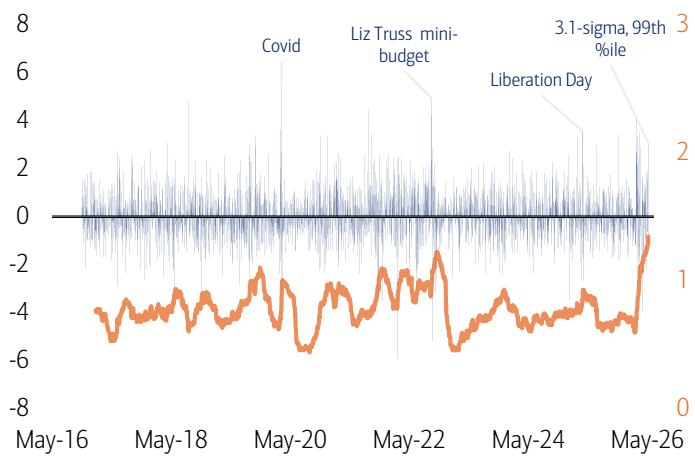

line

| Date    | Value |
|---------|-------|
| May-16  | -4.0  |
| May-18  | -3.5  |
| May-20  | -5.0  |
| May-22  | -2.0  |
| May-24  | -4.5  |
| May-26  | -1.0  |

Source: BofA Global Research, Bloomberg. Data from 17-May-16 till 15-May-26. Sigma moves use 1-day rolling returns and the 3m trailing volatility preceding it.

BofA GLOBAL RESEARCH

Exhibit 21: The accompanying Sterling weakness has typically driven relative strength in FTSE vs EU equities, albeit this has lessened over the years (making FTSE less GBP-dependent)   
FTSE vs SXXP relative performance and its correlation with GBP/USD   
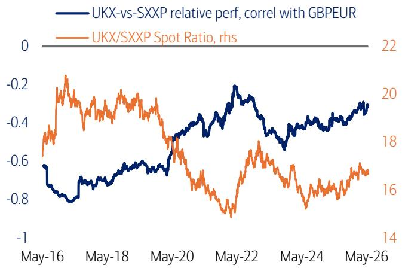

line

| Date   | UKX-vs-SXXP relative perf | UKX/SXXP Spot Ratio |
|--------|---------------------------|---------------------|
| May-16 | -0.8                      | 14                  |
| May-18 | -0.6                      | 16                  |
| May-20 | -0.4                      | 18                  |
| May-22 | -0.2                      | 20                  |
| May-24 | -0.4                      | 16                  |
| May-26 | -0.3                      | 14                  |

Source: BofA Global Research, Bloomberg. Data from 17-May-16 till 15-May-26

BofA GLOBAL RESEARCH

Exhibit 22: UK-specific risks are clear in recent SX7E (EZ-Banks) vs SX7P (European banks) outperformance, although the former's long-run underperformance leaves room for a further catch-up   
SX7E/SX7P Price Ratio   
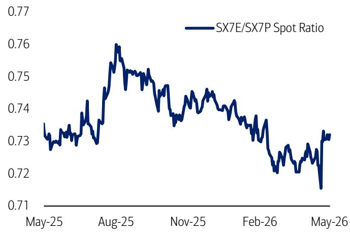

line

| Date   | SX7E/SX7P Spot Ratio |
|--------|----------------------|
| May-25 | 0.73                 |
| Aug-25 | 0.76                 |
| Nov-25 | 0.74                 |
| Feb-26 | 0.72                 |
| May-26 | 0.73                 |

Source: BofA Global Research, Bloomberg. Data from 17-May-25 till 15-May-26   
BofA GLOBAL RESEARCH   
2m 40d call IV ratio for SX7E/SX7P and the 2m rolling correlation between both indices. The horizontal lines show their respective current value.

Exhibit 24: SX7P-SX7E correlation remains close to 100% while the SX7E/SX7P vol ratio screens historically low ( $2^{nd}$ %tile)...

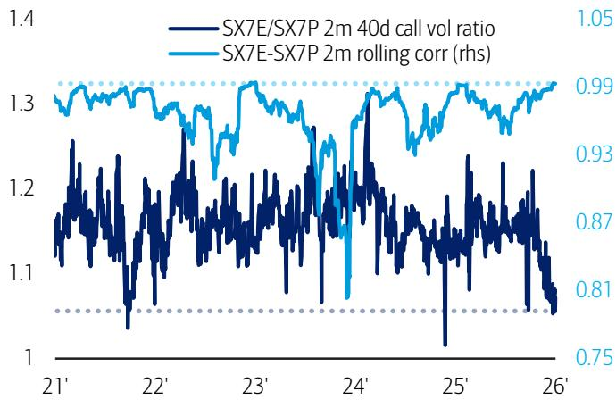

line

| Year | SX7E/SX7P 2m 40d call vol ratio | SX7E-SX7P 2m rolling corr (rhs) |
|------|----------------------------------|---------------------------------|
| 21'  | ~1.15                            | ~1.05                           |
| 22'  | ~1.05                            | ~0.99                           |
| 23'  | ~1.15                            | ~0.93                           |
| 24'  | ~1.15                            | ~0.87                           |
| 25'  | ~1.05                            | ~0.81                           |
| 26'  | ~1.05                            | ~0.81                           |

Source: BofA Global Research, Bloomberg Data from 14-May-21 till 14-May-26   
BofA GLOBAL RESEARCH

Exhibit 23: Net longs in SX7E futures have sharply declined since February, while SX7P has seen incremental net long positioning   
Eurex A-accounts futures open interest (in contracts)   
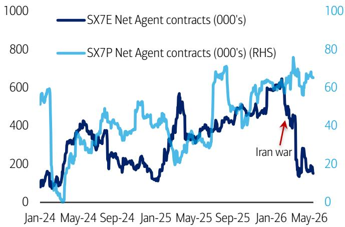

line

| Date    | SX7E Net Agent contracts (000's) | SX7P Net Agent contracts (000's) (RHS) |
|---------|----------------------------------|----------------------------------------|
| Jan-24  | ~100                             | ~60                                    |
| May-24  | ~300                             | ~40                                    |
| Sep-24  | ~250                             | ~50                                    |
| Jan-25  | ~150                             | ~30                                    |
| May-25  | ~550                             | ~65                                    |
| Sep-25  | ~450                             | ~70                                    |
| Jan-26  | ~600                             | ~65                                    |
| May-26  | ~150                             | ~75                                    |

Source: BofA Global Research, Bloomberg, Deutsche Börse. Data: 02-Sep-24 to 14-May-26. EUREX defines participant types as: Agent (trading on behalf of customers), MM (providing liquidity), Prop (trading for own account).   
BofA GLOBAL RESEARCH

Exhibit 25: ... leading to a historically low cost of (+SX7E, -SX7P) call switches   
2m 40-delta call premia for SX7E, SX7P and their spread (rhs)   
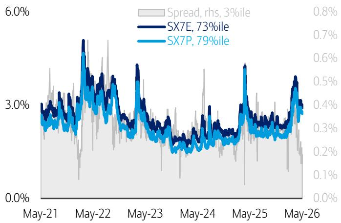

line

| Date   | Spread, rhs, 3%ile | SX7E, 73%ile | SX7P, 79%ile |
|--------|---------------------|--------------|--------------|
| May-21 | ~2.8%               | ~2.9%        | ~2.8%        |
| May-22 | ~3.5%               | ~4.0%        | ~3.8%        |
| May-23 | ~2.5%               | ~3.0%        | ~2.8%        |
| May-24 | ~2.0%               | ~2.5%        | ~2.3%        |
| May-25 | ~3.0%               | ~3.5%        | ~3.2%        |
| May-26 | ~2.5%               | ~3.0%        | ~2.8%        |

Source: BofA Global Research, Bloomberg. Data from 17-May-21 till 15-May-26   
BofA GLOBAL RESEARCH

# Exhibit 26: SX7P embeds significant UK banks' exposure unlike SX7E, which has proportionally higher exposures to EU banks

Top 5 countries vs bottom 5 countries in terms of market cap weights difference between SX7E and SX7P and the corresponding market cap weights in each index.

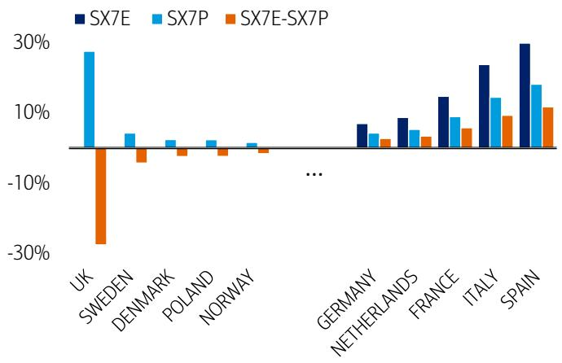

bar

| Country | SX7E (%) | SX7P (%) | SX7E-SX7P (%) |
| :--- | :--- | :--- | :--- |
| UK | 0 | 28 | -28 |
| SWEDEN | 0 | 6 | -6 |
| DENMARK | 0 | 4 | -5 |
| POLAND | 0 | 4 | -5 |
| NORWAY | 0 | 3 | -4 |
| ... | ... | ... | ... |
| GERMANY | 8 | 5 | -4 |
| NETHERLANDS | 9 | 6 | -4 |
| FRANCE | 12 | 9 | -5 |
| ITALY | 26 | 12 | 9 |
| SPAIN | 30 | 14 | 10 |

Source: BofA Global Research Data, Bloomberg Data as of 15-May-26   
BofA GLOBAL RESEARCH

# Exhibit 27: European equities (SX5E) have been range-bound through the war, but may rally hard on a potential ‘resolution’, while EURGBP likely gains on UK political and fiscal concerns (GBP weakness)

YTD SX5E and EURGBP Spot levels

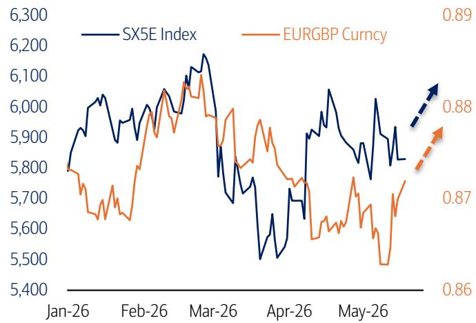

line

| Date   | SX5E Index | EURGBP Currency |
|--------|------------|-----------------|
| Jan-26 | 5,800      | 5,800           |
| Feb-26 | 6,000      | 5,700           |
| Mar-26 | 6,150      | 5,900           |
| Apr-26 | 5,500      | 5,700           |
| May-26 | 5,800      | 5,870           |

Source: BofA Global Research, Bloomberg. Data from 1-Jan-26 till 15-May-26.   
BofA GLOBAL RESEARCH

# Exhibit 28: Recent SX5E-EURGBP realised correlation and current implied levels are negative, and could turn positive if both assets rise in the coming weeks

Rolling 1y SX5E-vs-EURGBP realised correlation and the latest implied level

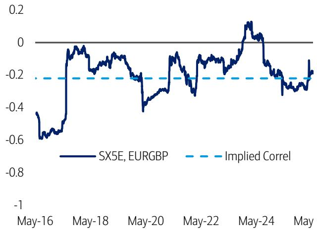

line

| Date   | SX5E, EURGBP | Implied Correl |
|--------|--------------|----------------|
| May-16 | -0.6         | -0.2           |
| May-18 | -0.2         | -0.2           |
| May-20 | -0.4         | -0.2           |
| May-22 | -0.2         | -0.2           |
| May-24 | 0.1          | -0.2           |
| May    | -0.3         | -0.2           |

Source: BofA Global Research, Bloomberg. Data from 17-May-16 till 15-May-26   
BofA GLOBAL RESEARCH

Exhibit 29: NDX has rallied 15% YTD, and is now within 1.5% of all-time highs, while Cable may see further weakness on UK risk   
YTD NDX and GBPUSD Spot levels   
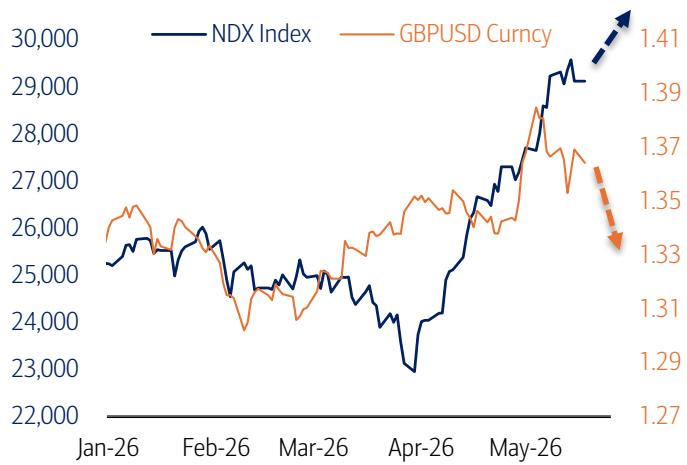

line

| Date   | NDX Index | GBPUSD Currency |
|--------|-----------|-----------------|
| Jan-26 | 25,000    | 1.31            |
| Feb-26 | 25,500    | 1.33            |
| Mar-26 | 24,500    | 1.35            |
| Apr-26 | 23,000    | 1.37            |
| May-26 | 29,000    | 1.41            |

Source: BofA Global Research, Bloomberg. Data from 1-Jan-26 till 15-May-26.   
BofA GLOBAL RESEARCH

Exhibit 30: Recent realised and current implied NDX-GBPUSD correlations are positive, but could turn negative if Sterling weakens while NDX continues to make new highs   
Rolling 1y NDX-vs-GBPUSD realised correlation and the latest implied level   
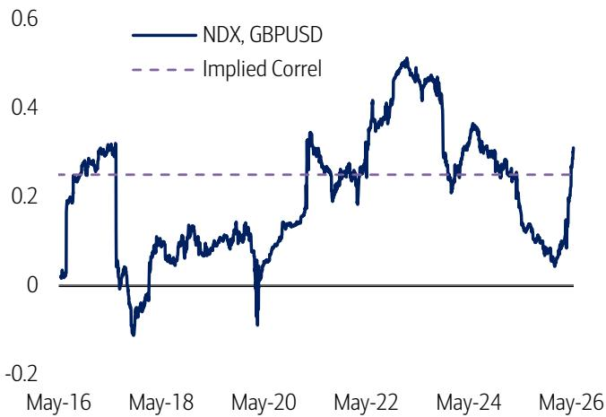

line

| Date   | NDX, GBPUSD |
|--------|-------------|
| May-16 | 0.0         |
| May-17 | 0.3         |
| May-18 | -0.1        |
| May-19 | 0.1         |
| May-20 | -0.1        |
| May-21 | 0.3         |
| May-22 | 0.5         |
| May-23 | 0.4         |
| May-24 | 0.3         |
| May-25 | 0.1         |
| May-26 | 0.3         |

Source: BofA Global Research, Bloomberg. Data from 17-May-16 till 15-May-26.   
BofA GLOBAL RESEARCH

# China AI hardware taking over the FTSE China A50: Buy 7.1x payout call spreads

Trade: Buy XIN9I 3-month 105% 115% call spreads for 1.40%

(+19% delta, +7.1x max payout ratio)

Pricing is indicative and in quanto USD

Risks: Limited to premium paid.

The FTSE China A50 is increasingly geared to the hardware side of China AI IT looks set to overtake Financials as the largest sector in the FTSE China A50 index (25.3% vs 26.9%, see Exhibit 31). The weight of IT has more than tripled, up from 7.7% a year ago. Since the index comprises of mainland Chinese stocks and not Hong Kong-listed stocks, it is much more tilted towards hardware than HSCEI, HSTECH and KWEB. Indeed, 96% of the recent rally (see Exhibit 32) has been due to the top 5 IT names in the China A50: Zhongji Innolight (+84% since 31 Mar), Cambricon (+83%), Hygon (+44%), Eoptolink (+38%) and Foxconn (+31%).

Call spreads: risk-limited upside, leveraging the world's most inverted call skew

Despite the strong semiconductor rally, it remains brave to pull the plug on these AI hardware trades. Call spreads offer an attractive way to maintain upside exposure while limiting losses in case of a reversal from here. With anything AI linked in Asia trading at very high levels of vol (e.g. Kospi vol >50%), the FTSE China A50 comes at a much more reasonable level in the high teens to low 20s (Exhibit 34). Moreover, the index has a very inverted call skew, making far OTM calls relatively rich compared to near the money calls. Indeed, with 3m 115% calls trading 3.4 vols higher than 105% calls, none of its index peers globally are even close (Exhibit 33).

Exhibit 31: The AI hardware rally is changing the FTSE China A50 index. From less than 8% a year ago to 25%, IT is about to surpass Financials (and CATL, the battery maker, makes up most of Industrials)   
FTSE China A50 sector weights now vs 1 year ago   
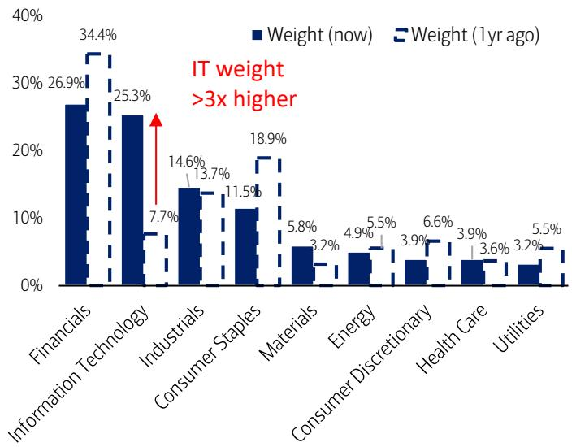

bar

| Category | Weight (now) (%) | Weight (1 yr ago) (%) |
| :--- | :--- | :--- |
| Financials | 26.9 | 34.4 |
| Information Technology | 25.3 | 7.7 |
| Industrials | 14.6 | 13.7 |
| Consumer Staples | 11.5 | 18.9 |
| Materials | 5.8 | 3.2 |
| Energy | 4.9 | 5.5 |
| Consumer Discretionary | 3.9 | 6.6 |
| Health Care | 3.9 | 3.6 |
| Utilities | 3.2 | 5.5 |
IT weight >3x higher

Source: BofA Global Research. Data as of 18-May-2026 and 18-May-2025.   
BofA GLOBAL RESEARCH

Exhibit 32: The China A50 index has better captured the recent semis rally compared to the Hang Seng Tech index and the KWEB ETF   
Equal risk performance relative to the start of the Iran war (+/-0% on 27 Feb)   
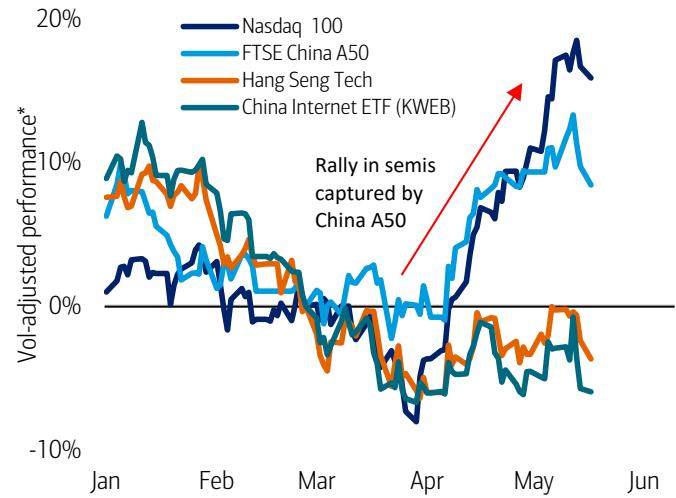

line

| Month | Nasdaq 100 | FTSE China A50 | Hang Seng Tech | China Internet ETF (KWEB) |
|-------|------------|----------------|----------------|----------------------------|
| Jan   | ~5%        | ~8%            | ~7%            | ~10%                       |
| Feb   | ~-2%       | ~-3%           | ~-4%           | ~-5%                       |
| Mar   | ~-1%       | ~-2%           | ~-3%           | ~-4%                       |
| Apr   | ~-8%       | ~-5%           | ~-6%           | ~-7%                       |
| May   | ~15%       | ~12%           | ~10%           | ~14%                       |
| Jun   | ~18%       | ~10%           | ~8%            | ~12%                       |

Source: BofA Global Research and Bloomberg. Data from 2-Jan+2026 through 18-May-2026. \*All returns scaled to match NDX realised vol (performance set to +/-0% at the start of the Iran war).   
BofA GLOBAL RESEARCH

Exhibit 33: The FTSE China A50 (XIN9I) index has by far the most inverted call skew relative to global peers. All else equal, this makes XIN9I call spreads relatively cheaper   
Call skew across indices globally (3-month 105% - 115% vol spread)   
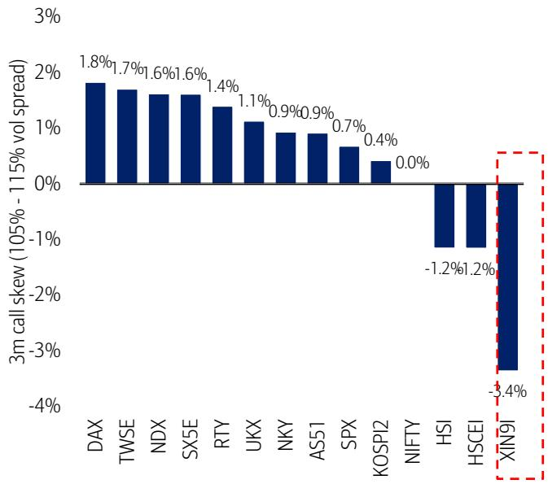

bar

| Ticker | 3m call skew (105% - 115% vol spread) (%) |
|---|---|
| DAX | 1.8 |
| TWSE | 1.7 |
| NDX | 1.6 |
| SX5E | 1.6 |
| RTY | 1.4 |
| UKX | 1.1 |
| NKY | 0.9 |
| AS51 | 0.9 |
| SPX | 0.7 |
| KOSPI2 | 0.4 |
| NIFTY | 0.0 |
| HSI | -1.2 |
| HSCEI | -1.2 |
| XIN9I | -3.4 |

Source: BofA Global Research. Data from 24-Jan+2022 through 15-May-2026 (our good quality data for XIN9I vols goes back to 24 Jun 2022).   
BofA GLOBAL RESEARCH

Exhibit 34: While XIN9I vol is in the 76 $^{th}$ percentile, call skew is in the 7 $^{th}$ percentile, meaning one is buying skew at historically low levels

XIN9I 3-month 105% implied vol and call skew (105% minus 115% vol)   
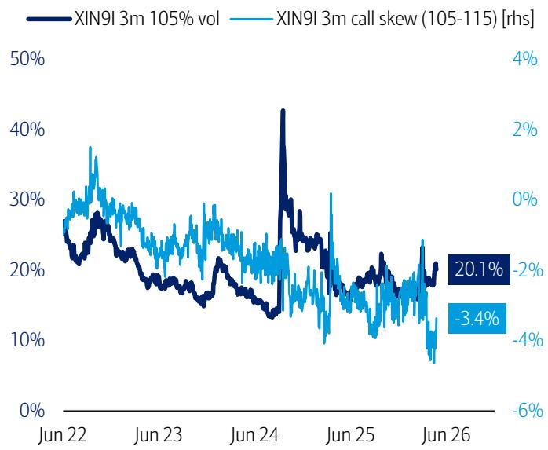

line

| Date   | XIN9I 3m 105% vol | XIN9I 3m call skew (105-115) [rhs] |
|--------|-------------------|------------------------------------|
| Jun 26 | 20.1%             | -3.4%                              |

Source: BofA Global Research. Data from 24-Jan+2022 through 15-May-2026   
BofA GLOBAL RESEARCH

# FTSE China A50 – What's in there and what's not in there

CATL, the world's leading battery manufacturer has the highest weight in the index at $8.8\%$ . Among the top 10, 5 are now IT companies and all are primarily hardware:

Zhongji Innolight (5.5%, US\$171 bn market cap) The world's leading maker of optical transceiver modules, critical for AI data-centre transmission. Earnings momentum will be spurred by surging AI-server spending by US hyperscalers. China's approval of Nvidia H200 chips is poised to be a critical catalyst for the domestic high-speed optical market.

Foxconn (3.8%, \$201 bn) Foxconn Industrial Internet (FII) is a subsidiary of Taiwan's Hon Hai Precision (the world's largest electronics contract manufacturer). The company's top revenue generator and growth driver is its cloud computing division, fuelled by surging global demand for AI servers.

Cambricon (3.7%, \$112 bn) Specialises in AI accelerator chips for cloud servers, edge computing and intelligent devices. As a fabless company, it designs chips manufactured primarily by SMIC and focuses on China's push for technological self-sufficiency.

Hygon IT (3.4%, \$104 bn) \$104 bn) is a fabless semiconductor company specialising in high performance x86-compatible CPUs and deep learning processors / Data Centre Units for servers, workstations and AI computing. Also focusing on China's push for technological self-sufficiency.

Eoptolink (2.9%, \$88 bn) Designs and manufactures high-speed optical transceivers for AI/ML clusters, cloud data centres, telecom and enterprise networks. The company benefits greatly from the global AI infrastructure boom.

At the same time, the more “software” China Tech giants, listed in HK, are not in the FTSE China A50. This includes Tencent and Alibaba (US\$523 bn and \$323 bn market cap companies, respectively).

# Frequently asked questions about the BofA Bubble Risk Indicator (BRI)

In our 2026 Year Ahead report, we introduced the BofA Bubble Risk Indicator (BRI), a price-based measure designed to detect bubble-like instability across financial assets. Given strong client interest, we are now adding a weekly one-page BRI update to the GEVI (see earlier pages). This update will track BRI levels across major markets and asset classes, highlight pockets of equities exhibiting the most froth, and call out recent increases in bubble-like price action. Below, we address some of the most frequently asked questions about the BRI.

The BofA Bubble Risk Indicator is intended to be an indicative metric only and may not be used for reference purposes or as a measure of performance for any financial instrument or contract, or otherwise relied upon by third parties for any other purpose, without the prior written consent of BofA Global Research. The BRI was not created to act as a benchmark.

# 1. How does the BRI quantify 'bubble risk'?

A defining feature of historical asset bubbles is that volatility tends to rise alongside prices. Building on this observation and drawing inspiration from how the four statistical moments characterize a distribution, the BRI quantifies bubble risk using the first four moments of an asset's price action: (i) returns, (ii) realized volatility, (iii) price momentum $^{1}$ , and (iv) fragility/convexity. $^{2}$

These four moments typically become elevated during the frothiest phases of asset bubbles, reflecting the influence of exuberant sentiment, one-sided positioning and imbalanced supply-demand dynamics on price action. The late 90s dotcom bubble in the Nasdaq provides a clear and pertinent illustration of these dynamics (Exhibit 35 & Exhibit 36).

Exhibit 35: Both price returns and price momentum of the Nasdaq rose as the dotcom bubble inflated   
NDX 6m price returns and 6m price momentum   
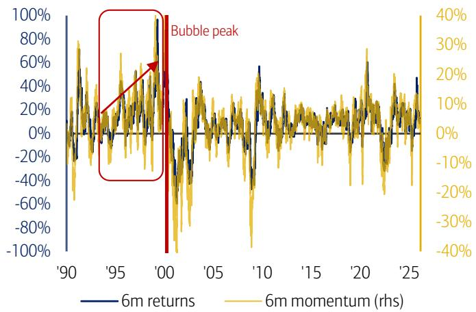

line

| Year | 6m returns | 6m momentum (rhs) |
|------|------------|-------------------|
| '90  | ~0%        | ~0%               |
| '95  | ~-40%      | ~-20%             |
| '00  | ~100%      | ~40%              |
| '05  | ~-20%      | ~-10%             |
| '10  | ~60%       | ~20%              |
| '15  | ~-20%      | ~-10%             |
| '20  | ~70%       | ~30%              |
| '25  | ~50%       | ~20%              |

Source: BofA Global Research. Data from 1-Jan-90 to 16-Jan-26.   
BofA GLOBAL RESEARCH

Exhibit 36: Nasdaq's vol and fragility also rose into the peak of the dotcom bubble as tech stock price rose   
NDX 6m realized vol and 6m realized convexity   
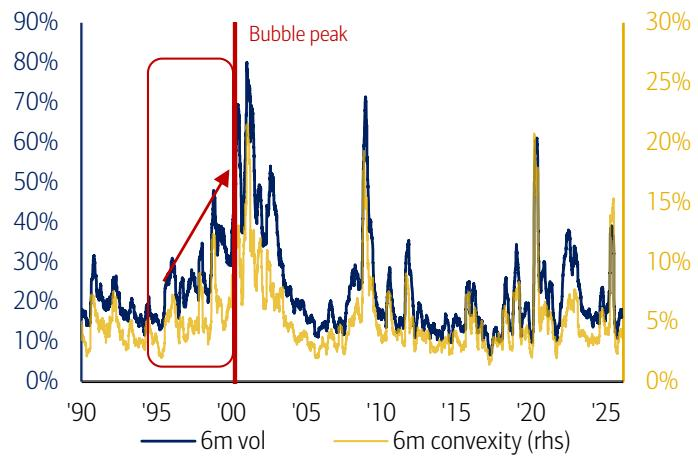

line

| Year | 6m vol | 6m convexity (rhs) |
|------|--------|---------------------|
| '90  | ~15%   | ~5%                 |
| '95  | ~25%   | ~10%                |
| '00  | ~80%   | ~25%                |
| '05  | ~30%   | ~10%                |
| '10  | ~70%   | ~20%                |
| '15  | ~25%   | ~10%                |
| '20  | ~60%   | ~25%                |
| '25  | ~40%   | ~15%                |

Source: BofA Global Research. Data from 1-Jan-90 to 16-Jan-26.   
BofA GLOBAL RESEARCH

# 2. How is the BRI constructed?

The BRI is constructed as an average of three sub-indicators: a short-term, medium-term, and long-term measure. Each sub-indicator ranges from 0 to 1. Using multiple time horizons allows the indicator to capture bubble-risk dynamics that can develop at different speeds.

Each sub-indicator aims to capture how stretched an asset's four moments (returns, vol, momentum, and fragility) are relative to the asset's own history, and is computed as the average of each of these four moments' percentile ranks vs history. $^{3}$ However, given detection of bubble-like behaviour is the primary aim of the indicator, we condition this average percentile rank on periods when the asset is rallying by scaling it up or down depending on how positive or negative returns are. $^{4}$

Exhibit 37 summarizes the construction of the aggregate indicator and its microstructure.

Exhibit 37: The aggregate indicator is an average of 3 sub-indicators that capture short-, medium- and long-term price dynamics. Each sub-indicator is computed as a scaled average percentile rank of the four metrics (returns, vol, momentum & fragility)   
Construction summary of BofA Bubble Risk Indicator   
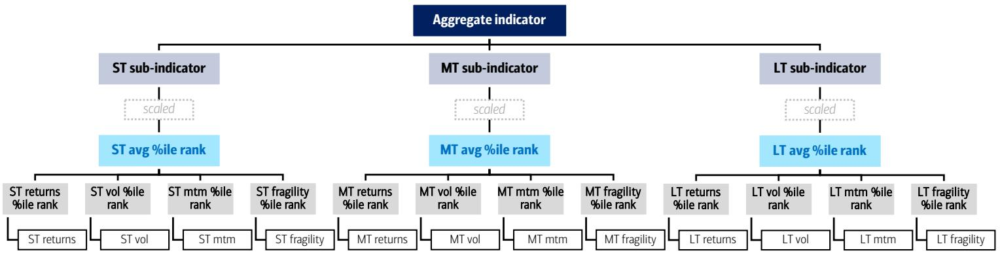

flowchart

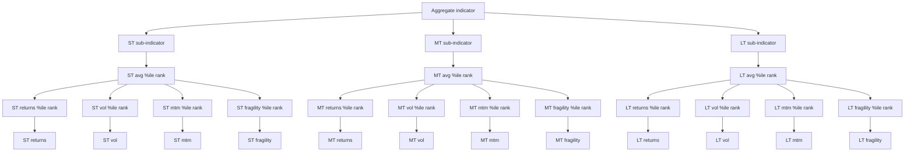
```mermaid
graph TD
    A["Aggregate indicator"] --> B["ST sub-indicator"]
    A --> C["MT sub-indicator"]
    A --> D["LT sub-indicator"]
    B --> E["ST avg %ile rank"]
    C --> F["MT avg %ile rank"]
    D --> G["LT avg %ile rank"]
    E --> H["ST returns %ile rank"]
    E --> I["ST vol %ile rank"]
    E --> J["ST mtm %ile rank"]
    E --> K["ST fragility %ile rank"]
    F --> L["MT returns %ile rank"]
    F --> M["MT vol %ile rank"]
    F --> N["MT mtm %ile rank"]
    F --> O["MT fragility %ile rank"]
    G --> P["LT returns %ile rank"]
    G --> Q["LT vol %ile rank"]
    G --> R["LT mtm %ile rank"]
    G --> S["LT fragility %ile rank"]
    H --> T["ST returns"]
    I --> U["ST vol"]
    J --> V["ST mtm"]
    K --> W["ST fragility"]
    L --> X["MT returns"]
    M --> Y["MT vol"]
    N --> Z["MT mtm"]
    O --> AA["MT fragility"]
    P --> AB["LT returns"]
    Q --> AC["LT vol"]
    R --> AD["LT mtm"]
    S --> AE["LT fragility"]
```

Source: BofA Global Research. ST, MT & LT refer to short-, medium- & long-term; 'mtm' refers to momentum component; %-ile rank' refers to percentile rank.

BofA GLOBAL RESEARCH

# 3. What is a ‘high’ BRI reading and what are its implications?

Since the BRI is defined on a 0 to 1 scale, assets with readings approaching 1 are exhibiting increasingly bubble-like price action. How close to 1? While it is difficult to specify a universal threshold given the plethora of asset-specific dynamics that can present in markets, we find that BRI levels above 0.8 (i.e., top quintile) provide a useful rule of thumb beyond which bubble risks are likely elevated.

Tactically, high BRI readings tend to signal asymmetric downside risk in the near-term (higher risk of the bubble ‘popping’), which we demonstrate empirically later in this section. However, rather than treating the BRI as an explicit sell signal (“get out”), which can risk major underperformance in a bubble, we find the BRI best positioned as a cautionary tool to add asymmetric protection/equity replacement (“watch out”).

# 4. What assets can the BRI be computed on?

Given the BRI relies only on price-based inputs, it can be computed on any asset with a sufficient history of daily price data. Indeed, by inferring sentiment and positioning from price action, the BRI can be applied to assets without explicit fundamental valuation methodologies (e.g., commodities) or those with opaque positioning visibility.

# 5. What has the BRI looked like in past asset bubbles?

Exhibit 38 demonstrates what the BRI framework would have looked like when applied to eight historically well-recognized asset bubbles. As these bubbles formed, increasingly stretched returns, vol, momentum, and fragility pushed BRI readings towards 1. Indeed, seven of the eight bubbles saw their peaks concurrent to a BRI reading above 0.8.

The forward distribution of returns during these bubbles conditional on the BRI would have shown higher near-term downside risk after the BRI breached 0.8 (Exhibit 39), with broadly similar upside potential (Exhibit 40).

Exhibit 38: Looking at eight historical asset bubbles from a distributional lens using the BRI methodology reveals increasingly elevated returns, vol, momentum and fragility in the asset bubble formation process, as seen by rising levels of the indicator towards 1   
BofA Bubble Risk Indicator during historical asset bubbles   
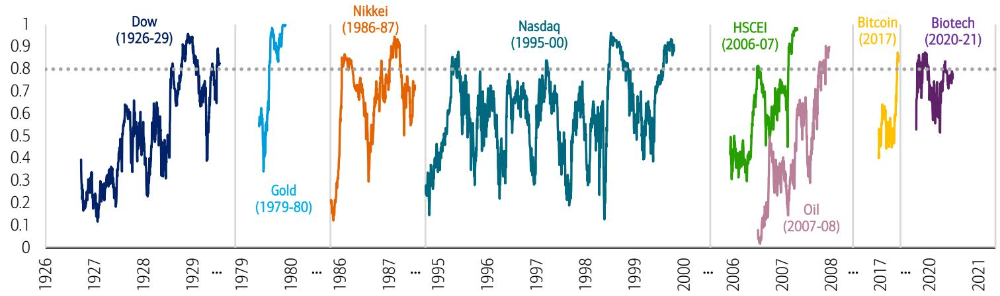

line

| Year | Stock           | Value |
|------|-----------------|-------|
| 1926 | Dow (1926-29)   | -     |
| 1979 | Gold (1979-80)  | -     |
| 1986 | Nikkei (1986-87) | -     |
| 1995 | Nasdaq (1995-00) | -     |
| 2006 | HSCEI (2006-07) | -     |
| 2007 | Oil (2007-08)   | -     |
| 2008 | Bitcoin (2017)  | -     |
| 2020 | Biotech (2020-21) | -    |

Source: BofA Global Research. Data from Jan-1926 to Feb-2021. Underlying Bloomberg tickers: INDU for Dow (Oct-1926 to Sep-1929), XAU for Gold (Jul-1979 to Jan-1980), NKY for Nikkei (Jan-1986 to Oct-1987), NDX for Nasdaq (Jan-1995 to Mar-2000), HSCEI for HSCEI (Jun-2006 to Oct-2007), CO1 for Oil (Jan-2007 to Jul-2008), XBTUSD for Bitcoin (Jul-2017 to Dec-2017), SPSIBI for Biotech (May-2020 to Feb-2021).   
BofA GLOBAL RESEARCH

Exhibit 39: The median 3m max draw-down following indicator readings above 0.8 would have been more adverse than when below 0.8 during historical asset bubbles   
Median 3m max draw-down during historical asset bubbles (i) after indicator <0.8, (ii) after indicator >= 0.8   
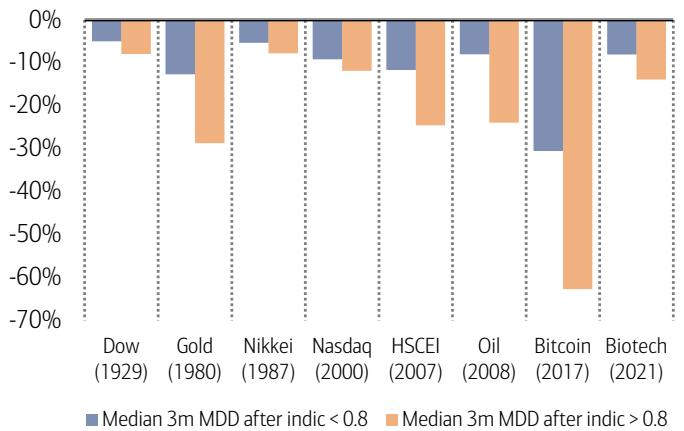

bar

| Company (Year) | Median 3m MDD after indic < 0.8 (%) | Median 3m MDD after indic > 0.8 (%) |
|---|---|---|
| Dow (1929) | -5 | -8 |
| Gold (1980) | -12 | -28 |
| Nikkei (1987) | -4 | -6 |
| Nasdaq (2000) | -7 | -10 |
| HSCEI (2007) | -8 | -24 |
| Oil (2008) | -7 | -23 |
| Bitcoin (2017) | -30 | -64 |
| Biotech (2021) | -6 | -13 |

Source: BofA Global Research. Underlying tickers / date ranges: INDU for Dow (Oct-1926 to Sep-1929), XAU for Gold (Jul-1979 to Jan-1980), NKY for Nikkei (Jan-1986 to Oct-1987), NDX for Nasdaq (Jan-1995 to Mar-2000), HSCEI for HSCEI (Jun-2006 to Oct-2007), CO1 for Oil (Jan-2007 to Jul-2008), XBTUSD for Bitcoin (Jul-2017 to Dec-2017), SPSIBI for Biotech (May-2020 to Feb-2021).   
BofA GLOBAL RESEARCH

Exhibit 40: The median 3m max draw-up would have been similar at both high and low indicator readings, suggesting that de-risking completely following high indicator levels can risk underperformance   
Median 3m max draw-up during historical asset bubbles (i) after indicator < 0.8, (ii) after indicator >= 0.8   
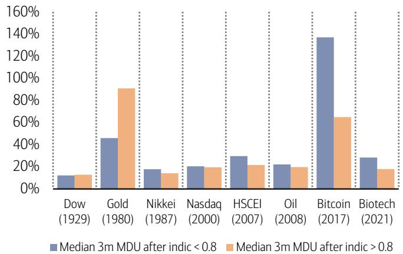

bar

| Company | Median 3m MDU after indic < 0.8 (%) | Median 3m MDU after indic > 0.8 (%) |
| :--- | :---: | :---: |
| Dow (1929) | 10 | 12 |
| Gold (1980) | 45 | 90 |
| Nikkei (1987) | 16 | 13 |
| Nasdaq (2000) | 20 | 19 |
| HSCEI (2007) | 30 | 21 |
| Oil (2008) | 21 | 19 |
| Bitcoin (2017) | 137 | 64 |
| Biotech (2021) | 28 | 17 |

Source: BofA Global Research. Underlying tickers / date ranges: INDU for Dow (Oct-1926 to Sep-1929), XAU for Gold (Jul-1979 to Jan-1980), NKY for Nikkei (Jan-1986 to Oct-1987), NDX for Nasdaq (Jan-1995 to Mar-2000), HSCEI for HSCEI (Jun-2006 to Oct-2007), CO1 for Oil (Jan-2007 to Jul-2008), XBTUSD for Bitcoin (Jul-2017 to Dec-2017), SPSIBI for Biotech (May-2020 to Feb-2021).   
BofA GLOBAL RESEARCH

# 6. Can an asset with a high BRI reading not be in a bubble?

Yes. One of the risks stemming from the BRI's exclusive use of price data is instances of ‘false positives’ when the indicator appears stressed, but the asset doesn't appear to be in a bubble based on other metrics. For example, semiconductor stocks exhibited frothy behaviour in the immediate aftermath of ChatGPT's release in Nov-22 but also saw a fundamental shift and expansion of their business model in the AI era.

Another scenario of a high BRI level that may not point to a bubble is in the immediate aftermath of an exogenous shock (e.g., COVID), where vol/fragility remain high and prices are retracing their drawdown. In such cases, the interpretation of a high BRI level requires additional context.

# 7. Can an asset in a bubble have a low BRI reading?

Yes. A related limitation of the BRI's reliance on price data is the implicit assumption that the asset bubble in question would result in historically elevated instability. While the typical evolution of a bubble sees this happen as stretched positioning and exuberance translate into volatile & fragile rallies with high momentum into the peak, outlier cases where the bubble peak sees the bull run end in a whimper can occur and are a challenge for the BRI (e.g., the Nikkei bubble in the 1980s, which saw its most unstable rally earlier rather than later).

# 8. How can one use the short-term to long-term sub-indicators of the BRI?

As discussed above, the BRI aggregates short-term, medium-term, and long-term sub-indicators to capture asset price dynamics across multiple horizons. In addition to examining the sub-indicators to understand shorter vs longer-term trends, we also find the range across sub-indicators provides a confidence level on the BRI reading, with tighter ranges providing higher confidence. For example, a 0.7 BRI reading is likely more informative when the sub-indicators span 0.6 to 0.8 than when they range from 0.4 to 1.0, where disagreement across horizons suggests greater uncertainty.

# 9. What other indicators can help confirm elevated bubble risk?

At its core, the BRI is simply a parsimonious transformation of prices, avoiding a “kitchen-sink” approach that incorporates explicit positioning, leverage, or PB data. This keeps the framework robust to overfitting and makes it applicable across assets, regions, and historical periods where such data are often unavailable or unreliable.

Despite the appeal of such an approach, we find the BRI most effective when used in conjunction with complementary tools that can help assess whether frothy price action is supported by fundamentals – for example, more traditional valuation (e.g., PV of cash flows, valuation multiples, etc.) and/or positioning metrics (e.g., leverage, inflows, retail trading volumes etc.) where available.

# 10. What universe of assets will be covered in the BofA BRI Landscape?

We plan to include BRI levels on a broad set of assets covering global equity indices, large cap US equity sector indices (including the “Magnificent 7”), major commodities (including the BCOM Index), and major cryptocurrencies (Bitcoin and Ethereum). In addition to this core cross-asset universe, we plan to apply the BRI framework to popular equity themes that have experienced significant inflows over the prior week. This thematic lens is designed to spot emerging pockets of froth that may not yet be visible at the broader index or sector level.

# Summary of Open Trades (19-May-26)

Price data for open level reflects the price on open date and does not necessarily reflect the price at which the trade could be executed at the date of this report. Our trades are structured to be executed on the open date and are not necessarily appropriate to execute as formulated beyond that date.

Table 1: Summary of open trades as of 19-May-26

Summary of open trades as of 19-May-26

<table><tr><td>Trade Description</td><td>Open Date</td><td>Open Level</td><td>Expected Trade Term</td><td>Rationale</td></tr><tr><td>Buy an SX5E Dec26 5000 call (for 9% indic., spot ref 4895, 45delta, 62bps vega), initially delta-hedged</td><td>5-Mar-24</td><td>9%</td><td>Dec-26</td><td>Don&#x27;t miss a generational opportunity to lock in record low long-dated EU vol</td></tr><tr><td>Buy an SX5E Dec26 5000 call (for 9% indic., spot ref 4895, 45delta, 62bps vega), initially delta-hedged</td><td>05-Mar-24</td><td>9%</td><td>Dec-26</td><td>Attractive opportunity to lock in record low long-dated EU vol</td></tr><tr><td>Replicate a NKY Dec25-Dec26 36.5K FVA straddle with a static strip of options at an implied FVA level of 18.6. To trade US$100k vega</td><td>9-Sep-24</td><td>18.6v</td><td>Dec26</td><td>Long discounted Nikkei vol: Fixed strike Dec-25/Dec-26 FVA straddles at 18.6%</td></tr><tr><td>Consider financing the call ratio (&quot;Trade 1&quot;) by selling a NKY 1-month 80% put for 0.99%</td><td>7-Apr-25</td><td>0.99%</td><td>Jun25</td><td>Catching a falling knife at lower risk: NKY 2m call ratios funded by 1m 80% put</td></tr><tr><td>Buy NKY Dec25/Dec26 31,000 straddle FVAs for 21.27% (indic. Q=2.5%, R=0.5%)</td><td>7-Apr-25</td><td>21.27%</td><td>Dec25</td><td>Buy Nikkei Dec25/Dec26 straddle FVAs at 21% - 4% below current 12m ATM vol</td></tr><tr><td>Trade (SPX upvar): Buy SPX Dec26 80% upvar for 18.45v indicatively (t &amp; t-1 convention; var ref. 24.55v; fwd ref. 5551).</td><td>28-Apr-25</td><td>18.45v</td><td>Dec26</td><td>Position for spot up, vol up which leverage elevated tail skew and inverted term structure</td></tr><tr><td>Trade (SPX fwd upvar): Buy SPX Dec25/Dec26 80% fwd upvar for 17v indicatively (t &amp; t-1 convention; fwd var ref. 23.6v; fwd ref. 5551).</td><td>28-Apr-25</td><td>17v</td><td>Dec26</td><td>Position for spot up, vol up which leverage elevated tail skew and inverted term structure</td></tr><tr><td>Long SPX 2028 annual dividend futures/short SPX 2026 annual dividend futures for $1.15 net indicatively</td><td>6-May-25</td><td>$1.15</td><td>Dec26</td><td>Position for the normalization of the dividend futures curve as time moves towards maturity and dividend growth is priced back in</td></tr><tr><td>Long SX5E Dec26 dividends, vs short SPX Dec26 dividends.</td><td>6-May-25</td><td>$0.00</td><td>Dec26</td><td>Dec26 dividends are more heavily discounted for SX5E than for SPX, despite what we view as higher earnings risk in SPX companies, relative to SX5E</td></tr><tr><td>Buy SPX Dec26 110% upvar for 11.25v indic. (t &amp; t-1 convention; var ref. 23v; fwd ref. 5915)</td><td>2-Jun-25</td><td>11.25v</td><td>Dec26</td><td>Hedge upside pain with long delta, long vol positions that leverage elevated long-dated tail skew</td></tr><tr><td>Buy SPX Dec25Dec26 110% fwd upvar for 11.36v indic. (t &amp; t-1 convention; fwd var ref. 23.3v; fwd ref. 5915).</td><td>2-Jun-25</td><td>11.36v</td><td>Dec26</td><td>Hedge upside pain with long delta, long vol positions that leverage elevated long-dated tail skew</td></tr><tr><td>NIFTYM 31-Jul-25 24,400 23,500 1x3 put ratios for USD 36 (-0.14% of spot, indic. spot ref: 24,946, -8.8d, vols: 14.58%/16.23%)</td><td>16-Jun-25</td><td>0.75%</td><td>Sep25</td><td>Election and geopolitics: Replace longs by Nikkei calls contingent on weaker yen</td></tr><tr><td>-1x 24,400 put (-29d) &amp; +3x 23,500 puts (-12d)</td><td></td><td></td><td></td><td></td></tr><tr><td>Buy SPX Dec26 ATM upvar for 12.2v indicatively (t &amp; t-1 convention; var ref. 22.5v)</td><td>11-Aug-25</td><td>12.2v</td><td>Dec26</td><td>Leverage record steep tail skew to enter into long vol positions via upvar</td></tr><tr><td>Sell SPX Dec26 var, buy SPX Dec26 60% upvar, to collect 3.5v indicatively (t &amp; t-1 convention; var ref. 22.5v)</td><td>11-Aug-25</td><td>3.5v</td><td>Dec26</td><td>Leverage record steep tail to enter into carry trade via upvar vs var</td></tr><tr><td>Sell SX5E Dec26 var, buy SX5E Dec26 60% upvar, to collect 3.1v indicatively (t &amp; t-1 convention; var ref. 21v).</td><td>18-Aug-25</td><td>3.1v</td><td>Dec 26</td><td>Vol-focused? Collect &gt;3v on SX5E Upvar vs Var</td></tr><tr><td>Buy 1-year 105% 130% call spreads on a CSI 1000 tracking basket* for 3.52% (18d, 29v both legs). Consider fully financing the trade by selling 1-year 73.5% puts (37d, 29v calls vs 29.5v put)</td><td>13-Sep-25</td><td>3.52%</td><td>Oct-26</td><td>The low-cost/low risk way to buy China – deeply discounted call spreads</td></tr><tr><td>Sell initially delta-hedged KOSPI2 30-Dec-25 110% calls and collect 1.12% (indic. spot ref 535.28, 23.7% vol, 20d). Consider hedging the risk of a global tech rally into year-end by buying QQQ 31-Dec-25 110% calls against the KOSPI2 calls for 0.56% (17.8% vols, 14d)</td><td>20-Oct-25</td><td>1.12/0.56%</td><td>30-Dec-25</td><td>Kospi call vols near Liberation Day spike – Finally time to sell vol &amp; hedge delta?</td></tr><tr><td>Buy SPX Dec26 ATM upvar for 13.95v indicatively (10v disc to vanilla; t &amp; t-1 convention; Dec26 var ref. 24v).</td><td>3-Nov-25</td><td>13.95v</td><td>Dec26</td><td>Own spot-up, vol-up exposure as AI bubble continues to inflate.</td></tr><tr><td>Buy 1x 20-Mar-2026 106% call on a CSI 1000 tracking basket* for 2.92% (+29d, 27.4v). Sell 1x ASHR US 20-Mar-2026 35 call for $0.71 (~2.15% of spot; the 35.00 strike is 106% of spot, ref 33.00) (= several banks offer CSI tracking baskets; indic. in quanto USD)</td><td>3-Nov-25</td><td>2.92/2.15%</td><td>20-Mar-26</td><td>CSI 1000 v ASHR calls: Benefit from repo with less China directional risk</td></tr><tr><td>Sell NKY 9-Jan-26 55,000 calls for a JPY589 credit (~1.12% of spot, or 6.7% annualised, 23d 23.1 vol)</td><td>10-Nov-25</td><td>JPY589</td><td>9-Jan-26</td><td>Sell 99th percentile Nikkei calls as the Japan catch-up rally may take a breather</td></tr><tr><td>Buy Dec26 80% put on basket of HYG (38%), SPX (29%), XLF (29%) &amp; EEM (4%) for 1.46% (27% cheaper vs avg of individual legs)</td><td>26-Nov-25</td><td>1.46%</td><td>18-Dec-26</td><td>The convergence of private and public market risk creates opportunities for hedging private risk with liquid, public market hedges. Crucially, stress in public assets closely linked to private markets may ultimately impact private valuations, while potential hedge gains will give investors the flexibility to add risk at better terms.</td></tr><tr><td>Buy a basket of Dec26 90-70 put spreads on individual underlyings: SPX (53%), XLF (32%), TLT (9%) &amp; EEM (6%) for 2.66% (weighted max payout ratio of put spreads is 7.7x)</td><td>26-Nov-25</td><td>2.66%</td><td>18-Dec-26</td><td>Given the higher volatility of the PE hedge constituents and significant decorrelation potential, we prefer buying put spreads on individual constituents rather than on the basket</td></tr><tr><td>Buy NDX Dec26 ATM upvar, currently 19.1v but target an entry level closer to 17v (t &amp; t-1 convention, var ref. 29.9v)</td><td>26-Nov-25</td><td>19.1v / target 17v</td><td>18-Dec-26</td><td>Trade long-delta, long vol via upvar to capture the spot-up, vol-up typically seen in asset bubbles, with a deep discount to vanilla var</td></tr><tr><td>Buy QQQ Jun26 660-750 call spread for $18 (~35D/10D strikes, 5x max payout ratio, ref. 605.16)</td><td>26-Nov-25</td><td>$18</td><td>18-Jun-26</td><td>Asymmetrically capture equity upside while hedging a grind higher, which upvar can be vulnerable to</td></tr><tr><td>Buy 6-month 105% 125% call spreads on a CSI 1000 tracking basket for 2.53% (indic. 20d, 27.1v/28.7v, quanto USD)</td><td>26-Nov-25</td><td>2.53%</td><td>15-May-26</td><td>The &quot;artificially&quot; cheap CSI 1000 forward corresponds to an 8 vol discount. Investors can buy the most exciting part of the Chinese stock market, including AI innovation, at unusually low &amp; limited risk</td></tr><tr><td>Buy long-dated OTM puts on NVDA, delta-hedged (e.g., NVDA 2y 10-delta puts)</td><td>26-Nov-25</td><td>$8.30 / 49v</td><td>21-Jan-28</td><td>Tail hedge the AI trade with long-dated NVDA vol, which historically would have shown &gt;35x payout vs carry cost.</td></tr><tr><td>Sell SX5E Jun26 var (22.8v) &amp; buy 1.7x Jun27 var (23.7v)</td><td>26-Nov-25</td><td>22.8v/23.7v</td><td>19-Jun-26</td><td>Long fwd var is most attractive for SX5E vs global peers. Resize legs to cut carry cost by 4v (45% better vs regular sizing) while preserving risk/reward</td></tr><tr><td>Buy 110% Dec26 SPX calls qEUR for 4.33% (17 bps over vanilla)</td><td>26-Nov-25</td><td>4.33%</td><td>18-Dec-26</td><td>Foreign investors with unhedged FX risk in their equity investments can be subject to large swings on USD volatility, which quanto options can protect against.</td></tr><tr><td>Buy 90% Dec26 SPX puts qAUD for 3.66% (16bps less than vanilla)</td><td>26-Nov-25</td><td>3.66%</td><td>18-Dec-26</td><td>Foreign investors with unhedged FX risk in their equity investments can be subject to large swings on USD volatility, which quanto options can protect against.</td></tr></table>

Table 1: Summary of open trades as of 19-May-26

Summary of open trades as of 19-May-26

<table><tr><td>Trade Description</td><td>Open Date</td><td>Open Level</td><td>Expected Trade Term</td><td>Rationale</td></tr><tr><td>Buy Dec26 ATMF call on return dispersion on bank names for 3.50% and strike of 17.28% (SX7E spot ref: 234.93).</td><td>26-Nov-25</td><td>3.50%</td><td>18-Dec-26</td><td>EU banks&#x27; broad thematic tilt supports ongoing return dispersion. Trade gains 50% of time (including recently) and offers a 2.3x reward/risk.</td></tr><tr><td>Buy Jun26 NKY &gt; 104% &amp; USDJPY &lt; 96% dual digital for 9.7% (+48 correl offer, 10.3x max payout, ref. 48626, 157).</td><td>26-Nov-25</td><td>9.7%</td><td>12-Jun-26</td><td>Moderate Nikkei upside trades can be cheapened by 80% if willing to lean optimistic on the yen. Narrowing US-JP rate differentials could weigh on USD/JPY in &#x27;26 but doesn&#x27;t have to be Nikkei negative.</td></tr><tr><td>Buy 1x 20-Mar-2026 106% call on a CSI 1000 tracking basket* for 2.32% (+27d, 26v). Sell 1.05x ASHR US 20-Mar-2026 34 calls for $0.55 (~1.73% of spot; the 34.00 strike is ~107% of spot, ref 31.76)</td><td>26-Nov-25</td><td>2.32%/-1.73%</td><td>20-Mar-26</td><td>The long/short trade extracts value from the rich repo for Chinese small caps while limiting directional risk. Trading calls vs calls manages the risk of small caps underperforming. Beta-neutral sizing yielded 8% p.a. on gross notional at 8% vol</td></tr><tr><td>Buy Jun26 105% DAX call contingent on CAC &lt; 105% at expiry</td><td>26-Nov-25</td><td>1.24%</td><td>19-Jun-26</td><td>We like risk-limited trades that fade recent strength in CAC given the French fiscal overhang to fund German equity upside in case optimism returns for German growth.</td></tr><tr><td>Buy KOSPI2 3-month put vs. short call spread for a 0.39% of spot, +1x 88% put / -1x 110% call / +1x 120% call</td><td>12-Jan-26</td><td>0.39%</td><td>Apr26</td><td>Lock in Kospi&#x27;s memory-fuelled rally by leveraging cheapest skew</td></tr><tr><td>Long CAC Mar26-Jun26 zero-cost put calendars, e.g. a Jun26 30D put fully funds ~1.6x Mar26 30D puts (spot ref: 8336.72)</td><td>12-Jan-26</td><td>0</td><td>Jun26</td><td>French political/fiscal drama is back, but is CAC vol still on holiday?</td></tr><tr><td>Long Jun26 105% DAX call, contingent on CAC &lt; 105% at expiry for 1.12% (&gt;50% discount vs vanilla calls)</td><td>12-Jan-26</td><td>1.12%</td><td>Jun26</td><td>French political/fiscal drama is back, but is CAC vol still on holiday?</td></tr><tr><td>Buy NKY 6-month 95% put with vol knock out at 28% for 1.59% (indic., spot ref: 52,991, -11d, 69% discount to vanilla)</td><td>20-Jan-26</td><td>1.59%</td><td>Jul26</td><td>JGB selloff and election risk – Use VKOs to cheapen Nikkei puts by 69%</td></tr><tr><td>Buy Jun26 110% Worst-of Call on SXPP, SXEP, SX7E for 76bps offer (~50% discount vs the cheapest vanilla, spot refs: SXPP 737.05, SXEP 435.90, SX7E 275.44).</td><td>2-Feb-26</td><td>76bps</td><td>Jun26</td><td>Don&#x27;t get caught short Europe pt.2: Cheapen upside with record-low correlations</td></tr><tr><td>Buy HSECI 17-Apr-26 9,500 10,500 call spreads financed by selling 8,500 puts for $73 (indic. OOF, Apr fut ref 9,222, 47d)</td><td>9-Feb-26</td><td>$73</td><td>Apr26</td><td>Stronger CNY boosting Hong Kong: HSCEI call spread collars for 14x max payout</td></tr><tr><td>Buy an 18-Sep-26 105% worst-of call on KOSPI2 / TSM US / GLD US for 3.28% (indic. qUSD, 50% disc to cheapest call, on GLD)</td><td>17-Feb-26</td><td>3.28%</td><td>18-Sep-26</td><td>Gain cheap exposure to upside in KOSPI, TSM, GLD if bubble like price action continues</td></tr><tr><td>Buy 1.00x 18-Jun-2026 106% call on a CSI 1000 tracking basket* for 3.58% (+31d, 29v). Sell 1.05x ASHR US 18-Jun-2026 36 calls for $0.74 (~2.20% of spot; the 36.00 strike is ~106% of spot, ref 33.82)</td><td>17-Feb-26</td><td>1.38%</td><td>18-Jun-26</td><td>The long/short trade extracts value from the rich repo for Chinese small caps while limiting directional risk</td></tr><tr><td>Buy Sep26 NKY&gt;104% &amp; USDJPY&lt;98% dual digital for 16% (+32 correl offer, ref: 56,942, 153.6) 6.25x max payout</td><td>17-Feb-26</td><td>16%</td><td>Sep26</td><td>Nikkei upside trades can be cheapened if willing to lean optimistic on the yen. Indeed, the yen rallied 3.0% in the week after the 8-Feb lower house election and the Nikkei was up 5.0%</td></tr><tr><td>Long SPX 2028 annual dividend futures outright for $80.80 indicatively.</td><td>2-Mar-26</td><td>$80.80</td><td>Dec28</td><td>Flat SPX div term structure cheapens long dated futures that could converge to bottom up div estimates as uncertainty risks decay</td></tr><tr><td>Buy SPX Jun26 95% put contingent on Brent &gt; 130 for 84bps indicatively (68% discount to vanilla; ref: 6643.11, 101.84)</td><td>16-Mar-26</td><td>84bps</td><td>Jun26</td><td>Target the geopolitical pain trade via equity-oil hybrids</td></tr><tr><td>Buy VIX May26 18/25/40 call spread collar for $1.03 indicatively on mids + bid-offer TBD at time of trade (14.5x max payout ratio; UXK6 ref. 22.95)</td><td>16-Mar-26</td><td>$1.03 mid</td><td>May26</td><td>Own equity vol cheaply with VIX call spread collars</td></tr><tr><td>Buy US 6m5y receivers ATM-25bps contingent on SPX &lt; 100% for 34c indicatively (ref. 3.63%, 6650)</td><td>2-Apr-26</td><td>34c</td><td>2-Oct-26</td><td>Hedge slowdown expectations cheaply using equity-rates correlation at historic entry point</td></tr><tr><td>Buy 5y SOFR &lt; ATM-25bp &amp; SPX &lt; 92.5% 6m dual digitals for 10% indicatively (ref. 3.63%, 6650)</td><td>2-Apr-26</td><td>10%</td><td>2-Oct-26</td><td>Hedge slowdown expectations cheaply using equity-rates correlation at historic entry point</td></tr><tr><td>Buy VIX May 25-35 call spread for $0.82 indicatively (12.2x max payout; UXK6 ref. 21.05).</td><td>13-Apr-26</td><td>$0.82</td><td>May26</td><td>Hedge geopolitical re-escalation with long vol VIX call spreads</td></tr><tr><td>Buy QQQ 29-May-26 635 call for $9 indicatively (1.46% of spot; ~103% / 35d strike; 16.8v; ref: 617.507).</td><td>13-Apr-26</td><td>$9</td><td>29-May-26</td><td>Position for continued tech momentum while remaining limited risk with QQQ calls</td></tr><tr><td>SXE P Jun26 500 (~30D) puts initially delta-hedged</td><td>20-Apr-26</td><td>2.3% (put)</td><td>Jun26</td><td>Ceasefire or Crossfire? Own SXEP initially delta-hedged puts as vol is cheap</td></tr><tr><td>Buy QQQ 29-May-26 665-700 call spread for $7.5 indicatively (~35d/10d strikes, 4.7x payout, ref: 646.85)</td><td>20-Apr-26</td><td>$7.5</td><td>29-May-26</td><td>Keep up safely with US equity rally while taking advantage of attractive call skew</td></tr><tr><td>Buy VIX May 24-40 call spread for $0.93 indicatively (~35d/10d strikes, 17.2x max payout, UXK6 ref. 20.81)</td><td>20-Apr-26</td><td>$0.93</td><td>May26</td><td>Hedge geopolitical re-escalation with long vol VIX call spreads</td></tr><tr><td>Long Dec27 NDX vs SPX variance swap switch for 5.25v indicatively</td><td>20-Apr-26</td><td>5.25v</td><td>Dec27</td><td>Position for asymmetric AI &amp; tech IPO exposure as potential AI bubble inflates</td></tr><tr><td>Sell SOXX Jun26 485-540 1x2 call ratios (-1x / +2x), delta-hedged (~40d/20d strikes; ~41v/43v; ref: 455.410)</td><td>27-Apr-26</td><td>41v/43v</td><td>Jun26</td><td>Own upside convexity and gamma in semis, which are showing bubble-like instability</td></tr><tr><td>Buy SPX Jun 6900 / 7600 risk reversal (-1x / +1x), delta-hedged (~95% / 105% strikes; 19.15v/11.96v; spot ref: 7268.50).</td><td>5-May-26</td><td>~19.2v/12v</td><td>Jun26</td><td>Given relative pricing of call &amp; put vols, and the propensity for momentum to persist in today&#x27;s reflexive markets, own upside gamma while monetizing downside skew.</td></tr><tr><td>SPX &gt; 109% / USDJPY &gt; 100% Sep &#x27;26 dual digitals for 10% indic (10x max payout; target=90c; stop=10c, ref: 7360/156.73, -6 correl)</td><td>8-May-26</td><td>10%</td><td>Sep26</td><td>Cheaply keep up with equity rally using limited risk SPX-USDJPY hybrids</td></tr><tr><td>Buy Jun26 1x2 +19-17 V2X put ratios for 0.475 (fut ref: 21.95)</td><td>11-May-26</td><td>0.475</td><td>Jun26</td><td>Fade VSTOXX&#x27;s &#x27;war risk premium&#x27; with long put ratios</td></tr><tr><td>Buy VIX Jun 25-40 call spread for $1 indic (15x max payout; UXM6 ref. 20.95)</td><td>11-May-26</td><td>$1</td><td>Jun26</td><td>Hedge equity downside with long vol to mitigate strike risk in bull run</td></tr><tr><td>Buy QQQ Dec26 90% max lookback put (daily obs.), sell QQQ Dec26 80% vanilla put, for 3.57% indic. (+1x, -1x, ref: 713.29)</td><td>11-May-26</td><td>3.57%</td><td>Dec26</td><td>Mitigate strike &amp; timing risk in strong momentum environment with expanding put spreads</td></tr><tr><td>SX7E Jul26 102% calls contingent on SX7P remaining at or below 102% for 0.77% qEUR (78% discount vs SX7E vanilla calls; 90% implied correl).</td><td>18-May-26</td><td>0.77%</td><td>Jul26</td><td>Position for continued UK political uncertainty</td></tr><tr><td>SX5E &gt; 105%, EURGBP &gt; 0.88 Jul26 dual digital for 7.69% (implied correlation offer -22%, refs: 5800 &amp; 0.87 respectively, 13x max payout)</td><td>18-May-26</td><td>7.69%</td><td>Jul26</td><td>Position for continued UK political uncertainty</td></tr><tr><td>NDX Sep26 107% calls contingent on GBPUSD &lt;1.32 for 1.06% (60% discount vs vanilla, refs: 29125 and 1.335 respectively)</td><td>18-May-26</td><td>1.06%</td><td>Sep26</td><td>Position for continued UK political uncertainty</td></tr><tr><td>Buy TLT Jun 82-78 put spread for 51c indicatively (7.8x max payout ratio; 30d-8d strikes; ref: 83.65)</td><td>18-May-26</td><td>$0.51</td><td>Jun26</td><td>Hedge rising long-end yields with TLT put spreads offering historically attractive payout ratios</td></tr></table>

# Summary of Closed Trades (19-May-26)

Table 2: Summary of closed trades as of 19-May-26

Summary of closed trades as of 19-May-26

<table><tr><td>Trade Description</td><td>Open Date</td><td>Open Level</td><td>Close Level</td><td>Close Date</td><td>Rationale</td></tr><tr><td>Sell 1x VIX Jun fut, buy 2.5x VIX Sep fut; hold for at most one month (UXM5 ref. 25.0608, UXU5 ref. 23.4036)</td><td>14-Apr-25</td><td>$0.00</td><td>-$0.1141</td><td>21-May-25</td><td>Trade exited early</td></tr><tr><td>Buy SPX 23-May-25 5900 / 6050 1x2 call ratio (buy 1x / sell 2x) for $29.4 indicatively (spot ref. 5844.19)</td><td>12-May-25</td><td>$29.40</td><td>0</td><td>23-May-25</td><td>Trade expired</td></tr><tr><td>Buy QQQ 30-May-25 490/515 1x2 call ratio (buy 1x, sell 2x) for $4.27 indicatively (5.9x max payout ratio; 30D/9D strikes)</td><td>28-Apr-25</td><td>$4.27</td><td>$20.89</td><td>30-May-25</td><td>Trade expired ITM</td></tr><tr><td>Buy SPX over RTY 103% Jun25 outperf. call cont. on RTY up</td><td>26-Nov-24</td><td>0.59%</td><td>0</td><td>20-Jun-25</td><td>Trade expired</td></tr><tr><td>Buy SPX Jun 5400/5000/4600 put fly (+1x/-2x/+1x) for $39.2 (10x max payout ratio; net delta = -8; ref. 5614.56)</td><td>10-Mar-25</td><td>$39.20</td><td>0</td><td>20-Jun-25</td><td>Trade expired</td></tr><tr><td>Buy SPX &lt; 95% &amp; 10y SOFR &lt; ATMf-30bps Jun25 dual digital for 9.25% indicatively (10.8x max payout ratio; ref. 5650, 3.78%)</td><td>10-Mar-25</td><td>9.25%</td><td>0</td><td>20-Jun-25</td><td>Trade expired</td></tr><tr><td>Buy VIX Jun 25/35 call spread for 89c indicatively (11.2x max payout ratio; UXM5 ref. 20.01)</td><td>17-Mar-25</td><td>$0.89</td><td>0</td><td>18-Jun-25</td><td>Trade expired</td></tr><tr><td>Buy Jun triple digital SPX &lt; 95%, 10Y SOFR &gt;ATMf+10bps, EURUSD &gt;102% for 8% offer (12x max payout, ref. 5460, 3.84%, 1.134)</td><td>14-Apr-25</td><td>8%</td><td>0</td><td>20-Jun-25</td><td>Trade expired</td></tr><tr><td>Sell VIX Jun 17 puts (UXM5 ref. 19.5) to buy SPX Jun 5950/6150 call spreads (spot ref. 5844.19).</td><td>12-May-25</td><td>$0</td><td>$17.84</td><td>20-Jun-25</td><td>Trade expired ITM</td></tr><tr><td>Buy SPX &gt;102%, USO &lt; 95% Jun dual digital for 14% indicatively (spot ref. 5850, 68.1)</td><td>12-May-25</td><td>14%</td><td>0</td><td>20-Jun-25</td><td>Trade expired</td></tr><tr><td>Buy SPX &gt;RTY Jul25 ATM outperf call for 2.86% indicatively (+85 correl bid; ref. 5747, 2095)</td><td>24-Mar-25</td><td>2.86%</td><td>2.65%</td><td>18-Jul-25</td><td>Trade expired ITM</td></tr><tr><td>Buy SPX &gt;RTY Jul25 ATM outperf call conditional on SPX &lt; 100% for 1.42% indicatively (50% discount to unconditional; +85 correl bid; ref. 5747, 2095)</td><td>24-Mar-25</td><td>1.42%</td><td>0</td><td>18-Jul-25</td><td>Trade expired</td></tr><tr><td>Buy SPX Jul 95% put contingent on 30y SOFR &gt;ATMf + 25bps at expiry for 0.36% indicatively (67% discount to vanilla put; +9 correl bid; ref. 5980, 4.06%)</td><td>19-May-25</td><td>0.36%</td><td>0</td><td>18-Jul-25</td><td>Trade expired</td></tr><tr><td>Sell VIX Jul 17 puts (UXN5 ref. 20.62) to buy SPX Jul 6050/6200 call spreads (spot ref. 5913.44). Sizing for zero cost ~1 SPX call spread for every 100 VIX puts sold</td><td>27-May-25</td><td>$0</td><td>$124</td><td>18-Jul-25</td><td>Trade expired ITM</td></tr><tr><td>Buy SPX Jul 5850/5250 put spread for $39.4 (15.2x max payout ratio; ~25D/5D strikes; ref. 6036.78)</td><td>16-Jun-25</td><td>$39</td><td>0</td><td>18-Jul-25</td><td>Trade expired</td></tr><tr><td>Buy USO Jul 82 / 92 call spread for $1.63 indicatively (6.1x max payout, ~35D/15D strikes, ref. 77.39).</td><td>23-Jun-25</td><td>$1.36</td><td>0</td><td>18-Jul-25</td><td>Trade expired</td></tr><tr><td>Buy KRE Jul 61/66 call spread for $0.74 indicatively (6.8x max payout ratio; ~40D/6D strikes; ref. 59.54).</td><td>30-Jun-25</td><td>$0.74</td><td>$2.27</td><td>18-Jul-25</td><td>Trade expired ITM</td></tr><tr><td>Sell VIX Aug 16.5 puts (UXQ5 ref. 20.1) to buy SPX Aug 6300/6500 call spreads (spot ref. 6188.83). Sizing for zero cost is ~0.65 SPX call spreads for every 100 VIX puts sold.</td><td>30-Jun-25</td><td>$0</td><td>$11.9715</td><td>20-Aug-25</td><td>Trade expired ITM</td></tr><tr><td>XUA Jun25 110% 130% call spreads for 2.94% (indic. 22% delta) Partially funded by selling a NKY Jun25 110% call conditional on US 2yr rates lower, for 1.02%</td><td>26-Nov-24</td><td>2.94%/1.02%</td><td>0</td><td>13-Jun-25</td><td>Trade expired</td></tr><tr><td>Buy XIN91 27-Jun 2025 105% 115% call spread for 2.20% (indic. Spot ref: 13,450, 19% delta, vols: 24.0/25.3, 4.5x max payout).</td><td>18-Feb-25</td><td>2.2%</td><td>0</td><td>27-Jun-25</td><td>Trade expired</td></tr><tr><td>Buy KOSPI2 3-month 90% 105% 112% call spread collar for 0.39% (indic. spot ref: 353.24, 35d, vols: 21.1%/17.5%/16.9%)</td><td>24-mar-25</td><td>0.39%</td><td>7%</td><td>Jun 25</td><td>Trade expired ITM</td></tr><tr><td>Buy an HSCEI 16-May-25 9,100 9,700 10,300 call fly for HK$77.5</td><td>10-Mar-25</td><td>0.9%</td><td>0</td><td>16-May-25</td><td>Trade expired</td></tr><tr><td>Buy NKY 2-month 107% 114% 1x1.5 call ratio for 1.29% +1x 107% call / -1.5x 114% call (5.4x may payout ratio)</td><td>7-Apr-25</td><td>1.29%</td><td>2%</td><td>Jun 25</td><td>Trade expired ITM</td></tr><tr><td>Buy SPX 8-Aug 6400 straddles delta-hedged at 10.7% implied vol (spot ref. 6379) paired with long VIX Aug 16.5/15 put spreads for 60c</td><td>29-Jul-25</td><td>10.7v (1.7%) / 60c</td><td>14v / $1.09</td><td>20-Aug-25</td><td>Trade expired ITM</td></tr><tr><td>Long HSCEI 15-Aug-25 9,100 9,800 call spreads for HKD 89</td><td>30-Jun-25</td><td>HKD89</td><td>0</td><td>15-Aug-25</td><td>Trade expired</td></tr><tr><td>Buy NIFTYM 28-Aug-25 25,500 calls for $239 (indic. ~0.95 %, ref: 25,091, +38% delta, 10.9% vol)</td><td>22-Jul-25</td><td>0.95%</td><td>0</td><td>Aug-25</td><td>Trade expired</td></tr><tr><td>Buy SPX Sep 6000 calls cont. on EURUSD &lt; 100% at expiry for 1.17% (60% disc. to vanilla calls; +17 correl bid, ref. 5810f, 1.08 spot)</td><td>24-Mar-25</td><td>1%</td><td>0</td><td>19-Sep-25</td><td>Trade expired</td></tr><tr><td>Buy VIX Sep 30/45 call spread for $1.50 indic mid levels(10x max payout ratio; UXU5 23.75)</td><td>4-Apr-25</td><td>$1.50</td><td>0</td><td>17-Sep-25</td><td>Trade expired</td></tr><tr><td>Buy VIX Sep 30/50 call spread for $2 indicatively (10x max payout ratio; UXU5 ref 23.50)</td><td>7-Apr-25</td><td>$2.00</td><td>0</td><td>17-Sep-25</td><td>Trade expired</td></tr><tr><td>Buy SPX Sep 95%/75% put down &amp; out for 1.03% indicatively (continuous obs.; 58% discount to put spread; ref. 5534.08)</td><td>28-Apr-25</td><td>1.03%</td><td>0</td><td>19-Sep-25</td><td>Trade expired</td></tr><tr><td>Buy SPX Sep 95%/85% put down &amp; out for 26bps indicatively (continuous obs.; 79% discount to put spread; ref. 5912.12)</td><td>27-May-25</td><td>0.26%</td><td>0</td><td>19-Sep-25</td><td>Trade expired</td></tr><tr><td>Buy SPX &lt; 95% / USO &gt;107% Sep25 dual digital for 8% indicatively (12.5x max payout ratio, correl bid +0, ref. 6073, 80.22)</td><td>16-Jun-25</td><td>8%</td><td>0</td><td>19-Sep-25</td><td>Trade expired</td></tr><tr><td>Buy VIX Sep 18/17/16 put ladder (+1x / -1x/ -1x) for 12c indicatively (8.3x max payout; UXU5 ref. 21.86).</td><td>23-Jun-25</td><td>12c</td><td>86c</td><td>17-Sep-25</td><td>Trade expired ITM</td></tr><tr><td>Buy EEM Sep25 51/55 call spreads for 47c (~35d/5d strikes; ref. 49.1350).</td><td>29-Jul-25</td><td>47c</td><td>$2.01</td><td>19-Sep-25</td><td>Trade expired ITM</td></tr><tr><td>Sell VIX Sep 16.5 puts (UXU5 ref. 20.05) to buy SPX Sep 6250/5900 put spreads (spot ref. 6318.62). Sizing for zero cost is ~0.75 SPX put spreads for every 100 VIX puts sold.</td><td>4-Aug-25</td><td>$0.00</td><td>-$0.64</td><td>19-Sep-25</td><td>Trade expired</td></tr><tr><td>Buy SPX 30-Sep 6350-6100 put spread for $37.2 indicatively (6.7x max payout ratio; ~35d/15d strikes; ref. 6415.54).</td><td>2-Sep-25</td><td>$37.20</td><td>0</td><td>30-Sep-25</td><td>Trade expired</td></tr><tr><td>Buy SX5E Jun25/Dec25 floating (110% of spot) FVA call for 1.1% (14v)</td><td>19-Aug-24</td><td>1.1%</td><td>-0.8v</td><td>Jun25</td><td>Trade expired</td></tr><tr><td>Buy a Jun25 ATMF (115% strike) call on return dispersion on a basket of low (vs history) vol stocks that are most positively &amp; negatively geared to USD</td><td>26-Nov-24</td><td>2%</td><td>0%</td><td>20-Jun-25</td><td>Trade expired</td></tr><tr><td>Buy SXAP Jun25 105%-115%-125% appearing call spread (daily obs.) for 1.96% indicatively (10.2x max payout ratio, 32bps/19% premium to vanilla 105%-115% call spread, ref. 567.64)</td><td>10-Feb-25</td><td>1.96%</td><td>0</td><td>Jun25</td><td>Trade expired</td></tr><tr><td>Buy 1.3x SX7E Jun25 30d puts, fully funded by 1x KRE Jun25 30d put (spot refs: 177.78 and 61.71, respectively). Alternatively, consider SX7E Jun25 put spreads.</td><td>24-Feb-25</td><td>0%</td><td>-0.6%</td><td>Jun25</td><td>Trade expired</td></tr><tr><td>Buy SXXP Jun25 103.5% (23-delta) calls for 82bps (ref 550.6) for continued European upside exposure at low cost</td><td>18-Mar-25</td><td>82bps</td><td>0</td><td>Jun25</td><td>Trade expired</td></tr><tr><td>Buy Jun25 105%-115% MDAX call spreads for 2.8% indicatively</td><td>11-Mar-25</td><td>2.8%</td><td>0</td><td>Jun25</td><td>Trade expired</td></tr><tr><td>Long 1.2x SXXP, Short 1x SX6P 35D Jun25 put switches for zero premium (refs 564, 395 respectively)</td><td>4-Mar-25</td><td>0%</td><td>2.1%</td><td>Jun25</td><td>Trade expired ITM</td></tr><tr><td>Buy initially delta-hedged SX5E Jul&#x27;25 40-delta calls (implied vol: 15.5v)</td><td>12-May-25</td><td>15.5v</td><td>2.94%</td><td>Jun25</td><td>Trade expired</td></tr></table>

Table 2: Summary of closed trades as of 19-May-26

Summary of closed trades as of 19-May-26

<table><tr><td>Trade Description</td><td>Open Date</td><td>Open Level</td><td>Close Level</td><td>Close Date</td><td>Rationale</td></tr><tr><td>As a zero premium call switch alternative, fund SX5E 40-delta calls with SX6P (EU-Utilities) 40-delta calls (refs: 5392.36 and 425.09 respectively)</td><td>12-May-25</td><td>0</td><td>-2.3%</td><td>Jun25</td><td>Trade expired</td></tr><tr><td>Buy SX5E 15-Aug-25 40d/25d (98.5%f/94.2%f) put spread for 1% indicatively (60% discount vs naked 40d put, 4x max payout ratio; spot ref. 5326).</td><td>27-May-25</td><td>1%</td><td>0</td><td>15-Aug-25</td><td>Trade expired</td></tr><tr><td>Buy an Aug-25 SX5E up, EURUSD up dual digital qEUR (30-delta strikes on both assets are 5550 and 1.17 respectively) for 12.5% indicatively (refs: 5345 &amp; 1.14)</td><td>2-Jun-25</td><td>12.5%</td><td>0</td><td>Aug-25</td><td>Trade expired</td></tr><tr><td>Long Aug-25 SX7E&lt;95%, Brent futures (COV5) &gt; 85 dual digital for 8.65% indicatives (Correlation bid -18%, refs: SX7E 196.85 and COV5 74.4)</td><td>23-Jun-25</td><td>8.65%</td><td>0</td><td>Aug25</td><td>Trade expired</td></tr><tr><td>Long FTSE Aug25 97.6% (30-delta) puts for 1.06% (ref: 8758.04)</td><td>23-Jun-25</td><td>1.06%</td><td>0</td><td>Aug25</td><td>Trade expired</td></tr><tr><td>Aug25 20D (+1.4x 103%, -1x 96%) zero premium risk reversals on SX5E (ref: 5371)</td><td>15-Jul-25</td><td>0%</td><td>0</td><td>Aug-25</td><td>Trade expired</td></tr><tr><td>Buy +1x QQQ Oct 605-625 call spread (-30D/10D strikes), sell -1x QQQ Oct 545 put (-10D strike) for $1.87 indicatively (ref: 590.97)</td><td>15-Sep-25</td><td>$1.87</td><td>0</td><td>17-Oct-25</td><td>Trade expired</td></tr><tr><td>Long SX5E 12-Sep ATM straddle for 2.4% indic. (Ref: 5291) and look to enter long V2X Oct, short Nov futures at -0.6v or better.</td><td>2-Sep-25</td><td>2.5%/-0.6v</td><td>0/-2.05v</td><td>Nov-25</td><td>Trade expired</td></tr><tr><td>Trade 1 (protection): Zero cost XIN9I 3-month 96% 90% 1x3 put ratios for 0.05% credit, rolled 1-2 months into the trade (indic. spot ref 14,962, delta -6.1%, vols: 18.5/17.4): +3x 90% puts -1x 96% put</td><td>26-Aug-25</td><td>0%</td><td>0</td><td>Nov 25</td><td>Trade expired</td></tr><tr><td>Trade 2 (participation): XIN9I call spreads for investors wanting to add upside. Buy XIN9I 3m 105% 115% call spread for 1.38% (indic. spot ref: 14,962, 20% delta, vols: 20.1/23.0, 7.2x max payout)</td><td>26-Aug-25</td><td>1.38%</td><td>0</td><td>Nov 25</td><td>Trade expired</td></tr><tr><td>XIN9I 3-month 95% 85% put spreads for 1.7% (indic. spot ref 14,825, delta -22%, vols: 20/21v, 5.9x max payout)</td><td>9-Sep-25</td><td>1.7%</td><td>0</td><td>Nov 25</td><td>Trade expired</td></tr><tr><td>Buy long VIX Nov 18 puts vs short VIX Apr 18 puts for $0.10 indicatively</td><td>22-Sep-25</td><td>$0.10</td><td>$23.9</td><td>Nov-25</td><td>Trade expired</td></tr><tr><td>Buy NDX Dec25 ATM upvar for 17v indicatively (t &amp; t-1 convention, Dec25 var ref. 25.1v)</td><td>26-Nov-24</td><td>17v</td><td>15.77v</td><td>19-Dec-25</td><td>Trade expired</td></tr><tr><td>Buy NDX Dec25 80% upvar for 20.15v indicatively (t &amp; t-1 convention, Dec25 var ref. 25.1v)</td><td>26-Nov-24</td><td>20.15v</td><td>23.36v</td><td>19-Dec-25</td><td>Trade expired ITM</td></tr><tr><td>Buy NDX Dec25 ATM upvar for 16.8v indicatively ( t &amp; t-1 convention)</td><td>27-Jan-25</td><td>16.8v</td><td>15.12v</td><td>19-Dec-25</td><td>Trade expired</td></tr><tr><td>Buy NDX Dec25 ATM upvar for 18.15v indicatively (t &amp; t-1 convention)</td><td>24-Mar-25</td><td>18.15v</td><td>14.98v</td><td>19-Dec-25</td><td>Trade expired</td></tr><tr><td>Buy 31-Dec-25 SPX 6250/5750/5250 put ladder (+1x / -1x / -1x) for $40.1 indicatively (12.4x max payout ratio; spot ref: 6373.45)</td><td>11-Aug-25</td><td>$40.10</td><td>0</td><td>31-Dec-25</td><td>Trade expired</td></tr><tr><td>Long SPX Dec 6300/5800 put spreads for ~$75 indicatively or 1.16% of spot (6.6x max payout ratio; ref: 6449.23), outright or paired with long VIX Nov 18/15 put spreads for $1.13 indicatively (2.6x max payout ratio, UXX5 ref. 20.70)</td><td>18-Aug-25</td><td>$75 / $1.13</td><td>0 / 1.99</td><td>19-Dec-25</td><td>Trade expired</td></tr><tr><td>Buy SPX 31-Dec-25 95% / 85% down-and-out put for 0.31% indic (cont. obs., 32x max payout ratio, 68% discount to vanilla put spread; ref: 6654).</td><td>13-Sep-25</td><td>31bps</td><td>0</td><td>31-Dec-25</td><td>Trade expired</td></tr><tr><td>Buy SPX 31-Dec-25 95% / 85% down-and-out put for 0.28% indic (cont. obs., 35x max payout ratio, 65% discount to vanilla put spread; ref: 6735.13).</td><td>20-Oct-25</td><td>28bps</td><td>0</td><td>31-Dec-25</td><td>Trade expired</td></tr><tr><td>Sell VIX Dec 16.5 puts (UXZ5 ref. 19.93) to buy SPX Dec 7000/7250 call spreads (spot ref. 6852.43). Sizing for zero cost is ~0.7 SPX call spreads per ~100 VIX puts sold.</td><td>3-Nov-25</td><td>$0.00</td><td>-$0.49</td><td>19-Dec-25</td><td>Trade expired</td></tr><tr><td>Buy 12-Jun-25 85%/65% Best of Put spreads on NKY/KOSPI2/ SX5E/SPX for 0.50% (indic. quanto USD, 64% discount to avg vanilla, 40x may payout ratio</td><td>16-Jul-24</td><td>0.50%</td><td>0</td><td>Jun-25</td><td>Trade expired</td></tr><tr><td>Buy 19-Dec-25 85%/65% Best of Put spreads on NKY/KOSPI2/ SPX for 0.90% (indic. quanto USD, 56% discount to avg vanilla)</td><td>26-Nov-24</td><td>0.90%</td><td>0</td><td>19-Dec-25</td><td>Trade expired</td></tr><tr><td>Buy Sep25 NKY &gt; 104% / USDJPY &gt; 104% dual digital at maturity for 15.8% (+37 correl offer, ref: 37,760, 150.0) 6.3x max payout</td><td>3-Mar-25</td><td>15.8%</td><td>0</td><td>Sep-25</td><td>Trade expired</td></tr><tr><td>Buy VIX Feb26 15.5/20/25 call spread collar for $0.11 indicatively (UXG6 ref. 17.92)</td><td>12-Jan-26</td><td>$0.11</td><td>0</td><td>18-Feb-26</td><td>Trade expired</td></tr><tr><td>Dec25 +DAX vs -SXDP zero-premium call switch (20-delta strikes, refs: 24160 and 1036 respectively)</td><td>15-Jul-25</td><td>0%</td><td>-2%</td><td>Dec-25</td><td>Trade expired</td></tr><tr><td>Long SX7E Dec25 Appearing Put Spread (€205-€185-€160) for 2.65% (ref: 216.89)</td><td>4-Aug-25</td><td>2.65%</td><td>0</td><td>Dec25</td><td>Trade expired</td></tr><tr><td>Long Dec25 DAX vs SX5E 102.5% outperformance, conditioned on EURUSD &gt; 1.2 at expiry for 0.84%</td><td>11-Aug-25</td><td>0.84%</td><td>0</td><td>Dec25</td><td>Trade expired</td></tr><tr><td>Buy DAX Dec25 call spread collar (+24800 call-25500 call-22400 put) for 0 cost</td><td>18-Aug-25</td><td>0</td><td>0</td><td>Dec 25</td><td>Trade expired</td></tr><tr><td>Buy DAX Dec25 105% call contingent on EURUSD &gt; 1.20 for 0.77%</td><td>18-Aug-25</td><td>0.77%</td><td>0</td><td>Dec 25</td><td>Trade expired</td></tr><tr><td>Buy SX5E Dec25 put ladder +5350/-5125/-4875 for 10bps premium indicatively</td><td>18-Aug-25</td><td>10bps</td><td>0</td><td>Dec 25</td><td>Trade expired</td></tr><tr><td>Replace FTSE longs with Dec25 103% (-28D) calls for 80bps (ref: 9299.84)</td><td>29-Sep-25</td><td>80bps</td><td>3.21%</td><td>Dec-25</td><td>Trade expired</td></tr><tr><td>Long Dec25 35d-15d (97.2%-92.3%) CAC put spreads for 0.98% indic (max payout ratio of 5.7x)</td><td>27-Oct-25</td><td>0.98%</td><td>0</td><td>Dec 25</td><td>Trade expired</td></tr><tr><td>DAX Dec25 102.5% calls, contingent on the CAC &lt;102.5% at expiry for 39bps (~69% discount vs vanilla calls)</td><td>27-Oct-25</td><td>39bps</td><td>0</td><td>Dec 25</td><td>Trade expired</td></tr><tr><td>Long Dec25 VolSwap dispersion on custom names vs the ESTX50</td><td>26-Nov-24</td><td>9.5v</td><td>12.0v</td><td>19-Dec-25</td><td>Trade expired +2.5%</td></tr><tr><td>Buy DAX Dec-25 85% upvar for 18.3v (fair variance ref of 23.3v)</td><td>11-Mar-25</td><td>18.3v</td><td>17v</td><td>19-Dec-25</td><td>Trade expired</td></tr><tr><td>Long SX5E Dec25 Volswap, short SX5E Dec25 Varswap for a credit of 2.9v indicatively (var ref: 23.75). For a more defensive alternative, short 0.95x Varswap vs the Volswap for 1.7v, indicatively.</td><td>6-May-25</td><td>2.9 credit</td><td>-4.3v</td><td>19-Dec-25</td><td>Trade expired</td></tr><tr><td>Long SX7E-SX5E Mar26 60-110% Corridor Var Spread for 7.7v (vanilla var refs. 9.9v, 31.5v &amp; 21.6 respectively, T&amp;T-1 convention)</td><td>4-Aug-25</td><td>7.7v</td><td>10.2v</td><td>20-Mar-26</td><td>Trade expired ITM</td></tr><tr><td>S&amp;P calls quantoed into EUR (for only 3 bps more than vanilla Dec25 102.5% calls that cost 1.86%).</td><td>22-Sep-25</td><td>1.89%</td><td>0%</td><td>19-Dec-25</td><td>Trade expired</td></tr><tr><td>Cheapening S&amp;P calls by conditioning on EUR higher, also quantoed into EUR for 1.23%, a 35% cheapening vs Dec25 SPX 102.5% calls qEUR).</td><td>22-Sep-25</td><td>1.23%</td><td>0%</td><td>19-Dec-25</td><td>Trade expired</td></tr><tr><td>Sell SX5E Dec25 ATM Downvar vs buy Var to collect 4.7v (T-convention, var ref: 19v)</td><td>29-Sep-25</td><td>4.7v</td><td>4.7v collected</td><td>19-Dec-25</td><td>Trade expired ITM</td></tr><tr><td>Buy Dec25 FTSE div futures as a Dollar (vs Sterling) strength beneficiary</td><td>26-Nov-24</td><td>299.5</td><td>3.9 GBP</td><td>19-Dec-25</td><td>Trade expired</td></tr><tr><td>Buy TWSE &gt; KOSPI2 103% 11-Sep-25 outperformance call contingent on KOSPI2 up for 1.52%</td><td>3-Feb-25</td><td>1.52%</td><td>0</td><td>11-Sep-25</td><td>Trade expired</td></tr><tr><td>Buy a 27-Jun-25 110% Worst of Call on 700 HK / 9988 HK / 1211 HK for 2.5% (63% discount to average vanilla call cost)</td><td>18-Feb-25</td><td>2.5%</td><td>0</td><td>27-Jun-25</td><td>Trade expired</td></tr><tr><td>Buy 12 Sep 25 NKY+SPX 3% outperformance call contingent on USDJPY &gt; 3%, 2.8% offer (indic. contingency gives 38% discount)</td><td>14-Apr-25</td><td>2.8%</td><td>0</td><td>Sep-25</td><td>Trade expired</td></tr><tr><td>Buy NIFTYM 29-May-25 23,200 25,200 bullish risk reversal for INR 24 (~0.10% of spot, indic. spot ref: 24,329, 37d, vols: 17.2%/12.8%)</td><td>28-Apr-25</td><td>INR 24</td><td>0</td><td>29-May-25</td><td>Trade expired</td></tr><tr><td>(Appearing call spread): Buy XIN9I Sep25 105%-115%-125% appearing call spread (continuous obs.) for 1.82% (10.9x max payout ratio, vs 1.75% vanilla 105%-115% call spread, ref. 13,200)</td><td>28-Apr-25</td><td>1.82%</td><td>0</td><td>Sep-25</td><td>Trade expired</td></tr></table>

Table 2: Summary of closed trades as of 19-May-26

Summary of closed trades as of 19-May-26

<table><tr><td>Trade Description</td><td>Open Date</td><td>Open Level</td><td>Close Level</td><td>Close Date</td><td>Rationale</td></tr><tr><td>(Up &amp; out call): Buy XIN91 29-Sep-25 105% calls with 27-Jun-25 window knock out at 115% for 1.83% (indic. 26% discount to vanilla call, ref. 13,200)</td><td>28-Apr-25</td><td>1.83%</td><td>8.13%</td><td>Sep-25</td><td>Trade expired ITM</td></tr><tr><td>Sell TWSE 18.5k/19.5k/21.5k Put Spread Collars (PSC) and collect TWD 34 (~0.17% of spot, indic. spot ref: 20,500, 37d, vols: 28.6%/25.8%/21.4%)</td><td>6-May-25</td><td>TWD 34</td><td>-2800.48 TWD</td><td>Aug-25</td><td>Trade expired</td></tr><tr><td>Buy a TWSE 1m/3m 22k call calendar for TWD 132 (0.64% of spot, indic. spot ref: 20,522, 7d, +15.1 vega, vols: 20.9%/20.8%)</td><td>6-May-25</td><td>TWD 132</td><td>2156.74 (8.8%)</td><td>Aug-25</td><td>Trade expired ITM</td></tr><tr><td>Buy HSCEI delta 1 overlayed by a near zero-cost 15-Aug-25 7,700 9,400 risk reversal for HKD 11 credit (indic. 0.13% of spot)</td><td>12-May-25</td><td>HKD 11</td><td>468.86 HKD</td><td>15-Aug-25</td><td>Trade expired ITM</td></tr><tr><td>Buy HSCEI 20-Jun-25 1x1.5 8,800 9,200 call ratio for HKD 49 (indic. 0.58% of spot) (Options on futures, Jun fut ref 8,500, +5 delta, Vols: 27.3% / 28.0%)</td><td>12-May-25</td><td>HKD 49</td><td>0</td><td>Jun25</td><td>Trade expired</td></tr><tr><td>Sell NKY 2m +1x/-1x/-1x+1x 32,500 35,000 40,000 42,500 &quot;iron condor&quot; for JPY 515 (~1.4%, equivalent to 8.2% yield per annum)</td><td>19-May-25</td><td>JPY515</td><td>JPY 515</td><td>Jul25</td><td>Trade expired</td></tr><tr><td>Buy NKY 8-Aug 2025 double-no-touch on 36,000 and 40,000 for 11%, spot ref:37,499 (indic. 9x max payout, continuous observation)</td><td>19-May-25</td><td>11%</td><td>0</td><td>8-Aug 25</td><td>Trade expired</td></tr><tr><td>Buy KOSPI2 2m 105% calls (0.98%) financed by selling KOSPI2 1m 95% put (0.57%) for 0.41% of spot</td><td>27-May-25</td><td>0.41%</td><td>17.31%</td><td>Jul-25</td><td>Trade expired ITM</td></tr><tr><td>Trade NIFTYM 26-Jun-25 24,200 23,500 1x3 put ratios for INR 12 (~0.05% of spot, indic. spot ref: 24,717, -6,5d, vols: 16.84%/15.35%)</td><td>2-Jun-25</td><td>INR 12</td><td>0</td><td>26-Jun-25</td><td>Trade expired</td></tr><tr><td>NIFTYM 31-Jul-25 24,400 23,500 1x3 put ratios for USD 36 (~0.14% of spot, indic. spot ref: 24,946, -8.8d, vols: 14.58%/16.23%)</td><td>16-Jun-25</td><td>0.14%</td><td>0</td><td>31-Jul 25</td><td>Trade expired</td></tr><tr><td>-1x 24,400 put (-29d) &amp; +3x 23,500 puts (-12d)</td><td></td><td></td><td></td><td></td><td></td></tr><tr><td>Buy KOSPI2 3-month 360 440 risk reversals for a KRW 0.7 credit (indic. 0.17% of spot) instead of taking profits on longs in Korea</td><td>23-Jun-25</td><td>KRW 0.7</td><td>32.74 KRW</td><td>Sep25</td><td>Trade expired ITM</td></tr><tr><td>Buy TWSE 3m 110% calls &amp; sell KOSPI2 3m 110% calls and collect 0.33% (spot ref 22,615 &amp; 430.78, for TWSE and KOSPI2, respectively; 17.7/19.1% vols, 12.5/17.6 deltas)</td><td>15-Jul-25</td><td>0.33%</td><td>9.68%</td><td>Oct-25</td><td>Trade expired ITM</td></tr><tr><td>Sell NKY 1m 105% calls and buy 3m 105% calls for 0.98% (indic. Spot ref: 39,460, vols: 17.2/17.7)</td><td>15-Jul-25</td><td>0.98%</td><td>9.61%</td><td>Oct-25</td><td>Trade expired ITM</td></tr><tr><td>Buy Nikkei 10-Oct 2025 105%-115% call spread for 1.01% (indic. Spot ref: 40,998, 21% delta, vols: 17.3/18.1, 9.9x max payout).</td><td>29-Jul-25</td><td>1.01%</td><td>8.99%</td><td>10-Oct 25</td><td>Trade expired ITM</td></tr><tr><td>Long HSCEI 21-Nov-25 1x1.5 105% 110% call ratios for 0.39% (indic., options on futs, spot ref: 8,893,12.8x may payout)</td><td>4-Aug-25</td><td>0.39%</td><td>0</td><td>21-Nov 25</td><td>Trade expired</td></tr><tr><td>Buy 12-Dec 25 NKY&gt;SPX 103% outperf calls for 2.60% (indic.)</td><td>18-Aug-25</td><td>2.60%</td><td>1.27%</td><td>Dec 25</td><td>Trade expired ITM</td></tr><tr><td>Buy KOSPI2 3-month 105-115% call spreads for 1.62% (indic. spot ref: 478, 24d, vols: 19.2%/19.4%)</td><td>22-Sep-25</td><td>1.62%</td><td>8.38%</td><td>Dec-25</td><td>Trade expired ITM</td></tr><tr><td>Buy NKY 3-month 105% 115% call spreads for 1.62% (indic. Spot ref: 45,043, 24.6 delta, vols: 19.2/18.8, 6.2x max payout)</td><td>29-Sep-25</td><td>1.62%</td><td>3.29%</td><td>Dec-25</td><td>Trade expired ITM</td></tr><tr><td>Buy a TWSE 1m/2m 30k call calendar for TWD 183 (0.65% of spot, indic. spot ref: 27,994, 9d, +17.3 vega, vols: 18.3%/18.2%)</td><td>27-Oct-25</td><td>TWD 183</td><td>0</td><td>Dec-25</td><td>Trade expired</td></tr><tr><td>Buy NIFTYM 24-Feb-26 25.5k/26.5k call spread for USD 189 (indic. 0.75% of spot, spot ref: 25,048, vols: 11.9%/11.4%, delta 29.3%).</td><td>26-Jan-26</td><td>$189</td><td>0</td><td>24-Feb-26</td><td>Trade expired</td></tr><tr><td>Buy TWSE 18-Mar 34.5k calls funded by selling 23-Feb 30.5k 28.9k put spreads for TW$65 (spot ref: 32,065)</td><td>26-Jan-26</td><td>TW$65</td><td>0</td><td>18-Mar-26</td><td>Trade expired</td></tr><tr><td>Sell NKY 13-Feb 57k calls to fund 13-Mar 57k/60k call spreads for JPY 277: 10.8x max payout (indic. 0.52% of spot, ref: 53,806, 31.9v 28.6v 28.3v, delta -2%)</td><td>2-Feb-26</td><td>JPY 277</td><td>0</td><td>13-Mar-26</td><td>Trade expired</td></tr><tr><td>Buy QQQ Mar26 660-720 call spread for $8.92 indicatively (6.7x max payout ratio; ~27d/7d strikes; ref. 599.44).</td><td>29-Sep-25</td><td>$8.92</td><td>0</td><td>Mar26</td><td>Trade expired</td></tr><tr><td>Buy SPX Mar26 105% call contingent on XAU &gt; 102% at expiry for 1.31% indicatively</td><td>29-Sep-25</td><td>1.31%</td><td>0</td><td>Mar26</td><td>Trade expired</td></tr><tr><td>Buy QQQ Mar26 675-735 call spread for $8.25 (7.3x max payout ratio; ~25d/7d strikes; ref. 611.56).</td><td>20-Oct-25</td><td>$8.25</td><td>0</td><td>Mar26</td><td>Trade expired</td></tr><tr><td>Buy TLT Mar26 88 puts for $1.31 (~30D strike, 4.1% OTM, ref. 91.78)</td><td>27-Oct-25</td><td>$1.31</td><td>$2.17</td><td>Mar26</td><td>Trade expired ITM</td></tr><tr><td>Buy TLT (20+Yr Treasury Bond ETF) Mar26 86 puts for $1.03 (~25D strike, ref. 90.01)</td><td>26-Nov-25</td><td>$1.03</td><td>$0.17</td><td>Mar26</td><td>Trade expired ITM</td></tr><tr><td>Buy 30y SOFR &gt; ATMf + 20bps / XAU &gt; 106% Mar26 dual digitals for 7.95% (12.5x max payout ratio, -18 correl offer, ref. 3.955%, 4078.70)</td><td>26-Nov-25</td><td>7.95%</td><td>0</td><td>Mar26</td><td>Trade expired</td></tr><tr><td>Buy GLD Mar26 490-550 call spread for $9.9 indicatively (6x max payout; ~36d (5% OTM) / 11d (18% OTM) strikes; ref. 464.7)</td><td>26-Jan-26</td><td>$9.9</td><td>0</td><td>Mar26</td><td>Trade expired</td></tr><tr><td>Buy 1x EWZ Mar26 40 call, sell 1x Jul26 48 call for 14c indicatively (28d/14d strikes, ref. 37.585)</td><td>17-Feb-26</td><td>$0.14</td><td>-0.18</td><td>Mar26</td><td>Trade expired</td></tr><tr><td>Buy Mar26 straddle on liquid EZ banks vs short SX7E straddle for 2.36%</td><td>26-Nov-25</td><td>2.36%</td><td>1.2%</td><td>20-Mar-26</td><td>Trade expired ITM</td></tr><tr><td>Buy SPX MarQ 6525-5925 put spread for $50 indicatively, ref 6795.99.</td><td>9-Mar-26</td><td>$50.00</td><td>$0</td><td>31-Mar-26</td><td>Trade expired</td></tr><tr><td>Buy IWM MarQ 240-215 put spread for $2.60 indicatively, ref 253.62.</td><td>9-Mar-26</td><td>$2.60</td><td>$0</td><td>31-Mar-26</td><td>Trade expired</td></tr><tr><td>Buy GLD Apr26 450 calls (~106% / 35d strike), sell SLV Apr26 120 calls (~155% / 17d strike) notional-matched for zero cost indicatively (ref. 423.26, 77.34).</td><td>12-Jan-26</td><td>$0</td><td>$0</td><td>17-Apr-26</td><td>Trade expired</td></tr><tr><td>Buy SPX Apr26 6800/6300/5800 put ladder (+1x/-1x/-1x) for $63.8 indicatively (7.8x max payout; ~40d/15d/5d strikes; ref. 6881.62).</td><td>2-Mar-26</td><td>$63.8</td><td>$0</td><td>17-Apr-26</td><td>Trade expired</td></tr><tr><td>Buy SPX Apr26 97%/85% PDO for 57bps indicatively (50% discount to vanilla put spread; ref. 6881.62).</td><td>2-Mar-26</td><td>57bps</td><td>0%</td><td>17-Apr-26</td><td>Trade expired</td></tr><tr><td>Buy VIX Apr 20-18 put spread for $0.50 mid indicatively (4x max payout ratio; UX6 ref. 24.30)</td><td>23-Mar-26</td><td>$0.5 mid</td><td>$2</td><td>15-Apr-26</td><td>Trade expired ITM</td></tr><tr><td>Long SX5E Apr26 6175 (~30d) call (1.2%, ref 5992.4), short V2X Apr26 18 put (ref 20.6) in a ~1.8 contract ratio for almost 0 cost (10bps credit of eq. notional)</td><td>17-Feb-26</td><td>10bps</td><td>0</td><td>Apr-26</td><td>Trade expired</td></tr><tr><td>Buy SXEP&lt;95%, USO US &gt; 110% May26 dual digital for qUSD 8.9% indicatively (11.2x max payout; ref. 517.66, 117.06)</td><td>16-Mar-26</td><td>8.9%</td><td>0</td><td>May26</td><td>Trade expired</td></tr><tr><td>Buy USO May26 80/70/60 put fly (+1x/-2x/1x) for $1.9 mid indicatively (5.2x max payout ratio; ~30d/15d/5d strikes; ref. 87.19).</td><td>2-Mar-26</td><td>$1.9 mid</td><td>0</td><td>May26</td><td>Trade expired</td></tr></table>

Source: BofA Global Research. Prices reflective of most recently available data which may be delayed in some cases. "Trade Value" represents current valuation of trades initiated on the "Open Date"

BofA GLOBAL RESEARCH

# Acronyms

BTD: Buy-the-dip

FOMC = Federal Open Market Committee

NFP = Non-Farm Payrolls

SPY = SPDR S&P 500 ETF Trust (ETF)

QQQ = Invesco QQQ Trust (ETF)

CPI = Consumer Price Index

XLF = Financial Select Sector SPDR Fund (ETF)

ATM = At-The-Money

# Options Risk Statement

# Potential Risk at Expiry & Options Limited Duration Risk

Unlike owning or shorting a stock, employing any listed options strategy is by definition governed by a finite duration. The most severe risks associated with general options trading are total loss of capital invested and delivery/assignment risk, all of which can occur in a short period.

# Investor suitability

The use of standardized options and other related derivatives instruments are considered unsuitable for many investors. Investors considering such strategies are encouraged to become familiar with the "Characteristics and Risks of Standardized Options" (an OCC authored white paper on options risks). U.S. investors should consult with a FINRA Registered Options Principal. For detailed information regarding the risks involved with investing in listed options, see the Options Clearing Corporation's Characteristics and Risks of Standardized Options website.

# Analyst Certification

I, Benjamin Bowler, hereby certify that the views expressed in this research report accurately reflect my personal views about the subject securities and issuers. I also certify that no part of my compensation was, is, or will be, directly or indirectly, related to the specific recommendations or view expressed in this research report.

# Special Disclosures

BofA is currently acting as joint lead financial adviser and corporate broker to NatWest Group PLC in connection with its proposed acquisition of Evelyn Partners Group Ltd, which was announced on 9 February, 2026.

# Disclosures

# Important Disclosures

One or more analysts contributing to this report owns stock of the covered issuer: Leonardo, Meta Platforms, Microsoft Corp, NVIDIA, Siemens Energy AG, Taiwan Semi Mfg Co
BofAS or one of its affiliates acts as a market maker for the equity securities recommended in the report: Invesco QQQ ETF, Invesco S&P EW ETF, iShare Silver, iShares CH LrgCp ETF, iShares iBoxx \$ HYC, iShares Long UST, iShares MSCI EM ETF, iShares Russell ETF, iShares Semicond ETF, Meta Platforms, Microsoft, NVIDIA, Oil&Gas Exp ETF, Sanofi, SPDR Energy ETF, SPDR Financ ETF, SPDR Gold Shares, SPDR Material ETF, SPDR S&P 500 ETF, SPDR S&P Homebuilder, SPDR S&P Met&Min, Taiwan Semi Mfg Co, United States Oil.
BofAS or an affiliate was a manager of a public offering of securities of this issuer within the last 12 months: Axa, Credit Agricole, DHL Group, Intesa, Samsung Electronics, Sanofi. The issuer is or was, within the last 12 months, an investment banking client of BofAS and/or one or more of its affiliates: Adyen, Air Liquide, Airbus Group, Axa, BARC, BlackRock, Credit Agricole, DHL Group, E.ON, Enel SpA, Hermes, Intesa, Invesco, Julius Baer, KPN, Leonardo, LVMH, Meta Platforms, Microsoft Corp, Partners Group, Samsung Electronics, Sandvik, Sanofi, SAP SE, Siemens Energy AG, SK Hynix, State Street, Taiwan Semi Mfg Co, UniCredit.
BofAS or an affiliate has received compensation from the issuer for non-investment banking services or products within the past 12 months: Adyen, Air Liquide, Airbus Group, Axa, BARC, BlackRock, Capgemini, Credit Agricole, DHL Group, E.ON, Enel SpA, Hermes, Intesa, Invesco, Julius Baer, Leonardo, LVMH, Meta Platforms, Microsoft Corp, NVIDIA, Partners Group, Samsung Electronics, Sandvik, Sanofi, SAP SE, Siemens Energy AG, SK Hynix, State Street, Swiss Life, Taiwan Semi Mfg Co, UniCredit.
The issuer is or was, within the last 12 months, a non-securities business client of BofAS and/or one or more of its affiliates: Adyen, Air Liquide, Airbus Group, Atlas Copco, Axa, BARC, BlackRock, Capgemini, Credit Agricole, DHL Group, E.ON, Enel SpA, Hermes, Intesa, Invesco, Julius Baer, KION Group AG, KPN, Leonardo, LVMH, Meta Platforms, Microsoft Corp, NVIDIA, Partners Group, Samsung Electronics, Sandvik, Sanofi, SAP SE, Siemens Energy AG, SK Hynix, State Street, Swiss Life, Taiwan Semi Mfg Co, UniCredit.
In the US, retail sales and/or distribution of this report may be made only in states where these securities are exempt from registration or have been qualified for sale: Advantest, Adyen, Air Liquide, Airbus Group, Atlas Copco, Axa, Capgemini, Credit Agricole, DHL Group, E.ON, Enel SpA, Geberit, Hermes, Intesa, Julius Baer, KION Group AG, KPN, Leonardo, LVMH, Partners Group, Samsung Electronics, Sandvik, SEMCO, Siemens Energy AG, SK Hynix, Swiss Life, Tokyo Electron,
UniCredit.
BofAS or an affiliate has received compensation for investment banking services from this issuer within the past 12 months: Air Liquide, Airbus Group, Axa, BARC, BlackRock, Credit Agricole,
DHL Group E.ON Enel SpA Intesa Invesco Leonardo LVMH Meta Platforms Partners Group Samsung Electronics Sanofi SEMCO Siemens Energy AG SK Hynix State Street UniCredit.
BofAS or an affiliate expects to receive or intends to seek compensation for investment banking services from this issuer or an affiliate of the issuer within the next three months: Adyen,
Air Liquide Airbus Group Axa BARC BlackRock Credit Agricole DHL Group E.ON Enel SpA Hermes Intesa Invesco Julius Baer KPN Leonardo LVMH Meta Platforms Microsoft Corp Partners Group Samsung Electronics Sandvik Sanofi SAP SE SEMCO Siemens Energy AG SK Hynix State Street Taiwan Semi Mfg Co UniCredit.
BofAS together with its affiliates beneficially owns one percent or more of the common stock of this issuer. If this report was issued on or after the 9th day of the month it reflects the ownership position on the last day of the previous month. Reports issued before the 9th day of a month reflect the ownership position at the end of the second month preceding the date of the report: Axa BARC Credit Agricole KION Group AG KPN Meta Platforms Microsoft Corp SEMCO Siemens Energy AG.
BofAS together with its affiliates beneficially owns one percent or more of the shares of this fund. If this report was issued on or after the 9th day of the month it reflects the ownership position on the last day of the previous month. Reports issued before the 9th day of the month reflect the ownership position at the end of the second month preceding the date of the report: Invesco QQQ ETF Invesco S&P EW ETF iShare Silver iShares CH LrgCp ETF iShares iBoxx \$ HYC iShares Long UST iShares MSCI EM ETF iShares Russell ETF iShares Semicond ETF Oil&Gas Exp

ETF, SPDR Energy ETF, SPDR Financ ETF, SPDR Gold Shares, SPDR Material ETF, SPDR S&P 500 ETF, SPDR S&P Homebuilder, SPDR S&P Met&Min, United States Oil.

The country in which this issuer is organized has certain laws or regulations that limit or restrict ownership of the issuer's shares by nationals of other countries: Taiwan Semi Mfg Co.

BofAS or one of its affiliates is willing to sell to, or buy from, clients the common equity of the issuer on a principal basis: Adyen, Airbus, Atlas Copco, DHL Group, Hermès, Intesa Sanpaolo, Invesco QQQ ETF, Invesco S&P EW ETF, iShare Silver, iShares CH LrgCp ETF, iShares iBoxx \$ HYC, iShares Long UST, iShares MSCI EM ETF, iShares Russell ETF, iShares Semicond ETF, Julius Baer, LVMH, Meta Platforms, Microsoft, NVIDIA, Oil&Gas Exp ETF, Sandvik, Sanofi, Siemens Energy AG, SPDR Energy ETF, SPDR Financ ETF, SPDR Gold Shares, SPDR Material ETF, SPDR S&P 500 ETF, SPDR S&P Homebuilder, SPDR S&P Met&Min, Taiwan Semi Mfg Co, Unicredit, United States Oil.

The issuer is or was, within the last 12 months, a securities business client (non-investment banking) of BofAS and/or one or more of its affiliates: Adyen, Air Liquide, Airbus Group, Axa, BARC, BlackRock, Capgemini, Credit Agricole, DHL Group, E.ON, Enel SpA, Hermes, Intesa, Invesco, Julius Baer, Leonardo, LVMH, Meta Platforms, Microsoft Corp, NVIDIA, Partners Group, Samsung Electronics, Sanofi, SAP SE, SEMCO, Siemens Energy AG, SK Hynix, State Street, Swiss Life, Taiwan Semi Mfg Co, UniCredit.

Due to the nature of the market for derivative securities, the issuers or securities recommended or discussed in this report are not continuously followed. Accordingly, investors must regard this report as providing stand-alone analysis and should not expect continuing analysis or additional reports relating to such issuers and/or securities.

Due to the nature of strategic analysis, the issuers or securities recommended or discussed in this report are not continuously followed. Accordingly, investors must regard this report as providing stand-alone analysis and should not expect continuing analysis or additional reports relating to such issuers and/or securities.

BofA Global Research personnel (including the analyst(s) responsible for this report) receive compensation based upon, among other factors, the overall profitability of BofA Corporation, including profits derived from investment banking. The analyst(s) responsible for this report may also receive compensation based upon, among other factors, the overall profitability of the Bank's sales and trading businesses relating to the class of securities or financial instruments for which such analyst is responsible.

BofAS and/or its affiliates participate in the creation and redemption of these ETFs and are an authorized participant for such ETFs: Invesco QQQ ETF, Invesco S&P EW ETF, iShare Silver, iShares CH LrgCp ETF, iShares iBoxx \$ HYC, iShares Long UST, iShares MSCI EM ETF, iShares Russell ETF, iShares Semicond ETF, Oil&Gas Exp ETF, SPDR Energy ETF, SPDR Financ ETF, SPDR Gold Shares, SPDR Material ETF, SPDR S&P 500 ETF, SPDR S&P Homebuilder, SPDR S&P Met&Min, United States Oil

One of the analysts contributing to this report is a former employee of the manager of the issuer and, in that capacity, received compensation from the manager of the issuer within the past 12 months: Blackrock.

One or more analysts responsible for covering the funds in this report own(s) a position in a company that constitutes a significant portion of the assets of the subject funds: SPDR Financ ETF.

# Other Important Disclosures

The covered issuer and/or one or more of its affiliates holds 5% or more of the total issued share capital of BofA Corporation: BlackRock.

The issuer is a corporate broking client of BofA International in the United Kingdom: Airbus Group.

Prices are indicative and for information purposes only. Except as otherwise stated in the report, for any recommendation in relation to an equity security, the price referenced is the publicly traded price of the security as of close of business on the day prior to the date of the report or, if the report is published during intraday trading, the price referenced is indicative of the traded price as of the date and time of the report and in relation to a debt security (including equity preferred and CDS), prices are indicative as of the date and time of the report and are from various sources including BofA trading desks.

The date and time of completion of the production of any recommendation in this report shall be the date and time of dissemination of this report as recorded in the report timestamp.

Recipients who are not institutional investors or market professionals should seek the advice of their independent financial advisor before considering information in this report in connection with any investment decision, or for a necessary explanation of its contents.

Officers of BofAS or one or more of its affiliates (other than research analysts) may have a financial interest in securities of the issuer(s) or in related investments.

Refer to BofA Global Research policies relating to conflicts of interest.

"BofA" includes BofA, Inc. ("BofAS") and its affiliates. Investors should contact their BofA representative or Merrill Global Wealth Management financial advisor if they have questions concerning this report or concerning the appropriateness of any investment idea described herein for such investor. "BofA" is a global brand for BofA Global Research.

Information relating to Non-US affiliates of BofA and Distribution of Affiliate Research Reports:

BofAS and/or BofA, Pierce, Fenner & Smith Incorporated ("MLPF&S") may in the future distribute, information of the following non-US affiliates in the US (short name: legal name, regulator): BofA (South Africa): BofA South Africa (Pty) Ltd., regulated by the Financial Sector Conduct Authority; MLI (UK): BofA International, regulated by the Financial Conduct Authority (FCA) and the Prudential Regulation Authority (PRA); BofASE (France): BofA Europe SA is authorized by the Autorité de Contrôle Prudentiel et de Résolution (ACPR) and regulated by the ACPR and the Autorité des Marchés Financiers (AMF). BofA Europe SA ("BofASE") with registered address at 51, rue La Boétie, 75008 Paris is registered under no 842 602 690 RCS Paris. In accordance with the provisions of French Code Monétaire et Financier (Monetary and Financial Code), BofASE is an établissement de crédit et d'investissement (credit and investment institution) that is authorised and supervised by the European Central Bank and the Autorité de Contrôle Prudentiel et de Résolution (ACPR) and regulated by the ACPR and the Autorité des Marchés Financiers. BofASE's share capital can be found at www.bofaml.com/BofASDisclaimer; BofA Europe (Milan): BofA Europe Designated Activity Company, Milan Branch, regulated by the Bank of Italy, the European Central Bank (ECB) and the Central Bank of Ireland (CBI); BofA Europe (Frankfurt): BofA Europe Designated Activity Company, Frankfurt Branch regulated by BaFin, the ECB and the CBI; BofA Europe (Zurich): BofA Europe Designated Activity Company, Zurich Branch, regulated by the Swiss Financial Market Supervisory Authority FINMA, the ECB and CBI; BofA Europe (Madrid): BofA Europe Designated Activity Company, Sucursal en España, regulated by the Bank of Spain, the ECB and the CBI; BofA (Australia): BofA Equities (Australia) Limited, regulated by the Australian Securities and Investments Commission; BofA (Hong Kong): BofA (Asia Pacific) Limited, regulated by the Hong Kong Securities and Futures Commission (HKSFC); BofA (Singapore): BofA (Singapore) Pte Ltd, regulated by the Monetary Authority of Singapore (MAS); BofA (Canada): BofA Canada Inc, regulated by the Canadian Investment Regulatory Organization; BofA (Mexico): BofA Mexico, SA de CV, Casa de Bolsa, regulated by the Comisión Nacional Bancaria y de Valores; BofAS Japan: BofA Japan Co., Ltd., regulated by the Financial Services Agency; BofA (Seoul): BofA International, LLC Seoul Branch, regulated by the Financial Supervisory Service; BofA (Taiwan): BofA (Taiwan) Ltd., regulated by the Securities and Futures Bureau; BofAS India: BofA India Limited, regulated by the Securities and Exchange Board of India (SEBI); BofA Israel Limited, regulated by Israel Securities Authority; BofA (DIFC): BofA International (DIFC Branch), regulated by the Dubai Financial Services Authority (DFSA); BofA (Brazil): BofA S.A. Corretora de Títulos e Valores Mobiliários, regulated by Comissão de Valores Mobiliários; BofA KSA Company: BofA Kingdom of Saudi Arabia Company, regulated by the Capital Market Authority. This information: has been approved for publication and is distributed in the United Kingdom (UK) to professional clients and eligible counterparties (as each is defined in the rules of the FCA and the PRA) by MLI (UK), which is authorized by the PRA and regulated by the FCA and the PRA - details about the extent of our regulation by the FCA and PRA are available from us on request; has been approved for publication and is distributed in the European Economic Area (EEA) by BofASE (France), which is authorized by the ACPR and regulated by the ACPR and the AMF; has been considered and distributed in Japan by BofAS Japan, a registered securities dealer under the Financial Instruments and Exchange Act in Japan, or its permitted affiliates; is issued and distributed in Hong Kong by BofA (Hong Kong) which is regulated by HKSFC; is issued and distributed in Taiwan by BofA (Taiwan); is issued and distributed in India by BofAS India; and is issued and distributed in Singapore to institutional investors and/or accredited investors (each as defined under the Financial Advisers Regulations) by BofA (Singapore) (Company Registration No 198602883D). BofA (Singapore) is regulated by MAS. BofA Equities (Australia) Limited (ABN 65 006 276 795), AFS License 235132 (MLEA) distributes this information in Australia only to 'Wholesale' clients as defined by s.761G of the Corporations Act 2001. With the exception of BofA N.A., Australia Branch, neither MLEA nor any of its affiliates involved in preparing this information is an Authorised Deposit-Taking Institution under the Banking Act 1959 nor regulated by the Australian Prudential Regulation Authority. No approval is required for publication or distribution of this information in Brazil and its local distribution is by BofA (Brazil) in accordance with applicable regulations. BofA (DIFC) is authorized and regulated by the DFSA. Information prepared and issued by BofA (DIFC) is done so in accordance with the requirements of the DFSA conduct of business rules. BofA Europe (Frankfurt) distributes this information in Germany and is regulated by BaFin, the ECB and the CBI. BofA entities, including BofA Europe and BofASE (France), may outsource/delegate the marketing and/or provision of certain research services or aspects of research services to other branches or members of the BofA group. You may be contacted by a different BofA entity acting for and on behalf of your service provider where permitted by applicable law. This does not change your service provider. Please refer to the Electronic Communications Disclaimers for further information.

This information has been prepared and issued by BofAS and/or one or more of its non-US affiliates. The author(s) of this information may not be licensed to carry on regulated activities in your jurisdiction and, if not licensed, do not hold themselves out as being able to do so. BofAS and/or MLPF&S is the distributor of this information in the US and accepts full responsibility for information distributed to BofAS and/or MLPF&S clients in the US by its non-US affiliates. Any US person receiving this information and wishing to effect any transaction in any security discussed herein should do so through BofAS and/or MLPF&S and not such foreign affiliates. Hong Kong recipients of this information should contact BofA (Asia Pacific) Limited in respect of any matters relating to dealing in securities or provision of specific advice on securities or any other matters arising from, or in connection with, this information. Singapore recipients of this information should contact BofA (Singapore) Pte Ltd in respect of any matters arising from, or in connection with, this information. For clients that are not accredited investors, expert investors or institutional investors BofA (Singapore) Pte Ltd accepts full responsibility for the contents of this information distributed to such clients in Singapore.

# General Investment Related Disclosures:

Taiwan Readers: Neither the information nor any opinion expressed herein constitutes an offer or a solicitation of an offer to transact in any securities or other financial instrument. No part of this report may be used or reproduced or quoted in any manner whatsoever in Taiwan by the press or any other person without the express written consent of BofA.

This document provides general information only, and has been prepared for, and is intended for general distribution to, BofA clients. Neither the information nor any opinion expressed constitutes an offer or an invitation to make an offer, to buy or sell any securities or other financial instrument or any derivative related to such securities or instruments (e.g., options, futures, warrants, and contracts for differences). This document is not intended to provide personal investment advice and it does not take into account the specific investment objectives, financial situation and the particular needs of, and is not directed to, any specific person(s). This document and its content do not constitute, and should not be considered to constitute, investment advice for purposes of ERISA, the US tax code, the Investment Advisers Act or otherwise. Investors should seek financial advice regarding the appropriateness of investing in financial instruments and implementing investment strategies discussed or recommended in this document and should understand that statements regarding future prospects may not be realized. Any decision to purchase or subscribe for securities in any offering must be based solely on existing public information on such security or the information in the prospectus or other offering document issued in connection with such offering, and not on this document.

Securities and other financial instruments referred to herein, or recommended, offered or sold by BofA, are not insured by the Federal Deposit Insurance Corporation and are not deposits or other obligations of any insured depository institution (including, BofA, N.A.). Investments in general and, derivatives, in particular, involve numerous risks, including, among others, market risk, counterparty default risk and liquidity risk. No security, financial instrument or derivative is suitable for all investors. Digital assets are extremely speculative, volatile and are largely unregulated. In some cases, securities and other financial instruments may be difficult to value or sell and reliable information about the value or risks related to the security or financial instrument may be difficult to obtain. Investors should note that income from such securities and other financial instruments, if any, may fluctuate and that price or value of such securities and instruments may rise or fall and, in some cases, investors may lose their entire principal investment. Past performance is not necessarily a guide to future performance. Levels and basis for taxation may change.

This report may contain a short-term trading idea or recommendation, which highlights a specific near-term catalyst or event impacting the issuer or the market that is anticipated to have a short-term price impact on the equity securities of the issuer. Short-term trading ideas and recommendations are different from and do not affect a stock's fundamental equity rating, which reflects both a longer term total return expectation and attractiveness for investment relative to other stocks within its Coverage Cluster. Short-term trading ideas and recommendations may be more or less positive than a stock's fundamental equity rating.

Futures and options are not appropriate for all investors. Such financial instruments may expire worthless. Before investing in futures or options, clients must receive the appropriate risk disclosure documents. Investment strategies explained in this report may not be appropriate at all times. Costs of such strategies do not include commission or margin expenses.

BofA is aware that the implementation of the ideas expressed in this report may depend upon an investor's ability to "short" securities or other financial instruments and that such action may be limited by regulations prohibiting or restricting "shortselling" in many jurisdictions. Investors are urged to seek advice regarding the applicability of such regulations prior to executing any short idea contained in this report.

Foreign currency rates of exchange may adversely affect the value, price or income of any security or financial instrument mentioned herein. Investors in such securities and instruments, including ADRs, effectively assume currency risk.

BofAS or one of its affiliates is a regular issuer of traded financial instruments linked to securities that may have been recommended in this report. BofAS or one of its affiliates may, at any time, hold a trading position (long or short) in the securities and financial instruments discussed in this report.

BofA, through business units other than BofA Global Research, may have issued and may in the future issue trading ideas or recommendations that are inconsistent with, and reach different conclusions from, the information presented herein. Such ideas or recommendations may reflect different time frames, assumptions, views and analytical methods of the persons who prepared them, and BofA is under no obligation to ensure that such other trading ideas or recommendations are brought to the attention of any recipient of this information. In the event that the recipient received this information pursuant to a contract between the recipient and BofAS for the provision of research services for a separate fee, and in connection therewith BofAS may be deemed to be acting as an investment adviser, such status relates, if at all, solely to the person with whom BofAS has contracted directly and does not extend beyond the delivery of this report (unless otherwise agreed specifically in writing by BofAS). If such recipient uses the services of BofAS in connection with the sale or purchase of a security referred to herein, BofAS may act as principal for its own account or as agent for another person. BofAS is and continues to act solely as a broker-dealer in connection with the execution of any transactions, including transactions in any securities referred to herein.

ETFs are redeemable only in Creation Unit size through an Authorized Participant and may not be individually redeemed. ETFs also are redeemable on an “in-kind” basis. The mechanism for creation and redemption of ETFs may be disrupted due to market conditions or otherwise.

The public trading price of an ETF may be different from its net asset value, and an ETF could trade at a premium or discount to its net asset value.

Investors in ETFs with international securities assume currency risk.

U.S. exchange-listed, open-end ETFs must be offered under and sold only pursuant to a prospectus. U.S. exchange-listed ETFs may not be marketed or sold in a number of non-U.S. jurisdictions and may not be suitable for all investors. Investors should consider the investment objectives, risks, charges and expenses of the ETF carefully before investing. The prospectus for the ETF contains this and other information about the ETF. Clients may obtain prospectuses for the ETFs mentioned in this report from the ETF distributor or their Merrill Global Wealth Management financial advisor. The prospectuses contain more complete and important information about the ETFs mentioned in this report and should be read carefully before investing.

"Standard & Poor's®", "S&P®, "S&P 500®", "Standard & Poor's 500", "500", "Standard & Poor's Depositary Receipts®", "SPDRs®", "Select Sector SPDR" and "Select Sector Standard & Poor's Depositary Receipts" are trademarks of The McGraw-Hill Companies, Inc. and have been licensed for use in connection with the listing and trading of Select Sector SPDRs on the AMEX. The stocks included in each Select Sector Index (upon which the Select Sector SPDRs are based) were selected by the index compilation agent in consultation with S&P from the universe of companies represented by the S&P 500 Index. The composition and weightings of the stocks included in each Select Sector Index can be expected to differ from the composition and weighting of stock included in any similar S&P 500 sector index that is published and disseminated by S&P.

For clients in Wealth Management, to the extent that the securities referenced in this report are ETFs or CEFs, investors should note that (1) the views and ratings presented by BofA Global Research personnel may vary from those of other business units of BofA. including the Due Diligence group within the Chief Investment Office of MLPF&S (“CIO Due Diligence”); and (2) the CIO Due Diligence review process is used to determine the availability of an ETF or CEF for purchase through the Wealth Management division of MLPF&S and its affiliates.

# Copyright and General Information:

Copyright 2026 BofA Corporation. All rights reserved. iQdatabase® is a registered service mark of BofA Corporation. This information is prepared for the use of BofA clients and may not be redistributed, retransmitted or disclosed, in whole or in part, or in any form or manner, without the express written consent of BofA. This document and its content is provided solely for informational purposes and cannot be used for training or developing artificial intelligence (AI) models or as an input in any AI application (collectively, an AI tool). Any attempt to utilize this document or any of its content in connection with an AI tool without explicit written permission from BofA Global Research is strictly prohibited. BofA Global Research utilizes AI, including machine learning and other technologies, to enhance the services we provide to our clients. These technologies assist our analysts in various aspects of their work, including but not limited to data analysis, content extraction, content creation, data aggregation and summarization and identifying relevant information from diverse sources. All AI-driven processes are subject to review by BofA Global Research employees. BofA Global Research information is distributed simultaneously to internal and client websites and other portals by BofA and is not publicly-available material. Any unauthorized use or disclosure is prohibited. Receipt and review of this information constitutes your agreement not to redistribute, retransmit, or disclose to others the contents, opinions, conclusion, or information contained herein (including any investment recommendations, estimates or price targets) without first obtaining express permission from an authorized officer of BofA.

Materials prepared by BofA Global Research personnel are based on public information. Facts and views presented in this material have not been reviewed by, and may not reflect information known to, professionals in other business areas of BofA, including investment banking personnel. BofA has established information barriers between BofA Global Research and certain business groups. As a result, BofA does not disclose certain client relationships with, or compensation received from, such issuers. To the extent this material discusses any legal proceeding or issues, it has not been prepared as nor is it intended to express any legal conclusion, opinion or advice. Investors should consult their own legal advisers as to issues of law relating to the subject matter of this material. BofA Global Research personnel's knowledge of legal proceedings in which any BofA entity and/or its directors, officers and employees may be plaintiffs, defendants, co-defendants or co-plaintiffs with or involving issuers mentioned in this material is based on public information. Facts and views presented in this material that relate to any such proceedings have not been reviewed by, discussed with, and may not reflect information known to, professionals in other business areas of BofA in connection with the legal proceedings or matters relevant to such proceedings.

This information has been prepared independently of any issuer of securities mentioned herein and not in connection with any proposed offering of securities or as agent of any issuer of any securities. None of BofAS any of its affiliates or their research analysts has any authority whatsoever to make any representation or warranty on behalf of the issuer(s). BofA Global Research policy prohibits research personnel from disclosing a recommendation, investment rating, or investment thesis for review by an issuer prior to the publication of a research report containing such rating, recommendation or investment thesis.

Any information relating to sustainability in this material is limited as discussed herein and is not intended to provide a comprehensive view on any sustainability claim with respect to any issuer or security.

Any information relating to the tax status of financial instruments discussed herein is not intended to provide tax advice or to be used by anyone to provide tax advice. Investors are urged to seek tax advice based on their particular circumstances from an independent tax professional.

The information herein (other than disclosure information relating to BofA and its affiliates) was obtained from various sources and we do not guarantee its accuracy. This information may contain links to third-party websites. BofA is not responsible for the content of any third-party website or any linked content contained in a third-party website. Content contained on such third-party websites is not part of this information and is not incorporated by reference. The inclusion of a link does not imply any endorsement by or any affiliation with BofA. Access to any third-party website is at your own risk, and you should always review the terms and privacy policies at third-party websites before submitting any personal information to them. BofA is not responsible for such terms and privacy policies and expressly disclaims any liability for them.

All opinions, projections and estimates constitute the judgment of the author as of the date of publication and are subject to change without notice. Prices also are subject to change without notice. BofA is under no obligation to update this information and BofA ability to publish information on the subject issuer(s) in the future is subject to applicable quiet periods. You should therefore assume that BofA will not update any fact, circumstance or opinion contained herein.

Certain outstanding reports or investment opinions relating to securities, financial instruments and/or issuers may no longer be current. Always refer to the most recent research report relating to an issuer prior to making an investment decision.

In some cases, an issuer may be classified as Restricted or may be Under Review or Extended Review. In each case, investors should consider any investment opinion relating to such issuer (or its security and/or financial instruments) to be suspended or withdrawn and should not rely on the analyses and investment opinion(s) pertaining to such issuer (or its securities and/or financial instruments) nor should the analyses or opinion(s) be considered a solicitation of any kind. Sales persons and financial advisors affiliated with BofAS or any of its affiliates may not solicit purchases of securities or financial instruments that are Restricted or Under Review and may only solicit securities under Extended Review in accordance with firm policies.

Neither BofA nor any officer or employee of BofA accepts any liability whatsoever for any direct, indirect or consequential damages or losses arising from any use of this information.

# Research Analysts

# Benjamin Bowler

Equity-Linked Analyst

BofAS

+1 415 676 3595

benjamin.bowler@bofa.com

# Abhinandan Deb >>

Equity-Linked Analyst

MLI (UK)

+44 20 7995 7148

abhinandan.deb@bofa.com

# Nitin Saksena

Equity-Linked Analyst

BofAS

+1 646 855 5480

nitin.saksena@bofa.com

# Lars Naeckter >>

Equity-Linked Analyst

BofA (DIFC)

+971 4425

lars.naeckter@bofa.com

# Chintan Kotecha

Equity-Linked Analyst

BofAS

+1 646 855 5478

chintan.kotecha@bofa.com

# Riddhi Prasad >>

Equity-Linked Analyst

MLI (UK)

+44 20 7995-7852

riddhi.prasad@bofa.com

# Michael Youngworth, CFA

CBs, Pfds & Derivs Strategist

BofAS

+1 646 855 6493

michael.youngworth@bofa.com

# Vittoria Volta >>

Equity-Linked Analyst

BofASE (France)

+33 1 8770 0703

vittoria.volta@bofa.com

# Nicholas Dunne

Equity-Linked Analyst

BofAS

+1 646 855 2631

nicholas.dunne@bofa.com

# Arjun Goyal

Equity-Linked Analyst

BofAS

+1 646 743 4273

arjun.goyal@bofa.com

# Meriem Hafid >>

Research Analyst

BofASE (France)

+33 1 5365 5664

meriem.hafid@bofa.com

Trading ideas and investment strategies discussed herein may give rise to significant risk and are not suitable for all investors. Investors should have experience in relevant markets and the financial resources to absorb any losses arising from applying these ideas or strategies.

>> Employed by a non-US affiliate of BofAS and is not registered/qualified as a research analyst under the FINRA rules. Refer to "Other Important Disclosures" for information on certain BofA entities that take responsibility for the information herein in particular jurisdictions.