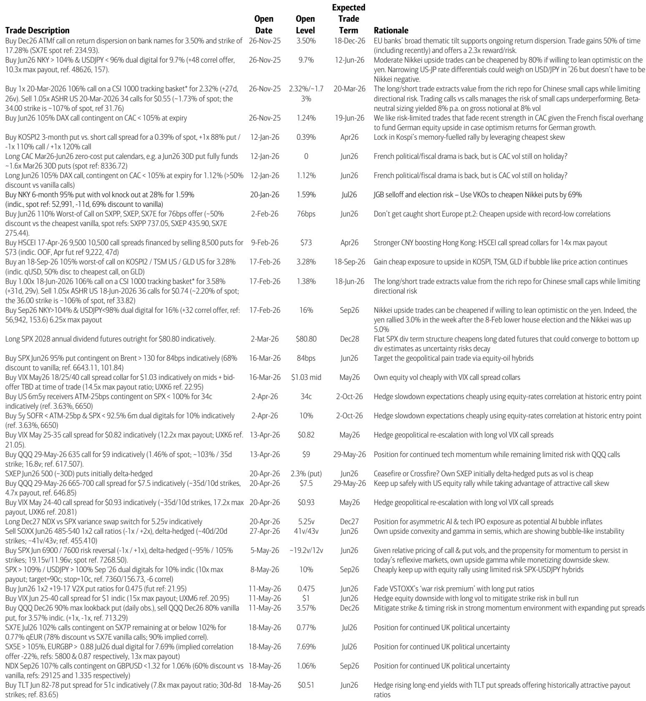
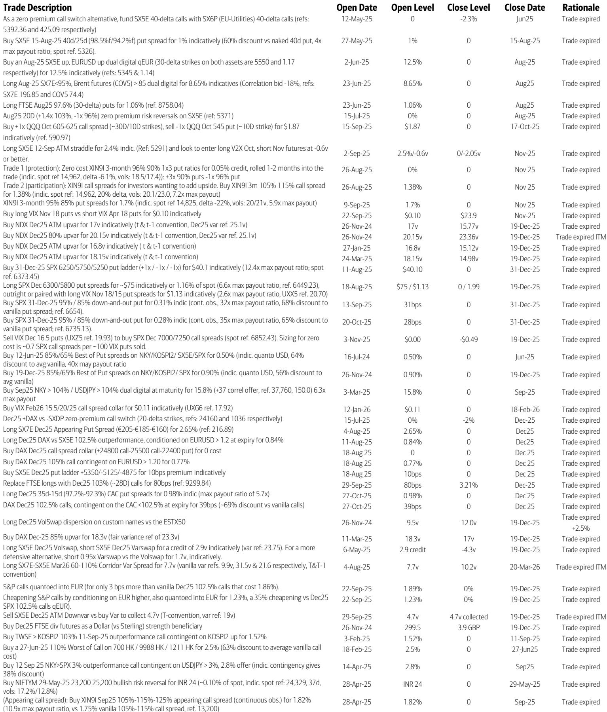
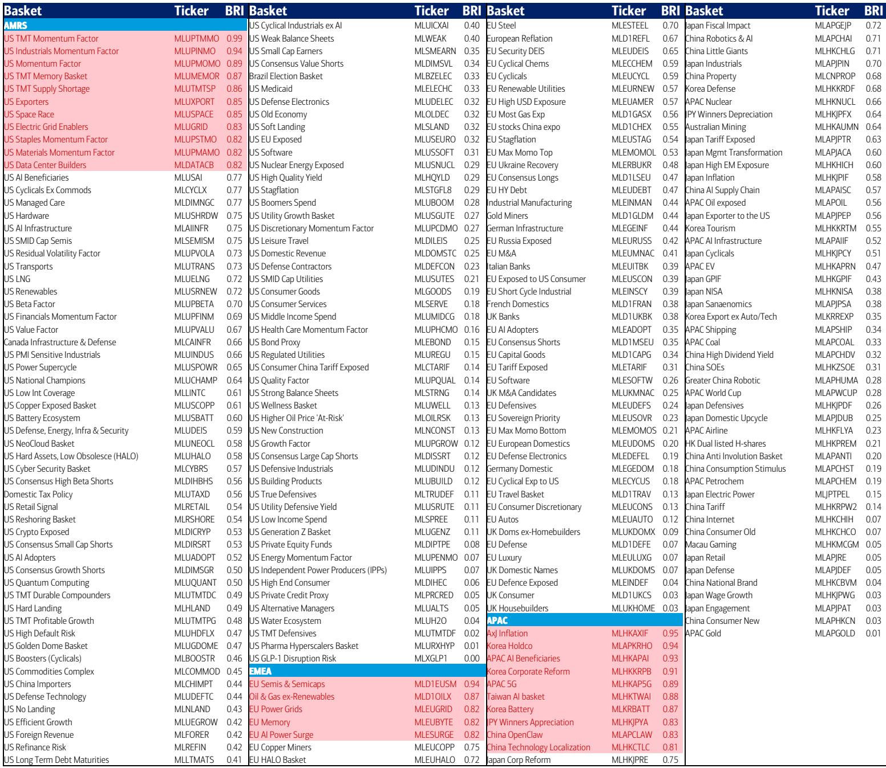

# FOMO Is Not a Market Irrationality Anymore—It Is the Dominant Macro Regime

The conventional playbook says that rising long-end yields, renewed inflation concerns, and political risk should suppress equity enthusiasm. That playbook is underperforming. What we are observing in global markets today is not a temporary disconnect between macro headwinds and equity resilience. It is a structural shift in the regime that governs price formation. In bubble-prone markets, fear of missing out does not merely coexist with macro risk—it overpowers it. This is not a theoretical possibility. It is the empirical lesson of the Dotcom era, when the Nasdaq surged even as 30-year yields climbed. The same dynamic is reasserting itself now.

A global investment bank report on equity volatility offers a lens into this regime. The data reveals a striking asymmetry: put skew in rates volatility remains steep, reflecting genuine macro anxiety, while call skew across equity indices and sectors is historically flat. This flat call skew is not a sign of complacency. It is a structural pricing signal that the market expects upside participation to remain in demand regardless of macro deterioration. The report identifies this as a hallmark of bubble-like dynamics. The implication is uncomfortable for anyone relying on macro-driven positioning. When FOMO becomes the dominant macro force, traditional hedges against rising yields may underperform, and the real opportunity shifts to capturing the asymmetry in options pricing.

Why now matters is because the clash between macro risks and a bubble-prone market is not resolving. It is intensifying. The report's cross-asset stress indicators show that rates volatility stress increased sharply last week, while equity volatility stress barely moved. Commodity volatility, led by copper and crude, is now in bearish territory. Yet the Bubble Risk Indicator for global equities continues to rise, led by the Kospi, Nikkei, and US tech sectors. This divergence between macro stress and equity bubble dynamics is the defining tension of the current environment. It creates a unique opportunity set for investors who understand that the correct response is not to pick a side but to structure for both tails.

This article will argue that the report's most valuable insight is not any single trade idea but the strategic framework it implies. In a regime where FOMO can overwhelm yields, the optimal portfolio is not defensive or aggressive. It is asymmetric. You need to own cheap upside exposure in the assets most likely to benefit from bubble dynamics, while simultaneously hedging tail risks in the assets most vulnerable to macro shocks. The report provides specific instruments for both sides of this trade. The challenge—and the opportunity—lies in understanding why this asymmetry exists and how to exploit it without falling into the trap of timing the regime change.

## The Disconnect Between Macro Stress and Equity Bubble Dynamics Is the Most Important Signal in the Market Today

The report's Global Financial Stress Index shows that overall stress increased slightly last week, driven entirely by commodity and rates volatility. Copper implied volatility recorded a 95th percentile stress gain. Crude implied volatility remains the most stressed subcomponent. Interest rate implied volatility in both EUR and USD posted stress gains in their top deciles. Yet equity volatility barely budged. The S&P 500 implied volatility sits at 16.4, unchanged in any meaningful sense. This is not a market that is ignoring macro risk. It is a market that has priced macro risk into one set of instruments while simultaneously pricing FOMO into equities.

This divergence is not a bug. It is a feature of the bubble regime. The report's Bubble Risk Indicator confirms that global equity bubble-like dynamics are rising, with the Kospi at 0.98, Nikkei at 0.75, and US tech at 0.75. The Mag7, interestingly, remains subdued, which suggests that the bubble is broadening rather than concentrating. This is historically significant. In the late 1990s, bubble dynamics were concentrated in tech. Today, they are spreading across sectors and geographies. Taiwan, quantum computing, and semiconductors show the highest bubble risk among thematic indices. The implication is that the FOMO is not limited to a narrow set of stocks. It is systemic.

The strategic significance of this disconnect is that it invalidates the standard macro hedging playbook. If you hedge equity exposure by buying puts on equity indices, you are paying for protection that may not materialize because the dominant driver of equity prices is no longer macro risk but bubble sentiment. The report identifies this explicitly: the flat call skew across equity indices means that upside participation remains cheap, while the steep put skew in rates means that hedging against yield rises is expensive. The correct hedge is not to buy equity puts. It is to buy options on the assets that are most sensitive to macro stress, such as long-duration Treasuries, while simultaneously buying cheap call spreads on the equity indices most exposed to bubble dynamics.

## The UK Political Risk Opportunity Is a Case Study in How to Exploit Idiosyncratic Risk in a Bubble Regime

The report identifies UK political risk as a meaningful macro driver, with Labour leadership uncertainty feeding into Gilt yields, macro volatility, and Sterling weakness. This is not a new observation. What is new is the trading opportunity it creates. The report notes that UK banks remain sensitive to domestic political and fiscal risk, and that the vol ratio between the Euro Stoxx Banks index and the Euro Stoxx 50 is historically low. This creates a cheap way to express a view that UK-specific risk will not derail the broader European equity rally.

The logic is elegant. The low vol ratio means that buying calls on the Euro Stoxx Banks index is cheap relative to buying calls on the Euro Stoxx 50. The high correlation between the two indices means that the upside scenario for European equities is likely to include banks. The UK political risk, meanwhile, is idiosyncratic. It affects Sterling and Gilts but not necessarily European equities. The report recommends SX7E calls contingent on limited SX7P upside. This is a structured trade that explicitly separates the European equity upside from the UK-specific risk.

This trade is instructive because it demonstrates how to think about risk in a bubble regime. The bubble is not everywhere. It is concentrated in specific assets and geographies. The UK is not exhibiting bubble-like dynamics. The FTSE 100's Bubble Risk Indicator is 0.32, far below the Kospi or Nasdaq. This means that UK risk is genuine macro risk, not bubble risk. The opportunity lies in using options to isolate the bubble exposure from the macro exposure. You want to own the European equity upside, which benefits from FOMO, while hedging the Sterling and Gilt downside, which is driven by macro factors. The report's dual-digital trade on the Euro Stoxx 50 and EURGBP is a direct expression of this framework.

## China AI Hardware Offers the Most Asymmetric Risk-Reward in Global Equity Derivatives Today

The report identifies the FTSE China A50 index as a uniquely attractive opportunity for call spreads. The rationale is threefold. First, AI hardware now constitutes 25% of the index, up from less than 10% a year ago. Second, the index does not include Hong Kong-listed AI software names such as Tencent and Alibaba, which means it is a pure play on hardware. Third, the index's recent performance is more correlated with US semiconductor stocks than with other China tech instruments such as the KWEB ETF or the Hang Seng Tech Index.

The pricing is extraordinary. The report recommends 3-month call spreads on the A50 with a 7.1x maximum payout and a maximum loss of 1.4%. This is possible because the A50 has the most inverted call skew globally. Most AI-linked assets in Asia trade at well above 50% implied volatility. The A50 trades in the low 20s. This asymmetry exists because the market has not yet repriced the A50 to reflect its changing composition. The index is no longer a financials-heavy China proxy. It is an AI hardware index trading at financial-sector volatility.

The strategic implication is that the bubble regime is not uniform. Some assets are fully repriced. Others are not. The A50 is a lagging indicator of the AI theme. The report's call spread recommendation is a bet that the market will eventually reprice the A50 to reflect its new composition. This is not a bet on Chinese macro. It is a bet on the convergence of volatility regimes between the A50 and other AI-linked indices. If that convergence happens, the payout is 7.1x. If it does not, the loss is limited to 1.4%. This is the definition of asymmetric risk.

## The Report Leaves a Critical Question Unanswered: How Do You Know When FOMO Peaks?

The report provides a wealth of data on bubble dynamics, macro stress, and options pricing. It identifies specific trades that exploit the current regime. But it does not answer the most important question for any investor: How do you know when the regime is about to change? The Dotcom bubble did not end because yields rose. It ended because the flow of new buyers dried up. The same dynamic will likely apply today.

The report's Bubble Risk Indicator is a price-based measure. It captures the current state of bubble-like dynamics, but it does not predict when those dynamics will reverse. The report's cross-asset stress indicators show that commodity and rates volatility are rising, but equity volatility is not. This divergence could persist for months or even years. The report's trade ideas are structured to limit downside, but they are not hedges against a regime change. They are expressions of the current regime.

The unanswered question is whether there is a reliable leading indicator for the peak of FOMO. The report hints at one possibility: the flow of funds. The US volume flow subcomponent of the Global Financial Stress Index posted the largest decline in stress last week, which suggests that bullish volume is increasing. This is consistent with a regime that is still in its early-to-middle stages. But the report does not provide a framework for when volume flow turns from a positive to a negative signal. This is the gap that investors need to fill themselves.

## The Decision Framework: Structure for Asymmetry, Not Direction

The report's most valuable contribution is not any single trade. It is the implicit framework for decision-making in a bubble regime. That framework has three components. First, identify which assets are in a bubble and which are not. The Bubble Risk Indicator provides this. Second, identify which macro risks are genuine and which are being overwhelmed by FOMO. The divergence between rates vol and equity call skew provides this. Third, structure trades that exploit the asymmetry between the two.

The specific trades in the report are expressions of this framework. The TLT put spreads offer historic 8x maximum payouts to hedge against further yield rises. This is the macro hedge. The QQQ call spreads and NDX-USDGBP hybrids offer cheap, limited-risk upside participation. This is the bubble exposure. The China A50 call spreads offer the most extreme asymmetry. The UK-Europe dual-digital trades offer a way to separate idiosyncratic risk from systemic risk.

The framework is not about predicting the next move. It is about being positioned for both outcomes. If the bubble continues, you own the upside. If macro risk reasserts itself, you own the hedge. The key is that the hedge is cheap relative to the potential payout. The report's emphasis on maximum payout ratios is not a marketing gimmick. It is the mathematical expression of the asymmetry that defines the current regime.

Join the community to read the full report and review the original charts.

*This article is for learning and discussion only and does not constitute investment advice.*

Personal reading notes and learning share only. Not investment advice.

