# Basic Materials - China

# Copper/Ally prices remain firm; TC/RC drops on tight supply; iron ore holds strong

Industry Overview

# Spot copper TC/RC drops below -US\$100/t on tight supply

Supply disruptions remained a key support for copper prices this week. On one hand, recurring Middle East tensions continue to affect shipments through the Strait of Hormuz, keeping oil prices elevated and lifting smelting and logistics costs. On the other hand, Peru approved a US\$2bn state-backed loan for Petroperu on May 11 to sustain operations, highlighting ongoing strain in the local energy system and continued market concerns over potential mining supply disruptions. LME copper rose 2.8% WoW to USD 13,895/t, meanwhile, China spot copper prices also increased by 2.7% WoW to RMB 105,790/t. Meanwhile, spot TC/RC slid continued to decrease to a new record low of –USD 104/t, highlighting continued tightness in copper concentrate supply. LME aluminum rose by 5% WoW to USD 3,741/t, while the Changjiang spot price edged up by 0.6% WoW to RMB 24,370/t, with smelting margins improving to RMB 8,077/t. Gold fell by 3.7% WoW to USD 4,543/oz. Lithium carbonate narrowed by 1% WoW to RMB 192,000/t, while U $_{3}$ O $_{8}$ inced up by 0.1% WoW to USD 86.1/lb. Shanghai cobalt spot prices edged down by 0.2% WoW to RMB 425,000/t; NdPr oxide prices fell by 2.5% WoW to RMB 738,200/t, and tungsten prices decreased sharply by 27% WoW to RMB 493,000/t.

# Steel: Margins remain weak on high raw material costs

In the first half, speculation of a thermal coal supply meeting and capital outflows drove a sharp pullback in raw materials, dragging down the ferrous complex. In the second half, Trump's China visit and trade talks added volatility, though largely priced in. Five major steel products data showed mixed supply, stronger demand, and solid inventory drawdowns. Spot prices remained firm, but trades skewed to low levels; wider basis prompted arbitrage selling into spot. As of May 15, rebar and HRC prices fell by $1.3\%$ and $0.7\%$ WoW to RMB 3,416/t and RMB 3,482/t, respectively, amid a $0.1\%$ WoW drop in iron ore prices to USD 111.5/t. Finished-steel inventories decreased by $4.3\%$ WoW, while apparent steel consumption increased greatly by $8.4\%$ WoW to 9.1 mnt. Steel margins remained weak, with rebar and HRC margins at $-RMB$ 257/t and $-RMB$ 213/t, respectively.

# Cement/Glass/Paper: Weak performance

Cement: The average national cement price inched up by 0.4% WoW to RMB313/t as of May 15 $^{th}$ . The nationwide shipment ratio rose by 1.1ppts WoW to 43.9%, and the inventory ratio also increased by 1.2% to 65.4%. In mid-May, price trends diverged by region. North China and Central-South saw corrective price increases driven by higher coal and raw material costs, while Northeast, East China, and Northwest markets remained weak, with continued price declines dragging down the national average.

Glass: National average float glass price (incl. VAT) inched down by 0.05% WoW to RMB1,150.8/t amid weak demand capped upside. Our analysis shows Xinyi float glass GPM edged down by 0.4ppts to 11.7%. Paper: Paper prices edged up by 0.3% WoW to RMB3,652/t as of May 13 amid narrowing supply-demand gap. Solar glass: Our calculation shows Flat Glass GPM (2.0mm) and Xinyi Solar GPM (2.0mm) down 9.2%/21.1% WoW.

>> Employed by a non-US affiliate of BofAS and is not registered/qualified as a research analyst under the FINRA rules.
Refer to "Other Important Disclosures" for information on certain BofA entities that take responsibility for the information herein in particular jurisdictions.

BofA does and seeks to do business with issuers covered in its research reports. As a result, investors should be aware that the firm may have a conflict of interest that could affect the objectivity of this report. Investors should consider this report as only a single factor in making their investment decision.

# 18 May 2026

Equity

China

Basic Materials

Matty Zhao >>

Research Analyst

BofA (Hong Kong)

+852 3508 4001

matty.zhao@bofa.com

Edward Leung, CFA >>

Research Analyst

BofA (Hong Kong)

+852 3508 3282

edward.leung@bofa.com

Miriam Chan, CFA >>

Research Analyst

BofA (Hong Kong)

+852 3508 7478

miriam.chan@bofa.com

Yibing Xia >>

Research Analyst

BofA (Hong Kong)

+852 3508 8045

yibing.xia@bofa.com

Yiming Wang >>

Research Analyst

BofA (Hong Kong)

+852 3508 5037

yiming.wang@bofa.com

Peter Wang >>

Research Analyst

BofA (Hong Kong)

+852 3508 7185

peter.wang2@bofa.com

See glossary at the end of the report

# Key charts

Exhibit 1: Copper and aluminum spot prices   
LME copper price +2.8% WoW to US\$13,895/t and LME aluminum price was +5.0% WoW at USD 3,741/t as of May 15   
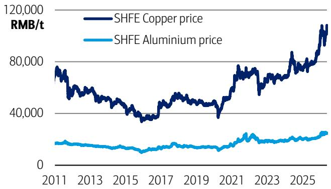

line

| Year | SHFE Copper price (RMB/t) | SHFE Aluminium price (RMB/t) |
|------|----------------------------|-------------------------------|
| 2011 | ~75,000                    | ~20,000                       |
| 2013 | ~60,000                    | ~18,000                       |
| 2015 | ~40,000                    | ~15,000                       |
| 2017 | ~50,000                    | ~18,000                       |
| 2019 | ~45,000                    | ~20,000                       |
| 2021 | ~75,000                    | ~25,000                       |
| 2023 | ~85,000                    | ~30,000                       |
| 2025 | ~110,000                   | ~35,000                       |

Source: Bloomberg, BofA Global Research   
BofA GLOBAL RESEARCH

Exhibit 3: Domestic monthly treatment charges on Cu concentrate   
Domestic monthly treatment charges on copper concentrate: -US\$103.72/t as of May 15   
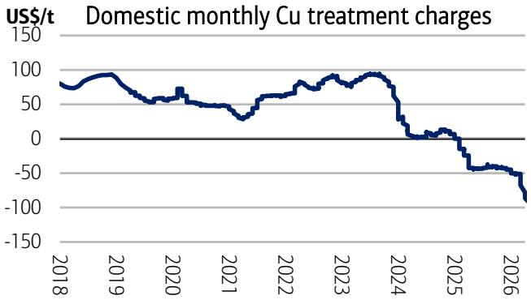

line

| Year | Domestic monthly Cu treatment charges (US$/t) |
| ---- | --------------------------------------------- |
| 2018 | ~75                                           |
| 2019 | ~90                                           |
| 2020 | ~60                                           |
| 2021 | ~30                                           |
| 2022 | ~70                                           |
| 2023 | ~90                                           |
| 2024 | ~100                                          |
| 2025 | ~-50                                          |
| 2026 | ~-100                                         |

Source: Wind, BofA Global Research   
BofA GLOBAL RESEARCH

Exhibit 5: COMEX gold spot price   
COMEX gold (spot) price decreased by 3.7% WoW to US\$4,543/oz as of May 15   
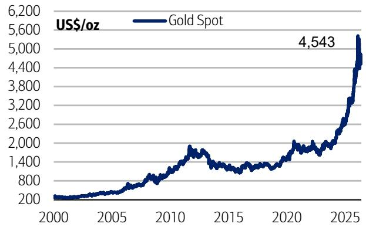

line

| Year | Gold Spot (US$/oz) |
| ---- | ------------------ |
| 2025 | 4,543              |

Source: Bloomberg, BofA Global Research   
BofA GLOBAL RESEARCH

Exhibit 2: Copper social inventory   
As of May 15, Shanghai bonded warehouse inventory/Shanghai social inventory was -2.7% / +4.5% WoW; Guangdong bonded warehouse inventory/Guangdong social inventory was +2.6% / flattish WoW   
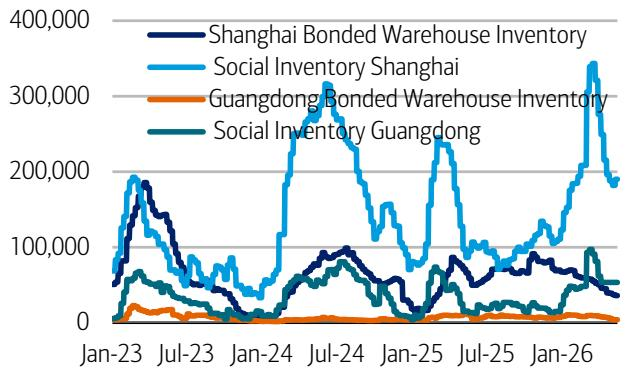

line

| Date   | Shanghai Bonded Warehouse Inventory | Social Inventory Shanghai | Guangdong Bonded Warehouse Inventory | Social Inventory Guangdong |
|--------|--------------------------------------|----------------------------|---------------------------------------|-----------------------------|
| Jan-23 | ~180,000                             | ~190,000                   | ~5,000                                | ~60,000                     |
| Jul-23 | ~100,000                             | ~150,000                   | ~5,000                                | ~40,000                     |
| Jan-24 | ~50,000                              | ~50,000                    | ~5,000                                | ~30,000                     |
| Jul-24 | ~100,000                             | ~310,000                   | ~5,000                                | ~70,000                     |
| Jan-25 | ~80,000                              | ~150,000                   | ~5,000                                | ~60,000                     |
| Jul-25 | ~120,000                             | ~180,000                   | ~5,000                                | ~80,000                     |
| Jan-26 | ~180,000                             | ~340,000                   | ~5,000                                | ~100,000                    |

Source: Bloomberg, BofA Global Research   
BofA GLOBAL RESEARCH

Exhibit 4: Avg. national aluminum margin (60% captive plant)   
Avg. national aluminum margin rose by RMB 115/t WoW to RMB8,077/t as of May 15   
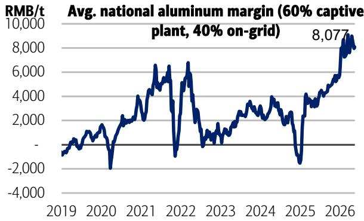

line

| Year | Avg. national aluminum margin (RMB/t) |
| ---- | ------------------------------------- |
| 2026 | 8,077                                 |

Source: Bloomberg, SMM, Wind, BofA Global Research   
BofA GLOBAL RESEARCH

Exhibit 6: Spot cash margins at steel mills   
By May 15, spot rebar cash margins rose by RMB 23/t to -RMB 257/t, while spot HRC cash margins decreased by RMB 30/t to -RMB 213/t   
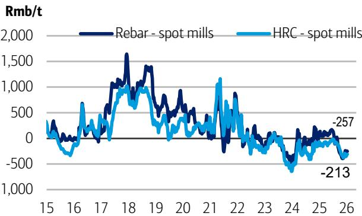

line

| Year | Rebar - spot mills | HRC - spot mills |
|------|---------------------|------------------|
| 2026 | -257                | -213             |

Source: Wind, BofA Global Research   
BofA GLOBAL RESEARCH

Exhibit 7: Containerboard margin tracker   
Nine Dragons margin tracker is now indicating NP/t of RMB118/t for this week   
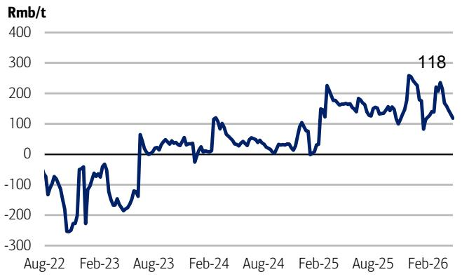

line

| Date    | Value |
|---------|-------|
| Feb-26  | 118   |

Source: Wind, BofA Global Research   
BofA GLOBAL RESEARCH

Exhibit 9: China national cement shipment ratio   
The nationwide shipment ratio rose by 1.1ppts WoW to 43.9% as of May 15   
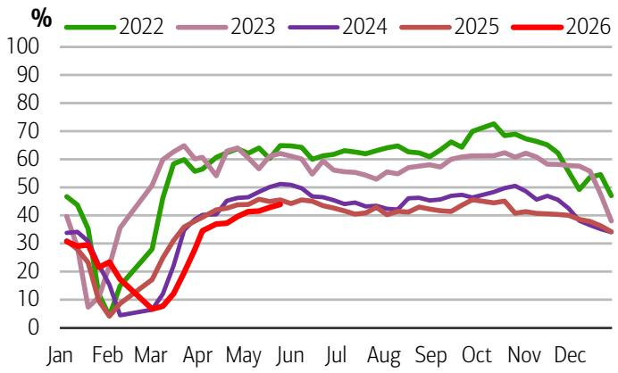

line

| Month | 2022 | 2023 | 2024 | 2025 | 2026 |
|-------|------|------|------|------|------|
| Jan   | 45   | 40   | 35   | 30   | 30   |
| Feb   | 10   | 10   | 5    | 5    | 10   |
| Mar   | 30   | 40   | 10   | 10   | 10   |
| Apr   | 60   | 65   | 30   | 30   | 30   |
| May   | 65   | 60   | 45   | 40   | 40   |
| Jun   | 65   | 60   | 50   | 45   | 45   |
| Jul   | 65   | 55   | 45   | 40   | 40   |
| Aug   | 65   | 55   | 45   | 40   | 40   |
| Sep   | 65   | 60   | 50   | 45   | 45   |
| Oct   | 70   | 60   | 50   | 45   | 45   |
| Nov   | 65   | 60   | 45   | 40   | 40   |
| Dec   | 50   | 55   | 35   | 35   | 35   |

Source: Digital cement, BofA Global Research   
BofA GLOBAL RESEARCH

Exhibit 10: National Float Glass Price and Xinyi Float Glass GPM   
As of May 14 $^{th}$ , the national average float glass price inched down by 0.05% WoW to RMB1,150.8/t. Our analysis shows Xinyi float glass GPM edged down by 0.4ppts to 11.7%   
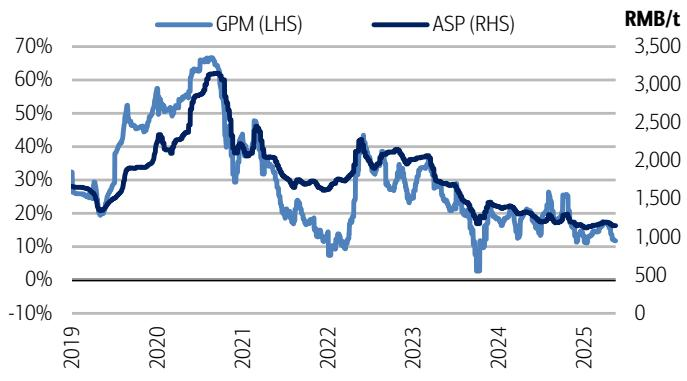

line

| Year | GPM (LHS) | ASP (RHS) |
|------|-----------|-----------|
| 2019 | ~25%      | ~20%      |
| 2020 | ~50%      | ~40%      |
| 2021 | ~65%      | ~3,500    |
| 2022 | ~10%      | ~1,500    |
| 2023 | ~30%      | ~2,000    |
| 2024 | ~5%       | ~1,000    |
| 2025 | ~15%      | ~1,000    |

Source: SCI99, Wind, BofA Global Research, SCI99   
BofA GLOBAL RESEARCH

Exhibit 8: ASP at Qinhuangdao port (Kcal 5,500)   
ASP of QHD 5,500kcal spot price rose by 2.3% WoW to RMB830/t as of May 13   
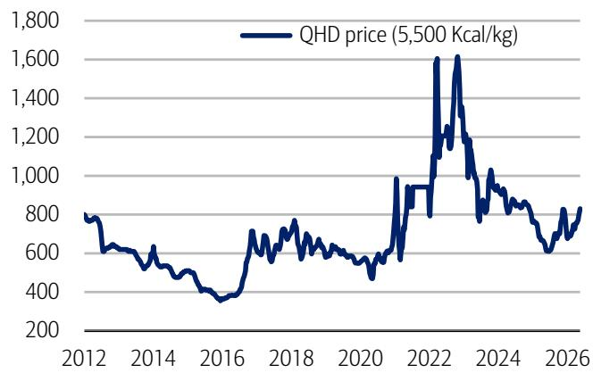

line

| Year | QHD price (5,500 Kcal/kg) |
| ---- | ------------------------- |
| 2012 | ~800                      |
| 2014 | ~600                      |
| 2016 | ~400                      |
| 2018 | ~700                      |
| 2020 | ~500                      |
| 2022 | ~1,600                    |
| 2024 | ~900                      |
| 2026 | ~800                      |

Source: Sxcoal, BofA Global Research   
BofA GLOBAL RESEARCH

Exhibit 5: Lithium carbonate unit refining margin   
Current lithium carbonate refining margin based on spodumene has narrowed and still stayed negative amid decreasing spodumene price   
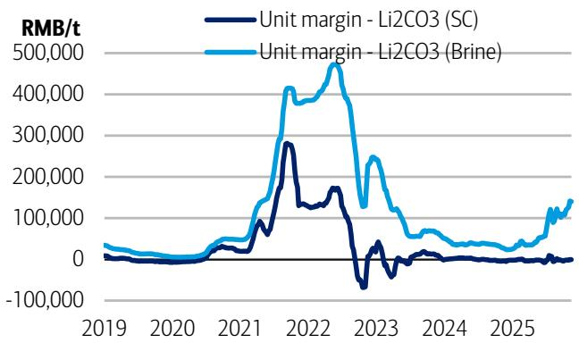

line

| Year | Unit margin - Li2CO3 (SC) | Unit margin - Li2CO3 (Brine) |
|------|---------------------------|------------------------------|
| 2019 | ~0                        | ~0                           |
| 2020 | ~0                        | ~0                           |
| 2021 | ~50,000                   | ~100,000                     |
| 2022 | ~300,000                  | ~450,000                     |
| 2023 | ~-50,000                  | ~150,000                     |
| 2024 | ~0                        | ~50,000                      |
| 2025 | ~0                        | ~150,000                     |

Source: SMM, BofA Global Research, SCI99   
BofA GLOBAL RESEARCH

Exhibit 11: China Solar Glass Price vs GPM (%)   
Spot 3.2mm coated solar glass mid-point prices remained flat WoW as 15.25/sqm while 2.0mm coated solar glass mid-point prices down RMB 0.55/sqm to RMB8.45/sqm   
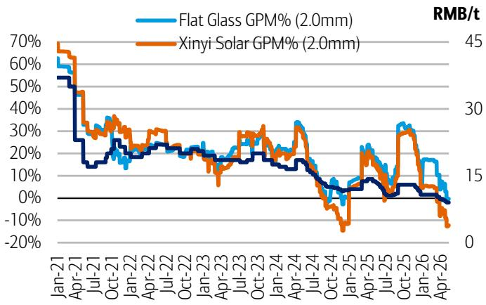

line

| Date    | Flat Glass GPM% (2.0mm) | Xinyi Solar GPM% (2.0mm) |
|---------|--------------------------|---------------------------|
| Jan-21  | ~60%                     | ~65%                      |
| Apr-21  | ~50%                     | ~45%                      |
| Jul-21  | ~15%                     | ~30%                      |
| Oct-21  | ~20%                     | ~35%                      |
| Jan-22  | ~15%                     | ~30%                      |
| Apr-22  | ~20%                     | ~35%                      |
| Jul-22  | ~25%                     | ~30%                      |
| Oct-22  | ~20%                     | ~25%                      |
| Jan-23  | ~15%                     | ~15%                      |
| Apr-23  | ~20%                     | ~25%                      |
| Jul-23  | ~25%                     | ~30%                      |
| Oct-23  | ~20%                     | ~35%                      |
| Jan-24  | ~15%                     | ~30%                      |
| Apr-24  | ~10%                     | ~25%                      |
| Jul-24  | ~5%                      | ~15%                      |
| Oct-24  | ~0%                      | ~10%                      |
| Jan-25  | ~5%                      | ~5%                       |
| Apr-25  | ~10%                     | ~15%                      |
| Jul-25  | ~5%                      | ~10%                      |
| Oct-25  | ~10%                     | ~15%                      |
| Jan-26  | ~5%                      | ~10%                      |
| Apr-26  | ~0%                      | ~5%                       |

Source: Wind, SCI99, BofA Global Research   
BofA GLOBAL RESEARCH

# Spot copper TC/RC drops below - US\$100/t on tight supply

Supply disruptions remained a key support for copper prices this week. On one hand, recurring Middle East tensions continue to affect shipments through the Strait of Hormuz, keeping oil prices elevated and lifting smelting and logistics costs. On the other hand, Peru approved a US\$2bn state-backed loan for Petroperu on May 11 to sustain operations, highlighting ongoing strain in the local energy system and continued market concerns over potential mining supply disruptions. LME copper rose 2.8% WoW to USD 13,895/t, meanwhile, China spot copper prices also increased by 2.7% WoW to RMB 105,790/t. Meanwhile, spot TC/RC slid continued to decrease to a new record low of –USD 103.72/t, highlighting continued tightness in copper concentrate supply. LME aluminum rose by 5% WoW to USD 3,741/t, while the Changjiang spot price edged up by 0.6% WoW to RMB 24,370/t, with smelting margins improving to RMB 8,077/t. Gold fell by 3.7% WoW to USD 4,543/oz. Lithium carbonate narrowed by 1% WoW to RMB 192,000/t, while U $_{3}$ O $_{8}$ inced up by 0.1% WoW to USD 86.1/lb. Shanghai cobalt spot prices edged down by 0.2% WoW to RMB 425,000/t; NdPr oxide prices fell by 2.5% WoW to RMB 738,200/t, and tungsten prices decreased sharply by 27.3% WoW to RMB 493,000/t.

Exhibit 12: Price comparison in LME & Changjiang copper

LME copper price +2.8% WoW to US\$13,895/t and Changjiang price +2.7% WoW to RMB105,790/t (US\$13,036/t ex.VAT) as of May 15

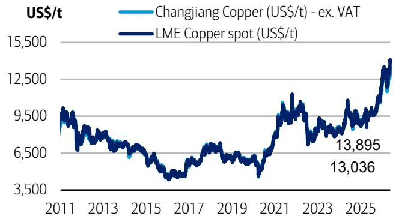

line

| Year | Changjiang Copper (US$/t) - ex. VAT | LME Copper spot (US$/t) |
|------|-------------------------------------|--------------------------|
| 2025 | 13,895                              | 13,036                   |

Source: Bloomberg, BofA Global Research   
BofA GLOBAL RESEARCH   
As of May 15, Shanghai bonded warehouse inventory/Shanghai social inventory was -2.7% / +4.5% WoW; Guangdong bonded warehouse inventory/Guangdong social inventory was +2.6% / flattish WoW

Exhibit 14: Copper social inventory

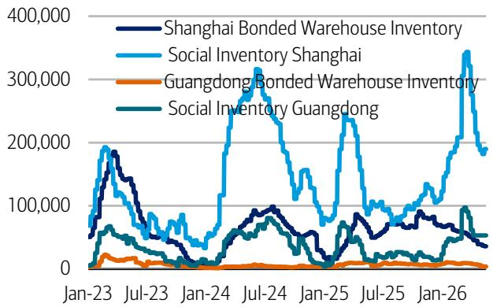

line

| Date   | Shanghai Bonded Warehouse Inventory | Social Inventory Shanghai | Guangdong Bonded Warehouse Inventory | Social Inventory Guangdong |
|--------|--------------------------------------|----------------------------|---------------------------------------|-----------------------------|
| Jan-23 | ~180,000                             | ~190,000                   | ~10,000                               | ~50,000                     |
| Jul-23 | ~100,000                             | ~150,000                   | ~5,000                                | ~20,000                     |
| Jan-24 | ~50,000                              | ~70,000                    | ~2,000                                | ~10,000                     |
| Jul-24 | ~100,000                             | ~310,000                   | ~5,000                                | ~50,000                     |
| Jan-25 | ~80,000                              | ~150,000                   | ~2,000                                | ~30,000                     |
| Jul-25 | ~120,000                             | ~230,000                   | ~5,000                                | ~60,000                     |
| Jan-26 | ~180,000                             | ~340,000                   | ~10,000                               | ~100,000                    |

Source: Bloomberg, BofA Global Research   
BofA GLOBAL RESEARCH   
Domestic monthly treatment charges on copper concentrate: -US\$103.72/t as of May 15

Exhibit 13: Domestic monthly treatment charges on Cu concentrate

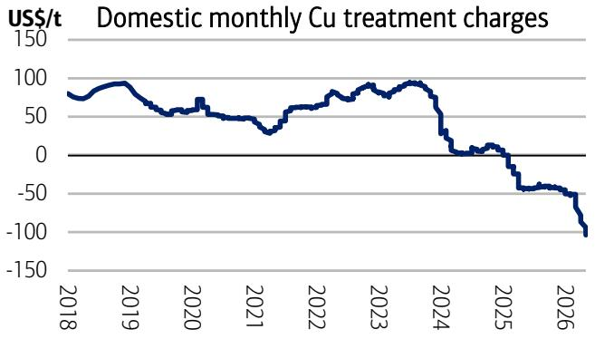

line

| Year | Domestic monthly Cu treatment charges (US$/t) |
| ---- | --------------------------------------------- |
| 2018 | ~75                                           |
| 2019 | ~90                                           |
| 2020 | ~60                                           |
| 2021 | ~30                                           |
| 2022 | ~70                                           |
| 2023 | ~90                                           |
| 2024 | ~100                                          |
| 2025 | ~-50                                          |
| 2026 | ~-100                                         |

Source: Wind, BofA Global Research   
BofA GLOBAL RESEARCH   
As of May 15, SHFE copper inventory remained flat WoW as 181kt; LME copper inventory inched down by 0.6% WoW to 397kt; COMEX copper inventory rose by 0.7% WoW to 625kt

Exhibit 15: Copper inventory at exchanges

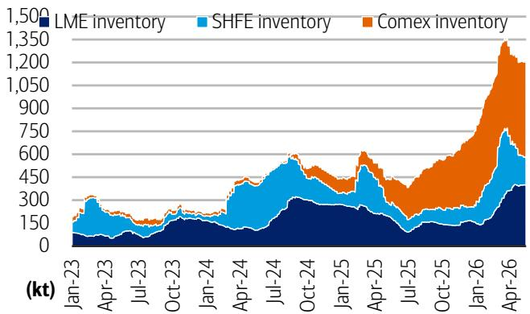

bar_stacked

| Month | LME inventory (kt) | SHFE inventory (kt) | Comex inventory (kt) |
|---|---|---|---|
| Jan-23 | 100 | 150 | 100 |
| Apr-23 | 100 | 200 | 100 |
| Jul-23 | 100 | 150 | 100 |
| Oct-23 | 150 | 150 | 100 |
| Jan-24 | 150 | 150 | 100 |
| Apr-24 | 200 | 250 | 100 |
| Jul-24 | 250 | 350 | 150 |
| Oct-24 | 250 | 350 | 150 |
| Jan-25 | 250 | 350 | 150 |
| Apr-25 | 250 | 350 | 250 |
| Jul-25 | 150 | 150 | 350 |
| Oct-25 | 150 | 150 | 450 |
| Jan-26 | 250 | 250 | 650 |
| Apr-26 | 350 | 450 | 950 |

Source: Bloomberg, BofA Global Research   
BofA GLOBAL RESEARCH

Exhibit 16: Price comparison in LME & Changjiang Aluminum   
LME aluminum price was +5.0% WoW at USD 3,741/t t and Changjiang price +0.6% wow to RMB24,370/t (USD3,166/t ex.VAT) as of May 15   
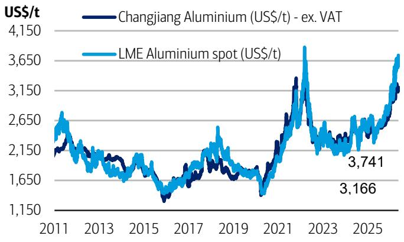

line

| Year | Changjiang Aluminium (US$/t) - ex. VAT | LME Aluminium spot (US$/t) |
|------|------------------------------------------|-----------------------------|
| 2025 | 3,741                                    | 3,166                       |

Source: Bloomberg, BofA Global Research   
BofA GLOBAL RESEARCH

Exhibit 18: Aluminum ingot inventory   
Domestic aluminum ingot inventory was -3.2% WoW to 1,390kt as of May 14   
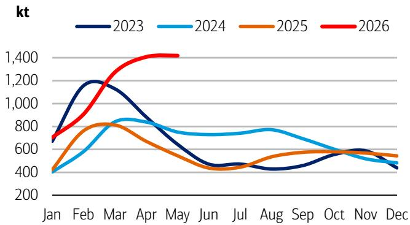

line

| Month | 2023  | 2024  | 2025  | 2026  |
|-------|-------|-------|-------|-------|
| Jan   | 650   | 400   | 400   | 700   |
| Feb   | 1200  | 600   | 800   | 900   |
| Mar   | 1150  | 850   | 850   | 1300  |
| Apr   | 1000  | 800   | 750   | 1400  |
| May   | 850   | 750   | 700   | 1400  |
| Jun   | 450   | 750   | 450   | -     |
| Jul   | 450   | 750   | 450   | -     |
| Aug   | 450   | 750   | 500   | -     |
| Sep   | 550   | 750   | 550   | -     |
| Oct   | 600   | 650   | 550   | -     |
| Nov   | 550   | 550   | 550   | -     |
| Dec   | 450   | 450   | 550   | -     |

Source: SMM, BofA Global Research   
BofA GLOBAL RESEARCH

Exhibit 20: COMEX gold spot price   
COMEX gold (spot) price decreased by 3.7% WoW to US\$4,543/oz as of May 15   
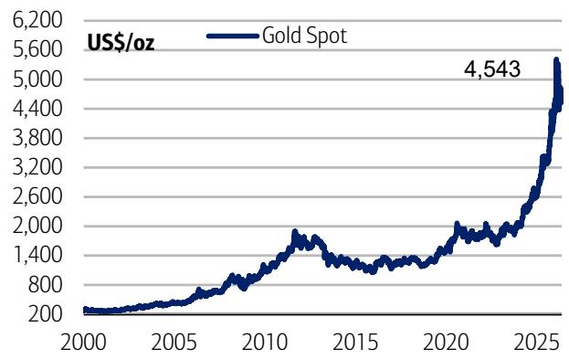

line

| Year | Gold Spot (US$/oz) |
| ---- | ------------------ |
| 2025 | 4,543              |

Source: Bloomberg, BofA Global Research   
BofA GLOBAL RESEARCH

Exhibit 17: Avg. national aluminum margin (60% captive plant)   
Avg. national aluminum margin rose by RMB 115/t WoW to RMB8,077/t as of May 15   
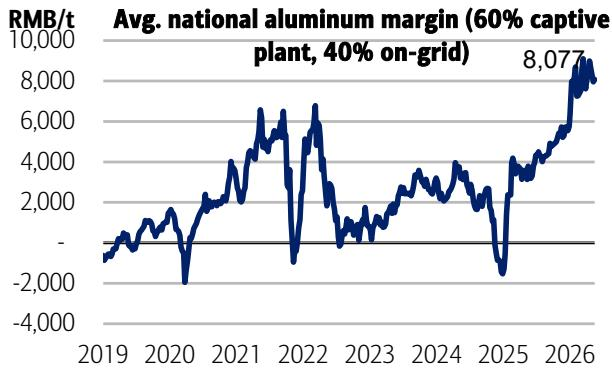

line

| Year | Avg. national aluminum margin (RMB/t) |
| ---- | ------------------------------------- |
| 2026 | 8,077                                 |

Source: Bloomberg, SMM, Wind, BofA Global Research   
BofA GLOBAL RESEARCH

Exhibit 19: Domestic alumina prices   
Domestic alumina price settled higher at RMB2,685/t as of May 15   
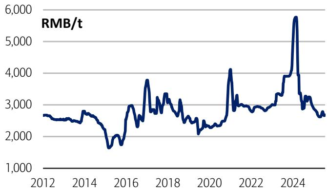

line

| Year | RMB/t |
| ---- | ----- |
| 2012 | ~2,700 |
| 2014 | ~2,800 |
| 2016 | ~1,800 |
| 2018 | ~3,500 |
| 2020 | ~2,500 |
| 2022 | ~3,000 |
| 2024 | ~5,800 |

Source: Wind, BofA Global Research   
BofA GLOBAL RESEARCH

Exhibit 21: Global gold ETF monthly flows   
Global gold ETF had 45t net inflows in Apr 2026, +153% mom   
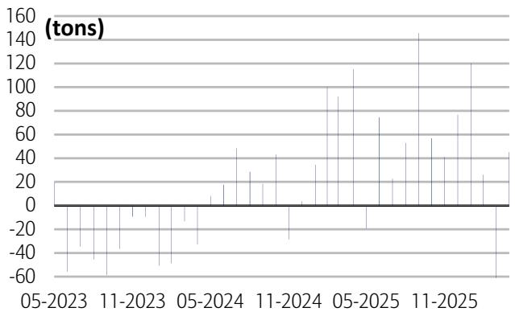

bar

| Date       | Value (tons) |
| ---------- | ------------ |
| 05-2023    | -40          |
| 11-2023    | -30          |
| 05-2024    | -20          |
| 11-2024    | 40           |
| 05-2025    | 90           |
| 11-2025    | 140          |

Source: World Gold Council, BofA Global Research   
BofA GLOBAL RESEARCH

Exhibit 22: China central bank gold reserves   
China gold reserves was slightly increased mom to 74.64mn ounce in Apr 2026   
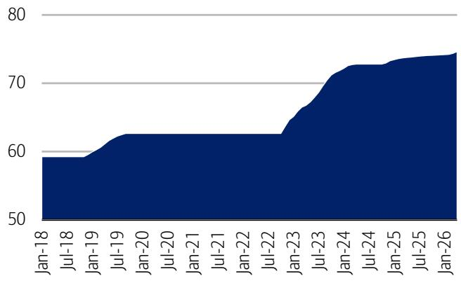

area

| Date   | Value |
|--------|-------|
| Jan-18 | 59    |
| Jul-18 | 59    |
| Jan-19 | 60    |
| Jul-19 | 62    |
| Jan-20 | 62    |
| Jul-20 | 62    |
| Jan-21 | 62    |
| Jul-21 | 62    |
| Jan-22 | 62    |
| Jul-22 | 62    |
| Jan-23 | 65    |
| Jul-23 | 68    |
| Jan-24 | 72    |
| Jul-24 | 73    |
| Jan-25 | 73    |
| Jul-25 | 74    |
| Jan-26 | 75    |

Source: China State Administration of Foreign Exchange, BofA Global Research   
BofA GLOBAL RESEARCH

Exhibit 24: Domestic battery-grade lithium carbonate ASP   
As of May 15, domestic battery-grade lithium carbonate (99.5%) price fell by 1.0% WoW to RMB192,000/t   
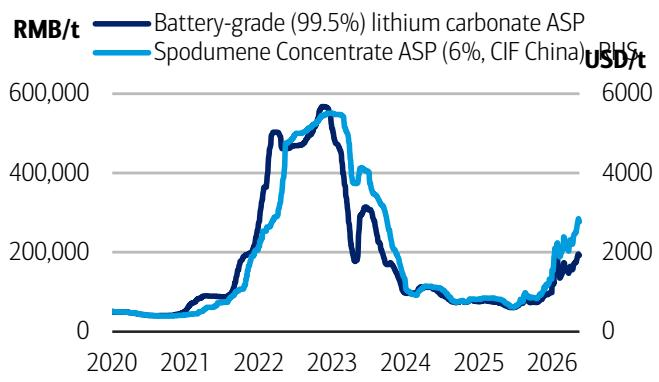

line

| Year | Battery-grade (99.5%) lithium carbonate ASP (RMB/t) | Spodumene Concentrate ASP (6%, CIF China) (RMB/t) |
|------|--------------------------------------------------------|--------------------------------------------------|
| 2020 | ~0                                                     | ~0                                               |
| 2021 | ~50,000                                                | ~50,000                                          |
| 2022 | ~450,000                                                | ~450,000                                         |
| 2023 | ~550,000                                                | ~550,000                                         |
| 2024 | ~150,000                                                | ~150,000                                         |
| 2025 | ~50,000                                                | ~50,000                                          |
| 2026 | ~200,000                                                | ~250,000                                         |

Source: SMM, BofA Global Research   
BofA GLOBAL RESEARCH

Exhibit 26: UxC Uranium U308 Weekly Spot Price (USD/lbs)   
Uranium U308 spot price +0.1% WoW to US\$86.1/lbs   
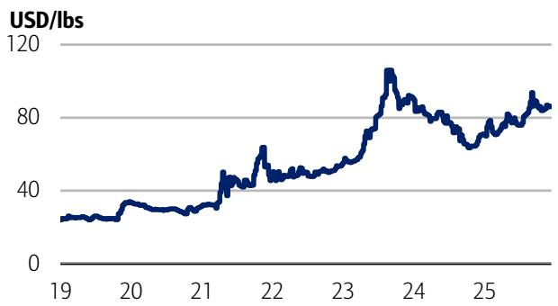

line

| Year | Price (USD/lbs) |
| ---- | --------------- |
| 19   | ~30             |
| 20   | ~35             |
| 21   | ~40             |
| 22   | ~70             |
| 23   | ~80             |
| 24   | ~110            |
| 25   | ~85             |

Source: Bloomberg, BofA Global Research   
BofA GLOBAL RESEARCH

Exhibit 23: Lithium carbonate unit refining margin   
Current lithium carbonate refining margin based on spodumene has narrowed and still stayed negative amid decreasing spodumene price   
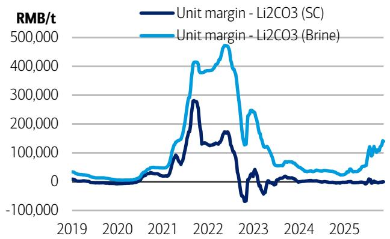

line

| Year | Unit margin - Li2CO3 (SC) | Unit margin - Li2CO3 (Brine) |
|------|---------------------------|------------------------------|
| 2019 | ~0                        | ~0                           |
| 2020 | ~0                        | ~0                           |
| 2021 | ~50,000                   | ~100,000                     |
| 2022 | ~300,000                  | ~450,000                     |
| 2023 | ~-50,000                  | ~150,000                     |
| 2024 | ~0                        | ~50,000                      |
| 2025 | ~0                        | ~100,000                     |

Source: SMM, BofA Global Research   
BofA GLOBAL RESEARCH

Exhibit 25: Domestic lithium carbonate inventory   
China lithium carbonate inventory was -0.89% WoW to 102.7kt   
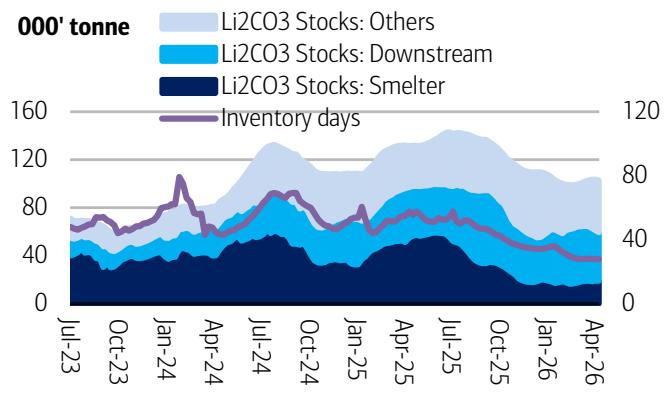

area

| Date   | Inventory days | Li2CO3 Stocks: Smelter | Li2CO3 Stocks: Downstream | Li2CO3 Stocks: Others |
|--------|----------------|------------------------|----------------------------|----------------------|
| Jul-23 | 0              | 0                      | 0                          | 0                    |
| Oct-23 | 0              | 0                      | 0                          | 0                    |
| Jan-24 | 0              | 0                      | 0                          | 0                    |
| Apr-24 | 0              | 0                      | 0                          | 0                    |
| Jul-24 | 0              | 0                      | 0                          | 0                    |
| Oct-24 | 0              | 0                      | 0                          | 0                    |
| Jan-25 | 0              | 0                      | 0                          | 0                    |
| Apr-25 | 0              | 0                      | 0                          | 0                    |
| Jul-25 | 0              | 0                      | 0                          | 0                    |
| Oct-25 | 0              | 0                      | 0                          | 0                    |
| Jan-26 | 0              | 0                      | 0                          | 0                    |
| Apr-26 | 0              | 0                      | 0                          | 0                    |

Source: SMM, BofA Global Research   
BofA GLOBAL RESEARCH

Exhibit 27: China Shanghai Changjiang Cobalt Spot Price (RMB/ton)   
China Shanghai Changjiang Cobalt Spot Price -0.2% WoW to RMB 425k/t   
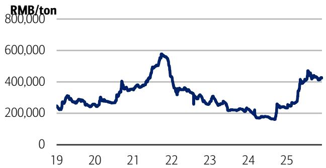

line

| Year | RMB/ton |
| ---- | ------- |
| 19   | ~250,000 |
| 20   | ~300,000 |
| 21   | ~400,000 |
| 22   | ~600,000 |
| 23   | ~350,000 |
| 24   | ~200,000 |
| 25   | ~450,000 |
| 26   | ~500,000 |

Source: Bloomberg, BofA Global Research   
BofA GLOBAL RESEARCH

Exhibit 28: National average NdPr oxide price   
National average NdPr oxide price -2.5% WoW to RMB738,200/t   
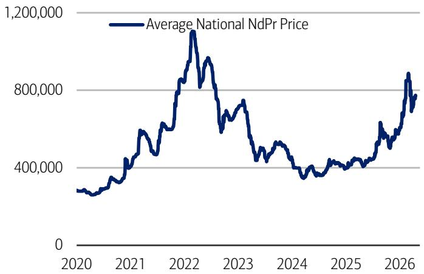

line

| Year | Average National NdPr Price |
| ---- | --------------------------- |
| 2020 | ~350,000                    |
| 2021 | ~450,000                    |
| 2022 | ~1,100,000                  |
| 2023 | ~750,000                    |
| 2024 | ~400,000                    |
| 2025 | ~450,000                    |
| 2026 | ~850,000                    |

Source: Wind, BofA Global Research   
BofA GLOBAL RESEARCH

Exhibit 29: Natioanl average black tungsten concentrate (Wolframite) price, (65% WO $_{3}$ , RMB/ton)   
National average black tungsten concentrate price -27.3% WoW to RMB 493k/t   
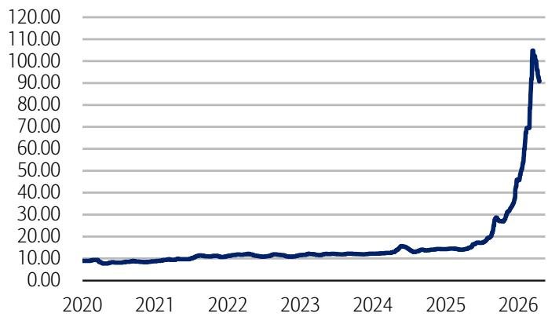

line

| Year | Value |
| ---- | ----- |
| 2020 | 8.00  |
| 2021 | 9.00  |
| 2022 | 10.00 |
| 2023 | 11.00 |
| 2024 | 12.00 |
| 2025 | 15.00 |
| 2026 | 105.00 |

Source: Wind, BofA Global Research   
BofA GLOBAL RESEARCH

# Steel: Margins remain weak on high raw material costs

In the first half, speculation of a thermal coal supply meeting and capital outflows drove a sharp pullback in raw materials, dragging down the ferrous complex. In the second half, Trump's China visit and trade talks added volatility, though largely priced in. Five major steel products data showed mixed supply, stronger demand, and solid inventory drawdowns. Spot prices remained firm, but trades skewed to low levels; wider basis prompted arbitrage selling into spot. As of May 15, rebar and HRC prices fell by $1.3\%$ and $0.7\%$ WoW to RMB 3,416/t and RMB 3,482/t, respectively, amid a $0.1\%$ WoW drop in iron ore prices to USD 111.5/t. Finished-steel inventories decreased by $4.3\%$ WoW, while apparent steel consumption increased greatly by $8.4\%$ WoW to 9.1 mnt. Steel margins remained weak, with rebar and HRC margins at $-RMB$ 257/t and $-RMB$ 213/t, respectively.

Exhibit 30: China domestic steel prices at key cities

By May 15, domestic rebar prices across major cities (Beijing, Guangzhou, Shanghai, Shenyang, Wuhan) fell by 1.3% WoW to RMB 3,416/t, and domestic HRC prices also inched down by 0.7% WoW to RMB 3,482/t

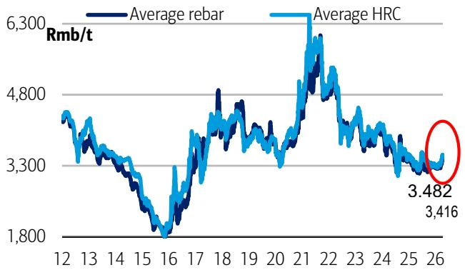

line

| Year | Average rebar | Average HRC |
|------|---------------|-------------|
| 2026 | 3,482         | 3,416       |

Source: Wind, BofA Global Research   
BofA GLOBAL RESEARCH   
Finished-steel output (rebar, HRC, wire rod, CRC and plate) for the week ending May 15 inched up by 0.05% WoW to 8.4 mnt. Rebar output increased by 2.4% WoW to 2.01 mnt, while HRC output fell by 1.3% WoW to 2.97 mnt

Exhibit 32: Weekly China Steel Output

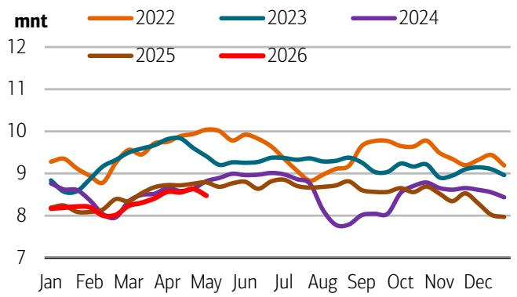

line

| Month | 2022 | 2023 | 2024 | 2025 | 2026 |
|-------|------|------|------|------|------|
| Jan   | 9.3  | 8.7  | 8.8  | 8.1  | 8.1  |
| Feb   | 9.0  | 8.5  | 8.6  | 8.0  | 8.0  |
| Mar   | 9.5  | 9.0  | 8.5  | 8.2  | 7.9  |
| Apr   | 10.0 | 9.8  | 8.6  | 8.5  | 8.4  |
| May   | 10.1 | 9.5  | 8.7  | 8.6  | 8.5  |
| Jun   | 10.0 | 9.3  | 8.8  | 8.7  | 8.6  |
| Jul   | 9.5  | 9.2  | 8.9  | 8.6  | 8.7  |
| Aug   | 9.0  | 9.1  | 7.7  | 8.5  | 8.6  |
| Sep   | 9.5  | 9.0  | 7.9  | 8.4  | 8.5  |
| Oct   | 9.3  | 8.9  | 8.5  | 8.3  | 8.4  |
| Nov   | 9.5  | 8.8  | 8.4  | 8.2  | 8.3  |
| Dec   | 9.3  | 8.9  | 8.3  | 8.1  | 8.2  |

Source: Wind, BofA Global Research   
BofA GLOBAL RESEARCH   
As of May 14, iron ore -0.1% WoW to USD 111.5/t, while the long-term average remained stable at USD 106.4/t

Exhibit 31: Imported iron ore CFR 62% prices at Tianjin Port

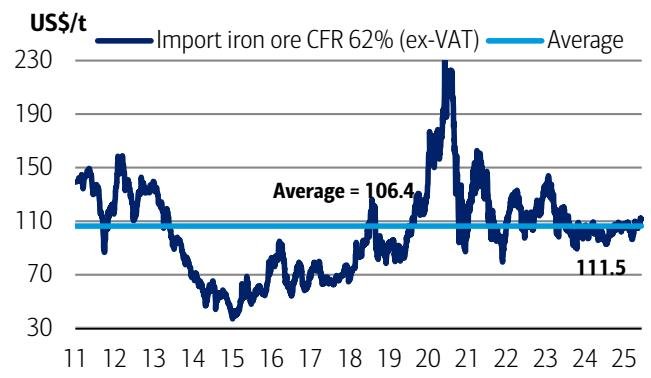

line

| Year | Import iron ore CFR 62% (ex-VAT) |
| ---- | -------------------------------- |
| 2025 | 111.5                            |
| Average | 106.4                          |

Source: Wind, BofA Global Research   
BofA GLOBAL RESEARCH   
As of May 15, iron ore port inventories across 45 ports inched down by 0.1% WoW to 165.0 mnt

Exhibit 33: Iron ore inventory at large-medium steel mills and at ports

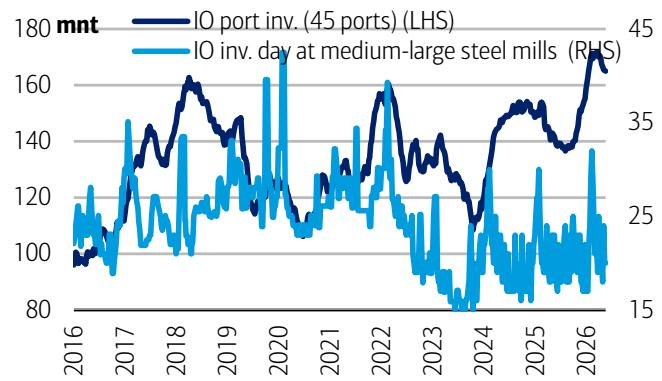

line

| Year | IO port inv. (45 ports) (LHS) | IO inv. day at medium-large steel mills (RHS) |
|------|-------------------------------|-----------------------------------------------|
| 2016 | ~100                          | ~15                                           |
| 2017 | ~130                          | ~20                                           |
| 2018 | ~160                          | ~25                                           |
| 2019 | ~140                          | ~20                                           |
| 2020 | ~120                          | ~45                                           |
| 2021 | ~130                          | ~35                                           |
| 2022 | ~160                          | ~30                                           |
| 2023 | ~130                          | ~15                                           |
| 2024 | ~150                          | ~25                                           |
| 2025 | ~160                          | ~30                                           |
| 2026 | ~170                          | ~35                                           |

Source: Mysteel, BofA Global Research   
BofA GLOBAL RESEARCH

Exhibit 34: Spot cash margins at steel mills   
By May 15, spot rebar cash margins rose by RMB 23/t to -RMB 257/t, while spot HRC cash margins decreased by RMB 30/t to -RMB 213/t   
Rmb/t   
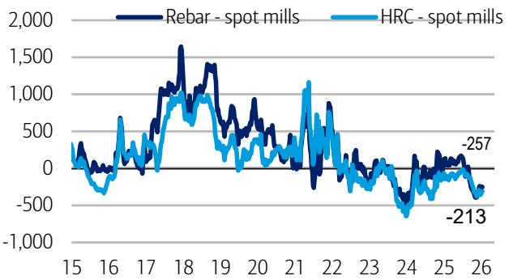

line

| Year | Rebar - spot mills | HRC - spot mills |
|------|---------------------|------------------|
| 2026 | -257                | -213             |

Source: Wind, BofA Global Research   
BofA GLOBAL RESEARCH

Exhibit 36: Utilization rates of blast furnaces across the nation   
According to Mysteel, national blast-furnace utilization kept inched up by 0.2 WoW as 89.7% as of May 15, while the operating rate across 247 surveyed steel mills inched up by 0.3% WoW to 83.5%   
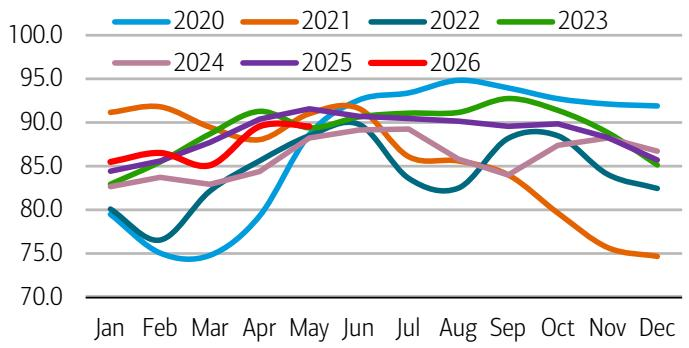

line

| Month | 2020 | 2021 | 2022 | 2023 | 2024 | 2025 | 2026 |
|-------|------|------|------|------|------|------|------|
| Jan   | 80.0 | 91.0 | 83.0 | 84.0 | 84.0 | 85.0 | 86.0 |
| Feb   | 75.0 | 91.5 | 77.0 | 85.0 | 84.5 | 86.0 | 87.0 |
| Mar   | 74.0 | 91.0 | 80.0 | 86.0 | 85.0 | 87.0 | 88.0 |
| Apr   | 76.0 | 90.5 | 83.0 | 88.0 | 86.0 | 88.0 | 89.0 |
| May   | 85.0 | 90.0 | 86.0 | 90.0 | 87.0 | 89.0 | 90.0 |
| Jun   | 92.0 | 89.5 | 88.0 | 91.0 | 88.0 | 90.0 | 91.0 |
| Jul   | 93.0 | 89.0 | 87.0 | 92.0 | 89.0 | 91.0 | 92.0 |
| Aug   | 94.0 | 88.5 | 86.0 | 93.0 | 89.5 | 92.0 | 93.0 |
| Sep   | 93.5 | 88.0 | 85.0 | 93.5 | 90.0 | 92.5 | 93.5 |
| Oct   | 92.5 | 87.5 | 84.0 | 93.0 | 90.5 | 93.0 | 94.0 |
| Nov   | 91.5 | 87.0 | 83.0 | 92.5 | 91.0 | 93.5 | 94.5 |
| Dec   | 91.0 | 74.5 | 82.5 | 85.5 | 86.5 | 86.5 | -    |

Source: Mysteel, BofA Global Research   
BofA GLOBAL RESEARCH

Exhibit 38: Steel inventory   
By May 15, finished-steel inventories (rebar, wire rod, HRC, CRC and plate) narrowed by 4.3% WoW to 15.8 mnt   
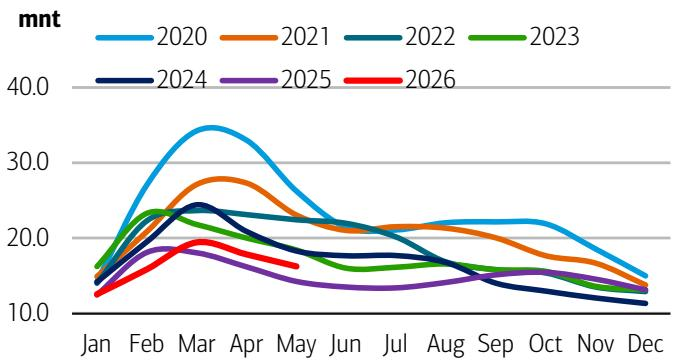

line

| Month | 2020 | 2021 | 2022 | 2023 | 2024 | 2025 | 2026 |
|-------|------|------|------|------|------|------|------|
| Jan   | 15.0 | 15.0 | 15.0 | 15.0 | 15.0 | 15.0 | 15.0 |
| Feb   | 25.0 | 20.0 | 18.0 | 22.0 | 18.0 | 17.0 | 16.0 |
| Mar   | 35.0 | 28.0 | 24.0 | 23.0 | 24.0 | 19.0 | 20.0 |
| Apr   | 33.0 | 27.0 | 23.0 | 22.0 | 23.0 | 18.0 | 18.0 |
| May   | 30.0 | 25.0 | 22.0 | 21.0 | 22.0 | 17.0 | 17.0 |
| Jun   | 25.0 | 23.0 | 21.0 | 20.0 | 21.0 | 16.0 | 16.0 |
| Jul   | 23.0 | 22.0 | 20.0 | 19.0 | 20.0 | 15.0 | 15.0 |
| Aug   | 22.0 | 21.0 | 19.0 | 18.0 | 19.0 | 14.0 | 14.0 |
| Sep   | 21.0 | 20.0 | 18.0 | 17.0 | 18.0 | 13.0 | 13.0 |
| Oct   | 21.0 | 19.0 | 17.0 | 16.0 | 17.0 | 13.0 | 13.0 |
| Nov   | 18.0 | 17.0 | 15.0 | 14.0 | 15.0 | 13.0 | 13.0 |
| Dec   | 15.0 | 14.0 | 13.0 | 13.0 | 13.0 | 13.0 | 13.0 |

Source: Mysteel, BofA Global Research   
BofA GLOBAL RESEARCH

Exhibit 35: Cash margins at large mills (inventory lag)   
By May 15, rebar cash margins at large mills improved by RMB 75/t to -RMB 151/t, while HRC cash margins also increased by RMB 21/t to -RMB 107/t   
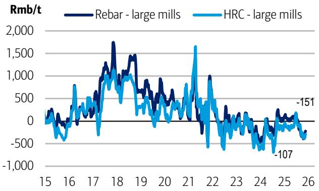

line

| Year | Rebar - large mills | HRC - large mills |
|------|---------------------|-------------------|
| 2025 | -151                | -107              |

Source: Wind, BofA Global Research   
BofA GLOBAL RESEARCH

Exhibit 37: Operating rate of Electric-arc-furnace (EAF) mills   
The operating rate of EAF mills inched up by 0.4ppts WoW to 55.25% in the week ending May 15   
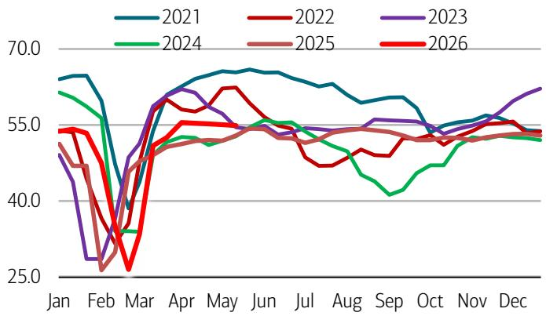

line

| Month | 2021 | 2022 | 2023 | 2024 | 2025 | 2026 |
|-------|------|------|------|------|------|------|
| Jan   | 68.0 | 55.0 | 55.0 | 60.0 | 50.0 | 50.0 |
| Feb   | 65.0 | 50.0 | 30.0 | 45.0 | 40.0 | 45.0 |
| Mar   | 40.0 | 35.0 | 35.0 | 35.0 | 35.0 | 35.0 |
| Apr   | 65.0 | 55.0 | 60.0 | 50.0 | 45.0 | 55.0 |
| May   | 68.0 | 65.0 | 65.0 | 55.0 | 50.0 | 60.0 |
| Jun   | 68.0 | 60.0 | 65.0 | 55.0 | 50.0 | 60.0 |
| Jul   | 65.0 | 55.0 | 60.0 | 55.0 | 50.0 | 60.0 |
| Aug   | 65.0 | 50.0 | 60.0 | 55.0 | 50.0 | 60.0 |
| Sep   | 65.0 | 45.0 | 60.0 | 45.0 | 50.0 | 60.0 |
| Oct   | 65.0 | 45.0 | 60.0 | 45.0 | 50.0 | 60.0 |
| Nov   | 65.0 | 55.0 | 65.0 | 55.0 | 50.0 | 65.0 |
| Dec   | 68.0 | 65.0 | 70.0 | 60.0 | 55.0 | 70.0 |

Source: Custeel, BofA Global Research   
BofA GLOBAL RESEARCH

Exhibit 39: Steel apparent consumption   
Steel apparent consumption (rebar, wire rod, HRC, CRC and plate) improved by 8.4% WoW to 9.1 mnt   
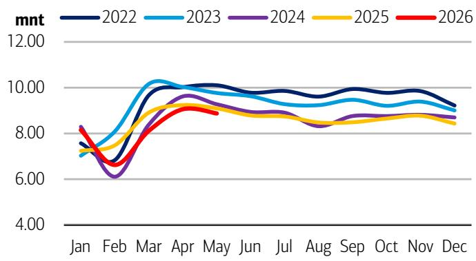

line

| Month | 2022 | 2023 | 2024 | 2025 | 2026 |
|-------|------|------|------|------|------|
| Jan   | 7.5  | 7.0  | 8.0  | 7.5  | 8.0  |
| Feb   | 7.0  | 7.5  | 6.0  | 7.0  | 6.5  |
| Mar   | 10.0 | 10.5 | 9.0  | 8.5  | 8.0  |
| Apr   | 10.5 | 10.0 | 9.5  | 9.0  | 9.0  |
| May   | 10.0 | 9.5  | 9.0  | 8.5  | 8.5  |
| Jun   | 10.0 | 9.5  | 8.5  | 8.5  | 8.5  |
| Jul   | 10.0 | 9.5  | 8.5  | 8.5  | 8.5  |
| Aug   | 10.0 | 9.5  | 8.5  | 8.5  | 8.5  |
| Sep   | 10.0 | 9.5  | 8.5  | 8.5  | 8.5  |
| Oct   | 10.0 | 9.5  | 8.5  | 8.5  | 8.5  |
| Nov   | 10.0 | 9.5  | 8.5  | 8.5  | 8.5  |
| Dec   | 9.5  | 9.0  | 8.5  | 8.5  | 8.5  |

Source: Mysteel, BofA Global Research   
BofA GLOBAL RESEARCH

# Cement: Regional divergence in prices amid mixed demand conditions

The average national cement price inched up by 0.4% WoW to RMB313/t as of May 15 $^{th}$ . Specifically, prices in Hebei, Henan, Hunan, Guangdong, and Xizang rose by RMB20-30/t, while prices in Liaoning, Jiangsu, Shandong, Shaanxi, and Ningxia declined by RMB10-50RMB/t. The nationwide shipment ratio rose by 1.1 ppts WoW to 43.9%, and the inventory ratio also increased by 1.2% to 65.4%. In mid-May, price trends diverged by region. North China and Central-South saw corrective price increases driven by higher coal and raw material costs, while Northeast, East China, and Northwest markets remained weak, with continued price declines dragging down the national average.

Exhibit 27: National average Cement price   
The average national cement price +0.4% WoW to RMB313/t as of May 15   
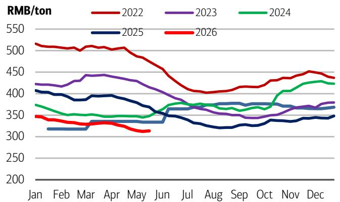

line

| Month | 2022 | 2023 | 2024 | 2025 | 2026 |
|-------|------|------|------|------|------|
| Jan   | 510  | 420  | 370  | 400  | 350  |
| Feb   | 505  | 415  | 365  | 395  | 345  |
| Mar   | 500  | 440  | 360  | 390  | 340  |
| Apr   | 495  | 435  | 355  | 385  | 335  |
| May   | 480  | 430  | 350  | 380  | 330  |
| Jun   | 460  | 410  | 360  | 370  | 325  |
| Jul   | 430  | 390  | 370  | 360  | 320  |
| Aug   | 410  | 370  | 375  | 355  | 315  |
| Sep   | 415  | 365  | 375  | 355  | 315  |
| Oct   | 420  | 360  | 380  | 355  | 315  |
| Nov   | 430  | 370  | 390  | 355  | 315  |
| Dec   | 440  | 375  | 420  | 355  | 315  |

Source: Digital Cement, BofA Global Research   
BofA GLOBAL RESEARCH

Exhibit 27: Central South China average cement price   
As of May 15, Central South China cement prices increased by 5.7% WoW to RMB314/t   
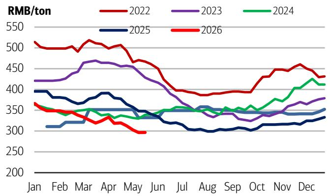

line

| Month | 2022 | 2023 | 2024 | 2025 | 2026 |
|-------|------|------|------|------|------|
| Jan   | 510  | 420  | 370  | 390  | 360  |
| Feb   | 500  | 430  | 360  | 380  | 350  |
| Mar   | 510  | 460  | 350  | 370  | 340  |
| Apr   | 500  | 470  | 340  | 360  | 330  |
| May   | 480  | 460  | 330  | 350  | 320  |
| Jun   | 450  | 440  | 320  | 340  | 310  |
| Jul   | 420  | 410  | 310  | 330  | 300  |
| Aug   | 400  | 380  | 300  | 320  | 290  |
| Sep   | 390  | 370  | 310  | 310  | 280  |
| Oct   | 410  | 360  | 320  | 320  | 290  |
| Nov   | 450  | 370  | 340  | 330  | 310  |
| Dec   | 430  | 380  | 350  | 340  | 320  |

Source: Digital Cement, BofA Global Research   
BofA GLOBAL RESEARCH

Exhibit 40: East China average cement price   
As of May 15, East China cement prices fell by 2.1% WoW to RMB314/t WoW   
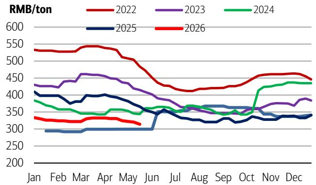

line

| Month | 2022 | 2023 | 2024 | 2025 | 2026 |
|-------|------|------|------|------|------|
| Jan   | 530  | 430  | 410  | 390  | 330  |
| Feb   | 530  | 430  | 410  | 390  | 330  |
| Mar   | 540  | 460  | 380  | 390  | 330  |
| Apr   | 540  | 450  | 370  | 390  | 330  |
| May   | 510  | 430  | 360  | 380  | 320  |
| Jun   | 450  | 410  | 350  | 370  | 310  |
| Jul   | 410  | 380  | 360  | 350  | -    |
| Aug   | 410  | 370  | 360  | 340  | -    |
| Sep   | 410  | 370  | 360  | 340  | -    |
| Oct   | 410  | 370  | 360  | 340  | -    |
| Nov   | 450  | 380  | 420  | 340  | -    |
| Dec   | 450  | 390  | 440  | 340  | -    |

Source: Digital Cement, BofA Global Research   
BofA GLOBAL RESEARCH

Exhibit 41: China national average cement prices vs inventory   
Prices edged up while inventory trended higher WoW   
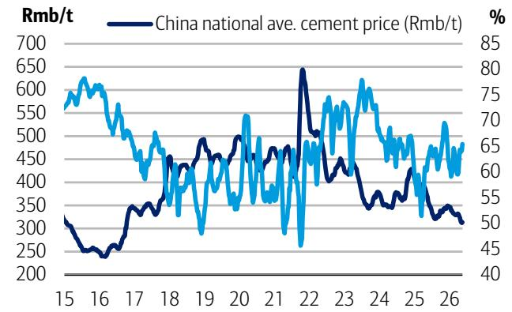

line

| Year | China national ave. cement price (Rmb/t) | % Change |
|------|------------------------------------------|----------|
| 15   | ~300                                     | ~40      |
| 16   | ~250                                     | ~45      |
| 17   | ~350                                     | ~50      |
| 18   | ~450                                     | ~55      |
| 19   | ~400                                     | ~60      |
| 20   | ~450                                     | ~65      |
| 21   | ~400                                     | ~70      |
| 22   | ~650                                     | ~80      |
| 23   | ~500                                     | ~75      |
| 24   | ~450                                     | ~70      |
| 25   | ~400                                     | ~65      |
| 26   | ~350                                     | ~60      |

Source: Digital Cement, BofA Global Research   
BofA GLOBAL RESEARCH

# Glass/Paper: Weak performance

Glass: National average float glass price (incl. VAT) inched down by 0.05% WoW to RMB1,150.8/t amid weak demand capped upside. The soda ash price edged down by 0.2% to RMB1,278/t as of May 14. National direct supplied pipeline natural gas remains RMB2.30/cbm. Our analysis shows Xinyi float glass GPM edged down by 0.4ppts to 11.7%. Inventory and capacity: As of May 14, national inventory was 68.92mn weight case, representing 38.12 inventory days. Nationally effective capacity of all float glass lines increased to 147,635t/d.

Paper: Paper prices edged up by 0.3% WoW to RMB3,652/t as of May 13 amid narrowing supply-demand gap. Waste paper: In the domestic market, the China OCC average increased by 1.5% WoW to RMB1,701/t. Spread: The Nine Dragons margin tracker is now indicating NP/t of RMB118/t for this week.

Solar glass: Spot 3.2mm coated solar glass mid-point prices remained flat WoW as 15.25/sqm while 2.0mm coated solar glass mid-point prices down RMB 0.55/sqm to RMB8.45/sqm. Our calculation shows Flat Glass GPM (2.0mm) and Xinyi Solar GPM (2.0mm) down 9.2%/21.1% WoW. Solar glass daily capacity remained flat WoW as 86,800t/day and inventory days expanded 7.1% WoW to 52.82 during the week-ended on 14 May 2026.

# Exhibit 42: Glass Inventory & Inventory day

As of May 14, glass producers' inventory from monitored provinces was 68.92mn weight case, representing 38.12 inventory days

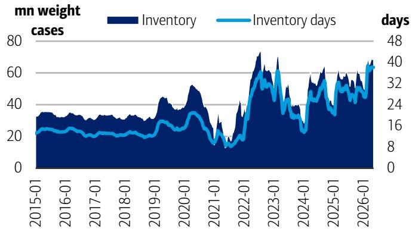

line

| Date    | Inventory (mn weight cases) | Inventory days |
|---------|------------------------------|----------------|
| 2015-01 | ~30                          | ~16            |
| 2016-01 | ~30                          | ~16            |
| 2017-01 | ~30                          | ~16            |
| 2018-01 | ~30                          | ~16            |
| 2019-01 | ~40                          | ~24            |
| 2020-01 | ~50                          | ~32            |
| 2021-01 | ~30                          | ~8             |
| 2022-01 | ~70                          | ~48            |
| 2023-01 | ~60                          | ~32            |
| 2024-01 | ~50                          | ~24            |
| 2025-01 | ~60                          | ~32            |
| 2026-01 | ~70                          | ~48            |

Source: BofA Global Research, Wind, SCI99   
BofA GLOBAL RESEARCH

# Exhibit 43: Glass effective capacity

As of May 14, there are 264 float glass production lines nationwide, of which 203 are currently operating. Nationally effective capacity of all float glass lines remained the same as 147,635t/d

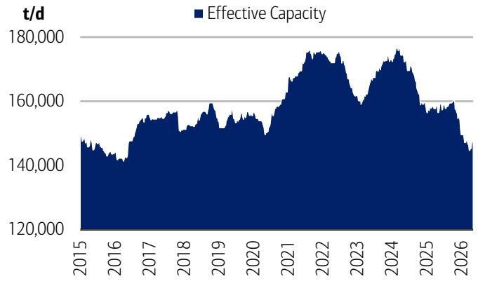

line

| Year | Effective Capacity (t/d) |
| ---- | ------------------------ |
| 2015 | ~145,000                 |
| 2016 | ~140,000                 |
| 2017 | ~155,000                 |
| 2018 | ~150,000                 |
| 2019 | ~160,000                 |
| 2020 | ~155,000                 |
| 2021 | ~170,000                 |
| 2022 | ~175,000                 |
| 2023 | ~165,000                 |
| 2024 | ~175,000                 |
| 2025 | ~160,000                 |
| 2026 | ~145,000                 |

Source: BofA Global Research, Wind, SCI99   
BofA GLOBAL RESEARCH

Exhibit 44: China linerboard and corrugating medium price   
As of May 13, national average linerboard price edged up by 0.3% WoW to RMB3,652/t; national average corrugating medium price was +1.0% WoW to RMB2,789/t. Blended paper price rose by 0.4% to RMB3,460/t   
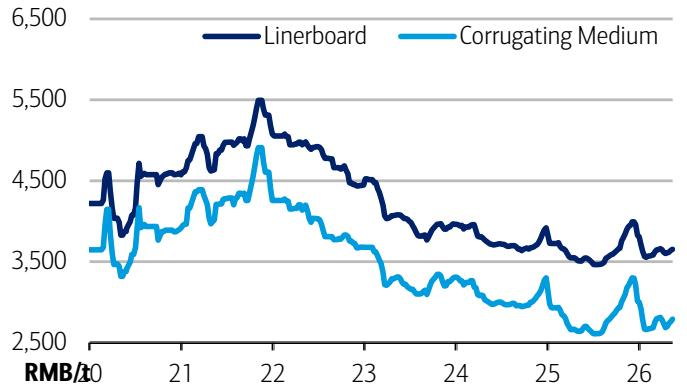

line

| RMB/10 | Linerboard | Corrugating Medium |
| ------ | ---------- | ------------------ |
| 20     | 4,500      | 3,500              |
| 21     | 4,750      | 4,000              |
| 22     | 5,500      | 4,750              |
| 23     | 4,500      | 3,500              |
| 24     | 3,750      | 3,000              |
| 25     | 3,500      | 2,500              |
| 26     | 3,500      | 2,500              |

Source: UMPaper, RISI   
BofA GLOBAL RESEARCH

Exhibit 46: China Solar Glass Price vs GPM (%)   
Spot 3.2mm coated solar glass mid-point prices remained flat WoW as 15.25/sqm while 2.0mm coated solar glass mid-point prices down RMB 0.55/sqm to RMB8.45/sqm   

line

| Date    | Flat Glass GPM% (2.0mm) | Xinyi Solar GPM% (2.0mm) |
|---------|--------------------------|---------------------------|
| Jan-21  | ~60%                     | ~45                       |
| Apr-21  | ~50%                     | ~35                       |
| Jul-21  | ~15%                     | ~30                       |
| Oct-21  | ~20%                     | ~35                       |
| Jan-22  | ~25%                     | ~30                       |
| Apr-22  | ~20%                     | ~35                       |
| Jul-22  | ~25%                     | ~30                       |
| Oct-22  | ~20%                     | ~35                       |
| Jan-23  | ~25%                     | ~30                       |
| Apr-23  | ~20%                     | ~35                       |
| Jul-23  | ~25%                     | ~30                       |
| Oct-23  | ~20%                     | ~35                       |
| Jan-24  | ~25%                     | ~30                       |
| Apr-24  | ~30%                     | ~35                       |
| Jul-24  | ~15%                     | ~15                       |
| Oct-24  | ~5%                      | ~10                       |
| Jan-25  | ~10%                     | ~15                       |
| Apr-25  | ~15%                     | ~10                       |
| Jul-25  | ~10%                     | ~15                       |
| Oct-25  | ~15%                     | ~30                       |
| Jan-26  | ~10%                     | ~15                       |
| Apr-26  | ~5%                      | ~10                       |

Source: Wind, SCI99, BofA Global Research   
BofA GLOBAL RESEARCH

Exhibit 45: Nine Dragons margin tracker   
Nine Dragons margin tracker is now indicating NP/t of RMB118/t for this week   
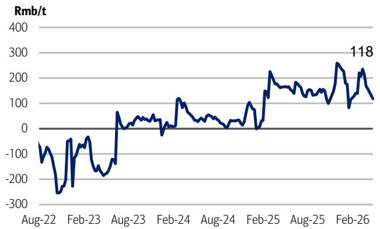

line

| Date    | Value |
|---------|-------|
| Feb-26  | 118   |

Source: UMPaper, RISI, BofA Global Research   
BofA GLOBAL RESEARCH

Exhibit 47: China Solar Glass Production and Inventory   
Solar glass daily capacity remained flat WoW as 86,800t/day and inventory days expanded 7.1% WoW to 52.82 during the week-ended on 14 May 2026   
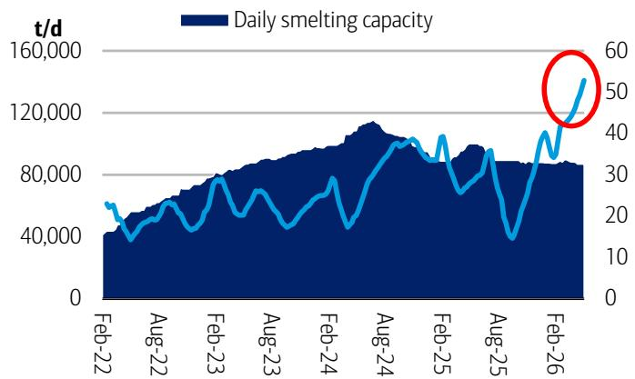

line

| Date    | Daily smelting capacity (t/d) |
|---------|-------------------------------|
| Feb-26  | 150000                        |

Source: SCI99, BofA Global Research   
BofA GLOBAL RESEARCH

# Appendix

# Exhibit 46: Glossary

Summary of terminologies/abbreviation mentioned in the report

<table><tr><td>Abbreviation</td><td>Elaboration</td></tr><tr><td>WoW</td><td>Week-on-Week</td></tr><tr><td>MoM</td><td>Month-on-Month</td></tr><tr><td>ASP</td><td>Average Selling Price</td></tr><tr><td>ETF</td><td>Exchange-traded fund</td></tr><tr><td>HRC</td><td>Hot Rolled Coil</td></tr><tr><td>LME</td><td>London Metal Exchange</td></tr><tr><td>TC/RC</td><td>Treatment charges/Refining charges</td></tr><tr><td>SHFE</td><td>Shanghai Futures Exchange</td></tr><tr><td>OCC</td><td>Old Corrugated Containers</td></tr><tr><td>ND</td><td>Nine Dragon Paper (02689 HK)</td></tr><tr><td>GPM</td><td>Gross Profit Margin</td></tr><tr><td>NP</td><td>Net Profit</td></tr></table>

Exhibit 46: Glossary

Summary of terminologies/abbreviation mentioned in the report

<table><tr><td>Abbreviation</td><td>Elaboration</td></tr><tr><td>QHD 5,500kcal</td><td>Qinghuangdao port 5,500kcal thermal coal</td></tr><tr><td>NEWC 6,000K</td><td>Newcastle 6000kcal thermal coal</td></tr><tr><td>Liulin No.4 HCC</td><td>Liulin No.4 hard coking coal</td></tr><tr><td>Li2CO3</td><td>Lithium carbonate</td></tr><tr><td>LiOH</td><td>Lithium hydroxide</td></tr><tr><td>BF</td><td>Blast Furnace</td></tr><tr><td>EAF</td><td>Electric arc furnace</td></tr><tr><td>UTR</td><td>Utilization rate</td></tr><tr><td>PV</td><td>Photovoltaic</td></tr><tr><td>Ally</td><td>Aluminium</td></tr><tr><td>POE</td><td>Polyolefin Elastomer</td></tr><tr><td>EVA</td><td>Ethylene-vinyl acetate</td></tr><tr><td>COMEX</td><td>New York Mercantile Exchange and Commodity Exchange</td></tr><tr><td>UTR</td><td>Utilization rate</td></tr><tr><td>SMM</td><td>Shanghai Metals Market</td></tr><tr><td>px</td><td>Price</td></tr><tr><td>CPC</td><td>Communist Party of China</td></tr><tr><td>IO</td><td>Iron ore</td></tr><tr><td>NdPr</td><td>Neodymium-Praseodymium</td></tr><tr><td>WO3</td><td>Tungsten Trioxide</td></tr></table>

Source: BofA Global Research   
BofA GLOBAL RESEARCH

# Disclosures

# Important Disclosures

FUNDAMENTAL EQUITY OPINION KEY: Opinions include a Volatility Risk Rating, an Investment Rating and an Income Rating. VOLATILITY RISK RATINGS, indicators of potential price fluctuation, are: A - Low, B - Medium and C - High. INVESTMENT RATINGS reflect the analyst's assessment of both a stock's absolute total return potential as well as its attractiveness for investment relative to other stocks within its Coverage Cluster (defined below). Our investment ratings are: 1 - Buy stocks are expected to have a total return of at least 10% and are the most attractive stocks in the coverage cluster; 2 - Neutral stocks are expected to remain flat or increase in value and are less attractive than Buy rated stocks and 3 - Underperform stocks are the least attractive stocks in a coverage cluster. An investment rating of 6 (No Rating) indicates that a stock is no longer trading on the basis of fundamentals. Analysts assign investment ratings considering, among other things, the 0-12 month total return expectation for a stock and the firm's guidelines for ratings dispersions (shown in the table below). The current price objective for a stock should be referenced to better understand the total return expectation at any given time. The price objective reflects the analyst's view of the potential price appreciation (depreciation).

<table><tr><td>Investment rating</td><td>Total return expectation (within 12-month period of date of initial rating)</td><td>Ratings dispersion guidelines for coverage cluster $^{R1}$ </td></tr><tr><td>Buy</td><td>≥ 10%</td><td>≤ 70%</td></tr><tr><td>Neutral</td><td>≥ 0%</td><td>≤ 30%</td></tr><tr><td>Underperform</td><td>N/A</td><td>≥ 20%</td></tr></table>

$^{R1}$ Ratings dispersions may vary from time to time where BofA Global Research believes it better reflects the investment prospects of stocks in a Coverage Cluster.

INCOME RATINGS, indicators of potential cash dividends, are: 7 - same/higher (dividend considered to be secure), 8 - same/lower (dividend not considered to be secure) and 9 - pays no cash dividend. Coverage Cluster is comprised of stocks covered by a single analyst or two or more analysts sharing a common industry, sector, region or other classification(s). A stock's coverage cluster is included in the most recent BofA Global Research report referencing the stock.

BofA Global Research personnel (including the analyst(s) responsible for this report) receive compensation based upon, among other factors, the overall profitability of BofA Corporation, including profits derived from investment banking. The analyst(s) responsible for this report may also receive compensation based upon, among other factors, the overall profitability of the Bank's sales and trading businesses relating to the class of securities or financial instruments for which such analyst is responsible.

# Other Important Disclosures

From time to time research analysts conduct site visits of covered issuers. BofA Global Research policies prohibit research analysts from accepting payment or reimbursement for travel expenses from the issuer for such visits.

Prices are indicative and for information purposes only. Except as otherwise stated in the report, for any recommendation in relation to an equity security, the price referenced is the publicly traded price of the security as of close of business on the day prior to the date of the report or, if the report is published during intraday trading, the price referenced is indicative of the traded price as of the date and time of the report and in relation to a debt security (including equity preferred and CDS), prices are indicative as of the date and time of the report and are from various sources including BofA trading desks.

The date and time of completion of the production of any recommendation in this report shall be the date and time of dissemination of this report as recorded in the report timestamp.

Recipients who are not institutional investors or market professionals should seek the advice of their independent financial advisor before considering information in this report in connection with any investment decision, or for a necessary explanation of its contents.

Officers of BofAS or one or more of its affiliates (other than research analysts) may have a financial interest in securities of the issuer(s) or in related investments. Refer to BofA Global Research policies relating to conflicts of interest.

"BofA" includes BofA, Inc. ("BofAS") and its affiliates. Investors should contact their BofA representative or Merrill Global Wealth Management financial advisor if they have questions concerning this report or concerning the appropriateness of any investment idea described herein for such investor. "BofA" is a global brand for BofA Global Research.

# Information relating to Non-US affiliates of BofA and Distribution of Affiliate Research Reports:

BofAS and/or BofA, Pierce, Fenner & Smith Incorporated ("MLPF&S") may in the future distribute, information of the following non-US affiliates in the US (short name: legal name, regulator): BofA (South Africa): BofA South Africa (Pty) Ltd., regulated by the Financial Sector Conduct Authority; MLI (UK): BofA International, regulated by the Financial Conduct Authority (FCA) and the Prudential Regulation Authority (PRA); BofASE (France): BofA Europe SA is authorized by the Autorité de Contrôle Prudentiel et de Résolution (ACPR) and regulated by the ACPR and the Autorité des Marchés Financiers (AMF). BofA Europe SA ("BofASE") with registered address at 51, rue La Boétie, 75008 Paris is registered under no 842 602 690 RCS Paris. In accordance with the provisions of French Code Monétaire et Financier (Monetary and Financial Code), BofASE is an établissement de crédit et d'investissement (credit and investment institution) that is authorised and supervised by the European Central Bank and the Autorité de Contrôle Prudentiel et de Résolution (ACPR) and regulated by the ACPR and the Autorité des Marchés Financiers. BofASE's share capital can be found at www.bofaml.com/BofASEdisclaimer; BofA Europe (Milan): BofA Europe Designated Activity Company, Milan Branch, regulated by the Bank of Italy, the European Central Bank (ECB) and the Central Bank of Ireland (CBI); BofA Europe (Frankfurt): BofA Europe Designated Activity Company, Frankfurt Branch regulated by BaFin, the ECB and the CBI; BofA Europe (Zurich): BofA Europe Designated Activity Company, Zurich Branch, regulated by the Swiss Financial Market Supervisory Authority FINMA, the ECB and CBI; BofA Europe (Madrid): BofA Europe Designated Activity Company, Sucursal en España, regulated by the Bank of Spain, the ECB and the CBI; BofA (Australia): BofA Equities (Australia) Limited, regulated by the Australian Securities and Investments Commission; BofA (Hong Kong): BofA (Asia Pacific) Limited, regulated by the Hong Kong Securities and Futures Commission (HKSFC); BofA (Singapore): BofA (Singapore) Pte Ltd, regulated by the Monetary Authority of Singapore (MAS); BofA (Canada): BofA Canada Inc, regulated by the Canadian Investment Regulatory Organization; BofA (Mexico): BofA Mexico, SA de CV, Casa de Bolsa, regulated by the Comisión Nacional Bancaria y de Valores; BofAS Japan: BofA Japan Co., Ltd., regulated by the Financial Services Agency; BofA (Seoul): BofA International, LLC Seoul Branch, regulated by the Financial Supervisory Service; BofA (Taiwan): BofA (Taiwan) Ltd., regulated by the Securities and Futures Bureau; BofAS India: BofA India Limited, regulated by the Securities and Exchange Board of India (SEBI); BofA (Israel): BofA Israel Limited, regulated by Israel Securities Authority; BofA (DIFC): BofA International (DIFC Branch), regulated by the Dubai Financial Services Authority (DFSA); BofA (Brazil): BofA S.A. Corretora de Títulos e Valores Mobiliários, regulated by Comissão de Valores Mobiliários; BofA KSA Company: BofA Kingdom of Saudi Arabia Company, regulated by the Capital Market Authority. This information: has been approved for publication and is distributed in the United Kingdom (UK) to professional clients and eligible counterparties (as each is defined in the rules of the FCA and the PRA) by MLI (UK), which is authorized by the PRA and regulated by the FCA and the PRA - details about the extent of our regulation by the FCA and PRA are available from us on request; has been approved for publication and is distributed in the European Economic Area (EEA) by BofASE (France), which is authorized by the ACPR and regulated by the ACPR and the AMF; has been considered and distributed in Japan by BofAS Japan, a registered securities dealer under the Financial Instruments and Exchange Act in Japan, or its permitted affiliates; is issued and distributed in Hong Kong by BofA (Hong Kong) which is regulated by HKSFC; is issued and distributed in Taiwan by BofA (Taiwan); is issued and distributed in India by BofAS India; and is issued and distributed in Singapore to institutional investors and/or accredited investors (each as defined under the Financial Advisers Regulations) by BofA (Singapore) (Company Registration No 198602883D). BofA (Singapore) is regulated by MAS. BofA Equities (Australia) Limited (ABN 65 006 276 795), AFS License 235132 (MLEA) distributes this information in Australia only to 'Wholesale' clients as defined by s.761G of the Corporations Act 2001. With the exception of BofA N.A., Australia Branch, neither MLEA nor any of its affiliates involved in preparing this information is an Authorised Deposit-Taking Institution under the Banking Act 1959 nor regulated by the Australian Prudential Regulation Authority. No approval is required for publication or distribution of this information in Brazil and its local distribution is by BofA (Brazil) in accordance with applicable regulations. BofA (DIFC) is authorized and regulated by the DFSA. Information prepared and issued by BofA (DIFC) is done so in accordance with the requirements of the DFSA conduct of business rules. BofA Europe (Frankfurt) distributes this information in Germany and is regulated by BaFin, the ECB and the CBI. BofA entities, including BofA Europe and BofASE (France), may outsource/delegate the marketing and/or provision of certain research services or aspects of research services to other branches or members of the BofA group. You may be contacted by a different BofA entity acting for and on behalf of your service provider where permitted by applicable law. This does not change your service provider. Please refer to the Electronic Communications Disclaimers for further information.

This information has been prepared and issued by BofAS and/or one or more of its non-US affiliates. The author(s) of this information may not be licensed to carry on regulated activities in your jurisdiction and, if not licensed, do not hold themselves out as being able to do so. BofAS and/or MLPF&S is the distributor of this information in the US and accepts full responsibility for information distributed to BofAS and/or MLPF&S clients in the US by its non-US affiliates. Any US person receiving this information and wishing to effect any transaction in any security discussed herein should do so through BofAS and/or MLPF&S and not such foreign affiliates. Hong Kong recipients of this information should contact BofA (Asia Pacific) Limited in respect of any matters relating to dealing in securities or provision of specific advice on securities or any other matters arising from, or in connection with, this information. Singapore recipients of this information should contact BofA (Singapore) Pte Ltd in respect of any matters arising from, or in connection with, this information. For clients that are not accredited investors, expert investors or institutional investors BofA (Singapore) Pte Ltd accepts full responsibility for the contents of this information distributed to such clients in Singapore.

# General Investment Related Disclosures:

Taiwan Readers: Neither the information nor any opinion expressed herein constitutes an offer or a solicitation of an offer to transact in any securities or other financial instrument. No part of this report may be used or reproduced or quoted in any manner whatsoever in Taiwan by the press or any other person without the express written consent of BofA. This document provides general information only, and has been prepared for, and is intended for general distribution to, BofA clients. Neither the information nor any opinion expressed constitutes an offer or an invitation to make an offer, to buy or sell any securities or other financial instrument or any derivative related to such securities or instruments (e.g., options, futures, warrants, and contracts for differences). This document is not intended to provide personal investment advice and it does not take into account the specific investment objectives, financial situation and the particular needs of, and is not directed to, any specific person(s). This document and its content do not constitute, and should not be considered to constitute, investment advice for purposes of ERISA, the US tax code, the Investment Advisers Act or otherwise. Investors should seek financial advice regarding the appropriateness of investing in financial instruments and implementing investment strategies discussed or recommended in this document and should understand that statements regarding future prospects may not be realized. Any decision to purchase or subscribe for securities in any offering must be based solely on existing public information on such security or the information in the prospectus or other offering document issued in connection with such offering, and not on this document.

Securities and other financial instruments referred to herein, or recommended, offered or sold by BofA, are not insured by the Federal Deposit Insurance Corporation and are not deposits or other obligations of any insured depository institution (including, BofA, N.A.). Investments in general and, derivatives, in particular, involve numerous risks, including, among others, market risk, counterparty default risk and liquidity risk. No security, financial instrument or derivative is suitable for all investors. Digital assets are extremely speculative, volatile and are largely unregulated. In some cases, securities and other financial instruments may be difficult to value or sell and reliable information about the value or risks related to the security or financial instrument may be difficult to obtain. Investors should note that income from such securities and other financial instruments, if any, may fluctuate and that price or value of such securities and instruments may rise or fall and, in some cases, investors may lose their entire principal investment. Past performance is not necessarily a guide to future performance. Levels and basis for taxation may change.

This report may contain a short-term trading idea or recommendation, which highlights a specific near-term catalyst or event impacting the issuer or the market that is anticipated to have a short-term price impact on the equity securities of the issuer. Short-term trading ideas and recommendations are different from and do not affect a stock's fundamental equity rating, which reflects both a longer term total return expectation and attractiveness for investment relative to other stocks within its Coverage Cluster. Short-term trading ideas and recommendations may be more or less positive than a stock's fundamental equity rating.

BofA is aware that the implementation of the ideas expressed in this report may depend upon an investor's ability to "short" securities or other financial instruments and that such action may be limited by regulations prohibiting or restricting "shortselling" in many jurisdictions. Investors are urged to seek advice regarding the applicability of such regulations prior to executing any short idea contained in this report.

Foreign currency rates of exchange may adversely affect the value, price or income of any security or financial instrument mentioned herein. Investors in such securities and instruments, including ADRs, effectively assume currency risk.

BofAS or one of its affiliates is a regular issuer of traded financial instruments linked to securities that may have been recommended in this report. BofAS or one of its affiliates may, at any time, hold a trading position (long or short) in the securities and financial instruments discussed in this report.

BofA, through business units other than BofA Global Research, may have issued and may in the future issue trading ideas or recommendations that are inconsistent with, and reach different conclusions from, the information presented herein. Such ideas or recommendations may reflect different time frames, assumptions, views and analytical methods of the persons who prepared them, and BofA is under no obligation to ensure that such other trading ideas or recommendations are brought to the attention of any recipient of this information. In the event that the recipient received this information pursuant to a contract between the recipient and BofAS for the provision of research services for a separate fee, and in connection therewith BofAS may be deemed to be acting as an investment adviser, such status relates, if at all, solely to the person with whom BofAS has contracted directly and does not extend beyond the delivery of this report (unless otherwise agreed specifically in writing by BofAS). If such recipient uses the services of BofAS in connection with the sale or purchase of a security referred to herein, BofAS may act as principal for its own account or as agent for another person. BofAS is and continues to act solely as a broker-dealer in connection with the execution of any transactions, including transactions in any securities referred to herein.

# Copyright and General Information:

Copyright 2026 BofA Corporation. All rights reserved. iQdatabase® is a registered service mark of BofA Corporation. This information is prepared for the use of BofA clients and may not be redistributed, retransmitted or disclosed, in whole or in part, or in any form or manner, without the express written consent of BofA. This document and its content is provided solely for informational purposes and cannot be used for training or developing artificial intelligence (AI) models or as an input in any AI application (collectively, an AI tool). Any attempt to utilize this document or any of its content in connection with an AI tool without explicit written permission from BofA Global Research is strictly prohibited. BofA Global Research utilizes AI, including machine learning and other technologies, to enhance the services we provide to our clients. These technologies assist our analysts in various aspects of their work, including but not limited to data analysis, content extraction, content creation, data aggregation and summarization and identifying relevant information from diverse sources. All AI-driven processes are subject to review by BofA Global Research employees. BofA Global Research information is distributed simultaneously to internal and client websites and other portals by BofA and is not publicly-available material. Any unauthorized use or disclosure is prohibited. Receipt and review of this information constitutes your agreement not to redistribute, retransmit, or disclose to others the contents, opinions, conclusion, or information contained herein (including any investment recommendations, estimates or price targets) without first obtaining express permission from an authorized officer of BofA.

Materials prepared by BofA Global Research personnel are based on public information. Facts and views presented in this material have not been reviewed by, and may not reflect information known to, professionals in other business areas of BofA, including investment banking personnel. BofA has established information barriers between BofA Global Research and certain business groups. As a result, BofA does not disclose certain client relationships with, or compensation received from, such issuers. To the extent this material discusses any legal proceeding or issues, it has not been prepared as nor is it intended to express any legal conclusion, opinion or advice. Investors should consult their own legal advisers as to issues of law relating to the subject matter of this material. BofA Global Research personnel's knowledge of legal proceedings in which any BofA entity and/or its directors, officers and employees may be plaintiffs, defendants, co-defendants or co-plaintiffs with or involving issuers mentioned in this material is based on public information. Facts and views presented in this material that relate to any such proceedings have not been reviewed by, discussed with, and may not reflect information known to, professionals in other business areas of BofA in connection with the legal proceedings or matters relevant to such proceedings.

This information has been prepared independently of any issuer of securities mentioned herein and not in connection with any proposed offering of securities or as agent of any issuer of any securities. None of BofAS any of its affiliates or their research analysts has any authority whatsoever to make any representation or warranty on behalf of the issuer(s). BofA Global Research policy prohibits research personnel from disclosing a recommendation, investment rating, or investment thesis for review by an issuer prior to the publication of a research report containing such rating, recommendation or investment thesis.

Any information relating to sustainability in this material is limited as discussed herein and is not intended to provide a comprehensive view on any sustainability claim with respect to any issuer or security.

Any information relating to the tax status of financial instruments discussed herein is not intended to provide tax advice or to be used by anyone to provide tax advice. Investors are urged to seek tax advice based on their particular circumstances from an independent tax professional.

The information herein (other than disclosure information relating to BofA and its affiliates) was obtained from various sources and we do not guarantee its accuracy. This information may contain links to third-party websites. BofA is not responsible for the content of any third-party website or any linked content contained in a third-party website. Content contained on such third-party websites is not part of this information and is not incorporated by reference. The inclusion of a link does not imply any endorsement by or any affiliation with BofA. Access to any third-party website is at your own risk, and you should always review the terms and privacy policies at third-party websites before submitting any personal information to them. BofA is not responsible for such terms and privacy policies and expressly disclaims any liability for them.

All opinions, projections and estimates constitute the judgment of the author as of the date of publication and are subject to change without notice. Prices also are subject to change without notice. BofA is under no obligation to update this information and BofA ability to publish information on the subject issuer(s) in the future is subject to applicable quiet periods. You should therefore assume that BofA will not update any fact, circumstance or opinion contained herein.

Certain outstanding reports or investment opinions relating to securities, financial instruments and/or issuers may no longer be current. Always refer to the most recent research report relating to an issuer prior to making an investment decision.

In some cases, an issuer may be classified as Restricted or may be Under Review or Extended Review. In each case, investors should consider any investment opinion relating to such issuer (or its security and/or financial instruments) to be suspended or withdrawn and should not rely on the analyses and investment opinion(s) pertaining to such issuer (or its securities and/or financial instruments) nor should the analyses or opinion(s) be considered a solicitation of any kind. Sales persons and financial advisors affiliated with BofAS or any of its affiliates may not solicit purchases of securities or financial instruments that are Restricted or Under Review and may only solicit securities under Extended Review in accordance with firm policies.

Neither BofA nor any officer or employee of BofA accepts any liability whatsoever for any direct, indirect or consequential damages or losses arising from any use of this information.