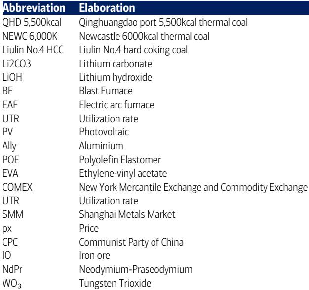
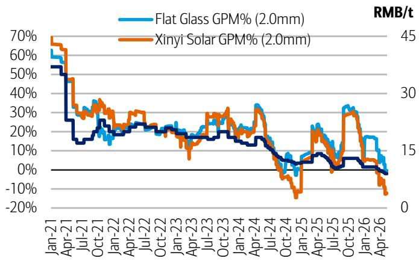

# China's Basic Materials Market Has Entered a Regime of Structural Scarcity, Not Cyclical Volatility

The latest weekly data from China's basic materials sector reveals a pattern that should command the attention of every serious investor in industrial commodities: the market is no longer oscillating within familiar cyclical boundaries but is instead consolidating around a new structural equilibrium defined by persistent supply constraints and widening margin dispersion. Copper concentrate treatment charges have plunged to negative USD 104 per ton, a level that would have been dismissed as impossible just two years ago. Aluminum smelting margins have climbed to RMB 8,077 per ton even as downstream demand in steel and construction materials remains tepid. These are not the signals of a market in normal cyclical adjustment. They are the fingerprints of a structural transformation that rewards selectivity and punishes broad-brush sector exposure.

The critical insight for decision-makers is this: the traditional correlation between Chinese economic activity and basic materials prices has weakened significantly. Iron ore prices held firm at USD 111.5 per ton despite a 0.1 percent weekly decline, even as steel margins remained deeply negative at negative RMB 257 per ton for rebar. This decoupling between upstream raw material pricing and downstream profitability is not a temporary aberration. It reflects a fundamental shift in market power from processing industries to resource owners, driven by geopolitical risk premiums embedded in supply chains and by the depletion of easily accessible concentrate grades globally. Investors who continue to analyze China's basic materials through the lens of GDP growth or property starts alone are missing the most important variable in the current environment: the structural tightening of upstream supply that no demand forecast can quickly resolve.

## The Collapse of Copper Treatment Charges Signals That Concentrate Markets Are Permanently Tighter Than Refined Metal Markets

The most consequential data point in this week's report is not the 2.8 percent weekly gain in LME copper prices to USD 13,895 per ton, but rather the continued slide in spot treatment and refining charges to negative USD 104 per ton. Negative TC/RC means that Chinese smelters are effectively paying copper miners to take their concentrate, an arrangement that inverts the normal economics of the smelting industry. This is not a short-term squeeze. It is the logical endpoint of years of underinvestment in new mine supply, compounded by recurring geopolitical disruptions that have raised the effective cost and risk of moving concentrate from mine to smelter.

The strategic implication is clear: the bottleneck in the copper value chain has shifted decisively from refined metal availability to concentrate availability. Smelters with long-term contract coverage or captive mine supply will capture disproportionate value, while spot-dependent operators face margin compression that may force capacity closures. The Middle East tensions affecting Strait of Hormuz shipments and the Peruvian government's USD 2 billion bailout of Petroperu are not isolated events. They are manifestations of a broader pattern in which energy system fragility and political risk in major mining jurisdictions create persistent supply overhangs that refined metal inventory data alone cannot capture. Investors should treat the negative TC/RC regime as a structural condition that will persist until new mine capacity comes online at scale, which based on current project timelines remains years away.

## Steel Margins Remain Deeply Negative Because Raw Material Cost Pass-Through Has Broken Down

While copper and aluminum prices have rallied, the steel complex tells a more sobering story about the limits of commodity price transmission in China's current economic environment. Rebar margins stood at negative RMB 257 per ton and hot-rolled coil margins at negative RMB 213 per ton, even as apparent steel consumption jumped 8.4 percent week-over-week to 9.1 million tons. The headline strength in demand is real, but it is being overwhelmed by the cost structure. Iron ore prices declined only marginally by 0.1 percent to USD 111.5 per ton, and coking coal costs remain elevated, squeezing mills that lack captive raw material sources.

The structural problem is that China's steel industry has entered a regime of excess capacity that prevents mills from passing through higher input costs to customers, even when demand is firm. Finished steel inventories declined 4.3 percent week-over-week, which would normally support pricing power. Yet spot prices for rebar and HRC fell by 1.3 percent and 0.7 percent respectively. This apparent contradiction resolves when one recognizes that the inventory drawdown is occurring from elevated levels and that the demand recovery is concentrated in price-sensitive segments. The market is sending a clear signal: steel is abundant at any price above marginal cost, and the only way margins will improve is through capacity rationalization, not demand recovery. Investors should expect persistent margin pressure in steel until either iron ore prices correct substantially or significant mill closures occur, neither of which appears imminent.

## The Divergence Between Upstream and Downstream Materials Creates a Clear Framework for Portfolio Positioning

The most actionable insight from this week's data is the stark divergence in margin trajectories across the materials value chain. Upstream commodities with concentrated supply and high geopolitical risk premiums are capturing value: copper concentrate suppliers benefit from negative TC/RC, aluminum smelters enjoy RMB 8,077 per ton margins, and even thermal coal at Qinhuangdao rose 2.3 percent to RMB 830 per ton. Downstream processing industries with fragmented capacity and limited pricing power are being squeezed: steel mills operate at negative margins, float glass margins for Xinyi fell to 11.7 percent, and solar glass margins for Flat Glass and Xinyi Solar declined 9.2 percent and 21.1 percent week-over-week respectively.

This divergence provides a decision framework for investors. The primary question is not whether commodity prices will rise or fall in aggregate, but rather where in the value chain pricing power resides. The evidence strongly suggests that resource owners with exposure to structurally tight concentrate markets will continue to outperform processors who depend on spot raw material procurement. The secondary question concerns inventory dynamics. Shanghai bonded copper warehouse inventories declined 2.7 percent while social inventories rose 4.5 percent, indicating that physical metal is moving from bonded storage into consumption but that overall stock levels remain elevated relative to historical norms. This mixed inventory picture suggests that refined copper prices may face headwinds even as concentrate markets remain tight, creating a potential divergence between the performance of mining equities and smelting equities that investors must navigate carefully.

## What the Report Does Not Fully Answer: The Sustainability of Aluminum Margins and the Tungsten Price Collapse

For all the richness of this week's data, several critical questions remain unresolved. Aluminum margins at RMB 8,077 per ton appear extraordinarily attractive, but the sustainability of these margins depends on factors that the weekly data cannot fully illuminate. LME aluminum prices surged 5 percent week-over-week to USD 3,741 per ton, yet Changjiang spot prices in China rose only 0.6 percent, suggesting that the domestic premium is compressing. If Chinese aluminum demand softens or if smelters in Yunnan restart capacity following the end of dry-season power restrictions, the margin could compress rapidly. The report does not provide sufficient visibility into the trajectory of Chinese aluminum supply additions or into the durability of the export demand that has supported LME pricing.

More puzzling is the 27.3 percent week-over-week collapse in tungsten prices to RMB 493,000 per ton. Tungsten is a strategic metal with concentrated supply in China, and such a sharp decline typically signals either a sudden demand shock or a release of government stockpiles. The report offers no explanation for this move, and the lack of context is a significant gap. Investors with exposure to rare earth or strategic metals should treat this as a yellow flag that warrants deeper investigation into whether the tungsten decline reflects idiosyncratic factors or broader weakness in industrial demand for specialty materials. The report also does not address the trajectory of lithium carbonate margins, which remain negative for spodumene-based refining despite only a 1 percent weekly price decline. The lithium market appears to be in a painful but necessary process of cost curve rationalization, and the weekly data does not yet show signs of a bottom.

## This Data Suggests a New Investment Playbook for China Basic Materials: Favor Concentrate Exposure, Avoid Downstream Processing, and Watch for Policy Catalysts

The pattern across this week's data points toward a clear strategic conclusion. Investors should overweight positions in companies with direct exposure to copper concentrate, aluminum smelting with captive power, and high-grade iron ore assets, while underweighting steel mills, glass manufacturers, and downstream chemical processors that lack pricing power. The negative TC/RC in copper is the single most important signal in the report because it indicates that the upstream segment of the value chain has pricing power that is unlikely to erode quickly. The aluminum margin data reinforces this view, though with the caveat that domestic versus international price dynamics need close monitoring.

The open question that should drive further research is whether Chinese policymakers will intervene to address the margin compression in downstream industries. Steel mills operating at negative margins for extended periods will eventually trigger capacity closures, but the timing and scale of such closures are uncertain. Similarly, the solar glass margin compression to single-digit levels may accelerate industry consolidation, creating opportunities for well-capitalized producers but risks for marginal operators. The report does not provide a policy forecast, but the data strongly suggests that the current margin configuration is unsustainable for downstream industries, which increases the probability of either raw material price corrections or government support measures. Investors who can anticipate which of these outcomes is more likely will have a significant advantage in positioning for the next phase of the cycle.

Join the community to read the full report and review the original charts.

*This article is for learning and discussion only and does not constitute investment advice.*

Personal reading notes and learning share only. Not investment advice.

