18 May 2026 03:05:23 ET | 38 pages

# China Infant Formula

2026 proprietary survey findings

# CITI'S TAKE

Citi's global infant formula team comprising of Sam Teeger, Tiffany Feng, Cedric Besnard, and Joanna Wuensch have partnered with Citi's Research Innovation Lab to conduct their sixth annual survey of 1,200 parents/caregivers of young children in China (from Tier 1 to Tier 5 cities) who purchase infant formula.

# In this report we discuss 11 key findings from our survey.

Links to our previous China IMF surveys:

2025: China Infant Formula - Infant formula: 2025 proprietary survey findings

2024: Global Agricultural Products - Infant formula: 2024 proprietary survey findings

2023: Greater China Food Manufacturers - Infant formula: 2023 proprietary survey findings

2022: Greater China Food Manufacturers - Infant formula: 2022 proprietary survey findings

2021: China Infant Formula - Citi's 2021 Proprietary Survey Reaffirms Positive View on Feihe

2020: China Infant Formula Sector - Citi Proprietary Survey Findings

# Sam Teeger $^{AC}$

+61-2-8225-4319

sam.teeger@citi.com

# Tiffany Feng $^{AC}$

+852-2501-2759

tiffany.feng@citi.com

# Cedric Besnard $^{AC}$

+33-1-7075-5276

cedric.besnard@citi.com

# Joanne Wuensch AC

+1-212-816-9606

joanne.wuensch@citi.com

Data Summary 

<table><tr><td colspan="6"></td><td colspan="2">Rating</td><td rowspan="2">Short-Term View</td><td colspan="2">Target Price</td><td colspan="4"></td><td colspan="2">Current Fiscal Year</td><td colspan="2">Next Fiscal Year</td></tr><tr><td>Company</td><td>Ticker</td><td>Ccy</td><td>Price</td><td>Mkt Cap (M)</td><td>Date &amp; Time</td><td>Old</td><td>New</td><td>Old</td><td>New</td><td>ESPR (%)</td><td>Div Yld (%)</td><td>ETR (%)</td><td>Last Rpt Yr</td><td colspan="2">EPS</td><td colspan="2">EPS</td></tr><tr><td>Abbott Laboratories</td><td>ABT</td><td>US$</td><td>84.47</td><td>147,131</td><td>15 May 16:00</td><td>1</td><td>nc</td><td>-</td><td>108.00</td><td>nc</td><td>27.9</td><td>1.7</td><td>29.6</td><td>Dec-25</td><td>5.45</td><td>nc</td><td>5.98</td><td>nc</td></tr><tr><td>China Feihe</td><td>6186.HK</td><td>HK$</td><td>3.34</td><td>29,418</td><td>15 May 16:10</td><td>2</td><td>nc</td><td>-</td><td>3.60</td><td>nc</td><td>7.8</td><td>5.4</td><td>13.2</td><td>Dec-25</td><td>0.295</td><td>nc</td><td>0.277</td><td>nc</td></tr><tr><td>Danone</td><td>DANO.PA</td><td>€</td><td>61.24</td><td>41,729</td><td>15 May 17:30</td><td>2</td><td>nc</td><td>-</td><td>77.00</td><td>nc</td><td>25.7</td><td>3.8</td><td>29.6</td><td>Dec-25</td><td>3.97</td><td>nc</td><td>4.28</td><td>nc</td></tr><tr><td>Health &amp; Happines (H&amp;H) Int&#x27;l Hldgs</td><td>1112.HK</td><td>HK$</td><td>13.47</td><td>8,696</td><td>15 May 16:10</td><td>1</td><td>nc</td><td>-</td><td>16.00</td><td>nc</td><td>18.8</td><td>2.7</td><td>21.5</td><td>Dec-25</td><td>1.203</td><td>nc</td><td>1.518</td><td>nc</td></tr><tr><td>Nestlé</td><td>NESN.S</td><td>SFr</td><td>78.07</td><td>201,149</td><td>15 May 17:30</td><td>2</td><td>nc</td><td>-</td><td>85.00</td><td>nc</td><td>8.9</td><td>3.8</td><td>12.7</td><td>Dec-25</td><td>4.41</td><td>nc</td><td>4.71</td><td>nc</td></tr><tr><td>The A2 Milk Company</td><td>A2M.AX</td><td>A$</td><td>6.13</td><td>4,447</td><td>15 May 16:00</td><td>3</td><td>nc</td><td>-</td><td>5.85</td><td>nc</td><td>-4.6</td><td>2.5</td><td>-2.0</td><td>Jun-25</td><td>27</td><td>nc</td><td>27</td><td>nc</td></tr><tr><td colspan="6">1 = Buy, 2 = Neutral, 3 = Sell, H = High Risk</td><td colspan="13">ESPR = Expected Share Price Return, ETR = Expected Total Return, nc = no change</td></tr><tr><td colspan="6">Source: Citi</td><td colspan="13">^Catalyst Watch</td></tr></table>

Earnings Estimates 

<table><tr><td colspan="4"></td><td colspan="5">Last Reported Year</td><td colspan="5">Current Fiscal Year</td><td colspan="5">Next Fiscal Year</td></tr><tr><td>Company Name</td><td>Ticker</td><td>Last Rpt Year</td><td>Currency</td><td>1Q</td><td>2Q</td><td>3Q</td><td>4Q</td><td>FY0</td><td>1Q</td><td>2Q</td><td>3Q</td><td>4Q</td><td>FY1</td><td>1Q</td><td>2Q</td><td>3Q</td><td>4Q</td><td>FY2</td></tr><tr><td>Abbott Laboratories</td><td>ABT</td><td>Dec-25</td><td>US$</td><td>1.09</td><td>1.26</td><td>1.30</td><td>1.50</td><td>5.15</td><td>1.15</td><td>1.28</td><td>1.43</td><td>1.59</td><td>5.45</td><td>-</td><td>-</td><td>-</td><td>-</td><td>5.98</td></tr><tr><td>China Feihe</td><td>6186.HK</td><td>Dec-25</td><td>Rmb</td><td>-</td><td>-</td><td>-</td><td>-</td><td>0.292</td><td>-</td><td>-</td><td>-</td><td>-</td><td>0.295</td><td>-</td><td>-</td><td>-</td><td>-</td><td>0.277</td></tr><tr><td>Danone</td><td>DANO.PA</td><td>Dec-25</td><td>€</td><td>-</td><td>-</td><td>-</td><td>-</td><td>3.81</td><td>-</td><td>-</td><td>-</td><td>-</td><td>3.97</td><td>-</td><td>-</td><td>-</td><td>-</td><td>4.28</td></tr><tr><td>Health &amp; Happines (H&amp;H) Int&#x27;l Hldgs</td><td>1112.HK</td><td>Dec-25</td><td>Rmb</td><td>-</td><td>-</td><td>-</td><td>-</td><td>1.010</td><td>-</td><td>-</td><td>-</td><td>-</td><td>1.203</td><td>-</td><td>-</td><td>-</td><td>-</td><td>1.518</td></tr><tr><td>Nestlé</td><td>NESN.S</td><td>Dec-25</td><td>SFr</td><td>-</td><td>-</td><td>-</td><td>-</td><td>4.41</td><td>-</td><td>-</td><td>-</td><td>-</td><td>4.41</td><td>-</td><td>-</td><td>-</td><td>-</td><td>4.71</td></tr><tr><td>The A2 Milk Company</td><td>A2M.AX</td><td>Jun-25</td><td>NZ¢</td><td>-</td><td>-</td><td>-</td><td>-</td><td>28</td><td>-</td><td>-</td><td>-</td><td>-</td><td>27</td><td>-</td><td>-</td><td>-</td><td>-</td><td>27</td></tr><tr><td colspan="19">Source: Citi</td></tr></table>

# Citi China Infant Formula Survey

Sam Teeger (a2), Tiffany Feng (China Feihe, H&H), Joanne Wuensch (Abbott), Cedric Besnard (Danone, Nestle), conducted a survey of 1,200 Chinese consumers, with the support of Citi's Research Innovation Lab, which helped coordinate the survey and gather the data we leveraged to develop insights into trends in China.

# Potential stock implications from our survey

# a2 Milk (covered by Sam Teeger)

The survey findings provide deeper insight from a consumer perspective into competitor stock levels following well documented recalls/shortages. However, a2 was not able to maximise this potential opportunity due to its own supply issues, and according to our survey, consumers are switching to domestic brands. The survey also identifies an improving consumer perception of domestic infant formula milk quality, particularly those that are manufactured in China. The survey suggests the best way for a2 to mitigate this risk is to ensure it does not under-invest in the science behind its products with nutritional value/scientific benefit being the primary driver influencing consumer choice and HMOs being very important (hence the Genesis shortage is particularly unfortunate). The survey also provides support that a2 is partially decoupling from the birth rate through several factors including premiumization, category expansion, diversifying to products for older consumers and English label relative outperformance. However, the survey does caution against assuming marriages will translate to more births in the near term. The next two zodiacs Horse (2026) and Goat (2027) appear to be incrementally positive from a birth rate perspective.

We recently downgraded a2 Milk to Sell as we see risk that supply chain constraints could persist for longer than expected, and even when they are resolved it may not be easy or cheap for a2 to win back customers who have switched to competitor brands.

# China Feihe (covered by Tiffany Feng)

Feihe has successfully solidified its leadership as the No.1 domestic IMF brand through its "most suitable for Chinese babies" positioning and a strong super-premium product mix (68% of sales in 2025). The company benefits from premiumization, declining breastfeeding rates, HMO innovation (being among the first domestic brands to launch HMO products), online expansion (26% of revenue in 2025, improved market share at 13.2% in 2025), and macro tailwinds such as improved financial health, childcare subsidies, and surprisingly favorable zodiac cycles. Feihe also stands to benefit the most from consumers' preference for freshness, thanks to its newly launched fresh ingredient traceability system in Jan 2026, which allows consumers to verify core ingredient production dates via QR code, effectively building consumer trust.

Industry outlook for 2026E remains tough given potential mid-single digit decline in infant population size (0-3 years old). That said, Feihe may have a mild topline recovery given its inventory clearance in 2H25 has set an easy comp base and new HMO product is likely to be a growth pillar on which management has strong ambitions. We are Neutral on Feihe as we think the weak industry outlook has been priced into the stock's low teens P/E and \~6% dividend yield. See our latest report (2H25 Results Missed But Dividend In Line; Targets Stable 2026) for details.

# Health and Happiness (covered by Tiffany Feng)

H&H is a meaningful beneficiary of consumer switches from recalled brands, as its European-produced (France and Denmark) premium and super-premium IMF products align well with demand for safety and quality. The company benefits strongly from premiumization (22.1% super-premium market share in Jan-Feb 2026), its early-mover advantage in HMO-added products, rapid online channel growth (45% in 2025, accounted for 29% of sales; improved market share at 3.3% in 2025), and robust execution (72% IMF sales growth in 1Q26). However, heightened consumer scrutiny of expiration dates and freshness puts some pressure on H&H's global supply chain model, though this has been well managed historically. H&H also enjoys additional advantages from its diversified portfolio in pediatrics and health supplements.

In our latest report (A Strong Start to the Recovery Year), we highlighted 1Q26 sales growth ahead of mgmt's full year growth target. While weak infant population trend brings challenge to H&H's BNC business, it recorded strong rebound in IMF sales in 1Q26 and mgmt expect IMF sales to grow at mid to high teens in 2026E. Besides, it took market share from underperforming foreign brands and has developed successful measures in marketing, branding, distribution, and execution. More importantly, we expect ANC and PNC growth and finance cost reduction to drive 2026E earnings significantly. We have a Buy on H&H.

# Danone and Nestlé (covered by Cedric Besnard)

The survey confirms that recent recalls did have an impact on both stock levels and consumer behaviors, although it appears that Nestlé recalls seem to have had a wider impact on on-shelf availability/stock levels, which may imply that Danone could have taken some share from Nestlé in Q1, at least within the imported segment. We would think that the key risk for both multinationals, post recalls, is a more lasting willingness from Chinese consumers to switch to domestic, long expiry date Chinese products, as highlighted in the survey, although we also found in some of the answers some comfort around LT buffers, especially around premiumization and the switch towards adjacencies (pediatrics, older demographics) where we think both groups have scale and hospital penetration.

Danone (DANO.PA): Defendable margin, but IMF drag, time needed for US EDP.

Nestlé (NESN.S): A RIG beat more than enough for now to support H2 relative resilience

# Abbott (covered by Joanne Wuensch)

Abbott ceased selling its pediatric nutrition products directly into China in 2023, maintaining adult nutrition sales although not significantly, thus these results are largely neutral to its sales there. With that said, its Nutrition franchise has stepped through a number of hurdles, including volume and pricing headwinds, the loss of a WIC contract (Special Supplemental Nutrition Program for Women, Infants, and children in the U.S) which has since been replaced, plus the ongoing necrotizing enterocolitis (NEC) in premature infant litigation. In 1Q26, Nutrition sales were \$2.017B (down 7.7% y/y), with U.S. sales down 11.6% and OUS down 4.7% as the franchise continues to struggle, albeit an improvement from the 4Q25 and management commentary that it is making early progress noting “volumes are starting to recover.” Yet top-of-mind for investors, particularly in our conversations, is: does it make sense to keep the franchise? Management addressed this, noting that it continuously does a comprehensive assessment of its assets at both a product and geographic level, evaluating gaps versus the

competition. Further, while management likes “the diversity of our business model” and will not make long-term strategic decisions based on near-term challenges, it is focused on returning to growth.

Abbott Laboratories (ABT.N) - Tricky Quarter, Need to Believe in 2H26 Re-acceleration

# Key takeaways

# #1. Noticeable shortages of recalled formula brands and switching from recalled brands to Chinese brands

84% of respondents who currently use or used to purchase Danone (Aptamil, Nutrilon) and/or Nestle Wyeth (NAN, Illuma, S-26) have found these labels to be unavailable this year due to recalls (Figure 1). The largest proportion of respondents found less stock of Nestle but Danone stock levels unchanged, which correlates to the fact that Nestle infant formula was recalled in China, but not Danone.

The majority of respondents who used to buy Danone and/or Nestle Wyeth switched to a Chinese brand (63%), whilst 35% switched to other international brands (Figure 2).

Figure 1. Have you found Danone (Aptamil, Nutrilon) and Nestle Wyeth (NAN, Illuma, S-26) infant formulas to have been unavailable this year due to recalls?   
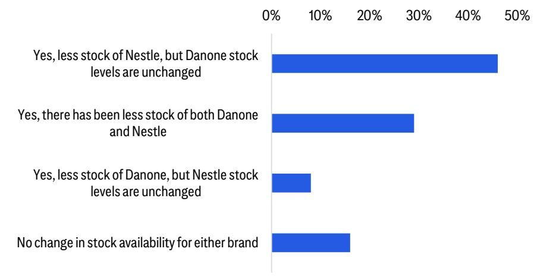

bar

| Response | Percentage (%) |
| :--- | :--- |
| Yes, less stock of Nestle, but Danone stock levels are unchanged | 47 |
| Yes, there has been less stock of both Danone and Nestle | 30 |
| Yes, less stock of Danone, but Nestle stock levels are unchanged | 9 |
| No change in stock availability for either brand | 17 |

© 2026 Citi Inc. No redistribution without Citi's written permission. Source: Citi

Figure 2. Have you switched from Danone (Aptamil, Nutrilon) and Nestle Wyeth (NAN, Illuma, S-26) to other brands?   
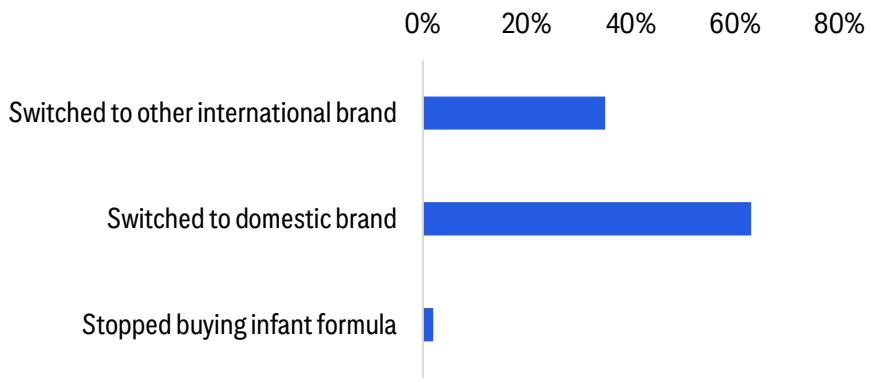

bar

| Category | Value (%) |
|---|---|
| Switched to other international brand | 38 |
| Switched to domestic brand | 65 |
| Stopped buying infant formula | 4 |

© 2026 Citi Inc. No redistribution without Citi's written permission.   
Source: Citi

# Potential stock implications

■ a2 Milk. Any potential tailwind from competitor recalls/stock issues seem to have been a missed opportunity given its recent supply issues causing stock shortages in China. In addition, any tailwinds to a2 from competitor recalls may be limited due to the majority of switching from recalled brands to Chinese brands, rather than international brands.   
China Feihe/Health and Happiness. We believe H&H is a meaningful beneficiary from such a switch because H&H's major IMF products are produced in Europe (France plus Denmark) and positioned at premium and super-premium segments, which meet the demand of consumers who are switching from the recalled brands. We do not think Feihe gained meaningfully from such incident due to different marketing positioning.   
Danone/ Nestlé. This is an indication that there has been some switch and negative perception headwinds for both Danone and Nestlé, although it is interesting to note that the transition seems to be directed more towards domestic brands than other multinationals, which we think is a reflection of a wider category trend as well as Danone (in particular) dominance in the imported multinationals' space. However, we also note that Nestlé recalls seem to have had a wider impact on on-shelf availability/stock levels, which may imply that Danone could have taken some share from Nestlé, at least within the imported segment. We think the impact is more negative for Nestlé given relative stock levels perception vs Danone.

# #2. Improving perception of domestic brand quality, however country of origin less relevant with nutritional value / scientific benefit more important

Whilst the percentage of respondents that prefer foreign brands has declined to its lowest point since the start of our infant formula surveys in 2020 (Figure 4), the proportion of respondents who prefer domestic brands is unchanged since 2025, with the majority (55%) of respondents having no preference for domestic or foreign brands (Figure 3). Figure 5 also shows more respondents feeling indifferent to foreign and domestic brands compared to previous years.

This could represent a shift in consumer priority with consumers preferencing nutritional benefit over brand and/or country of origin. Figure 7 shows that whilst brand and nutritional value/scientific benefit were of equal influence in 2025, brand is now second to nutritional value in factors influencing choice of formula milk. Country of origin has also dropped in importance since 2025, now no longer in the top 3 factors.

Nevertheless, the perception of Chinese formula milk quality continues to improve more than foreign brands, with almost three quarters of respondents with improving views of the quality of Chinese brands in the past 12 months vs roughly half of respondents for foreign brands (Figure 8). In addition, Figure 9 shows a much larger proportion of respondents (50%) are more likely to buy a foreign brand if it is manufactured in China (24% in 2025), with only 6% less likely (9% in 2025), and 44% indifferent (68% in 2025). China continues to be the top country of origin for quality in the survey (Figure 6), and Chinese brands continue to be considered as offering the highest quality infant milk formula (Figure 5) and preferred over foreign brands (Figure 4).

Figure 3. When purchasing infant milk formula, do you prefer to buy domestic or foreign brands?   
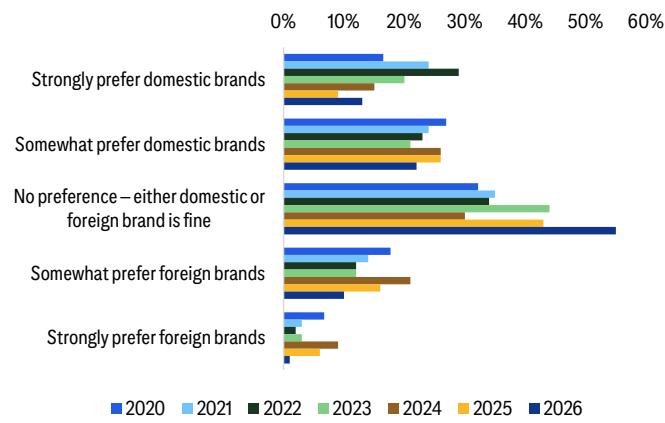

bar

| Preference Category | 2020 (%) | 2021 (%) | 2022 (%) | 2023 (%) | 2024 (%) | 2025 (%) | 2026 (%) |
|---|---|---|---|---|---|---|---|
| Strongly prefer domestic brands | 17 | 24 | 30 | 21 | 15 | 9 | 13 |
| Somewhat prefer domestic brands | 28 | 24 | 25 | 24 | 27 | 27 | 23 |
| No preference – either domestic or foreign brand is fine | 33 | 34 | 35 | 44 | 41 | 43 | 56 |
| Somewhat prefer foreign brands | 18 | 15 | 14 | 19 | 21 | 16 | 10 |
| Strongly prefer foreign brands | 7 | 4 | 3 | 3 | 8 | 7 | 1 |

© 2026 Citi Inc. No redistribution without Citi's written permission.   
Source: Citi

Figure 5. Which of the following offers the highest quality infant milk formula?   
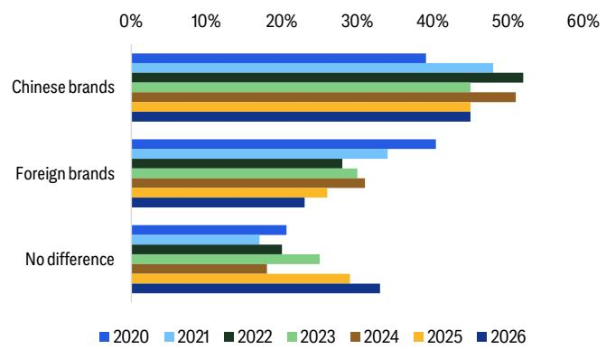

bar

| Category | 2020 (%) | 2021 (%) | 2022 (%) | 2023 (%) | 2024 (%) | 2025 (%) | 2026 (%) |
| :--- | :--- | :--- | :--- | :--- | :--- | :--- | :--- |
| Chinese brands | 39 | 47 | 52 | 45 | 48 | 45 | 45 |
| Foreign brands | 41 | 35 | 29 | 30 | 31 | 26 | 23 |
| No difference | 21 | 19 | 20 | 25 | 19 | 29 | 34 |

© 2026 Citi Inc. No redistribution without Citi's written permission.   
Source: Citi

Figure 4. When purchasing infant milk formula, do you prefer to buy domestic or foreign brands?   
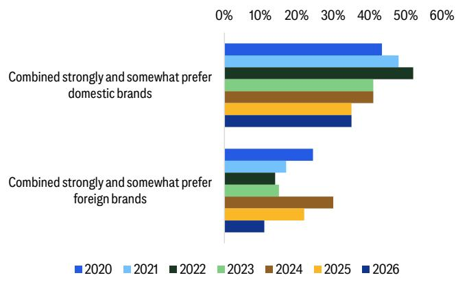

bar

| Category | 2020 (%) | 2021 (%) | 2022 (%) | 2023 (%) | 2024 (%) | 2025 (%) | 2026 (%) |
|---|---|---|---|---|---|---|---|
| Combined strongly and somewhat prefer domestic brands | 44 | 47 | 52 | 41 | 35 | 35 | 34 |
| Combined strongly and somewhat prefer foreign brands | 25 | 18 | 15 | 15 | 31 | 25 | 13 |

© 2026 Citi Inc. No redistribution without Citi's written permission.   
Source: Citi

Figure 6. Based on your experience or what you read/heard, which of the regions below produces the highest quality formula milk?   
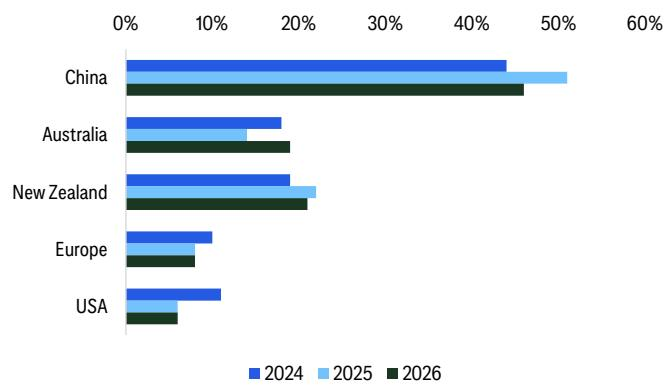

bar

| Region | 2024 (%) | 2025 (%) | 2026 (%) |
| :--- | :--- | :--- | :--- |
| China | 44 | 47 | 46 |
| Australia | 18 | 15 | 20 |
| New Zealand | 20 | 22 | 21 |
| Europe | 11 | 9 | 8 |
| USA | 11 | 8 | 7 |

© 2026 Citi Inc. No redistribution without Citi's written permission.   
Source: Citi

Figure 7. What are the main three factors that influence your choice of formula milk?   

bar

| Category | 2020 (%) | 2021 (%) | 2022 (%) | 2023 (%) | 2024 (%) | 2025 (%) | 2026 (%) |
| :--- | :---: | :---: | :---: | :---: | :---: | :---: | :---: |
| Nutritional value/ Scientific benefit | 70 | 55 | 60 | 55 | 48 | 58 | 55 |
| Brand | 53 | 48 | 53 | 42 | 40 | 60 | 48 |
| MBS store recommendation | 25 | 27 | 35 | 33 | 33 | 33 | 40 |
| Country of origin | 33 | 35 | 31 | 31 | 34 | 37 | 34 |
| Family/Friends recommendation | 29 | 34 | 41 | 38 | 34 | 34 | 31 |
| Doctor's recommendation | 24 | 27 | 31 | 30 | 37 | 29 | 30 |
| Manufacturing date | 27 | 29 | 29 | 29 | 31 | 31 | 27 |
| Pricing/ Discounts/ Promotions | 25 | 34 | 31 | 31 | 28 | 26 | 25 |

© 2026 Citi Inc. No redistribution without Citi's written permission.   
Source: Citi

Figure 8. How have your views of the quality of Chinese and foreign brands of formula milk changed in the past 12 months?   
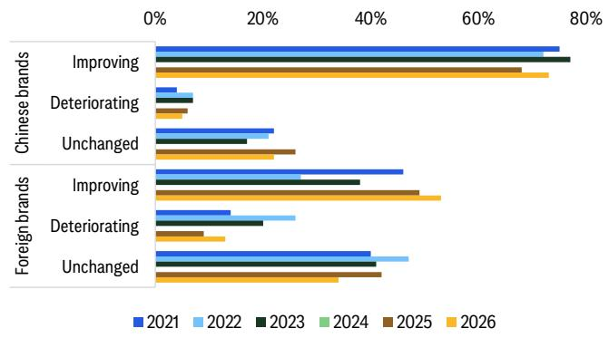

bar

| Category | 2021 (%) | 2022 (%) | 2023 (%) | 2024 (%) | 2025 (%) | 2026 (%) |
| :--- | :--- | :--- | :--- | :--- | :--- | :--- |
| Chinese brands | 75 | 78 | 76 | 74 | 70 | 73 |
| Deteriorating | 5 | 8 | 9 | 6 | 5 | 4 |
| Unchanged | 22 | 20 | 18 | 26 | 24 | 21 |
| Foreign brands | 45 | 38 | 40 | 50 | 55 | 52 |
| Improving | 40 | 35 | 38 | 45 | 48 | 50 |
| Deteriorating | 15 | 25 | 20 | 10 | 12 | 14 |
| Unchanged | 40 | 45 | 42 | 43 | 41 | 36 |

© 2026 Citi Inc. No redistribution without Citi's written permission.   
Source: Citi

Figure 9. Are you more likely to buy a foreign brand, if it is manufactured in China?   
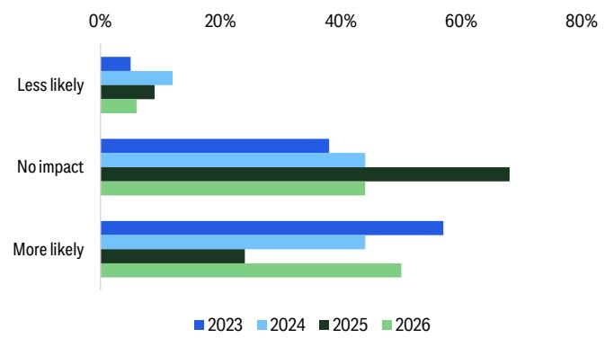

bar

| Category | 2023 (%) | 2024 (%) | 2025 (%) | 2026 (%) |
|---|---|---|---|---|
| Less likely | 5 | 12 | 8 | 6 |
| No impact | 38 | 44 | 69 | 44 |
| More likely | 57 | 43 | 24 | 51 |

© 2026 Citi Inc. No redistribution without Citi's written permission.   
Source: Citi

Figure 10. What infant formula has your child primarily consumed over the last 12 months?   
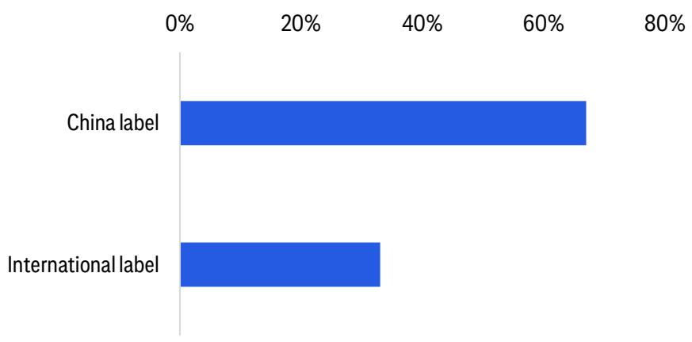

bar

| Label | Value (%) |
| :--- | :--- |
| China label | 68 |
| International label | 34 |

© 2026 Citi Inc. No redistribution without Citi's written permission.   
Source: Citi

Figure 11. Why do you choose domestic Chinese brands for formula milk?   
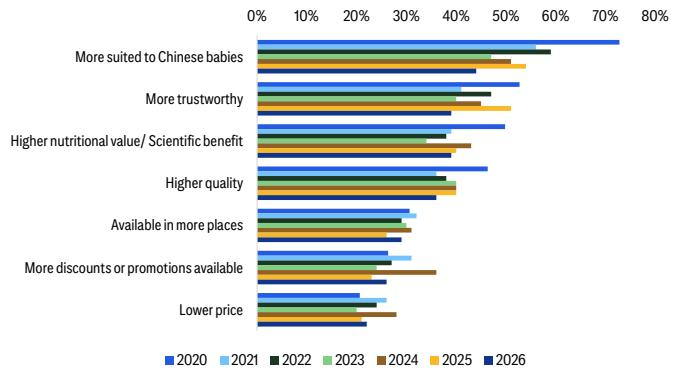

bar

| Category | 2020 (%) | 2021 (%) | 2022 (%) | 2023 (%) | 2024 (%) | 2025 (%) | 2026 (%) |
|---|---|---|---|---|---|---|---|
| More suited to Chinese babies | 75 | 70 | 65 | 55 | 50 | 48 | 45 |
| More trustworthy | 55 | 50 | 48 | 45 | 42 | 40 | 38 |
| Higher nutritional value/ Scientific benefit | 50 | 45 | 42 | 40 | 38 | 35 | 33 |
| Higher quality | 48 | 42 | 40 | 38 | 35 | 33 | 30 |
| Available in more places | 35 | 32 | 30 | 28 | 25 | 23 | 20 |
| More discounts or promotions available | 30 | 28 | 25 | 23 | 20 | 18 | 15 |
| Lower price | 25 | 23 | 20 | 18 | 15 | 13 | 10 |

© 2026 Citi Inc. No redistribution without Citi's written permission.   
Source: Citi

Figure 12. Why do you choose foreign brands for formula milk?   
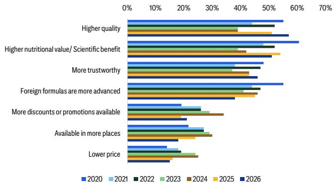

bar

| Category | 2020 | 2021 | 2022 | 2023 | 2024 | 2025 | 2026 |
| --- | --- | --- | --- | --- | --- | --- | --- |
| Higher quality | 58% | 55% | 54% | 39% | 41% | 51% | 57% |
| Higher nutritional value/Scientific benefit | 61% | 53% | 54% | 41% | 43% | 53% | 53% |
| More trustworthy | 47% | 46% | 41% | 38% | 43% | 43% | 46% |
| Foreign formulas are more advanced | 55% | 48% | 48% | 41% | 43% | 43% | 43% |
| More discounts or promotions available | 19% | 26% | 27% | 35% | 30% | 19% | 19% |
| Available in more places | 21% | 27% | 28% | 30% | 27% | 23% | 19% |
| Lower price | 15% | 18% | 19% | 27% | 27% | 18% | 16% |

© 2026 Citi Inc. No redistribution without Citi's written permission.   
Source: Citi

# Potential stock implications

■ a2 Milk. The improving quality perception of domestically produced infant formula is a headwind for a2 Milk, given all of its formula is produced in New Zealand and we think shifting any production to China may be some time away given the company is occupied with ramping up production at and integrating its newly acquired Pokeno facility.

The increasing importance of nutritional value / scientific benefit in influencing infant formula purchases is a positive for the upcoming a2 Platinum refresh which should have additional nutritional value and benefits.

China Feihe/Health and Happiness. We believe Feihe has successfully built its brand image of being “most suitable for Chinese babies” and hence is well positioned to solidify its leadership as the No.1 domestic IMF company. We also believe Feihe’s over 65% of IMF sales from super-premium products (including super-premium-plus) enable it to benefit from the trend of consumer focus on nutrition. We believe H&H's focus on the super-premium segment enables it to benefit from the trend of consumer focus on nutrition. H&H's market share in the super-premium segment has significantly improved from $13.3\%$ in 2024 to $17.1\%$ in 2025 and $22.1\%$ in 2M26.

Danone. The improving quality perception of domestically produced infant formula is a headwind for Danone, although the company does also have local production. The increasing importance of nutritional value / scientific benefit in influencing infant formula purchases is however a positive especially as the group is premiumizing its offering (Aptamil Essensis).   
Nestlé. The improving quality perception of domestically produced infant formula is a headwind for Nestlé – premiumization and increasing need for R&D is a positive for price/mix, but we would still assume Danone to be a relative winner.   
Abbott. These results may be slightly negative for Abbott's adult nutrition business given the improving perception of domestic brands.

# #3. Increased spending on infant formula

More respondents are spending more money on infant formula product compared to 12 months ago (Figure 13). Increased spending on infant formula has primarily been due to upsizing, switching to more expensive brands, or switching to more expensive products within the same brand (Figure 14), whilst respondents who are spending less tend to buy on promotions/deals (Figure 15). This premiumization trend helps reduce the impact of the declining birth rate through higher prices on lower volumes.

Figure 13. Are you spending less or more money on infant formula product compared to 12 months ago?   
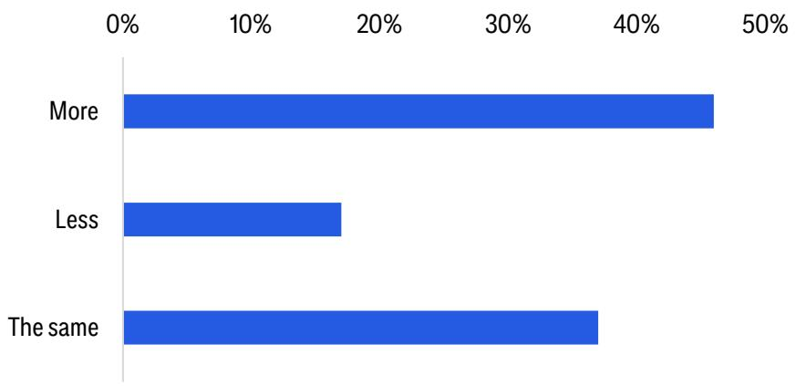

bar

| Category | Value (%) |
|---|---|
| More | 47 |
| Less | 18 |
| The same | 38 |

© 2026 Citi Inc. No redistribution without Citi's written permission.   
Source: Citi

Figure 14. Why are you spending more money on infant formula product compared to 12 months ago?   
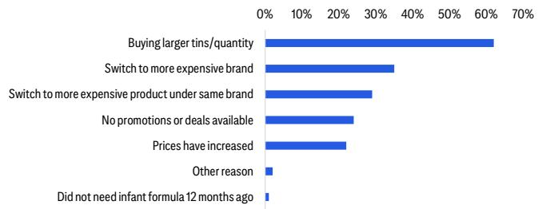

bar

| Reason | Percentage (%) |
| :--- | :--- |
| Buying larger tins/quantity | 62 |
| Switch to more expensive brand | 35 |
| Switch to more expensive product under same brand | 29 |
| No promotions or deals available | 24 |
| Prices have increased | 23 |
| Other reason | 2 |
| Did not need infant formula 12 months ago | 1 |

© 2026 Citi Inc. No redistribution without Citi's written permission.   
Source: Citi

Figure 15. Why are you spending less money on infant formula product compared to 12 months ago?   
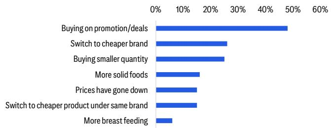

bar

| Category | Percentage (%) |
| :--- | :--- |
| Buying on promotion/deals | 48 |
| Switch to cheaper brand | 26 |
| Buying smaller quantity | 25 |
| More solid foods | 16 |
| Prices have gone down | 15 |
| Switch to cheaper product under same brand | 15 |
| More breast feeding | 7 |

© 2026 Citi Inc. No redistribution without Citi's written permission.   
Source: Citi

# Potential stock implications

■ a2 Milk. Higher spend from Chinese consumers on infant formula helps reduce the impact of the declining birth rate through higher prices despite lower volumes. This is a tailwind for a2 Milk. In addition, a2's recent launch of the more premium Genesis range should have been a benefit from consumers trading up, prior to supply issues which have been more acute in this product.   
China Feihe/Health and Happiness. Feihe's strong super-premium product offerings have been a key sales driver under industry headwinds. Its product mix of super-premium segment remains solid (68% in 2025 vs. 69% in 2024). Its super premium plus product “Astrobaby Zhuorui” only recorded mild sales decline in 2025 and Feihe continued to gain market share. This premiumization trend would further help Feihe to mitigate downside risk on price competition in 2026. We think H&H benefits from the premiumization trend, allowing it to safeguard its IMF gross margin given its focus on premium and super premium segments. Its IMF sales grew 72% in 1Q26 and its market share in super premium IMF reached 18.2% in 12m ending Feb 2026 and 22.1% in Jan-Feb 2026.   
Danone. Higher spend from Chinese consumers on infant formula helps reduce the impact of the declining birth rate through higher prices despite lower volumes. This is a tailwind for Danone which we think also explains the robustness of Danone's SN division.   
Nestlé. Higher spend from Chinese consumers on infant formula helps reduce the impact of the declining birth rate through higher prices despite lower volumes. This should be a tailwind for Nestlé, although we think the group still has to fix its Nutrition business and does not make the most of those premiumization needs yet.   
Abbott. Consumers spending more on infant formula should benefit Abbott and the market more broadly, mitigating volume impacts from the declining birth rate.

# #4. While breast milk is seen to be the highest quality, there are two key reasons impacting willingness to breastfeed

The survey suggests the majority of respondents are not likely to change whether they breastfeed or not (Figure 16). However, the survey has detected a growing proportion of Chinese mothers who believe that breastmilk is better quality than bottle milk for children (Figure 18), implying that consumers in China are driven to bottle-feed rather than breastfeed due to reasons other than quality.

When analysing the subset of respondents who are less likely to breastfeed, the key driver is financial pressures (Figure 17), followed by impact on physical appearance. Several studies including a study conducted in China in 2025 by Lin, D., Zheng, Q., Li, Q. et al. (Breastfeeding knowledge and body image affect breastfeeding attitude of pregnant women: a cross-sectional study. Sci Rep 15, 36874 (2025)) found that pregnant women are more reluctant to breastfeed due to their body image disturbance as they may feel embarrassed or dissatisfied with their appearance. The physical appearance aspect of a decline in breastfeeding is a risk to monitor.

Figure 19 shows a declining percentage of respondents changing from infant formula to breastfeeding (from 2024 to 2026).

Figure 16. Are you more or less likely to breast feed now than previously?   
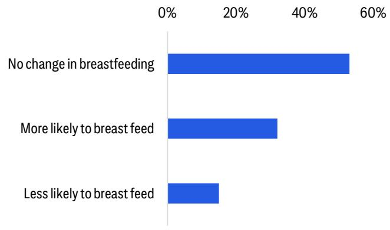

bar

| Response | Percentage (%) |
| :--- | :--- |
| No change in breastfeeding | 55 |
| More likely to breast feed | 33 |
| Less likely to breast feed | 16 |

© 2026 Citi Inc. No redistribution without Citi's written permission.
Source: Citi

Figure 17. Why are you less likely to breastfeed?   
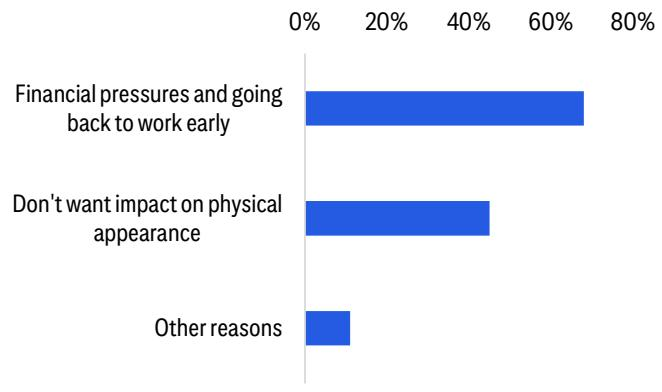

bar

| Reason | Percentage (%) |
| :--- | :--- |
| Financial pressures and going back to work early | 70 |
| Don't want impact on physical appearance | 45 |
| Other reasons | 12 |

© 2026 Citi Inc. No redistribution without Citi's written permission.
Source: Citi

Figure 18. What do you see as the best quality milk for children?   
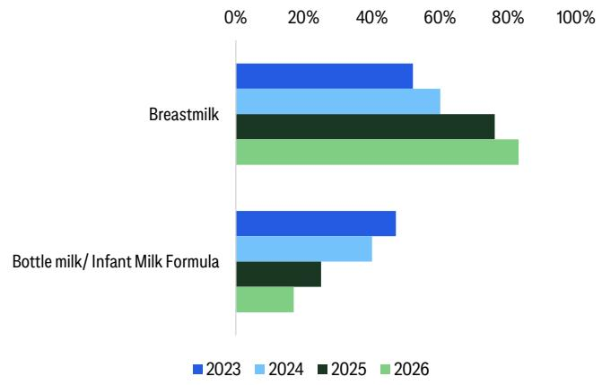

bar

| Category | 2023 (%) | 2024 (%) | 2025 (%) | 2026 (%) |
| :--- | :--- | :--- | :--- | :--- |
| Breastmilk | 52 | 60 | 75 | 85 |
| Bottle milk/ Infant Milk Formula | 48 | 41 | 27 | 19 |

© 2026 Citi Inc. No redistribution without Citi's written permission.
Source: Citi

Figure 19. Why have you changed the brand of formula milk you purchase?   
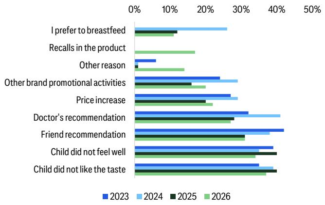

bar

| Reason | 2023 (%) | 2024 (%) | 2025 (%) | 2026 (%) |
|---|---|---|---|---|
| I prefer to breastfeed | 0 | 27 | 12 | 11 |
| Recalls in the product | 0 | 0 | 0 | 17 |
| Other reason | 6 | 0 | 1 | 14 |
| Other brand promotional activities | 24 | 30 | 16 | 20 |
| Price increase | 27 | 30 | 21 | 23 |
| Doctor's recommendation | 33 | 41 | 29 | 30 |
| Friend recommendation | 41 | 39 | 34 | 30 |
| Child did not feel well | 39 | 38 | 39 | 35 |
| Child did not like the taste | 36 | 39 | 39 | 38 |

© 2026 Citi Inc. No redistribution without Citi's written permission.
Source: Citi

# Potential stock implications

a2 Milk. Any substitution from breastfeeding to infant formula would be positive for a2 and should help decouple the company's prospects from the birth rate.   
China Feihe/Health and Happiness. The decline in breastfeeding rate would benefit Feihe and H&H, but to a lesser extent for Feihe given its relative strength in stage 3 formula.   
Danone/ Nestlé. Any substitution from breastfeeding to infant formula would be positive for multinationals and should help decouple the company's prospects from the birth rate.   
Abbott. Any shift in preference to infant formula from breastfeeding would benefit Abbott's Nutrition business in China.

# #5. Increasing importance of HMOs and other added nutrients in infant formula

Almost all the respondents regarded Human Milk Oligasaccharides (HMOs) as either very important or somewhat important, up from 2025. Almost half of respondents believed that formula with more nutritional ingredients added has the highest quality. This highlights the growing importance of added nutrients in infant milk formula such as HMOs.

Figure 20. How important is Human Milk Oligasaccharides (HMOs) in a formulation for buying an infant formula brand?   
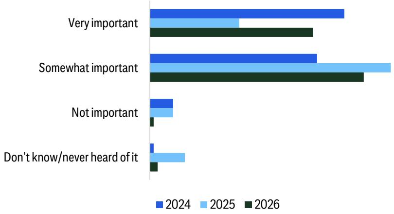

bar

| Category | 2024 | 2025 | 2026 |
|---|---|---|---|
| Very important | 1.3 | 0.8 | 0.9 |
| Somewhat important | 1.1 | 1.5 | 1.2 |
| Not important | 0.3 | 0.3 | 0.1 |
| Don't know/never heard of it | 0.1 | 0.5 | 0.2 |

© 2026 Citi Inc. No redistribution without Citi's written permission.   
Source: Citi

Figure 21. Which of the following formula milk types has the highest quality?   
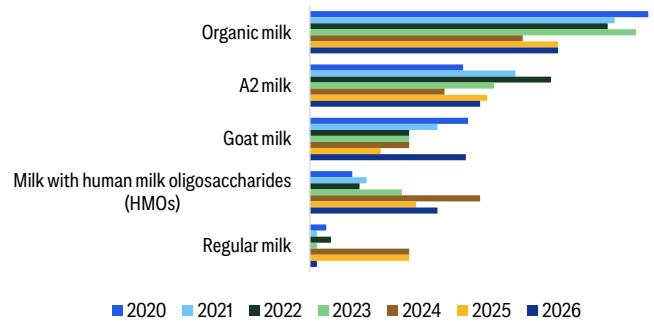

bar

| Category | 2020 | 2021 | 2022 | 2023 | 2024 | 2025 | 2026 |
|---|---|---|---|---|---|---|---|
| Organic milk | 98.5 | 97.0 | 96.5 | 95.0 | 88.0 | 87.5 | 87.0 |
| A2 milk | 70.0 | 75.0 | 85.0 | 78.0 | 72.0 | 73.0 | 74.0 |
| Goat milk | 75.0 | 78.0 | 72.0 | 70.0 | 65.0 | 63.0 | 75.0 |
| Milk with human milk oligosaccharides (HMOs) | 35.0 | 40.0 | 38.0 | 45.0 | 65.0 | 60.0 | 68.0 |
| Regular milk | 10.0 | 11.0 | 12.0 | - | - | - | - |

© 2026 Citi Inc. No redistribution without Citi's written permission.   
Source: Citi

Figure 22. Which of the following formula milk types has the highest quality?   
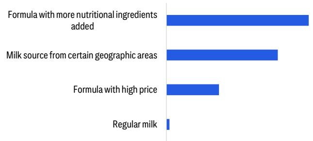

bar

| Category | Value |
|---|---|
| Formula with more nutritional ingredients added | 100 |
| Milk source from certain geographic areas | 80 |
| Formula with high price | 40 |
| Regular milk | 5 |

© 2026 Citi Inc. No redistribution without Citi's written permission.   
Source: Citi

# Potential stock implications

a2 Milk. The growing importance of added nutrients such as HMOs is a tailwind for a2's recently launched Genesis formula which includes added HMOs, probiotics, higher GOS pre-biotics, and algal-sourced DHA added to the formula. The survey findings make us more confident in a2's ability to grow market share through Genesis and further NPD in the China market. However, at the current time the company is experiencing supply constraints, which are more acute in its Genesis product. Further, while A2 milk is still seen as the second highest quality, the trend is weakening over the last 5 years with goat and HMO catching up.   
China Feihe. HMOs were approved as an additive in milk formula production in China in Oct 2023. Following this, Feihe was one of the first domestic brands to get HMO product registration in late 2025. Feihe also took the lead in developing a variety of HMO materials and formulating HMO standards, filling the gap in HMO detection methods in formula foods. Consumers' increasing preference of HMO added IMF product is positive for Feihe and will drive sales of its HMO added IMF product this year.   
■ Health and Happiness. H&H launched HMO added IMF product in Apr 2026 and claimed high content of HMOs vs. peer product, catering well to consumers' demand.   
Danone. The growing importance of added nutrients such as HMOs is a tailwind for Danone which is present on that segment via Aptamil, although we would think Nestlé has also been investing significantly in that space.   
Nestlé. The growing importance of added nutrients such as HMOs is a tailwind for Nestlé which launched its first HMO growing-up milk in China under Wyeth illumina in 2023 and has a strong historic presence in that field.   
Abbott. These results are not relevant to Abbott's business as management has discontinued its IMF business in China.

# #6. Online channels continue to become more significant

The proportion of respondents who have switched to buying more infant formula milk through online channels due to lower prices has increased from over half last year to over three quarters in 2026, however it appears the pace of switching may decelerate given around two thirds of those who have not yet switched, do not plan on switching to online channels (Figure 24). Range is a key driver of why respondents purchase formula milk from CBEC channels (Figure 25) with around half of respondents citing it as the main reason compared to around a quarter last year. Emerging online channels are also gaining traction as a destination for shopping for infant formula, increasing from 5% of respondents' main shopping location in 2025 to 14% in 2026 (Figure 27). Price/discounts, range and convenience are the main factors behind the growth in these emerging online channels (Figure 26).

Figure 23. In the past 12 months, have you switched to buying more infant formula milk through online channels due to products being cheaper than in physical stores?   
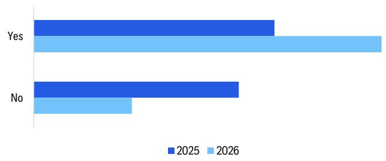

bar

| Response | 2025 | 2026 |
| :--- | :--- | :--- |
| Yes | 100 | 110 |
| No | 80 | 50 |

© 2026 Citi Inc. No redistribution without Citi's written permission.   
Source: Citi

Figure 25. Main reason respondents buy formula at Cross border e-commerce   
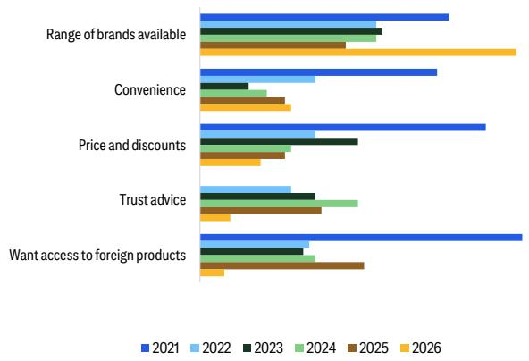

bar

| Category | 2021 | 2022 | 2023 | 2024 | 2025 | 2026 |
|---|---|---|---|---|---|---|
| Range of brands available | 9.8 | 9.5 | 9.3 | 8.7 | 8.3 | 10.5 |
| Convenience | 9.3 | 7.5 | 3.5 | 3.8 | 5.0 | 5.5 |
| Price and discounts | 10.0 | 7.5 | 9.0 | 6.0 | 4.5 | 4.0 |
| Trust advice | 0.0 | 6.5 | 7.0 | 8.5 | 7.5 | 3.0 |
| Want access to foreign products | 11.0 | 7.0 | 6.5 | 6.0 | 9.5 | 3.0 |

© 2026 Citi Inc. No redistribution without Citi's written permission.   
Source: Citi

Figure 24. Given cost of living pressures, are you likely to switch from buying from retail stores to buying through online channels in the next 12 months?   
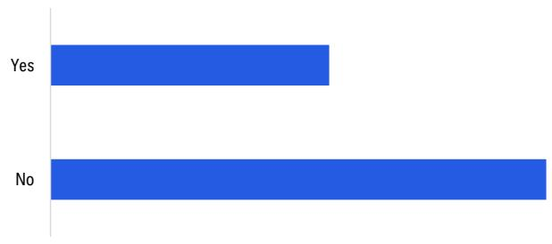

bar

| Category | Value |
|---|---|
| Yes | 35 |
| No | 80 |

© 2026 Citi Inc. No redistribution without Citi's written permission.   
Source: Citi

Figure 26. Main reason respondents buy formula at Emerging online channels (Douyin/TikTok)   
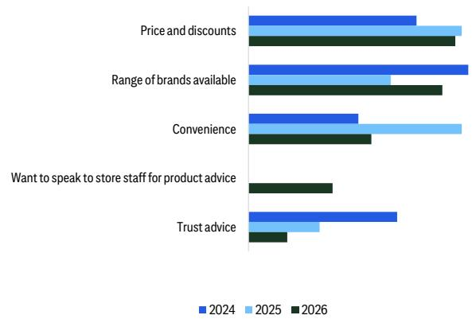

bar

| Category | 2024 | 2025 | 2026 |
| :--- | :--- | :--- | :--- |
| Price and discounts | 108 | 113 | 109 |
| Range of brands available | 127 | 95 | 100 |
| Convenience | 80 | 113 | 88 |
| Want to speak to store staff for product advice | 0 | 0 | 80 |
| Trust advice | 98 | 75 | 50 |

© 2026 Citi Inc. No redistribution without Citi's written permission.   
Source: Citi

Figure 27. Where respondents most often shop for infant formula   
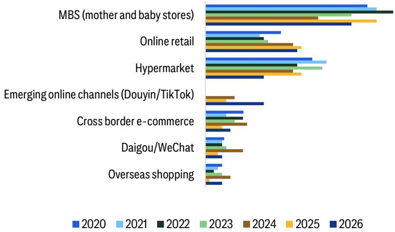

bar

| Channel | 2020 | 2021 | 2022 | 2023 | 2024 | 2025 | 2026 |
| :--- | :--- | :--- | :--- | :--- | :--- | :--- | :--- |
| MBS (mother and baby stores) | 980 | 1000 | 1100 | 850 | 800 | 850 | 750 |
| Online retail | 500 | 550 | 600 | 550 | 650 | 700 | 650 |
| Hypermarket | 850 | 950 | 850 | 850 | 800 | 850 | 750 |
| Emerging online channels (Douyin/TikTok) | 0 | 0 | 0 | 0 | 350 | 350 | 750 |
| Cross border e-commerce | 450 | 450 | 450 | 450 | 500 | 450 | 350 |
| Daigou/WeChat | 300 | 300 | 300 | 300 | 450 | 350 | 350 |
| Overseas shopping | 250 | 250 | 250 | 250 | 350 | 350 | 350 |

© 2026 Citi Inc. No redistribution without Citi's written permission.   
Source: Citi

# Potential stock implications

a2 Milk. The move towards online channels including CBEC and emerging online channels (Douyin/TikTok) supports a2's growth in English Label with EL sales growing at 21% in 1H26 vs 6.5% in a2's China Label sales growth. Being a foreign brand, a2 is well placed in an environment where English label outperforms given the ability to innovate more frequently compared to China label.   
China Feihe/Health and Happiness. Feihe has accelerated online business development in recent years to cope with the change in consumer behavior. Feihe's online sales grew LSD in 2025, accounting for $26\%$ of total revenue. Feihe had an online market share of $13.2\%$ in 2025 (from $13.1\%$ in 2024). In addition, Feihe's online sales are mainly through the company's flagship stores, where Feihe can manage the retail price directly to prevent big price differences. Higher willingness to shop online and compare prices has a neutral impact on Feihe in our view. H&H's IMF online channel sales grew $45\%$ in 2025 with sales mix increased to $29\%$ (from $25\%$ in 2024). H&H had an online market share of $3.3\%$ in 2025 (from $2.8\%$ in 2024). H&H's online sales are also mainly through the company's flagship stores. We think the move towards online channels supports H&H's sales growth.   
Danone/ Nestlé. The move towards online channels including CBEC and emerging online channels (Douyin/TikTok) is a positive for all multinationals operating at scale, be it Danone or Nestlé in our view.   
Abbott. These results are likely neutral for Abbott, although increased consumer awareness of competitor lines and prices may contribute to brand switching. However, this has not been reflected in results.

# #7. Most have not changed their plan to have kids compared to 12 months back; Marriages may not necessarily lead to children

An increasing proportion of respondents have not changed their plans with respect to having babies (Figure 28). Meanwhile, it is increasingly becoming clearer that more people in China are getting married but not having children (Figure 29). An increasing proportion of respondents also see that an increasing number of marriages may not necessarily lead to more children (Figure 30).

Figure 28. Compared to 12 months back, how has your plans with respect to having babies changed?   
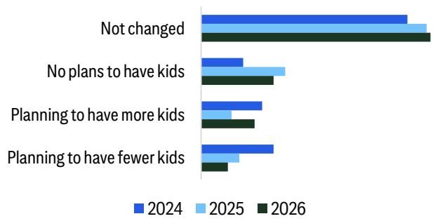

bar

| Category                  | 2024 | 2025 | 2026 |
| ------------------------- | ---- | ---- | ---- |
| Not changed               |      |      |      |
| No plans to have kids     |      |      |      |
| Planning to have more kids |      |      |      |
| Planning to have fewer kids |      |      |      |

© 2026 Citi Inc. No redistribution without Citi's written permission.   
Source: Citi

Figure 29. Are you seeing more people in China getting married but not having children?   
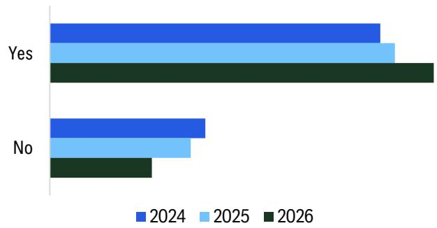

bar

| Category | 2024 | 2025 | 2026 |
|---|---|---|---|
| Yes | 108 | 113 | 147 |
| No | 90 | 75 | 60 |

© 2026 Citi Inc. No redistribution without Citi's written permission.   
Source: Citi

Figure 30. With marriages increasing, what do you expect the impact to be on the number of newborns?   
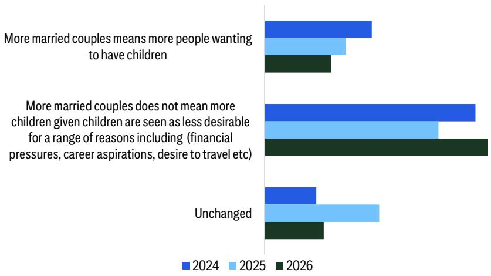

bar

| Reason | 2024 | 2025 | 2026 |
|---|---|---|---|
| More married couples means more people wanting to have children | 1.3 | 1.1 | 0.9 |
| More married couples does not mean more children given children are seen as less desirable for a range of reasons including (financial pressures, career aspirations, desire to travel etc) | 1.8 | 1.6 | 1.7 |
| Unchanged | 0.6 | 1.4 | 0.8 |

© 2026 Citi Inc. No redistribution without Citi's written permission.   
Source: Citi

Figure 31. China marriage rate   
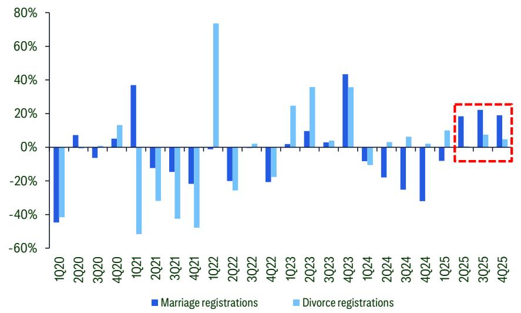  
© 2026 Citi Inc. No redistribution without Citi's written permission.   
Source: Citi, Ministry of Civil Affairs

# Potential stock implications

■ a2 Milk. The fall in the birth rate in 2025 is a headwind for a2, and whilst the increasing marriage rate over 2025 is promising, the survey results increasingly suggest that the increase in marriages in 2025 may not automatically translate to a higher birth rate in future years. a2's response to the falling birth rate has been through NPD (diversifying from infant formula into later stage products, seniors products and pediatric supplements) and geographic expansion (such as Vietnam).   
China Feihe/Health and Happiness. Industry outlook for 2026E remains tough given potential mid-single digit decline in infant population size (0-3 years old). That said, Feihe may have a mild topline recovery given its inventory clearance in 2H25 has set an easy comp base and new HMO product launched in late 2025 is likely to be a growth pillar on which management has strong ambitions. H&H has developed successful measures in marketing, branding, distribution, and execution, and recorded 72% IMF sales growth in 1Q26. Management expect IMF sales to grow at mid to high teens in 2026E.   
Danone. Birth rate is obviously a headwind for Danone, although the group has managed to hedge itself demographically by scaling up its Medical Nutrition franchise, leveraging distribution synergies with infant milk/pediatrics through hospitals.   
Nestlé. Birth rate is also a headwind, although Nestlé exposure to China IMF remains limited and we would thus assume that as long as the group can manage to make the most of Chinese parents' premiumisation behavior, this should be seen as enough.   
Abbott. These results are not relevant to Abbott's business as management has discontinued its IMF business in China.

# #8. As financial pressures ease, respondents require less government support incentives (including subsidies) to have children

Survey respondents are split on whether the government subsidy will increase motivation to have children (Figure 32). However, a larger percentage of respondents had their financial health improve than get worse over the last 12 months (Figure 33) and economic reasons are no longer the top factor for not planning to have a child/children (health reasons is now number 1) (Figure 34) which may mean government subsidies alone will not solve China's birth rate problem.

Yet, it appears more respondents are motivated by the subsidies to have kids (Figure 35).

Figure 32. Does the recent announcement by the Chinese government to increase household support for babies (including birth subsidy) increase your motivation to have children?   
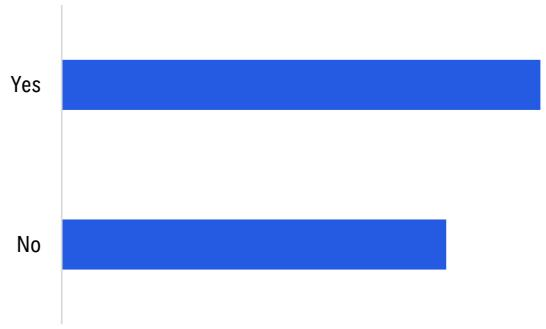

bar

| Category | Value |
|---|---|
| Yes | 100 |
| No | 75 |

© 2026 Citi Inc. No redistribution without Citi's written permission.
Source: Citi

Figure 34. What are the main reasons for not planning to have a child or children in the future?   
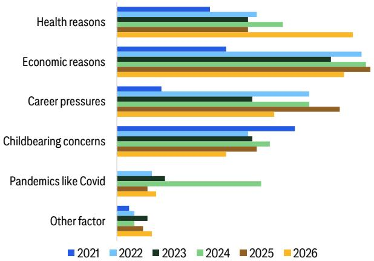

bar

| Factor | 2021 | 2022 | 2023 | 2024 | 2025 | 2026 |
|---|---|---|---|---|---|---|
| Health reasons | 1.8 | 2.1 | 1.9 | 2.3 | 2.4 | 3.1 |
| Economic reasons | 2.0 | 3.1 | 3.0 | 3.3 | 3.4 | 3.2 |
| Career pressures | 1.1 | 2.7 | 2.1 | 2.5 | 3.0 | 2.4 |
| Childbearing concerns | 3.1 | 2.1 | 1.9 | 2.5 | 2.1 | 1.8 |
| Pandemics like Covid | - | 0.8 | 1.0 | 2.5 | 0.7 | 0.9 |
| Other factor | 0.3 | 0.4 | 0.6 | - | 0.6 | 0.8 |

© 2026 Citi Inc. No redistribution without Citi's written permission.
Source: Citi

Figure 33. In the past 12 months your financial health has?   
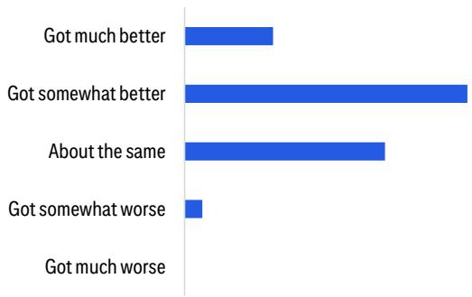

bar

| Response | Value |
|---|---|
| Got much better | 3.0 |
| Got somewhat better | 7.5 |
| About the same | 4.5 |
| Got somewhat worse | 1.0 |
| Got much worse | 0.0 |

© 2026 Citi Inc. No redistribution without Citi's written permission.
Source: Citi

Figure 35. How much financial support do you need from the government to increase your motivation to have children?   
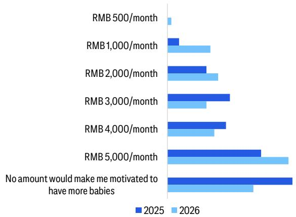

bar

| Category | 2025 (RMB/month) | 2026 (RMB/month) |
| :--- | :--- | :--- |
| RMB 500/month | | |
| RMB 1,000/month | | |
| RMB 2,000/month | | |
| RMB 3,000/month | | |
| RMB 4,000/month | | |
| RMB 5,000/month | | |
| No amount would make me motivated to have more babies | | |

© 2026 Citi Inc. No redistribution without Citi's written permission.
Source: Citi

# Potential stock implications

■ a2 Milk. The combination of easing financial pressures and subsidy announcements could be positive for the CY26 birth rate, which would be positive for a2 Milk.   
China Feihe/ Health and Happiness. Improved financial health, national childcare subsidy program and local subsidy schemes should help mitigate the pressure from potential mid-single digit decline in infant population size (0-3 years old) in 2026E, which are seen as positives for Feihe and H&H.   
■ Danone/ Nestlé. Same implication as for A2 Milk.   
Abbott. It remains unclear whether improved government subsidies will have an impact on the birth rate, although if positive would benefit Abbott.

# #9. Chinese zodiac signs have small influence on births over the next two years

Almost three quarters of respondents reported that zodiac signs had no influence on their plans on when to have children.

The improved sentiment for 2026 and 2027 (Horse and Goat respectively) compared to the Year of the Snake (2025) should be positive for near term birth rates.

Figure 36. Do Chinese zodiac signs influence your plans as to when you want to have a child?   
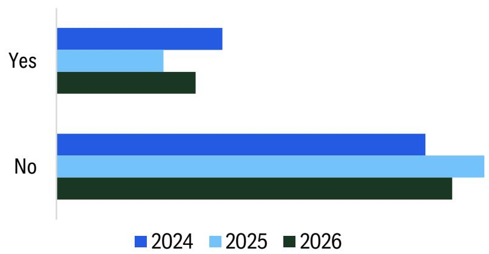

bar

| Response | 2024 | 2025 | 2026 |
| :--- | :--- | :--- | :--- |
| Yes | 1.3 | 0.8 | 0.9 |
| No | 1.7 | 2.1 | 1.8 |

© 2026 Citi Inc. No redistribution without Citi's written permission.   
Source: Citi

Figure 37. Please indicate the likelihood of having a child during the following years in comparison to other years.   
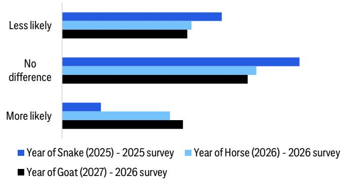

bar

| Category | Year of Snake (2025) - 2025 survey | Year of Horse (2026) - 2026 survey | Year of Goat (2027) - 2026 survey |
|---|---|---|---|
| Less likely | 10.8 | 9.3 | 8.4 |
| No difference | 15.3 | 11.8 | 10.1 |
| More likely | 4.3 | 7.3 | 8.5 |

© 2026 Citi Inc. No redistribution without Citi's written permission.   
Year of Snake data from 2025 survey, Year of Horse and Year of Goat data from 2026 survey   
Source: Citi

Figure 38. Please indicate the likelihood of having a child during the Year of the Horse (2026)   
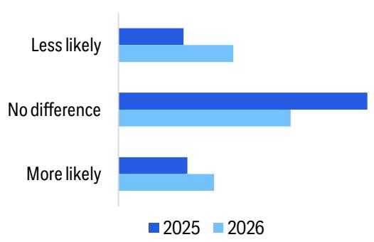

bar

| Category | 2025 | 2026 |
|---|---|---|
| Less likely | 1.3 | 2.4 |
| No difference | 4.8 | 3.1 |
| More likely | 1.5 | 1.9 |

© 2026 Citi Inc. No redistribution without Citi's written permission.   
Source: Citi

# Potential stock implications

■ a2 Milk. While most consumers do not base their family planning on zodiacs, some do, and it appears that there is more willingness to have children in the Year of the Horse (2026) and Goat (2027) vs the Snake (2025 when the birth rate fell to decades-low). This should be positive for a2 Milk.   
China Feihe/ Health and Happiness. The coming two years (2026-2027) appear to be more popular for childbearing as compared to 2025 from a zodiac perspective, which is a positive surprise to us. This should help mitigate pressure from low birth rate which benefits Feihe and H&H.   
Danone/ Nestlé. Sequentially improving birth rate is always a positive, although the benefit will only be seen gradually given that infants are being fed through 3 stages depending on their age and the headwinds from the past year will still be felt via stage 2 and stage 3 (where Danone has a solid presence) and may offset stage 1 improvements.   
Abbott. There appears to be more willingness to have children in the Year of the Horse (2026) and the Year of the Goat (2027) versus the Year of the Snake (2025), which would be positive for Abbott.

# #10. Positive reception for infant formula brands ability to diversify into adjacent categories and products for older consumers

# Stage 4 / Kids Milk Powder

Well over half of respondents have their children consume stage 4 infant milk powder or kids milk powder, with immunity benefits and brain/cognitive developments as the main reasons for purchasing stage 4 / kids milk powder (Figure 40). Most respondents would keep their child consuming stage 4 / kids milk powder up to 4 or 5 years of age (Figure 41).

# Pediatric supplements

Roughly two thirds of respondents purchase pediatric supplements. When choosing pediatric supplements, 62% are more likely to choose a brand known for infant formula, and 86% see foreign pediatric supplements brands becoming more popular compared to domestic brands (Figure 44). With the considerable number of brands of pediatric supplements in the market, effective marketing appears to have the most impact on influencing respondents to try a new brand of pediatric supplement, over recommendations from friends and medical professionals (Figure 45).

# Seniors milk formula

60% of respondents have older people in their family likely to consume milk formula products specifically formulated for senior citizens from infant formula brands (Figure 46).

Figure 39. Does your child consume stage 4 infant milk powder or kids milk powder?   
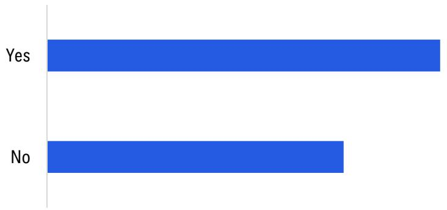

bar

| Response | Count |
| :--- | :--- |
| Yes | 300 |
| No | 150 |

© 2026 Citi Inc. No redistribution without Citi's written permission.   
Source: Citi

Figure 40. Why does your child/would your child consume stage 4 / kids milk powder?   
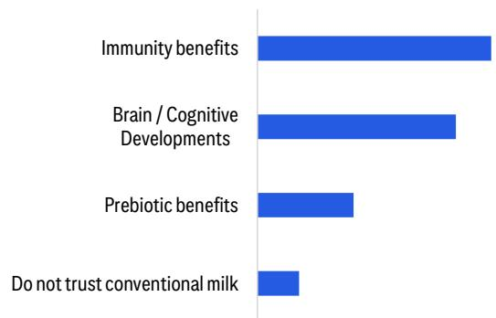

bar

| Benefit | Value |
| :--- | :--- |
| Immunity benefits | 100 |
| Brain / Cognitive Developments | 85 |
| Prebiotic benefits | 45 |
| Do not trust conventional milk | 25 |

© 2026 Citi Inc. No redistribution without Citi's written permission.   
Source: Citi

Figure 41. Until what age would I keep my child consuming stage 4 / kids milk powder?   
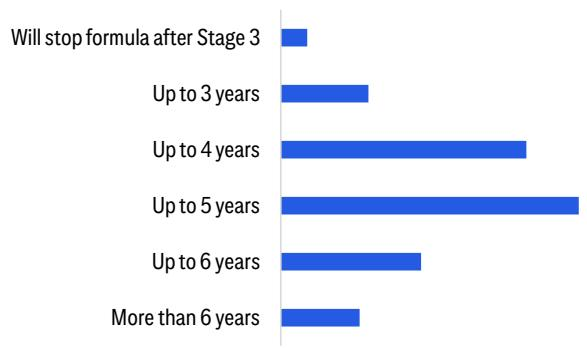

bar

| Duration | Count |
| :--- | :--- |
| Will stop formula after Stage 3 | 1 |
| Up to 3 years | 4 |
| Up to 4 years | 8 |
| Up to 5 years | 10 |
| Up to 6 years | 6 |
| More than 6 years | 4 |

© 2026 Citi Inc. No redistribution without Citi's written permission.   
Source: Citi

Figure 42. Do you purchase pediatric supplements?   
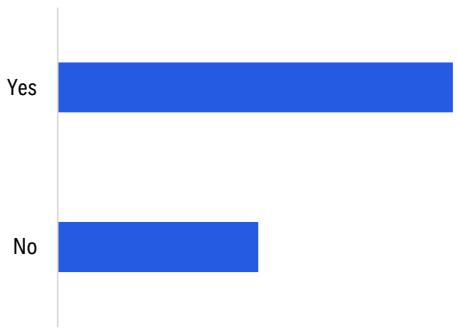

bar

| Category | Value |
|---|---|
| Yes | 100 |
| No | 60 |

© 2026 Citi Inc. No redistribution without Citi's written permission.   
Source: Citi

Figure 44. Do you see foreign pediatric supplement brands becoming more or less popular compared to domestic brands?   
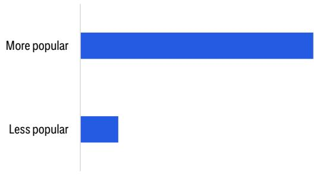

bar

| Category | Value |
|---|---|
| More popular | 100 |
| Less popular | 30 |

© 2026 Citi Inc. No redistribution without Citi's written permission.   
Source: Citi

Figure 43. When choosing a pediatric supplement brand, are you more or less likely to choose a brand who is known for infant formula?   
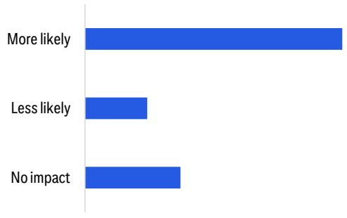

bar

| Category | Value |
|---|---|
| More likely | 100 |
| Less likely | 40 |
| No impact | 60 |

© 2026 Citi Inc. No redistribution without Citi's written permission.   
Source: Citi

Figure 45. What would cause you to try a new brand of pediatric supplement?   
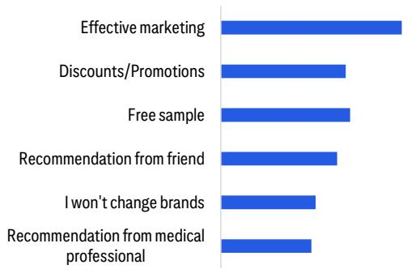

bar

| Category | Value |
|---|---|
| Effective marketing | 100 |
| Discounts/Promotions | 75 |
| Free sample | 80 |
| Recommendation from friend | 70 |
| I won't change brands | 60 |
| Recommendation from medical professional | 55 |

© 2026 Citi Inc. No redistribution without Citi's written permission.   
Source: Citi

Figure 46. Are older people in your family likely to consume milk formula products specifically formulated for senior citizens from infant formula brands?   
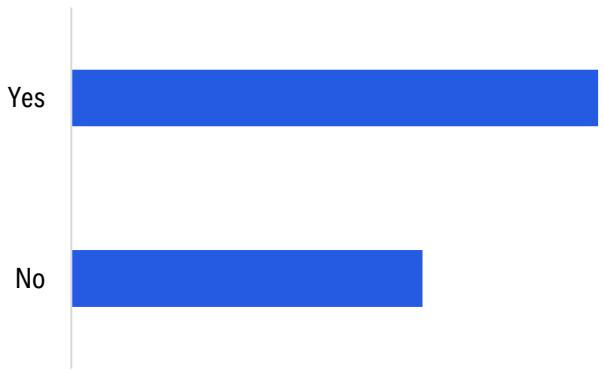

bar

| Category | Value |
|---|---|
| Yes | 40 |
| No | 20 |

© 2026 Citi Inc. No redistribution without Citi's written permission.   
Source: Citi

# Potential stock implications

■ a2 Milk. Due to birth rate associated challenges, a2 has been innovating and diversifying its product range into adjacent categories aimed at older consumers (older kids, seniors) or new categories (vitamins). Our survey results suggests a2 is likely to find success with this strategy. Our on the ground China research has suggested positive early sell through trends for kids fortified milk powder and seniors products, which is supported by company disclosure. a2 indicated the pediatric supplement category is a rapidly growing market with \~NZD 8 billion in retail sales and the company is planning to roll out products over 2H FY26. Near term sales are not expected to be material but there is significant longer term potential.   
China Feihe/Health and Happiness. H&H would benefit more from this trend given its rich offerings in pediatrics and health supplements. Feihe would benefit as well but it mainly focuses on milk formula innovations e.g. adult milk powder.   
Danone. We think Danone has a best-in-class presence in Medical Nutrition, especially via pediatrics (Nutricia) and for older demographics via Nutrison, benefitting from the group's strong access to tier-1 hospitals, and the Fortimel umbrella brand.   
Nestlé. Nestle also has a presence in both pediatrics and Adult Nutrition, addressing roughly the same segments (tube feeding, supplements for elder malnutrition).   
Abbott. With Abbott offering a diverse product line beyond infant nutrition, more consumer interest in other milk products along with Abbott's brand recognition should benefit the company in China.

# #11. Expiration dates a high priority for parents/caregivers

A higher proportion of respondents are looking at expiration dates when they purchase infant formula compared to last year (Figure 47), which suggests that expiration dates are becoming more of a priority for parents and caregivers when purchasing infant formula.

Figure 47. When would you not buy a tin of infant formula?   
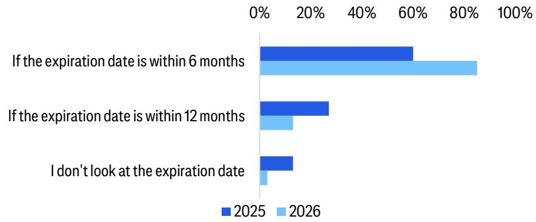

bar

| Category | 2025 (%) | 2026 (%) |
|---|---|---|
| If the expiration date is within 6 months | 60 | 85 |
| If the expiration date is within 12 months | 28 | 14 |
| I don't look at the expiration date | 17 | 5 |

© 2026 Citi Inc. No redistribution without Citi's written permission.   
Source: Citi

# Potential stock implications

a2 Milk. a2's infant formula stock in China is typically fresh, as seen from our China trips. Our most recent visit to China revealed that most a2 China Label Stages 1-3 tins had expiration dates between 3 and 18 months which is within the ideal expiration date for all survey respondents. Recent stock shortages are likely to mean that a2's stock is even fresher than normal over the near to medium term.   
China Feihe/ Health and Happiness. Given consumers' preference for freshness, we believe Feihe benefits the most given its newly launched fresh ingredient traceability system in Jan 2026. By scanning the QR code on the bottom of the can, consumers can now directly trace the production dates and inspection reports of core ingredients. We think the system helps build consumer trust in Feihe. For H&H, as its major IMF products are produced in Europe, the heightened consumer scrutiny of expiration dates puts pressure on H&H's global supply chain model, though we think it has been well managed in the past.   
Danone/ Nestlé. We think it is too early to assess whether any stock replenishment would lead to longer expiry date; but we think this is more of a topic for Nestlé than for Danone given the result of the survey to an earlier question.   
Abbott. We view these results as neutral for Abbott.

# Background

Citi's Research Innovation Lab has conducted a survey of 1,200 parents/caregivers of young children (0 to 6 years) in China who purchase infant formula. The sample spans all city tiers (1 to 5) and income brackets. We analyse the drivers behind infant formula brand selection, how they differ between consumer groups, and the areas of the China infant formula market with the most opportunity.

# Survey sample profile

The survey sample spans a wide range of ages, city tiers, and respondent types.

Figure 48. Respondent age   
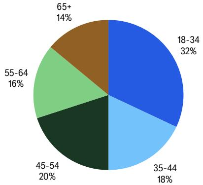

pie

| Category | Percentage (%) |
| :--- | :--- |
| 18-34 | 32 |
| 35-44 | 18 |
| 45-54 | 20 |
| 55-64 | 16 |
| 65+ | 14 |

© 2026 Citi Inc. No redistribution without Citi's written permission.   
Source: Citi

Figure 49. Number of people in respondent's household   
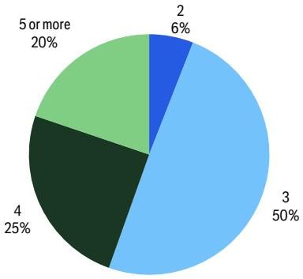

pie

| Category | Percentage (%) |
| :--- | :--- |
| 2 | 6 |
| 3 | 50 |
| 4 | 25 |
| 5 or more | 20 |

© 2026 Citi Inc. No redistribution without Citi's written permission.   
Source: Citi

Figure 50. Sample city tier distribution   
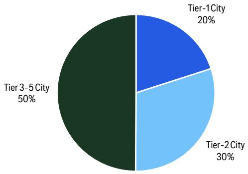

pie

| Category | Percentage (%) |
| :--- | :--- |
| Tier-1 City | 20 |
| Tier-2 City | 30 |
| Tier 3-5 City | 50 |

© 2026 Citi Inc. No redistribution without Citi's written permission.   
Source: Citi

Figure 51. Respondent type - responsible for buying IMF   
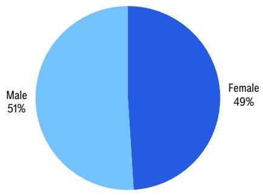

pie

| Gender | Percentage (%) |
| :--- | :--- |
| Male | 51 |
| Female | 49 |

© 2026 Citi Inc. No redistribution without Citi's written permission.   
Source: Citi

If you are visually impaired and would like to speak to a Citi representative regarding the details of the graphics in this document, please call USA 1-888-500-5008 (TTY: 711), from outside the US +1-210-677-3788

# Appendix A-1

# ANALYST CERTIFICATION

The research analysts primarily responsible for the preparation and content of this research report are either (i) designated by “AC” in the author block or (ii) listed in bold alongside content which is attributable to that analyst. If multiple AC analysts are designated in the author block, each analyst is certifying with respect to the entire research report other than (a) content attributable to another AC certifying analyst listed in bold alongside the content and (b) views expressed solely with respect to a specific issuer which are attributable to another AC certifying analyst identified in the price charts or rating history tables for that issuer shown below. Each of these analysts certify, with respect to the sections of the report for which they are responsible: (1) that the views expressed therein accurately reflect their personal views about each issuer and security referenced and were prepared in an independent manner, including with respect to Citi Global Markets Inc. and its affiliates; and (2) no part of the research analyst's compensation was, is, or will be, directly or indirectly, related to the specific recommendations or views expressed by that research analyst in this report.

# IMPORTANT DISCLOSURES

Health and Happiness (H&H) (1112.HK)

Ratings and Target Price History
Fundamental Research

Analyst: Tiffany Feng

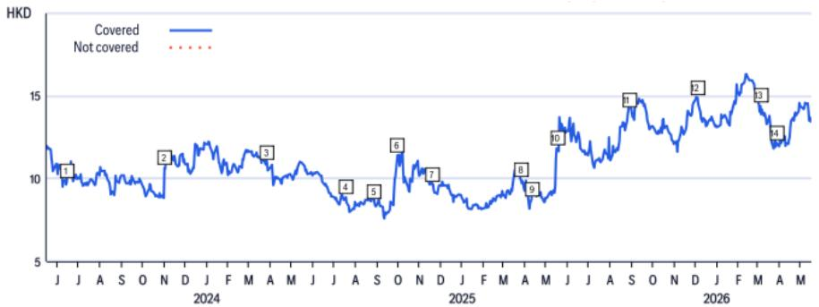

line

| Date       | Value |
| ---------- | ----- |
| J 2024     | 11    |
| N 2024     | 2     |
| A 2024     | 3     |
| S 2024     | 4     |
| O 2024     | 5     |
| M 2024     | 6     |
| A 2024     | 7     |
| M 2024     | 8     |
| A 2024     | 9     |
| S 2024     | 10    |
| O 2024     | 11    |
| N 2024     | 12    |
| D 2024     | 13    |
| J 2025     | 14    |
| F 2025     | 15    |
| M 2025     | 16    |
| A 2025     | 17    |
| M 2025     | 18    |
| A 2025     | 19    |
| M 2025     | 20    |
| J 2026     | 21    |
| F 2026     | 22    |
| M 2026     | 23    |
| A 2026     | 24    |
| M 2026     | 25    |

<table><tr><td></td><td>Date</td><td>Rating</td><td>Target Price</td><td>Closing Price</td></tr><tr><td>1</td><td>14-Jun-23 07:06:02</td><td>1</td><td>*19.40</td><td>9.82</td></tr><tr><td>2</td><td>01-Nov-23 12:36:23</td><td>1</td><td>*17.60</td><td>10.64</td></tr><tr><td>3</td><td>27-Mar-24 11:57:19</td><td>1</td><td>*15.60</td><td>10.98</td></tr><tr><td>4</td><td>18-Jul-24 11:31:44</td><td>1</td><td>*11.80</td><td>8.88</td></tr><tr><td>5</td><td>28-Aug-24 01:23:13</td><td>1</td><td>*11.00</td><td>8.56</td></tr></table>

<table><tr><td></td><td>Date</td><td>Rating</td><td>Target Price</td><td>Closing Price</td></tr><tr><td>6</td><td>30-Sep-24 04:59:46</td><td>1</td><td>*13.10</td><td>11.42</td></tr><tr><td>7</td><td>19-Nov-24 11:51:14</td><td>1</td><td>*11.50</td><td>9.64</td></tr><tr><td>8</td><td>26-Mar-25 14:43:25</td><td>1</td><td>*12.70</td><td>9.94</td></tr><tr><td>9</td><td>11-Apr-25 06:16:44</td><td>1</td><td>*12.60</td><td>9.73</td></tr><tr><td>10</td><td>18-May-25 17:15:46</td><td>1</td><td>*13.50</td><td>11.84</td></tr></table>

<table><tr><td colspan="2">Date</td><td>Rating</td><td>Target Price</td><td>Closing Price</td></tr><tr><td>11</td><td>27-Aug-25 09:54:17</td><td>1</td><td>*16.50</td><td>14.16</td></tr><tr><td>12</td><td>03-Dec-25 08:54:26</td><td>1</td><td>*18.80</td><td>14.89</td></tr><tr><td>13</td><td>04-Mar-26 10:48:19</td><td>1</td><td>*19.20</td><td>14.40</td></tr><tr><td>14</td><td>29-Mar-26 18:35:31</td><td>1</td><td>*16.00</td><td>12.16</td></tr></table>

\*Indicates Change   
Rating/target price changes above reflect Eastern Time

China Feihe (6186.HK)

Ratings and Target Price History
Fundamental Research

Analyst: Tiffany Feng

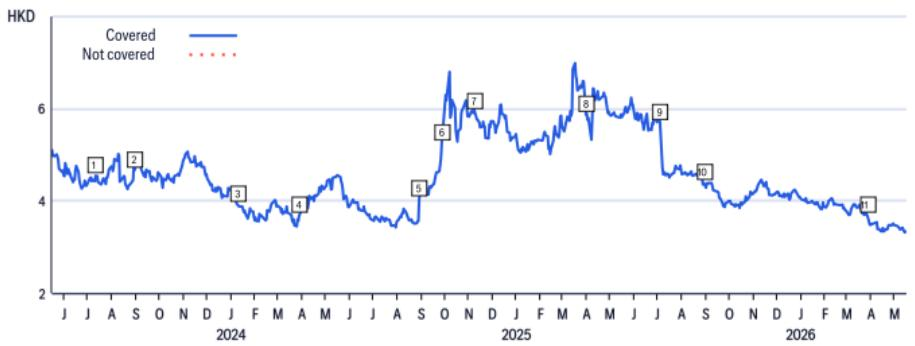

line

| Date       | Value |
| ---------- | ----- |
| J 2024     | 1     |
| A 2024     | 2     |
| O 2024     | 3     |
| N 2024     | 4     |
| D 2024     | 5     |
| J 2025     | 6     |
| F 2025     | 7     |
| M 2025     | 8     |
| A 2025     | 9     |
| M 2025     | 10    |
| J 2026     | 11    |
| A 2026     | 12    |
| M 2026     | 13    |
| M 2026     | 14    |
| A 2026     | 15    |
| M 2026     | 16    |

<table><tr><td colspan="2">Date</td><td>Rating</td><td>Target Price</td><td>Closing Price</td></tr><tr><td>1</td><td>11-Jul-23 06:01:13</td><td>1</td><td>*5.10</td><td>4.55</td></tr><tr><td>2</td><td>30-Aug-23 03:01:58</td><td>*2</td><td>5.10</td><td>4.67</td></tr><tr><td>3</td><td>09-Jan-24 04:14:52</td><td>2</td><td>*4.00</td><td>3.92</td></tr><tr><td>4</td><td>01-Apr-24 03:50:09</td><td>*1</td><td>*4.30</td><td>3.68</td></tr></table>

<table><tr><td></td><td>Date</td><td>Rating</td><td>Target Price</td><td>Closing Price</td></tr><tr><td>5</td><td>29-Aug-24 05:19:13</td><td>1</td><td>*5.20</td><td>4.04</td></tr><tr><td>6</td><td>29-Sep-24 21:52:36</td><td>1</td><td>*6.30</td><td>5.27</td></tr><tr><td>7</td><td>10-Nov-24 19:41:28</td><td>1</td><td>*6.50</td><td>5.95</td></tr><tr><td>8</td><td>31-Mar-25 11:46:34</td><td>1</td><td>*7.10</td><td>5.87</td></tr></table>

<table><tr><td>Date</td><td>Rating</td><td>Target Price</td><td>Closing Price</td></tr><tr><td>9 06-Jul-25 20:00:55</td><td>*2</td><td>*5.50</td><td>5.70</td></tr><tr><td>10 29-Aug-25 10:38:34</td><td>2</td><td>*4.30</td><td>4.39</td></tr><tr><td>11 27-Mar-26 05:13:31</td><td>2</td><td>*3.60</td><td>3.68</td></tr></table>

\*Indicates Change   
Rating/target price changes above reflect Eastern Time

# The A2 Milk Company Ltd (A2M.AX)

Ratings and Target Price History
Fundamental Research

Analyst: Sam Teeger

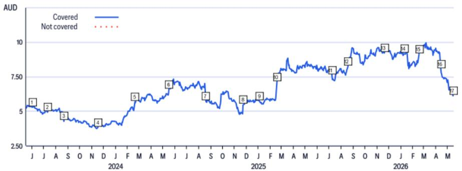

line

| Date       | Covered | Not covered |
| ---------- | ------- | ----------- |
| J 2024     | 1       |             |
| J 2024     | 2       |             |
| A 2024     | 3       |             |
| S 2024     |             |             |
| O 2024     |             |             |
| N 2024     | 4       |             |
| D 2024     |             |             |
| J 2024     |             |             |
| F 2024     |             |             |
| M 2024     |             |             |
| A 2024     |             |             |
| M 2024     |             |             |
| J 2024     |             |             |
| J 2024     |             |             |
| A 2024     |             |             |
| S 2024     |             |             |
| O 2024     |             |             |
| N 2024     |             |             |
| D 2024     |             |             |
| J 2024     |             |             |
| F 2024     |             |             |
| M 2024     |             |             |
| A 2024     |             |             |
| M 2024     |             |             |
| J 2025     |             |             |
| J 2025     |             |             |
| A 2025     |             |             |
| S 2025     |             |             |
| O 2025     |             |             |
| N 2025     |             |             |
| D 2025     |             |             |
| J 2025     |             |             |
| F 2025     |             |             |
| M 2025     |             |             |
| A 2025     |             |             |
| M 2025     |             |             |
| J 2025     |             |             |
| J 2025     |             |             |
| A 2025     |             |             |
| S 2025     |             |             |
| O 2025     |             |             |
| N 2025     |             |             |
| D 2025     |             |             |
| J                  |               |                 |
| F                  |               |                 |
| M                  |               |                 |
| A                  |               |                 |
| M                  |               |                 |
| A                  |               |                 |
| M                  |               |                 |
| M                  |               |                 |
| A                  |               |                 |
| M                  |               |                 |
| A                  |               |                 |
| M                  |               |                 |
| A                  |               |                 |
| M                  |               |                 |
| A                  |               |                 |
| M                  |               |                 |
| A                  |               |                 |
| M                  |               |                 |
| A                  |               |                 |
| M                  |               |                 |
| A                  |               = 17   |                 |
| M                  |               = 17   |                 |
| A                  |               = 17   |                 |
| M                  |               = 17   |                 |
| A                  |               = 17   |                 |
| M                  |               = 17   |                 |
| A                  |               = 17   |                 |
| M                  |               = 17   |                 |
| A                  |               = 17   |                 |
| M                  |               <17    |                 |
| A                  |               <17    |                 |
| M                  |               <17    |                 |
| A                  |               <17    |                 |
| M                  |               <17    |                 |
| A                  |               <17    |                 |
| M                  |               <17    |                 |
| A                  |               <17    |                 |
| M                  |               <17    |                 |
| A                  |               <17    |                 |
|
| M                  |               <17    |                 |
| A                  |               <17    |                 |
|
| M                  |               <17    |                 |
| A                  |               <17    |                 |
|
| M                  |               <17    |                 |
| A                  |               <17    |                 |
|
| M                  |               <17    |                 |
|
| A                  |               <17    |                 |
|
| M                  |               <17    |                 |
|
| A                  |               <17    |                 |
|
| M                  |               <17    |                 |
|
| A                  |               <17    |                 |
|
| M                  |               <17    |                 |
|
| A                  |               <17    |                 |
|
| M                  |               <17*    |                 |
| A                  |               <17*    |                 |
| M                  |               <17*    |                 |
| A                  |               <17*    |                 |
| M                  |               <17*    |                 |
| A                  |               <17*    |                 |
|
| M                  |               <17*    |                 |
|
| A                  |               <17*    |                 |
|
| M                  |               <17*    |                 |
|
| A                  |               <17*    |                 |
|
| M                  |               <17*    |                 |
|
| A                  |               <17*    |                 |
|
| M                  |               <17*    |                 |
|
| A                  |               <17*    |                 |
|
| W                  (Note: The actual values are not provided in the code) are not explicitly provided in the code.

<table><tr><td colspan="2">Date</td><td>Rating</td><td>Target Price</td><td>Closing Price</td></tr><tr><td>1</td><td>02-Jun-23 02:52:17</td><td>*2</td><td>*5.35</td><td>5.30</td></tr><tr><td>2</td><td>10-Jul-23 07:26:52</td><td>2</td><td>*5.30</td><td>4.93</td></tr><tr><td>3</td><td>21-Aug-23 10:42:24</td><td>2</td><td>*4.74</td><td>4.27</td></tr><tr><td>4</td><td>16-Nov-23 16:25:00</td><td>*1</td><td>*4.81</td><td>3.82</td></tr><tr><td>5</td><td>19-Feb-24 09:18:50</td><td>*2</td><td>*5.75</td><td>5.68</td></tr><tr><td>6</td><td>16-May-24 19:34:13</td><td>*1</td><td>*7.85</td><td>6.55</td></tr></table>

<table><tr><td colspan="2">Date</td><td>Rating</td><td>Target Price</td><td>Closing Price</td></tr><tr><td>7</td><td>19-Aug-24 00:28:25</td><td>1</td><td>*7.04</td><td>5.70</td></tr><tr><td>8</td><td>22-Nov-24 03:48:18</td><td>1</td><td>*7.15</td><td>5.45</td></tr><tr><td>9</td><td>05-Jan-25 23:05:39</td><td>1</td><td>*7.33</td><td>5.73</td></tr><tr><td>10</td><td>17-Feb-25 03:04:51</td><td>1</td><td>*8.20</td><td>7.12</td></tr><tr><td>11</td><td>08-Jul-25 04:28:53</td><td>*2</td><td>8.20</td><td>7.61</td></tr><tr><td>12</td><td>18-Aug-25 17:30:00</td><td>*1</td><td>*9.29</td><td>8.23</td></tr></table>

<table><tr><td></td><td>Date</td><td>Rating</td><td>Target Price</td><td>Closing Price</td></tr><tr><td>13</td><td>19-Nov-25 17:46:06</td><td>1</td><td>*10.45</td><td>9.22</td></tr><tr><td>14</td><td>10-Jan-26 22:00:12</td><td>1</td><td>*10.40</td><td>9.18</td></tr><tr><td>15</td><td>16-Feb-26 15:26:47</td><td>1</td><td>*10.55</td><td>9.10</td></tr><tr><td>16</td><td>13-Apr-26 03:19:40</td><td>*2</td><td>*8.40</td><td>8.04</td></tr><tr><td>17</td><td>15-May-26 10:28:54</td><td>*3</td><td>*5.85</td><td>6.13</td></tr></table>

\*Indicates Change

Rating/target price changes above reflect Eastern Time

# Danone (DANO.PA)

Ratings and Target Price History
Fundamental Research

Analyst: Cedric Besnard

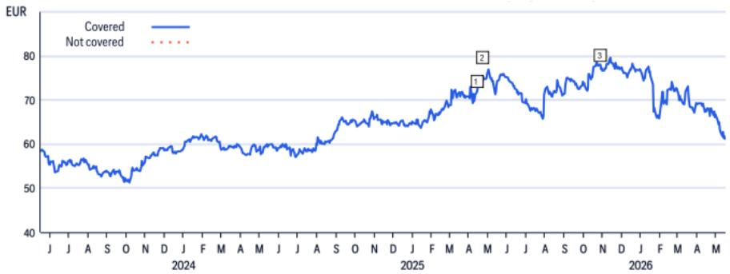

line

| Date       | Value |
| ---------- | ----- |
| A          | 72    |
| B          | 75    |
| C          | 78    |

<table><tr><td>Date</td><td>Rating</td><td>Target Price</td><td>Closing Price</td></tr><tr><td>1 14-Apr-25 00:00:00</td><td>*2</td><td>*73.00</td><td>71.98</td></tr></table>

<table><tr><td>Date</td><td>Rating</td><td>Target Price</td><td>Closing Price</td></tr><tr><td>23-Apr-25 04:16:35</td><td>2</td><td>*75.00</td><td>74.32</td></tr></table>

<table><tr><td>Date</td><td>Rating</td><td>Target Price</td><td>Closing Price</td></tr><tr><td>3 28-Oct-25 05:37:18</td><td>2</td><td>*77.00</td><td>78.06</td></tr></table>

\*Indicates Change

Rating/target price changes above reflect Eastern Time

# Nestlé (NESN.S)

Ratings and Target Price History
Fundamental Research

Analyst: Cedric Besnard

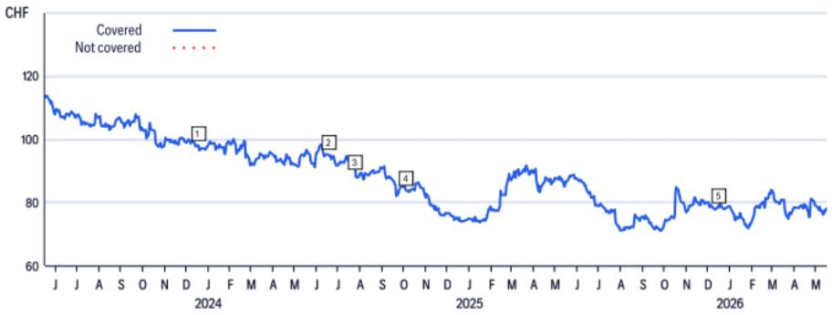

line

| Date       | Covered | Not covered |
| ---------- | ------- | ----------- |
| Dec 2024   | 1       |             |
| Jan 2025   | 2       |             |
| Feb 2025   | 3       |             |
| Mar 2025   | 4       |             |
| Jun 2025   | 5       |             |

<table><tr><td>Date</td><td>Rating</td><td>Target Price</td><td>Closing Price</td></tr><tr><td>1 18-Dec-23 00:00:00</td><td>1</td><td>*115.00</td><td>98.08</td></tr><tr><td>2 17-Jun-24 07:38:50</td><td>1</td><td>*110.00</td><td>95.10</td></tr></table>

<table><tr><td></td><td>Date</td><td>Rating</td><td>Target Price</td><td>Closing Price</td></tr><tr><td>3</td><td>25-Jul-24 09:35:56</td><td>1</td><td>*105.00</td><td>88.82</td></tr><tr><td>4</td><td>03-Oct-24 00:00:00</td><td>*2</td><td>*90.00</td><td>83.98</td></tr></table>

<table><tr><td>Date</td><td>Rating</td><td>Target Price</td><td>Closing Price</td></tr><tr><td>5 16-Dec-25 00:00:00</td><td>2</td><td>*85.00</td><td>78.44</td></tr></table>

\*Indicates Change

Rating/target price changes above reflect Eastern Time

# Abbott Laboratories (ABT)

Ratings and Target Price History
Fundamental Research

Analyst: Joanne Wuensch

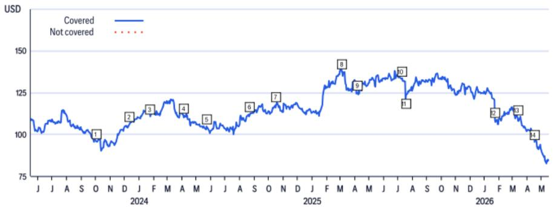

<table><tr><td colspan="2">Date</td><td>Rating</td><td>Target Price</td><td>Closing Price</td></tr><tr><td>1</td><td>02-Oct-23 05:00:00</td><td>1</td><td>*122.00</td><td>95.73</td></tr><tr><td>2</td><td>11-Dec-23 07:45:19</td><td>1</td><td>*123.00</td><td>106.22</td></tr><tr><td>3</td><td>24-Jan-24 14:37:49</td><td>1</td><td>*126.00</td><td>110.77</td></tr><tr><td>4</td><td>03-Apr-24 05:00:00</td><td>1</td><td>*128.00</td><td>111.28</td></tr><tr><td>5</td><td>22-May-24 05:00:00</td><td>1</td><td>*119.00</td><td>104.82</td></tr></table>

<table><tr><td colspan="2">Date</td><td>Rating</td><td>Target Price</td><td>Closing Price</td></tr><tr><td>6</td><td>22-Aug-24 05:00:00</td><td>1</td><td>*127.00</td><td>112.10</td></tr><tr><td>7</td><td>16-Oct-24 19:08:52</td><td>1</td><td>*135.00</td><td>117.82</td></tr><tr><td>8</td><td>04-Mar-25 05:00:00</td><td>1</td><td>*160.00</td><td>137.58</td></tr><tr><td>9</td><td>07-Apr-25 05:00:00</td><td>1</td><td>*155.00</td><td>124.86</td></tr><tr><td>10</td><td>09-Jul-25 05:00:00</td><td>1</td><td>*157.00</td><td>133.22</td></tr></table>

<table><tr><td colspan="2">Date</td><td>Rating</td><td>Target Price</td><td>Closing Price</td></tr><tr><td>11</td><td>17-Jul-25 19:17:21</td><td>1</td><td>*155.00</td><td>120.51</td></tr><tr><td>12</td><td>22-Jan-26 16:14:35</td><td>1</td><td>*140.00</td><td>108.61</td></tr><tr><td>13</td><td>11-Mar-26 05:00:00</td><td>1</td><td>*136.00</td><td>110.25</td></tr><tr><td>14</td><td>16-Apr-26 16:03:05</td><td>1</td><td>*108.00</td><td>95.47</td></tr></table>

\*Indicates Change   
Rating/target price changes above reflect Eastern Time

# Abbott Laboratories (ABT)

Short-Term View/Catalyst Watch Research

Analyst: Joanne Wuensch

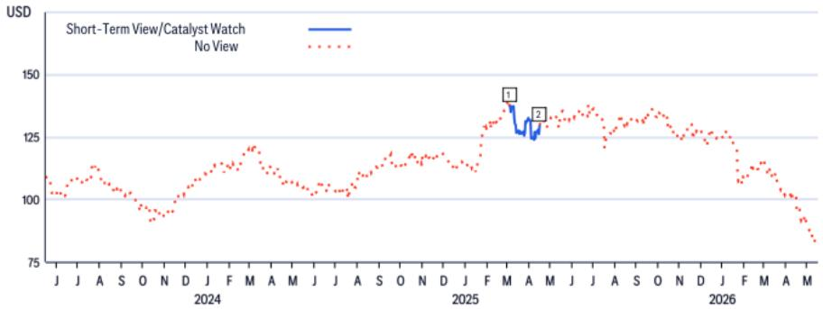

<table><tr><td></td><td>Date</td><td>Action</td><td>Expected Direction</td><td>Duration</td><td>Closing Price</td></tr><tr><td>1</td><td>04-Mar-25 00:00:00</td><td>Add STV</td><td>Downside</td><td>90 Days</td><td>137.58</td></tr></table>

<table><tr><td>Date</td><td>Action</td><td>ExpectedDirection</td><td>Duration</td><td>ClosingPrice</td></tr><tr><td>2 16-Apr-25 10:42:10</td><td>Remove STV</td><td>Downside</td><td>90 Days</td><td>129.70</td></tr></table>

CW - Catalyst Watch, STV - Short-Term View   
Rating/target price changes above reflect Eastern Time

# Health and Happiness (H&H) (1112.HK)

Short-Term View/Catalyst Watch Research

Analyst: Tiffany Feng

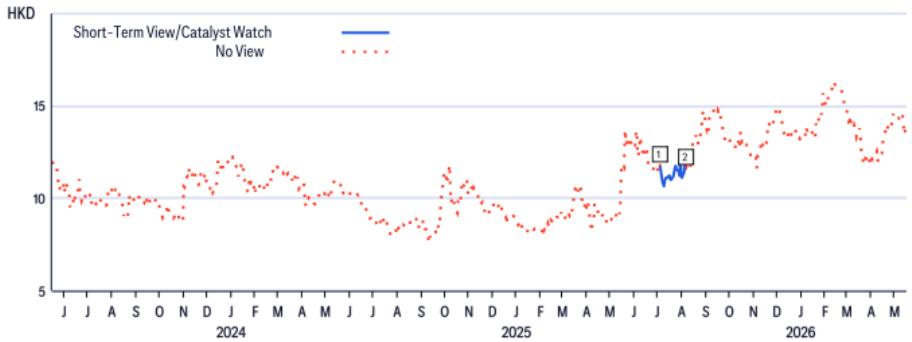

<table><tr><td></td><td>Date</td><td>Action</td><td>Expected Direction</td><td>Duration</td><td>Closing Price</td></tr><tr><td>1</td><td>06-Jul-25 13:39:40</td><td>Add STV</td><td>Downside</td><td>30 Days</td><td>11.76</td></tr></table>

<table><tr><td></td><td>Date</td><td>Action</td><td>Expected Direction</td><td>Duration</td><td>Closing Price</td></tr><tr><td>2</td><td>06-Aug-25 00:17:06</td><td>Remove STV</td><td>Downside</td><td>30 Days</td><td>11.62</td></tr></table>

CW - Catalyst Watch, STV - Short-Term View   
Rating/target price changes above reflect Eastern Time

# Nestlé (NESN.S)

Short-Term View/Catalyst Watch Research

Analyst: Cedric Besnard

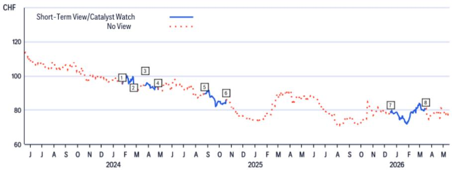

line

| Month-Year | Short-Term View/Catalyst Watch | No View |
|------------|----------------------------------|---------|
| Jan 2024   | 1                                | 1       |
| Feb 2024   | 2                                | 2       |
| Mar 2024   | 3                                | 3       |
| Apr 2024   | 4                                | 4       |
| May 2024   | 5                                | 5       |
| Jun 2024   | 6                                | 6       |
| Jul 2024   | 7                                | 7       |
| Aug 2024   | 8                                | 8       |
| Sep 2024   | 9                                | 9       |
| Oct 2024   | 10                               | 10      |
| Nov 2024   | 11                               | 11      |
| Dec 2024   | 12                               | 12      |
| Jan 2025   | 13                               | 13      |
| Feb 2025   | 14                               | 14      |
| Mar 2025   | 15                               | 15      |
| Apr 2025   | 16                               | 16      |
| May 2025   | 17                               | 17      |
| Jun 2025   | 18                               | 18      |
| Jul 2025   | 19                               | 19      |
| Aug 2025   | 20                               | 20      |
| Sep 2025   | 21                               | 21      |
| Oct 2025   | 22                               | 22      |
| Nov 2025   | 23                               | 23      |
| Dec 2025   | 24                               | 24      |
| Jan 2026   | 25                               | 25      |
| Feb 2026   | 26                               | 26      |
| Mar 2026   | 27                               | 27      |
| Apr 2026   | 28                               | 28      |
| May 2026   | 29                               | 29      |
| Jun 2026   | 30                               | 30      |
| Jul 2026   | 31                               | 31      |
| Aug 2026   | 32                               | 32      |
| Sep 2026   | 33                               | 33      |
| Oct 2026   | 34                               | 34      |
| Nov 2026   | 35                               | 35      |
| Dec 2026   | 36                               | 36      |
| Jan 2027   | 37                               | 37      |
| Feb 2027   | 38                               | 38      |
| Mar 2027   | 39                               | 39      |
| Apr 2027   | 40                               | 40      |
| May 2027   | 41                               | 41      |
| Jun 2027   | 42                               | 42      |
| Jul 2027   | 43                               | 43      |
| Aug 2027   | 44                               | 44      |
| Sep 2027   | 45                               | 45      |
| Oct 2027   | 46                               | 46      |
| Nov 2027   | 47                               | 47      |
| Dec 2027   | 48                               | 48      |
| Jan 2028   | 49                               | 49      |
| Feb 2028   | 50                               | 50      |
| Mar 2028   | 51                               | 51      |
| Apr 2028   | 52                               | 52      |
| May 2028   | 53                               | 53      |
| Jun 2028   | 54                               | 54      |
| Jul 2028   | 55                               | 55      |
| Aug 2028   | 56                               | 56      |
| Sep 2028   | 57                               | 57      |
| Oct 2028   | 58                               | 58      |
| Nov 2028   | 59                               | 59      |
| Dec 2028   | 60                               | 60      |
| Jan 2029   |              |         |
| Feb          |              |         |
| Mar          |              |         |
| Apr          |              |         |
| May          |              |         |
| Jun          |              |         |
| Jul          |              |         |
| Aug          |              |         |
| Sep          |              |         |
| Oct          |              |         |
| Nov          |              |         |
| Dec          |              |         |
| Jan          |              |         |
| Feb          |              |         |
| Mar          |              |         |
| Apr          |              |         |
| May          |              |         |
| Jun          |              |         |
| Jul          |              |         |
| Aug          |              |         |
| Sep          |              |         |
| Oct          |              |         |
| Nov          |              |         |
| Dec          |              |         |
| Jan          |              |           |
| Feb          |              |           |
| Mar          |              |           |
| Apr          |              |           |
| May          |              |           |
| Jun          |              |           |
| Jul          |              |           |
| Aug          |              |           |
| Sep          |              |           |
| Oct          |              |           |
| Nov          |              |           |
| Dec          |              |           |
| Jan          |              |           |
| Feb          |              |           |
| Mar          |              |           |
| Apr          |              |           |
| May          |              |           |
| Jun          |              |           |
| Jul          |              |           |
| Aug          |              |           |
| Sep          |              |           |
| Oct          |              |           |
| Nov          |              |           |
| Dec          |              |           |
| Jan           |              |           |
| Feb          |              |           |
| Mar          |              |           |
| Apr          |              |           |
| May          |              |           |
| Jun          |              |           |
| Jul          |              |           |
| Aug          |              |           |
| Sep          |              |           |
| Oct          |              |           |
| Nov          |              |           |
| Dec          |              |           |
| Jan           |              |             |
| Feb          |              |             |
| Mar          |              |             |
| Apr          |              |             |
| May          |              |             |
| Jun          |              |             |
| Jul          |              |             |
| Aug          |              |             |
| Sep          |              |             |
| Oct          |              |             |
| Nov          |              |             |
| Dec          |              |             |
| Jan           |              |             |
| Feb          |              |             |
| Mar          |              |             |
| Apr          |              |             |
| May          |              |             |
| Jun          |              |             |
| Jul          |              |             |
| Aug          |              |             |
| Sep          |              |             |
| Oct          |              |             |
| Nov          |              |             |
| Dec          |              |             |
| Jan (cutoff)    A
B (short-term view/catalyst watch)
C (no view)
D (short-term view/catalyst watch)

<table><tr><td></td><td>Date</td><td>Action</td><td>Expected Direction</td><td>Duration</td><td>Closing Price</td></tr><tr><td>1</td><td>24-Jan-24 19:00:00</td><td>Add CW</td><td>Downside</td><td>30 Days</td><td>95.32</td></tr><tr><td>2</td><td>22-Feb-24 05:27:13</td><td>Remove CW</td><td>Downside</td><td>30 Days</td><td>94.24</td></tr><tr><td>3</td><td>22-Mar-24 06:12:48</td><td>Add CW</td><td>Downside</td><td>90 Days</td><td>94.36</td></tr></table>

CW - Catalyst Watch, STV - Short-Term View   
Rating/target price changes above reflect Eastern Time

# Danone (DANO.PA)

Short-Term View/Catalyst Watch Research

Analyst: Cedric Besnard

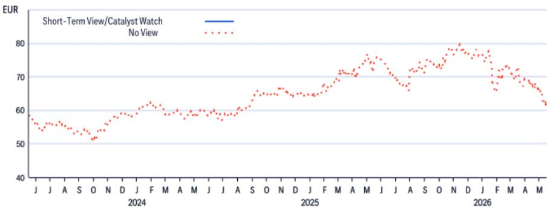

line

| Month | Short-Term View/Catalyst Watch | No View |
|-------|----------------------------------|---------|
| 2024  | 60                               | 58      |
| 2025  | 70                               | 65      |
| 2026  | 75                               | 70      |

\*Indicates Change

Rating/target price changes above reflect Eastern Time

# China Feihe (6186.HK)

Short-Term View/Catalyst Watch Research

Analyst: Tiffany Feng

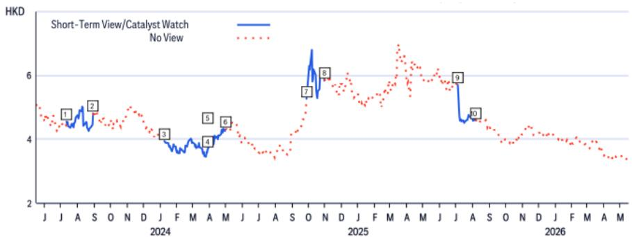

<table><tr><td colspan="2">Date</td><td>Action</td><td>Expected Direction</td><td>Duration</td><td>Closing Price</td><td colspan="2">Date</td><td>Action</td><td>Expected Direction</td><td>Duration</td><td>Closing Price</td><td colspan="2">Date</td><td>Action</td><td>Expected Direction</td><td>Duration</td><td>Closing Price</td></tr><tr><td>1</td><td>11-Jul-23 02:01:13</td><td>Add CW</td><td>Downside</td><td>90 Days</td><td>4.55</td><td>5</td><td>01-Apr-24 01:20:09</td><td>Add CW</td><td>Upside</td><td>30 Days</td><td>3.68</td><td>9</td><td>06-Jul-25 16:00:55</td><td>Add CW</td><td>Downside</td><td>30 Days</td><td>5.70</td></tr><tr><td>2</td><td>29-Aug-23 23:01:58</td><td>Remove CW</td><td>Downside</td><td>90 Days</td><td>4.81</td><td>6</td><td>01-May-24 00:24:50</td><td>Remove CW</td><td>Upside</td><td>30 Days</td><td>4.30</td><td>10</td><td>06-Aug-25 00:17:14</td><td>Remove CW</td><td>Downside</td><td>30 Days</td><td>4.59</td></tr><tr><td>3</td><td>08-Jan-24 23:14:52</td><td>Add CW</td><td>Downside</td><td>90 Days</td><td>3.94</td><td>7</td><td>29-Sep-24 17:52:36</td><td>Add CW</td><td>Upside</td><td>30 Days</td><td>5.27</td><td></td><td></td><td></td><td></td><td></td><td></td></tr><tr><td>4</td><td>31-Mar-24 23:50:09</td><td>Remove CW</td><td>Downside</td><td>90 Days</td><td>3.68</td><td>8</td><td>30-Oct-24 00:29:03</td><td>Remove CW</td><td>Upside</td><td>30 Days</td><td>5.84</td><td></td><td></td><td></td><td></td><td></td><td></td></tr></table>

CW - Catalyst Watch, STV - Short-Term View   
Rating/target price changes above reflect Eastern Time

# The A2 Milk Company Ltd (A2M.AX)

Short-Term View/Catalyst Watch Research

Analyst: Sam Teeger

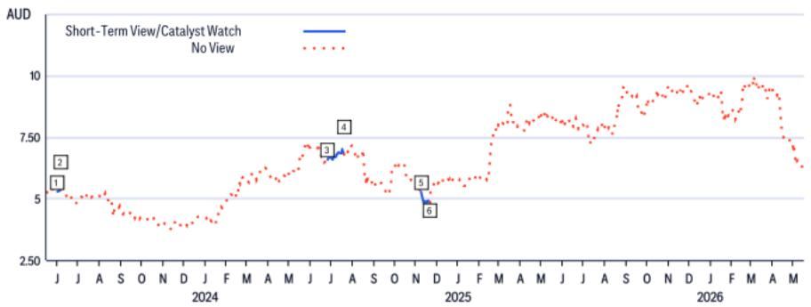

<table><tr><td></td><td>Date</td><td>Action</td><td>Expected Direction</td><td>Duration</td><td>Closing Price</td></tr><tr><td>1</td><td>01-Jun-23 22:52:17</td><td>Add CW</td><td>Upside</td><td>90 Days</td><td>5.29</td></tr><tr><td>2</td><td>06-Jun-23 13:00:00</td><td>Remove CW</td><td>Upside</td><td>90 Days</td><td>5.44</td></tr></table>

<table><tr><td></td><td>Date</td><td>Action</td><td>ExpectedDirection</td><td>Duration</td><td>ClosingPrice</td></tr><tr><td>3</td><td>26-Jun-24 02:12:24</td><td>Add CW</td><td>Upside</td><td>30 Days</td><td>6.59</td></tr><tr><td>4</td><td>21-Jul-24 22:41:30</td><td>Remove CW</td><td>Upside</td><td>30 Days</td><td>6.85</td></tr></table>

<table><tr><td></td><td>Date</td><td>Action</td><td>ExpectedDirection</td><td>Duration</td><td>ClosingPrice</td></tr><tr><td>5</td><td>10-Nov-24 19:00:04</td><td>Add CW</td><td>Downside</td><td>30 Days</td><td>5.28</td></tr><tr><td>6</td><td>21-Nov-24 22:48:18</td><td>Remove CW</td><td>Downside</td><td>30 Days</td><td>4.81</td></tr></table>

CW - Catalyst Watch, STV - Short-Term View   
Rating/target price changes above reflect Eastern Time

The Firm has made a market in the publicly traded equity securities of China Feihe Ltd on at least one occasion since 1 Jan 2025.

Within the past 12 months, Citi Global Markets Inc. or its affiliates has acted as manager or co-manager of an offering of securities of Abbott Laboratories, Danone.

Citi Global Markets Inc. or its affiliates has received compensation for investment banking services provided within the past 12 months from Abbott Laboratories, Danone, Nestlé.

Citi Global Markets Inc. or its affiliates expects to receive or intends to seek, within the next three months, compensation for investment banking services from Abbott Laboratories.

Citi Global Markets Inc. or its affiliates received compensation for products and services other than investment banking services from Abbott Laboratories, China Feihe, Danone, Health and Happiness (H&H), Nestlé in the past 12 months.

Citi Global Markets Inc. or its affiliates currently has, or had within the past 12 months, the following as investment banking client(s): Abbott Laboratories, Danone, Nestlé.

Citi Global Markets Inc. or its affiliates currently has, or had within the past 12 months, the following as clients, and the services provided were non-investment-banking, securities-related: Abbott Laboratories, Danone, Health and Happiness (H&H), Nestlé.

Citi Global Markets Inc. or its affiliates currently has, or had within the past 12 months, the following as clients, and the services provided were non-investment-banking, non-securities-related: Abbott Laboratories, China Feihe, Danone, Nestlé.

Citi Global Markets Inc. and/or its affiliates has a significant financial interest in relation to Abbott Laboratories, Danone, Nestlé. (For an explanation of the determination of significant financial interest, please refer to the policy for managing conflicts of interest which can be found at www.citiVelocity.com.)

Analysts' compensation is determined by Citi management and Citi's senior management and is based upon activities and services intended to benefit the investor clients of Citi Global Markets Inc. and its affiliates (the “Firm”). Compensation is not linked to specific transactions or recommendations. Like all Firm employees, analysts receive compensation that is impacted by overall Firm profitability which includes investment banking, sales and trading, and principal trading revenues. One factor in equity research analyst compensation is arranging corporate access events between institutional clients and the management teams of covered companies. Typically, company management is more likely to participate when the analyst has a positive view of the company.

For financial instruments recommended in the Product in which the Firm is not a market maker, the Firm is a liquidity provider in such financial instruments (and any underlying instruments) and may act as principal in connection with transactions in such instruments. The Firm is a regular issuer of traded financial instruments linked to securities that may have been recommended in the Product. The Firm regularly trades in the securities of the issuer(s) discussed in the Product. The Firm may engage in securities transactions in a manner inconsistent with the Product and, with respect to securities covered by the Product, will buy or sell from customers on a principal basis.

Unless stated otherwise neither the Research Analyst nor any member of their team has viewed the material operations of the Companies for which an investment view has been provided within the past 12 months.

For important disclosures (including copies of historical disclosures) regarding the companies that are the subject of this Citi product ("the Product"), please contact Citi, 388 Greenwich Street, 6th Floor, New York, NY, 10013, Attention: Legal/Compliance [E6WYB6412478]. In addition, the same important disclosures, with the exception of the Valuation and Risk assessments and historical disclosures, are contained on the Firm's disclosure website at https://www.citivelocity.com/cvr/eppublic/citi\_research\_disclosures. Valuation and Risk assessments can be found in the text of the most recent research note/report regarding the subject company. Pursuant to the Market Abuse Regulation a history of all Citi recommendations published during the preceding 12-month period can be accessed via Citi Velocity (https://www.citivelocity.com/cv2) or your standard distribution portal. Historical disclosures (for up to the past three years) will be provided upon request.

<table><tr><td></td><td colspan="3">12 Month Rating</td><td colspan="3">Catalyst Watch</td></tr><tr><td>Data current as of 01 Apr 2026</td><td>Buy</td><td>Hold</td><td>Sell</td><td>Buy</td><td>Hold</td><td>Sell</td></tr><tr><td>Citi Global Fundamental Coverage (Neutral=Hold)</td><td>61%</td><td>32%</td><td>8%</td><td>37%</td><td>47%</td><td>16%</td></tr><tr><td>% of companies in each rating category that are investment banking clients</td><td>38%</td><td>41%</td><td>28%</td><td>42%</td><td>37%</td><td>36%</td></tr></table>

# Guide to Citi Fundamental Research Investment Ratings:

Citi stock recommendations include an investment rating and an optional risk rating to highlight high risk stocks.

Risk rating takes into account both price volatility and fundamental criteria. Stocks will either have no risk rating or a High risk rating assigned.

Investment Ratings: Citi investment ratings are Buy, Neutral and Sell. Our ratings are a function of analyst expectations of expected total return ("ETR") and risk. ETR is the sum of the forecast price appreciation (or depreciation) plus the dividend yield for a stock within the next 12 months. The target price is based on a 12 month time horizon. The Investment rating definitions are: Buy (1) ETR of 15% or more or 25% or more for High risk stocks; and Sell (3) for negative ETR. Any covered stock not assigned a Buy or a Sell is a Neutral (2). For stocks rated Neutral (2), if an analyst believes that there are insufficient valuation drivers and/or investment catalysts to derive a positive or negative investment view, they may elect with the approval of Citi management not to assign a target price and, thus, not derive an ETR. Citi may suspend its rating and target price and assign "Rating Suspended" status for regulatory and/or internal policy reasons. Citi may also suspend its rating and target price and assign "Under Review" status for other exceptional circumstances (e.g. lack of information critical to the analyst's thesis, trading suspension) affecting the company and/or trading in the company's securities. In both such situations, the rating and target price will show as “—” and “-” respectively in the rating history price chart. Prior to 11 April 2022 Citi assigned "Under Review" status to both situations and prior to 11 Nov 2020 only in exceptional circumstances. As soon as practically possible, the analyst will publish a note re-establishing a rating and investment thesis. Investment ratings are determined by the ranges described above at the time of initiation of coverage, a change in investment and/or risk rating, or a change in target price (subject to limited management discretion). At times, the expected total returns may fall outside of these ranges because of market price movements and/or other short-term volatility or trading patterns. Such interim deviations will be permitted but will become subject to review by Research Management. Your decision to buy or sell a security should be based upon your personal investment objectives and should be made only after evaluating the stock's expected performance and risk.

# Catalyst Watch/Short Term Views ("STV") Ratings Disclosure:

Catalyst Watch and STV Upside/Downside calls: Citi may also include a Catalyst Watch or STV Upside or Downside call to indicate the analyst expects the share price to rise (fall) in absolute terms over a specified period of 30 or 90 days in reaction to one or more specific near-term catalysts or events impacting the company or the market. A Catalyst Watch will be published when Analyst confidence is high that an impact to share price will occur; it will be a STV when confidence level is moderate. A Catalyst Watch or STV Upside/Downside call will automatically expire at the end of the specified 30/90 day period. The Catalyst Watch will also be automatically removed if share price performance (calculated at market close) exceeds 15% against the direction of the call (unless over-ridden by the analyst). The analyst may also remove a Catalyst Watch or STV call prior to the end of the specified period in a published research note. A Catalyst Watch/STV Upside or Downside call may be different from and does not affect a stock's fundamental equity rating, which reflects a longer-term total absolute return expectation. For purposes of FINRA ratings-distribution-disclosure rules, a Catalyst Watch/STV Upside call corresponds to a buy recommendation and a Catalyst Watch/STV Downside call corresponds to a sell recommendation. Any stock not assigned to a Catalyst Watch Upside, Catalyst Watch Downside, STV Upside, or STV Downside call is considered Catalyst Watch/STV No View. For purposes of FINRA ratings distribution-disclosure rules, we correspond Catalyst Watch/STV No View to Hold in our ratings distribution table for our Catalyst Watch/STV Upside/Downside rating system. However, we reiterate that we do not consider No View to be a recommendation. For all Catalyst Watch/STV Upside/Downside calls, risk exists that the catalyst(s) and associated share-price movement will not materialize as expected.

# RESEARCH ANALYST AFFILIATIONS / NON-US RESEARCH ANALYST DISCLOSURES

The legal entities employing the authors of this report are listed below (and their regulators are listed further herein). Non-US research analysts who have prepared this report (i.e., all research analysts listed below other than those identified as employed by Citi Global Markets Inc.) are not registered/qualified as research analysts with FINRA. Such research analysts may not be associated persons of the member organization (but are employed by an affiliate of the member organization) and therefore may not be subject to the FINRA Rule 2241 restrictions on communications with a subject company, public appearances and trading securities held by a research analyst account.

<table><tr><td>Citi Global Markets Inc.</td><td>Joanne Wuensch</td></tr><tr><td>Citi Global Markets Asia Limited</td><td>Tiffany Feng</td></tr><tr><td>Citi Global Markets Europe AG - FRANCE</td><td>Cedric Besnard</td></tr><tr><td>Citi Global Markets Australia Pty Limited</td><td>Sam Teeger</td></tr></table>

# OTHER DISCLOSURES

Any price(s) of instruments mentioned in recommendations are as of the prior day's market close on the primary market for the instrument, unless otherwise stated.

The completion and first dissemination of any recommendations made within this research report are as of the Eastern date-time displayed at the top of the Product. If the Product references views of other analysts then please refer to the price chart or rating history table for the date/time of completion and first dissemination with respect to that view.

Regulations in various jurisdictions require that where a recommendation differs from any of the author's previous recommendations concerning the same financial instrument or issuer that has been published during the preceding 12-month period that the change(s) and the date of that previous recommendation are indicated. For fundamental coverage please refer to the price chart or rating change history within this disclosure appendix or the issuer disclosure summary at https://www.citivelocity.com/cvr/eppublic/citi\_research\_disclosures.

Citi has implemented policies for identifying, considering and managing potential conflicts of interest arising as a result of publication or distribution of investment research. A description of these policies can be found at https://www.citivelocity.com/cvr/eppublic/citi\_research\_disclosures.

The proportion of all Citi recommendations that were the equivalent to "Buy", "Hold", "Sell" at the end of each quarter over the prior 12 months (with the % of these that had received investment firm services from Citi in the prior 12 months shown in brackets) is as follows: Q4 2025 Buy 33% (63%), Hold 44% (50%), Sell 23% (46%), RV 0.4% (91%); Q3 2025 Buy 33% (61%), Hold 44% (52%), Sell 23% (50%), RV 0.4% (80%); Q2 2025 Buy 33%(63%), Hold 44% (51%), Sell 23% (49%), RV 0.4% (86%); Q1 2025 Buy 33%(63%), Hold 44% (51%), Sell 23% (49%), RV 0.5% (87%). For the purposes of disclosing recommendations other than for equity (whose definitions can be found in the corresponding disclosure sections), "Buy" means a positive directional trade idea; "Sell" means a negative directional trade idea; and "Relative Value" means any trade idea which does not have a clear direction to the investment strategy.

European regulations require a 5 year price history when past performance of a security is referenced. CitiVelocity's Charting Tool (https://www.citivelocity.com/cv2/#go/CHARTING\_3\_Equities) provides the facility to create customisable price charts including a five year option. This tool can be found in the Data & Analytics section under any of the asset class menus in CitiVelocity (https://www.citivelocity.com/). For further information contact CitiVelocity support (https://www.citivelocity.com/cv2/go/CLIENT\_SUPPORT). The source for all referenced prices, unless otherwise stated, is DataCentral, which sources price information from LSEG Data & Analytics. Past performance is not a guarantee or reliable indicator of future results. Forecasts are not a guarantee or reliable indicator of future performance.

Investors should always consider the investment objectives, risks, and charges and expenses of an ETF carefully before investing. The applicable prospectus and key investor information document (as applicable) for an ETF should contain this and other information about such ETF. It is important to read carefully any such prospectus before investing. Clients may obtain prospectuses and key investor information documents for ETFs from the applicable distributor or authorized participant, the exchange upon which an ETF is listed and/or from the applicable website of the applicable ETF issuer. The value of the investments and any accruing income may fall or rise. Any past performance, prediction or forecast is not indicative of future or likely performance. Any information on ETFs contained herein is provided strictly for illustrative purposes and should not be deemed an offer to sell or a solicitation of an offer to purchase units of any ETF either explicitly or implicitly. The opinions expressed are those of the authors and do not necessarily reflect the views of ETF issuers, any of their agents or their affiliates.

Citi Global Markets India Private Limited and/or its affiliates may have, from time to time, actual or beneficial ownership of 1% or more in the debt securities of the subject issuer.

Please be advised that pursuant to Executive Order 13959 as amended (the “Order”), U.S. persons are prohibited from investing in securities of any company determined by the United States Government to be the subject of the Order. This research is not intended to be used or relied upon in any way that could result in a violation of the Order. Investors are encouraged to rely upon their own legal counsel for advice on compliance with the Order and other economic sanctions programs administered and enforced by the Office of Foreign Assets Control of the U.S. Treasury Department.

This communication is directed at persons who are "Eligible Clients" as such term is defined in the Israeli Regulation of Investment Advice, Investment Marketing and Investment Portfolio Management law, 1995 (the "Advisory Law"). Within Israel, this communication is not intended for retail clients and Citi will not make such products or transactions available to retail clients or to non-Eligible Clients. The presenter is not licensed as investment advisor or investment marketer by the Israeli Securities Authority ("ISA") and this communication does not constitute investment or marketing advice. The information contained herein may relate to matters that are not regulated by the ISA. Any securities which are the subject of this communication may not be offered or sold to any Israeli person except pursuant to a security offering exemption according to the Israeli Securities Law, 1968 and the public offering rules provided thereunder.

Citi broadly and simultaneously disseminates its research content to the Firm’s institutional and retail clients via the Firm’s proprietary electronic distribution platforms (e.g., Citi Velocity and various Global Wealth platforms). As a convenience, certain, but not all, research content may be distributed through third party aggregators. Clients may receive published research reports by email, on a discretionary basis, and only after such research content has been broadly disseminated. Certain research is made available only to institutional investors to satisfy regulatory requirements. The level and types of services provided by Citi analysts to clients may vary depending on various factors such as the client’s individual preferences as to the frequency and manner of receiving communications from analysts, the client’s risk profile and investment focus and perspective (e.g. market-wide, sector specific, long term, short-term etc.), the size and scope of the overall client relationship with the Firm and legal and regulatory constraints.

Pursuant to Comissão de Valores Mobiliários Resolução 20 and ASIC Regulatory Guide 264, Citi is required to disclose whether a Citi related company or business has a commercial relationship with the subject company. Considering that Citi operates multiple businesses in more than 100 countries around the world, it is likely that Citi has a commercial relationship with the subject company.

Securities recommended, offered, or sold by the Firm: (i) are not insured by the Federal Deposit Insurance Corporation; (ii) are not deposits or other obligations of any insured depository institution (including Citibank); and (iii) are subject to investment risks, including the possible loss of the principal amount invested. The Product is for informational purposes only and is not intended as an offer or solicitation for the purchase or sale of a security. Any decision to purchase securities mentioned in the Product must take into account existing public information on such security or any registered prospectus. Although information has been obtained from and is based upon sources that the Firm believes to be reliable, we do not guarantee its accuracy and it may be incomplete and condensed. Note, however, that the Firm has taken all reasonable steps to determine the accuracy and completeness of the disclosures made in the Important Disclosures section of the Product. The Firm's research department has received assistance from the subject company(ies) referred to in this Product including, but not limited to, discussions with management of the subject company(ies). Firm policy prohibits research analysts from sending draft research to subject companies. However, it should be presumed that the author of the Product has had discussions with the subject company to ensure factual accuracy prior to publication. Statements and views concerning ESG (environmental, social, governance) factors are typically based upon public statements made by the affected company or other public news, which the author may not have independently verified. ESG factors are one consideration that investors may choose to examine when making investment decisions. All opinions, projections and estimates constitute the judgment of the author as of the date of the Product and these, plus any other information contained in the Product, are subject to change without notice. Prices and availability of financial instruments also are subject to change without notice. Notwithstanding other departments within the Firm advising the companies discussed in this Product, information obtained in such role is not used in the preparation of the Product. Although Citi does not set a predetermined frequency for publication, if the Product is a fundamental equity or credit research report, it is the intention of Citi to provide research coverage of the covered issuers, including in response to news affecting the issuer. For non-fundamental research reports, Citi may not provide regular updates to the views, recommendations and facts included in the reports. Notwithstanding that Citi maintains coverage on, makes recommendations concerning or discusses issuers, Citi may be periodically restricted from referencing certain issuers due to legal or policy reasons. Where a component of a published trade idea is subject to a restriction, the trade idea will be removed from any list of open trade ideas included in the Product. Upon the lifting of the restriction, the trade idea will either be re-instated in the open trade ideas list if the analyst continues to support it or it will be officially closed. Citi may provide different research products and services to different classes of customers (for example, based upon long-term or short-term investment horizons) that may lead to differing conclusions or recommendations that could impact the price of a security contrary to the recommendations in the alternative research product, provided that each is consistent with the rating system for each respective product.

Investing in non-U.S. securities, including ADRs, may entail certain risks. The securities of non-U.S. issuers may not be registered with, nor be subject to the reporting requirements of the U.S. Securities and Exchange Commission. There may be limited information available on foreign securities. Foreign companies are generally not subject to uniform audit and reporting standards, practices and requirements comparable to those in the U.S. Securities of some foreign companies may be less liquid and their prices more volatile than securities of comparable U.S. companies. In addition, exchange rate movements may have an adverse effect on the value of an investment in a foreign stock and its corresponding dividend payment for U.S. investors. Net dividends to ADR investors are estimated, using withholding tax rates conventions, deemed accurate, but investors are urged to consult their tax advisor for exact dividend computations. Investors who have received the Product from the Firm may be prohibited in certain states or other jurisdictions from purchasing securities mentioned in the Product from the Firm. Please ask your Financial Consultant for additional details. Citi Global Markets Inc. takes responsibility for the Product in the United States. Any orders by US investors resulting from the information contained in the Product may be placed only through Citi Global Markets Inc.

# The Citi legal entity that takes responsibility for the production of the Product is the legal entity which the first named author is employed by.

The Product is made available in Australia through Citi Global Markets Australia Pty Limited. (ABN 64 003 114 832 and AFSL No. 240992), participant of the ASX Group and regulated by the Australian Securities & Investments Commission. Citi Centre, 2 Park Street, Sydney, NSW 2000. Citi Global Markets Australia Pty Limited is not an Authorised Deposit-Taking Institution under the Banking Act 1959, nor is it regulated by the Australian Prudential Regulation Authority.

The Product is made available in Brazil by Citi Global Markets Brasil - CCTVM SA, which is regulated by CVM - Comissão de Valores Mobiliários ("CVM"), BACEN - Brazilian Central Bank, APIMEC - Associação dos Analistas e Profissionais de Investimento do Mercado de Capitais and ANBIMA – Associação Brasileira das Entidades dos Mercados Financeiro e de Capitais. Av. Paulista, 1111 - 14º andar(parte) - CEP: 01311920 - São Paulo - SP.

This Product is available in Chile through Banchile Corredores de Bolsa S.A., an indirect subsidiary of Citi Inc., which is regulated by the Comisión Para El Mercado Financiero. Enrique Foster Sur, 20, piso 6, Las Condes, Santiago, Chile.

Disclosure for investors in the Republic of Colombia: This communication or message does not constitute a professional recommendation to make investment in the terms of article 2.40.1.1.2 of Decree 2555 de 2010 or the regulations that modify, substitute or complement it. Para la elaboración y distribución de informes de investigación y de comunicaciones generales de que trata este artículo no se requiere ser una entidad vigilada por la Superintendencia Financiera de Colombia.

The Product is made available in Germany by Citi Global Markets Europe AG ("CGME"), which is regulated by the European Central Bank and the German Federal Financial Supervisory Authority (Bundesanstalt für Finanzdienstleistungsaufsicht BaFin). Börsenplatz 9, 60313 Frankfurt am Main, Germany.

Unless otherwise specified, if the analyst who prepared this report is based in Hong Kong and it relates to “securities” (as defined in the Securities and Futures Ordinance (Cap.571 of the Laws of Hong Kong)), the report is issued in Hong Kong by Citi Global Markets Asia Limited. Citi Global Markets Asia Limited is regulated by Hong Kong Securities and Futures

Commission. If the report is prepared by a non-Hong Kong based analyst, please note that such analyst (and the legal entity that the analyst is employed by or accredited to) is not licensed/registered in Hong Kong and they do not hold themselves out as such. Please refer to the section “Research Analyst Affiliations / Non-US Research Analyst Disclosures” for the details of the employment entity of the analysts.

The Product is made available in India by Citi Global Markets India Private Limited (CGM), which is regulated by the Securities and Exchange Board of India (SEBI), as a Research Analyst (SEBI Registration No. INH000000438). CGM is also actively involved in the business of merchant banking (SEBI Registration No. INM000010718) and stock brokerage ((SEBI Registration No. INZ000263033) in India, and is registered with SEBI in this regard. Registration granted by SEBI and certification from National Institute of Securities Markets (NISM) in no way guarantee performance of the intermediary or provide any assurance of returns to investors. CGM's registered office is at 1202, 12th Floor, First International Financial Centre (FIFC), G Block, Bandra Kurla Complex, Bandra East, Mumbai – 400098 & registered Tel: +91 22 61759999. Citi maintains robust policies, procedures, controls, and training to ensure continued compliance with all applicable rules and regulations. All recommendations contained herein are made by duly qualified research analysts. CGM's Corporate Identity Number is U99999MH2000PTC126657, and its Compliance Officer [Vishal Bohra] contact details are: Tel: +91-022-61759994, Fax: +91-022-61759851, Email: cgmcompliance@citi.com. The Investor Charter in respect of Research Analysts, the Compliance Audit Report and Complaints information can be found at https://www.citivelocity.com/cvr/eppublic/citi\_research\_disclosures. The grievance officer [Niraj Mody] contact details are Tel: +91-22-42775002, Email: EMEA.CR.Complaints@citi.com. Investment in securities market are subject to market risks. Read all the related documents carefully before investing. SEBI prescribed Client Terms & Conditions can be found at https://www.citivelocity.com/rendition/authfilelinksvcs/eppublic/V1/file?paramData=ZmlsZU5hbWU9L1MzL0dETVMvcHViRGlzY2xvc3VyZUhObWxzL2dkbV9kaXNfc2ViaV9UZXJtc29mVXNILmhObWw

The Product is made available in Indonesia through PT Citi Sekuritas Indonesia. Citibank Tower 10/F, Pacific Century Place, SCBD lot 10, Jl. Jend Sudirman Kav 52-53, Jakarta 12190, Indonesia. Neither this Product nor any copy hereof may be distributed in Indonesia or to any Indonesian citizens wherever they are domiciled or to Indonesian residents except in compliance with applicable capital market laws and regulations. This Product is not an offer of securities in Indonesia. The securities referred to in this Product have not been registered with the Capital Market and Financial Services Authority (OJK) pursuant to relevant capital market laws and regulations, and may not be offered or sold within the territory of the Republic of Indonesia or to Indonesian citizens through a public offering or in circumstances which constitute an offer within the meaning of the Indonesian capital market laws and regulations.

The Product is made available in Japan by Citi Global Markets Japan Inc. ("CGMJ"), which is regulated by Financial Services Agency, Securities and Exchange Surveillance Commission, Japan Securities Dealers Association, Tokyo Stock Exchange and Osaka Securities Exchange. Otemachi Park Building, 1-1-1 Otemachi, Chiyoda-ku, Tokyo 100-8132 Japan. In the event that an error is found in an CGMJ research report, a revised version will be posted on the Firm's Citi Velocity website. If you have questions regarding Citi Velocity, please call (81 3) 6270-3019 for help.

The product is made available in the Kingdom of Saudi Arabia in accordance with Saudi laws through Citi Saudi Arabia, which is regulated by the Capital Market Authority (CMA) under CMA license (17184-31). 2239 Al Urubah Rd – Al Olaya Dist. Unit No. 18, Riyadh 12214 – 9597, Kingdom Of Saudi Arabia.

The Product is made available in Korea by Citi Global Markets Korea Securities Ltd. (CGMK), which is regulated by the Financial Services Commission, the Financial Supervisory Service and the Korea Financial Investment Association (KOFIA). The address of CGMK is Citibank Center, 50 Saemunan-ro, Jongno-gu, Seoul 03184, Korea. KOFIA makes available registration information of research analysts on its website. Please visit the following website if you wish to find KOFIA registration information on research analysts of CGMK. http://dis.kofia.or.kr/websquare/index.jsp?w2xPath=/wq/fundMgr/DISFundMgrAnalystList.xml&divisionId=MDISO3002002000000&serviceId=SDISO3002002000. The Product is made available in Korea by Citibank Korea Inc., which is regulated by the Financial Services Commission and the Financial Supervisory Service. Address is Citibank Center, 50 Saemunan-ro, Jongno-gu, Seoul 03184, Korea. This research report is intended to be provided only to Professional Investors as defined in the Financial Investment Services and Capital Market Act and its Enforcement Decree in Korea.

The Product is made available in Malaysia by Citi Global Markets Malaysia Sdn Bhd (Registration No. 199801004692 (460819-D)) (“CGMM”) to its clients and CGMM takes responsibility for its contents as regards CGMM’s clients. CGMM is regulated by the Securities Commission Malaysia. Please contact CGMM at Level 43 Menara Citibank, 165 Jalan Ampang, 50450 Kuala Lumpur, Malaysia in respect of any matters arising from, or in connection with, the Product.

The Product is made available in Mexico by Citi México Casa de Bolsa, S.A. de C.V., Grupo Financiero Citi México which is a wholly owned subsidiary of Citi Inc. and is regulated by Comision Nacional Bancaria y de Valores. Prolongación Reforma 1196, 24 floor, Colonia Santa Fe, Alcaldía Cuajimalpa de Morelos, C.P. 05348, Ciudad de México.

The Product is made available in Poland by Biuro Maklerskie Banku Handlowego (DMBH), separate department of Bank Handlowy w Warszawie S.A. a subsidiary of Citi Inc., which is regulated by Komisja Nadzoru Finansowego. Biuro Maklerskie Banku Handlowego (DMBH), ul.Senatorska 16, 00-923 Warszawa.

The Product is made available in Singapore through Citi Global Markets Singapore Pte. Ltd. (“CGMSPL”), a capital markets services and Exempt Financial Advisor license holder, and regulated by Monetary Authority of Singapore. Please contact CGMSPL at 8 Marina View, 21st Floor Asia Square Tower 1, Singapore 018960, in respect of any matters arising from, or in connection with, the analysis of this document. This Product is intended for recipients who are accredited, expert and institutional investors as defined under the Securities and Futures Act 2001. For Citi Private Bank, the Product is made

available in Singapore by Citi Private Bank through Citibank, N.A., Singapore Branch. Citibank N.A., Singapore Branch is a licensed bank in Singapore that is regulated by the Monetary Authority of Singapore. Please contact your Private Banker in Citibank N.A., Singapore Branch if you have any queries on or any matters arising from or in connection with this document. The Product is intended for recipients who are accredited, expert and institutional investors as defined under the Securities and Futures Act 2001. For Citibank Singapore Limited (“CSL”), the Product is distributed in Singapore by CSL to selected Citigold/Citigold Private Clients. CSL provides no independent research or analysis of the substance or in preparation of the Product. Please contact your Citigold//Citigold Private Client Relationship Manager in CSL if you have any queries on or any matters arising from or in connection with this document. The Product is intended for recipients who are accredited investors as defined under the Securities and Futures Act (Cap. 289).

Citi Global Markets (Pty) Ltd. is incorporated in the Republic of South Africa (company registration number 2000/025866/07) and its registered office is at 145 West Street, Sandton, 2196, Saxonwold. Citi Global Markets (Pty) Ltd. is regulated by JSE Securities Exchange South Africa, South African Reserve Bank and the Financial Services Board. The investments and services contained herein are not available to private customers in South Africa.

The Product is made available in the Republic of China (Taiwan) through Citi Global Markets Taiwan Securities Company Ltd. ("CGMTS"), 14F, 15F and 16F, No. 1, Songzhi Road, Taipei 110, Taiwan, subject to the license scope and the applicable laws and regulations in the Republic of China (Taiwan). CGMTS is regulated by the Securities and Futures Bureau of the Financial Supervisory Commission of Taiwan, the Republic of China (Taiwan). No portion of the Product may be reproduced or quoted in the Republic of China (Taiwan) by the press or any third parties [without the written authorization of CGMTS]. Pursuant to the applicable laws and regulations in the Republic of China (Taiwan), the recipient of the Product shall not take advantage of such Product to involve in any matters in which the recipient may have conflicts of interest. If the Product covers securities which are not allowed to be offered or traded in the Republic of China (Taiwan), neither the Product nor any information contained in the Product shall be considered as advertising the securities or making recommendation of the securities in the Republic of China (Taiwan). The Product is for informational purposes only and is not intended as an offer or solicitation for the purchase or sale of a security or financial products. Any decision to purchase securities or financial products mentioned in the Product must take into account existing public information on such security or the financial products or any registered prospectus.

The Product is made available in Thailand through Citicorp Securities (Thailand) Ltd., which is regulated by the Securities and Exchange Commission of Thailand. 399 Interchange 21 Building, 18th Floor, Sukhumvit Road, Klongtoey Nua, Wattana, Bangkok 10110, Thailand.

Disclosure for investors in the Republic of Turkey: The Product is made available in Turkey through Citibank AS which is regulated by Capital Markets Board. Tekfen Tower, Eski Buyukdere Caddesi # 209 Kat 2B, 23294 Levent, Istanbul, Turkey. Under Capital Markets Law of Turkey (Law No: 6362), the investment information, comments and recommendations stated here, are not within the scope of investment advisory activity. Comments and recommendations stated here rely on the individual opinions of the ones providing these comments and recommendations. These opinions may not fit to your financial status, risk and return preferences. For this reason, to make an investment decision by relying solely to this information stated here may not bring about outcomes that fit your expectations. Furthermore, Citi is a division of Citi Global Markets Inc. (the “Firm”), which does and seeks to do business with companies and/or trades on securities covered in this research reports. As a result, investors should be aware that the Firm may have a conflict of interest that could affect the objectivity of this report, however investors should also note that the Firm has in place organisational and administrative arrangements to manage potential conflicts of interest of this nature.

In the U.A.E, these materials (the "Materials") are communicated by Citi Global Markets Limited, DIFC branch ("CGML"), an entity registered in the Dubai International Financial Center ("DIFC") and licensed and regulated by the Dubai Financial Services Authority ("DFSA", license #CL0221) to Professional Clients and Market Counterparties, as defined in DFSA regulations, only and should not be relied upon or distributed to Retail Clients. Financial products and/or services to which the Materials relate will only be made available to Professional Clients and Market Counterparties. Citi Global Markets Limited DIFC Branch registered addressis Level 3, Gate District Building 02, Dubai International Financial Centre and can be contacted on +971 4 509 97 90.

The Product is made available in United Kingdom by Citi Global Markets Limited, which is authorised by the Prudential Regulation Authority (“PRA”) and regulated by the Financial Conduct Authority (“FCA”) and the PRA. This material may relate to investments or services of a person outside of the UK or to other matters which are not authorised by the PRA nor regulated by the FCA and the PRA and further details as to where this may be the case are available upon request in respect of this material. Citi Centre, Canada Square, Canary Wharf, London, E14 5LB.

The Product is made available in United States and Canada by Citi Global Markets Inc., which is a member of FINRA and registered with the US Securities and Exchange Commission. 388 Greenwich Street, New York, NY 10013.

Unless specified to the contrary, within EU Member States, the Product is made available by Citi Global Markets Europe AG ("CGME"), which is regulated by the European Central Bank and the German Federal Financial Supervisory Authority (Bundesanstalt für Finanzdienstleistungsaufsicht-BaFin).

The Product is not to be construed as providing investment services in any jurisdiction where the provision of such services would not be permitted.

Subject to the nature and contents of the Product, the investments described therein are subject to fluctuations in price and/or value and investors may get back less than originally invested. Certain high-volatility investments can be subject to sudden and large falls in value that could equal or exceed the amount invested. The yield and average life of CMOs

(collateralized mortgage obligations) referenced in this Product will fluctuate depending on the actual rate at which mortgage holders prepay the mortgages underlying the CMO and changes in current interest rates. Any government agency backing of the CMO applies only to the face value of the CMO and not to any premium paid. Certain investments contained in the Product may have tax implications for private customers whereby levels and basis of taxation may be subject to change. If in doubt, investors should seek advice from a tax adviser. The Product does not purport to identify the nature of the specific market or other risks associated with a particular transaction. Advice in the Product is general and should not be construed as personal advice given it has been prepared without taking account of the objectives, financial situation or needs of any particular investor. Accordingly, investors should, before acting on the advice, consider the appropriateness of the advice, having regard to their objectives, financial situation and needs. Prior to acquiring any financial product, it is the client's responsibility to obtain the relevant offer document for the product and consider it before making a decision as to whether to purchase the product.

Card Insights. Where this report references Card Insights data, Card Insights consists of selected data from a subset of Citi's proprietary credit card transactions. Such data has undergone rigorous security protocols to keep all customer information confidential and secure; the data is highly aggregated and anonymized so that all unique customer identifiable information is removed from the data prior to receipt by the report's author or distribution to external parties. This data should be considered in the context of other economic indicators and publicly available information. Further, the selected data represents only a subset of Citi's proprietary credit card transactions due to the selection methodology or other limitations and should not be considered as indicative or predictive of the past or future financial performance of Citi or its credit card business.

Citi product may source data from dataCentral. dataCentral is a Citi proprietary database, which includes the Firm's estimates, data from company reports and feeds from LSEG Data & Analytics. The source for all referenced prices, unless otherwise stated, is DataCentral. Past performance is not a guarantee or reliable indicator of future results. Forecasts are not a guarantee or reliable indicator of future performance. The printed and printable version of the research report may not include all the information <(e.g. certain financial summary information and comparable company data) that is linked to the online version available on the Firm's proprietary electronic distribution platforms.

Where included in this report, MSCI sourced information is the exclusive property of MS Capital International Inc. (MSCI). Without prior written permission of MSCI, this information and any other MSCI intellectual property may not be reproduced, redisseminated or used to create any financial products, including any indices. This information is provided on an "as is" basis. The user assumes the entire risk of any use made of this information. MSCI, its affiliates and any third party involved in, or related to, computing or compiling the information hereby expressly disclaim all warranties of originality, accuracy, completeness, merchantability or fitness for a particular purpose with respect to any of this information. Without limiting any of the foregoing, in no event shall MSCI, any of its affiliates or any third party involved in, or related to, computing or compiling the information have any liability for any damages of any kind. MSCI, MS Capital International and the MSCI indexes are services marks of MSCI and its affiliates. Where data is attributed to Morningstar that data is © 2026 Morningstar, Inc. All Rights Reserved. That information: (1) is proprietary to Morningstar and/or its content providers; (2) may not be copied or distributed; and (3) is not warranted to be accurate, complete or timely. Neither Morningstar nor its content providers are responsible for any damages or losses arising from any use of this information.

The Firm accepts no liability whatsoever for the actions of third parties. The Product may provide the addresses of, or contain hyperlinks to, websites. Except to the extent to which the Product refers to website material of the Firm, the Firm has not reviewed the linked site. Equally, except to the extent to which the Product refers to website material of the Firm, the Firm takes no responsibility for, and makes no representations or warranties whatsoever as to, the data and information contained therein. Such address or hyperlink (including addresses or hyperlinks to website material of the Firm) is provided solely for your convenience and information and the content of the linked site does not in any way form part of this document. Accessing such website or following such link through the Product or the website of the Firm shall be at your own risk and the Firm shall have no liability arising out of, or in connection with, any such referenced website.

© 2026 Citi Global Markets Inc. Citi is a division of Citi Global Markets Inc. Citi and Citi and Arc Design are trademarks and service marks of Citi Inc. and its affiliates and are used and registered throughout the world. All rights reserved. The research data in this report are not intended to be used for the purpose of (a) determining the price of or amounts due in respect of (or to value) one or more financial products or instruments and/or (b) measuring or comparing the performance of, or defining the asset allocation of a financial product, a portfolio of financial instruments, or a collective investment undertaking, and any such use is strictly prohibited without the prior written consent of Citi. Any unauthorized use, duplication, redistribution or disclosure of this report (the “Product”), including, but not limited to, redistribution of the Product by electronic mail, posting of the Product on a website or page, and/or providing to a third party a link to the Product, is prohibited by law and will result in prosecution. The information contained in the Product is intended solely for the recipient and may not be further distributed by the recipient to any third party.

ADDITIONAL INFORMATION IS AVAILABLE UPON REQUEST