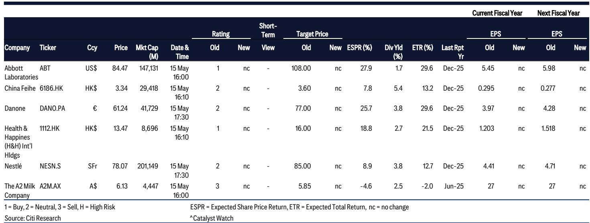
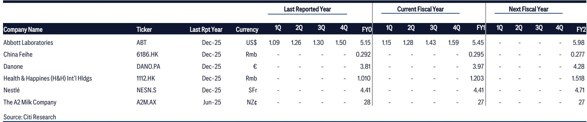
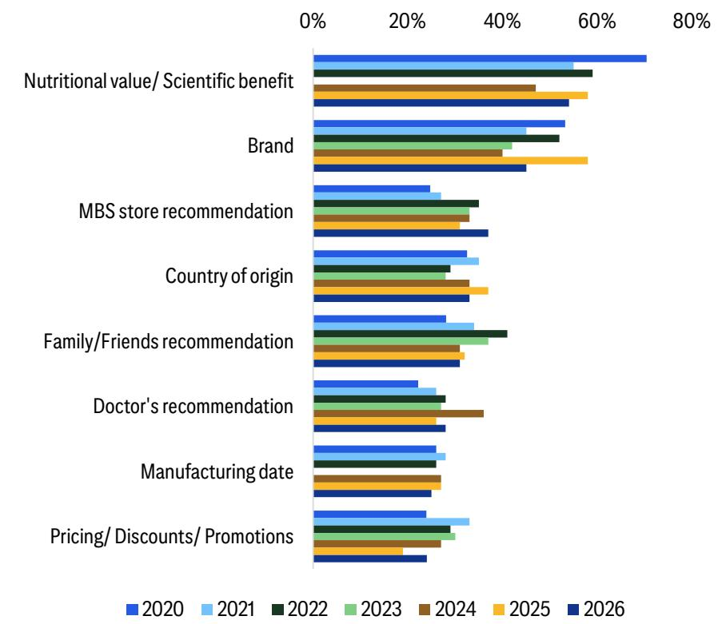

# 中国奶粉市场的真正拐点：消费者不再为“进口”买单，而是为“科学”付费

这份由某外资投行发布的第六次中国婴幼儿配方奶粉年度调查报告，覆盖了从一线到五线城市的1200名家长，其核心发现指向一个被多数投资者低估的结构性变化：中国消费者对奶粉的选择逻辑正在发生根本性重置。过去十年，行业的核心叙事是“进口 vs 国产”的二元对立；而2026年的数据清晰地表明，这一框架正在瓦解。消费者的决策天平已经从“品牌出身”转向“成分科学”，而这一转变对行业竞争格局、定价权分布以及各公司的长期战略价值，将产生远比出生率波动更深远的影响。

报告揭示了一个关键信号：在经历过2025年的一系列产品召回事件后，消费者的实际行为变化比市场预期的更为剧烈。但真正值得关注的，不是短期的份额此消彼长，而是这些行为背后所反映出的、不可逆的认知升级。本文将从五个层次拆解这份报告的核心洞察，并指出其中未被充分定价的挑战与机遇。

## 1. 召回事件暴露了进口品牌的软肋，但最大赢家并非外资同行

调查显示，84%的受访者表示今年因召回事件而发现雀巢（Wyeth系列）或达能（Aptamil、Nutrilon）产品缺货。其中，47%的受访者明确表示雀巢的库存减少，而达能库存未变。这直接对应了雀巢产品在中国被召回、而达能未被波及的事实。

但真正值得关注的是这些消费者的去向。在曾购买达能或雀巢的受访者中，63%转向了国产品牌，仅有35%转向了其他国际品牌。这意味着，召回事件并未在进口品牌内部形成“此消彼长”的闭环，反而加速了消费者向国产阵营的迁徙。

这一数据的含义是双重的。对于像H&H（健合集团）这样定位欧洲原产、主打超高端的产品线而言，它确实成为了一个显著受益者——其法国和丹麦生产的奶粉恰好满足了从召回品牌中流失的、仍对进口品质有要求的消费者。但更广泛的趋势是，国产奶粉的信任红利正在兑现。飞鹤虽未直接从召回事件中大幅受益（因其营销定位不同），但整个国产阵营的消费者基础正在扩大。对于a2牛奶公司而言，情况更为棘手：其本应从竞争对手的供给缺口获益，却因自身供应链问题导致在华库存短缺，反而错失了这一窗口期。这提醒市场，在当前的竞争环境下，供应链的韧性与灵活性已与品牌力同等重要。

## 2. “国产品牌 vs 进口品牌”的二元叙事正在失效，消费者转向了“成分优先”

报告中最具长期意义的发现，是消费者偏好的结构性变化。调查显示，偏好外国品牌的受访者比例已降至2020年首次调查以来的最低点，但偏好国产品牌的比例与2025年持平。真正占据主流的，是“无偏好”群体——55%的受访者表示对国产或进口没有偏向。

这并非简单的“国产替代”，而是一种更深层的认知重组。2025年时，品牌和营养价值/科学利益在决策中的重要性相当；而到了2026年，后者已经明确超越前者，成为影响奶粉选择的首要因素。原产国的重要性更是跌出了前三。与此同时，认为中国奶粉质量在过去12个月有所提升的受访者接近四分之三，而对进口品牌持相同看法的仅约一半。更值得注意的是，50%的受访者表示更愿意购买在中国制造的外国品牌——这一比例在2025年仅为24%。

这些数据共同指向一个结论：消费者正在从“身份标签”的消费转向“功能价值”的消费。他们不再因为“进口”而天然信任，也不再因“国产”而本能排斥。取而代之的是，他们开始像研究药品一样研究配方——关注HMO（母乳低聚糖）、新鲜度、营养成分的可追溯性。这意味着一家公司的竞争壁垒，正在从“品牌故事”和“渠道覆盖”，转向“研发投入”和“配方创新”的能力。

## 3. 飞鹤的领先地位并非不可撼动，其真正的护城河在于“新鲜”的可验证性

报告指出，飞鹤已成功巩固其作为国内奶粉第一品牌的地位，其“最适合中国宝宝”的定位和超高端产品组合（占2025年销售额的68%）是其核心优势。但飞鹤面临的行业背景依然严峻：预计2026年0-3岁婴幼儿人口将出现中个位数下降。

然而，飞鹤在2026年初推出的新鲜原料可追溯系统，可能才是其最具战略价值的动作。该系统允许消费者通过二维码验证核心原料的生产日期。在“成分优先”的新消费逻辑下，这一举措直接回应了消费者对“新鲜度”日益增长的关切。它不仅是营销手段，更是在构建一个可验证的信任机制——这是进口品牌因全球供应链结构而难以复制的优势。

飞鹤的挑战在于，其库存清理已完成，为2026年提供了低基数效应，但行业整体需求的下行压力并未消失。市场对其低十几倍市盈率和约6%股息率的定价，已经反映了这种悲观预期。真正的分歧点在于：新鲜度可追溯系统能否帮助飞鹤在存量竞争中进一步扩大份额，从而对冲人口下降的影响？这个问题，报告没有给出确定性答案，但提供了值得追踪的观察窗口。

## 4. 报告尚未完全回答的关键问题：供应链本地化是否会成为新的竞争分水岭

调查显示，消费者对“新鲜度”和“保质期”的关注度正在上升。这对于采用全球供应链模式的品牌——如H&H（欧洲生产）、a2（新西兰/澳大利亚生产）——构成了潜在压力。虽然H&H历史上管理良好，但报告指出“消费者对保质期和新鲜度的更高关注度，给H&H的全球供应链模式带来了一定压力”。

这里引出了一个报告未充分展开但至关重要的二阶问题：如果“新鲜度”成为消费者决策的硬约束，那么在中国本土拥有生产基地的公司，是否会获得不可逆的结构性优势？飞鹤的新鲜度追溯系统只是第一步，更根本的问题是，进口品牌是否需要在中国建设本地化产能，以缩短从生产到消费的时间差？这不仅仅是物流成本的问题，更是品牌信任和消费者心理定价的问题。

报告提到，50%的受访者更愿意购买在中国制造的外国品牌，这已经暗示了消费者对“本地生产”的接受度在快速提升。如果这一趋势持续，那么目前在中国没有本土工厂的进口品牌，将面临一个战略抉择：要么投资本地化生产，要么接受市场份额的持续流失。这一判断的验证，需要跟踪各家公司的资本开支计划和产能布局，而这正是完整报告可以提供的深度分析。

## 5. 投资者的观察框架：从“出生率叙事”转向“份额再分配与定价权”

基于上述分析，我们认为投资者在评估中国奶粉行业时，应建立一个新的观察框架，包含以下三个维度：

第一，份额再分配的速度与方向。出生率的下降是已知的宏观背景，但真正的超额收益来自谁能在不断缩小的蛋糕中切走更大的一块。2026年的调查显示，国产阵营的整体份额仍在扩大，但内部的分化正在加剧。飞鹤、H&H等头部公司正在拉开与中小品牌的差距，而进口品牌内部，达能似乎在抵御冲击方面优于雀巢。关键是要追踪每家公司的市场份额数据，而非仅关注行业总量。

第二，定价权的来源正在转移。过去，定价权来自“进口”标签带来的品质溢价；现在，它越来越多地来自“科学配方”和“功能创新”。HMO产品的率先推出，已经成为区分领先者和追赶者的重要标志。飞鹤和H&H在这方面的先发优势，正在转化为实际的定价能力。而a2公司如果不能在营养科学上持续投入，其面临的竞争风险将不断上升。

第三，供应链的本地化程度将成为新的竞争变量。随着消费者对新鲜度的要求提高，拥有本土生产基地的公司在交付体验和消费者信任上将占据优势。这不仅是成本问题，更是品牌定位问题。未来几年，我们可能会看到更多国际品牌在中国建设或合作本地化产能，这一趋势将对行业资产结构产生深远影响。

这些维度中，哪一个会最先成为市场定价的焦点？份额再分配的数据相对容易获得，但定价权转移和供应链本地化的影响，可能需要更长的时间才能体现在财务报表中。这也正是我们希望在后续讨论中持续跟踪的核心议题。

---

以上分析基于这份调查报告的核心发现，但报告中还有大量关于消费者行为细节、不同城市级别的差异、以及各公司具体财务预测的数据，未能在此一一展开。特别是关于“生肖周期”对出生率的潜在影响、以及HMO产品的消费者认知深度等细节，都值得进一步探讨。欢迎来星球微信群里继续讨论，我们将结合完整报告内容，持续跟踪这些关键变量的变化。

Personal reading notes and learning share only. Not investment advice.

