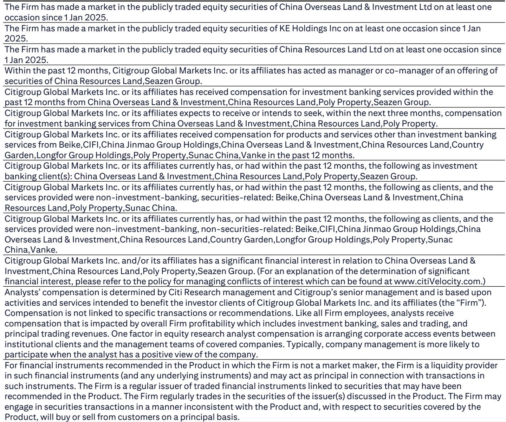
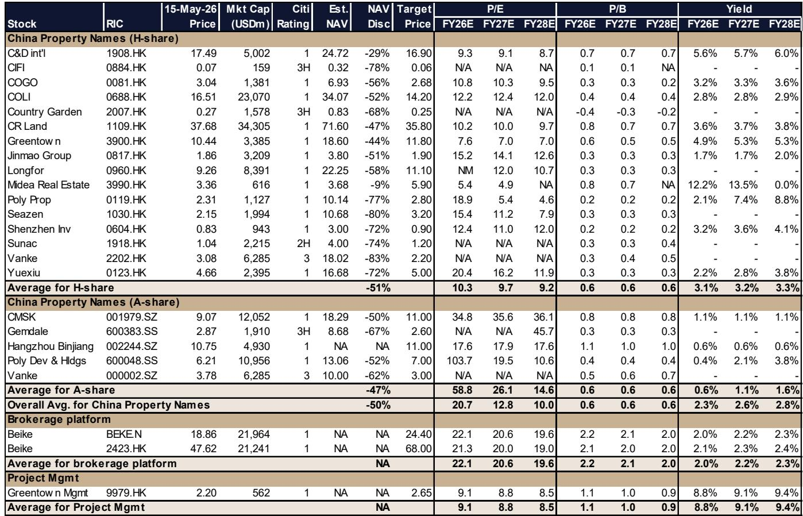
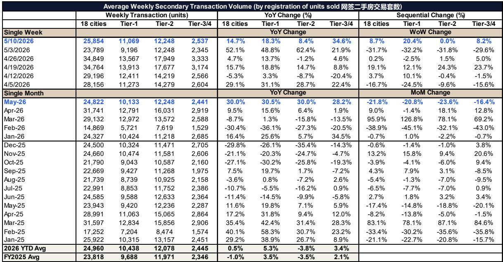

# China's Property Recovery Is Broadening, but the Real Test Lies in Whether Demand Can Outrun a Collapsing Supply Pipeline

The most important signal from China's April real estate data is not the narrowing sales decline, though that is encouraging. It is the simultaneous acceleration in the collapse of new supply. Starts fell 27% year-on-year in April alone, deepening from March's 17% decline. Real estate investment dropped 20%, nearly double the prior month's pace. These figures tell a story of a market that is healing on the demand side while its production engine is seizing up. The tension between these two trajectories will define the next phase of China's property cycle.

For investors who have watched this sector for three years, the pattern is familiar but the inflection point is new. Sales volumes are recovering, secondary market activity is accelerating into May, and price declines are narrowing in the most important cities. Yet the supply pipeline is contracting faster than at any point since the crisis began. This is not a contradiction. It is the mechanism by which a recovery eventually takes hold, but it also introduces risks that the market has not yet fully priced.

The question is no longer whether the market is stabilizing. The question is what kind of stabilization this will be, and which companies are positioned to benefit from it. The report from a global investment bank provides the data to answer that question, but the implications extend far beyond what the numbers show on the surface.

## The Recovery Is Real, but It Remains Narrower Than It Appears

The headline numbers from April are genuinely better than what the market has seen in nearly a year. Residential sales fell only 6% year-on-year, the smallest decline in 11 months. Secondary market volumes in 18 major cities were up 30% year-on-year in the first two weeks of May, accelerating from April's 9% growth. Primary home sales in 34 cities held steady at an 8% year-on-year gain. These are not isolated data points. They represent a pattern of sequential improvement that has been building since early 2026.

What makes this recovery different from previous false dawns is the breadth of the improvement. The recovery is extending from tier-1 cities like Shanghai and Shenzhen into tier-2 cities, supported by industrial upgrades and the wealth effects they generate. It is moving from the secondary market into the primary market, and from luxury projects into mass-market housing. More property firms saw sales growth in the first four months of 2026 than in the first quarter alone, with five major developers now showing positive year-on-year sales compared to just two in the first quarter.

This broadening is critical. A recovery that depends only on the wealthiest cities and the most expensive properties is not sustainable. A recovery that reaches into the mass market, supported by improving household expectations and policy reinforcement, has a much stronger foundation.

But the recovery is not yet broad enough to declare victory. The macro context is mixed. April saw better-than-expected inflation and exports, but retail sales hit their worst level since 2023, fixed asset investment fell nearly 4%, and new bank loans turned negative for only the second time since 2006. Household borrowing appetite remains subdued. The property market is recovering into an economy that is still struggling to generate broad-based momentum.

The so-what for investors is clear: the recovery is real but fragile. It can absorb a near-term correction in share prices, which the report explicitly warns is likely after a 25-30% rally. But it cannot yet absorb a shock to household income expectations or a reversal in policy support.

## The Supply Collapse Is Creating a Structural Bottleneck That Will Reshape Pricing Power

The most underappreciated dynamic in the current data is the accelerating decline in new supply. April starts fell 27% year-on-year, and the year-to-date decline is 22%. Real estate investment dropped 20% in April alone, the steepest monthly decline in over a year. Land sales are collapsing even faster, with CREIS 300-city data showing land sales by GFA down 29% year-on-year in April and land sales value down 40%.

This is not a temporary adjustment. It is a structural shift in the industry's capacity to produce new housing. Developers are not building because they cannot finance construction, because they are focused on deleveraging, and because the demand outlook remains uncertain. But the consequence of this behavior is that the supply of new homes will be constrained for years to come.

The data on completed but unsold inventory is instructive. Total inventory fell 0.5% year-on-year in April, and inventory within three years of completion fell 2.6%. These are small declines, but they represent the first meaningful inventory drawdown since the crisis began. In a market where demand is stabilizing and supply is collapsing, inventory will continue to fall. That process will eventually restore pricing power to developers who still have land and projects to sell.

The critical insight here is that the supply constraint is not evenly distributed. Tier-1 cities are seeing land sales value grow 24% year-on-year in April, even as tier-2 and tier-3 cities see deep declines. The developers who have been accumulating land in the best locations over the past 12 to 18 months will be the primary beneficiaries of this supply squeeze. Those who have been forced to stop buying land will find themselves with nothing to sell when demand returns.

## Policy Is Now Reinforcing the Cycle, Not Rescuing It

The shift in policy posture is subtle but significant. In previous phases of this downturn, local easing measures were reactive, responding to market weakness. The current round of easing, following the April Politburo meeting, is different. Cities like Shenzhen and Guangzhou announced new measures amid signs of market recovery. The policy is now adding momentum to an already improving market, rather than trying to stop a decline.

This distinction matters for investor expectations. When policy is reactive, the market tends to sell into strength because investors fear the policy is a signal of deeper problems. When policy is proactive, reinforcing an existing recovery, the market can sustain its gains because the policy and the fundamentals are aligned.

The report notes that housing provident fund easing is supporting demand, but was not the main driver of the recovery. This is an important nuance. The recovery is being driven by improving household expectations, which have been gradually nurtured by positive news flow since November 2025. Policy is helping, but it is not the primary cause. That means the recovery has more organic support than previous episodes, but it also means that policy alone cannot sustain it if household sentiment deteriorates again.

The question that remains unanswered is how much further policy can go. The report does not address the possibility of direct government purchases of unsold inventory, or more aggressive monetary easing. These tools remain on the table, but their use would signal that the recovery is not yet self-sustaining. Investors should watch for signals that policy is shifting from reinforcement to rescue mode.

## What the Report Does Not Fully Answer: The Sustainability of Demand in the Face of Weak Income Growth

The report provides excellent data on what is happening in the property market, but it does not fully resolve the question of whether the demand recovery can be sustained. The macro data shows that retail sales are weak, household borrowing is subdued, and the broader economy is not generating the income growth that would normally support a housing recovery.

The improvement in sales volumes is real, but it is happening in a context where households are still cautious. The secondary market is leading the recovery, which suggests that buyers are trading up or relocating rather than making new purchases. Primary market sales are improving, but from a very low base.

The critical unknown is whether the recovery in volumes can translate into a recovery in prices. The report shows that primary and secondary prices are stabilizing or edging up in tier-1 cities, and the decline is narrowing in tier-2 and tier-3 cities. But price recovery typically requires sustained volume growth, and that depends on household income expectations.

Investors should ask themselves: is the current recovery a genuine improvement in housing demand, or is it a temporary release of pent-up demand from buyers who have been waiting for prices to bottom? If it is the latter, the recovery could run out of steam once the backlog of buyers is absorbed. If it is the former, the recovery has much further to run.

## A Decision Framework for Investors: Three Dimensions to Evaluate Property Exposure

For investors trying to position for the next phase of China's property cycle, the report suggests a framework based on three dimensions.

First, land position. The developers that will benefit most from this recovery are those that continued to buy land during the downturn. The report explicitly notes that its stock selection focuses on companies with land purchase growth in 2025 and ample resources for 2026. The data supports this: land sales are collapsing nationally, but tier-1 land sales are growing. Developers with land in the best cities will have the inventory to sell when demand returns. Those without land will be spectators.

Second, sales momentum. The number of companies showing positive year-on-year sales growth is increasing, but it is still small. The report identifies five names that achieved sales growth in the first four months of 2026. These companies are demonstrating that they can execute in a difficult market. Investors should prioritize companies that are already showing sales momentum, rather than betting on a turnaround story.

Third, balance sheet resilience. The report does not dwell on this, but it is implicit in the analysis. The companies that can continue to buy land and invest in new projects are those with strong balance sheets. The companies that are being forced to cut investment are those with weak balance sheets. The recovery will reward the strong and punish the weak.

This framework suggests that the recovery is not a rising tide that lifts all boats. It is a selective recovery that will benefit a narrow set of well-positioned developers. The broad market rally in property shares over the past two weeks may have overshot the fundamentals for some companies. A correction is likely, as the report warns, but that correction will create opportunities for investors who can distinguish between the companies that are genuinely benefiting from the recovery and those that are simply riding the sentiment wave.

## The Unresolved Analytical Question That Should Drive Further Research

The most important question that this report raises but does not fully answer is this: if supply is collapsing and demand is recovering, why are prices not rising more quickly? The answer lies in the distinction between the headline national data and the reality in the most important cities.

Nationally, prices are still declining, albeit at a slower pace. The recovery is concentrated in tier-1 and some tier-2 cities. In tier-3 and tier-4 cities, the downturn continues. The national data is an average of very different local conditions. Investors who focus only on the national numbers will miss the recovery that is happening in the best markets. But investors who focus only on the best markets will miss the risk that the recovery remains too narrow to be self-sustaining.

The second unresolved question is about the role of the secondary market. The recovery is being led by secondary market volumes, which are growing faster than primary market volumes. This suggests that households are selling existing homes to buy new ones, or that investors are exiting positions. Either way, the secondary market is absorbing demand that might otherwise go to new homes. Until primary market volumes accelerate more significantly, the recovery will remain incomplete.

Join the community to read the full report and review the original charts.

*This article is for learning and discussion only and does not constitute investment advice.*

Personal reading notes and learning share only. Not investment advice.

