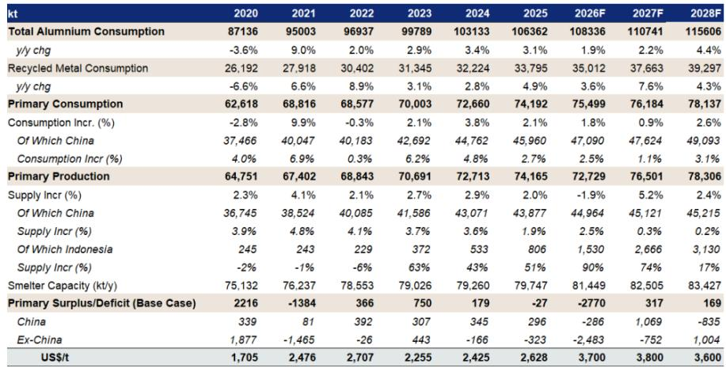
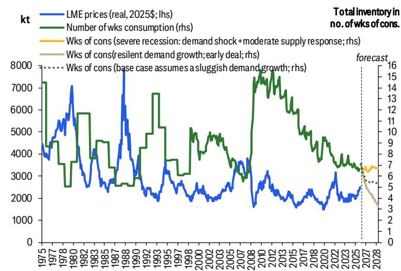

# 铝市场最被低估的不是需求，而是供给侧的不可逆重置

过去两个月，全球铝市场经历了一场罕见的供给冲击。某外资投行最新发布的研报用了一个罕见的表述：这是现代铝市场历史上最大的供给冲击之一，上一次可以追溯到1970年代的能源危机。但真正值得关注的，不是冲击本身有多大，而是冲击之后市场结构发生了什么变化。

这份报告的核心判断是：即使中东地缘冲突不再进一步升级，全球铝市场也已经进入了一个结构性更紧的库存制度。这不是一个短期价格波动的故事，而是一个供给弹性系统性下降、传统市场自我修复机制失效、库存缓冲带正在被逐层消耗的故事。报告认为，即便在需求疲软的假设下，未来6-12个月铝库存仍将刷新55年历史低点，2026年下半年均价有望达到每吨4000美元。

为什么这个判断值得认真对待？因为铝市场的供需失衡逻辑与过去二十年完全不同。这不是一个需求驱动的牛市，而是一个供给侧的不可逆重置。

## 1. 供给冲击的规模已经超过了市场定价所反映的程度

中东冲突导致的产量损失并不是一个短期扰动。报告数据显示，超过300万吨的年化产量损失已经嵌入到最新的产量预测中，而恢复路径本身高度不确定——取决于冲突持续时间、基础设施修复时间表、物流正常化以及原材料补库周期。市场不太可能看到区域供给的V型复苏。

更关键的是，整个铝系统的供给弹性已经大幅下降。中国在经历了多年的供给侧改革后，有效产能天花板已经形成。数据显示，中国铝行业闲置产能占总产能的比例已从2010年代的35%-47%下降至目前的约5%，预计到2028年将进一步降至3%以下。这意味着，当价格上升时，中国不再有能力像过去那样快速重启或增加大量供给。

在产能天花板之外，印尼虽然是非中国地区少数能够提供增量供给的地区，但报告明确指出，其扩张节奏和时机仍面临执行和爬坡风险。换句话说，全球铝供给端已经没有“备胎”了。

这个判断的含义是：铝市场的供给约束不是周期性的，而是结构性的。即使地缘冲突缓和，供给恢复也需要时间，而在这段时间内，库存将持续消耗。

## 2. 需求端不需要强劲增长，市场已经注定持续短缺

报告最反直觉的判断之一是：铝市场已经不再需要强劲的需求增长来维持结构性紧张。在报告的基本假设下，即使需求增长疲软，2026年仍将出现约270万吨的供需缺口。

为什么？因为供给冲击的规模已经足够大，而需求端即便温和增长也会产生持续赤字。报告做了一个极端情景测试：只有类似沃尔克时代或2008-09年全球金融危机级别的严重衰退，才足以稳定铝库存覆盖率。但即使在这种极端假设下，库存也只是“大致稳定”而非“有意义地重建”。

这与历史经验形成了鲜明对比。过去，严重衰退通常能够重建铝库存——因为在需求萎缩的同时，低价和利润压缩也会迫使生产商削减产量。但当前的市场不同：供给端已经因为地缘冲突遭受了大规模损失，即使需求大幅萎缩，也无法像过去那样产生有意义的库存重建。

这个判断的含义是：传统上用于判断铝价顶部的“需求衰退”框架已经失效。市场现在需要的不是“需求弱一点”，而是“需求崩盘”才能让库存不再进一步收紧。这个门槛比历史上任何时期都要高。

## 3. 需求结构的变化让铝变得比过去更抗周期

铝需求结构正在发生一个被广泛忽视的变化。报告指出，当前铝需求增长中，有很大一部分来自电网、可再生能源基础设施和电气化供应链。这些领域的需求具有更强的政策支撑，对经济周期波动的敏感度低于传统的工业需求。

以中国为例，报告中的数据显示，能源转型相关需求已接近中国铝总需求的四分之一。这种结构性变化意味着，铝需求的下行弹性可能比过去任何衰退时期都要低。换句话说，即使经济放缓，铝需求也不会像过去那样大幅下滑。

报告还特别指出，当前铜铝比仍处于历史高位，这继续支持铝对铜的替代。同时，石化原料成本也处于结构性高位，使得塑料替代铝的成本优势减弱。这些相对价格因素进一步强化了铝需求的下行刚性。

这个判断的含义是：铝市场的供需平衡可能比市场认为的更加脆弱。需求端不像过去那样容易在衰退中“消失”，而供给端已经失去了快速响应能力。两者叠加，意味着库存消耗的速度可能比模型预测的更快。

## 4. 库存消耗的机制决定了价格上行的非线性特征

报告对库存消耗机制的分析值得认真阅读。核心逻辑是：持续的供需赤字不会停留在理论层面。如果消费超过生产，不平衡必须通过库存消耗来吸收。但这个过程不是线性的。

一开始，库存可以通过隐性库存、融资库存、贸易商库存和管道库存来吸收赤字。因此，收紧周期往往波动剧烈、令人沮丧，更多受宏观因素驱动而非立即爆发。但随着时间推移，库存消耗会改变市场结构——缓冲带缩小，与融资和套利交易相关的嵌入式空头头寸被迫平仓。

这种收紧不需要持续的投机性多头积累。随着缓冲带缩小和套利头寸平仓，即使没有新的多头头寸，市场也会变得更加脆弱。在这种条件下，相对较小的短缺就能产生不成比例的非线性价格响应。

报告将此定义为铝价的上行凸性——即使宏观不确定性存在，铝价的下行空间也越来越有限。除非出现严重衰退，否则下行本身是自我限制的。

这个判断的含义是：铝价的上行路径可能不是渐进式的，而是阶段性的爆发。当库存缓冲带被消耗到某个临界点，市场结构的变化会触发价格快速重定价。

## 5. 报告尚未完全回答的关键问题：需求韧性能否持续验证

尽管报告的框架逻辑严密，但仍有一个关键假设尚未得到充分验证：能源转型需求在真正的经济衰退中究竟能表现出多大的韧性。

报告用中国需求结构的变化来论证铝需求的下行弹性降低，但中国本身的经济周期和政策节奏具有独特性。如果全球经济进入同步衰退，政策支持的力度和持续性是否会受到财政空间的制约？能源转型投资是否会在企业利润普遍承压的背景下被推迟？

此外，报告对“严重衰退”的定义是基于历史经验，但当前全球经济面临的挑战与沃尔克时代或2008年有所不同——通胀粘性、利率高位、地缘政治不确定性叠加，这些因素的组合效应可能产生不同于历史模式的需求破坏。

另一个未充分展开的问题是：替代效应在铝价达到4000美元甚至更高时会发生什么？报告提到铜铝比和石化成本支撑了铝的替代优势，但铝价持续高企是否会反过来刺激新的替代材料研发或生产工艺变革？这些二阶影响在报告的分析框架中尚未被充分讨论。

## 6. 投资者的观察框架：从需求预测转向库存监测

基于报告的框架，投资者可能需要重新思考铝市场的观察框架。传统的需求预测已经不再是判断铝价方向的核心变量。更重要的是以下三个指标：

第一，库存绝对水平和库存覆盖率的变化趋势。报告明确指出，库存消耗是推动价格非线性的核心机制。投资者应密切关注显性库存和隐性库存的变化，尤其是融资库存和贸易商库存的消耗速度。

第二，供给恢复的实际进展。中东产能恢复的时间表和实际产出数据比任何需求预测都更重要。如果恢复慢于预期，那么即使需求疲软，市场仍将保持紧张。

第三，中国的产能天花板是否会被突破。报告假设中国产能天花板牢固，但这是基于当前政策框架的推断。如果铝价持续高企，政策是否会调整？这是市场的一个尾部风险，也是报告没有完全回答的问题。

对于产业决策者而言，这个框架意味着：即便对未来需求持悲观态度，也不应轻易看空铝价。供给侧的约束已经将市场推入了一个新的制度区间，传统的“需求弱则价格弱”的线性思维可能不再适用。

---

这份报告的完整版本包含了更多细节，包括不同情景下的供需模型、库存覆盖率的历史对比、以及具体的交易策略建议。但最值得反复阅读的部分，是报告对库存消耗机制和价格非线性响应的分析框架。这些内容在摘要中只能触及皮毛，完整阅读才能理解其逻辑的严密性。

欢迎来星球微信群里继续讨论：在当前的宏观环境下，铝市场的供给约束能否持续，还是说需求端最终会给出比报告预期更大的下行惊喜？欢迎分享你的观察和判断。

Personal reading notes and learning share only. Not investment advice.

