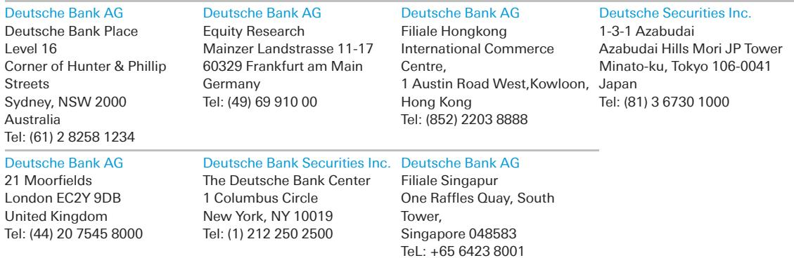
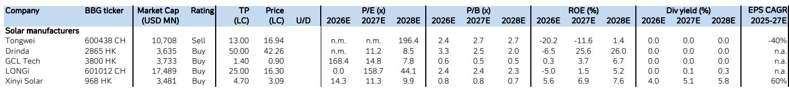

# China’s Solar Sector Is Not Recovering — It Is Restructuring. The Winners Will Look Nothing Like the Losers.

The dominant narrative emerging from the recent Global Solar Conference is not one of a cyclical upturn. It is a story of structural transformation, where the old rules of scale and cost leadership are being replaced by a new calculus of differentiation, financial resilience, and regulatory arbitrage. The Chinese solar industry remains in a weak near-term phase, with first-half 2026 demand proving soft, particularly in the domestic market, and persistent oversupply in polysilicon continuing to suppress pricing. Yet beneath this surface-level gloom, a more nuanced and strategic picture is forming. The companies that will survive — and eventually thrive — are not those waiting for demand to return. They are those actively reshaping their business models to decouple from the commodity cycle.

The conference discussions, spanning five major Chinese solar companies from LONGi to Daqo, reveal a sector that has passed the point of denial. Management teams broadly acknowledge that the industry is in a painful but necessary consolidation phase. The critical insight for investors is that the recovery, when it comes, will not lift all boats equally. A bifurcation is underway. Integrated module producers with technology moats and diversified revenue streams are positioning to capture value from the downstream. Upstream polysilicon players, by contrast, are trapped in a margin compression spiral that only policy intervention or mass capacity closure can resolve. The market is pricing in a vague recovery. The data suggests a far more selective outcome.

## The Demand Picture Is Worse Than Headlines Suggest, But That Is Not the Real Story

The headline demand numbers are sobering. LONGi expects global solar demand in 2026 to decline year-on-year, with China — the largest market — potentially falling to 200-250 gigawatts from 317 gigawatts in 2025. This is not a minor adjustment. It represents a drop of 20-35 percent in the world’s most important solar market. The reasons cited are structural, not cyclical: grid integration constraints and the administrative pause as provinces set their 15th Five-Year Plan targets. European demand is expected to be flat to slightly negative. Only emerging markets like India and Africa are showing continued momentum.

This demand weakness matters, but it is not the primary analytical variable. The more important question is how companies are responding to a market that is no longer growing fast enough to absorb their capacity. The answer, across the conference discussions, is that companies are shifting from volume-driven strategies to margin-protection strategies. JinkoSolar explicitly noted that the industry is moving away from destructive, loss-making pricing practices and that competition is shifting toward technology, product quality, and efficiency. This is not a recovery in demand. It is a recovery in pricing discipline, driven by exhaustion and regulatory pressure.

The implication for investors is clear: do not wait for demand to inflect. The inflection point that matters is the shift in competitive behavior. That shift is already underway, but it is uneven. Companies with differentiated products and healthier balance sheets are leading it. Those without are still bleeding.

## Polysilicon Remains the Sector’s Achilles’ Heel, and Policy Is the Only Credible Cure

The polysilicon segment remains the most distressed part of the value chain, and the conference discussions confirm that no quick fix is in sight. Daqo’s management believes prices bottomed in April and may recover to RMB 40-50 per kilogram in the second half of 2026, but only if government price guidance and regulation are enforced. The current spot price sits in the mid-to-high RMB 30 range, which is below the cash cost of many producers. Daqo itself is carrying 50-60 thousand tonnes of inventory — roughly four months of supply — which is consistent with the industry average of four to five months. This is not a market clearing. It is a market in suspended animation.

GCL Technology, which has a cost advantage through its granular silicon process, is more sanguine but still waiting for policy clarity. The company’s unit cash cost of RMB 24 per kilogram gives it a meaningful buffer over rod silicon producers, but even GCL is diversifying into cathode materials and silicon-carbon anode production. The message is unmistakable: even the low-cost leader in polysilicon does not see a sustainable future in staying purely upstream.

The analytical challenge here is that the policy lever is both the most promising and the most unpredictable path to recovery. Stricter energy efficiency standards could accelerate the phase-out of small and inefficient capacities. Stronger enforcement of price laws could support market prices. But these are political decisions, not market outcomes. Investors must therefore treat any recovery in polysilicon as a policy-driven event with binary risk, not a natural cyclical rebound. The companies that survive this segment will be those with the strongest balance sheets and the lowest cost positions — not those with the most ambitious expansion plans.

## Differentiation Is Not a Luxury — It Is the Only Viable Strategy for the Next Cycle

The most striking theme from the conference is the breadth and ambition of differentiation strategies across the sector. This is not a case of a few niche players experimenting with new technologies. It is a systemic response to the collapse of the commodity model. LONGi is betting heavily on its back-contact (BC) technology, aiming to achieve 670-680 watt modules in the second half of 2026 and maintaining a 10 percent price premium over TopCon. The company expects BC products to account for over 55 percent of its 80-gigawatt module shipment target. This is not incremental improvement. It is a bet that technology leadership can restore pricing power in a market that has forgotten what pricing power looks like.

Equally significant is LONGi’s entry into the energy storage system market in early 2026, with a target of 6 gigawatt-hours of shipments this year. The company sees China’s ESS installation demand growing over 50 percent year-on-year, following a 74 percent increase in 2025. This is a strategic hedge, but it is also a logical extension of the solar value chain. As grid constraints become the binding limit on solar deployment, storage becomes the enabler of further growth. Companies that can offer integrated solar-plus-storage solutions are positioning to capture a larger share of the system value, not just the module margin.

Hainan Drinda is pursuing an even more distinctive path, carving out a niche in space solar applications. The company’s expertise in in-orbit testing platforms and its upcoming production of high-end CPI film for space applications represent a complete departure from the mainstream solar market. The average selling price for these products is expected to be meaningfully higher than mainstream CPI films. This is high-risk, high-reward differentiation, but it reflects a clear strategic logic: if the terrestrial solar market is a race to the bottom, the space solar market is a race to the top.

The so-what for investors is that the era of undifferentiated solar investing is over. The companies that will generate excess returns in the next cycle are those that can demonstrate a clear technological or business model moat. The valuation multiples in the sector do not yet fully reflect this bifurcation. They will.

## The Full Report Does Not Fully Answer How to Value a Post-Commodity Solar Company

Despite the richness of the conference discussions, a critical analytical gap remains. The report provides earnings estimates and valuation multiples for the covered companies, but it does not fully address how to value a solar company that is successfully transitioning away from a pure commodity model. LONGi, for example, is simultaneously a module manufacturer, a BC technology leader, and a nascent energy storage player. How should an investor weight these different revenue streams? What multiple should be applied to the storage business versus the module business? The report’s valuation framework implicitly treats LONGi as an integrated module producer, but the company is clearly trying to become something more complex.

Similarly, Hainan Drinda’s space solar business is a small fraction of its current revenue, but it has the potential to be a high-margin, high-growth segment that fundamentally changes the company’s risk profile. The report acknowledges this opportunity but does not provide a framework for sizing its impact on valuation. This is not a criticism of the report — it is a reflection of the market’s collective uncertainty. The solar sector is in the midst of a structural transformation, and the valuation models have not yet caught up.

The open question for investors is whether the market will eventually reward diversification and differentiation with higher multiples, or whether the legacy commodity exposure will continue to drag on valuations. The answer will depend on execution, and execution in this environment is exceptionally difficult. Companies are being asked to simultaneously manage a downturn in their core business, invest in new technologies, and maintain financial discipline. The ones that succeed will deserve a premium. The ones that fail will be acquired or disappear.

## A Decision Framework for Navigating the Solar Restructuring

For investors trying to make sense of this landscape, a simple framework can help separate the likely winners from the likely losers. The framework rests on three dimensions: financial resilience, technology differentiation, and revenue diversification.

Financial resilience is the first filter. The solar downturn has exposed the vulnerability of highly leveraged companies with thin margins. Tongwei, which the report rates as a Sell, is cited as vulnerable to plunging polysilicon prices given its high inventory levels and leveraged balance sheet. By contrast, Daqo explicitly states its commitment to maintaining a strong balance sheet and its willingness to consider share buybacks. In a downturn, cash is strategy. Companies that can weather the storm without diluting shareholders or selling assets at distressed prices will emerge stronger.

Technology differentiation is the second filter. The report provides clear evidence that the market is beginning to reward technological leadership. LONGi’s BC products command a premium. JinkoSolar’s high-power output products fetch USD 0.12-0.15 per watt versus USD 0.11 for standard modules. The gap is small in absolute terms, but in an industry where margins are measured in pennies, a 10-30 percent price premium is transformative. Companies without a credible technology edge will be forced to compete on price in a market where prices are already below cost for many players.

Revenue diversification is the third filter. LONGi’s entry into energy storage, GCL’s expansion into battery materials, and Drinda’s space solar pivot all represent attempts to reduce dependence on a single value chain segment. Diversification does not guarantee success, but it does reduce the binary risk of a prolonged downturn in the core solar market. Companies with multiple growth vectors are better positioned to absorb shocks and reallocate capital to the highest-return opportunities.

Applying this framework, the most attractive investment candidates are those that score well on all three dimensions: strong balance sheets, proprietary technology, and a clear diversification strategy. The least attractive are those that score poorly on financial resilience and lack a credible differentiation story. The market is still pricing many solar stocks as if the old commodity model will return. It will not.

## Join the Community to Read the Full Report and Review the Original Charts

The conference discussions reveal a sector in transition, but the raw data — the pricing charts, the valuation tables, the detailed management commentary — tells an even richer story. The full report includes detailed spot price histories for polysilicon, wafers, cells, and modules, as well as a comprehensive valuation comparison across the covered companies. These charts are essential for understanding the trajectory of the downturn and the potential timing of the recovery. They also provide the quantitative foundation for the qualitative arguments made in this article. To access the full analysis and the original charts, join the community. The data is too important to leave to summary alone.

*This article is for learning and discussion only and does not constitute investment advice.*

Personal reading notes and learning share only. Not investment advice.

