Global

Autos

Auto Manufacturing

Industry

# New Energy Vehicle

Date

19 May 2026

Industry Update

# Top 15 countries' new energy vehicle sales volume tracker - March 2026

This monthly chartbook tracks the sales trends of new energy vehicles (NEV) in the top 15 global markets (G15).

This report tracks new NEV car sales in the top 15 NEV markets globally, including pure electric vehicles (EV), plug-in hybrid electric vehicles (PHEV) and fuel-cell vehicles (FCV). The 15 countries tracked account for about 90% of global NEV sales, including 12 major countries (China, US, Japan, India, Germany, France, Brazil, UK, South Korea, Canada, Italy and Thailand) and 3 Nordic countries (Norway, Sweden, Finland).

Tim Rokossa

Head of Research

Christoph Laskawi

Research Analyst

Nicolai Kempf

Research Analyst

Edison Yu

Research Analyst

Nikita Papaccio

Research Analyst

Winnie Dong

Research Analyst

Laura Li

Research Associate

James Mulholland, CFA

Research Associate

Bin Wang

Research Analyst

Wei Huang

Research Associate

Mira Wiegratz

Research Associate

Figure 1: G15 NEV Sales by Country 

<table><tr><td colspan="6">G15 NEV Sales by Country</td></tr><tr><td>(unit)</td><td>Mar-26</td><td>YoY</td><td>MoM</td><td>3M 2026</td><td>YoY</td></tr><tr><td>G15 Subtotal</td><td>1,768,970</td><td>8.0%</td><td>62.8%</td><td>4,107,085</td><td>2.3%</td></tr><tr><td>Brazil</td><td>22,190</td><td>159.2%</td><td>55.3%</td><td>50,364</td><td>115.3%</td></tr><tr><td>Canada</td><td>13,496</td><td>44.4%</td><td>55.4%</td><td>27,530</td><td>9.1%</td></tr><tr><td>China</td><td>1,161,247</td><td>1.6%</td><td>60.9%</td><td>2,761,545</td><td>-3.6%</td></tr><tr><td>Finland</td><td>4,199</td><td>14.6%</td><td>40.9%</td><td>10,457</td><td>14.6%</td></tr><tr><td>France</td><td>61,281</td><td>51.9%</td><td>43.8%</td><td>141,994</td><td>40.0%</td></tr><tr><td>Germany</td><td>98,150</td><td>42.8%</td><td>42.2%</td><td>230,070</td><td>30.7%</td></tr><tr><td>India</td><td>24,099</td><td>68.8%</td><td>49.4%</td><td>60,217</td><td>63.0%</td></tr><tr><td>Italy</td><td>32,699</td><td>84.8%</td><td>26.8%</td><td>79,979</td><td>84.8%</td></tr><tr><td>Japan</td><td>17,959</td><td>79.4%</td><td>50.8%</td><td>40,671</td><td>52.7%</td></tr><tr><td>Korea</td><td>44,035</td><td>115.5%</td><td>27.3%</td><td>91,313</td><td>130.9%</td></tr><tr><td>Norway</td><td>17,532</td><td>41.4%</td><td>144.4%</td><td>26,806</td><td>-10.8%</td></tr><tr><td>Sweden</td><td>17,810</td><td>19.0%</td><td>37.7%</td><td>40,986</td><td>9.7%</td></tr><tr><td>Thailand</td><td>11,262</td><td>14.9%</td><td>94.0%</td><td>61,174</td><td>109.0%</td></tr><tr><td>UK</td><td>142,320</td><td>30.7%</td><td>309.0%</td><td>227,833</td><td>25.2%</td></tr><tr><td>USA</td><td>100,691</td><td>-35.5%</td><td>29.4%</td><td>256,146</td><td>-34.3%</td></tr></table>

Source : Marklines, DB

Figure 2: G15 NEV Penetration Rate by Country 

<table><tr><td colspan="6">G15 NEV Penetration by Country</td></tr><tr><td>(unit)</td><td>Mar-26</td><td>Feb-26</td><td>Mar-25</td><td>YoY</td><td>MoM</td></tr><tr><td>G15 Average</td><td>24.3%</td><td>21.2%</td><td>22.7%</td><td>1.6%</td><td>3.1%</td></tr><tr><td>Brazil</td><td>8.2%</td><td>7.7%</td><td>4.4%</td><td>3.9%</td><td>0.5%</td></tr><tr><td>Canada</td><td>7.5%</td><td>7.2%</td><td>5.0%</td><td>2.5%</td><td>0.3%</td></tr><tr><td>China</td><td>40.1%</td><td>40.0%</td><td>39.2%</td><td>0.8%</td><td>0.1%</td></tr><tr><td>Finland</td><td>52.8%</td><td>50.5%</td><td>49.2%</td><td>3.6%</td><td>2.3%</td></tr><tr><td>France</td><td>28.7%</td><td>27.8%</td><td>21.2%</td><td>7.5%</td><td>0.9%</td></tr><tr><td>Germany</td><td>30.7%</td><td>29.8%</td><td>24.6%</td><td>6.1%</td><td>0.9%</td></tr><tr><td>India</td><td>4.3%</td><td>3.1%</td><td>3.0%</td><td>1.3%</td><td>1.2%</td></tr><tr><td>Italy</td><td>16.1%</td><td>15.0%</td><td>9.3%</td><td>6.8%</td><td>1.2%</td></tr><tr><td>Japan</td><td>3.7%</td><td>3.0%</td><td>2.0%</td><td>1.7%</td><td>0.6%</td></tr><tr><td>Korea</td><td>26.7%</td><td>28.1%</td><td>13.7%</td><td>13.1%</td><td>-1.4%</td></tr><tr><td>Norway</td><td>85.8%</td><td>75.9%</td><td>73.0%</td><td>12.8%</td><td>9.9%</td></tr><tr><td>Sweden</td><td>57.2%</td><td>57.1%</td><td>54.0%</td><td>3.2%</td><td>0.1%</td></tr><tr><td>Thailand</td><td>18.1%</td><td>11.4%</td><td>17.6%</td><td>0.5%</td><td>6.7%</td></tr><tr><td>UK</td><td>32.9%</td><td>33.0%</td><td>26.6%</td><td>6.3%</td><td>-0.1%</td></tr><tr><td>USA</td><td>7.0%</td><td>6.4%</td><td>9.6%</td><td>-2.5%</td><td>0.6%</td></tr></table>

Source : Marklines, DB

Figure 3: G15 NEV Sales Trend   
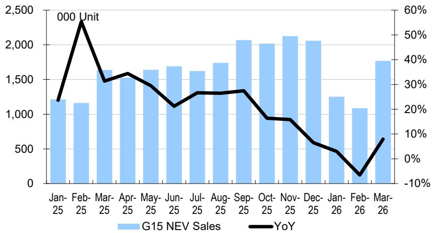

bar_line

| Month   | G15 NEV Sales | YoY   |
|---------|---------------|-------|
| Jan-25  | 1200          | 25%   |
| Feb-25  | 1150          | 60%   |
| Mar-25  | 1600          | 35%   |
| Apr-25  | 1650          | 40%   |
| May-25  | 1600          | 30%   |
| Jun-25  | 1700          | 20%   |
| Jul-25  | 1650          | 30%   |
| Aug-25  | 1750          | 35%   |
| Sep-25  | 2050          | 40%   |
| Oct-25  | 2000          | 20%   |
| Nov-25  | 2100          | 15%   |
| Dec-25  | 2050          | 10%   |
| Jan-26  | 1250          | 5%    |
| Feb-26  | 1100          | -10%  |
| Mar-26  | 1800          | 10%   |

Source : Marklines, DB

Figure 4: G15 NEV Penetration Rate Trend   
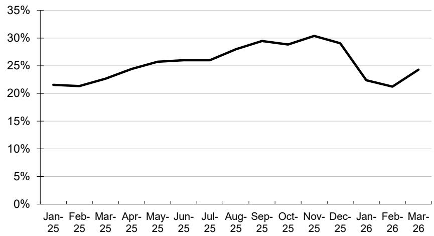

line

| Month | Value (%) |
|---|---|
| Jan-25 | 21.5 |
| Feb-25 | 21.3 |
| Mar-25 | 22.8 |
| Apr-25 | 24.5 |
| May-25 | 25.7 |
| Jun-25 | 26.0 |
| Jul-25 | 26.0 |
| Aug-25 | 28.0 |
| Sep-25 | 29.5 |
| Oct-25 | 28.8 |
| Nov-25 | 30.5 |
| Dec-25 | 29.0 |
| Jan-26 | 22.3 |
| Feb-26 | 21.0 |
| Mar-26 | 24.5 |

Source : Marklines, DB

Figure 5: G15 NEV Sales by Segment 

<table><tr><td colspan="6">G15 NEV Sales by Segment</td></tr><tr><td>(unit)</td><td>Mar-26</td><td>YoY</td><td>MoM</td><td>3M 2026</td><td>YoY</td></tr><tr><td>G15 NEV Sales</td><td>1,768,970</td><td>8.0%</td><td>62.8%</td><td>4,107,085</td><td>2.3%</td></tr><tr><td>EV</td><td>1,206,057</td><td>12.7%</td><td>66.1%</td><td>2,755,740</td><td>7.1%</td></tr><tr><td>Mini Sedan (A)</td><td>103,596</td><td>-33.1%</td><td>39.1%</td><td>239,923</td><td>-40.8%</td></tr><tr><td>Small Sedan (B)</td><td>108,776</td><td>54.9%</td><td>52.1%</td><td>268,908</td><td>46.8%</td></tr><tr><td>Medium Sedan (C)</td><td>68,286</td><td>65.0%</td><td>71.7%</td><td>163,724</td><td>63.5%</td></tr><tr><td>Large Sedan (D)</td><td>180,588</td><td>-21.8%</td><td>122.7%</td><td>367,049</td><td>-30.5%</td></tr><tr><td>Ultra-large Sedan (E)</td><td>22,339</td><td>-16.6%</td><td>30.5%</td><td>58,070</td><td>-17.2%</td></tr><tr><td>Full-size Sedan (F)</td><td>1,074</td><td>-28.8%</td><td>31.3%</td><td>2,792</td><td>-25.6%</td></tr><tr><td>MPV</td><td>18,869</td><td>-22.3%</td><td>25.0%</td><td>51,794</td><td>-5.9%</td></tr><tr><td>Pickup</td><td>6,081</td><td>-35.0%</td><td>47.4%</td><td>13,997</td><td>-36.9%</td></tr><tr><td>Mini SUV (SUV-A)</td><td>5,492</td><td>40.8%</td><td>77.6%</td><td>12,131</td><td>53.7%</td></tr><tr><td>Small SUV (SUV-B)</td><td>35,952</td><td>91.0%</td><td>108.3%</td><td>72,165</td><td>61.0%</td></tr><tr><td>Medium SUV (SUV-C)</td><td>183,974</td><td>10.6%</td><td>72.8%</td><td>414,147</td><td>9.1%</td></tr><tr><td>Large SUV (SUV-D)</td><td>391,331</td><td>45.3%</td><td>64.8%</td><td>888,994</td><td>37.7%</td></tr><tr><td>Ultra-large SUV (SUV-E)</td><td>35,181</td><td>61.2%</td><td>34.3%</td><td>93,060</td><td>62.5%</td></tr><tr><td>Other</td><td>44,518</td><td>45.3%</td><td>39.9%</td><td>108,986</td><td>54.7%</td></tr><tr><td>PHEV</td><td>561,738</td><td>-1.1%</td><td>56.2%</td><td>1,349,445</td><td>-6.4%</td></tr><tr><td>Mini Sedan (A)</td><td>0</td><td></td><td></td><td>0</td><td></td></tr><tr><td>Small Sedan (B)</td><td>0</td><td></td><td></td><td>0</td><td></td></tr><tr><td>Medium Sedan (C)</td><td>10,975</td><td>-5.8%</td><td>26.1%</td><td>29,053</td><td>19.8%</td></tr><tr><td>Large Sedan (D)</td><td>83,280</td><td>-29.2%</td><td>23.5%</td><td>231,462</td><td>-19.3%</td></tr><tr><td>Ultra-large Sedan (E)</td><td>9,995</td><td>-47.1%</td><td>8.9%</td><td>25,930</td><td>-54.8%</td></tr><tr><td>Full-size Sedan (F)</td><td>2,184</td><td>12.1%</td><td>31.5%</td><td>6,754</td><td>38.6%</td></tr><tr><td>MPV</td><td>31,327</td><td>8.4%</td><td>63.8%</td><td>75,735</td><td>-11.7%</td></tr><tr><td>Pickup</td><td>0</td><td></td><td></td><td>5</td><td></td></tr><tr><td>Mini SUV (SUV-A)</td><td>0</td><td></td><td></td><td>0</td><td></td></tr><tr><td>Small SUV (SUV-B)</td><td>3,102</td><td>756.9%</td><td>123.6%</td><td>4,707</td><td>681.9%</td></tr><tr><td>Medium SUV (SUV-C)</td><td>90,461</td><td>41.2%</td><td>91.6%</td><td>182,473</td><td>16.6%</td></tr><tr><td>Large SUV (SUV-D)</td><td>271,408</td><td>-4.7%</td><td>60.4%</td><td>653,506</td><td>-10.3%</td></tr><tr><td>Ultra-large SUV (SUV-E)</td><td>52,299</td><td>46.5%</td><td>63.0%</td><td>126,411</td><td>41.6%</td></tr><tr><td>Other</td><td>6,707</td><td>67.4%</td><td>86.0%</td><td>13,409</td><td>66.2%</td></tr><tr><td>FCV</td><td>1,175</td><td>157.1%</td><td>123.8%</td><td>1,900</td><td>105.0%</td></tr></table>

Source : Marklines, DB

Figure 7: G15 Top 10 EV Models 

<table><tr><td colspan="5">Pure Electric Vehicle (EV)</td></tr><tr><td>Rank</td><td>OEM</td><td>Brand</td><td>Model</td><td>Volume</td></tr><tr><td>1</td><td>Tesla</td><td>Tesla</td><td>Model Y EV</td><td>119,439</td></tr><tr><td>2</td><td>Tesla</td><td>Tesla</td><td>Model 3 EV</td><td>59,002</td></tr><tr><td>3</td><td>Geely</td><td>Geely</td><td>Xingyuan EV</td><td>42,625</td></tr><tr><td>4</td><td>BYD</td><td>BYD</td><td>Seagull EV</td><td>30,636</td></tr><tr><td>5</td><td>BYD</td><td>BYD</td><td>Dolphin EV</td><td>29,329</td></tr><tr><td>6</td><td>Li Auto</td><td>Li Auto</td><td>Li i6 EV</td><td>24,198</td></tr><tr><td>7</td><td>BYD</td><td>BYD</td><td>Yuan UP EV</td><td>20,899</td></tr><tr><td>8</td><td>NIO</td><td>NIO</td><td>NIO ES8 EV</td><td>16,256</td></tr><tr><td>9</td><td>SAIC</td><td>MG</td><td>MG 4/ MG MULAN EV</td><td>15,236</td></tr><tr><td>10</td><td>Leapmotor</td><td>Leapmotor</td><td>T03 EV</td><td>14,975</td></tr></table>

Source : Marklines, DB

Figure 6: G15 NEV Sales by OEM 

<table><tr><td colspan="6">G15 NEV Sales by OEM</td></tr><tr><td>(unit)</td><td>Mar-26</td><td>YoY</td><td>MoM</td><td>3M 2026</td><td>YoY</td></tr><tr><td>G15 NEV Sales</td><td>1,768,970</td><td>8.0%</td><td>62.8%</td><td>4,107,085</td><td>2.3%</td></tr><tr><td>BYD</td><td>341,976</td><td>-13.2%</td><td>61.4%</td><td>795,378</td><td>-23.3%</td></tr><tr><td>Tesla</td><td>184,854</td><td>22.1%</td><td>70.6%</td><td>407,558</td><td>17.9%</td></tr><tr><td>Geely</td><td>143,403</td><td>7.9%</td><td>13.2%</td><td>403,716</td><td>9.6%</td></tr><tr><td>VW</td><td>99,918</td><td>1.9%</td><td>65.9%</td><td>219,984</td><td>1.2%</td></tr><tr><td>Chery</td><td>82,867</td><td>44.5%</td><td>94.0%</td><td>190,757</td><td>23.1%</td></tr><tr><td>Chang&#x27;an</td><td>78,662</td><td>2.4%</td><td>127.0%</td><td>144,398</td><td>-18.2%</td></tr><tr><td>GM (Include. Wuling)</td><td>63,941</td><td>-34.4%</td><td>37.4%</td><td>157,364</td><td>-28.3%</td></tr><tr><td>Leapmotor</td><td>59,949</td><td>57.3%</td><td>69.5%</td><td>130,744</td><td>45.8%</td></tr><tr><td>Hyundai-Kia</td><td>59,574</td><td>32.2%</td><td>42.0%</td><td>128,138</td><td>27.1%</td></tr><tr><td>SAIC</td><td>55,855</td><td>77.6%</td><td>76.7%</td><td>134,410</td><td>109.2%</td></tr><tr><td>BMW</td><td>49,425</td><td>1.1%</td><td>66.0%</td><td>110,490</td><td>-6.8%</td></tr><tr><td>GAC</td><td>46,324</td><td>61.9%</td><td>235.4%</td><td>89,642</td><td>59.1%</td></tr><tr><td>Toyota</td><td>41,186</td><td>51.0%</td><td>83.1%</td><td>84,064</td><td>47.7%</td></tr><tr><td>Li Auto</td><td>41,053</td><td>11.9%</td><td>55.4%</td><td>95,142</td><td>2.5%</td></tr><tr><td>Dongfeng</td><td>38,724</td><td>48.6%</td><td>90.0%</td><td>86,071</td><td>44.5%</td></tr><tr><td>NIO</td><td>35,513</td><td>135.0%</td><td>70.6%</td><td>83,523</td><td>97.6%</td></tr><tr><td>Stellantis</td><td>35,027</td><td>-15.1%</td><td>29.7%</td><td>88,536</td><td>-3.6%</td></tr><tr><td>XPeng</td><td>29,814</td><td>-12.6%</td><td>77.1%</td><td>67,930</td><td>-29.4%</td></tr><tr><td>Mercedes-Benz</td><td>28,060</td><td>-9.9%</td><td>51.8%</td><td>64,564</td><td>-18.4%</td></tr><tr><td>Renault</td><td>26,065</td><td>55.9%</td><td>93.3%</td><td>57,551</td><td>32.0%</td></tr><tr><td>Volvo Cars</td><td>24,894</td><td>9.8%</td><td>38.0%</td><td>63,679</td><td>25.6%</td></tr><tr><td>Great Wall Motor</td><td>23,426</td><td>-10.7%</td><td>73.4%</td><td>57,596</td><td>-12.2%</td></tr><tr><td>Ford</td><td>22,633</td><td>-8.1%</td><td>79.9%</td><td>47,472</td><td>-6.4%</td></tr><tr><td>Seres - AITO</td><td>22,447</td><td>22.5%</td><td>83.6%</td><td>78,357</td><td>44.8%</td></tr><tr><td>Xiaomi</td><td>21,440</td><td>-26.7%</td><td>5.0%</td><td>80,856</td><td>6.6%</td></tr><tr><td>FAW</td><td>19,242</td><td>70.1%</td><td>105.1%</td><td>40,715</td><td>52.2%</td></tr><tr><td>BAIC</td><td>17,915</td><td>0.1%</td><td>105.1%</td><td>35,736</td><td>8.1%</td></tr><tr><td>Nissan</td><td>15,821</td><td>107.4%</td><td>252.4%</td><td>27,350</td><td>33.3%</td></tr><tr><td>Tata</td><td>14,750</td><td>22.4%</td><td>76.6%</td><td>34,071</td><td>25.6%</td></tr><tr><td>Mahindra &amp; Mahindra</td><td>6,573</td><td>114.7%</td><td>44.9%</td><td>15,758</td><td>229.2%</td></tr><tr><td>Mazda</td><td>6,273</td><td>2.0%</td><td>79.7%</td><td>15,038</td><td>19.0%</td></tr><tr><td>Honda</td><td>5,891</td><td>-39.5%</td><td>21.9%</td><td>12,410</td><td>-50.4%</td></tr><tr><td>Rivian</td><td>4,248</td><td>2.8%</td><td>2.0%</td><td>11,665</td><td>3.1%</td></tr><tr><td>Mitsubishi</td><td>3,627</td><td>14.2%</td><td>40.6%</td><td>8,324</td><td>-5.2%</td></tr><tr><td>Subaru</td><td>2,646</td><td>70.4%</td><td>91.0%</td><td>4,775</td><td>9.8%</td></tr><tr><td>Reach</td><td>2,066</td><td></td><td>133.4%</td><td>4,136</td><td></td></tr><tr><td>Beijing Automobile Works</td><td>2,033</td><td>21.2%</td><td>28.6%</td><td>5,593</td><td>34.6%</td></tr><tr><td>Suzuki</td><td>1,898</td><td>2430.7%</td><td>113.3%</td><td>3,400</td><td>1634.7%</td></tr><tr><td>JAC</td><td>1,886</td><td>20.4%</td><td>56.9%</td><td>6,290</td><td>67.7%</td></tr><tr><td>Yibin Kaiyi</td><td>1,584</td><td>2.2%</td><td>347.5%</td><td>2,458</td><td>-35.4%</td></tr></table>

Source : Marklines, DB

Figure 8: G15 Top 10 PHEV Models 

<table><tr><td colspan="5">Plug-in Hybrid Electric Vehicle (PHEV)</td></tr><tr><td>Rank</td><td>OEM</td><td>Brand</td><td>Model</td><td>Volume</td></tr><tr><td>1</td><td>BYD</td><td>BYD</td><td>Song PLUS PHEV</td><td>27,584</td></tr><tr><td>2</td><td>BYD</td><td>BYD</td><td>Song Pro PHEV</td><td>24,497</td></tr><tr><td>3</td><td>Geely</td><td>Geely Galaxy</td><td>Galaxy Starship 7 PHEV</td><td>19,938</td></tr><tr><td>4</td><td>BYD</td><td>BYD</td><td>Seal 06 PHEV</td><td>16,431</td></tr><tr><td>5</td><td>BYD</td><td>FangChengBao</td><td>Tai 7 PHEV</td><td>15,041</td></tr><tr><td>6</td><td>BYD</td><td>BYD</td><td>Qin PLUS PHEV</td><td>11,425</td></tr><tr><td>7</td><td>Geely</td><td>ZEEKR</td><td>ZEEKR 9X PHEV</td><td>10,191</td></tr><tr><td>8</td><td>BYD</td><td>BYD</td><td>Qin L PHEV</td><td>9,700</td></tr><tr><td>9</td><td>Chery</td><td>Jaecoo</td><td>Jaecoo 7 PHEV</td><td>9,198</td></tr><tr><td>10</td><td>Chery</td><td>Chery</td><td>Tansuo 06 PHEV</td><td>8,921</td></tr></table>

Source : Marklines, DB

# NEV Sales by Country

Figure 9: Brazil Top Models Breakdown 

<table><tr><td colspan="7">Brazil Top Models Breakdown</td></tr><tr><td>(unit)</td><td></td><td>Mar-26</td><td>YoY</td><td>MoM</td><td>3M 2026</td><td>YoY</td></tr><tr><td>Brand</td><td>Model</td><td>22,190</td><td>159.2%</td><td>55.3%</td><td>50,364</td><td>115.3%</td></tr><tr><td>EV</td><td></td><td>14,279</td><td>231.3%</td><td>62.6%</td><td>31,454</td><td>172.5%</td></tr><tr><td>BYD</td><td>Dolphin Mini EV</td><td>7,052</td><td>190.0%</td><td>44.7%</td><td>14,766</td><td>125.3%</td></tr><tr><td>BYD</td><td>Dolphin EV</td><td>1,850</td><td>124.5%</td><td>55.1%</td><td>4,554</td><td>132.3%</td></tr><tr><td>Chery</td><td>OMODA 5 EV</td><td>1,580</td><td></td><td>34.0%</td><td>3,826</td><td></td></tr><tr><td>Geely</td><td>Xingyuan EV</td><td>1,157</td><td></td><td>499.5%</td><td>2,474</td><td></td></tr><tr><td>BYD</td><td>Yuan PLUS / ATTO 3</td><td>881</td><td>244.1%</td><td>61.7%</td><td>1,951</td><td>214.7%</td></tr><tr><td>PHEV</td><td></td><td>7,911</td><td>86.1%</td><td>43.6%</td><td>18,910</td><td>59.6%</td></tr><tr><td>BYD</td><td>Song PLUS PHEV</td><td>5,053</td><td>81.4%</td><td>36.5%</td><td>12,557</td><td>45.2%</td></tr><tr><td>BYD</td><td>BYD King PHEV</td><td>1,273</td><td>-10.8%</td><td>40.4%</td><td>3,020</td><td>-1.2%</td></tr><tr><td colspan="2">Great Wall I Tank 300 PHEV</td><td>906</td><td></td><td>114.2%</td><td>1,692</td><td></td></tr><tr><td>Chery</td><td>Jaecoo J7 PHEV</td><td>659</td><td></td><td>43.9%</td><td>1,593</td><td></td></tr><tr><td>BMW</td><td>3 Series PHEV</td><td>13</td><td>-43.5%</td><td>-7.1%</td><td>37</td><td>-59.8%</td></tr><tr><td>FCV</td><td></td><td>0</td><td></td><td></td><td>0</td><td></td></tr></table>

Source : Marklines, DB

Figure 10: Brazil NEV Sales Trend   
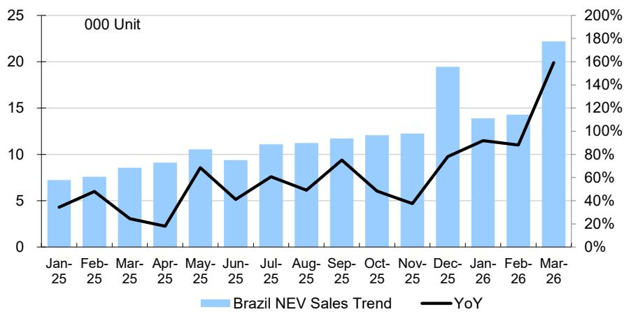

bar_line

| Month   | Brazil NEV Sales Trend | YoY   |
|---------|------------------------|-------|
| Jan-25  | 7                      | 40%   |
| Feb-25  | 7                      | 50%   |
| Mar-25  | 8                      | 30%   |
| Apr-25  | 9                      | 20%   |
| May-25  | 10                     | 80%   |
| Jun-25  | 9                      | 50%   |
| Jul-25  | 11                     | 70%   |
| Aug-25  | 11                     | 60%   |
| Sep-25  | 12                     | 90%   |
| Oct-25  | 12                     | 60%   |
| Nov-25  | 12                     | 40%   |
| Dec-25  | 19                     | 100%  |
| Jan-26  | 14                     | 110%  |
| Feb-26  | 14                     | 100%  |
| Mar-26  | 22                     | 180%  |

Source : Marklines, DB

Figure 11: Brazil NEV Breakdown   
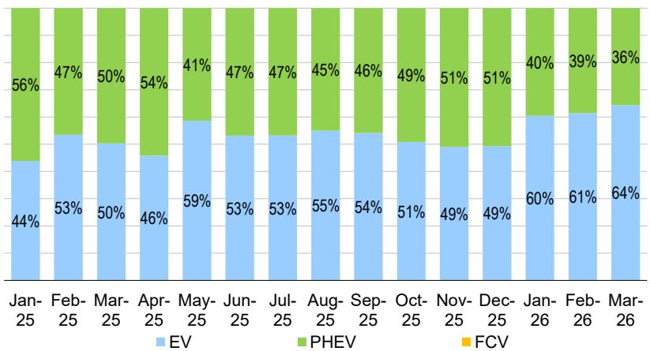

bar_stacked

| Month | EV (%) | PHEV (%) | FCV (%) |
| :--- | :--- | :--- | :--- |
| Jan-25 | 44 | 56 | 0 |
| Feb-25 | 53 | 47 | 0 |
| Mar-25 | 50 | 50 | 0 |
| Apr-25 | 46 | 54 | 0 |
| May-25 | 59 | 41 | 0 |
| Jun-25 | 53 | 47 | 0 |
| Jul-25 | 53 | 47 | 0 |
| Aug-25 | 55 | 45 | 0 |
| Sep-25 | 54 | 46 | 0 |
| Oct-25 | 51 | 49 | 0 |
| Nov-25 | 49 | 51 | 0 |
| Dec-25 | 49 | 51 | 0 |
| Jan-26 | 60 | 40 | 0 |
| Feb-26 | 61 | 39 | 0 |
| Mar-26 | 64 | 36 | 0 |

Source : Marklines, DB

Figure 12: Brazil NEV Penetration Rate   
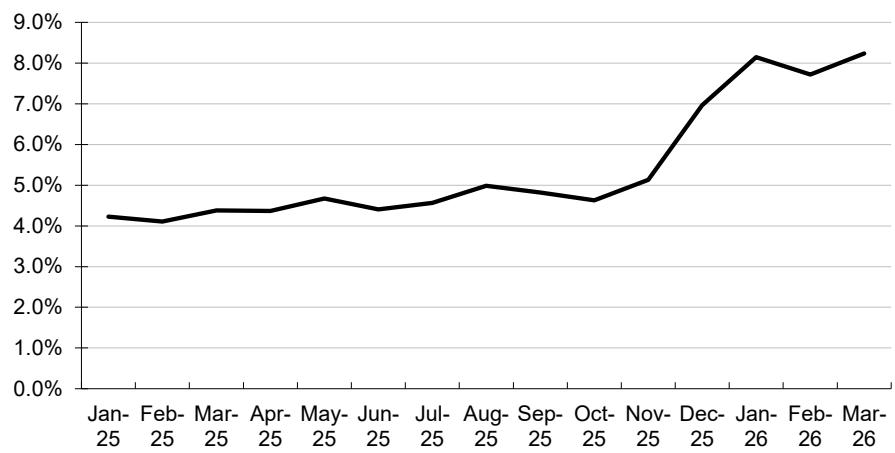

line

| Month   | Value |
|---------|-------|
| Jan-25  | 4.2%  |
| Feb-25  | 4.1%  |
| Mar-25  | 4.3%  |
| Apr-25  | 4.4%  |
| May-25  | 4.7%  |
| Jun-25  | 4.4%  |
| Jul-25  | 4.6%  |
| Aug-25  | 5.0%  |
| Sep-25  | 4.9%  |
| Oct-25  | 4.7%  |
| Nov-25  | 5.1%  |
| Dec-25  | 7.0%  |
| Jan-26  | 8.1%  |
| Feb-26  | 7.8%  |
| Mar-26  | 8.3%  |

Source : Marklines, DB

Figure 13: Canada Top Models Breakdown 

<table><tr><td colspan="7">Canada Top Models Breakdown</td></tr><tr><td>(unit)</td><td></td><td>Mar-26</td><td>YoY</td><td>MoM</td><td>3M 2026</td><td>YoY</td></tr><tr><td>Brand</td><td>Model</td><td>13,496</td><td>44.4%</td><td>55.4%</td><td>27,530</td><td>9.1%</td></tr><tr><td>EV</td><td></td><td>12,290</td><td>48.5%</td><td>49.9%</td><td>25,376</td><td>10.9%</td></tr><tr><td>Toyota</td><td>bZ4X EV</td><td>1,981</td><td>1537.2%</td><td>39.4%</td><td>4,054</td><td>1151.2%</td></tr><tr><td>Tesla</td><td>Model Y EV</td><td>1,774</td><td>58.3%</td><td>157.1%</td><td>3,114</td><td>21.4%</td></tr><tr><td>Kia</td><td>NIRO EV</td><td>1,115</td><td></td><td>34.7%</td><td>2,421</td><td></td></tr><tr><td>Ford</td><td>Mustang Mach-E EV</td><td>886</td><td>-2.1%</td><td>8.4%</td><td>2,202</td><td>6.4%</td></tr><tr><td>Nissan</td><td>Leaf EV</td><td>621</td><td>4676.9%</td><td></td><td>621</td><td>1903.2%</td></tr><tr><td>PHEV</td><td></td><td>1,206</td><td>12.8%</td><td>146.1%</td><td>2,154</td><td>-8.8%</td></tr><tr><td>Toyota</td><td>Prius PHEV</td><td>1,184</td><td>238.3%</td><td>150.8%</td><td>2,095</td><td>116.0%</td></tr><tr><td>Land Rover</td><td>Discovery Sport PHEV</td><td>17</td><td></td><td></td><td>17</td><td></td></tr><tr><td>BMW</td><td>BMW XM PHEV</td><td>5</td><td>-54.5%</td><td>-72.2%</td><td>42</td><td>68.0%</td></tr></table>

Source : Marklines, DB

Figure 14: Canada NEV Sales Trend   
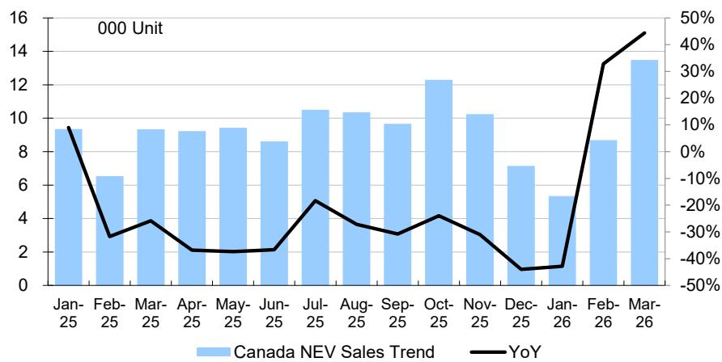

bar_line

| Month   | Canada NEV Sales Trend | YoY    |
|---------|------------------------|--------|
| Jan-25  | 9.5                    | 10%    |
| Feb-25  | 6.5                    | -30%   |
| Mar-25  | 9.5                    | -25%   |
| Apr-25  | 9.5                    | -35%   |
| May-25  | 8.5                    | -35%   |
| Jun-25  | 10.5                   | -30%   |
| Jul-25  | 10.5                   | -20%   |
| Aug-25  | 9.5                    | -30%   |
| Sep-25  | 12.5                   | -25%   |
| Oct-25  | 10.5                   | -30%   |
| Nov-25  | 7.5                    | -40%   |
| Dec-25  | 5.5                    | -40%   |
| Jan-26  | 8.5                    | -40%   |
| Feb-26  | 13.5                   | 30%    |
| Mar-26  | 13.5                   | 45%    |

Source : Marklines, DB

Figure 15: Canada NEV Breakdown   
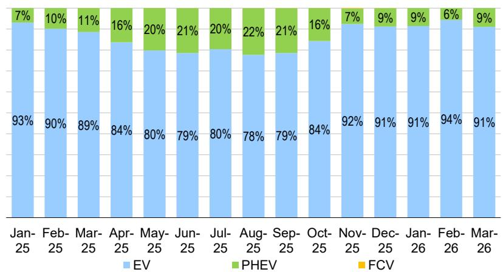

bar_stacked

| Month | EV (%) | PHEV (%) | FCV (%) |
| :--- | :--- | :--- | :--- |
| Jan-25 | 93 | 7 | |
| Feb-25 | 90 | 10 | |
| Mar-25 | 89 | 11 | |
| Apr-25 | 84 | 16 | |
| May-25 | 80 | 20 | |
| Jun-25 | 79 | 21 | |
| Jul-25 | 80 | 20 | |
| Aug-25 | 78 | 22 | |
| Sep-25 | 79 | 21 | |
| Oct-25 | 84 | 16 | |
| Nov-25 | 92 | 7 | |
| Dec-25 | 91 | 9 | |
| Jan-26 | 91 | 9 | |
| Feb-26 | 94 | 6 | |
| Mar-26 | 91 | 9 | |

Source : Marklines, DB

Figure 16: Canada NEV Penetration Rate   
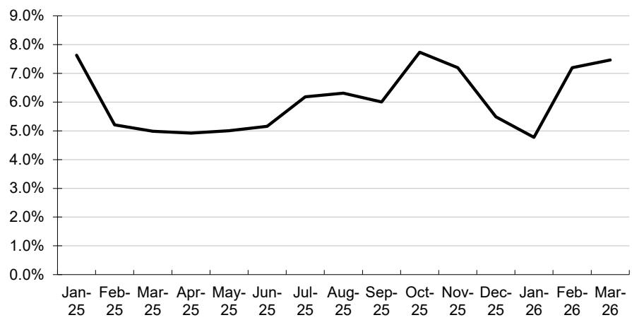

line

| Month | Value (%) |
|---|---|
| Jan-25 | 7.7 |
| Feb-25 | 5.2 |
| Mar-25 | 5.0 |
| Apr-25 | 4.9 |
| May-25 | 5.0 |
| Jun-25 | 5.1 |
| Jul-25 | 6.1 |
| Aug-25 | 6.3 |
| Sep-25 | 6.0 |
| Oct-25 | 7.8 |
| Nov-25 | 7.2 |
| Dec-25 | 5.5 |
| Jan-26 | 4.8 |
| Feb-26 | 7.2 |
| Mar-26 | 7.5 |

Source : Marklines, DB

Figure 17: China Top Models Breakdown 

<table><tr><td colspan="7">China Top Models Breakdown</td></tr><tr><td>(unit)</td><td></td><td>Mar-26</td><td>YoY</td><td>MoM</td><td>3M 2026</td><td>YoY</td></tr><tr><td>Brand</td><td>Model</td><td>1,161,247</td><td>1.6%</td><td>60.9%</td><td>2,761,545</td><td>-3.6%</td></tr><tr><td>EV</td><td></td><td>764,258</td><td>4.7%</td><td>67.0%</td><td>1,766,759</td><td>0.8%</td></tr><tr><td>Tesla</td><td>Model Y EV</td><td>55,856</td><td>13.9%</td><td>34.9%</td><td>136,176</td><td>52.5%</td></tr><tr><td>Geely</td><td>Xingyuan EV</td><td>40,613</td><td>25.0%</td><td>7.3%</td><td>120,148</td><td>34.7%</td></tr><tr><td>BYD</td><td>Seagull EV</td><td>30,636</td><td>-13.8%</td><td>51.7%</td><td>70,971</td><td>-39.8%</td></tr><tr><td>Tesla</td><td>Model 3 EV</td><td>29,814</td><td>0.1%</td><td>73.4%</td><td>77,222</td><td>-7.5%</td></tr><tr><td>BYD</td><td>Dolphin EV</td><td>25,770</td><td>63.0%</td><td>155.1%</td><td>47,906</td><td>39.8%</td></tr><tr><td>PHEV</td><td></td><td>396,989</td><td>-4.0%</td><td>50.3%</td><td>994,786</td><td>-10.6%</td></tr><tr><td>BYD</td><td>Song Pro PHEV</td><td>24,497</td><td>-22.4%</td><td>48.9%</td><td>61,990</td><td>-17.2%</td></tr><tr><td>BYD</td><td>Song PLUS PHEV</td><td>22,531</td><td>-43.2%</td><td>118.6%</td><td>46,856</td><td>-59.5%</td></tr><tr><td>Geely Galaxy</td><td>Galaxy Starship 7 PHEV</td><td>19,938</td><td>67.7%</td><td>81.5%</td><td>42,740</td><td>1.1%</td></tr><tr><td>FangChengBao</td><td>Tai 7 PHEV</td><td>15,041</td><td></td><td>28.1%</td><td>43,896</td><td></td></tr><tr><td>BYD</td><td>Seal 06 PHEV</td><td>14,738</td><td>-17.8%</td><td>53.6%</td><td>33,818</td><td>-29.5%</td></tr><tr><td>FCV</td><td></td><td>0</td><td></td><td></td><td>0</td><td></td></tr></table>

Source : Marklines, DB

Figure 18: China NEV Sales Trend   
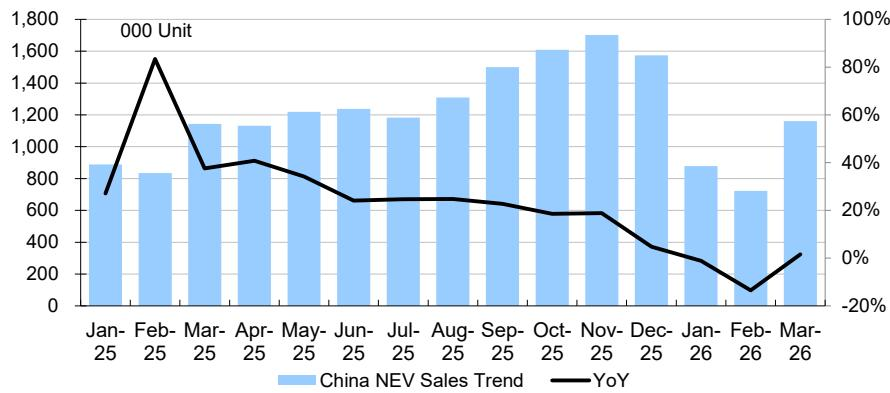

bar_line

| Month | China NEV Sales Trend (000 Unit) | YoY (%) |
| :--- | :--- | :--- |
| Jan-25 | 880 | 30 |
| Feb-25 | 830 | 90 |
| Mar-25 | 1140 | 40 |
| Apr-25 | 1130 | 45 |
| May-25 | 1220 | 35 |
| Jun-25 | 1240 | 25 |
| Jul-25 | 1180 | 25 |
| Aug-25 | 1310 | 25 |
| Sep-25 | 1500 | 20 |
| Oct-25 | 1610 | 15 |
| Nov-25 | 1700 | 15 |
| Dec-25 | 1580 | 5 |
| Jan-26 | 870 | -5 |
| Feb-26 | 710 | -18 |
| Mar-26 | 1160 | 10 |

Source : Marklines, DB

Figure 19: China NEV Breakdown   
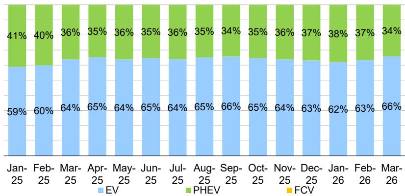

bar_stacked

| Month | EV (%) | PHEV (%) | FCV (%) |
| :--- | :--- | :--- | :--- |
| Jan-25 | 59 | 41 | 0 |
| Feb-25 | 60 | 40 | 0 |
| Mar-25 | 64 | 36 | 0 |
| Apr-25 | 65 | 35 | 0 |
| May-25 | 64 | 36 | 0 |
| Jun-25 | 65 | 35 | 0 |
| Jul-25 | 64 | 36 | 0 |
| Aug-25 | 65 | 35 | 0 |
| Sep-25 | 66 | 34 | 0 |
| Oct-25 | 65 | 35 | 0 |
| Nov-25 | 64 | 36 | 0 |
| Dec-25 | 63 | 37 | 0 |
| Jan-26 | 62 | 38 | 0 |
| Feb-26 | 63 | 37 | 0 |
| Mar-26 | 66 | 34 | 0 |

Source : Marklines, DB

Figure 20: China NEV Penetration Rate   
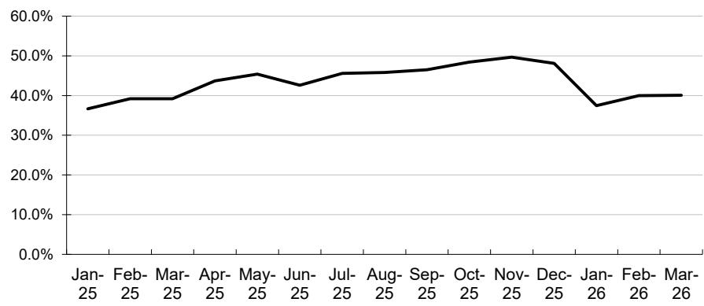

line

| Month   | Value  |
| ------- | ------ |
| Jan-25  | 37.0%  |
| Feb-25  | 39.0%  |
| Mar-25  | 39.0%  |
| Apr-25  | 44.0%  |
| May-25  | 46.0%  |
| Jun-25  | 42.0%  |
| Jul-25  | 45.0%  |
| Aug-25  | 46.0%  |
| Sep-25  | 47.0%  |
| Oct-25  | 48.0%  |
| Nov-25  | 50.0%  |
| Dec-25  | 48.0%  |
| Jan-26  | 37.0%  |
| Feb-26  | 40.0%  |
| Mar-26  | 40.0%  |

Source : Marklines, DB

Figure 21: Finland Top Models Breakdown 

<table><tr><td colspan="7">Finland Top Models Breakdown</td></tr><tr><td>(unit)</td><td></td><td>Mar-26</td><td>YoY</td><td>MoM</td><td>3M 2026</td><td>YoY</td></tr><tr><td>Brand</td><td>Model</td><td>4,199</td><td>14.6%</td><td>40.9%</td><td>10,457</td><td>14.6%</td></tr><tr><td>EV</td><td></td><td>3,302</td><td>33.3%</td><td>50.5%</td><td>7,989</td><td>39.9%</td></tr><tr><td>Tesla</td><td>Model Y EV</td><td>362</td><td>76.6%</td><td>13.5%</td><td>902</td><td>210.0%</td></tr><tr><td>Tesla</td><td>Model 3 EV</td><td>229</td><td>154.4%</td><td>1331.3%</td><td>246</td><td>36.7%</td></tr><tr><td>VW</td><td>ID.4 EV</td><td>151</td><td>-14.2%</td><td>45.2%</td><td>389</td><td>10.5%</td></tr><tr><td>Skoda</td><td>Elroq EV</td><td>147</td><td>258.5%</td><td>18.5%</td><td>437</td><td>439.5%</td></tr><tr><td>Skoda</td><td>Enyaq iV EV</td><td>146</td><td>-5.8%</td><td>24.8%</td><td>414</td><td>0.5%</td></tr><tr><td>PHEV</td><td></td><td>897</td><td>-24.3%</td><td>14.0%</td><td>2,468</td><td>-27.7%</td></tr><tr><td>Volvo</td><td>XC60 PHEV</td><td>203</td><td>63.7%</td><td>22.3%</td><td>492</td><td>25.5%</td></tr><tr><td>Volvo</td><td>S60/V60 PHEV</td><td>73</td><td>-7.6%</td><td>143.3%</td><td>157</td><td>-41.6%</td></tr><tr><td>Mitsubishi</td><td>Outlander PHEV</td><td>44</td><td>4300.0%</td><td>144.4%</td><td>84</td><td>2700.0%</td></tr><tr><td>BMW</td><td>X1 PHEV</td><td>37</td><td>-7.5%</td><td>-15.9%</td><td>119</td><td>-30.8%</td></tr><tr><td>VW</td><td>Tiguan PHEV</td><td>31</td><td>-44.6%</td><td>19.2%</td><td>86</td><td>-57.6%</td></tr></table>

Source : Marklines, DB

Figure 22: Finland NEV Sales Trend   
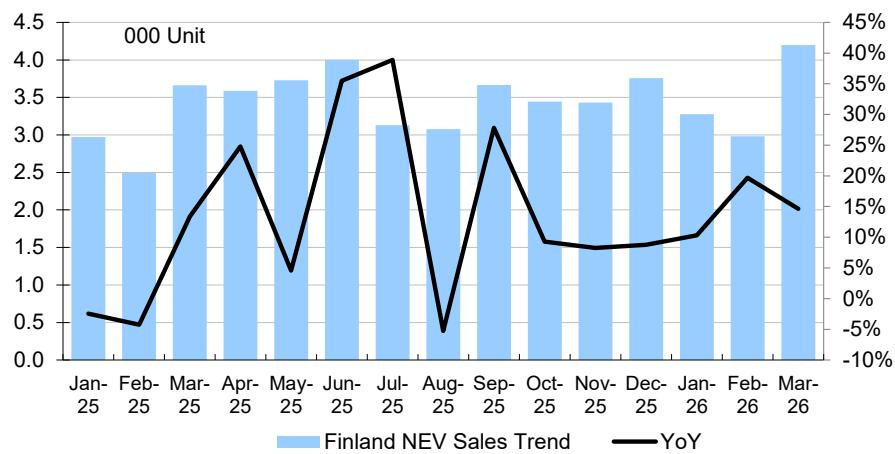

bar_line

| Month   | Finland NEV Sales Trend | YoY    |
|---------|--------------------------|--------|
| Jan-25  | 3.0                      | 0.5%   |
| Feb-25  | 2.5                      | -1.0%  |
| Mar-25  | 3.7                      | 2.0%   |
| Apr-25  | 3.6                      | 2.8%   |
| May-25  | 3.7                      | 1.2%   |
| Jun-25  | 4.0                      | 3.8%   |
| Jul-25  | 3.1                      | 4.0%   |
| Aug-25  | 3.1                      | -0.5%  |
| Sep-25  | 3.7                      | 3.1%   |
| Oct-25  | 3.4                      | 1.5%   |
| Nov-25  | 3.4                      | 1.3%   |
| Dec-25  | 3.7                      | 1.4%   |
| Jan-26  | 3.3                      | 1.6%   |
| Feb-26  | 3.0                      | 2.4%   |
| Mar-26  | 4.2                      | 1.9%   |

Source : Marklines, DB

Figure 23: Finland NEV Breakdown   
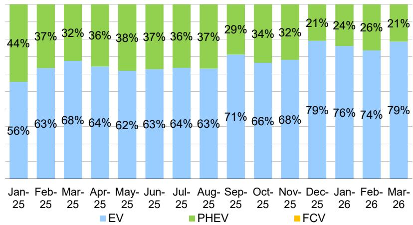

bar_stacked

| Month | EV (%) | PHEV (%) | FCV (%) |
| :--- | :--- | :--- | :--- |
| Jan-25 | 56 | 44 | 0 |
| Feb-25 | 63 | 37 | 0 |
| Mar-25 | 68 | 32 | 0 |
| Apr-25 | 64 | 36 | 0 |
| May-25 | 62 | 38 | 0 |
| Jun-25 | 63 | 37 | 0 |
| Jul-25 | 64 | 36 | 0 |
| Aug-25 | 63 | 37 | 0 |
| Sep-25 | 71 | 29 | 0 |
| Oct-25 | 66 | 34 | 0 |
| Nov-25 | 68 | 32 | 0 |
| Dec-25 | 79 | 21 | 0 |
| Jan-26 | 76 | 24 | 0 |
| Feb-26 | 74 | 26 | 0 |
| Mar-26 | 79 | 21 | 0 |

Source : Marklines, DB

Figure 24: Finland NEV Penetration Rate   
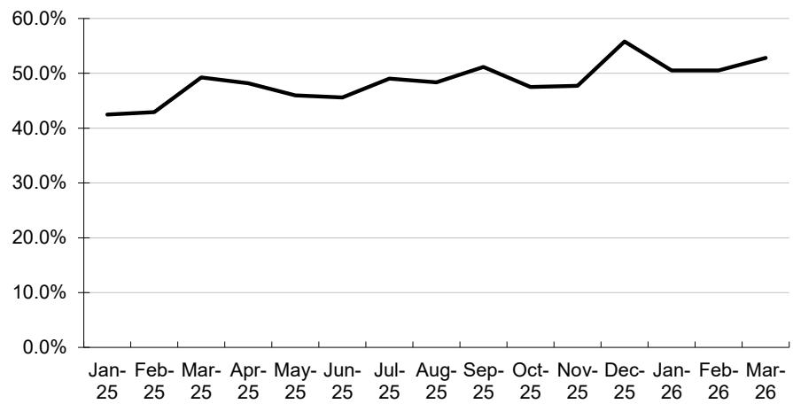

line

| Month   | Value  |
| ------- | ------ |
| Jan-25  | 42.0%  |
| Feb-25  | 43.0%  |
| Mar-25  | 49.0%  |
| Apr-25  | 48.0%  |
| May-25  | 46.0%  |
| Jun-25  | 45.0%  |
| Jul-25  | 49.0%  |
| Aug-25  | 48.0%  |
| Sep-25  | 51.0%  |
| Oct-25  | 47.0%  |
| Nov-25  | 47.0%  |
| Dec-25  | 56.0%  |
| Jan-26  | 50.0%  |
| Feb-26  | 50.0%  |
| Mar-26  | 53.0%  |

Source : Marklines, DB

Figure 25: France Top Models Breakdown 

<table><tr><td colspan="7">France Top Models Breakdown</td></tr><tr><td>(unit)</td><td></td><td>Mar-26</td><td>YoY</td><td>MoM</td><td>3M 2026</td><td>YoY</td></tr><tr><td>Brand</td><td>Model</td><td>61,281</td><td>51.9%</td><td>43.8%</td><td>141,994</td><td>40.0%</td></tr><tr><td>EV</td><td></td><td>52,832</td><td>63.8%</td><td>47.6%</td><td>121,673</td><td>48.3%</td></tr><tr><td>Tesla</td><td>Model Y EV</td><td>7,023</td><td>203.0%</td><td>131.5%</td><td>10,670</td><td>127.2%</td></tr><tr><td>Renault</td><td>Renault 5 EV</td><td>4,199</td><td>20.9%</td><td>40.6%</td><td>11,447</td><td>21.6%</td></tr><tr><td>Renault</td><td>Scenic EV</td><td>2,849</td><td>26.2%</td><td>34.0%</td><td>6,922</td><td>55.7%</td></tr><tr><td>Tesla</td><td>Model 3 EV</td><td>2,525</td><td>208.3%</td><td>280.3%</td><td>3,225</td><td>65.6%</td></tr><tr><td>Renault</td><td>Renault 4 EV</td><td>1,631</td><td>27083.3%</td><td>111.5%</td><td>3,383</td><td>10471.9%</td></tr><tr><td>PHEV</td><td></td><td>8,448</td><td>4.3%</td><td>23.7%</td><td>20,318</td><td>4.9%</td></tr><tr><td>VW</td><td>Tiguan PHEV</td><td>599</td><td>-20.7%</td><td>15.0%</td><td>1,461</td><td>-26.0%</td></tr><tr><td>Audi</td><td>Audi A3 PHEV</td><td>598</td><td>158.9%</td><td>62.9%</td><td>1,242</td><td>200.0%</td></tr><tr><td>Toyota</td><td>C-HR PHEV</td><td>425</td><td>7.6%</td><td>-11.5%</td><td>1,339</td><td>81.2%</td></tr><tr><td>Audi</td><td>Audi Q3 PHEV</td><td>416</td><td>4060.0%</td><td>12.1%</td><td>1,112</td><td>2371.1%</td></tr><tr><td>BYD</td><td>Seal 06 PHEV</td><td>358</td><td></td><td>302.2%</td><td>549</td><td></td></tr></table>

Source : Marklines, DB

Figure 26: France NEV Sales Trend   
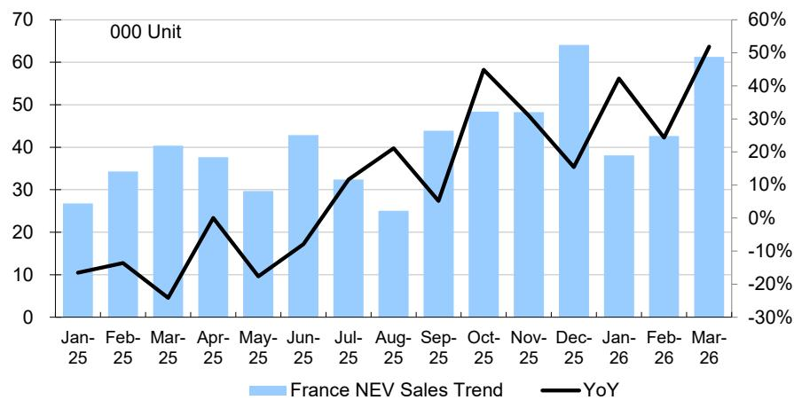

bar_line

| Month | France NEV Sales Trend (000 Unit) | YoY (%) |
| :--- | :--- | :--- |
| Jan-25 | 27 | -10 |
| Feb-25 | 34 | -8 |
| Mar-25 | 40 | -22 |
| Apr-25 | 38 | 15 |
| May-25 | 30 | -10 |
| Jun-25 | 43 | 5 |
| Jul-25 | 32 | 15 |
| Aug-25 | 25 | 20 |
| Sep-25 | 44 | 10 |
| Oct-25 | 48 | 45 |
| Nov-25 | 48 | 30 |
| Dec-25 | 64 | 15 |
| Jan-26 | 38 | 40 |
| Feb-26 | 43 | 25 |
| Mar-26 | 61 | 50 |

Source : Marklines, DB

Figure 27: France NEV Breakdown   
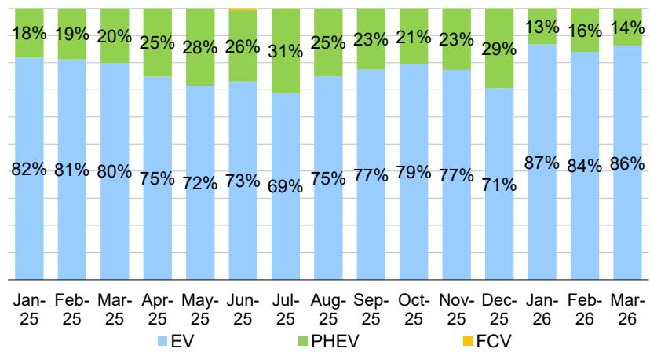

bar_stacked

| Month | EV (%) | PHEV (%) | FCV (%) |
| :--- | :--- | :--- | :--- |
| Jan-25 | 82 | 18 | 0 |
| Feb-25 | 81 | 19 | 0 |
| Mar-25 | 80 | 20 | 0 |
| Apr-25 | 75 | 25 | 0 |
| May-25 | 72 | 28 | 0 |
| Jun-25 | 73 | 26 | 1 |
| Jul-25 | 69 | 31 | 0 |
| Aug-25 | 75 | 25 | 0 |
| Sep-25 | 77 | 23 | 0 |
| Oct-25 | 79 | 21 | 0 |
| Nov-25 | 77 | 23 | 0 |
| Dec-25 | 71 | 29 | 0 |
| Jan-26 | 87 | 13 | 0 |
| Feb-26 | 84 | 16 | 0 |
| Mar-26 | 86 | 14 | 0 |

Source : Marklines, DB

Figure 28: France NEV Penetration Rate   
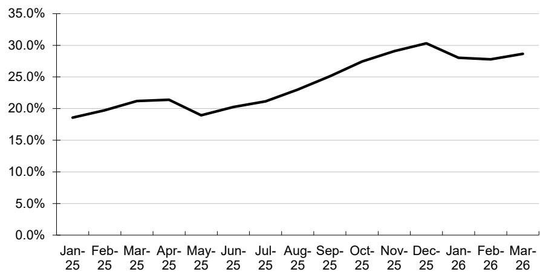

line

| Month | Value (%) |
|---|---|
| Jan-25 | 18.5 |
| Feb-25 | 19.5 |
| Mar-25 | 21.0 |
| Apr-25 | 21.5 |
| May-25 | 18.8 |
| Jun-25 | 20.0 |
| Jul-25 | 21.0 |
| Aug-25 | 23.0 |
| Sep-25 | 25.0 |
| Oct-25 | 27.5 |
| Nov-25 | 29.0 |
| Dec-25 | 30.5 |
| Jan-26 | 28.0 |
| Feb-26 | 27.8 |
| Mar-26 | 28.5 |

Source : Marklines, DB

Figure 29: Germany Top Models Breakdown 

<table><tr><td colspan="7">Germany Top Models Breakdown</td></tr><tr><td>(unit)</td><td></td><td>Mar-26</td><td>YoY</td><td>MoM</td><td>3M 2026</td><td>YoY</td></tr><tr><td>Brand</td><td>Model</td><td>98,150</td><td>42.8%</td><td>42.2%</td><td>230,070</td><td>30.7%</td></tr><tr><td>EV</td><td></td><td>68,392</td><td>61.4%</td><td>52.5%</td><td>154,503</td><td>36.9%</td></tr><tr><td>Tesla</td><td>Model Y EV</td><td>6,841</td><td>379.1%</td><td>410.5%</td><td>9,300</td><td>170.2%</td></tr><tr><td>Skoda</td><td>Elroq EV</td><td>3,872</td><td>242.0%</td><td>13.7%</td><td>10,399</td><td>457.6%</td></tr><tr><td>Skoda</td><td>Enyaq iV EV</td><td>3,392</td><td>41.8%</td><td>46.9%</td><td>7,542</td><td>2.0%</td></tr><tr><td>VW</td><td>ID.3 EV</td><td>3,298</td><td>53.3%</td><td>34.3%</td><td>8,158</td><td>32.1%</td></tr><tr><td>VW</td><td>ID.7 EV</td><td>3,039</td><td>-5.8%</td><td>35.3%</td><td>7,917</td><td>-15.2%</td></tr><tr><td>PHEV</td><td></td><td>29,757</td><td>13.0%</td><td>23.1%</td><td>75,561</td><td>19.6%</td></tr><tr><td>VW</td><td>Tiguan PHEV</td><td>1,339</td><td>5.8%</td><td>27.3%</td><td>3,182</td><td>-2.4%</td></tr><tr><td>Volvo</td><td>XC60 PHEV</td><td>1,172</td><td>-1.4%</td><td>0.8%</td><td>3,564</td><td>-8.8%</td></tr><tr><td>BYD</td><td>Haibao/Seal PHEV</td><td>1,116</td><td></td><td>95.8%</td><td>2,296</td><td></td></tr><tr><td>SEAT</td><td>Leon PHEV</td><td>1,108</td><td>-26.6%</td><td>105.2%</td><td>2,174</td><td>-28.9%</td></tr><tr><td>Mercedes-Benz</td><td>GLC-Class (GLK-Class) PHEV</td><td>1,100</td><td>126.3%</td><td>12.9%</td><td>3,200</td><td>88.2%</td></tr></table>

Source : Marklines, DB

Figure 30: Germany NEV Sales Trend   
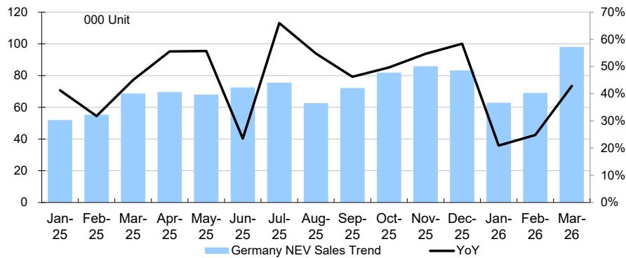

bar_line

| Month | Germany NEV Sales Trend (000 Unit) | YoY (%) |
|---|---|---|
| Jan-25 | 52 | 43 |
| Feb-25 | 55 | 31 |
| Mar-25 | 68 | 49 |
| Apr-25 | 70 | 57 |
| May-25 | 68 | 57 |
| Jun-25 | 73 | 24 |
| Jul-25 | 76 | 66 |
| Aug-25 | 63 | 51 |
| Sep-25 | 72 | 48 |
| Oct-25 | 81 | 51 |
| Nov-25 | 85 | 54 |
| Dec-25 | 83 | 59 |
| Jan-26 | 63 | 21 |
| Feb-26 | 69 | 24 |
| Mar-26 | 98 | 44 |

Source : Marklines, DB

Figure 31: Germany NEV Breakdown   
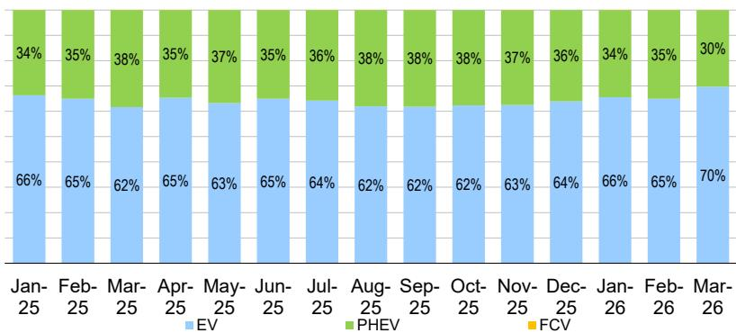

bar_stacked

| Month | EV (%) | PHEV (%) | FCV (%) |
| :--- | :--- | :--- | :--- |
| Jan-25 | 66 | 34 | 0 |
| Feb-25 | 65 | 35 | 0 |
| Mar-25 | 62 | 38 | 0 |
| Apr-25 | 65 | 35 | 0 |
| May-25 | 63 | 37 | 0 |
| Jun-25 | 65 | 35 | 0 |
| Jul-25 | 64 | 36 | 0 |
| Aug-25 | 62 | 38 | 0 |
| Sep-25 | 62 | 38 | 0 |
| Oct-25 | 62 | 38 | 0 |
| Nov-25 | 63 | 37 | 0 |
| Dec-25 | 64 | 36 | 0 |
| Jan-26 | 66 | 34 | 0 |
| Feb-26 | 65 | 35 | 0 |
| Mar-26 | 70 | 30 | 0 |

Source : Marklines, DB

Figure 32: Germany NEV Penetration Rate   
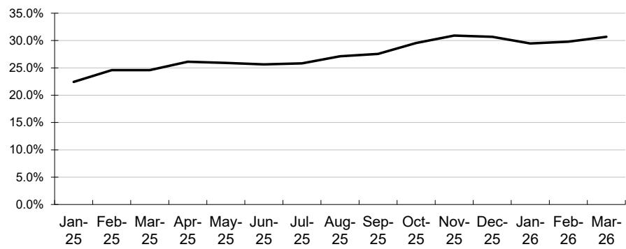

line

| Month   | Value  |
| ------- | ------ |
| Jan-25  | 22.0%  |
| Feb-25  | 24.5%  |
| Mar-25  | 24.5%  |
| Apr-25  | 26.0%  |
| May-25  | 25.5%  |
| Jun-25  | 25.0%  |
| Jul-25  | 25.5%  |
| Aug-25  | 27.0%  |
| Sep-25  | 27.5%  |
| Oct-25  | 30.0%  |
| Nov-25  | 31.0%  |
| Dec-25  | 30.5%  |
| Jan-26  | 29.5%  |
| Feb-26  | 30.0%  |
| Mar-26  | 31.0%  |

Source : Marklines, DB

Figure 33: India Top Models Breakdown 

<table><tr><td colspan="7">India Top Models Breakdown</td></tr><tr><td>(unit)</td><td></td><td>Mar-26</td><td>YoY</td><td>MoM</td><td>3M 2026</td><td>YoY</td></tr><tr><td>Brand</td><td>Model</td><td>24,099</td><td>68.8%</td><td>49.4%</td><td>60,217</td><td>63.0%</td></tr><tr><td>EV</td><td></td><td>24,099</td><td>68.8%</td><td>49.4%</td><td>60,217</td><td>63.0%</td></tr><tr><td>Tata</td><td>Tata EV</td><td>8,567</td><td>60.9%</td><td>36.2%</td><td>23,337</td><td>56.5%</td></tr><tr><td>Mahindra &amp; Mahindra</td><td>e2o EV</td><td>5,559</td><td>149.1%</td><td>51.0%</td><td>13,337</td><td>292.1%</td></tr><tr><td>MG</td><td>MG ZS SUV EV</td><td>5,439</td><td>25.0%</td><td>40.0%</td><td>14,402</td><td>14.5%</td></tr><tr><td>Suzuki</td><td>Other Suzuki EV</td><td>991</td><td></td><td>334.6%</td><td>1,444</td><td></td></tr><tr><td>VinFast</td><td>VinFast EV</td><td>723</td><td></td><td>70.9%</td><td>1,599</td><td></td></tr></table>

Source : Marklines, DB

Figure 35: India NEV Breakdown   
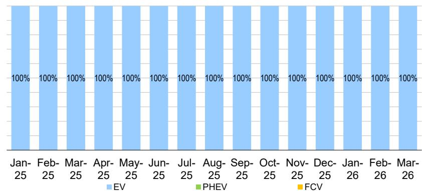

bar

| Month | EV (%) | PHEV (%) | FCV (%) |
|---|---|---|---|
| Jan-25 | 100 | 0 | 0 |
| Feb-25 | 100 | 0 | 0 |
| Mar-25 | 100 | 0 | 0 |
| Apr-25 | 100 | 0 | 0 |
| May-25 | 100 | 0 | 0 |
| Jun-25 | 100 | 0 | 0 |
| Jul-25 | 100 | 0 | 0 |
| Aug-25 | 100 | 0 | 0 |
| Sep-25 | 100 | 0 | 0 |
| Oct-25 | 100 | 0 | 0 |
| Nov-25 | 100 | 0 | 0 |
| Dec-25 | 100 | 0 | 0 |
| Jan-26 | 100 | 0 | 0 |
| Feb-26 | 100 | 0 | 0 |
| Mar-26 | 100 | 0 | 0 |

Source : Marklines, DB

Figure 34: India NEV Sales Trend   
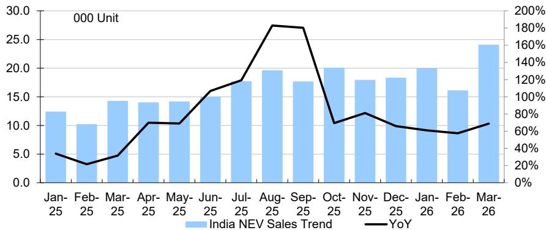

bar_line

| Month | India NEV Sales Trend (000 Unit) | YoY (%) |
|---|---|---|
| Jan-25 | 12.5 | 50 |
| Feb-25 | 10.5 | 30 |
| Mar-25 | 14.5 | 45 |
| Apr-25 | 14.0 | 105 |
| May-25 | 14.0 | 105 |
| Jun-25 | 15.0 | 130 |
| Jul-25 | 17.5 | 140 |
| Aug-25 | 19.5 | 180 |
| Sep-25 | 17.5 | 175 |
| Oct-25 | 20.0 | 100 |
| Nov-25 | 18.0 | 80 |
| Dec-25 | 18.5 | 70 |
| Jan-26 | 20.0 | 65 |
| Feb-26 | 16.0 | 60 |
| Mar-26 | 24.0 | 70 |

Source : Marklines, DB

Figure 36: India NEV Penetration Rate   
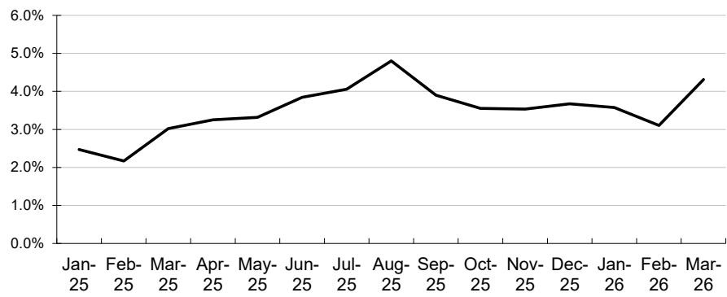

line

| Month | Value (%) |
|---|---|
| Jan-25 | 2.5 |
| Feb-25 | 2.1 |
| Mar-25 | 3.0 |
| Apr-25 | 3.2 |
| May-25 | 3.3 |
| Jun-25 | 3.8 |
| Jul-25 | 4.0 |
| Aug-25 | 4.8 |
| Sep-25 | 3.9 |
| Oct-25 | 3.5 |
| Nov-25 | 3.5 |
| Dec-25 | 3.6 |
| Jan-26 | 3.5 |
| Feb-26 | 3.1 |
| Mar-26 | 4.3 |

Source : Marklines, DB

Figure 37: Italy Top Models Breakdown 

<table><tr><td colspan="7">Italy Top Models Breakdown</td></tr><tr><td>(unit)</td><td></td><td>Mar-26</td><td>YoY</td><td>MoM</td><td>3M 2026</td><td>YoY</td></tr><tr><td>Brand</td><td>Model</td><td>32,699</td><td>84.8%</td><td>26.8%</td><td>79,979</td><td>84.8%</td></tr><tr><td>EV</td><td></td><td>16,695</td><td>69.0%</td><td>29.1%</td><td>39,347</td><td>62.2%</td></tr><tr><td>Leapmotor</td><td>T03 EV</td><td>5,022</td><td>2889.3%</td><td>5.2%</td><td>9,801</td><td>1766.9%</td></tr><tr><td>Tesla</td><td>Model 3 EV</td><td>1,628</td><td>4.0%</td><td>352.2%</td><td>2,002</td><td>-9.3%</td></tr><tr><td>Tesla</td><td>Model Y EV</td><td>1,283</td><td>97.4%</td><td>212.2%</td><td>2,390</td><td>90.6%</td></tr><tr><td>Citroen</td><td>C3 EV</td><td>1,090</td><td>192.2%</td><td>74.1%</td><td>2,357</td><td>62.0%</td></tr><tr><td>Dacia</td><td>Spring Electric EV</td><td>694</td><td>5.0%</td><td>52.9%</td><td>1,596</td><td>-24.6%</td></tr><tr><td>PHEV</td><td></td><td>16,004</td><td>104.8%</td><td>24.4%</td><td>40,631</td><td>113.5%</td></tr><tr><td>BYD</td><td>Yuan UP / ATTO 2 PHEV</td><td>2,848</td><td></td><td>156.8%</td><td>3,957</td><td></td></tr><tr><td>BYD</td><td>Seal U PHEV</td><td>1,384</td><td>-3.9%</td><td>-16.3%</td><td>5,052</td><td>83.6%</td></tr><tr><td>BMW</td><td>X1 PHEV</td><td>1,057</td><td>204.6%</td><td>48.0%</td><td>2,430</td><td>183.5%</td></tr><tr><td>VW</td><td>Tiguan PHEV</td><td>790</td><td>107.9%</td><td>-5.3%</td><td>2,124</td><td>141.4%</td></tr><tr><td>Jaecoo</td><td>Jaecoo 7 PHEV</td><td>612</td><td>105.4%</td><td>71.4%</td><td>1,361</td><td>356.7%</td></tr></table>

Source : Marklines, DB

Figure 38: Italy NEV Sales Trend   
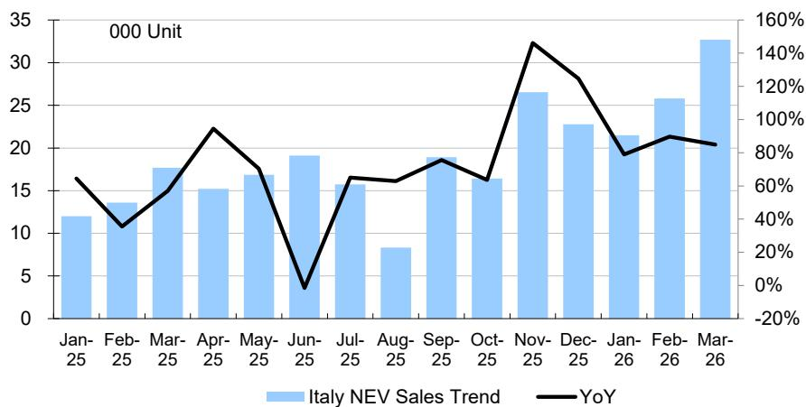

bar_line

| Month   | Italy NEV Sales Trend | YoY   |
|---------|------------------------|-------|
| Jan-25  | 12                     | 16%   |
| Feb-25  | 13                     | 10%   |
| Mar-25  | 18                     | 14%   |
| Apr-25  | 15                     | 22%   |
| May-25  | 17                     | 18%   |
| Jun-25  | 19                     | 3%    |
| Jul-25  | 16                     | 7%    |
| Aug-25  | 8                      | 6%    |
| Sep-25  | 19                     | 8%    |
| Oct-25  | 16                     | 7%    |
| Nov-25  | 27                     | 140%  |
| Dec-25  | 23                     | 120%  |
| Jan-26  | 21                     | 8%    |
| Feb-26  | 26                     | 9%    |
| Mar-26  | 33                     | 8%    |

Source : Marklines, DB

Figure 39: Italy NEV Breakdown   
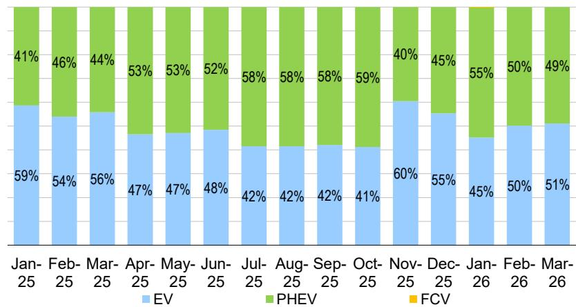

bar_stacked

| Month | EV (%) | PHEV (%) | FCV (%) |
| :--- | :--- | :--- | :--- |
| Jan-25 | 59 | 41 | 0 |
| Feb-25 | 54 | 46 | 0 |
| Mar-25 | 56 | 44 | 0 |
| Apr-25 | 47 | 53 | 0 |
| May-25 | 47 | 53 | 0 |
| Jun-25 | 48 | 52 | 0 |
| Jul-25 | 42 | 58 | 0 |
| Aug-25 | 42 | 58 | 0 |
| Sep-25 | 42 | 58 | 0 |
| Oct-25 | 41 | 59 | 0 |
| Nov-25 | 60 | 40 | 0 |
| Dec-25 | 55 | 45 | 0 |
| Jan-26 | 45 | 55 | 0 |
| Feb-26 | 50 | 50 | 0 |
| Mar-26 | 51 | 49 | 0 |

Source : Marklines, DB

Figure 40: Italy NEV Penetration Rate   
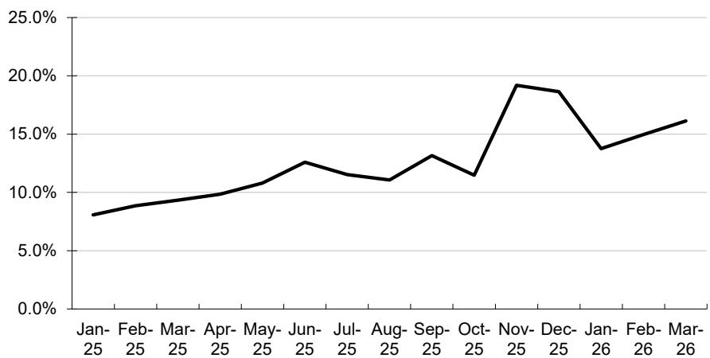

line

| Month   | Value  |
| ------- | ------ |
| Jan-25  | 8.0%   |
| Feb-25  | 9.0%   |
| Mar-25  | 9.5%   |
| Apr-25  | 10.0%  |
| May-25  | 11.0%  |
| Jun-25  | 12.5%  |
| Jul-25  | 11.5%  |
| Aug-25  | 11.0%  |
| Sep-25  | 13.0%  |
| Oct-25  | 11.5%  |
| Nov-25  | 19.0%  |
| Dec-25  | 18.5%  |
| Jan-26  | 13.5%  |
| Feb-26  | 14.5%  |
| Mar-26  | 16.0%  |

Source : Marklines, DB

Figure 41: Japan Top Models Breakdown 

<table><tr><td colspan="7">Japan Top Models Breakdown</td></tr><tr><td>(unit)</td><td></td><td>Mar-26</td><td>YoY</td><td>MoM</td><td>3M 2026</td><td>YoY</td></tr><tr><td>Brand</td><td>Model</td><td>17,959</td><td>79.4%</td><td>50.8%</td><td>40,671</td><td>52.7%</td></tr><tr><td>EV</td><td></td><td>13,791</td><td>169.1%</td><td>56.6%</td><td>29,759</td><td>105.1%</td></tr><tr><td>Toyota</td><td>bZ4X EV</td><td>3,377</td><td>9027.0%</td><td>63.1%</td><td>7,098</td><td>8250.6%</td></tr><tr><td>Tesla</td><td>Other Tesla EV</td><td>2,523</td><td></td><td>65.6%</td><td>5,127</td><td></td></tr><tr><td>Nissan</td><td>Leaf EV</td><td>2,514</td><td>583.2%</td><td>114.0%</td><td>5,065</td><td>347.0%</td></tr><tr><td>Nissan</td><td>Sakura EV</td><td>959</td><td>-52.2%</td><td>27.5%</td><td>2,381</td><td>-60.7%</td></tr><tr><td>Mitsubishi</td><td>Minicab-Mi EV</td><td>953</td><td>347.4%</td><td>223.1%</td><td>1,344</td><td>-9.3%</td></tr><tr><td>PHEV</td><td></td><td>4,139</td><td>-14.6%</td><td>34.6%</td><td>10,778</td><td>-10.2%</td></tr><tr><td>Mitsubishi</td><td>Outlander PHEV</td><td>1,095</td><td>-2.8%</td><td>27.9%</td><td>2,774</td><td>-2.9%</td></tr><tr><td>Toyota</td><td>Prius PHEV</td><td>798</td><td>34.8%</td><td>6.3%</td><td>2,497</td><td>16.7%</td></tr><tr><td>Mercedes-Benz</td><td>Mercedes-Benz PHEV</td><td>244</td><td>-8.3%</td><td>112.2%</td><td>487</td><td>-37.8%</td></tr><tr><td>Toyota</td><td>RAV4 PHEV</td><td>191</td><td>154.7%</td><td>3083.3%</td><td>208</td><td>-7.1%</td></tr><tr><td>BYD</td><td>Imported BYD Auto PHEV</td><td>184</td><td></td><td>18300.0%</td><td>192</td><td></td></tr></table>

Source : Marklines, DB

Figure 42: Japan NEV Sales Trend   
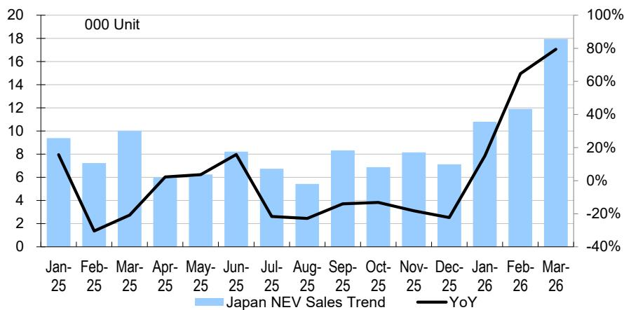

bar_line

| Month   | Japan NEV Sales Trend | YoY    |
|---------|------------------------|--------|
| Jan-25  | 9                      | 80%    |
| Feb-25  | 7                      | -30%   |
| Mar-25  | 10                     | 20%    |
| Apr-25  | 6                      | 60%    |
| May-25  | 6                      | 60%    |
| Jun-25  | 8                      | 80%    |
| Jul-25  | 7                      | -20%   |
| Aug-25  | 5                      | -20%   |
| Sep-25  | 8                      | -10%   |
| Oct-25  | 7                      | -10%   |
| Nov-25  | 8                      | -10%   |
| Dec-25  | 7                      | -20%   |
| Jan-26  | 11                     | 40%    |
| Feb-26  | 12                     | 60%    |
| Mar-26  | 18                     | 80%    |

Source : Marklines, DB

Figure 43: Japan NEV Breakdown   
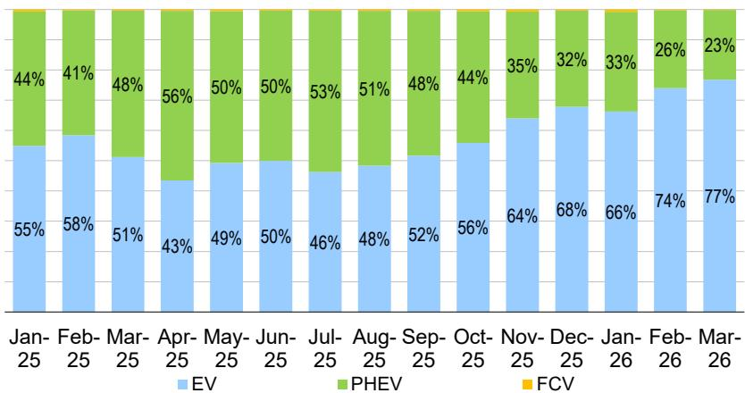

bar_stacked

| Month | EV (%) | PHEV (%) | FCV (%) |
| :--- | :--- | :--- | :--- |
| Jan-25 | 55 | 44 | 0 |
| Feb-25 | 58 | 41 | 0 |
| Mar-25 | 51 | 48 | 0 |
| Apr-25 | 43 | 56 | 0 |
| May-25 | 49 | 50 | 0 |
| Jun-25 | 50 | 50 | 0 |
| Jul-25 | 46 | 53 | 0 |
| Aug-25 | 48 | 51 | 0 |
| Sep-25 | 52 | 48 | 0 |
| Oct-25 | 56 | 44 | 0 |
| Nov-25 | 64 | 35 | 0 |
| Dec-25 | 68 | 32 | 0 |
| Jan-26 | 66 | 33 | 0 |
| Feb-26 | 74 | 26 | 0 |
| Mar-26 | 77 | 23 | 0 |

Source : Marklines, DB

Figure 44: Japan NEV Penetration Rate   
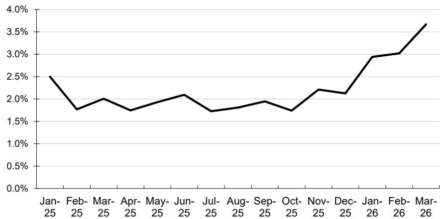

line

| Month | Value (%) |
|---|---|
| Jan-25 | 2.5 |
| Feb-25 | 1.8 |
| Mar-25 | 2.0 |
| Apr-25 | 1.75 |
| May-25 | 1.9 |
| Jun-25 | 2.1 |
| Jul-25 | 1.7 |
| Aug-25 | 1.8 |
| Sep-25 | 1.95 |
| Oct-25 | 1.75 |
| Nov-25 | 2.2 |
| Dec-25 | 2.1 |
| Jan-26 | 2.95 |
| Feb-26 | 3.0 |
| Mar-26 | 3.7 |

Source : Marklines, DB

Figure 45: Korea Top Models Breakdown 

<table><tr><td colspan="7">Korea Top Models Breakdown</td></tr><tr><td>(unit)</td><td></td><td>Mar-26</td><td>YoY</td><td>MoM</td><td>3M 2026</td><td>YoY</td></tr><tr><td>Brand</td><td>Model</td><td>44,035</td><td>115.5%</td><td>27.3%</td><td>91,313</td><td>130.9%</td></tr><tr><td>EV</td><td></td><td>41,225</td><td>125.4%</td><td>25.7%</td><td>85,244</td><td>151.5%</td></tr><tr><td>Tesla</td><td>Model Y EV</td><td>6,749</td><td>3470.9%</td><td>-3.8%</td><td>15,323</td><td>587.4%</td></tr><tr><td>Kia</td><td>EV3 EV</td><td>4,468</td><td>47.4%</td><td>28.8%</td><td>8,674</td><td>51.7%</td></tr><tr><td>Tesla</td><td>Model 3 EV</td><td>3,702</td><td>57.9%</td><td>347.6%</td><td>4,550</td><td>85.5%</td></tr><tr><td>Kia</td><td>EV5 EV</td><td>3,513</td><td></td><td>39.2%</td><td>6,884</td><td></td></tr><tr><td>Kia</td><td>Kia PV5 EV</td><td>3,093</td><td></td><td>-22.0%</td><td>8,086</td><td></td></tr><tr><td>PHEV</td><td></td><td>1,690</td><td>-3.2%</td><td>27.8%</td><td>4,397</td><td>-10.8%</td></tr><tr><td>Volvo</td><td>XC60 PHEV</td><td>599</td><td>44.0%</td><td>50.5%</td><td>1,385</td><td>5.5%</td></tr><tr><td>Volvo</td><td>XC90 PHEV</td><td>178</td><td>67.9%</td><td>-7.8%</td><td>589</td><td>106.7%</td></tr><tr><td>BMW</td><td>BMW 5 Series PHEV</td><td>147</td><td>-56.8%</td><td>12.2%</td><td>431</td><td>-50.5%</td></tr><tr><td>BMW</td><td>X5 PHEV</td><td>143</td><td>-30.2%</td><td>33.6%</td><td>431</td><td>-26.9%</td></tr><tr><td>Mercedes-Benz</td><td>E-Class PHEV</td><td>101</td><td>-33.1%</td><td>20.2%</td><td>217</td><td>-45.5%</td></tr></table>

Source : Marklines, DB

Figure 46: Korea NEV Sales Trend   
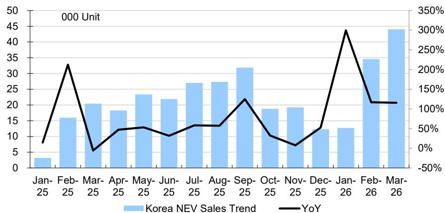

bar_line

| Month | Korea NEV Sales Trend (000 Unit) | YoY (%) |
| :--- | :--- | :--- |
| Jan-25 | 3 | 8 |
| Feb-25 | 16 | 330 |
| Mar-25 | 20 | 4 |
| Apr-25 | 18 | 110 |
| May-25 | 23 | 115 |
| Jun-25 | 22 | 95 |
| Jul-25 | 27 | 130 |
| Aug-25 | 27 | 130 |
| Sep-25 | 32 | 215 |
| Oct-25 | 19 | 100 |
| Nov-25 | 19 | 65 |
| Dec-25 | 12 | 110 |
| Jan-26 | 13 | 330 |
| Feb-26 | 34.5 | 115 |
| Mar-26 | 44.5 | 115 |

Source : Marklines, DB

Figure 47: Korea NEV Breakdown   
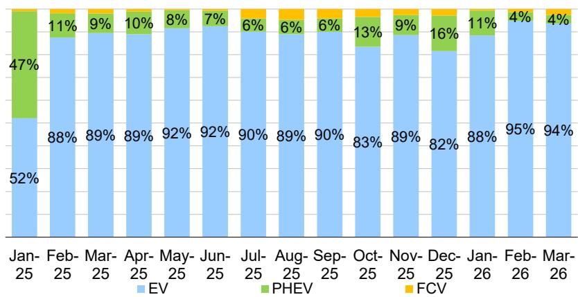

bar_stacked

| Month | EV (%) | PHEV (%) | FCV (%) |
| :--- | :--- | :--- | :--- |
| Jan-25 | 52 | 47 | 0 |
| Feb-25 | 88 | 11 | 0 |
| Mar-25 | 89 | 9 | 0 |
| Apr-25 | 89 | 10 | 0 |
| May-25 | 92 | 8 | 0 |
| Jun-25 | 92 | 7 | 0 |
| Jul-25 | 90 | 6 | 0 |
| Aug-25 | 89 | 6 | 0 |
| Sep-25 | 90 | 6 | 0 |
| Oct-25 | 83 | 13 | 0 |
| Nov-25 | 89 | 9 | 0 |
| Dec-25 | 82 | 16 | 0 |
| Jan-26 | 88 | 11 | 0 |
| Feb-26 | 95 | 4 | 0 |
| Mar-26 | 94 | 4 | 0 |

Source : Marklines, DB

Figure 48: Korea NEV Penetration Rate   
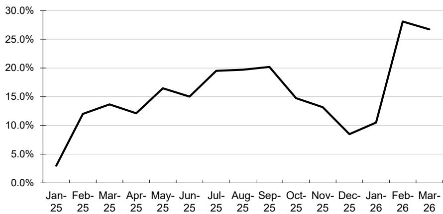

line

| Month | Value (%) |
|---|---|
| Jan-25 | 3.0 |
| Feb-25 | 12.0 |
| Mar-25 | 13.8 |
| Apr-25 | 12.2 |
| May-25 | 16.4 |
| Jun-25 | 15.0 |
| Jul-25 | 19.6 |
| Aug-25 | 19.7 |
| Sep-25 | 20.2 |
| Oct-25 | 14.8 |
| Nov-25 | 13.3 |
| Dec-25 | 8.4 |
| Jan-26 | 10.4 |
| Feb-26 | 28.3 |
| Mar-26 | 26.8 |

Source : Marklines, DB

Figure 49: Norway Top Models Breakdown 

<table><tr><td colspan="7">Norway Top Models Breakdown</td></tr><tr><td>(unit)</td><td></td><td>Mar-26</td><td>YoY</td><td>MoM</td><td>3M 2026</td><td>YoY</td></tr><tr><td>Brand</td><td>Model</td><td>17,532</td><td>41.4%</td><td>144.4%</td><td>26,806</td><td>-10.8%</td></tr><tr><td>EV</td><td></td><td>17,405</td><td>55.6%</td><td>144.2%</td><td>26,616</td><td>-7.0%</td></tr><tr><td>Tesla</td><td>Model Y EV</td><td>4,288</td><td>135.3%</td><td>299.6%</td><td>5,423</td><td>94.6%</td></tr><tr><td>Tesla</td><td>Model 3 EV</td><td>1,860</td><td>381.9%</td><td>1330.8%</td><td>2,010</td><td>96.9%</td></tr><tr><td>Volvo</td><td>EX40 EV</td><td>901</td><td>433.1%</td><td>112.0%</td><td>1,368</td><td>213.8%</td></tr><tr><td>Toyota</td><td>bZ4X EV</td><td>883</td><td>68.2%</td><td>71.8%</td><td>1,581</td><td>-30.9%</td></tr><tr><td>Volvo</td><td>EX30 EV</td><td>730</td><td>72.2%</td><td>848.1%</td><td>831</td><td>-7.5%</td></tr><tr><td>PHEV</td><td></td><td>127</td><td>-89.6%</td><td>176.1%</td><td>190</td><td>-87.0%</td></tr><tr><td>Volvo</td><td>XC90 PHEV</td><td>47</td><td>-84.2%</td><td>1466.7%</td><td>52</td><td>-85.6%</td></tr><tr><td>Volvo</td><td>XC60 PHEV</td><td>33</td><td>-85.5%</td><td>312.5%</td><td>43</td><td>-85.7%</td></tr><tr><td>BMW</td><td>X5 PHEV</td><td>6</td><td>-60.0%</td><td>200.0%</td><td>13</td><td>-27.8%</td></tr><tr><td>Mercedes-Benz</td><td>E-Class PHEV</td><td>6</td><td>200.0%</td><td>100.0%</td><td>11</td><td>266.7%</td></tr><tr><td>Land Rover</td><td>Range Rover PHEV</td><td>5</td><td>-16.7%</td><td>400.0%</td><td>7</td><td>-12.5%</td></tr></table>

Source : Marklines, DB

Figure 50: Norway NEV Sales Trend   
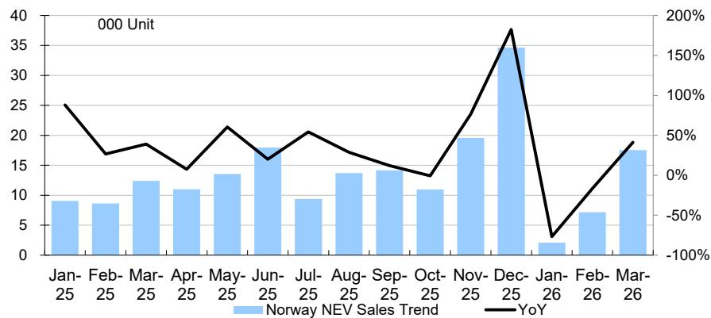

bar_line

| Month | Norway NEV Sales Trend (000 Unit) | YoY (%) |
| :--- | :--- | :--- |
| Jan-25 | 9 | 100 |
| Feb-25 | 8.5 | 70 |
| Mar-25 | 12.5 | 85 |
| Apr-25 | 11 | 40 |
| May-25 | 13.5 | 100 |
| Jun-25 | 18 | 60 |
| Jul-25 | 9.5 | 110 |
| Aug-25 | 13.5 | 70 |
| Sep-25 | 14.5 | 50 |
| Oct-25 | 11 | 30 |
| Nov-25 | 19.5 | 100 |
| Dec-25 | 35 | 180 |
| Jan-26 | 2.5 | -80 |
| Feb-26 | 7.5 | -30 |
| Mar-26 | 17.5 | 60 |

Source : Marklines, DB

Figure 51: Norway NEV Breakdown   
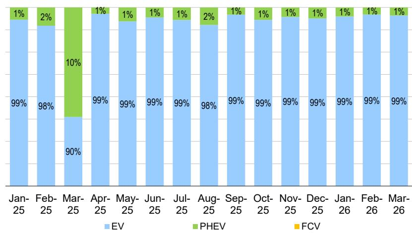

bar_stacked

| Month | EV (%) | PHEV (%) | FCV (%) |
| :--- | :--- | :--- | :--- |
| Jan-25 | 99 | 1 | 0 |
| Feb-25 | 98 | 2 | 0 |
| Mar-25 | 90 | 10 | 0 |
| Apr-25 | 99 | 1 | 0 |
| May-25 | 99 | 1 | 0 |
| Jun-25 | 99 | 1 | 0 |
| Jul-25 | 99 | 1 | 0 |
| Aug-25 | 98 | 2 | 0 |
| Sep-25 | 99 | 1 | 0 |
| Oct-25 | 99 | 1 | 0 |
| Nov-25 | 99 | 1 | 0 |
| Dec-25 | 99 | 1 | 0 |
| Jan-26 | 99 | 1 | 0 |
| Feb-26 | 99 | 1 | 0 |
| Mar-26 | 99 | 1 | 0 |

Source : Marklines, DB

Figure 52: Norway NEV Penetration Rate   
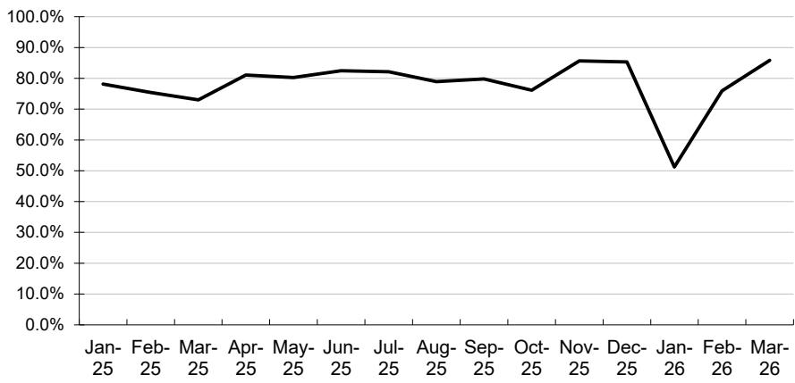

line

| Month   | Value  |
| ------- | ------ |
| Jan-25  | 78.0%  |
| Feb-25  | 75.0%  |
| Mar-25  | 73.0%  |
| Apr-25  | 81.0%  |
| May-25  | 80.0%  |
| Jun-25  | 82.0%  |
| Jul-25  | 81.0%  |
| Aug-25  | 79.0%  |
| Sep-25  | 80.0%  |
| Oct-25  | 76.0%  |
| Nov-25  | 86.0%  |
| Dec-25  | 85.0%  |
| Jan-26  | 51.0%  |
| Feb-26  | 76.0%  |
| Mar-26  | 86.0%  |

Source : Marklines, DB

Figure 53: Sweden Top Models Breakdown 

<table><tr><td colspan="7">Sweden Top Models Breakdown</td></tr><tr><td>(unit)</td><td></td><td>Mar-26</td><td>YoY</td><td>MoM</td><td>3M 2026</td><td>YoY</td></tr><tr><td>Brand</td><td>Model</td><td>17,810</td><td>19.0%</td><td>37.7%</td><td>40,986</td><td>9.7%</td></tr><tr><td>EV</td><td></td><td>11,411</td><td>31.6%</td><td>40.8%</td><td>26,204</td><td>21.4%</td></tr><tr><td>Tesla</td><td>Model Y EV</td><td>1,382</td><td>80.2%</td><td>160.3%</td><td>2,412</td><td>56.4%</td></tr><tr><td>Volvo</td><td>EX40 EV</td><td>988</td><td>21.4%</td><td>-16.5%</td><td>2,945</td><td>76.2%</td></tr><tr><td>Volvo</td><td>EX30 EV</td><td>592</td><td>84.4%</td><td>1.5%</td><td>1,494</td><td>64.0%</td></tr><tr><td>VW</td><td>ID.7 EV</td><td>548</td><td>-14.9%</td><td>6.6%</td><td>1,436</td><td>-21.8%</td></tr><tr><td>Polestar</td><td>Polestar 4 EV</td><td>496</td><td>90.8%</td><td>11.2%</td><td>1,306</td><td>98.2%</td></tr><tr><td>PHEV</td><td></td><td>6,399</td><td>1.6%</td><td>32.5%</td><td>14,782</td><td>-6.3%</td></tr><tr><td>Volvo</td><td>XC60 PHEV</td><td>1,178</td><td>-25.2%</td><td>19.8%</td><td>2,796</td><td>-35.7%</td></tr><tr><td>Volvo</td><td>S60/V60 PHEV</td><td>403</td><td>-34.5%</td><td>50.9%</td><td>767</td><td>-35.4%</td></tr><tr><td>VW</td><td>Tiguan PHEV</td><td>309</td><td>243.3%</td><td>117.6%</td><td>585</td><td>150.0%</td></tr><tr><td>Audi</td><td>Audi A5 PHEV</td><td>263</td><td></td><td>168.4%</td><td>495</td><td></td></tr><tr><td>Skoda</td><td>Kodiaq PHEV</td><td>249</td><td>20.9%</td><td>54.7%</td><td>474</td><td>13.9%</td></tr></table>

Source : Marklines, DB

Figure 54: Sweden NEV Sales Trend   
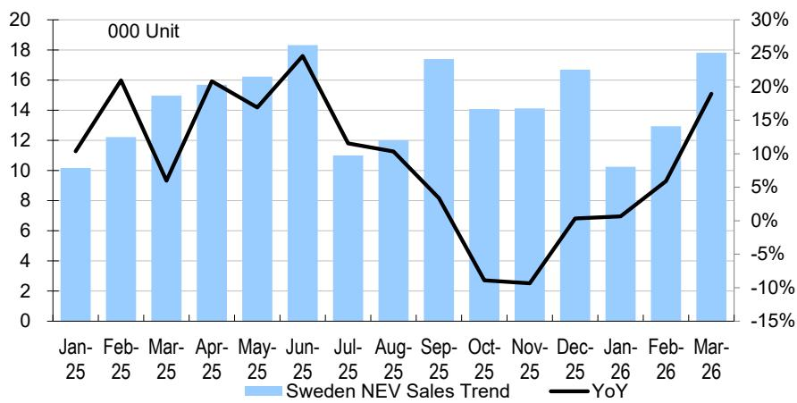

bar_line

| Month | Sweden NEV Sales Trend (000 Unit) | YoY (%) |
| :--- | :--- | :--- |
| Jan-25 | 10.2 | 11.3 |
| Feb-25 | 12.2 | 20.4 |
| Mar-25 | 14.9 | 8.7 |
| Apr-25 | 15.6 | 16.0 |
| May-25 | 16.2 | 14.3 |
| Jun-25 | 18.3 | 24.7 |
| Jul-25 | 10.9 | 11.8 |
| Aug-25 | 11.9 | 11.3 |
| Sep-25 | 17.4 | 8.0 |
| Oct-25 | 14.0 | -9.6 |
| Nov-25 | 14.1 | -9.7 |
| Dec-25 | 16.6 | 0.6 |
| Jan-26 | 10.2 | 0.7 |
| Feb-26 | 12.8 | 7.3 |
| Mar-26 | 17.8 | 15.3 |

Source : Marklines, DB

Figure 55: Sweden NEV Breakdown   
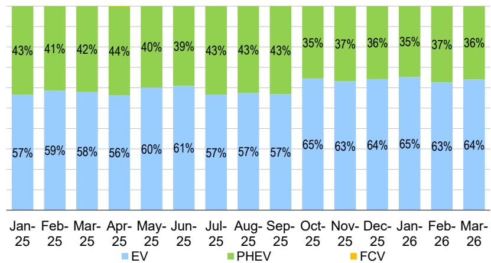

bar_stacked

| Month | EV (%) | PHEV (%) | FCV (%) |
| :--- | :--- | :--- | :--- |
| Jan-25 | 57 | 43 | 0 |
| Feb-25 | 59 | 41 | 0 |
| Mar-25 | 58 | 42 | 0 |
| Apr-25 | 56 | 44 | 0 |
| May-25 | 60 | 40 | 0 |
| Jun-25 | 61 | 39 | 0 |
| Jul-25 | 57 | 43 | 0 |
| Aug-25 | 57 | 43 | 0 |
| Sep-25 | 57 | 43 | 0 |
| Oct-25 | 65 | 35 | 0 |
| Nov-25 | 63 | 37 | 0 |
| Dec-25 | 64 | 36 | 0 |
| Jan-26 | 65 | 35 | 0 |
| Feb-26 | 63 | 37 | 0 |
| Mar-26 | 64 | 36 | 0 |

Source : Marklines, DB

Figure 56: Sweden NEV Penetration Rate   
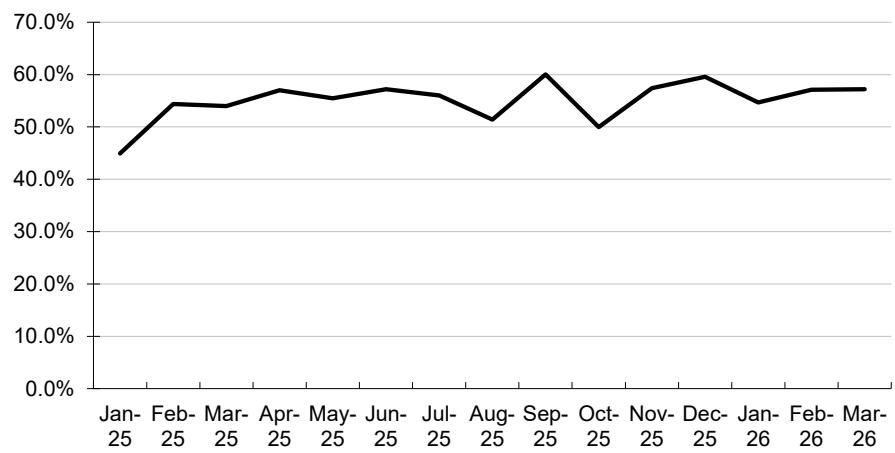

line

| Month   | Value  |
| ------- | ------ |
| Jan-25  | 45.0%  |
| Feb-25  | 55.0%  |
| Mar-25  | 54.0%  |
| Apr-25  | 57.0%  |
| May-25  | 56.0%  |
| Jun-25  | 58.0%  |
| Jul-25  | 57.0%  |
| Aug-25  | 51.0%  |
| Sep-25  | 60.0%  |
| Oct-25  | 50.0%  |
| Nov-25  | 58.0%  |
| Dec-25  | 60.0%  |
| Jan-26  | 55.0%  |
| Feb-26  | 58.0%  |
| Mar-26  | 58.0%  |

Source : Marklines, DB

Figure 57: Thailand Top Models Breakdown 

<table><tr><td colspan="7">Thailand Top Models Breakdown</td></tr><tr><td>(unit)</td><td></td><td>Mar-26</td><td>YoY</td><td>MoM</td><td>3M 2026</td><td>YoY</td></tr><tr><td>Brand</td><td>Model</td><td>11,262</td><td>14.9%</td><td>94.0%</td><td>61,174</td><td>109.0%</td></tr><tr><td>EV</td><td></td><td>10,235</td><td>31.3%</td><td>110.5%</td><td>57,429</td><td>127.4%</td></tr><tr><td>Jaecoo</td><td>Jaecoo 5 EV</td><td>1,183</td><td></td><td>67.8%</td><td>8,694</td><td></td></tr><tr><td>Tesla</td><td>Model 3 EV</td><td>1,093</td><td>443.8%</td><td>390.1%</td><td>1,431</td><td>200.6%</td></tr><tr><td>MG</td><td>MG 4 EV</td><td>932</td><td>35.5%</td><td>169.4%</td><td>3,680</td><td>73.3%</td></tr><tr><td>Geely</td><td>Xingyuan EV</td><td>855</td><td></td><td>303.3%</td><td>1,067</td><td></td></tr><tr><td>GAC Aion</td><td>AionUT EV</td><td>619</td><td></td><td>111.3%</td><td>2,431</td><td></td></tr><tr><td>PHEV</td><td></td><td>1,027</td><td>-48.7%</td><td>9.0%</td><td>3,745</td><td>-6.5%</td></tr><tr><td>BYD</td><td>Sealion 6 PHEV</td><td>248</td><td>-78.9%</td><td>67.6%</td><td>951</td><td>-24.8%</td></tr><tr><td>Jaecoo</td><td>Jaecoo J7 PHEV</td><td>87</td><td></td><td>-9.4%</td><td>396</td><td></td></tr><tr><td>Mercedes-Benz</td><td>E-Class PHEV</td><td>79</td><td>-32.5%</td><td>31.7%</td><td>203</td><td>-45.9%</td></tr><tr><td>Deepal</td><td>S05 PHEV</td><td>77</td><td></td><td>71.1%</td><td>442</td><td></td></tr><tr><td>Porsche</td><td>Cayenne PHEV</td><td>76</td><td>-20.8%</td><td>-30.3%</td><td>238</td><td>-14.4%</td></tr><tr><td>FCV</td><td></td><td>0</td><td></td><td></td><td>0</td><td></td></tr></table>

Source : Marklines, DB

Figure 58: Thailand NEV Sales Trend   
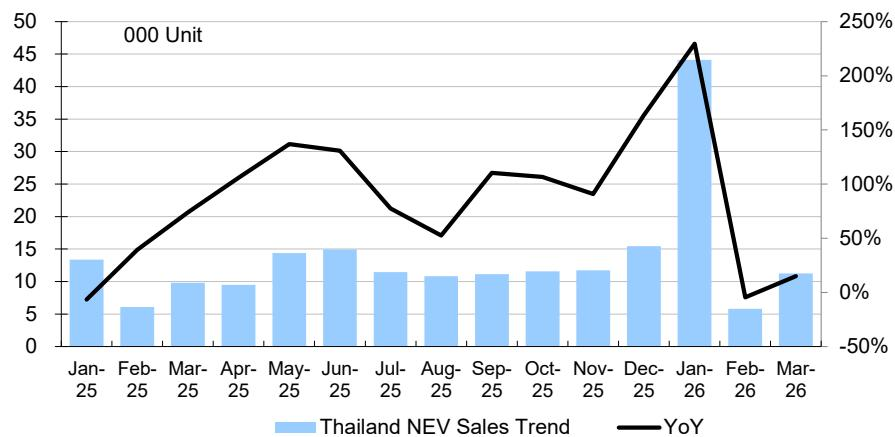

bar_line

| Month | Thailand NEV Sales Trend (000 Unit) | YoY (%) |
|---|---|---|
| Jan-25 | 13 | 7 |
| Feb-25 | 6 | 14 |
| Mar-25 | 10 | 20 |
| Apr-25 | 9 | 25 |
| May-25 | 14 | 31 |
| Jun-25 | 15 | 30 |
| Jul-25 | 11 | 21 |
| Aug-25 | 11 | 16 |
| Sep-25 | 11 | 27 |
| Oct-25 | 11 | 26 |
| Nov-25 | 11 | 23 |
| Dec-25 | 15 | 38 |
| Jan-26 | 44 | 235 |
| Feb-26 | 6 | -1 |
| Mar-26 | 11 | 10 |

Source : Marklines, DB

Figure 59: Thailand NEV Breakdown   
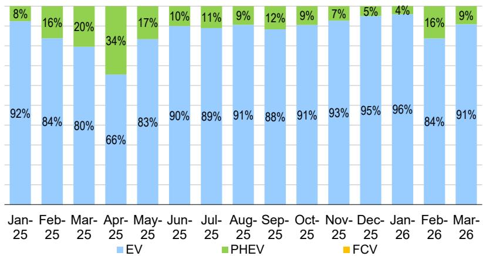

bar_stacked

| Month | EV (%) | PHEV (%) | FCV (%) |
| :--- | :--- | :--- | :--- |
| Jan-25 | 92 | 8 | 0 |
| Feb-25 | 84 | 16 | 0 |
| Mar-25 | 80 | 20 | 0 |
| Apr-25 | 66 | 34 | 0 |
| May-25 | 83 | 17 | 0 |
| Jun-25 | 90 | 10 | 0 |
| Jul-25 | 89 | 11 | 0 |
| Aug-25 | 91 | 9 | 0 |
| Sep-25 | 88 | 12 | 0 |
| Oct-25 | 91 | 9 | 0 |
| Nov-25 | 93 | 7 | 0 |
| Dec-25 | 95 | 5 | 0 |
| Jan-26 | 96 | 4 | 0 |
| Feb-26 | 84 | 16 | 0 |
| Mar-26 | 91 | 9 | 0 |

Source : Marklines, DB

Figure 60: Thailand NEV Penetration Rate   
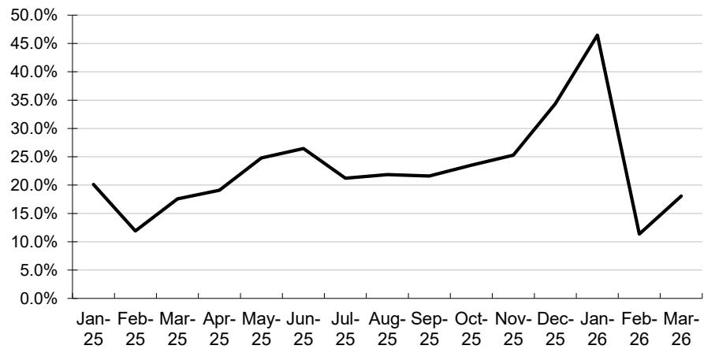

line

| Month | Value (%) |
|---|---|
| Jan-25 | 20.0 |
| Feb-25 | 12.0 |
| Mar-25 | 18.0 |
| Apr-25 | 19.0 |
| May-25 | 25.0 |
| Jun-25 | 27.0 |
| Jul-25 | 21.0 |
| Aug-25 | 22.0 |
| Sep-25 | 21.5 |
| Oct-25 | 23.0 |
| Nov-25 | 25.0 |
| Dec-25 | 34.0 |
| Jan-26 | 46.0 |
| Feb-26 | 11.0 |
| Mar-26 | 18.0 |

Source : Marklines, DB

Figure 61: UK Top Models Breakdown 

<table><tr><td colspan="7">UK Top Models Breakdown</td></tr><tr><td>(unit)</td><td></td><td>Mar-26</td><td>YoY</td><td>MoM</td><td>3M 2026</td><td>YoY</td></tr><tr><td>Brand</td><td>Model</td><td>142,320</td><td>30.7%</td><td>309.0%</td><td>227,833</td><td>25.2%</td></tr><tr><td>EV</td><td></td><td>89,387</td><td>22.2%</td><td>279.3%</td><td>144,186</td><td>14.0%</td></tr><tr><td>Tesla</td><td>Model Y EV</td><td>5,177</td><td>53.0%</td><td>517.8%</td><td>6,215</td><td>-3.2%</td></tr><tr><td>Tesla</td><td>Model 3 EV</td><td>3,422</td><td>-8.9%</td><td>116.0%</td><td>5,524</td><td>-8.4%</td></tr><tr><td>BYD</td><td>Haibao/Seal EV</td><td>3,185</td><td>52.1%</td><td>990.8%</td><td>3,922</td><td>55.6%</td></tr><tr><td>Opel</td><td>Opel Frontera EV</td><td>2,613</td><td></td><td>221.8%</td><td>4,482</td><td></td></tr><tr><td>Ford</td><td>Ford Puma EV</td><td>2,519</td><td></td><td>276.0%</td><td>4,443</td><td></td></tr><tr><td>PHEV</td><td></td><td>52,933</td><td>48.0%</td><td>371.3%</td><td>83,647</td><td>50.9%</td></tr><tr><td>Jaecoo</td><td>Jaecoo 7 PHEV</td><td>8,576</td><td>425.8%</td><td>650.3%</td><td>12,752</td><td>681.9%</td></tr><tr><td>BYD</td><td>Seal U PHEV</td><td>4,250</td><td>43.0%</td><td>426.0%</td><td>7,608</td><td>91.4%</td></tr><tr><td>BYD</td><td>Sealion 05 PHEV</td><td>2,156</td><td></td><td>1376.7%</td><td>2,354</td><td></td></tr><tr><td>Land Rover</td><td>Range Rover Sport PHEV</td><td>1,778</td><td>47.1%</td><td>459.1%</td><td>2,679</td><td>53.7%</td></tr><tr><td>Omoda</td><td>Tiggo 8 PHEV</td><td>1,632</td><td></td><td>226.4%</td><td>3,106</td><td></td></tr></table>

Source : Marklines, DB

Figure 62: UK NEV Sales Trend   
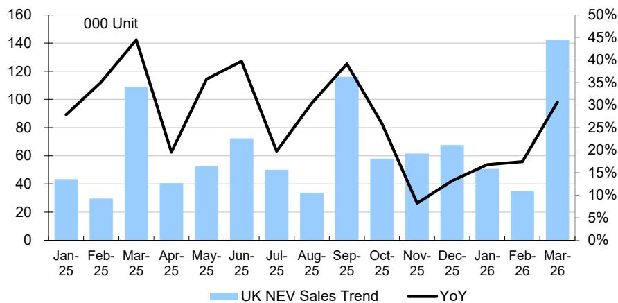

bar_line

| Month   | UK NEV Sales Trend | YoY  |
|---------|--------------------|------|
| Jan-25  | 40                 | 90%  |
| Feb-25  | 30                 | 110% |
| Mar-25  | 110                | 45%  |
| Apr-25  | 40                 | 60%  |
| May-25  | 50                 | 115% |
| Jun-25  | 70                 | 130% |
| Jul-25  | 50                 | 60%  |
| Aug-25  | 35                 | 80%  |
| Sep-25  | 115                | 125% |
| Oct-25  | 55                 | 80%  |
| Nov-25  | 60                 | 20%  |
| Dec-25  | 65                 | 40%  |
| Jan-26  | 50                 | 15%  |
| Feb-26  | 35                 | 15%  |
| Mar-26  | 140                | 30%  |

Source : Marklines, DB

Figure 63: UK NEV Breakdown   
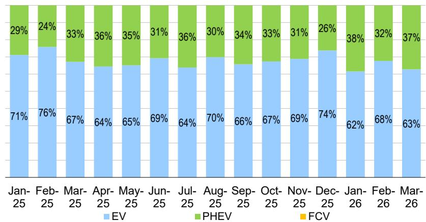

bar_stacked

| Month | EV (%) | PHEV (%) | FCV (%) |
| :--- | :--- | :--- | :--- |
| Jan-25 | 71 | 29 | 0 |
| Feb-25 | 76 | 24 | 0 |
| Mar-25 | 67 | 33 | 0 |
| Apr-25 | 64 | 36 | 0 |
| May-25 | 65 | 35 | 0 |
| Jun-25 | 69 | 31 | 0 |
| Jul-25 | 64 | 36 | 0 |
| Aug-25 | 70 | 30 | 0 |
| Sep-25 | 66 | 34 | 0 |
| Oct-25 | 67 | 33 | 0 |
| Nov-25 | 69 | 31 | 0 |
| Dec-25 | 74 | 26 | 0 |
| Jan-26 | 62 | 38 | 0 |
| Feb-26 | 68 | 32 | 0 |
| Mar-26 | 63 | 37 | 0 |

Source : Marklines, DB

Figure 64: UK NEV Penetration Rate   
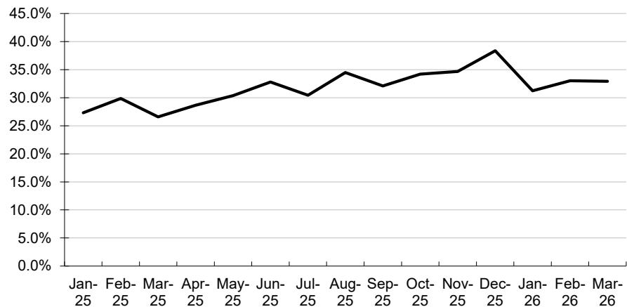

line

| Month | Value (%) |
|---|---|
| Jan-25 | 27.5 |
| Feb-25 | 30.0 |
| Mar-25 | 26.5 |
| Apr-25 | 28.5 |
| May-25 | 30.5 |
| Jun-25 | 33.0 |
| Jul-25 | 30.5 |
| Aug-25 | 34.5 |
| Sep-25 | 32.0 |
| Oct-25 | 34.0 |
| Nov-25 | 34.5 |
| Dec-25 | 38.5 |
| Jan-26 | 31.0 |
| Feb-26 | 33.0 |
| Mar-26 | 33.0 |

Source : Marklines, DB

Figure 65: USA Top Models Breakdown 

<table><tr><td colspan="7">USA Top Models Breakdown</td></tr><tr><td>(unit)</td><td></td><td>Mar-26</td><td>YoY</td><td>MoM</td><td>3M 2026</td><td>YoY</td></tr><tr><td>Brand</td><td>Model</td><td>100,691</td><td>-35.5%</td><td>29.4%</td><td>256,146</td><td>-34.3%</td></tr><tr><td>EV</td><td></td><td>86,607</td><td>-27.8%</td><td>32.9%</td><td>217,371</td><td>-29.1%</td></tr><tr><td>Tesla</td><td>Model Y EV</td><td>28,340</td><td>24.1%</td><td>57.4%</td><td>70,340</td><td>9.8%</td></tr><tr><td>Tesla</td><td>Model 3 EV</td><td>11,610</td><td>-47.7%</td><td>45.1%</td><td>30,610</td><td>-41.7%</td></tr><tr><td>Chevrolet</td><td>Equinox EV</td><td>4,582</td><td>-5.7%</td><td>24.6%</td><td>9,589</td><td>-7.2%</td></tr><tr><td>Hyundai</td><td>IONIQ 5 EV</td><td>4,425</td><td>12.9%</td><td>36.6%</td><td>9,790</td><td>13.7%</td></tr><tr><td>Toyota</td><td>bZ4X EV</td><td>4,019</td><td>139.5%</td><td>24.0%</td><td>10,029</td><td>78.8%</td></tr><tr><td>PHEV</td><td></td><td>14,060</td><td>-61.2%</td><td>11.3%</td><td>38,691</td><td>-53.5%</td></tr><tr><td>BMW</td><td>X5 PHEV</td><td>1,972</td><td>-10.0%</td><td>23.3%</td><td>4,784</td><td>-3.5%</td></tr><tr><td>Toyota</td><td>Prius PHEV</td><td>1,211</td><td>-20.9%</td><td>101.8%</td><td>2,611</td><td>-30.6%</td></tr><tr><td>Lexus</td><td>Lexus NX PHEV</td><td>1,201</td><td>5.1%</td><td>-0.6%</td><td>3,229</td><td>21.6%</td></tr><tr><td>Lexus</td><td>Lexus RX PHEV</td><td>860</td><td>-18.8%</td><td>31.9%</td><td>2,045</td><td>0.4%</td></tr><tr><td>Kia</td><td>Sportage PHEV</td><td>735</td><td>-48.6%</td><td>34.9%</td><td>1,836</td><td>-44.7%</td></tr></table>

Source : Marklines, DB

Figure 66: USA NEV Sales Trend   
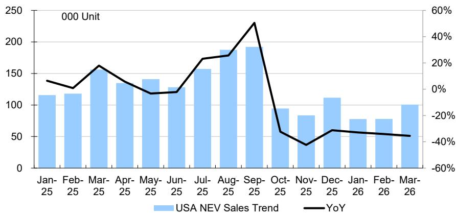

bar_line

| Month | USA NEV Sales Trend (000 Unit) | YoY (%) |
| :--- | :--- | :--- |
| Jan-25 | 115 | 13.5 |
| Feb-25 | 118 | 10.0 |
| Mar-25 | 160 | 16.0 |
| Apr-25 | 135 | 9.0 |
| May-25 | 140 | 11.0 |
| Jun-25 | 125 | 11.5 |
| Jul-25 | 158 | 17.0 |
| Aug-25 | 188 | 20.0 |
| Sep-25 | 192 | 48.0 |
| Oct-25 | 95 | -30.0 |
| Nov-25 | 83 | -42.0 |
| Dec-25 | 112 | -30.0 |
| Jan-26 | 77 | -33.0 |
| Feb-26 | 77 | -34.0 |
| Mar-26 | 100 | -36.0 |

Source : Marklines, DB

Figure 67: USA NEV Breakdown   
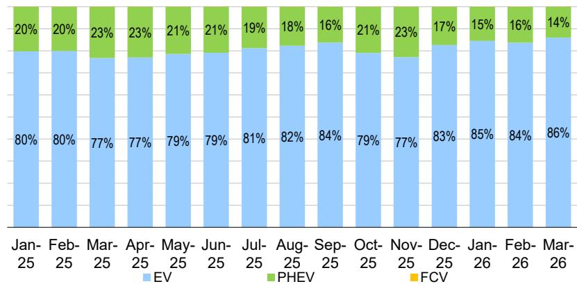

bar_stacked

| Month | EV (%) | PHEV (%) | FCV (%) |
| :--- | :--- | :--- | :--- |
| Jan-25 | 80 | 20 | 0 |
| Feb-25 | 80 | 20 | 0 |
| Mar-25 | 77 | 23 | 0 |
| Apr-25 | 77 | 23 | 0 |
| May-25 | 79 | 21 | 0 |
| Jun-25 | 79 | 21 | 0 |
| Jul-25 | 81 | 19 | 0 |
| Aug-25 | 82 | 18 | 0 |
| Sep-25 | 84 | 16 | 0 |
| Oct-25 | 79 | 21 | 0 |
| Nov-25 | 77 | 23 | 0 |
| Dec-25 | 83 | 17 | 0 |
| Jan-26 | 85 | 15 | 0 |
| Feb-26 | 84 | 16 | 0 |
| Mar-26 | 86 | 14 | 0 |

Source : Marklines, DB

Figure 68: USA NEV Penetration Rate   
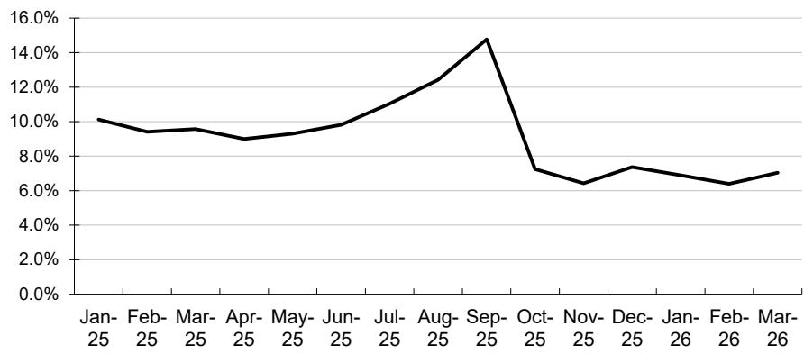

line

| Month | Value (%) |
|---|---|
| Jan-25 | 10.0 |
| Feb-25 | 9.4 |
| Mar-25 | 9.6 |
| Apr-25 | 8.9 |
| May-25 | 9.2 |
| Jun-25 | 9.7 |
| Jul-25 | 10.8 |
| Aug-25 | 12.3 |
| Sep-25 | 14.7 |
| Oct-25 | 7.2 |
| Nov-25 | 6.3 |
| Dec-25 | 7.4 |
| Jan-26 | 6.9 |
| Feb-26 | 6.3 |
| Mar-26 | 7.1 |

Source : Marklines, DB

# NEV Sales by OEM in G15 Countries

Figure 69: BYD NEV Sales by Country 

<table><tr><td colspan="6">BYD NEV Sales Breakdown</td></tr><tr><td></td><td>Mar-26</td><td>YoY</td><td>MoM</td><td>3M 2026</td><td>YoY</td></tr><tr><td>BYD NEV Sales</td><td>341,976</td><td>-13.2%</td><td>61.4%</td><td>795,378</td><td>-23.3%</td></tr><tr><td>China</td><td>295,693</td><td>-20.4%</td><td>57.5%</td><td>688,993</td><td>-30.1%</td></tr><tr><td>Brazil</td><td>16,210</td><td>104.4%</td><td>42.9%</td><td>37,289</td><td>74.6%</td></tr><tr><td>UK</td><td>15,162</td><td>134.0%</td><td>603.9%</td><td>21,337</td><td>130.1%</td></tr><tr><td>Italy</td><td>5,191</td><td>170.6%</td><td>26.4%</td><td>12,852</td><td>203.5%</td></tr><tr><td>Germany</td><td>3,437</td><td>329.1%</td><td>12.6%</td><td>9,119</td><td>650.5%</td></tr><tr><td>Korea</td><td>1,664</td><td>16540.0%</td><td>73.9%</td><td>3,968</td><td>39580.0%</td></tr><tr><td>France</td><td>1,530</td><td>132.2%</td><td>55.2%</td><td>3,388</td><td>108.2%</td></tr><tr><td>Thailand</td><td>988</td><td>-72.6%</td><td>221.8%</td><td>14,525</td><td>42.6%</td></tr><tr><td>Norway</td><td>782</td><td>139.1%</td><td>520.6%</td><td>958</td><td>29.3%</td></tr><tr><td>Japan</td><td>625</td><td>88.8%</td><td>34.1%</td><td>1,271</td><td>110.1%</td></tr><tr><td>India</td><td>433</td><td>-5.0%</td><td>10.5%</td><td>1,100</td><td>-2.4%</td></tr></table>

Source : Marklines, DB

Figure 70: BYD NEV Sales Breakdown - Top Models 

<table><tr><td colspan="7">BYD NEV Sales Breakdown - Top Models</td></tr><tr><td>(unit)</td><td></td><td>Mar-26</td><td>YoY</td><td>MoM</td><td>3M 2026</td><td>YoY</td></tr><tr><td>Brand</td><td>Model</td><td>341,976</td><td>-13.2%</td><td>61.4%</td><td>795,378</td><td>-23.3%</td></tr><tr><td>BYD</td><td>Seagull EV</td><td>30,636</td><td>-13.8%</td><td>51.7%</td><td>70,971</td><td>-39.8%</td></tr><tr><td>BYD</td><td>Dolphin EV</td><td>29,329</td><td>58.6%</td><td>151.1%</td><td>60,723</td><td>45.2%</td></tr><tr><td>BYD</td><td>Song PLUS PHEV</td><td>27,584</td><td>-35.0%</td><td>96.9%</td><td>59,413</td><td>-52.2%</td></tr><tr><td>BYD</td><td>Song Pro PHEV</td><td>24,497</td><td>-22.4%</td><td>48.9%</td><td>61,990</td><td>-17.2%</td></tr><tr><td>BYD</td><td>Yuan UP EV</td><td>20,899</td><td>-16.5%</td><td>88.9%</td><td>42,848</td><td>-23.7%</td></tr><tr><td>BYD</td><td>Seal 06 PHEV</td><td>16,431</td><td>-8.4%</td><td>60.6%</td><td>36,628</td><td>-23.7%</td></tr><tr><td>FangChengBao</td><td>Tai 7 PHEV</td><td>15,041</td><td></td><td>28.1%</td><td>43,896</td><td></td></tr><tr><td>BYD</td><td>Sealion 07 EV</td><td>12,042</td><td>9.5%</td><td>59.1%</td><td>28,486</td><td>-1.5%</td></tr><tr><td>BYD</td><td>Qin PLUS PHEV</td><td>11,425</td><td>-40.9%</td><td>-5.9%</td><td>35,241</td><td>-27.1%</td></tr><tr><td>BYD</td><td>Song Ultra EV</td><td>10,600</td><td></td><td></td><td>10,600</td><td></td></tr></table>

Source : Marklines, DB

Figure 71: BYD NEV Sales Trend   
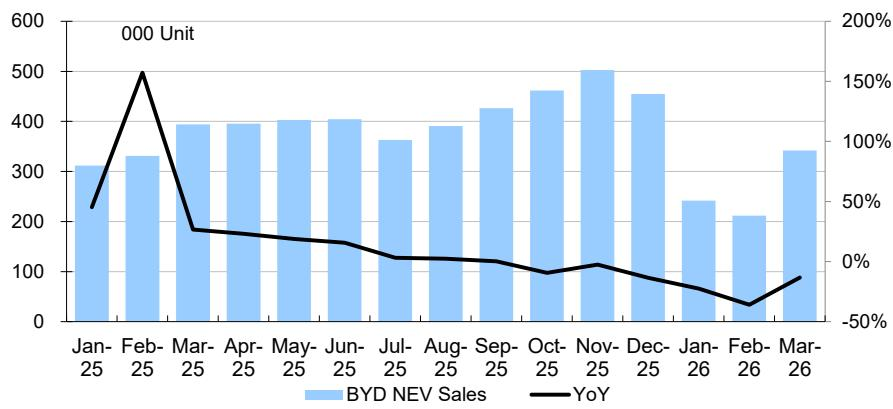

bar_line

| Month   | BYD NEV Sales | YoY    |
|---------|---------------|--------|
| Jan-25  | 310           | 23%    |
| Feb-25  | 330           | 150%   |
| Mar-25  | 390           | 18%    |
| Apr-25  | 395           | 17%    |
| May-25  | 400           | 16%    |
| Jun-25  | 405           | 15%    |
| Jul-25  | 360           | 12%    |
| Aug-25  | 390           | 11%    |
| Sep-25  | 425           | 11%    |
| Oct-25  | 460           | 9%     |
| Nov-25  | 500           | 11%    |
| Dec-25  | 450           | 8%     |
| Jan-26  | 240           | -10%   |
| Feb-26  | 210           | -20%   |
| Mar-26  | 340           | -8%    |

Source : Marklines, DB

Figure 72: BYD G15 NEV Market Share   
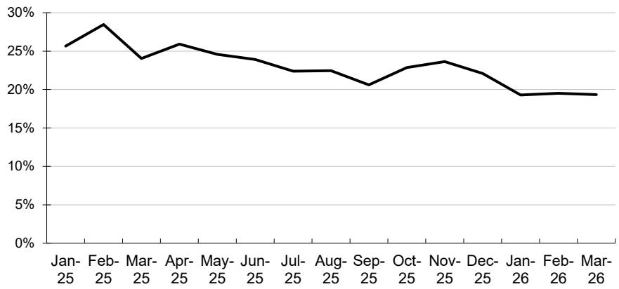

line

| Month   | Value |
| ------- | ----- |
| Jan-25  | 25%   |
| Feb-25  | 28%   |
| Mar-25  | 24%   |
| Apr-25  | 26%   |
| May-25  | 24%   |
| Jun-25  | 23%   |
| Jul-25  | 22%   |
| Aug-25  | 22%   |
| Sep-25  | 20%   |
| Oct-25  | 23%   |
| Nov-25  | 24%   |
| Dec-25  | 22%   |
| Jan-26  | 19%   |
| Feb-26  | 19%   |
| Mar-26  | 19%   |

Source : Marklines, DB

Figure 73: Geely NEV Sales by Country 

<table><tr><td colspan="6">Geely NEV Sales Breakdown</td></tr><tr><td></td><td>Mar-26</td><td>YoY</td><td>MoM</td><td>3M 2026</td><td>YoY</td></tr><tr><td>Geely NEV Sales</td><td>143,403</td><td>7.9%</td><td>13.2%</td><td>403,716</td><td>9.6%</td></tr><tr><td>China</td><td>131,557</td><td>3.6%</td><td>8.3%</td><td>380,690</td><td>7.1%</td></tr><tr><td>UK</td><td>3,933</td><td>48.5%</td><td>334.1%</td><td>6,026</td><td>41.0%</td></tr><tr><td>Thailand</td><td>1,691</td><td>438.5%</td><td>61.4%</td><td>3,685</td><td>378.6%</td></tr><tr><td>Brazil</td><td>1,165</td><td>10490.9%</td><td>497.4%</td><td>2,489</td><td>4686.5%</td></tr><tr><td>USA</td><td>1,013</td><td>81.9%</td><td>25.4%</td><td>2,525</td><td>16.1%</td></tr><tr><td>Sweden</td><td>966</td><td>41.2%</td><td>26.8%</td><td>2,313</td><td>28.4%</td></tr><tr><td>Italy</td><td>759</td><td>814.5%</td><td>88.8%</td><td>1,625</td><td>588.6%</td></tr><tr><td>Korea</td><td>684</td><td>122.8%</td><td>181.5%</td><td>954</td><td>98.3%</td></tr><tr><td>Germany</td><td>622</td><td>66.3%</td><td>57.9%</td><td>1,625</td><td>72.5%</td></tr><tr><td>Norway</td><td>581</td><td>102.4%</td><td>96.9%</td><td>973</td><td>35.0%</td></tr><tr><td>Finland</td><td>174</td><td>-4.4%</td><td>222.2%</td><td>258</td><td>-39.9%</td></tr><tr><td>Canada</td><td>170</td><td>-62.1%</td><td>78.9%</td><td>350</td><td>-66.7%</td></tr><tr><td>France</td><td>84</td><td>394.1%</td><td>61.5%</td><td>195</td><td>282.4%</td></tr><tr><td>Japan</td><td>4</td><td>300.0%</td><td></td><td>7</td><td>-41.7%</td></tr><tr><td colspan="6">Source: Marklines, DB</td></tr></table>

Figure 75: Geely NEV Sales Trend   
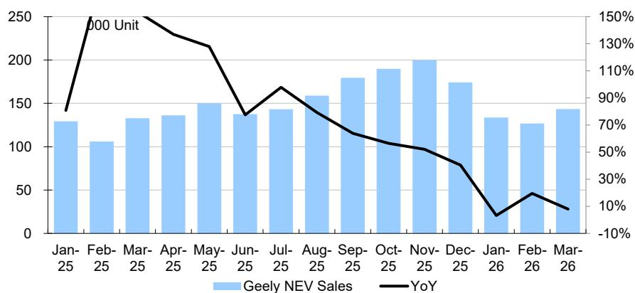

bar_line

| Month   | Geely NEV Sales | YoY   |
|---------|-----------------|-------|
| Jan-25  | 130             | 140%  |
| Feb-25  | 105             | 250%  |
| Mar-25  | 135             | 240%  |
| Apr-25  | 138             | 220%  |
| May-25  | 150             | 210%  |
| Jun-25  | 138             | 75%   |
| Jul-25  | 145             | 95%   |
| Aug-25  | 160             | 85%   |
| Sep-25  | 180             | 70%   |
| Oct-25  | 190             | 65%   |
| Nov-25  | 200             | 60%   |
| Dec-25  | 175             | 40%   |
| Jan-26  | 135             | -10%  |
| Feb-26  | 128             | 30%   |
| Mar-26  | 145             | 10%   |

Source : Marklines, DB

Figure 74: Geely NEV Sales Breakdown - Top Models 

<table><tr><td colspan="7">Geely NEV Sales Breakdown - Top Models</td></tr><tr><td>(unit)</td><td></td><td>Mar-26</td><td>YoY</td><td>MoM</td><td>3M 2026</td><td>YoY</td></tr><tr><td>Brand</td><td>Model</td><td>143,403</td><td>7.9%</td><td>13.2%</td><td>403,716</td><td>9.6%</td></tr><tr><td>Geely</td><td>Xingyuan EV</td><td>42,625</td><td>31.2%</td><td>11.4%</td><td>123,689</td><td>38.6%</td></tr><tr><td>Geely Galaxy</td><td>Galaxy Starship 7 PHEV</td><td>19,938</td><td>67.7%</td><td>81.5%</td><td>42,740</td><td>1.1%</td></tr><tr><td>ZEEKR</td><td>ZEEKR 9X PHEV</td><td>10,191</td><td></td><td>94.4%</td><td>22,035</td><td></td></tr><tr><td>ZEEKR</td><td>ZEEKR 7X EV</td><td>9,914</td><td>80.4%</td><td>-3.0%</td><td>31,034</td><td>110.4%</td></tr><tr><td>Geely Galaxy</td><td>Galaxy E5 EV</td><td>8,337</td><td>-47.2%</td><td>10.9%</td><td>22,051</td><td>-47.8%</td></tr><tr><td>LYNK &amp; CO</td><td>LYNK &amp; CO 08 EM-P PHEV</td><td>5,523</td><td>62.7%</td><td>-18.4%</td><td>17,412</td><td>75.4%</td></tr><tr><td>Polestar</td><td>Polestar 4 EV</td><td>4,612</td><td>80.7%</td><td>12.2%</td><td>11,944</td><td>98.8%</td></tr><tr><td>Geely Galaxy</td><td>Galaxy A7 PHEV</td><td>4,053</td><td></td><td>-19.9%</td><td>15,024</td><td></td></tr><tr><td>ZEEKR</td><td>ZEEKR 007 EV</td><td>3,849</td><td>138.8%</td><td>77.0%</td><td>8,075</td><td>92.9%</td></tr><tr><td>Geely Galaxy</td><td>Galaxy M9 PHEV</td><td>3,385</td><td></td><td>-32.9%</td><td>15,025</td><td></td></tr></table>

Source : Marklines, DB

Figure 76: Geely G15 NEV Market Share   
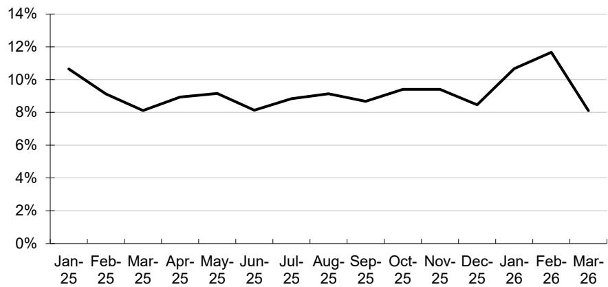

line

| Month | Value (%) |
|---|---|
| Jan-25 | 10.7 |
| Feb-25 | 9.3 |
| Mar-25 | 8.0 |
| Apr-25 | 8.9 |
| May-25 | 9.1 |
| Jun-25 | 8.0 |
| Jul-25 | 8.8 |
| Aug-25 | 9.1 |
| Sep-25 | 8.6 |
| Oct-25 | 9.4 |
| Nov-25 | 9.4 |
| Dec-25 | 8.4 |
| Jan-26 | 10.7 |
| Feb-26 | 11.7 |
| Mar-26 | 8.0 |

Source : Marklines, DB

Figure 77: Great Wall Motor NEV Sales by Country 

<table><tr><td colspan="6">Great Wall Motor NEV Sales Breakdown</td></tr><tr><td></td><td>Mar-26</td><td>YoY</td><td>MoM</td><td>3M 2026</td><td>YoY</td></tr><tr><td>GWM NEV Sales</td><td>23,426</td><td>-10.7%</td><td>73.4%</td><td>57,596</td><td>-12.2%</td></tr><tr><td>China</td><td>22,081</td><td>-12.3%</td><td>73.3%</td><td>52,841</td><td>-15.5%</td></tr><tr><td>Brazil</td><td>1,219</td><td>500.5%</td><td>87.8%</td><td>2,424</td><td>197.8%</td></tr><tr><td>Thailand</td><td>75</td><td>-89.6%</td><td>-14.8%</td><td>2,218</td><td>30.7%</td></tr><tr><td>Germany</td><td>33</td><td>-75.4%</td><td>17.9%</td><td>87</td><td>-84.8%</td></tr></table>

Source : Marklines, DB

Figure 78: Great Wall Motor NEV Sales Breakdown - Top Models 

<table><tr><td colspan="7">Great Wall Motor NEV Sales Breakdown - Top Models</td></tr><tr><td>(unit)</td><td></td><td>Mar-26</td><td>YoY</td><td>MoM</td><td>3M 2026</td><td>YoY</td></tr><tr><td>Brand</td><td>Model</td><td>23,426</td><td>-10.7%</td><td>73.4%</td><td>57,596</td><td>-12.2%</td></tr><tr><td>WEY</td><td>Gaoshan PHEV</td><td>7,018</td><td>1517.1%</td><td>51.3%</td><td>18,414</td><td>1361.4%</td></tr><tr><td>Tank</td><td>Tank 500 PHEV</td><td>3,238</td><td>-17.5%</td><td>143.8%</td><td>6,646</td><td>-43.1%</td></tr><tr><td>Haval</td><td>Haval Raptor/Menglong PHEV</td><td>2,642</td><td>-52.5%</td><td>15.7%</td><td>7,117</td><td>-49.7%</td></tr><tr><td>Tank</td><td>Tank 400 PHEV</td><td>2,589</td><td>-1.6%</td><td>136.0%</td><td>5,456</td><td>-19.1%</td></tr><tr><td>Tank</td><td>Tank 300 PHEV</td><td>2,558</td><td>-15.8%</td><td>128.8%</td><td>5,189</td><td>70.7%</td></tr><tr><td>ORA</td><td>ORA Good Cat EV</td><td>1,850</td><td>-42.8%</td><td>109.3%</td><td>5,664</td><td>-33.3%</td></tr><tr><td>Haval</td><td>Fierce Dragon PHEV</td><td>1,026</td><td></td><td>896.1%</td><td>1,642</td><td>4461.1%</td></tr><tr><td>ORA</td><td>ORA 5 EV</td><td>1,010</td><td></td><td>62.6%</td><td>2,851</td><td></td></tr><tr><td>WEY</td><td>Blue Mountain PHEV</td><td>668</td><td>-83.3%</td><td>-25.0%</td><td>2,581</td><td>-77.3%</td></tr><tr><td>Tank</td><td>Tank 700 PHEV</td><td>535</td><td>-11.4%</td><td>1088.9%</td><td>729</td><td>-63.1%</td></tr></table>

Source : Marklines, DB

Figure 79: Great Wall Motor NEV Sales Trend   
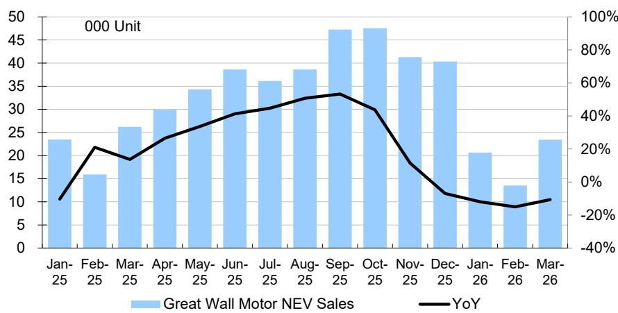

bar_line

| Month   | Great Wall Motor NEV Sales (000 Unit) | YoY (%) |
|---------|----------------------------------------|---------|
| Jan-25  | 23                                     | 10      |
| Feb-25  | 16                                     | 22      |
| Mar-25  | 26                                     | 18      |
| Apr-25  | 30                                     | 24      |
| May-25  | 34                                     | 28      |
| Jun-25  | 38                                     | 30      |
| Jul-25  | 36                                     | 32      |
| Aug-25  | 38                                     | 34      |
| Sep-25  | 47                                     | 36      |
| Oct-25  | 47                                     | 30      |
| Nov-25  | 41                                     | 18      |
| Dec-25  | 40                                     | 5       |
| Jan-26  | 21                                     | -5      |
| Feb-26  | 14                                     | -10     |
| Mar-26  | 23                                     | -5      |

Source : Marklines, DB

Figure 80: Great Wall Motor G15 NEV Market Share   
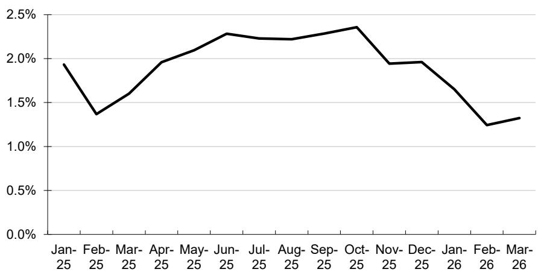

line

| Month   | Value |
| ------- | ----- |
| Jan-25  | 1.9%  |
| Feb-25  | 1.3%  |
| Mar-25  | 1.6%  |
| Apr-25  | 1.9%  |
| May-25  | 2.1%  |
| Jun-25  | 2.3%  |
| Jul-25  | 2.2%  |
| Aug-25  | 2.2%  |
| Sep-25  | 2.3%  |
| Oct-25  | 2.4%  |
| Nov-25  | 1.9%  |
| Dec-25  | 1.9%  |
| Jan-26  | 1.7%  |
| Feb-26  | 1.2%  |
| Mar-26  | 1.3%  |

Source : Marklines, DB

Figure 81: Li Auto NEV Sales by Country 

<table><tr><td rowspan="2"></td><td colspan="5">Li Auto NEV Sales Breakdown</td></tr><tr><td>Mar-26</td><td>YoY</td><td>MoM</td><td>3M 2026</td><td>YoY</td></tr><tr><td>Li Auto NEV Sales</td><td>41,053</td><td>11.9%</td><td>55.4%</td><td>95,142</td><td>2.5%</td></tr><tr><td>China</td><td>41,053</td><td>11.9%</td><td>55.4%</td><td>95,142</td><td>2.5%</td></tr></table>

Source : Marklines, DB

Figure 82: Li Auto NEV Sales Breakdown - Top Models 

<table><tr><td colspan="7">Li Auto NEV Sales Breakdown - Top Models</td></tr><tr><td>(unit)</td><td></td><td>Mar-26</td><td>YoY</td><td>MoM</td><td>3M 2026</td><td>YoY</td></tr><tr><td>Brand</td><td>Model</td><td>41,053</td><td>11.9%</td><td>55.4%</td><td>95,142</td><td>2.5%</td></tr><tr><td>Li Auto</td><td>Li L6 PHEV</td><td>8,130</td><td>-52.7%</td><td>65.9%</td><td>18,055</td><td>-59.3%</td></tr><tr><td>Li Auto</td><td>Li L7 PHEV</td><td>2,898</td><td>-66.7%</td><td>62.1%</td><td>6,799</td><td>-67.6%</td></tr><tr><td>Li Auto</td><td>Li L8 PHEV</td><td>1,622</td><td>-69.3%</td><td>55.1%</td><td>3,841</td><td>-70.3%</td></tr><tr><td>Li Auto</td><td>Li L9 PHEV</td><td>1,550</td><td>-66.1%</td><td>43.3%</td><td>3,679</td><td>-69.8%</td></tr><tr><td>Li Auto</td><td>Li MEGA EV</td><td>576</td><td>-37.1%</td><td>48.5%</td><td>1,378</td><td>-42.7%</td></tr></table>

Source : Marklines, DB

Figure 83: Li Auto NEV Sales Trend   
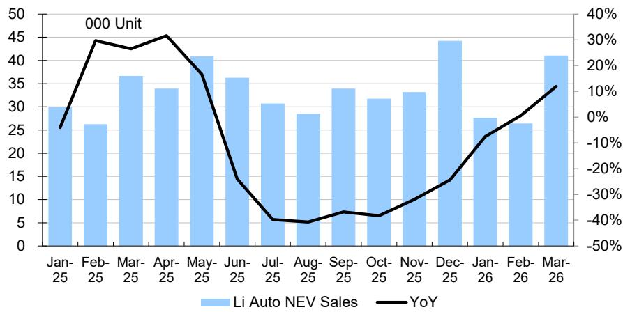

bar_line

| Month   | Li Auto NEV Sales | YoY     |
|---------|-------------------|---------|
| Jan-25  | 30                | -       |
| Feb-25  | 26                | 30%     |
| Mar-25  | 37                | 28%     |
| Apr-25  | 34                | 35%     |
| May-25  | 41                | 30%     |
| Jun-25  | 36                | -10%    |
| Jul-25  | 31                | -40%    |
| Aug-25  | 29                | -40%    |
| Sep-25  | 34                | -30%    |
| Oct-25  | 32                | -30%    |
| Nov-25  | 33                | -10%    |
| Dec-25  | 44                | 0%      |
| Jan-26  | 28                | 10%     |
| Feb-26  | 27                | 15%     |
| Mar-26  | 41                | 20%     |

Source : Marklines, DB

Figure 84: Li Auto G15 NEV Market Share   
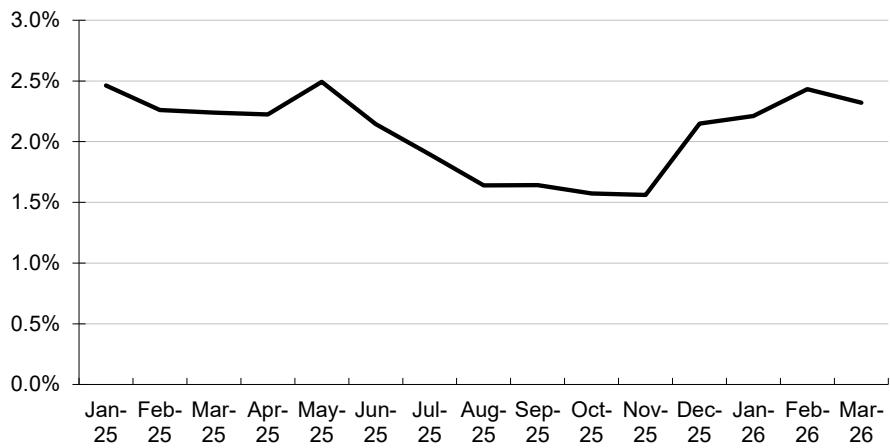

line

| Month   | Value |
| ------- | ----- |
| Jan-25  | 2.4%  |
| Feb-25  | 2.2%  |
| Mar-25  | 2.2%  |
| Apr-25  | 2.2%  |
| May-25  | 2.5%  |
| Jun-25  | 2.1%  |
| Jul-25  | 1.8%  |
| Aug-25  | 1.6%  |
| Sep-25  | 1.6%  |
| Oct-25  | 1.5%  |
| Nov-25  | 1.5%  |
| Dec-25  | 2.1%  |
| Jan-26  | 2.2%  |
| Feb-26  | 2.4%  |
| Mar-26  | 2.3%  |

Source : Marklines, DB

Figure 85: XPeng NEV Sales by Country 

<table><tr><td rowspan="2"></td><td colspan="5">Xpeng NEV Sales Breakdown</td></tr><tr><td>Mar-26</td><td>YoY</td><td>MoM</td><td>3M 2026</td><td>YoY</td></tr><tr><td>Xpeng NEV Sales</td><td>29,814</td><td>-12.6%</td><td>77.1%</td><td>67,930</td><td>-29.4%</td></tr><tr><td>China</td><td>27,415</td><td>-17.4%</td><td>79.7%</td><td>62,682</td><td>-33.3%</td></tr><tr><td>Germany</td><td>549</td><td>211.9%</td><td>65.9%</td><td>1,207</td><td>179.4%</td></tr><tr><td>Thailand</td><td>525</td><td>291.8%</td><td>35.7%</td><td>1,325</td><td>259.1%</td></tr><tr><td>Norway</td><td>460</td><td>62.5%</td><td>18.6%</td><td>888</td><td>32.1%</td></tr><tr><td>France</td><td>400</td><td>101.0%</td><td>13.3%</td><td>1,150</td><td>127.3%</td></tr><tr><td>UK</td><td>331</td><td>819.4%</td><td>1404.5%</td><td>353</td><td>880.6%</td></tr><tr><td>Sweden</td><td>88</td><td>-2.2%</td><td>49.2%</td><td>187</td><td>-7.9%</td></tr></table>

Source : Marklines, DB

Figure 86: XPeng NEV Sales Breakdown - Top Models 

<table><tr><td colspan="7">Xpeng NEV Sales Breakdown - Top Models</td></tr><tr><td>(unit)</td><td></td><td>Mar-26</td><td>YoY</td><td>MoM</td><td>3M 2026</td><td>YoY</td></tr><tr><td>Brand</td><td>Model</td><td>29,814</td><td>-12.6%</td><td>77.1%</td><td>67,930</td><td>-29.4%</td></tr><tr><td>XPeng</td><td>Xpeng Mona M03 EV</td><td>9,335</td><td>-43.7%</td><td>113.4%</td><td>20,432</td><td>-56.6%</td></tr><tr><td>XPeng</td><td>XPeng G6 EV</td><td>7,248</td><td>51.3%</td><td>66.2%</td><td>15,874</td><td>8.0%</td></tr><tr><td>XPeng</td><td>XPeng P7+ EV</td><td>3,764</td><td>-56.0%</td><td>47.2%</td><td>9,066</td><td>-62.0%</td></tr><tr><td>XPeng</td><td>XPeng G7 EV</td><td>2,397</td><td></td><td>119.1%</td><td>4,751</td><td></td></tr><tr><td>XPeng</td><td>XPeng G9 EV</td><td>2,197</td><td>-17.2%</td><td>25.8%</td><td>4,988</td><td>-20.0%</td></tr><tr><td>XPeng</td><td>XPeng X9 EV</td><td>1,775</td><td>35.1%</td><td>459.9%</td><td>2,568</td><td>-27.0%</td></tr><tr><td>XPeng</td><td>XPeng P7 EV</td><td>1,630</td><td>654.6%</td><td>138.3%</td><td>3,176</td><td>313.0%</td></tr></table>

Source : Marklines, DB

Figure 87: XPeng NEV Sales Trend   
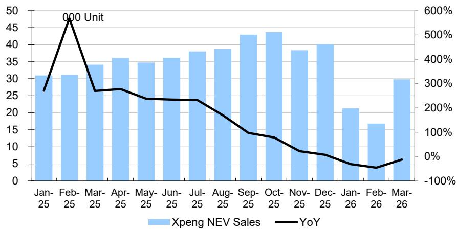

bar_line

| Month   | Xpeng NEV Sales | YoY     |
|---------|-----------------|---------|
| Jan-25  | 31              | 27%     |
| Feb-25  | 31              | 600%    |
| Mar-25  | 34              | 27%     |
| Apr-25  | 36              | 28%     |
| May-25  | 35              | 25%     |
| Jun-25  | 36              | 24%     |
| Jul-25  | 38              | 24%     |
| Aug-25  | 39              | 18%     |
| Sep-25  | 43              | 13%     |
| Oct-25  | 44              | 11%     |
| Nov-25  | 38              | 6%      |
| Dec-25  | 40              | 4%      |
| Jan-26  | 21              | -3%     |
| Feb-26  | 17              | -5%     |
| Mar-26  | 30              | -1%     |

Source : Marklines, DB

Figure 88: XPeng G15 NEV Market Share   
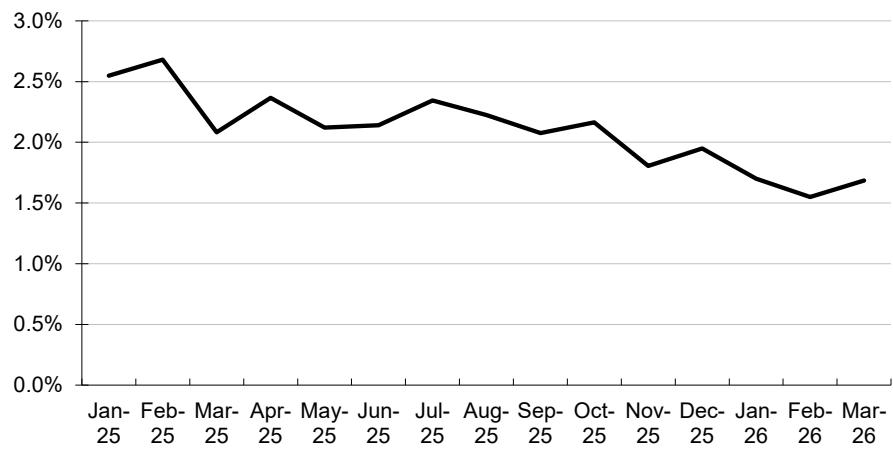

line

| Month   | Value  |
| ------- | ------ |
| Jan-25  | 2.5%   |
| Feb-25  | 2.7%   |
| Mar-25  | 2.1%   |
| Apr-25  | 2.4%   |
| May-25  | 2.1%   |
| Jun-25  | 2.1%   |
| Jul-25  | 2.3%   |
| Aug-25  | 2.2%   |
| Sep-25  | 2.1%   |
| Oct-25  | 2.2%   |
| Nov-25  | 1.8%   |
| Dec-25  | 1.9%   |
| Jan-26  | 1.7%   |
| Feb-26  | 1.5%   |
| Mar-26  | 1.7%   |

Source : Marklines, DB

Figure 89: NIO NEV Sales by Country 

<table><tr><td></td><td colspan="5">NIO NEV Sales Breakdown</td></tr><tr><td></td><td>Mar-26</td><td>YoY</td><td>MoM</td><td>3M 2026</td><td>YoY</td></tr><tr><td>NIO NEV Sales</td><td>35,513</td><td>135.0%</td><td>70.6%</td><td>83,523</td><td>97.6%</td></tr><tr><td>China</td><td>35,486</td><td>136.0%</td><td>70.6%</td><td>83,465</td><td>98.3%</td></tr><tr><td>Norway</td><td>25</td><td>-43.2%</td><td>66.7%</td><td>50</td><td>-52.4%</td></tr><tr><td>Germany</td><td>2</td><td>-90.5%</td><td>-60.0%</td><td>8</td><td>-87.5%</td></tr><tr><td>Brazil</td><td>0</td><td></td><td></td><td>0</td><td></td></tr></table>

Source : Marklines, DB

Figure 90: NIO NEV Sales Breakdown - Top Models 

<table><tr><td colspan="7">NIO NEV Sales Breakdown - Top Models</td></tr><tr><td>(unit)</td><td></td><td>Mar-26</td><td>YoY</td><td>MoM</td><td>3M 2026</td><td>YoY</td></tr><tr><td>Brand</td><td>Model</td><td>35,513</td><td>135.0%</td><td>70.6%</td><td>83,523</td><td>97.6%</td></tr><tr><td>NIO</td><td>NIO ES8 EV</td><td>16,256</td><td>3050.4%</td><td>44.2%</td><td>45,186</td><td>3020.6%</td></tr><tr><td>NIO</td><td>Firefly EV</td><td>6,128</td><td></td><td>130.2%</td><td>11,598</td><td></td></tr><tr><td>ONVO</td><td>ONVO L60 EV</td><td>3,517</td><td>-27.0%</td><td>111.4%</td><td>7,160</td><td>-51.6%</td></tr><tr><td>ONVO</td><td>ONVO L90 EV</td><td>3,360</td><td></td><td>155.1%</td><td>6,179</td><td></td></tr><tr><td>NIO</td><td>NIO ET5 Touring EV</td><td>2,623</td><td>-11.6%</td><td>56.9%</td><td>5,640</td><td>-24.3%</td></tr><tr><td>NIO</td><td>NIO ES6 EV</td><td>1,877</td><td>-42.4%</td><td>57.9%</td><td>4,071</td><td>-55.5%</td></tr><tr><td>NIO</td><td>NIO ET5 EV</td><td>981</td><td>-26.7%</td><td>100.2%</td><td>1,921</td><td>-42.0%</td></tr><tr><td>NIO</td><td>NIO EC6 EV</td><td>657</td><td>-57.5%</td><td>46.7%</td><td>1,463</td><td>-66.2%</td></tr><tr><td>NIO</td><td>NIO ET9 EV</td><td>73</td><td>-18.0%</td><td>14.1%</td><td>196</td><td>120.2%</td></tr><tr><td>NIO</td><td>NIO ET7 EV</td><td>17</td><td>-95.3%</td><td>-15.0%</td><td>52</td><td>-94.1%</td></tr></table>

Source : Marklines, DB

Figure 91: NIO NEV Sales Trend   
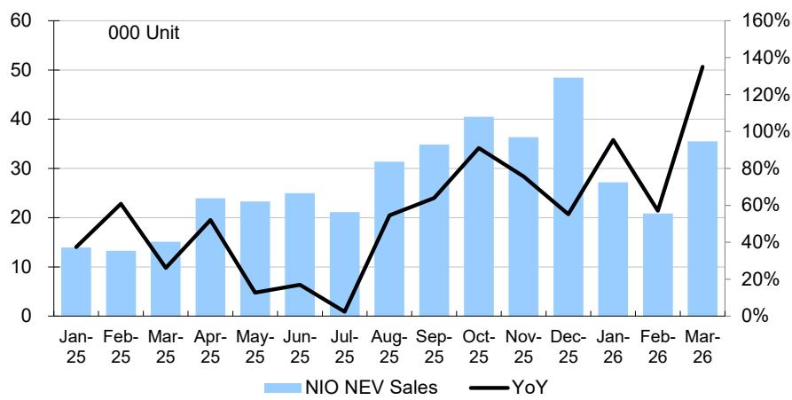

bar_line

| Month   | NIO NEV Sales | YoY   |
|---------|---------------|-------|
| Jan-25  | 13            | 30%   |
| Feb-25  | 13            | 60%   |
| Mar-25  | 15            | 20%   |
| Apr-25  | 23            | 40%   |
| May-25  | 23            | 10%   |
| Jun-25  | 24            | 15%   |
| Jul-25  | 21            | 5%    |
| Aug-25  | 31            | 40%   |
| Sep-25  | 34            | 60%   |
| Oct-25  | 40            | 80%   |
| Nov-25  | 36            | 70%   |
| Dec-25  | 48            | 50%   |
| Jan-26  | 27            | 90%   |
| Feb-26  | 21            | 60%   |
| Mar-26  | 35            | 140%  |

Source : Marklines, DB

Figure 92: NIO G15 NEV Market Share   
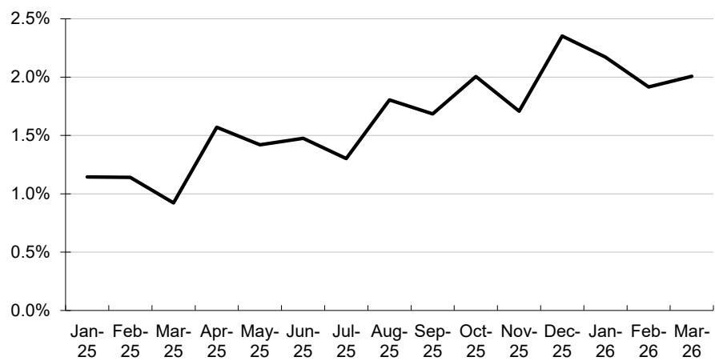

line

| Month   | Value |
| ------- | ----- |
| Jan-25  | 1.15% |
| Feb-25  | 1.15% |
| Mar-25  | 0.90% |
| Apr-25  | 1.55% |
| May-25  | 1.40% |
| Jun-25  | 1.45% |
| Jul-25  | 1.30% |
| Aug-25  | 1.80% |
| Sep-25  | 1.70% |
| Oct-25  | 2.00% |
| Nov-25  | 1.70% |
| Dec-25  | 2.35% |
| Jan-26  | 2.15% |
| Feb-26  | 1.90% |
| Mar-26  | 2.00% |

Source : Marklines, DB

Figure 93: Leapmotor NEV Sales by Country 

<table><tr><td colspan="6">Leapmotor NEV Sales Breakdown</td></tr><tr><td></td><td>Mar-26</td><td>YoY</td><td>MoM</td><td>3M 2026</td><td>YoY</td></tr><tr><td>Leapmotor NEV Sales</td><td>59,949</td><td>57.3%</td><td>69.5%</td><td>130,744</td><td>45.8%</td></tr><tr><td>China</td><td>50,029</td><td>34.9%</td><td>78.2%</td><td>110,155</td><td>25.8%</td></tr><tr><td>Italy</td><td>5,513</td><td>2727.2%</td><td>10.1%</td><td>11,637</td><td>1927.4%</td></tr><tr><td>UK</td><td>1,891</td><td>879.8%</td><td>330.8%</td><td>3,096</td><td>1504.1%</td></tr><tr><td>Germany</td><td>1,388</td><td>318.1%</td><td>27.2%</td><td>3,168</td><td>370.7%</td></tr><tr><td>France</td><td>593</td><td>101.7%</td><td>50.1%</td><td>1,293</td><td>88.5%</td></tr></table>

Source : Marklines, DB

Figure 94: Leapmotor NEV Sales Breakdown - Top Models 

<table><tr><td colspan="7">Leapmotor NEV Sales Breakdown - Top Models</td></tr><tr><td>(unit)</td><td></td><td>Mar-26</td><td>YoY</td><td>MoM</td><td>3M 2026</td><td>YoY</td></tr><tr><td>Brand</td><td>Model</td><td>59,949</td><td>57.3%</td><td>69.5%</td><td>130,744</td><td>45.8%</td></tr><tr><td>Leapmotor</td><td>T03 EV</td><td>14,975</td><td>62.5%</td><td>26.2%</td><td>37,586</td><td>105.4%</td></tr><tr><td>Leapmotor</td><td>C10 EV</td><td>13,066</td><td>36.0%</td><td>132.8%</td><td>25,402</td><td>22.4%</td></tr><tr><td>Leapmotor</td><td>B10 EV</td><td>7,528</td><td>128.3%</td><td>66.9%</td><td>17,764</td><td>438.6%</td></tr><tr><td>Leapmotor</td><td>C10 PHEV</td><td>4,051</td><td>42.7%</td><td>31.4%</td><td>9,759</td><td>14.3%</td></tr><tr><td>Leapmotor</td><td>B01 EV</td><td>4,011</td><td></td><td>65.4%</td><td>8,535</td><td></td></tr><tr><td>Leapmotor</td><td>A10 EV</td><td>3,970</td><td></td><td>198400.0%</td><td>3,972</td><td></td></tr><tr><td>Leapmotor</td><td>C11 EV</td><td>3,130</td><td>-48.2%</td><td>37.8%</td><td>7,794</td><td>-50.1%</td></tr><tr><td>Leapmotor</td><td>Lafa 5 EV</td><td>2,716</td><td></td><td>83.0%</td><td>6,007</td><td></td></tr><tr><td>Leapmotor</td><td>C16 EV</td><td>1,995</td><td>-0.4%</td><td>69.9%</td><td>4,003</td><td>-40.3%</td></tr></table>

Source : Marklines, DB

Figure 95: Leapmotor NEV Sales Trend   
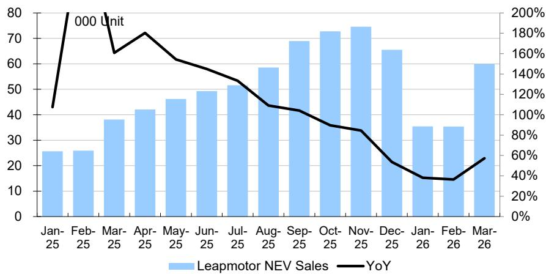

bar_line

| Month   | Leapmotor NEV Sales | YoY     |
|---------|---------------------|---------|
| Jan-25  | 25                  | 180%    |
| Feb-25  | 25                  | 160%    |
| Mar-25  | 38                  | 180%    |
| Apr-25  | 42                  | 170%    |
| May-25  | 46                  | 160%    |
| Jun-25  | 49                  | 150%    |
| Jul-25  | 52                  | 140%    |
| Aug-25  | 58                  | 130%    |
| Sep-25  | 68                  | 120%    |
| Oct-25  | 72                  | 110%    |
| Nov-25  | 74                  | 100%    |
| Dec-25  | 65                  | 80%     |
| Jan-26  | 35                  | 40%     |
| Feb-26  | 35                  | 40%     |
| Mar-26  | 60                  | 60%     |

Source : Marklines, DB

Figure 96: Leapmotor G15 NEV Market Share   
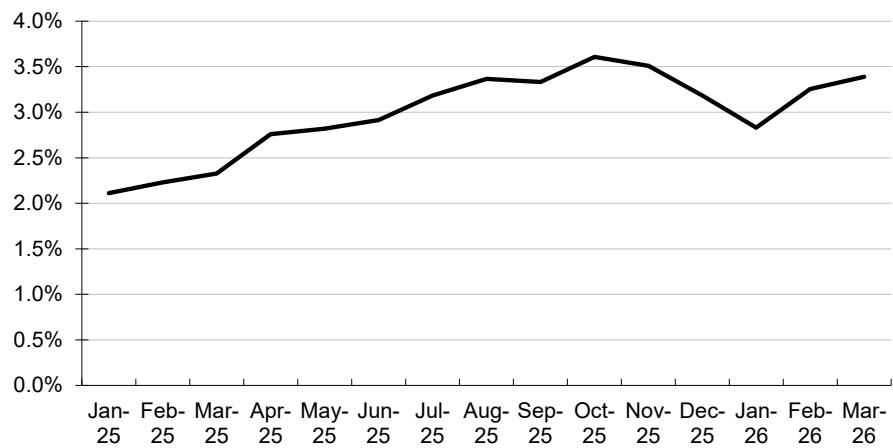

line

| Month | Value (%) |
|---|---|
| Jan-25 | 2.1 |
| Feb-25 | 2.2 |
| Mar-25 | 2.3 |
| Apr-25 | 2.7 |
| May-25 | 2.8 |
| Jun-25 | 2.9 |
| Jul-25 | 3.1 |
| Aug-25 | 3.3 |
| Sep-25 | 3.3 |
| Oct-25 | 3.6 |
| Nov-25 | 3.5 |
| Dec-25 | 3.1 |
| Jan-26 | 2.8 |
| Feb-26 | 3.2 |
| Mar-26 | 3.4 |

Source : Marklines, DB

Figure 97: Tesla NEV Sales by Country 

<table><tr><td colspan="6">Tesla NEV Sales Breakdown</td></tr><tr><td></td><td>Mar-26</td><td>YoY</td><td>MoM</td><td>3M 2026</td><td>YoY</td></tr><tr><td>Tesla NEV Sales</td><td>184,854</td><td>22.1%</td><td>70.6%</td><td>407,558</td><td>17.9%</td></tr><tr><td>China</td><td>85,670</td><td>8.7%</td><td>46.2%</td><td>213,398</td><td>23.5%</td></tr><tr><td>USA</td><td>42,550</td><td>-13.3%</td><td>53.6%</td><td>107,150</td><td>-16.4%</td></tr><tr><td>Korea</td><td>11,130</td><td>329.6%</td><td>41.5%</td><td>20,964</td><td>335.1%</td></tr><tr><td>France</td><td>9,569</td><td>203.1%</td><td>157.6%</td><td>13,945</td><td>108.4%</td></tr><tr><td>Germany</td><td>9,251</td><td>315.0%</td><td>306.5%</td><td>12,828</td><td>159.9%</td></tr><tr><td>UK</td><td>8,599</td><td>20.0%</td><td>255.0%</td><td>11,739</td><td>-5.9%</td></tr><tr><td>Norway</td><td>6,150</td><td>178.2%</td><td>408.3%</td><td>7,443</td><td>95.0%</td></tr><tr><td>Italy</td><td>2,920</td><td>31.7%</td><td>271.5%</td><td>4,419</td><td>27.4%</td></tr><tr><td>Canada</td><td>2,605</td><td>10.0%</td><td>183.2%</td><td>4,335</td><td>-21.2%</td></tr><tr><td>Japan</td><td>2,523</td><td></td><td>65.6%</td><td>5,127</td><td></td></tr><tr><td>Sweden</td><td>1,784</td><td>95.8%</td><td>222.6%</td><td>2,849</td><td>47.7%</td></tr><tr><td>Thailand</td><td>1,458</td><td>370.3%</td><td>226.2%</td><td>2,087</td><td>232.3%</td></tr><tr><td>Finland</td><td>592</td><td>100.7%</td><td>76.2%</td><td>1,152</td><td>142.5%</td></tr></table>

Source : Marklines, DB

Figure 98: Tesla NEV Sales Breakdown - Top Models 

<table><tr><td colspan="7">Tesla NEV Sales Breakdown - Top Models</td></tr><tr><td>(unit)</td><td></td><td>Mar-26</td><td>YoY</td><td>MoM</td><td>3M 2026</td><td>YoY</td></tr><tr><td>Brand</td><td>Model</td><td>184,854</td><td>22.1%</td><td>70.6%</td><td>407,558</td><td>17.9%</td></tr><tr><td>Tesla</td><td>Model Y EV</td><td>119,439</td><td>42.4%</td><td>59.5%</td><td>262,920</td><td>47.1%</td></tr><tr><td>Tesla</td><td>Model 3 EV</td><td>59,002</td><td>-6.3%</td><td>96.2%</td><td>131,301</td><td>-14.9%</td></tr><tr><td>Tesla</td><td>Other Tesla EV</td><td>2,576</td><td>257500.0%</td><td>65.8%</td><td>5,248</td><td>47609.1%</td></tr><tr><td>Tesla</td><td>Cybertruck EV</td><td>1,598</td><td>-40.6%</td><td>91.4%</td><td>3,389</td><td>-50.3%</td></tr><tr><td>Tesla</td><td>Model X EV</td><td>1,433</td><td>-0.4%</td><td>116.1%</td><td>2,984</td><td>-30.0%</td></tr></table>

Source : Marklines, DB

Figure 99: Tesla NEV Sales Trend   
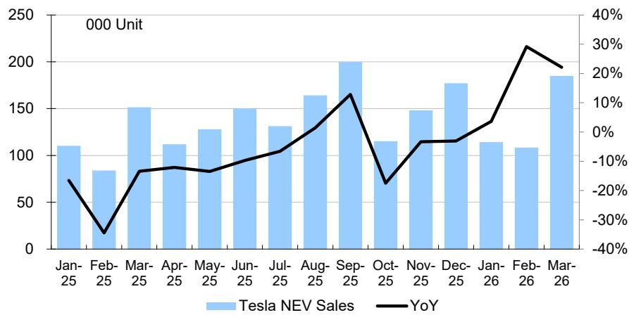

bar_line

| Month | Tesla NEV Sales (000 Unit) | YoY (%) |
| :--- | :--- | :--- |
| Jan-25 | 110 | -15 |
| Feb-25 | 85 | -35 |
| Mar-25 | 150 | -10 |
| Apr-25 | 110 | -10 |
| May-25 | 125 | -10 |
| Jun-25 | 150 | -5 |
| Jul-25 | 130 | -5 |
| Aug-25 | 165 | 5 |
| Sep-25 | 200 | 15 |
| Oct-25 | 115 | -25 |
| Nov-25 | 145 | 0 |
| Dec-25 | 175 | 0 |
| Jan-26 | 115 | 5 |
| Feb-26 | 105 | 30 |
| Mar-26 | 185 | 20 |

Source : Marklines, DB

Figure 100: Tesla G15 NEV Market Share   
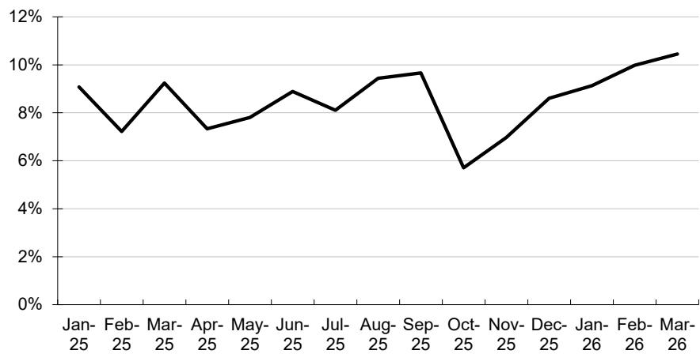

line

| Month   | Value |
| ------- | ----- |
| Jan-25  | 9.0%  |
| Feb-25  | 7.0%  |
| Mar-25  | 9.3%  |
| Apr-25  | 7.3%  |
| May-25  | 7.8%  |
| Jun-25  | 8.8%  |
| Jul-25  | 8.1%  |
| Aug-25  | 9.4%  |
| Sep-25  | 9.7%  |
| Oct-25  | 5.7%  |
| Nov-25  | 6.8%  |
| Dec-25  | 8.5%  |
| Jan-26  | 9.0%  |
| Feb-26  | 9.8%  |
| Mar-26  | 10.4% |

Source : Marklines, DB

Figure 101: Rivian NEV Sales by Country 

<table><tr><td rowspan="2"></td><td colspan="5">Rivian NEV Sales Breakdown</td></tr><tr><td>Mar-26</td><td>YoY</td><td>MoM</td><td>3M 2026</td><td>YoY</td></tr><tr><td>Rivian NEV Sales</td><td>4,248</td><td>2.8%</td><td>2.0%</td><td>11,665</td><td>3.1%</td></tr><tr><td>USA</td><td>3,882</td><td>-3.0%</td><td>-3.3%</td><td>11,014</td><td>0.0%</td></tr><tr><td>Canada</td><td>366</td><td>179.4%</td><td>144.0%</td><td>651</td><td>117.0%</td></tr></table>

Source : Marklines, DB

Figure 102: Rivian NEV Sales Breakdown - Top Models 

<table><tr><td colspan="7">Rivian NEV Sales Breakdown - Top Models</td></tr><tr><td>(unit)</td><td></td><td>Mar-26</td><td>YoY</td><td>MoM</td><td>3M 2026</td><td>YoY</td></tr><tr><td>Brand</td><td>Model</td><td>4,248</td><td>2.8%</td><td>2.0%</td><td>11,665</td><td>3.1%</td></tr><tr><td>Rivian</td><td>R1S EV</td><td>2,270</td><td>5.8%</td><td>-6.7%</td><td>6,537</td><td>13.4%</td></tr><tr><td>Rivian</td><td>Rivian EDV EV</td><td>1,204</td><td>140.8%</td><td>10.0%</td><td>3,122</td><td>108.1%</td></tr><tr><td>Rivian</td><td>R1T EV</td><td>774</td><td>6.0%</td><td>22.1%</td><td>1,939</td><td>-11.1%</td></tr><tr><td>Rivian</td><td>Rivian EDV 500 EV</td><td>0</td><td>-100.0%</td><td>-100.0%</td><td>67</td><td>-96.4%</td></tr></table>

Source : Marklines, DB

Figure 103: Rivian NEV Sales Trend   
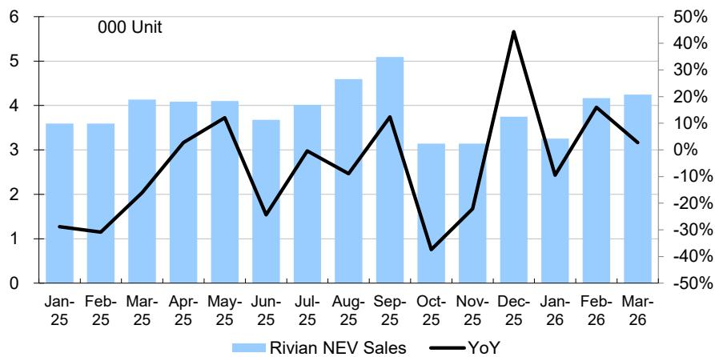

bar_line

| Month   | Rivian NEV Sales | YoY    |
|---------|------------------|--------|
| Jan-25  | 3.6              | 1.2%   |
| Feb-25  | 3.6              | 1.1%   |
| Mar-25  | 4.1              | 2.0%   |
| Apr-25  | 4.1              | 3.0%   |
| May-25  | 4.1              | 3.7%   |
| Jun-25  | 3.7              | 1.5%   |
| Jul-25  | 4.0              | 3.0%   |
| Aug-25  | 4.6              | 2.5%   |
| Sep-25  | 5.1              | 3.7%   |
| Oct-25  | 3.1              | -40%   |
| Nov-25  | 3.1              | -10%   |
| Dec-25  | 3.8              | 45%    |
| Jan-26  | 3.2              | -10%   |
| Feb-26  | 4.1              | 15%    |
| Mar-26  | 4.2              | 10%    |

Source : Marklines, DB

Figure 104: Rivian G15 NEV Market Share   
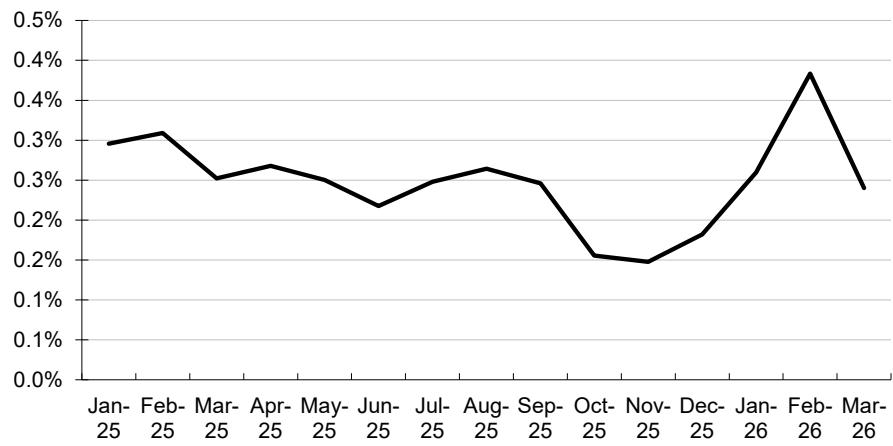

line

| Month | Value (%) |
|---|---|
| Jan-25 | 0.30 |
| Feb-25 | 0.32 |
| Mar-25 | 0.30 |
| Apr-25 | 0.33 |
| May-25 | 0.31 |
| Jun-25 | 0.24 |
| Jul-25 | 0.29 |
| Aug-25 | 0.33 |
| Sep-25 | 0.29 |
| Oct-25 | 0.21 |
| Nov-25 | 0.19 |
| Dec-25 | 0.24 |
| Jan-26 | 0.31 |
| Feb-26 | 0.47 |
| Mar-26 | 0.28 |

Source : Marklines, DB

Figure 105: GM NEV Sales by Country 

<table><tr><td colspan="6">GM NEV Sales Breakdown</td></tr><tr><td></td><td>Mar-26</td><td>YoY</td><td>MoM</td><td>3M 2026</td><td>YoY</td></tr><tr><td>GM NEV Sales</td><td>63,941</td><td>-34.4%</td><td>37.4%</td><td>157,364</td><td>-28.3%</td></tr><tr><td>China</td><td>50,503</td><td>-38.4%</td><td>35.9%</td><td>128,276</td><td>-30.6%</td></tr><tr><td>USA</td><td>11,621</td><td>-19.0%</td><td>32.2%</td><td>25,851</td><td>-18.9%</td></tr><tr><td>Canada</td><td>1,148</td><td>16.0%</td><td>105.0%</td><td>2,111</td><td>-8.1%</td></tr><tr><td>Brazil</td><td>628</td><td>62700.0%</td><td></td><td>628</td><td>31300.0%</td></tr><tr><td>Thailand</td><td>18</td><td>-77.5%</td><td>125.0%</td><td>429</td><td>130.6%</td></tr><tr><td>Japan</td><td>8</td><td></td><td>100.0%</td><td>15</td><td></td></tr><tr><td>Germany</td><td>7</td><td></td><td></td><td>8</td><td></td></tr></table>

Source : Marklines, DB

Figure 106: GM NEV Sales Breakdown - Top Models 

<table><tr><td colspan="7">GM NEV Sales Breakdown - Top Models</td></tr><tr><td>(unit)</td><td></td><td>Mar-26</td><td>YoY</td><td>MoM</td><td>3M 2026</td><td>YoY</td></tr><tr><td>Brand</td><td>Model</td><td>63,941</td><td>-34.4%</td><td>37.4%</td><td>157,364</td><td>-28.3%</td></tr><tr><td>Wuling</td><td>Hongguang MINI EV</td><td>13,549</td><td>-67.9%</td><td>113.7%</td><td>21,462</td><td>-79.0%</td></tr><tr><td>Wuling</td><td>Yangguang EV</td><td>7,007</td><td>20.8%</td><td>77.3%</td><td>16,926</td><td>58.1%</td></tr><tr><td>Wuling</td><td>Bingo/Binguo Plus EV</td><td>5,804</td><td>187.3%</td><td>-23.1%</td><td>20,853</td><td>100.4%</td></tr><tr><td>Wuling</td><td>Bingo/Binguo EV</td><td>5,519</td><td>-67.4%</td><td>559.4%</td><td>7,661</td><td>-70.4%</td></tr><tr><td>Chevrolet</td><td>Equinox EV</td><td>4,582</td><td>-5.7%</td><td>24.6%</td><td>9,589</td><td>-7.2%</td></tr><tr><td>Cadillac</td><td>Cadillac Lyriq EV</td><td>2,791</td><td>37.2%</td><td>126.4%</td><td>5,008</td><td>-2.9%</td></tr><tr><td>Buick</td><td>Buick GL8/New Buick GL8 PHEV</td><td>2,552</td><td>83.7%</td><td>233.6%</td><td>4,620</td><td>29.3%</td></tr><tr><td>Buick</td><td>Electra Encasa PHEV</td><td>2,371</td><td></td><td></td><td>2,371</td><td></td></tr><tr><td>Wuling</td><td>Xingguang 730 EV</td><td>1,852</td><td></td><td>-1.4%</td><td>5,847</td><td></td></tr><tr><td>Cadillac</td><td>Cadillac Optiq EV</td><td>1,715</td><td>6.2%</td><td>50.7%</td><td>3,797</td><td>60.8%</td></tr></table>

Source : Marklines, DB

Figure 107: GM NEV Sales Trend   
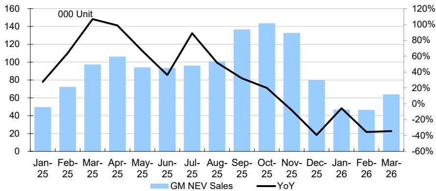

bar_line

| Month   | GM NEV Sales | YoY    |
|---------|--------------|--------|
| Jan-25  | 50           | 80%    |
| Feb-25  | 70           | 100%   |
| Mar-25  | 95           | 145%   |
| Apr-25  | 105          | 135%   |
| May-25  | 90           | 110%   |
| Jun-25  | 85           | 80%    |
| Jul-25  | 95           | 130%   |
| Aug-25  | 100          | 90%    |
| Sep-25  | 135          | 70%    |
| Oct-25  | 145          | 60%    |
| Nov-25  | 130          | 30%    |
| Dec-25  | 80           | -20%   |
| Jan-26  | 45           | -10%   |
| Feb-26  | 45           | -30%   |
| Mar-26  | 65           | -30%   |

Source : Marklines, DB

Figure 108: GM G15 NEV Market Share   
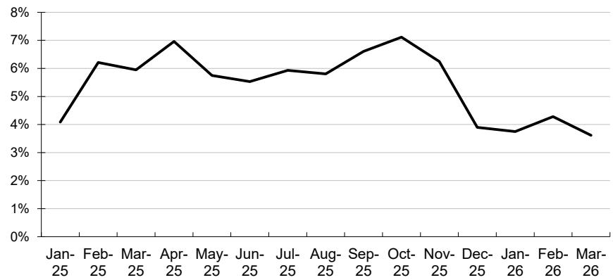

line

| Month   | Value |
| ------- | ----- |
| Jan-25  | 4%    |
| Feb-25  | 6%    |
| Mar-25  | 6%    |
| Apr-25  | 7%    |
| May-25  | 5.5%  |
| Jun-25  | 5.5%  |
| Jul-25  | 6%    |
| Aug-25  | 6%    |
| Sep-25  | 6.5%  |
| Oct-25  | 7%    |
| Nov-25  | 6.5%  |
| Dec-25  | 3.5%  |
| Jan-26  | 3.5%  |
| Feb-26  | 4.5%  |
| Mar-26  | 3.5%  |

Source : Marklines, DB

Figure 109: Ford NEV Sales by Country 

<table><tr><td colspan="6">Ford NEV Sales Breakdown</td></tr><tr><td></td><td>Mar-26</td><td>YoY</td><td>MoM</td><td>3M 2026</td><td>YoY</td></tr><tr><td>Ford NEV Sales</td><td>22,633</td><td>-8.1%</td><td>79.9%</td><td>47,472</td><td>-6.4%</td></tr><tr><td>UK</td><td>10,404</td><td>31.8%</td><td>227.3%</td><td>17,911</td><td>50.5%</td></tr><tr><td>USA</td><td>3,873</td><td>-66.1%</td><td>34.3%</td><td>9,214</td><td>-64.9%</td></tr><tr><td>Germany</td><td>3,392</td><td>49.8%</td><td>26.2%</td><td>7,960</td><td>46.3%</td></tr><tr><td>France</td><td>2,261</td><td>253.8%</td><td>51.0%</td><td>4,994</td><td>250.2%</td></tr><tr><td>Italy</td><td>1,095</td><td>60.6%</td><td>24.1%</td><td>3,096</td><td>82.9%</td></tr><tr><td>Canada</td><td>886</td><td>-2.1%</td><td>8.4%</td><td>2,202</td><td>6.4%</td></tr><tr><td>Norway</td><td>246</td><td>-40.0%</td><td>-4.3%</td><td>564</td><td>-40.6%</td></tr><tr><td>Sweden</td><td>227</td><td>0.9%</td><td>27.5%</td><td>573</td><td>17.9%</td></tr><tr><td>Finland</td><td>160</td><td>31.1%</td><td>15.9%</td><td>450</td><td>52.0%</td></tr><tr><td>China</td><td>89</td><td>14.1%</td><td>34.8%</td><td>508</td><td>134.1%</td></tr><tr><td colspan="6">Source: Marklines, DB</td></tr></table>

Figure 111: Ford NEV Sales Trend   
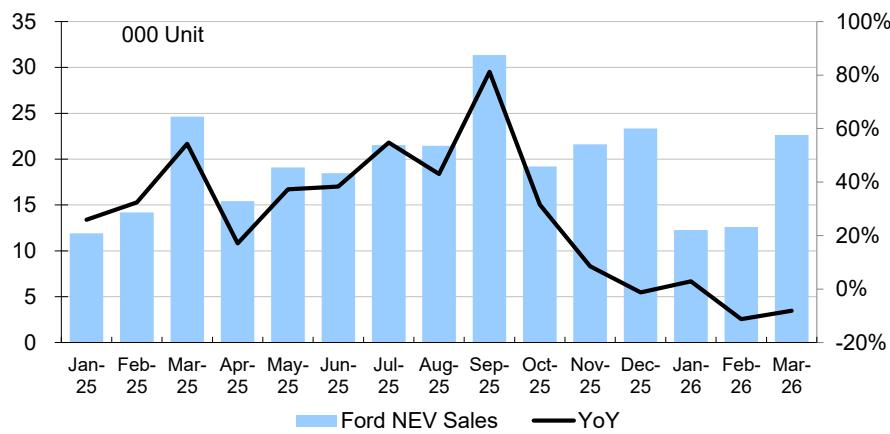

bar_line

| Month   | Ford NEV Sales (000 Unit) | YoY (%) |
|---------|---------------------------|---------|
| Jan-25  | 12                        | 30%     |
| Feb-25  | 14                        | 35%     |
| Mar-25  | 25                        | 50%     |
| Apr-25  | 15                        | 10%     |
| May-25  | 19                        | 35%     |
| Jun-25  | 18                        | 40%     |
| Jul-25  | 22                        | 45%     |
| Aug-25  | 21                        | 30%     |
| Sep-25  | 31                        | 80%     |
| Oct-25  | 19                        | 15%     |
| Nov-25  | 22                        | 5%      |
| Dec-25  | 24                        | -5%     |
| Jan-26  | 12                        | -10%    |
| Feb-26  | 13                        | -15%    |
| Mar-26  | 23                        | -10%    |

Source : Marklines, DB

Figure 110: Ford NEV Sales Breakdown - Top Models 

<table><tr><td colspan="7">Ford NEV Sales Breakdown - Top Models</td></tr><tr><td>(unit)</td><td></td><td>Mar-26</td><td>YoY</td><td>MoM</td><td>3M 2026</td><td>YoY</td></tr><tr><td>Brand</td><td>Model</td><td>22,633</td><td>-8.1%</td><td>79.9%</td><td>47,472</td><td>-6.4%</td></tr><tr><td>Ford</td><td>Explorer EV</td><td>4,168</td><td>35.3%</td><td>129.1%</td><td>7,599</td><td>28.2%</td></tr><tr><td>Ford</td><td>Ford Puma EV</td><td>3,845</td><td>16617.4%</td><td>117.7%</td><td>7,954</td><td>34482.6%</td></tr><tr><td>Ford</td><td>Mustang Mach-E EV</td><td>3,384</td><td>-45.7%</td><td>37.8%</td><td>7,516</td><td>-48.9%</td></tr><tr><td>Ford</td><td>Kuga PHEV</td><td>2,258</td><td>-46.3%</td><td>76.4%</td><td>4,964</td><td>-32.1%</td></tr><tr><td>Ford</td><td>Transit Custom PHEV</td><td>2,123</td><td>83.7%</td><td>123.2%</td><td>3,904</td><td>61.6%</td></tr><tr><td>Ford</td><td>Capri EV</td><td>1,508</td><td>16617.4%</td><td>110.3%</td><td>7,954</td><td>34482.6%</td></tr><tr><td>Ford</td><td>Ford Ranger PHEV</td><td>998</td><td></td><td>178.0%</td><td>1,754</td><td></td></tr><tr><td>Ford</td><td>Ford F-Series EV</td><td>892</td><td>-71.5%</td><td>70.6%</td><td>2,063</td><td>-71.6%</td></tr><tr><td>Ford</td><td>Transit EV</td><td>570</td><td>-78.6%</td><td>-10.4%</td><td>1,749</td><td>-68.0%</td></tr><tr><td>Ford</td><td>Escape PHEV</td><td>553</td><td>-54.1%</td><td>25.7%</td><td>1,430</td><td>-37.6%</td></tr></table>

Source : Marklines, DB

Figure 112: Ford G15 NEV Market Share   
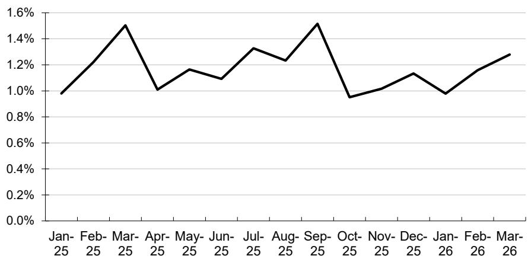

line

| Month   | Value  |
| ------- | ------ |
| Jan-25  | 1.0%   |
| Feb-25  | 1.3%   |
| Mar-25  | 1.5%   |
| Apr-25  | 1.0%   |
| May-25  | 1.1%   |
| Jun-25  | 1.1%   |
| Jul-25  | 1.3%   |
| Aug-25  | 1.2%   |
| Sep-25  | 1.5%   |
| Oct-25  | 0.9%   |
| Nov-25  | 1.0%   |
| Dec-25  | 1.1%   |
| Jan-26  | 0.9%   |
| Feb-26  | 1.1%   |
| Mar-26  | 1.3%   |

Source : Marklines, DB

Figure 113: BMW NEV Sales by Country 

<table><tr><td colspan="6">BMW NEV Sales Breakdown</td></tr><tr><td></td><td>Mar-26</td><td>YoY</td><td>MoM</td><td>3M 2026</td><td>YoY</td></tr><tr><td>BMW NEV Sales</td><td>49,425</td><td>1.1%</td><td>66.0%</td><td>110,490</td><td>-6.8%</td></tr><tr><td>UK</td><td>11,221</td><td>5.2%</td><td>272.7%</td><td>18,240</td><td>-10.8%</td></tr><tr><td>China</td><td>11,164</td><td>-8.9%</td><td>75.0%</td><td>26,592</td><td>-15.5%</td></tr><tr><td>Germany</td><td>10,054</td><td>34.0%</td><td>39.5%</td><td>24,168</td><td>20.5%</td></tr><tr><td>USA</td><td>4,958</td><td>-43.6%</td><td>2.0%</td><td>13,777</td><td>-35.2%</td></tr><tr><td>France</td><td>4,175</td><td>33.8%</td><td>46.5%</td><td>9,466</td><td>14.1%</td></tr><tr><td>Italy</td><td>2,129</td><td>67.1%</td><td>16.7%</td><td>5,585</td><td>62.5%</td></tr><tr><td>Sweden</td><td>1,539</td><td>32.4%</td><td>62.0%</td><td>3,397</td><td>9.8%</td></tr><tr><td>Korea</td><td>1,411</td><td>9.8%</td><td>30.8%</td><td>3,429</td><td>12.5%</td></tr><tr><td>Norway</td><td>819</td><td>7.9%</td><td>205.6%</td><td>1,156</td><td>-44.1%</td></tr><tr><td>Japan</td><td>565</td><td>-24.9%</td><td>79.9%</td><td>1,070</td><td>-29.1%</td></tr><tr><td>India</td><td>497</td><td>75.6%</td><td>41.6%</td><td>1,271</td><td>70.4%</td></tr><tr><td>Thailand</td><td>377</td><td>-12.7%</td><td>0.8%</td><td>1,140</td><td>-15.4%</td></tr><tr><td>Finland</td><td>355</td><td>43.7%</td><td>55.0%</td><td>875</td><td>8.0%</td></tr><tr><td>Canada</td><td>130</td><td>-61.9%</td><td>109.7%</td><td>249</td><td>-68.8%</td></tr><tr><td colspan="6">Source: Marklines, DB</td></tr></table>

Figure 115: BMW NEV Sales Trend   
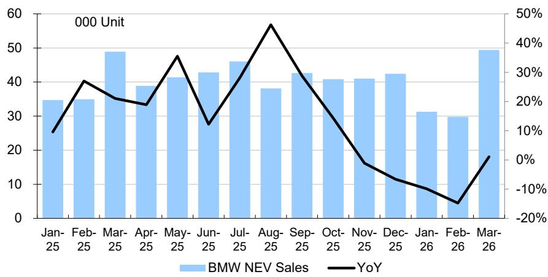

bar_line

| Month | BMW NEV Sales (in 1000 Units) | YoY (%) |
|---|---|---|
| Jan-25 | 35 | 10 |
| Feb-25 | 35 | 28 |
| Mar-25 | 49 | 22 |
| Apr-25 | 39 | 18 |
| May-25 | 41 | 36 |
| Jun-25 | 43 | 12 |
| Jul-25 | 46 | 30 |
| Aug-25 | 38 | 47 |
| Sep-25 | 43 | 30 |
| Oct-25 | 41 | 15 |
| Nov-25 | 41 | -5 |
| Dec-25 | 43 | -8 |
| Jan-26 | 31 | -10 |
| Feb-26 | 30 | -15 |
| Mar-26 | 50 | 2 |

Source : Marklines, DB

Figure 114: BMW NEV Sales Breakdown - Top Models 

<table><tr><td colspan="7">BMW NEV Sales Breakdown - Top Models</td></tr><tr><td>(unit)</td><td></td><td>Mar-26</td><td>YoY</td><td>MoM</td><td>3M 2026</td><td>YoY</td></tr><tr><td>Brand</td><td>Model</td><td>49,425</td><td>1.1%</td><td>66.0%</td><td>110,490</td><td>-6.8%</td></tr><tr><td>MINI</td><td>MINI EV</td><td>10,039</td><td>57.3%</td><td>63.5%</td><td>23,882</td><td>35.1%</td></tr><tr><td>BMW</td><td>iX1 EV</td><td>5,098</td><td>1.4%</td><td>71.8%</td><td>11,633</td><td>2.0%</td></tr><tr><td>BMW</td><td>X5 PHEV</td><td>4,083</td><td>2.8%</td><td>70.5%</td><td>8,575</td><td>-2.4%</td></tr><tr><td>BMW</td><td>BMW i4 EV</td><td>3,921</td><td>-43.4%</td><td>45.4%</td><td>9,153</td><td>-42.3%</td></tr><tr><td>BMW</td><td>iX3 EV</td><td>3,200</td><td>20.9%</td><td>635.6%</td><td>3,885</td><td>-45.3%</td></tr><tr><td>BMW</td><td>X1 PHEV</td><td>3,089</td><td>72.8%</td><td>66.3%</td><td>6,370</td><td>33.1%</td></tr><tr><td>BMW</td><td>BMW 5 Series PHEV</td><td>2,666</td><td>12.3%</td><td>76.9%</td><td>5,691</td><td>-1.6%</td></tr><tr><td>BMW</td><td>BMW i5 EV</td><td>2,525</td><td>-19.0%</td><td>43.5%</td><td>6,002</td><td>-16.3%</td></tr><tr><td>BMW</td><td>iX EV</td><td>2,166</td><td>-9.2%</td><td>29.6%</td><td>5,414</td><td>-8.9%</td></tr><tr><td>MINI</td><td>Countryman EV</td><td>1,625</td><td>55.5%</td><td>77.6%</td><td>3,429</td><td>28.2%</td></tr></table>

Source : Marklines, DB

Figure 116: BMW G15 NEV Market Share   
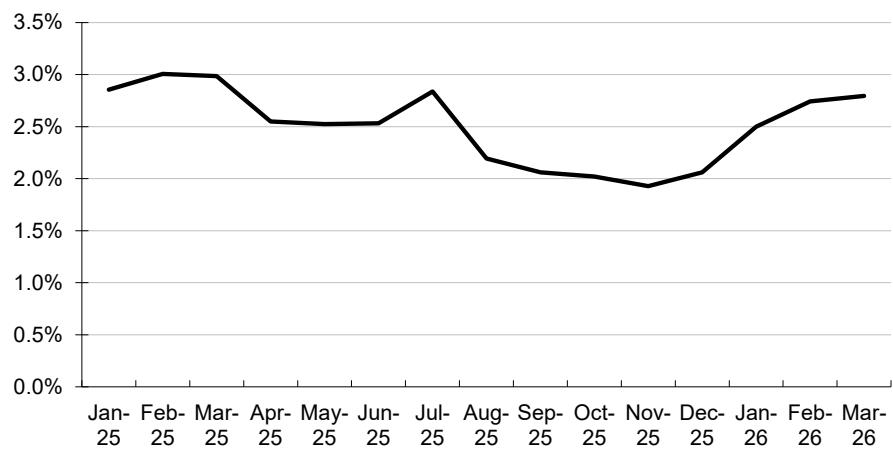

line

| Month   | Value |
| ------- | ----- |
| Jan-25  | 2.8%  |
| Feb-25  | 3.0%  |
| Mar-25  | 3.0%  |
| Apr-25  | 2.5%  |
| May-25  | 2.5%  |
| Jun-25  | 2.5%  |
| Jul-25  | 2.8%  |
| Aug-25  | 2.2%  |
| Sep-25  | 2.1%  |
| Oct-25  | 2.0%  |
| Nov-25  | 1.9%  |
| Dec-25  | 2.1%  |
| Jan-26  | 2.5%  |
| Feb-26  | 2.7%  |
| Mar-26  | 2.8%  |

Source : Marklines, DB

Figure 117: Mercedes-Benz NEV Sales by Country 

<table><tr><td colspan="6">Mercedes-Benz NEV Sales Breakdown</td></tr><tr><td></td><td>Mar-26</td><td>YoY</td><td>MoM</td><td>3M 2026</td><td>YoY</td></tr><tr><td>Mercedes-Benz NEV Sales</td><td>28,060</td><td>-9.9%</td><td>51.8%</td><td>64,564</td><td>-18.4%</td></tr><tr><td>UK</td><td>6,732</td><td>25.2%</td><td>273.8%</td><td>11,025</td><td>9.6%</td></tr><tr><td>China</td><td>6,613</td><td>-1.1%</td><td>27.7%</td><td>16,388</td><td>-0.4%</td></tr><tr><td>Germany</td><td>6,285</td><td>1.8%</td><td>26.8%</td><td>16,102</td><td>-9.7%</td></tr><tr><td>USA</td><td>2,207</td><td>-65.6%</td><td>5.4%</td><td>6,255</td><td>-69.4%</td></tr><tr><td>France</td><td>2,081</td><td>15.6%</td><td>77.4%</td><td>4,236</td><td>18.4%</td></tr><tr><td>Sweden</td><td>1,408</td><td>22.4%</td><td>41.5%</td><td>3,319</td><td>33.5%</td></tr><tr><td>Italy</td><td>1,103</td><td>-8.2%</td><td>14.4%</td><td>2,960</td><td>19.8%</td></tr><tr><td>Korea</td><td>391</td><td>12.7%</td><td>34.8%</td><td>874</td><td>12.9%</td></tr><tr><td>Japan</td><td>362</td><td>-23.5%</td><td>108.0%</td><td>827</td><td>-38.8%</td></tr><tr><td>Finland</td><td>331</td><td>3.1%</td><td>0.6%</td><td>972</td><td>34.1%</td></tr><tr><td>Thailand</td><td>240</td><td>-23.8%</td><td>3.9%</td><td>748</td><td>-23.2%</td></tr><tr><td>Norway</td><td>147</td><td>-71.6%</td><td>104.2%</td><td>238</td><td>-80.0%</td></tr><tr><td>India</td><td>104</td><td>-49.8%</td><td>31.6%</td><td>264</td><td>-33.7%</td></tr></table>

Source : Marklines, DB

Figure 118: Mercedes-Benz NEV Sales Breakdown - Top Models 

<table><tr><td colspan="7">Mercedes-Benz NEV Sales Breakdown - Top Models</td></tr><tr><td>(unit)</td><td></td><td>Mar-26</td><td>YoY</td><td>MoM</td><td>3M 2026</td><td>YoY</td></tr><tr><td>Brand</td><td>Model</td><td>28,060</td><td>-9.9%</td><td>51.8%</td><td>64,564</td><td>-18.4%</td></tr><tr><td>Mercedes-Benz</td><td>CLA-Class EV</td><td>3,634</td><td></td><td>206.7%</td><td>6,121</td><td></td></tr><tr><td>Mercedes-Benz</td><td>GLC-Class (GLK-Class) PHEV</td><td>3,415</td><td>23.2%</td><td>36.3%</td><td>8,593</td><td>8.1%</td></tr><tr><td>Mercedes-Benz</td><td>EQB EV</td><td>3,092</td><td>-12.4%</td><td>142.3%</td><td>6,250</td><td>-29.3%</td></tr><tr><td>smart</td><td>smart #5 EV</td><td>2,544</td><td>136.7%</td><td>-24.9%</td><td>7,995</td><td>398.8%</td></tr><tr><td>Mercedes-Benz</td><td>EQA EV</td><td>2,179</td><td>-35.4%</td><td>53.9%</td><td>4,963</td><td>-32.2%</td></tr><tr><td>Mercedes-Benz</td><td>E-Class PHEV</td><td>1,988</td><td>-42.2%</td><td>39.3%</td><td>4,422</td><td>-50.4%</td></tr><tr><td>smart</td><td>Jingling #1 EV</td><td>1,441</td><td>-24.2%</td><td>73.8%</td><td>3,318</td><td>-38.3%</td></tr><tr><td>Mercedes-Benz</td><td>GLE-Class (M-Class/ML-Class) PHEV</td><td>1,139</td><td>-46.2%</td><td>3.7%</td><td>3,153</td><td>-47.0%</td></tr><tr><td>Mercedes-Benz</td><td>EQE EV</td><td>998</td><td>-49.5%</td><td>38.2%</td><td>2,442</td><td>-52.5%</td></tr><tr><td>Mercedes-Benz</td><td>C-Class PHEV</td><td>781</td><td>-47.5%</td><td>79.1%</td><td>1,784</td><td>-51.4%</td></tr></table>

Source : Marklines, DB

Figure 119: Mercedes-Benz NEV Sales Trend   
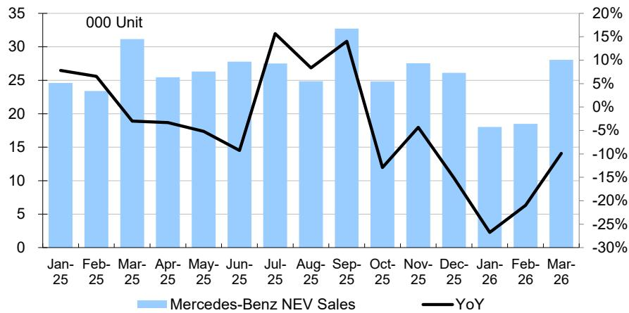

bar_line

| Month   | Mercedes-Benz NEV Sales (000 Unit) | YoY    |
|---------|------------------------------------|--------|
| Jan-25  | 24                                 | 7%     |
| Feb-25  | 23                                 | 6%     |
| Mar-25  | 31                                 | 0%     |
| Apr-25  | 25                                 | -3%    |
| May-25  | 26                                 | -4%    |
| Jun-25  | 28                                 | -10%   |
| Jul-25  | 27                                 | 15%    |
| Aug-25  | 25                                 | -5%    |
| Sep-25  | 33                                 | 10%    |
| Oct-25  | 25                                 | -15%   |
| Nov-25  | 27                                 | -10%   |
| Dec-25  | 26                                 | -15%   |
| Jan-26  | 18                                 | -25%   |
| Feb-26  | 19                                 | -10%   |
| Mar-26  | 28                                 | -5%    |

Source : Marklines, DB

Figure 120: Mercedes-Benz G15 NEV Market Share   
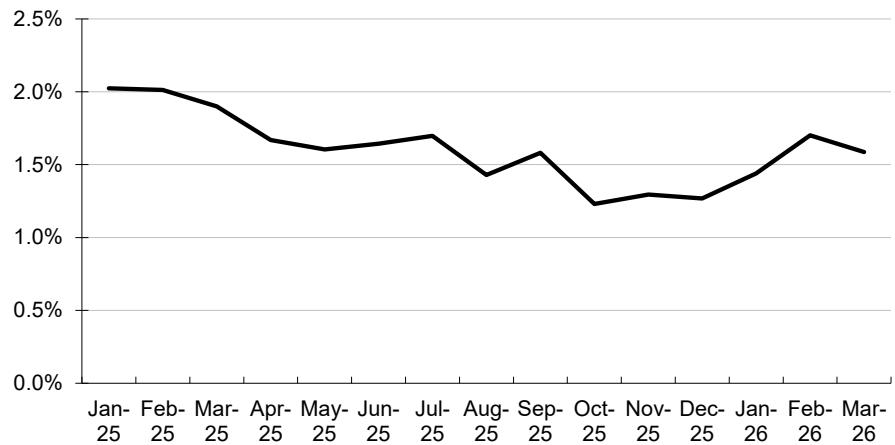

line

| Month   | Value |
|---------|-------|
| Jan-25  | 2.0%  |
| Feb-25  | 2.0%  |
| Mar-25  | 1.9%  |
| Apr-25  | 1.7%  |
| May-25  | 1.6%  |
| Jun-25  | 1.6%  |
| Jul-25  | 1.7%  |
| Aug-25  | 1.4%  |
| Sep-25  | 1.6%  |
| Oct-25  | 1.2%  |
| Nov-25  | 1.3%  |
| Dec-25  | 1.3%  |
| Jan-26  | 1.4%  |
| Feb-26  | 1.7%  |
| Mar-26  | 1.6%  |

Source : Marklines, DB

Figure 121: VW NEV Sales by Country 

<table><tr><td colspan="6">VW NEV Sales Breakdown</td></tr><tr><td></td><td>Mar-26</td><td>YoY</td><td>MoM</td><td>3M 2026</td><td>YoY</td></tr><tr><td>VW NEV Sales</td><td>99,918</td><td>1.9%</td><td>65.9%</td><td>219,984</td><td>1.2%</td></tr><tr><td>Germany</td><td>40,646</td><td>24.3%</td><td>36.9%</td><td>98,309</td><td>21.8%</td></tr><tr><td>UK</td><td>25,555</td><td>0.5%</td><td>250.7%</td><td>44,139</td><td>6.5%</td></tr><tr><td>France</td><td>10,409</td><td>43.8%</td><td>39.9%</td><td>24,381</td><td>36.2%</td></tr><tr><td>China</td><td>5,547</td><td>-43.7%</td><td>970.8%</td><td>7,024</td><td>-62.3%</td></tr><tr><td>Italy</td><td>5,151</td><td>80.2%</td><td>20.6%</td><td>13,334</td><td>89.2%</td></tr><tr><td>Sweden</td><td>4,059</td><td>-4.2%</td><td>37.5%</td><td>9,496</td><td>-9.7%</td></tr><tr><td>Norway</td><td>2,512</td><td>-0.3%</td><td>96.7%</td><td>4,417</td><td>-40.0%</td></tr><tr><td>USA</td><td>2,086</td><td>-77.5%</td><td>-41.2%</td><td>8,983</td><td>-61.3%</td></tr><tr><td>Korea</td><td>1,354</td><td>-12.1%</td><td>70.7%</td><td>2,686</td><td>-10.3%</td></tr><tr><td>Finland</td><td>994</td><td>-0.9%</td><td>29.3%</td><td>2,755</td><td>9.3%</td></tr><tr><td>Japan</td><td>799</td><td>-4.3%</td><td>3.6%</td><td>2,052</td><td>23.3%</td></tr><tr><td>Canada</td><td>655</td><td>63.3%</td><td>-9.3%</td><td>1,951</td><td>-28.8%</td></tr><tr><td>Thailand</td><td>140</td><td>-17.2%</td><td>-22.7%</td><td>437</td><td>-6.8%</td></tr><tr><td>Brazil</td><td>6</td><td>500.0%</td><td></td><td>9</td><td>-74.3%</td></tr><tr><td colspan="6">Source: Marklines, DB</td></tr></table>

Figure 123: VW NEV Sales Trend   
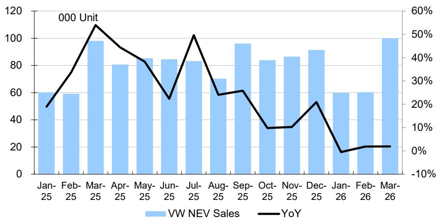

bar_line

| Month   | VW NEV Sales | YoY   |
|---------|--------------|-------|
| Jan-25  | 60           | 50%   |
| Feb-25  | 60           | 70%   |
| Mar-25  | 100          | 110%  |
| Apr-25  | 80           | 90%   |
| May-25  | 85           | 80%   |
| Jun-25  | 85           | 55%   |
| Jul-25  | 83           | 103%  |
| Aug-25  | 70           | 60%   |
| Sep-25  | 95           | 63%   |
| Oct-25  | 83           | 35%   |
| Nov-25  | 86           | 35%   |
| Dec-25  | 91           | 55%   |
| Jan-26  | 60           | 10%   |
| Feb-26  | 60           | 15%   |
| Mar-26  | 100          | 15%   |

Source : Marklines, DB

Figure 122: VW NEV Sales Breakdown - Top Models 

<table><tr><td colspan="7">VW NEV Sales Breakdown - Top Models</td></tr><tr><td>(unit)</td><td></td><td>Mar-26</td><td>YoY</td><td>MoM</td><td>3M 2026</td><td>YoY</td></tr><tr><td>Brand</td><td>Model</td><td>99,918</td><td>1.9%</td><td>65.9%</td><td>219,984</td><td>1.2%</td></tr><tr><td>Skoda</td><td>Elroq EV</td><td>7,632</td><td>175.2%</td><td>32.3%</td><td>18,916</td><td>372.9%</td></tr><tr><td>Skoda</td><td>Enyaq iV EV</td><td>7,232</td><td>21.8%</td><td>64.3%</td><td>15,366</td><td>4.2%</td></tr><tr><td>VW</td><td>ID.3 EV</td><td>6,695</td><td>-25.7%</td><td>70.1%</td><td>15,113</td><td>-27.7%</td></tr><tr><td>Audi</td><td>Audi Q4 e-tron EV</td><td>6,582</td><td>-9.5%</td><td>108.1%</td><td>12,587</td><td>-21.1%</td></tr><tr><td>VW</td><td>ID.4 EV</td><td>6,118</td><td>-28.1%</td><td>54.4%</td><td>12,916</td><td>-44.7%</td></tr><tr><td>VW</td><td>ID.7 EV</td><td>4,912</td><td>-21.0%</td><td>55.0%</td><td>11,640</td><td>-24.5%</td></tr><tr><td>Audi</td><td>Audi Q6 EV</td><td>4,871</td><td>-12.7%</td><td>61.1%</td><td>11,514</td><td>0.1%</td></tr><tr><td>VW</td><td>Tiguan PHEV</td><td>4,377</td><td>-12.8%</td><td>40.7%</td><td>9,947</td><td>-11.5%</td></tr><tr><td>SEAT</td><td>CUPRA Born EV</td><td>3,928</td><td>23.5%</td><td>108.3%</td><td>8,160</td><td>-8.9%</td></tr><tr><td>SEAT</td><td>CUPRA Tavascan E</td><td>3,418</td><td>46.4%</td><td>342.2%</td><td>5,494</td><td>6.3%</td></tr></table>

Source : Marklines, DB

Figure 124: VW G15 NEV Market Share   
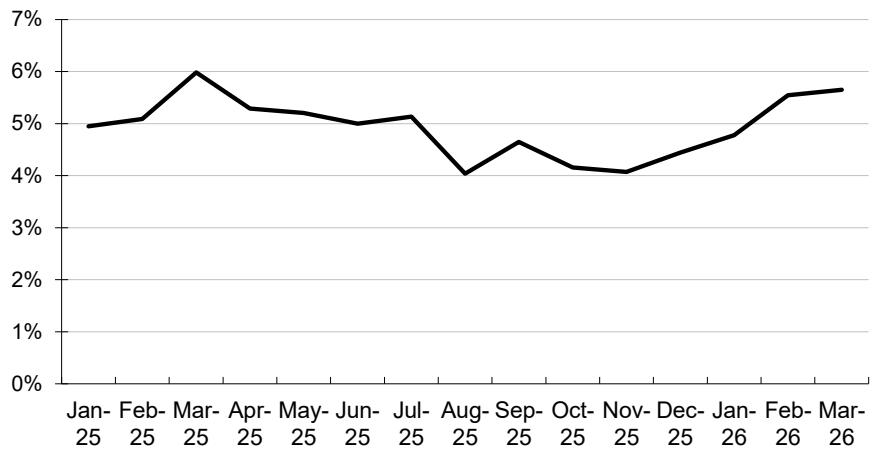

line

| Month   | Value |
| ------- | ----- |
| Jan-25  | 5%    |
| Feb-25  | 5%    |
| Mar-25  | 6%    |
| Apr-25  | 5%    |
| May-25  | 5%    |
| Jun-25  | 5%    |
| Jul-25  | 5%    |
| Aug-25  | 4%    |
| Sep-25  | 4.5%  |
| Oct-25  | 4%    |
| Nov-25  | 4%    |
| Dec-25  | 4.5%  |
| Jan-26  | 5%    |
| Feb-26  | 5.5%  |
| Mar-26  | 5.5%  |

Source : Marklines, DB

Figure 125: Renault NEV Sales by Country 

<table><tr><td rowspan="2"></td><td colspan="5">Renault NEV Sales Breakdown</td></tr><tr><td>Mar-26</td><td>YoY</td><td>MoM</td><td>3M 2026</td><td>YoY</td></tr><tr><td>Renault NEV Sales</td><td>26,065</td><td>55.9%</td><td>93.3%</td><td>57,551</td><td>32.0%</td></tr><tr><td>France</td><td>13,233</td><td>52.6%</td><td>55.0%</td><td>31,566</td><td>43.1%</td></tr><tr><td>UK</td><td>4,531</td><td>66.0%</td><td>241.7%</td><td>8,041</td><td>56.4%</td></tr><tr><td>China</td><td>4,529</td><td>143.2%</td><td>289.4%</td><td>8,709</td><td>16.9%</td></tr><tr><td>Germany</td><td>2,053</td><td>4.5%</td><td>57.6%</td><td>4,507</td><td>-4.3%</td></tr><tr><td>Italy</td><td>1,126</td><td>-15.9%</td><td>71.1%</td><td>2,932</td><td>-21.8%</td></tr><tr><td>Sweden</td><td>339</td><td>391.3%</td><td>52.0%</td><td>852</td><td>252.1%</td></tr><tr><td>Finland</td><td>101</td><td>236.7%</td><td>134.9%</td><td>206</td><td>281.5%</td></tr><tr><td>Norway</td><td>85</td><td>60.4%</td><td>123.7%</td><td>179</td><td>38.8%</td></tr><tr><td>Brazil</td><td>67</td><td></td><td>42.6%</td><td>201</td><td>302.0%</td></tr></table>

Source : Marklines, DB

Figure 126: Renault NEV Sales Breakdown - Top Models 

<table><tr><td colspan="7">Renault NEV Sales Breakdown - Top Models</td></tr><tr><td>(unit)</td><td></td><td>Mar-26</td><td>YoY</td><td>MoM</td><td>3M 2026</td><td>YoY</td></tr><tr><td>Brand</td><td>Model</td><td>26,065</td><td>55.9%</td><td>93.3%</td><td>57,551</td><td>32.0%</td></tr><tr><td>Dacia</td><td>Spring Electric EV</td><td>7,467</td><td>68.5%</td><td>266.2%</td><td>13,695</td><td>-7.0%</td></tr><tr><td>Renault</td><td>Renault 5 EV</td><td>7,300</td><td>48.1%</td><td>75.5%</td><td>17,533</td><td>40.5%</td></tr><tr><td>Renault</td><td>Scenic EV</td><td>3,804</td><td>2.0%</td><td>32.7%</td><td>9,585</td><td>26.1%</td></tr><tr><td>Renault</td><td>Renault 4 EV</td><td>2,712</td><td>30033.3%</td><td>109.9%</td><td>5,758</td><td>16351.4%</td></tr><tr><td>Renault</td><td>Twingo EV</td><td>1,123</td><td>5004.5%</td><td>707.9%</td><td>1,271</td><td>959.2%</td></tr><tr><td>Renault</td><td>Megane EV</td><td>1,104</td><td>-38.7%</td><td>0.7%</td><td>3,556</td><td>-13.0%</td></tr><tr><td>Alpine</td><td>A290 EV</td><td>1,060</td><td>112.4%</td><td>114.1%</td><td>2,010</td><td>56.9%</td></tr><tr><td>Renault</td><td>Kangoo EV</td><td>539</td><td>-9.0%</td><td>-16.4%</td><td>1,792</td><td>23.7%</td></tr><tr><td>Renault</td><td>Rafale PHEV</td><td>515</td><td>-9.8%</td><td>110.2%</td><td>908</td><td>-15.0%</td></tr><tr><td>Renault</td><td>Renault Master EV</td><td>274</td><td>194.6%</td><td>-7.1%</td><td>771</td><td>65.8%</td></tr></table>

Source : Marklines, DB

Figure 127: Renault NEV Sales Trend   
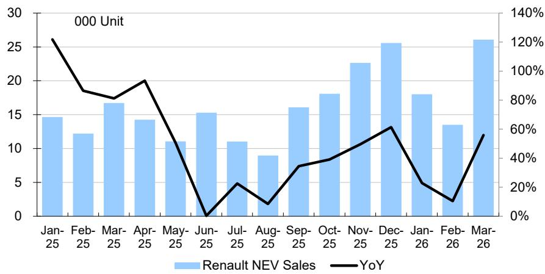

bar_line

| Month   | Renault NEV Sales (000 Unit) | YoY (%) |
|---------|------------------------------|---------|
| Jan-25  | 14.5                         | 130     |
| Feb-25  | 12.0                         | 90      |
| Mar-25  | 17.0                         | 85      |
| Apr-25  | 14.0                         | 100     |
| May-25  | 11.0                         | 60      |
| Jun-25  | 15.0                         | 0       |
| Jul-25  | 11.0                         | 40      |
| Aug-25  | 9.0                          | 15      |
| Sep-25  | 16.0                         | 40      |
| Oct-25  | 18.0                         | 50      |
| Nov-25  | 22.5                         | 60      |
| Dec-25  | 25.5                         | 70      |
| Jan-26  | 18.0                         | 30      |
| Feb-26  | 13.5                         | 15      |
| Mar-26  | 26.0                         | 60      |

Source : Marklines, DB

Figure 128: Renault G15 NEV Market Share   
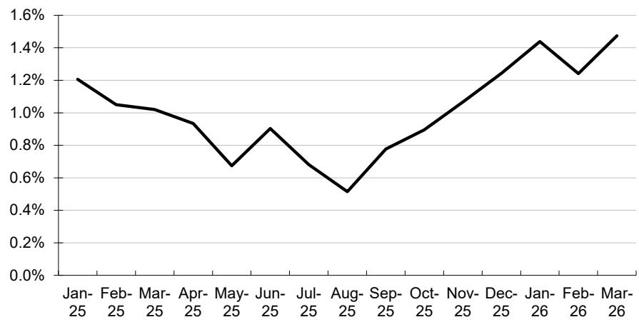

line

| Month   | Value  |
| ------- | ------ |
| Jan-25  | 1.2%   |
| Feb-25  | 1.05%  |
| Mar-25  | 1.0%   |
| Apr-25  | 0.9%   |
| May-25  | 0.65%  |
| Jun-25  | 0.9%   |
| Jul-25  | 0.7%   |
| Aug-25  | 0.5%   |
| Sep-25  | 0.8%   |
| Oct-25  | 0.9%   |
| Nov-25  | 1.1%   |
| Dec-25  | 1.3%   |
| Jan-26  | 1.45%  |
| Feb-26  | 1.25%  |
| Mar-26  | 1.5%   |

Source : Marklines, DB

Figure 129: Stellantis NEV Sales by Country 

<table><tr><td colspan="6">Stellantis NEV Sales Breakdown</td></tr><tr><td></td><td>Mar-26</td><td>YoY</td><td>MoM</td><td>3M 2026</td><td>YoY</td></tr><tr><td>Stellantis NEV Sales</td><td>35,027</td><td>-15.1%</td><td>29.7%</td><td>88,536</td><td>-3.6%</td></tr><tr><td>France</td><td>12,008</td><td>17.2%</td><td>11.1%</td><td>33,533</td><td>18.5%</td></tr><tr><td>UK</td><td>8,704</td><td>-7.5%</td><td>294.9%</td><td>14,103</td><td>-15.4%</td></tr><tr><td>Germany</td><td>6,922</td><td>138.0%</td><td>16.4%</td><td>18,405</td><td>161.5%</td></tr><tr><td>Italy</td><td>3,315</td><td>25.3%</td><td>9.5%</td><td>9,315</td><td>25.7%</td></tr><tr><td>USA</td><td>1,728</td><td>-88.0%</td><td>-31.6%</td><td>7,152</td><td>-74.6%</td></tr><tr><td>Norway</td><td>658</td><td>40.3%</td><td>23.7%</td><td>1,345</td><td>6.0%</td></tr><tr><td>Canada</td><td>600</td><td>47.8%</td><td>-46.0%</td><td>1,860</td><td>95.0%</td></tr><tr><td>China</td><td>600</td><td>7400.0%</td><td>7.1%</td><td>1,757</td><td>1674.7%</td></tr><tr><td>Sweden</td><td>226</td><td>79.4%</td><td>86.8%</td><td>451</td><td>50.3%</td></tr><tr><td>Japan</td><td>150</td><td>-62.9%</td><td>33.9%</td><td>340</td><td>-60.6%</td></tr><tr><td>Finland</td><td>84</td><td>-4.5%</td><td>211.1%</td><td>152</td><td>-42.0%</td></tr><tr><td>India</td><td>30</td><td>-53.1%</td><td>50.0%</td><td>117</td><td>-71.5%</td></tr><tr><td>Korea</td><td>1</td><td>-98.4%</td><td>0.0%</td><td>2</td><td>-98.0%</td></tr><tr><td>Thailand</td><td>1</td><td>-50.0%</td><td>-50.0%</td><td>4</td><td>-66.7%</td></tr></table>

Source : Marklines, DB

Figure 130: Stellantis NEV Sales Breakdown - Top Models 

<table><tr><td colspan="7">Stellantis NEV Sales Breakdown - Top Models</td></tr><tr><td>(unit)</td><td></td><td>Mar-26</td><td>YoY</td><td>MoM</td><td>3M 2026</td><td>YoY</td></tr><tr><td>Brand</td><td>Model</td><td>35,027</td><td>-15.1%</td><td>29.7%</td><td>88,536</td><td>-3.6%</td></tr><tr><td>Citroen</td><td>C3 EV</td><td>4,177</td><td>48.5%</td><td>34.0%</td><td>10,462</td><td>15.3%</td></tr><tr><td>Opel</td><td>Opel Frontera EV</td><td>3,239</td><td>2059.3%</td><td>147.6%</td><td>6,246</td><td>3531.4%</td></tr><tr><td>Citroen</td><td>C3 Aircross EV</td><td>2,348</td><td>701.4%</td><td>111.7%</td><td>4,692</td><td>1058.5%</td></tr><tr><td>Peugeot</td><td>Peugeot 208 EV</td><td>2,135</td><td>1.1%</td><td>17.0%</td><td>6,085</td><td>8.0%</td></tr><tr><td>Peugeot</td><td>Peugeot 2008 EV</td><td>2,048</td><td>7.8%</td><td>32.0%</td><td>5,156</td><td>43.7%</td></tr><tr><td>Fiat</td><td>Fiat 500 EV</td><td>1,965</td><td>-10.7%</td><td>-10.9%</td><td>5,605</td><td>15.9%</td></tr><tr><td>Peugeot</td><td>Peugeot 5008 SUV EV</td><td>1,756</td><td>86.4%</td><td>49.4%</td><td>3,745</td><td>82.0%</td></tr><tr><td>Peugeot</td><td>Peugeot 3008 EV</td><td>1,581</td><td>-28.4%</td><td>56.7%</td><td>3,693</td><td>-30.0%</td></tr><tr><td>Opel</td><td>Grandland EV</td><td>1,303</td><td>49.6%</td><td>20.1%</td><td>3,447</td><td>57.8%</td></tr><tr><td>Opel</td><td>Opel Corsa EV</td><td>992</td><td>27.5%</td><td>55.5%</td><td>2,282</td><td>12.3%</td></tr></table>

Source : Marklines, DB

Figure 131: Stellantis NEV Sales Trend   
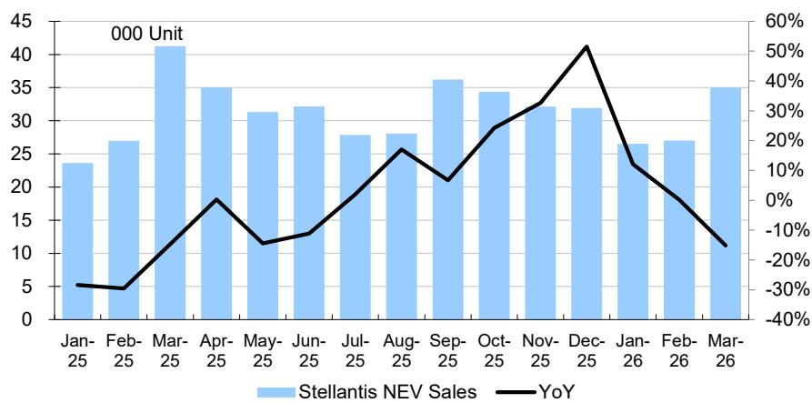

bar_line

| Month   | Stellantis NEV Sales | YoY    |
|---------|----------------------|--------|
| Jan-25  | 23                   | -      |
| Feb-25  | 27                   | -      |
| Mar-25  | 41                   | -      |
| Apr-25  | 35                   | -      |
| May-25  | 31                   | -      |
| Jun-25  | 32                   | -      |
| Jul-25  | 28                   | -      |
| Aug-25  | 28                   | -      |
| Sep-25  | 36                   | -      |
| Oct-25  | 34                   | -      |
| Nov-25  | 32                   | -      |
| Dec-25  | 32                   | -      |
| Jan-26  | 27                   | -      |
| Feb-26  | 27                   | -      |
| Mar-26  | 35                   | -      |

Source : Marklines, DB

Figure 132: Stellantis G15 NEV Market Share   
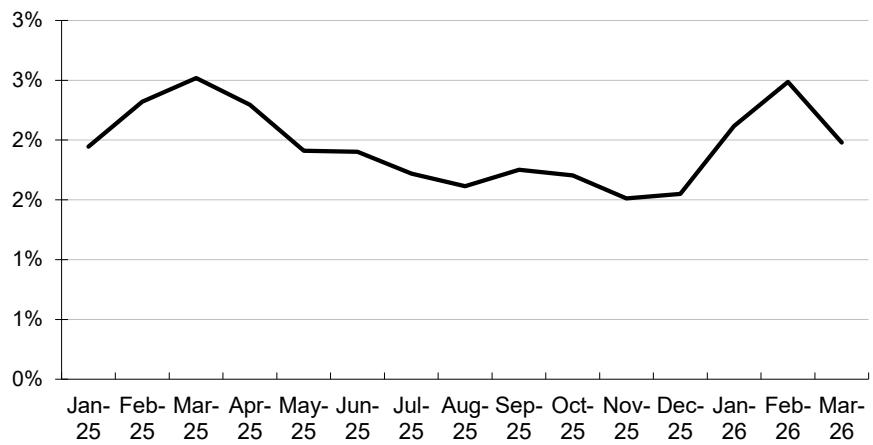

line

| Month | Value (%) |
|---|---|
| Jan-25 | 1.9 |
| Feb-25 | 2.6 |
| Mar-25 | 3.0 |
| Apr-25 | 2.6 |
| May-25 | 1.8 |
| Jun-25 | 1.8 |
| Jul-25 | 1.5 |
| Aug-25 | 1.3 |
| Sep-25 | 1.5 |
| Oct-25 | 1.4 |
| Nov-25 | 1.0 |
| Dec-25 | 1.1 |
| Jan-26 | 2.3 |
| Feb-26 | 3.0 |
| Mar-26 | 1.9 |

Source : Marklines, DB

Figure 133: Honda NEV Sales by Country 

<table><tr><td colspan="6">Honda NEV Sales Breakdown</td></tr><tr><td></td><td>Mar-26</td><td>YoY</td><td>MoM</td><td>3M 2026</td><td>YoY</td></tr><tr><td>Honda NEV Sales</td><td>5,891</td><td>-39.5%</td><td>21.9%</td><td>12,410</td><td>-50.4%</td></tr><tr><td>China</td><td>1,955</td><td>-53.3%</td><td>-31.6%</td><td>4,870</td><td>-47.3%</td></tr><tr><td>UK</td><td>1,766</td><td>332.8%</td><td>1258.5%</td><td>2,017</td><td>266.7%</td></tr><tr><td>USA</td><td>1,608</td><td>-66.7%</td><td>43.4%</td><td>3,413</td><td>-76.3%</td></tr><tr><td>Japan</td><td>406</td><td>8020.0%</td><td>-33.8%</td><td>1,727</td><td>6542.3%</td></tr><tr><td>Germany</td><td>61</td><td>13.0%</td><td>110.3%</td><td>123</td><td>46.4%</td></tr><tr><td>Canada</td><td>40</td><td>-48.7%</td><td>48.1%</td><td>94</td><td>-72.0%</td></tr><tr><td>Italy</td><td>23</td><td>27.8%</td><td>43.8%</td><td>54</td><td>116.0%</td></tr><tr><td>Thailand</td><td>23</td><td>-34.3%</td><td>-17.9%</td><td>77</td><td>-12.5%</td></tr><tr><td>France</td><td>6</td><td>-89.8%</td><td>50.0%</td><td>21</td><td>-80.2%</td></tr><tr><td>Sweden</td><td>2</td><td>-93.9%</td><td>-66.7%</td><td>10</td><td>-80.8%</td></tr><tr><td>Norway</td><td>1</td><td>-97.3%</td><td></td><td>4</td><td>-95.8%</td></tr></table>

Source : Marklines, DB

Figure 134: Honda NEV Sales Breakdown - Top Models 

<table><tr><td colspan="7">Honda NEV Sales Breakdown - Top Models</td></tr><tr><td>(unit)</td><td></td><td>Mar-26</td><td>YoY</td><td>MoM</td><td>3M 2026</td><td>YoY</td></tr><tr><td>Brand</td><td>Model</td><td>5,891</td><td>-39.5%</td><td>21.9%</td><td>12,410</td><td>-50.4%</td></tr><tr><td>Honda</td><td>Prologue EV</td><td>1,628</td><td>-45.0%</td><td>48.8%</td><td>3,413</td><td>-65.5%</td></tr><tr><td>Honda</td><td>e:NY1 EV</td><td>1,238</td><td>1447.5%</td><td>2847.6%</td><td>1,326</td><td>587.0%</td></tr><tr><td>Honda</td><td>CR-V PHEV</td><td>861</td><td>-23.1%</td><td>94.4%</td><td>1,443</td><td>-8.7%</td></tr><tr><td>Honda</td><td>e:NS2 EV</td><td>836</td><td>29.2%</td><td>-12.9%</td><td>1,796</td><td>84.6%</td></tr><tr><td>Honda</td><td>Ye S7 EV</td><td>766</td><td>-38.1%</td><td>543.7%</td><td>890</td><td>-52.9%</td></tr><tr><td>Honda</td><td>N ONE EV</td><td>395</td><td></td><td>-34.4%</td><td>1,699</td><td></td></tr><tr><td>Honda</td><td>Honda P7</td><td>112</td><td>-51.9%</td><td>229.4%</td><td>195</td><td>-16.3%</td></tr><tr><td>Honda</td><td>CR-V FCV</td><td>20</td><td>25.0%</td><td>11.1%</td><td>49</td><td>-12.5%</td></tr><tr><td>Honda</td><td>e:N1 EV</td><td>19</td><td>-45.7%</td><td>-32.1%</td><td>73</td><td>-17.0%</td></tr><tr><td>Acura</td><td>Acura ZDX EV</td><td>11</td><td>-99.4%</td><td>-76.6%</td><td>73</td><td>-98.5%</td></tr></table>

Source : Marklines, DB

Figure 135: Honda NEV Sales Trend   
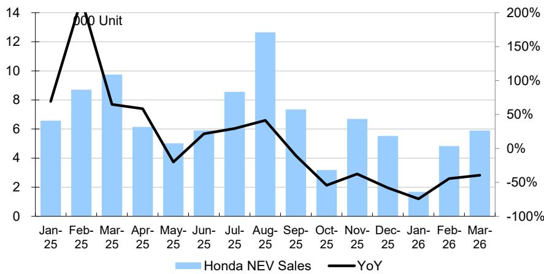

bar_line

| Month   | Honda NEV Sales | YoY     |
|---------|-----------------|---------|
| Jan-25  | 6.5             | 80%     |
| Feb-25  | 8.7             | 190%    |
| Mar-25  | 9.8             | 75%     |
| Apr-25  | 6.2             | 70%     |
| May-25  | 4.8             | -30%    |
| Jun-25  | 5.8             | 40%     |
| Jul-25  | 8.5             | 50%     |
| Aug-25  | 12.7            | 60%     |
| Sep-25  | 7.3             | 30%     |
| Oct-25  | 3.1             | -40%    |
| Nov-25  | 6.7             | -30%    |
| Dec-25  | 5.5             | -40%    |
| Jan-26  | 1.3             | -70%    |
| Feb-26  | 4.8             | -30%    |
| Mar-26  | 5.9             | -20%    |

Source : Marklines, DB

Figure 136: Honda G15 NEV Market Share   
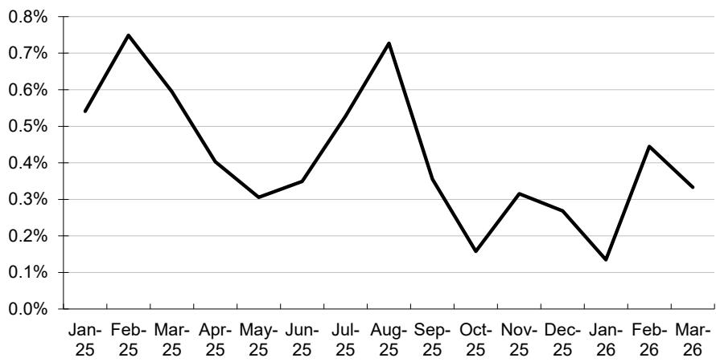

line

| Month   | Value  |
| ------- | ------ |
| Jan-25  | 0.54%  |
| Feb-25  | 0.75%  |
| Mar-25  | 0.60%  |
| Apr-25  | 0.40%  |
| May-25  | 0.30%  |
| Jun-25  | 0.35%  |
| Jul-25  | 0.50%  |
| Aug-25  | 0.73%  |
| Sep-25  | 0.35%  |
| Oct-25  | 0.15%  |
| Nov-25  | 0.31%  |
| Dec-25  | 0.27%  |
| Jan-26  | 0.13%  |
| Feb-26  | 0.44%  |
| Mar-26  | 0.33%  |

Source : Marklines, DB

Figure 137: Toyota NEV Sales by Country 

<table><tr><td colspan="6">Toyota NEV Sales Breakdown</td></tr><tr><td></td><td>Mar-26</td><td>YoY</td><td>MoM</td><td>3M 2026</td><td>YoY</td></tr><tr><td>Toyota NEV Sales</td><td>41,186</td><td>51.0%</td><td>83.1%</td><td>84,064</td><td>47.7%</td></tr><tr><td>China</td><td>14,687</td><td>98.8%</td><td>318.4%</td><td>21,649</td><td>165.9%</td></tr><tr><td>USA</td><td>9,391</td><td>6.5%</td><td>15.7%</td><td>24,423</td><td>10.8%</td></tr><tr><td>Japan</td><td>5,228</td><td>172.6%</td><td>42.8%</td><td>12,561</td><td>150.5%</td></tr><tr><td>Canada</td><td>3,228</td><td>572.5%</td><td>67.8%</td><td>6,279</td><td>371.4%</td></tr><tr><td>UK</td><td>3,138</td><td>-18.2%</td><td>300.8%</td><td>4,870</td><td>-20.7%</td></tr><tr><td>Norway</td><td>1,642</td><td>112.7%</td><td>59.7%</td><td>2,969</td><td>4.7%</td></tr><tr><td>Germany</td><td>1,078</td><td>-15.3%</td><td>79.7%</td><td>2,314</td><td>-32.9%</td></tr><tr><td>Italy</td><td>956</td><td>-11.9%</td><td>5.3%</td><td>3,217</td><td>-14.7%</td></tr><tr><td>France</td><td>897</td><td>23.2%</td><td>-6.7%</td><td>2,743</td><td>46.9%</td></tr><tr><td>Sweden</td><td>502</td><td>-1.6%</td><td>13.6%</td><td>1,357</td><td>28.5%</td></tr><tr><td>Finland</td><td>219</td><td>-28.2%</td><td>-26.8%</td><td>746</td><td>-4.1%</td></tr><tr><td>Korea</td><td>164</td><td>3.8%</td><td>-19.6%</td><td>487</td><td>17.1%</td></tr><tr><td>Thailand</td><td>56</td><td>250.0%</td><td>-6.7%</td><td>449</td><td>731.5%</td></tr></table>

Source : Marklines, DB

Figure 138: Toyota NEV Sales Breakdown - Top Models 

<table><tr><td colspan="7">Toyota NEV Sales Breakdown - Top Models</td></tr><tr><td>(unit)</td><td></td><td>Mar-26</td><td>YoY</td><td>MoM</td><td>3M 2026</td><td>YoY</td></tr><tr><td>Brand</td><td>Model</td><td>41,186</td><td>51.0%</td><td>83.1%</td><td>84,064</td><td>47.7%</td></tr><tr><td>Toyota</td><td>bZ4X EV</td><td>11,349</td><td>171.1%</td><td>38.1%</td><td>26,256</td><td>111.4%</td></tr><tr><td>Toyota</td><td>bZ3X EV</td><td>9,742</td><td>100.2%</td><td>268.0%</td><td>14,625</td><td>194.1%</td></tr><tr><td>Toyota</td><td>Prius PHEV</td><td>3,314</td><td>12.0%</td><td>74.1%</td><td>7,471</td><td>-3.2%</td></tr><tr><td>Toyota</td><td>bZ7 EV</td><td>2,757</td><td></td><td></td><td>2,757</td><td></td></tr><tr><td>Lexus</td><td>Lexus RZ EV</td><td>2,633</td><td>135.9%</td><td>38.3%</td><td>5,669</td><td>146.2%</td></tr><tr><td>Lexus</td><td>Lexus NX PHEV</td><td>2,316</td><td>6.5%</td><td>39.9%</td><td>5,500</td><td>4.5%</td></tr><tr><td>Toyota</td><td>bZ3 EV</td><td>2,120</td><td>-11.9%</td><td>172.1%</td><td>3,456</td><td>14.9%</td></tr><tr><td>Toyota</td><td>C-HR PHEV</td><td>1,779</td><td>-25.9%</td><td>38.8%</td><td>4,750</td><td>-22.2%</td></tr><tr><td>Lexus</td><td>Lexus RX PHEV</td><td>1,408</td><td>10.9%</td><td>35.0%</td><td>3,326</td><td>33.5%</td></tr><tr><td>Toyota</td><td>Urban Cruiser EV</td><td>1,067</td><td></td><td>67.2%</td><td>1,972</td><td></td></tr></table>

Source : Marklines, DB

Figure 139: Toyota NEV Sales Trend   
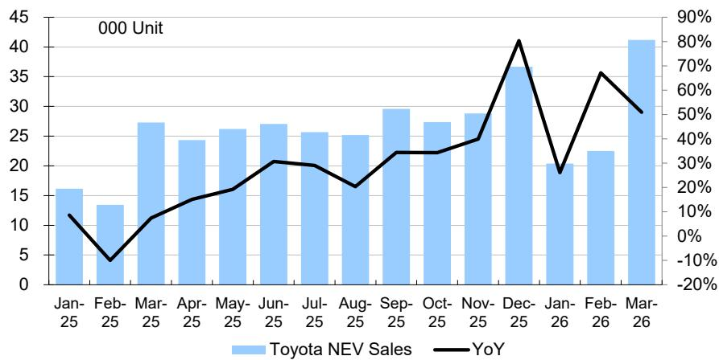

bar_line

| Month | Toyota NEV Sales (in 000 Unit) | YoY (%) |
| :--- | :--- | :--- |
| Jan-25 | 16 | 12 |
| Feb-25 | 13 | -8 |
| Mar-25 | 27 | 11 |
| Apr-25 | 24 | 14 |
| May-25 | 26 | 16 |
| Jun-25 | 27 | 21 |
| Jul-25 | 25 | 20 |
| Aug-25 | 25 | 16 |
| Sep-25 | 29 | 22 |
| Oct-25 | 27 | 22 |
| Nov-25 | 28 | 24 |
| Dec-25 | 36 | 81 |
| Jan-26 | 20 | 28 |
| Feb-26 | 22 | 67 |
| Mar-26 | 41 | 50 |

Source : Marklines, DB

Figure 140: Toyota G15 NEV Market Share   
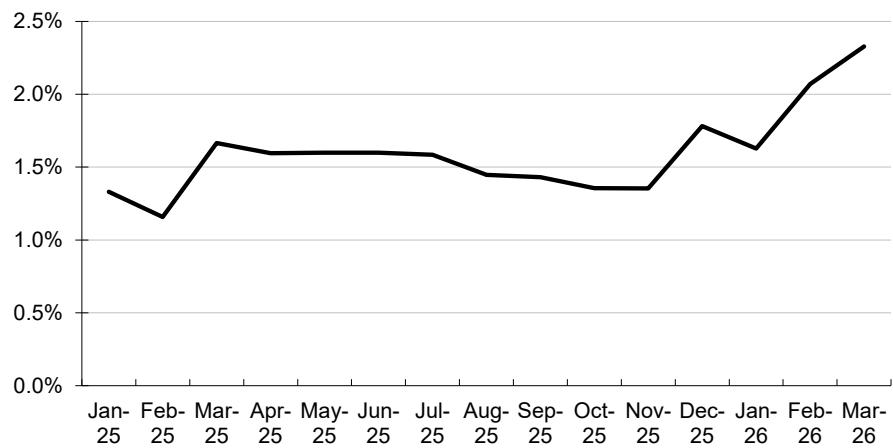

line

| Month   | Value |
| ------- | ----- |
| Jan-25  | 1.3%  |
| Feb-25  | 1.1%  |
| Mar-25  | 1.6%  |
| Apr-25  | 1.55% |
| May-25  | 1.55% |
| Jun-25  | 1.55% |
| Jul-25  | 1.55% |
| Aug-25  | 1.45% |
| Sep-25  | 1.4%  |
| Oct-25  | 1.35% |
| Nov-25  | 1.35% |
| Dec-25  | 1.8%  |
| Jan-26  | 1.6%  |
| Feb-26  | 2.0%  |
| Mar-26  | 2.3%  |

Source : Marklines, DB

Figure 141: Nissan NEV Sales by Country 

<table><tr><td rowspan="2"></td><td colspan="5">Nissan NEV Sales Breakdown</td></tr><tr><td>Mar-26</td><td>YoY</td><td>MoM</td><td>3M 2026</td><td>YoY</td></tr><tr><td>Nissan NEV Sales</td><td>15,821</td><td>107.4%</td><td>252.4%</td><td>27,350</td><td>33.3%</td></tr><tr><td>China</td><td>9,322</td><td></td><td>651.2%</td><td>14,590</td><td></td></tr><tr><td>Japan</td><td>3,588</td><td>38.7%</td><td>71.1%</td><td>7,791</td><td>-0.4%</td></tr><tr><td>UK</td><td>791</td><td>-17.3%</td><td>427.3%</td><td>1,075</td><td>-44.8%</td></tr><tr><td>Canada</td><td>681</td><td>89.7%</td><td>964.1%</td><td>805</td><td>-2.2%</td></tr><tr><td>Germany</td><td>351</td><td>76.4%</td><td>46.3%</td><td>670</td><td>21.8%</td></tr><tr><td>Norway</td><td>293</td><td>-49.4%</td><td>179.0%</td><td>473</td><td>-73.0%</td></tr><tr><td>France</td><td>282</td><td>108.9%</td><td>18.0%</td><td>731</td><td>70.4%</td></tr><tr><td>USA</td><td>271</td><td>-88.9%</td><td>35.5%</td><td>724</td><td>-88.8%</td></tr><tr><td>Italy</td><td>186</td><td>42.0%</td><td>64.6%</td><td>327</td><td>24.3%</td></tr><tr><td>Finland</td><td>41</td><td>-39.7%</td><td>173.3%</td><td>61</td><td>-57.3%</td></tr></table>

Source : Marklines, DB

Figure 142: Nissan NEV Sales Breakdown - Top Models 

<table><tr><td colspan="7">Nissan NEV Sales Breakdown - Top Models</td></tr><tr><td>(unit)</td><td></td><td>Mar-26</td><td>YoY</td><td>MoM</td><td>3M 2026</td><td>YoY</td></tr><tr><td>Brand</td><td>Model</td><td>15,821</td><td>107.4%</td><td>252.4%</td><td>27,350</td><td>33.3%</td></tr><tr><td>Nissan</td><td>Nissan N6 PHEV</td><td>4,567</td><td></td><td>336.6%</td><td>8,923</td><td></td></tr><tr><td>Nissan</td><td>Leaf EV</td><td>3,382</td><td>117.5%</td><td>148.5%</td><td>6,354</td><td>72.8%</td></tr><tr><td>Nissan</td><td>Nissan NX8 EV</td><td>2,450</td><td></td><td>48900.0%</td><td>2,455</td><td></td></tr><tr><td>Nissan</td><td>Nissan N7 EV</td><td>2,304</td><td></td><td>1112.6%</td><td>3,211</td><td></td></tr><tr><td>Nissan</td><td>Ariya EV</td><td>971</td><td>-73.7%</td><td>105.3%</td><td>1,793</td><td>-82.4%</td></tr></table>

Source : Marklines, DB

Figure 143: Nissan NEV Sales Trend   
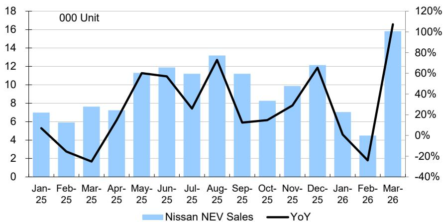

bar_line

| Month   | Nissan NEV Sales | YoY    |
|---------|------------------|--------|
| Jan-25  | 7                | 50%    |
| Feb-25  | 6                | 20%    |
| Mar-25  | 8                | -10%   |
| Apr-25  | 7                | 40%    |
| May-25  | 11               | 60%    |
| Jun-25  | 12               | 55%    |
| Jul-25  | 11               | 30%    |
| Aug-25  | 13               | 70%    |
| Sep-25  | 11               | 10%    |
| Oct-25  | 8                | 15%    |
| Nov-25  | 10               | 30%    |
| Dec-25  | 12               | 60%    |
| Jan-26  | 7                | 10%    |
| Feb-26  | 5                | -20%   |
| Mar-26  | 16               | 110%   |

Source : Marklines, DB

Figure 144: Nissan G15 NEV Market Share   
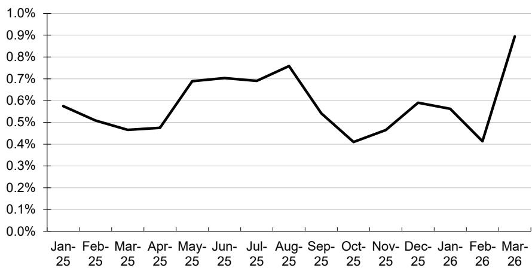

line

| Month   | Value |
| ------- | ----- |
| Jan-25  | 0.58% |
| Feb-25  | 0.50% |
| Mar-25  | 0.47% |
| Apr-25  | 0.47% |
| May-25  | 0.69% |
| Jun-25  | 0.71% |
| Jul-25  | 0.69% |
| Aug-25  | 0.76% |
| Sep-25  | 0.54% |
| Oct-25  | 0.41% |
| Nov-25  | 0.46% |
| Dec-25  | 0.59% |
| Jan-26  | 0.56% |
| Feb-26  | 0.41% |
| Mar-26  | 0.91% |

Source : Marklines, DB

Figure 145: Hyundai-Kia NEV Sales by Country 

<table><tr><td colspan="6">Hyundai-Kia NEV Sales Breakdown</td></tr><tr><td></td><td>Mar-26</td><td>YoY</td><td>MoM</td><td>3M 2026</td><td>YoY</td></tr><tr><td>Hyundai-Kia NEV Sales</td><td>59,574</td><td>32.2%</td><td>42.0%</td><td>128,138</td><td>27.1%</td></tr><tr><td>Korea</td><td>25,149</td><td>104.9%</td><td>17.2%</td><td>52,749</td><td>125.6%</td></tr><tr><td>UK</td><td>10,646</td><td>27.8%</td><td>303.3%</td><td>18,061</td><td>17.0%</td></tr><tr><td>USA</td><td>9,214</td><td>-23.2%</td><td>43.1%</td><td>20,974</td><td>-29.0%</td></tr><tr><td>Germany</td><td>5,253</td><td>28.8%</td><td>31.4%</td><td>12,733</td><td>23.3%</td></tr><tr><td>Sweden</td><td>2,268</td><td>98.4%</td><td>36.5%</td><td>5,234</td><td>50.2%</td></tr><tr><td>Canada</td><td>2,182</td><td>28.7%</td><td>44.1%</td><td>4,807</td><td>-3.6%</td></tr><tr><td>France</td><td>2,068</td><td>43.7%</td><td>-3.7%</td><td>6,181</td><td>48.8%</td></tr><tr><td>India</td><td>982</td><td>-0.9%</td><td>36.8%</td><td>2,430</td><td>7.9%</td></tr><tr><td>Norway</td><td>579</td><td>-23.8%</td><td>79.3%</td><td>999</td><td>-49.6%</td></tr><tr><td>Italy</td><td>487</td><td>-20.8%</td><td>-14.1%</td><td>1,534</td><td>0.4%</td></tr><tr><td>China</td><td>379</td><td>-70.4%</td><td>55.3%</td><td>1,339</td><td>-47.4%</td></tr><tr><td>Finland</td><td>295</td><td>-16.4%</td><td>74.6%</td><td>663</td><td>-20.7%</td></tr><tr><td>Japan</td><td>45</td><td>9.8%</td><td>4.7%</td><td>124</td><td>8.8%</td></tr><tr><td>Thailand</td><td>27</td><td>-66.3%</td><td>42.1%</td><td>310</td><td>27.0%</td></tr></table>

Source : Marklines, DB

Figure 146: Hyundai-Kia NEV Sales Breakdown - Top Models 

<table><tr><td colspan="7">Hyundai-Kia NEV Sales Breakdown - Top Models</td></tr><tr><td>(unit)</td><td></td><td>Mar-26</td><td>YoY</td><td>MoM</td><td>3M 2026</td><td>YoY</td></tr><tr><td>Brand</td><td>Model</td><td>59,574</td><td>32.2%</td><td>42.0%</td><td>128,138</td><td>27.1%</td></tr><tr><td>Kia</td><td>EV3 EV</td><td>8,465</td><td>15.4%</td><td>64.9%</td><td>16,271</td><td>10.7%</td></tr><tr><td>Hyundai</td><td>IONIQ 5 EV</td><td>8,303</td><td>7.5%</td><td>14.2%</td><td>19,196</td><td>6.4%</td></tr><tr><td>Kia</td><td>EV5 EV</td><td>5,684</td><td>321.3%</td><td>62.4%</td><td>11,054</td><td>301.1%</td></tr><tr><td>Kia</td><td>Kia PV5 EV</td><td>4,798</td><td></td><td>-1.1%</td><td>11,440</td><td></td></tr><tr><td>Kia</td><td>EV4 EV</td><td>4,450</td><td></td><td>54.1%</td><td>8,920</td><td></td></tr><tr><td>Kia</td><td>EV6 EV</td><td>2,860</td><td>-13.8%</td><td>43.2%</td><td>6,052</td><td>-35.6%</td></tr><tr><td>Hyundai</td><td>Inster EV</td><td>2,791</td><td>121.9%</td><td>43.6%</td><td>6,406</td><td>134.7%</td></tr><tr><td>Hyundai</td><td>Ioniq 9 EV</td><td>2,657</td><td>238.9%</td><td>3.6%</td><td>6,409</td><td>564.1%</td></tr><tr><td>Kia</td><td>EV9 EV</td><td>2,558</td><td>12.9%</td><td>76.0%</td><td>5,372</td><td>-16.3%</td></tr><tr><td>Hyundai</td><td>Kona EV</td><td>2,430</td><td>-22.9%</td><td>43.2%</td><td>5,588</td><td>-23.1%</td></tr></table>

Source : Marklines, DB

Figure 147: Hyundai-Kia NEV Sales Trend   
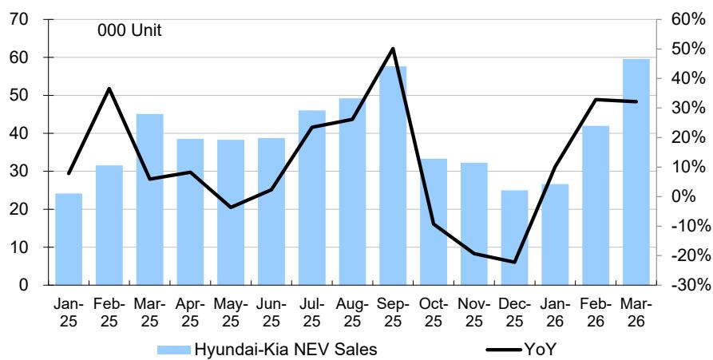

bar_line

| Month | Hyundai-Kia NEV Sales (in 1000 Units) | YoY (%) |
|---|---|---|
| Jan-25 | 24 | 30 |
| Feb-25 | 31 | 52 |
| Mar-25 | 45 | 8 |
| Apr-25 | 38 | 10 |
| May-25 | 38 | -5 |
| Jun-25 | 39 | 10 |
| Jul-25 | 46 | 22 |
| Aug-25 | 49 | 24 |
| Sep-25 | 58 | 52 |
| Oct-25 | 33 | -15 |
| Nov-25 | 32 | -10 |
| Dec-25 | 25 | -18 |
| Jan-26 | 27 | 10 |
| Feb-26 | 42 | 35 |
| Mar-26 | 60 | 35 |

Source : Marklines, DB

Figure 148: Hyundai-Kia G15 NEV Market Share   
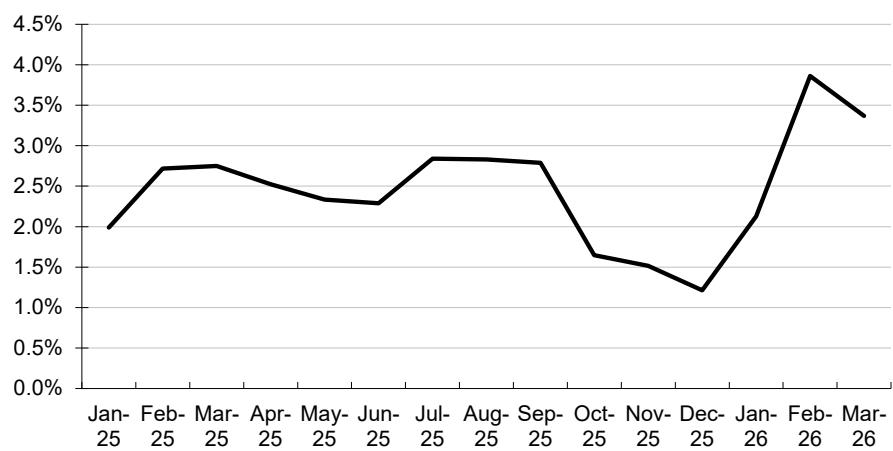

line

| Month | Value (%) |
|---|---|
| Jan-25 | 2.0 |
| Feb-25 | 2.7 |
| Mar-25 | 2.75 |
| Apr-25 | 2.5 |
| May-25 | 2.3 |
| Jun-25 | 2.25 |
| Jul-25 | 2.85 |
| Aug-25 | 2.85 |
| Sep-25 | 2.8 |
| Oct-25 | 1.6 |
| Nov-25 | 1.5 |
| Dec-25 | 1.2 |
| Jan-26 | 2.1 |
| Feb-26 | 3.9 |
| Mar-26 | 3.3 |

Source : Marklines, DB

# Appendix 1

# Important Disclosures

\*Other information available upon request

\*Prices are current as of the end of the previous trading session unless otherwise indicated and are sourced from local exchanges via Reuters, Bloomberg and other vendors. Other information is sourced from DB, subject companies, and other sources. For disclosures pertaining to recommendations or estimates made on securities other than the primary subject of this research, please see the most recently published company report or visit our global disclosure look-up page on our website at https://research.db.com/Research/Disclosures/EquityResearchDisclosures. Aside from within this report, important risk and conflict disclosures can also be found at https://research.db.com/Research/Disclosures/Disclaimer. Investors are strongly encouraged to review this information before investing.

# Analyst Certification

The views expressed in this report accurately reflect the personal views of the undersigned lead analyst about the subject issuers and the securities of those issuers. In addition, the undersigned lead analyst has not and will not receive any compensation for providing a specific recommendation or view in this report. Tim Rokossa, Christoph Laskawi, Edison Yu, Bin Wang.

Equity rating dispersion and banking relationships   
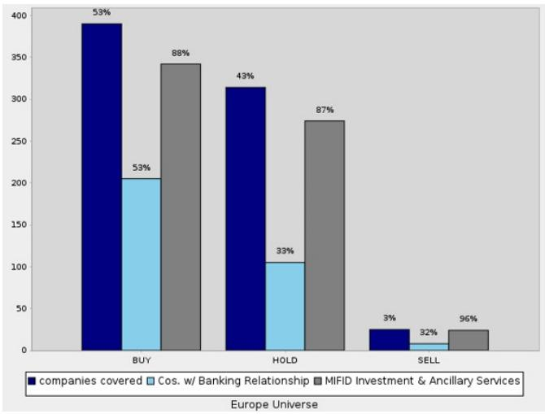

bar

| Category | companies covered (%) | Cos. w/ Banking Relationship (%) | MIFID Investment & Ancillary Services (%) |
| :--- | :--- | :--- | :--- |
| BUY | 53 | 53 | 88 |
| HOLD | 43 | 33 | 87 |
| SELL | 3 | 2 | 96 |
Europe Universe

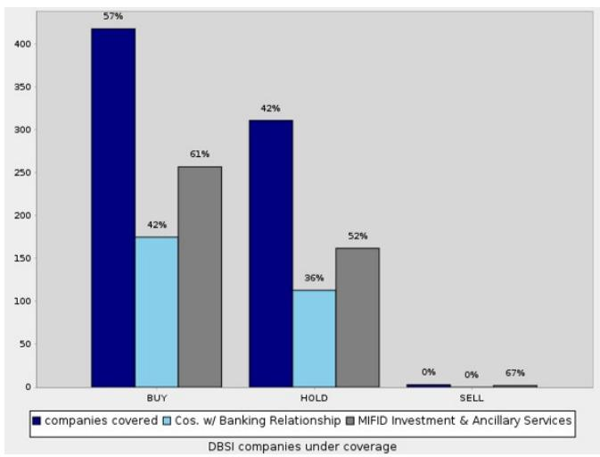

bar

DBSI companies under coverage
| Category | companies covered (%) | Cos. w/ Banking Relationship (%) | MIFID Investment & Ancillary Services (%) |
| :--- | :--- | :--- | :--- |
| BUY | 57 | 42 | 61 |
| HOLD | 42 | 36 | 52 |
| SELL | 0 | 0 | 67 |

# Equity Rating and Dispersion Key

The Equity Rating Dispersion Chart depicts the following:

The proportion of recommendations that are rated "buy", "sell" and "hold" over the previous 12 months. This is shown for securities issued in the stated region e.g. "Europe Universe". See rating definitions below. This is represented by the "Companies Covered" bars in the chart. The percentage value displayed above the bar is the proportion as a percentage. E.g. 50% above the "buy" / "Companies Covered" bar means that 50% of DB's equity research covered companies over the past 12 months have a "buy" rating.

Next to each of the three respective bars showing the proportion of "buy", "sell" and "hold" recommendations we provide two additional bars to show:

\- The proportion of "buy", "sell" or "hold recommendations where DB and or/Affiliates provided MIFID Investment or Ancillary Services in the past 12 months. This is represented in the "MIFID Investment and Ancillary Services" bar. The percentage value displayed above the bar shows the proportion of Companies Covered with the given rating where DB has also provided MIFID Investment and Ancillary Services in the past 12 months. E.g. 50% above the "Cos. w/ MIFID Investment and Ancillary Services" bar means 50% of the Companies Covered with the rating stated have also received MIFID Investment and Ancillary Services from DB.

\- The proportion of "buy" (or "sell" or "hold") recommendations where DB and or/Affiliates has provided Investment Banking services in the past 12 months for which it has received compensation. The percentage value displayed above the bar shows the proportion of Companies Covered with the stated rating where DB has also provided Investment Banking services in the past 12 months. E.g. 50% above the "Cos. w/ Investment Banking relationship" bar means 50% of the Companies Covered with the rating stated also have an Investment Banking Relationship with DB.

Buy: Based on a current 12-month view of TSR, we recommend that investors buy the stock.

Sell: Based on a current 12-month view of TSR, we recommend that investors sell the stock.

Hold: We take a neutral view on the stock 12-months out and, based on this time horizon, do not recommend either a Buy or Sell.

TSR = Total Shareholder Return. Percentage change in share price from current price to projected target price plus projected dividend yield

Newly issued research recommendations and target prices supersede previously published research.

# Additional Information

The information and opinions in this report were prepared by DB AG or one of its affiliates (collectively 'DB'). Though the information herein is believed to be reliable and has been obtained from public sources believed to be reliable, DB makes no representation as to its accuracy or completeness. Hyperlinks to third-party websites in this report are provided for reader convenience only. DB neither endorses the content nor is responsible for the accuracy or security controls of those websites.

If you use the services of DB in connection with a purchase or sale of a security that is discussed in this report, or is included or discussed in another communication (oral or written) from a DB analyst, DB may act as principal for its own account or as agent for another person.

DB may consider this report in deciding to trade as principal. It may also engage in transactions, for its own account or with customers, in a manner inconsistent with the views taken in this research report. Others within DB, including strategists, sales staff and other analysts, may take views that are inconsistent with those taken in this research report. DB issues a variety of research products, including fundamental analysis, equity-linked analysis, quantitative analysis and trade ideas. Recommendations contained in one type of communication may differ from recommendations contained in others, whether as a result of differing time horizons, methodologies, perspectives or otherwise. DB and/or its affiliates may also be holding debt or equity securities of the issuers it writes on. Analysts are paid in part based on the profitability of DB AG and its affiliates, which includes investment banking, trading and principal trading revenues.

Opinions, estimates and projections constitute the current judgment of the author as of the date of this report. They do not necessarily reflect the opinions of DB and are subject to change without notice. DB provides liquidity for buyers and sellers of securities issued by the companies it covers. DB analysts sometimes have shorter-term trade ideas that may be inconsistent with DB's existing longer-term ratings. Some trade ideas for equities are listed as Catalyst Calls on the Research Website (https://research.db.com/Research/), and can be found on the general coverage list and also on the covered company's page. A Catalyst Call represents a high-conviction belief by an analyst that a stock will outperform or underperform the market and/or a specified sector over a time frame of no less than two weeks and no more than three months. In addition to Catalyst Calls, analysts may occasionally discuss with our clients, and with DB salespersons and traders, trading strategies or ideas that reference catalysts or events that may have a near-term or medium-term impact on the market price of the securities discussed in this report, which impact may be directionally counter to the analysts' current 12-month view of total return or investment return as described herein. DB has no obligation to update, modify or amend this report or to otherwise notify a recipient thereof if an opinion, forecast or estimate changes or becomes inaccurate. Coverage and the frequency of changes in market conditions and in both general and company-specific economic prospects make it difficult to update research at defined intervals. Updates are at the sole discretion of the coverage analyst or of the Research Department Management, and the majority of reports are published at irregular intervals. This report is provided for informational purposes only and does not take into account the particular investment objectives, financial situations, or needs of individual clients. It is not an offer or a solicitation of an offer to buy or sell any financial instruments or to participate in any particular trading strategy. Target prices are inherently imprecise and a product of the analyst's judgment. The financial instruments discussed in this report may not be suitable for all investors, and investors must make their own informed investment decisions. Prices and availability of financial instruments are subject to change without notice, and investment transactions can lead to losses as a result of price fluctuations and other factors. If a financial instrument is denominated in a currency other than an investor's currency, a change in exchange rates may adversely affect the investment. Past performance is not necessarily indicative of future results. Performance calculations exclude transaction costs, unless otherwise indicated. Unless otherwise indicated, prices are current as of the end of the previous trading session and are sourced from local exchanges via Reuters, Bloomberg and other vendors. Data is also sourced from DB, subject companies, and other parties. Artificial intelligence tools may be used in the preparation of this material, including but not limited to assist in fact-finding, data analysis, pattern recognition, content drafting and editorial corrections pertaining to research material.

The DB Department is independent of other business divisions of the Bank. Details regarding our organizational arrangements and information barriers we have to prevent and avoid conflicts of interest with respect to our research are available on our website (https://research.db.com/Research/) under Disclaimer.

Macroeconomic fluctuations often account for most of the risks associated with exposures to instruments that promise to pay fixed or variable interest rates. For an investor who is long fixed-rate instruments (thus receiving these cash flows), increases in interest rates naturally lift the discount factors applied to the expected cash flows and thus cause a loss. The longer the maturity of a certain cash flow and the higher the move in the discount factor, the higher will be the loss. Upside surprises in inflation, fiscal funding needs, and FX depreciation rates are among the most common adverse macroeconomic shocks to receivers. But counterparty exposure, issuer creditworthiness, client segmentation, regulation (including changes in assets holding limits for different types of investors), changes in tax policies, currency convertibility (which may constrain currency conversion, repatriation of profits and/or liquidation of positions), and settlement issues related to local clearing houses are also important risk factors. The sensitivity of fixed-income instruments to macroeconomic shocks may be mitigated by indexing the contracted cash flows to inflation, to FX depreciation, or to specified interest rates - these are common in emerging markets. The index fixings may - by construction - lag or mis-measure the actual move in the underlying variables they are intended to track. The choice of the proper fixing (or metric) is particularly important in swaps markets, where floating coupon rates (i.e., coupons indexed to a typically short-dated interest rate reference index) are exchanged for fixed coupons. Funding in a currency that differs from the currency in which coupons are denominated carries FX risk. Options on swaps (swaptions) the risks typical to options in addition to the risks related to rates movements.

Derivative transactions involve numerous risks including market, counterparty default and illiquidity risk. The appropriateness of these products for use by investors depends on the investors' own circumstances, including their tax position, their regulatory environment and the nature of their other assets and liabilities; as such, investors should take expert legal and financial advice before entering into any transaction similar to or inspired by the contents of this publication. The risk of loss in futures trading and options, foreign or domestic, can be substantial. As a result of the high degree of leverage obtainable in futures and options trading, losses may be incurred that are greater than the amount of funds initially deposited - up to theoretically unlimited losses. Trading in options involves risk and is not suitable for all investors. Prior to buying or selling an option, investors must review the 'Characteristics and Risks of Standardized Options", at https://www.theocc.com/company-information/documents-and-archives/options-disclosure-document. If you are unable to access the website, please contact your DB representative for a copy of this important document.

Participants in foreign exchange transactions may incur risks arising from several factors, including the following: (i) exchange rates can be volatile and are subject to large fluctuations; (ii) the value of currencies may be affected by numerous market factors, including world and national economic, political and regulatory events, events in equity and debt markets and changes in interest rates; and (iii) currencies may be subject to devaluation or government-imposed exchange controls, which could affect the value of the currency. Investors in securities such as ADRs, whose values are affected by the currency of an underlying security, effectively assume currency risk.

Unless governing law provides otherwise, all transactions should be executed through the DB entity in the investor's home jurisdiction. Aside from within this report, important conflict disclosures can also be found at https://research.db.com/Research/ on each company's research page or under the 'Disclosures' tab. Investors are strongly encouraged to review this information before investing.

DB (which includes DB AG, its branches and affiliated companies) is not acting as a financial adviser, consultant or fiduciary to you or any of your agents (collectively, "You" or "Your") with respect to any information provided in this report. DB does not provide investment, legal, tax or accounting advice, DB is not acting as your impartial adviser, and does not express any opinion or recommendation whatsoever as to any strategies, products or any other information presented in the materials. Information contained herein is being provided solely on the basis that the recipient will make an independent assessment of the merits of any investment decision, and it does not constitute a recommendation of, or express an opinion on, any product or service or any trading strategy.

The information presented is general in nature and is not directed to retirement accounts or any specific person or account type, and is therefore provided to You on the express basis that it is not advice, and You may not rely upon it in making Your decision. The information we provide is being directed only to persons we believe to be financially sophisticated, who are capable of evaluating investment risks independently, both in general and with regard to particular transactions and investment strategies, and who understand that DB has financial interests in the offering of its products and services. If this is not the case, or if You are an IRA or other retail investor receiving this directly from us, we ask that you inform us immediately.

In July 2018, DB revised its rating system for short term ideas whereby the branding has been changed to Catalyst Calls ("CC") from SOLAR ideas; the rating categories for Catalyst Calls originated in the Americas region have been made consistent with the categories used by Analysts globally; and the effective time period for CCs has been reduced from a maximum of 180 days to 90 days.

United States: Approved and/or distributed by DB Securities Incorporated, a member of FINRA and SIPC. Analysts located outside of the United States are employed by non-US affiliates and are not registered/qualified as research analysts with FINRA.

European Economic Area (exc. United Kingdom): Approved and/or distributed by DB AG, a joint stock corporation with limited liability incorporated in the Federal Republic of Germany with its principal office in Frankfurt am Main. DB AG is authorized under German Banking Law and is subject to supervision by the European Central Bank and by BaFin, Germany's Federal Financial Supervisory Authority.

United Kingdom: Approved and/or distributed by DB AG acting through its London Branch at 21 Moorfields, London EC2Y 9DB. DB AG in the United Kingdom is authorised by the Prudential Regulation Authority and is subject to limited regulation by the Prudential Regulation Authority and Financial Conduct Authority. Details about the extent of our authorisation and regulation are available on request.

Hong Kong SAR: Distributed by DB AG, Hong Kong Branch except for any research content relating to futures contracts within the meaning of the Hong Kong Securities and Futures Ordinance Cap. 571. Research reports on such futures contracts are not intended for access by persons who are located, incorporated, constituted or resident in Hong Kong. The author(s) of a research report may not be licensed to carry on regulated activities in Hong Kong and, if not licensed, do not hold themselves out as being able to do so. The provisions set out above in the 'Additional Information' section shall apply to the fullest extent permissible by local laws and regulations, including without limitation the Code of Conduct for Persons Licensed or Registered with the Securities and Futures Commission. This report is intended for distribution only to 'professional investors' as defined in Part 1 of Schedule of the SFO. This document must not be acted or relied on by persons who are not professional investors. Any investment or investment activity to which this document relates is only available to professional investors and will be engaged only with professional investors.

India: Prepared by Deutsche Equities India Private Limited (DEIPL) having CIN: U65990MH2002PTC137431 and registered office at 14th Floor, The Capital, C-70, G Block, Bandra Kurla Complex, Mumbai (India) 400051. Tel: +91 22 7180 4444. It is registered by the Securities and Exchange Board of India (SEBI) as a Stock broker bearing registration no.: INZ000252437; Merchant Banker bearing SEBI Registration no.: INM000010833 and Research Analyst bearing SEBI Registration no.: INH000001741. DEIPL's Compliance / Grievance officer is Ms. Rashmi Poddar (Tel: +91 22 7180 4929 email ID: complaints.deipl@db.com). Registration granted by SEBI and certification from NISM in no way guarantee performance of DEIPL or provide any assurance of returns to investors. Investment in securities market are subject to market risks. Read all the related documents carefully before investing. DEIPL may have received administrative warnings from the SEBI for breaches of Indian regulations. DB and/or its affiliate(s) may have debt holdings or positions in the subject company. With regard to information on associates, please refer to the "Shareholdings" section in the Annual Report at: https://www.db.com/ir/en/annual-reports.htm. For latest India research audit report, refer https://country.db.com/india/deutsche-equities-india/index?language\_id=1.

Japan: Approved and/or distributed by Deutsche Securities Inc.(DSI). Registration number - Registered as a financial instruments dealer by the Head of the Kanto Local Finance Bureau (Kinsho) No. 117. Member of associations: JSDA, Type II Financial Instruments Firms Association and The Financial Futures Association of Japan. Commissions and risks involved in stock transactions - for stock transactions, we charge stock commissions and consumption tax by multiplying the transaction amount by the commission rate agreed with each customer. Stock transactions can lead to losses as a result of share price fluctuations and other factors. Transactions in foreign stocks can lead to additional losses stemming from foreign exchange fluctuations. We may also charge commissions and fees for certain categories of investment advice, products and services. Recommended investment strategies, products and services carry the risk of losses to principal and other losses as a result of changes in market and/or economic trends, and/or fluctuations in market value. Before deciding on the purchase of financial products and/or services, customers should carefully read the relevant disclosures, prospectuses and other documentation. 'Moody's', 'Standard Poor's', and 'Fitch' mentioned in this report are not registered credit rating agencies in Japan unless Japan or 'Nippon' is specifically designated in the name of the entity. Reports on Japanese listed companies not written by analysts of DSI are written by DB Group's analysts with the coverage companies specified by DSI. Some of the foreign securities stated on this report are not disclosed according to the Financial Instruments and Exchange Law of Japan. Target prices set by DB's equity analysts are based on a 12-month forecast period.

Korea: Distributed by Deutsche Securities Korea Co.

South Africa: DB AG Johannesburg is incorporated in the Federal Republic of Germany (Branch Register Number in South Africa: 1998/003298/10).

Singapore: This report is issued by DB AG, Singapore Branch (One Raffles Quay #18-00 South Tower Singapore 048583, 65 6423 8001), which may be contacted in respect of any matters arising from, or in connection with, this report. Where this report is issued or promulgated by DB in Singapore to a person who is not an accredited investor, expert investor or institutional investor (as defined in the applicable Singapore laws and regulations), they accept legal responsibility to such person for its contents.

Taiwan: Information on securities/investments that trade in Taiwan is for your reference only. Readers should independently evaluate investment risks and are solely responsible for their investment decisions. DB may not be distributed to the Taiwan public media or quoted or used by the Taiwan public media without written consent. Information on securities/instruments that do not trade in Taiwan is for informational purposes only and is not to be construed as a recommendation to trade in such securities/instruments.

Qatar: DB AG in the Qatar Financial Centre (registered no. 00032) is regulated by the Qatar Financial Centre Regulatory Authority. DB AG - QFC Branch may undertake only the financial services activities that fall within the scope of its existing QFCRA license. Its principal place of business in the QFC: Qatar Financial Centre, Tower, West Bay, Level 5, PO Box 14928, Doha, Qatar. This information has been distributed by DB AG. Related financial products or services are only available only to Business Customers, as defined by the Qatar Financial Centre Regulatory Authority.

Russia: The information, interpretation and opinions submitted herein are not in the context of, and do not constitute, any appraisal or evaluation activity requiring a license in the Russian Federation.

Kingdom of Saudi Arabia: Deutsche Securities Saudi Arabia (DSSA) is a closed joint stock company authorized by the Capital Market Authority of the Kingdom of Saudi Arabia with a license number (No. 37-07073) to conduct the following business activities: Dealing, Arranging, Advising, and Custody activities. DSSA registered office is Faisaliah Tower, 17th Floor, King Fahad Road - Al Olaya District Riyadh, Kingdom of Saudi Arabia P.O. Box 301806.

United Arab Emirates: DB AG in the Dubai International Financial Centre (registered no. 00045) is regulated by the Dubai Financial Services Authority. DB AG - DIFC Branch may only undertake the financial services activities that fall within the scope of its existing DFSA license. Principal place of business in the DIFC: Dubai International Financial Centre, The Gate Village, Building 5, PO Box 504902, Dubai, U.A.E. This information has been distributed by DB AG. Related financial products or services are available only to Professional Clients, as defined by the Dubai Financial Services Authority.

Australia and New Zealand: This research is intended only for 'wholesale clients' within the meaning of the Australian Corporations Act and New Zealand Financial Advisors Act, respectively. Please refer to Australia-specific research disclosures and related information at https://www.dbresearch.com/PROD/RPS\_EN-PROD/PROD0000000000521304.xhtml. Where research refers to any particular financial product recipients of the research should consider any product disclosure statement, prospectus or other applicable disclosure document before making any decision about whether to acquire the product. In preparing this report, the primary analyst or an individual who assisted in the preparation of this report has likely been in contact with the company that is the subject of this research for confirmation/clarification of data, facts, statements, permission to use company-sourced material in the report, and/or site-visit attendance. Without prior approval from Research Management, analysts may not accept from current or potential Banking clients the costs of travel, accommodations, or other expenses incurred by analysts attending site visits, conferences, social events, and the like. Similarly, without prior approval from Research Management and Anti-Bribery and Corruption ("ABC") team, analysts may not accept perks or other items of value for their personal use from issuers they cover.

Additional information relative to securities, other financial products or issuers discussed in this report is available upon request. This report may not be reproduced, distributed or published without DB's prior written consent.

Backtested, hypothetical or simulated performance results have inherent limitations. Unlike an actual performance record based on trading actual client portfolios, simulated results are achieved by means of the retroactive application of a backtested model itself designed with the benefit of hindsight. Taking into account historical events the backtesting of performance also differs from actual account performance because an actual investment strategy may be adjusted any time, for any reason, including a response to material, economic or market factors. The backtested performance includes hypothetical results that do not reflect the reinvestment of dividends and other earnings or the deduction of advisory fees, brokerage or other commissions, and any other expenses that a client would have paid or actually paid. No representation is made that any trading strategy or account will or is likely to achieve profits or losses similar to those shown. Alternative modeling techniques or assumptions might produce significantly different results and prove to be more appropriate. Past hypothetical backtest results are neither an indicator nor guarantee of future returns. Actual results will vary, perhaps materially, from the analysis.

The method for computing individual E,S,G and composite ESG scores set forth herein is a novel method developed by the Research department within DB AG, computed using a systematic approach without human intervention. Different data providers, market sectors and geographies approach ESG analysis and incorporate the findings in a variety of ways. As such, the ESG scores referred to herein may differ from equivalent ratings developed and implemented by other ESG data providers in the market and may also differ from equivalent ratings developed and implemented by other divisions within the DB Group. Such ESG scores also differ from other ratings and rankings that have historically been applied in research reports published by DB AG. Further, such ESG scores do not represent a formal or official view of DB AG. It should be noted that the decision to incorporate ESG factors into any investment strategy may inhibit the ability to participate in certain investment opportunities that otherwise would be consistent with your investment objective and other principal investment strategies. The returns on a portfolio consisting primarily of sustainable investments may be lower or higher than portfolios where ESG factors, exclusions, or other sustainability issues are not considered, and the investment opportunities available to such portfolios may differ. Companies may not necessarily meet high performance standards on all aspects of ESG or sustainable investing issues; there is also no guarantee that any company will meet expectations in connection with corporate responsibility, sustainability, and/or impact performance.

Copyright © 2026 DB AG

# David Folkerts-Landau

Group Chief Economist and Global Head of Research

Pam Finelli
Global Chief Operating Officer
Research

Steve Pollard
Global Head of Company
Research and Sales

Jim Reid
Global Head of
Macro and Thematic Research

Tim Rokossa
Head of Germany
Research

Gerry Gallagher
Head of European
Company Research

Matthew Barnard
Head of Americas
Company Research

Peter Milliken
Head of APAC
Company Research

Debbie Jones
Global Head of Sustainability
and Data Innovation, Research

Sameer Goel
Global Head of EM & APAC
Research

Francis Yared
Global Head of Rates Research

George Saravelos
Global Head of FX Research

Peter Hooper
Vice-Chair of Research

International Production Locations 

<table><tr><td>DB AG</td><td>DB AG</td><td>DB AG</td><td>Deutsche Securities Inc.</td></tr><tr><td>DB Place</td><td>Equity Research</td><td>Filiale Hongkong</td><td>1-3-1 Azabudai</td></tr><tr><td>Level 16</td><td>Mainzer Landstrasse 11-17</td><td>International Commerce</td><td>Azabudai Hills Mori JP Tower</td></tr><tr><td>Corner of Hunter &amp; Phillip</td><td>60329 Frankfurt am Main</td><td>Centre,</td><td>Minato-ku, Tokyo 106-0041</td></tr><tr><td>Streets</td><td>Germany</td><td>1 Austin Road West,Kowloon,</td><td>Japan</td></tr><tr><td>Sydney, NSW 2000</td><td>Tel: (49) 69 910 00</td><td>Hong Kong</td><td>Tel: (81) 3 6730 1000</td></tr><tr><td>Australia</td><td></td><td>Tel: (852) 2203 8888</td><td></td></tr><tr><td>Tel: (61) 2 8258 1234</td><td></td><td></td><td></td></tr><tr><td>DB AG</td><td>DB Securities Inc.</td><td>DB AG</td><td></td></tr><tr><td>21 Moorfields</td><td>The DB Center</td><td>Filiale Singapur</td><td></td></tr><tr><td>London EC2Y 9DB</td><td>1 Columbus Circle</td><td>One Raffles Quay, South</td><td></td></tr><tr><td>United Kingdom</td><td>New York, NY 10019</td><td>Tower,</td><td></td></tr><tr><td>Tel: (44) 20 7545 8000</td><td>Tel: (1) 212 250 2500</td><td>Singapore 048583</td><td></td></tr><tr><td></td><td></td><td>Tel: +65 6423 8001</td><td></td></tr></table>