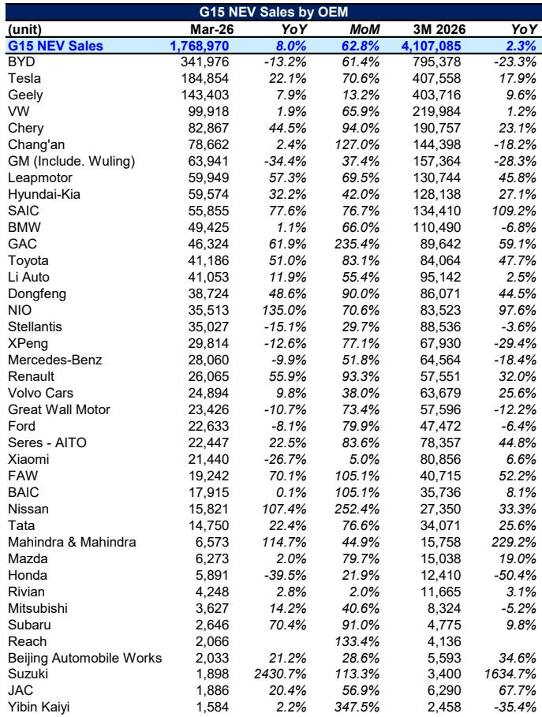
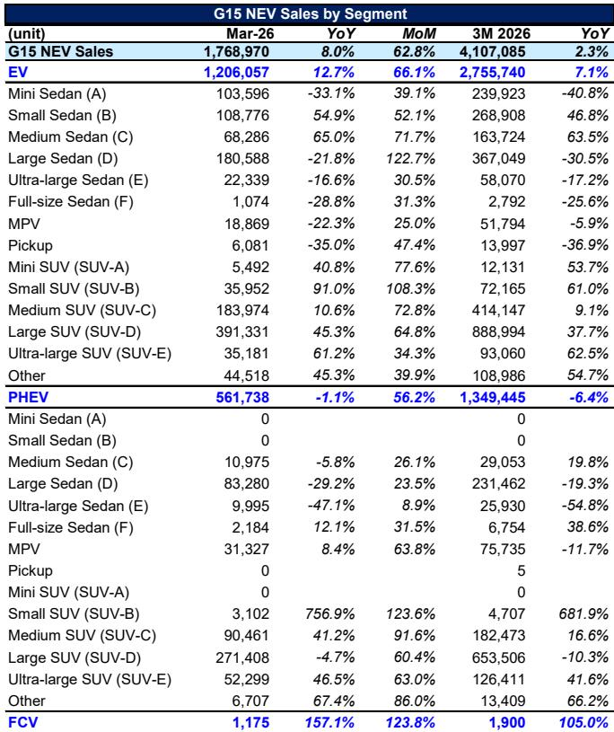
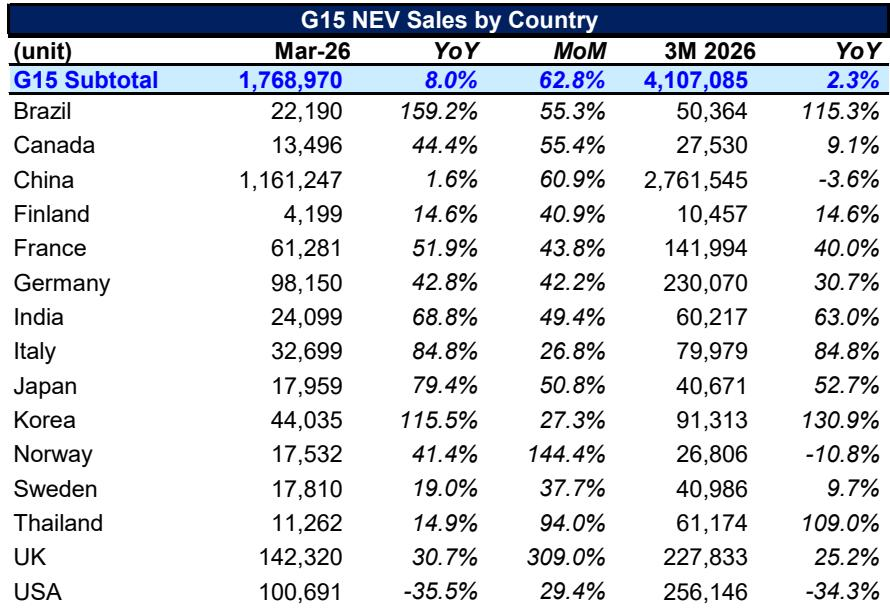

# The Global NEV Market Is Not Slowing Down — It Is Reorganizing Around New Centers of Gravity

The global new energy vehicle market is not in decline. It is undergoing a structural reconfiguration that most observers have misread as a slowdown. In March 2026, the top 15 markets sold roughly 1.77 million NEVs, a year-on-year increase of 8 percent. The first quarter of 2026 closed at 4.1 million units, up 2.3 percent from the same period last year. These are not the numbers of a market losing momentum.

What makes this moment strategically significant is not the aggregate growth rate, which is modest by historical standards. It is the divergence beneath the surface. The global NEV market is no longer a single story driven by one dominant player. It is fracturing into distinct regional regimes, each with its own growth drivers, policy environments, and competitive dynamics. The market is not slowing — it is reorganizing around new centers of gravity.

For investors, strategists, and corporate decision-makers, the critical task is no longer asking whether the transition is real. It is understanding where the transition is accelerating, where it is stalling, and what that means for capital allocation and competitive positioning. The data from March 2026 offers a rare, granular window into this reconfiguration.

The conventional wisdom that the NEV story is a China story, with the rest of the world playing catch-up, is increasingly inadequate. China remains the largest market by volume, but its growth rate has flattened. The real action is elsewhere — in markets that were peripheral just two years ago but are now growing at triple-digit rates. The strategic question is whether these markets represent temporary policy-driven surges or the early stages of structural adoption curves.

This report, based on a detailed tracking of the top 15 NEV markets globally, reveals a market that is both maturing and fragmenting. The implications for OEMs, suppliers, and investors are profound. The winners in the next phase of the transition will be those who understand not just the aggregate trend, but the specific, local dynamics that now define the global NEV landscape.

## China Is No Longer the Growth Engine — It Is the Efficiency Frontier

China sold 1.16 million NEVs in March 2026, accounting for roughly two-thirds of the G15 total. But the year-on-year growth rate was just 1.6 percent. For the first quarter as a whole, Chinese NEV sales actually declined by 3.6 percent compared to the same period in 2025. This is a market that has reached a new phase of development.

The penetration rate in China now sits at 40.1 percent, essentially flat compared to February and up only modestly from 39.2 percent a year ago. This is the defining characteristic of the Chinese market at this stage: it is no longer a growth story in the traditional sense. It is an efficiency story. The Chinese NEV market has reached a level of maturity where further gains will come from optimization, consolidation, and cost reduction, not from expanding the addressable customer base.

This has direct implications for the competitive landscape. Chinese OEMs, led by BYD with 342,000 units sold in March, are now operating in a zero-sum environment within their home market. BYD's year-on-year decline of 13.2 percent in March is a warning signal. The company that defined Chinese NEV growth is now fighting to defend market share in a market that is no longer expanding rapidly.

The strategic takeaway is clear: the center of gravity for volume growth has shifted away from China. Companies that continue to bet on Chinese market expansion as their primary growth driver are likely to be disappointed. The real opportunity now lies in understanding how Chinese OEMs will deploy their scale advantages in other markets, and where those markets are most receptive.

## The New Frontier Is Not Europe — It Is the Emerging Market Acceleration

The most striking data in this report is not from China, the United States, or Germany. It is from Brazil. In March 2026, Brazil sold 22,190 NEVs, a year-on-year increase of 159.2 percent. For the first quarter, Brazilian NEV sales were up 115.3 percent. The penetration rate, while still low at 8.2 percent, has nearly doubled from 4.4 percent a year ago.

Brazil is not an outlier. It is the leading indicator of a broader pattern. India grew 68.8 percent year-on-year in March. Japan grew 79.4 percent. South Korea grew 115.5 percent. Italy grew 84.8 percent. These are not small base effects. These are markets that are entering the early stages of their NEV adoption curves, and they are doing so with remarkable speed.

What makes this pattern strategically significant is that these markets are structurally different from the early adopter markets of China and Europe. They are less dependent on subsidies and more responsive to product availability and price points. The rapid growth in Brazil, for example, is being driven by Chinese OEMs who are bringing affordable models to a market that previously had limited NEV options. BYD's Dolphin Mini EV alone accounted for 7,052 units in Brazil in March.

The implication for global strategy is straightforward. The next wave of NEV growth will not come from convincing already-converted consumers in mature markets to buy their second or third EV. It will come from opening new markets where internal combustion engine vehicles still dominate and where the value proposition of NEVs is most compelling. This is a fundamentally different competitive challenge. It requires different products, different distribution strategies, and different pricing models.

## The United States Is the Strategic Anomaly That Demands Explanation

While most major markets are growing, the United States is contracting. In March 2026, U.S. NEV sales were 100,691 units, a decline of 35.5 percent year-on-year. For the first quarter, the decline was 34.3 percent. The penetration rate fell from 9.6 percent to 7.0 percent.

This is not a cyclical blip. It is a structural divergence that requires explanation. The United States is the only major market where NEV penetration is declining, and the decline is accelerating. The data suggests that the U.S. market is experiencing a combination of policy uncertainty, infrastructure bottlenecks, and a product mix that is not aligned with consumer preferences in the mass market segments.

The U.S. market is heavily skewed toward large vehicles. In the EV segment, large SUVs (SUV-D) accounted for 391,331 units globally in March, growing 45.3 percent year-on-year. This segment is dominated by the U.S. market, and it is growing. But the overall market is shrinking because the lower end of the market — the small and medium sedans and SUVs that drive volume in other countries — is not developing in the United States.

The strategic question for investors and OEMs is whether the U.S. market will eventually converge with global trends or whether it represents a permanent structural divergence. The answer depends on policy, infrastructure investment, and the willingness of domestic OEMs to compete on price and product range. For now, the U.S. remains the most uncertain major market in the global NEV landscape.

## The Product Mix Is Shifting Toward SUVs, and That Changes the Competitive Calculus

The segment data in this report reveals a clear and accelerating shift toward larger vehicles. In the EV segment, large SUVs (SUV-D) were the single largest category in March 2026, with 391,331 units sold, growing 45.3 percent year-on-year. Ultra-large SUVs (SUV-E) grew 61.2 percent. Medium SUVs (SUV-C) grew 10.6 percent.

Meanwhile, the traditional sedan segments are in decline. Mini sedans (A segment) fell 33.1 percent. Large sedans (D segment) fell 21.8 percent. The only sedan segment showing growth is the medium sedan (C segment), which grew 65 percent but from a relatively small base.

This shift has profound implications for competitive dynamics. The SUV segments are where margins are highest, but they are also where competition is most intense. The dominance of Chinese OEMs in the compact and mid-size SUV segments is well established. The question is whether they can replicate that dominance in the large and ultra-large SUV segments, which have traditionally been the stronghold of established global OEMs.

The data suggests that the answer is not yet clear. In the PHEV segment, large SUVs (SUV-D) actually declined 4.7 percent year-on-year, even as the overall PHEV market contracted. This suggests that the transition to larger vehicles is not uniform across powertrain types, and that consumer preferences may differ between EV and PHEV buyers.

For OEMs, the strategic implication is that product planning cannot be uniform across markets or segments. The winning strategy will be one that matches specific vehicle types to specific market conditions, rather than a one-size-fits-all approach to electrification.

## The Report Leaves an Unanswered Question About the Role of Plug-In Hybrids

The data on plug-in hybrid electric vehicles (PHEVs) presents a puzzle. Global PHEV sales in March 2026 were 561,738 units, a decline of 1.1 percent year-on-year. For the first quarter, PHEV sales fell 6.4 percent. This is happening at a time when pure EV sales are growing 12.7 percent.

The conventional narrative is that PHEVs are a transitional technology that will eventually be displaced by pure EVs. The data supports this narrative at the aggregate level. But the picture is more complex when you look at specific segments and markets.

In the SUV segments, PHEV sales are holding up relatively well. Medium SUV PHEVs grew 41.2 percent. Ultra-large SUV PHEVs grew 46.5 percent. In the large SUV segment, PHEV sales declined, but the absolute volume remains substantial at 271,408 units.

The unanswered question is whether PHEVs will maintain a structural role in certain segments and markets, particularly where charging infrastructure is limited or where consumers have range anxiety. The data from Brazil, where PHEVs accounted for 36 percent of NEV sales in March, suggests that PHEVs may have a longer tail than many analysts expect.

For investors, the strategic question is whether to treat PHEVs as a declining technology or as a structural component of the transition that will persist in specific use cases. The answer has significant implications for supply chain investment, battery capacity planning, and OEM product strategies.

## A Decision Framework for Navigating the Fragmented Global NEV Market

Based on the patterns in this data, decision-makers should adopt a framework that evaluates markets along three dimensions: adoption maturity, policy stability, and product-market fit.

First, assess adoption maturity by looking at penetration rates and growth trajectories. Markets with penetration rates below 10 percent and growth rates above 50 percent — such as Brazil, India, Japan, and South Korea — represent the highest potential for volume growth. Markets with penetration rates above 30 percent and growth rates below 5 percent — such as China and Norway — require a different approach focused on market share capture and efficiency.

Second, evaluate policy stability. The U.S. market demonstrates what happens when policy signals are uncertain. Markets with clear, long-term policy frameworks — such as the European Union's emissions targets or China's NEV mandates — offer more predictable investment environments. Markets that are in the early stages of policy development, such as Brazil and India, offer higher risk but potentially higher reward.

Third, analyze product-market fit. The SUV shift is clear, but it is not uniform. The right product mix for Brazil is different from the right product mix for Germany. OEMs and investors need to match product strategies to local consumer preferences, which are shaped by income levels, driving patterns, and infrastructure availability.

This framework suggests that the most attractive opportunities in the current environment are in markets that combine low penetration, high growth, improving policy frameworks, and a product mix that aligns with global SUV trends. Brazil, India, and South Korea meet these criteria. The United States does not, until its policy and infrastructure challenges are resolved.

## The Full Picture Requires Granular Data That This Summary Can Only Hint At

The analysis above draws on the aggregate patterns in the March 2026 data. But the strategic value of this report lies in its granularity. The country-by-country breakdowns, the OEM rankings, the segment-level detail, and the specific model data reveal patterns that aggregate numbers cannot capture.

For example, the top 10 EV models list shows that Tesla Model Y and Model 3 remain dominant, but Chinese brands are closing the gap rapidly. The OEM rankings show that BYD's decline is not a sign of weakness across the board — Chery, Leapmotor, and NIO are all growing strongly. The segment data reveals that the pickup truck segment, while small, is growing in ways that may signal future opportunities.

These are the details that matter for investment decisions and corporate strategy. They are also the details that require the full report to appreciate fully. The charts and tables in the original document provide a level of detail that is essential for serious analysis.

Join the community to read the full report and review the original charts.

*This article is for learning and discussion only and does not constitute investment advice.*

Personal reading notes and learning share only. Not investment advice.

