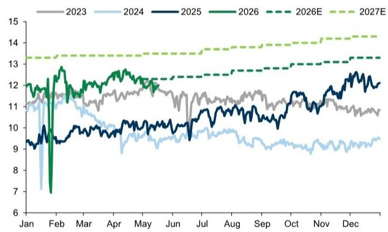
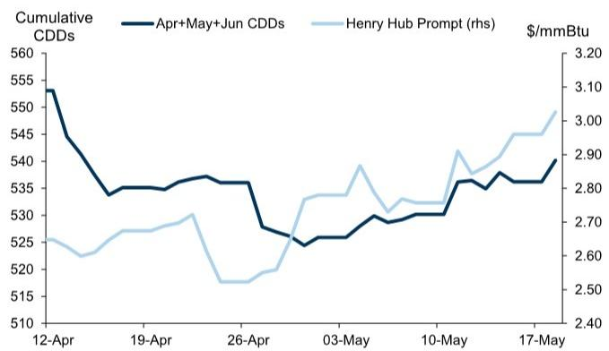

# 市场真正低估的不是需求，而是供给的价格弹性正在重塑天然气定价

Henry Hub 重新站上 3 美元/百万英热单位，这是三月底以来的第一次。天气预期当然是第一推动力，欧洲天然气价格的联动效应也提供了短期支撑。但这些都不是这份研报最值得关注的信息。真正值得产业决策者和投资者反复推敲的，是一个更根本的变化：美国天然气供给端正在展现出过去几年被市场严重低估的价格敏感性。Haynesville 产区产量增长明显放缓，而这一变化恰好发生在价格低于去年同期的背景下。这意味着，天然气市场的供给曲线可能比共识假设要陡峭得多。如果这一信号被证实是结构性趋势，那么当前市场对 2027 年价格压力的担忧，可能需要重新校准。

## 1. 价格信号的有效性正在回归，但市场尚未充分定价供给端的反应机制

过去一年，许多市场参与者倾向于认为，Haynesville 产区的产量增长对价格几乎不敏感。无论 Henry Hub 处于什么价位，充足的库存井和持续的基础设施建设都能保证产量稳定增长。然而，2026 年上半年的数据提供了不同的叙事。

报告明确对比了两个时间窗口：2025 年 1-5 月，Henry Hub 均价约为 3.70 美元/百万英热单位，Haynesville 产量从 2024 年 12 月到 2025 年 5 月增长了约 8 亿立方英尺/日。而 2026 年同期，Henry Hub 均价降至约 3.19 美元/百万英热单位，Haynesville 产量反而从 2025 年 12 月下降了约 2 亿立方英尺/日。即便只观察 4 月这个年内产量高点，同比增幅也从 7 亿立方英尺/日骤降至 2 亿立方英尺/日。

这里需要强调一个关键点：市场此前普遍认为，经过 2025 年的大幅增产，Haynesville 的库存井已经显著下降。但报告揭示的另一层含义是，库存井的减少只是表象，更深层的变化是生产商对价格信号的响应机制已经重启。这不是一个简单的“价格高了就增产”的线性关系，而是一个涉及库存井管理、资本纪律和远期价格预期的综合决策过程。当价格低于某个阈值时，生产商不再愿意动用有限的井位储备，即使短期价格反弹也不会立即改变这一行为。

这意味着，市场对供给弹性的假设可能过于乐观。如果价格敏感性持续存在，那么任何需求端的意外增长，都可能面临比预期更紧的供给约束。

## 2. 夏季价格区间的意义有限，真正值得观察的是产量对价格的“门槛反应”

报告提出一个非常务实的框架：对于 2026 年夏季而言，市场并不存在一个单一的价格均衡点，而是一个价格区间。当前 3.17 美元的夏季远期价格既不意味着市场紧张，也不意味着市场过剩。在这样一个相对平衡的区间内，从价格本身提取的信息量是有限的。

但报告同时指出，我们可以从另一个维度获得有价值的信息：观察 Haynesville 产量对价格变化的反应模式。这实际上是在构建一个“价格-产量反应函数”。如果产量在 3 美元附近表现出明显的停滞甚至下降，那么 3 美元就可能成为一个“软底部”。反之，如果产量在 3 美元以上仍然无法恢复增长，那么市场的供给紧张程度可能比表面数据显示的更严重。

这里有一个尚未被充分讨论的隐含逻辑：生产商的价格门槛不是静态的。随着库存井消耗、服务成本变化和资本约束的演变，这个门槛可能会上移。2025 年的 3.7 美元能够刺激增产，并不意味着 2026 年的 3.2 美元也能做到。如果门槛持续上移，那么 Henry Hub 的中枢价格可能需要向上重估，以激励足够的供给来满足需求。

## 3. 报告尚未完全回答的关键问题：库存井的消耗速度与产量恢复的时滞

报告坦率地承认，目前并不担心今年冬季的供给紧张，即使 Haynesville 产量在夏季剩余时间保持不变。理由有二：第一，2026 年一季度的钻机数量显著增加，这意味着新的井位可以在四季度之前投产。第二，Permian 盆地的伴生气产量预计将在今年下半年随着 45 亿立方英尺/日的新增管道容量而大幅上升。

这些理由在逻辑上是成立的，但报告没有展开讨论两个关键的不确定性。其一，新增钻机转化为实际产量的时滞有多长？如果服务链出现瓶颈，或者新井的初始产量低于预期，那么冬季的供给增量可能不及模型假设。其二，Permian 伴生气产量的增长高度依赖于原油价格和原油生产的稳定性。如果油价出现波动，或者管道建设出现延迟，这一增量可能无法如期兑现。

更重要的是，报告没有深入讨论库存井的精确消耗速度。虽然 Haynesville 的库存井在 2025 年的大幅增产中显著下降，但具体下降到什么水平、剩余井位的质量和成本分布如何，这些细节直接决定了生产商在 2027 年及以后的价格响应能力。如果优质库存井已经基本消耗完毕，那么即使价格回升到 4 美元以上，产量恢复的速度和幅度也可能远低于历史经验。

## 4. 2027 年的真正风险不是供给过剩，而是 Permian 伴生气与 Haynesville 之间的博弈可能改变市场结构

报告的核心判断之一是，2027 年的市场可能比 2026 年更接近“拥挤”状态。原因在于 Permian 伴生气产量预计将从当前水平增加 34 亿立方英尺/日，达到 278 亿立方英尺/日。这一增量足以对市场产生结构性影响。

但这里有一个值得深入思考的博弈：如果 Haynesville 的产量增长持续受到价格约束，而 Permian 的伴生气产量又高度依赖于原油生产的节奏，那么 2027 年的市场可能呈现出一种“双轨”结构。一方面，Permian 的伴生气作为原油生产的副产品，其供给曲线对天然气价格几乎完全无弹性。无论 Henry Hub 处于什么价位，只要原油生产有利可图，伴生气就会持续流入市场。另一方面，Haynesville 的干气生产则对价格高度敏感，可以在价格低迷时主动减产。

这种结构意味着，2027 年的天然气价格下限可能主要由 Haynesville 的边际成本决定，而价格上限则取决于 Permian 伴生气无法被灵活调节的刚性供给。如果需求增长低于预期，过剩的 Permian 伴生气可能将价格压低至 Haynesville 的盈亏平衡点以下，迫使干气生产商进一步减产，从而形成一个新的、更低的价格均衡。报告虽然提到了这一风险，但没有量化这一均衡可能落在什么位置。这正是完整报告需要进一步探讨的核心问题。

## 5. 观察框架：如何从产量数据中提前识别市场拐点

对于产业决策者和投资者而言，与其预测 Henry Hub 的具体价格，不如建立一个基于供给端信号的观察框架。这份报告提供了几个关键的观察维度。

第一，Haynesville 的月度产量变化率。如果产量在 3 美元以上仍然无法恢复正增长，或者增速显著低于历史季节性规律，那么市场可能正在进入一个供给偏紧的阶段。第二，Permian 伴生气产量的实际增速与管道建设进度的匹配程度。如果管道容量如期投产，但伴生气产量增速超过预期，那么 2027 年的供给过剩风险将显著上升。第三，Haynesville 钻机数量的变化。钻机数量是产量的领先指标，但需要注意从钻机增加到产量释放通常有 4-6 个月的时滞。如果钻机数量在夏季持续增加，那么冬季的供给压力将得到缓解。

报告还提供了一个尚未被充分讨论的视角：Haynesville 产量的季节性维护。报告指出，维护活动具有季节性，因此对同比数据的比较需要谨慎。但这也意味着，如果维护季结束后产量恢复速度低于预期，那么维护可能只是掩盖了更深层的供给问题。投资者需要区分“暂时性减产”和“结构性减产”。

这些观察维度本身并不复杂，但关键在于持续跟踪和交叉验证。任何单一数据点的波动都不足以改变判断，但多个信号同时指向同一方向时，市场拐点可能已经临近。

这份报告的核心价值不在于给出了一个具体的价格预测，而在于揭示了市场定价中的一个重要盲区：供给端的价格敏感性正在回归，而市场仍然在用过去几年的线性思维来评估未来的供给曲线。对于关注天然气市场的读者而言，真正需要追问的不是 Henry Hub 会涨到多少，而是生产商的价格门槛到底在哪里，以及这个门槛是否在持续上移。这些问题的答案，将直接决定 2027 年及以后的市场格局。欢迎来星球微信群里继续讨论这些尚未完全回答的关键问题，以及完整报告中关于价格路径的更多细节。

Personal reading notes and learning share only. Not investment advice.

