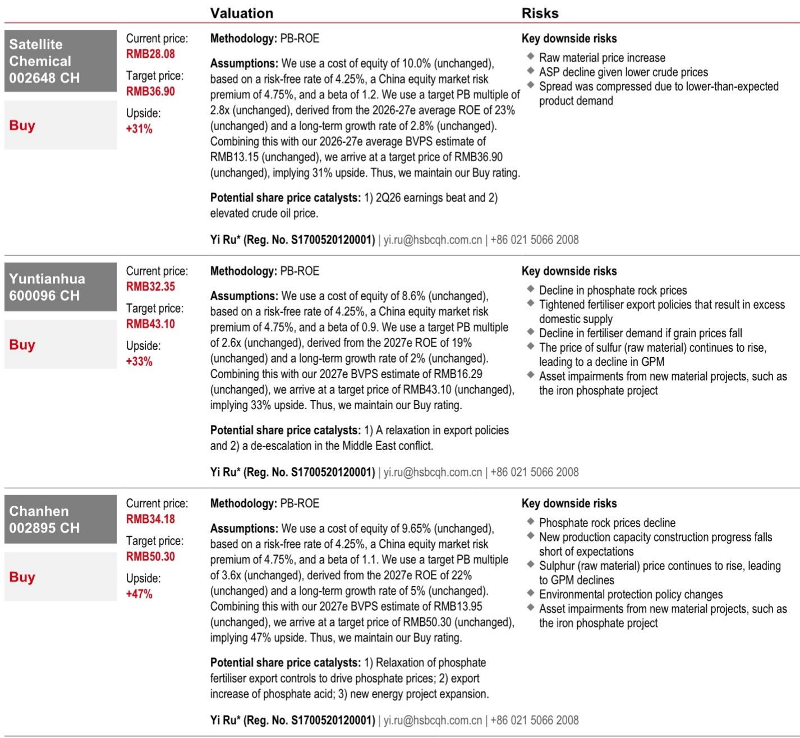
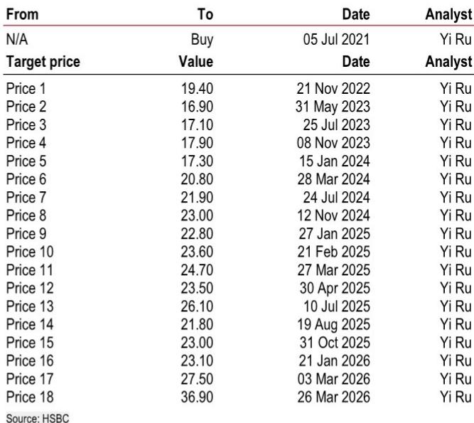
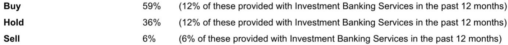

# China Chemicals: The Market Is Correct to Wait, But May Miss the Structural Opportunity Hidden Inside the Cycle

The Chinese chemicals sector is caught in a paradox that the market has not yet resolved. Investors are underweight, valuations are compressed, and the consensus view holds that first-half 2026 earnings represent a cyclical peak, not a sustainable improvement. This caution is rational, but it may also be incomplete. The same conditions that make the sector look unattractive today are creating the conditions for a selective, structural re-rating that the market is not pricing. The controlling question is not whether the sector as a whole is cheap, but which companies can sustain profitability when the cycle normalizes. The answer will separate the commodity trades from the compounders.

The feedback from 35 institutional investors across Hong Kong, Beijing, and Shanghai in late April reveals a market that is highly attentive but deeply hesitant. Positioning is light. The Middle East conflict has introduced a volatility that makes midstream chemical stocks difficult to trade. Investors see Q1 2026 earnings beats as inventory-driven, not operationally sustainable, and they worry that H2 2026 normalization will reveal current valuations as fair rather than cheap. Meanwhile, demand signals are weakening. Chemical product prices have declined since May despite elevated crude, a divergence that typically signals downstream demand destruction. Against this backdrop, even structurally advantaged names—gas-based cracker leaders and fertilizer producers—face investor skepticism about margin sustainability and share price vulnerability to any decline in input costs.

This article argues that the market's caution is justified on the macro timeline but is obscuring a more important micro opportunity. The sector is not a monolith. The divergence between commodity chemical producers and companies with feedstock cost advantages, resilient end-market demand, or policy catalysts is widening, not narrowing. Investors who wait for full geopolitical clarity may forfeit the entry point that the current uncertainty has created. The strategic task is to distinguish between cyclical noise and structural earnings power.

## The Market's Bearish Thesis Is Internally Consistent, But Only for Commodity Exposed Names

The investor consensus that H1 2026 represents an earnings peak is not wrong for the broad chemicals index, but it is dangerously indiscriminate. The logic is straightforward: Q1 earnings beats were largely driven by inventory gains from rising crude and downstream product prices since March. If the Middle East conflict de-escalates in the second half of 2026, crude prices will normalize, inventory gains will reverse, and earnings will compress. Under that scenario, current valuations—which look modest on trailing numbers—become fair or even stretched.

This thesis holds for companies whose earnings are primarily a function of product price cycles and crude oil pass-through. For these names, the margin structure is thin, and any decline in input costs without corresponding demand strength will squeeze profitability. The market is right to avoid them. But the thesis breaks down for companies where earnings are driven by structural cost advantages or demand that is inelastic to the macro cycle.

Consider the gas-based cracker model. These producers benefit from a feedstock cost advantage that is independent of crude oil price direction. Even if crude declines, their margin relative to naphtha-based competitors widens. The risk that the market has identified—that a crude decline could trigger share price corrections in these names—is a trading risk, not a fundamental one. The share price may correct, but the earnings power does not. The market is conflating price volatility with business model fragility.

The same logic applies to fertilizer producers. Fertilizer demand is tied to agricultural cycles and planting seasons, not to industrial production or property investment. The concern that high sulphur costs are compressing margins is real and near-term, but it is a cost-side squeeze, not a demand destruction story. If the agricultural cycle begins to recover in the second half of 2026, as some investors anticipate, fertilizer demand and pricing could improve independently of the broader chemicals macro. The market is treating fertilizer as a cyclical chemical when its demand drivers are fundamentally different.

## The Divergence Between Feedstock-Advantaged and Commodity Chemical Producers Will Widen, Not Narrow

The most important structural insight from the investor feedback is that the market is already making a distinction between gas-based and oil-based producers, but it is not fully pricing the implications. Investors agree that gas-based chemical producers with feedstock cost advantages warrant some allocation. Yet they also worry that any decline in crude could pull these stocks down. This contradiction reveals that the market has not yet decided whether to value these companies on their earnings power or on their correlation to crude.

The correct framework is to value them on earnings power. A gas cracker leader like Satellite Chemical, with a target price implying 31% upside on a PB-ROE methodology using a 23% average ROE for 2026-27, is not a crude proxy. Its earnings are driven by the spread between gas-based feedstock and product prices, not by the absolute level of crude. If crude declines, the spread may actually improve if product prices hold better than naphtha costs. The downside risk that the market fears—a share price correction from a crude decline—is a short-term sentiment effect, not a reflection of deteriorating fundamentals.

The risk that is not being discussed is the opposite: what happens if crude remains elevated or rises further? In that scenario, the feedstock advantage of gas-based producers becomes even more valuable. Their relative margin advantage widens, and they gain market share from naphtha-based competitors who cannot pass through costs. The market is currently pricing for a normalization that may not occur. If the Middle East conflict persists or escalates, the very conditions that the market fears could become the catalyst for a re-rating of gas-based names.

This asymmetry is the core opportunity. The market is pricing for a benign normalization scenario. If that scenario materializes, the downside for gas-based names is limited because their structural advantage remains intact. If the scenario does not materialize, the upside is significant. The risk-reward is skewed positive, but the market is not positioned for it.

## Fertilizer Demand Is More Resilient Than the Market Assumes, But the Policy Catalyst Is the Missing Variable

The fertilizer sub-sector occupies a unique position in the current environment. Demand is structurally supported by global agricultural cycles, and the medium-term outlook is constructive if the agricultural cycle recovers in the second half of 2026. Yet investor discussions are focused on three near-term concerns: the timing of fertilizer export quota policy relaxation, whether global demand has been suppressed by high prices, and how companies can offset rising sulphur costs.

These concerns are valid, but they are also resolvable. The policy question is the most important. China's fertilizer export quotas have been a binding constraint on domestic producers, limiting their ability to capture global pricing. If the government relaxes these quotas, the earnings impact for companies like Yuntianhua and Chanhen could be substantial. The market is waiting for policy clarity before committing capital, which is rational but also means that any positive policy surprise will catch positioning light.

The demand question is more nuanced. The concern that high fertilizer prices have suppressed global demand is real, but it is also cyclical. Farmers cannot defer fertilizer application indefinitely. If demand has been suppressed in the current planting season, it will likely be deferred to the next season, not destroyed. The risk is a timing mismatch, not a structural demand loss. Companies with strong balance sheets and low-cost production can absorb the near-term margin pressure and benefit when demand normalizes.

The sulphur cost issue is the most immediate headwind. Rising sulphur prices are compressing gross profit margins for phosphate fertilizer producers. This is a real near-term earnings risk, and the market is right to flag it. But it is also a transient input cost shock, not a permanent change in the competitive landscape. Companies with long-term supply contracts or the ability to pass through costs will manage this better than the market expects. The key question is which companies have the pricing power and cost flexibility to weather the squeeze.

## What the Report Does Not Fully Answer: The Timing of the Inflection and the Role of Policy

The report provides a clear snapshot of investor sentiment and a well-reasoned valuation framework for the covered names. But it leaves several critical questions unresolved, and these gaps are where the most important analytical work remains.

First, the report does not provide a clear framework for timing the inflection. When does the market's caution turn into conviction? Is it a function of geopolitical de-escalation, or can it be driven by company-specific catalysts such as earnings beats or policy changes? The report notes that investors are waiting for geopolitical uncertainty to ease before repositioning, but it does not specify what would constitute sufficient clarity. This ambiguity is not a flaw in the report; it reflects the genuine uncertainty in the market. But it means that investors need to develop their own triggers for entry.

Second, the role of policy is under-specified. The fertilizer export quota issue is mentioned as a key discussion topic, but the report does not model the earnings impact of a policy change or provide probabilities for different scenarios. Similarly, the potential for government stimulus to support industrial demand is not addressed. In a sector where policy can be the dominant driver of earnings, this is a meaningful gap. Investors who want to position ahead of policy catalysts need to develop their own scenario analysis.

Third, the report does not address the question of capital allocation. If the sector is structurally unattractive for commodity-exposed names, what should companies do with their cash? Should they invest in capacity expansion, return capital to shareholders, or diversify into higher-margin specialty chemicals? The report's valuation framework assumes current business models remain unchanged, but the most important strategic decisions for these companies may be about what they become, not what they are today.

## A Decision Framework for Investors: Three Questions to Separate the Structural from the Cyclical

For investors trying to navigate this complex environment, a structured decision framework is more useful than a list of buy and sell recommendations. The goal is not to predict the macro outcome, but to position for the scenarios that offer the most attractive risk-reward.

**Question 1: Is the company's earnings power dependent on the absolute level of crude oil prices, or on a relative cost advantage?** If the answer is the former, the stock is a cyclical trade and should be sized accordingly. If the answer is the latter, the stock has structural earnings power that is independent of the crude cycle. Gas-based cracker leaders fall into this category. Their target valuations, based on ROE and book value, are supported by structural cost advantages that do not disappear when crude normalizes.

**Question 2: Is the company's end-market demand driven by industrial and property cycles, or by inelastic demand such as agriculture?** Companies exposed to industrial and property demand face a double risk: cyclical weakness in China and potential global recession. Companies exposed to agricultural demand face a different risk profile: input cost pressure and policy uncertainty, but not demand destruction. The risk-reward for agricultural-exposed names is more attractive because the demand base is more resilient and the policy catalyst is a potential upside trigger.

**Question 3: Does the current valuation reflect a pessimistic scenario, or is it fair value under a normalization scenario?** For commodity-exposed names, current valuations may indeed be fair under a normalization scenario. For structurally advantaged names, current valuations may be pricing in a pessimistic scenario that does not materialize. The PB-ROE methodology used in the report provides a useful anchor: if the implied ROE under current valuations is below the company's sustainable ROE, the stock is cheap. If it is above, the stock is expensive.

These three questions do not eliminate uncertainty, but they help investors focus on the variables that matter. The market is currently pricing all chemical stocks as if they are cyclical commodity plays. The opportunity is to identify the names that are not.

## Join the Community to Read the Full Report and Review the Original Charts

The analysis above is based on a detailed investor feedback report that covers 35 institutional meetings across Hong Kong, Beijing, and Shanghai. The full report includes the complete valuation tables, target price methodologies, and risk assessments for the covered names, as well as the original charts that show the divergence between crude prices and chemical product prices since May. These charts are critical for understanding the demand weakness that the market is pricing, and they are not reproducible in this article.

Join the community to read the full report and review the original charts. The unresolved questions identified in this article—the timing of the inflection, the role of policy, and the capital allocation decisions of covered companies—are explored in greater depth in the full report, along with the specific catalysts that could trigger a re-rating for each covered name. The community also provides access to ongoing updates as the macro and policy environment evolves.

*This article is for learning and discussion only and does not constitute investment advice.*

Personal reading notes and learning share only. Not investment advice.

