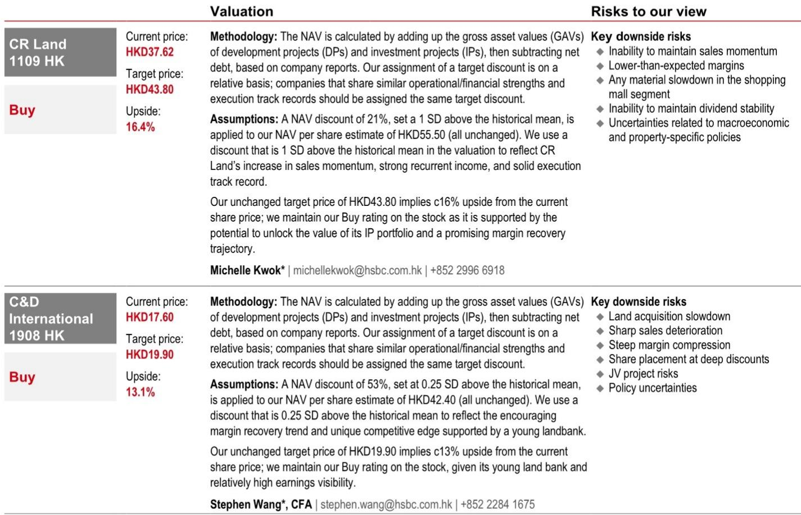
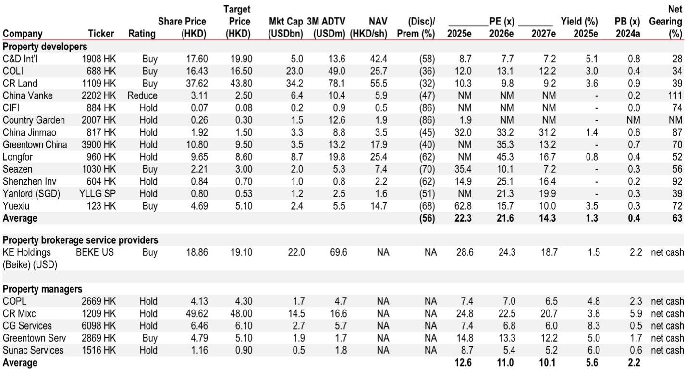
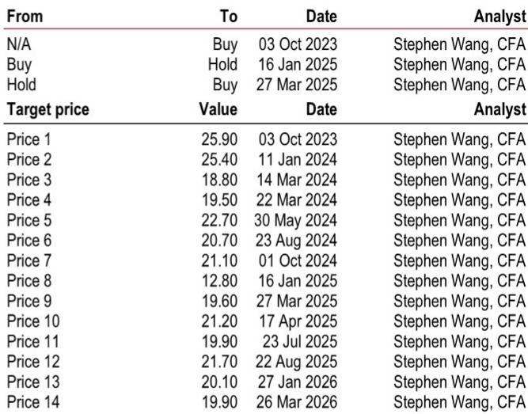

# 中国房地产的真正拐点不在销售端，而在供给端

过去两年，投资者对中国房地产市场的讨论始终围绕一个核心问题：这轮反弹是情绪驱动，还是基本面改善？多数人倾向于前者。2026年以来的市场表现似乎也支持这一判断——股价波动剧烈，成交数据时好时坏，库存去化周期并未显著缩短。

但某外资投行最新发布的一份研报提出了一个值得认真对待的相反观点：市场真正低估的不是需求何时回暖，而是供给端正在发生的结构性收缩。这份报告的核心判断是，中国房地产的“广义库存”在2023至2025年间下降了约19%，从37.22亿平方米降至30.2亿平方米。这不是一个温和的去化，而是一个数量级的跃迁。

更关键的是，这个趋势仍在加速。如果投资者仍然用传统的“库存去化月数”来衡量市场健康度，可能会错过一个正在形成的供需再平衡。报告认为，供给侧的收紧正在为更可持续的复苏奠定基础——不仅仅是情绪修复，而是基本面层面的改善。

这个判断如果成立，意味着过去几年主导房地产投资逻辑的“供过于求”叙事正在被改写。我们需要问的是：库存下降的驱动力是什么？哪些城市的信号最明确？对不同类型的开发商意味着什么？以及，这个趋势的可持续性如何？

---

## 1. 广义库存的下降并非来自销售加速，而是来自新开工的持续萎缩

理解当前库存变化的关键，在于区分“狭义库存”和“广义库存”。狭义库存通常指已竣工但未售出的房屋，这是市场最常跟踪的指标。广义库存则包括未开发土地、在建但未取得预售证的项目、以及已竣工未售房源。

报告估算，广义库存从2023年的37.22亿平方米降至2025年的30.2亿平方米，降幅约19%。但驱动因素并非销售端爆发，而是新开工面积的持续萎缩。2025年，全国新开工面积已降至约4.5亿平方米，而同期销售面积约为16.5亿平方米。这意味着每年有超过12亿平方米的“在建但未售”库存被消耗。

这个数字意味着什么？从2023年底到2025年底，累计开工但未销售的建筑面积从约25亿平方米降至约19亿平方米。换言之，过去两年，市场消耗了大约6亿平方米的“在建库存”。这并非需求端的奇迹，而是供给端主动收缩的结果——开发商不再大规模新开工，而销售端尽管疲弱，仍然在持续消耗存量。

对于投资者而言，这意味着一个重要的观察框架迁移：过去我们习惯用销售增速来预判市场走向，但未来，新开工和在建库存的变化可能更具前瞻意义。当供给端的收缩幅度开始超过需求端的下滑幅度，价格底部的形成条件就在积累。

---

## 2. 19个城市库存降幅超过10%，深圳等一线城市已出现“优质供给溢价”

报告列举了一个值得关注的数据：过去12个月，19个城市的库存降幅超过10%，其中包括深圳、郑州、南昌、宁波等。深圳的库存同比下降约17%，郑州下降约22%，南昌下降约19%。

这些城市并非都是市场热点——嘉兴、常熟、舟山等三四线城市同样出现在名单中。这说明库存下降是一个相对广泛的现象，而非仅限于少数头部城市。但一线城市和强二线城市的情况更值得关注，因为它们的库存下降往往伴随着“优质供给”的结构性改善。

报告特别提到，深圳库存的快速下降已经改善了高端项目的去化率。这是供给端收缩带来的第一个可见结果：当整体库存下降，开发商有动力优先推出区位更好、品质更高的项目。而购房者在选择范围收窄的情况下，也更愿意为优质供给支付溢价。

这个趋势如果持续，意味着市场将出现明显的“分化加速”。头部城市的优质项目可能率先实现价格稳定甚至回升，而低能级城市的库存压力虽然也在缓解，但需求端的支撑力相对薄弱。对于投资者而言，关注的重点应该从“全国库存总量”转向“核心城市的优质供给占比”。

---

## 3. 闲置土地回购正在成为加速库存下降的“隐藏变量”

报告中最具前瞻性的部分，是对闲置土地回购政策的分析。2026年一季度，地方政府发行了约480亿元的专项债券用于闲置土地回购，同比增长56%。如果按全年节奏推算，这个数字有望显著扩大。

更具体的测算显示：如果更多城市将回购目标提升至2019-2024年出让土地的10%（目前全国平均约为5.5%），广义库存可能再下降5-10%。重庆是目前力度最大的城市，其回购计划占2019-2024年出让土地面积的约16%。广东、湖北、湖南等省份的回购比例也超过10%。

但报告也坦承，执行进度仍然偏慢。许多省份虽然公布了大规模回购计划，但实际落地的专项债发行规模远低于计划。例如河南计划回购约2000万平方米土地，但截至2026年3月，实际发行的专项债仅为2亿元。这反映出政策执行层面仍然存在堵点——定价机制、资金到位速度、地方政府意愿等。

闲置土地回购的意义不仅在于减少库存总量。报告提到一个案例：深圳某地块被回购后重新出让，建筑面积被削减了35%。这意味着，回购不仅仅是“减少供应”，更重要的是“优化供应结构”——低效、过剩的规划指标被压缩，未来的新增供给将更加集约和高效。

这个变量目前尚未被市场充分定价。如果回购执行加速，库存下降的速度可能超出当前预期。反之，如果执行继续滞后，供给端收缩的节奏将放缓。这是投资者需要持续跟踪的关键政策信号。

---

## 4. 库存周转率并未改善，但“二手房流动性”正在扮演新角色

报告指出一个看似矛盾的观察：尽管广义库存下降，但库存周转率（即狭义库存去化月数）并未改善，反而有所恶化。这主要归因于二手房市场的分流效应。

价格敏感的购房者正在大量转向二手房市场，而新房市场的推盘越来越偏向改善型需求。这种结构性错位导致新房销售节奏放缓，库存去化月数被动拉长。但报告认为，这并非纯粹的负面信号。二手房市场的流动性增强，实际上为购房者提供了更清晰的“退出路径”，有助于稳定价格预期。

这个分析框架值得重视。过去，中国房地产市场的核心矛盾是“流动性不足”——购房者担心买了之后卖不掉，从而抑制入市意愿。现在，随着二手房市场交易量回升，这个担忧正在缓解。购房者可以更理性地评估“买新还是买旧”，而开发商则需要重新思考产品定位。

对于开发商而言，这意味着“产品力”的重要性进一步上升。在二手房供给充裕的市场中，新房必须提供明确的差异化价值——更好的地段、更高的品质、更优的户型。否则，购房者没有理由支付新房溢价。这也解释了为什么报告更看好拥有“优质产品线”的开发商。

---

## 5. 报告尚未完全回答的关键问题：库存下降的可持续性与价格传导机制

尽管报告的论证逻辑清晰，但有几个关键问题仍然悬而未决。

第一，库存下降的可持续性。当前库存下降的主要驱动力是新开工萎缩，而非销售增长。如果未来销售端出现明显复苏，开发商是否会重新加速新开工？如果会，那么当前“供不应求”的叙事可能只是暂时的。报告对此没有给出明确判断，只是指出“预计2026年将出现拐点，核心城市价格将趋稳”。这个拐点是否成立，取决于需求端的恢复力度。

第二，库存下降向房价的传导机制。理论上，供给收缩应该带来价格支撑。但现实中，中国房地产市场的价格决定因素非常复杂——政策干预、开发商资金压力、购房者预期、二手房挂牌量等都会影响价格。报告提到深圳高端项目的去化改善，但这能否推广到更广泛的市场，仍需验证。

第三，闲置土地回购的实际执行节奏。报告给出的5-10%的潜在库存降幅是基于“如果更多城市将回购目标提升至10%”的假设。但这个假设能否实现，取决于地方政府的财政状况、专项债审批效率、以及土地定价的博弈。目前来看，执行进度远低于预期，这是最大的不确定因素。

这些问题并非报告的缺陷，而是市场本身的不确定性。对于投资者而言，理解这些不确定性，比盲目相信任何单一判断更重要。

---

## 6. 一个可操作的观察框架：从“总量思维”转向“结构思维”

基于报告的框架，投资者可以建立一个新的观察维度。

第一，关注“新开工-销售”剪刀差。只要新开工面积持续低于销售面积，广义库存就在收缩。这个剪刀差的收窄或扩大，比单纯的销售数据更有前瞻意义。

第二，关注核心城市的“优质供给占比”。不是所有库存下降都同等重要。深圳、上海等城市的库存下降，伴随着产品结构的优化，而低能级城市的库存下降可能只是“被动去化”。区分这两者，才能判断价格修复的可持续性。

第三，跟踪闲置土地回购的实际执行。这不是一个政策口号，而是一个可量化的指标——专项债发行规模、回购面积、容积率调整幅度。这三个数字的变化，直接决定了未来两年的供给曲线。

第四，关注开发商的“产品力”而非“规模”。在供给收缩的市场中，能够推出高品质项目的开发商将获得定价权。报告提到的CRL和C&D，其共同特点是拥有较强的产品溢价能力。相反，那些依赖规模扩张、产品同质化的开发商，即使在库存下降的市场中，也可能面临去化压力。

---

市场正在从一个“总量过剩”的时代，进入一个“结构性再平衡”的时代。这个再平衡的过程不会一帆风顺，但它为有准备的投资者提供了新的机会窗口。报告的完整版本包含了更详细的城市数据、开发商估值对比、以及政策执行的时间线推演。这些内容无法在一篇文章中完全展开，但它们对于理解这一轮变化的深度和广度至关重要。

欢迎来星球微信群里继续讨论——我们会围绕这些未解问题，持续跟踪数据变化，并在关键节点进行讨论和更新。如果你对闲置土地回购的执行节奏、核心城市库存变化的月度跟踪、或者开发商的估值重估逻辑感兴趣，这里会有更深入的交流。

Personal reading notes and learning share only. Not investment advice.

