# China EV Tracker

# Exports offset soft domestic demand

- Domestic demand remains soft; new model cycle could support recovery into 2H   
- Exports remain the key growth and profitability anchor for China OEMs   
- Prefer technology leaders with strong product cycles and overseas exposure

# Domestic demand remains under pressure; full-year demand revised lower.

April China EV retail sales reached 848k units, flat m-o-m, but down 6% y-o-y, while total passenger car demand fell 21% y-o-y. The backdrop reflects fading policy support, residual effects from pulled-forward demand, and continued weakness in ICE demand amid elevated oil prices. The soft tone has continued into early May. Domestic passenger car sales for 1–10 May were again down 21% y-o-y, and elevated channel inventories point to ongoing destocking pressure across the industry. Meanwhile, lithium prices have risen to around RMB200k. BYD announced price increases effective in May to offset raw material cost inflation since the start of the year, with several other OEMs following. We see these price hikes as an additional near-term headwind to demand. Against the backdrop, we lower our 2026 domestic demand forecast (see page 9).

New model cycles and technology upgrades to gradually improve industry sentiment in 2H26. As subsidies taper, competitive intensity is shifting from last year's entry-level EV segment to this year's premium market. Recent launches continue to demonstrate strong consumer engagement, particularly for large-size SUVs integrating advanced ADAS, electrification and smart cockpit features at increasingly competitive prices. BYD's Da Tang secured c100k orders within two weeks of pre-sale, and further launches are expected in May, including the Li Auto L9 Livis, ONVO L80, XPeng GX and NIO ES9. We believe competition is gradually evolving from pure pricing toward technology integration and user experience.

Export momentum continues to support OEM profitability. China passenger car exports reached 2.7m units in 4M26, up $69\%$ y-o-y, led by Chery, BYD and Geely. Growth was primarily EV-driven, with the EV mix rising to $49\%$ from $38\%$ in 4M25. This strength reflects both competitive products and macro tailwinds including higher oil prices that enhance EV total cost of ownership. With domestic demand still subdued, exports remain an important support for utilisation, earnings resilience and mix improvement.

Stock highlights. We continue to favour technology leaders with clearer earnings visibility. BYD: Technology upgrade and strong new model cycle should drive a volume recovery. We remain positive on its longer-term ecosystem value and its growth potential in overseas market expansion. Geely: Resilient in profitability on better product mix, well positioned for volume opportunity from new models and overseas. XPeng: Improving fundamentals by new launch of GX, optionality from its Robotaxi and robotics narratives may attract growth/tech flows. NIO: Better visibility on its 2026e volume growth and earnings improvement, driven by new models and core portfolio growth (especially ES8). CATL: Remains our preferred core holding, supported by strong earnings visibility, market-share defence and growth from ESS and overseas markets.

# Equities Automobiles & Auto Components

China

# Yuqian Ding\*

Head of China Autos Research

The Hongkong and Shanghai Banking Corporation Limited
yuqian.ding@hsbc.com.hk

+852 2288 5108

# Li Yang\*

Analyst, China Autos

The Hongkong and Shanghai Banking Corporation Limited
li01.yang@hsbc.com.hk

+852 2288 6216

# Elaine Chen\* (Reg. No. S1700524030001)

Analyst, China Autos

HSBC Qianhai Securities Limited

elaine.chen@hsbcqh.com.cn

+86 010 5795 2364

\* Employed by a non-US affiliate of HSBC Securities (USA) Inc, and is not registered/ qualified pursuant to FINRA regulations.

# Disclosures & Disclaimer

This report must be read with the disclosures and the analyst certifications in the Disclosure appendix, and with the Disclaimer, which forms part of it.

Issuer of report: The Hongkong and Shanghai Banking Corporation Limited

View HSBC Global Investment Research at:

https://www.research.hsbc.com

Exhibit 1. Stock valuations 

<table><tr><td rowspan="2">Ticker</td><td rowspan="2">Company</td><td rowspan="2">Rating</td><td rowspan="2">Ccy.</td><td rowspan="2">Market Cap (USDm)</td><td colspan="5">3M</td><td colspan="3">PE</td><td colspan="3">EPS growth</td><td colspan="3">PB</td><td colspan="3">ROE</td></tr><tr><td>ADTV (USDm)</td><td>Close price</td><td>Target price</td><td>Upside</td><td>2026e</td><td>2027e</td><td>2028e</td><td>2026e</td><td>2027e</td><td>2028e</td><td>2026e</td><td>2027e</td><td>2028e</td><td>2026e</td><td>2027e</td><td>2028e</td><td></td></tr><tr><td>002594 CH</td><td>BYD A</td><td>Buy</td><td>CNY</td><td>125,223</td><td>908</td><td>98.73</td><td>126.00</td><td>28%</td><td>22.4</td><td>16.5</td><td>14.2</td><td>23%</td><td>36%</td><td>16%</td><td>3.3</td><td>3.0</td><td>2.7</td><td>16%</td><td>19%</td><td>20%</td><td></td></tr><tr><td>1211 HK</td><td>BYD H</td><td>Buy</td><td>HKD</td><td>125,223</td><td>406</td><td>98.15</td><td>146.00</td><td>49%</td><td>19.3</td><td>14.2</td><td>12.2</td><td>23%</td><td>36%</td><td>16%</td><td>2.9</td><td>2.6</td><td>2.3</td><td>16%</td><td>19%</td><td>20%</td><td></td></tr><tr><td>175 HK</td><td>Geely</td><td>Buy</td><td>HKD</td><td>29,270</td><td>232</td><td>21.26</td><td>32.00</td><td>51%</td><td>8.7</td><td>7.0</td><td>6.6</td><td>30%</td><td>24%</td><td>7%</td><td>1.7</td><td>1.5</td><td>1.3</td><td>22%</td><td>23%</td><td>21%</td><td></td></tr><tr><td>XPEV US</td><td>XPeng</td><td>Buy</td><td>USD</td><td>12,620</td><td>112</td><td>16.12</td><td>27.70</td><td>72%</td><td>51.0</td><td>21.6</td><td>N/A</td><td>240%</td><td>136%</td><td>N/A</td><td>3.2</td><td>2.8</td><td>N/A</td><td>7%</td><td>14%</td><td>N/A</td><td></td></tr><tr><td>NIO US</td><td>NIO</td><td>Buy</td><td>USD</td><td>14,360</td><td>229</td><td>6.25</td><td>6.80</td><td>9%</td><td>N/A</td><td>303.4</td><td>105.0</td><td>93%</td><td>128%</td><td>189%</td><td>8.4</td><td>8.1</td><td>7.6</td><td>-9%</td><td>3%</td><td>7%</td><td></td></tr><tr><td>300750 CH</td><td>CATL</td><td>Buy</td><td>CNY</td><td>296,534</td><td>2,145</td><td>427.00</td><td>547.00</td><td>28%</td><td>19.6</td><td>16.6</td><td>14.6</td><td>37%</td><td>18%</td><td>14%</td><td>4.9</td><td>4.3</td><td>3.8</td><td>27%</td><td>28%</td><td>28%</td><td></td></tr><tr><td>3750 HK</td><td>CATL H</td><td>Buy</td><td>HKD</td><td>296,534</td><td>339</td><td>686.00</td><td>790.00</td><td>15%</td><td>27.3</td><td>23.1</td><td>20.2</td><td>37%</td><td>18%</td><td>14%</td><td>6.9</td><td>6.0</td><td>5.2</td><td>27%</td><td>28%</td><td>28%</td><td></td></tr></table>

Note: Priced as of 14 May 2026.
Source: WIND, HSBC estimates

# Sector highlights

Exhibit 2. China EV market: Top 10 EV makers took $71\%$ market share in 4M26   
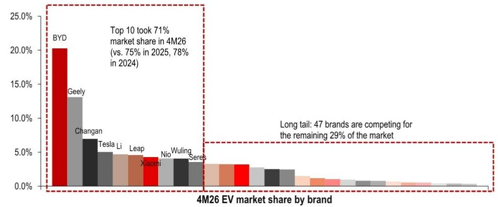

bar

| Brand | Market Share (%) |
| :--- | :--- |
| BYD | 20.5 |
| Geely | 13.0 |
| Changan | 7.0 |
| Tesla Li | 5.0 |
| Leap | 4.8 |
| Xiaomi | 4.5 |
| Nio Wuling | 4.2 |
| Seres | 3.8 |
| Top 10 took 71% market share in 4M26 (vs. 75% in 2025, 78% in 2024) |
| Long tail: 47 brands are competing for the remaining 29% of the market

Source: CPCA, HSBC

Exhibit 3. China ICE car market: Top 10 brands took $73\%$ share in 1Q26   
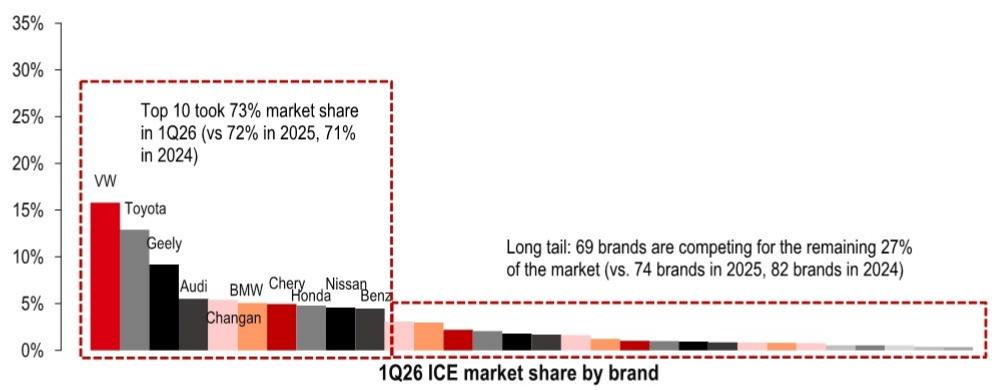

bar

| Brand | 1Q26 ICE Market Share (%) |
| :--- | :--- |
| VW | 15.8 |
| Toyota | 13.0 |
| Geely | 9.0 |
| Audi | 5.5 |
| BMW | 5.0 |
| Chery | 4.5 |
| Honda | 4.5 |
| Nissan | 4.5 |
| Benz | 4.5 |
Top 10 took 73% market share in 1Q26 (vs 72% in 2025, 71% in 2024). Long tail: 69 brands are competing for the remaining 27% of the market (vs. 74 brands in 2025, 82 brands in 2024).

Source: CAAM, HSBC

Exhibit 4. China overall passenger car market: Top 15 brands took $62\%$ share in 1Q26   
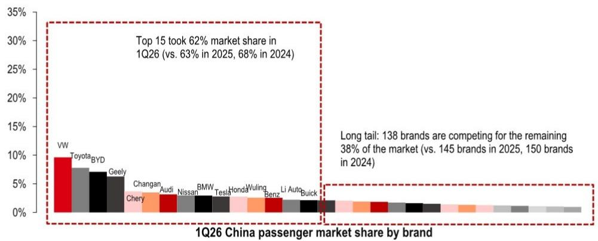

bar

| Brand | Market Share (%) |
| :--- | :--- |
| VW | 9.5 |
| Toyota | 7.8 |
| BYD | 7.0 |
| Geely | 6.5 |
| Changan | 3.0 |
| Audi | 2.8 |
| Nissan | 2.5 |
| BMW | 2.3 |
| Tesla | 2.2 |
| Honda | 2.1 |
| Wuling | 2.0 |
| Benz | 1.8 |
| Li Auto | 1.7 |
| Buick | 1.6 |
Top 15 took 62% market share in 1Q26 (vs. 63% in 2025, 68% in 2024)
Long tail: 138 brands are competing for the remaining 38% of the market (vs. 145 brands in 2025, 150 brands in 2024)

Source: CAAM, HSBC

# Most frequently discussed charts of the month

Exhibit 5. China passenger car export volume booked $69\%$ y-o-y growth in 4M26   
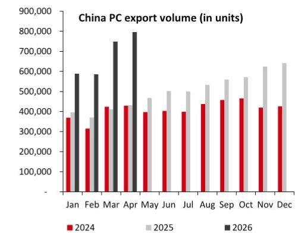

bar

China PC export volume (in units)
| Month | 2024 | 2025 | 2026 |
|---|---|---|---|
| Jan | 375,000 | 395,000 | 585,000 |
| Feb | 315,000 | 365,000 | 585,000 |
| Mar | 425,000 | 415,000 | 745,000 |
| Apr | 430,000 | 435,000 | 795,000 |
| May | 395,000 | 475,000 | - |
| Jun | 405,000 | 505,000 | - |
| Jul | 395,000 | 505,000 | - |
| Aug | 435,000 | 535,000 | - |
| Sep | 455,000 | 565,000 | - |
| Oct | 465,000 | 575,000 | - |
| Nov | 425,000 | 635,000 | - |
| Dec | 425,000 | 645,000 | - |

Source: CPCA, HSBC

Exhibit 6. Chery, BYD and Geely lead China's passenger car export volume in 4M26   
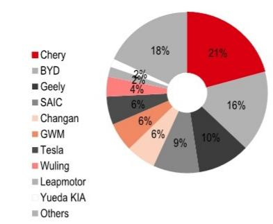

pie

| Company | Share (%) |
| :--- | :--- |
| Chery | 21 |
| BYD | 18 |
| Geely | 6 |
| SAIC | 9 |
| Changan | 6 |
| GWM | 6 |
| Tesla | 6 |
| Wuling | 4 |
| Leapmotor | 2 |
| Yueda KIA | 2 |
| Others | 16 |

Source: CPCA, HSBC

Exhibit 7. EV penetration rate rose to 61% in April 2026   
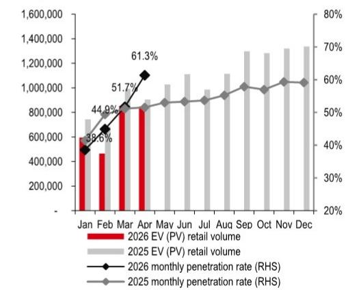

bar_line

| Month | 2026 EV (PV) retail volume | 2025 EV (PV) retail volume | 2026 monthly penetration rate (RHS) (%) | 2025 monthly penetration rate (RHS) (%) |
|---|---|---|---|---|
| Jan | 480,000 | 720,000 | 38.6 | 44.9 |
| Feb | 500,000 | 750,000 | 44.9 | 48.1 |
| Mar | 800,000 | 850,000 | 51.7 | 53.1 |
| Apr | 850,000 | 950,000 | 61.3 | 55.3 |
| May | - | 1,050,000 | - | 56.4 |
| Jun | - | 1,100,000 | - | 56.7 |
| Jul | - | 1,120,000 | - | 57.1 |
| Aug | - | 1,130,000 | - | 57.5 |
| Sep | - | 1,300,000 | - | 58.9 |
| Oct | - | 1,320,000 | - | 59.3 |
| Nov | - | 1,330,000 | - | 60.1 |
| Dec | - | 1,350,000 | - | 60.5 |

Source: CPCA, HSBC

Exhibit 8. Overall auto retail sales decreased 21% y-o-y in April 2026   
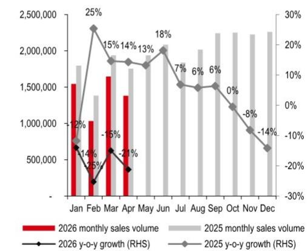

bar_line

| Month | 2026 monthly sales volume | 2025 monthly sales volume | 2026 y-o-y growth (%) | 2025 y-o-y growth (%) |
|---|---|---|---|---|
| Jan | 1,550,000 | 1,800,000 | -12 | -14 |
| Feb | 1,050,000 | 1,350,000 | -25 | 25 |
| Mar | 1,650,000 | 1,950,000 | -15 | 15 |
| Apr | 1,350,000 | 1,750,000 | -21 | 14 |
| May | 1,850,000 | 1,850,000 | 13 | 18 |
| Jun | 2,050,000 | 2,050,000 | 18 | 7 |
| Jul | 1,850,000 | 2,050,000 | 6 | 6 |
| Aug | 1,850,000 | 2,150,000 | 6 | 6 |
| Sep | 1,850,000 | 2,350,000 | 0 | -8 |
| Oct | 2,350,000 | 2,350,000 | -8 | -14 |
| Nov | 2,350,000 | 2,350,000 | -14 | -14 |
The chart includes a bar chart (red) and a line chart (gray). The data is already in English. The labels 'Jan' through 'Dec' appear above the bars. The percentage change indicators are shown above each bar.

Source: CPCA, HSBC

Exhibit 9. Geely is the top share gainer in the China passenger car market in 4M26   
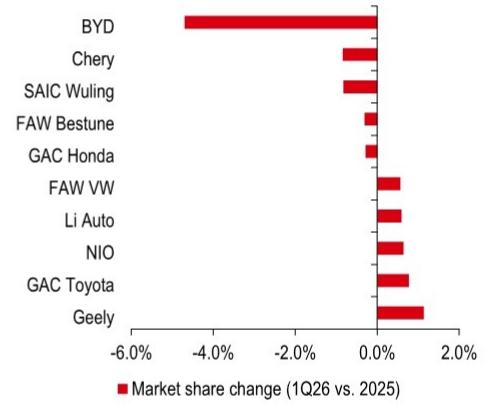

bar

| Company | Market share change (1Q26 vs. 2025) (%) |
| :--- | :--- |
| BYD | -4.8 |
| Chery | -0.7 |
| SAIC Wuling | -0.9 |
| FAW Bestune | -0.3 |
| GAC Honda | -0.2 |
| FAW VW | 0.6 |
| Li Auto | 0.7 |
| NIO | 0.8 |
| GAC Toyota | 1.1 |
| Geely | 1.4 |

Note: This chart shows the top 5 OEMs gaining and losing market shares in 2025 China passenger car market. Source: CPCA, HSBC

Exhibit 10. Passive mix uplift in premium segment due to low-end slump in 1Q26   
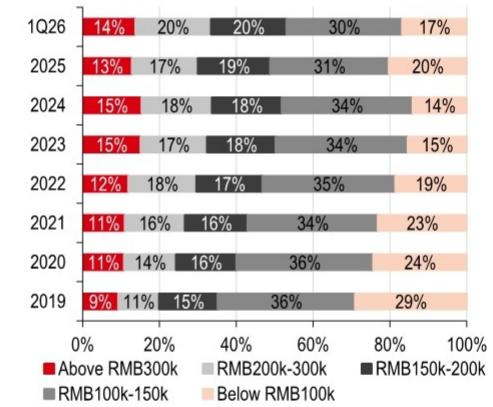

bar_stacked

| Year | Above RMB300k (%) | RMB200k-300k (%) | RMB150k-200k (%) | RMB100k-150k (%) | Below RMB100k (%) |
|---|---|---|---|---|---|
| 1Q26 | 14 | 20 | 20 | 30 | 17 |
| 2025 | 13 | 17 | 19 | 31 | 20 |
| 2024 | 15 | 18 | 18 | 34 | 14 |
| 2023 | 15 | 17 | 18 | 34 | 15 |
| 2022 | 12 | 18 | 17 | 35 | 19 |
| 2021 | 11 | 16 | 16 | 34 | 23 |
| 2020 | 11 | 14 | 16 | 36 | 24 |
| 2019 | 9 | 11 | 15 | 36 | 29 |

Source: CPCA, HSBC

Exhibit 11. China EV sales volume booked -17% y-o-y decline in 4M26   
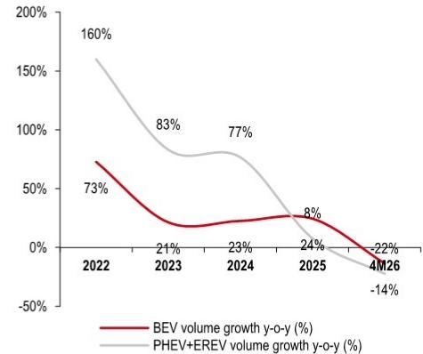

line

| Year | BEV volume growth y-o-y (%) | PHEV+EREV volume growth y-o-y (%) |
|---|---|---|
| 2022 | 73 | 160 |
| 2023 | 21 | 83 |
| 2024 | 23 | 77 |
| 2025 | 8 | 24 |
| 4M26 | -22 | -14 |

Source: CPCA, HSBC

Exhibit 12. In 4M26, BEV mix in China EV sales volume increased to 64%   
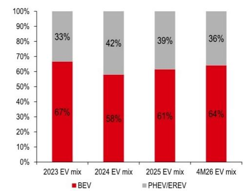

bar_stacked

| Year | BEV (%) | PHEV/EREV (%) |
|---|---|---|
| 2023 EV mix | 67 | 33 |
| 2024 EV mix | 58 | 42 |
| 2025 EV mix | 61 | 39 |
| 4M26 EV mix | 64 | 36 |

Source: CPCA, HSBC

Exhibit 13. China's EV passenger vehicle discount level rises slightly m-o-m to $10.9\%$ in April 2026   
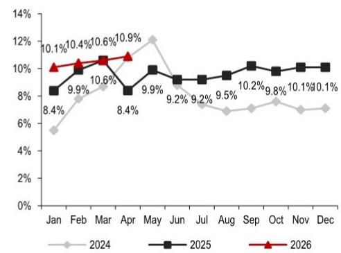

line

| Month | 2024 (%) | 2025 (%) | 2026 (%) |
|---|---|---|---|
| Jan | 5.3 | 8.4 | 10.1 |
| Feb | 7.9 | 9.9 | 10.4 |
| Mar | 8.6 | 10.6 | 10.6 |
| Apr | 10.8 | 8.4 | 10.9 |
| May | 12.1 | 9.9 | - |
| Jun | - | 9.2 | - |
| Jul | 7.1 | 9.2 | - |
| Aug | 6.8 | 9.5 | - |
| Sep | 7.3 | 10.2 | - |
| Oct | 7.8 | 9.8 | - |
| Nov | 7.1 | 10.1 | - |
| Dec | 7.0 | 10.1 | 0.1 |

Source: CPCA, HSBC

Exhibit 14. China's ICE passenger vehicle discount level decreased m-o-m to $22.1\%$ in April 2026   
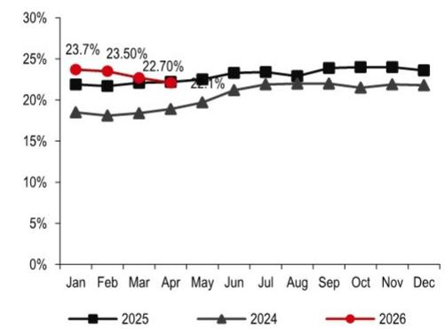

line

| Month | 2025 (%) | 2024 (%) | 2026 (%) |
|---|---|---|---|
| Jan | 22.0 | 18.3 | 23.7 |
| Feb | 21.7 | 18.0 | 23.5 |
| Mar | 21.9 | 18.1 | 22.7 |
| Apr | 22.4 | 18.7 | 22.1 |
| May | 23.0 | 19.5 | - |
| Jun | 23.5 | 20.8 | - |
| Jul | 23.6 | 21.5 | - |
| Aug | 23.0 | 21.8 | - |
| Sep | 24.0 | 21.7 | - |
| Oct | 24.1 | 21.4 | - |
| Nov | 24.1 | 21.6 | - |
| Dec | 24.0 | 21.5 | - |

Source: CPCA, HSBC

Exhibit 15. New model launches expected to peak in 2Q26 and 4Q26   
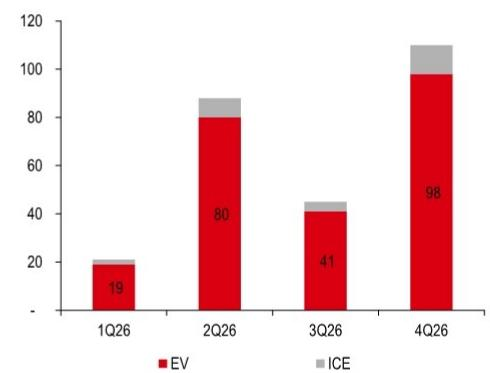

bar_stacked

| Quarter | EV | ICE |
| :--- | :--- | :--- |
| 1Q26 | 19 | 3 |
| 2Q26 | 80 | 7 |
| 3Q26 | 41 | 5 |
| 4Q26 | 98 | 11 |

Source: China Associate of Automobile Manufacturers (CAAM; including estimates), HSBC

Exhibit 16. EVs account for c90% of new models in 2026e   
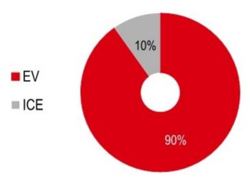

pie

| Category | Percentage (%) |
| :--- | :--- |
| EV | 90 |
| ICE | 10 |

Source: CAAM (including estimates), HSBC

Exhibit 17. Inventory indicator decreased to 1.89 in April 2026   
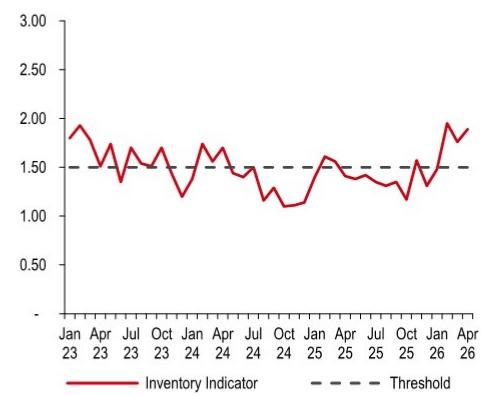

line

| Month   | Inventory Indicator |
|---------|---------------------|
| Jan 23  | 1.90                |
| Apr 23  | 1.70                |
| Jul 23  | 1.50                |
| Oct 23  | 1.60                |
| Jan 24  | 1.40                |
| Apr 24  | 1.70                |
| Jul 24  | 1.50                |
| Oct 24  | 1.30                |
| Jan 25  | 1.60                |
| Apr 25  | 1.50                |
| Jul 25  | 1.40                |
| Oct 25  | 1.30                |
| Jan 26  | 1.50                |
| Apr 26  | 1.90                |

Source: CADA, HSBC

Exhibit 18. Inventory alert index: 62.1% in April 2026 vs 57.5% in March 2026   
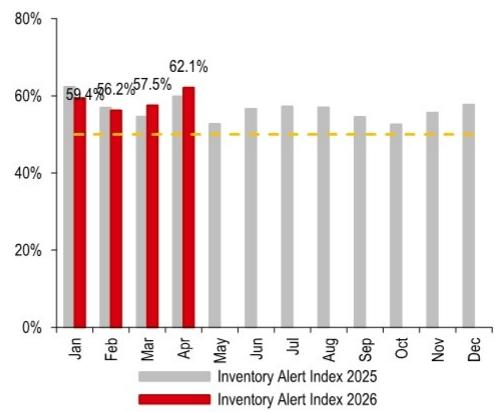

bar

| Month | Inventory Alert Index 2025 (%) | Inventory Alert Index 2026 (%) |
|---|---|---|
| Jan | 59.4 | 59.4 |
| Feb | 56.2 | 56.2 |
| Mar | 57.5 | 57.5 |
| Apr | 62.1 | 62.1 |
| May | 52.3 | - |
| Jun | 57.1 | - |
| Jul | 57.8 | - |
| Aug | 57.3 | - |
| Sep | 54.3 | - |
| Oct | 52.7 | - |
| Nov | 56.0 | - |
| Dec | 58.3 | - |

Source: CADA, HSBC

Exhibit 19. Lithium carbonate price increased $21\%$ in last one month   
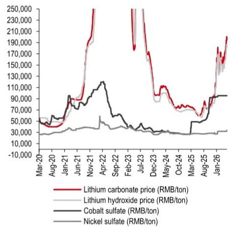

line

| Month    | Lithium carbonate price (RMB/ton) | Lithium hydroxide price (RMB/ton) | Cobalt sulfate (RMB/ton) | Nickel sulfate (RMB/ton) |
|----------|-----------------------------------|----------------------------------|--------------------------|--------------------------|
| Mar-20   | ~30,000                           | ~30,000                          | ~50,000                  | ~30,000                  |
| Aug-20   | ~40,000                           | ~35,000                          | ~55,000                  | ~35,000                  |
| Jan-21   | ~50,000                           | ~40,000                          | ~60,000                  | ~40,000                  |
| Jun-21   | ~70,000                           | ~50,000                          | ~80,000                  | ~45,000                  |
| Nov-21   | ~150,000                          | ~70,000                          | ~110,000                 | ~50,000                  |
| Apr-22   | ~250,000                          | ~90,000                          | ~115,000                 | ~55,000                  |
| Sep-22   | ~25,000                           | ~85,000                          | ~115,000                 | ~60,000                  |
| Feb-23   | ~180,000                          | ~85,000                          | ~115,000                 | ~65,000                  |
| Jul-23   | ~25,000                           | ~85,000                          | ~115,000                 | ~75,000                  |
| Dec-23   | ~175,000                          | ~85,000                          | ~115,000                 | ~85,000                  |
| May-24   | ~115,000                          | ~85,000                          | ~115,000                 | ~95,000                  |
| Oct-24   | ~95,000                           | ~85,000                          | ~115,000                 | ~1,15,00                  |
| Mar-25   | ~75,000                           | ~85,000                          | ~115,000                 | ~1,15,00                  |
| Aug-25   | ~95,000                           | ~85,000                          | ~115,000                 | ~1,15,00                  |
| Jan-26   | ~215,000                          | ~95,000                          | ~115,000                 | ~1,15,00                  |

Source: Wind, HSBC

Exhibit 20. Battery cell pricing has been largely flat in last one month   
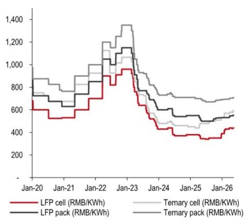

line

| Date | LFP cell (RMB/KWh) | Ternary cell (RMB/KWh) | LFP pack (RMB/KWh) | Ternary pack (RMB/KWh) |
|---|---|---|---|---|
| Jan-20 | 600 | 850 | 750 | 900 |
| Jan-21 | 550 | 800 | 700 | 850 |
| Jan-22 | 900 | 1200 | 1000 | 1300 |
| Jan-23 | 1000 | 1350 | 1150 | 1400 |
| Jan-24 | 450 | 750 | 650 | 800 |
| Jan-25 | 350 | 700 | 550 | 750 |
| Jan-26 | 400 | 650 | 550 | 700 |

Source: Baiinfo, HSBC

Exhibit 21. China's EV battery installations increased $15\%$ y-o-y in April 2026   
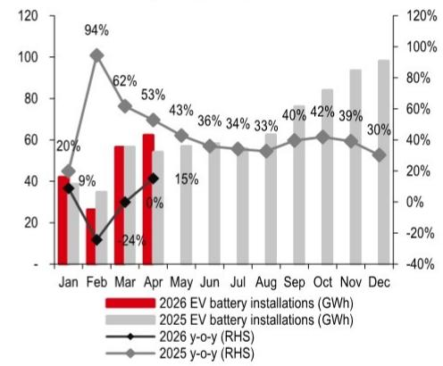

bar_line

| Month | 2026 EV battery installations (GWh) | 2025 EV battery installations (GWh) | 2026 y-o-y (%) | 2025 y-o-y (%) |
|---|---|---|---|---|
| Jan | 42 | 38 | 20 | 9 |
| Feb | 27 | 35 | -18 | -24 |
| Mar | 57 | 56 | 10 | 10 |
| Apr | 63 | 54 | 15 | 15 |
| May | - | 58 | 15 | 36 |
| Jun | - | 57 | 34 | 34 |
| Jul | - | 57 | 33 | 33 |
| Aug | - | 60 | 40 | 40 |
| Sep | - | 65 | 42 | 42 |
| Oct | - | 85 | 39 | 39 |
| Nov | - | 94 | 30 | 30 |
| Dec | - | 99 | - | - |

Source: CABIA, HSBC

Exhibit 22. LFP's share of China's EV battery market was $80\%$ in 4M26   
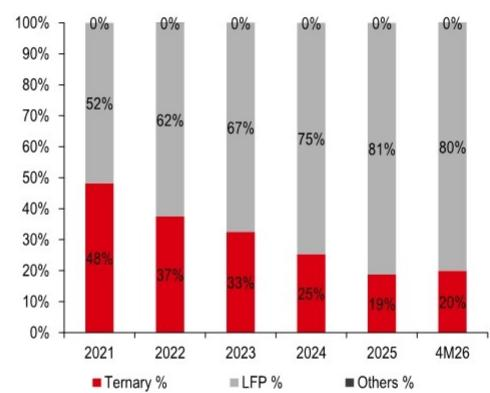

bar_stacked

| Year | Ternary (%) | LFP (%) | Others (%) |
|---|---|---|---|
| 2021 | 48 | 52 | 0 |
| 2022 | 37 | 62 | 0 |
| 2023 | 33 | 67 | 0 |
| 2024 | 25 | 75 | 0 |
| 2025 | 19 | 81 | 0 |
| 4M26 | 20 | 80 | 0 |

Source: CABIA, HSBC

Exhibit 23. CATL: $47\%$ share of China's EV battery market in 4M26   
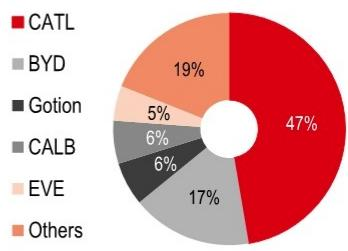

pie

| Category | Percentage (%) |
| :--- | :--- |
| CATL | 47 |
| BYD | 17 |
| Gotion | 6 |
| CALB | 6 |
| EVE | 5 |
| Others | 19 |

Source: CABIA, HSBC

Exhibit 24. CATL: $40\%$ share of China's LFP EV battery market in 4M26   
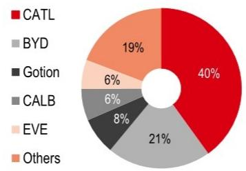

pie

| Category | Percentage (%) |
| :--- | :--- |
| CATL | 40 |
| BYD | 21 |
| Gotion | 8 |
| CALB | 6 |
| EVE | 6 |
| Others | 19 |

Source: CABIA, HSBC

# Where we are in terms of valuation

Exhibit 25. NIO, XPeng, and Li Auto trade at 0.6x, 0.9x, and 0.9x 12-month forward P/S multiples, respectively   
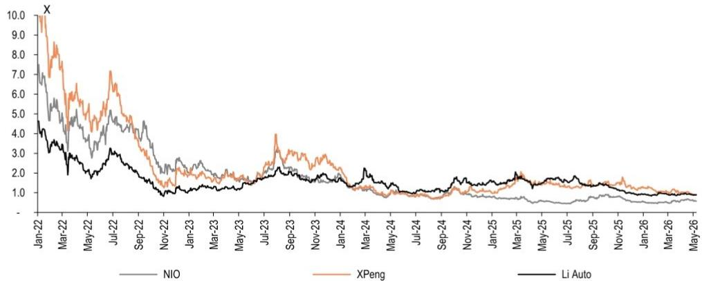

line

| Month    | NIO  | XPeng | Li Auto |
|----------|------|-------|---------|
| Jan-22   | 7.5  | 10.0  | 4.5     |
| Mar-22   | 5.0  | 8.0   | 3.0     |
| May-22   | 4.0  | 6.0   | 2.5     |
| Jul-22   | 5.0  | 7.0   | 3.0     |
| Sep-22   | 4.0  | 5.0   | 2.0     |
| Nov-22   | 3.0  | 3.0   | 1.5     |
| Jan-23   | 2.5  | 2.5   | 1.5     |
| Mar-23   | 2.0  | 2.0   | 1.5     |
| May-23   | 1.5  | 1.5   | 1.5     |
| Jul-23   | 1.5  | 4.0   | 1.5     |
| Sep-23   | 1.5  | 3.0   | 1.5     |
| Nov-23   | 1.5  | 2.5   | 1.5     |
| Jan-24   | 1.5  | 2.0   | 1.5     |
| Mar-24   | 1.5  | 1.5   | 1.5     |
| May-24   | 1.0  | 1.0   | 1.0     |
| Jul-24   | 1.0  | 1.0   | 1.0     |
| Sep-24   | 1.0  | 1.0   | 1.0     |
| Nov-24   | 1.0  | 1.0   | 1.0     |
| Jan-25   | 1.0  | 1.0   | 1.0     |
| Mar-25   | 1.0  | 1.0   | 1.0     |
| May-25   | 1.0  | 1.0   | 1.0     |
| Jul-25   | 1.0  | 1.0   | 1.0     |
| Sep-25   | 1.0  | 1.0   | 1.0     |
| Nov-25   | 1.0  | 1.0   | 1.0     |
| Jan-26   | 1.0  | 1.0   | 1.0     |
| Mar-26   | 1.0  | 1.0   | 1.0     |
| May-26   | 1.0  | 1.0   | 1.0     |

Note: NIO US, CMP USD6.25, Buy; XPEV US, CMP USD16.12, Buy; LI US, CMP USD19.27, Hold. Source: Bloomberg, HSBC estimates (for NIO, XP and Li Auto 12-month forward revenue per share)

Exhibit 26. H-share OEMs trade at a 0.77x 12-month forward PB multiple   
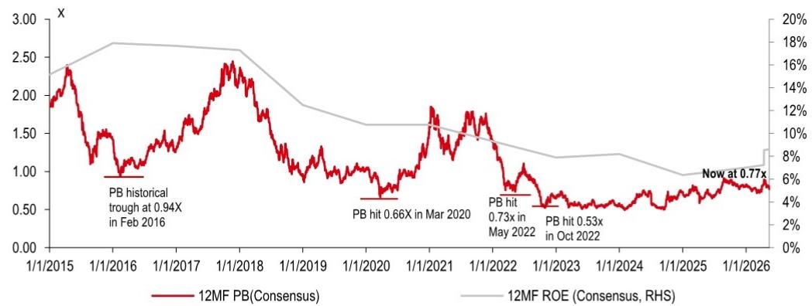

line

| Date       | PB Historical Trough | PB hit 0.66X | PB hit 0.73X | PB hit 0.53X | Now at 0.77X |
|------------|----------------------|--------------|--------------|--------------|---------------|
| Feb 2016   | 0.94                 |              |              |              |               |
| Mar 2020   |                      | 0.66         |              |              |               |
| May 2022   |                      |              | 0.73         |              |               |
| Oct 2022   |                      |              |              | 0.53         |               |
| Current    |                      |              |              |              | 0.77          |

Source: Bloomberg, HSBC

# Demand forecast changes

We cut our 2026 China passenger-car demand growth forecast to $-5\%$ (from $0\%$ ), reflecting fading policy support, residual effects from demand pulled forward, and continued weakness in ICE demand amid elevated oil prices. We still expect some pull-forward into late 2026, driven by the anticipated phase-out of replacement subsidies. As a result, we also lower our 2027 demand growth forecast to $-2\%$ (from $0\%$ ).

We have also trimmed our EV penetration assumptions following weaker-than-expected EV sales growth in 4M26. Our revised EV penetration forecasts for 2026–28 are 62%, 70% and 77%, respectively. Despite the near-term adjustment, we expect EVs to continue gaining share versus ICE, particularly if oil prices remain elevated. We now forecast 2030 EV penetration at 88% (from 83%).

Exhibit 27. China passenger car and EV demand forecast change 

<table><tr><td rowspan="2"></td><td colspan="4">New forecast</td><td colspan="4">Old forecast</td><td colspan="4">Change</td></tr><tr><td>2026e</td><td>2027e</td><td>2028e</td><td>2030e</td><td>2026e</td><td>2027e</td><td>2028e</td><td>2030e</td><td>2026e</td><td>2027e</td><td>2028e</td><td>2030e</td></tr><tr><td>PV volume (in m units)</td><td>22.5</td><td>22.1</td><td>22.1</td><td>22.1</td><td>23.7</td><td>23.7</td><td>24.0</td><td>24.7</td><td>-5%</td><td>-7%</td><td>-8%</td><td>-11%</td></tr><tr><td>PV volume y-o-y growth (%)</td><td>-5%</td><td>-2%</td><td>0%</td><td>0%</td><td>0%</td><td>0%</td><td>1%</td><td>2%</td><td>-5%</td><td>-2%</td><td>-1%</td><td>-2%</td></tr><tr><td>EV volume (in m units)</td><td>14.1</td><td>15.5</td><td>17.0</td><td>19.5</td><td>14.7</td><td>16.2</td><td>17.8</td><td>20.6</td><td>-4%</td><td>-4%</td><td>-4%</td><td>-5%</td></tr><tr><td>EV volume y-o-y growth (%)</td><td>10%</td><td>10%</td><td>10%</td><td>6%</td><td>15%</td><td>10%</td><td>10%</td><td>7%</td><td>-5%</td><td>0%</td><td>0%</td><td>-1%</td></tr><tr><td>EV penetration (%)</td><td>62%</td><td>70%</td><td>77%</td><td>88%</td><td>62%</td><td>68%</td><td>74%</td><td>83%</td><td>0%</td><td>2%</td><td>3%</td><td>5%</td></tr></table>

Source: HSBC estimates. PV: passenger vehicle. EV: electric vehicle.

Exhibit 28. We estimate $10\%$ EV demand growth in 2026, with penetration at $62\%$   
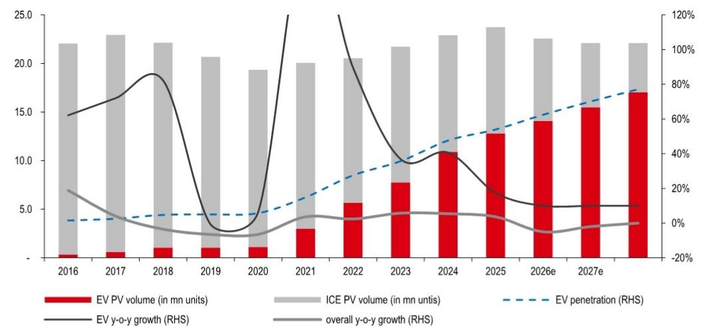

bar_line

| Year | EV PV volume (in mn units) | ICE PV volume (in mn units) | EV y-o-y growth (RHS) | overall y-o-y growth (RHS) |
|---|---|---|---|---|
| 2016 | 0.5 | 18.0 | 40% | 20% |
| 2017 | 0.8 | 19.0 | 50% | 10% |
| 2018 | 1.2 | 18.5 | 85% | -5% |
| 2019 | 1.0 | 17.5 | 30% | -5% |
| 2020 | 1.5 | 16.0 | -10% | -5% |
| 2021 | 3.0 | 16.5 | 100% | 5% |
| 2022 | 5.5 | 14.5 | 90% | 5% |
| 2023 | 7.5 | 13.5 | 35% | 5% |
| 2024 | 10.5 | 14.0 | 40% | 5% |
| 2025 | 12.5 | 13.5 | 20% | 5% |
| 2026e | 14.0 | 11.0 | 10% | -5% |
| 2027e | 15.5 | 9.5 | 10% | -5% |
| 2028e | 17.0 | 8.5 | 10% | -5% |

Source: CPCA, HSBC estimates

Valuation and risks 

<table><tr><td colspan="2"></td><td>Valuation</td><td>Risks</td></tr><tr><td>BYD002594 CH1211 HK</td><td rowspan="2">Current price:RMB98.73HKD98.15Target price:RMB126.00HKD146.00Upside:28%/49%</td><td rowspan="2">We use a sum-of-the-parts (SOTP) approach to value BYD's A- and H-shares.1) For the handset component division, we apply BYDE's (285 HK, HKD28.76, not rated) average 12-month forward PE multiple of 9.8x over the past month (from 12.0x, as per Bloomberg) to our 2026 earnings estimate of RMB5.7bn (unchanged) for the division and derive an implied valuation of RMB55.5bn (unchanged).2) For BYD's semiconductor division, including insulated gate bipolar transistor (IGBT) chips, we use Starpower Semiconductor (603290 CH, RMB124.46, Hold, covered by Cara Su) as the most comparable peer. We apply HSBC Qianhai Securities' 12-month forward target price-implied 2026e P/S multiple of 5.0x for Starpower (unchanged) to our 2026 revenue estimate for this division of RMB10.6bn (unchanged) and derive an implied valuation of RMB53.1bn (unchanged).3) For BYD's battery division, we use a target 2028e PE multiple of 20.0x (EV battery maker peers past two-year average 12-month forward PE multiple; unchanged), which we apply to our 2028 divisional earnings estimate of RMB23.8bn (unchanged). We then discount the value at an 8.8% cost of equity (unchanged), based on a risk-free rate of 4.25% (unchanged), a market premium 4.75% (unchanged), and a beta of 1.0 (unchanged, Bloomberg), to derive an implied valuation of RMB438bn (unchanged).4) For BYD's auto division, we use a 2028e target PE multiple to value the EV segment. We use a target PE multiple of 10.8x (local brand OEM peers past three-month average 12-month forward PE multiple; (unchanged) and apply this to our 2028 divisional earnings estimate of RMB61.0bn (unchanged). We then discount the value at an 8.8% cost of equity (unchanged), based on a risk-free rate of 4.25% (unchanged), a market premium of 4.75% (unchanged), and a beta of 1.0 (unchanged, Bloomberg) to derive an implied valuation of RMB606bn (unchanged).We use the latest HSBC Global Investment Research end-2026e RMB/HKD rate of 1.16 (unchanged) to derive our target prices for the A- and H-shares at RMB126.00 and HKD146.00 (unchanged), respectively; our target price for the Hong Kong-traded RMB-denominated counter is RMB126.00 (81211 HK, RMB90.50). Our A- and H-share target prices imply c28% and c49% upside from the current share price, respectively, and we maintain our Buy ratings on both stocks.Yuqian Ding* | yuqian.ding@hsbc.com.hk | +852 2288 5108</td><td rowspan="2">Downside risks: (1) weaker-than-expected EV demand growth; (2) stronger-than-expected competition from peers in the EV and EV battery space, which could hurt BYD's pricing and margin; (3) potential increase in global trade uncertainties or unfavourable overseas policies, which might extend the company's overseas expansion execution timeline and cost.</td></tr><tr><td>A: BuyH: Buy</td></tr><tr><td>Geely0175 HK</td><td>Current price:HKD21.26Target price:HKD32.00Upside:+51%</td><td>We use a PE multiple to value Geely and use a target PE multiple of 13x (the average 2026e PE of China local OEM peers, unchanged). Applying this to our 2026 EPS estimate of RMB2.12 (unchanged) and using HSBC's latest end-2026e RMBHKD rate of 1.16 (unchanged), we arrive at our target price of HKD32.00 (unchanged) and RMB27.60 for the RMB counter (80175 HK, unchanged, current price RMB18.42). With c51% implied upside from the current share price, we maintain a Buy rating.Yuqian Ding* | yuqian.ding@hsbc.com.hk | +852 2288 5108</td><td>Downside risks: weaker-than-expected domestic auto demand; slower-than-expected volume growth given fierce competition from peers; higher pricing erosion due to competition; FX volatility from oversea markets.</td></tr><tr><td>NIO NIO US</td><td>Current price: USD6.25 Target price: USD6.80 Up/downside: +9%</td><td>We continue to use a DCF model to value the ADR. We use a beta of 1.3 (unchanged) and a WACC of 8.8% (unchanged), based on an unchanged risk-free rate of 4.25% and an unchanged market equity premium of 4.75%. On the back of our updated cash flow estimates and end-2026e USD/RMB assumption of 6.75 (unchanged), we derive our new target price of USD6.80 (unchanged). We use an end-2026e RMB/HKD assumption of 1.16 (unchanged) to derive our H-share TP of HKD53.20 (unchanged). Our new US shares TP imply 9% upside from current levels, we maintain Buy rating as we expect its new models (ONVO L80 and NIO ES9) would continue to boost volume recovery in 2H26. Yuqian Ding* | yuqian.ding@hsbc.com.hk | +852 2288 5108</td><td>Downside risks: Weaker-than-expected new-model volume growth amid intense competition, especially if ES8 order momentum softens, which could be a drag on NIO's sales volume growth and margin recovery; lower-than-expected volume contribution of existing models; higher-than-expected pricing pressure, which could adversely affect NIO's ASP; unsustainable opex efficiency, which may put pressure on profitability.</td></tr><tr><td>XPENG XPEV US</td><td>Current price: USD16.12 Target price: USD27.70 Upside: +72%</td><td>We use a DCF approach to value the stock. We keep our assumptions unchanged, including a risk-free rate of 4.25%, an H-share China market equity premium of 4.75% and a beta of 1.80, reaching a cost of equity of 12.8%. Applying the per share equity value to a USD/RMB FX rate of 6.88 (unchanged), we arrive at our target price for the ADS of USD27.70 (unchanged), where each ADS represents two ordinary shares. Our target price implies 72% upside from current levels, thus we maintain our Buy rating on the stock. We have a HKD108.00 TP on the H-share (9868 HK, CMP HKD62.25), using an RMB/HKD FX rate of 1.13 (unchanged). Yuqian Ding* | yuqian.ding@hsbc.com.hk | +852 2288 5108</td><td>Downside risks: (1) Weaker-than-expected new model order and delivery momentum; (2) weaker-than-expected software revenue from autonomous driving and other areas; and (3) softer-than-expected EREV model market tractions given intense competition in EREV markets.</td></tr><tr><td>CATL 300750 CH</td><td>Current price: RMB427.00 HKD686.00 Target price: RMB547.00 HKD790.00 Upside: +28%/15%</td><td>We continue to use a DCF model to value CATL shares. With our unchanged key assumptions, including a risk-free rate of 4.25% (unchanged), a China stock market premium of 4.75% (unchanged), a WACC of 5.8% (unchanged), and a perpetual growth rate of 2.5% (unchanged), we arrive at our A-share target price of RMB547.00 (unchanged). Our target price implies c28% upside from the current levels; accordingly, we maintain our Buy rating on the stock. By applying an end-2026 RMB-HKD FX rate of 1.16 (unchanged) and an H-to-A-share premium of 25% (its H-to-A share average premium since the H-shares listed, unchanged), we arrive at our H-share target price of HKD790.00 (unchanged). Our H-share target price implies c15% upside from current levels. Given we are constructive on CATL's strong earnings visibility and continued share gain potential, we maintain our Buy rating on the stock. Elaine Chen* | elaine.chen@hsbcqh.com.cn | +86 010 5795 2364</td><td>Downside risks: Worse-than-expected raw materials price hike and passed-through; ASP and margin pressure after the launch of the rebate programme; Potentially less favourable regulatory environment in overseas markets; Weaker-than-expected execution of CATL's overseas expansion and unfavourable overseas tariff policies; Lower-than-expected EV/ESS market growth and market share wins; Potential quality/IP disputes (especially in the global market).</td></tr></table>

Note: Priced at close of 14 May 2026.   
\*Employed by a non-US affiliate of HSBC Securities (USA) Inc. and is not registered/qualified pursuant to FINRA regulations.   
Source: Bloomberg, HSBC estimates, HSBC Qianhai Securities estimates

# Disclosure appendix

# Analyst Certification

The following analyst(s), economist(s), or strategist(s) who is(are) primarily responsible for this report, including any analyst(s) whose name(s) appear(s) as author of an individual section or sections of the report and any analyst(s) named as the covering analyst(s) of a subsidiary company in a sum-of-the-parts valuation certifies(y) that the opinion(s) on the subject security(ies) or issuer(s), any views or forecasts expressed in the section(s) of which such individual(s) is(are) named as author(s), and any other views or forecasts expressed herein, including any views expressed on the back page of the research report, accurately reflect their personal view(s) and that no part of their compensation was, is or will be directly or indirectly related to the specific recommendation(s) or views contained in this research report: Yuqian Ding, Li Yang and Elaine Chen

# Important disclosures

# Equities: Stock ratings and basis for financial analysis

HSBC and its affiliates, including the issuer of this report ("HSBC") believes an investor's decision to buy or sell a stock should depend on individual circumstances such as the investor's existing holdings, risk tolerance and other considerations and that investors utilise various disciplines and investment horizons when making investment decisions. Ratings should not be used or relied on in isolation as investment advice. Different securities firms use a variety of ratings terms as well as different rating systems to describe their recommendations and therefore investors should carefully read the definitions of the ratings used in each research report. Further, investors should carefully read the entire research report and not infer its contents from the rating because research reports contain more complete information concerning the analysts' views and the basis for the rating.

# From 23rd March 2015 HSBC has assigned ratings on the following basis:

The target price is based on the analyst's assessment of the stock's actual current value, although we expect it to take six to 12 months for the market price to reflect this. When the target price is more than $20\%$ above the current share price, the stock will be classified as a Buy; when it is between $5\%$ and $20\%$ above the current share price, the stock may be classified as a Buy or a Hold; when it is between $5\%$ below and $5\%$ above the current share price, the stock will be classified as a Hold; when it is between $5\%$ and $20\%$ below the current share price, the stock may be classified as a Hold or a Reduce; and when it is more than $20\%$ below the current share price, the stock will be classified as a Reduce.

Our ratings are re-calibrated against these bands at the time of any 'material change' (initiation or resumption of coverage, change in target price or estimates).

Upside/Downside is the percentage difference between the target price and the share price.

# Prior to this date, HSBC's rating structure was applied on the following basis:

For each stock we set a required rate of return calculated from the cost of equity for that stock's domestic or, as appropriate, regional market established by our strategy team. The target price for a stock represented the value the analyst expected the stock to reach over our performance horizon. The performance horizon was 12 months. For a stock to be classified as Overweight, the potential return, which equals the percentage difference between the current share price and the target price, including the forecast dividend yield when indicated, had to exceed the required return by at least 5 percentage points over the succeeding 12 months (or 10 percentage points for a stock classified as Volatile\*). For a stock to be classified as Underweight, the stock was expected to underperform its required return by at least 5 percentage points over the succeeding 12 months (or 10 percentage points for a stock classified as Volatile\*). Stocks between these bands were classified as Neutral.

\*A stock was classified as volatile if its historical volatility had exceeded $40\%$ , if the stock had been listed for less than 12 months (unless it was in an industry or sector where volatility is low) or if the analyst expected significant volatility. However, stocks which we did not consider volatile may in fact also have behaved in such a way. Historical volatility was defined as the past month's average of the daily 365-day moving average volatilities. In order to avoid misleadingly frequent changes in rating, however, volatility had to move 2.5 percentage points past the $40\%$ benchmark in either direction for a stock's status to change.

# Rating distribution for long-term investment opportunities

As of 31 March 2026, the distribution of all independent ratings published by HSBC is as follows: 

<table><tr><td>Buy</td><td>59%</td><td>(12% of these provided with Investment Banking Services in the past 12 months)</td></tr><tr><td>Hold</td><td>36%</td><td>(12% of these provided with Investment Banking Services in the past 12 months)</td></tr><tr><td>Sell</td><td>6%</td><td>(6% of these provided with Investment Banking Services in the past 12 months)</td></tr></table>

For the purposes of the distribution above the following mapping structure is used during the transition from the previous to current rating models: under our previous model, Overweight = Buy, Neutral = Hold and Underweight = Sell; under our current model Buy = Buy, Hold = Hold and Reduce = Sell. For rating definitions under both models, please see “Stock ratings and basis for financial analysis” above.

For the distribution of non-independent ratings published by HSBC, please see the disclosure page available at http://www.hsbcnet.com/gbm/financial-regulation/investment-recommendations-disclosures.

To view a list of all the independent fundamental ratings/recommendations disseminated by HSBC during the preceding 12-month period, and the location where we publish our quarterly distribution of non-fundamental recommendations (applicable to Fixed Income and Currencies research only), please use the following links to access the disclosure page:

Clients of HSBC Private Bank: www.research.privatebank.hsbc.com/Disclosures

All other clients: www.research.hsbc.com/A/Disclosures

HSBC & Analyst disclosures
Disclosure checklist 

<table><tr><td>Company</td><td>Ticker</td><td>Recent price</td><td>Price date</td><td>Disclosure</td></tr><tr><td>BYD A</td><td>002594.SZ</td><td>96.30</td><td>15 May 2026</td><td>4, 11</td></tr><tr><td>BYD H</td><td>1211.HK</td><td>96.45</td><td>15 May 2026</td><td>4, 11</td></tr><tr><td>CATL</td><td>3750.HK</td><td>680.00</td><td>15 May 2026</td><td>4, 7, 11</td></tr><tr><td>CATL A</td><td>300750.SZ</td><td>423.60</td><td>15 May 2026</td><td>4, 7, 11</td></tr><tr><td>GEELY AUTOMOBILE HOLDINGS LTD</td><td>0175.HK</td><td>21.62</td><td>15 May 2026</td><td>1, 4, 5, 6, 7, 11</td></tr><tr><td>NIO INC</td><td>NIO.N</td><td>6.25</td><td>14 May 2026</td><td>7, 11</td></tr><tr><td>XPENG</td><td>XPEV.N</td><td>16.12</td><td>14 May 2026</td><td>4, 7, 11, 12</td></tr></table>

Source: HSBC

1 HSBC has managed or co-managed a public offering of securities for this company within the past 12 months.   
2 HSBC expects to receive or intends to seek compensation for investment banking services from this company in the next 3 months.   
3 At the time of publication of this report, HSBC Securities (USA) Inc. is a Market Maker in securities issued by this company.   
4 As of 30 April 2026, HSBC beneficially owned $1\%$ or more of a class of common equity securities of this company.   
5 This company was a client of HSBC or had during the preceding 12 month period been a client of and/or paid compensation to HSBC in respect of investment banking services.   
6 This company was a client of HSBC or had during the preceding 12 month period been a client of and/or paid compensation to HSBC in respect of non-investment banking securities-related services.   
7 This company was a client of HSBC or had during the preceding 12 month period been a client of and/or paid compensation to HSBC in respect of non-securities services.   
8 A covering analyst/s has received compensation from this company in the past 12 months.   
9 A covering analyst/s or a member of his/her household has a financial interest in the securities of this company, as detailed below.   
10 A covering analyst/s or a member of his/her household is an officer, director or supervisory board member of this company, as detailed below.   
11 At the time of publication of this report, HSBC is a non-US Market Maker in securities issued by this company and/or in securities in respect of this company.   
12 As of 08 May 2026, HSBC beneficially held a net long position of more than $0.5\%$ of this company's total issued share capital, calculated according to the SSR methodology.

13 As of 08 May 2026, HSBC beneficially held a net short position of more than $0.5\%$ of this company's total issued share capital, calculated according to the SSR methodology.   
14 HSBC Qianhai Securities Limited holds 1% or more of a class of common equity securities of this company.

HSBC and its affiliates will from time to time sell to and buy from customers the securities/instruments, both equity and debt (including derivatives) of companies covered in HSBC on a principal or agency basis or act as a market maker or liquidity provider in the securities/instruments mentioned in this report.

Analysts, economists, and strategists are paid in part by reference to the profitability of HSBC which includes investment banking, sales & trading, and principal trading revenues.

Whether, or in what time frame, an update of this analysis will be published is not determined in advance.

Non-U.S. analysts may not be associated persons of HSBC Securities (USA) Inc, and therefore may not be subject to FINRA Rule 2241 or FINRA Rule 2242 restrictions on communications with the subject company, public appearances and trading securities held by the analysts.

Economic sanctions laws imposed by certain jurisdictions such as the US, the EU, the UK, and others, may prohibit persons subject to those laws from making certain types of investments, including by transacting or dealing in securities of particular issuers, sectors, or regions. This report does not constitute advice in relation to any such laws and should not be construed as an inducement to transact in securities in breach of such laws.

For disclosures in respect of any company mentioned in this report, please see the most recently published report on that company available at www.hsbcnet.com/research. HSBC Private Bank clients should contact their Relationship Manager for queries regarding other research reports. In order to find out more about the proprietary models used to produce this report, please contact the authoring analyst.

# Additional disclosures

1 This report is dated as at 18 May 2026.   
2 All market data included in this report are dated as at close 14 May 2026, unless a different date and/or a specific time of day is indicated in the report.   
3 HSBC has procedures in place to identify and manage any potential conflicts of interest that arise in connection with its Research business. HSBC's analysts and its other staff who are involved in the preparation and dissemination of Research operate and have a management reporting line independent of HSBC's Investment Banking business. Information Barrier procedures are in place between the Investment Banking, Principal Trading, and Research businesses to ensure that any confidential and/or price sensitive information is handled in an appropriate manner.   
4 You are not permitted to use, for reference, any data in this document for the purpose of (i) determining the interest payable, or other sums due, under loan agreements or under other financial contracts or instruments, (ii) determining the price at which a financial instrument may be bought or sold or traded or redeemed, or the value of a financial instrument, and/or (iii) measuring the performance of a financial instrument or of an investment fund.

# Production & distribution disclosures

1. This report was produced and signed off by the author on 15 May 2026 12:17 GMT.   
2. In order to see when this report was first disseminated please see the disclosure page available at https://www.research.hsbc.com/R/34/cLsRCrQ

# Disclaimer

Legal entities as at 13 May 2026:

HSBC Bank plc; HSBC Continental Europe; HSBC Continental Europe SA, Germany; HSBC Bank Middle East Limited, DIFC; HSBC Bank Middle East Limited, Dubai branch; HSBC Yatirim Menkul Degerler AS, Istanbul; The Hongkong and Shanghai Banking Corporation Limited, Hong Kong; The Hongkong and Shanghai Banking Corporation Limited, Singapore Branch; The Hongkong and Shanghai Banking Corporation Limited, Seoul Securities Branch; The Hongkong and Shanghai Banking Corporation Limited, Seoul Branch; HSBC Qianhai Securities Limited; HSBC Securities (Taiwan) Corporation Limited; HSBC Securities and Capital Markets (India) Private Limited, Mumbai; HSBC Bank Australia Limited; HSBC Securities (USA) Inc., New York; HSBC México, SA, Institución de Banca Múltiple, Grupo Financiero HSBC; Banco HSBC SA

Issuer of report

The Hongkong and Shanghai Banking Corporation Limited

Level 16, 1 Queen's Road Central

Hong Kong SAR

Telephone: +852 2843 9111

Fax: +852 2596 0200

Website: www.research.hsbc.com

This document has been issued by The Hongkong and Shanghai Banking Corporation Limited ("HSBC") in the conduct of its Hong Kong regulated business for the information of its institutional and professional investor (as defined by Securities and Future Ordinance (Chapter 571)) customers; it is not intended for and should not be distributed to retail customers in Hong Kong, unless permitted otherwise. The Hongkong and Shanghai Banking Corporation Limited is regulated by the Hong Kong Monetary Authority. All enquires by recipients in Hong Kong must be directed to your HSBC contact in Hong Kong. If it is received by a customer of an affiliate of HSBC, its provision to the recipient is subject to the terms of business in place between the recipient and such affiliate. This document is not and should not be construed as an offer to sell or the solicitation of an offer to purchase or subscribe for any investment. HSBC has based this document on information obtained from sources it believes to be reliable but which it has not independently verified; HSBC makes no guarantee, representation or warranty and accepts no responsibility or liability as to its accuracy or completeness. Expressions of opinion are those of the Research Division of HSBC only and are subject to change without notice. From time to time research analysts conduct site visits of covered issuers. HSBC policies prohibit research analysts from accepting payment or reimbursement for travel expenses from the issuer for such visits. HSBC and its affiliates and/or their officers, directors and employees may have positions in any securities mentioned in this document (or in any related investment) and may from time to time add to or dispose of any such securities (or investment). HSBC and its affiliates may act as market maker or have assumed an underwriting commitment in the securities of companies discussed in this document (or in related investments), may sell them to or buy them from customers on a principal basis and may also perform or seek to perform investment banking or underwriting services for or relating to those companies. The document is intended to be distributed in its entirety. Unless governing law permits otherwise, you must contact a HSBC Group member in your home jurisdiction if you wish to use HSBC Group services in effecting a transaction in any investment mentioned in this document.

In the UK, this publication is distributed by HSBC Bank plc for the information of its Clients (as defined in the Rules of FCA) and those of its affiliates only. Nothing herein excludes or restricts any duty or liability to a customer which HSBC Bank plc has under the Financial Services and Markets Act 2000 or under the Rules of FCA and PRA. A recipient who chooses to deal with any person who is not a representative of HSBC Bank plc in the UK will not enjoy the protections afforded by the UK regulatory regime. HSBC Bank plc is regulated by the Financial Conduct Authority and the Prudential Regulation Authority.

In the European Economic Area, this publication has been distributed by HSBC Continental Europe or by such other HSBC affiliate from which the recipient receives relevant services.

In Japan, this publication has been distributed by HSBC Securities (Japan) Co., Ltd.. It may not be further distributed in whole or in part for any purpose. In Korea, this publication is distributed by either The Hongkong and Shanghai Banking Corporation Limited, Seoul Securities Branch ("HBAP SLS") or The Hongkong and Shanghai Banking Corporation Limited, Seoul Branch ("HBAP SEL") for the general information of professional investors specified in Article 9 of the Financial Investment Services and Capital Markets Act ("FSCMA"). This publication is not a prospectus as defined in the FSCMA. It may not be further distributed in whole or in part for any purpose. Both HBAP SLS and HBAP SEL are regulated by the Financial Services Commission and the Financial Supervisory Service of Korea. In Singapore, this publication is distributed by The Hongkong and Shanghai Banking Corporation Limited, Singapore Branch for the general information of institutional investors or other persons specified in Sections 274 and 304 of the Securities and Futures Act 2001 of Singapore ("SFA") and accredited investors and other persons in accordance with the conditions specified in Sections 275 and 305 of the SFA. Only Economics or Currencies reports are intended for distribution to a person who is not an Accredited Investor, Expert Investor or Institutional Investor as defined in SFA. The Hongkong and Shanghai Banking Corporation Limited, Singapore Branch accepts legal responsibility for the contents of reports. This publication is not a prospectus as defined in the SFA. It may not be further distributed in whole or in part for any purpose. The Hongkong and Shanghai Banking Corporation Limited Singapore Branch is regulated by the Monetary Authority of Singapore. Recipients in Singapore should contact a "Hongkong and Shanghai Banking Corporation Limited, Singapore Branch" representative in respect of any matters arising from, or in connection with this report. Please refer to The Hongkong and Shanghai Banking Corporation Limited Singapore Branch's website at www.business.hsbc.com.sg for contact details. In Australia, this publication has been distributed by The Hongkong and Shanghai Banking Corporation Limited (ABN 65 117 925 970, AFSL 301737) for the general information of its "wholesale" customers (as defined in the Corporations Act 2001). Where distributed to retail customers, this research is distributed by HSBC Bank Australia Limited (ABN 48 006 434 162, AFSL No. 232595). These respective entities make no representations that the products or services mentioned in this document are available to persons in Australia or are necessarily suitable for any particular person or appropriate in accordance with local law. No consideration has been given to the particular investment objectives, financial situation or particular needs of any recipient.

HSBC Securities (USA) Inc. accepts responsibility for the content of this research report prepared by its non-US foreign affiliate. The information contained herein is under no circumstances to be construed as investment advice and is not tailored to the needs of the recipient. All US persons receiving and/or accessing this report and wishing to effect transactions in any security discussed herein should do so with HSBC Securities (USA) Inc. in the United States and not with its non-US foreign affiliate, the issuer of this report. HSBC México, S.A., Institución de Banca Múltiple, Grupo Financiero HSBC is authorized and regulated by Secretaría de Hacienda y Crédito Público and Comisión Nacional Bancaria y de Valores (CNBV). In Brazil, this document has been distributed by Banco HSBC SA ("HSBC Brazil"), and/or its affiliates. As required by Resolution No. 20/2021 of the Securities and Exchange Commission of Brazil (Comissão de Valores Mobiliários), potential conflicts of interest concerning (i) HSBC Brazil and/or its affiliates; and (ii) the analyst(s) responsible for authoring this report are stated on the chart above labelled "HSBC & Analyst Disclosures".

If you are a customer of HSBC International Wealth & Premier Banking ("IWPB"), including HSBC Private Bank, you are eligible to receive this publication only if: (i) you have been approved to receive relevant research publications by an applicable HSBC legal entity; (ii) you have agreed to the applicable HSBC entity's terms and conditions and/or customer declaration for accessing research; and (iii) you have agreed to the terms and conditions of any other internet banking, online banking, mobile banking and/or investment services offered by that HSBC entity, through which you will access research publications (collectively with (ii), the "Terms"). If you do not meet the above eligibility requirements, please disregard this publication and, if you are a IWPB customer, please notify your Relationship Manager or call the relevant customer hotline. Distribution of this publication is the sole responsibility of the HSBC entity with whom you have agreed the Terms. Receipt of research publications is strictly subject to the Terms and any other conditions or disclaimers applicable to the provision of the publications that may be advised by IWPB.

© Copyright 2026, The Hongkong and Shanghai Banking Corporation Limited, ALL RIGHTS RESERVED. No part of this publication may be reproduced, stored in a retrieval system, or transmitted, on any form or by any means, electronic, mechanical, photocopying, recording, or otherwise, without the prior written permission of The Hongkong and Shanghai Banking Corporation Limited.

[1279533]