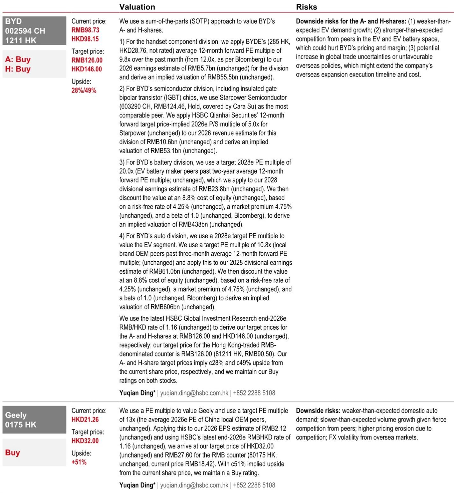
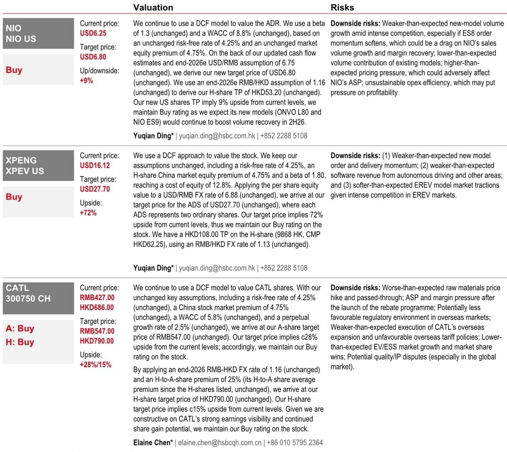
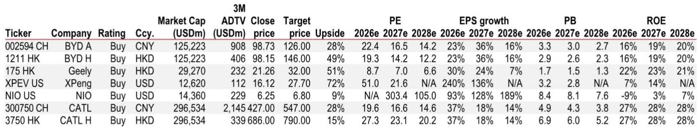

# 出口才是中国汽车利润的真正锚点

## 1. 国内需求疲软不是短期波动，而是结构性问题正在重塑竞争逻辑

这份来自某外资投行的中国汽车行业追踪报告，在4月数据中捕捉到了一个容易被忽视的信号：国内汽车零售量同比下降21%，而新能源车零售量虽然同比仅下降6%，但环比已经持平。更值得关注的是，1-5月前10天国内乘用车销量继续同比下降21%，渠道库存指标从1.5上升至1.89，库存预警指数从57.5%跳升至62.1%。

这些数字叠加在一起，指向的不是一个简单的周期性回调。报告明确指出，国内需求疲软背后有三个结构性因素：政策刺激效应的退潮、提前消费需求的透支效应、以及油价高企背景下燃油车需求的持续萎缩。这三个因素没有一个是短期能够逆转的。

所以，报告将2026年国内需求预测下调，就不是一个战术判断，而是一个战略判断。这意味着，过去几年市场习惯的“中国汽车增长故事”已经切换了章节。国内市场的竞争，将从“做大蛋糕”转向“存量博弈”，而存量博弈的赢家，不一定是销量最大的企业，而是那些在特定价格带和技术维度上建立护城河的企业。

## 2. 出口才是当前中国车企盈利能力的真实支撑，而不是国内份额

报告给出的出口数据是整个分析中最硬的信号。4M26中国乘用车出口量达到270万辆，同比增长69%。其中，新能源车在出口中的占比从38%提升至49%，这意味着出口增长主要由电动车驱动，而不仅仅是燃油车的海外替代。

奇瑞、比亚迪和吉利是出口的主力军。但这里有一个更重要的洞察：出口不仅仅是量的补充，更是利润结构的优化。在国内市场，折扣率已经上升到10.9%，而出口市场由于定价权和竞争格局的不同，盈利能力显著优于国内。报告虽然没有直接给出出口利润率的数字，但从“出口是盈利能力的支撑”这一表述可以推断，如果剔除出口贡献，多家中国车企的国内业务可能处于盈亏平衡甚至亏损状态。

这意味着，市场在评估中国车企估值时，如果仍然以国内销量和份额为主要参照系，可能严重低估了出口业务对利润的贡献。反过来，如果出口市场遭遇贸易壁垒或地缘政治风险，对盈利的冲击也将远大于国内销量波动。

## 3. 竞争焦点正在从“价格战”转向“技术整合”，但这一转变尚未被充分定价

报告提到一个关键变化：竞争强度正在从去年的入门级电动车市场转向今年的高端市场。比亚迪的大唐在预售两周内获得了约10万辆订单，而接下来还有理想L9、ONVO L80、小鹏GX和蔚来ES9等车型即将上市。

这一变化的含义是什么？价格战正在让位于技术整合战。消费者不再仅仅看价格，而是看“大型SUV+高级ADAS+电动化+智能座舱”的综合体验。这意味着，企业的竞争壁垒正在从规模效应转向技术整合能力。

但这里有一个报告没有完全展开的问题：技术整合能力是否真的能转化为可持续的定价权？从折扣率数据来看，电动车折扣率从3月的10.6%微升至4月的10.9%，并没有出现明显的收窄。也就是说，即使产品力在提升，价格压力仍然存在。这背后可能是供给过剩的结构性矛盾——报告显示，2026年预计将有约238款新车上市，其中电动车占比90%。供给侧的爆发式增长，可能会持续压制定价能力，即使技术整合能力再强。

## 4. 市场集中度下降是一个被低估的风险信号，尤其是对领先者

报告中的市场份额数据值得反复看。4M26前十大电动车品牌的市场份额为71%，低于2025年的75%和2024年的78%。与此同时，前十大燃油车品牌的市场份额为73%，略高于2025年的72%和2024年的71%。

这意味着什么？电动车市场的集中度正在下降，而燃油车市场正在缓慢集中。电动车市场有47个品牌在争夺剩余29%的份额，燃油车市场有69个品牌在争夺剩余27%的份额。这个长尾的竞争烈度，可能比头部更激烈。

对于领先者来说，集中度下降意味着维持份额的成本在上升。报告显示，比亚迪在4M26的市场份额下降了4.8个百分点，是所有主要品牌中下降最多的。虽然这可能与新车型周期导致的销量波动有关，但这一趋势如果持续，将对比亚迪的规模效应和定价权构成压力。

对于后发者来说，集中度下降意味着窗口期仍然存在。小鹏、蔚来等品牌虽然绝对销量不大，但如果能在技术整合和用户体验上建立差异化，仍然有机会在长尾中突围。报告对小鹏和蔚来的评级都是买入，背后的逻辑可能就是这种“技术差异化”的期权价值。

## 5. 报告尚未完全回答的关键问题：出口的可持续性和利润率的真实水平

出口数据强劲，但报告没有深入讨论几个关键问题：

第一，出口增长的可持续性。4M26出口同比增长69%，这一增速部分受益于低基数效应。随着基数抬升，增速自然会放缓。更重要的是，主要出口目的地是否会出现贸易政策变化？报告提到了“宏观顺风”，包括油价上涨提升了电动车的总拥有成本优势，但没有讨论地缘政治风险。

第二，出口业务的利润率到底是多少。报告说出口是“盈利能力的支撑”，但没有给出具体的利润率数据。如果出口利润率显著高于国内，那么出口增速放缓对整体盈利的冲击将远大于其销量占比。这一信息对于估值模型至关重要，但报告没有完全展开。

第三，锂价上涨对利润的影响。锂价已经回升至20万元/吨，比亚迪宣布5月提价以对冲成本压力。但提价在需求疲软的环境下能否被市场接受？如果提价导致销量进一步下滑，那将形成“成本上涨-提价-需求萎缩”的负螺旋。报告承认提价是“额外的短期需求逆风”，但没有量化这一风险。

这些未解问题，正是需要深入讨论的方向。如果你对这些关键假设的验证和二阶影响感兴趣，欢迎来星球微信群里继续讨论，我们会基于完整报告和最新数据，持续跟踪这些变量的演变。

Personal reading notes and learning share only. Not investment advice.

