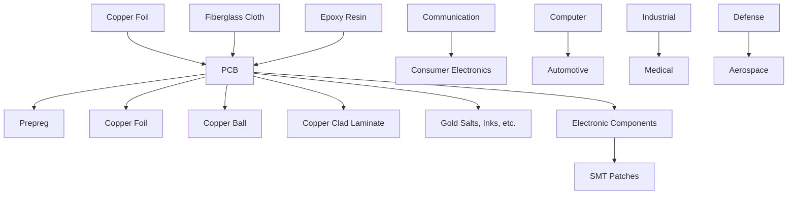
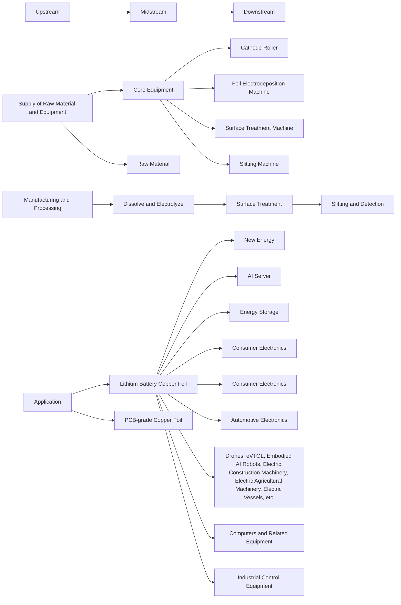

You are a senior financial newsletter editor with a consulting-style strategy lens. You turn research-report material into a long-form English article that is structured, insightful, and suitable for a serious business audience.

Objective:
- Write an English Markdown article based on the report parsing below.
- Target length: around 2200 words, plus or minus 15%.
- Tone: serious, analytical, strategic, and readable.
- The article should not feel like a summary. It should make an argument.
- You may extend the report's logic into reasonable second-order implications, but do not invent data, company actions, or quotes.
- Do not disclose every detail. Leave several meaningful open questions that make readers want the full report.

McKinsey-style writing principles:
1. Answer first: open with the controlling idea, not background.
2. Governing thought: every section must support the main answer.
3. Mutually exclusive, collectively exhaustive logic: avoid overlapping sections.
4. So what: every section must explain why the point matters.
5. Synthesis over summary: do not list facts; interpret what the pattern means.
6. Action titles: section headings must be complete, insight-bearing sentences. Do not use generic headings such as "Key Takeaways", "Market Background", "Core View", or "Reader Implications".
7. Natural hooks: if you want readers to join the community or read the full report, the hook should emerge from unresolved analytical questions, not from promotional language.

Required Markdown structure:
- `# Title`: make it a direct argument, not a topic label.
- Opening: 4-6 short paragraphs that state the main thesis and why now matters.
- 4-6 `##` sections. Each `##` heading must be an action title: a sentence that tells the reader the insight.
- One section should identify what the report does not fully answer yet.
- One section should translate the report into a decision framework for readers.
- Final section: naturally invite readers to join the community or read the full report using this CTA: Join the community to read the full report and review the original charts.
- End with: `*This article is for learning and discussion only and does not constitute investment advice.*`

Content boundaries:
- Do not mention specific investment bank names such as GS. Use "a global investment bank report" if needed.
- Do not use emoji.
- Do not write like a viral post.
- Do not output your reasoning process.
- Do not generate image Markdown; the system will insert original MinerU images afterward.

Report parsing:
"""
# PCB/CCL Update: Will High-speed Copper Foil Become Another Bottleneck?

We estimate HVLP demand to expand from $\sim 1.3\mathrm{kt / mo}$ in 2025 to $>6\mathrm{kt}/$ mo in 2030, driven by $30 - 40\%$ CAGR of AI CCL demand for infra buildout. Spec upgrades from HVLP1/2/3 to HVLP4 and wider adoption of DTH are key drivers of soaring ASP. Industrywide supply tightness to create opportunities for Chinese vendors on high-end copper foil to fill the gap for 3.5-4.0kt/month of HVLP4 equivalent demand in 2027. Shengyi is a major beneficiary in our coverage.

Copper foil to dance with AI PCB/CCL. Echoing our previous initiation on PCB (Link), given we forecast \~60%/70% CAGR of AI PCB/CCL TAM in 2025-30E driven by tech giants' rising capex plans on AI infra buildout, this trend has also brought structural changes to electrolytic copper foil as one of key upstream materials. We estimate AI CCL monthly demand at \~1.8m sheets/month in 2025 and expect 30-40% CAGR to reach >9m sheets/month in 2030. As a result, we forecast demand of HVLP, as a critical high-speed copper foil for AI infra with significantly higher value and technical barrier vs traditional copper foil, to grow from \~1.3kt/month in 2025 to >6kt/month in 2030.

Soaring ASP from spec upgrade a key driver. Major AI players (NVIDIA/Google/Amazon) will largely transfer their copper foil spec from HVLP1/2/3 to HVLP4 on their upcoming new AI servers in 2H26, creating significant demand on the latter. The outlook from Mitsui on its HVLP sales growth CAGR at 15-20% in 2025-30 seems conservative, potentially creating spillover opportunities for other vendors. We also see rising demand on DTH as another advanced copper foil driven by memory and optical transceiver. We estimate HVLP4 could reach >10x as of traditional HTE on pricing, and DTH could even be roughly 2x as of HVLP4. As demand continues to shift toward higher-spec HVLP/DTH going forward, driven by AI infra construction, we believe the copper foil industry's ASP will continue to rise.

AI copper foil supply gap could be there, but Chinese vendors are gaining traction to fill it up. With industrywide supply tightness caused by surging AI-related demand, we think domestic players could demonstrate their advantage in production capacity and potentially enable them to gain more traction on high-end copper foil. We anticipate notable supply gap in the next 1-2 years for HVLP4-equivalent demand if we only count international players' capacity. But by including TGCF/Defu as emerging suppliers on high-speed copper foil, we now expect global major players' HVLP capacity to increase from \~2kt/month in 2025 to >5kt/month in 2027 (or 3.5-4.0kt/month of HVLP4-equivalent capacity), roughly on a par with demand by then, though it still depends on each vendor's execution on HVLP4's capacity ramp.

Implications on the industry & our coverage. We believe such trend will benefit those copper foil and equipment vendors technically redied. TGCF/Defu are now leading Chinese players in AI copper foil in customer verification and shipment volume. For TGCF, its RTF/HVLP already took up the majority of its gross profit in 2025, making it almost a direct AI play. For Defu, in addition to capabilities for high-speed copper foil, we see an active capacity expansion plan (another 50kt capacity in 2027-28 focusing on RTF/HVLP), which may demonstrate its strength in acquiring critical tools. Equipment makers such as Taijin New Energy could also have potential spillover opportunities. Among our coverage, we expect Sytech to have advantages in securing sufficient materials going forward as it continues to diversify its supply sources (Chinese upstream suppliers are more proactive in expanding capacity vs international vendors), enabling it to further expand its market share in AI CCL supply chain.

Chart 1 - Global AI CCL Demand Forecast   

bar_stacked

2025-30E CAGR 30-40%
| Year | NVIDIA (m sheets/month) | Non-NVIDIA (m sheets/month) | Switch (m sheets/month) | Others (m sheets/month) |
| :--- | :--- | :--- | :--- | :--- |
| 2025 | 1.8 | 0.6 | 0.4 | 0.1 |
| 2026E | 3.2 | 1.1 | 0.5 | 0.2 |
| 2027E | 5.2 | 1.9 | 0.8 | 0.3 |
| 2028E | 6.6 | 2.5 | 1.1 | 0.4 |
| 2029E | 8.0 | 3.1 | 1.4 | 0.5 |
| 2030E | 9.1 | 3.8 | 1.7 | 0.6 |

Source: JEF estimates

Chart 2 - Global AI HVLP Demand Forecast   

bar_stacked

| Year | NVIDIA (k tons/month) | Non-NVIDIA (k tons/month) | Switch (k tons/month) | Others (k tons/month) |
| :--- | :--- | :--- | :--- | :--- |
| 2025 | 0.6 | 0.8 | 0.4 | 1.3 |
| 2026E | 0.9 | 1.1 | 0.5 | 2.3 |
| 2027E | 1.1 | 1.4 | 0.6 | 3.7 |
| 2028E | 1.4 | 1.7 | 0.7 | 4.7 |
| 2029E | 1.8 | 2.1 | 0.8 | 5.6 |
| 2030E | 2.1 | 2.5 | 0.9 | 6.3 |
The chart includes a red annotation stating '2025-30E CAGR 30-40%' above the bars.

Source: JEF estimates

Chart 3 - HVLP Capacity by Major Supplier   

bar_line

| Year | Non-China (k tons/month) | China (k tons/month) | China Vendor Share (%) |
| :--- | :--- | :--- | :--- |
| 2025 | 1.9 | 0.4 | 15 |
| 2026E | 3.2 | 1.1 | 25 |
| 2027E | 5.2 | 1.8 | 35 |

Source: Company data, JEF estimates

Chart 4 - HVLP4 Equivalent Supply vs Demand   

bar

| Year   | HVLP4 Equiv. Supply | HVLP4 Equiv. Al Demand | HVLP4 Equiv. Non-Al Demand |
| ------ | ------------------- | ---------------------- | -------------------------- |
| 2025   | 1.4                 | 1.4                    | -                          |
| 2026E  | 2.4                 | 2.5                    | -                          |
| 2027E  | 3.8                 | 3.9                    | -                          |

Source: Company data, JEF estimates

Jacky He \* | Equity Analyst

+852 3743 8084 | jacky.he@JEF.com

Edison Lee, CFA \* | Equity Analyst

852 3743 8009 | edison.lee@JEF.com

Nick Cheng \* | Equity Analyst

+852 3743 8750 | nick.cheng@JEF.com

Matt Ma \* | Equity Analyst

852 3767 1109 | matt.ma@JEF.com

Annie Ping, CFA, FRM \* | Equity Associate

+852 3767 1273 | annie.ping@JEF.com

# Copper Foil's Revival: Riding the Tide of Booming AI PCB Demand

Copper foil to ride on booming AI PCB/CCL demand. As indicated in our initiation on several PCB names (Link), we forecast \~15% CAGR in 2025-30 for the global TAM of PCB, mainly driven by \~60%/70% CAGR of AI PCB/CCL TAM, as AI infrastructure growth is likely to continue to be supported by tech giants' rising capex plans. We believe this trend has also brought structural changes to electrolytic copper foil, which acts as one of key upstream materials for PCB/CCL to be adopted on computing infra (represented by data center equipment such as server, switch, optical transceiver, etc.). In addition to PCB, copper foil is also widely adopted in LIB (lithium battery), and we observe the industry demand is accelerating as well, further fueling the expansion of copper foil's market size.

Chart 5 - PCB Supply Chain   

flowchart

Source: Company data, JEF

Chart 6 - Electrolytic Copper Foil Supply Chain   

flowchart

Source: Company data, JEF

Chart 7 - Global AI PCB TAM Forecast   

bar_stacked

| Year | NVIDIA (US$bn) | Non-NVIDIA (US$bn) | Switch (US$bn) | Optical Transceiver (US$bn) | Others (US$bn) |
| :--- | :--- | :--- | :--- | :--- | :--- |
| 2025 | 3 | 1 | 1 | 0 | 0 |
| 2026E | 4 | 4 | 2 | 1 | 1 |
| 2027E | 8 | 8 | 3 | 1 | 2 |
| 2028E | 12 | 14 | 4 | 2 | 3 |
| 2029E | 18 | 22 | 5 | 3 | 4 |
| 2030E | 23 | 28 | 6 | 4 | 5 |
2025-30E CAGR ~60%

Chart 8 - Global AI CCL TAM Forecast   

bar_stacked

| Year | NVIDIA (US$bn) | Non-NVIDIA (US$bn) | Switch (US$bn) | Optical Transceiver (US$bn) | Others (US$bn) |
| :--- | :--- | :--- | :--- | :--- | :--- |
| 2025 | 1.5 | 1.0 | 0.5 | 0.5 | 0.5 |
| 2026E | 2.5 | 1.5 | 0.5 | 0.5 | 0.5 |
| 2027E | 4.0 | 3.0 | 1.0 | 0.5 | 1.0 |
| 2028E | 6.5 | 5.5 | 1.5 | 1.0 | 1.5 |
| 2029E | 10.5 | 9.0 | 2.0 | 1.5 | 2.0 |
| 2030E | 13.5 | 14.5 | 2.5 | 1.5 | 2.5 |
The chart includes a diagonal reference line starting at (2025, 3) and ending at (2030E, 39). The annotation '2025-30E CAGR ~70%' indicates the compound annual growth rate over this period.

Source: Prismark, JEF estimates   
Source: Prismark, JEF estimates

We forecast CAGR of 30-40% for AI HVLP shipment. To meet the rising requirement of data transmission, HVLP (high-volume low-pressure) copper foil as a high-end material has already become the mainstream solution for AI infra, which has significantly higher value and technical barriers compared with traditional copper foil, and we see continued product upgrade for stronger performance going forward. Based on current AI chip volume and allocation to each player (NVIDIA, CSP, etc.), AI PCB spec adopted and future roadmap, we estimate AI CCL monthly demand at \~1.8m sheets/month in 2025 (including GPU/ASIC server, high-speed, and others), translating to \~1.3k tons/month demand on HVLP. We then forecast 30-40% CAGR for HVLP's demand to reach >6k tons/month in 2030, assuming 1) AI players continue to afford rising capex; 2) ongoing spec upgrade for increasing dollar content; and 3) smooth capacity expansion by major copper foil vendors without significant disruption in supply chain.

Chart 9 - Global PCB Copper Foil TAM Forecast   

bar_stacked

| Year | AI PCB (Rmb bn) | Non-AI PCB (Rmb bn) |
| :--- | :--- | :--- |
| 2020 | 0 | 32 |
| 2021 | 0 | 53 |
| 2022 | 0 | 56 |
| 2023 | 4 | 45 |
| 2024 | 3 | 48 |
| 2025 | 8 | 61 |
| 2026E | 11 | 72 |
| 2027E | 29 | 85 |
| 2028E | 36 | 98 |
| 2029E | 66 | 121 |
| 2030E | 80 | 143 |

Chart 10 - Global PCB Copper Foil Shipment Forecast   

bar_stacked

| Year | AI PCB (k tons) | Non-AI PCB (k tons) |
| :--- | :--- | :--- |
| 2020 | 10 | 420 |
| 2021 | 15 | 530 |
| 2022 | 20 | 585 |
| 2023 | 15 | 520 |
| 2024 | 20 | 544 |
| 2025 | 100 | 686 |
| 2026E | 100 | 635 |
| 2027E | 150 | 708 |
| 2028E | 200 | 770 |
| 2029E | 280 | 855 |
| 2030E | 310 | 898 |

Source: CCFA, JEF estimates   
Source: CCFA, JEF estimates

Chart 11 - Global AI CCL Demand Forecast   

bar_stacked

| Year | NVIDIA (m sheets/month) | Non-NVIDIA (m sheets/month) | Others (m sheets/month) |
| :--- | :--- | :--- | :--- |
| 2025 | 0.6 | 0.7 | 0.1 |
| 2026E | 0.9 | 1.4 | 0.3 |
| 2027E | 1.4 | 2.1 | 0.6 |
| 2028E | 2.0 | 2.7 | 0.8 |
| 2029E | 2.6 | 3.5 | 1.0 |
| 2030E | 3.0 | 4.1 | 1.1 |
2025-30E CAGR: 30-40%
Line trend: Line graph; text annotation at top right indicates '2025-30E CAGR' with '30-40%' noted.

Chart 12 - Global AI HVLP Demand Forecast   

bar_stacked

| Year | NVIDIA (k tons/month) | Non-NVIDIA (k tons/month) | Others (k tons/month) |
| :--- | :--- | :--- | :--- |
| 2025 | 0.4 | 0.6 | 0.1 |
| 2026E | 0.7 | 1.2 | 0.3 |
| 2027E | 1.0 | 1.5 | 0.5 |
| 2028E | 1.4 | 1.9 | 0.7 |
| 2029E | 1.9 | 2.4 | 0.8 |
| 2030E | 2.1 | 2.8 | 0.9 |
2025-30E CAGR: 30-40%
Line trend: Line chart

Source: JEF estimates   
Source: JEF estimates

# Moving towards Higher-end: From HTE/RTF to HVLP/DTH

Materials upgrade to push PCB/CCL's evolution. The major end devices that adopt high-end PCB include AI server (mainboard, OAM, UBB, etc.), high-speed switch, and optical transceiver (>=400G), and copper foil generally takes up \~30% of CCL's cost and another <5% of PCB's cost (adopted on both PCB/CCL individually). While HTE (high-temperature elongation) acts as a commodity-like product with wide applications in many downstream markets and RTF (reverse-treated foil) used to be a major solution on general server/switch, high-end materials such as HVLP and DTH have now been widely adopted in AI infra, thanks to its much stronger signal transmission capabilities, though at a higher cost, enabling better performance of PCB/CCL on AI server/switch, etc.

Table 1 - PCB Copper Foil Spec Comparison 

<table><tr><td>Parameters</td><td>HTE</td><td>RTF</td><td>HVLP</td></tr><tr><td>Roughness</td><td>&gt;4um (Rz)</td><td>Smooth surface 0.5-4um (Rz)</td><td>≤1.0um (Rz)</td></tr><tr><td>Core advantage</td><td>High temperature elongation</td><td>Simplified manufacturing process</td><td>Ultra-low signal loss</td></tr><tr><td>Applicable frequency</td><td>Low to mid frequency</td><td>Mid to high frequency</td><td>High to ultra-high frequency</td></tr><tr><td>Main defect</td><td>High frequency loss</td><td>Signal loss higher than HVLP</td><td>Poor lamination adhesion</td></tr><tr><td>Cost</td><td>Low</td><td>Medium</td><td>High</td></tr></table>

Source: GPCA, JEF

Table 2 - CCL Spec By Grade 

<table><tr><td>Grade</td><td>Ethernet</td><td>Loss</td><td>Dk</td><td>Df</td><td>Fiberglass</td><td>Copper Foil</td><td>Application</td></tr><tr><td>FR4</td><td>&lt;5Gbps</td><td>Standard Loss</td><td>~4.7</td><td>0.023-0.015</td><td>E Glass</td><td>RTF</td><td>General</td></tr><tr><td>M2</td><td>8Gbps</td><td>Medium Loss</td><td>~4.3</td><td>0.015-0.010</td><td>E Glass</td><td>RTF</td><td>PCIe 2.0, 10G Ethernet</td></tr><tr><td>M4</td><td>10Gbps</td><td>Low Loss</td><td>~3.9</td><td>0.010-0.005</td><td>E Glass</td><td>RTF/HVLP1</td><td>PCIe 3.0, 10G/100G Ethernet</td></tr><tr><td>M6</td><td>25Gbps</td><td>Very Low Loss</td><td>~3.8</td><td>0.005-0.003</td><td>E Glass</td><td>HVLP2</td><td>PCIe 5.0, 100G/400G Ethernet</td></tr><tr><td>M7</td><td>56Gbps</td><td>Ultra Low Loss</td><td>~3.5</td><td>0.003-0.0015</td><td>Low-Dk1</td><td>HVLP2/3</td><td>PCIe 6.0, 400G/800G Ethernet</td></tr><tr><td>M8</td><td>112Gbps</td><td>Extreme Low Loss</td><td>~3.0</td><td>0.0015-0.0010</td><td>Low-Dk1/2</td><td>HVLP2/3/4</td><td>PCIe 7.0, 800G/1.6T Ethernet</td></tr><tr><td>M9</td><td>224Gbps</td><td>/</td><td>&lt;3.0</td><td>0.0009-0.0007</td><td>Q-Glass/Low-Dk2</td><td>HVLP4/5</td><td>&gt;=PCIe 7.0, &gt;=1.6T Ethernet</td></tr></table>

urce: Company data, JEF

Chart 13 - Conventional PCB Cost Structure   

pie

| Category | Percentage (%) |
| :--- | :--- |
| CCL | 30 |
| Prepreg | 8 |
| Copper Foil | 9 |
| Copper Ball | 6 |
| Manufacturing | 40 |
| Others | 7 |

Source: AskCI Consulting, JEF

Chart 15 - Conventional CCL Cost Structure   

pie

| Category | Percentage (%) |
| :--- | :--- |
| Copper Foil | 42 |
| Fiberglass | 19 |
| Resin | 26 |
| Others | 13 |

Source: AskCI Consulting, JEF

Chart 14 - A Certain High-end PCB Cost Structure   

pie

| Category | Percentage (%) |
| :--- | :--- |
| CCL | 40 |
| Manufacturing | 37 |
| Prepreg | 8 |
| Copper Ball | 5 |
| Others | 5 |
Copper Foil | 5 |

Source: JEF estimates

Chart 16 - A Certain High-end CCL Cost Structure   

pie

| Category | Percentage (%) |
| :--- | :--- |
| Copper Foil | 33 |
| Fiberglass | 32 |
| Resin | 23 |
| Others | 12 |

Source: JEF estimates

HVLP to migrate from gen 1 to gen 4; International leader's outlook seems conservative. As a typical high-end copper foil, HVLP is generally differentiated by the surface profile (including adhesion, roughness, etc.) as a key property. The higher the spec, the lower the transmission loss will be for HVLP. After years of product evolution, HVLP has been upgraded from the initial gen 1 to gen 4, which has now been gradually deployed in mass volume (HVLP5 also in R&D stage in the industry, poised for commercialization likely in next 1-2 years). Our channel checks suggest major AI players, including NVIDIA, Goog

[中间内容因长度限制已省略]

lar investment objectives, portfolio holdings, strategy, financial situation, or needs of any recipient. As such, any advice or recommendation in this report may not be suitable for a particular recipient. JEF assumes recipients of this report are capable of evaluating the information contained herein and of exercising independent judgment. A recipient of this report should not make any investment decision without first considering whether any advice or recommendation in this report is suitable for the recipient based on the recipient's particular circumstances and, if appropriate or otherwise needed, seeking professional advice, including tax advice. JEF does not perform any suitability or other analysis to check whether an investment decision made by the recipient based on this report is consistent with a recipient's investment objectives, portfolio holdings, strategy, financial situation, or needs.

By providing this report, neither JRS nor any other JEF entity accepts any authority, discretion, or control over the management of the recipient's assets. Any action taken by the recipient of this report, based on the information in the report, is at the recipient's sole judgment and risk. The recipient must perform his or her own independent review of any prospective investment. If the recipient uses the services of JEF LLC (or other affiliated broker-dealers), in connection with a purchase or sale of a security that is a subject of these materials, such broker-dealer may act as principal for its own accounts or as agent for another person. Only JRS is registered with the SEC as an investment adviser; and therefore neither JEF LLC nor any other JEF affiliate has any fiduciary duty in connection with distribution of these reports.

The price and value of the investments referred to herein and the income from them may fluctuate. Past performance is not a guide to future performance, future returns are not guaranteed, and a loss of original capital may occur. Fluctuations in exchange rates could have adverse effects on the value or price of, or income derived from, certain investments.

This report may contain forward looking statements that may be affected by inaccurate assumptions or by known or unknown risks, uncertainties, and other important factors. As a result, the actual results, events, performance or achievements of the financial product may be materially different from those expressed or implied in such statements.

This report has been prepared independently of any issuer of securities mentioned herein and not as agent of any issuer of securities. No Equity Research personnel have authority whatsoever to make any representations or warranty on behalf of the issuer(s). Any comments or statements made herein are those of the JEF entity producing this report and may differ from the views of other JEF entities.

This report may contain information obtained from third parties, including ratings from credit ratings agencies such as Standard & Poor's, and information derived from third-party or proprietary generative artificial intelligence (Gen AI) models. JEF does not guarantee the accuracy, completeness, timeliness or availability of this information, and is not responsible for any errors or omissions (negligent or otherwise), regardless of the cause, or for the results obtained from the use of such content. Neither JEF nor any third-party content providers, including providers of Gen AI models, give any express or implied warranties, including, but not limited to, any warranties of merchantability or fitness for a particular purpose or use. Neither JEF nor any third-party content provider shall be liable for any direct, indirect, incidental, exemplary, compensatory, punitive, special or consequential damages, costs, expenses, legal fees, or losses (including lost income or profits and opportunity costs) in connection with any use of their content, including ratings. Credit ratings are statements of opinions and are not statements of fact or recommendations to purchase, hold or sell securities. They do not address the suitability of securities or the suitability of securities for investment purposes, and should not be relied on as investment advice. Reproduction and distribution of third party content in any form is prohibited except with the prior written permission of the related third party.

JEF reports are disseminated and available electronically, and, in some cases, also in printed form. Electronic research is simultaneously made available to all clients. This report or any portion hereof may not be copied, reprinted, sold, or redistributed or disclosed by the recipient or any third party, by content scraping or extraction, automated processing, or any other form or means, without the prior written consent of JEF. Any unauthorized use is prohibited. Neither JEF nor any of its respective directors, officers or employees, is responsible for guaranteeing the financial success of any investment, or accepts any liability whatsoever for any direct, indirect or consequential damages or losses arising from any use of this report or its contents. Nothing herein shall be construed to waive any liability JEF has under applicable U.S. federal or state securities laws.

For Important Disclosure information relating to JRS, please see https://adviserinfo.sec.gov/IAPD/Content/Common/crd\_iapd\_Brochure.aspx?BRCHR\_VRSN\_ID=483878 and https://adviserinfo.sec.gov/Firm/292142 or visit our website at https://javatar.bluematrix.com/sellside/Disclosures.action, or www.JEF.com, or call 1.888.JEF.

© 2026 JEF
"""
