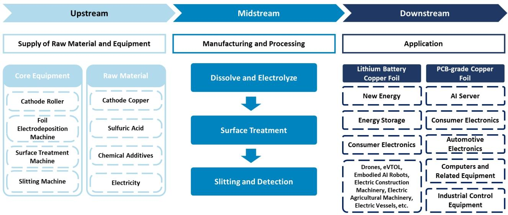
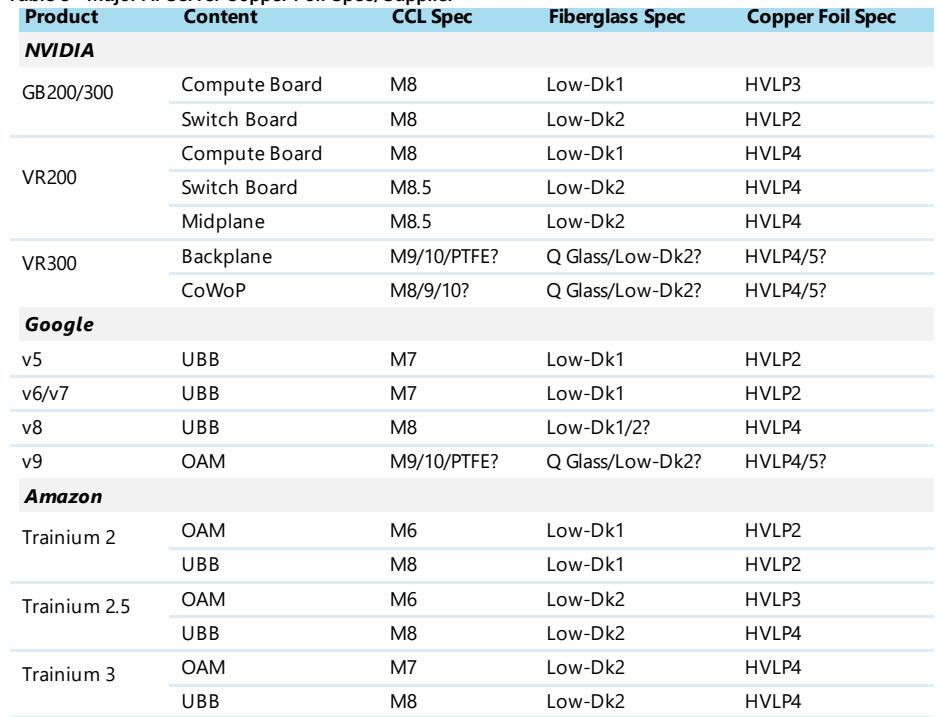
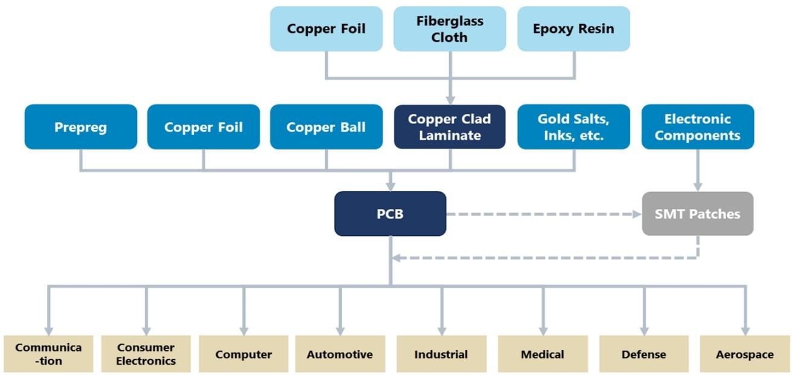

# AI铜箔的真正瓶颈不是产能，而是规格升级的速度

当市场把目光集中在AI芯片算力竞赛、服务器出货量、以及PCB和CCL的产能扩张时，一个上游材料的结构性变化正在悄然发生，而它可能成为未来2-3年AI基础设施供应链中最被低估的瓶颈。

某外资投行最新发布的PCB/CCL产业链更新报告，将焦点对准了电解铜箔——这个在CCL成本中占比约30%、在高端PCB成本中占比约5%的关键材料。报告的核心判断是：高速铜箔的需求正在从HVLP1/2/3向HVLP4加速迁移，叠加DTH（直接压合铜箔）的渗透率提升，铜箔行业的平均售价（ASP）正在经历非线性跃升，而供给缺口恰好为中国供应商打开了窗口期。

这不是一个简单的“量增”故事，而是一个“规格升级驱动价值重定价”的结构性变化。理解这一点，比跟踪下个月的出货量更重要。

## 1. AI基础设施的扩建正在将铜箔需求从“吨级”推向“万吨级”，但真正驱动价值的是规格跃迁

报告给出了一个清晰的量化框架：2025年全球AI CCL月需求约为180万张/月，对应HVLP铜箔需求约1.3千吨/月。到2030年，这两个数字将分别增长至超过900万张/月和6千吨/月，对应30-40%的年复合增长率。

这个数字本身已经足够有冲击力。但报告真正有价值的洞察在于：需求增长只是基础，规格升级才是价值放大器。

传统HTE铜箔（高温延伸铜箔）是典型的商品化产品，广泛应用于消费电子、汽车等中低端领域，单价低、竞争激烈。而HVLP铜箔，特别是HVLP4及以上规格，其单价可以达到HTE的10倍以上。DTH铜箔的单价甚至可以达到HVLP4的约2倍。

这意味着，即使出货量增长放缓，只要规格持续上移，整个铜箔市场的价值量增速将显著高于出货量增速。报告预计，主要AI玩家（包括NVIDIA、Google、Amazon）将在2026年下半年开始将新一代AI服务器的铜箔规格从HVLP1/2/3全面切换至HVLP4。这个时间节点，比很多人预期的要早。

## 2. 国际龙头的保守指引，可能为供需失衡埋下伏笔

报告指出了一个值得关注的反差：日本三井等国际铜箔龙头对HVLP销售增长的预期是2025-2030年复合增长率15-20%，而报告基于AI芯片出货量和CCL需求的测算，认为实际需求增速可能在30-40%之间。

这个差距意味着什么？如果国际供应商的产能扩张计划基于保守的需求假设，那么到2027年前后，市场可能面临3.5-4.0千吨/月的HVLP4等效需求缺口——这恰好是中国供应商可以填补的空间。

报告进一步拆解了供给端：如果只计算国际玩家的产能，2027年HVLP4等效供给约为2.4千吨/月，而需求将达到3.9千吨/月，缺口明显。但如果将中国供应商（如铜冠铜箔、德福科技）纳入计算，全球主要玩家的HVLP产能将从2025年的约2千吨/月增长至2027年的超过5千吨/月（其中HVLP4等效产能约3.5-4.0千吨/月），大致与需求匹配。

关键变量在于：中国供应商能否在HVLP4的产能爬坡中兑现承诺。这里仍需要持续跟踪验证。

## 3. 中国供应商正在从“替代者”转变为“结构性受益者”

报告对两家中国铜箔企业给出了具体分析：铜冠铜箔和德福科技。

铜冠铜箔的RTF/HVLP产品在2025年已经贡献了其大部分毛利润，这意味着它几乎已经成为一只直接的AI概念股。德福科技除了具备高速铜箔的生产能力外，还有一个积极的产能扩张计划——2027-2028年新增5万吨产能，重点投向RTF/HVLP产品线。

报告认为，中国供应商的优势不仅在于产能规模，更在于设备获取能力。高速铜箔生产的关键设备（如阴极辊、箔电积机、表面处理机）的供应链，中国厂商正在加速突破。这一点，可能比产能数字本身更值得关注。

此外，报告还提到了一个有趣的二阶效应：下游CCL龙头（如生益科技）正在主动多元化其上游供应来源，而中国铜箔供应商在产能扩张上比国际厂商更积极。这意味着，中国铜箔企业不仅在填补供给缺口，还在获得下游客户的结构性支持。

## 4. 报告尚未完全回答的关键问题：HVLP5的商用化节点和DTH的渗透率上限

报告在结尾处提到了一个前瞻性信息：HVLP5已经处于行业研发阶段，预计未来1-2年内具备商用化条件。但报告没有具体展开的是：HVLP5的商用化是否会加速HVLP4的降价？还是说，每一代新规格的出现都会拉高整个价格中枢？

另一个未被充分讨论的问题是DTH铜箔的渗透率上限。DTH主要用于内存和光模块，这两个市场虽然增速快，但绝对体量远小于AI服务器。DTH能否从利基市场走向主流，取决于光模块的升级节奏和内存接口的技术路线选择。

这些不确定性，恰恰是深度研究可以持续跟踪的方向。

## 5. 一个值得读者建立的观察框架：从“量”到“价”，再到“结构”

基于报告的推导逻辑，我们可以提炼出一个三层观察框架：

第一层，关注“量”——AI基础设施的资本开支计划、芯片出货量、CCL和PCB的月度需求。这是最基础的需求锚点。

第二层，关注“价”——HVLP4的定价趋势、DTH与HVLP4的价差变化、以及铜箔企业ASP的季度环比。如果ASP增速显著高于出货量增速，说明规格升级正在兑现价值。

第三层，关注“结构”——中国供应商在HVLP4和DTH领域的客户验证进度、产能爬坡节奏、以及设备供应链的国产化率。这是判断“供给缺口能否被填补”的关键变量。

这个框架的意义在于：它帮助读者从“铜箔行业好不好”的模糊判断，进化为“哪个环节、在什么时间点、出现什么样的结构性变化”的精准跟踪。

---

报告中关于HVLP5的商用化时间、DTH渗透率的拐点、以及中国供应商在HVLP4产能爬坡的具体节奏，仍有大量细节值得深入探讨。例如，HVLP4的生产良率如何影响实际有效产能？中国供应商的设备供应链是否已经足够成熟以支撑大规模量产？这些问题的答案，将直接影响我们对2027年供需平衡表的判断。

欢迎来星球微信群里继续讨论这些未解问题。我们对报告中的关键图表、产能假设和敏感性分析进行了深度拆解，并会在社群中持续更新产业链的第一手动态。

Personal reading notes and learning share only. Not investment advice.

