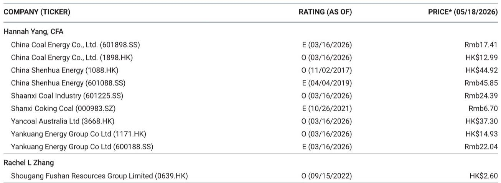
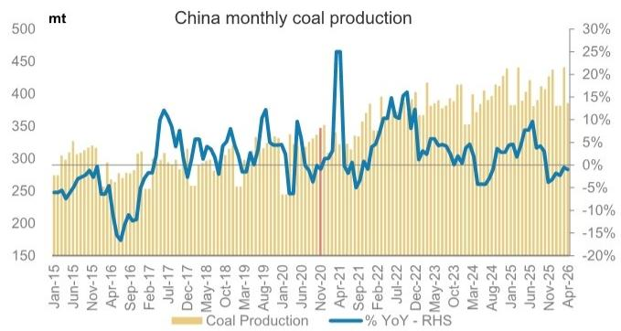
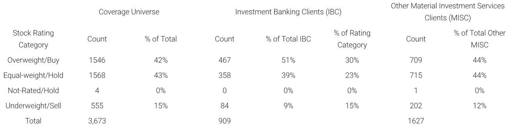

# 夏季用电高峰前，煤炭市场真正被低估的不是需求，而是供给侧的季节性收缩力度

过去几周，动力煤与焦煤价格同步出现周度环比上涨。秦皇岛港5500大卡动力煤价格已回升至715元/吨，山西大同5800大卡坑口价格单周上涨2.9%。这些数字本身并不惊人，但真正值得关注的，是它们背后一个容易被忽视的结构性信号：4月煤炭产量环比下降12.5%，同比也出现1%的负增长。这不是一个随机波动，而是冬季供暖季结束后，供给端系统性收缩的开始。

某外资投行最新发布的煤炭周报指出，当前煤炭库存处于近年同期低位，沿海与内陆主要电厂的库存水平较去年同期低0.5%至2.9%。在夏季降温需求即将到来的背景下，供给侧的收缩与库存的低位，正在为煤炭价格构筑一个比市场预期更坚实的底部。

市场对煤炭板块的讨论，往往聚焦于可再生能源替代和长期需求见顶。但这份报告揭示了一个更近期的矛盾：短期供需缺口可能比大多数投资者预期的更紧。本文将从产量季节性规律、库存结构、价格传导机制以及报告未完全展开的关键变量四个层面，拆解这一判断背后的逻辑。

## 1. 4月产量环比骤降12.5%，季节性是表层原因，深层是供给弹性正在收窄

4月中国煤炭产量降至3.86亿吨，环比下降12.5%，同比下降1%。从历史数据看，每年3月供暖季结束后，4月产量确实会出现季节性回落。但今年的环比降幅，需要放在更长的周期中评估。

报告提供的图表数据揭示了一个重要趋势：自2021年以来，中国月度煤炭产量从4.8亿吨的峰值区域逐步回落，至2025-2026年维持在4.2-4.5亿吨区间。这意味着，即便在旺季，供给端也未能回到2021年的高位。更关键的是，4月产量3.86亿吨的水平，已经低于2023年和2024年同期的产出。

这里需要回答一个“为什么”。供给弹性收窄的背后，是多重因素的叠加。安全监管的常态化、部分老旧矿井的资源枯竭，以及碳达峰背景下新增产能审批的放缓，都在共同压缩供给端的弹性空间。报告没有直接点名这些因素，但产量数据的持续偏低已经说明了一切。

对投资者的含义是：传统的“旺季增产、淡季减产”框架可能低估了供给端响应价格信号的能力下降。未来即便需求超预期，供给侧的制约也可能让价格弹性比过去更大。

## 2. 库存低位不是偶然，而是供给收缩与需求韧性共同作用的结果

报告披露的数据显示，截至5月14日，主要沿海和内陆电厂的煤炭库存较去年同期低0.5%至2.9%。这一差距看似不大，但考虑到去年同期的库存水平已经不算高，当前的库存紧张程度值得重视。

秦皇岛港库存目前为592万吨，同比下降15.1%。港口的低库存通常意味着贸易商和下游用户对后市价格预期存在分歧，或者补库意愿不足。但结合电厂库存同样处于低位这一事实，更合理的解释是：供给端的收缩已经实质性传导到了库存端。

这里有一个容易被忽略的细节。报告提到“尽管面临可再生能源的替代压力，季节性降温需求仍将推动火电发电量上升”。这句话的隐含意思是，即便光伏和风电在夏季出力增加，但空调负荷的尖峰特性决定了火电仍然是调峰的主力。只要火电发电量在夏季环比上升，煤炭的即时消费就会增加，而当前的库存水平意味着补库需求将更加刚性。

所以呢？库存低位叠加即将到来的补库周期，意味着未来两个月煤炭价格的下行风险有限，上行动能正在积聚。市场对夏季煤价的判断，可能低估了这一轮库存周期的强度。

## 3. 价格信号出现分化：国内坑口强于港口，港口强于海外

报告中的价格数据值得仔细拆解。秦皇岛港5500大卡价格周环比上涨0.3%，而山西大同5800大卡坑口价格周环比上涨2.9%。国内焦煤方面，柳林4号坑口价格周环比上涨2.9%，而FOR价格仅上涨1.9%。

这种价格梯度的含义是：上游生产端的价格涨幅明显大于中游港口和下游消费端。这通常意味着供给侧的收紧正在从源头传导，而下游的接受度还需要时间验证。如果未来几周港口和消费端价格开始追涨，则确认了这一轮价格上涨的可持续性。

与此同时，海外煤价出现分化。纽卡斯尔动力煤价格周环比下跌1.5%，昆士兰焦煤价格微跌0.4%。国内煤价强于海外，说明本轮价格上涨更多是内需和国内供给因素驱动，而非全球大宗商品的共振。这一点很重要：如果海外煤价持续走弱，可能会通过进口通道对国内价格形成一定压制。但报告没有详细讨论进口量的变化，这恰恰是后续需要跟踪的关键变量。

对读者的观察框架而言，未来几周需要重点关注两个信号：一是坑口与港口价差是否收窄，二是进口煤到岸价与国内煤价的比较。如果国内坑口价格持续强于港口，而进口煤不具备明显价格优势，那么国内煤价的上涨基础就比较扎实。

## 4. 报告尚未完全回答的关键问题：可再生能源出力与火电替代的边界在哪里

这份报告的核心逻辑建立在“夏季降温需求将推高火电发电量”这一假设上。但报告也承认，可再生能源的替代压力是存在的。问题在于，替代的边界在哪里？

2025年以来，中国光伏和风电装机持续快速增长。在夏季，光伏出力在白天达到峰值，而空调负荷的高峰往往出现在下午至晚间。这意味着，光伏无法完全覆盖晚间尖峰负荷，火电仍需要承担调峰角色。但具体到数字上，可再生能源的增量装机究竟能替代多少火电出力，报告没有给出定量测算。

这是一个关键的信息缺口。如果可再生能源在夏季的出力超出预期，火电的增量需求可能被压缩，煤炭的夏季行情就会打折扣。反之，如果可再生能源出力受天气条件影响不及预期，火电的压力将更大。

报告也没有讨论水电的出力情况。2025年水电来水情况偏枯，如果2026年夏季来水改善，水电的增量也会对火电形成替代。这些变量目前都存在不确定性，也是市场对煤炭板块定价分歧的来源。

## 5. 对决策者的观察框架：从三个维度跟踪夏季煤价的兑现路径

基于以上分析，可以建立一个简洁的跟踪框架，帮助判断这份报告的核心逻辑是否在兑现。

第一个维度是产量。每周跟踪煤炭产量数据，看4月的环比下降是季节性现象还是供给端系统性收紧的延续。如果5-6月产量恢复速度低于历史均值，则供给侧的支撑将进一步加强。

第二个维度是库存。重点关注沿海电厂库存的绝对水平和可用天数。如果库存持续低于去年同期，且可用天数下降，则补库需求将成为价格上行的直接推手。

第三个维度是价格结构。坑口价格、港口价格、进口价格三者之间的关系，可以反映供需紧张的真实程度。如果坑口价格持续领涨，且进口煤价差没有明显扩大，则上涨逻辑没有被破坏。

这三个维度都没有涉及长期需求见顶的宏大叙事，但恰恰是这些短期的高频信号，决定了未来一个季度煤炭板块的交易方向。

---

这份周报提供的数据点有限，但它揭示的供需矛盾是清晰的。真正的不确定性不在于夏季需求会不会来，而在于供给端能响应多少、可再生能源能替代多少。这些问题的答案，需要更细颗粒度的数据才能判断。

如果你也对煤炭产业链的供需缺口、库存周期的拐点判断，以及可再生能源替代的真实边界感兴趣，欢迎来我们的星球微信群里继续讨论。我们会围绕这份报告尚未完全展开的进口煤影响、水电来水预测、以及各煤种价差套利机会，做更深入的交流。

Personal reading notes and learning share only. Not investment advice.

