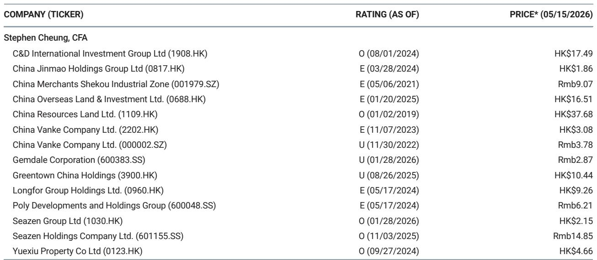
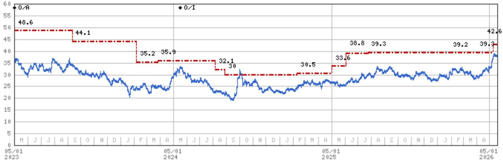
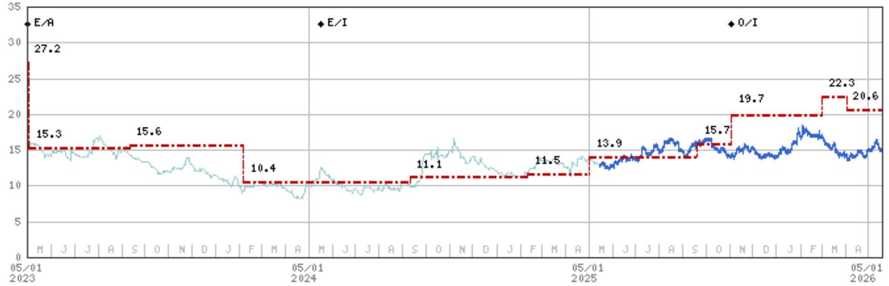

# China’s Property Rebound Is a Mirage of Base Effects, Not a Turning Point

The April home sales data from China’s National Bureau of Statistics show a softer year-on-year decline, but this is almost entirely a function of low base effects. In value terms, rebased national sales fell 7.6% year-on-year in April, compared to a 17% drop in March. In volume terms, the decline narrowed to 9.5% from 10%. These numbers have led some market participants to whisper about stabilization. That reading is premature and dangerous. The underlying structure of the market has not improved. Construction activity continues to weaken, new starts and completions are contracting at double-digit rates, and real estate investment has widened its decline to 13.7% year-on-year in the first four months of 2026. The recent strength in secondary home sales in select high-tier cities is already decelerating, and the divergence between city tiers is widening, not narrowing. Investors who interpret the April data as the beginning of a recovery are mistaking a statistical artifact for a fundamental shift. The durability of any sales rebound remains highly questionable, and the risk-reward for the sector as a whole tilts decisively toward the downside.

The critical question is not whether sales have stopped falling, but whether the drivers of the downturn have been addressed. They have not. Inventory remains high. Buyer sentiment is fragile. Resident income and leverage capacity have shown only limited improvement. The policy response has been piecemeal and city-level, with diminishing marginal effectiveness. The market is experiencing a managed descent, not a self-sustaining recovery. For serious investors, the implication is clear: this is a time for selectivity, not for broad-based positioning. The alpha lies in names with credible self-help stories, not in a bet on the sector as a whole.

## The Narrowing of Sales Declines Is a Statistical Mirage, Not a Signal of Recovery

The headline improvement in April sales data is real in a narrow accounting sense, but it is misleading as a directional signal. The year-on-year comparison benefits from an exceptionally weak April 2025, when sales were already depressed. The sequential month-on-month trend tells a more honest story: total sales value fell 36.8% from March to April, and total GFA sold dropped 44% over the same period. These are not the numbers of a market finding its footing. They are the numbers of a market that remains in a deep seasonal trough, with no organic demand catalyst in sight.

The residential segment, which is the core of the property market, shows the same pattern. Residential sales value declined 15.7% year-on-year in the first four months of 2026, and residential GFA sold fell 12.2%. April alone saw a 6.4% year-on-year decline in residential sales value, but a 33.7% month-on-month drop from March. The market is not healing; it is oscillating within a narrow band of weakness, with the occasional better-looking year-on-year print generated entirely by base effects.

The danger for investors is to extrapolate from these data points a narrative of stabilization. A more disciplined reading is that the rate of decline has moderated, but the level of activity remains profoundly below replacement demand. The market is not at a trough; it is in a low-level equilibrium that could persist for an extended period, punctuated by periodic downside surprises. The report’s own language is instructive: it describes the sales decline as “softer,” not “recovering.” That distinction matters.

## Construction Activity Is Deteriorating, and Developer Behavior Remains Deeply Defensive

While the sales side has attracted most of the attention, the supply side of the market is in worse shape. Completions fell 19% year-on-year in March, and new starts dropped 27%. These are not isolated monthly fluctuations. They are consistent with a developer community that has fundamentally changed its capital allocation behavior. Landbanking has become a low priority. Developers are conserving cash, reducing construction pipelines, and focusing on debt reduction rather than growth. The widening of real estate investment decline to 13.7% year-on-year in the first four months of 2026, from 11.2% in the first three months, confirms that this trend is accelerating, not stabilizing.

The implication for the broader economy is significant. Real estate investment is a direct driver of GDP, employment, and local government revenue. A sustained contraction of this magnitude means that the property sector will continue to be a drag on economic growth, not a contributor. For investors in property stocks, the supply-side weakness means that even if demand were to recover, the capacity to respond would be limited. Developers have not been building inventory for a rebound; they have been shrinking their footprint.

This defensive posture is rational given the uncertain sales outlook, but it creates a self-reinforcing cycle. Weak construction leads to fewer new units coming to market, which in theory could support prices. But in practice, the inventory overhang from previous cycles is still being absorbed, and the reduction in new supply is not enough to offset the demand deficit. The market is caught between a supply side that is contracting and a demand side that is not recovering. That is not a recipe for a turning point.

## Secondary Market Strength Is Narrow and Already Fading, Revealing a Fragile Demand Base

One of the more intriguing data points in the report is the relative strength of secondary home sales in select high-tier cities. In March, Tier-1 cities saw primary home prices rise 0.1% month-on-month and secondary prices rise 0.4%, compared to the national average decline of 0.2% in both segments. This has led some observers to argue that the premium segment of the market is finding a floor. But the report itself cautions that this strength is already decelerating in the latest weeks of May. The sustainability of the rebound is in question.

The divergence between city tiers is also widening. While Tier-1 secondary markets have shown some resilience, select Tier-2 and lower-tier cities continue to see rising listing volumes and falling listing prices. This is not a uniform recovery; it is a bifurcation. The demand that exists is concentrated in a small number of cities with strong economic fundamentals and population inflows. The vast majority of the market remains under pressure.

The fragility of buyer sentiment is a critical constraint. The report references the diminishing effect of recent city-level policies, which suggests that the policy toolkit is becoming less effective with each iteration. Buyers have seen multiple rounds of easing measures, and each round has had a smaller impact on behavior. The underlying issue is not a lack of policy support; it is a lack of confidence in future income and asset values. Until that confidence returns, any demand burst will be temporary and localized.

## The Report’s Framework Points to a Diverging Market, Not a Converging One

The most analytically useful part of the report is its emphasis on differentiation. The industry view is rated “In-Line,” but the stock recommendations are far from uniform. The report favors “strong mall operators with C-REIT potential” and “residential consolidators with visible path to margin and earnings recovery.” These are not broad sector bets. They are specific, thesis-driven selections that rely on company-specific catalysts, not on macro recovery.

The report’s valuation methodology reinforces this point. The discounts applied to net asset value range from 30% to 45%, depending on a developer scorecard that includes landbank quality, execution, scale, growth, profitability, financing, and leverage. This is not a market where all boats rise together. The dispersion of outcomes is wide, and the winners will be those with strong balance sheets, high-quality recurring income, and the ability to execute in a difficult environment.

For investors, the framework implies a clear decision rule: do not buy the sector; buy the stock. The sector-level risk-reward is tilted to the downside, as the report states explicitly. The alpha is in names that can outperform regardless of the macro environment. This is a stock-picker’s market, and the criteria for selection are rigorous.

## What the Report Does Not Fully Answer: The Policy Endgame and the Role of State Intervention

The report is admirably clear on what it knows: the data, the trends, and the stock-level implications. But it leaves several important questions unanswered, and these are the questions that should occupy the attention of serious investors.

First, what is the policy endgame? The report notes the diminishing effect of city-level policies, but it does not address whether national-level measures are forthcoming or what form they might take. The Chinese government has shown a willingness to intervene in the property market, but the scale and nature of future intervention remain uncertain. Would the government allow a controlled default cycle in weaker developers? Would it step in to support demand directly through fiscal transfers or mortgage rate cuts? The report does not speculate, and for good reason, but these are the questions that will determine the medium-term trajectory of the market.

Second, how will the C-REIT market evolve? The report identifies C-REIT potential as a catalyst for mall operators, but the depth and liquidity of the C-REIT market are still being established. Will there be sufficient investor demand to absorb the supply of new REIT listings? Will the regulatory framework support the kind of growth that the report envisions? These are open questions that could significantly affect the valuation of names like CR Land and Seazen.

Third, what is the path to margin recovery for residential consolidators? The report favors names with a “visible path” to margin and earnings recovery, but it does not detail what that path looks like. Is it driven by cost reduction, price stabilization, or a shift in product mix? The answer is likely a combination of all three, but the timing and magnitude are uncertain.

These are not criticisms of the report. They are the natural boundaries of any analytical exercise. The report provides a rigorous framework for thinking about the market; it does not pretend to have all the answers. For investors who want to go deeper, the unresolved questions are the most valuable part of the analysis.

## A Decision Framework for Navigating the Diverging Market

For investors who accept the report’s thesis that the market is not recovering but diverging, the next step is to build a decision framework. The report provides the raw materials for such a framework, but it is worth making it explicit.

The first dimension is balance sheet strength. Developers with high leverage and weak financing profiles are unlikely to survive the extended downturn. The report’s developer scorecard includes financing and leverage as key criteria, and investors should apply the same logic. Cash flow, debt maturity profiles, and access to capital markets are the primary filters.

The second dimension is recurring income. Developers with large and well-located investment properties, particularly malls, have a buffer that pure-play residential developers do not. The C-REIT angle adds an additional catalyst. The report’s preference for CR Land and Seazen reflects this logic.

The third dimension is market positioning. Developers focused on high-tier cities with strong economic fundamentals are better positioned than those with exposure to lower-tier markets. The divergence between city tiers is likely to persist, and investors should align their exposure accordingly.

The fourth dimension is execution credibility. The report emphasizes “credible self-help stories,” which means management teams that have demonstrated the ability to navigate the downturn, reduce costs, and maintain or improve margins. Track record matters.

Applying this framework leads to a portfolio that is concentrated, not diversified. The report’s own recommendations are a good starting point, but investors should conduct their own due diligence on each name, using the report’s scorecard as a guide.

## Why the Full Report Matters for Your Investment Process

The analysis above is based on a parsing of a detailed research report, but the full report contains nuances, charts, and data that cannot be fully captured in a summary. The exhibits on NBS property data, the detailed valuation methodologies for each stock, and the risk analysis for upside and downside scenarios are all essential for making informed decisions. The report also includes the analyst’s certification and disclosures, which are critical for understanding potential conflicts of interest.

For investors who want to build a rigorous, research-driven approach to China property, the full report is the foundation. The charts alone are worth the time, as they show the trend lines, the base effects, and the divergence between segments in a way that text cannot.

Join the community to read the full report and review the original charts.

*This article is for learning and discussion only and does not constitute investment advice.*

Personal reading notes and learning share only. Not investment advice.

