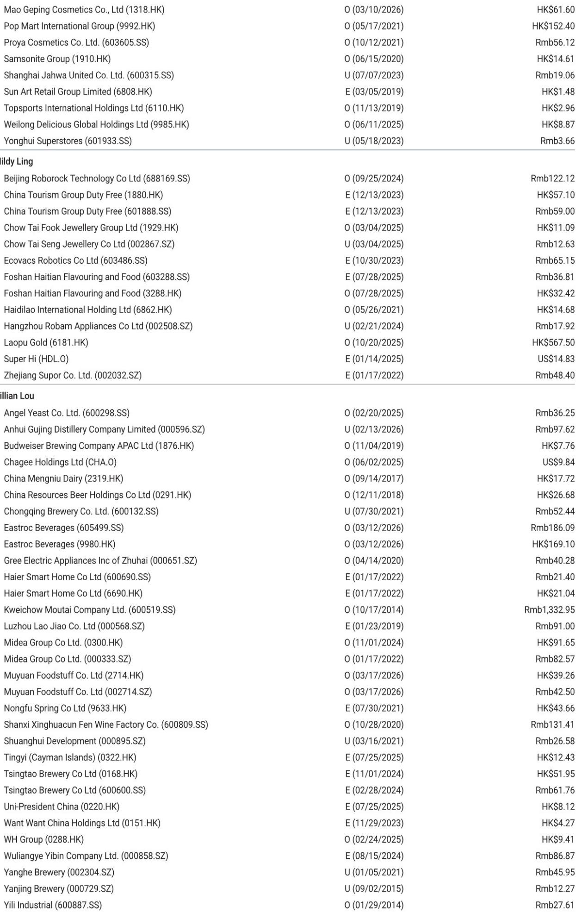
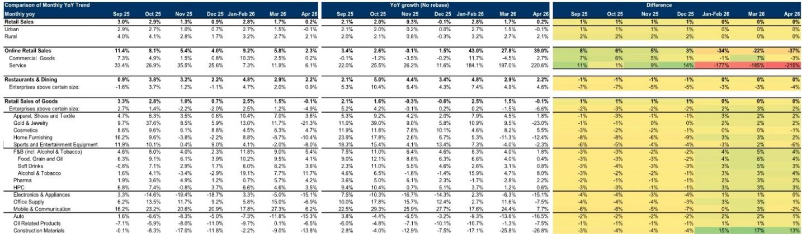
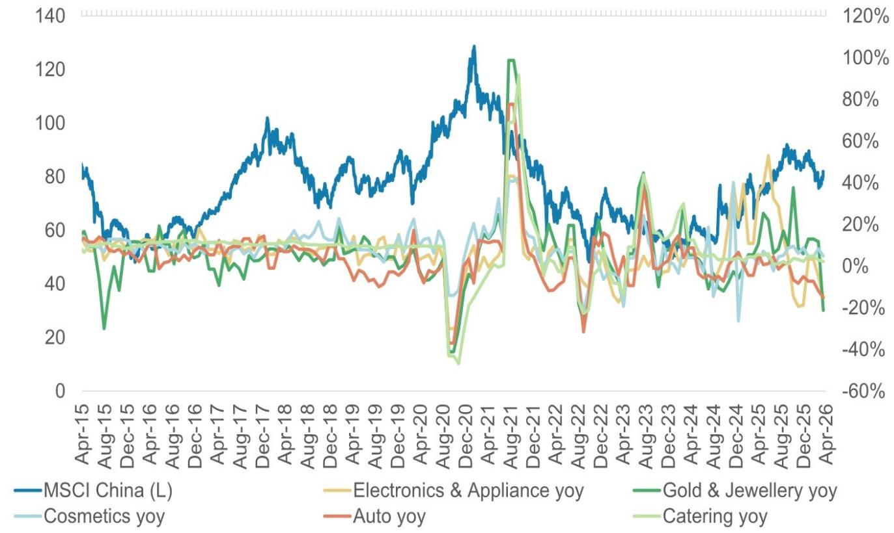

# China’s April Retail Data Confirms That the Consumer Recovery Is Not Broadening—It Is Narrowing

China’s April retail sales rose just 0.2% year-over-year, missing the 2% consensus and decelerating sharply from March’s 1.7% growth. On a compound annual growth rate basis versus 2019, momentum softened from 4.0% to 2.9% in a single month. This is not a temporary soft patch. It is evidence that the post-pandemic consumption recovery is becoming more concentrated in fewer categories, more dependent on policy support, and more vulnerable to price shocks. The headline slowdown masks a deeper structural shift: discretionary spending is contracting, subsidy-dependent categories are fading, and the only resilient pockets are in necessities and select experiential services. For investors, the April data demands a fundamental reassessment of which consumer segments can sustain growth without artificial stimulus.

The significance of this report extends beyond a single month’s miss. April represents the first full month after the expiration of major trade-in subsidy programs for appliances and electronics. The data now provides a clean read on organic demand beneath the policy layer. What emerges is troubling: retail sales of goods turned negative for the first time since the pandemic, falling 0.1% year-over-year. Online sales growth halved from March’s 5.8% to just 2.3%. The consumer is not merely cautious—the consumer is actively retrenching in categories that require discretionary outlays.

This article interprets the April retail sales report through a strategic lens. It identifies the forces driving the divergence between resilient staples and collapsing discretionary categories, explains why the subsidy hangover is more serious than markets assume, and provides a framework for positioning portfolios in a consumer environment that is not recovering—it is re-sorting.

## The Collapse in Gold and Jewelry Reveals a Consumer That Has Become Hyper-Sensitive to Price, Not Just Income

Gold and jewelry sales recorded a stunning reversal, plunging 21.3% year-over-year in April after growing 11.7% in March. This is not a demand problem—it is a price shock problem. Gold prices have moved sharply higher, and Chinese consumers, who typically view gold jewelry as both adornment and store of value, are balking at current levels. The volatility in this category matters beyond its direct weight in retail sales because gold jewelry functions as a leading indicator for consumer psychology. When consumers stop buying gold despite rising incomes, it signals that the price-value equation has broken. They are waiting for a pullback. They are not chasing.

This behavior has second-order implications for how we interpret other discretionary categories. If consumers are price-sensitive enough to abandon gold—a category with cultural and financial utility—then categories with weaker emotional attachment, such as electronics, home furnishings, and sports equipment, face even greater headwinds. The April data confirms this: electronics and appliances fell 15.1% year-over-year, home furnishings dropped 10.4%, and sports equipment declined 8.0%. These are not isolated incidents. They form a pattern of broad-based discretionary retreat.

The strategic question is whether this price sensitivity is temporary or structural. If gold prices stabilize, jewelry sales should recover some ground. But the broader lesson is that Chinese consumers have recalibrated their willingness to pay. They are not spending more just because they can. They are spending only when they perceive genuine value. This is a more frugal consumer than the market has priced into consumer equity valuations.

## The Subsidy Hangover Is Real and Will Not Be Quickly Reversed by Policy Tinkering

The most concerning trend in the April data is the sharp deceleration in categories that had benefited from government trade-in subsidies. Electronics and appliances, which had been boosted by replacement programs, saw growth collapse from -5.0% in March to -15.1% in April. This is not a one-month anomaly. The sequential deterioration has been accelerating: December 2025 recorded -18.7%, January-February 2026 rebounded to 3.3% on subsidy timing, and now the post-subsidy drop has resumed.

This pattern tells us that the subsidies pulled forward demand without creating new demand. Consumers who were planning to replace appliances did so earlier, and the pipeline of future buyers is now depleted. The same dynamic is visible in autos, which fell 15.3% year-over-year in April, extending a decline that has now lasted six consecutive months. Auto subsidies and trade-in programs have run their course. The organic replacement cycle is not strong enough to sustain positive growth.

For investors, the implication is clear: do not expect a repeat of subsidy-driven boosts in the near term. The government may announce new programs, but the marginal impact will diminish with each round. Consumers have already demonstrated that they will time their purchases around subsidies, not increase their total spending. The policy tool is losing effectiveness. Companies that have relied on subsidy tailwinds for revenue growth need to demonstrate that they can generate organic demand. The April data suggests most cannot.

## Restaurants and Dining Are the Only Category Showing Genuine, If Modest, Improvement

Against the broad-based deterioration, one category stands out: restaurants and dining grew 2.2% year-over-year in April, down from 2.9% in March but still positive. More importantly, on a CAGR basis versus 2019, restaurant spending improved to 3.8% from 3.6% in March. This is the only category where the trend versus the pre-pandemic baseline is actually accelerating.

This divergence matters because dining out is a discretionary activity with high income elasticity. If consumers were truly in a recessionary mindset, restaurant spending would be among the first to fall. The fact that it is holding up suggests that the consumer is not uniformly weak. Rather, the weakness is concentrated in goods purchases, particularly big-ticket and discretionary items. Services consumption, especially experiential categories like dining, continues to benefit from a post-pandemic normalization of social behavior.

The strategic implication is that exposure to offline consumption channels and service-oriented business models may offer better risk-reward than goods-oriented retail. Companies with strong dine-in formats, franchise networks, and value positioning are better insulated from the goods recession. The report highlights Yum China, Haidilao, and China Resources Beer as potential beneficiaries. These companies benefit from a consumer that is still willing to spend on experiences, even while pulling back on stuff.

## What the Report Does Not Fully Answer: The Role of Income Expectations and Wealth Effects

The April retail sales report provides granular data on what consumers are buying, but it is silent on why they are buying less. The most important unanswered question is whether the spending slowdown is driven by income constraints, wealth effects, or a shift in sentiment. The report references a consumer survey showing that sentiment has mildly improved, but that improvement is not translating into spending. This disconnect is the central puzzle.

One plausible explanation is that Chinese consumers are experiencing a negative wealth effect from the property market. Home prices in many cities remain under pressure, and households that feel poorer on paper are reducing discretionary spending to rebuild savings. The weakness in home furnishings and construction materials—down 10.4% and 13.8% respectively—is consistent with this narrative. If property values stabilize, the wealth effect could reverse and lift discretionary spending. But if property continues to decline, the consumer retrenchment could deepen.

Another open question is the trajectory of labor income. The report does not provide data on wages or employment. If the labor market is softening, the current spending slowdown could be the beginning of a longer adjustment. Investors need to watch employment data and household income surveys closely. The retail sales data alone cannot distinguish between a temporary pullback and a structural shift in consumer behavior.

## A Decision Framework for Positioning in a Narrowing Consumer Recovery

The April data provides a clear framework for portfolio allocation in China consumer equities. The framework has three dimensions: category resilience, pricing power, and balance sheet strength.

First, focus on categories with low discretionary content. Staples such as food, grain and oil, beverages, and household personal care products continue to show positive growth, albeit at decelerating rates. These categories benefit from inelastic demand and are less exposed to the subsidy hangover. Within staples, companies with strong brand equity and distribution networks are best positioned. The report identifies Mengniu and Yili in dairy, and China Resources Beer in beverages, as preferred exposures.

Second, prioritize companies with pricing power. The gold and jewelry collapse demonstrates that consumers will walk away from categories where prices have risen too fast. Companies that can maintain or grow volumes without aggressive price increases are rare. In the current environment, value-oriented dining concepts and mass-market beverage brands have greater pricing flexibility than premium discretionary goods.

Third, favor companies with strong balance sheets and the ability to invest through the cycle. The consumer recovery will be gradual and bumpy, as the report notes. Companies with high debt levels or weak cash flow will struggle if the slowdown persists. Companies with healthy balance sheets can gain market share by outspending competitors on marketing, store expansion, and product innovation during the downturn.

The report also highlights company-specific turnaround stories, such as Giant Biogene, where idiosyncratic drivers may offer attractive risk-reward independent of the macro environment. These names require deeper due diligence but can provide alpha in a market where beta is unreliable.

## The Full Report Contains the Charts and Data That Make These Trends Visible

The analysis in this article is based on the April retail sales report and its supporting exhibits. The full report includes detailed charts showing the breakdown of retail sales by category, the comparison of reported growth versus growth without rebasing adjustments, and the historical relationship between MSCI China and retail sales trends. These charts are essential for understanding the magnitude of the deceleration and the divergence between categories. They also reveal the rebasing adjustments that can distort the reported numbers, a nuance that matters for anyone making investment decisions based on month-over-month comparisons.

Join the community to read the full report and review the original charts.

*This article is for learning and discussion only and does not constitute investment advice.*

Personal reading notes and learning share only. Not investment advice.

