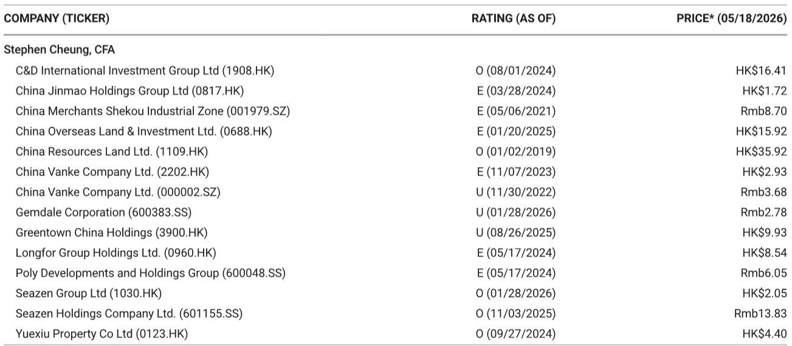
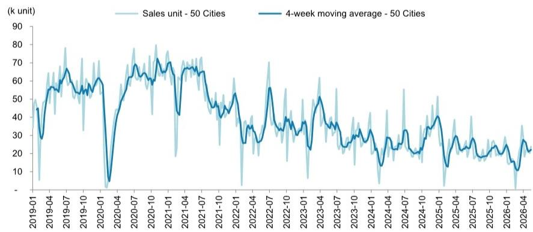
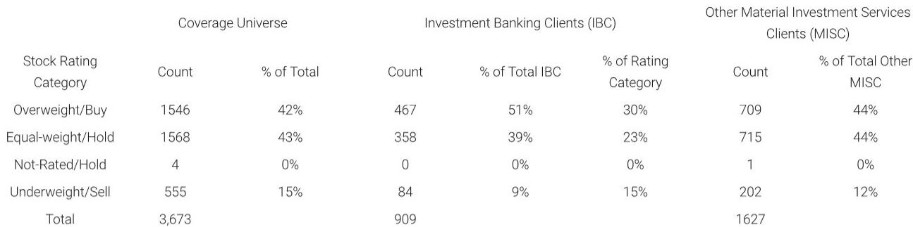

# 中国房地产的真正拐点，可能已经出现在二手房市场

过去两年，市场一直在争论中国房地产的底部在哪里。大多数讨论围绕新房销售何时企稳、开发商债务如何化解、政策何时真正见效展开。这些议题当然重要，但某外资投行最新一期周度数据库追踪报告提供了一个容易被忽视却更具前瞻性的信号：**二手房市场的交易量正在以远超新房的速度恢复，而这一结构性分化，可能才是理解行业下一步走向的关键。**

截至5月17日当周，该机构追踪的50城新房周度注册成交量同比增长5%，较前一周的-3%明显改善。但更值得关注的是10城二手房周度注册成交量同比飙升49%，远高于前一周的17%增速。一线城市二手房成交量同比大增65%，二线城市也达到40%。

新房市场在政策刺激下终于转正，这符合预期。但二手房市场的弹性远超新房，且这一趋势正在加速。这意味着什么？**市场的定价权正在从开发商向存量房业主转移，行业的价值创造逻辑正在被重写。**

## 1. 二手房成交量的爆发不是短期脉冲，而是结构性的需求迁移

周度数据容易被视为噪音，但把时间拉长到年初至今，这一趋势更加清晰。50城新房年初至今累计成交量仍同比下降15%，而10城二手房累计成交量已同比转正至+3%。新房仍在去库存的泥潭中挣扎，二手房却已经站上同比正增长的地板。

这不仅仅是基数效应的结果。从周度环比看，二手房成交量增速从前一周的17%跳升至49%，而新房仅从-3%改善至5%。二手房市场的边际改善斜率明显更陡峭。

更深层的原因是：购房者的偏好正在发生不可逆的转变。过去几年新房交付风险、质量不确定性、以及开发商信用问题，让越来越多的购房者转向二手房市场。二手房“所见即所得”的优势在风险厌恶周期中被放大。这不是一个短期现象，而是住房消费从“买期房”向“买现房”的长期迁移。

**对行业的影响是：开发商的新房销售恢复速度将长期慢于二手房，这意味着开发商的现金流改善节奏会比市场预期的更慢。**

## 2. 一线城市的二手房市场正在成为价格锚定的新基准

从城市能级看，分化进一步加剧。一线城市二手房成交量同比大增65%，远超二线城市的40%和三线城市的1%。而在新房市场，一线城市同比仅增5%，二线6%，三线1%。

一线城市二手房市场已经成为整个板块的“温度计”。当一线城市二手房成交量以65%的速度扩张时，它释放的信号不只是需求回暖，更是价格预期的企稳。该机构追踪的中原6城二手房挂牌价格指数显示，当前报价折让幅度为18.5%，较前一周的19.4%有所收窄。报价折让正在缩小，意味着卖方信心在恢复。

**这意味着：一线城市二手房价格正在寻找底部。如果这一趋势持续，它将为全国房价预期提供一个锚点。但需要注意的是，报价折让仍处于18.5%的高位，距离历史正常水平仍有距离，价格企稳不等于价格反弹。**

## 3. 新房市场的“转正”含金量需要谨慎评估

新房周度成交量同比转正至5%，看起来是积极信号。但仔细拆解，这一改善的可持续性存在疑问。

首先，年初至今累计仍为-15%，说明前几个月的疲弱没有被完全弥补。其次，三线城市新房成交量同比仅增1%，几乎等于零增长。这意味着本轮新房复苏是高度分化的——集中在少数核心城市，而非全面回暖。

更重要的是，报告提到“上周没有监测到新开盘项目”。新盘供应空白意味着当前新房成交量的改善更多来自存量库存的去化，而非新增供应的拉动。如果供应端不能跟上，新房成交量的进一步扩大将面临天花板。

**关键问题是：新房市场的改善是需求拉动，还是供应收缩下的被动出清？如果是后者，开发商的收入改善将远慢于成交量的改善。**

## 4. 报告尚未完全回答的核心问题：成交量改善能否转化为价格企稳

这是目前市场最关心的命题，也是这份周度报告无法直接回答的。成交量改善是价格企稳的必要条件，但不是充分条件。

二手房成交量大幅增长，但报价折让仍高达18.5%。这意味着成交量的扩大是以价换量的结果。卖方为了成交，仍然需要给出接近两成的折价。当成交量继续放量，折价幅度能否收窄到10%以内，才是真正意义上的价格企稳。

新房市场同样面临这个问题。开发商在现金流压力下，仍然有强烈的降价促销动机。即使成交量改善，如果售价继续下行，开发商的利润率将进一步压缩，行业的资产负债表修复将更加漫长。

**这里仍需验证：成交量的改善斜率是否足够陡峭，以至于能够扭转卖方的折价预期。如果未来4-8周内，报价折让指数不能持续收窄，那么当前成交量的改善可能只是“以价换量”的延续，而非真正的市场底部。**

## 5. 投资者的观察框架应该从“何时见底”切换到“分化如何定价”

基于以上分析，市场对房地产板块的定价逻辑需要调整。过去两年，投资者主要关注三个问题：政策何时放松、销售何时见底、开发商何时出清。这些问题的答案仍然重要，但已经不足以指导当前的资产配置。

新的观察框架应该围绕三个维度展开：

第一，二手房对一手房的替代效应。如果二手房成交量持续领先新房，那么开发商的估值修复空间将受到结构性压制。二手房经纪平台、物业管理公司的价值反而可能被低估。

第二，城市能级的分化程度。一线城市二手房成交量增速是二线的1.6倍，是三线的65倍。投资组合的行业敞口应该向聚焦核心城市的公司倾斜，而不是押注行业整体反弹。

第三，价格折让的收窄速度。这是判断成交量改善是否可持续的核心指标。如果中原报价折让指数在未来一个月内从18.5%降至15%以下，那么价格企稳的确定性将大幅提升。

**最终的含义是：中国房地产板块的投资机会不再是“买整个行业反弹”，而是“买结构性受益者”。那些在核心城市拥有优质二手房库存的物业持有方、以及能够适应存量房交易趋势的服务平台，可能比开发商本身更具投资价值。**

---

这份周度数据库报告提供了宝贵的高频数据，但它也留下了一些尚未回答的问题：报价折让的收窄能否持续？新盘供应何时恢复？开发商的降价促销策略会如何影响成交量的质量？这些问题的答案，需要结合更完整的月度数据、公司层面的财务指标以及政策走向才能得出。

欢迎来星球微信群里继续讨论。我们会在社群中分享完整报告的原始数据表格和图表，并围绕上述未解问题展开更深入的推演。如果你对二手房市场的定价机制、城市分化的量化框架，或者具体公司的估值修复路径感兴趣，社群里会有更细致的讨论。

Personal reading notes and learning share only. Not investment advice.

