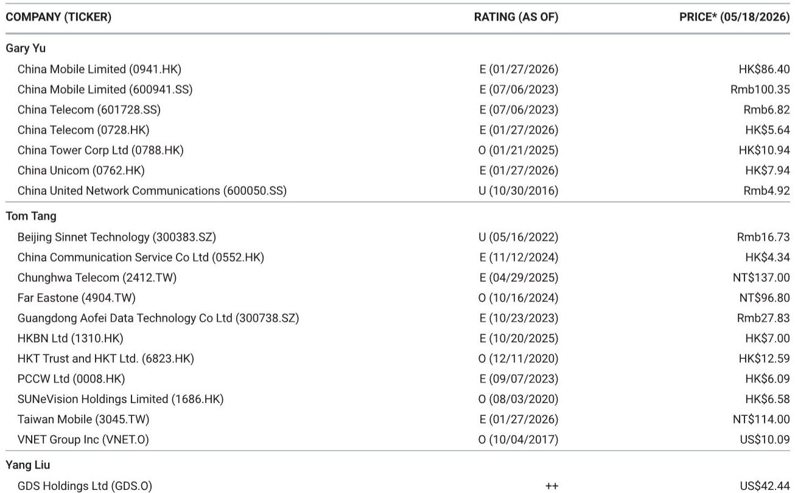
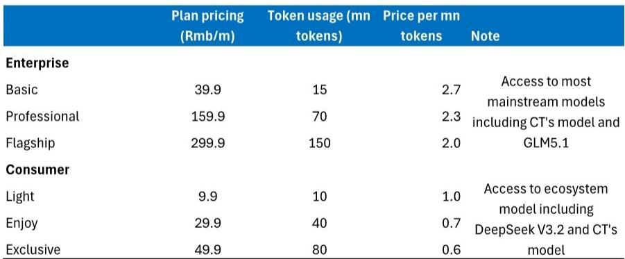
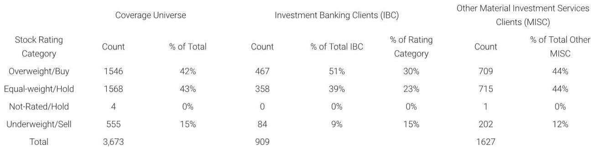

# China Telecom's Token Plans Are Not Just a Pricing Experiment — They Are a Strategic Bet on Becoming the AI Access Layer

The Chinese telecommunications industry has reached a structural inflection point. Mobile data penetration is near saturation, average revenue per user continues to compress, and the era of selling connectivity as a commodity is yielding diminishing returns. Against this backdrop, China Telecom's launch of national-scale token plans for both enterprise and consumer segments represents far more than an incremental pricing innovation. It is a deliberate strategic move to reposition the telco as the access gateway to artificial intelligence.

China Telecom is now selling tokens rather than gigabytes. At first glance, this appears to be a simple bundling exercise — package AI model inference into monthly subscriptions and charge by token consumption. But the implications are deeper. By standardizing pricing across multiple AI models at a uniform token rate, China Telecom is attempting to commoditize AI access in the same way it once commoditized voice and data. The question is whether this strategy can succeed where previous telco forays into digital services have faltered, and whether it can generate the revenue growth that the market has been waiting for.

The timing matters. China Mobile and China Unicom have already tested similar products at the provincial level, but China Telecom is the first to go national. This first-mover advantage in scale could prove decisive if the market for AI inference services takes off. However, the report also signals caution: consumer adoption will depend on the emergence of killer AI applications, and enterprise uptake will hinge on service capability, model-as-a-service unit economics, and proprietary model differentiation. The token plan is a necessary condition for capturing AI revenue, but it is not sufficient.

This article unpacks what the token plan really means, where the value lies, and what remains unresolved. It is not a summary of the report. It is an argument about the strategic logic and the open questions that investors and operators alike must confront.

## The Token Plan Redefines the Telco's Role from Pipe to Platform, but the Economics Depend on Utilization Rates

The core innovation in China Telecom's token plan is not the pricing per token — it is the pricing architecture. For enterprises, the cost ranges from RMB 2.0 to RMB 2.7 per million tokens, depending on the tier. For consumers, the range is RMB 0.6 to RMB 1.0 per million tokens. These are not dramatically low prices compared to what hyperscalers like Alibaba Cloud charge, but the structural difference is significant.

Hyperscalers typically price token plans on a per-seat, per-month basis with variable credit consumption depending on the underlying model. A more powerful model consumes more credits per query, which means the effective cost to the user is opaque and unpredictable. China Telecom's plan prices all models at the same token rate. This is a deliberate simplification. It makes the product easy to understand, easy to compare, and easy to budget. It also positions the telco as an aggregator rather than a model provider — a neutral access layer that does not favor one model over another.

The strategic logic is clear. If AI inference becomes a utility-like service, the telco that controls the access layer could capture a share of the value that currently flows to cloud providers and model developers. This is analogous to how telcos once hoped to capture value from over-the-top services by offering zero-rating or bundled data plans. The difference is that token plans are not about data volume — they are about compute consumption. The telco is selling the right to use AI models, not the right to transport bits.

But the economics are not yet proven. The prices quoted in the plan assume full usage of the token allowance. In practice, users may not consume their full allocation. If utilization is low, the effective price per token rises, and the value proposition weakens. For enterprises, the key question is whether the token plan is cheaper than running inference on their own infrastructure or through a cloud provider. For consumers, the question is whether the plan offers enough utility to justify a monthly subscription in the absence of a compelling AI application that requires frequent use.

The report's data suggests that the enterprise plans are priced at a premium to what a hyperscaler might charge for equivalent consumption, but the simplicity and the bundling with network services could offset that premium. This is a classic telco play: leverage the existing customer relationship and billing infrastructure to offer a product that is convenient even if not cheapest. The question is whether convenience is enough to drive adoption in a market where users are increasingly price-sensitive and where cloud providers have deep relationships with enterprise IT departments.

## The Consumer Segment Faces a Chicken-and-Egg Problem That the Token Plan Alone Cannot Solve

The consumer token plans are priced aggressively. At RMB 9.9 per month for 10 million tokens, the cost per million tokens is RMB 1.0. At the top tier of RMB 49.9 for 80 million tokens, the cost drops to RMB 0.6 per million tokens. These prices are lower than the enterprise tier, which makes sense given that consumer usage patterns are likely to be lighter and less predictable.

But the consumer market for AI inference is not yet mature. The report explicitly states that consumer adoption will depend on the emergence of AI applications. This is a critical caveat. Without a clear use case that drives daily or weekly engagement, a token plan is a solution in search of a problem. Consumers are not yet accustomed to paying for AI access as a separate subscription. They may use free tiers of ChatGPT or DeepSeek, but they are unlikely to pay a telco for a token bundle unless there is a specific application that requires it.

China Telecom's strategy appears to be a bet on the future. By launching the plan now, the company is establishing the billing infrastructure and customer habits before the applications arrive. This is a sensible long-term play, but it carries near-term risk. If the killer AI application does not materialize within the next 12 to 18 months, the token plans may languish with low uptake, and the telco will have invested in a product that generates negligible revenue.

There is also a question of competition from device-level AI. As smartphone manufacturers integrate more AI capabilities directly into the operating system, the need for cloud-based inference may diminish for certain tasks. If a user can run a small language model locally on their phone, they may not need a token plan at all. This is a structural risk that the report does not fully address, but it is one that investors should consider.

The consumer token plan is a hedge, not a home run. It positions China Telecom to capture value if the market develops, but it does not create the market. The telco is dependent on third-party developers and ecosystem partners to drive demand. That dependency is a vulnerability.

## The Enterprise Segment Is More Promising, but the Real Competition Is Not Other Telcos — It Is the Hyperscalers

For enterprises, the token plan offers a different value proposition. Companies that are experimenting with AI-powered customer service, content generation, or data analysis need a reliable and predictable way to access multiple models. China Telecom's plan provides that predictability, with a flat token price regardless of which model is used.

The enterprise plans also benefit from China Telecom's existing relationships with corporate customers. Many enterprises already buy network services, cloud connectivity, and data center capacity from China Telecom. Adding a token plan to the existing contract is a low-friction upsell. The billing is familiar, the support is integrated, and the telco can offer a single vendor relationship rather than forcing the enterprise to manage separate contracts with a cloud provider.

But the hyperscalers are not standing still. Alibaba Cloud, Tencent Cloud, and Huawei Cloud all offer AI inference services with more granular pricing, more model choices, and deeper integration with their broader cloud ecosystems. For an enterprise that is already using Alibaba Cloud for storage, compute, and database services, adding AI inference from the same provider is more convenient than adding a separate token plan from China Telecom.

The report notes that China Telecom's token plan provides access to "most mainstream models" including its own model and GLM5.1, while the consumer plan includes ecosystem models such as DeepSeek V3.2. This is a reasonable lineup, but it is not differentiated. The hyperscalers offer access to the same models, often with better latency and more customization options.

The enterprise race, as the report states, will depend on service capability, model-as-a-service unit metrics, and proprietary models. China Telecom has an advantage in network infrastructure and existing customer relationships, but it lacks the software ecosystem and developer tools that the hyperscalers offer. The token plan is a good product, but it is not a moat.

## What the Report Does Not Fully Answer: The Unit Economics of Token Plans and the Path to Profitability

The report provides the pricing tiers and the cost per million tokens, but it does not disclose China Telecom's cost structure for delivering token-based inference. This is a critical missing piece. Without understanding the telco's cost per token, it is impossible to assess whether the token plans are profitable or merely a break-even exercise designed to retain customers.

If China Telecom is running inference on its own computing infrastructure, the cost structure depends on GPU utilization, energy costs, and model efficiency. If the telco is reselling inference from a third-party provider, the margins may be thin. The report does not specify which model is being used.

There is also no discussion of the expected adoption rate. The report notes that China Mobile and China Unicom have launched similar products at the provincial level, but it does not provide data on uptake. Without that baseline, it is difficult to project how quickly China Telecom's national plan will scale.

Another open question is the impact on the telco's core business. If token plans cannibalize existing data plan revenue, the net benefit may be smaller than it appears. Conversely, if token plans drive incremental data usage, they could boost overall revenue per user. The report does not model these dynamics.

Finally, there is the question of regulatory risk. If token plans are classified as a form of telecommunications service, they may be subject to licensing requirements or price controls. If they are classified as a value-added service, the regulatory landscape may be more favorable. The report does not address this.

These are not criticisms of the report. They are the natural boundaries of a research note that is focused on the product launch itself. But for investors and strategists, these unanswered questions are precisely where the analytical work needs to go deeper.

## A Decision Framework for Evaluating Telco AI Monetization Strategies

The report provides the raw material, but it does not offer a structured framework for decision-making. Based on the logic of the report, here is a four-part framework that investors and operators can use to assess not just China Telecom's token plan, but any telco AI monetization initiative.

First, assess the utilization dependency. Token plans are only valuable if users actually consume their allocation. The effective price per token is very different at 100% utilization versus 30% utilization. Investors should model adoption under multiple utilization scenarios and ask whether the plan economics hold up in the low-utilization case.

Second, evaluate the competitive moat. Is the telco offering something that the hyperscalers cannot easily replicate? In China Telecom's case, the moat is the existing customer relationship and the billing infrastructure, not the technology. That is a thin moat. A stronger moat would come from proprietary models or exclusive access to computing infrastructure.

Third, consider the application dependency. Consumer token plans are a bet on future applications. If the killer app does not emerge, the plan will fail. Enterprise plans are less dependent on new applications, but they still require that enterprises see value in multi-model access through a telco rather than a cloud provider.

Fourth, analyze the cross-sell potential. Token plans are most valuable when they are part of a broader relationship. For China Telecom, the token plan is a way to deepen existing enterprise relationships and increase switching costs. The standalone revenue from the token plan may be small, but the strategic value of locking in customers could be significant.

This framework suggests that China Telecom's token plan is a medium-conviction opportunity. It is directionally positive, but the execution risk is high and the competitive response from hyperscalers is uncertain.

## The Unresolved Analytical Questions That Make the Full Report Worth Reading

The report leaves several meaningful questions open. How will China Mobile and China Unicom respond? Will they launch national token plans at lower prices, triggering a price war that destroys the economics for all three? Or will they differentiate by focusing on specific verticals or proprietary models? The report does not speculate, but this is the most important competitive dynamic to watch.

Another open question is the role of the Chinese government. If AI inference is considered a strategic capability, the government may encourage or even mandate that state-owned enterprises use telco-provided token plans rather than cloud provider solutions. This could create a captive demand base that makes the token plan viable regardless of the competitive dynamics.

And finally, there is the question of whether token plans are a bridge to something bigger. China Telecom may be using token plans to build the billing infrastructure and customer relationships that will enable it to offer more sophisticated AI services in the future, such as model fine-tuning, custom agents, or vertical-specific AI solutions. The token plan may be a loss leader for a larger strategic play.

These are not questions that can be answered from a single research note. They require ongoing monitoring of the competitive landscape, regulatory developments, and adoption trends. The report provides the starting point, but the analysis must continue.

Join the community to read the full report and review the original charts.

*This article is for learning and discussion only and does not constitute investment advice.*

Personal reading notes and learning share only. Not investment advice.

