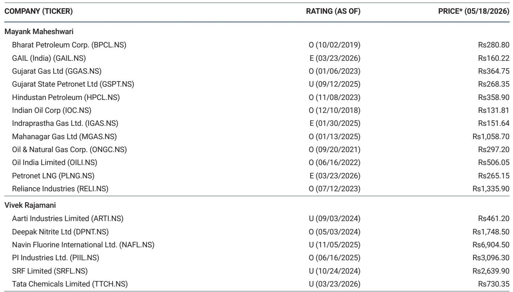
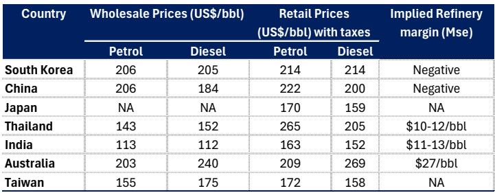

# 印度燃料涨价的真正信号：零售商的亏损修复才刚刚开始

当印度柴油和汽油价格在近期再次小幅上调90派萨/升时，市场习惯性地将其解读为一次寻常的行政调价。但这份来自某外资投行的研报揭示了一个更深的逻辑：这轮涨价不是终点，而是一系列结构性修复的起点。真正重要的不是单次调价的幅度，而是它背后隐含的定价机制回归、亏损收窄路径，以及哪些公司将在这一过程中获得超额收益。

报告的核心判断是：印度石油营销公司(OMCs)的运输燃料亏损已从此前的约15.5美元/桶收窄至9美元/桶，但更值得关注的是，液化石油气(LPG)的亏损仍高达每月10亿美元。这意味着，即便经历了累计约6.5美元/桶的涨价，零售商的利润修复仍处于早期阶段。而过去经验表明，OMCs在每日定价机制下有能力将涨价分散实施，对消费量的冲击有限。这为后续持续涨价提供了操作空间。

## 1. 这轮涨价不是一次性事件，而是亏损修复周期的开始

研报明确指出，此轮柴油和汽油累计涨价幅度相当于布伦特原油价格每桶82美元的水平。这个数字本身并不惊人，但结合运输燃料亏损从15.5美元/桶降至9美元/桶的变化，我们可以推导出一个关键判断：OMCs的盈亏平衡点远高于当前零售价格。

更值得关注的是，液化石油气的亏损问题被严重低估。每月10亿美元的亏损规模，意味着即便政府过去曾对这类受控产品进行补贴，当前的价格机制仍然无法覆盖成本。这不仅是OMCs的财务负担，更是一个政策定价与市场成本脱节的系统性风险。

从行业竞争格局看，亏损修复对不同公司的影响是非对称的。研报特别指出，印度斯坦石油公司(HPCL)是最大受益者，其次是巴拉特石油公司(BPCL)。这种排序并非随机，而是反映了各公司业务结构中运输燃料与LPG的占比差异。对于关注印度能源板块的投资者而言，理解这种差异化暴露程度，远比跟踪单次调价幅度更为重要。

## 2. 每日定价机制是涨价可持续性的关键保障

一个容易被忽视的细节是，研报强调了过去燃料涨价都是在每日定价机制下实施的。这意味着OMCs可以像调整零售价一样高频地、小幅度地传导成本压力，而不是等待政府的一次性行政命令。

这种机制的价值在于两点。其一，小幅多次的调价对终端消费者心理冲击较小，不易引发政治反弹或需求骤降。其二，它赋予OMCs更大的定价自主权，使其能够更灵活地应对国际油价波动。报告提到，过去经验显示这种模式对消费量的影响有限，这进一步降低了涨价对行业基本面的负面冲击。

对于市场参与者而言，这意味着OMCs的盈利修复窗口可能比预期更长。只要国际油价不出现剧烈上行，OMCs完全有能力在未来数周内继续实施类似的涨价操作，直至运输燃料亏损完全消除，甚至转向正利润。

## 3. 亚洲燃料定价图谱揭示印度OMCs的独特优势

研报中的亚洲燃料价格对比表提供了一个极具洞察力的横向视角。从批发价格看，印度的汽油和柴油分别仅为113美元/桶和112美元/桶，远低于韩国(206/205)、中国(206/184)和澳大利亚(203/240)。但加入税收后的零售价格，印度仍处于较低水平：汽油163美元/桶，柴油152美元/桶。

这组数据揭示了一个关键事实：印度的燃料定价体系并非单纯的市场化，而是税收与补贴交织下的产物。低批发价格意味着印度炼油企业的原油采购成本相对可控，但低零售价格则反映了终端定价的行政干预。这种结构性的价差，正是OMCs亏损的来源，也是未来盈利修复的潜在空间。

更重要的是，印度的炼油利润率(11-13美元/桶)在亚洲处于中等偏上水平，高于泰国(10-12美元/桶)，但远低于澳大利亚(27美元/桶)。这说明印度炼油环节本身具备一定的竞争力，问题主要集中在营销环节的定价扭曲。一旦定价机制回归市场化，OMCs的盈利能力将显著改善。

## 4. 报告尚未完全回答的关键问题：LPG亏损的最终解决方案是什么？

尽管研报对运输燃料的涨价路径给出了清晰的分析，但液化石油气亏损问题被一笔带过。报告仅提到“政府过去曾补偿这类亏损”，但未说明当前政府是否有意愿或能力继续承担每月10亿美元的补贴。

这是一个值得深入探讨的盲点。如果政府选择不再全额补偿，OMCs将面临两种选择：要么自行消化亏损，要么推动LPG零售价格上涨。前者将侵蚀公司利润，后者则可能引发社会问题。从政治经济学角度看，LPG涨价远比汽油柴油涨价敏感，因为它直接关系到中低收入家庭的生活成本。

这里仍需验证的是，政府是否会通过某种机制(如提高补贴预算、或允许OMCs交叉补贴)来缓解这一压力。研报没有给出明确答案，但这一不确定性恰恰是影响OMCs估值的关键变量。

## 5. 观察框架：关注的不只是涨价幅度，而是亏损修复的路径与节奏

对于产业决策者和投资者而言，与其盯着每次调价的新闻，不如建立一套更系统的观察框架。核心变量有三个：

第一，运输燃料亏损收窄的节奏。当前9美元/桶的亏损意味着还需多少轮涨价才能归零？以每次90派萨/升(约0.5美元/桶)的幅度计算，大约需要18次调价。如果按照每周一次的频率，这将在四个月内完成。

第二，LPG亏损的演变路径。每月10亿美元的亏损是否会促使政府调整定价机制？或者OMCs是否会通过其他业务线的利润来交叉补贴？这是判断行业整体盈利改善空间的关键。

第三，各公司的差异化暴露。HPCL、BPCL、印度石油公司(IOC)的运输燃料和LPG业务占比不同，这将导致它们在涨价周期中的受益程度出现显著分化。研报明确指出了HPCL是最大受益者，但未详细展开各公司的具体暴露敞口。

## 6. 一个尚未被市场充分定价的变量：涨价对消费量的二阶影响

研报提到过去涨价对消费量影响有限，但这并不意味着未来必然如此。印度正处于经济复苏期，能源需求弹性可能随着价格累积涨幅而发生变化。如果累计涨价幅度超过10-15%，是否会出现需求替代效应(如转向公共交通、电动车或替代燃料)？这是一个需要持续跟踪的二阶变量。

此外，国际油价的走势也至关重要。如果布伦特原油价格维持在80美元/桶以上，OMCs的采购成本压力将持续存在，那么涨价空间和节奏将受到上游成本与终端承受力的双重约束。

---

以上分析仅触及了这份研报核心判断的表层。关于各公司的具体暴露敞口、LPG亏损的可能解决方案、以及涨价对不同细分板块的估值影响，完整报告中提供了更详细的数据拆解和情景分析。如果你希望深入理解这些被压缩在一份短报告中的关键信号，欢迎来星球微信群里继续讨论。

Personal reading notes and learning share only. Not investment advice.

